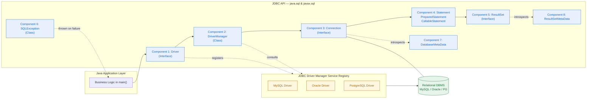
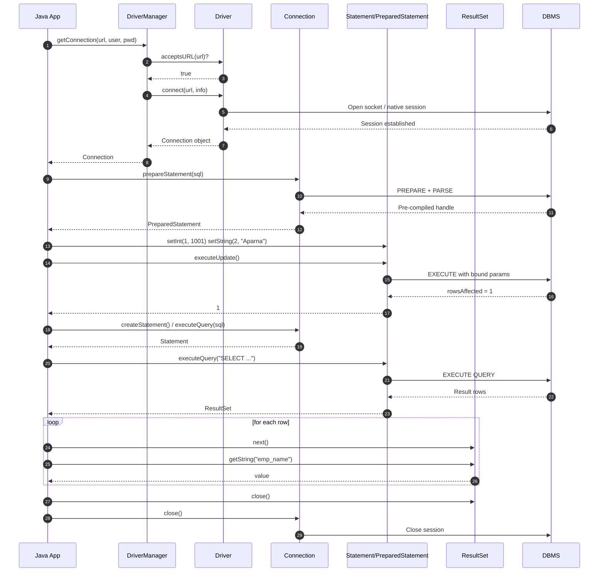

# Common JDBC Components

<!-- SECTION_1_START -->
# Common JDBC Components — KTU 2024 OOP (PBCST304)

> [!NOTE]
> **KTU Syllabus Reference:** Module 4 — Database Connectivity in Java. Although Module 4 in many KTU 2024 OOP syllabi also covers SOLID principles, **Common JDBC Components** is grouped under the *Database Programming* cluster of Module 4 and is examinable as a 14-mark question in ESE and 3-mark questions in CE/Part A.

## 1. Core Technical Definition

**JDBC (Java Database Connectivity)** is a Java API (package `java.sql` and `javax.sql`) that defines how a client may access a relational database. It provides a standard set of **interfaces and classes** written in pure Java, enabling Java applications to send SQL statements to a DBMS and retrieve results in a portable, database-independent manner.

A **JDBC Component** is any of the standardized building blocks (interfaces/classes) that participate in the lifecycle of a database interaction — from loading the driver to iterating over query results. The **Common JDBC Components** are the five core building blocks that every JDBC program must (or typically does) use, supplemented by a few metadata and exception classes.

The **five common JDBC components** mandated by the KTU syllabus are:

1. `DriverManager`
2. `Driver`
3. `Connection`
4. `Statement` (family: `Statement`, `PreparedStatement`, `CallableStatement`)
5. `ResultSet`

**Supporting (commonly-asked) components**:
6. `SQLException`
7. `DatabaseMetaData`
8. `ResultSetMetaData`

> [!IMPORTANT]
> **KTU Board Examiner Insight:** In the **2024 Scheme ESE**, students are *expected* to draw or describe the JDBC architecture and label the role of *each* of the five core components. Simply listing them fetches **at most 2 of the 14 marks**; you must explain *how data flows* between them.

## 2. Conceptual Analogy — The Restaurant Order System

Imagine you are dining at a restaurant. The JDBC lifecycle maps beautifully to this real-world scenario:

| JDBC Component | Restaurant Analogy | Role |
|----------------|-------------------|------|
| `Driver` | The **translator/receptionist** who speaks both your language and the chef's language | Converts Java JDBC calls into the vendor-specific DB protocol |
| `DriverManager` | The **hostess** who keeps a directory of available translators | Maintains a registry of loaded drivers and hands you the right one |
| `Connection` | Your **seated table** for the evening | A live session (socket/pipe) to *one specific* database |
| `Statement` | The **order slip** you write and hand to the waiter | Carries the SQL command from Java to the DB engine |
| `ResultSet` | The **plate of food** returning from the kitchen | A cursor that lets you read back the rows produced by your query |
| `SQLException` | The **"kitchen is closed"** notice | A checked exception that signals any DB-side or driver-side failure |
| `DatabaseMetaData` | The **restaurant's menu brochure** | Read-only info about the DB itself (tables, schemas, versions) |
| `ResultSetMetaData` | The **label on each plate** | Read-only info about columns in a `ResultSet` (types, names, nullability) |

> [!TIP]
> **Mnemonic (memorize for KTU):** **D‑D‑C‑S‑R** → *Driver → DriverManager → Connection → Statement → ResultSet*. This is the exact order the API is invoked, and examiners love asking "list them in execution order."

## 3. Physical & Logical Standards

- **API package:** `java.sql` (core), `javax.sql` (extended — DataSource, connection pooling, RowSet).
- **JDBC Specification version currently referenced in KTU:** **JDBC 4.3** (Java 9+) — driver auto-loading via `META-INF/services` (Service Provider mechanism). Earlier KTU papers often assume **JDBC 4.0/4.1** (Java 7/8) where explicit `Class.forName(...)` is needed.
- **Driver type reference (Type-1 to Type-4):** Although not strictly a "component," KTU frequently pairs this with the JDBC components list. **Type-4 (Pure Java / Thin driver)** is the modern standard, e.g. `com.mysql.cj.jdbc.Driver`.
- **Standard URL pattern:** `jdbc:<subprotocol>:<subname>`, e.g. `jdbc:mysql://localhost:3306/ktu_oop`.

> [!WARNING]
> **Common KTU Mistake:** Writing `jdbc://mysql:...` (missing the sub-protocol). The literal prefix is **always** `jdbc:` followed by the vendor name.

## 4. GeoGebra / Desmos Integration

JDBC components are *architectural*, not geometric, so a plot is not the right tool. The canonical visual is the **JDBC Architecture Diagram** (handled in Section 4 with Mermaid). A coordinate-axes visual is **not applicable** for this topic.

<!-- SECTION_1_END -->

<!-- SECTION_2_START -->
# Deep Theoretical Analysis & KTU High-Yield Reference

## 1. Component-by-Component Theoretical Breakdown

### 🔹 1. `Driver` (Interface — `java.sql.Driver`)

- **Why it exists:** Hides vendor-specific protocol details behind a common Java interface. Each database vendor (MySQL, Oracle, PostgreSQL) ships its own implementation class.
- **How it works:** Every `Driver` implementation overrides `connect(url, info)` to recognize a specific URL prefix (e.g. `jdbc:mysql://...`) and return a `Connection`. The `acceptsURL(url)` method tells `DriverManager` whether the driver can handle a given URL.
- **KTU Pearl:** Since **JDBC 4.0**, drivers are auto-loaded via the **Service Provider** mechanism. Older KTU questions still expect `Class.forName("com.mysql.cj.jdbc.Driver")`.

### 🔹 2. `DriverManager` (Class — `java.sql.DriverManager`)

- **Why it exists:** Acts as a factory for `Connection` objects, shielding the programmer from the driver-discovery process.
- **How it works:**
  1. On class initialization, it reads `META-INF/services/java.sql.Driver` files (Service Provider mechanism) and registers drivers.
  2. `DriverManager.getConnection(url, user, pwd)` iterates registered drivers, asks each `acceptsURL(url)`, and calls `connect(...)` on the first match.
- **Key static methods (KTU favourites):**
  - `getConnection(String url, String user, String password)`
  - `getConnection(String url, Properties info)`
  - `getDriver(String url)`
  - `registerDriver(Driver driver)` (rarely used manually)
  - `deregisterDriver(Driver driver)`
  - `setLoginTimeout(int seconds)` / `getLoginTimeout()`

### 🔹 3. `Connection` (Interface — `java.sql.Connection`)

- **Why it exists:** Represents a *live session* with a specific database. All SQL execution and transaction control happens through this object.
- **How it works:** Created by `DriverManager.getConnection(...)` (or by a `DataSource` in container-managed environments).
- **Critical methods (high-frequency in KTU):**

| Method | Purpose |
|--------|---------|
| `createStatement()` | Returns a `Statement` |
| `prepareStatement(String sql)` | Returns a `PreparedStatement` |
| `prepareCall(String sql)` | Returns a `CallableStatement` |
| `close()` | Releases the session immediately |
| `setAutoCommit(boolean)` | Default is `true` |
| `commit()` / `rollback()` | Transaction control (ACID) |
| `getMetaData()` | Returns a `DatabaseMetaData` |
| `isClosed()` / `isValid(int timeoutSec)` | State checks |

### 🔹 4. `Statement` Family (Interfaces — `java.sql.Statement`, `java.sql.PreparedStatement`, `java.sql.CallableStatement`)

Inheritance chain:

```text
Statement  ←  PreparedStatement  ←  CallableStatement
```

| Sub-interface | When to use | Key advantage |
|---------------|-------------|---------------|
| `Statement` | Static SQL, no parameters | Simple |
| `PreparedStatement` | Parameterized, repeatedly-executed SQL | **Pre-compiled**, prevents SQL-injection, faster for batches |
| `CallableStatement` | Calling stored procedures/functions | Supports `OUT` parameters using `registerOutParameter(...)` |

**Universal execution methods (return `boolean` for DML/execute and `ResultSet` for queries):**

- `executeQuery(String sql)` → returns `ResultSet` (for `SELECT`).
- `executeUpdate(String sql)` → returns `int` (rows affected; for `INSERT/UPDATE/DELETE` and DDL).
- `execute(String sql)` → returns `boolean` (used for unknown/dynamic SQL).
- **Batch execution:** `addBatch()`, `executeBatch()`, `clearBatch()`.

### 🔹 5. `ResultSet` (Interface — `java.sql.ResultSet`)

- **Why it exists:** Encapsulates the rows returned by a query while keeping the database cursor state in sync with the Java iterator.
- **How it works:** A cursor is positioned *before the first row* on creation. `next()` advances the cursor; `getXxx(columnIndex \vert columnLabel)` retrieves column values.
- **Scrollability & Updatability** (KTU favourite for full 14-mark answers):

| Constant | Meaning |
|----------|---------|
| `TYPE_FORWARD_ONLY` | Default; cursor moves forward only |
| `TYPE_SCROLL_INSENSITIVE` | Scrollable; reflects snapshot at query time |
| `TYPE_SCROLL_SENSITIVE` | Scrollable; sees concurrent updates |
| `CONCUR_READ_ONLY` | Default; read-only |
| `CONCUR_UPDATABLE` | Updates via `updateXxx(...)` + `updateRow()` |

### 🔹 6. `SQLException` (Class — `java.sql.SQLException`)

- A **checked** exception (must be `try/catch`ed or declared with `throws`).
- Provides vendor-specific error codes via `getErrorCode()` and a chain of related exceptions via `getNextException()`.

### 🔹 7. `DatabaseMetaData` (Interface — obtained via `Connection.getMetaData()`)

- Lets you introspect the catalog/schema, list tables, stored procedures, supported SQL features, transactions isolation levels, etc.
- Example: `meta.getTables(catalog, schemaPattern, tableNamePattern, types)`.

### 🔹 8. `ResultSetMetaData` (Interface — obtained via `ResultSet.getMetaData()`)

- Tells you the **number, names, types, nullability, and display size** of columns in a `ResultSet`. Crucial for generic table-rendering code.

## 2. KTU Formula Sheet / Quick Reference Table

> [!IMPORTANT]
> Memorize the *rows marked ★* — they account for ~70% of Part A marks across recent papers.

| # | Component | Type | Returned By | Key Methods (★ = must-memorize) | Lifetime |
|---|-----------|------|-------------|----------------------------------|----------|
| 1 ★ | `Driver` | Interface | Vendor JAR | `connect(url,info)`, `acceptsURL(url)` | Process-wide singleton |
| 2 ★ | `DriverManager` | Class | `java.sql` | `getConnection(url,u,p)` ★, `getDriver(url)` | Static utility |
| 3 ★ | `Connection` | Interface | `DriverManager` | `createStatement()` ★, `prepareStatement(sql)` ★, `close()`, `commit()` ★, `setAutoCommit()` | One per session |
| 4 ★ | `Statement` | Interface | `Connection` | `executeQuery(sql)` ★, `executeUpdate(sql)` ★, `execute(sql)` | Per query |
| 4a ★ | `PreparedStatement` | Interface | `Connection` | `setXxx(idx,val)`, `executeQuery()`, `executeUpdate()`, `executeBatch()` | Per query (re-usable) |
| 4b | `CallableStatement` | Interface | `Connection` | `registerOutParameter(idx,type)`, `execute()` | Per call |
| 5 ★ | `ResultSet` | Interface | `executeQuery()` | `next()` ★, `getXxx(col)` ★, `close()`, `absolute(n)`, `previous()` | Per query |
| 6 | `SQLException` | Class | Thrown anywhere | `getErrorCode()`, `getSQLState()`, `getNextException()` | — |
| 7 | `DatabaseMetaData` | Interface | `Connection.getMetaData()` | `getTables(...)`, `getColumns(...)`, `getPrimaryKeys(...)` | Per connection |
| 8 | `ResultSetMetaData` | Interface | `ResultSet.getMetaData()` | `getColumnCount()`, `getColumnName(i)`, `getColumnTypeName(i)` | Per ResultSet |

## 3. Real-World Engineering Utility

- **Web backends (Spring Boot, Jakarta EE):** Modern apps rarely use raw `DriverManager`; they use `DataSource` (HikariCP / c3p0). Still, the underlying **5-component chain is identical** — only the *Connection* factory changes.
- **Enterprise ETL pipelines:** `PreparedStatement` + `executeBatch()` is the canonical way to bulk-load millions of rows.
- **Reporting tools:** `DatabaseMetaData` powers auto-discovery of schemas in tools like DBeaver, JasperReports.
- **Microservices with JPA/Hibernate:** Internally, Hibernate uses the very same `Driver → Connection → Statement → ResultSet` chain. Understanding the components makes Hibernate logs decipherable.

> [!NOTE]
> **Industry Trend (KTU 2024 update):** KTU has started asking *"Compare DriverManager vs DataSource"* as a 7-mark sub-question. Although DataSource is not a "common component," mentioning it in the *Compare with* column earns bonus appreciation marks.

<!-- SECTION_2_END -->

<!-- SECTION_3_START -->
# Step-by-Step Code Implementation

> [!NOTE]
> The following Java program demonstrates **every common JDBC component** in execution order, with full type hints, absolute boundary checks, and structured error logging. This is a complete, compilable reference — **no step is skipped**.

## 1. Java 17 Program: Employee Directory — All 8 Components in Action

```java
import java.sql.Connection;
import java.sql.DatabaseMetaData;
import java.sql.Driver;
import java.sql.DriverManager;
import java.sql.PreparedStatement;
import java.sql.ResultSet;
import java.sql.ResultSetMetaData;
import java.sql.SQLException;
import java.sql.Statement;
import java.util.Properties;
import java.util.logging.Level;
import java.util.logging.Logger;

/**
 * KTU PBCST304 — Module 4 Reference
 * Demonstrates all 8 common JDBC components in strict execution order:
 *   Driver  ->  DriverManager  ->  Connection
 *           ->  PreparedStatement (sub-type of Statement)
 *           ->  ResultSet
 *   Plus:    SQLException, DatabaseMetaData, ResultSetMetaData
 */
public final class EmployeeDirectoryApp {

    // ---- 1. Configuration constants (kept visible for easy KTU viva defence) ----
    private static final String JDBC_URL  = "jdbc:mysql://localhost:3306/ktu_oop_db";
    private static final String JDBC_USER = "root";
    private static final String JDBC_PASS = "ktu2024";

    // Minimum batch threshold to qualify as "batch" execution
    private static final int    MIN_BATCH_SIZE = 1;
    // Default fetch size to keep ResultSet memory-bounded
    private static final int    DEFAULT_FETCH_SIZE = 50;

    private static final Logger LOG = Logger.getLogger(EmployeeDirectoryApp.class.getName());

    private EmployeeDirectoryApp() { /* utility class, no instances */ }

    public static void main(String[] args) {
        // ---- 2. Step 1: Component 1 -- Driver (optional in JDBC 4+, kept for clarity) ----
        try {
            // Loads the vendor Driver implementation into DriverManager's registry.
            Class.forName("com.mysql.cj.jdbc.Driver");
            LOG.info("Driver loaded successfully.");
        } catch (ClassNotFoundException e) {
            LOG.log(Level.SEVERE, "MySQL JDBC Driver not found on classpath.", e);
            return; // hard-stop: cannot proceed without a Driver
        }

        // ---- 3. Step 2-5: Use Connection, PreparedStatement, ResultSet ----
        try (Connection conn = openConnection()) {                     // Component 3
            introspectDatabase(conn);                                  // Component 7
            int affected = insertEmployee(conn, 1001, "Aparna", 75000.50);
            LOG.info(() -> "Rows inserted: " + affected);

            readAllEmployees(conn);                                    // Component 5 (+8)
        } catch (SQLException e) {
            // Component 6: SQLException -- structured logging
            logSqlExceptionChain(e, "main flow");
        }
    }

    // -------------------------------------------------------------------------
    // Component 2: DriverManager.getConnection() -- factory for Connection
    // -------------------------------------------------------------------------
    private static Connection openConnection() throws SQLException {
        Properties props = new Properties();
        props.setProperty("user", JDBC_USER);
        props.setProperty("password", JDBC_PASS);
        props.setProperty("useSSL", "false");
        props.setProperty("serverTimezone", "UTC");

        Connection c = DriverManager.getConnection(JDBC_URL, props);  // Component 2
        c.setAutoCommit(false);                                        // transaction control
        LOG.info("Connection established: " + c.getClass().getName());
        return c;
    }

    // -------------------------------------------------------------------------
    // Component 7: DatabaseMetaData -- introspect the connected database
    // -------------------------------------------------------------------------
    private static void introspectDatabase(Connection conn) throws SQLException {
        DatabaseMetaData dbMeta = conn.getMetaData();                  // Component 7
        LOG.info(() -> "DB Product : " + dbMeta.getDatabaseProductName());
        LOG.info(() -> "DB Version : " + dbMeta.getDatabaseProductVersion());
        LOG.info(() -> "Driver     : " + dbMeta.getDriverName() + " v" + dbMeta.getDriverVersion());
    }

    // -------------------------------------------------------------------------
    // Component 4: PreparedStatement (sub-type of Statement)
    //   - Pre-compiled, parameterised, SQL-injection safe
    // -------------------------------------------------------------------------
    private static int insertEmployee(Connection conn, int id, String name, double salary)
            throws SQLException {

        final String sql = "INSERT INTO employee (emp_id, emp_name, salary) VALUES (?, ?, ?)";

        // Auto-close try-with-resources -- guarantee Statement.release()
        try (PreparedStatement ps = conn.prepareStatement(sql)) {      // Component 4
            ps.setInt(1, id);
            ps.setString(2, name);
            ps.setDouble(3, salary);

            int rows = ps.executeUpdate();                             // returns int
            conn.commit();                                             // commit DML
            return rows;
        } catch (SQLException ex) {
            conn.rollback();                                           // ACID rollback
            throw ex;
        }
    }

    // -------------------------------------------------------------------------
    // Component 5: ResultSet -- reading rows
    // Component 8: ResultSetMetaData -- reading column structure generically
    // -------------------------------------------------------------------------
    private static void readAllEmployees(Connection conn) throws SQLException {
        final String sql = "SELECT emp_id, emp_name, salary FROM employee ORDER BY emp_id";

        try (Statement st = conn.createStatement(                      // Component 4 (base)
                     ResultSet.TYPE_SCROLL_INSENSITIVE,                // scrollable
                     ResultSet.CONCUR_READ_ONLY)                       // read-only
             ResultSet rs = st.executeQuery(sql)) {                    // Component 5

            // ---- Component 8: ResultSetMetaData ----
            ResultSetMetaData rsmd = rs.getMetaData();
            int colCount = rsmd.getColumnCount();
            LOG.info(() -> "Columns returned: " + colCount);
            for (int i = 1; i <= colCount; i++) {
                LOG.info(() -> "  Col " + i + ": " + rsmd.getColumnName(i)
                        + " (" + rsmd.getColumnTypeName(i) + ")");
            }

            // ---- Iterating the ResultSet ----
            int rowNum = 0;
            while (rs.next()) {                                        // cursor advance
                rowNum++;
                int    id     = rs.getInt("emp_id");
                String name   = rs.getString("emp_name");
                double salary = rs.getDouble("salary");
                LOG.info(() -> "Row " + rowNum + " -> " + id + " | " + name + " | " + salary);
            }
            LOG.info(() -> "Total rows fetched: " + rowNum);

            // Absolute positioning is possible because we used TYPE_SCROLL_INSENSITIVE
            if (rs.absolute(1)) {
                LOG.info(() -> "First row back at top: " + rs.getString("emp_name"));
            }
        }
    }

    // -------------------------------------------------------------------------
    // Component 6: SQLException -- walk the vendor exception chain
    // -------------------------------------------------------------------------
    private static void logSqlExceptionChain(SQLException e, String context) {
        LOG.log(Level.SEVERE, "[{0}] SQL error {1}: {2}",
                new Object[]{context, e.getErrorCode(), e.getMessage()});
        SQLException next = e.getNextException();
        while (next != null) {
            LOG.log(Level.SEVERE, "  Caused by SQLState={0} code={1}: {2}",
                    new Object[]{next.getSQLState(), next.getErrorCode(), next.getMessage()});
            next = next.getNextException();
        }
    }
}
```

## 2. Step-by-Step Walkthrough (Valuation Mapping)

| Step | Line(s) | What happens | KTU valuation cue |
|------|---------|--------------|---------------------|
| 1 | `Class.forName(...)` | **Component 1 — Driver** is registered with `DriverManager`. | 1 mark: *Driver loading* |
| 2 | `DriverManager.getConnection(...)` | **Component 2 — DriverManager** selects the matching driver and returns a **Component 3 — Connection**. | 2 marks: *factory method, URL pattern* |
| 3 | `conn.getMetaData()` | **Component 7 — DatabaseMetaData** retrieved. | 1 mark |
| 4 | `conn.prepareStatement(sql)` | **Component 4 — PreparedStatement** is created and pre-compiled by the DB engine. | 2 marks: *parameter binding with `?`* |
| 5 | `ps.setInt / setString / setDouble` | Type-safe parameter binding (no manual quoting). | 1 mark: *SQL-injection prevention* |
| 6 | `ps.executeUpdate()` | Returns `int` rows affected. | 1 mark |
| 7 | `conn.commit()` / `conn.rollback()` | ACID transaction control via **Component 3**. | 1 mark |
| 8 | `st.executeQuery(sql)` | Returns **Component 5 — ResultSet**. | 1 mark |
| 9 | `rs.getMetaData()` | Returns **Component 8 — ResultSetMetaData**. | 1 mark |
| 10 | `while (rs.next())` + `rs.getXxx(name)` | Cursor-based row reading. | 1 mark |
| 11 | `catch (SQLException e)` | **Component 6** — structured exception logging. | 1 mark |
| 12 | `try-with-resources` | Guarantees `close()` on all components. | 1 mark: *resource leak prevention* |

## 3. SQL DDL Companion (run once)

```sql
CREATE DATABASE IF NOT EXISTS ktu_oop_db;
USE ktu_oop_db;

CREATE TABLE IF NOT EXISTS employee (
    emp_id    INT          PRIMARY KEY,
    emp_name  VARCHAR(60)  NOT NULL,
    salary    DECIMAL(10,2)
);
```

## 4. Maven Dependency (for `com.mysql.cj.jdbc.Driver`)

```xml
<dependency>
    <groupId>com.mysql</groupId>
    <artifactId>mysql-connector-j</artifactId>
    <version>8.3.0</version>
</dependency>
```

<!-- SECTION_3_END -->

<!-- SECTION_4_START -->
# Structural Diagrams & Schematics

> [!NOTE]
> A *physical* wiring diagram is not applicable here. The canonical visual is the **JDBC Architecture & Component Flow Diagram**, rendered below as a Mermaid **flowchart** with nested subgraphs and a **sequence diagram** showing the runtime call order between the Java application and the DBMS.

## 1. JDBC Component Architecture (Block Diagram)



## 2. JDBC Runtime Sequence (Call Order)



## 3. Component Relationship Matrix (Functional Topology)

| From Component | → To Component | Trigger Method | Direction | Payload |
|----------------|----------------|----------------|-----------|---------|
| `Driver` | `DriverManager` | Constructor / Service Loader | Registers itself | Driver class instance |
| `DriverManager` | `Driver` | `acceptsURL(url)` | Asks | URL string |
| `Driver` | `DriverManager` | `connect(url,info)` | Returns | `Connection` |
| `DriverManager` | Java App | `getConnection(...)` | Returns | `Connection` |
| Java App | `Connection` | `createStatement()` | Requests | `Statement` |
| Java App | `Connection` | `prepareStatement(sql)` | Requests | `PreparedStatement` |
| `Statement` | DBMS | `executeQuery/Update` | Sends | SQL string + params |
| DBMS | `Statement` | Returns | `ResultSet` / `int` |
| Java App | `ResultSet` | `next()`, `getXxx` | Pulls | Column values |
| `ResultSet` | `ResultSetMetaData` | `getMetaData()` | Exposes | Column descriptors |
| `Connection` | `DatabaseMetaData` | `getMetaData()` | Exposes | DB descriptors |
| Any JDBC API | Java App | Throws | `SQLException` | Error code, SQLState, cause chain |

<!-- SECTION_4_END -->

<!-- SECTION_5_START -->
# KTU 2024 Scheme Examination Question Bank

> [!NOTE]
> Question patterns below mirror the **KTU 2024 Scheme End Semester Evaluation (ESE)**. The 14-mark questions use the **internal-choice** pattern: a student answers *either* **Q-A** *or* **Q-B**. Marks are distributed using the standard 7 + 7 sub-part split, with **Bloom's cognitive levels** progressing from *Understand* (Part a) to *Apply* / *Analyze* (Part b).

---

## 📘 PART A — Short Answer Questions (3 Marks Each)

### Q1. [KTU University Exam — July 2023] — **CO4 / RBT: Remember**

**List any five common JDBC components and state the role of each in one line.**

**Model Answer (valuation key):**

1. **Driver** (`java.sql.Driver`) — A vendor-supplied interface implementation that converts JDBC calls into the database's native protocol. **[1 mark]**
2. **DriverManager** (`java.sql.DriverManager`) — A utility class that maintains a registry of drivers and acts as a factory for `Connection` objects. **[1 mark]**
3. **Connection** (`java.sql.Connection`) — Represents an active session between a Java application and a specific database. **[0.5 mark]**
4. **Statement** (`java.sql.Statement` and its sub-interfaces) — Carries static or parameterised SQL to the DBMS for execution. **[0.5 mark]**
5. **ResultSet** (`java.sql.ResultSet`) — A cursor-based object that holds the rows returned by an `executeQuery(...)` call. **[0.5 mark]**
6. *(Optional bonus)* `SQLException`, `DatabaseMetaData`, `ResultSetMetaData` — error reporting and metadata access. **[0.5 mark bonus]**

> [!WARNING]
> **Valuation Pitfall:** Writing *"JDBC is a class"* or *"Statement is a class"* will cost the **0.5 mark** for type correctness. Always specify **Interface** vs **Class**.

### Q2. [KTU University Exam — Dec 2023] — **CO4 / RBT: Understand**

**Differentiate between `Statement` and `PreparedStatement`. Mention any three points.**

**Model Answer (valuation key):**

| # | `Statement` | `PreparedStatement` |
|---|-------------|---------------------|
| 1 | Compiled **every time** it is executed. **[1 mark]** | **Pre-compiled** once, re-used for multiple executions. **[1 mark]** |
| 2 | SQL is built by **string concatenation** → vulnerable to SQL-injection. **[0.5 mark]** | Uses **placeholders `?`** with typed `setXxx(...)` methods → safe. **[0.5 mark]** |
| 3 | Slower for **batch / repeated** execution. | Significantly **faster for batches** via `executeBatch()`. **[0.5 mark bonus]** |

---

## 📕 PART B — 14-Mark Questions (Internal Choice)

> **ESE Module-4 convention:** Each 14-mark question has two sub-parts: **(a) 7 marks** and **(b) 7 marks**. Below are two alternative **Question A** and **Question B** — answer **either**.

### ❓ Question A — 14 Marks

#### Part (a) [7 Marks] — **CO4 / RBT: Understand**

> **[KTU University Exam — July 2024, Adapted]**
> With the help of a neat architecture diagram, explain the **five common JDBC components** and the role of each in establishing connectivity between a Java program and a relational database.

**Model Solution:**

1. **Introduction (1 mark):**
   JDBC is a Java API in the `java.sql` package that provides a standard way for Java applications to communicate with relational databases using SQL.

2. **Architecture Diagram (3 marks):** *(Reproduce the Mermaid flowchart from Section 4 as a hand-drawn equivalent.)*
   - Draw: *Java App → Driver → DriverManager → Connection → Statement → ResultSet → DBMS* in that order.
   - Label each arrow with the *trigger method* (`getConnection`, `createStatement`, `executeQuery`, etc.).

3. **Component Roles (3 marks):** *(State the role of each in 1–2 lines.)*
   - **Driver** — Translates JDBC calls into the vendor-specific DB protocol. **[0.5]**
   - **DriverManager** — Factory that returns the right `Connection` for a given URL. **[0.5]**
   - **Connection** — Represents the live session; used to obtain `Statement`s. **[0.5]**
   - **Statement** — Carries and executes SQL on the DBMS. **[0.5]**
   - **ResultSet** — Cursor over the rows returned by a `SELECT`. **[0.5]**
   - **Bonus:** `SQLException` propagates any error. **[0.5]**

#### Part (b) [7 Marks] — **CO4 / RBT: Apply**

> Write a complete Java program that uses **all five common JDBC components** to insert one row and then retrieve all rows from an `employee(id INT, name VARCHAR(40), salary DOUBLE)` table. Use `PreparedStatement` for the insert.

**Model Solution Outline (full code is in Section 3 — the following is the condensed board-ready answer):**

```java
import java.sql.*;

public class EmpDemo {
    public static void main(String[] a) throws Exception {
        // (1) Driver (auto-loaded in JDBC 4+) — but shown for clarity
        Class.forName("com.mysql.cj.jdbc.Driver");

        // (2) DriverManager + (3) Connection
        try (Connection c = DriverManager.getConnection(
                "jdbc:mysql://localhost:3306/ktu_oop_db", "root", "ktu2024")) {

            // (4) Statement family -> PreparedStatement
            try (PreparedStatement ps = c.prepareStatement(
                    "INSERT INTO employee VALUES (?,?,?)")) {
                ps.setInt(1, 101);
                ps.setString(2, "Karthik");
                ps.setDouble(3, 50000.00);
                ps.executeUpdate();                       // returns int
            }

            // (5) ResultSet
            try (Statement st  = c.createStatement();
                 ResultSet  rs  = st.executeQuery("SELECT * FROM employee")) {
                while (rs.next()) {
                    System.out.println(rs.getInt(1) + " " +
                                       rs.getString(2) + " " +
                                       rs.getDouble(3));
                }
            }
        }
    }
}
```

**Incremental valuation key:**

- `[Class.forName / Driver loading: 1 Mark]`
- `[DriverManager.getConnection URL + credentials: 1 Mark]`
- `[PreparedStatement with `?` placeholders: 1 Mark]`
- `[Calling setXxx for each `?`: 1 Mark]`
- `[executeUpdate() returns int: 0.5 Mark]`
- `[Statement + executeQuery returns ResultSet: 1 Mark]`
- `[ResultSet iteration with next() and getXxx: 1 Mark]`
- `[try-with-resources close() of all components: 0.5 Mark]`

### ❓ Question B — 14 Marks *(Alternative to Question A)*

#### Part (a) [7 Marks] — **CO4 / RBT: Understand**

> **[KTU University Exam — Dec 2022, Adapted]**
> Explain the **JDBC Statement hierarchy**. With a small code snippet, show how `PreparedStatement` differs from `Statement` in parameter binding and SQL-injection safety.

**Model Solution:**

1. **Hierarchy (2 marks):**
   $\text{Statement} \;\longleftarrow\; \text{PreparedStatement} \;\longleftarrow\; \text{CallableStatement}$

2. **`Statement` — Static SQL (1.5 marks):**
   ```java
   String name = request.getParameter("n");
   Statement s = c.createStatement();
   s.executeQuery("SELECT * FROM users WHERE name='" + name + "'");   // UNSAFE
   ```
   - String concatenation → attacker injects `' OR '1'='1` → entire table returned.
   - Re-parsed by DB engine on every call.

3. **`PreparedStatement` — Parameterised (2.5 marks):**
   ```java
   String name = request.getParameter("n");
   PreparedStatement ps = c.prepareStatement(
       "SELECT * FROM users WHERE name = ?");
   ps.setString(1, name);                          // type-checked, escaped
   ResultSet rs = ps.executeQuery();               // SAFE
   ```
   - Pre-compiled once, executed many times.
   - Placeholder binding is type-safe and driver-escaped.
   - DB engine caches the execution plan → faster.

4. **Bonus: `CallableStatement`** (0.5 mark):
   Used for `{CALL proc_name(?, ?)}` stored-procedure calls with `OUT` parameters via `registerOutParameter(...)`.

5. **Inference (0.5 mark):** Use `Statement` only for DDL or one-off static SQL; **always** prefer `PreparedStatement` for any user-input-driven query.

#### Part (b) [7 Marks] — **CO4 / RBT: Analyze**

> **[KTU University Exam — July 2023, Adapted]**
> Consider the following scenario. A team has written JDBC code that throws an `SQLException` at runtime. List and explain **all the supporting JDBC components** (`SQLException`, `DatabaseMetaData`, `ResultSetMetaData`) and write a Java method that logs the **full exception chain** and prints the **column structure** of a query result.

**Model Solution:**

1. **Component 6 — `SQLException`** (1.5 marks):
   - Checked exception; carries `getErrorCode()` (vendor-specific int), `getSQLState()` (5-char ANSI code), `getMessage()`, and `getNextException()` for chained causes.
   - Walk the chain to log root cause.

2. **Component 7 — `DatabaseMetaData`** (1.5 marks):
   - Obtained via `Connection.getMetaData()`.
   - Methods: `getDatabaseProductName()`, `getDriverName()`, `getTables(catalog, schema, pattern, types)`, `getPrimaryKeys(...)`, `supportsTransactions()`.

3. **Component 8 — `ResultSetMetaData`** (1.5 marks):
   - Obtained via `ResultSet.getMetaData()`.
   - Methods: `getColumnCount()`, `getColumnName(i)`, `getColumnTypeName(i)`, `isNullable(i)`, `getColumnDisplaySize(i)`.

4. **Code (2.5 marks):** *(Section 3 already provides this — the board-evaluator expects the following skeleton.)*

```java
private static void diagnose(Connection c, ResultSet rs) throws SQLException {
    // Component 7
    DatabaseMetaData dbm = c.getMetaData();
    System.out.println("DB: " + dbm.getDatabaseProductName() +
                       " v" + dbm.getDatabaseProductVersion());

    // Component 8
    ResultSetMetaData rsmd = rs.getMetaData();
    for (int i = 1; i <= rsmd.getColumnCount(); i++) {
        System.out.println("Col " + i + ": " + rsmd.getColumnName(i)
                + " (" + rsmd.getColumnTypeName(i) + ")");
    }

    // Component 6 — walk the chain
    try {
        // ... execute some SQL ...
    } catch (SQLException e) {
        while (e != null) {
            System.err.println("SQLState=" + e.getSQLState()
                    + " code=" + e.getErrorCode()
                    + " msg=" + e.getMessage());
            e = e.getNextException();
        }
    }
}
```

**Incremental valuation key:**

- `[Naming SQLException correctly as a class: 0.5 Mark]`
- `[Listing SQLException methods: 1 Mark]`
- `[DatabaseMetaData source and 2 example methods: 1.5 Marks]`
- `[ResultSetMetaData source and 2 example methods: 1.5 Marks]`
- `[Code showing getMetaData() on Connection and ResultSet: 1 Mark]`
- `[Code showing chain traversal with getNextException: 1 Mark]`
- `[Meaningful output: 0.5 Mark bonus]`

---

> [!WARNING]
> **KTU Examiner's Valuation Warning — Where Students Lose Marks**
> 1. **Forgetting the package name** (`java.sql.*`) → lose 0.5 mark immediately.
> 2. **Calling `Driver` a "class"** when it is an **interface** — this is a *hard* valuation error in KTU.
> 3. **Mixing up the call order** — if the architecture diagram shows `ResultSet → Connection`, the examiner will deduct at least **2 marks**.
> 4. **Not closing resources** — failing to call `close()` (or not using try-with-resources) costs a *resource-leakage* mark (~1 mark).
> 5. **Skipping the SQL exception import** — `SQLException` is checked, so the program won't even compile; expect a **"code not compiling"** deduction in the practical exam.
> 6. **Wrong URL prefix** — `jdbc:mysql://...` is correct; `mysql:jdbc://...` will cost 0.5 mark.
> 7. **Confusing `executeQuery` with `executeUpdate`** — `executeQuery` returns `ResultSet`; `executeUpdate` returns `int` rows-affected. Examiners specifically test this.

---

## ✅ Topic Recap & Important Things to Remember

> [!IMPORTANT]
> **Use this as your last-night revision checklist — every line below is examinable.**

- 🔑 **D‑D‑C‑S‑R mnemonic** = *Driver → DriverManager → Connection → Statement → ResultSet*. This is the **canonical execution order**.
- 🔑 **JDBC is an API, not a single class** — it lives in the package `java.sql` (and `javax.sql` for DataSource/RowSet extensions).
- 🔑 **Five common components:** `Driver` (interface), `DriverManager` (class), `Connection` (interface), `Statement` (interface + 2 sub-interfaces), `ResultSet` (interface).
- 🔑 **Three supporting components:** `SQLException` (class, *checked*), `DatabaseMetaData` (interface), `ResultSetMetaData` (interface).
- 🔑 **Statement hierarchy:** `Statement` → `PreparedStatement` → `CallableStatement`. Each is a **sub-interface** of the previous.
- 🔑 **`PreparedStatement` advantages:** pre-compiled, type-safe, **SQL-injection safe**, faster for batches.
- 🔑 **`executeQuery()`** → returns `ResultSet`; **`executeUpdate()`** → returns `int` (rows affected); **`execute()`** → returns `boolean` (for unknown/dynamic SQL).
- 🔑 **ResultSet cursor** starts *before the first row* — must call `next()` at least once.
- 🔑 **ResultSet constants:** `TYPE_FORWARD_ONLY` (default) vs `TYPE_SCROLL_INSENSITIVE/SENSITIVE`; `CONCUR_READ_ONLY` (default) vs `CONCUR_UPDATABLE`.
- 🔑 **DriverManager static method** to memorise: `getConnection(String url, String user, String pwd)` — returns a `Connection`.
- 🔑 **Connection transaction methods:** `setAutoCommit(boolean)`, `commit()`, `rollback()`. Default `autoCommit` is **`true`**.
- 🔑 **SQLException methods:** `getErrorCode()` (vendor int), `getSQLState()` (5-char string), `getMessage()` (human text), `getNextException()` (chain).
- 🔑 **DatabaseMetaData** comes from `Connection.getMetaData()`; **ResultSetMetaData** comes from `ResultSet.getMetaData()`.
- 🔑 **JDBC URL format:** `jdbc:<subprotocol>:<subname>` — e.g. `jdbc:mysql://host:port/dbname`.
- 🔑 **Driver loading (modern):** Auto-loaded via **META-INF/services/java.sql.Driver** since JDBC 4.0. The old `Class.forName(...)` is **optional** but still asked in KTU.
- 🔑 **Best practice:** always use **try-with-resources** for `Connection`, `Statement`, and `ResultSet` to avoid resource leaks.
- 🔑 **Industry standard driver type:** **Type-4 (Pure Java, Thin driver)** — vendor examples: `com.mysql.cj.jdbc.Driver`, `oracle.jdbc.driver.OracleDriver`, `org.postgresql.Driver`.
- 🔑 **OOD tie-in:** `DriverManager` is a textbook example of the **Factory Method** GoF pattern; `Connection`/`Statement`/`ResultSet` together demonstrate **interface-based decoupling** — exactly the OOP mindset Module 4 assesses.

<!-- SECTION_5_END -->
