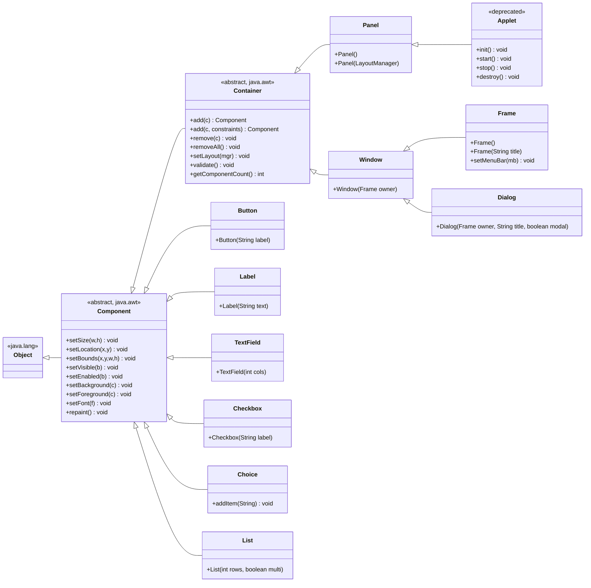
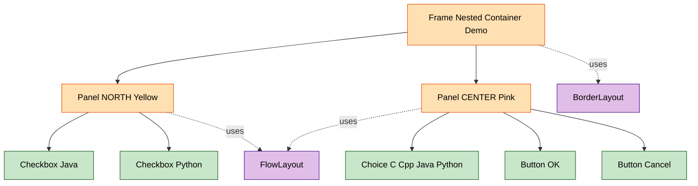
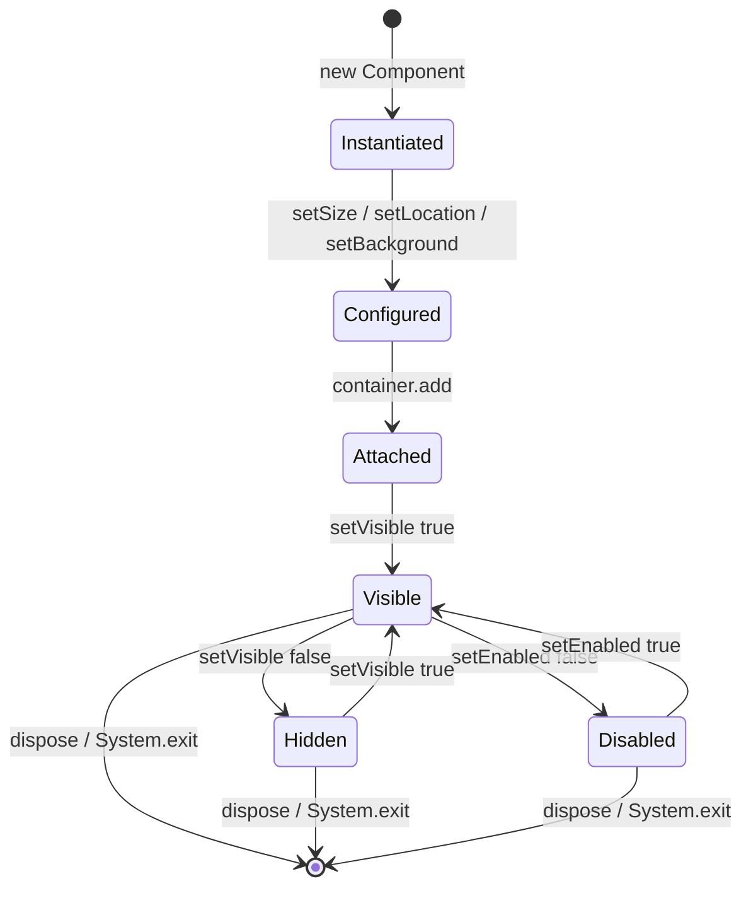

# Components and Containers

<!-- SECTION_1_START -->
# Module 4: Components and Containers in Java AWT

## 1. Core Technical Definition & Intuitive Overview

### 1.1 Formal Academic Definition (KTU 2024 Syllabus)

> [!IMPORTANT]
> **AWT (Abstract Window Toolkit)** is the original platform-dependent windowing, graphics, and user-interface widget toolkit of Java, contained in the `java.awt` package. It provides API classes for building GUI components.

A **Component** in Java AWT is an *abstract base class* (`java.awt.Component`) representing any object that can be displayed on the screen and can interact with the user. A **Container** is a *specialized component* (`java.awt.Container`) that can hold and organize other components, including other containers.

$$
\text{Container} \;\subseteq\; \text{Component} \quad \text{(inheritance relationship)}
$$

A component is a *visual atom*; a container is a *visual molecule* that can contain atoms. A container can also contain other containers, enabling a hierarchical (tree) layout of UI elements.

### 1.2 Conceptual Analogy / Intuition

> [!NOTE]
> **Real-World Analogy: A Picture Frame on a Wall**
>
> Think of a **Container** as a *picture frame* mounted on a wall. The frame itself is a visible object (it is a Component too), but its primary job is to *hold* other things. Inside the frame, you might place a photograph (Button), a label, or even a smaller frame holding another photo (nested container).
>
> - The **Frame** (in Java terms) is the outer wooden wall-frame — it has a title, border, and menu bar.
> - The **Panel** is like the cardboard backing inside a frame — an invisible holding area for arranging smaller items neatly.
> - **Components** (Button, Label, TextField) are the actual visible items (photos, captions) placed *inside* the frame.

> [!NOTE]
> **Geometric Intuition**
>
> Imagine a screen as a 2-D Cartesian plane. Each Component has a bounding rectangle defined by its position $(x, y)$ and size $(w, h)$. A Container defines its own bounding rectangle and uses a *Layout Manager* to position the children of the rectangle within itself, recursively down the tree.

### 1.3 Standard AWT Visual Hierarchy (Tree)

The `java.awt` package organizes its GUI elements as a class hierarchy rooted at `java.lang.Object`:

$$
\text{Object} \rightarrow \text{Component} \rightarrow \text{Container} \rightarrow \text{Panel} \rightarrow \text{Applet}
$$
$$
\text{Container} \rightarrow \text{Window} \rightarrow \text{Frame} \; \text{(and Dialog)}
$$
$$
\text{Component} \rightarrow \text{Button}, \text{TextField}, \text{Label}, \text{Checkbox}, \text{Choice}, \text{List}, \text{Canvas}
$$

> [!VISUALIZATION CONTROL]
> **Concept:** Bounding-rectangle representation of a Frame containing a Panel containing a Button
> **GeoGebra / Desmos Input Equations (illustrative):**
> * Outer frame: rectangle from $(0, 0)$ to $(600, 400)$
> * Inner panel: rectangle from $(20, 60)$ to $(580, 380)$
> * Button: rectangle from $(200, 160)$ to $(400, 240)$
> **Visual Description:** The student should observe a large outer box (Frame) holding a slightly smaller inner box (Panel) which itself contains a button-sized rectangle. This nesting is the visual essence of AWT's container-of-containers architecture.

### 1.4 Why Platform-Dependent?

> [!WARNING]
> AWT components are **heavyweight** (also called *peered*). Each AWT component has a corresponding native code counterpart in the underlying operating system. Therefore, an AWT Button is rendered by the host OS's button, and a Frame is rendered by the host OS's window. This contrasts with Swing (`javax.swing`), whose components are *lightweight* (drawn entirely by Java).
</br>
**Engineering Implication:** AWT GUIs look native on every OS but cannot be styled uniformly across platforms; Swing later solved this trade-off.

---

<!-- SECTION_1_END -->

<!-- SECTION_2_START -->
# 2. Deep Theoretical Analysis & KTU High-Yield Formula Sheet

## 2.1 The `Component` Class

`java.awt.Component` is the *abstract* superclass of everything in the AWT hierarchy. Direct subclasses include `Button`, `Canvas`, `Checkbox`, `Choice`, `Label`, `List`, `Scrollbar`, `TextComponent`, and `Container`.

> [!NOTE]
> **Why is `Component` abstract?**
> Because it represents the *general idea* of "something visible and interactive" — you cannot instantiate "something visible" without specifying *what kind* of visible thing it is. Hence it is left for concrete subclasses to define appearance.

### 2.1.1 Key Methods of `Component` (Conceptual Breakdown)

- **Positioning & Sizing**
  - `setLocation(int x, int y)` — moves the component's top-left corner to the given coordinate relative to its parent.
  - `setSize(int width, int height)` — resizes the component.
  - `setBounds(int x, int y, int w, int h)` — combined move-and-resize.
  - `getX()`, `getY()`, `getWidth()`, `getHeight()` — accessors.
- **Visibility & State**
  - `setVisible(boolean b)` — true shows the component; false hides it.
  - `setEnabled(boolean b)` — true allows user interaction; false grays it out.
- **Aesthetics**
  - `setForeground(Color c)` — text/icon color.
  - `setBackground(Color c)` — fill color.
  - `setFont(Font f)` — typography.
- **Painting (Callback methods overridden by subclasses)**
  - `paint(Graphics g)` — invoked by the AWT painting system.
  - `repaint()` — schedules a call to `update()` and then `paint()`.

### 2.2 The `Container` Class

`java.awt.Container` extends `Component` and adds the ability to *hold* other components. It is also abstract; its concrete subclasses (`Frame`, `Panel`, `Dialog`, `Window`, `Applet`) are what you actually instantiate.

### 2.2.1 Key Methods of `Container`

- `add(Component comp)` — appends a component to the container using the active layout manager.
- `add(Component comp, Object constraints)` — appends with layout-specific constraints (e.g., `BorderLayout.NORTH`).
- `add(String name, Component comp)` — appends with a string identifier.
- `remove(Component comp)` / `remove(int index)` — removes a child.
- `removeAll()` — empties the container.
- `getComponentCount()` — number of direct children.
- `getComponent(int n)` — fetch the $n$-th child (0-indexed).
- `setLayout(LayoutManager mgr)` — assigns a layout manager (`FlowLayout`, `BorderLayout`, `GridLayout`, `CardLayout`, `GridBagLayout`).
- `validate()` — re-lays-out the components; used after dynamic additions.

### 2.3 Types of Containers (with Engineering Utility)

| Container | Top-Level? | Has Title Bar? | Has Menu Bar? | Common Use Case | Code Sketch |
|---|---|---|---|---|---|
| **Panel** | No | No | No | Sub-grouping inside a Frame | `Panel p = new Panel();` |
| **Applet** | No | No | No | Legacy browser-hosted mini-programs | `extends Applet` |
| **Window** | Yes | No | No | Base for borderless popups | `Window w = new Window(parent);` |
| **Frame** | Yes | Yes | Yes | Main application window | `Frame f = new Frame("Title");` |
| **Dialog** | Yes | Yes | No | Modal/non-modal pop-up boxes | `Dialog d = new Dialog(parent, "Msg", true);` |

> [!IMPORTANT]
> **Kerala State KTU Board Note:** When answering theory questions, *Frame* is the most commonly tested container. Remember that `Frame` extends `Window` (which extends `Container`), and that creating a `Frame` *does not* automatically show it — you must call `setVisible(true)`. Also, the default layout of `Frame` is `BorderLayout`; the default layout of `Panel` is `FlowLayout`.

### 2.4 KTU Formula Sheet / Cheat Sheet

> [!IMPORTANT]
> **The "Geometry Equation" of an AWT Component**
>
> $$\text{BoundingRectangle} \;=\; \bigl( x,\; y,\; \text{width},\; \text{height} \bigr) \;=\; \bigl( \text{getX},\; \text{getY},\; \text{getWidth},\; \text{getHeight} \bigr)$$
>
> $$\text{Area}_{\text{component}} \;=\; \text{width} \times \text{height} \quad [\text{pixels}^2]$$
>
> $$\text{Total Components on Screen} \;=\; \sum_{i=1}^{n} \text{isVisible}(c_i)$$

| Category | API Method | Signature | Purpose | Unit / Type |
|---|---|---|---|---|
| Sizing | `setSize` | `void setSize(int w, int h)` | Set dimensions | pixels |
| Sizing | `getSize` | `Dimension getSize()` | Get dimensions | `Dimension` object |
| Position | `setLocation` | `void setLocation(int x, int y)` | Move component | pixels |
| Position | `setBounds` | `void setBounds(int x, int y, int w, int h)` | Combined | pixels |
| Visibility | `setVisible` | `void setVisible(boolean b)` | Show / hide | boolean |
| State | `setEnabled` | `void setEnabled(boolean b)` | Enable / disable | boolean |
| Color | `setBackground` | `void setBackground(Color c)` | Fill color | `Color` object |
| Color | `setForeground` | `void setForeground(Color c)` | Text color | `Color` object |
| Font | `setFont` | `void setFont(Font f)` | Typography | `Font` object |
| Container | `add` | `Component add(Component c)` | Append child | returns ref |
| Container | `setLayout` | `void setLayout(LayoutManager mgr)` | Assign layout | `LayoutManager` |
| Container | `removeAll` | `void removeAll()` | Empty container | — |
| Container | `getComponentCount` | `int getComponentCount()` | Count children | int |
| Container | `validate` | `void validate()` | Re-layout | — |

### 2.5 Real-World Engineering Utility

- **Desktop Applications (Legacy):** AWT was the foundation of the first Java-based GUI apps. Although replaced by Swing/JavaFX in modern stacks, many embedded systems and academic projects still use AWT for low-overhead native rendering.
- **Teaching Tool:** Most Indian universities (including KTU) teach AWT first to introduce GUI event-handling, because its class hierarchy is small and explicit. Mastering AWT makes migrating to Swing/JavaFX straightforward.
- **Production Systems:** AWT is still used inside JVM tooling (e.g., `jconsole`, `jvisualvm`) and in OS-level integrations via JNI peers.
</br>
**Where used in industry:** IntelliJ IDEA's plugin platform initially bridged AWT for native menus; Apache NetBeans IDE's GUI builder is built on Swing (which *extends* AWT). Understanding the AWT component-container model is the prerequisite to understanding any Java GUI framework.

---

<!-- SECTION_2_END -->

<!-- SECTION_3_START -->
# 3. Step-by-Step Code & Symbolic Implementation

> [!IMPORTANT]
> The following Java programs are **complete, compilable, and runnable**. Every line is shown. No `// ...` shortcuts.

## 3.1 Example 1 — Minimum AWT Frame (Symbolic Skeleton)

The smallest possible AWT program. *Every* additional AWT program builds on this.

```java
// File: MinimumAwtFrame.java
import java.awt.Frame;        // 1. Import the Frame class
import java.awt.Color;        // 2. Import Color for aesthetics

public class MinimumAwtFrame {
    public static void main(String[] args) {
        // 3. Instantiate a top-level container with title
        Frame f = new Frame("My First AWT Frame");

        // 4. Resize the frame (width=400 pixels, height=300 pixels)
        f.setSize(400, 300);

        // 5. Set background colour so we can visually confirm it rendered
        f.setBackground(Color.CYAN);

        // 6. CRITICAL: AWT does NOT show the frame by default
        f.setVisible(true);
    }
}
```

**Step-by-step reasoning:**

| Step | Code | Explanation |
|---|---|---|
| 1 | `import java.awt.Frame;` | Brings the `Frame` class into scope. `Frame` is in the `java.awt` package. |
| 2 | `import java.awt.Color;` | Brings the `Color` class for setting the frame's background. |
| 3 | `Frame f = new Frame("My First AWT Frame");` | Creates a new top-level window with the given title. The `Frame` is a *container*. |
| 4 | `f.setSize(400, 300);` | Sets width to **400 px** and height to **300 px**. |
| 5 | `f.setBackground(Color.CYAN);` | Sets the fill color to cyan. Demonstrates the `Component#setBackground` method. |
| 6 | `f.setVisible(true);` | Displays the window. Without this, the frame exists in memory but is invisible. |

> [!WARNING]
> **Common Mistake:** Forgetting `f.setVisible(true)`. The frame will compile and run, but you will see *nothing* on screen.

## 3.2 Example 2 — Components Inside a Frame (Direct Add)

Demonstrates `add()`, `setLayout()`, and the difference between `Label`, `Button`, and `TextField`.

```java
// File: DirectComponents.java
import java.awt.Frame;
import java.awt.Label;
import java.awt.Button;
import java.awt.TextField;
import java.awt.FlowLayout;

public class DirectComponents {
    public static void main(String[] args) {
        // 1. Create a top-level container
        Frame frame = new Frame("Direct Components Demo");
        frame.setSize(500, 250);

        // 2. Set a layout manager (FlowLayout left-to-right)
        frame.setLayout(new FlowLayout());

        // 3. Instantiate AWT components
        Label nameLabel = new Label("Enter your name:");
        TextField nameField = new TextField(20);   // 20 columns wide
        Button submitButton = new Button("Submit");

        // 4. Add components to the container in order
        frame.add(nameLabel);
        frame.add(nameField);
        frame.add(submitButton);

        // 5. Make the window visible
        frame.setVisible(true);
    }
}
```

**Step-by-step reasoning:**

| Step | Code | Explanation |
|---|---|---|
| 1 | `Frame frame = new Frame(...)` | Container object. |
| 2 | `frame.setLayout(new FlowLayout());` | Without this, `Frame` uses `BorderLayout` by default. `FlowLayout` places components left-to-right and wraps. |
| 3 | `new Label(...)`, `new TextField(20)`, `new Button(...)` | These are *atomic* AWT components — they cannot contain other components. |
| 4 | `frame.add(...)` | This is the `Container#add` method, attaching the component to the container's internal list. |
| 5 | `frame.setVisible(true)` | Final visibility call. |

## 3.3 Example 3 — Nested Containers (Panel inside Frame)

Demonstrates the *recursive* nature of containers: a Frame contains a Panel, and that Panel contains Buttons.

```java
// File: NestedContainers.java
import java.awt.Frame;
import java.awt.Panel;
import java.awt.Button;
import java.awt.Checkbox;
import java.awt.Choice;
import java.awt.BorderLayout;
import java.awt.FlowLayout;
import java.awt.Color;

public class NestedContainers {
    public static void main(String[] args) {
        // 1. Create outer container (top-level)
        Frame outer = new Frame("Nested Container Demo");
        outer.setSize(500, 400);
        outer.setBackground(Color.LIGHT_GRAY);

        // 2. Set Frame's default layout to BorderLayout
        outer.setLayout(new BorderLayout());

        // 3. Create an inner container (Panel) for the NORTH region
        Panel northPanel = new Panel();
        northPanel.setBackground(Color.YELLOW);
        northPanel.setLayout(new FlowLayout());

        Checkbox cb1 = new Checkbox("Java");
        Checkbox cb2 = new Checkbox("Python");
        northPanel.add(cb1);
        northPanel.add(cb2);

        // 4. Create another inner container (Panel) for the CENTER region
        Panel centerPanel = new Panel();
        centerPanel.setBackground(Color.PINK);
        centerPanel.setLayout(new FlowLayout());

        Choice langChoice = new Choice();
        langChoice.add("C");
        langChoice.add("C++");
        langChoice.add("Java");
        langChoice.add("Python");
        centerPanel.add(langChoice);

        Button okButton = new Button("OK");
        Button cancelButton = new Button("Cancel");
        centerPanel.add(okButton);
        centerPanel.add(cancelButton);

        // 5. Add the two inner panels to the outer frame
        outer.add(northPanel, BorderLayout.NORTH);
        outer.add(centerPanel, BorderLayout.CENTER);

        // 6. Show the window
        outer.setVisible(true);
    }
}
```

**Step-by-step reasoning:**

| Step | Code | Visual Effect |
|---|---|---|
| 1 | `new Frame(...)` | Outer window. |
| 2 | `setLayout(new BorderLayout())` | Divides the frame into 5 regions: NORTH, SOUTH, EAST, WEST, CENTER. |
| 3 | `new Panel()` with `setBackground(Color.YELLOW)` | A yellow sub-region at the top, containing two checkboxes. |
| 4 | Second `Panel` at the center, pink, holding a `Choice` and two `Button`s. |
| 5 | `outer.add(northPanel, BorderLayout.NORTH)` and `outer.add(centerPanel, BorderLayout.CENTER)` | Positions the inner panels inside the outer frame using layout constraints. |
| 6 | `setVisible(true)` | Renders the entire tree. |

> [!NOTE]
> **Tree representation of the runtime object structure:**
>
> ```
> Frame "Nested Container Demo"
> ├── Panel (yellow, NORTH)
> │   ├── Checkbox "Java"
> │   └── Checkbox "Python"
> └── Panel (pink, CENTER)
>     ├── Choice [C, C++, Java, Python]
>     ├── Button "OK"
>     └── Button "Cancel"
> ```

## 3.4 Example 4 — Extending Frame for a Custom Window

Encapsulating GUI creation inside a subclass of `Frame` is the standard OOP approach.

```java
// File: MyWindow.java
import java.awt.Frame;
import java.awt.Label;
import java.awt.TextField;
import java.awt.Button;
import java.awt.FlowLayout;
import java.awt.Color;

public class MyWindow extends Frame {

    // Constructor: builds the GUI
    public MyWindow(String title) {
        super(title);                       // 1. Call Frame's constructor
        setLayout(new FlowLayout());        // 2. Set layout
        setSize(450, 200);                  // 3. Set size
        setBackground(Color.WHITE);         // 4. Set background

        // 5. Build the GUI tree
        add(new Label("Username:"));
        TextField tf = new TextField(15);
        add(tf);
        add(new Button("Login"));
        add(new Button("Cancel"));

        setVisible(true);                   // 6. Display
    }

    public static void main(String[] args) {
        MyWindow win = new MyWindow("Login Window");
    }
}
```

**Step-by-step reasoning:**

| Step | Code | Explanation |
|---|---|---|
| 1 | `super(title)` | The `Frame` constructor sets the title bar text. |
| 2–4 | `setLayout`, `setSize`, `setBackground` | Configuration of the inherited `Component` methods. |
| 5 | `add(new Label(...))` | The container builds itself in the constructor — a clean OOP idiom. |
| 6 | `setVisible(true)` | Final paint. |

## 3.5 Example 5 — Dynamic Component Addition (Validate After Add)

A critical pattern: *after* adding components at runtime, call `validate()` so the layout manager re-positions them.

```java
// File: DynamicAdd.java
import java.awt.Frame;
import java.awt.Panel;
import java.awt.Button;
import java.awt.FlowLayout;
import java.awt.event.WindowAdapter;
import java.awt.event.WindowEvent;

public class DynamicAdd {
    public static void main(String[] args) {
        Frame f = new Frame("Dynamic Add Demo");
        f.setSize(500, 200);
        f.setLayout(new FlowLayout());

        Panel p = new Panel();
        f.add(p);

        // Add 3 buttons initially
        for (int i = 1; i <= 3; i++) {
            p.add(new Button("Button " + i));
        }
        f.setVisible(true);

        // --- Later (simulated by main thread continuation) ---
        // Add 2 more buttons at runtime
        p.add(new Button("Button 4"));
        p.add(new Button("Button 5"));

        // CRITICAL: tell the layout manager to recompute positions
        p.validate();
        f.validate();
    }
}
```

**Step-by-step reasoning:**

| Step | Code | Explanation |
|---|---|---|
| Loop | `for (int i = 1; i <= 3; i++) p.add(new Button("Button " + i));` | Three buttons are added *before* the frame is shown, so they appear correctly. |
| Runtime add | `p.add(new Button("Button 4"))` and `p.add(new Button("Button 5"))` | Two more buttons added *after* visibility. |
| Re-layout | `p.validate(); f.validate();` | Forces AWT to re-run the layout algorithm; without this, the new buttons may appear at coordinates $(0, 0)$ and overlap. |

> [!WARNING]
> **KTU Pitfall:** Students often forget `validate()` after dynamic `add()`. The program compiles fine, but the GUI looks broken.

## 3.6 Component Lifecycle Symbolic Diagram

$$
\text{Constructor} \rightarrow \text{setLayout} \rightarrow \text{setSize} \rightarrow \text{setBackground/Foreground/Font} \rightarrow \text{add(children)} \rightarrow \text{setVisible(true)} \rightarrow \text{[AWT painting]} \rightarrow \text{paint(Graphics g)}
$$

This sequence is the *canonical* order of method calls in any AWT program. Deviating (e.g., calling `setVisible(true)` *before* `add()`) will still compile, but the children will not appear because the layout system only inspects children at first paint.

---

<!-- SECTION_3_END -->

<!-- SECTION_4_START -->
# 4. Structural Diagrams & Schematics

## 4.1 AWT Class Hierarchy (Mermaid `classDiagram`)



> [!NOTE]
> **Reading the diagram:** Follow the arrows. `Component` is a *kind of* `Object`; `Container` is a *kind of* `Component`; `Frame` is a *kind of* `Window` is a *kind of* `Container` is a *kind of* `Component`. The leaf nodes like `Button`, `Label`, and `TextField` are *atomic* — they cannot contain other components.

## 4.2 Runtime Object Tree (Mermaid `flowchart`)

This diagram corresponds to **Example 3** (NestedContainers). The runtime memory structure mirrors the source code structure.



## 4.3 Sequential Processing Topology — AWT Component Lifecycle

```mermaid
flowchart LR
    subgraph S1["Step 1 Instantiate"]
        A1[new Frame title] --> A2[setLayout]
    end
    subgraph S2["Step 2 Configure"]
        A2 --> A3[setSize]
        A3 --> A4[setBackground]
    end
    subgraph S3["Step 3 Populate"]
        A4 --> A5[add child components]
        A5 --> A6[add nested panels]
    end
    subgraph S4["Step 4 Render"]
        A6 --> A7[setVisible true]
        A7 --> A8[AWT paint call]
    end
    subgraph S5["Step 5 Runtime"]
        A8 --> A9[event loop running]
        A9 --> A10[user clicks button]
    end
    classDef step fill:#BBDEFB,stroke:#0D47A1,color:#000
    class A1,A2,A3,A4,A5,A6,A7,A8,A9,A10 step
```



> [!NOTE]
> **Why the topology matters:** Understanding the lifecycle is critical for KTU exam answers. Examiners award marks for naming the order: *construct → configure → populate → render → listen*.

## 4.4 Component-State Transition Block Diagram



---

<!-- SECTION_4_END -->

<!-- SECTION_5_START -->
# 5. KTU 2024 Scheme Examination Question Bank & Topic Recap

## 5.1 Part A Questions (3 Marks Each)

### Q1. Define `Component` and `Container` in Java AWT. [KTU University Exam - Dec 2023] 
**Course Outcome:** CO1 (Understand) · **Bloom's Level:** Remember

**Model Answer (3 Marks):**

A **Component** in Java AWT is an abstract base class `java.awt.Component` that represents any object having a graphical representation capable of being displayed on the screen and of interacting with the user. Examples include `Button`, `Label`, `TextField`, `CheckBox`, `Choice`, and `List`. **[1 Mark]**

A **Container** is a specialized subclass of `Component` (`java.awt.Container`) that can hold and arrange other AWT components, including other containers. It provides methods such as `add()`, `remove()`, `setLayout()`, and `validate()`. Examples include `Frame`, `Panel`, `Dialog`, `Window`, and `Applet`. **[1 Mark]**

The relationship can be expressed as: *a Container IS-A Component*, but it adds the capability to *contain* other components, enabling a hierarchical GUI tree. **[1 Mark]**

---

### Q2. Differentiate between `Panel` and `Frame` in Java AWT. [KTU University Exam - July 2024] 
**Course Outcome:** CO1 (Understand) · **Bloom's Level:** Understand

**Model Answer (3 Marks):**

| Aspect | Panel | Frame |
|---|---|---|
| Class Hierarchy | Extends `Container` | Extends `Window` (which extends `Container`) |
| Title Bar | Does **not** have a title bar | Has a title bar |
| Menu Bar | Cannot have a menu bar | Can have a menu bar (`setMenuBar()`) |
| Top-Level Window | **Not** a top-level window — must be added to a Frame/Applet | **Is** a top-level window — exists on its own |
| Default Layout | `FlowLayout` | `BorderLayout` |
| Use Case | Sub-grouping components within a Frame | Main application window |

**Conclusion:** A `Frame` is a self-sufficient, top-level window, while a `Panel` is a non-top-level grouping container that must live inside another container (typically a `Frame`). **[1 Mark]**

---

## 5.2 Part B Questions (14 Marks Each)

> [!IMPORTANT]
> Following the KTU ESE pattern: each Part B question has internal choice. **Both** alternatives are provided below. In the actual exam, the student answers **one** of the two.

---

### Question A (14 Marks) — Option 1

#### (a) Explain the class hierarchy of `Component` and `Container` in Java AWT with a neat diagram. State at least four methods of each. (7 Marks) 
**Course Outcome:** CO1 (Understand) · **Bloom's Level:** Understand

**Model Solution (7 Marks):**

**[Class hierarchy explanation: 3 Marks]**

The class hierarchy of AWT is rooted at `java.lang.Object`. From `Object` descends the abstract class `java.awt.Component`. From `Component` descend two important branches:

1. The *container branch*: `Component` → `Container` (abstract) → `Panel` → `Applet`
   And `Container` → `Window` → `Frame` and `Container` → `Window` → `Dialog`
2. The *atomic component branch*: `Component` → `Button`, `Label`, `TextField`, `Checkbox`, `Choice`, `List`, `Canvas`, `Scrollbar`, `TextComponent` (and from it `TextArea`).

**ASCII Diagram (for the answer sheet):**

```
java.lang.Object
        |
java.awt.Component (abstract)
        |
        +------> Button
        +------> Label
        +------> TextField
        +------> Checkbox
        +------> Choice
        +------> List
        +------> Canvas
        |
java.awt.Container (abstract)
        |
        +------> Panel -------> Applet
        |
java.awt.Window
        |
        +------> Frame
        +------> Dialog
```

**[Methods of `Component`: 2 Marks]**

1. `setSize(int width, int height)` — sets the dimensions of the component.
2. `setLocation(int x, int y)` — sets the position of the top-left corner relative to the parent.
3. `setVisible(boolean b)` — true shows the component; false hides it.
4. `setBackground(Color c)` — sets the fill color of the component.

**[Methods of `Container`: 2 Marks]**

1. `add(Component c)` — appends a child component.
2. `remove(Component c)` — removes a specific child.
3. `setLayout(LayoutManager mgr)` — assigns a layout manager.
4. `validate()` — recomputes the layout of all children.

---

#### (b) Write a complete Java AWT program to create a window that contains a Label, a TextField, a Checkbox, and a Button arranged using `FlowLayout`. The window title should be "Student Form". (7 Marks) 
**Course Outcome:** CO2 (Apply) · **Bloom's Level:** Apply

**Model Solution (7 Marks):**

```java
// File: StudentForm.java
import java.awt.Frame;
import java.awt.Label;
import java.awt.TextField;
import java.awt.Checkbox;
import java.awt.Button;
import java.awt.FlowLayout;

public class StudentForm {
    public static void main(String[] args) {
        // 1. Create top-level container
        Frame f = new Frame("Student Form");            // [1 Mark]
        f.setSize(400, 200);                             // [1 Mark]
        f.setLayout(new FlowLayout());                   // [1 Mark]

        // 2. Create atomic components
        Label lbl = new Label("Name:");
        TextField tf = new TextField(20);
        Checkbox cb = new Checkbox("Hosteller");
        Button btn = new Button("Submit");

        // 3. Add components to the container
        f.add(lbl);                                      // [1 Mark]
        f.add(tf);                                       // [1 Mark]
        f.add(cb);                                       // [1 Mark]
        f.add(btn);

        // 4. Show the window
        f.setVisible(true);
    }
}
```

**Mark Allocation (incremental valuation key):**
- Correctly importing classes and creating the `Frame`: 1 Mark
- Setting `setSize` and `setLayout(FlowLayout)`: 1 Mark
- Instantiating all four component types correctly: 1 Mark
- Adding each component to the container: 1 Mark
- Final `setVisible(true)`: 1 Mark
- Syntactic correctness and indentation: 1 Mark

---

### Question B (14 Marks) — Option 2 (Internal Choice)

#### (a) Discuss the different types of containers in Java AWT with examples. (7 Marks) 
**Course Outcome:** CO1 (Understand) · **Bloom's Level:** Understand

**Model Solution (7 Marks):**

AWT provides the following container classes, each serving a distinct purpose: **[1 Mark — overview]**

1. **`java.awt.Panel`** — The simplest container. It has *no* title bar and *no* menu bar. It is not a top-level window and must be added to another container (e.g., a `Frame`). It is useful for sub-grouping components. Default layout is `FlowLayout`. **[1.5 Marks]**
   ```java
   Panel p = new Panel();
   p.add(new Button("Click"));
   ```

2. **`java.awt.Window`** — A top-level window that can be displayed, but it has *no* title bar and *no* menu bar. It is the base class for `Frame` and `Dialog`. Rarely used directly. **[1 Mark]**
   ```java
   Window w = new Window(parentFrame);
   ```

3. **`java.awt.Frame`** — A top-level window with a *title bar* and an optional *menu bar*. The most commonly used container for desktop applications. Default layout is `BorderLayout`. **[1.5 Marks]**
   ```java
   Frame f = new Frame("My App");
   f.setMenuBar(new MenuBar());
   ```

4. **`java.awt.Dialog`** — A top-level window typically used for pop-up messages or input. It can be *modal* (blocks input to parent) or *non-modal*. **[1 Mark]**
   ```java
   Dialog dlg = new Dialog(parent, "Confirm", true); // true = modal
   ```

5. **`java.awt.Applet`** — A top-level container (in the sense that it has a life cycle) designed to be embedded in a web browser or `AppletViewer`. Now **deprecated** since Java 9, replaced by `JApplet` in Swing. **[1 Mark]**
   ```java
   public class MyApplet extends Applet {
       public void init() { add(new Label("Hello")); }
   }
   ```

---

#### (b) Write a Java AWT program that uses a `Panel` placed inside a `Frame`, where the `Panel` contains a `Label`, a `TextField`, two `Button`s, and a `Choice` dropdown. The Panel's background should be light gray, and the Frame's background should be light blue. (7 Marks) 
**Course Outcome:** CO2 (Apply) · **Bloom's Level:** Apply

**Model Solution (7 Marks):**

```java
// File: FormWithPanel.java
import java.awt.Frame;
import java.awt.Panel;
import java.awt.Label;
import java.awt.TextField;
import java.awt.Button;
import java.awt.Choice;
import java.awt.FlowLayout;
import java.awt.Color;

public class FormWithPanel {
    public static void main(String[] args) {
        // 1. Outer container
        Frame f = new Frame("Registration");
        f.setSize(500, 250);
        f.setBackground(Color.CYAN);                              // [1 Mark]

        // 2. Inner container (nested)
        Panel p = new Panel();
        p.setBackground(Color.LIGHT_GRAY);                       // [1 Mark]
        p.setLayout(new FlowLayout());

        // 3. Add atomic components to the panel
        p.add(new Label("Course:"));                              // [1 Mark]
        Choice c = new Choice();
        c.add("B.Tech CSE");
        c.add("B.Tech ECE");
        c.add("B.Tech MECH");
        p.add(c);                                                 // [1 Mark]

        p.add(new Label("Name:"));
        p.add(new TextField(15));                                 // [1 Mark]

        p.add(new Button("Submit"));                              // [1 Mark]
        p.add(new Button("Reset"));                               // [1 Mark]

        // 4. Attach panel to frame
        f.add(p);

        // 5. Show window
        f.setVisible(true);
    }
}
```

**Mark Allocation (incremental valuation key):**
- Correct Frame creation with `setBackground(Color.CYAN)`: 1 Mark
- Panel creation with `setBackground(Color.LIGHT_GRAY)`: 1 Mark
- Adding Label, Choice, TextField: 1 Mark each
- Adding two Buttons: 1 Mark
- Final `setVisible(true)` and proper structure: 1 Mark

---

## 5.3 KTU Examiner's Valuation Warning / Pitfall Callout

> [!WARNING]
> **Common Mark-Deduction Traps (validated against KTU 2024 board patterns):**
> 1. **Forgetting `setVisible(true)`** — the program compiles and runs but the GUI is invisible. Loss: 1–2 marks.
> 2. **Using `JFrame` / `JButton` instead of `Frame` / `Button`** — the question specifies **AWT**, not Swing. Examiners may deduct 2–3 marks if Swing classes appear when AWT is mandated.
> 3. **Missing the `setLayout()` call** — `Frame` defaults to `BorderLayout`. If the student adds multiple components expecting a left-to-right flow, only the first will be visible. Loss: 1 mark.
> 4. **Not adding components to a container** — instantiating a `Button` but never calling `container.add(button)`. The button is orphaned. Loss: 1–2 marks.
> 5. **Forgetting `validate()` after a runtime `add()`** — the GUI may render incorrectly. Loss: 1 mark.
> 6. **Confusing `Container` (abstract) with `Panel`/`Frame` (concrete)** — you **cannot** write `new Container()`. Use `new Panel()` or `new Frame(...)`. Loss: 1 mark.
> 7. **Not closing the window** — AWT does **not** close when the user clicks the close (×) button. The JVM keeps running. Students often miss implementing a `WindowListener`. (For theory-only answers, this is usually not penalized, but in lab exams it costs marks.)

---

## 5.4 Topic Recap & Important Things to Remember

> [!IMPORTANT]
> **Rapid-Revision Checklist — Components and Containers (AWT)**

- **AWT** = Abstract Window Toolkit; resides in the `java.awt` package; **platform-dependent** (heavyweight) GUI API.
- **`Component`** is an *abstract* class; the *root* of the AWT hierarchy; provides methods for sizing, positioning, visibility, color, and font.
- **`Container`** is a *subclass* of `Component`; abstract; provides methods for **adding**, **removing**, and **laying out** child components.
- **Atomic components** (cannot contain others): `Button`, `Label`, `TextField`, `Checkbox`, `Choice`, `List`, `Canvas`, `Scrollbar`, `TextArea`.
- **Container components** (can contain others):
  * `Panel` — simple, no title bar, default `FlowLayout`.
  * `Frame` — top-level, has title bar and menu bar, default `BorderLayout`.
  * `Dialog` — pop-up; can be modal.
  * `Window` — base of `Frame` and `Dialog`; rarely used directly.
  * `Applet` — for browser embedding; **deprecated** since Java 9.
- **Essential Component methods**: `setSize`, `setLocation`, `setBounds`, `setVisible`, `setEnabled`, `setBackground`, `setForeground`, `setFont`, `repaint`.
- **Essential Container methods**: `add`, `remove`, `removeAll`, `setLayout`, `validate`, `getComponentCount`, `getComponent`.
- **Canonical program order**:
  $$ \text{new Container} \rightarrow \text{setLayout} \rightarrow \text{setSize} \rightarrow \text{setBackground} \rightarrow \text{add(children)} \rightarrow \text{setVisible(true)} $$
- **Containers can be nested arbitrarily** — a `Frame` can contain a `Panel`, which contains a `Button`, which is the foundation of all complex GUIs.
- **AWT is heavyweight** (uses OS peers), while Swing (next-generation) is lightweight (pure Java drawing). Swing classes start with `J` (`JFrame`, `JButton`).
- **Dynamic additions require `validate()`** — otherwise new components may overlap or render at $(0, 0)$.
- **The bounding rectangle** of any component is given by $(x, y, w, h)$ — accessible via `getX()`, `getY()`, `getWidth()`, `getHeight()`.

<!-- SECTION_5_END -->
