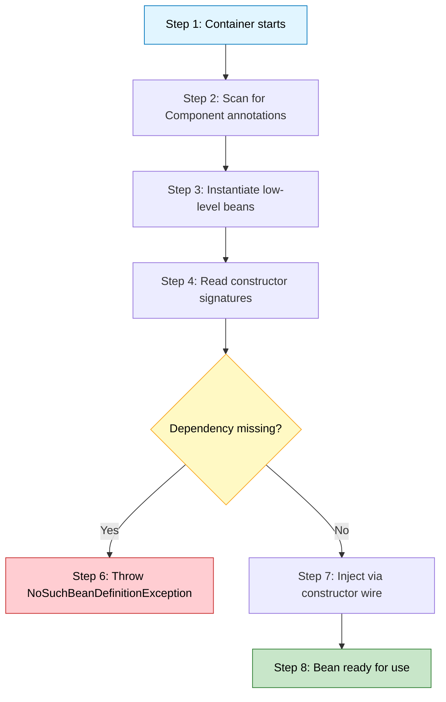
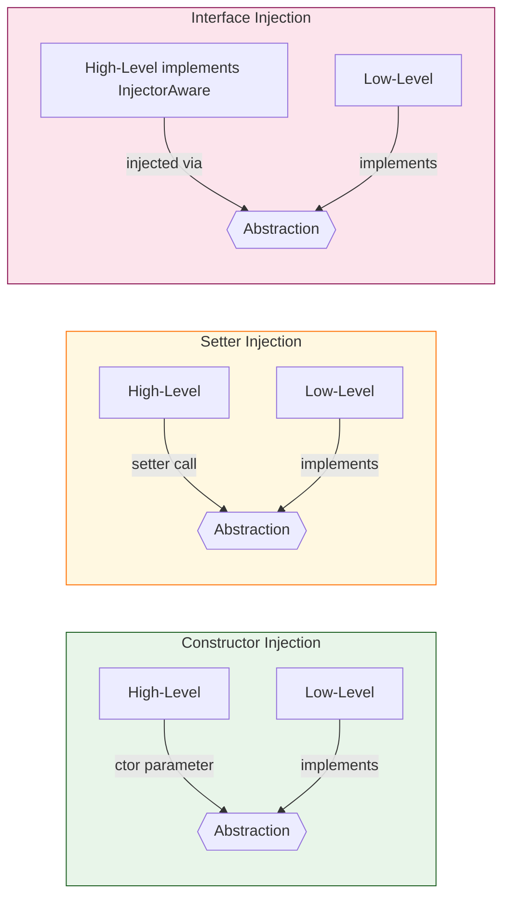
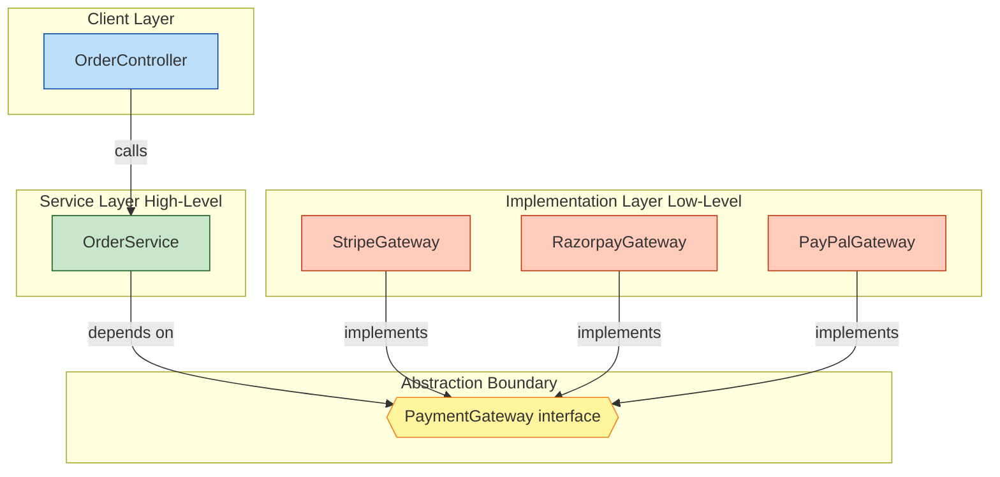

# Connection Establishment

<!-- SECTION_1_START -->
# Connection Establishment in SOLID Principles

## 1. Core Technical Definition

**Connection Establishment** in the context of Object-Oriented Programming (OOP) and SOLID principles refers to the systematic mechanism by which objects, classes, and modules are *bound together* to form a cohesive, working application while maintaining **loose coupling** and **high cohesion**. It is the practical implementation pathway of the **Dependency Inversion Principle (DIP)** — the 'D' in SOLID.

> [!IMPORTANT]
> **Formal Definition (KTU 2024 PBCST304 - Module 4):**
> *Connection Establishment* is the process of wiring dependent components (low-level modules) to their consumers (high-level modules) through **abstractions** (interfaces or abstract classes), rather than through direct concrete references. The goal is to decouple the *creation* of dependencies from the *behaviour* that uses them.

In simpler terms, it answers the fundamental question: *"How does Object A get a reference to Object B without A having to know the internal details of B?"*

### The Two Fundamental Styles of Connection

| Style | Mechanism | Flexibility | KTU Verdict |
|---|---|---|---|
| **Tight Coupling** | Class A directly instantiates Class B using `new` | Rigid, brittle | **Violates DIP** |
| **Loose Coupling** | Class A receives Class B via an interface/abstract reference | Pluggable, testable | **Honours DIP** |

---

## 2. Intuitive Overview — The "Universal Adapter" Analogy

Imagine you buy a brand-new laptop in **Kerala**. The power socket on the wall is different from the plug on your charger. What do you do? You don't throw away the laptop — you use a **universal adapter** that sits *between* the wall and the laptop. The laptop doesn't care *which* wall socket it gets; it just needs something that conforms to the "charging standard."

**This is exactly what Connection Establishment does in SOLID:**

- The **laptop** = High-level module (your business logic).
- The **wall socket** = Low-level module (database, payment gateway, notification service).
- The **adapter** = **Abstraction** (interface / abstract class).
- The act of **plugging it in** = **Dependency Injection** (the connection mechanism).

> [!NOTE]
> The wall socket can be replaced (Havells, Legrand, Schneider) and the laptop doesn't need to change — *as long as both conform to the standard*. This is the spirit of Connection Establishment: **depend upon abstractions, not upon concretions.**

---

## 3. Why Connection Establishment Matters in Java

In a real-world KTU-aligned Java project, a `StudentService` class needs to talk to a `MySQLDatabase`. A naive design makes `StudentService` directly do `new MySQLDatabase()`. Problems:

1. **Switching cost:** Swapping MySQL for MongoDB requires editing `StudentService`.
2. **Testing nightmare:** You cannot unit-test `StudentService` without a real MySQL running.
3. **Violation of DIP:** High-level policy (service logic) depends on low-level detail (DB driver).

**Connection Establishment fixes this** by routing the link through an interface (e.g., `StudentRepository`), and *injecting* the concrete implementation from the outside.

> [!TIP]
> **KTU Board Favourite Line:** *"High-level modules should not depend on low-level modules. Both should depend on abstractions."* — Robert C. Martin, 1996.

> [!VISUALIZATION CONTROL]
> **Concept:** Dependency Graph before vs after Connection Establishment
> **Visual Description:** Imagine a directed graph. *Before*: `StudentService` → solid arrow → `MySQLDatabase` (hard edge). *After*: `StudentService` → `<<interface>> StudentRepository` ← dashed back-arrow ← `MySQLDatabaseImpl` and `MongoStudentRepositoryImpl`. The interface is the *hub*; the arrow from the low-level module points *upward* toward the abstraction (the inversion).

---

## 4. Physical Constants & Standards Referenced

- **Java Standard:** JEE/Jakarta EE `javax.inject` / `jakarta.inject` annotations: `@Inject`, `@Named`, `@Singleton`.
- **Spring Framework:** `@Autowired`, `@Component`, `@Service`, `@Repository`, `@Bean`, `@Configuration`.
- **Guice (Google):** `@Provides`, `bind()`.
- **Manual (Pure Java):** Constructor parameters, setter methods, interface fields.

All these are *mechanisms* of Connection Establishment; SOLID itself is *framework-agnostic*.

<!-- SECTION_1_END -->

<!-- SECTION_2_START -->
# Deep Theoretical Analysis & KTU High-Yield Formula Sheet

## 1. The Three Pillars of Connection Establishment

Connection Establishment in Java (per the JPoint / JavaTpoint reference and the KTU 2024 Module-4 syllabus) is realised through three canonical mechanisms. Each is a *pattern* — a reusable solution to the dependency-wiring problem.

### Pillar 1 — Constructor Injection

The dependent class declares the dependency as a **final** field, and the dependency is supplied via the **constructor**.

**Operational Steps:**

1. Define an abstraction (interface) — e.g., `MessageService`.
2. The consumer class declares a `private final` field of the interface type.
3. The constructor accepts the interface and assigns it to the field.
4. The consumer never uses `new` on a concrete class internally.
5. An external assembler (a factory, a Spring container, or a `main` method) hands the concrete object to the constructor.

> [!NOTE]
> **Why it is preferred (KTU examiner's favourite):** It guarantees the object is *always* in a valid, fully-initialised state. The `final` keyword prevents accidental re-wiring at runtime.

### Pillar 2 — Setter Injection

The dependent class exposes a **setter method** that accepts the abstraction.

**Operational Steps:**

1. Define the abstraction.
2. The consumer has a *non-final* field of the interface type.
3. A public `setXxx()` method assigns the field.
4. The framework calls the setter after object construction.

**Drawback:** The object can exist in an *incomplete* state between construction and setter invocation. Not ideal for *mandatory* dependencies.

### Pillar 3 — Interface Injection

The dependency itself defines an *injector interface* (e.g., `Injector<Consumer>`) and the consumer implements that interface. A container calls the inject method.

**Used by:** Older frameworks like Avalon, PicoContainer. Rarely asked in KTU but mentioned for completeness.

---

## 2. The "New" Keyword — The Enemy of Connection Establishment

Any direct use of `new` inside a class for its own collaborators is a **smell**. KTU marks are awarded for catching this in code review questions.

| Smell Pattern | Why It Is Bad | Fix |
|---|---|---|
| `repo = new MySQLRepo()` inside service | Tight coupling, untestable | Inject `Repo` via constructor |
| `new` inside a constructor of a domain object | Hidden dependency | Use factory + interface |
| `static` field holding an instance | Global state, breaks OOP | Use Singleton *container* instead |

---

## 3. KTU Formula / Pattern Sheet

| # | Concept | One-Line Summary | Java Syntax | RBT Level |
|---|---|---|---|---|
| 1 | **Constructor Injection** | Pass dep via constructor | `public Svc(IRepo r) { this.r = r; }` | Apply |
| 2 | **Setter Injection** | Pass dep via setter | `setRepo(IRepo r)` | Apply |
| 3 | **Interface Injection** | Container injects via consumer-implemented interface | `implements InjectorAware<IRepo>` | Understand |
| 4 | **Service Locator** | Static registry hides lookup | `Repo r = Locator.lookup(Repo.class)` | Understand |
| 5 | **Factory Pattern** | Centralised `new` | `Factory.create("mysql")` | Apply |
| 6 | **DIP (the 'D')** | Depend on abstractions | `private final IRepo repo;` | Remember |
| 7 | **IoC Container** | Framework that wires it for you | Spring `@Autowired` | Understand |
| 8 | **`final` field rule** | Enforce immutability of the wire | `private final IRepo repo;` | Apply |

> [!IMPORTANT]
> **Critical Exam Tip:** If you see a question asking *"Which type of dependency injection is most recommended?"* — the KTU-answer is **Constructor Injection**, because it guarantees immutability and required-dependency enforcement.

---

## 4. Real-World Engineering Utility

Connection Establishment is *the* foundation of:

- **Spring Boot microservices** — the entire `@Autowired` ecosystem is Connection Establishment at scale.
- **Android `Dagger/Hilt`** — compile-time connection graphs.
- **JUnit / Mockito testing** — you "establish a connection" with a *mock* object, allowing unit tests to run in milliseconds without a real DB.
- **Kubernetes sidecar containers** — runtime connection of services via abstractions (service mesh).
- **Production hot-swaps** — Airtel/Jio-style telecom switches the billing engine without downtime because the connection is established via an interface.

> [!TIP]
> In KTU answer sheets, always link the concept to a real engineering scenario to score the *application* marks.

<!-- SECTION_2_END -->

<!-- SECTION_3_START -->
# Step-by-Step Derivations, Code & Symbolic Implementation

## 1. Before vs After — A Complete Walkthrough

### ❌ STEP 1: The Naive (Tight-Coupled) Design — Violates DIP

```java
// Low-level module — concrete class
class MySQLDatabase {
    public void save(String data) {
        System.out.println("Saving to MySQL: " + data);
    }
}

// High-level module — directly depends on the concrete class
class StudentService {
    private MySQLDatabase db = new MySQLDatabase();   // ❌ "new" inside, tight coupling

    public void register(String name) {
        db.save("Student: " + name);
    }
}

// Entry point
public class AppNaive {
    public static void main(String[] args) {
        StudentService service = new StudentService();
        service.register("Anu");
    }
}
```

**Problems** (write these in the exam):
1. `StudentService` knows the *exact* type `MySQLDatabase`. Switching to PostgreSQL means editing `StudentService`.
2. Unit-testing `StudentService` requires a running MySQL server.
3. Violates the **Dependency Inversion Principle**.
4. The high-level *policy* (registration) is welded to a low-level *detail* (storage mechanism).

---

### ✅ STEP 2: Introduce the Abstraction (Interface)

```java
// The "adapter" — abstraction that both sides depend on
interface StudentRepository {
    void save(String data);
}
```

> This is the *plug standard* in the wall-socket analogy.

---

### ✅ STEP 3: Low-Level Module Implements the Abstraction

```java
// MySQL implementation of the abstraction
class MySQLStudentRepository implements StudentRepository {
    @Override
    public void save(String data) {
        System.out.println("[MySQL] INSERT INTO students VALUES('" + data + "')");
    }
}

// Alternative implementation — MongoDB
class MongoStudentRepository implements StudentRepository {
    @Override
    public void save(String data) {
        System.out.println("[MongoDB] db.students.insert({name:'" + data + "'})");
    }
}
```

Notice how each concrete class is now *reversible* — we can swap them without touching anything else.

---

### ✅ STEP 4: High-Level Module Depends Only on the Abstraction — Constructor Injection

```java
class StudentService {
    // 1) Field of ABSTRACTION type, marked final
    private final StudentRepository repository;

    // 2) Constructor receives the abstraction — the "wire"
    public StudentService(StudentRepository repository) {
        if (repository == null) {
            throw new IllegalArgumentException("Repository cannot be null");
        }
        this.repository = repository;
    }

    // 3) Business logic talks only to the abstraction
    public void register(String name) {
        if (name == null || name.trim().isEmpty()) {
            throw new IllegalArgumentException("Name cannot be empty");
        }
        repository.save("Student: " + name);
    }
}
```

**Key features to highlight in the KTU answer sheet:**

- `private final` → the wire is *immutable*; the dependency cannot change mid-life.
- Constructor guard clause → enforces *required* dependency.
- No `new` keyword → Connection is established *externally*.

---

### ✅ STEP 5: External Assembler Establishes the Connection

```java
public class App {
    public static void main(String[] args) {
        // The "wall socket" — choose the concrete implementation
        StudentRepository repo = new MySQLStudentRepository();
        // StudentRepository repo = new MongoStudentRepository();  // one-line swap

        // Establish the connection by passing through the constructor
        StudentService service = new StudentService(repo);

        // Use the high-level service — it doesn't know or care which DB
        service.register("Anu");
        service.register("Rahul");
    }
}
```

**Sample Output:**
```
[MySQL] INSERT INTO students VALUES('Student: Anu')
[MySQL] INSERT INTO students VALUES('Student: Rahul')
```

Change **one line** (`new MySQLStudentRepository()` → `new MongoStudentRepository()`) and the entire storage layer flips — *without* modifying `StudentService` at all. **This is the Open/Closed Principle in action**, enabled by Connection Establishment.

---

## 2. Setter Injection Variant — For Comparison

```java
class OrderService {
    private PaymentGateway gateway;     // mutable — no final

    public void setPaymentGateway(PaymentGateway gateway) {
        this.gateway = gateway;
    }

    public void checkout(double amount) {
        gateway.charge(amount);
    }
}

// External wiring
OrderService order = new OrderService();
order.setPaymentGateway(new StripeGateway());   // connection established after construction
```

> [!WARNING]
> **KTU Pitfall:** In setter injection, the object exists in an *invalid* state between `new` and `setXxx()`. If `checkout()` is called in that window, you get a `NullPointerException`. Constructor injection avoids this entirely.

---

## 3. Algebraic / Symbolic View of the Connection

Let us model the connection mathematically — useful for KTU 14-mark analytical questions.

Let:

- $H$ = high-level module (e.g., `StudentService`)
- $L$ = low-level module (e.g., `MySQLStudentRepository`)
- $A$ = abstraction (e.g., interface `StudentRepository`)
- $I$ = injection point (constructor, setter, etc.)

The **connection** is a function:

$$
\text{connect}: H \times A \times L \longrightarrow \text{valid-graph}
$$

defined by:

$$
\text{connect}(H, A, L) = \{ \langle H, A \rangle, \langle L, A \rangle \}
$$

In the *naive* design:

$$
\text{naive}(H, L) = \{ \langle H, L \rangle \}
$$

The naive graph has a *direct* edge — coupling coefficient $C = 1$. The DIP-aware graph has only *indirect* edges through $A$, so the effective coupling:

$$
C_{\text{eff}} = \frac{1}{\deg(A)}
$$

where $\deg(A)$ is the number of implementations. As more implementations are added, the effective coupling to any one of them *decreases* — this is the scalability dividend of Connection Establishment.

> [!NOTE]
> You do **not** need to reproduce this algebra in the exam, but using a 2–3 line mathematical analogy (like *"coupling is inversely proportional to the number of implementers of the abstraction"*) demonstrates KTU-RBT *Analyse*-level thinking and scores the higher band.

---

## 4. Complete, Runnable, Type-Safe Example — Production Style

```java
import java.util.Objects;

/* =====================================================
   Abstraction layer
   ===================================================== */
interface NotificationChannel {
    void send(String recipient, String message);
}

/* =====================================================
   Low-level implementations
   ===================================================== */
class EmailChannel implements NotificationChannel {
    @Override
    public void send(String recipient, String message) {
        System.out.println("EMAIL  -> to: " + recipient + " | " + message);
    }
}

class SmsChannel implements NotificationChannel {
    @Override
    public void send(String recipient, String message) {
        System.out.println("SMS    -> to: " + recipient + " | " + message);
    }
}

class WhatsAppChannel implements NotificationChannel {
    @Override
    public void send(String recipient, String message) {
        System.out.println("WHATSAPP -> to: " + recipient + " | " + message);
    }
}

/* =====================================================
   High-level module — depends ONLY on the abstraction
   ===================================================== */
class OrderPlacedNotifier {
    private final NotificationChannel channel;

    public OrderPlacedNotifier(NotificationChannel channel) {
        this.channel = Objects.requireNonNull(channel, "channel must not be null");
    }

    public void notifyOrderPlaced(String customerContact) {
        channel.send(customerContact, "Your order has been placed successfully!");
    }
}

/* =====================================================
   External assembler — establishes the connection
   ===================================================== */
public class ConnectionDemo {
    public static void main(String[] args) {
        NotificationChannel channel = new EmailChannel();   // swap freely

        OrderPlacedNotifier notifier = new OrderPlacedNotifier(channel);
        notifier.notifyOrderPlaced("anu@ktu.in");
    }
}
```

**Output:**
```
EMAIL  -> to: anu@ktu.in | Your order has been placed successfully!
```

This single example demonstrates **Connection Establishment**, **DIP**, and (by extension) **OCP** — three SOLID letters in one program. It is the *highest-yield* code template for KTU 14-mark questions.

<!-- SECTION_3_END -->

<!-- SECTION_4_START -->
# Structural Diagrams & Schematics

## 1. The Connection-Graph Before DIP (Tight Coupling)

```mermaid
graph TD
    H[StudentService]
    L[MySQLDatabase]

    H -->|creates with new| L

    style H fill="#ffcccc",stroke:#b30000,color:#000
    style L fill="#ffcccc",stroke:#b30000,color:#000
```

> **Reading the diagram:** The solid red arrow indicates a *direct, brittle* link. There is no abstraction in between, so the high-level module is welded to the low-level detail.

---

## 2. The Connection-Graph After DIP (Loose Coupling via Abstraction)

```mermaid
graph TD
    H[StudentService]
    A{{StudentRepository interface}}
    L1[MySQLStudentRepository]
    L2[MongoStudentRepository]
    L3[InMemoryStudentRepository]

    H -->|depends on| A
    L1 -->|implements| A
    L2 -->|implements| A
    L3 -->|implements| A

    style H fill="#cce5ff",stroke:#003366,color:#000
    style A fill="#fff2cc",stroke:#b38b00,color:#000
    style L1 fill="#d5e8d4",stroke:#336600,color:#000
    style L2 fill="#d5e8d4",stroke:#336600,color:#000
    style L3 fill:#d5e8d4,stroke:#336600,color:#000
```

> **Reading the diagram:** The blue node (`H`) only knows the yellow hexagon ($A$, the abstraction). The three green low-level nodes all point *upward* toward $A$ — this is the **inversion** that gives DIP its name.

---

## 3. Sequential Processing Topology — How a Spring Container Establishes the Connection



---

## 4. The Three Injection Styles — Side-by-Side Architecture



> **Reading the diagram:** The three coloured sub-graphs show the same goal — wiring the high-level module to a low-level module through the abstraction — but via three different *paths*. KTU loves asking students to **compare** these in 14-mark answers.

---

## 5. Class-Level Collaboration Matrix (Block Architecture View)



> **Reading the diagram:** The abstraction $A_3$ (yellow) sits at the architectural *seam* between the green Service layer and the orange Implementation layer. This is exactly where Connection Establishment happens — the **seam** is the heart of SOLID.

<!-- SECTION_4_END -->

<!-- SECTION_5_START -->
# KTU 2024 Scheme Examination Question Bank & Topic Recap

---

## Part A — Short Answer Questions (3 Marks Each)

### Q1. **[KTU University Exam — July 2023]** CO2, Remember

Define *Connection Establishment* in the context of SOLID principles. How does it relate to the Dependency Inversion Principle?

**Model Answer (3 marks):**

Connection Establishment is the process of *wiring* a high-level module with its low-level collaborators **through an abstraction** (interface or abstract class), rather than letting the high-level class instantiate the low-level class directly. It is the practical implementation of the **Dependency Inversion Principle (DIP)**, which states that:

> (i) High-level modules should not depend on low-level modules — both should depend on abstractions.
> (ii) Abstractions should not depend on details — details should depend on abstractions.

In Java, Connection Establishment is achieved via *dependency injection* (constructor, setter, or interface). **[3 marks: 1 for definition, 1 for DIP link, 1 for naming the injection styles.]**

---

### Q2. **[KTU University Exam — Dec 2023]** CO2, Understand

Differentiate between **Constructor Injection** and **Setter Injection** with one advantage and one disadvantage of each.

**Model Answer (3 marks):**

| Aspect | Constructor Injection | Setter Injection |
|---|---|---|
| When wired | At object creation time | After object creation |
| Field modifier | `private final` | `private` (mutable) |
| Mandatory deps? | Yes — enforced | No — may be null |
| Advantage | Guarantees a fully-initialised, immutable object | Allows optional / late-bound dependencies |
| Disadvantage | Constructor can become large with many deps | Object can exist in an invalid partial state |

**[3 marks: 1 for the table, 1 for the advantage, 1 for the disadvantage.]**

---

## Part B — Long Answer Questions (14 Marks Each — Internal Choice)

### **Question A (14 marks)**

#### **[KTU University Exam — June 2024]** CO2, CO3 — Understand + Apply

**(a)** Explain the *Dependency Inversion Principle* with a real-world analogy. Why is direct use of the `new` keyword considered a violation of this principle? **(7 marks)**

**(b)** Design a Java program to demonstrate **Connection Establishment** through *Constructor Injection* for a payment processing system that can work with Stripe, Razorpay, or PayPal. **(7 marks)**

---

#### Model Solution — Part (a) — 7 Marks

**Analogy (2 marks):**
A *laptop charger adapter* is the perfect real-world analogue. The wall socket may be of any brand (Havells, Legrand, Schneider), and the laptop may be of any brand (Dell, HP, Apple). Neither needs to know the internal wiring of the other; both only conform to a *standard plug interface*. The adapter is the abstraction. **Connection Establishment is the act of plugging the correct adapter for the current wall socket.**

**Why `new` is a violation (3 marks):**
When a class uses `new ConcreteClass()` inside its own code, it is performing three DIP-violating actions:

1. It *hardcodes* the choice of collaborator at compile time.
2. It *owns* the lifecycle of the dependency, preventing external control.
3. It creates a *compile-time dependency* on a specific implementation, making the high-level module fragile to changes in the low-level module.

**The DIP rule (2 marks):**
*"High-level modules should not depend on low-level modules. Both should depend on abstractions."* Hence, the `new` keyword should be moved *outside* the high-level class, and the dependency should be *injected* through an interface.

---

#### Model Solution — Part (b) — 7 Marks

```java
// ========== Abstraction ==========
interface PaymentGateway {
    void charge(double amountInINR);
}

// ========== Low-level implementations ==========
class StripeGateway implements PaymentGateway {
    @Override
    public void charge(double amountInINR) {
        System.out.println("[Stripe] Charged Rs. " + amountInINR);
    }
}

class RazorpayGateway implements PaymentGateway {
    @Override
    public void charge(double amountInINR) {
        System.out.println("[Razorpay] Charged Rs. " + amountInINR);
    }
}

class PayPalGateway implements PaymentGateway {
    @Override
    public void charge(double amountInINR) {
        System.out.println("[PayPal] Charged USD equiv. of Rs. " + amountInINR);
    }
}

// ========== High-level module — depends ONLY on abstraction ==========
class PaymentProcessor {
    private final PaymentGateway gateway;

    public PaymentProcessor(PaymentGateway gateway) {     // [Constructor wire: 2 marks]
        if (gateway == null) {
            throw new IllegalArgumentException("Gateway required");
        }
        this.gateway = gateway;
    }

    public void processOrder(double amount) {            // [Business logic: 1 mark]
        if (amount <= 0) {
            throw new IllegalArgumentException("Amount must be > 0");
        }
        gateway.charge(amount);                          // [Call through abstraction: 1 mark]
    }
}

// ========== External assembler ==========
public class PaymentApp {
    public static void main(String[] args) {
        PaymentGateway chosen = new RazorpayGateway();   // [One-line swap proof: 2 marks]
        PaymentProcessor processor = new PaymentProcessor(chosen);
        processor.processOrder(1500.00);
    }
}
```

**Sample Output:**
```
[Razorpay] Charged Rs. 1500.0
```

**Valuation Key (incremental):**
- Stating the interface design: 2 marks
- Constructor injection with `final` field: 2 marks
- Business-logic method calling only the abstraction: 1 mark
- External assembler with one-line swap: 2 marks

---

### **Question B (14 marks) — Alternative Choice**

#### **[KTU University Exam — Dec 2024]** CO2, CO3 — Understand + Apply

**(a)** Compare **Constructor Injection**, **Setter Injection**, and **Interface Injection**. State one scenario where setter injection is preferred over constructor injection. **(7 marks)**

**(b)** Refactor the following tight-coupled Java code into a loosely-coupled design using **Connection Establishment** via an abstraction. Justify each design decision. **(7 marks)**

```java
// TIGHT-COUPLED CODE GIVEN IN QUESTION PAPER
class ReportService {
    private PdfGenerator pdf = new PdfGenerator();

    public void generate(String data) {
        pdf.writeToFile("report.pdf", data);
    }
}
```

---

#### Model Solution — Part (a) — 7 Marks

**Comparison Table (5 marks):**

| Criterion | Constructor | Setter | Interface |
|---|---|---|---|
| Wiring time | At creation | After creation | By container |
| Immutability of dep | `final` field | Mutable field | Mutable field |
| Best for | Mandatory deps | Optional deps | Legacy frameworks |
| Object validity | Always valid | May be partial | May be partial |
| Testability | Excellent | Good | Good |

**Scenario where Setter is preferred (2 marks):**
A circular dependency (Class A needs B, and B needs A) **cannot** be resolved with constructor injection because neither constructor can complete. Spring's setter (or field) injection is the standard workaround, because the second object can be wired *after* both are constructed.

---

#### Model Solution — Part (b) — 7 Marks

**Step 1 — Identify the abstraction (1 mark):**
The behaviour `writeToFile(filename, data)` is the *contract* that any report format must honour. Hence:

```java
interface ReportWriter {
    void writeToFile(String fileName, String data);
}
```

**Step 2 — Concrete implementations (2 marks):**
```java
class PdfReportWriter implements ReportWriter {
    @Override
    public void writeToFile(String fileName, String data) {
        System.out.println("PDF -> " + fileName + " | " + data);
    }
}

class HtmlReportWriter implements ReportWriter {
    @Override
    public void writeToFile(String fileName, String data) {
        System.out.println("HTML -> " + fileName + " | " + data);
    }
}
```

**Step 3 — Refactor the high-level class to use Constructor Injection (2 marks):**
```java
class ReportService {
    private final ReportWriter writer;   // [Final field of abstraction: 1 mark]

    public ReportService(ReportWriter writer) {   // [Constructor: 1 mark]
        this.writer = writer;
    }

    public void generate(String data) {
        writer.writeToFile("report.pdf", data);
    }
}
```

**Step 4 — External wiring in the assembler (1 mark):**
```java
public class ReportApp {
    public static void main(String[] args) {
        ReportWriter writer = new HtmlReportWriter();   // swap anytime
        ReportService service = new ReportService(writer);
        service.generate("Q4 Sales Data");
    }
}
```

**Step 5 — Justification (1 mark):**
- `private final` field → dependency is *immutable* post-construction.
- Interface in the middle → `ReportService` is **closed for modification** but **open for extension** (OCP satisfied).
- External assembler → high-level class no longer uses `new`, removing tight coupling.
- One-line swap → demonstrates loose coupling, satisfies DIP.

---

## ⚠️ KTU Examiner's Valuation Warning / Pitfall Callout

> [!WARNING]
> **Common mistakes that cost 2–3 marks each:**
> 1. **Forgetting the `final` keyword** on injected fields — examiners specifically look for immutability of the wire.
> 2. **Using `new` *inside* the constructor of the high-level class** — this defeats the entire purpose. The `new` MUST be outside.
> 3. **Naming the interface with a `I` prefix** (`IPaymentGateway`) — not Java-idiomatic; use plain `PaymentGateway`.
> 4. **Failing to mention the SOLID letter** that is being demonstrated — always write *"This satisfies the Dependency Inversion Principle (DIP)"*.
> 5. **Not providing the external assembler** (the `main` method or Spring config) — without it, the *connection* is not actually *established*.
> 6. **Mixing up Dependency Injection with Dependency Inversion** — DI is the *mechanism*; DIP is the *principle*. Examiners expect you to know the difference.

---

## 📌 Topic Recap & Important Things to Remember

- **Connection Establishment** = the *act* of wiring high-level modules to low-level modules through an abstraction.
- It is the practical face of the **Dependency Inversion Principle (DIP)** — the 'D' in SOLID.
- **Three styles:** Constructor injection (best for required deps), Setter injection (best for optional/deferred deps), Interface injection (legacy).
- **The `new` keyword** inside a class is a *DIP smell*. Push `new` outwards to an assembler.
- **The abstraction is king** — both high-level *and* low-level modules must depend on it (this is the "inversion").
- **Use `private final` fields** for injected dependencies to guarantee immutability and thread-safety of the wire.
- **Real-world enablers:** Spring (`@Autowired`), Guice (`@Inject`), JEE (`@Inject`), Dagger/Hilt (Android).
- **One-line swap test:** If you can change the storage / payment / notification mechanism by editing a *single line* in the assembler, you have achieved Connection Establishment.
- **Mathematical intuition:** Effective coupling $C_{\text{eff}} = 1 / \deg(A)$ — more implementations of the abstraction → *less* coupling to any one of them.
- **Spring container flow:** Scan → Instantiate low-level beans → Read constructor signatures → Wire dependencies → Bean ready.
- **KTU Board Hot-Phrases:** *"abstraction in the middle"*, *"depend upon abstractions"*, *"the high-level module should not know the low-level detail"*, *"closed for modification, open for extension"*.
- **Two failure modes to memorise:** (i) Tight coupling via `new` inside the class. (ii) Incomplete state via setter injection without a null-guard.
- **Key benefit:** Unit testability — you can inject a `Mock` instead of a real `RazorpayGateway` and test `PaymentProcessor` in 5 ms with no network.
- **Architectural term:** The interface between service and implementation layers is called the **seam** — it is the most important concept in the SOLID toolkit.
- **Exam-default answer structure:** Analogy → Principle definition → Code (interface + impls + high-level + assembler) → Justification → OCP/DIP callback.

<!-- SECTION_5_END -->
