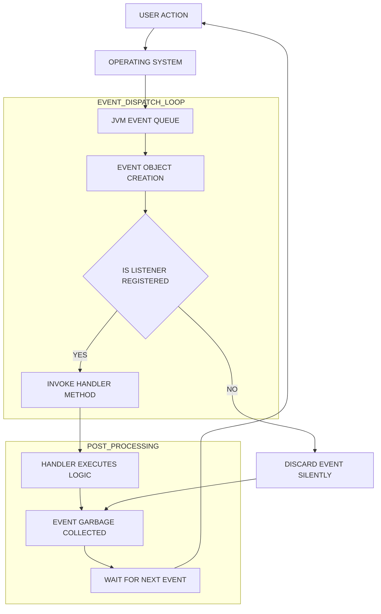
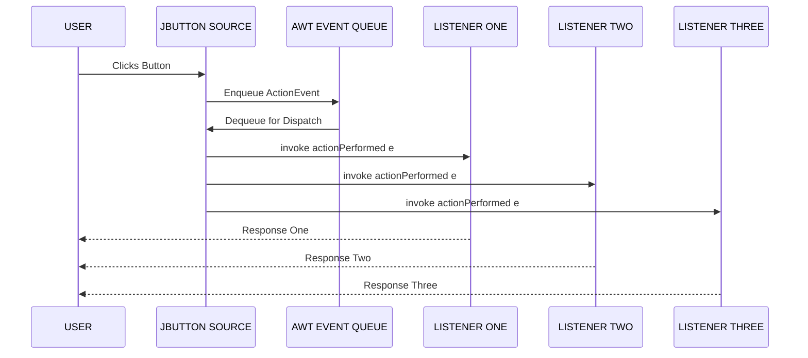
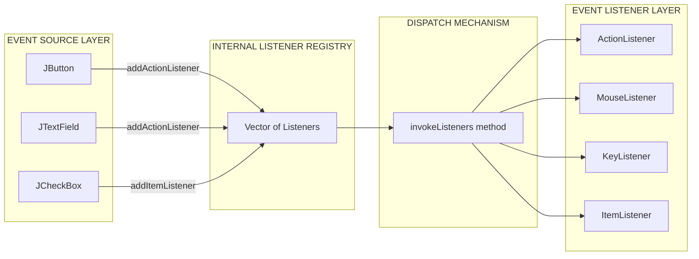

# Delegation Event Model

<!-- SECTION_1_START -->

# Delegation Event Model in Java — Core Definition & Intuition

## 1.1 Formal Academic Definition (KTU Syllabus Terminology)

The **Delegation Event Model** is the standard event-handling architecture adopted by Java's **Abstract Window Toolkit (AWT)** and **Swing** frameworks to manage user interactions with GUI components. Under this model, when a user interacts with a GUI component (the **Event Source**), the component does **not** handle the event itself; instead, it **delegates** the responsibility of processing the event to a registered object (the **Event Listener** or **Event Handler**).

The model is formally defined in the `java.awt.event` package and was introduced with **JDK 1.1** to replace the earlier, less-flexible **inheritance-based event model** of JDK 1.0.

> [!IMPORTANT]
> **KTU 2024 Highlight:** The Delegation Event Model is built upon three foundational pillars: **Event Source, Event Listener, and Event Object**. Examiners frequently frame 3-mark questions around identifying these three components in a given GUI scenario.

## 1.2 Conceptual Analogy — The Newspaper Subscription Model

Imagine a newsstand where:
- The **newspaper publisher** (Event Source) prints the newspaper every day.
- A **subscriber** (Event Listener) registers with the publisher to receive the paper at their home.
- The **newspaper itself** (Event Object) carries the actual content (the event details).
- The **postal service** (Event Dispatcher / JVM) physically delivers the paper from the publisher to the subscriber.

Key rules of this analogy:
1. The publisher does **not** know *what* the subscriber will do with the paper — it simply delivers it. (Loose coupling.)
2. Multiple subscribers can register for the same paper. (**One-to-many** relationship.)
3. A subscriber can **unregister** at any time, and the publisher will stop sending papers. (`removeListener()`)
4. If **no subscriber is registered**, the publisher simply discards the event. (Silent failure is possible.)

This perfectly mirrors how a `JButton` (source) registers an `ActionListener` (subscriber) and invokes its `actionPerformed()` method when clicked.

## 1.3 Core Terms at a Glance

| Term | Definition |
|---|---|
| **Event** | An object that describes a state change in a GUI component (e.g., button click, key press). |
| **Event Source** | The GUI object that generates an event (e.g., `JButton`, `JTextField`). |
| **Event Listener** | An object that "listens" for events and provides a handler method. Implements a listener interface. |
| **Event Handler** | The method inside the listener that is invoked when the event occurs. |
| **Event Object** | A subclass of `java.util.EventObject` carrying event-specific data. |
| **Adapter Class** | An empty-implementation class that simplifies listener coding. |

> [!NOTE]
> **Loose Coupling Principle:** The Delegation Event Model is a textbook example of the **Dependency Inversion** and **Interface Segregation** SOLID principles — components depend on *abstractions* (listener interfaces), not on concrete implementations.

## 1.4 Visualization of the Model

> [!VISUALIZATION CONTROL]
> **Concept:** Event Flow from Source to Listener
> **Conceptual Mapping:**
> - **X-axis:** Time (in milliseconds)
> - **Y-axis:** Control Transfer
> - **Curve:** A step function showing `Source` → `Dispatcher Thread` → `Listener`
> **Visual Description:** A horizontal arrow starts at the GUI component, ascends to a "Dispatcher" box, and descends to the listener's handler method. Students should observe the **indirect path** (delegation) rather than a direct call from the component.

---

<!-- SECTION_1_END -->

<!-- SECTION_2_START -->

# Deep Theoretical Analysis & KTU High-Yield Formula Sheet

## 2.1 The Three Pillars of the Delegation Event Model

The architecture can be decomposed into three modular components working in concert:

### Pillar 1 — Event Source (The Producer)
- A GUI component (e.g., `Button`, `TextField`, `Choice`, `MenuItem`).
- Maintains an **internal registry** (a list) of registered listeners.
- Provides two key public methods: `addTypeListener(TypeListener l)` and `removeTypeListener(TypeListener l)`.
- When an event occurs, the source iterates through its listener list and invokes the appropriate handler method on each.

### Pillar 2 — Event Listener (The Consumer)
- An object that implements one or more listener interfaces from `java.awt.event`.
- Each interface declares one or more abstract methods — these are the **event handlers**.
- Multiple listeners can be registered for the same source, enabling **broadcast** semantics.

### Pillar 3 — Event Object (The Message)
- A subclass of `java.util.EventObject`.
- Carries contextual information: source reference, event type, coordinates, key code, etc.
- Examples: `ActionEvent`, `MouseEvent`, `KeyEvent`, `WindowEvent`, `ItemEvent`, `TextEvent`, `FocusEvent`, `AdjustmentEvent`, `ComponentEvent`, `ContainerEvent`.

## 2.2 Event Class Hierarchy

$$
\begin{aligned}
\text{java.util.EventObject} \;\;&\longrightarrow\;\; \text{java.awt.AWTEvent} \;\;&\longrightarrow\;\; \text{java.awt.event.* (concrete events)} \\
&\text{(root of all events)} \;\;&\text{(AWT-specific base)} \;\;&\text{(e.g., ActionEvent, MouseEvent)}
\end{aligned}
$$

> [!IMPORTANT]
> **KTU Memory Trick:** Every concrete event class has a corresponding `XXXEvent`, `XXXListener` (interface), and often an `XXXAdapter` (class). For example, `MouseEvent` ↔ `MouseListener` ↔ `MouseAdapter`.

## 2.3 Step-by-Step Mechanics — How an Event Travels

1. **User Interaction:** The user clicks a button, presses a key, or moves the mouse.
2. **Event Generation:** The OS detects the input and forwards it to the JVM.
3. **Event Object Creation:** The JVM creates a concrete `EventObject` subclass (e.g., `ActionEvent`).
4. **Source Identification:** The event is associated with the GUI component that originated it via `getSource()`.
5. **Listener Invocation:** The source calls the appropriate method on every registered listener (e.g., `actionPerformed(ActionEvent e)`).
6. **Handler Execution:** Each listener's method executes its business logic.
7. **Event Discarded:** After processing, the event object is dereferenced and garbage-collected.

## 2.4 Key Listener Interfaces (Exam-Critical List)

| Listener Interface | Handler Method(s) | Triggered By |
|---|---|---|
| `ActionListener` | `actionPerformed(ActionEvent)` | Button click, menu selection |
| `MouseListener` | `mouseClicked/Entered/Exited/Pressed/Released` | Mouse button actions |
| `MouseMotionListener` | `mouseDragged/Moved` | Mouse movement |
| `KeyListener` | `keyTyped/Pressed/Released` | Keyboard input |
| `WindowListener` | `windowOpened/Closing/Closed/Activated/Deactivated/Iconfified/Deiconified` | Window state changes |
| `ItemListener` | `itemStateChanged(ItemEvent)` | Checkbox, radio, choice selection |
| `TextListener` | `textValueChanged(TextEvent)` | Text field change |
| `FocusListener` | `focusGained/Lost(FocusEvent)` | Focus shift |
| `AdjustmentListener` | `adjustmentValueChanged` | Scrollbar movement |
| `ComponentListener` | `componentResized/Moved/Shown/Hidden` | Component lifecycle |
| `ContainerListener` | `componentAdded/Removed` | Container modification |

## 2.5 Adapter Classes — The Shortcut Mechanism

Each listener interface with **more than one method** has a corresponding **adapter class** in `java.awt.event`. Adapter classes provide **empty (no-op) implementations** for all methods of the interface, so you only override the methods you actually need.

| Adapter Class | Implements |
|---|---|
| `MouseAdapter` | `MouseListener`, `MouseMotionListener` |
| `KeyAdapter` | `KeyListener` |
| `WindowAdapter` | `WindowListener` |
| `ComponentAdapter` | `ComponentListener` |
| `ContainerAdapter` | `ContainerListener` |
| `FocusAdapter` | `FocusListener` |

> [!NOTE]
> **KTU Insight:** `ActionListener` and `ItemListener` have only one method each, so they have **no adapter class**. Students often wrongly mention "ActionAdapter" in exams — this is a **valuation red flag**.

## 2.6 Real-World Engineering Utility

The Delegation Event Model powers virtually every modern Java desktop application:
- **IDE Toolbars:** NetBeans, IntelliJ IDEA use this model to handle button clicks.
- **Banking Software GUI:** Input validation on `KeyListener` events.
- **Industrial SCADA Dashboards:** Real-time `ActionListener` responses to operator commands.
- **Cross-Platform Consistency:** Same code runs on Windows, macOS, Linux because the JVM abstracts OS-level events.

## 2.7 KTU High-Yield Formula Sheet

| Concept | Equation / Rule | Notes |
|---|---|---|
| Listener Registration | $source.\text{addXListener}(l)$ | Binds listener $l$ to source |
| Listener Deregistration | $source.\text{removeXListener}(l)$ | Unbinds listener $l$ |
| Source Retrieval | $e.\text{getSource}()$ | Returns reference to originating object |
| Event Type Identification | $e.\text{getID}()$ | Returns an integer event ID |
| One-to-Many Fanout | $N_{\text{handlers}} = \vert L_{\text{list}} \vert$ | All registered listeners fire |
| Adapter Inheritance | $\text{class } H \text{ extends } \text{MouseAdapter}$ | Override only required methods |
| Thread of Execution | $\text{AWT-EventQueue}$ (single thread) | Swing is single-threaded; respect EDT rule |

---

<!-- SECTION_2_END -->

<!-- SECTION_3_START -->

# Step-by-Step Derivations & Code/Symbolic Implementation

## 3.1 Exhaustive Java Implementation — A Complete Working Program

The following program demonstrates the full Delegation Event Model with **two different event types** (ActionEvent and WindowEvent) on a single frame. Every line is explicitly explained below the code.

```java
import java.awt.*;
import java.awt.event.*;

// =============================================================
// STEP 1: Listener class declared as a separate file/class
// Implements ActionListener — handles button click events
// =============================================================
class ButtonHandler implements ActionListener {
    private int clickCount;
    
    public ButtonHandler() {
        this.clickCount = 0;
    }
    
    @Override
    public void actionPerformed(ActionEvent e) {
        clickCount = clickCount + 1;
        System.out.println("Button clicked " + clickCount + " time(s).");
        System.out.println("Source object: " + e.getSource().getClass().getName());
        System.out.println("Action command: " + e.getActionCommand());
    }
}

// =============================================================
// STEP 2: WindowHandler uses an Adapter class to save typing
// Only windowClosing() is overridden; the other 6 methods
// inherit empty implementations from WindowAdapter
// =============================================================
class WindowHandler extends WindowAdapter {
    @Override
    public void windowClosing(WindowEvent e) {
        System.out.println("Window is closing. Exiting application.");
        System.exit(0);
    }
}

// =============================================================
// STEP 3: Main class — owns the Event Sources (GUI components)
// =============================================================
public class DelegationDemo extends Frame implements ActionListener {
    private Button btnClick;
    private Button btnReset;
    private Label lblCounter;
    private int counter;
    
    public DelegationDemo() {
        // 3.1 — Initialize counter state
        counter = 0;
        
        // 3.2 — Set the layout manager
        setLayout(new FlowLayout(FlowLayout.CENTER, 20, 20));
        
        // 3.3 — Create Event Sources
        lblCounter = new Label("Count: 0");
        btnClick   = new Button("Click Me");
        btnReset   = new Button("Reset");
        
        // 3.4 — Register listeners on the buttons (THE DELEGATION)
        // Method 1: External class as listener
        ButtonHandler externalHandler = new ButtonHandler();
        btnClick.addActionListener(externalHandler);
        
        // Method 2: Same class implements ActionListener
        btnReset.addActionListener(this);
        
        // 3.5 — Add components to the Frame (which is itself a Container)
        add(lblCounter);
        add(btnClick);
        add(btnReset);
        
        // 3.6 — Register WindowListener using an Adapter subclass
        addWindowListener(new WindowHandler());
        
        // 3.7 — Configure Frame properties
        setTitle("Delegation Event Model Demo");
        setSize(400, 150);
        setVisible(true);
    }
    
    // This method is invoked when btnReset is clicked
    @Override
    public void actionPerformed(ActionEvent e) {
        if (e.getSource() == btnReset) {
            counter = 0;
            lblCounter.setText("Count: 0");
            System.out.println("Counter reset to zero.");
        }
    }
    
    // =========================================================
    // STEP 4: Application entry point
    // =========================================================
    public static void main(String[] args) {
        new DelegationDemo();
    }
}
```

### 3.1.1 Line-by-Line Logical Walkthrough

| Code Segment | Operational Meaning | KTU Mapping |
|---|---|---|
| `class ButtonHandler implements ActionListener` | Declares a listener class by implementing the abstract interface. | Listener Definition |
| `public void actionPerformed(ActionEvent e)` | Mandatory override of the sole method in `ActionListener`. | Event Handler |
| `e.getSource()` | Returns the originating component (an `Object`). | Event Object API |
| `extends WindowAdapter` | Inherits no-op implementations of all 7 `WindowListener` methods. | Adapter Pattern |
| `btnClick.addActionListener(externalHandler)` | **THE DELEGATION** — the button stores `externalHandler` in its internal list. | Event Source Registration |
| `addWindowListener(new WindowHandler())` | Anonymous-style registration using the adapter subclass. | Window-level event binding |
| `setVisible(true)` | Triggers AWT to actually display the frame and start listening. | GUI Activation |

## 3.2 Three Implementation Styles for Listeners (Comparison)

> [!IMPORTANT]
> **KTU Examiner's Tip:** The 14-mark questions frequently ask students to *compare* the three listener implementation styles. Memorize the trade-offs below.

### Style 1 — Separate Class (Used Above)
- **Pros:** Clean separation; reusable across multiple components.
- **Cons:** Verbose; must pass data via constructor or shared object.

### Style 2 — Same Class Implements the Interface
- **Pros:** Direct access to instance fields (`counter`, `lblCounter`).
- **Cons:** Couples GUI logic with event logic; violates single-responsibility.

### Style 3 — Anonymous Inner Class
- **Pros:** Compact; perfect for one-off handlers.
- **Cons:** Not reusable; can be hard to read with many overrides.

### Symbolic Comparison

$$
\begin{aligned}
\text{Style 1: Source} \;&\longrightarrow\; \text{ExternalListenerClass} \\
\text{Style 2: Source} \;&\longrightarrow\; \text{SameClass (this)} \\
\text{Style 3: Source} \;&\longrightarrow\; \text{new ListenerInterface() \; \{ \text{...} \}}
\end{aligned}
$$

### Style 3 — Anonymous Inner Class Code Example

```java
btnClick.addActionListener(new ActionListener() {
    @Override
    public void actionPerformed(ActionEvent e) {
        System.out.println("Anonymous handler fired.");
    }
});
```

### Lambda Expression (Java 8+) — Modern Shortcut
Because `ActionListener` is a **functional interface** (single abstract method), a lambda can replace the anonymous class:

```java
btnClick.addActionListener(e -> System.out.println("Lambda handler fired."));
```

## 3.3 Event Object Methods — Exhaustive API Reference

| Method | Return Type | Purpose |
|---|---|---|
| `getSource()` | `Object` | Returns the originating component. |
| `getID()` | `int` | Returns the event type ID (e.g., `MouseEvent.MOUSE_CLICKED`). |
| `getActionCommand()` | `String` | Returns the command name (for `ActionEvent`). |
| `getWhen()` | `long` | Returns the timestamp of the event. |
| `consume()` | `void` | Consumes the event so it isn't processed further. |
| `paramString()` | `String` | Returns a debug-friendly string representation. |

## 3.4 Symbolic Derivation — Event Propagation Math

Although the Delegation Event Model is event-driven (not a closed-form equation), we can model its invocation behavior as a **summation over all registered listeners**:

$$
\text{TotalHandlersInvoked}(s, e) = \sum_{i=1}^{N} H_i(s, e)
$$

Where:
- $s$ = the Event Source component
- $e$ = the Event Object passed to the dispatcher
- $N = \vert L_s \vert$ = the cardinality of the listener list registered on $s$
- $H_i(s, e)$ = the $i$-th registered listener's handler method

> [!NOTE]
> **Interpretation:** If **zero** listeners are registered, $N = 0$ and no handler runs — the event is silently discarded. This is why forgetting to call `addXListener()` is a common runtime bug in Java GUI programs.

---

<!-- SECTION_3_END -->

<!-- SECTION_4_START -->

# Structural Diagrams & Schematics

## 4.1 Mermaid Flowchart — Event Lifecycle in Delegation Model



## 4.2 Mermaid Sequence Diagram — One-to-Many Listener Fanout



## 4.3 Mermaid Class Diagram — Listener Interface Hierarchy

```mermaid
classDiagram
    classEventListener["java.util.EventListener"] <|.. ActionListener
    classEventListener["java.util.EventListener"] <|.. MouseListener
    classEventListener["java.util.EventListener"] <|.. KeyListener
    classEventListener["java.util.EventListener"] <|.. WindowListener
    classEventListener["java.util.EventListener"] <|.. ItemListener

    class ActionListener {
        <<interface>>
        +actionPerformed(ActionEvent e)
    }

    class MouseListener {
        <<interface>>
        +mouseClicked(MouseEvent e)
        +mouseEntered(MouseEvent e)
        +mouseExited(MouseEvent e)
        +mousePressed(MouseEvent e)
        +mouseReleased(MouseEvent e)
    }

    class KeyListener {
        <<interface>>
        +keyTyped(KeyEvent e)
        +keyPressed(KeyEvent e)
        +keyReleased(KeyEvent e)
    }

    class WindowListener {
        <<interface>>
        +windowOpened(WindowEvent e)
        +windowClosing(WindowEvent e)
        +windowClosed(WindowEvent e)
        +windowActivated(WindowEvent e)
        +windowDeactivated(WindowEvent e)
        +windowIconified(WindowEvent e)
        +windowDeiconified(WindowEvent e)
    }

    class ItemListener {
        <<interface>>
        +itemStateChanged(ItemEvent e)
    }
```

## 4.4 Mermaid Block Diagram — Functional Architecture of Registration and Dispatch



## 4.5 Tabular Schematic — Component vs Listener vs Event Mapping

| GUI Component (Source) | Event Triggered | Listener Interface | Adapter Class |
|---|---|---|---|
| `Button` | Click | `ActionListener` | None |
| `TextField` | Enter key, text change | `ActionListener`, `TextListener` | None |
| `Checkbox` | Check/Uncheck | `ItemListener` | None |
| `Choice` (Dropdown) | Selection | `ItemListener` | None |
| `List` | Double-click | `ActionListener` | None |
| `MenuItem` | Selection | `ActionListener` | None |
| `Scrollbar` | Adjustment | `AdjustmentListener` | None |
| `Window` / `Frame` | Open/Close/Iconify | `WindowListener` | `WindowAdapter` |
| `TextField` (focus) | Focus change | `FocusListener` | `FocusAdapter` |
| Any Component | Resize/Move/Hide | `ComponentListener` | `ComponentAdapter` |

---

<!-- SECTION_4_END -->

<!-- SECTION_5_START -->

# KTU 2024 Scheme Examination Question Bank & Topic Recap

## 5.1 Part A — Short Answer Questions (3 Marks Each)

### Question 1
**[KTU University Exam — Dec 2023]** — *CO1, Remember*
**Q:** Define the **Delegation Event Model** in Java. List its three primary components.

**Model Answer (Board-Key Pattern):**

> The Delegation Event Model is the standard event-handling mechanism in Java AWT/Swing, introduced in **JDK 1.1**, in which an Event Source delegates the responsibility of processing an event to a registered Event Listener rather than handling it itself. The three primary components are:
>
> 1. **Event Source** — the GUI object that generates the event (e.g., `Button`).
> 2. **Event Listener** — the object that implements a listener interface and handles the event (e.g., `ActionListener`).
> 3. **Event Object** — the object that encapsulates event information, derived from `java.util.EventObject`.
>
> The event-handling responsibility is **delegated** from the source to the listener, achieving loose coupling between the GUI component and the business logic.
>
> **[Valuation Key: 1 Mark for definition, 2 Marks for the three components — 3 Marks Total]**

### Question 2
**[KTU University Exam — July 2024]** — *CO1, Understand*
**Q:** Differentiate between the **JDK 1.0 Event Model** and the **Delegation Event Model** (JDK 1.1+). State two advantages of the latter.

**Model Answer:**

| Aspect | JDK 1.0 Event Model | Delegation Event Model |
|---|---|---|
| Mechanism | Inheritance-based: override `handleEvent()` | Interface-based: implement listener interfaces |
| Coupling | Tight — subclassing the component | Loose — listener is a separate object |
| Reusability | Limited | High — listeners are reusable across components |
| Granularity | One method handles all events | One method per event type |
| Extensibility | Difficult | Easy — add new listener interfaces |

**Two advantages of the Delegation Model:**
1. **Loose Coupling** between GUI components and event-handling code.
2. **Easier maintenance and reuse** — the same listener class can handle multiple sources.

> **[Valuation Key: 1 Mark for any two valid differences, 1 Mark for advantage, 1 Mark for second advantage — 3 Marks Total]**

---

## 5.2 Part B — Long Answer Questions (14 Marks Each, Module Internal Choice)

### Question A (Choice 1) — Comprehensive Implementation Scenario

**[KTU University Exam — Dec 2023]** — *CO2, Apply / Analyze*

**Q:**
(a) Explain the roles of **Event Source**, **Event Listener**, and **Event Object** in the Delegation Event Model with a suitable diagram. **(7 Marks)**

(b) Write a complete Java AWT program that creates a `Frame` containing a `TextField` and a `Button` labeled "Greet". When the button is clicked, the text from the `TextField` should be read and displayed inside a `Label` below with the prefix "Hello, ". Implement the listener using an **anonymous inner class**. The program should also close the window properly when the user clicks the close (X) button. **(7 Marks)**

#### Part (a) — Model Solution

**1. Event Source (3 Marks)**

The Event Source is the GUI component that originates an event. It maintains a list of registered listeners in its internal data structure (typically a `Vector`). It provides two public methods: `addXListener()` to register a listener and `removeXListener()` to unregister one. Examples include `Button`, `TextField`, `Checkbox`, and `MenuItem`. The source does **not** contain event-handling logic — it only fires events to its registered listeners.

**2. Event Listener (2 Marks)**

The Event Listener is an object that implements one or more listener interfaces (e.g., `ActionListener`, `MouseListener`) from the `java.awt.event` package. It contains the actual event-handling logic in its abstract methods, which the source invokes when an event occurs. The listener is decoupled from the source, ensuring loose coupling.

**3. Event Object (2 Marks)**

The Event Object is an instance of a subclass of `java.util.EventObject` (such as `ActionEvent`, `MouseEvent`, `KeyEvent`). It carries contextual information about the event: the source reference (`getSource()`), the event type ID (`getID()`), and event-specific data such as coordinates, key codes, or action commands. The event object is passed as the argument to the listener's handler method.

> **[Valuation Key: Roles clearly identified with examples — 7 Marks Total]**

#### Part (b) — Model Solution

```java
import java.awt.*;
import java.awt.event.*;

public class GreetApp extends Frame {
    private TextField txtName;
    private Button btnGreet;
    private Label lblOutput;
    
    public GreetApp() {
        // Layout setup
        setLayout(new FlowLayout(FlowLayout.CENTER, 20, 20));
        setTitle("Greeting Application");
        
        // Component creation
        txtName  = new TextField(20);
        btnGreet = new Button("Greet");
        lblOutput = new Label("Hello, stranger!");
        
        // --- THE DELEGATION ---
        // Anonymous inner class implements ActionListener
        btnGreet.addActionListener(new ActionListener() {
            @Override
            public void actionPerformed(ActionEvent e) {
                String name = txtName.getText();
                lblOutput.setText("Hello, " + name + "!");
                System.out.println("Greeted: " + name);
            }
        });
        
        // Window closing using an anonymous WindowAdapter
        addWindowListener(new WindowAdapter() {
            @Override
            public void windowClosing(WindowEvent e) {
                System.exit(0);
            }
        });
        
        // Add components to frame
        add(new Label("Enter your name:"));
        add(txtName);
        add(btnGreet);
        add(lblOutput);
        
        // Frame configuration
        setSize(350, 200);
        setVisible(true);
    }
    
    public static void main(String[] args) {
        new GreetApp();
    }
}
```

**Valuation Step-by-Step Allocation:**

| Component | Marks | Justification |
|---|---|---|
| Import statements and class declaration | 1 | `[Imports: 1 Mark]` |
| Component creation (3 components) | 1 | `[GUI component setup: 1 Mark]` |
| Anonymous `ActionListener` registration | 2 | `[Listener registration block: 2 Marks]` |
| Override of `actionPerformed` with logic | 1 | `[Handler logic: 1 Mark]` |
| `WindowAdapter` with `windowClosing` | 1 | `[Window listener: 1 Mark]` |
| Adding components to frame | 0.5 | `[Adding to container: 0.5 Mark]` |
| `main` method invocation | 0.5 | `[Entry point: 0.5 Mark]` |
| **Total** | **7** | |

> [!WARNING]
> **Examiner's Pitfall Callout:** Students frequently **forget to override `windowClosing()`** or call `setVisible(true)` to display the frame. Missing either of these results in **deduction of 1–2 marks**. Also, ensure `e.getSource() == btnGreet` is checked only when there are multiple buttons triggering the same listener; for a single button, it's optional.

---

### Question B (Choice 2) — Comparative Analysis & Adapter Class Focus

**[KTU University Exam — July 2024]** — *CO2, Understand / Apply*

**Q:**
(a) What is an **Adapter Class** in Java AWT? Why is it used? List any **four** adapter classes along with the listener interfaces they implement. **(7 Marks)**

(b) Write a Java AWT program using the `MouseAdapter` class to detect and display the coordinates of the mouse when it is **clicked** and **dragged** inside a `Frame`. The frame background color should change to red on click and blue on drag. Use the **MouseListener** and **MouseMotionListener** inheritance via the adapter. **(7 Marks)**

#### Part (a) — Model Solution

An **Adapter Class** in Java AWT is a class that provides **empty (no-op) implementations** for all the methods declared in a corresponding multi-method listener interface. It exists in the `java.awt.event` package and is used to **simplify event-handling code** by allowing programmers to override only the methods they need, instead of being forced to implement every abstract method of a multi-method interface.

**Why Adapter Classes are used:**
1. They eliminate the need to write empty bodies for unwanted methods.
2. They make code cleaner, shorter, and more readable.
3. They promote the **Open/Closed Principle** — extend the adapter and override selectively.

**Four Adapter Classes:**

| Adapter Class | Listener Interface(s) Implemented |
|---|---|
| `MouseAdapter` | `MouseListener` and `MouseMotionListener` |
| `KeyAdapter` | `KeyListener` |
| `WindowAdapter` | `WindowListener` |
| `FocusAdapter` | `FocusListener` |

> **[Valuation Key: 2 Marks for definition + reason, 1 Mark per correct adapter-listener pair (2 pairs needed) — 7 Marks Total]**

#### Part (b) — Model Solution

```java
import java.awt.*;
import java.awt.event.*;

public class MouseColorApp extends Frame {
    
    public MouseColorApp() {
        setTitle("Mouse Adapter Demo");
        setSize(500, 400);
        setBackground(Color.WHITE);
        setVisible(true);
        
        // Use anonymous subclass of MouseAdapter
        addMouseListener(new MouseAdapter() {
            @Override
            public void mouseClicked(MouseEvent e) {
                setBackground(Color.RED);
                int x = e.getX();
                int y = e.getY();
                System.out.println("Clicked at: (" + x + ", " + y + ")");
                setTitle("Clicked at (" + x + ", " + y + ")");
            }
        });
        
        // Use the same MouseAdapter — it implements BOTH interfaces
        addMouseMotionListener(new MouseAdapter() {
            @Override
            public void mouseDragged(MouseEvent e) {
                setBackground(Color.BLUE);
                int x = e.getX();
                int y = e.getY();
                System.out.println("Dragged at: (" + x + ", " + y + ")");
            }
        });
        
        // Window closing logic
        addWindowListener(new WindowAdapter() {
            @Override
            public void windowClosing(WindowEvent e) {
                System.exit(0);
            }
        });
    }
    
    public static void main(String[] args) {
        new MouseColorApp();
    }
}
```

**Valuation Step-by-Step Allocation:**

| Component | Marks |
|---|---|
| Imports + class declaration extending `Frame` | 1 |
| Frame setup (title, size, background, visibility) | 1 |
| `MouseAdapter` registration via `addMouseListener` | 1.5 |
| `mouseClicked` override with `getX()` / `getY()` and red color | 1.5 |
| `MouseAdapter` registration via `addMouseMotionListener` | 1 |
| `mouseDragged` override with `getX()` / `getY()` and blue color | 1 |
| **Total** | **7** |

> [!WARNING]
> **Examiner's Pitfall Callout:** A common mistake is to declare a **custom class extending `MouseAdapter`** and then instantiate it twice — once for `addMouseListener` and once for `addMouseMotionListener`. This is **incorrect**; you must use a **single** `MouseAdapter` instance for one type of registration, or use two anonymous subclasses as shown above. Failing to use `getX()` and `getY()` correctly costs 1 mark.

---

## 5.3 Topic Recap & Important Things to Remember

> [!IMPORTANT]
> **Rapid-Revision Checklist for KTU 2024 Board Exam**

- ✅ The Delegation Event Model was introduced in **JDK 1.1** to replace the inheritance-based JDK 1.0 model.
- ✅ **Three pillars:** Event **Source** (GUI component), Event **Listener** (interface implementer), Event **Object** (`EventObject` subclass).
- ✅ Event source methods: `addXListener(l)` for registration, `removeXListener(l)` for deregistration.
- ✅ Every event class extends `java.util.EventObject`; AWT events extend `java.awt.AWTEvent`.
- ✅ `getSource()` returns the originating component; `getID()` returns the event type ID.
- ✅ The event is **silently discarded** if no listener is registered — a frequent runtime bug.
- ✅ A single source can have **multiple listeners** — one-to-many broadcast.
- ✅ **Adapter classes** provide empty implementations; only `MouseAdapter` covers **two** interfaces (`MouseListener` + `MouseMotionListener`).
- ✅ `ActionListener` and `ItemListener` have **only one method** — therefore **no adapter class** exists for them.
- ✅ `MouseListener` has 5 methods; `WindowListener` has 7 methods; `KeyListener` has 3 methods.
- ✅ Since Java 8, **lambda expressions** can replace anonymous inner classes for single-method listener interfaces.
- ✅ All AWT/Swing event handling occurs on the **AWT-EventQueue** thread (the **Event Dispatch Thread / EDT**).
- ✅ Always override `windowClosing(WindowEvent e)` and call `System.exit(0)` to terminate AWT applications gracefully.
- ✅ A `Frame` itself is a `Window`, so it can directly accept `WindowListener` registration.
- ✅ **Mnemonic for Source Identification:** *"S-E-L" = Source, Event, Listener* — the three S-E-L pillars.

---

<!-- SECTION_5_END -->
