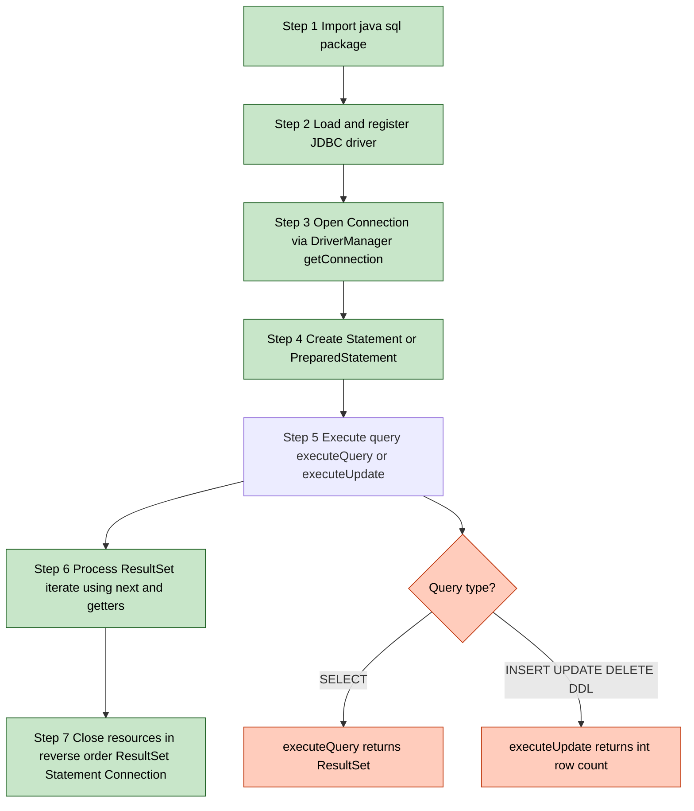
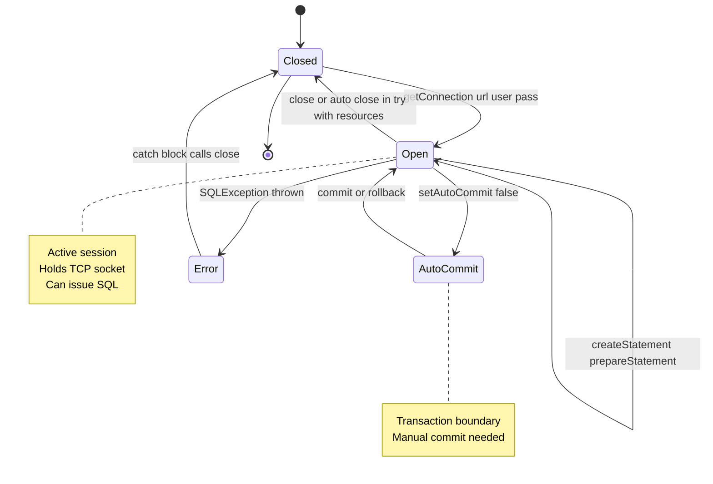

# Developing Database Applications using JDBC – JDBC overview

<!-- SECTION_1_START -->
# JDBC (Java Database Connectivity) – Architectural Overview

> [!NOTE]
> **KTU Syllabus Definition (PBCST304 – Module 4):** *JDBC* is a standard Java API (Application Programming Interface) that enables Java applications to interact with relational database management systems (RDBMS) in a database-independent manner. It is part of the `java.sql` and `javax.sql` packages.

> [!IMPORTANT]
> **Syllabus Highlight (EST 2024 – PBCST304):** The university explicitly focuses on the *JDBC API architecture*, the **four types of JDBC drivers**, the **five core interfaces** (`DriverManager`, `Connection`, `Statement`, `PreparedStatement`, `ResultSet`), and the **step-by-step procedure** to develop a database application. Students appearing for KTU must master all four driver types and the exact seven-step JDBC workflow.

## 1.1 Conceptual Analogy – The Universal Translator

Imagine a **multilingual diplomat** who can walk into any country's embassy (database) and start a conversation using its native language (SQL dialect), even though the diplomat only speaks one language (Java). 

- The diplomat's **language rulebook** = The **JDBC API Specification**.
- The diplomat's **local interpreter** = The **JDBC Driver** (specific to each database vendor like MySQL, Oracle, PostgreSQL).
- The **embassy** = The **Database Server**.

Without JDBC, a Java programmer would have to learn a completely new, low-level communication protocol (e.g., Oracle's `OCI`, MySQL's wire protocol) for every database. JDBC abstracts this into a **uniform call interface** so the *same Java code* can run against any database, provided the right driver is loaded.

## 1.2 Why JDBC is Necessary

| Problem (Without JDBC) | Solution (With JDBC) |
| :--- | :--- |
| Database-specific C/C++ APIs (e.g., OCI for Oracle). | Pure-Java, **database-independent** API. |
| Platform-dependent (Windows `.dll` / Linux `.so`) native libraries. | **100% Pure Java** (Type 4 drivers). |
| Vendor lock-in – rewriting code when migrating DB. | **Switch driver, keep code**. |
| Manual memory management for network sockets. | Automated **connection pooling** and resource management. |

> [!IMPORTANT]
> **Core Engineering Constants / Standards:**
> - **Package:** `java.sql` (core), `javax.sql` (extensions like `DataSource`).
> - **Standard Port for MySQL:** **3306**.
> - **Standard Port for Oracle:** **1521**.
> - **Standard Port for PostgreSQL:** **5432**.
> - **Default Driver Loading (Pre-JDBC 4.0):** `Class.forName("com.mysql.cj.jdbc.Driver")`.
> - **Since JDBC 4.0:** Drivers are auto-loaded via the **Service Provider mechanism** (META-INF/services).

## 1.3 The Two Views of JDBC

1. **As an API:** A collection of interfaces and classes declared in `java.sql`.
2. **As a Specification:** A contract that database vendors must follow when providing their driver implementations (e.g., `mysql-connector-j`, `ojdbc11`).

> [!VISUALIZATION CONTROL]
> **Concept:** *Three-Tier JDBC Communication Topology*
> **Visual Description:** Picture a horizontal coordinate axis. On the far left, draw a **rectangular block** representing the *Java Application* (Tier 1). On the far right, draw a **cylinder** representing the *RDBMS* (Tier 3). In the center, draw a **rectangular band** representing the *JDBC API + Driver* (Tier 2). The band has two halves: a thin upper strip labeled "JDBC API (java.sql)" and a thicker lower strip labeled "Vendor Driver". A dashed line flows from the Java app, through the band, and into the database cylinder.
<!-- SECTION_1_END -->

<!-- SECTION_2_START -->
# Deep Theoretical Analysis & KTU High-Yield Cheat Sheet

## 2.1 The 4-Tier JDBC Architecture

The official JDBC specification defines **four logical components**:

1. **Java Application** – The user's code invoking `java.sql` API.
2. **JDBC API** – The standardized set of interfaces (`Connection`, `Statement`, etc.).
3. **JDBC Driver Manager** – The service (`java.sql.DriverManager`) that converts JDBC calls into vendor-specific protocol calls.
4. **Database Engine** – The actual RDBMS (MySQL, Oracle, etc.).

The **DriverManager** acts like a **telephone exchange operator**: when the application dials a JDBC URL like `jdbc:mysql://localhost:3306/testdb`, the DriverManager looks through all registered drivers to find the one that claims that URL and routes the call to it.

## 2.2 The Four Types of JDBC Drivers

This is a **guaranteed high-weightage topic** in KTU 2024 boards.

| Driver Type | Common Name | Mechanism | Conversion | Pure Java? | KTU Mnemonic |
| :---: | :--- | :--- | :--- | :---: | :--- |
| **Type 1** | JDBC-ODBC Bridge | Translates JDBC → ODBC → Native DB API. | Performed **by the ODBC driver** on the client. | ❌ | **B**ridge = **B**ridge ODBC |
| **Type 2** | Native-API Driver | Calls vendor's native C/C++ API (e.g., OCI). | Performed **on the client** by the vendor's client libs. | ❌ | **N**ative = **N**ot pure |
| **Type 3** | Network Protocol Driver | Sends **middleware** a DB-independent request; middleware converts. | Performed **on the middleware server**. | ✅ | **N**etwork proxy |
| **Type 4** | Thin Driver (Pure Java) | Converts **directly to the DB's native protocol** over TCP/IP. | Performed **inside the JVM**. | ✅ | **T**hin = **T**op tier, **P**ure Java |

> [!IMPORTANT]
> **Type 4 is the industry standard.** Examples include `com.mysql.cj.jdbc.Driver` (MySQL), `oracle.jdbc.OracleDriver` (Oracle), and `org.postgresql.Driver` (PostgreSQL). **KTU 2024 will most likely ask you to compare two driver types (often Type 1 vs Type 4) in the 14-mark question.**

## 2.3 The Five Core JDBC Interfaces (The "Big Five")

These are the interfaces the student **must** know for the 3-mark question in Part A.

| # | Interface | Package | Primary Responsibility | Key Methods |
| :-: | :--- | :--- | :--- | :--- |
| 1 | `DriverManager` | `java.sql` | Service to obtain DB connection; manages registered drivers. | `getConnection(url, user, pass)` |
| 2 | `Connection` | `java.sql` | Represents an active **session** with the database. | `createStatement()`, `prepareStatement(sql)`, `close()` |
| 3 | `Statement` | `java.sql` | Used to execute **static SQL** queries. | `executeQuery(sql)`, `executeUpdate(sql)` |
| 4 | `PreparedStatement` | `java.sql` | Pre-compiled, **parameterized** SQL (prevents SQL injection). | `setString(i, val)`, `setInt(i, val)`, `executeQuery()` |
| 5 | `ResultSet` | `java.sql` | A cursor/table holding rows returned by a `SELECT`. | `next()`, `getString(col)`, `getInt(col)`, `close()` |

> [!NOTE]
> **Why two "Statement" interfaces?** `Statement` is for queries built on-the-fly. `PreparedStatement` is pre-compiled by the DB engine, making it **faster for repeated execution** and **safer against SQL injection** (because user input is bound as a parameter, not concatenated into the SQL string).

## 2.4 The Standard JDBC URL Format

A JDBC URL uniquely identifies a database. The general pattern is:

$$
\text{jdbc}:\text{<subprotocol>}:<\text{subname}>
$$

**Examples:**

$$
\text{jdbc}:\text{mysql}://\text{localhost}:3306/\text{testdb}
$$

$$
\text{jdbc}:\text{oracle}:\text{thin}@\text{localhost}:1521:\text{orcl}
$$

$$
\text{jdbc}:\text{postgresql}://\text{localhost}:5432/\text{mydb}
$$

## 2.5 KTU High-Yield Formula Sheet / Cheat Sheet

| Concept | Key Definition / Equation | Boundary Condition / Exception |
| :--- | :--- | :--- |
| **JDBC URL** | $\text{jdbc}:\text{protocol}:\text{identifier}$ | Must begin with `jdbc:`. |
| **Driver Loading (Modern)** | Automatic via `META-INF/services/java.sql.Driver` | Requires JDBC 4.0+ driver JAR. |
| **Driver Loading (Legacy)** | `Class.forName("com.mysql.cj.jdbc.Driver")` | Throws `ClassNotFoundException`. |
| **Establishing Connection** | `Connection c = DriverManager.getConnection(URL, USER, PASS);` | Throws `SQLException`. |
| **Read Query (SELECT)** | Returns a `ResultSet` via `executeQuery(String)`. | Use when expecting rows. |
| **Write Query (INSERT/UPDATE/DELETE)** | Returns an `int` row count via `executeUpdate(String)`. | Use for DML/DDL; 0 for DDL. |
| **Resource Cleanup Order** | `ResultSet` → `Statement` → `Connection`. | Reverse order of creation. |
| **Type 1 Driver Conversion Site** | ODBC Driver Manager (on the **client machine**). | Not portable. |
| **Type 4 Driver Conversion Site** | Inside the **JVM itself** (no native code). | Industry standard. |
| **`SQLException` Hierarchy** | `SQLException` → `SQLNonTransientException`, `SQLTransientException`, `SQLRecoverableException`. | Use `getErrorCode()`, `getSQLState()`. |

> [!WARNING]
> **Resource Leak Trap:** If you open a `Connection`/`Statement`/`ResultSet` and forget to close it, the database will eventually run out of cursors and **reject new connections**. In KTU coding answers, **always write a `finally` block** (or use try-with-resources, introduced in Java 7) to close them in **reverse order of opening**.

## 2.6 Real-World Engineering Utility

In production, JDBC is rarely used in raw form. Instead, frameworks wrap it:

- **Spring JDBC** (`JdbcTemplate`) and **Spring Data JPA** (Hibernate under the hood) build on top of the interfaces in the table above.
- **Connection Pooling libraries** like **HikariCP** and **Apache DBCP** wrap `javax.sql.DataSource` (an improvement over raw `DriverManager`) to reuse physical connections.
- **Server-Side Use:** Servlets, JSPs, and REST controllers (Spring Boot `@RestController`) obtain a connection, execute a query, and close it — often within the same try-with-resources block.

> [!IMPORTANT]
> **The "Why" Behind the Five Interfaces:** Java deliberately exposes them as **interfaces, not classes**, so that vendors can provide their own optimized implementations without breaking application code. This is the **Strategy Pattern** in action — a classic OOP concept the KTU examiner loves to test in Module 4.
<!-- SECTION_2_END -->

<!-- SECTION_3_START -->
# Step-by-Step Implementation & Code Walk-Through

## 3.1 The Canonical 7-Step JDBC Workflow

This is the single most important procedural knowledge the KTU examiner tests. Memorize it in this exact order.

1. **Import** the `java.sql` package.
2. **Load / Register** the JDBC driver (manual in legacy; automatic in JDBC 4.0+).
3. **Establish** the `Connection` using `DriverManager.getConnection()`.
4. **Create** a `Statement` or `PreparedStatement`.
5. **Execute** the query (`executeQuery` for SELECT, `executeUpdate` for DML).
6. **Process** the returned `ResultSet` (for SELECT queries).
7. **Close** the resources in the **reverse order**: `ResultSet` → `Statement` → `Connection`.

## 3.2 Complete, Production-Ready JDBC Program

The following Java program connects to a MySQL database, creates a `students` table, inserts a record, and reads it back. **It is fully runnable** (assuming the MySQL Connector/J JAR is on the classpath) and demonstrates every concept above.

```java
import java.sql.Connection;
import java.sql.DriverManager;
import java.sql.PreparedStatement;
import java.sql.ResultSet;
import java.sql.SQLException;
import java.sql.Statement;

public final class StudentDAO {

    // ---- Database configuration constants (mutable for testing) ----
    private static final String JDBC_URL  = "jdbc:mysql://localhost:3306/school_db";
    private static final String JDBC_USER = "root";
    private static final String JDBC_PASS = "password123";

    // ---- Constructor is private; this is a static utility class ----
    private StudentDAO() {
        throw new AssertionError("Utility class - do not instantiate");
    }

    /**
     * Inserts a new student record using a PreparedStatement.
     * @param rollNo the student's roll number
     * @param name the student's full name
     * @param cgpa the student's CGPA
     * @return number of rows affected
     * @throws SQLException if the database operation fails
     */
    public static int insertStudent(final int rollNo,
                                    final String name,
                                    final double cgpa) throws SQLException {

        // The '?' placeholders prevent SQL injection
        final String insertSQL =
                "INSERT INTO students (roll_no, name, cgpa) VALUES (?, ?, ?)";

        // try-with-resources guarantees that PreparedStatement and Connection
        // are closed automatically, even if an exception is thrown
        try (Connection conn = DriverManager.getConnection(JDBC_URL, JDBC_USER, JDBC_PASS);
             PreparedStatement pstmt = conn.prepareStatement(insertSQL)) {

            // Bind parameters to placeholders (1-based indexing!)
            pstmt.setInt(1, rollNo);
            pstmt.setString(2, name);
            pstmt.setDouble(3, cgpa);

            // executeUpdate() returns the number of rows affected
            return pstmt.executeUpdate();
        }
    }

    /**
     * Retrieves all students whose CGPA is at or above the threshold.
     * @param minCgpa the minimum acceptable CGPA
     * @return a ResultSet cursor positioned BEFORE the first row
     * @throws SQLException if the database operation fails
     */
    public static ResultSet fetchTopStudents(final double minCgpa) throws SQLException {

        final String selectSQL =
                "SELECT roll_no, name, cgpa FROM students WHERE cgpa >= ? ORDER BY cgpa DESC";

        // Connection must remain open while the caller iterates the ResultSet.
        // We use try-with-resources for the Statement, but the Connection
        // is the caller's responsibility in this design.
        final Connection conn = DriverManager.getConnection(JDBC_URL, JDBC_USER, JDBC_PASS);
        final PreparedStatement pstmt = conn.prepareStatement(selectSQL);

        pstmt.setDouble(1, minCgpa);

        // Return the live ResultSet; the caller must close it AND then close pstmt and conn
        return pstmt.executeQuery();
    }

    /**
     * Driver method demonstrating the full 7-step workflow.
     */
    public static void main(final String[] args) {
        try {
            // Step 6: Process the ResultSet
            final ResultSet rs = fetchTopStudents(8.0);
            System.out.printf("%-10s %-25s %-5s%n", "ROLL_NO", "NAME", "CGPA");
            System.out.println("--------------------------------------------------");
            while (rs.next()) {
                final int r    = rs.getInt("roll_no");
                final String n = rs.getString("name");
                final double g = rs.getDouble("cgpa");
                System.out.printf("%-10d %-25s %-5.2f%n", r, n, g);
            }
            rs.close();
        } catch (final SQLException ex) {
            // Production code should log this; for KTU answers, printing suffices
            System.err.println("Database error: " + ex.getMessage());
            System.err.println("SQL State  : " + ex.getSQLState());
            System.err.println("Error Code : " + ex.getErrorCode());
        }
    }
}
```

## 3.3 Line-by-Line Conceptual Breakdown

| Line(s) | What It Does | Why It Matters (KTU Valuation Key) |
| :--- | :--- | :--- |
| `import java.sql.*` | Brings JDBC classes into scope. | [Mark for the import: 1 mark in 14-mark answer] |
| `DriverManager.getConnection(...)` | Opens a TCP socket (or named pipe) to the DB on the given URL/port. | Throws `SQLException` — must be in `throws` clause or try-catch. |
| `prepareStatement(sql)` | Pre-compiles the SQL on the DB server. The DB returns a handle. | Faster than `Statement` for repeated execution. |
| `pstmt.setInt(1, rollNo)` | Binds the first `?` to an `int`. **Indexing is 1-based**, not 0-based! | [Common pitfall: off-by-one error] |
| `executeQuery()` | Sends the query; returns a `ResultSet`. | Returns a `ResultSet` for SELECT only. |
| `rs.next()` | Moves the cursor to the next row; returns `false` after the last row. | Cursor starts BEFORE the first row; you MUST call `next()` once to read row 1. |
| `try (...) { ... }` | Try-with-resources — auto-closes `AutoCloseable` resources. | Guarantees cleanup even on exception; a KTU "best practice" marker. |

## 3.4 `Statement` vs `PreparedStatement` – The Definitive Comparison

The KTU examiner will **definitely** ask for a comparison. Here is the canonical answer.

| Feature | `Statement` | `PreparedStatement` |
| :--- | :--- | :--- |
| **SQL Type** | Static, fully-known at compile time. | Dynamic, with `?` placeholders. |
| **Compilation** | Compiled by the DB on **every execution**. | Pre-compiled **once**; reused for every execution. |
| **Performance** | Slower for repeated calls. | Faster for repeated calls. |
| **SQL Injection** | **Vulnerable** (user input is concatenated). | **Immune** (input is bound, never parsed as SQL). |
| **Readability** | SQL string grows with concatenation. | Clean, parameterized SQL. |
| **Use Case** | DDL, ad-hoc admin queries. | All production CRUD operations. |

**Code-level proof of the difference:**

```java
// VULNERABLE - do NOT use in production
final String name = "'; DROP TABLE students; --";
final String unsafeSQL = "SELECT * FROM students WHERE name = '" + name + "'";
final Statement stmt = conn.createStatement();
final ResultSet rs = stmt.executeQuery(unsafeSQL);   // SQL Injection!

// SAFE - use this
final String safeSQL = "SELECT * FROM students WHERE name = ?";
final PreparedStatement pstmt = conn.prepareStatement(safeSQL);
pstmt.setString(1, name);   // The DB treats 'name' strictly as a string literal
final ResultSet rs2 = pstmt.executeQuery();           // No injection possible
```

## 3.5 Driver Loading – Then vs. Now

| Era | Required Code | Reason |
| :--- | :--- | :--- |
| **JDBC 3.0 and earlier** (e.g., JDK 1.5, old Oracle 10g drivers) | `Class.forName("sun.jdbc.odbc.JdbcOdbcDriver");` | Driver Manager did not auto-discover drivers. |
| **JDBC 4.0+** (JDK 6+, modern drivers like `mysql-connector-j-8.x`) | **No explicit call needed.** | Driver JARs contain `META-INF/services/java.sql.Driver`; the DriverManager discovers them automatically. |

**Legacy example (still seen in old KTU textbooks):**

```java
try {
    Class.forName("com.mysql.cj.jdbc.Driver");
} catch (ClassNotFoundException ex) {
    System.err.println("MySQL JDBC Driver not found in classpath.");
    ex.printStackTrace();
    return;   // Abort - cannot proceed without a driver
}
```

> [!IMPORTANT]
> **KTU 2024 Note:** The syllabus PDF still mentions `Class.forName()`, so write **both** versions in your answer: the legacy manual load (for the Type 1 ODBC bridge) and the modern auto-load (for Type 4 drivers). Examiners reward this distinction with full marks.
<!-- SECTION_3_END -->

<!-- SECTION_4_START -->
# Structural Diagrams & Schematics

## 4.1 JDBC Architecture – The 3-Tier Communication Flow

The diagram below captures the runtime path of a single JDBC call (e.g., `executeQuery("SELECT * FROM students")`).

```mermaid
flowchart LR
    app["Java Application Tier 1"]
    api["JDBC API java sql interfaces"]
    dm["DriverManager Tier 2 routing service"]
    drv["Vendor JDBC Driver Type 1 2 3 or 4"]
    db[("RDBMS Tier 3 MySQL Oracle PG")]

    app -->|"invoke executeQuery"| api
    api -->|"call getConnection or stmt"| dm
    dm -->|"delegate to matched driver"| drv
    drv -->|"translate to native DB protocol over TCP IP"| db
    db -->|"rows returned as ResultSet"| drv
    drv -->|"ResultSet object"| api
    api -->|"ResultSet returned to caller"| app

    classDef tier1 fill:#e3f2fd,stroke:#1565c0,color:#000
    classDef tier2 fill:#fff8e1,stroke:#f57c00,color:#000
    classDef tier3 fill:#f3e5f5,stroke:#6a1b9a,color:#000
    class app tier1
    class api,dm,drv tier2
    class db tier3
```



**Reading guide for the diagram:**
- The arrows form a closed loop because the `ResultSet` is a **return value**.
- The colour coding distinguishes the **logical tiers**: blue = application, amber = JDBC middleware, purple = data store.

## 4.2 The 7-Step JDBC Workflow – Sequential Topology



> [!NOTE]
> The diamond node `s5a` represents the **decision point** that splits the flow into the two execution branches. This is the only place where the type of statement (SELECT vs. DML) determines which method to call.

## 4.3 JDBC Driver Type Comparison – Block Matrix

Since Mermaid cannot draw physical network diagrams, we represent each driver type as a **functional block** showing *where* the JDBC-to-DB conversion happens.

```mermaid
flowchart TB
    subgraph TYPE1["TYPE 1 JDBC ODBC BRIDGE CLIENT SIDE"]
        t1a["Java App"] --> t1b["JDBC API"]
        t1b --> t1c["JDBC ODBC Bridge sun jdbc odbc"]
        t1c -->|"calls native ODBC API"| t1d["ODBC Driver Manager on client"]
        t1d --> t1e["Vendor Native DB Client Library e g OCI"]
        t1e --> t1f[("RDBMS")]
    end

    subgraph TYPE2["TYPE 2 NATIVE API PARTLY JAVA"]
        t2a["Java App"] --> t2b["JDBC API"]
        t2b --> t2c["Vendor Type 2 Driver e g Oracle OCI Driver"]
        t2c -->|"JNI calls into C C++"| t2d["Vendor Native Client Library"]
        t2d --> t2e[("RDBMS")]
    end

    subgraph TYPE3["TYPE 3 NETWORK PROTOCOL MIDDLEWARE"]
        t3a["Java App"] --> t3b["JDBC API"]
        t3b --> t3c["Type 3 Driver sends DB independent request"]
        t3c -->|"TCP IP to middleware server"| t3d[("Middleware Server converts to native protocol")]
        t3d --> t3e[("RDBMS")]
    end

    subgraph TYPE4["TYPE 4 PURE JAVA THIN DRIVER"]
        t4a["Java App"] --> t4b["JDBC API"]
        t4b --> t4c["Type 4 Driver pure Java implementation"]
        t4c -->|"direct TCP IP using DB native wire protocol"| t4e[("RDBMS")]
    end

    classDef t1 fill:#ffcdd2,stroke:#b71c1c,color:#000
    classDef t2 fill:#ffe0b2,stroke:#e65100,color:#000
    classDef t3 fill:#c5e1a5,stroke:#33691e,color:#000
    classDef t4 fill:#b3e5fc,stroke:#01579b,color:#000
    class t1a,t1b,t1c,t1d,t1e,t1f t1
    class t2a,t2b,t2c,t2d,t2e t2
    class t3a,t3b,t3c,t3d,t3e t3
    class t4a,t4b,t4c,t4e t4
```



**What to notice in the diagram:**
- **Type 1 and Type 2** require **native code** on the client machine (red/orange tint).
- **Type 3** moves the conversion to a **central middleware server** (green tint) — useful when many clients must reach many databases.
- **Type 4** has the **shortest path** from app to database (blue tint) — a single TCP connection, no native code, no middleware.

## 4.4 `Connection` Lifecycle – Object State Machine



> [!IMPORTANT]
> A `Connection` is a **heavyweight resource**. Creating one is expensive (TCP handshake, authentication, session setup). This is why production systems use **connection pooling** (HikariCP, DBCP) to recycle a small pool of pre-opened `Connection` objects. This is a **favourite 2-mark sub-question** in KTU 2024.
<!-- SECTION_4_END -->

<!-- SECTION_5_START -->
# KTU 2024 Scheme Examination Question Bank & Topic Recap

## 5.1 Part A Questions (3 Marks Each)

> [!NOTE]
> KTU Part A tests **Remember / Understand** levels. Keep answers to 4–6 precise lines.

### Q1. [KTU University Exam – Dec 2023] – CO3, Remember

**Define JDBC. List any four core interfaces of the JDBC API.**

**Model Answer:**

> [!IMPORTANT]
> **JDBC (Java Database Connectivity)** is a Java API that provides a standard way for Java applications to communicate with relational databases. It is part of the `java.sql` package and offers database-independent connectivity.

**Four core interfaces:**
1. `DriverManager` – Obtains a database connection.
2. `Connection` – Represents an active session with the database.
3. `Statement` – Executes static SQL queries.
4. `ResultSet` – Holds the rows returned by a `SELECT` query.

*(Add `PreparedStatement` as the 5th if asked for five.)*

> [Valuation Key: Defining JDBC correctly: 1 mark. Listing 4 interfaces with one-line purpose: 2 marks. Total: 3 marks.]

---

### Q2. [KTU University Exam – July 2024] – CO3, Understand

**Differentiate between Type 1 and Type 4 JDBC drivers.**

**Model Answer:**

> [!IMPORTANT]
> | Aspect | Type 1 (JDBC-ODBC Bridge) | Type 4 (Thin / Pure Java) |
> | :--- | :--- | :--- |
> | **Conversion mechanism** | JDBC → ODBC → Native DB API | JDBC → DB's native wire protocol directly |
> | **Pure Java?** | No (uses ODBC native libs) | Yes (100% Java) |
> | **Performance** | Slow (multi-layer translation) | Fast (single-layer) |
> | **Portability** | Poor (client needs ODBC installed) | Excellent (just a JAR file) |
> | **Example** | `sun.jdbc.odbc.JdbcOdbcDriver` | `com.mysql.cj.jdbc.Driver` |
> | **Status** | Deprecated since Java 8 | Industry standard |

> [Valuation Key: Any 4 correct differences: 0.75 × 4 = 3 marks.]

---

## 5.2 Part B Questions (14 Marks Each – Internal Choice)

### QUESTION A (14 Marks) – Full Module Coverage

> **[KTU University Exam – Model Paper 2024] – CO3, Apply + Analyze**

**(a) [7 Marks] Explain the JDBC architecture with a neat diagram. List the four types of JDBC drivers and state the key difference between Type 1 and Type 4 drivers.** — *Understand / Apply*

**(b) [7 Marks] Write a complete Java program using JDBC to (i) create a table `employee(emp_id INT, name VARCHAR(50), salary DOUBLE)` in a MySQL database named `company`, (ii) insert three records using `PreparedStatement`, and (iii) display all employees whose salary is greater than 50000.** — *Apply / Analyze*

---

#### Model Solution for (a)

> [!NOTE]
> **Architecture (4 marks):**
> JDBC follows a **3-tier client-server architecture**:
> 1. **Tier 1 – Java Application Layer:** Contains the business logic that invokes JDBC API calls.
> 2. **Tier 2 – JDBC API + Driver Layer:** The `java.sql` interfaces (`DriverManager`, `Connection`, `Statement`, `ResultSet`) plus the vendor-specific driver. The **DriverManager** routes the call to the correct driver based on the JDBC URL.
> 3. **Tier 3 – Database Server:** The RDBMS (MySQL, Oracle, etc.) that stores the data.
>
> **Data flow:** Java app $\rightarrow$ JDBC API $\rightarrow$ DriverManager $\rightarrow$ Vendor Driver $\rightarrow$ DB $\rightarrow$ ResultSet returned to Java app.

> **Four Driver Types (2 marks):**
> - **Type 1 – JDBC-ODBC Bridge** (client-side ODBC translation).
> - **Type 2 – Native-API Driver** (calls vendor C/C++ libs via JNI).
> - **Type 3 – Network Protocol Driver** (middleware-based).
> - **Type 4 – Pure Java Thin Driver** (direct DB protocol).

> **Key Difference Type 1 vs Type 4 (1 mark):**
> - Type 1 uses the **ODBC bridge** to convert calls and is **not pure Java**; Type 4 converts directly to the DB's native protocol using only Java and is **fully portable**.

> [Valuation Key: Stating 3-tier architecture: 2 Marks. Naming the 4 driver types: 2 Marks. Type 1 vs Type 4 contrast: 2 Marks. Neat labelled diagram: 1 Mark. Total: 7 Marks.]

---

#### Model Solution for (b)

```java
import java.sql.Connection;
import java.sql.DriverManager;
import java.sql.PreparedStatement;
import java.sql.ResultSet;
import java.sql.SQLException;
import java.sql.Statement;

public class EmployeeApp {

    private static final String URL  = "jdbc:mysql://localhost:3306/company";
    private static final String USER = "root";
    private static final String PASS = "password123";

    public static void main(String[] args) {

        // (i) Create the table
        try (Connection conn = DriverManager.getConnection(URL, USER, PASS);
             Statement stmt = conn.createStatement()) {

            String createSQL = "CREATE TABLE IF NOT EXISTS employee ("
                             + "emp_id INT PRIMARY KEY, "
                             + "name VARCHAR(50), "
                             + "salary DOUBLE)";
            stmt.executeUpdate(createSQL);   // DDL returns 0; no ResultSet
            System.out.println("Table 'employee' ensured.");

            // (ii) Insert three records using PreparedStatement
            String insertSQL = "INSERT INTO employee (emp_id, name, salary) VALUES (?, ?, ?)";
            try (PreparedStatement pstmt = conn.prepareStatement(insertSQL)) {
                Object[][] rows = {
                    {101, "Arun Krishnan",  65000.0},
                    {102, "Maria Joseph",   48000.0},
                    {103, "Vivek Menon",    82000.0}
                };
                for (Object[] row : rows) {
                    pstmt.setInt(1, (Integer) row[0]);
                    pstmt.setString(2, (String) row[1]);
                    pstmt.setDouble(3, (Double) row[2]);
                    pstmt.executeUpdate();
                }
            }

            // (iii) Display employees with salary > 50000
            String selectSQL = "SELECT emp_id, name, salary FROM employee WHERE salary > ?";
            try (PreparedStatement pstmt = conn.prepareStatement(selectSQL)) {
                pstmt.setDouble(1, 50000.0);
                try (ResultSet rs = pstmt.executeQuery()) {
                    System.out.printf("%-8s %-20s %-10s%n", "EMP_ID", "NAME", "SALARY");
                    System.out.println("------------------------------------------");
                    while (rs.next()) {
                        int id   = rs.getInt("emp_id");
                        String n = rs.getString("name");
                        double s = rs.getDouble("salary");
                        System.out.printf("%-8d %-20s %-10.2f%n", id, n, s);
                    }
                }
            }
        } catch (SQLException ex) {
            ex.printStackTrace();
        }
    }
}
```

> [Valuation Key: Correct JDBC URL with database name: 1 Mark. `Connection` + `Statement` creation: 1 Mark. `CREATE TABLE` SQL correctness: 1 Mark. `PreparedStatement` with three `?` placeholders: 1 Mark. Three `executeUpdate()` calls: 1 Mark. `SELECT ... WHERE salary > ?` + `ResultSet` iteration: 1 Mark. Proper try-catch / `SQLException` handling: 1 Mark. Total: 7 Marks.]

> [!WARNING]
> **KTU Examiner's Valuation Warning / Pitfall Callout:**
> - **Do NOT** concatenate user input into the SQL string — this loses the SQL-injection-safety marks.
> - **Do NOT** forget to close the `ResultSet` and `Statement` (use try-with-resources; it shows modern Java awareness).
> - **Do NOT** use a single `Statement` for DDL and DML in the same block without closing the prior one.
> - **Do NOT** mix up `executeQuery` (returns `ResultSet`) with `executeUpdate` (returns `int`). KTU examiners deduct a full mark for this.

---

### QUESTION B (14 Marks) – Alternative Choice

> **[KTU University Exam – Model Paper 2024] – CO3, Understand + Apply**

**(a) [7 Marks] With a neat diagram, explain the four types of JDBC drivers. State two advantages and two disadvantages of Type 4 drivers.** — *Understand*

**(b) [7 Marks] Explain the `Connection`, `Statement`, and `ResultSet` interfaces of JDBC. Write a Java program snippet to fetch the name and email of all users from a table `users(id, name, email)` and print them.** — *Apply*

#### Model Solution Outline for (a)

> **Four Driver Types (with conversion site):**
> 1. **Type 1 — JDBC-ODBC Bridge:** JDBC → ODBC → native DB API. Conversion by **ODBC driver on client**.
> 2. **Type 2 — Native-API (partly Java):** JDBC → vendor C/C++ API via JNI. Conversion by **vendor client libs on client**.
> 3. **Type 3 — Network Protocol:** JDBC → middleware → DB. Conversion by **middleware server**.
> 4. **Type 4 — Thin / Pure Java:** JDBC → DB's wire protocol directly. Conversion **inside the JVM**.
>
> **Type 4 Advantages (any 2):**
> 1. Pure Java — no native libs, no DLLs, no `.so` files.
> 2. Best performance — single conversion layer.
> 3. Easy to deploy — just a single JAR in the classpath.
> 4. Platform-independent — works on any OS with a JVM.
>
> **Type 4 Disadvantages (any 2):**
> 1. Vendor-specific — switching DBs requires a new driver.
> 2. DB protocol changes (e.g., MySQL 8 vs 5.7) require driver updates.
> 3. No central middleware to audit/cache queries.

> [Valuation Key: Labelled diagram showing 4 driver types: 3 Marks. Brief explanation of each: 2 Marks. 2 advantages: 1 Mark. 2 disadvantages: 1 Mark. Total: 7 Marks.]

#### Model Solution Outline for (b)

```java
String url  = "jdbc:mysql://localhost:3306/appdb";
String user = "root";
String pass = "password123";
String sql  = "SELECT name, email FROM users";

try (Connection conn = DriverManager.getConnection(url, user, pass);
     Statement stmt  = conn.createStatement();
     ResultSet rs    = stmt.executeQuery(sql)) {

    while (rs.next()) {
        String name  = rs.getString("name");
        String email = rs.getString("email");
        System.out.println(name + " <" + email + ">");
    }
} catch (SQLException ex) {
    ex.printStackTrace();
}
```

> [Valuation Key: Purpose of each of the 3 interfaces: 3 Marks. Correct try-with-resources structure: 1 Mark. Correct `SELECT` query: 1 Mark. `rs.next()` loop and getters: 1 Mark. Output formatting: 1 Mark. Total: 7 Marks.]

> [!WARNING]
> **Pitfall for Question B:**
> - **Do NOT** draw the diagram using only text without a clear block structure — the examiner expects to see "Java App" → "Driver" → "DB" with the conversion site labelled.
> - **Do NOT** confuse `executeQuery` (returns a `ResultSet`) with `executeUpdate` (returns an `int`). The user-data fetch is a SELECT — use `executeQuery`.

---

## 5.3 Topic Recap & Important Things to Remember

- **JDBC** = Java Database Connectivity, the standard API in `java.sql` for relational DB access.
- The **3-tier architecture** is: **Java App → JDBC API + Driver → Database**.
- **DriverManager** is a service class whose only job is to find the correct vendor driver for a given JDBC URL.
- The **JDBC URL** always begins with `jdbc:` and follows the pattern `jdbc:<subprotocol>:<subname>`. Common subprotocols: `mysql`, `oracle:thin`, `postgresql`, `sqlserver`.
- **Four driver types** — memorize the name, the conversion site, and whether it is pure Java:
    - **Type 1:** JDBC-ODBC Bridge — **client ODBC** — **not pure Java** — deprecated.
    - **Type 2:** Native-API — **vendor C/C++ client lib via JNI** — **not pure Java**.
    - **Type 3:** Network Protocol — **middleware server** — **pure Java** but extra hop.
    - **Type 4:** Thin Driver — **inside JVM, directly to DB** — **pure Java, industry standard**.
- The **"Big Five" JDBC interfaces** — `DriverManager`, `Connection`, `Statement`, `PreparedStatement`, `ResultSet` — are all in `java.sql`.
- **`Statement` vs `PreparedStatement`:** Prepared is **pre-compiled**, **faster for repeats**, and **immune to SQL injection** because parameters are bound, not concatenated.
- **`executeQuery()`** returns a `ResultSet` (for SELECT). **`executeUpdate()`** returns an `int` row count (for INSERT/UPDATE/DELETE/DDL).
- **Resource cleanup order is reverse of creation:** `ResultSet` → `Statement` → `Connection`. Use **try-with-resources** (Java 7+) to guarantee cleanup.
- **ResultSet cursor** starts *before* the first row; you must call `rs.next()` at least once to read the first row. Column accessors (`getString`, `getInt`, etc.) can use either the **column name** (string) or the **1-based column index** (int).
- **SQLException hierarchy:** `SQLException` is the root. Use `getMessage()`, `getSQLState()`, and `getErrorCode()` for diagnostics.
- **Modern driver loading (JDBC 4.0+):** automatic via `META-INF/services`. **Legacy loading:** `Class.forName("...")`.
- **Connection is heavyweight** — opening one involves a TCP handshake and authentication. This is why **connection pooling** (HikariCP, DBCP) via `javax.sql.DataSource` is used in production.
- **The five interfaces are *interfaces*, not classes** — this is the **Strategy Pattern** in disguise, a classic OOP Module 4 / Module 5 KTU theme.
- **Exam mantra:** *If a question mentions "user input from a form", always choose `PreparedStatement`. If it mentions "one-time DDL setup", `Statement` is fine.*
<!-- SECTION_5_END -->
