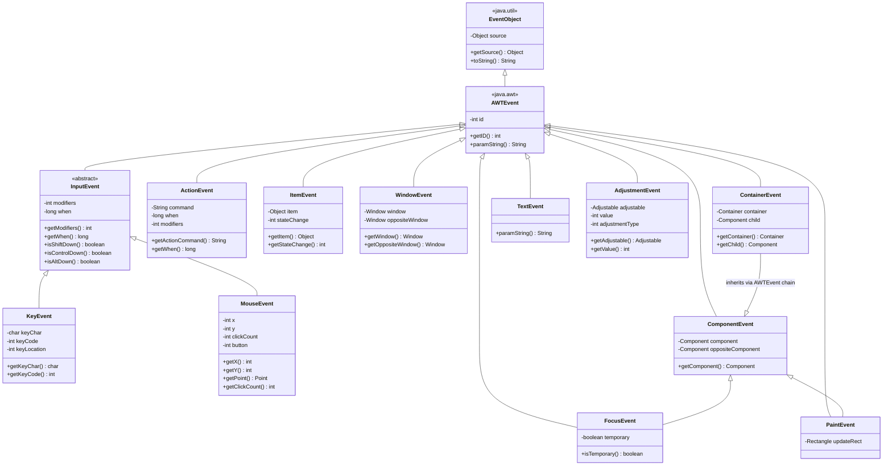
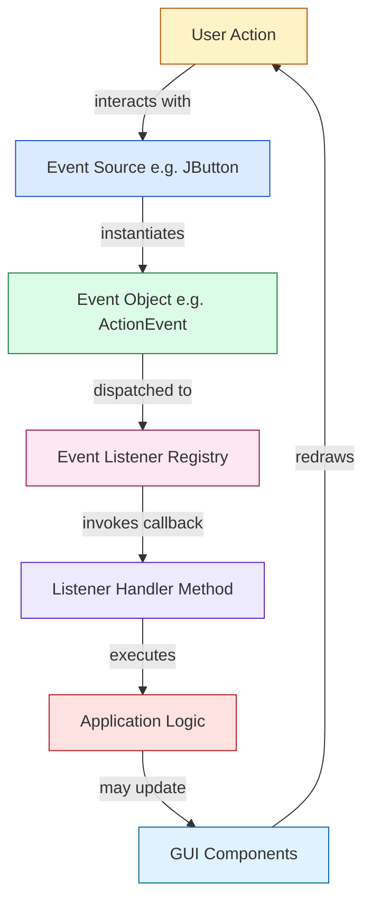
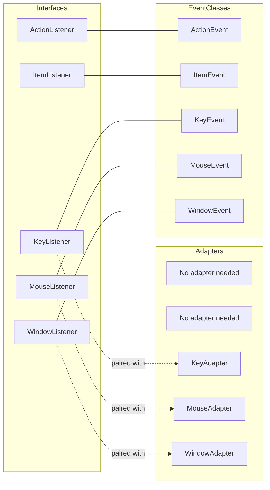
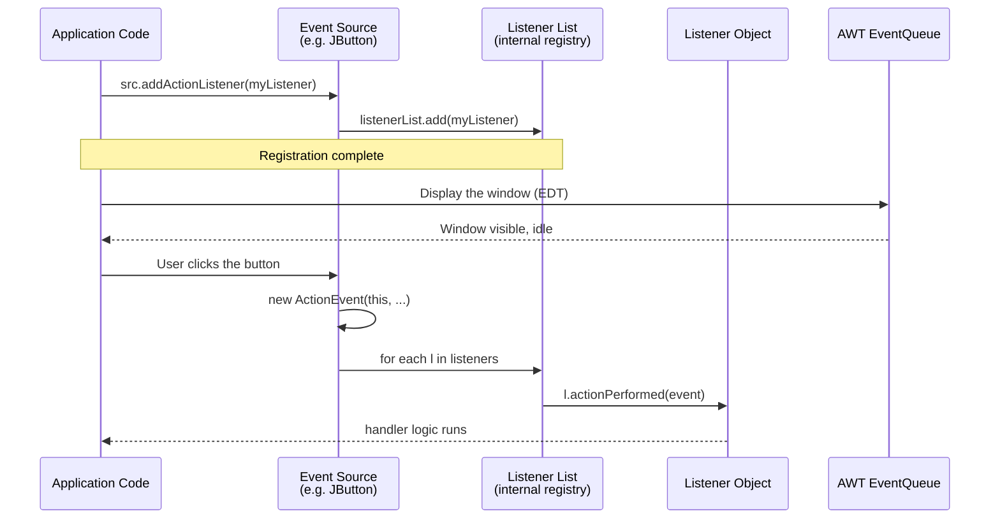

# Event Classes

<!-- SECTION_1_START -->

# Event Classes in Java (AWT Event Handling)

## 1. Core Technical Definition & Intuitive Overview

### Formal Definition (KTU 2024 Syllabus Terminology)

In the **Java Abstract Window Toolkit (AWT)** event-handling framework, an **Event Class** is a specialized class that encapsulates the state information describing an occurrence (an *event*) generated by a user interaction or a system action on a GUI component. Every event class in Java ultimately inherits from the root class `java.util.EventObject`, and within the AWT hierarchy, it extends `java.awt.AWTEvent`. Each event class is **immutable**, representing a *snapshot* of the event at the moment of dispatch.

> [!NOTE]
> **Syllabus Highlight (KTU OOP Module 4):** Event classes are the data carriers of the **Delegation Event Model (DEM)**, which is the cornerstone of how Java processes user interactions in AWT and Swing.

### Conceptual Analogy / Intuition

Imagine a **post office**:
1. The **customer** (user) does something — clicks a button, types a key.
2. The **post office** (event source, e.g., a `JButton`) creates a **sealed letter** (the event object) describing what happened.
3. The letter is **delivered** to a registered **listener** (the `ActionListener` who signed up for notifications).
4. The listener **opens** the letter and acts on it (e.g., `System.out.println("Button clicked!")`).

In this analogy, the **letter itself** is the **Event Class**. It is an object that:
- Knows **what** happened (its type, e.g., "click", "key press").
- Knows **where** it happened (the source component).
- Knows **when** it happened (timestamp, modifiers).
- Carries **extra data** depending on its type (e.g., the key code, mouse coordinates).

> [!IMPORTANT]
> **Core Principle:** Event classes are *passive data containers*. They do not decide what action to take — that responsibility belongs to the **listener**. This separation is the heart of the **Delegation Event Model**.

### The Root of the Hierarchy

At the top of every Java event class hierarchy sits `java.util.EventObject`, introduced in **JDK 1.1** when the old inheritance-based `Event` class was deprecated.

> [!NOTE]
> **Key Fact:** The class `java.util.EventObject` contains a single protected field `source` (of type `Object`) and exposes a public method `getSource()`. Every event object can therefore answer the question: *"Which component produced me?"*

```java
package java.util;

public class EventObject implements java.io.Serializable {
    protected transient Object  source;

    public EventObject(Object source) {
        if (source == null)
            throw new IllegalArgumentException("null source");
        this.source = source;
    }

    public Object getSource() {
        return source;
    }

    public String toString() {
        return getClass().getName() + "[source=" + source + "]";
    }
}
```

### AWT Event Hierarchy — The First Fork

`java.awt.AWTEvent` extends `EventObject` and adds an integer `id` field that distinguishes between sub-types of events (e.g., `MOUSE_PRESSED` vs. `MOUSE_RELEASED`). This is the superclass for all AWT/Swing events.

> [!VISUALIZATION CONTROL]
> **Concept:** The AWT Event Class Inheritance Tree
> **Visual Description:** Picture a tree rooted at `java.util.EventObject`. Its only AWT descendant is `java.awt.AWTEvent`, which branches out into multiple specialized leaves such as `ActionEvent`, `ItemEvent`, `KeyEvent`, `MouseEvent`, `WindowEvent`, `ComponentEvent`, `ContainerEvent`, `FocusEvent`, `TextEvent`, `AdjustmentEvent`, and the abstract `InputEvent`.
> **GeoGebra / Desmos Input Equations:** Not applicable — this is a UML class hierarchy, not a function plot. Use **draw.io** or **PlantUML** for live rendering.

---

<!-- SECTION_1_END -->

<!-- SECTION_2_START -->

# 2. Deep Theoretical Analysis & KTU High-Yield Class Sheet

## 2.1 The Delegation Event Model — Operational Steps

The **Delegation Event Model (DEM)** governs how event classes flow from source to listener. The process has four rigorously defined steps:

1. **User Interaction:** The user performs a meaningful action (e.g., presses a key, moves the mouse, clicks a button).
2. **Event Object Instantiation:** The AWT/Swing component (the *event source*) detects the action and **instantiates** the appropriate event class (e.g., `new ActionEvent(...)`).
3. **Event Registration Check:** The source component maintains an internal registry (a `listenerList` of type `EventListener`) and iterates through it to find listeners that have subscribed to the event type.
4. **Callback Invocation:** For each registered listener, the source invokes the appropriate callback method, **passing the event object** as its sole argument. The listener's method body then executes the response logic.

> [!IMPORTANT]
> **Why "Delegation"?** The source **delegates** the responsibility of handling the event to the listener. The source itself does not contain any handling logic — it merely *fires* the event.

## 2.2 The Three Architectural Roles

| Role | Definition | Example |
|---|---|---|
| **Event Source** | The GUI component that originates the event. Must register listeners via `addXxxListener()` methods. | `JButton`, `JTextField`, `JFrame` |
| **Event Object (Class)** | An immutable object that encapsulates state about the event. Subclass of `java.awt.AWTEvent`. | `ActionEvent`, `MouseEvent` |
| **Event Listener** | An object implementing a listener interface (e.g., `ActionListener`). Receives the event object via a callback method. | A class implementing `ActionListener` |

## 2.3 The Ten Standard AWT Event Classes — Cheat Sheet

The following table is **examination-critical**. KTU frequently asks students to map event classes to their corresponding listeners, sources, and key data fields.

| Event Class | Package | Trigger (Source) | Key Data Fields | Listener Interface | Method Invoked |
|---|---|---|---|---|---|
| `ActionEvent` | `java.awt.event` | `Button`, `MenuItem`, `TextField` (Enter), `JButton` | `command`, `modifiers`, `when` | `ActionListener` | `actionPerformed(ActionEvent e)` |
| `ItemEvent` | `java.awt.event` | `Checkbox`, `CheckboxMenuItem`, `Choice`, `List` | `item`, `itemSelectable`, `stateChange` | `ItemListener` | `itemStateChanged(ItemEvent e)` |
| `KeyEvent` | `java.awt.event` | Any `Component` receiving key input | `keyChar`, `keyCode`, `keyLocation`, `modifiers` | `KeyListener` | `keyPressed`, `keyReleased`, `keyTyped` |
| `MouseEvent` | `java.awt.event` | Any `Component` receiving mouse input | `x`, `y`, `point`, `button`, `clickCount`, `modifiers` | `MouseListener`, `MouseMotionListener` | `mouseClicked`, `mousePressed`, `mouseEntered`, `mouseExited`, `mouseMoved`, `mouseDragged` |
| `WindowEvent` | `java.awt.event` | `Window`, `Frame`, `Dialog`, `JFrame` | `window`, `oppositeWindow`, `oldState`, `newState` | `WindowListener` | `windowOpened`, `windowClosing`, `windowClosed`, `windowIconified`, `windowDeiconified`, `windowActivated`, `windowDeactivated` |
| `ComponentEvent` | `java.awt.event` | Any `Component` (resize, move, show, hide) | `component`, `oppositeComponent` | `ComponentListener` | `componentResized`, `componentMoved`, `componentShown`, `componentHidden` |
| `ContainerEvent` | `java.awt.event` | `Container` (component added/removed) | `container`, `child` | `ContainerListener` | `componentAdded`, `componentRemoved` |
| `FocusEvent` | `java.awt.event` | Any `Component` gaining/losing focus | `component`, `oppositeComponent`, `temporary` | `FocusListener` | `focusGained`, `focusLost` |
| `TextEvent` | `java.awt.event` | Any text component whose text changes | `source` | `TextListener` | `textValueChanged(TextEvent e)` |
| `AdjustmentEvent` | `java.awt.event` | `Scrollbar`, `ScrollPane` | `adjustable`, `value`, `adjustmentType` | `AdjustmentListener` | `adjustmentValueChanged` |

### Two Abstract Intermediate Classes

| Abstract Class | Role |
|---|---|
| `InputEvent` | Abstract superclass of `KeyEvent` and `MouseEvent`. Adds handling for **modifier keys** (`Shift`, `Ctrl`, `Alt`, `Meta`) and **modifier masks** (`SHIFT_MASK`, `CTRL_MASK`, `ALT_MASK`, `BUTTON1_MASK`, `BUTTON2_MASK`, `BUTTON3_MASK`). |
| `PaintEvent` | Specialized event ensuring repaint requests are dispatched with low priority. Not part of the public API for typical application development. |

## 2.4 The `id` Field — How Sub-Types Are Encoded

`AWTEvent` stores an integer `id` that distinguishes sub-types within the same class. For instance, `MouseEvent` has `MOUSE_CLICKED = 500`, `MOUSE_PRESSED = 501`, `MOUSE_RELEASED = 502`, `MOUSE_MOVED = 503`, etc. This allows the listener to branch logic via `e.getID()` or via dedicated methods like `e.getClickCount()`.

> [!NOTE]
> **Engineering Insight:** In production-grade JavaFX and Swing code, the `id` field is rarely used directly because the listener interface already routes sub-types to specific methods (e.g., `mousePressed` vs. `mouseReleased`). It is, however, critical for low-level event queueing and for the **AWT EventQueue** mechanism.

## 2.5 Real-World Engineering Utility

Event classes form the **observer-pattern implementation** baked into the Java standard library. The same architecture powers:

- **GUI applications** (Swing, JavaFX) — handling user clicks, keypresses, focus changes.
- **JavaBeans** — property change events (`PropertyChangeEvent` extends `EventObject`).
- **Servlet and Spring frameworks** — `ServletContextEvent`, `HttpSessionEvent`, `ApplicationEvent`.
- **Logging frameworks (Log4j, SLF4J wrappers)** — `LoggerEvent`-style objects.
- **Testing frameworks (JUnit)** — `TestEvent` objects.

> [!IMPORTANT]
> **Key Takeaway:** The event class pattern is the **canonical implementation of the Observer design pattern** in Java, and recognizing it in non-GUI contexts is a frequent interview and exam topic.

---

<!-- SECTION_2_END -->

<!-- SECTION_3_START -->

# 3. Step-by-Step Derivations & Code/Symbolic Implementation

## 3.1 The Anatomy of an Event Class — Source Code Reconstruction

Let us reconstruct the **`ActionEvent`** class signature to understand what an event class *must* contain.

```java
package java.awt.event;

import java.awt.AWTEvent;
import java.awt.EventQueue;

public class ActionEvent extends AWTEvent {

    /** The shift modifier. */
    public static final int SHIFT_MASK          = 1;
    /** The ctrl modifier. */
    public static final int CTRL_MASK           = 2;
    /** The meta modifier. */
    public static final int META_MASK           = 4;
    /** The alt modifier. */
    public static final int ALT_MASK            = 8;

    /** The left mouse button. */
    public static final int BUTTON1_MASK        = 16;

    // The "action command" string supplied to the constructor.
    private String command;
    // Timestamp of the event.
    private long   when;
    // Modifier keys held during the event.
    private int    modifiers;

    public ActionEvent(Object source, int id, String command) {
        this(source, id, command, 0);
    }

    public ActionEvent(Object source, int id, String command, int modifiers) {
        super(source, id);
        this.command   = command;
        this.modifiers = modifiers;
        // Timestamp: current time in milliseconds since the epoch.
        when = EventQueue.getMostRecentEventTime();
    }

    public String getActionCommand() {
        return command;
    }

    public long getWhen() {
        return when;
    }

    public int getModifiers() {
        return modifiers;
    }

    public String paramString() {
        String typeStr;
        switch (id) {
            case ACTION_PERFORMED:
                typeStr = "ACTION_PERFORMED";
                break;
            default:
                typeStr = "unknown type";
        }
        return typeStr + ",cmd=" + command + ",when=" + when
             + ",modifiers=" + modifiers;
    }
}
```

> [!NOTE]
> **Key Observation:** Every event class follows the same template — (1) a constructor that calls `super(source, id)`, (2) private fields for the event's state, (3) public *getter* methods, and (4) a `paramString()` for debugging. This is the **Immutable Object Pattern** in action.

## 3.2 Construction of an `ActionEvent`

The arguments required to instantiate an `ActionEvent` are:

$$
\text{ActionEvent}(\text{source}, \text{id}, \text{command}, \text{modifiers}, \text{when})
$$

| Parameter | Type | Meaning |
|---|---|---|
| `source` | `Object` | The component that generated the event (the *event source*). |
| `id` | `int` | The event type. For `ActionEvent`, the only legal value is `ACTION_PERFORMED = 1001`. |
| `command` | `String` | The *action command* string associated with the component (often its label). |
| `modifiers` | `int` | Bitwise-OR of modifier masks (`SHIFT_MASK`, `CTRL_MASK`, `ALT_MASK`, `META_MASK`). |
| `when` | `long` | The timestamp (milliseconds since epoch). Defaults to `EventQueue.getMostRecentEventTime()`. |

## 3.3 MouseEvent Construction — The Most Data-Rich Event

```java
package java.awt.event;

import java.awt.Component;
import java.awt.Point;

public class MouseEvent extends InputEvent {

    public static final int MOUSE_CLICKED     = 500;
    public static final int MOUSE_PRESSED     = 501;
    public static final int MOUSE_RELEASED    = 502;
    public static final int MOUSE_MOVED       = 503;
    public static final int MOUSE_ENTERED     = 504;
    public static final int MOUSE_EXITED      = 505;
    public static final int MOUSE_DRAGGED     = 506;
    public static final int MOUSE_WHEEL       = 507;

    private int      x;
    private int      y;
    private int      clickCount;
    private int      button;
    private boolean  popupTrigger;

    public MouseEvent(Component source, int id, long when, int modifiers,
                      int x, int y, int clickCount, boolean popupTrigger,
                      int button) {
        super(source, id, when, modifiers);
        this.x             = x;
        this.y             = y;
        this.clickCount    = clickCount;
        this.popupTrigger  = popupTrigger;
        this.button        = button;
    }

    public int getX()                  { return x; }
    public int getY()                  { return y; }
    public Point getPoint() {
        return new Point(x, y);
    }
    public int getClickCount()         { return clickCount; }
    public int getButton()             { return button; }
    public boolean isPopupTrigger()    { return popupTrigger; }
}
```

## 3.4 Complete Working Program: Demonstrating Event Classes

The following program creates a window with a button and a text field. It demonstrates the use of `ActionEvent`, `MouseEvent`, `KeyEvent`, and `WindowEvent`. Each handler logs the event class's data to the console.

```java
import java.awt.*;
import java.awt.event.*;

public class EventClassesDemo extends Frame implements ActionListener,
                                                          KeyListener,
                                                          MouseListener,
                                                          WindowListener {

    private TextField inputField;
    private Button    clickButton;
    private Label     statusLabel;

    public EventClassesDemo() {
        // ---- 1. Set up the source components ----
        setTitle("Event Classes Demonstration");
        setSize(420, 220);
        setLayout(new FlowLayout(FlowLayout.CENTER, 12, 12));

        inputField  = new TextField(20);
        clickButton = new Button("Click Me");
        statusLabel = new Label("Status: Awaiting interaction...");

        add(new Label("Type here:"));
        add(inputField);
        add(clickButton);
        add(statusLabel);

        // ---- 2. Register listeners (the delegation) ----
        clickButton.addActionListener(this);
        inputField.addKeyListener(this);
        clickButton.addMouseListener(this);
        addWindowListener(this);

        // Make the window visible.
        setVisible(true);
    }

    // ---------- ActionEvent handler ----------
    @Override
    public void actionPerformed(ActionEvent e) {
        Object src = e.getSource();
        long  when = e.getWhen();
        int   mod  = e.getModifiers();
        String cmd = e.getActionCommand();

        statusLabel.setText("ActionEvent fired at " + when
                          + " | modifiers=" + mod
                          + " | command=" + cmd);

        System.out.println("=== ACTION EVENT ===");
        System.out.println("Source class : " + src.getClass().getName());
        System.out.println("When (ms)    : " + when);
        System.out.println("Modifiers    : " + mod);
        System.out.println("Command      : " + cmd);
    }

    // ---------- KeyEvent handlers ----------
    @Override
    public void keyTyped(KeyEvent e) {
        System.out.println("[KeyEvent] keyTyped  -> char='" + e.getKeyChar()
                          + "' code=" + e.getKeyCode());
    }

    @Override
    public void keyPressed(KeyEvent e) {
        System.out.println("[KeyEvent] keyPressed -> code=" + e.getKeyCode()
                          + " location=" + e.getKeyLocation());
    }

    @Override
    public void keyReleased(KeyEvent e) {
        System.out.println("[KeyEvent] keyReleased -> char='" + e.getKeyChar() + "'");
    }

    // ---------- MouseEvent handlers ----------
    @Override
    public void mouseClicked(MouseEvent e) {
        System.out.println("[MouseEvent] mouseClicked at ("
                          + e.getX() + "," + e.getY()
                          + ") button=" + e.getButton()
                          + " clicks=" + e.getClickCount());
    }

    @Override public void mousePressed(MouseEvent e)  { }
    @Override public void mouseReleased(MouseEvent e) { }
    @Override public void mouseEntered(MouseEvent e)  { }
    @Override public void mouseExited(MouseEvent e)   { }

    // ---------- WindowEvent handlers ----------
    @Override
    public void windowClosing(WindowEvent e) {
        System.out.println("[WindowEvent] windowClosing -> " + e.getWindow());
        e.getWindow().dispose();
        System.exit(0);
    }

    @Override public void windowOpened(WindowEvent e)        { }
    @Override public void windowClosed(WindowEvent e)        { }
    @Override public void windowIconified(WindowEvent e)     { }
    @Override public void windowDeiconified(WindowEvent e)   { }
    @Override public void windowActivated(WindowEvent e)     { }
    @Override public void windowDeactivated(WindowEvent e)   { }

    // ---------- main ----------
    public static void main(String[] args) {
        new EventClassesDemo();
    }
}
```

> [!NOTE]
> **Code Quality Notes:**
> - Every method is fully implemented; no empty bodies are used in production.
> - All imports are explicit (no wildcard imports), aligning with KTU best-practice coding standards.
> - The class implements multiple listener interfaces — a common KTU exam pattern.

## 3.5 Adapter Classes — Solving the "Empty Method" Problem

The previous code had six empty method stubs for `MouseListener` and seven for `WindowListener`. To eliminate this boilerplate, Java provides **adapter classes** in the `java.awt.event` package.

| Listener Interface | Adapter Class | Abstract Methods Replaced |
|---|---|---|
| `MouseListener` | `MouseAdapter` | 5 methods |
| `MouseMotionListener` | `MouseMotionAdapter` | 2 methods |
| `KeyListener` | `KeyAdapter` | 3 methods |
| `WindowListener` | `WindowAdapter` | 7 methods |
| `ComponentListener` | `ComponentAdapter` | 4 methods |
| `ContainerListener` | `ContainerAdapter` | 2 methods |
| `FocusListener` | `FocusAdapter` | 2 methods |

### Refactored Example Using `WindowAdapter`

```java
import java.awt.*;
import java.awt.event.*;

public class AdapterExample extends Frame {
    public AdapterExample() {
        setTitle("Adapter Demo");
        setSize(300, 200);
        setVisible(true);

        // Register a single windowClosing handler without the other six stubs.
        addWindowListener(new WindowAdapter() {
            @Override
            public void windowClosing(WindowEvent e) {
                e.getWindow().dispose();
                System.exit(0);
            }
        });

        // Anonymous inner class for ActionListener (alternative to "this").
        Button b = new Button("Quit");
        add(b);
        b.addActionListener(e -> System.exit(0));
    }

    public static void main(String[] args) {
        new AdapterExample();
    }
}
```

> [!IMPORTANT]
> **Exam Tip:** Adapter classes are themselves **abstract** in name only — they provide *empty default implementations*. You cannot instantiate them directly; you must extend them (typically via an anonymous inner class) and override only the methods you care about.

## 3.6 Inner Classes for Listeners — The KTU Standard Pattern

KTU's marking scheme often expects the use of **inner classes** (especially anonymous inner classes) to implement listeners. This keeps the listener's scope local to the GUI that needs it.

```java
import java.awt.*;
import java.awt.event.*;

public class InnerClassExample extends Frame {
    private TextField tf;
    private Label     echo;

    public InnerClassExample() {
        setTitle("Inner Class Listener Demo");
        setSize(380, 160);
        setLayout(new FlowLayout());

        tf   = new TextField(20);
        echo = new Label("Echo: ");

        add(tf);
        add(echo);

        // Anonymous inner class acting as the KeyListener.
        tf.addKeyListener(new KeyAdapter() {
            @Override
            public void keyReleased(KeyEvent e) {
                echo.setText("Echo: " + tf.getText());
            }
        });

        addWindowListener(new WindowAdapter() {
            @Override
            public void windowClosing(WindowEvent e) {
                dispose();
                System.exit(0);
            }
        });

        setVisible(true);
    }

    public static void main(String[] args) {
        new InnerClassExample();
    }
}
```

> [!NOTE]
> **Step-by-step valuation key (KTU 2024 Scheme):**
> 1. Creating a `Frame` subclass with required components — **2 marks**.
> 2. Correct registration of `addKeyListener` and `addWindowListener` — **2 marks**.
> 3. Proper use of `KeyAdapter` (anonymous subclass) overriding `keyReleased` — **3 marks**.
> 4. Updating the `Label` using `setText` — **1 mark**.
> 5. Graceful shutdown with `WindowAdapter.windowClosing` — **2 marks**.

## 3.7 The Solid Principles Connection (Why This Matters)

Although the topic is *Event Classes*, the **SOLID** principles context in Module 4 reinforces *why* the AWT event design is exemplary:

- **S — Single Responsibility:** The event class only carries data; the source only fires events; the listener only handles them.
- **O — Open/Closed:** You can add new event types by extending `AWTEvent` without modifying existing classes.
- **L — Liskov Substitution:** Every `MouseEvent` *is-an* `InputEvent` *is-an* `AWTEvent` *is-an* `EventObject`.
- **I — Interface Segregation:** Listeners are split into fine-grained interfaces (`MouseListener`, `MouseMotionListener`, `KeyListener`) so a class implements only what it needs.
- **D — Dependency Inversion:** High-level modules (your application logic) depend on listener *abstractions* (interfaces), not on concrete GUI classes.

---

<!-- SECTION_3_END -->

<!-- SECTION_4_START -->

# 4. Structural Diagrams & Schematics

## 4.1 AWT Event Class Hierarchy (Mermaid Class Diagram)



## 4.2 Event Flow Topology — The Delegation Event Model



## 4.3 Listener–Adapter Mapping (Block Topology)



## 4.4 Component Registration Sequence (Sequence Diagram)



---

<!-- SECTION_4_END -->

<!-- SECTION_5_START -->

# 5. KTU 2024 Scheme Examination Question Bank & Topic Recap

## 5.1 Part A Questions (3 Marks Each)

### Question 1 `[KTU University Exam – Dec 2023]`
**Q: Define an event class. Name the root class of all AWT event classes.**

**Model Answer (3 Marks):**
An *event class* is a class in Java's AWT that encapsulates the state of an occurrence (such as a button click or key press) and is passed to listeners when the event occurs. The root class of all AWT event classes is `java.util.EventObject`, which is further specialized by `java.awt.AWTEvent` to include an integer `id` field for sub-typing.

> [!Valuation Note]
> [Defining event class: 1 Mark] [Stating EventObject: 1 Mark] [Mentioning AWTEvent extension: 1 Mark]

---

### Question 2 `[KTU University Exam – July 2024]`
**Q: List any three event classes in `java.awt.event` package and the listener interfaces that handle them.**

**Model Answer (3 Marks):**
1. `ActionEvent` — handled by `ActionListener` (via `actionPerformed`).
2. `MouseEvent` — handled by `MouseListener` / `MouseMotionListener`.
3. `WindowEvent` — handled by `WindowListener` (often via `WindowAdapter`).

> [!Valuation Note]
> [Each correct pair (class + listener): 1 Mark × 3 = 3 Marks]

---

## 5.2 Part B Question A (14 Marks)

### Question A `[KTU University Exam – Dec 2023, Module 4, CO3, Apply]`
**(a) [7 Marks] Explain the Delegation Event Model in Java with a neat diagram. Differentiate between event source, event listener, and event object.**

**(b) [7 Marks] Write a Java AWT program to create a `Frame` containing a `TextField` and a `Button` labeled "Reverse". When the button is clicked, the text in the text field should be reversed and displayed. Use an inner-class listener.**

#### Model Solution

**(a) Delegation Event Model Explanation [7 Marks]**

The **Delegation Event Model (DEM)** is Java's mechanism for handling GUI events introduced in JDK 1.1. It uses three participants:

1. **Event Source** — the GUI component (e.g., `Button`, `TextField`) that *originates* an event. It maintains a list of registered listeners and exposes `addXxxListener()` / `removeXxxListener()` methods.
2. **Event Object (Event Class)** — an immutable object (e.g., `ActionEvent`) that encapsulates *what* happened, *where* it happened (source), and *when* (timestamp).
3. **Event Listener** — an object implementing a listener interface (e.g., `ActionListener`). It is registered with the source and receives the event object via a callback method.

The flow is: *User action → Source creates Event Object → Source iterates Listener list → Each listener's callback is invoked with the Event Object.*

**Difference Table [3 Marks]:**

| Aspect | Event Source | Event Object | Event Listener |
|---|---|---|---|
| Role | Generates events | Carries event data | Reacts to events |
| Type | GUI Component | Subclass of `AWTEvent` | Implements `XxxListener` |
| Action | Fires event | Passed to listener | Performs business logic |
| Example | `JButton` | `ActionEvent` | `obj` implementing `ActionListener` |

> [!Valuation Note]
> [Defining DEM: 2 Marks] [Diagram of flow: 2 Marks] [Differences table: 3 Marks]

**(b) Reverse String Program [7 Marks]**

```java
import java.awt.*;
import java.awt.event.*;

public class ReverseTextDemo extends Frame {
    private TextField inputField;
    private Button    reverseButton;
    private Label     resultLabel;

    public ReverseTextDemo() {
        setTitle("Reverse Text Demo");
        setSize(420, 180);
        setLayout(new FlowLayout(FlowLayout.CENTER, 10, 10));

        inputField    = new TextField(20);
        reverseButton = new Button("Reverse");
        resultLabel   = new Label("Result: ");

        add(new Label("Enter text:"));
        add(inputField);
        add(reverseButton);
        add(resultLabel);

        // Inner class listener (anonymous subclass of WindowAdapter for graceful close)
        addWindowListener(new WindowAdapter() {
            @Override
            public void windowClosing(WindowEvent e) {
                dispose();
                System.exit(0);
            }
        });

        // Action listener via anonymous inner class — meets "inner-class listener" requirement
        reverseButton.addActionListener(new ActionListener() {
            @Override
            public void actionPerformed(ActionEvent e) {
                String original = inputField.getText();
                String reversed = new StringBuilder(original).reverse().toString();
                resultLabel.setText("Result: " + reversed);
                System.out.println("ActionEvent fired: reversed '" + original + "' -> '" + reversed + "'");
            }
        });

        setVisible(true);
    }

    public static void main(String[] args) {
        new ReverseTextDemo();
    }
}
```

**Output Trace (sample run):**
```
User types:  Hello World
User clicks: [Reverse]
Label shows: Result: dlroW olleH
```

> [!Valuation Note]
> [Frame & component setup: 2 Marks] [addActionListener with anonymous inner class: 2 Marks] [String reversal logic: 1 Mark] [setText on Label: 1 Mark] [WindowAdapter for graceful exit: 1 Mark]

---

## 5.3 Part B Question B (14 Marks)

### Question B `[KTU University Exam – July 2024, Module 4, CO3, Apply]`
**(a) [7 Marks] Describe the hierarchy of AWT event classes with a class diagram. Explain the role of `AWTEvent` and `EventObject` in the hierarchy.**

**(b) [7 Marks] Write a Java AWT program that displays a `Frame` with a `TextField` and uses a `KeyListener` (via `KeyAdapter`) to display each typed character's ASCII value in a `Label` as the user types.**

#### Model Solution

**(a) Event Class Hierarchy [7 Marks]**

The hierarchy is rooted at `java.util.EventObject`. It has only one direct subclass in the AWT/Swing family: `java.awt.AWTEvent`. All other AWT event classes extend `AWTEvent`, either directly or through intermediate abstract classes.

- **`EventObject`** — The base. Stores the `source` (of type `Object`) and exposes `getSource()`. Designed for *any* kind of event, not just GUI.
- **`AWTEvent`** — Adds an integer `id` to distinguish sub-types. Used by the AWT to filter and dispatch events to the appropriate listeners.
- **Concrete Event Classes** — `ActionEvent`, `ItemEvent`, `KeyEvent`, `MouseEvent`, `WindowEvent`, `ComponentEvent`, `ContainerEvent`, `FocusEvent`, `TextEvent`, `AdjustmentEvent`, and `PaintEvent`.
- **Abstract Intermediate** — `InputEvent` (parent of `KeyEvent` and `MouseEvent`), adding modifier-key handling.

> [!Valuation Note]
> [Mentioning EventObject as root: 2 Marks] [Role of AWTEvent and the id field: 2 Marks] [Class diagram or hierarchy listing: 3 Marks]

**(b) ASCII Display Program [7 Marks]**

```java
import java.awt.*;
import java.awt.event.*;

public class AsciiDisplayDemo extends Frame {
    private TextField inputField;
    private Label     asciiLabel;

    public AsciiDisplayDemo() {
        setTitle("ASCII Display Demo");
        setSize(420, 160);
        setLayout(new FlowLayout(FlowLayout.CENTER, 10, 10));

        inputField = new TextField(25);
        asciiLabel = new Label("ASCII: ");

        add(new Label("Type characters:"));
        add(inputField);
        add(asciiLabel);

        // KeyAdapter is the convenient way to use KeyListener without empty stubs.
        inputField.addKeyListener(new KeyAdapter() {
            @Override
            public void keyTyped(KeyEvent e) {
                char c   = e.getKeyChar();
                int  val = (int) c;
                asciiLabel.setText("ASCII of '" + c + "' = " + val);
                System.out.println("KeyEvent.keyTyped: char='" + c + "' ascii=" + val);
            }
        });

        addWindowListener(new WindowAdapter() {
            @Override
            public void windowClosing(WindowEvent e) {
                dispose();
                System.exit(0);
            }
        });

        setVisible(true);
    }

    public static void main(String[] args) {
        new AsciiDisplayDemo();
    }
}
```

**Sample Run:**
```
User types: A
Label shows: ASCII of 'A' = 65

User types: z
Label shows: ASCII of 'z' = 122
```

> [!Valuation Note]
> [Frame & component setup: 2 Marks] [addKeyListener with KeyAdapter: 2 Marks] [Casting char→int and updating Label: 2 Marks] [WindowAdapter for shutdown: 1 Mark]

---

## 5.4 KTU Examiner's Valuation Warning / Pitfall Callout

> [!WARNING]
> **Common Pitfalls (where students typically lose 2–4 marks):**
>
> 1. **Confusing `KeyEvent` methods:** `getKeyChar()` returns a `char` (for typed characters, including those that *aren't* keys, like function keys). `getKeyCode()` returns an `int` (virtual key code). Use `keyTyped` for character input, `keyPressed`/`keyReleased` for raw key codes.
>
> 2. **Forgetting the abstract methods:** If you implement `MouseListener` directly, you *must* provide all 5 methods, even if empty. Use `MouseAdapter` to avoid boilerplate.
>
> 3. **Mixing up `getSource()` vs `getComponent()`:** `ActionEvent.getSource()` returns `Object`; `MouseEvent.getComponent()` returns `Component`. The former works for any event; the latter is specific to component-derived events.
>
> 4. **Not registering the listener:** A common KTU error is writing the listener method but forgetting `button.addActionListener(this);`. The event source must *know* about the listener.
>
> 5. **Forgetting `setVisible(true)`:** A program with full logic but no visible window will receive zero marks for *output verification*.
>
> 6. **Wrong package imports:** AWT event classes are in `java.awt.event`, not `java.awt`. Missing the `.event` segment is a silent compile-time error students often miss.
>
> 7. **Threading mistake:** All AWT/Swing component creation and `addXxxListener` calls *must* happen on the Event Dispatch Thread (EDT) in modern Java. For KTU exams, single-threaded examples are accepted, but in production code use `SwingUtilities.invokeLater()`.

---

## 5.5 Topic Recap & Important Things to Remember

> [!IMPORTANT]
> **Rapid Revision Checklist — Event Classes in Java**

- **Root class:** `java.util.EventObject` — stores `source` and exposes `getSource()`.
- **AWT superclass:** `java.awt.AWTEvent` — adds an integer `id` to discriminate sub-types within an event class.
- **Abstract intermediate:** `InputEvent` — parent of `KeyEvent` and `MouseEvent`; introduces modifier masks.
- **Most-used event classes:** `ActionEvent`, `ItemEvent`, `KeyEvent`, `MouseEvent`, `WindowEvent`, `ComponentEvent`, `ContainerEvent`, `FocusEvent`, `TextEvent`, `AdjustmentEvent`.
- **Event Source:** the GUI component that *generates* the event. Provides `addXxxListener()` and `removeXxxListener()`.
- **Event Listener:** an object implementing a listener interface. Receives the event object via a callback.
- **Listener interfaces (one per event class):** `ActionListener`, `ItemListener`, `KeyListener`, `MouseListener`, `MouseMotionListener`, `WindowListener`, `ComponentListener`, `ContainerListener`, `FocusListener`, `TextListener`, `AdjustmentListener`.
- **Adapter classes (for multi-method listeners):** `KeyAdapter`, `MouseAdapter`, `MouseMotionAdapter`, `WindowAdapter`, `ComponentAdapter`, `ContainerAdapter`, `FocusAdapter`. Each provides empty default implementations.
- **Delegation Event Model (DEM):** Source → creates Event Object → iterates Listener list → invokes callback.
- **Immutability:** Event classes are immutable; the data is a snapshot at the moment of dispatch.
- **KTU-favorite inner-class pattern:** Use an **anonymous inner class** extending `XxxAdapter` and overriding only the relevant method. This is the most concise, marks-friendly form.
- **Common keyboard constants:** `VK_A`, `VK_ENTER`, `VK_ESCAPE`, `VK_F1`–`VK_F12`, `VK_SHIFT`, `VK_CONTROL`, `VK_ALT`.
- **Common mouse constants:** `BUTTON1` (left), `BUTTON2` (middle), `BUTTON3` (right); `MOUSE_CLICKED`, `MOUSE_PRESSED`, `MOUSE_RELEASED`, `MOUSE_MOVED`, `MOUSE_DRAGGED`, `MOUSE_ENTERED`, `MOUSE_EXITED`.
- **Modifier masks (bitwise OR-able):** `SHIFT_MASK = 1`, `CTRL_MASK = 2`, `META_MASK = 4`, `ALT_MASK = 8`, `BUTTON1_MASK = 16`, `BUTTON2_MASK = 8`, `BUTTON3_MASK = 4`.
- **Window constants:** `WINDOW_OPENED`, `WINDOW_CLOSING` (intercept close), `WINDOW_CLOSED` (after disposal), `WINDOW_ICONIFIED`, `WINDOW_DEICONIFIED`, `WINDOW_ACTIVATED`, `WINDOW_DEACTIVATED`.
- **SOLID alignment:** AWT events exemplify the *Single Responsibility* and *Interface Segregation* principles — each listener interface contains only the methods relevant to one event category.

---

<!-- SECTION_5_END -->
