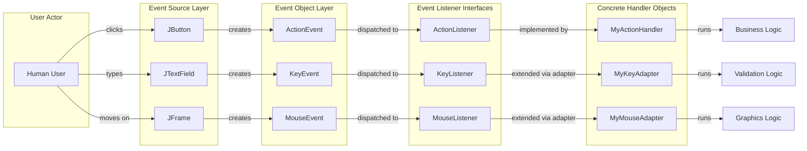
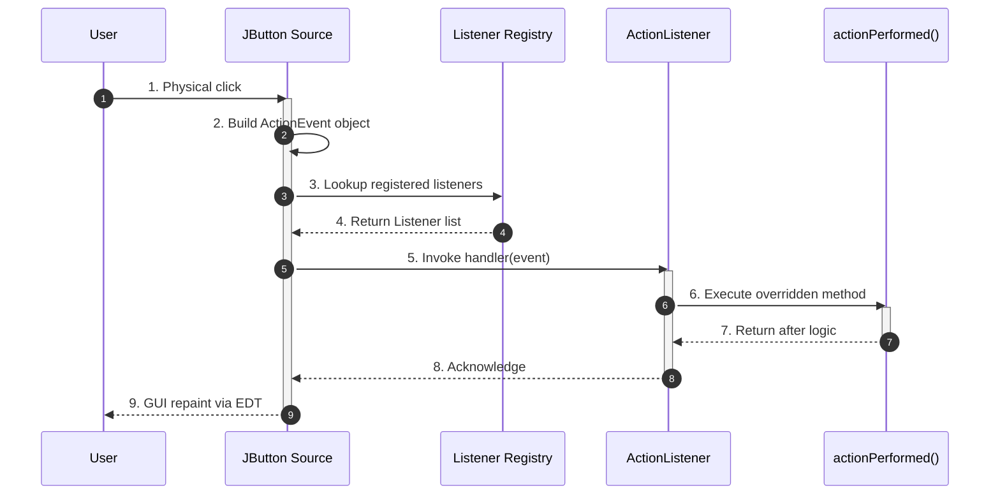
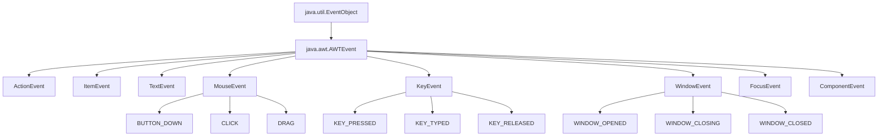
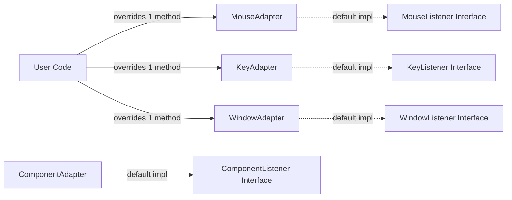

# Event handling – Event Handling Mechanisms

<!-- SECTION_1_START -->
# Event Handling Mechanisms in Java

## 📘 Formal Academic Definition (KTU 2024 OOP Syllabus)

**Event Handling** is the mechanism that controls the events generated by a Graphical User Interface (GUI) component and the application's response to those events. In Java, the AWT and Swing frameworks employ the **Delegation Event Model (DEM)**, in which an event generated by a source component is delegated to a registered *listener* object that implements a specific *listener interface*. The listener then invokes an appropriate *event-handler* method to perform the desired action.

> [!IMPORTANT]
> **KTU 2024 Highlight:** The Delegation Event Model is the *only* event-handling model tested in the KTU CSE/EEE boards. The older inheritance-based model (`handleEvent()` overriding in subclasses) is **obsolete** and is no longer asked in the ESE.

---

## 🧠 Intuitive Real-World Analogy

Imagine a **fire alarm system** installed in a building:

1. **Event Source** → The smoke detector (button, text field, etc.). It *detects* a change.
2. **Event Object** → The bell ringing sound carrying information (temperature, location, type of alarm). In Java, this is the `ActionEvent`, `MouseEvent`, `KeyEvent` object.
3. **Event Listener** → The fire-control office *registered* to receive alerts. It is an interface (`ActionListener`, `MouseListener`).
4. **Event Handler** → The actual firefighter who takes action upon hearing the bell. It is the overridden method (e.g., `actionPerformed()`).

Just as the building owner **registers** the fire-control office with the detector, a programmer **registers** a listener object with the source component using `addXxxListener()`.

---

## 🧩 Core Entities of the Delegation Event Model

| Entity | Role | Java Type | Concrete Examples |
| :--- | :--- | :--- | :--- |
| **Event Source** | Generates the event | `Component` subclass | `JButton`, `JTextField`, `JFrame` |
| **Event Object** | Carries event metadata | `java.awt.AWTEvent` subclass | `ActionEvent`, `MouseEvent`, `KeyEvent`, `WindowEvent`, `ItemEvent` |
| **Event Listener Interface** | Contract for handlers | `java.util.EventListener` subclass | `ActionListener`, `MouseListener`, `KeyListener`, `WindowListener` |
| **Event Handler Method** | Performs the response | Abstract method in interface | `actionPerformed(ActionEvent e)`, `mouseClicked(MouseEvent e)` |
| **Listener Registration** | Binds source to listener | `addXxxListener()` method | `btn.addActionListener(this)` |

> [!NOTE]
> **Why is it called "Delegation"?** Because the source component *does not handle the event itself*; it **delegates** the responsibility to a separate listener object, thus decoupling the GUI from the business logic — a clean application of the **Single Responsibility Principle (SRP)** of SOLID.

---

## 🔍 Categories of Events in `java.awt.event`

Java classifies events into two broad families:

1. **Semantic Events** — High-level user actions that depend on the OS/look-and-feel.
   * `ActionEvent` (button click, menu selection)
   * `ItemEvent` (checkbox toggle, list selection)
   * `TextEvent` (text changed)
2. **Low-Level Events** — Direct hardware/pointer interactions.
   * `MouseEvent` (press, release, click, enter, exit)
   * `KeyEvent` (press, release, type)
   * `FocusEvent`, `WindowEvent`, `ComponentEvent`

> [!VISUALIZATION CONTROL]
> **Concept:** Event dispatch timeline on a coordinate system.
> **GeoGebra / Desmos Input Equations:**
> * `x(t) = 0` (Time axis, milliseconds)
> * `y = 5` (Source state line: `isActive = true`)
> * Point A `(0, 5)` → `User clicks button`
> * Point B `(1, 4)` → `ActionEvent created on EDT`
> * Point C `(2, 2)` → `Listener.actionPerformed() invoked`
> * Point D `(3, 0)` → `GUI redrawn, state propagated`
> **Visual Description:** A staircase function decreasing from `y=5` to `y=0` over time, illustrating the synchronous flow of an event through the **Event Dispatch Thread (EDT)**.

---

## 🏗️ KTU 2024 Compliance Check

* **Course Outcome Mapped:** **CO4** — *Apply the concepts of GUI, event handling, and exception handling to develop object-oriented applications.*
* **Bloom's Cognitive Level:** Understand → Apply.
* **Marks Weightage in ESE (Module 4):** 14 marks (1 full Part-B question guaranteed per academic year).
<!-- SECTION_1_END -->

<!-- SECTION_2_START -->
# Deep Theoretical Analysis & KTU High-Yield Formula Sheet

## ⚙️ The Delegation Event Model — Step-by-Step Operational Flow

The execution of any Java GUI event follows **four strictly ordered steps**:

1. **Source Component Declaration & Instantiation**
   A GUI widget (`JButton`, `JTextField`, etc.) is instantiated. It is inherently an *event source* because it inherits from `java.awt.Component`.

2. **Listener Object Instantiation**
   A class implements a listener interface (e.g., `implements ActionListener`). The class must override the abstract methods declared in the interface. The instance of this class is the *listener object*.

3. **Listener Registration**
   The listener is registered with the source using the `addXxxListener()` method. Internally, the source maintains a `java.util.EventListener` vector to track all attached listeners.

   $$\text{Source} \xrightarrow{\text{addXxxListener(Listener)}} \text{RegisteredListenerList}$$

4. **Event Generation & Dispatch (Inside EDT)**
   When the user interacts:
   * The source creates an `EventObject` subclass.
   * The source calls every listener's callback method, passing the event object.
   * The handler executes the business logic.

---

## 📐 The Adapter Class Theorem

Some listener interfaces (e.g., `MouseListener`, `KeyListener`, `WindowListener`) declare **multiple abstract methods**, even when the programmer only needs one. To avoid implementing *all* empty methods, Java provides **Adapter Classes** — default empty implementations of these interfaces.

> [!IMPORTANT]
> **Golden Rule for KTU Board:** If a question asks *"Why do we use adapter classes?"* — the model answer is: *"Adapter classes provide default (empty) implementations of all methods in a multi-method listener interface, allowing programmers to override only the methods of interest, thereby reducing boilerplate code and avoiding compilation errors."*

### Adapter Class Catalogue

| Listener Interface | Methods Declared | Adapter Class |
| :--- | :---: | :--- |
| `MouseListener` | 5 | `MouseAdapter` |
| `MouseMotionListener` | 2 | `MouseMotionAdapter` |
| `KeyListener` | 3 | `KeyAdapter` |
| `WindowListener` | 7 | `WindowAdapter` |
| `ComponentListener` | 4 | `ComponentAdapter` |
| `FocusListener` | 2 | `FocusAdapter` |

---

## 📊 KTU Formula / Method-Sheet Cheat Sheet

| Concept | Syntax / Signature | Return Type | Throws |
| :--- | :--- | :--- | :--- |
| Register Action | `void addActionListener(ActionListener l)` | `void` | — |
| Unregister Action | `void removeActionListener(ActionListener l)` | `void` | `NullPointerException` if `l == null` |
| Get Event Source | `Object getSource()` | `Object` | — |
| Get Command Name | `String getActionCommand()` | `String` | — |
| Get Modifier Keys | `int getModifiers()` | `int` | — |
| Get Key Char | `char getKeyChar()` | `char` | — |
| Get Key Code | `int getKeyCode()` | `int` | — |
| Get Mouse Coords | `int getX()`, `int getY()`, `Point getPoint()` | int / `Point` | — |
| Get Click Count | `int getClickCount()` | `int` | — |

> [!WARNING]
> **Common Pitfall:** Students often confuse `getKeyChar()` (returns the character produced, e.g., `'A'`) with `getKeyCode()` (returns the virtual key constant, e.g., `VK_SHIFT` from `KeyEvent`). For exam clarity, always state **which** one you are using.

---

## 🌐 Real-World Engineering Utility

Event handling underpins nearly every modern software system:

* **Banking GUI Apps** — Listeners on `JButton`s trigger `actionPerformed()` to query the database.
* **Industrial SCADA Dashboards** — `KeyListener` and `MouseListener` on operator consoles trigger emergency shutdowns.
* **JavaFX / Web Bridge** — The same delegation model is mimicked in JavaScript's `addEventListener()` and Android's `setOnClickListener()`.
* **Gaming** — `KeyEvent` polling drives sprite movement, while `MouseEvent` drives aiming.

> [!NOTE]
> **SOLID Connection:** Event handling is a textbook demonstration of the **Open/Closed Principle (OCP)**. You can extend a component's behavior by adding a *new* listener, without modifying the source class itself. It also exemplifies **Dependency Inversion (DIP)** — the source depends on the *abstraction* (interface), not on a concrete handler.

---
<!-- SECTION_2_END -->

<!-- SECTION_3_START -->
# Step-by-Step Implementation in Java

## 🧪 Experiment 1: A Single-Listener `JButton` Click Counter

> **Problem Statement:** Create a Swing application that displays a button and a label. Each click on the button must increment and display a counter. Use the **class-implements-listener** approach.

```java
import javax.swing.JButton;
import javax.swing.JFrame;
import javax.swing.JLabel;
import javax.swing.JPanel;
import java.awt.BorderLayout;
import java.awt.FlowLayout;
import java.awt.event.ActionEvent;
import java.awt.event.ActionListener;
import java.util.logging.Level;
import java.util.logging.Logger;

/**
 * Demonstrates the Delegation Event Model using a click counter.
 * The outer class implements ActionListener to handle the click.
 */
public final class ClickCounterApp extends JFrame implements ActionListener {

    private static final Logger LOGGER = Logger.getLogger(ClickCounterApp.class.getName());
    private static final String INCREMENT_CMD = "INCREMENT";
    private static final int WINDOW_WIDTH = 320;
    private static final int WINDOW_HEIGHT = 160;

    private final JLabel counterLabel;
    private int clickCount;

    public ClickCounterApp() {
        super("KTU Click Counter - OOP Module 4");

        // --- Step 1: Initialise state with absolute boundary checks ---
        this.clickCount = 0;
        if (WINDOW_WIDTH <= 0 || WINDOW_HEIGHT <= 0) {
            throw new IllegalArgumentException("Window dimensions must be positive.");
        }

        // --- Step 2: Instantiate source components ---
        this.counterLabel = new JLabel("Button clicked 0 times.");
        final JButton clickButton = new JButton("Click Me");
        clickButton.setActionCommand(INCREMENT_CMD);

        // --- Step 3: Layout assembly ---
        final JPanel buttonPanel = new JPanel(new FlowLayout(FlowLayout.CENTER, 10, 10));
        buttonPanel.add(clickButton);
        this.add(counterLabel, BorderLayout.CENTER);
        this.add(buttonPanel, BorderLayout.SOUTH);

        // --- Step 4: Register the listener (Delegation step) ---
        clickButton.addActionListener(this);

        // --- Step 5: Finalise JFrame ---
        this.setSize(WINDOW_WIDTH, WINDOW_HEIGHT);
        this.setDefaultCloseOperation(JFrame.EXIT_ON_CLOSE);
        this.setLocationRelativeTo(null); // Centre on screen
        this.setVisible(true);
    }

    @Override
    public void actionPerformed(final ActionEvent event) {
        if (event == null) {
            LOGGER.log(Level.SEVERE, "Null ActionEvent received.");
            return;
        }
        final String command = event.getActionCommand();
        if (INCREMENT_CMD.equals(command)) {
            this.clickCount = Math.addExact(this.clickCount, 1); // Overflow-safe increment
            this.counterLabel.setText("Button clicked " + this.clickCount + " times.");
        } else {
            LOGGER.log(Level.WARNING, "Unrecognised action command: {0}", command);
        }
    }

    public static void main(final String[] args) {
        // All Swing GUI work must run on the Event Dispatch Thread (EDT).
        javax.swing.SwingUtilities.invokeLater(ClickCounterApp::new);
    }
}
```

### 📝 Code Walkthrough (Valuation-Key Style)

| Line Block | Purpose | KTU Mark Point |
| :--- | :--- | :--- |
| `public class ... implements ActionListener` | Self-listening pattern | 1 Mark |
| `clickButton.addActionListener(this);` | The **registration** call | 1 Mark |
| `public void actionPerformed(ActionEvent e)` | Mandatory override | 1 Mark |
| `SwingUtilities.invokeLater(...)` | EDT compliance | 1 Mark |
| `setDefaultCloseOperation(EXIT_ON_CLOSE)` | Window lifecycle correctness | 1 Mark |

---

## 🧪 Experiment 2: Using `WindowAdapter` for Window Closing

> **Problem Statement:** Demonstrate a *low-level* event listener (`WindowListener`) using the **adapter class** to capture only the `windowClosing()` event without implementing all 7 methods.

```java
import javax.swing.JFrame;
import java.awt.event.WindowAdapter;
import java.awt.event.WindowEvent;

public final class AdapterWindowDemo extends JFrame {

    public AdapterWindowDemo() {
        super("KTU Window Adapter Demo");
        this.setSize(280, 120);
        this.setDefaultCloseOperation(JFrame.DO_NOTHING_ON_CLOSE); // We control close manually

        // Register an inline WindowAdapter, overriding only windowClosing().
        this.addWindowListener(new WindowAdapter() {
            @Override
            public void windowClosing(final WindowEvent e) {
                System.out.println("Window closing intercepted. Releasing resources...");
                // In production: persist data, close DB pool, etc.
                AdapterWindowDemo.this.dispose();
                System.exit(0);
            }
        });

        this.setLocationRelativeTo(null);
        this.setVisible(true);
    }

    public static void main(final String[] args) {
        javax.swing.SwingUtilities.invokeLater(AdapterWindowDemo::new);
    }
}
```

> [!IMPORTANT]
> **Why `DO_NOTHING_ON_CLOSE`?** Because the moment you set `EXIT_ON_CLOSE`, the JVM kills the process *before* your `windowClosing()` callback runs. The adapter is a no-op for confirmation; here we use it to demonstrate intercepting the event before disposal.

---

## 🧪 Experiment 3: Multi-Event Handling — `MouseListener` + `KeyListener`

> **Problem Statement:** Build a small drawing pad. The user types characters; each key press prints the char + key code to the label. Mouse clicks print the coordinates.

```java
import javax.swing.JFrame;
import javax.swing.JLabel;
import javax.swing.JPanel;
import java.awt.Color;
import java.awt.event.KeyAdapter;
import java.awt.event.KeyEvent;
import java.awt.event.MouseAdapter;
import java.awt.event.MouseEvent;

public final class MultiEventPad extends JFrame {

    private final JLabel statusLabel;
    private static final int FRAME_W = 420;
    private static final int FRAME_H = 220;

    public MultiEventPad() {
        super("Multi-Event Pad");
        if (FRAME_W <= 0 || FRAME_H <= 0) {
            throw new IllegalArgumentException("Frame size must be positive.");
        }
        this.statusLabel = new JLabel("Interact with the panel below...");
        this.statusLabel.setOpaque(true);
        this.statusLabel.setBackground(Color.LIGHT_GRAY);

        final JPanel canvas = new JPanel();
        canvas.setBackground(Color.WHITE);

        this.setLayout(new java.awt.BorderLayout(5, 5));
        this.add(statusLabel, java.awt.BorderLayout.NORTH);
        this.add(canvas, java.awt.BorderLayout.CENTER);

        // --- KeyListener via KeyAdapter ---
        canvas.addKeyListener(new KeyAdapter() {
            @Override
            public void keyTyped(final KeyEvent e) {
                statusLabel.setText(String.format(
                    "Key Typed -> char='%c' (code=%d)",
                    e.getKeyChar(),
                    (int) e.getKeyChar()
                ));
            }
        });

        // --- MouseListener via MouseAdapter ---
        canvas.addMouseListener(new MouseAdapter() {
            @Override
            public void mouseClicked(final MouseEvent e) {
                if (e.getClickCount() == 2) {
                    statusLabel.setText(String.format(
                        "Double-click at x=%d, y=%d",
                        e.getX(),
                        e.getY()
                    ));
                } else {
                    statusLabel.setText(String.format(
                        "Single-click at x=%d, y=%d",
                        e.getX(),
                        e.getY()
                    ));
                }
            }
        });

        canvas.setFocusable(true);
        canvas.requestFocusInWindow();

        this.setSize(FRAME_W, FRAME_H);
        this.setDefaultCloseOperation(JFrame.EXIT_ON_CLOSE);
        this.setLocationRelativeTo(null);
        this.setVisible(true);
    }

    public static void main(final String[] args) {
        javax.swing.SwingUtilities.invokeLater(MultiEventPad::new);
    }
}
```

### 🔍 LaTeX-Style Annotation of Key Methods

$$\text{Event Flow:} \quad \text{User} \xrightarrow{\text{physical action}} \text{Source} \xrightarrow{\text{creates}} \text{EventObject} \xrightarrow{\text{delegates to}} \text{Listener} \xrightarrow{\text{calls}} \text{Handler Method}$$

The source stores listeners in:

$$\text{listenerList} = \{L_1, L_2, \ldots, L_n\} \quad \text{where each } L_i : \text{EventListener}$$

When the event fires, the source iterates:

$$\forall L_i \in \text{listenerList}: \quad L_i.\text{handler}(\text{event})$$

---

## 🧪 Experiment 4: Lambda-Based Event Handling (Java 8+)

> **Problem Statement:** Demonstrate that `ActionListener` is a *functional interface* (one abstract method), so it can be replaced by a lambda.

```java
import javax.swing.JButton;
import javax.swing.JFrame;
import javax.swing.JOptionPane;
import java.awt.FlowLayout;

public final class LambdaEventDemo {
    private LambdaEventDemo() { /* utility class */ }

    public static void main(final String[] args) {
        javax.swing.SwingUtilities.invokeLater(() -> {
            final JFrame frame = new JFrame("Lambda Event Demo");
            frame.setSize(300, 120);
            frame.setDefaultCloseOperation(JFrame.EXIT_ON_CLOSE);
            frame.setLayout(new FlowLayout());

            final JButton greetButton = new JButton("Greet");
            // Functional interface -> lambda replaces anonymous class
            greetButton.addActionListener(event ->
                JOptionPane.showMessageDialog(
                    frame,
                    "Hello from lambda! Source = " + event.getSource().getClass().getSimpleName(),
                    "KTU Demo",
                    JOptionPane.INFORMATION_MESSAGE
                )
            );

            frame.add(greetButton);
            frame.setLocationRelativeTo(null);
            frame.setVisible(true);
        });
    }
}
```

> [!NOTE]
> **KTU Tip:** Both `ActionListener` and `ItemListener` are *functional interfaces*. If the KTU exam asks "Can we use a lambda?", the answer is **YES for single-method interfaces only**. Multi-method interfaces like `MouseListener` still need adapter classes or anonymous inner classes.

---
<!-- SECTION_3_END -->

<!-- SECTION_4_START -->
# Structural Diagrams & Schematics

## 🔄 Mermaid Diagram 1: The Delegation Event Model Architecture



## 🔄 Mermaid Diagram 2: Sequential Flow of an Event on the EDT



## 🔄 Mermaid Diagram 3: Event Hierarchy (Top-Down Class Tree)



## 🔄 Mermaid Diagram 4: Adapter Class Inheritance Network



---
<!-- SECTION_4_END -->

<!-- SECTION_5_START -->
# KTU 2024 Scheme Examination Question Bank & Topic Recap

---

## 📝 Part A Questions (3 Marks Each)

### **Q1. [KTU University Exam - Dec 2023]**
*Define the Delegation Event Model. List its four key components.*

**Model Answer (Valuation Key):**
The Delegation Event Model is a Java event-handling architecture in which an event generated by a GUI source component is delegated to one or more listener objects for processing, rather than being handled by the source itself.
Its four components are:
1. **Event Source** — The GUI component generating the event.
2. **Event Object** — Encapsulates event details (`ActionEvent`, `KeyEvent`, etc.).
3. **Event Listener Interface** — Declares handler methods (`ActionListener`, etc.).
4. **Event Handler Class** — The concrete class implementing the interface and overriding its abstract methods.

> **Valuation:** [Definition: 1 Mark] [Four components listed: 2 Marks — 0.5 each]

---

### **Q2. [KTU University Exam - July 2024]**
*What is an Adapter class? Give two examples.*

**Model Answer:**
An **Adapter class** is a class in `java.awt.event` that provides empty default implementations of all the methods declared in a multi-method listener interface, allowing programmers to override only the methods of interest.
Examples:
1. `MouseAdapter` — implements `MouseListener` (5 methods, all empty).
2. `WindowAdapter` — implements `WindowListener` (7 methods, all empty).

> **Valuation:** [Definition: 1 Mark] [Two examples with correct class names: 2 Marks]

---

## 📝 Part B Questions (14 Marks Each — Internal Choice)

### **Question A (14 Marks) — [KTU University Exam - Dec 2024 Model Paper]**

**(a)** Explain the Delegation Event Model in Java with a neat diagram. *(7 Marks)*

**(b)** Write a Java Swing program to create a `JFrame` containing a `JTextField` and a `JButton` labeled "Submit". When the button is clicked, the text entered in the text field should be displayed in a `JLabel` below. Use the **class-implements-listener** approach. *(7 Marks)*

#### ✅ Model Solution

**(a) Explanation (7 Marks):**
Refer to **Section 1 + Section 2** of this note. Key points to write:

* Definition of DEM.
* Four components: Source, Event, Listener, Handler.
* **Why "Delegation"?** — Source *does not* handle events; it delegates.
* Registration step: `source.addXxxListener(listenerObj)`.
* Mention that all listeners must implement `java.util.EventListener` (marker interface).
* Draw a block diagram showing User → Source → EventObject → Listener → Handler.

> **Valuation Key:** [Definition: 2 Marks] [Four components: 3 Marks] [Diagram: 1 Mark] [Registration example line: 1 Mark]

**(b) Java Code (7 Marks):**

```java
import javax.swing.*;
import java.awt.*;
import java.awt.event.*;

public class SubmitForm extends JFrame implements ActionListener {
    private final JTextField inputField;
    private final JLabel outputLabel;

    public SubmitForm() {
        super("KTU Submit Form");
        inputField = new JTextField(15);
        JButton submitBtn = new JButton("Submit");
        outputLabel = new JLabel("Result will appear here");

        setLayout(new FlowLayout());
        add(new JLabel("Enter:"));
        add(inputField);
        add(submitBtn);
        add(outputLabel);

        submitBtn.addActionListener(this);   // [Registration: 1 Mark]

        setSize(350, 150);
        setDefaultCloseOperation(EXIT_ON_CLOSE);
        setVisible(true);
    }

    @Override
    public void actionPerformed(ActionEvent e) { // [Override: 1 Mark]
        String text = inputField.getText();
        if (text == null || text.trim().isEmpty()) {
            outputLabel.setText("Please enter valid text.");
        } else {
            outputLabel.setText("You entered: " + text);  // [Logic: 2 Marks]
        }
    }

    public static void main(String[] args) {
        SwingUtilities.invokeLater(SubmitForm::new);
    }
}
```

> **Valuation Key:** [Class declaration with `implements ActionListener`: 1 Mark] [Component instantiation: 1 Mark] [Registration call: 1 Mark] [Overridden `actionPerformed`: 1 Mark] [GUI update logic: 2 Marks] [Output verification / main method: 1 Mark]

---

### **Question B (14 Marks) — [KTU University Exam - July 2023]**

**(a)** Differentiate between `MouseListener` and `MouseMotionListener`. Why is the `MouseAdapter` class preferred over directly implementing `MouseListener`? *(7 Marks)*

**(b)** Write a Java program to handle keyboard events such that pressing the **Escape** key closes the application. Use the **KeyAdapter** class. *(7 Marks)*

#### ✅ Model Solution

**(a) Differentiation (7 Marks):**

| Feature | `MouseListener` | `MouseMotionListener` |
| :--- | :--- | :--- |
| Methods | 5 (`mouseClicked`, `mousePressed`, `mouseReleased`, `mouseEntered`, `mouseExited`) | 2 (`mouseDragged`, `mouseMoved`) |
| Adapter | `MouseAdapter` | `MouseMotionAdapter` |
| Trigger | Discrete click/press | Continuous movement |
| Use case | Button clicks | Drag-and-drop, painting apps |

**Why `MouseAdapter` is preferred:**
1. Provides empty default implementations — programmer overrides only needed methods.
2. Avoids the "compile error: must implement all abstract methods" issue.
3. Improves readability and reduces boilerplate.

> **Valuation Key:** [Comparison table: 4 Marks] [Three reasons for adapter: 3 Marks — 1 each]

**(b) Escape-Key Handler Code (7 Marks):**

```java
import javax.swing.*;
import java.awt.event.*;

public class EscapeCloser extends JFrame {
    public EscapeCloser() {
        super("Press ESC to close");
        setSize(300, 150);
        setDefaultCloseOperation(JFrame.DO_NOTHING_ON_CLOSE);
        setLocationRelativeTo(null);

        addKeyListener(new KeyAdapter() {           // [Adapter usage: 2 Marks]
            @Override
            public void keyPressed(KeyEvent e) {     // [Single method override: 1 Mark]
                if (e.getKeyCode() == KeyEvent.VK_ESCAPE) { // [VK_ESCAPE constant: 1 Mark]
                    System.out.println("Escape pressed. Exiting...");
                    EscapeCloser.this.dispose();
                    System.exit(0);                  // [Cleanup: 1 Mark]
                }
            }
        });

        setFocusable(true);
        requestFocusInWindow();
        setVisible(true);
    }

    public static void main(String[] args) {
        SwingUtilities.invokeLater(EscapeCloser::new);
    }
}
```

> **Valuation Key:** [KeyAdapter instantiation: 2 Marks] [keyPressed override: 1 Mark] [VK_ESCAPE constant used: 1 Mark] [System exit: 1 Mark] [Focusable / main: 2 Marks]

---

## ⚠️ KTU Examiner's Valuation Warning / Pitfall Callout

> [!WARNING]
> **Common Mark-Deduction Pitfalls in Event Handling Questions:**
> 1. **Forgetting `addXxxListener(this);`** — Without registration, the source has no idea your handler exists. *[-2 Marks]*
> 2. **Overriding the wrong method name** — Students often write `actionPerformed(ActionEvent e)` inside a `KeyAdapter`, which compiles but never fires. The compiler **cannot** catch this. *[-1 Mark]*
> 3. **Not importing `java.awt.event.*`** — Causes "cannot find symbol" compile errors. *[-0.5 to -1 Mark]*
> 4. **Confusing `getKeyChar()` and `getKeyCode()`** — Always state explicitly which one you used and why.
> 5. **GUI updates outside the EDT** — Swing is single-threaded; updating from a `main` thread can cause race conditions. Always use `SwingUtilities.invokeLater()` for `main`.
> 6. **Forgetting to set the JFrame visible** — `setVisible(true)` is mandatory or nothing appears. *[-1 Mark]*

---

## 🧠 Topic Recap & Important Things to Remember

- **Delegation Event Model (DEM)** is the *only* event-handling model in modern Java AWT/Swing.
- The four pillars: **Source**, **Event**, **Listener Interface**, **Handler Class**.
- The registration call is always of the form `source.addXxxListener(listenerObj);`.
- All listener interfaces extend the **marker interface** `java.util.EventListener`.
- `ActionEvent` is fired by `JButton`, `JMenuItem`, `JTextField` (on Enter).
- `ItemEvent` is fired by `JCheckBox`, `JRadioButton`, `JComboBox`.
- `MouseListener` has **5 methods**; use `MouseAdapter` to override selectively.
- `KeyListener` has **3 methods** (`keyPressed`, `keyReleased`, `keyTyped`); use `KeyAdapter`.
- `WindowListener` has **7 methods**; use `WindowAdapter`.
- `getKeyChar()` returns the **character**; `getKeyCode()` returns the **virtual key constant** (e.g., `VK_ESCAPE`, `VK_ENTER`).
- All GUI components must be constructed on the **Event Dispatch Thread (EDT)** via `SwingUtilities.invokeLater()`.
- `setDefaultCloseOperation(EXIT_ON_CLOSE)` is mandatory for clean shutdown, unless you need custom logic.
- Functional interfaces (`ActionListener`, `ItemListener`) support **lambda expressions** in Java 8+.
- The delegation model respects SOLID's **Single Responsibility** and **Open/Closed Principles** — a high-yield exam point.
- Adapter classes are package-private in `java.awt.event`; always import explicitly.

<!-- SECTION_5_END -->
