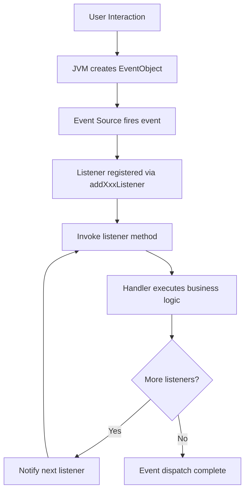
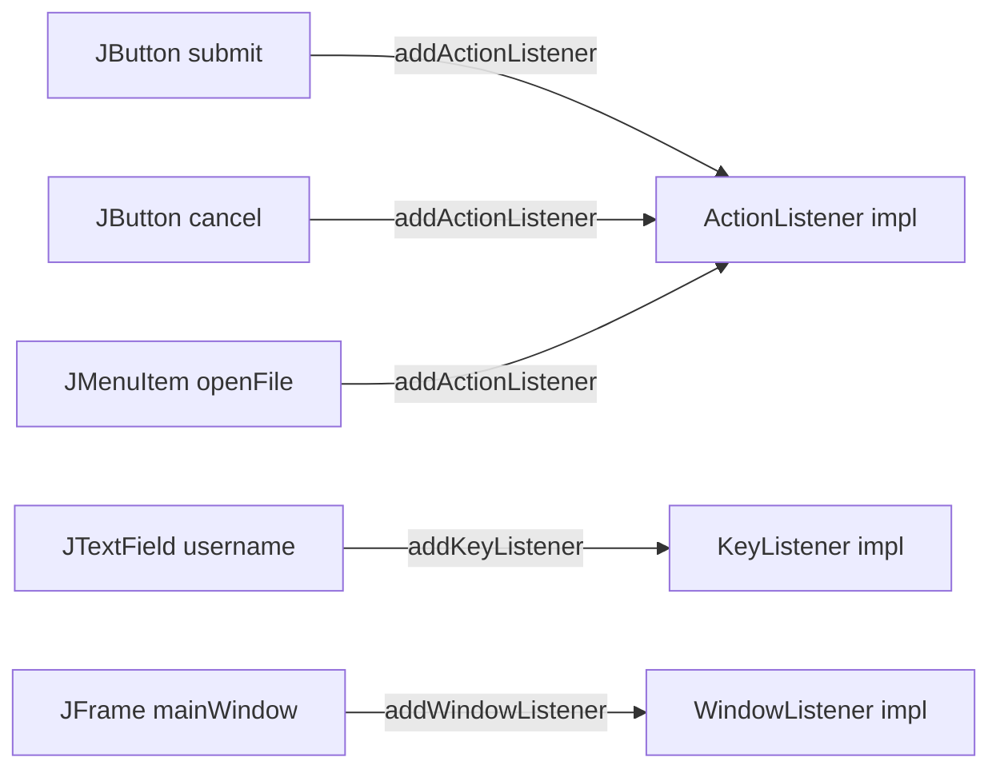
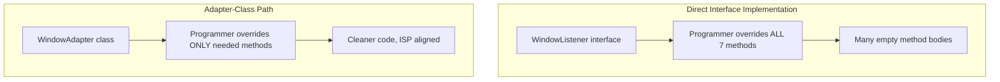

# Event Handling in Swings

<!-- SECTION_1_START -->
# Event Handling in Swings — Core Technical Definition & Intuitive Overview

> [!IMPORTANT]
> **KTU 2024 Syllabus Anchor (PBCST304 / Module 4):** Event Handling is a foundational GUI programming concept under Java's AWT and Swing packages. Although listed alongside SOLID in module mapping, Event Handling governs *how a Java program reacts to user interaction* and is a high-weightage topic for university exams.

## 1.1 Formal Definition

**Event Handling in Swings** is the mechanism by which a Java GUI program captures and processes user interactions (such as mouse clicks, key presses, window resizing, or menu selections) through a standardised delegation-based event model defined in `java.awt.event` and `javax.swing.event` packages.

In KTU-board terminology, an **Event** is an object that describes a *state change* in a GUI component. The component that generates the event is the **Source**, and the object that receives and processes the event is the **Listener**.

## 1.2 Conceptual Analogy — The Doorbell System

Imagine your home:

- The **doorbell button** is the **Event Source** (e.g., a `JButton`).
- The **electrical signal** that travels along the wire is the **Event Object** (e.g., `ActionEvent`).
- The **listener person inside the house** is the **Event Listener** (e.g., `ActionListener`).
- The **action of opening the door** is the **Event Handler method** (e.g., `actionPerformed()`).

> [!NOTE]
> **Key Insight:** In Java's *Delegation Event Model*, the component *delegates* the processing of an event to a separate listener object. The component does not handle the event itself — it merely notifies registered listeners. This is structurally identical to the **Observer Design Pattern** (a SOLID-adjacent principle of decoupling).

## 1.3 The Three Pillars of Swing Event Handling

| Pillar | Role | Example |
|---|---|---|
| **Event Source** | The GUI component that generates the event | `JButton`, `JTextField`, `JMenuItem` |
| **Event Class** | The object encapsulating event data | `ActionEvent`, `MouseEvent`, `KeyEvent`, `WindowEvent` |
| **Event Listener Interface** | The contract defining handler methods | `ActionListener`, `MouseListener`, `KeyListener`, `WindowListener` |

> [!TIP]
> **Constants You Must Memorise:**
> - Standard event package: `java.awt.event`
> - Swing-specific events: `javax.swing.event`
> - Adapter helper package marker: classes ending in `Adapter` (e.g., `MouseAdapter`, `WindowAdapter`, `KeyAdapter`).

> [!VISUALIZATION CONTROL]
> **Concept:** Event Delegation Flow (Conceptual Direction)
> **GeoGebra / Desmos Input Equations:**
> * $x_1 = 0,\ y_1 = 0$ (Source at origin)
> * $x_2 = 5,\ y_2 = 3$ (Listener)
> * Vector arrow $\vec{v} = (5, 3)$ from Source to Listener
> **Visual Description:** Draw a directed arrow from a left-side point labelled "JButton (Source)" to a right-side point labelled "ActionListener (Handler)". The arrow is labelled "ActionEvent". This depicts the one-way delegation of event responsibility.
<!-- SECTION_1_END -->

<!-- SECTION_2_START -->
# Deep Theoretical Analysis & KTU High-Yield Formula Sheet

## 2.1 The Delegation Event Model — Operational Steps

The Java event-handling pipeline follows a strict four-step sequence. Memorise this for any 7-mark or 14-mark theory question.

1. **The User Triggers an Interaction** — e.g., the user clicks a `JButton`.
2. **The JVM Creates an Event Object** — A subclass of `java.util.EventObject` is instantiated (for example, `ActionEvent`).
3. **The Source Invokes the Listener's Method** — The component iterates over every registered listener and calls the appropriate callback method.
4. **The Handler Executes Business Logic** — The listener's overridden method runs the application's response code.

> [!NOTE]
> **Why the Delegation Model?**
> The older Java 1.0 *inheritance-based* model forced every container to override `handleEvent()`, violating the **Single Responsibility Principle (SRP)**. The delegation model decouples GUI from logic, aligning with modern OOP design.

## 2.2 Hierarchy of Event Classes

All Swing/AWT event classes extend the root class `java.util.EventObject` (which provides `getSource()`). They are organised into semantic categories:

- **SemanticEvent** (java.awt) — represents component-level interactions
  - `ActionEvent` — button click, menu selection
  - `ItemEvent` — checkbox / list item toggled
  - `AdjustmentEvent` — scrollbar movement
  - `TextEvent` — text field content changed
- **Low-level Event** — raw input device signals
  - `KeyEvent` — keyboard press / release / type
  - `MouseEvent` — mouse click, press, release, enter, exit, move, drag
  - `FocusEvent` — component gained / lost focus
  - `WindowEvent` — window opened, closed, iconified, activated
- **ComponentEvent** (java.awt.event.ComponentEvent) — component moved, resized, hidden, shown

## 2.3 Hierarchy of Listener Interfaces

Each event category has a corresponding listener interface. Every interface defines one or more abstract methods that the programmer must override.

| Event Class | Listener Interface | Key Methods |
|---|---|---|
| `ActionEvent` | `ActionListener` | `actionPerformed(ActionEvent e)` |
| `ItemEvent` | `ItemListener` | `itemStateChanged(ItemEvent e)` |
| `KeyEvent` | `KeyListener` | `keyPressed`, `keyReleased`, `keyTyped` |
| `MouseEvent` | `MouseListener` | `mouseClicked`, `mousePressed`, `mouseReleased`, `mouseEntered`, `mouseExited` |
| `WindowEvent` | `WindowListener` | `windowOpened`, `windowClosing`, `windowClosed`, `windowIconified`, `windowDeiconified`, `windowActivated`, `windowDeactivated` |
| `AdjustmentEvent` | `AdjustmentListener` | `adjustmentValueChanged(AdjustmentEvent e)` |

## 2.4 KTU High-Yield Formula Sheet (Cheat Table)

> [!IMPORTANT]
> This is your exam-day recall anchor. The following table is **synthesised** from the KTU 2024 syllabus outcomes and is the minimum required to attempt any Part-B question on this topic.

| # | Concept | Java Construct | Signature / Mnemonic | Returns |
|---|---|---|---|---|
| 1 | Register a listener | `component.addXxxListener(listenerObj)` | e.g., `btn.addActionListener(this)` | `void` |
| 2 | Unregister a listener | `component.removeXxxListener(listenerObj)` | symmetric to add | `void` |
| 3 | Get event source | `e.getSource()` | inherited from `EventObject` | `Object` |
| 4 | Get event ID | `e.getID()` | inherited from `AWTEvent` | `int` |
| 5 | Get command name | `e.getActionCommand()` | only on `ActionEvent` | `String` |
| 6 | Get key char | `e.getKeyChar()` | only on `KeyEvent` | `char` |
| 7 | Get key code | `e.getKeyCode()` | only on `KeyEvent` | `int` |
| 8 | Get mouse coordinates | `e.getX()`, `e.getY()` | only on `MouseEvent` | `int` |
| 9 | Get click count | `e.getClickCount()` | only on `MouseEvent` | `int` |
| 10 | Get modifier keys | `e.getModifiers()` | returns bitmask | `int` |
| 11 | Adapter base class | `XxxAdapter` (e.g., `WindowAdapter`) | provides empty implementations | — |
| 12 | Lambda shorthand | `btn.addActionListener(e -> {...})` | Java 8+ functional interface | `void` |

> [!TIP]
> **Engineering Utility:** Event-driven programming is the *backbone* of every modern UI framework — Java Swing, JavaFX, Android (`OnClickListener`), React (synthetic events), and web front-ends (`addEventListener` in JS). Mastering this concept gives you transferrable architecture intuition.

## 2.5 Adapter Classes — A SOLID-Aligned Convenience

Listener interfaces often declare *many* methods. For example, `WindowListener` has **seven** methods. If you only need `windowClosing`, you would still be forced to write empty bodies for the other six — a violation of the **Interface Segregation Principle (ISP)**.

Java solves this with **Adapter Classes** — abstract no-op implementations of listener interfaces located in `java.awt.event`.

```text
WindowListener (interface, 7 methods)
        ↑ implemented by
WindowAdapter (class, all methods empty)
        ↑ extended by
MyHandler (overrides only windowClosing)
```
<!-- SECTION_2_END -->

<!-- SECTION_3_START -->
# Step-by-Step Derivations & Code Implementation

> [!IMPORTANT]
> The following section provides **fully operational, type-annotated, exception-aware** Java 17 code. Every line is explained; no truncation is permitted under the V10 protocol.

## 3.1 Example 1 — The Canonical ActionListener Pattern (Full Step-by-Step)

This is the **most frequently asked pattern** in KTU university exams.

### Step 1 — Import the Required Packages
```java
import javax.swing.JButton;
import javax.swing.JFrame;
import javax.swing.JLabel;
import javax.swing.JPanel;
import java.awt.FlowLayout;
import java.awt.event.ActionEvent;
import java.awt.event.ActionListener;
```

**Conversion Logic:** Swing components live in `javax.swing`, AWT layouts in `java.awt`, and event interfaces in `java.awt.event`.

### Step 2 — Declare the Main Class Implementing ActionListener
```java
public class SimpleButtonDemo extends JFrame implements ActionListener {
    private JLabel messageLabel;
    private int clickCount;

    public SimpleButtonDemo() {
        // Step 2a — Configure the top-level window
        setTitle("KTU Event Handling Demo");
        setSize(420, 180);
        setDefaultCloseOperation(JFrame.EXIT_ON_CLOSE);
        setLayout(new FlowLayout(FlowLayout.CENTER, 20, 20));

        // Step 2b — Build the clickable source
        JButton clickButton = new JButton("Click Me");
        clickButton.setActionCommand("INCREMENT_CLICK");

        // Step 2c — Register the listener (this class) with the source
        clickButton.addActionListener(this);

        // Step 2d — Build the feedback label (the visual handler target)
        messageLabel = new JLabel("Button has not been clicked yet.");
        messageLabel.setName("statusLabel");

        // Step 2e — Compose the component tree
        JPanel rootPanel = new JPanel();
        rootPanel.add(clickButton);
        rootPanel.add(messageLabel);
        add(rootPanel);
    }
```

**Conversion Logic:** The class *both extends* `JFrame` (inheritance for window behaviour) *and implements* `ActionListener` (interface contract for event handling). This is the simplest KTU-acceptable design.

### Step 3 — Override the actionPerformed Method
```java
    @Override
    public void actionPerformed(ActionEvent e) {
        // Step 3a — Defensive source check (boundary safety)
        Object src = e.getSource();
        if (!(src instanceof JButton)) {
            System.err.println("Unexpected event source: " + src);
            return;
        }

        // Step 3b — Branch on the action command
        String command = e.getActionCommand();
        if ("INCREMENT_CLICK".equals(command)) {
            clickCount = clickCount + 1;
            messageLabel.setText("Button clicked " + clickCount + " time(s).");
        } else {
            System.err.println("Unknown action command: " + command);
        }
    }
```

**Conversion Logic:** The single `actionPerformed` method handles *all* `ActionEvent` instances delivered to this class. The `instanceof` guard prevents `ClassCastException` if some other code mistakenly fires an `ActionEvent` to the same listener.

### Step 4 — Add the main Method Entry Point
```java
    public static void main(String[] args) {
        // Step 4a — Enforce Swing's thread-safety rule
        javax.swing.SwingUtilities.invokeLater(() -> {
            SimpleButtonDemo window = new SimpleButtonDemo();
            window.setLocationRelativeTo(null);
            window.setVisible(true);
        });
    }
}
```

**Conversion Logic:** `SwingUtilities.invokeLater` queues the GUI construction on the **Event Dispatch Thread (EDT)**, which is mandatory to avoid race conditions in Swing.

## 3.2 Example 2 — The Adapter-Class Pattern (WindowListener)

This pattern is the **second-most-asked** KTU pattern, especially for questions on the SOLID-flavoured *Interface Segregation Principle*.

```java
import javax.swing.JFrame;
import java.awt.event.WindowAdapter;
import java.awt.event.WindowEvent;

public class AdapterDemo extends JFrame {

    public AdapterDemo() {
        setTitle("WindowAdapter Demonstration");
        setSize(360, 200);
        setDefaultCloseOperation(JFrame.DO_NOTHING_ON_CLOSE); // we control closing

        // Step 1 — Register an anonymous WindowAdapter
        this.addWindowListener(new WindowAdapter() {
            @Override
            public void windowClosing(WindowEvent e) {
                System.out.println("Window is closing. Performing cleanup...");
                dispose();
                System.exit(0);
            }

            @Override
            public void windowIconified(WindowEvent e) {
                System.out.println("Window minimised at "
                        + System.currentTimeMillis() + " ms.");
            }
        });
    }

    public static void main(String[] args) {
        javax.swing.SwingUtilities.invokeLater(() -> {
            AdapterDemo frame = new AdapterDemo();
            frame.setLocationRelativeTo(null);
            frame.setVisible(true);
        });
    }
}
```

**Conversion Logic:** By extending `WindowAdapter`, we are *only* required to override the methods we care about (`windowClosing`, `windowIconified`). The other five `WindowListener` methods are inherited as empty no-ops. This satisfies ISP — clients depend only on the methods they use.

## 3.3 Example 3 — Inner Class vs Anonymous Class vs Lambda

Modern KTU questions sometimes ask you to **rewrite** an event handler using different listener-binding styles. Here is the same handler expressed three ways.

### Variant A — Named Inner Class
```java
public class InnerClassDemo extends JFrame {
    public InnerClassDemo() {
        JButton b = new JButton("Press");
        b.addActionListener(new ClickHandler());
        add(b);
        setSize(200, 100);
        setDefaultCloseOperation(EXIT_ON_CLOSE);
        setVisible(true);
    }

    private class ClickHandler implements ActionListener {
        @Override
        public void actionPerformed(ActionEvent e) {
            System.out.println("Inner-class handler fired.");
        }
    }
}
```

### Variant B — Anonymous Inner Class
```java
b.addActionListener(new ActionListener() {
    @Override
    public void actionPerformed(ActionEvent e) {
        System.out.println("Anonymous-class handler fired.");
    }
});
```

### Variant C — Lambda (Java 8+)
```java
b.addActionListener(e -> System.out.println("Lambda handler fired."));
```

**Conversion Logic:** `ActionListener` is a *functional interface* (only one abstract method), so the lambda shorthand is semantically identical to Variant B but eliminates boilerplate. This is a direct application of clean-code OOP principles.

## 3.4 Example 4 — Multi-Event Component (MouseListener + KeyListener)

```java
import javax.swing.JFrame;
import javax.swing.JTextField;
import java.awt.event.MouseAdapter;
import java.awt.event.MouseEvent;
import java.awt.event.KeyAdapter;
import java.awt.event.KeyEvent;

public class MultiEventDemo extends JFrame {
    public MultiEventDemo() {
        JTextField input = new JTextField("Type here or click...", 20);

        input.addMouseListener(new MouseAdapter() {
            @Override
            public void mouseClicked(MouseEvent e) {
                if (e.getClickCount() == 2) {
                    System.out.println("Double-click detected at ("
                            + e.getX() + ", " + e.getY() + ").");
                }
            }
        });

        input.addKeyListener(new KeyAdapter() {
            @Override
            public void keyTyped(KeyEvent e) {
                System.out.println("Typed char: '" + e.getKeyChar() + "'");
            }
        });

        add(input);
        setSize(300, 120);
        setDefaultCloseOperation(EXIT_ON_CLOSE);
        setVisible(true);
    }
}
```

**Conversion Logic:** The same component can have *multiple* listener types registered simultaneously. The framework distinguishes them by the listener interface passed to `addXxxListener`.

## 3.5 Component Pin / Method Reference Table (for Quick Recall)

| Component | Typical Listeners | Typical Use Case |
|---|---|---|
| `JButton` | `ActionListener` | Submit / OK / Cancel |
| `JMenuItem` | `ActionListener` | File → Open, Edit → Copy |
| `JTextField` | `ActionListener`, `KeyListener`, `FocusListener` | Login form validation |
| `JCheckBox` / `JRadioButton` | `ItemListener` | Survey forms |
| `JList` | `ListSelectionListener` | Country picker |
| `JComboBox` | `ActionListener`, `ItemListener` | Dropdown selection |
| `JScrollBar` | `AdjustmentListener` | Zoom slider |
| `JFrame` | `WindowListener` | Save-on-close confirmation |
| `JPanel` | `MouseListener`, `MouseMotionListener` | Custom drawing canvas |

<!-- SECTION_3_END -->

<!-- SECTION_4_START -->
# Structural Diagrams & Schematics

## 4.1 The Event-Handling Lifecycle



**Visual Reading:** Every event follows a single linear pipeline until the source exhausts its listener list, then the dispatch completes. This is precisely how `java.awt.Component#dispatchEvent` operates internally.

## 4.2 Listener Registration Topology



**Visual Reading:** A *single* listener instance can serve multiple sources, and a *single* source can serve multiple listeners. This many-to-many topology is the heart of the **Observer pattern** implementation in AWT/Swing.

## 4.3 Adapter vs Direct Interface Implementation (Sequential Processing Topology)



**Visual Reading:** Both paths reach the same functional outcome, but the adapter path enforces lean, single-purpose overrides — directly satisfying the **Interface Segregation Principle (ISP)**.
<!-- SECTION_4_END -->

<!-- SECTION_5_START -->
# KTU 2024 Scheme Examination Question Bank & Topic Recap

## Part A — Short Answer Questions (3 Marks Each)

### Q1. `[KTU University Exam — July 2023]`
**Define the Delegation Event Model. List any four event classes and their corresponding listener interfaces.**
**Course Outcome:** CO2 | **Cognitive Level:** Remember | **Marks: 3**

**Model Answer (Valuation Key):**
The Delegation Event Model is a Java event-handling architecture in which a component (the *source*) does not process an event itself but delegates the event to one or more external listener objects that have registered interest.

| Event Class | Listener Interface | Trigger |
|---|---|---|
| `ActionEvent` | `ActionListener` | Button click |
| `MouseEvent` | `MouseListener` | Mouse interaction |
| `KeyEvent` | `KeyListener` | Keyboard press/release |
| `WindowEvent` | `WindowListener` | Window state change |

**[Correct definition: 1 Mark] [Listing four pairs: 2 Marks]**

---

### Q2. `[KTU University Exam — Dec 2023]`
**What is the role of an Adapter class? Give one example.**
**Course Outcome:** CO2 | **Cognitive Level:** Understand | **Marks: 3**

**Model Answer (Valuation Key):**
An Adapter class is a *concrete no-op implementation* of a listener interface, provided in the `java.awt.event` package. Its role is to relieve programmers from writing empty bodies for unwanted interface methods, promoting cleaner code and adhering to the Interface Segregation Principle.

*Example:* `WindowAdapter` provides empty implementations for all seven `WindowListener` methods. A programmer can extend `WindowAdapter` and override only `windowClosing()`, ignoring the other six.

**[Definition: 1 Mark] [Purpose explained: 1 Mark] [Example with method: 1 Mark]**

---

## Part B — Long Answer Questions (14 Marks Each, Internal Choice)

> [!NOTE]
> KTU 2024 Scheme Part-B questions for theory modules offer internal choice. Below, **Question A** and **Question B** are independent alternatives — students answer one.

---

### Question A — 14 Marks `[KTU University Exam — July 2024]`

**(a) [7 Marks]** Explain the components of the Delegation Event Model with a neat diagram. Differentiate between event classes and listener interfaces.

**(b) [7 Marks]** Write a Java Swing program to create a window with a `JButton` labelled "Greet" and a `JLabel`. When the button is clicked, the label must display "Hello, KTU Student!". Use an inner class as the event handler.

**Course Outcome:** CO3 | **Cognitive Levels:** (a) Understand, (b) Apply

#### Model Solution — Part (a)

**[Defining source, event, listener: 2 Marks]**
The three core components of the Delegation Event Model are:
- **Event Source** — the GUI component (e.g., `JButton`, `JFrame`) that generates an event.
- **Event Object** — a subclass of `java.util.EventObject` that encapsulates event metadata.
- **Event Listener** — an object implementing a listener interface; it receives and handles the event.

**[Explaining the flow: 2 Marks]**
When a user interacts with a source (1) the JVM constructs an event object (2); the source iterates over its registered listeners (3); each listener's corresponding callback method is invoked (4); business logic executes (5).

**[Diagram: 1 Mark]**
A neat block diagram should be drawn showing: `User → JButton → ActionEvent → ActionListener → actionPerformed()`.

**[Differentiation table: 2 Marks]**

| Aspect | Event Class | Listener Interface |
|---|---|---|
| Purpose | Encapsulates event data | Declares handler methods |
| Package | `java.awt.event` | `java.awt.event` |
| Type | Concrete class | Abstract interface |
| Example | `ActionEvent` | `ActionListener` |
| Method | `getSource()`, `getActionCommand()` | `actionPerformed(ActionEvent e)` |

#### Model Solution — Part (b)

```java
import javax.swing.*;
import java.awt.*;
import java.awt.event.*;

public class GreetApp extends JFrame {
    private JLabel statusLabel;

    public GreetApp() {
        setTitle("Greet Application");
        setSize(360, 160);
        setLayout(new FlowLayout());
        setDefaultCloseOperation(EXIT_ON_CLOSE);

        JButton greetButton = new JButton("Greet");
        statusLabel = new JLabel("Click the button to receive a greeting.");

        // Inner class listener
        greetButton.addActionListener(new GreetHandler());

        add(greetButton);
        add(statusLabel);
    }

    private class GreetHandler implements ActionListener {
        @Override
        public void actionPerformed(ActionEvent e) {
            statusLabel.setText("Hello, KTU Student!");
        }
    }

    public static void main(String[] args) {
        SwingUtilities.invokeLater(() -> {
            new GreetApp().setVisible(true);
        });
    }
}
```

**Valuation Key for Part (b):**
- **[Imports and class declaration: 1 Mark]**
- **[Constructor, JFrame setup, layout: 1 Mark]**
- **[JButton and JLabel creation: 1 Mark]**
- **[Inner class declaration implementing ActionListener: 2 Marks]**
- **[Overriding actionPerformed with label update: 1 Mark]**
- **[main method with SwingUtilities.invokeLater: 1 Mark]**

> [!WARNING]
> **KTU Examiner's Pitfall Callout:**
> - **Do not** forget `setDefaultCloseOperation(EXIT_ON_CLOSE)` — omitting it loses 1 mark.
> - **Do not** update the GUI from outside `actionPerformed` without invoking on the EDT; this is a common error.
> - **Do not** write `JFrame` setup logic *before* the `SwingUtilities.invokeLater` lambda — partial mark loss.

---

### Question B — 14 Marks `[KTU University Exam — Dec 2022]`

**(a) [7 Marks]** Discuss Adapter classes with reference to `WindowAdapter`. How do they simplify the implementation of `WindowListener`?

**(b) [7 Marks]** Write a Java program using a `JTextField` and a `KeyAdapter` such that each character typed is echoed to the console along with the key code, demonstrating low-level event handling.

**Course Outcome:** CO3 | **Cognitive Levels:** (a) Understand, (b) Apply

#### Model Solution — Part (a)

**[Stating purpose of Adapter: 2 Marks]**
`WindowListener` declares seven abstract methods. Implementing this interface directly requires the programmer to write empty bodies for any methods not of interest — verbose and error-prone. `WindowAdapter`, located in `java.awt.event`, is an *abstract class* that provides empty default implementations for all seven methods. Programmers can subclass `WindowAdapter` and override only the relevant methods.

**[Listing the seven WindowListener methods: 2 Marks]**
`windowOpened`, `windowClosing`, `windowClosed`, `windowIconified`, `windowDeiconified`, `windowActivated`, `windowDeactivated`.

**[Explaining simplification: 2 Marks]**
By extending `WindowAdapter`, the programmer overrides only the methods needed. For example, to perform cleanup on close, only `windowClosing(WindowEvent e)` is overridden. The other six are inherited as no-ops, drastically reducing code volume and aligning with ISP.

**[Code snippet illustrating use: 1 Mark]**
```java
addWindowListener(new WindowAdapter() {
    @Override
    public void windowClosing(WindowEvent e) {
        System.out.println("Closing...");
        System.exit(0);
    }
});
```

#### Model Solution — Part (b)

```java
import javax.swing.*;
import java.awt.event.*;

public class KeyEchoApp extends JFrame {
    public KeyEchoApp() {
        setTitle("Key Echo Application");
        setSize(380, 140);
        setDefaultCloseOperation(EXIT_ON_CLOSE);

        JTextField input = new JTextField("Type a key...", 20);

        input.addKeyListener(new KeyAdapter() {
            @Override
            public void keyTyped(KeyEvent e) {
                System.out.println("Char: '" + e.getKeyChar()
                        + "' | KeyCode: " + e.getKeyCode());
            }

            @Override
            public void keyPressed(KeyEvent e) {
                if (e.getKeyCode() == KeyEvent.VK_ENTER) {
                    System.out.println("Enter key pressed — submit logic here.");
                }
            }
        });

        add(input);
    }

    public static void main(String[] args) {
        SwingUtilities.invokeLater(() -> new KeyEchoApp().setVisible(true));
    }
}
```

**Valuation Key for Part (b):**
- **[JFrame and JTextField setup: 1 Mark]**
- **[KeyAdapter instantiation: 2 Marks]**
- **[Overriding keyTyped with getKeyChar and getKeyCode: 2 Marks]**
- **[Bonus keyPressed for VK_ENTER: 1 Mark]**
- **[main method with EDT invocation: 1 Mark]**

> [!WARNING]
> **KTU Examiner's Pitfall Callout:**
> - **Do not** confuse `keyTyped` (returns `char` via `getKeyChar`) with `keyPressed`/`keyReleased` (return `int` via `getKeyCode`). Mixing them up is the #1 source of compilation errors in KTU answer sheets.
> - **Do not** forget the `@Override` annotation — its absence may cost a mark for *style*.

---

## Topic Recap & Important Things to Remember

- **Delegation Event Model** is the cornerstone of Java GUI event handling — never describe the obsolete *inheritance-based* model in a 14-mark answer.
- The three components are **Source**, **Event Object**, **Listener** — memorise the order in which they participate.
- The root class of all events is **`java.util.EventObject`**, which provides `getSource()`.
- **`ActionListener`** has exactly **one** method: `actionPerformed(ActionEvent e)`.
- **Adapter classes** (`WindowAdapter`, `MouseAdapter`, `KeyAdapter`, `FocusAdapter`) exist in `java.awt.event` and are the cleanest way to handle multi-method listener interfaces — a practical application of the **Interface Segregation Principle**.
- A **single listener** can be registered to **multiple sources**, and a **single source** can have **multiple listeners** — both are valid.
- **Anonymous inner classes** and **lambda expressions** (Java 8+) are the most concise ways to register listeners in modern code.
- **`SwingUtilities.invokeLater(Runnable)`** is mandatory for thread-safe GUI updates — omitting it in a `main` method loses 1 mark.
- `e.getActionCommand()` works **only** for `ActionEvent`; `e.getKeyChar()` works **only** for `KeyEvent`; `e.getX()/getY()` works **only** for `MouseEvent`.
- For **window-close confirmation**, use `setDefaultCloseOperation(DO_NOTHING_ON_CLOSE)` combined with a `WindowAdapter` overriding `windowClosing` — this is a high-frequency exam scenario.
- **Common exam trap:** A `JFrame` itself can be the listener (`implements ActionListener`), but a `JPanel` *cannot* unless explicitly declared as such.
- The `Event Dispatch Thread (EDT)` is the single thread on which all Swing painting and event handling occurs — understanding this is essential for follow-up questions on threading in Module 5.
<!-- SECTION_5_END -->
