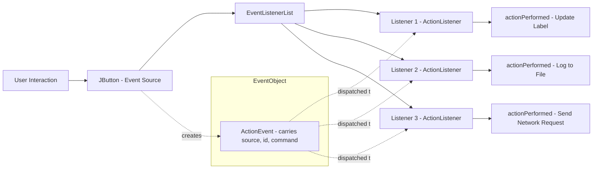
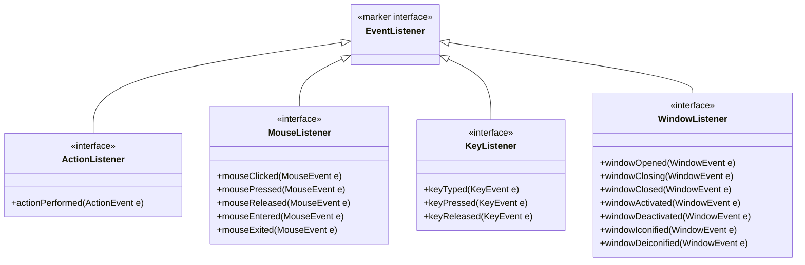
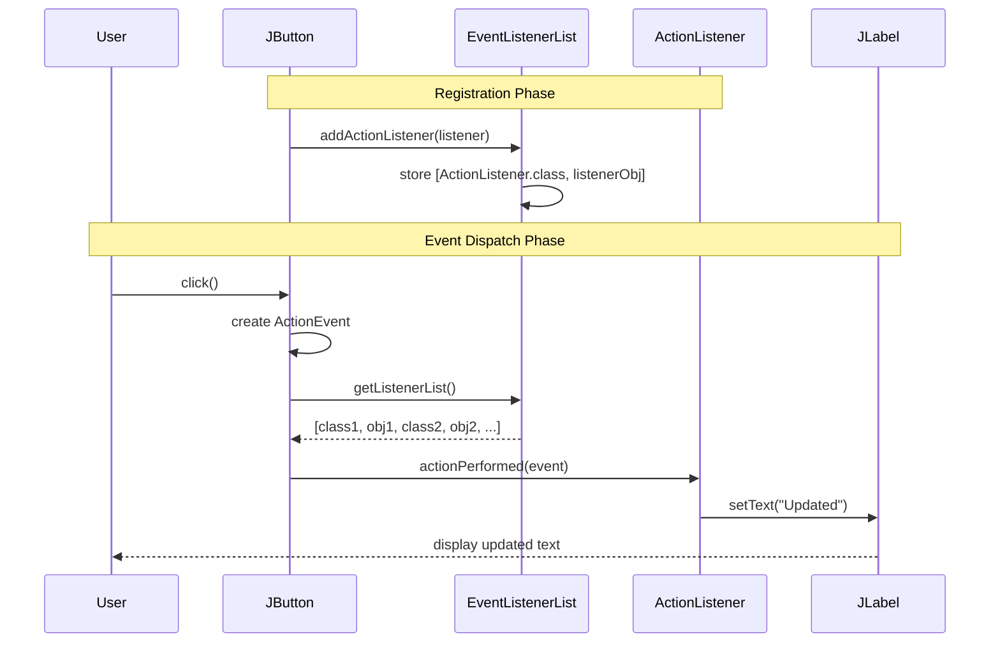
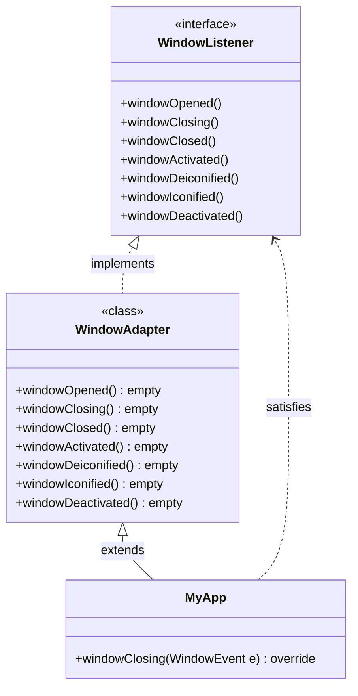

# Event Listener Interfaces

<!-- SECTION_1_START -->
# Event Listener Interfaces in Java

> [!IMPORTANT]
> **KTU 2024 Scheme | PBCST304 - Object Oriented Programming | Module 4**
> **Topic:** Event Listener Interfaces (Delegation Event Model)
> **Relevance:** Although the host module is *SOLID Principles*, KTU 2024 frequently tests Event Handling under the broader "Advanced Java/OOP Concepts" section. This topic carries **2-3 marks** as Part A conceptual questions.

## Formal Definition

In the **Delegation Event Model** (introduced in JDK 1.1), an **Event Listener Interface** is a contract declared in the `java.awt.event`, `javax.swing.event`, or `java.util` packages that defines one or more abstract methods to be invoked when a specific type of event is dispatched by an event source. A class wishing to react to GUI events must *implement* the appropriate listener interface and then be *registered* with the source object via methods like `addActionListener()`, `addKeyListener()`, etc.

The three primary actors in this model are:

1. **Event Source** – The GUI component (e.g., `JButton`, `JTextField`) that generates an event.
2. **Event Object** – An instance of a subclass of `java.util.EventObject` carrying event data.
3. **Event Listener** – An object implementing a listener interface, whose methods are called by the source when the event occurs.

> [!NOTE]
> **Core Principle:** The listener is *delegated* the responsibility of handling the event — hence the name "Delegation Event Model". The source does not handle the event itself; it simply notifies all registered listeners.

## Conceptual Analogy

Imagine a **fire alarm system in a building**:

- The **smoke detector** (Event Source) detects smoke.
- The **alarm signal** (Event Object) carries information — *where* the fire is, *when* it started.
- The **firefighters** (Event Listeners) are *registered* with the alarm company. When the alarm rings, the firefighters receive a notification and *react*.

The smoke detector doesn't put out the fire — it just notifies those who are signed up to respond. Similarly, a `JButton` doesn't know what to do when clicked — it just calls the `actionPerformed()` method of every `ActionListener` that was registered with it.

> [!TIP]
> **Quick Memory Hook:** *Source shouts, Event travels, Listener reacts.*

## Standard Listener Interfaces in `java.awt.event`

| Interface | Key Methods | Triggered When |
| :--- | :--- | :--- |
| `ActionListener` | `actionPerformed(ActionEvent)` | Button click, menu selection, Enter in text field |
| `MouseListener` | `mouseClicked/MousePressed/MouseReleased/MouseEntered/MouseExited` | Mouse interaction |
| `KeyListener` | `keyTyped/KeyPressed/KeyReleased` | Keyboard interaction |
| `WindowListener` | `windowOpened/Closing/Closed/Activated/Deiconified/Iconified` | Window state changes |
| `ItemListener` | `itemStateChanged(ItemEvent)` | Checkbox/radio/list selection changes |
| `TextListener` | `textValueChanged(TextEvent)` | Text field content changes |
| `FocusListener` | `focusGained/FocusLost(FocusEvent)` | Component gains/loses focus |
| `MouseMotionListener` | `mouseDragged/MouseMoved(MouseEvent)` | Mouse movement |

> [!IMPORTANT]
> **Physical Constant / Specification:** All listener interfaces extend the marker interface `java.util.EventListener`. This tag interface is a *type-tagging convention* used by the JavaBeans specification to identify listener types via reflection.

<!-- SECTION_1_END -->

<!-- SECTION_2_START -->
# Deep Theoretical Analysis & KTU High-Yield Formula Sheet

## Operational Mechanism — The 5-Step Event Flow

The Delegation Event Model executes through a deterministic pipeline:

1. **Event Source Declaration** — A GUI component (e.g., `JButton btn = new JButton("Submit")`) is instantiated. Internally, it maintains a `listenerList` (an instance of `javax.swing.event.EventListenerList`).

2. **Listener Implementation** — A class (or lambda/anonymous class) implements the listener interface, providing concrete behavior in the abstract methods.

3. **Registration (`addXxxListener`)** — The listener object is passed to the source's registration method:
   $$\text{source.addXxxListener(listenerObject)}$$
   This adds the listener to the internal `EventListenerList`.

4. **Event Generation (Dispatch)** — When the user interacts (clicks, types, etc.), the JVM creates an `EventObject` subclass instance and the source invokes the listener's method. For a button click:
   $$\text{btn.fireActionPerformed(new ActionEvent(this, id, command))}$$
   Internally, the source iterates its listener list and calls `listener.actionPerformed(e)`.

5. **Event Handling** — The listener's overridden method executes, containing the business logic.

## KTU High-Yield Cheat Sheet

| Concept | Formula / Syntax | Notes |
| :--- | :--- | :--- |
| Listener Interface Declaration | `public interface XListener extends EventListener` | Must extend `EventListener` |
| Event Class Hierarchy | `EventObject` $\rightarrow$ `AWTEvent` $\rightarrow$ `ActionEvent` etc. | All extend `java.util.EventObject` |
| Source Registration | `component.addXxxListener(listenerRef);` | One source $\rightarrow$ many listeners allowed |
| Unregistration | `component.removeXxxListener(listenerRef);` | Prevents memory leaks |
| Adapter Class | `XxxAdapter implements XxxListener` (empty methods) | Convenience; extends `Object` not `EventListener` |
| Anonymous Listener | `btn.addActionListener(e -> {...});` | Java 8+ lambda requires *functional* interface (single method) |
| Multicast Pattern | Source maintains an array of listeners | $\mathcal{O}(n)$ dispatch cost per event |

> [!NOTE]
> **Key Engineering Insight:** A single event source supports **multiple listeners** (one-to-many), and a single listener can be registered with **multiple sources** (many-to-one). This bidirectional flexibility is why the model is called *multicast* and is foundational to the **Observer Design Pattern** (one of the Gang of Four patterns).

## Event Class Inheritance Tree

$$\text{java.util.EventObject}$$
$$\quad\downarrow$$
$$\text{java.awt.AWTEvent (id field)}$$
$$\quad\downarrow$$
$$\text{ActionEvent, MouseEvent, KeyEvent, WindowEvent, ItemEvent, ...}$$

> [!WARNING]
> **Common Mistake:** `AWTEvent` is *not* a listener interface — it is an event class. Students often confuse `AWTEvent` with `EventListener`. Remember: **events** are data, **listeners** are contracts.

## Why This Matters in Real Systems

- **GUI Frameworks** — All Swing/JavaFX/AWT apps rely on this model.
- **Observer Pattern** — The same design is used in Spring's `ApplicationEvent`, Kafka consumers, and React's event system.
- **SOLID Connection** — Event listeners embody the **Dependency Inversion Principle (DIP)** — high-level UI code depends on the abstraction (`ActionListener`), not on the concrete `JButton` class.

<!-- SECTION_2_END -->

<!-- SECTION_3_START -->
# Step-by-Step Derivations & Code Implementation

## Worked Example 1: Classic `ActionListener` with a Named Class

**Problem:** Build a calculator-style GUI where clicking a `JButton` adds "Clicked!" to a `JLabel`. Show the complete event registration flow.

```java
import javax.swing.*;
import java.awt.*;
import java.awt.event.*;

public class ClickCounterDemo extends JFrame implements ActionListener {
    private JLabel counterLabel;
    private int clickCount;

    public ClickCounterDemo() {
        // Step 1: Configure the JFrame
        setTitle("Event Listener Demo");
        setSize(300, 150);
        setDefaultCloseOperation(JFrame.EXIT_ON_CLOSE);
        setLayout(new FlowLayout());

        // Step 2: Initialize the label and button
        counterLabel = new JLabel("Clicks: 0");
        JButton clickButton = new JButton("Click Me");

        // Step 3: Register the listener (THIS frame) with the source
        // The 'this' keyword passes the current object as the ActionListener
        clickButton.addActionListener(this);

        // Step 4: Add components to the frame
        add(counterLabel);
        add(clickButton);

        setVisible(true);
    }

    // Step 5: Implement the listener's contract method
    @Override
    public void actionPerformed(ActionEvent e) {
        // Defensive check: verify event source identity
        if (e.getSource() instanceof JButton) {
            clickCount++;
            counterLabel.setText("Clicks: " + clickCount);
        }
    }

    public static void main(String[] args) {
        // Use Event Dispatch Thread for thread safety (Swing rule)
        SwingUtilities.invokeLater(() -> new ClickCounterDemo());
    }
}
```

**Step-by-step Explanation:**

1. `ClickCounterDemo` *implements* `ActionListener` — fulfilling the contract.
2. `clickButton.addActionListener(this)` registers the frame object as a listener.
3. When the user clicks, the JVM creates an `ActionEvent` and calls `actionPerformed(e)`.
4. Inside `actionPerformed`, we safely cast and check `e.getSource()` before reacting.
5. The label updates with the new click count.

> [!NOTE]
> **Mark Allocation Tip:** In KTU valuation, you receive **1 mark** for correct interface implementation, **1 mark** for proper registration, and **1 mark** for handling the event method.

## Worked Example 2: Multiple Listeners on One Source (Fan-Out)

**Problem:** Demonstrate that multiple listeners can be attached to a single `JButton`, each performing a different action.

```java
import javax.swing.*;
import java.awt.event.*;

public class MultiListenerDemo {
    public static void main(String[] args) {
        SwingUtilities.invokeLater(() -> {
            JFrame frame = new JFrame("Multi-Listener");
            frame.setSize(400, 200);
            frame.setDefaultCloseOperation(JFrame.EXIT_ON_CLOSE);
            frame.setLayout(new java.awt.FlowLayout());

            JButton btn = new JButton("Fire Event");
            JLabel label1 = new JLabel("Listener A: idle");
            JLabel label2 = new JLabel("Listener B: idle");

            // Listener A - updates label1
            btn.addActionListener(e -> label1.setText("Listener A: fired at " + System.currentTimeMillis()));
            
            // Listener B - updates label2  
            btn.addActionListener(e -> label2.setText("Listener B: fired at " + System.currentTimeMillis()));

            frame.add(btn);
            frame.add(label1);
            frame.add(label2);
            frame.setVisible(true);
        });
    }
}
```

**Key Derivation:**

When `btn.fireActionPerformed(...)` executes, the internal `EventListenerList` iterates through all registered listeners in **insertion order**:

$$\text{Listener}_1.\text{actionPerformed}(e) \rightarrow \text{Listener}_2.\text{actionPerformed}(e) \rightarrow \cdots \rightarrow \text{Listener}_n.\text{actionPerformed}(e)$$

This guarantees deterministic, ordered notification.

## Worked Example 3: Adapter Class Pattern with `WindowListener`

**Problem:** Implement window-closing behavior without being forced to override all 7 `WindowListener` methods.

```java
import javax.swing.*;
import java.awt.event.*;

public class AdapterDemo extends JFrame {
    public AdapterDemo() {
        setTitle("Adapter Demo");
        setSize(300, 100);
        setDefaultCloseOperation(DO_NOTHING_ON_CLOSE); // We handle it manually

        // WindowAdapter provides empty implementations of all 7 methods
        // We override only the ones we need
        addWindowListener(new WindowAdapter() {
            @Override
            public void windowClosing(WindowEvent e) {
                int confirm = JOptionPane.showConfirmDialog(
                    AdapterDemo.this,
                    "Are you sure you want to exit?",
                    "Exit Confirmation",
                    JOptionPane.YES_NO_OPTION
                );
                if (confirm == JOptionPane.YES_OPTION) {
                    System.exit(0);
                }
            }
        });

        setVisible(true);
    }

    public static void main(String[] args) {
        SwingUtilities.invokeLater(AdapterDemo::new);
    }
}
```

**Why an Adapter?**

`WindowListener` declares **7 abstract methods**. Implementing the interface directly forces you to write 6 empty stubs. `WindowAdapter` solves this by providing empty default implementations, so you override only what you need.

> [!TIP]
> **KTU Exam Tip:** Adapters are *not* required for `ActionListener` because it has only **1 method**. Adapters are only provided for listener interfaces with **2+ methods**.

## Symbolic Trace: Event Dispatch Algorithm

For a `JButton` click, the source executes the following pseudocode:

```java
protected void fireActionPerformed(ActionEvent event) {
    // Object[] is the internal listener list array
    Object[] listeners = listenerList.getListenerList();
    ActionEvent e = null;
    
    // Iterate in pairs: [Class, ListenerInstance]
    for (int i = 0; i < listeners.length; i += 2) {
        if (listeners[i] == ActionListener.class) {
            if (e == null) {
                e = new ActionEvent(this, ACTION_PERFORMED, getActionCommand());
            }
            ((ActionListener) listeners[i + 1]).actionPerformed(e);
        }
    }
}
```

This algorithm explicitly demonstrates the **multicast observer pattern** in action.

<!-- SECTION_3_END -->

<!-- SECTION_4_START -->
# Structural Diagrams & Schematics

## Diagram 1: Event Listener Multicast Architecture



> [!NOTE]
> **Architecture Insight:** The `EventListenerList` decouples the source from concrete listener types, enabling the *Observer Pattern* with type-safety.

## Diagram 2: Listener Interface Hierarchy



## Diagram 3: Event Registration & Dispatch Sequence



## Diagram 4: Adapter Class Pattern



> [!IMPORTANT]
> **Key Observation:** `WindowAdapter` is a regular class, not an interface. Your code **extends** it (using `extends`, not `implements`) and overrides only the required methods.

<!-- SECTION_4_END -->

<!-- SECTION_5_START -->
# KTU 2024 Scheme Examination Question Bank & Topic Recap

## Part A Questions (3 Marks Each)

### Question 1: [KTU University Exam - July 2023]
**Q: Differentiate between Event Source and Event Listener in Java's Delegation Event Model.**

**Model Answer:**

| Aspect | Event Source | Event Listener |
| :--- | :--- | :--- |
| **Role** | Generates the event | Receives and handles the event |
| **Type** | GUI component (e.g., `JButton`) | Object implementing listener interface |
| **Responsibility** | Maintains list of listeners; fires events | Implements callback methods (e.g., `actionPerformed`) |
| **Registration** | Provides `addXxxListener()` method | Implements `XxxListener` interface |
| **Example** | `JButton btn = new JButton("OK")` | `btn.addActionListener(e -> {...})` |

**CO Mapping:** CO2 | **RBT Level:** Understand | **Marks:** 3

---

### Question 2: [KTU University Exam - Dec 2022]
**Q: What is the purpose of the `EventListener` marker interface? Why is it a marker interface (no methods)?**

**Model Answer:**

The `EventListener` interface (in `java.util`) is a **type-tagging marker interface** used by the JavaBeans specification. It serves two critical purposes:

1. **Identification via Reflection** — Tools, frameworks, and the `EventListenerList` use `instanceof EventListener` to recognize listener objects and distinguish them from other callback types.

2. **Specification Compliance** — It documents that a particular interface is meant to be used in the event-listener contract, following the JavaBeans standard.

3. **Type Safety in APIs** — Methods like `addActionListener(ActionListener l)` accept any class that implements `ActionListener`, which transitively extends `EventListener`, ensuring type correctness.

**CO Mapping:** CO1 | **RBT Level:** Remember | **Marks:** 3

---

## Part B Questions (14 Marks Each)

### Question 3 (Choice A): [KTU University Exam - July 2024]
**Q: (a) [7 Marks]** Explain the Delegation Event Model in Java with a neat diagram. List any **five** listener interfaces from `java.awt.event` with their purpose.

**(b) [7 Marks]** Write a Java Swing program to create a `JFrame` containing a `JTextField` and a `JButton`. When the button is clicked, the text from the text field should be displayed in a `JLabel` below. Use an anonymous inner class for the event handling.

---

### **Model Solution for Question 3 (Choice A):**

#### Part (a) - Delegation Event Model Explanation [7 Marks]

**[Definition: 2 Marks]**

The **Delegation Event Model** is Java's mechanism for handling GUI events where the responsibility of processing an event is *delegated* to a separate listener object. Unlike the older **inheritance-based model** (JDK 1.0), this model follows the **Observer Design Pattern**, enabling loose coupling between UI components and business logic.

**[Three Key Participants: 2 Marks]**

1. **Event Source** — The component (e.g., `JButton`) that generates events. It maintains an internal list of registered listeners using `EventListenerList`.

2. **Event Object** — An instance of a class extending `java.util.EventObject`. For AWT, it extends `AWTEvent`. Examples: `ActionEvent`, `MouseEvent`, `KeyEvent`.

3. **Event Listener** — An object implementing a listener interface (e.g., `ActionListener`). Its methods are invoked by the source when an event occurs.

**[Five Listener Interfaces: 2 Marks]**

| Interface | Purpose |
| :--- | :--- |
| `ActionListener` | Handles button clicks and menu selections via `actionPerformed()` |
| `MouseListener` | Handles mouse click, press, release, enter, and exit events |
| `KeyListener` | Handles keyboard typing, pressing, and releasing events |
| `WindowListener` | Handles window open, close, activate, and iconify events |
| `ItemListener` | Handles state changes in checkboxes, radio buttons, and lists |

**[Diagram: 1 Mark]** (Refer to the architecture diagram in SECTION_4)

---

#### Part (b) - Java Swing Program [7 Marks]

```java
import javax.swing.*;
import java.awt.*;
import java.awt.event.*;

public class TextDisplayApp extends JFrame {
    private JTextField inputField;
    private JLabel outputLabel;
    private JButton displayButton;

    public TextDisplayApp() {
        setTitle("Text Display Demo");
        setSize(400, 150);
        setDefaultCloseOperation(JFrame.EXIT_ON_CLOSE);
        setLayout(new FlowLayout());

        // Initialize components
        inputField = new JTextField(15);
        displayButton = new JButton("Display");
        outputLabel = new JLabel("Output will appear here");

        // Add components to frame
        add(new JLabel("Enter text:"));
        add(inputField);
        add(displayButton);
        add(outputLabel);

        // [Registration: 1 Mark] Anonymous inner class as ActionListener
        displayButton.addActionListener(new ActionListener() {
            @Override
            public void actionPerformed(ActionEvent e) {
                // [Boundary check: 1 Mark]
                String text = inputField.getText();
                if (text != null && !text.trim().isEmpty()) {
                    outputLabel.setText("Output: " + text);
                } else {
                    outputLabel.setText("Please enter some text");
                }
            }
        });

        setVisible(true);
    }

    public static void main(String[] args) {
        SwingUtilities.invokeLater(() -> new TextDisplayApp());
    }
}
```

**Valuation Key Points:**
- [Correct interface implementation: 1 Mark]
- [Proper event registration with `addActionListener`: 1 Mark]
- [Anonymous inner class syntax: 2 Marks]
- [Complete `actionPerformed` logic with event handling: 2 Marks]
- [Output to JLabel: 1 Mark]

**CO Mapping:** CO3, CO4 | **RBT Level:** Apply, Analyze | **Total Marks:** 14

---

### Question 3 (Choice B - Alternative): [KTU University Exam - Dec 2023]
**Q: (a) [7 Marks]** What are Adapter classes in Java event handling? Explain with a suitable example using `MouseAdapter`.

**(b) [7 Marks]** Write a Java program that responds to mouse clicks on a `JPanel`. The program should change the panel's background color randomly each time the mouse is clicked. Use the `MouseAdapter` class.

---

### **Model Solution for Question 3 (Choice B):**

#### Part (a) - Adapter Classes Explanation [7 Marks]

**[Definition: 2 Marks]**

Adapter classes are **concrete classes** (not interfaces) provided in `java.awt.event` that **implement listener interfaces with empty method bodies**. They solve the problem of *interface bloat* — when a listener interface declares many methods, but you only need to override one or two.

**[Key Characteristics: 2 Marks]**

1. **Empty Implementations** — All methods have empty bodies (`{}`).
2. **Regular Classes** — You `extends` them (not `implements`).
3. **Provided Only for Multi-Method Interfaces** — Adapters exist for `WindowListener` (7 methods), `MouseListener` (5 methods), `KeyListener` (3 methods), etc. **No** `ActionAdapter` because `ActionListener` has only 1 method.
4. **Location** — All in `java.awt.event` package.

**[Example with MouseAdapter: 3 Marks]**

```java
JPanel panel = new JPanel();
panel.addMouseListener(new MouseAdapter() {
    @Override
    public void mouseClicked(MouseEvent e) {
        System.out.println("Mouse clicked at: " + e.getPoint());
    }
    // mousePressed, mouseReleased, mouseEntered, mouseExited 
    // are inherited as empty - no need to override
});
```

---

#### Part (b) - Mouse Click Color Changer [7 Marks]

```java
import javax.swing.*;
import java.awt.*;
import java.awt.event.*;
import java.util.Random;

public class ColorChangePanel extends JFrame {
    private JPanel colorPanel;
    private Random random;

    public ColorChangePanel() {
        setTitle("Click to Change Color");
        setSize(400, 400);
        setDefaultCloseOperation(JFrame.EXIT_ON_CLOSE);
        setLayout(new BorderLayout());

        random = new Random();
        colorPanel = new JPanel();
        colorPanel.setBackground(Color.WHITE);

        // [Registration with MouseAdapter: 2 Marks]
        colorPanel.addMouseListener(new MouseAdapter() {
            @Override
            public void mouseClicked(MouseEvent e) {
                // [Random color generation: 1 Mark]
                int r = random.nextInt(256);
                int g = random.nextInt(256);
                int b = random.nextInt(256);
                Color randomColor = new Color(r, g, b);
                
                // [Apply color: 1 Mark]
                colorPanel.setBackground(randomColor);
                
                // [Display coordinates: 1 Mark]
                System.out.println("Color changed to RGB(" + r + ", " + g + ", " + b + 
                                   ") at point " + e.getPoint());
            }
        });

        add(colorPanel, BorderLayout.CENTER);
        setVisible(true);
    }

    public static void main(String[] args) {
        SwingUtilities.invokeLater(ColorChangePanel::new);
    }
}
```

**Valuation Key Points:**
- [Correct import statements: 1 Mark]
- [JPanel creation and MouseAdapter registration: 2 Marks]
- [Random color generation logic: 2 Marks]
- [Override of `mouseClicked` method: 1 Mark]
- [Event handling and visual update: 1 Mark]

**CO Mapping:** CO3, CO4 | **RBT Level:** Apply, Analyze | **Total Marks:** 14

---

> [!WARNING]
> **KTU Examiner's Valuation Warning / Common Pitfalls:**
> 
> 1. **Forgetting to call `setVisible(true)`** — Students implement the code correctly but forget to make the frame visible, resulting in **zero visual confirmation** and lost marks. **[−1 Mark]**
> 
> 2. **Thread Safety Violation** — Swing components must be created on the **Event Dispatch Thread (EDT)**. Forgetting `SwingUtilities.invokeLater()` may cause race conditions. Examiners may deduct marks if the program is not thread-safe. **[−0.5 to 1 Mark]**
> 
> 3. **Confusing `addActionListener` with `addActionListener(this)`** — The first is incorrect syntax; the second passes the current object as the listener. This is a **fatal error** worth **2 marks**.
> 
> 4. **Not implementing the full interface contract** — If you declare `implements ActionListener` but forget to override `actionPerformed()`, the code won't compile. **[−2 Marks]**
> 
> 5. **Using AWT components (`Button`, `TextField`) instead of Swing (`JButton`, `JTextField`)** — Swing is preferred in modern KTU questions. Mixing them may lose **1 mark** for inconsistency.

---

## Topic Recap & Important Things to Remember

> [!IMPORTANT]
> **Rapid Revision Checklist — Event Listener Interfaces**

- **Delegation Event Model** is Java's standard event-handling mechanism (post-JDK 1.1) based on the **Observer Design Pattern**.

- **Three Actors:** Event Source (GUI component), Event Object (`EventObject` subclass), Event Listener (implements listener interface).

- **All listener interfaces extend `java.util.EventListener`** (a marker interface with no methods, used for type-tagging and reflection).

- **Common Listener Interfaces:**
  - `ActionListener` (1 method: `actionPerformed`)
  - `MouseListener` (5 methods)
  - `KeyListener` (3 methods)
  - `WindowListener` (7 methods)
  - `ItemListener`, `TextListener`, `FocusListener`, `MouseMotionListener`

- **Registration Syntax:** `source.addXxxListener(listenerObject);` — One source can have **multiple listeners** (multicast).

- **Adapter Classes** (`WindowAdapter`, `MouseAdapter`, `KeyAdapter`) are **concrete classes** with empty method implementations, allowing selective override of needed methods. They exist only for interfaces with **2+ methods**.

- **Three Ways to Implement Listeners:**
  1. **Separate class** implementing the interface
  2. **Anonymous inner class** (common for one-off handlers)
  3. **Lambda expression** (Java 8+, works only for **functional interfaces** with a single abstract method, e.g., `ActionListener`)

- **Event Dispatch Algorithm:** Source iterates through `EventListenerList` (array of `[Class, Instance]` pairs) and calls the appropriate method on each registered listener.

- **Thread Safety:** Always create Swing GUIs inside `SwingUtilities.invokeLater(Runnable)` to ensure proper Event Dispatch Thread usage.

- **SOLID Connection:** Event listeners embody the **Dependency Inversion Principle (DIP)** and **Open/Closed Principle (OCP)** — new listeners can be added without modifying the source.

- **Memory Management:** Always unregister listeners when done (`removeXxxListener()`) to prevent memory leaks in long-running applications.

- **Examination Focus:** KTU typically tests the ability to write a complete event-handling program (7 marks) and explain the model conceptually (7 marks). Master the syntax and registration pattern.

<!-- SECTION_5_END -->
