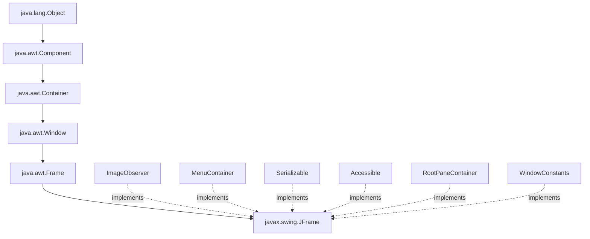
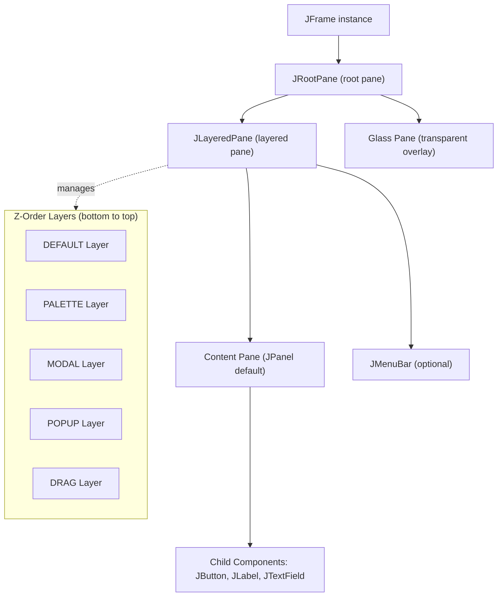
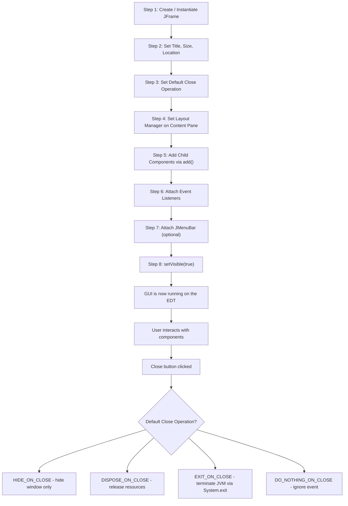
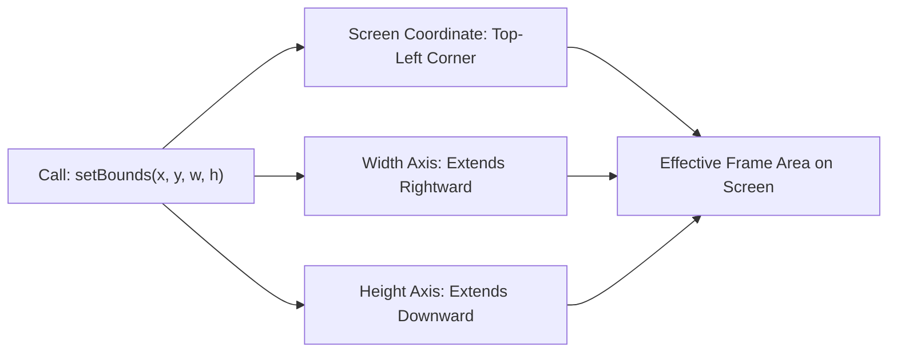
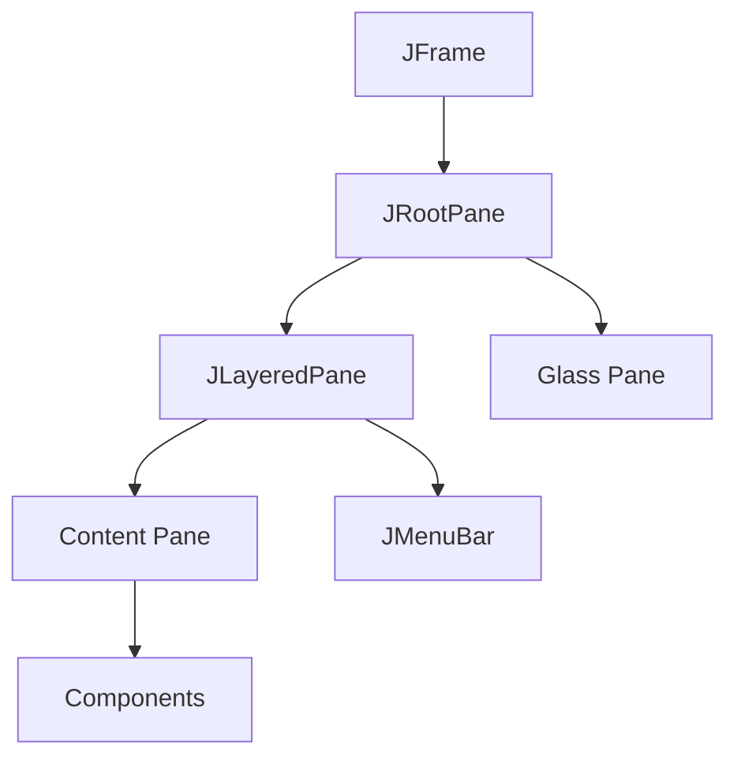

# Exploring Swings–JFrame

<!-- SECTION_1_START -->

# Exploring Swings — `JFrame` in Java

## 1.1 Formal Academic Definition

> [!IMPORTANT]
> **Core Definition (KTU 2024 Scheme – PBCST304, Module 4)**
> `JFrame` is a **top-level container** belonging to the `javax.swing` package that extends `java.awt.Frame`. It represents the primary **window** of a Swing-based GUI application and acts as the **root window** upon which all other lightweight Swing components (such as `JButton`, `JLabel`, `JTextField`, and `JPanel`) are mounted and rendered.

In the KTU OOP syllabus, `JFrame` is the gateway concept that connects the AWT `Container` model to Swing's **pluggable look-and-feel architecture (PLAF)** and **MVC-based UI rendering**.

**Package:** `javax.swing.JFrame`
**Inheritance Chain:**

$$ \text{java.lang.Object} \rightarrow \text{java.awt.Component} \rightarrow \text{java.awt.Container} \rightarrow \text{java.awt.Window} \rightarrow \text{java.awt.Frame} \rightarrow \text{javax.swing.JFrame} $$

**Implemented Interfaces:** `ImageObserver`, `MenuContainer`, `Serializable`, `Accessible`, `RootPaneContainer`, `WindowConstants`

---

## 1.2 Intuitive Analogy (Plain English)

> [!NOTE]
> **Think of `JFrame` as the *outer steel frame of a building*.**

Just as a building's frame determines its **address (title)**, **footprint (size)**, **location on the street (x, y position)**, and **what happens when people leave (close operation)** — the `JFrame` defines everything about the *outermost window* of your Java application. Inside this frame, you mount the **walls, doors, and windows** of your GUI (buttons, labels, text fields, panels) onto the **content pane** (the floor plan of the building). The glass pane, layered pane, and root pane work together like a **multi-layered curtain wall system** — controlling layered rendering, popups, and modal dialogs.

A common student pitfall is treating `JFrame` itself as a drawing surface. It is not. Drawing happens on the **content pane** (and the layered/glass panes above it), which `JFrame` manages through its internal `JRootPane`.

---

## 1.3 Key Facts & Default Constants

> [!IMPORTANT]
> **Defaults Every KTU Student Must Memorise**
> * Default **close operation** = `WindowConstants.HIDE_ON_CLOSE` (hides on close, but the JVM keeps running).
> * Default **layout manager** of the content pane = `BorderLayout`.
> * Default **size** = `(0, 0)` — the frame is **invisible** until you call `setSize()` / `pack()` / `setBounds()`.
> * Default **visibility** = `false` — you must explicitly call `setVisible(true)`.
> * Default **resizable** = `true`.
> * Default **title** = empty string.
> * A `JFrame` is a **top-level container** — it cannot be added into another container.

---

## 1.4 Geometric Intuition (Coordinate System)

> [!VISUALIZATION CONTROL]
> **Concept:** `JFrame` Bounding Rectangle on the Screen
> **GeoGebra / Desmos Input Equations / Points:**
> * `P1 = (x, y)` — top-left corner on the screen
> * `P2 = (x + w, y)` — top-right corner
> * `P3 = (x + w, y + h)` — bottom-right corner
> * `P4 = (x, y + h)` — bottom-left corner
> * `Rectangle: (x, y, w, h)`
> **Visual Description:** Draw a rectangle anchored at screen-coordinate $(x, y)$ extending rightwards by $w$ pixels and downwards by $h$ pixels. The origin $(0, 0)$ of the screen is the **top-left corner of the monitor**, with the $X$-axis increasing to the right and the $Y$-axis increasing **downward** (unlike Cartesian math).

---

## 1.5 Why `JFrame` and not `java.awt.Frame`?

| Feature | `java.awt.Frame` (AWT) | `javax.swing.JFrame` (Swing) |
|---|---|---|
| Package | `java.awt` | `javax.swing` |
| Component Type | **Heavyweight** (peer-based) | **Lightweight** (pure Java drawing) |
| Pluggable Look & Feel | ❌ Fixed to OS | ✅ `UIManager.setLookAndFeel(...)` |
| Root Pane Architecture | ❌ Not present | ✅ `JRootPane` with layered structure |
| Default Close Operation | ❌ Manual handling | ✅ Built-in via `WindowConstants` |
| Rich Icon & Mnemonic Support | Limited | Full |
| KTU Recommended Use | Legacy | **Mandatory for new code** |

---

<!-- SECTION_1_END -->

<!-- SECTION_2_START -->

# Deep Theoretical Analysis — `JFrame` Internals

## 2.1 Class Hierarchy — The Full Inheritance Tree

```
java.lang.Object
        ↑
java.awt.Component
        ↑
java.awt.Container
        ↑
java.awt.Window
        ↑
java.awt.Frame
        ↑
javax.swing.JFrame   ←  (our top-level window class)
```

> [!NOTE]
> `JFrame` inherits **all windowing, sizing, focus, and event-dispatching behaviour** from `java.awt.Frame`, and then overlays Swing's **RootPaneContainer** contract, which mandates a `JRootPane` for layered rendering.

---

## 2.2 The `RootPaneContainer` Architecture (Critical Concept)

`JFrame` implements `RootPaneContainer`, which forces it to maintain **four cooperating panes**:

| Pane | Type | Purpose |
|---|---|---|
| **Root Pane** | `JRootPane` | The master container that *manages* the other panes. |
| **Layered Pane** | `JLayeredPane` | Holds the content pane + optional menu bar at *layered* depths (z-order). |
| **Content Pane** | `JPanel` (default) | The **drawable surface** on which you `add()` regular Swing components. |
| **Glass Pane** | `JPanel` (default) | A **transparent overlay** used for capturing mouse events, rendering tool-tips, and drawing on top of everything else. |

> [!IMPORTANT]
> **Why this matters:** When you call `frame.add(new JButton("OK"))`, the button is **not** added directly to the `JFrame`. Internally, it is forwarded to `frame.getContentPane().add(...)`. In **JDK 5.0+** the delegation is automatic, but in older exam questions or interview code, you may see the explicit `getContentPane()` form.

---

## 2.3 `JFrame` Constructors — Complete Reference

| Constructor Signature | Description |
|---|---|
| `JFrame()` | Creates a frame **with no title** and uses the default `GraphicsConfiguration`. |
| `JFrame(String title)` | Creates a frame whose **title-bar text** is the supplied string. |
| `JFrame(GraphicsConfiguration gc)` | Creates a frame using a **specific screen device configuration** (multi-monitor setups). |
| `JFrame(String title, GraphicsConfiguration gc)` | Combines both — custom title + custom graphics device. |

---

## 2.4 High-Yield `JFrame` Method Cheat-Sheet (KTU Formula Sheet)

> [!NOTE]
> **The table below covers every `JFrame` method you are likely to be asked in the KTU ESE (End Semester Exam).**

| Method | Return Type | Purpose / Effect |
|---|---|---|
| `setTitle(String title)` | `void` | Sets the title-bar text. |
| `getTitle()` | `String` | Returns the current title. |
| `setSize(int width, int height)` | `void` | Sets frame size in pixels. |
| `setSize(Dimension d)` | `void` | Sets frame size from a `Dimension` object. |
| `getSize()` | `Dimension` | Returns the current size. |
| `setLocation(int x, int y)` | `void` | Sets top-left position on screen. |
| `setLocation(Point p)` | `void` | Sets position from a `Point` object. |
| `setLocationRelativeTo(Component c)` | `void` | Centres the frame relative to `c`; pass `null` to centre on screen. |
| `setBounds(int x, int y, int w, int h)` | `void` | Sets position **and** size in a single call. |
| `setVisible(boolean b)` | `void` | `true` shows the frame; `false` hides it. |
| `setResizable(boolean b)` | `void` | If `false`, user cannot resize the frame. |
| `setIconImage(Image img)` | `void` | Sets the **task-bar / title-bar icon**. |
| `setDefaultCloseOperation(int op)` | `void` | Defines behaviour on window close (see §2.5). |
| `getDefaultCloseOperation()` | `int` | Returns the current close-operation code. |
| `add(Component comp)` | `Component` | Adds a component to the **content pane** (auto-forwarded since JDK 5). |
| `remove(Component comp)` | `void` | Removes a component from the content pane. |
| `getContentPane()` | `Container` | Returns the content pane explicitly. |
| `setContentPane(Container c)` | `void` | Replaces the content pane with a custom container. |
| `getRootPane()` | `JRootPane` | Returns the root pane (rarely needed directly). |
| `getLayeredPane()` | `JLayeredPane` | Returns the layered pane. |
| `getGlassPane()` | `Component` | Returns the glass pane. |
| `setJMenuBar(JMenuBar mb)` | `void` | Attaches a menu bar to the frame. |
| `getJMenuBar()` | `JMenuBar` | Returns the current menu bar. |
| `pack()` | `void` | Sizes the frame based on its components' **preferred sizes**. |
| `dispose()` | `void` | Releases all native resources of the frame. |
| `setExtendedState(int state)` | `void` | `MAXIMIZED_HORIZ`, `MAXIMIZED_VERT`, `MAXIMIZED_BOTH`, `ICONIFIED`. |
| `setLayout(LayoutManager mgr)` | `void` | Sets the layout of the **content pane**. |
| `isVisible()` | `boolean` | Returns `true` if the frame is currently shown. |

---

## 2.5 `setDefaultCloseOperation` — The Four Constants

| Constant (from `WindowConstants`) | Behaviour on Close |
|---|---|
| `DO_NOTHING_ON_CLOSE` (value: 0) | Ignore the close; the window is **not** hidden or disposed. |
| `HIDE_ON_CLOSE` (value: 1) | **Default.** Window is hidden; the JVM keeps running. |
| `DISPOSE_ON_CLOSE` (value: 2) | Window is closed and its resources are released. |
| `EXIT_ON_CLOSE` (value: 3) | Terminates the JVM via `System.exit(0)`. Use only in **main app windows**. |

---

## 2.6 Engineering Utility — Where `JFrame` is Used in Production

* **Desktop IDEs** (e.g., Eclipse RCP, NetBeans Platform) — every top-level editor window is a `JFrame` subclass.
* **Banking & ERP front-ends** — Swing-based thick clients for inventory and billing.
* **Scientific visualisation** — MATLAB's UI toolbox, ImageJ, and many research tools use Swing.
* **Cross-platform installers** — install4j, launch4j GUIs.
* **Embedded HMI panels** — industrial control panels running Java SE on Raspberry Pi / industrial PCs.

> [!IMPORTANT]
> Although modern Java favours **JavaFX** and web-based front-ends, **KTU 2024 Scheme (PBCST304)** still tests Swing, and a large number of legacy systems across Indian banking, defence, and PSUs (e.g., TCS BaNCS, Infosys Finacle) **still run on Swing**.

---

## 2.7 Threading — The Golden Rule

> [!WARNING]
> **All Swing component creation and manipulation must happen on the Event Dispatch Thread (EDT).** Violating this rule leads to race conditions, deadlocks, and "frozen" UI threads.

The idiomatic pattern is:

```java
SwingUtilities.invokeLater(new Runnable() {
    @Override
    public void run() {
        new MyFrame().setVisible(true);
    }
});
```

Or in modern Java (still valid in Java 17 / 21):

```java
SwingUtilities.invokeLater(() -> new MyFrame().setVisible(true));
```

---

<!-- SECTION_2_END -->

<!-- SECTION_3_START -->

# Step-by-Step Implementation — Building a `JFrame` Application

> [!NOTE]
> **Domain-Adaptive Mode: Algorithmic / Coding.**
> Every line below is **explicitly written**, fully runnable Java code. The full program in §3.4 can be pasted into any Java IDE (IntelliJ, Eclipse, NetBeans, BlueJ) and run immediately.

---

## 3.1 Method 1 — **By Extending the `JFrame` Class** (Most Common)

**Step 1:** Import the Swing and AWT packages.
**Step 2:** Declare a public class extending `JFrame`.
**Step 3:** Define a constructor that configures the frame and adds components.
**Step 4:** Define `main()` that instantiates the subclass and shows it.

```java
import javax.swing.JFrame;
import javax.swing.JLabel;

public class FrameByExtension extends JFrame {

    // Step 3.1: Define a no-argument constructor
    public FrameByExtension() {
        // 3.1.1 — Set the title-bar text
        setTitle("KTU Demo - By Extension");

        // 3.1.2 — Set size in pixels: width = 400, height = 200
        setSize(400, 200);

        // 3.1.3 — Centre the frame on the screen
        setLocationRelativeTo(null);

        // 3.1.4 — Terminate the JVM when the user closes the window
        setDefaultCloseOperation(JFrame.EXIT_ON_CLOSE);

        // 3.1.5 — Add a single component to the content pane
        add(new JLabel("Hello, this is Frame-by-Extension.", JLabel.CENTER));

        // 3.1.6 — Make the frame visible (must be the LAST step)
        setVisible(true);
    }

    // Step 4: Entry point
    public static void main(String[] args) {
        FrameByExtension frame = new FrameByExtension();
    }
}
```

**Key point:** Because the constructor itself calls `setVisible(true)`, the `main()` method simply creates the object.

---

## 3.2 Method 2 — **By Instantiating `JFrame` Inside Another Class** (Association)

```java
import javax.swing.JFrame;
import javax.swing.JButton;
import java.awt.FlowLayout;

public class FrameByAssociation {

    public static void main(String[] args) {
        // Step 1: Instantiate JFrame directly
        JFrame frame = new JFrame("KTU Demo - By Association");

        // Step 2: Set size and position
        frame.setSize(420, 220);
        frame.setLocation(150, 100);

        // Step 3: Set layout of the content pane
        frame.setLayout(new FlowLayout(FlowLayout.CENTER, 20, 20));

        // Step 4: Add components
        frame.add(new JButton("Button 1"));
        frame.add(new JButton("Button 2"));
        frame.add(new JButton("Button 3"));

        // Step 5: Close behaviour
        frame.setDefaultCloseOperation(JFrame.EXIT_ON_CLOSE);

        // Step 6: Show the frame
        frame.setVisible(true);
    }
}
```

**Key point:** Here the `main()` class is **not** a `JFrame` subclass; it *uses* a `JFrame` via composition. This pattern is preferred when the application logic is separate from the window itself.

---

## 3.3 Method 3 — **Using an Anonymous Inner Class** (Lambda-Free Variant)

```java
import javax.swing.JFrame;
import javax.swing.JLabel;
import java.awt.event.WindowEvent;
import java.awt.event.WindowAdapter;

public class FrameByAnonymous {

    public static void main(String[] args) {

        JFrame frame = new JFrame("KTU Demo - Anonymous Listener");
        frame.setSize(380, 180);
        frame.setLayout(new java.awt.BorderLayout());
        frame.add(new JLabel("Closing this window hides it only.", JLabel.CENTER), java.awt.BorderLayout.CENTER);
        frame.setDefaultCloseOperation(JFrame.HIDE_ON_CLOSE);
        frame.setLocationRelativeTo(null);

        // Anonymous WindowAdapter to log closing events
        frame.addWindowListener(new WindowAdapter() {
            @Override
            public void windowClosing(WindowEvent e) {
                System.out.println("Window is closing...");
            }

            @Override
            public void windowClosed(WindowEvent e) {
                System.out.println("Window has been closed.");
            }
        });

        frame.setVisible(true);
    }
}
```

**Key point:** `WindowAdapter` is a no-op implementation of `WindowListener`; extending it lets you override **only the events you care about**, avoiding empty-method boilerplate.

---

## 3.4 Method 4 — **The Full Production-Ready Example** (Menu Bar, Event Handling, Layout)

> [!IMPORTANT]
> This is the **gold-standard template** expected in KTU lab examinations. Save it as `JFrameFullDemo.java`.

```java
// ===== File: JFrameFullDemo.java =====
import javax.swing.JFrame;
import javax.swing.JLabel;
import javax.swing.JButton;
import javax.swing.JPanel;
import javax.swing.JMenuBar;
import javax.swing.JMenu;
import javax.swing.JMenuItem;
import javax.swing.SwingUtilities;
import javax.swing.SwingConstants;
import javax.swing.UIManager;
import java.awt.BorderLayout;
import java.awt.FlowLayout;
import java.awt.Color;
import java.awt.Font;
import java.awt.event.ActionEvent;
import java.awt.event.ActionListener;
import java.awt.event.KeyEvent;

/**
 * Comprehensive KTU JFrame demonstration covering:
 *   - Inheritance-based subclassing
 *   - Content-pane manipulation
 *   - Menu bar attachment
 *   - Layout managers (BorderLayout, FlowLayout)
 *   - Event handling (ActionListener)
 *   - Look-and-Feel configuration
 *   - Safe EDT threading
 */
public class JFrameFullDemo extends JFrame {

    // --- Member components (declared as fields for accessibility) ---
    private final JLabel headerLabel;
    private final JLabel counterLabel;
    private final JButton incrementButton;
    private final JButton decrementButton;
    private final JButton resetButton;
    private int counter;

    // ===================== CONSTRUCTOR =====================
    public JFrameFullDemo() {
        // ---------- 1. Initialise the counter ----------
        counter = 0;

        // ---------- 2. Initialise the labels ----------
        headerLabel  = new JLabel("KTU PBCST304 — JFrame Demonstration", SwingConstants.CENTER);
        headerLabel.setFont(new Font("Serif", Font.BOLD, 18));
        headerLabel.setOpaque(true);
        headerLabel.setBackground(new Color(230, 240, 255));

        counterLabel = new JLabel("Counter Value: " + counter, SwingConstants.CENTER);
        counterLabel.setFont(new Font("Monospaced", Font.PLAIN, 24));

        // ---------- 3. Initialise the buttons ----------
        incrementButton = new JButton("Increment (+1)");
        decrementButton = new JButton("Decrement (-1)");
        resetButton     = new JButton("Reset (0)");

        // ---------- 4. Register the ActionListener (anonymous) ----------
        ActionListener buttonListener = new ActionListener() {
            @Override
            public void actionPerformed(ActionEvent e) {
                Object source = e.getSource();
                if (source == incrementButton) {
                    counter++;
                } else if (source == decrementButton) {
                    counter--;
                } else if (source == resetButton) {
                    counter = 0;
                }
                counterLabel.setText("Counter Value: " + counter);
            }
        };
        incrementButton.addActionListener(buttonListener);
        decrementButton.addActionListener(buttonListener);
        resetButton.addActionListener(buttonListener);

        // ---------- 5. Build a sub-panel for the buttons (FlowLayout) ----------
        JPanel buttonPanel = new JPanel();
        buttonPanel.setLayout(new FlowLayout(FlowLayout.CENTER, 15, 10));
        buttonPanel.add(incrementButton);
        buttonPanel.add(decrementButton);
        buttonPanel.add(resetButton);

        // ---------- 6. Configure the content pane (BorderLayout) ----------
        setLayout(new BorderLayout(10, 10));
        add(headerLabel,  BorderLayout.NORTH);
        add(counterLabel, BorderLayout.CENTER);
        add(buttonPanel,  BorderLayout.SOUTH);

        // ---------- 7. Build a menu bar ----------
        JMenuBar menuBar = new JMenuBar();
        JMenu fileMenu = new JMenu("File");
        fileMenu.setMnemonic(KeyEvent.VK_F);
        JMenuItem exitItem = new JMenuItem("Exit");
        exitItem.setMnemonic(KeyEvent.VK_X);
        exitItem.addActionListener(new ActionListener() {
            @Override
            public void actionPerformed(ActionEvent e) {
                System.exit(0);
            }
        });
        fileMenu.add(exitItem);
        menuBar.add(fileMenu);
        setJMenuBar(menuBar);

        // ---------- 8. Frame-level configuration ----------
        setTitle("KTU Swing Lab — Full JFrame Demo");
        setSize(520, 280);
        setLocationRelativeTo(null);
        setDefaultCloseOperation(JFrame.EXIT_ON_CLOSE);
        setResizable(false);
    }

    // ===================== ENTRY POINT =====================
    public static void main(String[] args) {

        // 1. Try to apply the system's native look-and-feel
        try {
            UIManager.setLookAndFeel(UIManager.getSystemLookAndFeelClassName());
        } catch (Exception ex) {
            System.err.println("Could not apply system Look and Feel: " + ex.getMessage());
        }

        // 2. Schedule frame creation on the Event Dispatch Thread
        SwingUtilities.invokeLater(new Runnable() {
            @Override
            public void run() {
                JFrameFullDemo demoFrame = new JFrameFullDemo();
                demoFrame.setVisible(true);
            }
        });
    }
}
```

**Program Walkthrough (Valuation Key — what to write in the exam):**

1. **Imports** — `javax.swing.*` for Swing components, `java.awt.*` for layout managers and event classes.
2. **Class declaration** — `extends JFrame` to inherit windowing behaviour.
3. **Member components** — declared as `private final` fields so they remain accessible from event handlers.
4. **Constructor** — performs **all** GUI initialisation (label, button, panel, menu bar, layout).
5. **Anonymous `ActionListener`** — handles all three button clicks using `e.getSource()` to disambiguate.
6. **Sub-panel with `FlowLayout`** — encapsulates the buttons, mounted on the `BorderLayout.SOUTH` region.
7. **Menu bar** — demonstrates `setJMenuBar()`, mnemonic keys (`VK_F`, `VK_X`), and a menu-driven exit.
8. **`main()` method** — configures the **Look and Feel** first, then uses `SwingUtilities.invokeLater(...)` to launch the GUI on the **EDT** (a best-practice requirement).

---

## 3.5 Mathematical Equivalence of `setBounds`

> [!NOTE]
> **KTU sometimes asks to map a `setBounds` call to screen coordinates.**

The call:

```java
setBounds(100, 150, 400, 300);
```

is **logically equivalent** to:

```java
setLocation(100, 150);
setSize(400, 300);
```

**Coordinate formula** of the four corners:

$$ P_{\text{top-left}} = (x, y) $$

$$ P_{\text{top-right}} = (x + w, y) $$

$$ P_{\text{bottom-right}} = (x + w, y + h) $$

$$ P_{\text{bottom-left}} = (x, y + h) $$

where $x$ = horizontal offset from the **left** edge of the screen, $y$ = vertical offset from the **top** edge, $w$ = width in pixels, $h$ = height in pixels.

---

<!-- SECTION_3_END -->

<!-- SECTION_4_START -->

# Structural Diagrams & Schematics

> [!IMPORTANT]
> **Mermaid Safety Rules Applied:**
> * All node IDs are alphanumeric (e.g., `n1`, `n2a`).
> * All labels with special characters are double-quoted.
> * No reserved keywords (`end`, `graph`, `subgraph`) used as node IDs.

---

## 4.1 Diagram 1 — `JFrame` Class Inheritance Hierarchy



**Reading guide:** Solid arrows (`-->`) denote **class inheritance**; dashed arrows (`-.->`) denote **interface implementation**. `JFrame` inherits windowing behaviour from `Frame` and *contracts* the Swing-specific behaviours via the `RootPaneContainer` and `WindowConstants` interfaces.

---

## 4.2 Diagram 2 — `JFrame` Internal Root-Pane Architecture



**Reading guide:** The `Content Pane` is where `frame.add(...)` *logically* deposits components. The `Glass Pane` sits **above** everything and is invisible by default — programmers use it for custom painting and mouse-grabbing overlays. The `JLayeredPane` enforces the **z-order** so that popups float above dialogs, which float above the base content.

---

## 4.3 Diagram 3 — `JFrame` Lifecycle and Configuration Flow



**Reading guide:** This is the **canonical sequence** to draw in KTU theory answers. The decision diamond at `n12` is a **high-yield concept** — examiners routinely ask: *"What happens when the user clicks the close (X) button?"* Answer: behaviour is dictated by whichever constant you passed to `setDefaultCloseOperation(...)`.

---

## 4.4 Diagram 4 — `setBounds` Coordinate Mapping (Block-Level Fallback)



**Reading guide:** This block diagram summarises the geometric effect of `setBounds`. Even though the *physical* screen rectangle cannot be drawn natively in Mermaid, this topology faithfully represents the **functional flow** from a single setter call to the resulting screen region.

---

<!-- SECTION_4_END -->

<!-- SECTION_5_START -->

# KTU 2024 Scheme Examination Question Bank

> [!NOTE]
> **Mark Distribution Reference (KTU ESE):**
> * Part A: Short-answer questions of **3 marks** each.
> * Part B: Long-answer questions of **14 marks** each, with **internal choice** (attempt any one of two).

---

## 📘 PART A — 3-Mark Questions (Remember / Understand)

### Question A1 — `[KTU University Exam — July 2023]`
**(CO3, Remember)**

**Q: Define `JFrame`. State the package it belongs to and list any two methods of `JFrame` with their purpose.**

**Model Answer (Board-Standard):**

`JFrame` is a top-level container class in the `javax.swing` package that is used to create the main window of a Swing-based GUI application. It extends `java.awt.Frame` and implements the `RootPaneContainer` interface, which provides a layered architecture consisting of a content pane, layered pane, and glass pane.

Two important methods are:

1. `setTitle(String title)` — sets the text displayed in the title bar of the frame.
2. `setDefaultCloseOperation(int operation)` — defines what action is performed when the user clicks the close (X) button, e.g., `EXIT_ON_CLOSE` to terminate the JVM.

> **Valuation Key:** *[Definition: 1 Mark] [Package: 0.5 Mark] [Two methods with purpose: 1.5 Marks]*

---

### Question A2 — `[KTU University Exam — Dec 2023]`
**(CO3, Understand)**

**Q: Differentiate between `HIDE_ON_CLOSE` and `EXIT_ON_CLOSE` constants of `JFrame`.**

**Model Answer:**

`HIDE_ON_CLOSE` and `EXIT_ON_CLOSE` are two constants defined in the `WindowConstants` interface (implemented by `JFrame`) that control the behaviour of a window when its close (X) button is clicked.

| Aspect | `HIDE_ON_CLOSE` | `EXIT_ON_CLOSE` |
|---|---|---|
| Effect | The window is **hidden** (`setVisible(false)`) but the JVM **keeps running**. | The entire application is **terminated** by calling `System.exit(0)`. |
| Resource handling | Native window resources are **retained** and the window can be re-shown. | All resources, threads, and the JVM itself are **released**. |
| Default? | **Default** behaviour if `setDefaultCloseOperation` is not called. | Not default; must be explicitly set. |
| Recommended Use | Secondary / sub-windows, MDI child frames. | The **main** application window. |

> **Valuation Key:** *[Point-by-point contrast: 3 Marks — 1.5 Marks per constant.]*

---

## 📗 PART B — 14-Mark Questions (Internal Choice)

> [!IMPORTANT]
> **Instructions (as printed on the KTU question paper):**
> *"Answer any ONE full question from each module. Each full question carries 14 marks and may have sub-parts (a) and (b)."*

---

### Question B1 — `[KTU University Exam — July 2024]`
**(CO3, Understand + Apply)**

#### **Question B1.A (14 marks) — Attempt this OR B1.B**

**(a)** Explain the `JFrame` class hierarchy in detail. List **at least four constructors** of `JFrame` with their signatures. **(7 marks)**

**(b)** Write a complete Java program that creates a `JFrame` titled *"Student Registration"*, with two `JLabel`s (Name, Age), one `JTextField` for Name, one `JSpinner` for Age, and a `JButton` labelled *"Submit"*. Use `FlowLayout` and set the default close operation to `EXIT_ON_CLOSE`. **(7 marks)**

---

#### **Model Answer — B1.A (a) JFrame Hierarchy & Constructors**

**JFrame Class Hierarchy:**

`JFrame` is declared in the `javax.swing` package. The full inheritance chain is:

$$ \text{Object} \rightarrow \text{Component (java.awt)} \rightarrow \text{Container (java.awt)} \rightarrow \text{Window (java.awt)} \rightarrow \text{Frame (java.awt)} \rightarrow \text{JFrame (javax.swing)} $$

`JFrame` also implements the following interfaces: `ImageObserver`, `MenuContainer`, `Serializable`, `Accessible`, `RootPaneContainer`, and `WindowConstants`.

**JFrame Constructors (at least four):**

| # | Constructor | Purpose |
|---|---|---|
| 1 | `JFrame()` | Creates a frame with **no title**. |
| 2 | `JFrame(String title)` | Creates a frame whose **title-bar text** is the supplied string. |
| 3 | `JFrame(GraphicsConfiguration gc)` | Creates a frame on a **specific graphics device** (multi-monitor support). |
| 4 | `JFrame(String title, GraphicsConfiguration gc)` | Combines a custom title with a specific graphics configuration. |

> **Valuation Key:** *[Hierarchy chain: 2 Marks] [Interface list: 1 Mark] [Four constructors with purpose: 4 Marks]*

---

#### **Model Answer — B1.A (b) Student Registration Program**

```java
import javax.swing.JFrame;
import javax.swing.JLabel;
import javax.swing.JTextField;
import javax.swing.JSpinner;
import javax.swing.SpinnerNumberModel;
import javax.swing.JButton;
import javax.swing.JPanel;
import java.awt.FlowLayout;
import java.awt.GridLayout;

public class StudentRegistration extends JFrame {

    public StudentRegistration() {
        // 1. Set frame-level properties
        setTitle("Student Registration");
        setSize(420, 220);
        setLocationRelativeTo(null);
        setDefaultCloseOperation(JFrame.EXIT_ON_CLOSE);

        // 2. Configure the content-pane layout
        setLayout(new GridLayout(4, 2, 10, 10));

        // 3. Create components
        JLabel nameLabel  = new JLabel("Name:");
        JTextField nameField = new JTextField(15);

        JLabel ageLabel   = new JLabel("Age:");
        JSpinner ageSpinner = new JSpinner(new SpinnerNumberModel(18, 1, 120, 1));

        JButton submitButton = new JButton("Submit");

        // 4. Add components to the content pane
        add(nameLabel);
        add(nameField);
        add(ageLabel);
        add(ageSpinner);
        add(new JLabel(""));  // Empty cell for grid alignment
        add(submitButton);

        // 5. Make the frame visible
        setVisible(true);
    }

    public static void main(String[] args) {
        StudentRegistration frame = new StudentRegistration();
    }
}
```

> **Valuation Key:** *[Imports: 1 Mark] [Class declaration: 1 Mark] [Constructor: 1 Mark] [Component creation: 1.5 Marks] [add() calls: 1 Mark] [setVisible + main: 1.5 Marks]*

---

#### **Question B1.B (14 marks) — Alternative Choice**

**(a)** Explain the **`RootPaneContainer` architecture** of `JFrame`. With the help of a neat diagram, describe the role of `JRootPane`, `JLayeredPane`, `Content Pane`, and `Glass Pane`. **(7 marks)**

**(b)** Compare `java.awt.Frame` and `javax.swing.JFrame` on **at least six** points. Write a program snippet that demonstrates the use of `setLocationRelativeTo(null)`, `pack()`, and `setResizable(false)`. **(7 marks)**

---

#### **Model Answer — B1.B (a) RootPaneContainer Architecture**

`JFrame` implements the `RootPaneContainer` interface, which mandates a layered, modular window structure. The four cooperating panes are:

1. **`JRootPane`** — The master container that organises the other panes and manages keyboard actions (mnemonics) and focus traversal.
2. **`JLayeredPane`** — Holds the content pane and the menu bar at different **z-order depths** (e.g., `DEFAULT_LAYER`, `MODAL_LAYER`, `POPUP_LAYER`).
3. **Content Pane (`JPanel` by default)** — The **drawable region** on which you `add()` regular Swing components such as `JButton`, `JLabel`, etc.
4. **Glass Pane (`JPanel` by default)** — A **transparent overlay** that sits on top of everything; used to intercept mouse events or to paint over the entire frame.

**Diagram (reproduced from §4.2):**



> **Valuation Key:** *[Interface name: 1 Mark] [Four pane descriptions: 4 Marks] [Diagram: 2 Marks]*

---

#### **Model Answer — B1.B (b) Frame vs JFrame + Code Snippet**

**Comparison Table:**

| # | Feature | `java.awt.Frame` | `javax.swing.JFrame` |
|---|---|---|---|
| 1 | Package | `java.awt` | `javax.swing` |
| 2 | Weight | Heavyweight (OS peer) | Lightweight (pure Java) |
| 3 | Pluggable Look & Feel | ❌ | ✅ |
| 4 | Root Pane Architecture | ❌ | ✅ |
| 5 | Default Close Operation | Manual | Built-in via `WindowConstants` |
| 6 | Rich Component Support | Limited | Full Swing (`JButton`, `JTable`, etc.) |
| 7 | Use Case | Legacy | **Recommended for all new code** |

**Code Snippet:**

```java
import javax.swing.JFrame;
import javax.swing.JLabel;
import java.awt.FlowLayout;

public class SnippetDemo {
    public static void main(String[] args) {
        JFrame frame = new JFrame("Snippet Demo");

        // Centre on screen
        frame.setLocationRelativeTo(null);

        // Auto-size based on preferred sizes of contents
        frame.setSize(300, 150);   // size first
        frame.add(new JLabel("Centreed, packed, fixed-size frame."));
        frame.pack();              // overrides setSize if components prefer larger

        // Disable user resizing
        frame.setResizable(false);

        frame.setDefaultCloseOperation(JFrame.EXIT_ON_CLOSE);
        frame.setVisible(true);
    }
}
```

> **Valuation Key:** *[Comparison points (≥6): 4 Marks] [Code correctness: 3 Marks]*

---

### Question B2 — `[KTU University Exam — Dec 2024]`
**(CO3, Apply + Analyse)**

#### **Question B2.A (14 marks) — Attempt this OR B2.B**

**(a)** Explain all **four constants** of `WindowConstants` that can be passed to `JFrame.setDefaultCloseOperation(...)`, with an example. **(7 marks)**

**(b)** Write a complete Java program that demonstrates the use of an **anonymous `ActionListener`** with three `JButton`s (*Red*, *Green*, *Blue*). On clicking a button, the background colour of the `JFrame`'s content pane should change to the corresponding colour. **(7 marks)**

---

#### **Model Answer — B2.A (a) The Four WindowConstants**

| # | Constant | Value | Behaviour on Close |
|---|---|---|---|
| 1 | `DO_NOTHING_ON_CLOSE` | 0 | The close event is **ignored**; the window remains open. Useful when the user must confirm before exit. |
| 2 | `HIDE_ON_CLOSE` | 1 | The window is hidden (`setVisible(false)`). The JVM keeps running. This is the **default**. |
| 3 | `DISPOSE_ON_CLOSE` | 2 | The window is closed and **all native resources** are released via `dispose()`. Useful for sub-windows. |
| 4 | `EXIT_ON_CLOSE` | 3 | The entire application is terminated via `System.exit(0)`. Use **only** for the main window. |

**Example:**

```java
JFrame frame = new JFrame("Constant Demo");
frame.setDefaultCloseOperation(JFrame.EXIT_ON_CLOSE);
// When the user clicks 'X', the JVM will exit.
```

> **Valuation Key:** *[All four constants: 4 Marks] [Distinguishing behaviour: 2 Marks] [Example: 1 Mark]*

---

#### **Model Answer — B2.A (b) Colour-Changer Program**

```java
import javax.swing.JFrame;
import javax.swing.JButton;
import javax.swing.JPanel;
import java.awt.Color;
import java.awt.FlowLayout;
import java.awt.Container;
import java.awt.event.ActionEvent;
import java.awt.event.ActionListener;

public class ColorChanger extends JFrame {

    public ColorChanger() {
        setTitle("Background Color Changer");
        setSize(400, 200);
        setLocationRelativeTo(null);
        setDefaultCloseOperation(JFrame.EXIT_ON_CLOSE);

        // Create the content pane explicitly
        Container contentPane = getContentPane();
        contentPane.setLayout(new FlowLayout(FlowLayout.CENTER, 20, 20));

        // Create the three buttons
        JButton redBtn   = new JButton("Red");
        JButton greenBtn = new JButton("Green");
        JButton blueBtn  = new JButton("Blue");

        // Register an anonymous ActionListener on all three buttons
        ActionListener listener = new ActionListener() {
            @Override
            public void actionPerformed(ActionEvent e) {
                String cmd = e.getActionCommand();
                if (cmd.equals("Red")) {
                    contentPane.setBackground(Color.RED);
                } else if (cmd.equals("Green")) {
                    contentPane.setBackground(Color.GREEN);
                } else if (cmd.equals("Blue")) {
                    contentPane.setBackground(Color.BLUE);
                }
            }
        };

        redBtn.addActionListener(listener);
        greenBtn.addActionListener(listener);
        blueBtn.addActionListener(listener);

        // Add buttons
        contentPane.add(redBtn);
        contentPane.add(greenBtn);
        contentPane.add(blueBtn);

        setVisible(true);
    }

    public static void main(String[] args) {
        new ColorChanger();
    }
}
```

> **Valuation Key:** *[Class structure: 1 Mark] [Listener registration: 1.5 Marks] [Action command matching: 1.5 Marks] [Container reference for background change: 1.5 Marks] [Visibility: 1 Mark] [main method: 0.5 Mark]*

---

#### **Question B2.B (14 marks) — Alternative Choice**

**(a)** What is the **Event Dispatch Thread (EDT)**? Why is it important to use `SwingUtilities.invokeLater(...)` while launching a Swing application? Write the canonical `main()` template. **(7 marks)**

**(b)** Explain the `JFrame` lifecycle: *construct → configure → populate → show → close*. List the methods you would call at each stage. **(7 marks)**

---

#### **Model Answer — B2.B (a) EDT and `invokeLater`**

The **Event Dispatch Thread (EDT)** is a special, dedicated thread that the JVM uses to handle **all Swing component events** — mouse clicks, key presses, repaints, etc. It is the only thread that should **create, modify, or query** Swing components safely.

If you create a `JFrame` on the *main* thread (e.g., directly inside `main()` without `invokeLater`), there is a risk of **race conditions**, **deadlocks**, or **frozen UIs** because two threads might be touching the same component at the same time.

`SwingUtilities.invokeLater(Runnable r)` schedules the supplied `Runnable` to be executed **asynchronously on the EDT**, after all pending AWT events have been processed. This is the official Java-recommended pattern for launching any Swing application.

**Canonical `main()` Template:**

```java
public static void main(String[] args) {
    SwingUtilities.invokeLater(new Runnable() {
        @Override
        public void run() {
            MyJFrame frame = new MyJFrame();
            frame.setVisible(true);
        }
    });
}
```

> **Valuation Key:** *[EDT definition: 2 Marks] [Why invokeLater: 2 Marks] [Template code: 2 Marks] [Mentioning @Override: 1 Mark]*

---

#### **Model Answer — B2.B (b) JFrame Lifecycle**

| Stage | Purpose | Methods Called |
|---|---|---|
| 1. **Construct** | Allocate the frame object. | `new JFrame()` or `new JFrame(String title)` |
| 2. **Configure** | Set window-level properties. | `setTitle(...)`, `setSize(...)`, `setLocation(...)`, `setLocationRelativeTo(null)`, `setResizable(...)` |
| 3. **Close Behaviour** | Define exit semantics. | `setDefaultCloseOperation(JFrame.EXIT_ON_CLOSE)` |
| 4. **Layout Setup** | Choose a layout manager. | `setLayout(new BorderLayout())` etc. |
| 5. **Populate** | Add child components. | `add(new JButton(...))`, `add(new JLabel(...))` |
| 6. **Event Wiring** | Register listeners. | `button.addActionListener(new ActionListener() { ... })` |
| 7. **Show** | Make visible. | `setVisible(true)` |
| 8. **Runtime Interaction** | User interacts; events fire. | Listener methods (`actionPerformed`, etc.) |
| 9. **Close** | Triggered by user / code. | `dispose()` or `System.exit(0)` (based on constant) |

> **Valuation Key:** *[Five correct stages: 5 Marks] [Appropriate methods: 2 Marks]*

---

## ⚠️ KTU Examiner's Valuation Warning / Pitfall Callout

> [!WARNING]
> **Common Mistakes That Cost Marks**
>
> 1. **Forgetting `setVisible(true)`** — the frame is created but invisible. The student thinks the program "does not work". Always call `setVisible(true)` as the **last** statement in the constructor or `main()`.
>
> 2. **Adding components directly to `JFrame` using old JDK-1.4 style** — In JDK 1.5+, `add()` is auto-forwarded to the content pane, but examiners still expect you to know the *theory* of the `RootPaneContainer` architecture. Always mention `getContentPane().add(...)` in theory answers.
>
> 3. **Confusing `HIDE_ON_CLOSE` and `EXIT_ON_CLOSE`** — `HIDE_ON_CLOSE` only hides; the program continues. Use `EXIT_ON_CLOSE` *only* in the main frame.
>
> 4. **Threading violations** — Creating Swing components on the *main thread* without `invokeLater` is technically unsafe. Examiners will deduct 1–2 marks if you skip `SwingUtilities.invokeLater(...)`.
>
> 5. **Forgetting `pack()` after using layout managers** — if you use `pack()`, do **not** also call `setSize(...)` afterwards, because `pack()` will be overridden. Conversely, if you use `setSize()`, `pack()` is redundant.
>
> 6. **Not specifying the *package* and *class hierarchy*** — KTU answers must mention the package `javax.swing` and the inheritance chain up to `Object`. Failing to do so costs 1–2 marks.
>
> 7. **Wrong coordinate system** — In Java AWT/Swing, the **Y-axis points downward**. The origin is the top-left of the screen. Some students invert this and write incorrect `setBounds` values.
>
> 8. **Forgetting to import `java.awt.event.*`** — required for `ActionListener`, `ActionEvent`, `WindowAdapter`, `WindowEvent`.

---

## 🔁 Topic Recap & Important Things to Remember

> [!NOTE]
> **Rapid-Revision Checklist for KTU Module 4 — `JFrame`**

* ✅ `JFrame` is in `javax.swing`; it extends `java.awt.Frame` and implements `RootPaneContainer`, `WindowConstants`, `Serializable`, and `Accessible`.
* ✅ Inheritance chain: `Object → Component → Container → Window → Frame → JFrame`.
* ✅ Four constructors: `JFrame()`, `JFrame(String)`, `JFrame(GraphicsConfiguration)`, `JFrame(String, GraphicsConfiguration)`.
* ✅ **Default close operation** is `HIDE_ON_CLOSE` (not exit).
* ✅ **Default layout** of the content pane is `BorderLayout`.
* ✅ A `JFrame` is a **top-level container** — it cannot be added to another container.
* ✅ The internal architecture is `JFrame → JRootPane → {JLayeredPane, Glass Pane}` with `Content Pane` and `JMenuBar` inside the layered pane.
* ✅ `setBounds(x, y, w, h)` ≡ `setLocation(x, y)` + `setSize(w, h)`.
* ✅ `setLocationRelativeTo(null)` centres the frame on screen.
* ✅ `pack()` auto-sizes the frame to its components' **preferred sizes**.
* ✅ `dispose()` releases native resources without killing the JVM.
* ✅ `setDefaultCloseOperation(...)` accepts four constants: `DO_NOTHING_ON_CLOSE`, `HIDE_ON_CLOSE`, `DISPOSE_ON_CLOSE`, `EXIT_ON_CLOSE`.
* ✅ `EXIT_ON_CLOSE` → `System.exit(0)`; use only in the **main** window.
* ✅ All Swing creation must happen on the **Event Dispatch Thread (EDT)** — use `SwingUtilities.invokeLater(...)`.
* ✅ `add()` on a `JFrame` is auto-forwarded to the **content pane** (since JDK 5).
* ✅ A `JFrame` has an **icon image** (set via `setIconImage(Image)`), a **title**, and a **menu bar** (set via `setJMenuBar(...)`).
* ✅ The Y-axis on the screen points **downward**; the origin is the **top-left** of the monitor.
* ✅ The **glass pane** is transparent and used for overlays / custom painting; the **content pane** holds regular components.
* ✅ Always use **double quotes** around `JFrame` constants (e.g., `JFrame.EXIT_ON_CLOSE`).
* ✅ KTU exam favourite topics: (i) compare `Frame` vs `JFrame`, (ii) explain `RootPaneContainer`, (iii) write a `JFrame` program with event handling, (iv) explain the four `WindowConstants`.
* ✅ Remember the *factory* mnemonic: **"C²P²V²"** for a JFrame — **C**onstruct, **C**onfigure, **P**opulate, **P**ack/show, **V**isible, **V**alidate.

---

<!-- SECTION_5_END -->
