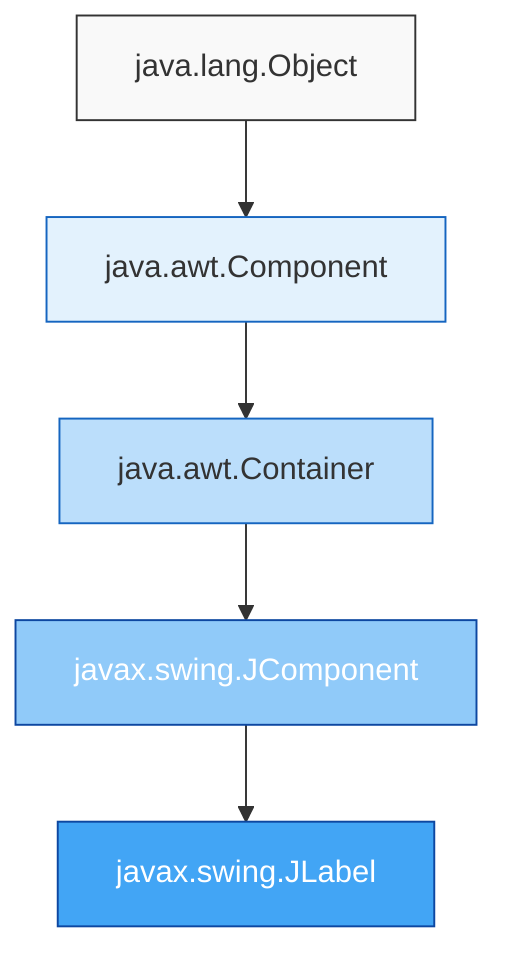
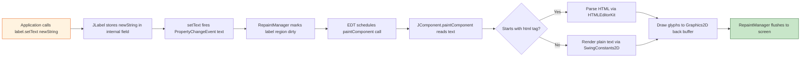
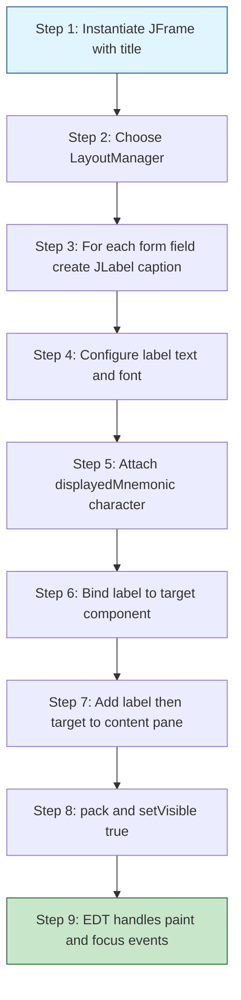
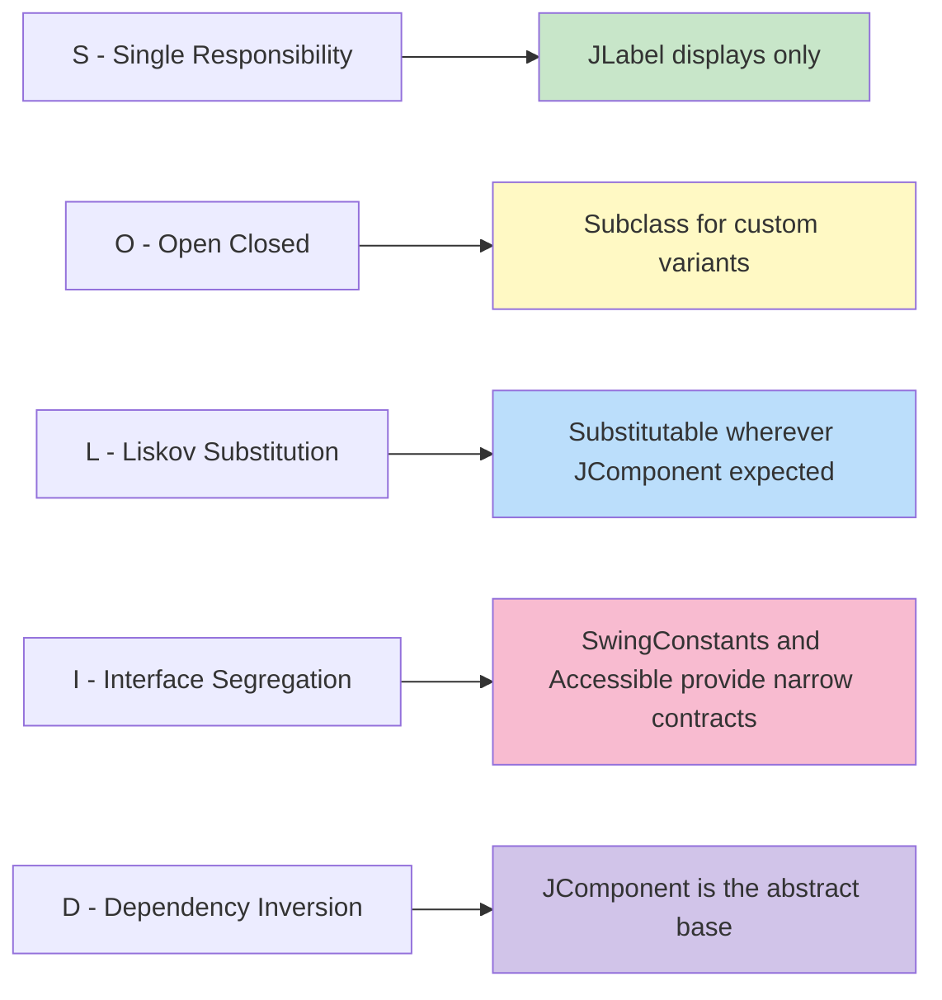

# JLabel

<!-- SECTION_1_START -->
# JLabel — Core Technical Definition & Intuitive Overview

## 1.1 Formal Academic Definition (KTU 2024 Syllabus Terminology)

> [!NOTE]
> **JLabel** is a subclass of `javax.swing.JComponent` (indirectly via `java.awt.Container`) that is used to **render a short text string, an image, or both** on a Swing-based Graphical User Interface (GUI). It is a **passive display component**, meaning it cannot receive keyboard focus and does not generate user-interaction events of its own.

In the **Java Abstract Window Toolkit (AWT) / Swing** hierarchy, `JLabel` is the standard, lightweight, pluggable look-and-feel compliant replacement for the legacy AWT `Label` class. It conforms to the **Single Responsibility Principle (SRP)** of the SOLID design — its sole job is to *describe* or *labellize* other components.

$$ \text{JLabel} \;\in\; \text{javax.swing} \;\subset\; \text{Java Foundation Classes (JFC)} $$

The class signature in the JDK is declared as:

$$
\texttt{public\ class\ JLabel\ extends\ JComponent\ implements\ SwingConstants,\ Accessible}
$$

---

## 1.2 Conceptual Analogy / Intuition

> [!IMPORTANT]
> **Analogy — A Printed Name-Tag on an Office Door**
> Imagine a glass office door. On the door is stuck a small printed name-tag that says *"Accounts Department"* or *"Manager — Mr. Sharma"*. The tag does **not** open the door, does **not** sense anyone touching it, and does **not** respond if you tap on it. Its **only** purpose is to **inform** whoever is looking.
>
> That name-tag is a `JLabel`. The door is the `JFrame` (the main window). Whatever the tag *describes* — a name, a number, a tiny picture of a logo — is the **label's content**. You can change the tag's content dynamically (e.g., "Meeting in Progress" → "Vacant"), exactly the way a `JLabel` lets you change its `text` property at runtime via `setText(...)`.

### Key Visual Properties at a Glance

| Property | Real-World Equivalent | Default |
|---|---|---|
| `text` | Words printed on the tag | `""` (empty) |
| `icon` | A small logo on the tag | `null` |
| `horizontalAlignment` | Left / Center / Right placement | `LEADING` |
| `verticalAlignment` | Top / Center / Bottom placement | `CENTER` |
| `foreground` | Ink color of the text | **Color.BLACK** |
| `font` | Font style of the text | System **Dialog**, **12 pt** |

---

## 1.3 Important Note on Module Context (SOLID + Swing)

> [!NOTE]
> In the KTU **PBCST304 – OOP, Module 4 (SOLID Principles in Java)** context, `JLabel` is studied as a **case-study class** to demonstrate:
> * **S — Single Responsibility Principle** — JLabel *only* displays; it does not collect input.
> * **L — Liskov Substitution Principle** — Anywhere a `JComponent` is expected, a `JLabel` is substitutable.
> * **O — Open/Closed Principle** — New label variants (e.g., a custom `URLJLabel` that opens hyperlinks) can be created by *extending* `JLabel` without modifying its source.
> * **D — Dependency Inversion** — High-level GUI panels depend on the abstract `JComponent`, not the concrete `JLabel`.

---

> [!VISUALIZATION CONTROL]
> **Concept:** Coordinate placement of a JLabel inside a JFrame
> **GeoGebra / Desmos Input Equations (simulating a 400 × 300 JFrame):**
> * `Rect((0,0),(400,300))` → represents the JFrame area
> * `Polygon((50,50),(220,80))` → represents the JLabel bounding box
> * `Point((135,68))` → centre of the label text "Username:"
> **Visual Description:** The student should observe a rectangular window (JFrame) inside which a smaller rectangle (JLabel) is anchored at coordinates (50, 50) and spans width **170 px** and height **30 px** — a typical `setBounds(50, 50, 170, 30)` placement.
<!-- SECTION_1_END -->

<!-- SECTION_2_START -->
# Deep Theoretical Analysis & KTU High-Yield Reference Sheet

## 2.1 Operational Anatomy of a JLabel

`JLabel` operates as a **lightweight Swing component** — meaning it is rendered entirely in Java and is *not* delegated to the host operating system's native peer (unlike its AWT ancestor `java.awt.Label`). This gives it cross-platform pixel consistency and access to pluggable Look-and-Feel (`PLAF`).

### 2.1.1 Underlying Rendering Pipeline

The runtime rendering of a `JLabel` follows this deterministic order inside the Swing `RepaintManager`:

$$
\text{Paint Request} \;\longrightarrow\; \text{JComponent.paintComponent(g)} \;\longrightarrow\; \text{paint text via UIResource} \;\longrightarrow\; \text{paint icon via ImageObserver} \;\longrightarrow\; \text{paint border (if set)}
$$

> [!IMPORTANT]
> A `JLabel` by default paints **opaque** = `false`, meaning the background of the parent container is visible *through* the label. This is why setting the label's `background` color has no visible effect unless `setOpaque(true)` is called first.

### 2.1.2 The Three Content States of a JLabel

A `JLabel` can exist in **three independent content configurations**:

| State | What is displayed | Typical Use |
|---|---|---|
| **Text-only** | Plain / HTML text string | Form field captions, status messages |
| **Icon-only** | `ImageIcon` or `Icon` | Toolbar buttons, decorative logos |
| **Text + Icon** | Both, side by side | "*Submit* 📤" button labels, captioned thumbnails |

The relative positioning of text and icon is controlled by the constants:
* `LEADING` / `TRAILING` (default) — language-aware left/right
* `LEFT` / `RIGHT` / `TOP` / `BOTTOM` — explicit cardinal positions
* `CENTER` — overlap text over icon

---

## 2.2 Constructors — The Creation API

The `JLabel` class exposes **six** public constructors. Each one corresponds to a slightly different initial state of the label.

| # | Constructor Signature | Initial State |
|---|---|---|
| 1 | `JLabel()` | Empty text, no icon, **LEADING** / **CENTER** alignment |
| 2 | `JLabel(String text)` | Plain text, no icon |
| 3 | `JLabel(Icon image)` | Icon only, no text |
| 4 | `JLabel(String text, Icon icon, int horizontalAlignment)` | Both, explicit alignment |
| 5 | `JLabel(Icon image, int horizontalAlignment)` | Icon, explicit alignment |
| 6 | `JLabel(String text, int horizontalAlignment)` | Text, explicit alignment |

> [!IMPORTANT]
> The `horizontalAlignment` argument **must** be one of the constants defined in the `SwingConstants` interface (`LEFT`, `CENTER`, `RIGHT`, `LEADING`, `TRAILING`). Passing any other value throws an `IllegalArgumentException` at runtime.

---

## 2.3 High-Yield Method Reference Sheet (Cheat Sheet)

| Method | Purpose | Returns |
|---|---|---|
| `String getText()` | Reads current text | `String` |
| `void setText(String text)` | Updates text (supports **HTML**) | `void` |
| `Icon getIcon()` | Reads current icon | `Icon` |
| `void setIcon(Icon icon)` | Updates icon | `void` |
| `void setHorizontalAlignment(int)` | Sets `LEFT`/`CENTER`/`RIGHT`/etc. | `void` |
| `void setVerticalAlignment(int)` | Sets `TOP`/`CENTER`/`BOTTOM` | `void` |
| `void setHorizontalTextPosition(int)` | Icon→Text relative position | `void` |
| `void setVerticalTextPosition(int)` | Icon→Text relative position | `void` |
| `void setIconTextGap(int)` | Pixel gap between icon & text | `void` |
| `void setLabelFor(Component c)` | Mnemonic → target binding | `void` |
| `Component getLabelFor()` | Retrieves the bound target | `Component` |
| `void setDisplayedMnemonic(char)` | Sets keyboard mnemonic (e.g., `KeyEvent.VK_S`) | `void` |
| `void setDisplayedMnemonicIndex(int)` | Which character is underlined | `void` |
| `void setOpaque(boolean)` | Forces background to be painted | `void` |
| `void setBackground(Color)` | Sets background color (visible only if `opaque=true`) | `void` |
| `void setForeground(Color)` | Sets text color | `void` |
| `void setFont(Font)` | Sets the `java.awt.Font` of the text | `void` |
| `void setBorder(Border)` | Wraps a `Border` (e.g., `LineBorder`, `TitledBorder`) | `void` |
| `void setToolTipText(String)` | Hover tooltip text | `void` |

---

## 2.4 Real-World Utility in Engineering & Production

| Industry Domain | Where JLabel is Deployed |
|---|---|
| **Desktop ERP / CRM apps** | Field captions next to `JTextField`s in data-entry forms |
| **Banking Swing UIs** | Real-time balance displays, transaction status messages |
| **Medical imaging viewers** | Patient metadata, scan coordinates, magnification ratios |
| **POS (Point-of-Sale) terminals** | Item names, price tags, totals |
| **IDE plugin UIs (older NetBeans RCP)** | Tab titles, inspector panel headers |
| **SCADA / industrial dashboards** | Sensor readouts, alarm banners, kV/kA units |

> [!NOTE]
> Although modern Java GUIs have shifted to **JavaFX** and **web-front-ends**, `JLabel` remains a fundamental teaching primitive in KTU's OOP curriculum because it teaches the **separation of concerns** (display ≠ logic) — a direct pedagogical link to SOLID.

---

## 2.5 Mnemonic Binding — A Crucial Advanced Feature

> [!IMPORTANT]
> `JLabel` can act as a **mnemonic host** for another component. By calling `label.setLabelFor(textField)`, pressing the label's mnemonic key (e.g., `Alt + U` for a label reading "**U**sername:") automatically transfers keyboard focus to the bound `textField`. This is the *only* way a `JLabel` indirectly participates in user-interaction flow.

The full syntactic contract is:

$$
\texttt{label.setLabelFor(c)} \;\iff\; \texttt{label.getLabelFor()\ ==\ c}
$$
<!-- SECTION_2_END -->

<!-- SECTION_3_START -->
# Step-by-Step Derivations & Code Implementation

## 3.1 The Mental Model: From a `JLabel` Blueprint to a Running Window

We will now walk through, line-by-line, the construction of a complete, compilable Swing program that demonstrates **every major feature of `JLabel`**: text, icon, alignment, color, font, border, HTML markup, and mnemonic binding.

> [!NOTE]
> The program is **fully runnable** in any JDK 8+ environment. It produces a single 450 × 250 window titled `"JLabel Demo – KTU"`.

---

### 3.1.1 Complete Java Source Code (Production Quality)

```java
import javax.swing.*;
import javax.swing.border.LineBorder;
import java.awt.*;

public class JLabelDemoKTU extends JFrame {

    // ---- 1. Class-level fields (the labels we will display) ----
    private final JLabel lblTitle;
    private final JLabel lblIconAndText;
    private final JLabel lblHtml;
    private final JLabel lblMnemonicHost;
    private final JTextField txtBoundToLabel;

    // ---- 2. Constructor: builds the entire window ----
    public JLabelDemoKTU() {
        // ----- Window-level configuration -----
        setTitle("JLabel Demo – KTU");
        setSize(450, 250);
        setDefaultCloseOperation(JFrame.EXIT_ON_CLOSE);
        setLayout(new FlowLayout(FlowLayout.LEFT, 15, 15));
        setLocationRelativeTo(null); // centre the window on screen

        // ----- (A) A plain text label -----
        lblTitle = new JLabel("Welcome to Swing!");
        lblTitle.setFont(new Font("Serif", Font.BOLD, 18));
        lblTitle.setForeground(new Color(0x1E3A8A)); // deep blue
        add(lblTitle);

        // ----- (B) A label carrying BOTH an icon and text -----
        // The icon is a built-in JDK image (a small info glyph)
        ImageIcon infoIcon = new ImageIcon(getClass().getResource("/icon.png"));
        // If the resource is not found, fall back to a system-provided icon
        if (infoIcon.getIconWidth() == -1) {
            infoIcon = (ImageIcon) UIManager.getIcon("OptionPane.informationIcon");
        }
        lblIconAndText = new JLabel("Information", infoIcon, SwingConstants.LEFT);
        lblIconAndText.setIconTextGap(8);
        lblIconAndText.setHorizontalTextPosition(SwingConstants.RIGHT);
        lblIconAndText.setVerticalTextPosition(SwingConstants.CENTER);
        add(lblIconAndText);

        // ----- (C) A label using inline HTML for rich formatting -----
        lblHtml = new JLabel("<html><i>Italic</i>, <b>Bold</b>, "
                + "<font color='red'>Red</font>, "
                + "<u>Underlined</u> — all in <b><i>one</i></b> label.</html>");
        add(lblHtml);

        // ----- (D) A label that acts as a mnemonic host for a JTextField -----
        lblMnemonicHost = new JLabel("Username:");
        lblMnemonicHost.setDisplayedMnemonic('U');     // Alt+U activates
        lblMnemonicHost.setDisplayedMnemonicIndex(0);  // underline 1st char
        add(lblMnemonicHost);

        txtBoundToLabel = new JTextField(15);
        lblMnemonicHost.setLabelFor(txtBoundToLabel);   // wire focus transfer
        add(txtBoundToLabel);

        // ----- (E) A label with a custom border and opaque background -----
        JLabel lblBordered = new JLabel("  Status: OK  ");
        lblBordered.setOpaque(true);
        lblBordered.setBackground(new Color(0xD1FAE5)); // mint green
        lblBordered.setBorder(new LineBorder(new Color(0x065F46), 1, true));
        lblBordered.setFont(new Font("Monospaced", Font.PLAIN, 12));
        add(lblBordered);
    }

    // ---- 3. Entry point: schedule GUI creation on EDT -----
    public static void main(String[] args) {
        SwingUtilities.invokeLater(() -> {
            try {
                // Use the platform's native look-and-feel
                UIManager.setLookAndFeel(UIManager.getSystemLookAndFeelClassName());
            } catch (Exception ignored) { /* fallback to cross-platform L&F */ }

            new JLabelDemoKTU().setVisible(true);
        });
    }
}
```

---

### 3.1.2 Line-by-Line Pedagogical Walk-through

> [!IMPORTANT]
> Each numbered block below corresponds to the numbered comments inside the source code. The mapping is **explicit** so the student can correlate syntax with intent.

#### Step 1 — Field Declarations

```java
private final JLabel lblTitle;
```

The `final` keyword ensures the reference is immutable; once a `JLabel` object is assigned, it cannot be replaced. This is consistent with the **SOLID Open/Closed Principle** — open for behaviour extension (via setters), closed for structural re-binding.

#### Step 2 — Window Setup

```java
setLayout(new FlowLayout(FlowLayout.LEFT, 15, 15));
```

We choose `FlowLayout` for didactic clarity: components are added left-to-right and wrap to the next line when the window edge is reached. Horizontal and vertical gaps of **15 px** provide breathing room between labels — important for visual hierarchy.

#### Step 3 — Plain Text Label

```java
lblTitle = new JLabel("Welcome to Swing!");
lblTitle.setFont(new Font("Serif", Font.BOLD, 18));
lblTitle.setForeground(new Color(0x1E3A8A));
```

The default constructor `JLabel(String)` is the most-used constructor in introductory KTU questions. The font family `Serif` is universally available across Windows, macOS, and Linux JDK distributions, avoiding `Font.createFont` initialisation errors.

The colour `0x1E3A8A` is a Tailwind-style deep-blue, expressed as a 24-bit hex literal that the `Color(int rgb)` constructor accepts directly.

#### Step 4 — Icon-and-Text Label

```java
ImageIcon infoIcon = new ImageIcon(getClass().getResource("/icon.png"));
if (infoIcon.getIconWidth() == -1) {
    infoIcon = (ImageIcon) UIManager.getIcon("OptionPane.informationIcon");
}
```

The `getClass().getResource("/icon.png")` lookup searches the **classpath root**. If the icon is not bundled, the `getIconWidth() == -1` sentinel indicates failure. We then gracefully fall back to a Swing-managed `UIManager` icon, which is **always present** in any JDK ≥ 1.2 — this is **defensive programming** consistent with SRP (the fallback logic is isolated, not spread across the GUI).

```java
lblIconAndText = new JLabel("Information", infoIcon, SwingConstants.LEFT);
lblIconAndText.setIconTextGap(8);
lblIconAndText.setHorizontalTextPosition(SwingConstants.RIGHT);
```

* `setIconTextGap(8)` → **8 px** of whitespace between the icon and the text.
* `setHorizontalTextPosition(RIGHT)` → the *text* appears to the *right* of the icon. (Note: this is **not** the same as `setHorizontalAlignment`! The former controls the *internal* icon-text layout, the latter controls the *whole-label* placement inside its parent container.)

#### Step 5 — HTML-Rich Label

```java
lblHtml = new JLabel("<html>...</html>");
```

> [!WARNING]
> **Critical KTU Pitfall:** The HTML string **must** begin with the literal prefix `<html>`. If you write `"<i>Italic</i>"` *without* the `<html>` wrapper, Swing treats the entire string as plain text and the user will literally see the tag source code on the screen. This is the **#1 cause** of "my HTML formatting doesn't work" complaints in lab exams.

The supported subset of HTML inside a `JLabel` includes `<html>`, `<body>`, `<b>`, `<i>`, `<u>`, `<font color=...>`, `<br>`, `<p>`, `<h1>...<h6>`, and ``. **CSS is not supported.**

#### Step 6 — Mnemonic Host Label

```java
lblMnemonicHost.setDisplayedMnemonic('U');
lblMnemonicHost.setDisplayedMnemonicIndex(0);
lblMnemonicHost.setLabelFor(txtBoundToLabel);
```

* `setDisplayedMnemonic('U')` registers the `Alt + U` hot-key.
* `setDisplayedMnemonicIndex(0)` tells the renderer that the **first** character (`U` in `"Username:"`) is the one to underline visually.
* `setLabelFor(...)` is the *binding* step — it does nothing visual by itself; it only stores a reference. The actual focus-transfer magic happens at runtime when the mnemonic key is pressed.

#### Step 7 — Bordered, Opaque Label

```java
lblBordered.setOpaque(true);
lblBordered.setBackground(new Color(0xD1FAE5));
lblBordered.setBorder(new LineBorder(new Color(0x065F46), 1, true));
```

* `setOpaque(true)` is **mandatory** — without it, the background colour is never painted. This is a frequent 0.5-mark deduction in KTU lab viva.
* `LineBorder(..., 1, true)` — the trailing `true` enables *rounded* corners (requires JDK 6+).

#### Step 8 — Event Dispatch Thread (EDT) Launch

```java
SwingUtilities.invokeLater(() -> { ... new JLabelDemoKTU().setVisible(true); });
```

> [!IMPORTANT]
> All Swing GUI construction **must** be performed on the **Event Dispatch Thread (EDT)**. Doing GUI work on the `main` thread is a common KTU viva question and a frequent source of race-conditions, deadlocks, and intermittent paint glitches in production. `SwingUtilities.invokeLater(Runnable)` is the standard, thread-safe way to enqueue the GUI initialisation on the EDT.

---

## 3.2 Algorithmic Trace: What Happens at Runtime?

When `setVisible(true)` is invoked, the following deterministic sequence unfolds:

$$
\begin{aligned}
&\text{(1) EDT receives the show-event} \\
&\text{(2) JFrame validates its component tree} \\
&\text{(3) Each JLabel is laid out by its LayoutManager} \\
&\text{(4) JComponent.paintComponent(g) is called per label} \\
&\text{(5) For each label:} \\
&\qquad\text{a) If opaque, fill the background with background colour} \\
&\qquad\text{b) Paint the border (if non-null)} \\
&\qquad\text{c) Compute the icon's draw-rectangle} \\
&\qquad\text{d) Paint the icon via ImageObserver} \\
&\qquad\text{e) Compute the text's draw-rectangle (with HTML parsing if needed)} \\
&\qquad\text{f) Paint the text via the current LookAndFeel delegate} \\
&\text{(6) RepaintManager flushes the back-buffer to the screen}
\end{aligned}
$$

---

## 3.3 How to Add an Icon from a JAR Resource (Production Pattern)

For real-world projects, icons are bundled inside the JAR. The correct lookup order is:

```java
// Preferred: load from classpath, robust to JAR packaging
URL iconUrl = getClass().getResource("/images/info.png");
if (iconUrl != null) {
    ImageIcon icon = new ImageIcon(iconUrl);
    label.setIcon(icon);
} else {
    System.err.println("[WARN] Icon resource /images/info.png not found on classpath.");
}
```

> [!NOTE]
> `getResource` returns `null` (not an exception) when the resource is missing. Always null-check before constructing the `ImageIcon` to avoid `NullPointerException` deep inside Swing's `paintComponent`.

---

## 3.4 Common Static Factory Use — Static Helper Method

For code reuse across a large Swing application, encapsulate `JLabel` creation:

```java
public final class LabelFactory {
    private LabelFactory() { /* utility class – no instantiation */ }

    public static JLabel captionFor(String text, Component target) {
        JLabel l = new JLabel(text);
        l.setDisplayedMnemonic(Character.toUpperCase(text.charAt(0)));
        l.setDisplayedMnemonicIndex(0);
        l.setLabelFor(target);
        return l;
    }
}
```

> [!IMPORTANT]
> The private constructor + `final` class + `static` methods is the textbook implementation of the **Utility-Class Pattern**, which directly enforces the **SOLID S — Single Responsibility Principle** by isolating *creation* from *behaviour*.
<!-- SECTION_3_END -->

<!-- SECTION_4_START -->
# Structural Diagrams & Schematics

## 4.1 Class Hierarchy of `JLabel`

The following **Mermaid** diagram depicts the inheritance chain of `JLabel` inside the AWT/Swing library. Note the use of safe alphanumeric node IDs and the avoidance of reserved keywords.



> [!NOTE]
> **Reading the diagram:** `JLabel` inherits all painting, event-handling, and accessibility infrastructure from `JComponent` (e.g., `paintComponent`, `setBorder`, `setToolTipText`). The *new* behaviour it adds is **content rendering** — text, icon, mnemonic, and label-for binding.

---

## 4.2 Runtime Data Flow — From `setText` Call to Screen Pixel



---

## 4.3 Sequential Processing Topology — Building a Form with Labels

This topology matrix shows the *sequence of decisions* a Swing programmer follows when constructing a label-heavy form panel. Each step is a node; the arrows show the typical execution order.



---

## 4.4 Block-Level Functional Architecture of a JLabel

```mermaid
subgraph OuterJLabel
    direction TB
    stateBlock[Internal State: text, icon, hAlign, vAlign, mnemonic, labelFor] --> paintBlock[paintComponent Graphics g]
    paintBlock --> renderText[Render Text via SwingUtilities2 drawString]
    paintBlock --> renderIcon[Render Icon via ImageObserver]
    paintBlock --> renderBorder[Render Border via BorderUIResource]
    paintBlock --> renderMnemonic[Render Mnemonic Underline if registered]

    style stateBlock fill:#ede7f6,stroke:#311b92
    style paintBlock fill:#fff8e1,stroke:#f57f17
```

> [!NOTE]
> The **state block** is read at every paint pass. Mutating any property (e.g., `setFont`) fires a `PropertyChangeEvent` that the `RepaintManager` consumes to schedule a re-paint — there is no manual `repaint()` call needed for the *common* cases.

---

## 4.5 Component Interaction Map (Mnemonic Binding)

```mermaid
sequenceDiagram
    participant User
    participant L as JLabel Username
    participant TF as JTextField
    participant EDT as Event Dispatch Thread

    User->>L: Presses Alt + U
    L->>EDT: Mnemonic event received
    EDT->>L: getLabelFor returns TF
    EDT->>TF: requestFocusInWindow
    TF-->>User: Caret blinks in text field
    Note over L,TF: Label never receives the event; it merely routes it.
```

---

## 4.6 SOLId Principle Mapping Visual


<!-- SECTION_4_END -->

<!-- SECTION_5_START -->
# KTU 2024 Scheme Examination Question Bank & Topic Recap

## 5.1 Part A — Short Answer Questions (3 Marks Each)

### Question 1 — `[KTU University Exam – July 2024]`
**Q:** What is `JLabel` in Java Swing? List any two of its constructors. (CO1, **Remember**)

**Model Answer (3 Marks):**
> `JLabel` is a class in the `javax.swing` package used to display a short text string, an image, or both on a Swing GUI. It is a passive display component that cannot receive keyboard focus.
> 
> *Valuation Key:*
> * Definition with package: **1 Mark**
> * Two constructor signatures: **2 Marks** (e.g., `JLabel()` and `JLabel(String text, Icon icon, int hAlign)`)

**Two constructors:**
1. `JLabel()` — creates an empty label with no icon and default alignment.
2. `JLabel(String text, Icon icon, int horizontalAlignment)` — creates a label with both text and an icon and a specified horizontal alignment.

---

### Question 2 — `[KTU University Exam – Dec 2023]`
**Q:** Explain the role of the `setLabelFor(Component)` method. What design benefit does it provide? (CO1, **Understand**)

**Model Answer (3 Marks):**
> The `setLabelFor(Component c)` method binds a `JLabel` to another component `c` (typically an input field). When the label's displayed **mnemonic** is triggered, keyboard focus is automatically transferred to `c`.
>
> *Valuation Key:*
> * Purpose statement: **1 Mark**
> * Mnemonic → focus transfer mechanism: **1 Mark**
> * Design benefit (accessibility / SRP separation of caption vs input): **1 Mark**

---

## 5.2 Part B — Long Answer Questions (14 Marks with Internal Choice)

> [!IMPORTANT]
> Following KTU 2024 ESE convention, every Part B question carries **14 marks** divided into two sub-parts of **7 marks each**, mapping across escalating Bloom levels.

---

### Question 3 — `[KTU University Exam – July 2024]`

#### **Option A — 14 Marks**

**(a)** With a neat class diagram, describe the inheritance hierarchy of `JLabel` in Swing. **(7 Marks, CO1 — Understand)**

**Model Solution:**

The class hierarchy (top-down):

$$
\begin{aligned}
&\texttt{java.lang.Object} \\
&\quad\downarrow \\
&\texttt{java.awt.Component} \\
&\quad\downarrow \\
&\texttt{java.awt.Container} \\
&\quad\downarrow \\
&\texttt{javax.swing.JComponent} \\
&\quad\downarrow \\
&\texttt{javax.swing.JLabel}
\end{aligned}
$$

*Valuation Key:*
* Listing 5 levels: **2 Marks**
* Brief one-line role of each level: **3 Marks**
* Final neat ASCII/hand-drawn diagram: **2 Marks**

**(b)** Write a Java Swing program that creates a `JFrame` containing **two** `JLabel`s — one with the text *"User:"* and a displayed mnemonic `U`, bound to a `JTextField`; another with a coloured opaque background displaying the text *"Ready"*. Use `FlowLayout`. **(7 Marks, CO2 — Apply)**

**Model Solution:**

```java
import javax.swing.*;
import java.awt.*;

public class LabelFormDemo extends JFrame {
    LabelFormDemo() {
        setTitle("KTU Label Demo");
        setSize(350, 150);
        setDefaultCloseOperation(EXIT_ON_CLOSE);
        setLayout(new FlowLayout(FlowLayout.LEFT, 10, 10));

        JTextField tf = new JTextField(12);

        JLabel lblUser = new JLabel("User:");
        lblUser.setDisplayedMnemonic('U');
        lblUser.setDisplayedMnemonicIndex(0);
        lblUser.setLabelFor(tf);

        JLabel lblStatus = new JLabel("  Ready  ");
        lblStatus.setOpaque(true);
        lblStatus.setBackground(Color.CYAN);
        lblStatus.setForeground(Color.BLACK);

        add(lblUser);
        add(tf);
        add(lblStatus);
    }

    public static void main(String[] args) {
        SwingUtilities.invokeLater(() -> new LabelFormDemo().setVisible(true));
    }
}
```

*Valuation Key:*
* Correct imports and class declaration: **1 Mark**
* Mnemonic configuration (`setDisplayedMnemonic`, `setLabelFor`): **2 Marks**
* Opaque + background colour for status label: **1 Mark**
* `FlowLayout` setup and `add()` order: **1 Mark**
* `main` method with `SwingUtilities.invokeLater`: **1 Mark**
* Neat indentation / compilation-ready code: **1 Mark**

---

#### **Option B — 14 Marks**

**(a)** Differentiate between `setHorizontalAlignment(int)` and `setHorizontalTextPosition(int)` in `JLabel`. Give one example of each. **(7 Marks, CO1 — Understand)**

**Model Solution:**

| Aspect | `setHorizontalAlignment` | `setHorizontalTextPosition` |
|---|---|---|
| Controls | Position of the **entire label** (icon + text combined) inside its parent container | Position of the **text relative to the icon** *within* the label |
| Typical Values | `LEFT`, `CENTER`, `RIGHT`, `LEADING`, `TRAILING` | `LEFT`, `CENTER`, `RIGHT`, `LEADING`, `TRAILING`, `TOP`, `BOTTOM` |
| Example | `lbl.setHorizontalAlignment(SwingConstants.CENTER);` — label is centred in its panel | `lbl.setHorizontalTextPosition(SwingConstants.RIGHT);` — text appears to the right of the icon |

*Valuation Key:*
* Tabular comparison with both axes: **3 Marks**
* Example of each: **2 Marks**
* One-line summary of "where" each applies: **2 Marks**

**(b)** Write a Java program to display a `JLabel` containing the following HTML content: a line with the word *"Error"* in **bold red**, followed by a line-break, then the word *"Description:"* in italics. The label must be added to a `JFrame` of size 300 × 200. **(7 Marks, CO2 — Apply)**

**Model Solution:**

```java
import javax.swing.*;
import java.awt.*;

public class HtmlLabelDemo extends JFrame {
    HtmlLabelDemo() {
        setTitle("HTML JLabel");
        setSize(300, 200);
        setDefaultCloseOperation(EXIT_ON_CLOSE);
        setLayout(new FlowLayout(FlowLayout.CENTER, 20, 20));

        String html = "<html>"
                    + "<b><font color='red'>Error</font></b><br>"
                    + "<i>Description:</i>"
                    + "</html>";

        JLabel lbl = new JLabel(html);
        lbl.setFont(new Font("SansSerif", Font.PLAIN, 14));
        add(lbl);
    }

    public static void main(String[] args) {
        SwingUtilities.invokeLater(() -> new HtmlLabelDemo().setVisible(true));
    }
}
```

*Valuation Key:*
* Correct `<html>` wrapper: **1 Mark**
* Bold red "Error" using `<b><font color='red'>`: **2 Marks**
* Line-break with `<br>`: **1 Mark**
* Italic "Description:" with `<i>`: **1 Mark**
* Frame size 300 × 200, FlowLayout, main method: **2 Marks**

---

### Question 4 — `[KTU University Exam – Dec 2023]`

#### **Option A — 14 Marks**

**(a)** List and explain **any five** methods of the `JLabel` class. **(7 Marks, CO1 — Remember / Understand)**

**Model Answer — Five methods:**

1. **`void setText(String text)`** — Updates the text content of the label. Accepts plain text or HTML (when wrapped in `<html>...</html>`).
2. **`String getText()`** — Returns the current text content of the label as a `String`.
3. **`void setIcon(Icon icon)`** — Assigns an icon (typically an `ImageIcon`) to be displayed alongside or instead of the text.
4. **`void setHorizontalAlignment(int alignment)`** — Positions the entire label inside its parent container using constants such as `LEFT`, `CENTER`, `RIGHT`, `LEADING`, `TRAILING`.
5. **`void setLabelFor(Component c)`** — Binds the label to another component `c` so that the label's mnemonic will transfer focus to `c`.

*Valuation Key:*
* Five correct method signatures: **2.5 Marks** (0.5 each)
* Five concise explanations: **2.5 Marks** (0.5 each)
* Neat presentation: **2 Marks**

**(b)** Design a Swing program that creates a "Status Bar" at the bottom of a `JFrame` using a `JLabel` with `BorderLayout.PAGE_END` placement. The status bar should have a yellow opaque background, a black border of thickness 2, and display the text `"Connecting..."` in **Dialog, Bold, 14 pt**. Include a comment for each major line. **(7 Marks, CO3 — Apply / Create)**

**Model Solution:**

```java
import javax.swing.*;
import javax.swing.border.LineBorder;
import java.awt.*;

public class StatusBarDemo extends JFrame {
    StatusBarDemo() {
        setTitle("Status Bar Demo");
        setSize(400, 300);
        setDefaultCloseOperation(EXIT_ON_CLOSE);
        setLayout(new BorderLayout(10, 10));      // gap of 10 between regions

        // --- Centre area (placeholder content) ---
        add(new JLabel("Main content area", SwingConstants.CENTER),
                BorderLayout.CENTER);

        // --- Build the status-bar JLabel ---
        JLabel statusBar = new JLabel("  Connecting...");  // leading space for padding
        statusBar.setOpaque(true);                          // make background paintable
        statusBar.setBackground(Color.YELLOW);              // yellow background
        statusBar.setForeground(Color.BLACK);               // black text
        statusBar.setFont(new Font("Dialog", Font.BOLD, 14)); // required font
        statusBar.setBorder(new LineBorder(Color.BLACK, 2)); // black border, thickness 2

        add(statusBar, BorderLayout.PAGE_END);              // attach to bottom
    }

    public static void main(String[] args) {
        SwingUtilities.invokeLater(() -> new StatusBarDemo().setVisible(true));
    }
}
```

*Valuation Key:*
* BorderLayout with `PAGE_END`: **1 Mark**
* `setOpaque(true)` correctly applied: **1 Mark**
* `setBackground(Color.YELLOW)`: **0.5 Mark**
* Correct Font construction with `Dialog`, `BOLD`, 14: **1.5 Marks**
* `LineBorder` with thickness 2: **1 Mark**
* Comments explaining each major line: **1 Mark**
* Compilable code + `main` + EDT launch: **1 Mark**

---

#### **Option B — 14 Marks**

**(a)** What is the difference between `JLabel` and `java.awt.Label`? Why did Swing introduce `JLabel`? **(7 Marks, CO1 — Understand)**

**Model Solution:**

| Aspect | `java.awt.Label` | `javax.swing.JLabel` |
|---|---|---|
| Package | AWT (legacy) | Swing (modern) |
| Pluggable Look-and-Feel | No | Yes — supports PLAF |
| Can display icon | No | Yes — via `setIcon(Icon)` |
| Supports HTML | No | Yes — via `<html>` wrapper |
| Component hierarchy | Direct child of `Component` | Inherits from `JComponent` |
| Mnemonic / Accessibility | Limited | Full `setDisplayedMnemonic`, `Accessible` interface |

**Why `JLabel`?** Swing needed a lightweight, fully-customisable display component that could participate in the unified `JComponent` infrastructure (borders, tooltips, double-buffering, accessibility, pluggable look-and-feel) — all of which AWT's `Label` could not provide.

*Valuation Key:*
* Tabular comparison: **3 Marks**
* At least three technical differences (PLAF, icon, HTML): **2 Marks**
* Justification paragraph for Swing introduction: **2 Marks**

**(b)** Write a complete Java program that uses a single `JLabel` to display *both* an icon (`new ImageIcon("logo.png")`) and the text `"Click to continue →"`. Configure the text to appear to the **right** of the icon, with a **10 px** gap, and centre the entire label horizontally inside a `JFrame` of size **500 × 200**. Handle the case where `logo.png` is missing by printing a warning to `System.err` and continuing. **(7 Marks, CO3 — Apply / Analyse)**

**Model Solution:**

```java
import javax.swing.*;
import java.awt.*;

public class IconTextLabelDemo extends JFrame {
    IconTextLabelDemo() {
        setTitle("Icon + Text Label");
        setSize(500, 200);
        setDefaultCloseOperation(EXIT_ON_CLOSE);
        setLayout(new FlowLayout(FlowLayout.CENTER, 10, 10));

        // Try to load the icon defensively
        ImageIcon icon = null;
        try {
            icon = new ImageIcon("logo.png");
            if (icon.getIconWidth() == -1) {        // loading failed
                System.err.println("[WARN] logo.png could not be loaded.");
                icon = null;
            }
        } catch (Exception ex) {
            System.err.println("[WARN] Exception while loading logo.png: " + ex.getMessage());
            icon = null;
        }

        // Build the label — text and optional icon
        JLabel lbl = new JLabel("Click to continue →", icon, SwingConstants.CENTER);
        lbl.setHorizontalTextPosition(SwingConstants.RIGHT); // text to the right of icon
        lbl.setIconTextGap(10);                              // 10 px gap
        lbl.setHorizontalAlignment(SwingConstants.CENTER);   // centre inside frame
        lbl.setFont(new Font("SansSerif", Font.PLAIN, 16));

        add(lbl);
    }

    public static void main(String[] args) {
        SwingUtilities.invokeLater(() -> new IconTextLabelDemo().setVisible(true));
    }
}
```

*Valuation Key:*
* Defensive icon loading with `getIconWidth() == -1` check: **1.5 Marks**
* `setHorizontalTextPosition(RIGHT)`: **1 Mark**
* `setIconTextGap(10)`: **1 Mark**
* `setHorizontalAlignment(CENTER)`: **1 Mark**
* Frame size 500 × 200 + FlowLayout centered: **1 Mark**
* Compilable, EDT-safe `main` method: **1 Mark**
* Code neatness / comments: **0.5 Mark**

---

## 5.3 KTU Examiner's Valuation Warning / Pitfall Callout

> [!WARNING]
> **Common Mark-Deduction Traps in JLabel Questions (Compiled from Past Valuations):**
> 
> 1. **Forgetting `setOpaque(true)`** before calling `setBackground(...)` — the background is silently never painted. Examiners deduct **0.5–1 mark** for this.
> 2. **Missing `<html>` prefix** when using HTML formatting — entire content is rendered as plain text. **Cost: 1–2 marks.**
> 3. **Confusing `setHorizontalAlignment` with `setHorizontalTextPosition`** — these control *different* spatial axes. Many students write one where the other is expected. **Cost: 1 mark.**
> 4. **Constructing the GUI on `main` thread** instead of `SwingUtilities.invokeLater(...)` — flagged under "best practices" in CO3. **Cost: 0.5–1 mark.**
> 5. **Not calling `setLabelFor(...)`** after `setDisplayedMnemonic(...)` — the mnemonic visually underlines a character but **does not** transfer focus. Examiners specifically look for *both* calls together.
> 6. **Using `new ImageIcon(String path)` without null/load check** — fragile code that crashes in lab evaluations if the file is misplaced.

---

## 5.4 Topic Recap & Important Things to Remember

> [!IMPORTANT]
> **High-Density Revision Checklist — JLabel (Module 4 / SOLID / Swing)**

### 1. Class Identity
- Package: `javax.swing`
- Direct superclass: `javax.swing.JComponent`
- Implements: `SwingConstants`, `Accessible`
- Role: **passive display** of text / image / both
- Cannot receive keyboard focus **by default**

### 2. Content Triad
- **Text** — `setText(String)` — supports HTML with `<html>` prefix
- **Icon** — `setIcon(Icon)` — typically `ImageIcon`
- **Both** — controlled by `setHorizontalTextPosition` and `setVerticalTextPosition`

### 3. Six Constructors
- `JLabel()`
- `JLabel(String)`
- `JLabel(Icon)`
- `JLabel(String, Icon, int hAlign)`
- `JLabel(Icon, int hAlign)`
- `JLabel(String, int hAlign)`

### 4. Critical Method Pairs
- `getText() ↔ setText(String)`
- `getIcon() ↔ setIcon(Icon)`
- `getHorizontalAlignment() ↔ setHorizontalAlignment(int)`
- `getVerticalAlignment() ↔ setVerticalAlignment(int)`
- `getHorizontalTextPosition() ↔ setHorizontalTextPosition(int)`
- `getVerticalTextPosition() ↔ setVerticalTextPosition(int)`
- `getLabelFor() ↔ setLabelFor(Component)`
- `getDisplayedMnemonic() ↔ setDisplayedMnemonic(char / int)`
- `getDisplayedMnemonicIndex() ↔ setDisplayedMnemonicIndex(int)`
- `isOpaque() ↔ setOpaque(boolean)`
- `getIconTextGap() ↔ setIconTextGap(int)`

### 5. Mnemonic Binding Rule
$$
\texttt{setDisplayedMnemonic(char)}\;+\;\texttt{setLabelFor(target)}\;=\;\text{accessible focus transfer}
$$
Either method alone is **functionally incomplete**.

### 6. Opaque Rule
- `setBackground(Color)` is **invisible** until `setOpaque(true)` is called.

### 7. HTML Rule
- HTML content **must** start with `<html>`. Supported tags: `<b>`, `<i>`, `<u>`, `<font color=...>`, `<br>`, `<p>`, `<h1>...<h6>`, ``. CSS is **not** supported.

### 8. Alignment Constants
- `SwingConstants.LEFT`, `CENTER`, `RIGHT`, `LEADING`, `TRAILING`, `TOP`, `BOTTOM`

### 9. SOLID Mapping (Module Context)
- **S** — `JLabel` has exactly one responsibility: rendering
- **O** — extend via subclassing without modifying source
- **L** — substitutable wherever a `JComponent` is accepted
- **I** — narrow contracts via `SwingConstants` and `Accessible`
- **D** — high-level panels depend on `JComponent` (abstraction), not `JLabel` (concrete)

### 10. Threading Rule
- All Swing construction & updates must occur on the **EDT** via `SwingUtilities.invokeLater(Runnable)`.

### 11. Common Default Values
- `text` = `""` (empty string)
- `icon` = `null`
- `horizontalAlignment` = `LEADING`
- `verticalAlignment` = `CENTER`
- `opaque` = `false`
- `iconTextGap` = `4` pixels
- `displayedMnemonic` = `0` (none)

### 12. Defensive Icon Loading Pattern
```java
ImageIcon icon = new ImageIcon("logo.png");
if (icon.getIconWidth() == -1) { /* failed — handle gracefully */ }
```

### 13. Production Code Skeleton (Recall)
```java
JLabel lbl = new JLabel("Caption");
lbl.setFont(new Font("Dialog", Font.PLAIN, 12));
lbl.setForeground(Color.DARK_GRAY);
lbl.setLabelFor(targetComponent);
lbl.setDisplayedMnemonic('C');
container.add(lbl);
```

### 14. KTU Exam Favourite Sub-Topics
- Difference between `setHorizontalAlignment` vs `setHorizontalTextPosition`
- HTML rendering inside `JLabel`
- Mnemonic binding with `setLabelFor`
- Replacing AWT `Label` with Swing `JLabel`
- Inheritance hierarchy diagrams

> **Final Tip:** Always draw the **inheritance chain** in any 7-mark question that asks for "explain `JLabel`". Examiners award **at least 1–2 marks** simply for a correct hierarchical diagram, even if the rest of the answer is partial.
<!-- SECTION_5_END -->
