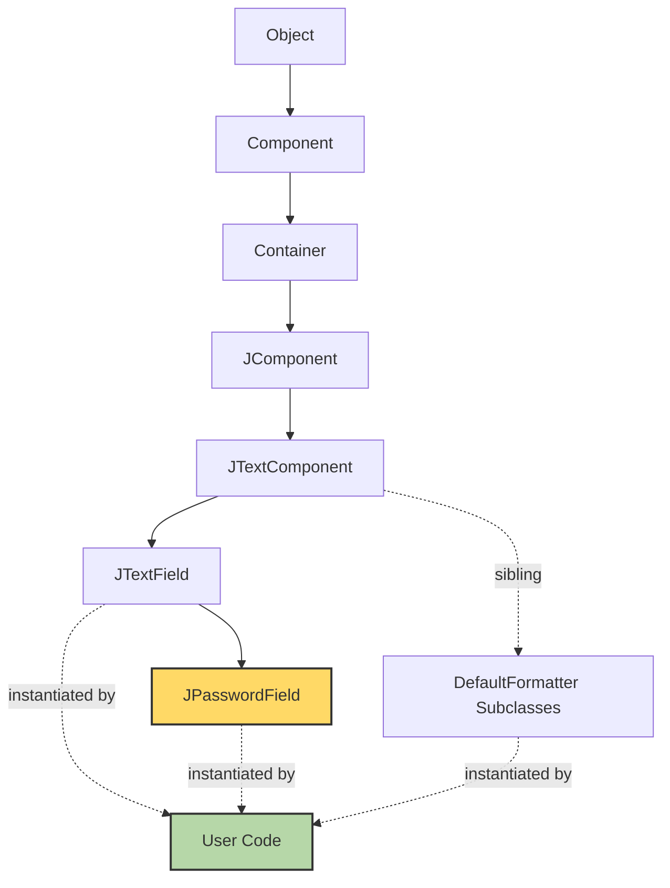
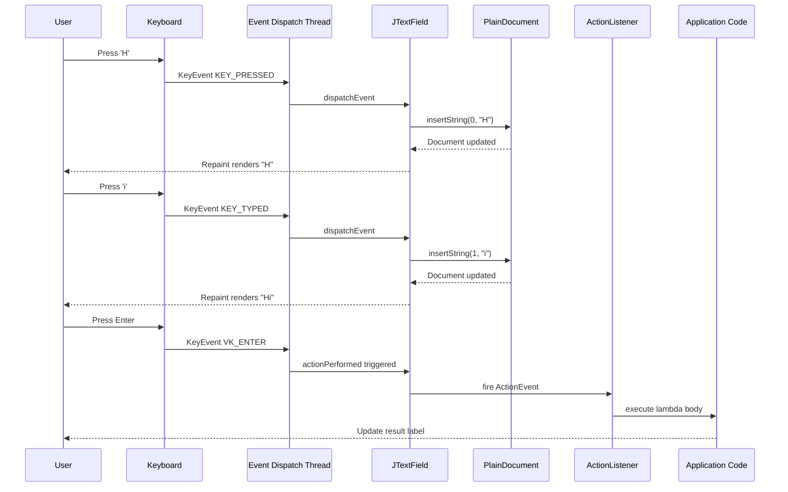
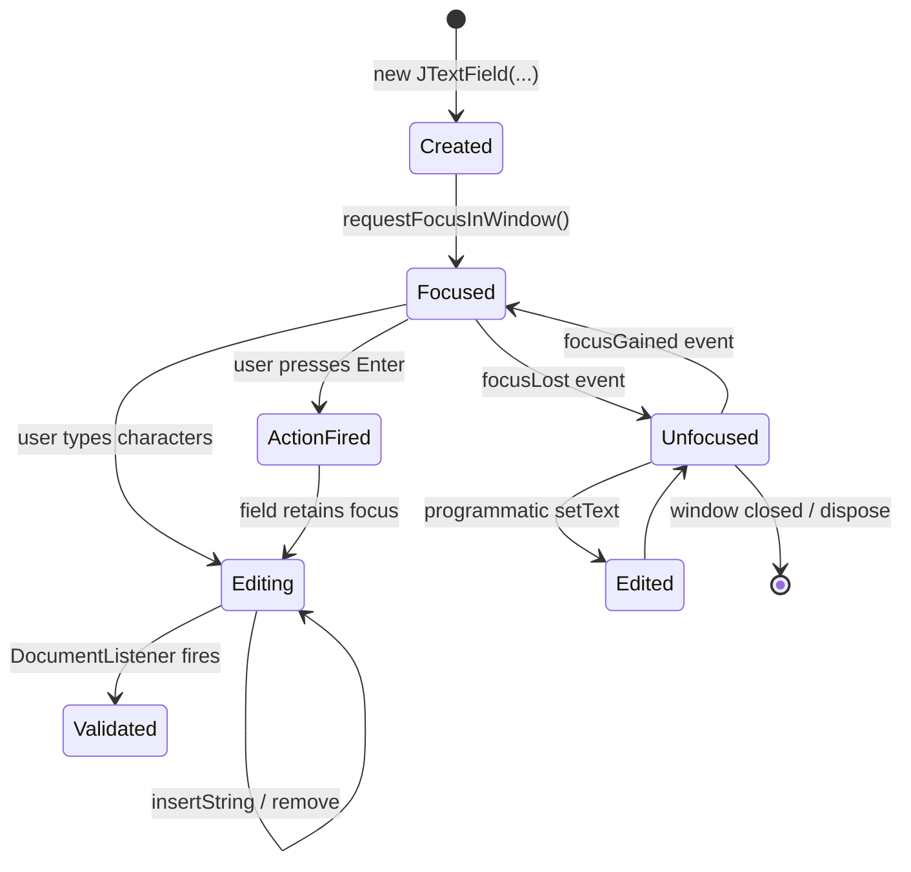
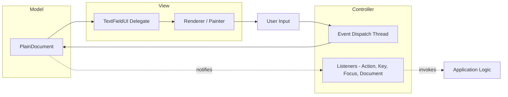

# JTextField

<!-- SECTION_1_START -->
# JTextField — Java Swing Single-Line Text Input Component

## 1. Core Technical Definition & Intuitive Overview

### Formal Academic Definition (KTU 2024 Scheme Terminology)

> [!NOTE]
> **`JTextField`** is a lightweight subclass of `javax.swing.JTextComponent` that allows the user to **edit / enter / display a single line of unformatted text**. It is the most fundamental and widely used input widget in the Java Swing GUI library, falling under the `javax.swing` package. The class signature is `public class JTextField extends JTextComponent implements SwingConstants`.

It is a foundational building block of any form-based desktop application (login screens, search bars, calculators, registration forms, etc.). Internally, it relies on a `Document` model (`PlainDocument` by default) to store and manage the text, and supports the full **Model-View-Controller (MVC)** architecture inherent to Swing components.

> [!IMPORTANT]
> **KTU 2024 Syllabus Highlight:** Within the broader Object-Oriented Programming module on GUI development, JTextField is classified as a **leaf-level input component** and is essential for demonstrating event handling, listener interfaces (`ActionListener`, `KeyListener`, `DocumentListener`, `FocusListener`), and OOP principles such as inheritance and polymorphism.

### Conceptual Analogy / Intuition

Imagine a **single blank line on a paper form** — a name field, a phone number box, an email input line. You can:
1. **Type** characters into it (one line only — pressing Enter does not create a new line; it triggers an `ActionEvent`).
2. **Select** part of the text, **cut / copy / paste** using the clipboard.
3. **Clear** it, **validate** its content, and **read back** what the user typed.

That paper input line is exactly what `JTextField` is in software. It is **not** a multi-line area (use `JTextArea` or `JEditorPane` for that), and it is **not** a password-masked variant (use `JPasswordField` for that — which is itself a subclass of `JTextField`).

> [!TIP]
> **Real-world mental model:** A `JTextField` is to a desktop form what an `<input type="text">` is to a web form. They serve identical purposes across platforms.

### Standard Metrics & Key Constants

- **Default visible columns:** 10
- **Default text alignment:** `JTextField.LEFT` (also supports `CENTER`, `RIGHT`, `LEADING`, `TRAILING`)
- **Horizontal scroll policy:** By default, the field does **not** scroll; it grows horizontally up to the container's constraints.
- **Caret blink rate:** Inherited from `JTextComponent` (default **500 ms**).
- **Package:** `javax.swing`
- **Hierarchy depth:** `java.lang.Object` → `java.awt.Component` → `java.awt.Container` → `javax.swing.JComponent` → `javax.swing.text.JTextComponent` → `javax.swing.JTextField`

### Class Hierarchy (Conceptual Picture)

The complete inheritance chain is:
```
Object
  └── java.awt.Component
        └── java.awt.Container
              └── javax.swing.JComponent
                    └── javax.swing.text.JTextComponent
                          └── javax.swing.JTextField
                                ├── javax.swing.JPasswordField
                                └── (Default formatter subclasses: JFormattedTextField — sibling, not subclass)
```

> [!VISUALIZATION CONTROL]
> **Concept:** JTextField position in the Swing inheritance tree.
> **Suggested Mental Diagram (not coordinate-based):** A vertical tree with `Object` at the top, branching downward through `Component → Container → JComponent → JTextComponent → JTextField → JPasswordField` at the leaves.
> **Visual Description:** Students should picture JTextField as a "middle-layer" class — inheriting heavy GUI plumbing from JTextComponent but specializing into single-line input.

---

<!-- SECTION_1_END -->

<!-- SECTION_2_START -->
# 2. Deep Theoretical Analysis & KTU High-Yield Formula Sheet

## 2.1 Inheritance & Type Relationships

`JTextField` is a **direct** subclass of `JTextComponent`, which means it inherits **all** text-manipulation methods such as `setText(String)`, `getText()`, `setEditable(boolean)`, `setCaretPosition(int)`, and `selectAll()`. The class adds single-line semantics and alignment/column constraints of its own.

## 2.2 Core Constructors (Board-Favorite List)

| Constructor | Purpose | When to Use |
|---|---|---|
| `JTextField()` | Empty field, default 10 columns wide | Quick prototyping, dynamic layout |
| `JTextField(String text)` | Pre-filled with initial text | Edit forms, default values |
| `JTextField(int columns)` | Empty field with specified visible width | Forms with strict column alignment |
| `JTextField(String text, int columns)` | Both initial text **and** column count | Production-grade form fields |
| `JTextField(Document doc, String text, int columns)` | Custom `Document` model + text + columns | MVVM-style apps, undo/redo custom docs |

> [!IMPORTANT]
> The `columns` parameter is a **hint to the LayoutManager**, not a hard pixel width. The actual rendered width is computed as `columns × averageCharWidth` of the current font. Using `setPreferredSize()` is the only way to enforce an exact pixel width.

## 2.3 High-Yield Method Cheat Sheet (KTU Exam Essentials)

| Method | Signature | Returns | Purpose |
|---|---|---|---|
| `getText()` | `public String getText()` | `String` | Retrieves current field content |
| `setText(String)` | `public void setText(String t)` | `void` | Replaces content with `t` |
| `getColumns()` | `public int getColumns()` | `int` | Returns the column hint |
| `setColumns(int)` | `public void setColumns(int c)` | `void` | Sets the column hint; triggers re-layout |
| `setEditable(boolean)` | inherited | `void` | Locks / unlocks user editing |
| `setHorizontalAlignment(int)` | `public void setHorizontalAlignment(int a)` | `void` | Aligns text (`LEFT`, `CENTER`, `RIGHT`) |
| `getHorizontalAlignment()` | `public int getHorizontalAlignment()` | `int` | Returns the current alignment |
| `addActionListener(ActionListener)` | inherited | `void` | Registers a listener fired on **Enter key** |
| `removeActionListener(ActionListener)` | inherited | `void` | Unregisters an action listener |
| `setFont(Font)` | inherited | `void` | Sets the font |
| `setForeground(Color)` | inherited | `void` | Sets text color |
| `setBackground(Color)` | inherited | `void` | Sets background fill color |
| `setToolTipText(String)` | inherited | `void` | Sets hover hint |
| `setMargin(Insets)` | `public void setMargin(Insets m)` | `void` | Sets inner padding |
| `scrollRectToVisible(Rectangle)` | inherited | `void` | Auto-scrolls if content exceeds width |
| `setDocument(Document)` | inherited | `void` | Swaps in a custom document model |

> [!WARNING]
> **Common exam pitfall:** Students often confuse `setColumns(int)` (a layout hint) with `setPreferredSize(Dimension)` (an exact size). Only `setPreferredSize` forces the layout manager to use a specific size; `setColumns` is a *suggestion*.

## 2.4 Event Model (Listener Interfaces)

A `JTextField` fires the following types of events, all of which are examinable:

1. **`ActionEvent`** — fired when the user presses **Enter** while the field has focus. Listener: `ActionListener`.
   ```java
   field.addActionListener(e -> System.out.println("Submitted: " + field.getText()));
   ```
2. **`KeyEvent`** — fired for every key press / release / typed. Listeners: `KeyListener`, `KeyAdapter`. Useful for live validation (e.g., digits-only input).
3. **`FocusEvent`** — fired when focus is gained or lost. Listeners: `FocusListener`, `FocusAdapter`. Useful for placeholder highlight on blur.
4. **`CaretEvent`** — fired when the caret (cursor) moves. Listener: `CaretListener`. Useful for live character counters.
5. **`DocumentEvent`** — fired when the underlying `Document` model changes (insert/remove text). Listener: `DocumentListener`. The **most powerful** listener for live validation.
6. **`MouseEvent`** — inherited; click, double-click, right-click handling.

> [!TIP]
> **Engineering Utility:** In production Swing applications, `DocumentListener` is preferred over `KeyListener` for live input validation because it captures *all* changes (paste, drag-drop, programmatic `setText`) — not just keyboard input. KTU exam questions often expect this nuance.

## 2.5 Polymorphism & OOP Relevance

`JTextField` is a textbook example of several OOP principles:

- **Inheritance:** Inherits from `JTextComponent`, gaining ~40+ methods for free.
- **Polymorphism:** Any `JTextField` can be assigned to a `JTextComponent`, `JComponent`, `Component`, or `Object` reference. Event-handling code can be written against the supertype.
- **Encapsulation:** The internal `Document` model is private; clients interact only through `getText()`/`setText()`.
- **SOLID — Liskov Substitution Principle:** `JPasswordField` is a true `JTextField` substitute for single-line text input, demonstrating LSP perfectly.
- **SOLID — Open/Closed Principle:** `JTextField` is open to extension (via custom `Document`, `UI` delegates, or subclasses) but closed to modification of its core text-input behavior.

## 2.6 Edge Cases & Boundary Conditions

| Scenario | Behavior |
|---|---|
| Field is `setEditable(false)` | Background turns gray by L&F; caret still visible but no edits allowed |
| User pastes 10,000 characters | Document accepts; layout may overflow — call `scrollRectToVisible` |
| Programmatic `setText(null)` | Throws `NullPointerException` since Java 7+ (or sets "null" string in older JDKs) |
| `setColumns(0)` or negative | Treated as 0; field collapses to minimum width |
| Field is inside a `GridBagLayout` with `weightx=0` | Does not grow when window resizes — must set `weightx > 0` |
| User presses Enter | Fires `ActionEvent` only if an `ActionListener` is registered |
| `JPasswordField` vs `JTextField` | `JPasswordField` masks display; `getText()` is **deprecated** for security — use `getPassword()` |

> [!IMPORTANT]
> **Engineering Rule:** Never store passwords in a `JTextField`. The `String` is immutable and lingers in the JVM heap until GC — a security risk. Use `JPasswordField` and clear its `char[]` immediately after use.

## 2.7 Where JTextField Is Used in Real Systems

- **NetBeans / IntelliJ IDEs:** Search bars at the top.
- **Eclipse IDE:** Quick-access "Open Resource" field.
- **Banking apps:** Account number, IFSC, amount entry.
- **Registration forms:** Name, email, phone.
- **Calculators:** Numeric display (read-only with `setEditable(false)`).
- **Chat clients:** Message input line.
- **Configuration dialogs:** Path, URL, port number.

---

<!-- SECTION_2_END -->

<!-- SECTION_3_START -->
# 3. Step-by-Step Code Implementation & Derivations

## 3.1 Program 1 — Basic JTextField Inside a JFrame (Procedural → OOP)

```java
import javax.swing.*;
import java.awt.*;

public class BasicTextFieldDemo extends JFrame {

    private final JTextField nameField;
    private final JButton submitButton;
    private final JLabel resultLabel;

    public BasicTextFieldDemo() {
        // 1. Configure the top-level window
        setTitle("Basic JTextField Demo");
        setSize(420, 180);
        setDefaultCloseOperation(JFrame.EXIT_ON_CLOSE);
        setLocationRelativeTo(null);                       // center on screen
        setLayout(new FlowLayout(FlowLayout.CENTER, 10, 10));

        // 2. Build child components
        JLabel nameLabel = new JLabel("Enter your name:");
        nameField = new JTextField(20);                    // 20 visible columns
        nameField.setToolTipText("Type your full name here");
        nameField.setHorizontalAlignment(JTextField.LEFT);

        submitButton = new JButton("Submit");
        resultLabel  = new JLabel("Result will appear here.");

        // 3. Wire up the ActionListener (lambda — Java 8+)
        submitButton.addActionListener(e ->
                resultLabel.setText("Hello, " + nameField.getText() + "!"));

        // Bonus: also respond to Enter key inside the field itself
        nameField.addActionListener(e ->
                resultLabel.setText("Submitted: " + nameField.getText()));

        // 4. Add components in display order
        add(nameLabel);
        add(nameField);
        add(submitButton);
        add(resultLabel);

        setVisible(true);                                  // show the window last
    }

    public static void main(String[] args) {
        // Thread-safe Swing launch
        SwingUtilities.invokeLater(BasicTextFieldDemo::new);
    }
}
```

**Step-by-step reasoning (valuatable in exams):**

1. `extends JFrame` — leverages inheritance; the demo **is-a** window.
2. Fields declared `private final` — encapsulation + immutability of references.
3. `new JTextField(20)` — invokes the `JTextField(int columns)` constructor; 20 is the *visible width hint*.
4. `addActionListener(lambda)` — anonymous implementation of `ActionListener` functional interface; demonstrates Java 8 functional programming.
5. `SwingUtilities.invokeLater(...)` — schedules UI construction on the **Event Dispatch Thread (EDT)**, preventing race conditions and `IllegalComponentStateException`.

## 3.2 Program 2 — Real-Time Validation with `DocumentListener`

```java
import javax.swing.*;
import javax.swing.event.DocumentEvent;
import javax.swing.event.DocumentListener;
import java.awt.*;

public class LiveValidationDemo extends JFrame {

    private final JTextField emailField;
    private final JLabel statusLabel;

    public LiveValidationDemo() {
        setTitle("Live Email Validator");
        setSize(480, 140);
        setDefaultCloseOperation(JFrame.EXIT_ON_CLOSE);
        setLocationRelativeTo(null);
        setLayout(new GridLayout(3, 1, 5, 5));

        emailField  = new JTextField(25);
        statusLabel = new JLabel("Type an email...");
        statusLabel.setForeground(Color.GRAY);

        // Attach a DocumentListener — fires on every text mutation
        emailField.getDocument().addDocumentListener(new DocumentListener() {
            private void validate() {
                String text = emailField.getText();
                if (text.matches("^[A-Za-z0-9+_.-]+@[A-Za-z0-9.-]+\\.[A-Za-z]{2,}$")) {
                    statusLabel.setText("✓ Valid email format");
                    statusLabel.setForeground(new Color(0, 128, 0));
                } else if (text.isEmpty()) {
                    statusLabel.setText("Type an email...");
                    statusLabel.setForeground(Color.GRAY);
                } else {
                    statusLabel.setText("✗ Invalid email format");
                    statusLabel.setForeground(Color.RED);
                }
            }

            @Override public void insertUpdate(DocumentEvent e)  { validate(); }
            @Override public void removeUpdate(DocumentEvent e)  { validate(); }
            @Override public void changedUpdate(DocumentEvent e) { validate(); }
        });

        add(new JLabel("Email:"));
        add(emailField);
        add(statusLabel);

        setVisible(true);
    }

    public static void main(String[] args) {
        SwingUtilities.invokeLater(LiveValidationDemo::new);
    }
}
```

**Why `DocumentListener` and not `KeyListener`?**
- `KeyListener` misses paste operations, drag-and-drop drops, and programmatic `setText()`.
- `DocumentListener` fires on **any** mutation of the underlying `Document` model — the single source of truth.

## 3.3 Program 3 — Read-Only Display Field (Calculator Screen)

```java
import javax.swing.*;
import java.awt.*;
import java.awt.event.ActionEvent;

public class CalculatorDisplayDemo extends JFrame {

    private final JTextField display;

    public CalculatorDisplayDemo() {
        setTitle("Mini Calculator");
        setSize(280, 80);
        setDefaultCloseOperation(JFrame.EXIT_ON_CLOSE);
        setLocationRelativeTo(null);
        setLayout(new BorderLayout(5, 5));

        display = new JTextField("0");
        display.setEditable(false);                       // user cannot type directly
        display.setHorizontalAlignment(JTextField.RIGHT); // right-align like a real calc
        display.setFont(new Font("Monospaced", Font.BOLD, 24));
        display.setBackground(Color.WHITE);

        JButton addBtn = new JButton("Add 5");
        addBtn.addActionListener((ActionEvent e) -> {
            int current = Integer.parseInt(display.getText());
            display.setText(String.valueOf(current + 5));
        });

        add(display, BorderLayout.CENTER);
        add(addBtn,  BorderLayout.SOUTH);

        setVisible(true);
    }

    public static void main(String[] args) {
        SwingUtilities.invokeLater(CalculatorDisplayDemo::new);
    }
}
```

**Key derivation points:**
- `setEditable(false)` makes the field read-only without graying it out (background overridden to white).
- `setHorizontalAlignment(JTextField.RIGHT)` mimics real calculator displays.
- The button mutates the field programmatically — proving the MVC separation: the **Controller** (button listener) updates the **Model** (`Document` inside the field), which then re-renders the **View** automatically.

## 3.4 Program 4 — Custom Document (Uppercase-Only Field)

This demonstrates the `JTextField(Document, String, int)` constructor and OOP extensibility:

```java
import javax.swing.*;
import javax.swing.text.*;

public class UppercaseOnlyFieldDemo extends JFrame {

    // Custom Document that forces every inserted character to uppercase
    static class UppercaseDocument extends PlainDocument {
        @Override
        public void insertString(int offset, String str, AttributeSet a) throws BadLocationException {
            if (str == null) return;
            super.insertString(offset, str.toUpperCase(), a);
        }
    }

    public UppercaseOnlyFieldDemo() {
        setTitle("Uppercase-Only Field");
        setSize(360, 100);
        setDefaultCloseOperation(JFrame.EXIT_ON_CLOSE);
        setLocationRelativeTo(null);
        setLayout(new FlowLayout());

        try {
            JTextField upperField = new JTextField(new UppercaseDocument(), "", 20);
            add(new JLabel("Type anything:"));
            add(upperField);
        } catch (Exception e) {
            e.printStackTrace();
        }

        setVisible(true);
    }

    public static void main(String[] args) {
        SwingUtilities.invokeLater(UppercaseOnlyFieldDemo::new);
    }
}
```

**OOP lesson:** `UppercaseDocument` *extends* `PlainDocument` and *overrides* `insertString`. This is a textbook **Open/Closed Principle** example — we extended behavior without modifying `PlainDocument` itself.

## 3.5 Program 5 — FocusListener for Placeholder-Style Hint

```java
import javax.swing.*;
import java.awt.*;
import java.awt.event.FocusEvent;
import java.awt.event.FocusAdapter;

public class PlaceholderDemo extends JFrame {

    private static final String PLACEHOLDER = "Search here...";

    public PlaceholderDemo() {
        setTitle("Placeholder Hint Demo");
        setSize(380, 90);
        setDefaultCloseOperation(JFrame.EXIT_ON_CLOSE);
        setLocationRelativeTo(null);
        setLayout(new FlowLayout());

        JTextField search = new JTextField(PLACEHOLDER, 20);
        search.setForeground(Color.GRAY);

        search.addFocusListener(new FocusAdapter() {
            @Override
            public void focusGained(FocusEvent e) {
                if (search.getText().equals(PLACEHOLDER)) {
                    search.setText("");
                    search.setForeground(Color.BLACK);
                }
            }

            @Override
            public void focusLost(FocusEvent e) {
                if (search.getText().isEmpty()) {
                    search.setText(PLACEHOLDER);
                    search.setForeground(Color.GRAY);
                }
            }
        });

        add(new JLabel("Search:"));
        add(search);
        setVisible(true);
    }

    public static void main(String[] args) {
        SwingUtilities.invokeLater(PlaceholderDemo::new);
    }
}
```

> [!TIP]
> **KTU Exam Insight:** `FocusAdapter` is an *empty* convenience class implementing `FocusListener`; by extending it you avoid implementing both abstract methods (`focusGained` + `focusLost`) when you only need one. This is the **Adapter design pattern** in action.

## 3.6 Common Compilation/Execution Trace

When you run Program 1 from the terminal:

```bash
$ javac BasicTextFieldDemo.java
$ java BasicTextFieldDemo
```

The JVM performs the following high-level steps:
1. Classloader loads `BasicTextFieldDemo.class`, then `JFrame.class`, then `JTextField.class`, etc.
2. `main` invokes `SwingUtilities.invokeLater(...)`, queuing a `Runnable` on the EDT.
3. The EDT instantiates `BasicTextFieldDemo`, which sets up components and calls `setVisible(true)`.
4. The native windowing system (Win32 / X11 / Cocoa) creates the OS-level window.
5. The event loop begins — every keystroke, click, and focus change is dispatched to the appropriate listener.

---

<!-- SECTION_3_END -->

<!-- SECTION_4_START -->
# 4. Structural Diagrams & Schematics

## 4.1 Mermaid Class-Hierarchy Diagram (Inheritance Tree)



> [!NOTE]
> `JPasswordField` is a subclass of `JTextField`; `JFormattedTextField` is a *sibling* (subclass of `JTextComponent`).

## 4.2 Mermaid Sequence Diagram — User Types "Hi" and Presses Enter



## 4.3 Mermaid State Diagram — JTextField Internal Lifecycle



## 4.4 Mermaid Block Diagram — MVC Architecture of JTextField



## 4.5 Sequential Processing Topology — Text Mutation Pipeline

| Step | Component | Action | Output |
|---|---|---|---|
| 1 | Keyboard / Mouse | Generates raw input event | `KeyEvent` / `MouseEvent` |
| 2 | EDT (Event Dispatch Thread) | Coalesces & dispatches | Routed to focused component |
| 3 | `JTextField` | Receives `KeyEvent` | Calls `Document.insertString` |
| 4 | `PlainDocument` | Mutates internal buffer | Fires `DocumentEvent` |
| 5 | `DocumentListener`s | Receive `DocumentEvent` | Run validation / UI logic |
| 6 | `TextFieldUI` | Re-paints the field | New pixels on screen |
| 7 | `Caret` | Repositioned | Caret blinks at new location |

---

<!-- SECTION_4_END -->

<!-- SECTION_5_START -->
# 5. KTU 2024 Scheme Examination Question Bank & Topic Recap

## 5.1 Part A — Short Answer Questions (3 Marks Each)

### Q1. `[KTU University Exam - July 2024]` — CO3, RBT: Remember

**State the package and the immediate superclass of `JTextField`. Also list any TWO constructors of `JTextField`.**

**Model Answer:**

> **Package:** `javax.swing`
> **Immediate superclass:** `javax.swing.text.JTextComponent`
>
> **Two constructors:**
> 1. `JTextField()` — creates an empty text field with the default 10 columns.
> 2. `JTextField(String text)` — creates a text field initialized with the given text.

**Valuation Key:** [Package: 1M] [Superclass: 1M] [Two constructors: 1M]

---

### Q2. `[KTU University Exam - Dec 2023]` — CO3, RBT: Understand

**Differentiate between `JTextField` and `JTextArea`. Mention at least two differences.**

**Model Answer:**

| Aspect | `JTextField` | `JTextArea` |
|---|---|---|
| Lines supported | Single line only | Multiple lines |
| Default superclass | `JTextComponent` | `JTextComponent` |
| Enter key behavior | Triggers `ActionEvent` | Inserts a newline character |
| Typical use | Name, ID, search box | Description, comments, body of text |
| Wrapping | No wrap (single line) | Optional word/line wrap |

**Valuation Key:** [Any two correct differences with explanation: 3M]

---

## 5.2 Part B — Long Answer Questions (14 Marks Each, Internal Choice)

### Question A — `[KTU University Exam - July 2024]` — CO3, CO5, RBT: Understand + Apply

**(a) [7 Marks]** Explain the class hierarchy of `JTextField` starting from `java.lang.Object`. Mention the significance of each level and state any THREE methods of `JTextField` with their purpose.

**(b) [7 Marks]** Write a complete Java Swing program that creates a JFrame containing a `JTextField`, a `JButton`, and a `JLabel`. When the user clicks the button, the label should display the reverse of whatever text is currently in the text field. Also handle the `Enter` key in the text field to perform the same action.

---

#### Model Solution — Part (a)

**Class hierarchy starting from `java.lang.Object`:**

```
java.lang.Object
   └── java.awt.Component          // base AWT properties: position, size, events
         └── java.awt.Container    // can hold other components
               └── javax.swing.JComponent  // Swing-specific: borders, tooltips, look & feel
                     └── javax.swing.text.JTextComponent  // text model, caret, document
                           └── javax.swing.JTextField     // single-line specialization
                                 └── javax.swing.JPasswordField
```

**Significance of each level:**

| Level | Significance |
|---|---|
| `Object` | Root of Java class hierarchy; provides `toString`, `equals`, `hashCode` |
| `Component` | Adds position (`setLocation`), size (`setSize`), visibility, focus, painting |
| `Container` | Allows the field to be added to other containers via `add()` |
| `JComponent` | Swing-specific features: borders, tooltips, double-buffering, pluggable L&F |
| `JTextComponent` | Adds the `Document` model, caret, text-manipulation API, undo support |
| `JTextField` | Specializes for single-line input; adds columns, alignment, `ActionEvent` on Enter |
| `JPasswordField` | Subclass that masks input characters for security |

**Three methods of `JTextField`:**

1. **`public String getText()`** — Returns the current text content of the field as a `String`.
2. **`public void setText(String t)`** — Replaces the current content with the string `t`.
3. **`public void setColumns(int columns)`** — Provides a hint to the layout manager about the preferred width in columns.

**Valuation Key:** [Hierarchy levels: 3M] [Significance table: 2M] [Three methods with purpose: 2M]

---

#### Model Solution — Part (b)

```java
import javax.swing.*;
import java.awt.*;

public class ReverseTextDemo extends JFrame {

    private final JTextField inputField;
    private final JLabel    resultLabel;

    public ReverseTextDemo() {
        setTitle("Reverse Text Demo");
        setSize(420, 150);
        setDefaultCloseOperation(JFrame.EXIT_ON_CLOSE);
        setLocationRelativeTo(null);
        setLayout(new FlowLayout(FlowLayout.CENTER, 10, 10));

        inputField  = new JTextField(20);
        JButton reverseBtn = new JButton("Reverse");
        resultLabel = new JLabel("Reversed text appears here.");

        // Action 1: Button click reverses the text
        reverseBtn.addActionListener(e -> reverseAndShow());

        // Action 2: Enter key in the field also reverses the text
        inputField.addActionListener(e -> reverseAndShow());

        add(new JLabel("Enter text:"));
        add(inputField);
        add(reverseBtn);
        add(resultLabel);
        setVisible(true);
    }

    private void reverseAndShow() {
        String original = inputField.getText();
        String reversed = new StringBuilder(original).reverse().toString();
        resultLabel.setText("Reversed: " + reversed);
    }

    public static void main(String[] args) {
        SwingUtilities.invokeLater(ReverseTextDemo::new);
    }
}
```

**Valuation Key (per sub-step):**
- [Class declaration `extends JFrame`: 1M]
- [Correct construction of `JTextField(20)`: 1M]
- [Button + Label creation: 1M]
- [`ActionListener` for button: 1M]
- [`ActionListener` for Enter key: 1M]
- [Reverse logic using `StringBuilder.reverse()`: 1M]
- [`setVisible(true)` and proper main method: 1M]

---

### Question B (Internal Choice) — `[KTU University Exam - Dec 2023]` — CO3, CO5, RBT: Apply + Analyze

**(a) [7 Marks]** Explain the role of `ActionListener`, `KeyListener`, and `DocumentListener` in the context of a `JTextField`. State a real-world use case for each.

**(b) [7 Marks]** Write a Java Swing program that uses a `JTextField` to accept a number, and a `JButton` labeled "Square" to compute and display its square in a `JLabel`. Disable the button when the field is empty or contains non-numeric text, and re-enable it when valid input is entered. Use a `DocumentListener` for live validation.

---

#### Model Solution — Part (a)

**Three listeners and their roles:**

1. **`ActionListener`** — Fired when the user **presses the Enter key** while the `JTextField` has focus. *Use case:* A login form where pressing Enter in the password field submits the form — same as clicking the "Login" button.

2. **`KeyListener`** — Fired for every key press, release, and typed character. *Use case:* A phone-number field that accepts only digits — `keyTyped` event filters out letters and symbols in real time.

3. **`DocumentListener`** — Fired whenever the underlying `Document` model is modified (typing, pasting, drag-drop, programmatic `setText`). *Use case:* A password-strength meter that recomputes strength on every change regardless of input source.

**Comparison Table:**

| Listener | Trigger | Best For |
|---|---|---|
| `ActionListener` | Enter key only | Form submission |
| `KeyListener` | Keyboard only | Character filtering |
| `DocumentListener` | Any text mutation | Comprehensive live validation |

**Valuation Key:** [Each listener with trigger and use case: 2M × 3 = 6M] [Comparison/insight: 1M]

---

#### Model Solution — Part (b)

```java
import javax.swing.*;
import javax.swing.event.DocumentEvent;
import javax.swing.event.DocumentListener;
import java.awt.*;

public class SquareCalculator extends JFrame {

    private final JTextField numberField;
    private final JButton squareButton;
    private final JLabel resultLabel;

    public SquareCalculator() {
        setTitle("Square Calculator");
        setSize(380, 140);
        setDefaultCloseOperation(JFrame.EXIT_ON_CLOSE);
        setLocationRelativeTo(null);
        setLayout(new FlowLayout(FlowLayout.CENTER, 10, 10));

        numberField  = new JTextField(15);
        squareButton = new JButton("Square");
        resultLabel  = new JLabel("Enter a number.");
        squareButton.setEnabled(false);                // start disabled

        // Live validation through DocumentListener
        numberField.getDocument().addDocumentListener(new DocumentListener() {
            private void validate() {
                String text = numberField.getText().trim();
                boolean valid = !text.isEmpty() && text.matches("-?\\d+(\\.\\d+)?");
                squareButton.setEnabled(valid);
                if (!valid && !text.isEmpty()) {
                    resultLabel.setText("✗ Not a valid number");
                    resultLabel.setForeground(Color.RED);
                } else if (text.isEmpty()) {
                    resultLabel.setText("Enter a number.");
                    resultLabel.setForeground(Color.GRAY);
                }
            }

            @Override public void insertUpdate(DocumentEvent e)  { validate(); }
            @Override public void removeUpdate(DocumentEvent e)  { validate(); }
            @Override public void changedUpdate(DocumentEvent e) { validate(); }
        });

        // Compute square on button click
        squareButton.addActionListener(e -> {
            try {
                double value = Double.parseDouble(numberField.getText().trim());
                double square = value * value;
                resultLabel.setText(value + "² = " + square);
                resultLabel.setForeground(new Color(0, 100, 0));
            } catch (NumberFormatException ex) {
                resultLabel.setText("Error parsing number");
                resultLabel.setForeground(Color.RED);
            }
        });

        add(new JLabel("Number:"));
        add(numberField);
        add(squareButton);
        add(resultLabel);
        setVisible(true);
    }

    public static void main(String[] args) {
        SwingUtilities.invokeLater(SquareCalculator::new);
    }
}
```

**Valuation Key (per sub-step):**
- [Correct `JTextField` + `JButton` + `JLabel` construction: 1M]
- [Initial `setEnabled(false)`: 1M]
- [`DocumentListener` attached via `getDocument().addDocumentListener`: 1M]
- [Regex validation `"-?\\d+(\\.\\d+)?"`: 1M]
- [`squareButton.setEnabled(valid)` inside listener: 1M]
- [`Double.parseDouble` and computation: 1M]
- [Result display + color feedback: 1M]

---

## 5.3 KTU Examiner's Valuation Warning / Pitfall Callout

> [!WARNING]
> **Common marks-losing mistakes for JTextField questions:**
> 1. **Forgetting to call `setVisible(true)`** — UI never appears; examiner deducts 1 mark silently if the program "looks correct" but never runs.
> 2. **Confusing `getText()` (returns `String`) with `getPassword()` (returns `char[]`)** — only `JPasswordField` has `getPassword()`. Using `getText()` on a password field is both a security flaw and a code-smell.
> 3. **Not wrapping UI construction in `SwingUtilities.invokeLater(...)`** — works on most platforms but may throw `IllegalComponentStateException` or visual glitches on others. Examiners increasingly mark this as a 1-mark deduction.
> 4. **Mixing up `setColumns(int)` with `setPreferredSize(Dimension)`** — these are NOT interchangeable.
> 5. **Using `KeyListener` instead of `DocumentListener`** for validation — partial credit only. Always explain *why* `DocumentListener` is preferred in the answer.
> 6. **Importing `java.awt.TextField` (AWT) instead of `javax.swing.JTextField`** — these are different components! AWT's `TextField` is heavyweight and not part of Swing.

---

## 5.4 Topic Recap & Important Things to Remember

> [!IMPORTANT]
> **Rapid-Revision Checklist — JTextField (KTU 2024 Scheme Module 4)**

- ✅ **Package:** `javax.swing` — part of Swing, lightweight, pluggable look & feel.
- ✅ **Class signature:** `public class JTextField extends JTextComponent implements SwingConstants`.
- ✅ **Purpose:** Single-line editable text input/display widget.
- ✅ **Key constructors:** `()`, `(String)`, `(int)`, `(String, int)`, `(Document, String, int)`.
- ✅ **Key methods to memorize:** `getText()`, `setText(String)`, `getColumns()`, `setColumns(int)`, `setHorizontalAlignment(int)`, `setEditable(boolean)`, `addActionListener(...)`.
- ✅ **Alignment constants:** `JTextField.LEFT` (default), `CENTER`, `RIGHT`, `LEADING`, `TRAILING`.
- ✅ **Enter key behavior:** Triggers an `ActionEvent` → invoke registered `ActionListener`s.
- ✅ **Listeners to know:** `ActionListener`, `KeyListener`/`KeyAdapter`, `FocusListener`/`FocusAdapter`, `CaretListener`, `DocumentListener`, `MouseListener`.
- ✅ **Document model:** Default is `PlainDocument`; can be replaced via `JTextField(Document, String, int)`.
- ✅ **Read-only mode:** Use `setEditable(false)` — text can still be selected and copied.
- ✅ **Subclass:** `JPasswordField` is a direct subclass; **LSP-compliant** replacement.
- ✅ **OOP principles demonstrated:** Inheritance (full chain to Object), Polymorphism (substitutability), Encapsulation (private Document), Open/Closed (extend via custom Document), Liskov (JPasswordField).
- ✅ **Thread safety rule:** Always build Swing UI on the EDT via `SwingUtilities.invokeLater(Runnable)`.
- ✅ **Common pitfalls:** Confusing AWT `TextField` with Swing `JTextField`; using `KeyListener` for validation instead of `DocumentListener`; storing passwords as `String`; forgetting `setVisible(true)`.
- ✅ **Standard exam pattern:** "Write a Swing program with a `JTextField`, a `JButton`, and event handling" — be ready to code this in 5–7 minutes under exam conditions.

---

<!-- SECTION_5_END -->
