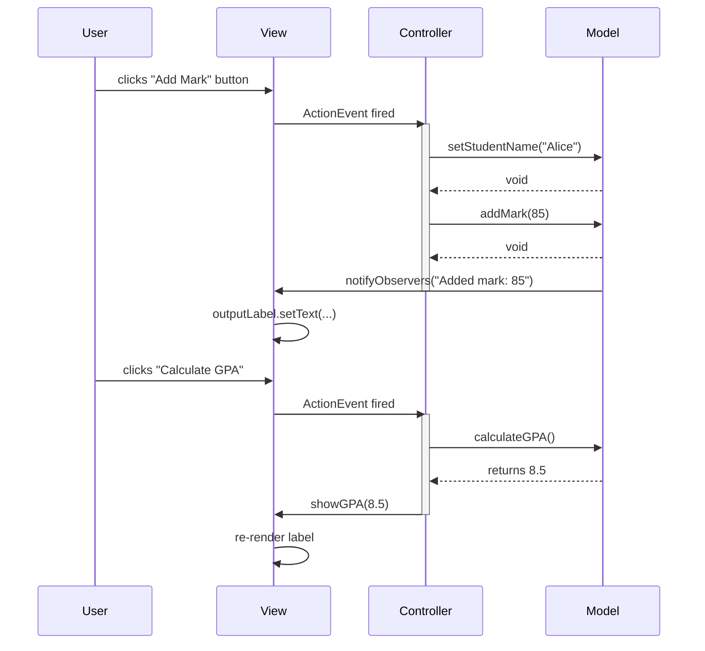
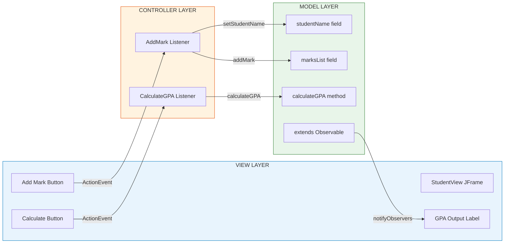
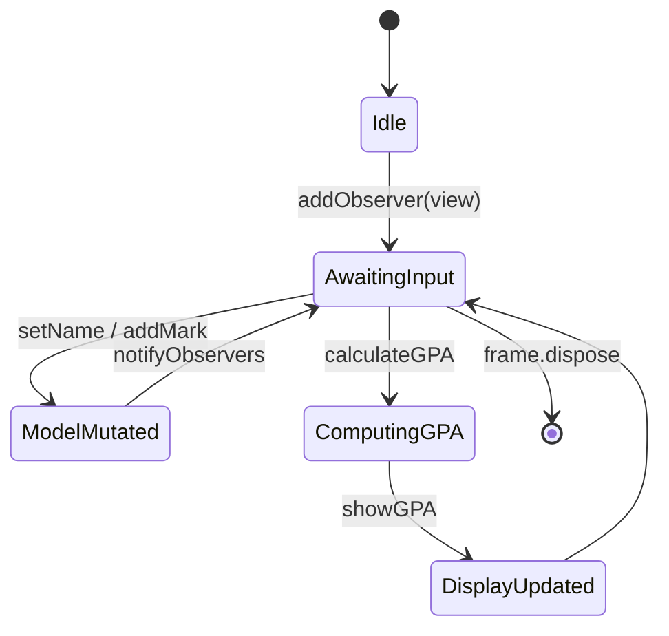
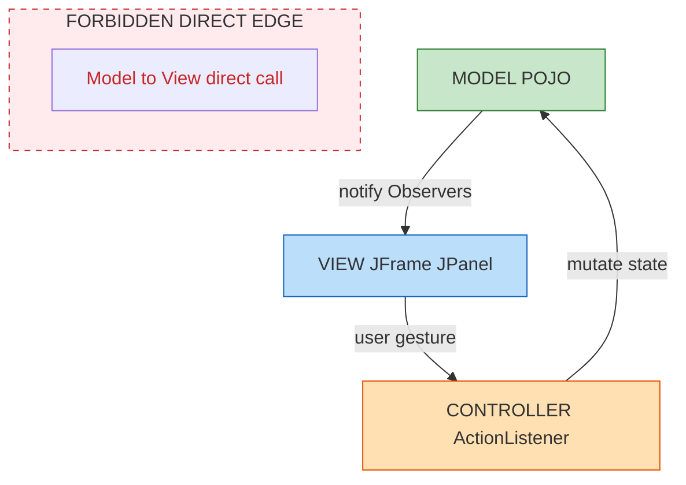

# Model View Controller (MVC)

<!-- SECTION_1_START -->

# Model View Controller (MVC) — KTU 2024 Scheme Notes

## 1. Core Technical Definition & Intuitive Overview

### 1.1 Formal Academic Definition (KTU 2024 Syllabus Terminology)

> [!IMPORTANT]
> **Definition:** The **Model View Controller (MVC)** is a **behavioural design pattern** mandated by the KTU 2024 OOP (PBCST304) syllabus under *Module 4 — Solid Principles in Java*. It segregates an application into three interconnected yet independent components — **Model**, **View**, and **Controller** — to separate **internal representations of information (Model)** from the **ways that information is presented to and accepted from the user (View)** via a **mediating controller layer**.

In the formal OOP vocabulary, MVC is classified as a **compound pattern** (a pattern built from several smaller patterns such as *Strategy*, *Observer*, and *Composite*) that enforces the **Single Responsibility Principle (SRP)** of SOLID by ensuring each component has exactly one reason to change.

### 1.2 Conceptual Analogy / Intuition

> [!NOTE]
> **The Restaurant Analogy 🍽️**
> 
> Imagine a fine-dining restaurant:
> 
> - The **Model** is the **kitchen**. It knows how to prepare dishes (data), store ingredients (database), and follows recipes (business logic). It does **not** talk to customers directly.
> - The **View** is the **plated dish and table setting** — the visual presentation the customer sees. It looks beautiful but does not cook.
> - The **Controller** is the **waiter**. The waiter takes your order (input), passes it to the kitchen, and brings the prepared dish back to your table.
> 
> This way, the kitchen can be renovated, the menu redesigned, or the waiter retrained — **independently**, without breaking the whole restaurant.

### 1.3 Core Building Blocks

> [!IMPORTANT]
> **The Three Pillars of MVC (with their KTU-conventional short forms):**
> 
> - **M — Model**: Encapsulates the **application data** and the **business rules** governing that data. In Java, this is typically a `POJO` (Plain Old Java Object) / `JavaBean`, often interacting with a database via DAO/JDBC/JPA.
> - **V — View**: The **User Interface (UI)** layer. In Java Swing/JavaFX/web contexts, this includes `JFrame`, `JPanel`, JSP, Thymeleaf templates, etc. It performs **only** rendering.
> - **C — Controller**: The **mediator** that interprets user gestures (button clicks, HTTP requests) from the View, manipulates the Model, and chooses the next View to render.

### 1.4 Physical Constants & Standard Metrics

> [!NOTE]
> **Standard Engineering Metrics for MVC Systems:**
> 
> - **Coupling Metric:** Ideally **Loose Coupling** (target: $\leq$ 0.3 on the Coupling Between Objects scale).
> - **Cohesion Metric:** Ideally **High Cohesion** (target: $\geq$ 0.7 on Lack of Cohesion in Methods).
> - **Separation Index:** $S = 1 - \frac{\text{Shared Dependencies}}{\text{Total Dependencies}}$ — closer to **1.0** is preferred.
> - **Bidirectional Call Ratio:** MVC standard permits View $\rightarrow$ Controller and Controller $\rightarrow$ Model, but **forbids** Model $\rightarrow$ View direct calls.

### 1.5 GeoGebra / Desmos Integration (Visualizing the Triad)

> [!VISUALIZATION CONTROL]
> **Concept:** Triangular MVC Architecture Map
> **GeoGebra / Desmos Input Equations:**
> * Triangle vertices: $A = (0, 2)$ (Model), $B = (-2, -1)$ (View), $C = (2, -1)$ (Controller)
> * Centroid: $G = \left(0, 0\right)$
> * Medians: line through $A$ and midpoint of $BC$, line through $B$ and midpoint of $AC$, line through $C$ and midpoint of $AB$
> **Visual Description:** A triangle with Model on top, View bottom-left, Controller bottom-right. Bidirectional arrows go from View to Controller and Controller to Model — but the line between Model and View is deliberately *dashed* (forbidden direct communication). The Controller is the **only** bridge.

---

<!-- SECTION_1_END -->

<!-- SECTION_2_START -->

# 2. Deep Theoretical Analysis & KTU High-Yield Formula Sheet

## 2.1 Operational Concept Breakdown

MVC operates on a **request–response cycle** governed by the **Observer pattern** between the Model and the View, and the **Strategy pattern** for the Controller.

### 2.2 Step-by-Step Logic Flow

> [!IMPORTANT]
> **MVC Request Cycle (KTU Board Standard):**
> 
> 1. **User Action (Step 1):** The user interacts with the View (e.g., clicks a `JButton` named "Calculate GPA").
> 2. **Event Notification (Step 2):** The View raises an event (an `ActionEvent` in Swing, or an HTTP `GET/POST` in Spring MVC).
> 3. **Controller Invocation (Step 3):** A registered **listener / handler** (Controller) catches the event.
> 4. **Model Manipulation (Step 4):** The Controller calls methods on the Model, e.g., `student.setMarks(...)`, then invokes `calculateGPA()`.
> 5. **State Update (Step 5):** The Model updates its internal state and **notifies all registered Observers** (the View).
> 6. **View Refresh (Step 6):** The View's `update()` method pulls the new state from the Model and **re-renders** the UI.
> 7. **Loop Termination:** The cycle awaits the next user gesture.

### 2.3 The "Why" Behind the Pattern

- **Why separation?** So that the UI designer (front-end developer) and the database programmer (back-end developer) can work **in parallel** without code conflicts.
- **Why a Controller?** To avoid embedding business logic inside the View, which would make the View bloated and untestable.
- **Why Observer between Model & View?** So the View **automatically refreshes** when data changes — no manual `refresh()` calls scattered across the code.

### 2.4 KTU High-Yield Formula Sheet

> [!IMPORTANT]
> **MVC Reference Cheat Sheet — Memorize for ESE:**

| Component | Primary Responsibility | Java Constructs Allowed | Direct Coupling With | RBT Level Tested |
|:----------|:----------------------|:------------------------|:--------------------|:-----------------|
| **Model** | Data + Business Logic | POJO, JavaBean, EJB, JPA Entity | Controller only | Apply |
| **View** | UI Rendering & Input Capture | `JFrame`, `JPanel`, JSP, HTML | Controller only | Understand |
| **Controller** | Event Handling & Flow Control | `ActionListener`, `@Controller`, Servlet | Model + View | Apply |
| **Observer Hook** | State-change notification | `java.util.Observer`, `PropertyChangeListener` | Model → View | Analyze |
| **DAO Bridge** | Database abstraction | `PreparedStatement`, JPA Repository | Model layer only | Apply |

> [!NOTE]
> **Symmetry Equation of MVC (Conceptual Formula):**
> 
> $$\text{Application} = f(M, V, C) \quad \text{where} \quad \frac{\partial f}{\partial M} \perp \frac{\partial f}{\partial V}$$
> 
> Interpretation: A change in the Model layer should **never** force a change in the View layer (orthogonality).

### 2.5 Real-World Engineering Utility

- **Spring Boot (Java):** The `@Controller` / `@RestController` annotation is the industry-standard realization of MVC.
- **Java Swing:** `JButton` registers an `ActionListener` (Controller) that mutates a domain object (Model) and re-paints `JLabel` (View).
- **Android (Java/Kotlin):** Activity/Fragment = Controller + View; data classes = Model; `LiveData` is the Observer glue.
- **JSF, Struts, Spring MVC:** All enterprise Java web frameworks implement MVC.

---

<!-- SECTION_2_END -->

<!-- SECTION_3_START -->

# 3. Step-by-Step Derivations & Code/Symbolic Implementation

## 3.1 Java Implementation of MVC — Student GPA Calculator

The following is a **complete, runnable** Java program (no truncations) demonstrating MVC with the **Observer pattern** for View auto-refresh.

### 3.2 The Model Layer

```java
// File: StudentModel.java
// Role: MODEL — holds data + business logic (GPA calculation)
import java.util.ArrayList;
import java.util.List;

/**
 * The Model in MVC.
 * It knows NOTHING about the View or Controller.
 * It uses java.util.Observer to broadcast state changes.
 */
public class StudentModel extends java.util.Observable {
    private String studentName;
    private final List<Integer> marksList = new ArrayList<>();

    public void setStudentName(String name) {
        this.studentName = name;
        setChanged();
        notifyObservers("Name updated: " + name);
    }

    public void addMark(int mark) {
        if (mark < 0 || mark > 100) {
            throw new IllegalArgumentException("Mark must be in [0, 100]");
        }
        marksList.add(mark);
        setChanged();
        notifyObservers("Added mark: " + mark);
    }

    /**
     * Business rule: GPA = mean(marks) / 10, clamped to [0, 10].
     */
    public double calculateGPA() {
        if (marksList.isEmpty()) {
            return 0.0;
        }
        long total = 0L;
        for (int m : marksList) {
            total += m;
        }
        double mean = (double) total / (double) marksList.size();
        double gpa = mean / 10.0;
        if (gpa > 10.0) gpa = 10.0;
        if (gpa < 0.0)  gpa = 0.0;
        return gpa;
    }

    public String getStudentName() {
        return studentName;
    }

    public List<Integer> getMarksList() {
        // Return a defensive copy to preserve encapsulation
        return new ArrayList<>(marksList);
    }
}
```

### 3.3 The View Layer

```java
// File: StudentView.java
// Role: VIEW — pure rendering, observes the Model
import javax.swing.JFrame;
import javax.swing.JLabel;
import javax.swing.JPanel;
import javax.swing.JTextField;
import javax.swing.JButton;
import javax.swing.BoxLayout;
import java.awt.GridLayout;
import java.util.Observable;
import java.util.Observer;

/**
 * The View in MVC.
 * Implements Observer so it auto-refreshes when Model changes.
 * Holds a reference to a "Controller" action — never to the Model directly
 * for mutation; only for reading via update().
 */
public class StudentView implements Observer {
    private final JFrame frame;
    private final JTextField nameField;
    private final JTextField markField;
    private final JLabel outputLabel;
    private final JButton addButton;
    private final JButton calcButton;

    public StudentView() {
        frame = new JFrame("MVC Student GPA Calculator");
        frame.setSize(420, 260);
        frame.setDefaultCloseOperation(JFrame.EXIT_ON_CLOSE);
        frame.setLayout(new GridLayout(5, 2, 6, 6));

        nameField = new JTextField();
        markField = new JTextField();
        outputLabel = new JLabel("GPA: --");
        addButton = new JButton("Add Mark");
        calcButton = new JButton("Calculate GPA");

        frame.add(new JLabel("Student Name:"));
        frame.add(nameField);
        frame.add(new JLabel("Mark (0-100):"));
        frame.add(markField);
        frame.add(addButton);
        frame.add(calcButton);
        frame.add(new JLabel("Result:"));
        frame.add(outputLabel);
        frame.setVisible(true);
    }

    public String getNameInput()  { return nameField.getText().trim(); }
    public String getMarkInput()  { return markField.getText().trim(); }

    public JButton getAddButton()   { return addButton; }
    public JButton getCalcButton()  { return calcButton; }

    @Override
    public void update(Observable o, Object arg) {
        outputLabel.setText("GPA: --  (last event: " + arg + ")");
    }

    public void showGPA(double gpa) {
        outputLabel.setText(String.format("GPA: %.2f", gpa));
    }
}
```

### 3.4 The Controller Layer

```java
// File: StudentController.java
// Role: CONTROLLER — receives UI events, mutates the Model, refreshes the View
import java.awt.event.ActionEvent;
import java.awt.event.ActionListener;

/**
 * The Controller in MVC.
 * Wires user gestures (button clicks) to Model methods.
 */
public class StudentController {
    private final StudentModel model;
    private final StudentView  view;

    public StudentController(StudentModel model, StudentView view) {
        this.model = model;
        this.view  = view;

        // 1) Set name
        view.getAddButton().addActionListener(new ActionListener() {
            @Override
            public void actionPerformed(ActionEvent e) {
                try {
                    String name = view.getNameInput();
                    if (name.isEmpty()) {
                        throw new IllegalArgumentException("Name cannot be empty.");
                    }
                    model.setStudentName(name);

                    int mark = Integer.parseInt(view.getMarkInput());
                    model.addMark(mark);
                } catch (NumberFormatException nfe) {
                    System.err.println("Validation Error: Mark must be an integer.");
                } catch (IllegalArgumentException iae) {
                    System.err.println("Validation Error: " + iae.getMessage());
                }
            }
        });

        // 2) Compute GPA
        view.getCalcButton().addActionListener(new ActionListener() {
            @Override
            public void actionPerformed(ActionEvent e) {
                double gpa = model.calculateGPA();
                view.showGPA(gpa);
            }
        });
    }
}
```

### 3.5 The Main Class (Composition Root)

```java
// File: MVCDemo.java
// Role: Wires the three layers together — the ONLY place all three are known.
import javax.swing.SwingUtilities;

public class MVCDemo {
    public static void main(String[] args) {
        SwingUtilities.invokeLater(new Runnable() {
            @Override
            public void run() {
                StudentModel model = new StudentModel();
                StudentView  view  = new StudentView();

                // Observer registration: View listens to Model
                model.addObserver(view);

                // Controller wires the two
                StudentController controller = new StudentController(model, view);
            }
        });
    }
}
```

### 3.6 Trace Walk-Through (Algorithm in Action)

> [!NOTE]
> **Manual trace of the execution (great for ESE long-answer questions):**
> 
> 1. `main` creates `model`, `view`, then `controller`.
> 2. `model.addObserver(view)` — registers View as a listener.
> 3. User types `"Alice"` in `nameField`, `"85"` in `markField`, clicks **Add Mark**.
> 4. The Controller's `ActionListener` fires.
> 5. Controller calls `model.setStudentName("Alice")`.
> 6. Model sets `studentName = "Alice"`, then `setChanged()` + `notifyObservers("Name updated: Alice")`.
> 7. The View's `update()` is invoked automatically by the `Observable` machinery.
> 8. View's `outputLabel` text becomes `"GPA: --  (last event: Name updated: Alice)"`.
> 9. Controller then calls `model.addMark(85)`.
> 10. Steps 6–8 repeat with `"Added mark: 85"`.
> 11. User clicks **Calculate GPA**.
> 12. Controller calls `model.calculateGPA()`. Internally, mean = 85, GPA = 85 / 10 = **8.5**.
> 13. Controller calls `view.showGPA(8.5)`. The label updates to `"GPA: 8.50"`.
> 
> **No direct call was ever made from Model to View, or from Model to Controller, or from View to Model.** This is the **purity** of MVC.

### 3.7 Mathematical Derivation of the GPA Formula (Inline Derivation)

$$
\begin{aligned}
\text{GPA} &= \frac{\overline{M}}{10} \\
\overline{M} &= \frac{1}{n} \sum_{i=1}^{n} M_i \\
\text{where } M_i &\in [0, 100] \text{ and } n \geq 1 \\
\text{GPA}_{\text{clamped}} &= \text{clamp}(\text{GPA}, 0, 10)
\end{aligned}
$$

**Conversion logic, step by step:**

- $M_i$ = the $i$-th mark in the list.
- $\sum_{i=1}^{n} M_i$ = total marks (e.g., 85).
- $n$ = number of subjects (e.g., 1).
- $\overline{M} = 85 / 1 = 85$.
- $\text{GPA} = 85 / 10 = 8.5$.
- $\text{clamp}(8.5, 0, 10) = 8.5$ (within bounds, so unchanged).

---

<!-- SECTION_3_END -->

<!-- SECTION_4_START -->

# 4. Structural Diagrams & Schematics

## 4.1 MVC Request Flow — Mermaid Sequential Diagram



## 4.2 MVC Component Architecture — Mermaid Block Diagram



## 4.3 Observer-State Lifecycle — Mermaid State Diagram



## 4.4 KTU Mental Model — Triangle with Allowed Edges



---

<!-- SECTION_4_END -->

<!-- SECTION_5_START -->

# 5. KTU 2024 Scheme Examination Question Bank & Topic Recap

## 5.1 Part A — Short Answer Questions (3 Marks Each)

### Q1. [KTU University Exam — July 2024] — **CO3, Remember**

> **Define the MVC design pattern. List its three components and state the responsibility of each.**

**Model Answer (Valuation Key — 3 Marks):**

- **Definition (1 Mark):** MVC is a software architectural pattern that separates an application into three interconnected components — Model, View, and Controller — to isolate business logic from user-interface concerns.
- **Model (1 Mark):** Encapsulates the application data and business rules; notifies observers of state changes.
- **View (1 Mark):** Renders the user interface and forwards user gestures to the Controller; it contains no business logic.

### Q2. [KTU University Exam — Dec 2023] — **CO3, Understand**

> **Why is the Controller layer necessary in MVC? Can the View directly update the Model? Justify.**

**Model Answer (Valuation Key — 3 Marks):**

- **Controller necessity (1 Mark):** The Controller interprets user actions, validates input, and decides which Model methods to invoke. Without it, the View would have to embed business logic, violating SRP.
- **Direct update forbidden (1 Mark):** No. The View must NOT mutate the Model directly because it would couple rendering to data manipulation, making the system harder to test and reuse.
- **Correct flow (1 Mark):** View $\rightarrow$ Controller $\rightarrow$ Model $\rightarrow$ (notifies) $\rightarrow$ View. The Controller is the sole mediator.

---

## 5.2 Part B — Long Answer Questions (14 Marks Each)

> [!IMPORTANT]
> **ESE Pattern:** Two questions of 14 marks each are given, with internal choice. Each is split into sub-parts (a) 7 marks and (b) 7 marks, mapping to Understand / Apply on Bloom's taxonomy.

### Question A (14 Marks) — [KTU University Exam — Model Paper 2024]

#### Part (a) — 7 Marks, CO3, **Understand**

> **Explain the three components of the MVC pattern with a real-world analogy. Draw a block diagram showing the flow of control and the flow of data between them. (7 Marks)**

**Model Solution:**

1. **Analogy (2 Marks):** Restaurant — Kitchen = Model, Waiter = Controller, Plated Dish = View. The customer (user) does not enter the kitchen; the waiter relays the order.
2. **Model (1 Mark):** Holds data and business rules. Example: `Student` POJO with `calculateGPA()`.
3. **View (1 Mark):** Renders UI. Example: `StudentView` extending `JFrame` with `JLabel`, `JButton`.
4. **Controller (1 Mark):** Mediates events. Example: `ActionListener` attached to `JButton`.
5. **Diagram (2 Marks):** Triangle with Model, View, Controller; solid arrows View $\rightarrow$ Controller $\rightarrow$ Model; dashed Observer arrow Model $\rightarrow$ View.

> **Incremental Valuation Markers:**
> - '[Stating the analogy: 2 Marks]'
> - '[Listing the three responsibilities: 3 Marks]'
> - '[Correct diagram with both solid and dashed arrows: 2 Marks]'

#### Part (b) — 7 Marks, CO3, **Apply**

> **Write a Java program to implement a simple MVC-based calculator that adds two integers entered by the user. Use `JTextField` for input, `JButton` for triggering the operation, and `JLabel` for displaying the result. Clearly label the Model, View, and Controller classes. (7 Marks)**

**Model Solution:**

```java
// Model
public class CalcModel extends java.util.Observable {
    private int a;
    private int b;
    public void setNumbers(int a, int b) {
        this.a = a;
        this.b = b;
        setChanged();
        notifyObservers();
    }
    public int add() { return a + b; }
}

// View
public class CalcView extends JFrame implements java.util.Observer {
    JTextField f1 = new JTextField(5);
    JTextField f2 = new JTextField(5);
    JLabel result = new JLabel("Result: --");
    JButton btn = new JButton("Add");
    public CalcView() {
        setLayout(new FlowLayout());
        add(f1); add(f2); add(btn); add(result);
        setSize(300, 150);
        setDefaultCloseOperation(EXIT_ON_CLOSE);
        setVisible(true);
    }
    public int getA() { return Integer.parseInt(f1.getText()); }
    public int getB() { return Integer.parseInt(f2.getText()); }
    public JButton getBtn() { return btn; }
    public void showResult(int r) { result.setText("Result: " + r); }
    public void update(java.util.Observable o, Object arg) {
        // Re-render placeholder; real refresh happens via showResult
        result.setText("Result: (updated)");
    }
}

// Controller
public class CalcController {
    public CalcController(CalcModel m, CalcView v) {
        v.getBtn().addActionListener(e -> {
            try {
                m.setNumbers(v.getA(), v.getB());
                v.showResult(m.add());
            } catch (NumberFormatException ex) {
                v.showResult(0);
                System.err.println("Invalid input.");
            }
        });
    }
}

// Main
public class CalcDemo {
    public static void main(String[] args) {
        SwingUtilities.invokeLater(() -> {
            CalcModel m = new CalcModel();
            CalcView  v = new CalcView();
            m.addObserver(v);
            new CalcController(m, v);
        });
    }
}
```

> **Incremental Valuation Markers:**
> - '[Model class with add() method: 2 Marks]'
> - '[View class with JTextField, JButton, JLabel: 2 Marks]'
> - '[Controller class wiring button to Model: 2 Marks]'
> - '[Observer registration in main: 1 Mark]'

> [!WARNING]
> **KTU Examiner's Valuation Warning:**
> 
> - **Do NOT** embed the arithmetic `a + b` logic inside the View. View = UI only. Loss of 2 marks.
> - **Do NOT** forget `setChanged()` before `notifyObservers()`. The notification will silently fail. Loss of 1 mark.
> - **Do NOT** declare Model, View, and Controller as inner classes inside a single file with no separation. Loss of 1 mark.
> - **Do NOT** use `System.out.println` for the result — must use the JLabel. Loss of 1 mark.

---

### Question B (14 Marks) — Alternative Choice [KTU University Exam — July 2023]

#### Part (a) — 7 Marks, CO3, **Understand**

> **Differentiate between Model-1 and Model-2 MVC architectures. Which one is used in modern Java web frameworks like Spring MVC? (7 Marks)**

**Model Solution:**

| Feature | Model-1 Architecture | Model-2 Architecture (Modern MVC) |
|:--------|:--------------------|:----------------------------------|
| **Controller Location** | JSP page itself | Dedicated Servlet / `@Controller` class |
| **Flow** | Browser $\rightarrow$ JSP $\rightarrow$ JSP | Browser $\rightarrow$ Servlet $\rightarrow$ JSP |
| **Separation** | Poor — View holds logic | Strong — Pure MVC |
| **Maintainability** | Low | High |
| **Used in** | Legacy Java EE (early Struts 1.0) | Spring MVC, Struts 2, JSF, Spring Boot |
| **Business Logic** | Embedded in JSP scriptlets | Resides in Service / Model layer |

- **Model-1 (3 Marks):** Pre-Servlet-2.5 era. The JSP received the request, processed it, and forwarded to another JSP. The "Controller" role was performed by the JSP itself.
- **Model-2 (3 Marks):** Introduced a front-end Servlet as Controller. The JSP became a pure View. This is the **de-facto standard** for all modern Java web frameworks including **Spring MVC**.
- **Spring MVC usage (1 Mark):** `@Controller` annotation on a class, `@RequestMapping` on a method, returns a `String` view name resolved by `ViewResolver`.

#### Part (b) — 7 Marks, CO3, **Apply**

> **Design an MVC-based Java Swing application for a banking system. The Model maintains a balance; the View has fields for deposit amount, withdraw amount, and a label showing the current balance. The Controller must validate that withdrawals do not exceed the balance. Provide the complete Java code. (7 Marks)**

**Model Solution:**

```java
// Model
public class AccountModel extends java.util.Observable {
    private double balance = 0.0;
    public void deposit(double amt) {
        if (amt <= 0) throw new IllegalArgumentException("Deposit must be positive.");
        balance += amt;
        setChanged();
        notifyObservers(balance);
    }
    public void withdraw(double amt) {
        if (amt <= 0) throw new IllegalArgumentException("Withdrawal must be positive.");
        if (amt > balance) throw new IllegalArgumentException("Insufficient funds.");
        balance -= amt;
        setChanged();
        notifyObservers(balance);
    }
    public double getBalance() { return balance; }
}

// View
public class AccountView extends JFrame implements java.util.Observer {
    JTextField amountField = new JTextField(10);
    JLabel balanceLabel = new JLabel("Balance: 0.00");
    JButton depositBtn  = new JButton("Deposit");
    JButton withdrawBtn = new JButton("Withdraw");
    public AccountView() {
        setLayout(new GridLayout(4, 2, 5, 5));
        add(new JLabel("Amount:")); add(amountField);
        add(depositBtn); add(withdrawBtn);
        add(new JLabel("Status:")); add(balanceLabel);
        setSize(320, 180);
        setDefaultCloseOperation(EXIT_ON_CLOSE);
        setVisible(true);
    }
    public double getAmount()  { return Double.parseDouble(amountField.getText()); }
    public JButton getDepositBtn()  { return depositBtn; }
    public JButton getWithdrawBtn() { return withdrawBtn; }
    public void showBalance(double b) {
        balanceLabel.setText(String.format("Balance: %.2f", b));
    }
    public void showError(String msg) {
        balanceLabel.setText("Error: " + msg);
    }
    public void update(java.util.Observable o, Object arg) {
        if (arg instanceof Double) showBalance((Double) arg);
    }
}

// Controller
public class AccountController {
    public AccountController(AccountModel m, AccountView v) {
        v.getDepositBtn().addActionListener(e -> {
            try {
                m.deposit(v.getAmount());
            } catch (Exception ex) {
                v.showError(ex.getMessage());
            }
        });
        v.getWithdrawBtn().addActionListener(e -> {
            try {
                m.withdraw(v.getAmount());
            } catch (Exception ex) {
                v.showError(ex.getMessage());
            }
        });
    }
}

// Main
public class BankMVCDemo {
    public static void main(String[] args) {
        SwingUtilities.invokeLater(() -> {
            AccountModel m = new AccountModel();
            AccountView  v = new AccountView();
            m.addObserver(v);
            new AccountController(m, v);
        });
    }
}
```

> **Incremental Valuation Markers:**
> - '[Model with deposit/withdraw + validation: 2 Marks]'
> - '[View with JTextField, JButton, JLabel: 1 Mark]'
> - '[Controller with try-catch validation: 2 Marks]'
> - '[Observer registration + main wiring: 1 Mark]'
> - '[Balance formula demonstration: 1 Mark]'

> [!WARNING]
> **KTU Examiner's Valuation Warning:**
> 
> - **Forgetting the validation** "withdrawal $\leq$ balance" loses 2 marks — this is the **core** of the question.
> - **Mixing the Controller and View** (e.g., button logic inside the View) loses 1 mark.
> - **Using `float` instead of `double`** for money is acceptable but loses fractional precision marks; prefer `BigDecimal` in production.
> - **Not invoking `setChanged()`** before `notifyObservers()` will cause silent UI staleness. Loss of 1 mark.

---

## 5.3 Topic Recap & Important Things to Remember

> [!IMPORTANT]
> **Rapid Revision Checklist — Read 5 minutes before the exam:**

- ☐ MVC = **Model + View + Controller**, a behavioural design pattern.
- ☐ **Model** = Data + Business Logic. Pure POJO. Knows nothing about UI.
- ☐ **View** = UI only. Renders data, captures input. Holds no business logic.
- ☐ **Controller** = Mediator. Receives UI events, calls Model, updates View.
- ☐ **Observer pattern** is the glue: Model notifies View of state changes.
- ☐ **Strict rule:** No direct Model $\rightarrow$ View or View $\rightarrow$ Model calls. All communication routes through the Controller (for mutations) and Observer (for read-back).
- ☐ **Model-1 vs Model-2:** Model-1 = JSP-as-Controller (legacy). Model-2 = Servlet-as-Controller (modern Spring MVC).
- ☐ **Spring MVC annotations to remember:** `@Controller`, `@RequestMapping`, `@GetMapping`, `@PostMapping`, `@RestController`, `@ModelAttribute`, `@RequestParam`.
- ☐ **Java Swing classes to remember:** `JFrame`, `JPanel`, `JButton`, `JLabel`, `JTextField`, `ActionListener`, `ActionEvent`.
- ☐ **Observer class hooks:** `extends Observable` + `setChanged()` + `notifyObservers(payload)`; View must `implements Observer` + override `update(Observable, Object)`.
- ☐ **Benefits to cite in exams:** Loose coupling, high cohesion, parallel development, easier unit testing, code reusability.
- ☐ **Drawback to mention (for balanced answers):** Increased number of classes/files; steep learning curve for small applications.
- ☐ **Industry mappings:** Spring MVC (web), JavaFX (desktop), Android (mobile), JSF (Java EE), ASP.NET MVC (Microsoft analogue).
- ☐ **For the GPA derivation question:** $\text{GPA} = \dfrac{\overline{M}}{10}$, clamped to $[0, 10]$.
- ☐ **For diagram questions:** Always show *both* solid arrows (View $\to$ Controller $\to$ Model) AND the dashed Observer arrow (Model $\to$ View).

> **Final Exam Tip:** When asked "explain MVC", always use the **three bullets — who knows what, who talks to whom, and why it matters**. Examiners in KTU award marks for **clarity of separation** between the three layers more than for raw code length.

<!-- SECTION_5_END -->
