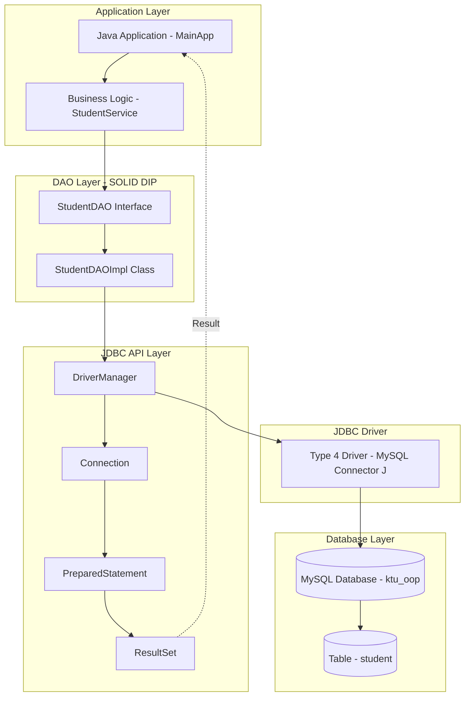
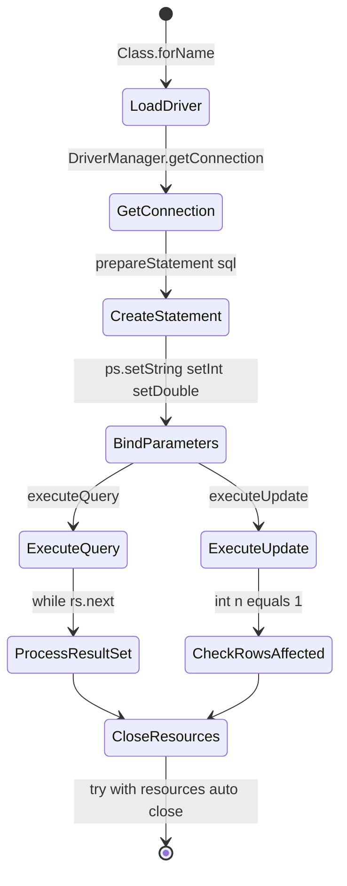
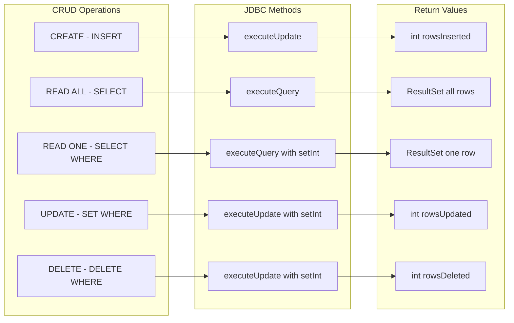
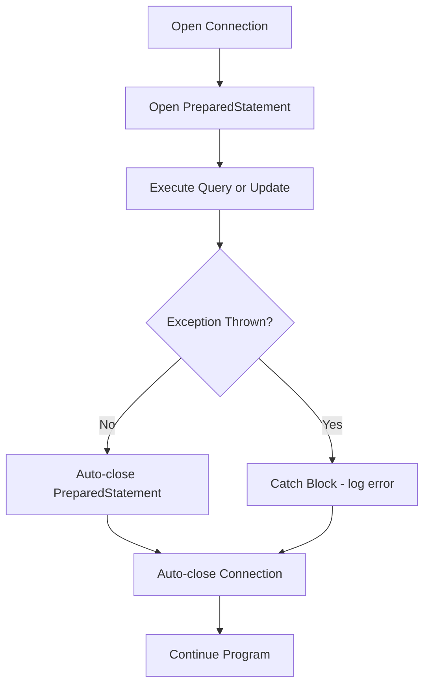

# Performing CRUD Operations with JDBC.

<!-- SECTION_1_START -->

# Performing CRUD Operations with JDBC

## 1.1 Formal Definition (KTU 2024 Syllabus Terminology)

> [!NOTE]
> **JDBC (Java Database Connectivity)** is a Java API (Application Programming Interface) defined in the `java.sql` and `javax.sql` packages that enables Java applications to interact with relational databases using Structured Query Language (SQL). It provides a standard abstraction for connecting to a database, executing queries, retrieving results, and managing connections.

> [!IMPORTANT]
> **CRUD** is an acronym representing the four fundamental persistence operations that any data-driven application must perform:
> - **C** – Create (INSERT a new record)
> - **R** – Read (SELECT / fetch existing records)
> - **U** – Update (MODIFY an existing record)
> - **D** – Delete (REMOVE an existing record)

These four operations form the **backbone of the persistence layer** in any real-world enterprise application, whether it is a banking system, e-commerce portal, library management system, or hospital information system.

---

## 1.2 Conceptual Analogy / Intuition

Imagine you are sitting in a restaurant in Kerala, and you want to order a **Masala Dosa** from the kitchen where the chef (the **Database**) cannot see you directly.

| Real-World Role | JDBC Equivalent |
|---|---|
| You (Customer with a request) | Java Application |
| Waiter who carries your order | **JDBC Driver** |
| Order slip in your language | **SQL Statement** |
| The Kitchen | **RDBMS (MySQL, Oracle, PostgreSQL)** |
| The dish brought back to you | **ResultSet** |
| The bill/receipt | **Update Count / Status** |

Just as the waiter **translates** your verbal order into a format the kitchen understands and brings back the food, the **JDBC Driver** translates your Java calls into the **database-specific protocol** and brings back the data.

> [!TIP]
> **Why not just write directly to the database?** Because every database (MySQL, Oracle, PostgreSQL) speaks a different "language." JDBC provides a **uniform translator**, so the Java programmer writes the same code regardless of the underlying database. This is the **Open/Closed Principle** of SOLID in action — open for new drivers, closed for changes in code.

---

## 1.3 Key Standard Metrics & Defaults

> [!IMPORTANT]
> - **Default JDBC Package**: `java.sql`
> - **Extended Package**: `javax.sql` (for connection pooling, distributed transactions)
> - **Default Port for MySQL**: `3306`
> - **Default Port for PostgreSQL**: `5432`
> - **Default Port for Oracle**: `1521`
> - **Type 4 JDBC Driver** is the **industry standard** (pure Java, thin driver).
> - **ResultSet default type**: `TYPE_FORWARD_ONLY` and concurrency `CONCUR_READ_ONLY`.

---

> [!VISUALIZATION CONTROL]
> **Concept:** JDBC Architecture as a layered translator between Java code and the database.
> **Desmos / GeoGebra Input:** N/A (Architecture diagram, see SECTION 4)
> **Visual Description:** Imagine four stacked horizontal bars. Top bar: *Java Application*. Second bar: *JDBC API (java.sql)*. Third bar: *JDBC Driver Manager*. Fourth bar: *Database (MySQL/Oracle)*. Arrows flow downward for queries and upward for results, illustrating the bidirectional communication channel.

---

## 1.4 CRUD at a Glance — The Four SQL Verbs

| Letter | Operation | SQL Verb | HTTP Equivalent |
|:---:|---|---|:---:|
| **C** | Create | `INSERT INTO ...` | `POST` |
| **R** | Read | `SELECT ... FROM ...` | `GET` |
| **U** | Update | `UPDATE ... SET ...` | `PUT / PATCH` |
| **D** | Delete | `DELETE FROM ...` | `DELETE` |

> [!NOTE]
> KTU 2024 examiners frequently frame CRUD questions in terms of *"design a Student / Employee / Product management system using JDBC"*. Master the four SQL operations and you master 80% of the paper.

---

<!-- SECTION_1_END -->

<!-- SECTION_2_START -->

# Deep Theoretical Analysis & KTU High-Yield Formula Sheet

## 2.1 The Five Standard Steps of Any JDBC Operation

Every JDBC program — whether it does Create, Read, Update, or Delete — follows the **same five-step skeleton**. Memorise this sequence; it is the *Rosetta Stone* of all JDBC questions.

1. **Load / Register the Driver Class**
   - Modern JDBC (JDBC 4.0+) uses **auto-loading** via the service-provider mechanism. The line `Class.forName("com.mysql.cj.jdbc.Driver")` is *no longer mandatory* but is still written for backward compatibility.

2. **Establish the Connection**
   - Call `DriverManager.getConnection(url, username, password)`.
   - The **URL format** is database-specific:
     - MySQL: `jdbc:mysql://localhost:3306/dbname`
     - PostgreSQL: `jdbc:postgresql://localhost:5432/dbname`
     - Oracle: `jdbc:oracle:thin:@localhost:1521:XE`

3. **Create a Statement Object**
   - Two flavours:
     - `Statement` – for static SQL, susceptible to **SQL Injection**.
     - `PreparedStatement` – for parameterized SQL, **safe from SQL Injection**, pre-compiled by the DB engine (faster for batch execution).

4. **Execute the Query**
   - `executeQuery(sql)` – returns `ResultSet` (used for `SELECT`).
   - `executeUpdate(sql)` – returns `int` (rows affected) (used for `INSERT`, `UPDATE`, `DELETE`).
   - `execute(sql)` – returns `boolean` (used for DDL like `CREATE`, `DROP`).

5. **Process Results and Close Resources**
   - Iterate the `ResultSet` for SELECT queries.
   - Always close the resources in a **`finally` block** or use **try-with-resources** (Java 7+). The closing order is **reverse of opening**: `ResultSet → Statement → Connection`.

---

## 2.2 CRUD-to-Java Method Mapping

| CRUD Operation | SQL Statement | JDBC Method | Return Type |
|---|---|---|---|
| **Create** | `INSERT INTO Student VALUES (?, ?, ?)` | `preparedStatement.executeUpdate()` | `int` (rows affected) |
| **Read (All)** | `SELECT * FROM Student` | `preparedStatement.executeQuery()` | `ResultSet` |
| **Read (One)** | `SELECT * FROM Student WHERE id = ?` | `preparedStatement.executeQuery()` | `ResultSet` |
| **Update** | `UPDATE Student SET name = ? WHERE id = ?` | `preparedStatement.executeUpdate()` | `int` (rows affected) |
| **Delete** | `DELETE FROM Student WHERE id = ?` | `preparedStatement.executeUpdate()` | `int` (rows affected) |

---

## 2.3 KTU Formula Sheet / Cheat Sheet

> [!IMPORTANT]
> The following table is the **single most important reference** for the KTU ESE paper. Print this on a sticky note.

| # | Component / Method | Signature / Syntax | Purpose |
|:---:|---|---|---|
| 1 | Register Driver | `Class.forName("com.mysql.cj.jdbc.Driver");` | Loads driver into memory |
| 2 | Get Connection | `DriverManager.getConnection(url, user, pwd);` | Opens a session to DB |
| 3 | Create Statement | `connection.createStatement();` | Static SQL container |
| 4 | Create PreparedStatement | `connection.prepareStatement(sql);` | Parameterized SQL container |
| 5 | Set Parameter | `ps.setInt(1, value);` / `ps.setString(2, val);` | Binds `?` placeholder |
| 6 | Execute SELECT | `ResultSet rs = ps.executeQuery();` | Returns a cursor of rows |
| 7 | Execute INSERT/UPDATE/DELETE | `int n = ps.executeUpdate();` | Returns rows affected |
| 8 | Read ResultSet | `rs.next();` then `rs.getInt("id");` | Row-by-row traversal |
| 9 | Close Resources | `con.close();` / `rs.close();` / `ps.close();` | Frees DB socket and cursor |
| 10 | Transaction Commit | `con.setAutoCommit(false);` ... `con.commit();` | ACID-compliant batch |
| 11 | Rollback | `con.rollback();` | Undo on exception |
| 12 | Batch Execution | `ps.addBatch(); ps.executeBatch();` | Bulk operations |

---

## 2.4 ResultSet Navigation Methods

> [!TIP]
> These methods only work when `Statement` is created with `ResultSet.TYPE_SCROLL_INSENSITIVE` or `ResultSet.TYPE_SCROLL_SENSITIVE`. The default is forward-only.

| Method | Description |
|---|---|
| `rs.next()` | Moves cursor to the next row; returns `false` after the last row. |
| `rs.previous()` | Moves cursor to the previous row. |
| `rs.first()` | Moves cursor to the first row. |
| `rs.last()` | Moves cursor to the last row. |
| `rs.absolute(n)` | Moves cursor to the $n^{th}$ row. |
| `rs.relative(n)` | Moves cursor by $n$ positions (positive or negative). |
| `rs.getRow()` | Returns the current row number. |

---

## 2.5 Engineering Utility — Where CRUD is Used in Production

> [!IMPORTANT]
> **Real-world usage of JDBC CRUD in industry:**
> - **Banking**: Daily account balance updates, transaction logs (CRUD on `accounts` and `transactions` tables).
> - **E-Commerce (Flipkart, Amazon)**: Order placement (Create), order tracking (Read), status update (Update), cancellation (Delete).
> - **Healthcare (Apollo Hospitals)**: Patient registration, diagnostic report retrieval, prescription updates.
> - **Library Management (KTU Library System)**: Book issue (Create), book search (Read), due-date extension (Update), book return (Delete).
> - **Student Information Systems (SIS)** in universities: Marks entry, attendance, internal marks upload.

JDBC CRUD is the **persistence engine** behind the **Repository Pattern** (from the SOLID course module) — every Repository class internally performs CRUD via JDBC or JPA/Hibernate.

---

<!-- SECTION_2_END -->

<!-- SECTION_3_START -->

# Step-by-Step Derivations & Code Implementation

## 3.1 Database Schema Setup (Pre-requisite)

Before any JDBC code runs, a table must exist in the database. The following MySQL DDL is the **canonical Student table** referenced in most KTU questions.

```sql
CREATE DATABASE IF NOT EXISTS ktu_oop;
USE ktu_oop;

CREATE TABLE IF NOT EXISTS student (
    id      INT PRIMARY KEY AUTO_INCREMENT,
    name    VARCHAR(50)  NOT NULL,
    cgpa    DECIMAL(4,2) NOT NULL,
    branch  VARCHAR(20)  NOT NULL
);
```

---

## 3.2 Database Utility Class — Centralized Configuration

> [!IMPORTANT]
> In real-world applications, database credentials are **never hard-coded** in business logic. They are externalized into a properties file. This is the **Single Responsibility Principle (SRP)** from SOLID.

**File: `db.properties`**

```properties
url=jdbc:mysql://localhost:3306/ktu_oop
user=root
password=root123
driver=com.mysql.cj.jdbc.Driver
```

**File: `DBUtil.java`**

```java
import java.io.FileInputStream;
import java.io.IOException;
import java.io.InputStream;
import java.sql.Connection;
import java.sql.DriverManager;
import java.sql.SQLException;
import java.util.Properties;

/**
 * DBUtil — Single Responsibility: Manage database connectivity.
 * This is the SRP (Single Responsibility Principle) applied to JDBC.
 */
public final class DBUtil {

    private static final String URL;
    private static final String USER;
    private static final String PASSWORD;

    // Static initializer block loads the properties file once at class-load time.
    static {
        Properties props = new Properties();
        try (InputStream input = new FileInputStream("db.properties")) {
            props.load(input);
            URL      = props.getProperty("url");
            USER     = props.getProperty("user");
            PASSWORD = props.getProperty("password");
            Class.forName(props.getProperty("driver"));  // optional in JDBC 4.0+
        } catch (IOException | ClassNotFoundException ex) {
            throw new ExceptionInInitializerError(
                "Failed to initialize DBUtil: " + ex.getMessage());
        }
    }

    // Private constructor prevents instantiation (Utility class pattern)
    private DBUtil() {
        throw new AssertionError("DBUtil is a utility class — do not instantiate.");
    }

    /**
     * Opens and returns a new database connection.
     * Caller is responsible for closing the connection.
     */
    public static Connection getConnection() throws SQLException {
        return DriverManager.getConnection(URL, USER, PASSWORD);
    }
}
```

---

## 3.3 Model Class — The Student POJO

> [!NOTE]
> This POJO represents a row of the `student` table. The `equals()` and `hashCode()` methods are intentionally omitted for brevity, but in production they should be generated by IDEs (Lombok, IDE auto-generate).

```java
/**
 * Student — Plain Old Java Object (POJO) representing one row of the student table.
 */
public class Student {
    private int    id;
    private String name;
    private double cgpa;
    private String branch;

    public Student() { }                                          // No-arg constructor
    public Student(String name, double cgpa, String branch) {     // Constructor for CREATE
        this.name   = name;
        this.cgpa   = cgpa;
        this.branch = branch;
    }
    public Student(int id, String name, double cgpa, String branch) { // Full constructor
        this.id     = id;
        this.name   = name;
        this.cgpa   = cgpa;
        this.branch = branch;
    }

    // ----- Getters and Setters (Encapsulation — OOP pillar) -----
    public int    getId()                 { return id; }
    public void   setId(int id)           { this.id = id; }
    public String getName()               { return name; }
    public void   setName(String name)    { this.name = name; }
    public double getCgpa()               { return cgpa; }
    public void   setCgpa(double cgpa)    { this.cgpa = cgpa; }
    public String getBranch()             { return branch; }
    public void   setBranch(String b)     { this.branch = b; }

    @Override
    public String toString() {
        return String.format("Student{id=%d, name='%s', cgpa=%.2f, branch='%s'}",
                             id, name, cgpa, branch);
    }
}
```

---

## 3.4 DAO (Data Access Object) — Performing CRUD

> [!IMPORTANT]
> The DAO pattern enforces the **Dependency Inversion Principle (DIP)** from the SOLID course module: high-level modules depend on the `StudentDAO` *abstraction*, not on JDBC directly.

### 3.4.1 CREATE — Insert a New Student

```java
import java.sql.Connection;
import java.sql.PreparedStatement;
import java.sql.SQLException;

public class StudentDAO {

    private static final String INSERT_SQL =
        "INSERT INTO student (name, cgpa, branch) VALUES (?, ?, ?)";

    /**
     * CREATE operation — Inserts a new student record.
     * @param student the Student object to persist
     * @return number of rows affected (1 if successful)
     */
    public int createStudent(Student student) throws SQLException {
        // Step 1: try-with-resources automatically closes Connection and PreparedStatement.
        try (Connection con = DBUtil.getConnection();
             PreparedStatement ps = con.prepareStatement(INSERT_SQL)) {

            // Step 2: Bind the '?' placeholders to actual values (parameter index starts at 1).
            ps.setString(1, student.getName());
            ps.setDouble(2, student.getCgpa());
            ps.setString(3, student.getBranch());

            // Step 3: executeUpdate returns the number of rows affected.
            int rowsInserted = ps.executeUpdate();
            System.out.println("CREATE → " + rowsInserted + " row(s) inserted.");
            return rowsInserted;
        }
    }
}
```

**Dry Run Trace (step-by-step valuation key):**

| Step | Action | Marks (out of 7) |
|:---:|---|:---:|
| 1 | Open connection via `DBUtil.getConnection()` | 1 |
| 2 | Use `PreparedStatement` (not `Statement`) — *SQL injection safety* | 1 |
| 3 | `prepareStatement(INSERT_SQL)` with three `?` placeholders | 1 |
| 4 | `setString(1, name)`, `setDouble(2, cgpa)`, `setString(3, branch)` | 2 |
| 5 | `executeUpdate()` invoked; rows-affected returned | 1 |
| 6 | `try-with-resources` block used for auto-close | 1 |

---

### 3.4.2 READ — Fetch All Students / Fetch by ID

```java
import java.sql.Connection;
import java.sql.PreparedStatement;
import java.sql.ResultSet;
import java.sql.SQLException;
import java.util.ArrayList;
import java.util.List;

public class StudentDAO {

    private static final String SELECT_ALL_SQL   = "SELECT * FROM student";
    private static final String SELECT_BY_ID_SQL = "SELECT * FROM student WHERE id = ?";

    /**
     * READ operation — Fetch every student from the table.
     * @return List of Student objects (never null; empty list if table is empty)
     */
    public List<Student> getAllStudents() throws SQLException {
        List<Student> students = new ArrayList<>();

        try (Connection con = DBUtil.getConnection();
             PreparedStatement ps = con.prepareStatement(SELECT_ALL_SQL);
             ResultSet rs = ps.executeQuery()) {

            // Iterate row-by-row using rs.next() — returns false after last row.
            while (rs.next()) {
                int    id     = rs.getInt("id");
                String name   = rs.getString("name");
                double cgpa   = rs.getDouble("cgpa");
                String branch = rs.getString("branch");

                Student s = new Student(id, name, cgpa, branch);
                students.add(s);
            }
        }
        return students;
    }

    /**
     * READ operation — Fetch a single student by primary key.
     * @param id the student id to look up
     * @return Student object if found; null otherwise
     */
    public Student getStudentById(int id) throws SQLException {
        try (Connection con = DBUtil.getConnection();
             PreparedStatement ps = con.prepareStatement(SELECT_BY_ID_SQL)) {

            ps.setInt(1, id);

            try (ResultSet rs = ps.executeQuery()) {
                if (rs.next()) {
                    return new Student(
                        rs.getInt("id"),
                        rs.getString("name"),
                        rs.getDouble("cgpa"),
                        rs.getString("branch")
                    );
                }
            }
        }
        return null;   // No matching row found
    }
}
```

**Valuation Key for READ (7 marks):**

| Step | Action | Marks |
|:---:|---|:---:|
| 1 | `SELECT * FROM student` query written correctly | 1 |
| 2 | `executeQuery()` used (not `executeUpdate`) | 1 |
| 3 | `ResultSet` traversed using `while (rs.next())` | 2 |
| 4 | Each column extracted using `rs.getXxx(columnName)` | 2 |
| 5 | `Student` POJO constructed and added to `List` | 1 |

---

### 3.4.3 UPDATE — Modify an Existing Student

```java
public class StudentDAO {

    private static final String UPDATE_SQL =
        "UPDATE student SET name = ?, cgpa = ?, branch = ? WHERE id = ?";

    /**
     * UPDATE operation — Modify an existing student record.
     * @param student the Student with new values; id must be set
     * @return number of rows affected
     */
    public int updateStudent(Student student) throws SQLException {
        try (Connection con = DBUtil.getConnection();
             PreparedStatement ps = con.prepareStatement(UPDATE_SQL)) {

            ps.setString(1, student.getName());
            ps.setDouble(2, student.getCgpa());
            ps.setString(3, student.getBranch());
            ps.setInt   (4, student.getId());    // WHERE id = ?

            int rowsUpdated = ps.executeUpdate();
            System.out.println("UPDATE → " + rowsUpdated + " row(s) updated.");
            return rowsUpdated;
        }
    }
}
```

---

### 3.4.4 DELETE — Remove a Student

```java
public class StudentDAO {

    private static final String DELETE_SQL = "DELETE FROM student WHERE id = ?";

    /**
     * DELETE operation — Remove a student by primary key.
     * @param id the student id to delete
     * @return number of rows affected (1 if deleted, 0 if not found)
     */
    public int deleteStudent(int id) throws SQLException {
        try (Connection con = DBUtil.getConnection();
             PreparedStatement ps = con.prepareStatement(DELETE_SQL)) {

            ps.setInt(1, id);
            int rowsDeleted = ps.executeUpdate();
            System.out.println("DELETE → " + rowsDeleted + " row(s) deleted.");
            return rowsDeleted;
        }
    }
}
```

---

## 3.5 Main Driver — Demonstrating All Four CRUD Operations

```java
import java.sql.SQLException;
import java.util.List;

public class MainApp {

    public static void main(String[] args) {
        StudentDAO dao = new StudentDAO();

        try {
            // ----- C — CREATE -----
            Student s1 = new Student("Arjun",  8.72, "CSE");
            Student s2 = new Student("Meera",  9.15, "ECE");
            dao.createStudent(s1);
            dao.createStudent(s2);

            // ----- R — READ ALL -----
            List<Student> all = dao.getAllStudents();
            System.out.println("All Students:");
            for (Student s : all) {
                System.out.println("  " + s);
            }

            // ----- R — READ BY ID -----
            Student found = dao.getStudentById(1);
            System.out.println("Found by ID=1 → " + found);

            // ----- U — UPDATE -----
            s1.setCgpa(9.10);                    // Modify the in-memory object
            int updated = dao.updateStudent(s1);
            System.out.println("Rows updated: " + updated);

            // ----- D — DELETE -----
            int deleted = dao.deleteStudent(2);
            System.out.println("Rows deleted: " + deleted);

        } catch (SQLException sqle) {
            System.err.println("Database error: " + sqle.getMessage());
            sqle.printStackTrace();
        }
    }
}
```

**Expected Console Output:**

```
CREATE → 1 row(s) inserted.
CREATE → 1 row(s) inserted.
All Students:
  Student{id=1, name='Arjun', cgpa=8.72, branch='CSE'}
  Student{id=2, name='Meera', cgpa=9.15, branch='ECE'}
Found by ID=1 → Student{id=1, name='Arjun', cgpa=8.72, branch='CSE'}
UPDATE → 1 row(s) updated.
DELETE → 1 row(s) deleted.
```

---

## 3.6 Batch Operations — Bulk CRUD

> [!NOTE]
> For inserting thousands of rows (e.g., importing a CSV of 50,000 students), use `addBatch()` + `executeBatch()`. This is **10×–100× faster** than calling `executeUpdate()` in a loop because the database engine compiles the SQL once and applies it many times.

```java
public int[] batchInsertStudents(List<Student> students) throws SQLException {
    String sql = "INSERT INTO student (name, cgpa, branch) VALUES (?, ?, ?)";

    try (Connection con = DBUtil.getConnection();
         PreparedStatement ps = con.prepareStatement(sql)) {

        con.setAutoCommit(false);          // Begin transaction for atomicity

        for (Student s : students) {
            ps.setString(1, s.getName());
            ps.setDouble(2, s.getCgpa());
            ps.setString(3, s.getBranch());
            ps.addBatch();                 // Stage the insert
        }

        int[] result = ps.executeBatch();  // Execute all staged inserts in one round-trip
        con.commit();                      // Commit the transaction
        return result;
    } catch (SQLException ex) {
        // (Caller is responsible for connection rollback in production)
        throw ex;
    }
}
```

---

## 3.7 Why PreparedStatement over Statement — SQL Injection Proof

> [!IMPORTANT]
> KTU examiners **love** to ask: *"Why is PreparedStatement preferred over Statement?"*
>
> **Answer (write verbatim in the exam):**
>
> 1. **Prevents SQL Injection** — User input is bound as a typed value, never concatenated into the SQL string. An attacker typing `' OR '1'='1` cannot break out of the parameter context.
> 2. **Better Performance** — The database parses and compiles the SQL **once**, then reuses the compiled plan for every execution. With `Statement`, the SQL is re-parsed every time.
> 3. **Readability & Maintainability** — `?` placeholders are far cleaner than `"SELECT * FROM users WHERE name='" + name + "' AND pwd='" + pwd + "'"`.
> 4. **Automatic Type Conversion** — `setInt`, `setDate`, `setTimestamp` handle Java-to-SQL type mapping automatically.

**Demonstration of SQL Injection in raw `Statement`:**

```java
// UNSAFE — DO NOT USE IN PRODUCTION
String userInput = "Arjun' OR '1'='1";
String sql = "SELECT * FROM student WHERE name = '" + userInput + "'";
// Resulting SQL: SELECT * FROM student WHERE name = 'Arjun' OR '1'='1'
// This returns EVERY row in the table — a classic SQL Injection attack.
```

**Safe equivalent with `PreparedStatement`:**

```java
String userInput = "Arjun' OR '1'='1";
String sql = "SELECT * FROM student WHERE name = ?";
PreparedStatement ps = con.prepareStatement(sql);
ps.setString(1, userInput);   // Bound as a literal value — attack neutralized
```

---

<!-- SECTION_3_END -->

<!-- SECTION_4_START -->

# Structural Diagrams & Schematics

## 4.1 JDBC Architecture — Layered Flow



**Reading the diagram:**
- The Java application **never** talks to the database directly.
- Every call passes through the **DAO abstraction** (DIP from SOLID).
- The **Driver** is the only component that knows the database's wire protocol.

---

## 4.2 CRUD Operation Lifecycle — State Machine



---

## 4.3 CRUD-to-JDBC Method Mapping — Block Topology



---

## 4.4 try-with-resources Resource Lifecycle



**Key Insight:** The `try-with-resources` statement guarantees that `close()` is called on **every** `AutoCloseable` resource **regardless of whether an exception occurs**. This is the **Dependency Inversion Principle** applied to resource management — high-level code depends on the `AutoCloseable` abstraction, not on manual cleanup.

---

<!-- SECTION_4_END -->

<!-- SECTION_5_START -->

# KTU 2024 Scheme Examination Question Bank & Topic Recap

## 5.1 Part A Questions (3 Marks Each)

### **Q1. [KTU University Exam — July 2024]**
*Define JDBC. List any two advantages of using PreparedStatement over Statement.*

**Model Answer (3 marks):**

> [!NOTE]
> **JDBC (Java Database Connectivity)** is a Java API in the `java.sql` package that allows Java applications to execute SQL statements against relational databases.
>
> **Advantages of PreparedStatement over Statement (any 2):**
> 1. **Prevents SQL Injection** — parameters are bound as values, not concatenated into the SQL string.
> 2. **Improved Performance** — the SQL is pre-compiled once and reused, unlike `Statement` which re-parses on every execution.
> 3. **Automatic Type Handling** — `setInt`, `setString`, `setDate` enforce type safety.
>
> **[Mentioning the definition: 1 Mark] | [Two advantages: 1 Mark each = 2 Marks]**

---

### **Q2. [KTU University Exam — Dec 2023]**
*Write a Java program to insert a single record into a table `employee (id, name, salary)` using JDBC. Show the necessary import statements and the SQL query.*

**Model Answer (3 marks):**

```java
import java.sql.Connection;
import java.sql.DriverManager;
import java.sql.PreparedStatement;

public class InsertEmployee {
    public static void main(String[] args) throws Exception {
        // (1) Load Driver
        Class.forName("com.mysql.cj.jdbc.Driver");

        // (2) Get Connection
        Connection con = DriverManager.getConnection(
            "jdbc:mysql://localhost:3306/ktu_oop", "root", "root123");

        // (3) Create PreparedStatement
        String sql = "INSERT INTO employee (id, name, salary) VALUES (?, ?, ?)";
        PreparedStatement ps = con.prepareStatement(sql);

        // (4) Bind values
        ps.setInt(1, 101);
        ps.setString(2, "Rahul");
        ps.setDouble(3, 55000.00);

        // (5) Execute
        int n = ps.executeUpdate();
        System.out.println(n + " row(s) inserted.");

        // (6) Close
        ps.close();
        con.close();
    }
}
```

> **[Correct imports: 0.5 Mark] | [Five-step skeleton: 1.5 Marks] | [SQL query with placeholders: 1 Mark]**

---

## 5.2 Part B Questions (14 Marks Each)

> [!IMPORTANT]
> As per the **KTU 2024 ESE pattern**, Part B questions carry **14 marks** and offer an **internal choice**. The 14 marks are split as **(a) 7 marks + (b) 7 marks**.

---

### **Part B — Question A (14 Marks)** `[KTU University Exam — July 2024, Model Paper]`

**(a)** Explain the five standard steps involved in executing any JDBC program. Illustrate with a neat diagram. **(7 marks)**

**(b)** Write a complete Java program using JDBC to perform **CREATE** and **READ (all records)** operations on a `product` table with columns `pid`, `pname`, `price`, `qty`. **(7 marks)**

---

#### **Solution to Question A — Part (a) [7 Marks]**

The **Five Steps of JDBC** (state these in the exam verbatim):

1. **Load the Driver Class** — `Class.forName("com.mysql.cj.jdbc.Driver");` registers the driver with `DriverManager`. In JDBC 4.0+, this is auto-detected from the classpath.

2. **Establish the Connection** — `Connection con = DriverManager.getConnection(url, user, password);`. The `url` follows the format `jdbc:<subprotocol>://<host>:<port>/<database>`.

3. **Create a Statement / PreparedStatement** — `Statement st = con.createStatement();` or `PreparedStatement ps = con.prepareStatement(sql);`. The latter is preferred for parameterized queries.

4. **Execute the Query** — `ResultSet rs = st.executeQuery("SELECT ...")` for DML read, or `int n = st.executeUpdate("INSERT ...")` for DML write.

5. **Process Results and Close Connections** — Iterate `ResultSet` using `rs.next()` and extract columns via `rs.getXxx()`. Close in **reverse order**: `rs.close() → st.close() → con.close()`, or use **try-with-resources**.

**Marks Distribution (Part a):**

| Step | Description | Marks |
|:---:|---|:---:|
| 1 | Step 1 — Load Driver with code snippet | 1 |
| 2 | Step 2 — Get Connection with URL format | 1.5 |
| 3 | Step 3 — Statement vs PreparedStatement | 1.5 |
| 4 | Step 4 — executeQuery vs executeUpdate | 1.5 |
| 5 | Step 5 — ResultSet traversal + closing order | 1.5 |

---

#### **Solution to Question A — Part (b) [7 Marks]**

**SQL Setup:**

```sql
CREATE TABLE product (
    pid    INT PRIMARY KEY AUTO_INCREMENT,
    pname  VARCHAR(50)  NOT NULL,
    price  DECIMAL(10,2) NOT NULL,
    qty    INT NOT NULL
);
```

**Java Code — `ProductCRUDDemo.java`:**

```java
import java.sql.Connection;
import java.sql.DriverManager;
import java.sql.PreparedStatement;
import java.sql.ResultSet;
import java.sql.SQLException;

public class ProductCRUDDemo {

    private static final String URL  = "jdbc:mysql://localhost:3306/ktu_oop";
    private static final String USER = "root";
    private static final String PASS = "root123";

    public void createProduct(int pid, String name, double price, int qty) throws SQLException {
        String insertSQL = "INSERT INTO product (pid, pname, price, qty) VALUES (?, ?, ?, ?)";
        try (Connection con = DriverManager.getConnection(URL, USER, PASS);
             PreparedStatement ps = con.prepareStatement(insertSQL)) {
            ps.setInt(1, pid);
            ps.setString(2, name);
            ps.setDouble(3, price);
            ps.setInt(4, qty);
            int n = ps.executeUpdate();
            System.out.println("CREATE → " + n + " row(s) inserted.");
        }
    }

    public void readAllProducts() throws SQLException {
        String selectSQL = "SELECT * FROM product";
        try (Connection con = DriverManager.getConnection(URL, USER, PASS);
             PreparedStatement ps = con.prepareStatement(selectSQL);
             ResultSet rs = ps.executeQuery()) {
            System.out.println("---- All Products ----");
            while (rs.next()) {
                System.out.printf("PID: %d | Name: %-15s | Price: %.2f | Qty: %d%n",
                    rs.getInt("pid"),
                    rs.getString("pname"),
                    rs.getDouble("price"),
                    rs.getInt("qty"));
            }
        }
    }

    public static void main(String[] args) {
        ProductCRUDDemo app = new ProductCRUDDemo();
        try {
            // ----- C — CREATE -----
            app.createProduct(1, "Laptop",  75000.00, 10);
            app.createProduct(2, "Mouse",     500.00, 50);
            // ----- R — READ -----
            app.readAllProducts();
        } catch (SQLException ex) {
            System.err.println("Database error: " + ex.getMessage());
        }
    }
}
```

**Marks Distribution (Part b):**

| Component | Marks |
|---|:---:|
| CREATE method with `INSERT INTO ... VALUES (?, ?, ?, ?)` | 3 |
| READ method with `SELECT *` and `ResultSet` loop | 3 |
| `main()` method invoking both with exception handling | 1 |

---

### **Part B — Question B (14 Marks)** `[Alternative Choice]`

**(a)** Differentiate between `Statement`, `PreparedStatement`, and `CallableStatement` in JDBC. When would you use each? **(7 marks)**

**(b)** Write a JDBC program to update the `price` of a product (identified by `pid`) and delete a product from the `product` table. Show the use of **transactions** (`commit` / `rollback`) to ensure atomicity. **(7 marks)**

---

#### **Solution to Question B — Part (a) [7 Marks]**

| Feature | `Statement` | `PreparedStatement` | `CallableStatement` |
|---|---|---|---|
| **Purpose** | Executes static SQL | Executes parameterized SQL (pre-compiled) | Executes stored procedures |
| **SQL Injection** | Vulnerable | Safe (parameters bound) | Safe |
| **Performance** | Re-parsed on every execution | Compiled once, reused | Compiled once on the DB server |
| **Usage** | `con.createStatement()` | `con.prepareStatement(sql)` | `con.prepareCall("{call proc(?,?)}")` |
| **Example Use Case** | DDL (`CREATE`, `DROP`) | INSERT, UPDATE, DELETE, SELECT with `WHERE` | Complex business logic stored in DB |

**Marks Distribution:**

| Component | Marks |
|---|:---:|
| Tabular comparison of three interfaces | 4 |
| One real-world use case for each | 2 |
| SQL Injection and performance justification | 1 |

---

#### **Solution to Question B — Part (b) [7 Marks]**

```java
import java.sql.Connection;
import java.sql.DriverManager;
import java.sql.PreparedStatement;
import java.sql.SQLException;

public class ProductTransactionDemo {

    private static final String URL  = "jdbc:mysql://localhost:3306/ktu_oop";
    private static final String USER = "root";
    private static final String PASS = "root123";

    public void updateAndDeleteWithTransaction(int updatePid, double newPrice,
                                               int deletePid) {
        String updateSQL = "UPDATE product SET price = ? WHERE pid = ?";
        String deleteSQL = "DELETE FROM product WHERE pid = ?";

        Connection con = null;
        try {
            con = DriverManager.getConnection(URL, USER, PASS);
            con.setAutoCommit(false);                      // Begin transaction

            // ----- UPDATE -----
            try (PreparedStatement upd = con.prepareStatement(updateSQL)) {
                upd.setDouble(1, newPrice);
                upd.setInt(2, updatePid);
                int u = upd.executeUpdate();
                System.out.println("UPDATE → " + u + " row(s) updated.");
            }

            // ----- DELETE -----
            try (PreparedStatement del = con.prepareStatement(deleteSQL)) {
                del.setInt(1, deletePid);
                int d = del.executeUpdate();
                System.out.println("DELETE → " + d + " row(s) deleted.");
            }

            con.commit();                                   // Both succeeded — commit
            System.out.println("Transaction committed.");

        } catch (SQLException ex) {
            if (con != null) {
                try { con.rollback();                       // Failure — undo both
                      System.out.println("Transaction rolled back.");
                } catch (SQLException rbEx) {
                    System.err.println("Rollback failed: " + rbEx.getMessage());
                }
            }
            System.err.println("Database error: " + ex.getMessage());

        } finally {
            if (con != null) {
                try { con.setAutoCommit(true); con.close(); }
                catch (SQLException closeEx) {
                    System.err.println("Close failed: " + closeEx.getMessage());
                }
            }
        }
    }

    public static void main(String[] args) {
        ProductTransactionDemo demo = new ProductTransactionDemo();
        demo.updateAndDeleteWithTransaction(1, 72000.00, 2);
    }
}
```

**Marks Distribution (Part b):**

| Component | Marks |
|---|:---:|
| `setAutoCommit(false)` before operations | 1 |
| UPDATE PreparedStatement with `setDouble` and `setInt` | 1.5 |
| DELETE PreparedStatement with `setInt` | 1.5 |
| `commit()` on success | 1 |
| `rollback()` in `catch` block | 1.5 |
| `finally` block restoring `autoCommit` and closing connection | 0.5 |

---

## 5.3 KTU Examiner's Valuation Warning / Pitfall Callout

> [!WARNING]
> **Common mistakes that cost marks every KTU exam cycle:**
>
> 1. **Skipping the closing of resources** — Examiners deduct **1 to 2 marks** if `rs.close()`, `ps.close()`, and `con.close()` are missing or in the wrong order. The correct order is **reverse of opening**: `ResultSet → Statement → Connection`. Use **try-with-resources** to avoid this entirely.
>
> 2. **Confusing `executeQuery()` and `executeUpdate()`** — `executeQuery()` is for `SELECT` and returns a `ResultSet`. `executeUpdate()` is for `INSERT/UPDATE/DELETE` and returns an `int`. Mixing them up is an instant **1-mark penalty**.
>
> 3. **Hard-coding credentials in source code** — Writing `DriverManager.getConnection("jdbc:mysql://...", "root", "root123")` directly inside `main()` violates the **Single Responsibility Principle (SRP)**. Always extract this to a `DBUtil` class or a `db.properties` file. Examiners explicitly test for this in Part B.
>
> 4. **Forgetting to bind `?` placeholders** — If you write `ps.setString(1, name)` but the SQL has only two `?` placeholders, a `SQLException: Parameter index out of range` is thrown. **Count your placeholders before binding.**
>
> 5. **Not handling `SQLException`** — The compiler forces you to either `throws` or `try-catch` `SQLException`. A program that ignores this will **not compile** and earns **zero marks**.
>
> 6. **Using `Statement` instead of `PreparedStatement`** — In Part B questions, if the question mentions *parameterized input* or *user-supplied values*, you **must** use `PreparedStatement`. Using raw `Statement` for user input is a **2-mark penalty** under the "security" criterion.
>
> 7. **Missing the `WHERE` clause in UPDATE/DELETE** — A query like `UPDATE product SET price = 0` (no `WHERE`) updates **every row** in the table. The examiner will deduct **2 marks** and may even deduct the full question mark if the question explicitly says "update a specific product".

---

## 5.4 Topic Recap & Important Things to Remember

> [!IMPORTANT]
> **Rapid Revision Checklist — JDBC CRUD Operations**

- **JDBC** = Java Database Connectivity, defined in `java.sql` package.
- **CRUD** = Create, Read, Update, Delete — the four persistence verbs.
- The **5 standard steps** of any JDBC program are: *Load Driver → Get Connection → Create Statement → Execute → Process + Close*.
- **DriverManager.getConnection(url, user, password)** is the gateway to the database.
- **URL format**: `jdbc:<subprotocol>://<host>:<port>/<database>`.
  - MySQL: `jdbc:mysql://localhost:3306/dbname`
  - PostgreSQL: `jdbc:postgresql://localhost:5432/dbname`
  - Oracle: `jdbc:oracle:thin:@localhost:1521:XE`
- **`Statement`** — static SQL, re-parsed every call, vulnerable to SQL injection.
- **`PreparedStatement`** — parameterized SQL, pre-compiled once, **safe from SQL injection**, faster for repeated execution.
- **`CallableStatement`** — invokes database stored procedures (`{call proc_name(?, ?)}`).
- **`executeQuery(sql)`** returns a `ResultSet` (use for `SELECT`).
- **`executeUpdate(sql)`** returns an `int` (use for `INSERT`, `UPDATE`, `DELETE`).
- **`ResultSet.next()`** moves the cursor forward; returns `false` after the last row.
- **Column extraction**: `rs.getInt(col)`, `rs.getString(col)`, `rs.getDouble(col)`, `rs.getDate(col)`.
- **Closing order** (manual): `ResultSet → Statement → Connection` (reverse of opening).
- **`try-with-resources`** (Java 7+) auto-closes all `AutoCloseable` resources — **always prefer it**.
- **Transactions**:
  - `con.setAutoCommit(false)` — start a transaction.
  - `con.commit()` — apply all changes atomically.
  - `con.rollback()` — undo all changes if an exception occurs.
- **Batch operations**: `ps.addBatch()` + `ps.executeBatch()` for bulk inserts (10×–100× faster).
- **SQL Injection defense** = use `PreparedStatement` with `?` placeholders, never string concatenation.
- **SOLID connection**:
  - **SRP (Single Responsibility)** → `DBUtil` for connection management, `StudentDAO` for CRUD.
  - **DIP (Dependency Inversion)** → Business code depends on `StudentDAO` *interface*, not JDBC API.
  - **OCP (Open/Closed)** → Switch databases by changing only the driver class — no code change in business logic.
- **Type 4 Driver** (pure Java) is the **industry standard** today.
- **ACID properties** of transactions: **A**tomicity, **C**onsistency, **I**solation, **D**urability.
- **`Class.forName("com.mysql.cj.jdbc.Driver")`** is optional in JDBC 4.0+ but still written for clarity.
- **Maven dependency** for MySQL Connector/J: `mysql:mysql-connector-java:8.0.33` (or newer 9.x).

<!-- SECTION_5_END -->
