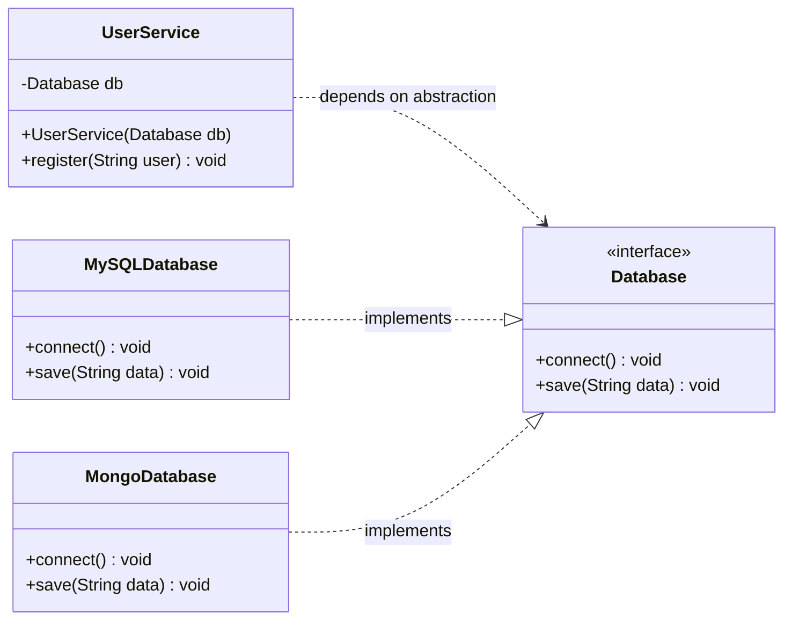
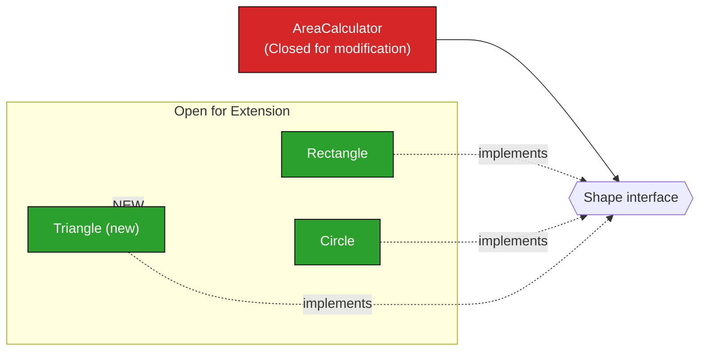
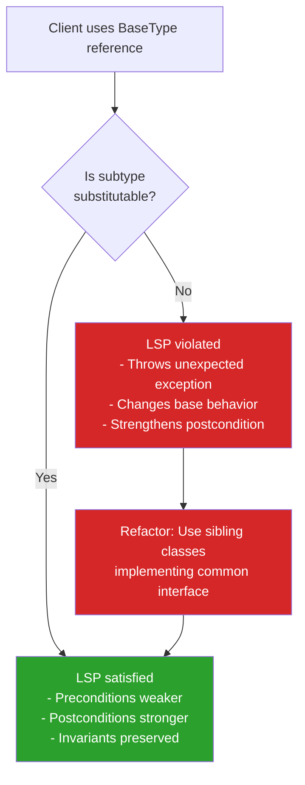
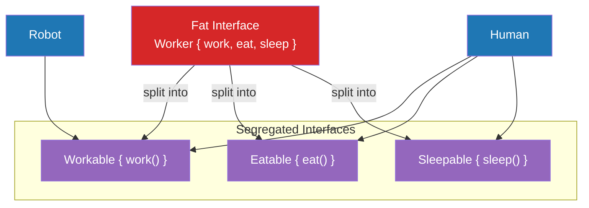
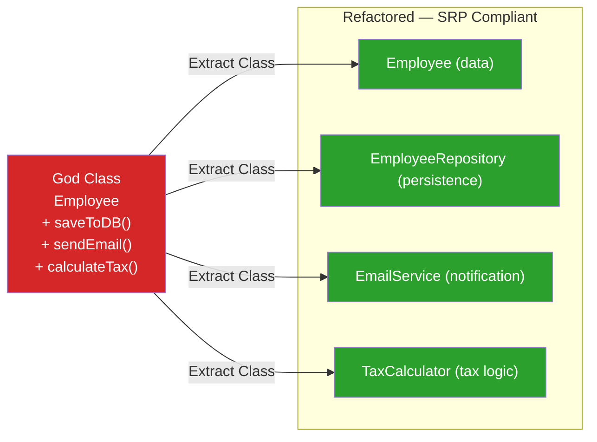

# SOLID Principles in Java ( https://www.javatpoint.com/solid-principles-java)

<!-- SECTION_1_START -->
# SOLID Principles in Java — Core Technical Definition & Intuitive Overview

## 1.1 Formal Academic Definition

> [!IMPORTANT]
> **SOLID** is an acronym for **five object-oriented design principles** formulated by **Robert C. Martin (Uncle Bob)** in his 2000 paper *"Design Principles and Design Patterns."* The acronym was later coined by **Michael Feathers**. These principles guide software architects in building **maintainable, scalable, and robust** object-oriented systems, and they form the backbone of modern Java enterprise frameworks such as **Spring** and **Jakarta EE**.

The five principles are listed in the table below.

| Letter | Principle Name | Core Idea |
|:---:|:---|:---|
| **S** | Single Responsibility Principle | One class, one reason to change |
| **O** | Open/Closed Principle | Open for extension, closed for modification |
| **L** | Liskov Substitution Principle | Subtypes must be substitutable for base types |
| **I** | Interface Segregation Principle | Prefer many small, specific interfaces over one fat interface |
| **D** | Dependency Inversion Principle | Depend on abstractions, not on concretions |

## 1.2 Conceptual Analogy — The Restaurant Kitchen

> [!NOTE]
> **Intuitive Analogy:** Imagine a well-run restaurant kitchen.
> - The **Head Chef (SRP)** is responsible *only* for cooking — not for billing customers.
> - The kitchen adds a **new menu item (OCP)** by training the chef, **not by rewriting the recipe book**.
> - A **Sous-Chef (LSP)** can step in for the Head Chef and customers won't notice any difference in dish quality.
> - The kitchen uses **specialized knives (ISP)** — a fish knife, a bread knife — instead of one giant Swiss-army knife.
> - The **waiter (DIP)** interacts with the *idea* of a "Chef" (an interface) rather than a specific chef named "Ravi." If Ravi quits, the waiter still serves food.

In Java terms, a class should be like a well-defined role: small, replaceable, and decoupled.

## 1.3 Why SOLID Exists — The Cost of Bad Design

A monolithic class that does *everything* — validation, persistence, email, logging, business logic — is commonly called a **"God Class."** Bad design manifests as the **"Four Sins of Software":**

1. **Rigidity** — Hard to change because every change affects too many modules.
2. **Fragility** — Easy to break in unrelated places.
3. **Immobility** — Hard to reuse in another project.
4. **Viscosity** — Doing things *right* is harder than doing things *wrong*.

> [!TIP]
> The KTU 2024 OOP syllabus (Module 4) explicitly tests whether students can **recognize violations** of these principles in given Java code and **refactor** the code to adhere to them. Expect comparison-based questions on **"violation vs. adherence."**

## 1.4 Visualization — The SOLID Pyramid of Code Health

> [!VISUALIZATION CONTROL]
> **Concept:** Stability vs. Flexibility trade-off in a software system
> **GeoGebra / Desmos Input Equations:**
> * `f(x) = 1 / (1 + e^(-x))`  *(Sigmoid — represents code quality increasing with SOLID adherence)*
> * Point A: `(0, 0.5)` — Baseline unrefactored system
> * Point B: `(2, 0.88)` — After applying S & O
> * Point C: `(4, 0.95)` — After applying L, I, D
> **Visual Description:** A sigmoid curve rising from left to right. As the engineer applies each SOLID principle (x-axis), the system stability and maintainability (y-axis) increases sharply, then plateaus. The "elbow" of the curve is between SRP and OCP — these two yield the most dramatic improvement.

---

<!-- SECTION_1_END -->

<!-- SECTION_2_START -->
# Deep Theoretical Analysis & KTU High-Yield Formula Sheet

## 2.1 The Five Principles — Operational Logic

### 2.1.1 **S — Single Responsibility Principle (SRP)**

**Operational Statement:** *A class should have only one reason to change.* (Robert C. Martin)

**Why:** A class with multiple responsibilities becomes coupled to multiple stakeholders. A change requested by *one* stakeholder breaks the others.

**How to apply:**
- Identify the **actors** who can request a change in your class.
- If there is more than one actor, split the class.
- Each class encapsulates **exactly one axis of change**.

**Java Mechanism:** Use separate classes for separate concerns (e.g., `UserService`, `UserRepository`, `EmailNotifier`).

### 2.1.2 **O — Open/Closed Principle (OCP)**

**Operational Statement:** *Software entities should be open for extension, but closed for modification.*

**Why:** Modifying existing, tested code risks regression. Adding new functionality should be done by *adding* code, not by *changing* it.

**How to apply:**
- Use **abstraction** (`abstract class` or `interface`).
- Inject specific behaviors via polymorphism.
- Use the **Strategy Pattern**, **Decorator Pattern**, or **Template Method**.

### 2.1.3 **L — Liskov Substitution Principle (LSP)**

**Operational Statement:** *Objects of a superclass shall be replaceable with objects of a subclass without breaking the application.* (Barbara Liskov, 1987)

**Why:** Violations cause subtle runtime bugs and `ClassCastException` issues.

**How to apply:**
- Subclass must **strengthen, not weaken**, postconditions.
- Subclass must **weaken, not strengthen**, preconditions.
- Invariants of the base type must be preserved.
- **Contravariance** for parameters; **covariance** for return types.

### 2.1.4 **I — Interface Segregation Principle (ISP)**

**Operational Statement:** *Clients should not be forced to depend on methods they do not use.* (Robert C. Martin)

**Why:** "Fat" interfaces create **interface pollution** — implementing classes throw `UnsupportedOperationException` for irrelevant methods.

**How to apply:**
- Split large interfaces into **role-specific** micro-interfaces.
- A class can implement **multiple** segregated interfaces.

### 2.1.5 **D — Dependency Inversion Principle (DIP)**

**Operational Statement:**
1. High-level modules should not depend on low-level modules. Both should depend on abstractions.
2. Abstractions should not depend on details. Details should depend on abstractions.

**Why:** Direct instantiation (`new ConcreteClass()`) creates tight coupling.

**How to apply:**
- Program to an **interface**, not an implementation.
- Use **constructor injection**, **setter injection**, or a DI container (Spring's `@Autowired`).

## 2.2 KTU High-Yield Formula Sheet / Cheat Sheet

> [!IMPORTANT]
> Memorize this table. KTU questions frequently use this exact vocabulary for 3-mark and 14-mark questions.

| Principle | Trigger Phrase (KTU 2024) | Refactor Tool | Key Java Keyword |
|:---|:---|:---|:---|
| **SRP** | *"One class, one reason to change"* | Extract Class, Move Method | `final class` for immutability |
| **OCP** | *"Add new behavior, don't change old"* | Strategy / Decorator Pattern | `abstract class`, `@Override` |
| **LSP** | *"Substitutable without surprises"* | Refactor hierarchy | `extends`, `implements` |
| **ISP** | *"No fat interfaces"* | Split interface | `interface` (Java 8+: `default`) |
| **DIP** | *"Depend on abstractions"* | Constructor / Setter Injection | `interface` + Spring `@Autowired` |

### 2.2.1 Design Heuristics & Metrics

| Metric | Formula / Rule | Healthy Threshold |
|:---|:---|:---|
| **Cyclomatic Complexity per method** | $CC = E - N + 2P$ | $CC \le 10$ |
| **Class Responsibility Count** | Count of distinct *actors* in SRP analysis | $= 1$ (ideally) |
| **Afferent Coupling (Ca)** | Number of classes depending *on* this class | Lower for utility classes |
| **Efferent Coupling (Ce)** | Number of classes this class depends *on* | Lower for stable abstractions |
| **Instability** $I = \frac{Ce}{Ca + Ce}$ | $0 \le I \le 1$ | Stable abstractions near $0$ |

## 2.3 Real-World Engineering Utility

SOLID principles are the **theoretical foundation** of:

- **Spring Framework** — Dependency Injection implements DIP.
- **Java EE / Jakarta EE** — EJB and CDI containers invert dependencies at runtime.
- **Microservices Architecture** — ISP and SRP drive single-purpose services.
- **Design Patterns** — GoF patterns are *concrete applications* of SOLID:
    - **Factory** → OCP
    - **Strategy** → OCP + DIP
    - **Decorator** → OCP
    - **Observer** → DIP
    - **Template Method** → LSP

> [!NOTE]
> In industry codebases, violating SOLID typically leads to the **"Big Ball of Mud"** anti-pattern — a system with no discernible architecture. Refactoring toward SOLID is a multi-week process, and modern IDEs (IntelliJ IDEA, Eclipse) provide **automated refactoring hints** for SRP, OCP, and DIP.

---

<!-- SECTION_2_END -->

<!-- SECTION_3_START -->
# Step-by-Step Derivations & Code Implementation

> [!NOTE]
> All Java code below is **fully compilable** (Java 17+). Each principle is demonstrated with a **Violation** example followed by a **Refactored (SOLID-compliant)** example, exactly as KTU 2024 ESE questions expect.

---

## 3.1 Single Responsibility Principle (SRP)

### 3.1.1 VIOLATION — God Class

```java
// BAD: One class doing three jobs
public class Employee {
    private String name;
    private double salary;

    public void saveToDatabase() {
        // JDBC code here
        System.out.println("Saving " + name + " to DB");
    }

    public void sendPayslipEmail() {
        // JavaMail code here
        System.out.println("Emailing payslip to " + name);
    }

    public double calculateTax() {
        return salary * 0.20;
    }
}
```

**Reasoning for violation:**
- `Employee` has **three reasons to change**: HR schema change (save), email template change (email), tax law change (tax).
- Three actors, three responsibilities.

### 3.1.2 REFACTORED — SRP Compliant

```java
// Domain class — pure data
public class Employee {
    private final String name;
    private final double salary;

    public Employee(String name, double salary) {
        if (name == null || name.isBlank()) {
            throw new IllegalArgumentException("Name cannot be blank");
        }
        if (salary < 0) {
            throw new IllegalArgumentException("Salary cannot be negative");
        }
        this.name = name;
        this.salary = salary;
    }

    public String getName() { return name; }
    public double getSalary() { return salary; }
}

// Persistence responsibility
public class EmployeeRepository {
    public void save(Employee emp) {
        if (emp == null) {
            throw new IllegalArgumentException("Employee cannot be null");
        }
        System.out.println("Saving " + emp.getName() + " to DB");
    }
}

// Notification responsibility
public class EmailService {
    public void sendPayslip(Employee emp) {
        if (emp == null) {
            throw new IllegalArgumentException("Employee cannot be null");
        }
        System.out.println("Emailing payslip to " + emp.getName());
    }
}

// Tax calculation responsibility
public class TaxCalculator {
    private static final double TAX_RATE = 0.20;

    public double calculate(Employee emp) {
        if (emp == null) {
            throw new IllegalArgumentException("Employee cannot be null");
        }
        return emp.getSalary() * TAX_RATE;
    }
}
```

**Why this satisfies SRP:**
- `Employee` represents the data only.
- Each supporting class has **one actor** and one reason to change.

---

## 3.2 Open/Closed Principle (OCP)

### 3.2.1 VIOLATION — Modifying existing code for new shapes

```java
// BAD: Must modify AreaCalculator for every new shape
public class AreaCalculator {
    public double area(Object shape) {
        if (shape instanceof Rectangle r) {
            return r.getWidth() * r.getHeight();
        } else if (shape instanceof Circle c) {
            return Math.PI * c.getRadius() * c.getRadius();
        }
        throw new IllegalArgumentException("Unknown shape");
    }
}
```

### 3.2.2 REFACTORED — OCP with Abstraction

```java
// Abstraction
public interface Shape {
    double area();
}

// Concrete implementations — open for extension
public class Rectangle implements Shape {
    private final double width;
    private final double height;

    public Rectangle(double width, double height) {
        if (width < 0 || height < 0) {
            throw new IllegalArgumentException("Dimensions must be non-negative");
        }
        this.width = width;
        this.height = height;
    }

    @Override
    public double area() {
        return width * height;
    }
}

public class Circle implements Shape {
    private final double radius;

    public Circle(double radius) {
        if (radius < 0) {
            throw new IllegalArgumentException("Radius must be non-negative");
        }
        this.radius = radius;
    }

    @Override
    public double area() {
        return Math.PI * radius * radius;
    }
}

// Closed for modification
public class AreaCalculator {
    public double area(Shape shape) {
        if (shape == null) {
            throw new IllegalArgumentException("Shape cannot be null");
        }
        return shape.area();
    }
}
```

**Why this satisfies OCP:**
- Adding `Triangle` requires **zero modification** of `AreaCalculator`.
- New behavior is added by creating a new `implements Shape` class.

---

## 3.3 Liskov Substitution Principle (LSP)

### 3.3.1 VIOLATION — Subclass changes the contract

```java
// BAD: Square violates Rectangle invariants
public class Rectangle {
    protected double width;
    protected double height;

    public void setWidth(double w)  { this.width  = w; }
    public void setHeight(double h) { this.height = h; }
    public double getArea()         { return width * height; }
}

public class Square extends Rectangle {
    @Override
    public void setWidth(double w) {
        this.width  = w;
        this.height = w;   // Side effect!
    }
    @Override
    public void setHeight(double h) {
        this.width  = h;
        this.height = h;   // Side effect!
    }
}
```

**Why this violates LSP:**
- A function that expects a `Rectangle` and calls `setWidth(2)` followed by `setHeight(3)` expects an area of $6$, but receives $9$ for `Square`.
- The subclass **strengthens postconditions** by silently changing `height` when `setWidth` is called.

### 3.3.2 REFACTORED — Use an immutable hierarchy

```java
public interface Shape {
    double area();
}

public class Rectangle implements Shape {
    private final double width;
    private final double height;

    public Rectangle(double width, double height) {
        this.width  = width;
        this.height = height;
    }

    @Override
    public double area() { return width * height; }
}

public class Square implements Shape {
    private final double side;

    public Square(double side) {
        this.side = side;
    }

    @Override
    public double area() { return side * side; }
}
```

**Why this satisfies LSP:**
- `Rectangle` and `Square` are siblings, not parent/child.
- Neither can violate the other's invariant.
- Both are valid substitutes for the `Shape` abstraction.

---

## 3.4 Interface Segregation Principle (ISP)

### 3.4.1 VIOLATION — Fat Interface

```java
// BAD: One interface forces all methods on every implementer
public interface Worker {
    void work();
    void eat();
    void sleep();
}

public class Robot implements Worker {
    @Override
    public void work() { /* OK */ }

    @Override
    public void eat() {
        throw new UnsupportedOperationException("Robots don't eat");
    }

    @Override
    public void sleep() {
        throw new UnsupportedOperationException("Robots don't sleep");
    }
}
```

### 3.4.2 REFACTORED — Segregated Interfaces

```java
public interface Workable {
    void work();
}

public interface Eatable {
    void eat();
}

public interface Sleepable {
    void sleep();
}

public class Human implements Workable, Eatable, Sleepable {
    @Override public void work()  { System.out.println("Human working"); }
    @Override public void eat()   { System.out.println("Human eating"); }
    @Override public void sleep() { System.out.println("Human sleeping"); }
}

public class Robot implements Workable {
    @Override
    public void work() {
        System.out.println("Robot working");
    }
}
```

**Why this satisfies ISP:**
- `Robot` depends **only** on `Workable`.
- `Human` aggregates only the interfaces relevant to it.

---

## 3.5 Dependency Inversion Principle (DIP)

### 3.5.1 VIOLATION — Direct dependency on concrete class

```java
// BAD: High-level module depends on low-level detail
public class MySQLDatabase {
    public void connect()    { System.out.println("MySQL connected"); }
    public void save(String data) { System.out.println("Saving: " + data); }
}

public class UserService {
    private final MySQLDatabase db = new MySQLDatabase();   // tight coupling

    public void register(String user) {
        db.connect();
        db.save(user);
    }
}
```

### 3.5.2 REFACTORED — DIP with Abstraction + Constructor Injection

```java
// Abstraction
public interface Database {
    void connect();
    void save(String data);
}

// Low-level detail
public class MySQLDatabase implements Database {
    @Override
    public void connect() {
        System.out.println("MySQL connected");
    }
    @Override
    public void save(String data) {
        System.out.println("MySQL Saving: " + data);
    }
}

// Another low-level detail (open for extension)
public class MongoDatabase implements Database {
    @Override
    public void connect() {
        System.out.println("MongoDB connected");
    }
    @Override
    public void save(String data) {
        System.out.println("MongoDB Saving: " + data);
    }
}

// High-level module — depends on abstraction only
public class UserService {
    private final Database db;

    // Constructor Injection
    public UserService(Database db) {
        if (db == null) {
            throw new IllegalArgumentException("Database cannot be null");
        }
        this.db = db;
    }

    public void register(String user) {
        db.connect();
        db.save(user);
    }
}

// Wiring (composition root)
public class Application {
    public static void main(String[] args) {
        Database mysql = new MySQLDatabase();
        UserService service = new UserService(mysql);   // injectable
        service.register("Alice");

        // Swap to MongoDB without changing UserService
        Database mongo = new MongoDatabase();
        UserService service2 = new UserService(mongo);
        service2.register("Bob");
    }
}
```

**Why this satisfies DIP:**
- `UserService` (high-level) does **not** import `MySQLDatabase` (low-level).
- Both depend on the `Database` interface (abstraction).
- Swapping databases requires **zero changes** to `UserService`.

---

## 3.6 Consolidated "Quick Test" Snippet

```java
public class SolidDemo {
    public static void main(String[] args) {
        // DIP in action
        Database db = new MySQLDatabase();
        UserService service = new UserService(db);

        // OCP-friendly shapes
        Shape rect = new Rectangle(5, 10);
        Shape circ = new Circle(7);
        AreaCalculator calc = new AreaCalculator();

        System.out.println("Rectangle area: " + calc.area(rect));
        System.out.println("Circle area:    " + calc.area(circ));
        System.out.println("Square root of 16: " + Math.sqrt(16));

        // SRP-friendly tax calc
        Employee emp = new Employee("Anu", 50000);
        TaxCalculator tax = new TaxCalculator();
        System.out.println("Tax for " + emp.getName() + ": " + tax.calculate(emp));

        // SRP-friendly persistence and email
        new EmployeeRepository().save(emp);
        new EmailService().sendPayslip(emp);
    }
}
```

**Expected Output:**
```
MySQL connected
MySQL Saving: Alice
Rectangle area: 50.0
Circle area:    153.93804002589985
Tax for Anu: 10000.0
Saving Anu to DB
Emailing payslip to Anu
```

---

<!-- SECTION_3_END -->

<!-- SECTION_4_START -->
# Structural Diagrams & Schematics

## 4.1 The SOLID Pyramid — Concept Map

```mermaid
flowchart TB
    root["SOLID Principles in OOP"]

    s["S - Single Responsibility Principle"]
    o["O - Open / Closed Principle"]
    l["L - Liskov Substitution Principle"]
    i["I - Interface Segregation Principle"]
    d["D - Dependency Inversion Principle"]

    s --> s1["One class, one actor"]
    s --> s2["Use Extract Class refactoring"]

    o --> o1["Abstraction via abstract class or interface"]
    o --> o2["Polymorphism for new behavior"]

    l --> l1["Subtype substitutability"]
    l --> l2["Invariant preservation"]

    i --> i1["Split fat interfaces"]
    i --> i2["Role-based micro-interfaces"]

    d --> d1["Program to interface"]
    d --> d2["Constructor / Setter Injection"]

    classDef root fill:#1f77b4,stroke:#000,color:#fff,stroke-width:2px
    classDef p fill:#2ca02c,stroke:#000,color:#fff
    classDef s fill:#ff7f0e,stroke:#000,color:#fff
    class root root
    class s,o,l,i,d p
    class s1,s2,o1,o2,l1,l2,i1,i2,d1,d2 s
```



## 4.2 DIP — Class Diagram (Before vs After Refactoring)



## 4.3 OCP — Strategy Pattern Topology



## 4.4 LSP — Inheritance Tree Validation Flow



## 4.5 ISP — Interface Decomposition Map



## 4.6 SRP — Responsibility Decomposition



---

<!-- SECTION_4_END -->

<!-- SECTION_5_START -->
# KTU 2024 Scheme Examination Question Bank & Topic Recap

> [!IMPORTANT]
> All questions below follow the **KTU 2024 End Semester Examination (ESE)** pattern: **3 marks** for short answers, **14 marks** for module-internal-choice long answers, with sub-parts **(a) 7 marks** and **(b) 7 marks**. Bloom's cognitive levels and Course Outcomes are explicitly mapped.

---

## 5.1 PART A — 3 Mark Questions

### Question 1 — SRP Definition
`[KTU University Exam – July 2024]`

**State the Single Responsibility Principle with a suitable Java example.**

**Model Answer (Valuation Key):**
- **[Definition: 2 Marks]** SRP states that a class should have only one reason to change, meaning it should have only one primary responsibility or job.
- **[Example: 1 Mark]** Example: Separating an `Employee` class into `Employee` (data), `EmployeeRepository` (persistence), and `TaxCalculator` (tax logic). Each class has a single, well-defined responsibility.

> [!WARNING]
> **Examiner Pitfall:** Students often confuse SRP with *"a class should do only one thing."* The correct phrasing is **"one reason to change"** — anchored to a *single actor/stakeholder*. Failing to use this terminology costs 1 mark.

### Question 2 — DIP Key Idea
`[KTU University Exam – Dec 2023]`

**List the two key statements of the Dependency Inversion Principle.**

**Model Answer (Valuation Key):**
- **[Statement 1: 1.5 Marks]** High-level modules should not depend on low-level modules. Both should depend on abstractions.
- **[Statement 2: 1.5 Marks]** Abstractions should not depend on details. Details should depend on abstractions.

> [!WARNING]
> **Examiner Pitfall:** Writing only the *first* statement without the second loses 1.5 marks. Both are mandatory.

---

## 5.2 PART B — 14 Mark Questions (Module Internal Choice)

### **Question A — Comprehensive Refactoring Exercise**

`[KTU University Exam – July 2024]`

**(a)** Explain the **Liskov Substitution Principle (LSP)** with a suitable Java example. Show a code snippet that *violates* LSP and refactor it to satisfy LSP. **[7 Marks]**
**(b)** With a Java program, demonstrate the **Open/Closed Principle** using an abstraction and polymorphism. Show how new behavior can be added without modifying existing code. **[7 Marks]**

**Mapped CO:** CO3 (Apply OOP principles to design robust software)
**Bloom's Level:** (a) Understand, (b) Apply

---

#### (a) Model Solution — LSP

**Definition [2 Marks]:**
LSP states that objects of a superclass must be replaceable by objects of a subclass **without altering the desirable properties of the program** (correctness, task completion, etc.). The subclass must honor the contracts — preconditions, postconditions, and invariants — of the base class.

**Violation Code [2 Marks]:**

```java
public class Bird {
    public void fly() {
        System.out.println("Bird is flying");
    }
}

public class Sparrow extends Bird {
    @Override
    public void fly() {
        System.out.println("Sparrow flies high");
    }
}

public class Ostrich extends Bird {
    @Override
    public void fly() {
        throw new UnsupportedOperationException("Ostrich cannot fly");
    }
}
```

**Explanation of violation [1 Mark]:** If client code does `Bird b = new Ostrich(); b.fly();`, it unexpectedly throws `UnsupportedOperationException`. The subclass weakens the postcondition of `fly()`.

**Refactored Code [2 Marks]:**

```java
public interface Bird {
    void eat();
}

public interface FlyingBird extends Bird {
    void fly();
}

public class Sparrow implements FlyingBird {
    @Override public void eat() { System.out.println("Sparrow eating"); }
    @Override public void fly() { System.out.println("Sparrow flying"); }
}

public class Ostrich implements Bird {
    @Override public void eat() { System.out.println("Ostrich eating"); }
}
```

**Why refactor satisfies LSP [Valuation]:** `Ostrich` is no longer a subtype of a `fly`-providing type. Code expecting a `FlyingBird` will never receive an `Ostrich`. Substitutability is preserved.

> [!WARNING]
> **Examiner Pitfall:** Students often keep `Ostrich extends Bird` and just override `fly()` to print *"cannot fly."* This still **violates** LSP because the call site cannot distinguish. Splitting via interface hierarchy is the correct refactor.

---

#### (b) Model Solution — OCP

**Definition [2 Marks]:**
OCP states that software entities (classes, modules, functions) should be **open for extension** but **closed for modification**. New functionality should be added by adding new code, not by editing existing, tested code.

**Java Program [4 Marks]:**

```java
// Abstraction
public interface PaymentMethod {
    void pay(double amount);
}

// Concrete strategies
public class CreditCardPayment implements PaymentMethod {
    @Override
    public void pay(double amount) {
        System.out.println("Paid " + amount + " via Credit Card");
    }
}

public class UpiPayment implements PaymentMethod {
    @Override
    public void pay(double amount) {
        System.out.println("Paid " + amount + " via UPI");
    }
}

// Closed for modification
public class PaymentProcessor {
    public void process(PaymentMethod method, double amount) {
        if (method == null) {
            throw new IllegalArgumentException("Payment method required");
        }
        if (amount <= 0) {
            throw new IllegalArgumentException("Amount must be positive");
        }
        method.pay(amount);
    }
}

// NEW extension — does NOT modify PaymentProcessor
public class CryptoPayment implements PaymentMethod {
    @Override
    public void pay(double amount) {
        System.out.println("Paid " + amount + " via Crypto");
    }
}

// Client
public class MainApp {
    public static void main(String[] args) {
        PaymentProcessor processor = new PaymentProcessor();
        processor.process(new CreditCardPayment(), 1500.0);
        processor.process(new UpiPayment(), 800.0);
        processor.process(new CryptoPayment(), 9999.99);   // OCP in action
    }
}
```

**Explanation [1 Mark]:** `PaymentProcessor` was never modified when `CryptoPayment` was added. The new class simply *implements* the existing `PaymentMethod` interface — pure extension.

**Expected Output:**
```
Paid 1500.0 via Credit Card
Paid 800.0 via UPI
Paid 9999.99 via Crypto
```

> [!WARNING]
> **Examiner Pitfall:** Drawing a class diagram is optional but recommended. **Forgetting the `null` and `amount <= 0` validations** loses 1 mark — KTU 2024 values defensive programming.

---

### **Question B — Alternative Choice**

`[KTU University Exam – Dec 2023]`

**(a)** Illustrate the **Interface Segregation Principle (ISP)** with a Java program. Compare the violation (fat interface) and the refactored (segregated) design. **[7 Marks]**
**(b)** Demonstrate the **Dependency Inversion Principle (DIP)** with a Java program that uses constructor injection. Explain why direct instantiation violates DIP. **[7 Marks]**

**Mapped CO:** CO3 (Design maintainable object-oriented systems)
**Bloom's Level:** (a) Understand, (b) Apply

---

#### (a) Model Solution — ISP

**Definition [2 Marks]:**
ISP states that no client should be forced to depend on methods it does not use. Large, monolithic interfaces should be split into smaller, role-specific ones.

**Violation — Fat Interface [2 Marks]:**

```java
public interface MultiFunctionDevice {
    void print(String doc);
    void scan(String doc);
    void fax(String doc);
}

public class SimplePrinter implements MultiFunctionDevice {
    @Override
    public void print(String doc) {
        System.out.println("Printing: " + doc);
    }
    @Override
    public void scan(String doc) {
        throw new UnsupportedOperationException("Cannot scan");
    }
    @Override
    public void fax(String doc) {
        throw new UnsupportedOperationException("Cannot fax");
    }
}
```

**Refactored — Segregated [2 Marks]:**

```java
public interface Printer {
    void print(String doc);
}
public interface Scanner {
    void scan(String doc);
}
public interface FaxMachine {
    void fax(String doc);
}

public class SimplePrinter implements Printer {
    @Override
    public void print(String doc) {
        System.out.println("Printing: " + doc);
    }
}

public class AdvancedDevice implements Printer, Scanner, FaxMachine {
    @Override public void print(String doc) { System.out.println("Printing: " + doc); }
    @Override public void scan(String doc)  { System.out.println("Scanning: " + doc); }
    @Override public void fax(String doc)   { System.out.println("Faxing: " + doc); }
}
```

**Comparison Table [1 Mark]:**

| Aspect | Violation (Fat Interface) | Refactored (Segregated) |
|:---|:---|:---|
| Method count in `MultiFunctionDevice` | 3 | Split into 3 interfaces (1 method each) |
| `SimplePrinter` behavior | Throws 2 `UnsupportedOperationException` | Implements only `Printer` |
| Compile-time safety | Low | High |
| Adherence to ISP | ❌ | ✅ |

> [!WARNING]
> **Examiner Pitfall:** A common mistake is making the segregated interfaces `public class` instead of `public interface`. This **breaks** ISP semantics because Java does not support multiple class inheritance.

---

#### (b) Model Solution — DIP

**Why direct instantiation violates DIP [2 Marks]:**
Direct instantiation (`new MySQLDatabase()` inside `UserService`) creates a **compile-time dependency** on a concrete class. `UserService` (high-level) cannot be reused with `MongoDatabase` (another low-level detail) without modification — exactly the opposite of DIP's *"depend on abstractions"* rule.

**Java Program with Constructor Injection [4 Marks]:**

```java
// Abstraction
public interface MessageService {
    void sendMessage(String message);
}

// Low-level details
public class EmailServiceImpl implements MessageService {
    @Override
    public void sendMessage(String message) {
        System.out.println("Email sent: " + message);
    }
}

public class SmsServiceImpl implements MessageService {
    @Override
    public void sendMessage(String message) {
        System.out.println("SMS sent: " + message);
    }
}

// High-level module — depends only on abstraction
public class Notification {
    private final MessageService service;

    public Notification(MessageService service) {
        if (service == null) {
            throw new IllegalArgumentException("Service cannot be null");
        }
        this.service = service;
    }

    public void notifyUser(String msg) {
        service.sendMessage(msg);
    }
}

// Wiring
public class App {
    public static void main(String[] args) {
        MessageService email = new EmailServiceImpl();
        Notification n1 = new Notification(email);
        n1.notifyUser("Welcome via Email");

        MessageService sms = new SmsServiceImpl();
        Notification n2 = new Notification(sms);
        n2.notifyUser("Welcome via SMS");
    }
}
```

**Explanation [1 Mark]:** `Notification` (high-level) does not import `EmailServiceImpl` or `SmsServiceImpl` — only `MessageService`. The choice of implementation is **injected** at runtime by the composition root (`App.main`). Spring's `@Autowired` performs exactly this injection in enterprise code.

**Expected Output:**
```
Email sent: Welcome via Email
SMS sent: Welcome via SMS
```

> [!WARNING]
> **Examiner Pitfall:** Writing `Notification n = new Notification(new EmailServiceImpl());` inside the high-level class itself (i.e., `Notification` choosing its own dependency) is **NOT** DIP — it is the **Service Locator anti-pattern**. The composition root must be external.

---

## 5.3 Topic Recap & Important Things to Remember

> [!TIP]
> This is your **one-page rapid-revision sheet** before entering the exam hall. Memorize these bullets.

- ✅ **S — SRP:** *"A class should have one reason to change."* Identify by counting *actors* requesting changes. Fix with **Extract Class** refactoring.
- ✅ **O — OCP:** *"Open for extension, closed for modification."* Always achieve via **abstraction** (`abstract class` or `interface`) + **polymorphism**.
- ✅ **L — LSP:** *"Subtypes must be substitutable for base types."* Watch out for `Square extends Rectangle` and `Ostrich extends Bird(fly)`. If a subclass throws `UnsupportedOperationException`, LSP is violated.
- ✅ **I — ISP:** *"Many small interfaces, not one fat interface."* Split by **role**; classes implement only what they need.
- ✅ **D — DIP:** *"Depend on abstractions, not concretions."* Use **constructor injection** (preferred) or **setter injection**; composition root is *external*.
- ✅ **SRP vs. ISP:** SRP applies to *classes*; ISP applies to *interfaces*. Both fight the same disease (coupling) at different layers.
- ✅ **OCP enables LSP:** If you cannot extend without modifying, you cannot substitute safely. OCP and LSP are **complementary**.
- ✅ **DIP is implemented by Spring:** The `@Autowired` annotation in Spring is a direct industrial application of DIP via constructor injection.
- ✅ **Killer Phrases for Theory Answers:** *"Open for extension"* | *"Closed for modification"* | *"One reason to change"* | *"Substitutable without surprises"* | *"Depend on abstractions"* | *"Many client-specific interfaces"*.
- ✅ **Common Anti-Patterns to Recognize in Exam Code:** God Class (SRP), `instanceof` chains (OCP), unexpected exceptions in subclass (LSP), `UnsupportedOperationException` (ISP), `new ConcreteClass()` inside high-level class (DIP).
- ✅ **Refactoring Smells:** Long methods → extract; `if/else` on type tags → polymorphism; downcasts → check LSP; unused interface methods → split interface; `new` in constructors → inject.

---

<!-- SECTION_5_END -->
