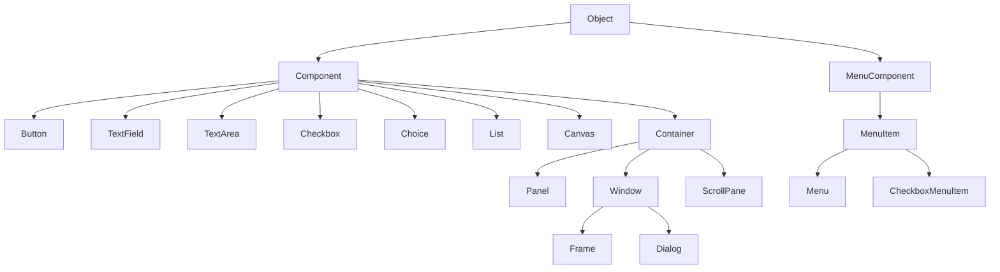
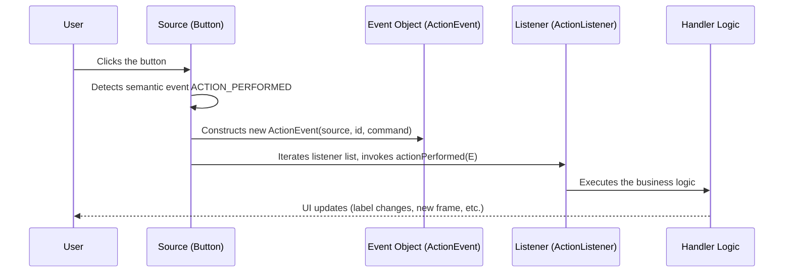
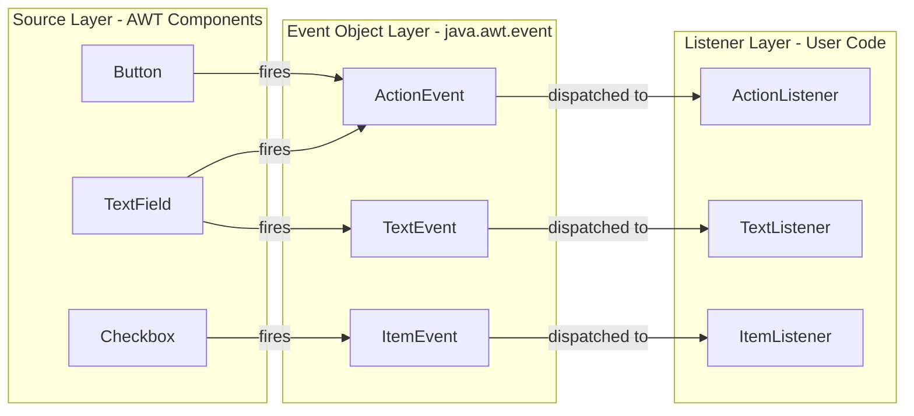
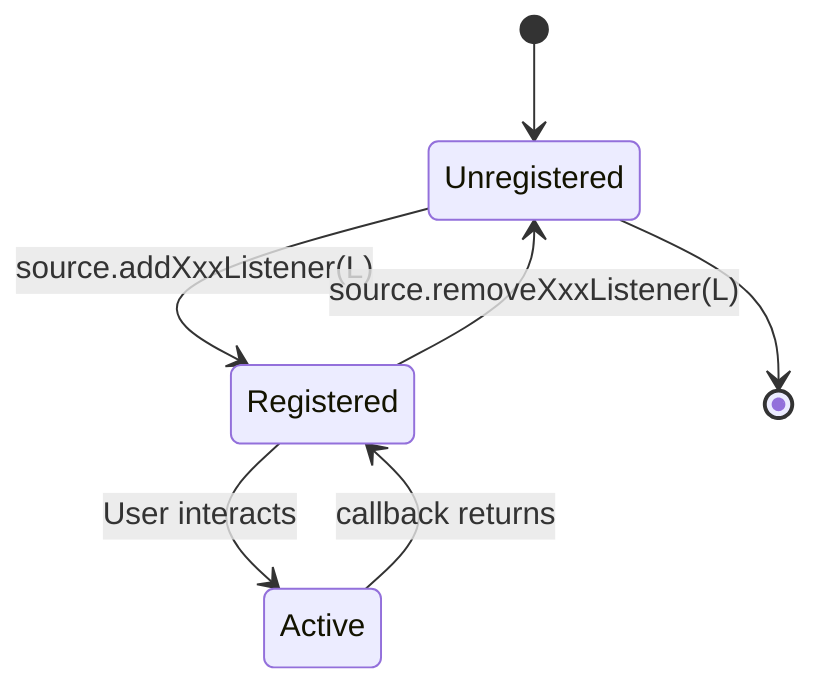

# Sources of Events

<!-- SECTION_1_START -->
# Sources of Events in Java

## 1. Core Technical Definition & Intuitive Overview

In the Java AWT (Abstract Window Toolkit) and Swing event-handling architecture, an **Event Source** is the GUI component (such as a `Button`, `TextField`, `Checkbox`, `MenuItem`, or `JButton`) that **generates an event** when the user interacts with it through the keyboard, mouse, or some other input device. Every event source maintains a *registry* of interested listeners and uses the **Event Delegation Model** to forward the event to the registered handler objects.

> [!IMPORTANT]
> **KTU Syllabus Highlight (Module 4 – Event Handling in OOP using Java):**
> The KTU 2024 Scheme (PBCST304) defines a *Source* as the **object that creates and triggers an event**. The three pillars of the delegation model are: **Source → Event Object → Listener**.

### Conceptual Analogy / Intuition

Think of an **Event Source** like a **doorbell at the entrance of a house**:
- The **doorbell (source)** does not know what to do when pressed — it just makes a sound and *notifies* whoever is registered (the homeowner, the guard, the neighbour).
- The **notification (event object)** carries the information: *"The doorbell at the main gate was pressed at 7:42 PM."*
- The **homeowner (listener)** has previously told the doorbell, *"Hey, I am interested in knowing when you are pressed."* This is done by **registering** a listener.

In Java terms:
- **Doorbell** → `Button` (Component)
- **Pressing action** → User click (triggers an `ActionEvent`)
- **Notification wrapper** → `ActionEvent` object
- **Homeowner** → `ActionListener` object (your code that handles the event)

> [!NOTE]
> **Key Distinction:** The source **does not perform** the response action. It merely *fires* (or "broadcasts") the event. This loose coupling is what makes the Event Delegation Model a beautiful application of the **Dependency Inversion Principle (DIP)** from SOLID — high-level policy (your handler) does not depend on low-level detail (which component fired the event).

### Physical Constants / Standard Metrics

- **Event Object class hierarchy root:** `java.util.EventObject` (top-level superclass for all Java events).
- **AWT Event root:** `java.awt.AWTEvent` extends `EventObject`.
- **Swing Event root:** `javax.swing.event.*` (mostly extends AWT events).
- **Listener interfaces:** All belong to the `java.awt.event` and `javax.swing.event` packages.
- **Default registration method naming convention:** `add<EventType>Listener(...)` and corresponding `remove<EventType>Listener(...)`.

> [!VISUALIZATION CONTROL]
> **Concept:** Event Delegation Flow (Source → Event → Listener)
> **Mermaid-style Flow Concept (mental picture):**
> ```
> USER CLICK  --->  [Button]  --generates-->  ActionEvent  --passes to-->  [MyListener]
>                       |                                                       |
>                  (Source)                                              (Handles logic)
> ```
> **Visual Description:** Picture a horizontal pipeline. On the far left is the user. A click travels into the Button (the source). The Button wraps that click inside an `ActionEvent` object and passes it along an arrow to the listener (your class implementing `ActionListener`), which executes the response. The source never directly knows what the listener does.

---

<!-- SECTION_1_END -->

<!-- SECTION_2_START -->
# 2. Deep Theoretical Analysis & KTU High-Yield Formula Sheet

## 2.1 The Three Pillars of the Event Delegation Model

Java's event-handling mechanism is built upon three primary participants. The KTU board examiner frequently asks you to *name* and *explain* the role of each.

| Pillar | Role | Concrete Example (Button click) |
|---|---|---|
| **Event Source** | The object on which the event initially occurred. Provides the methods to register/deregister listeners. | `Button b = new Button("Submit");` |
| **Event Object** | An instance of a subclass of `java.util.EventObject`. It encapsulates all relevant data (e.g., x/y coordinates, key code, source reference). | `ActionEvent ae = new ActionEvent(b, id, cmd);` |
| **Event Listener** | An object that implements a listener interface (e.g., `ActionListener`). It is *registered* with the source via the source's `addXxxListener()` method. | `b.addActionListener(this);` |

## 2.2 Anatomy of an Event Source

An event source, in practice, is any **java.awt.Component** (or **javax.swing.JComponent**) subclass that maintains an internal listener list. When the underlying AWT/Swing subsystem detects user activity on that component, it walks through the registered listener list and invokes the appropriate callback method on each listener.

### Internal Mechanics (What the JVM Does Behind the Scenes)

1. The user interacts with the component (e.g., mouse click).
2. The AWT event-dispatch thread (EDT) intercepts the low-level OS event and creates the high-level semantic event (e.g., `ActionEvent`).
3. The component's `processEvent()` method inspects the event ID and dispatches to the typed `process<Action>Event()` method.
4. That typed method then iterates through the **listener list** (stored internally in a `protected` field of the Component, often implemented as an `EventListener` array or `EventListenerProxy` chain).
5. For every registered listener, the appropriate callback (`actionPerformed`, `mouseClicked`, `keyPressed`, etc.) is invoked, passing the event object as an argument.

## 2.3 Categories of Event Sources

The KTU syllabus groups sources broadly as:

| Category | Class Examples | Event Types Generated |
|---|---|---|
| **Buttons & Menus** | `Button`, `JButton`, `MenuItem`, `JMenuItem` | `ActionEvent` |
| **Text Inputs** | `TextField`, `JTextField`, `TextArea` | `ActionEvent`, `TextEvent` |
| **Selection Controls** | `Checkbox`, `JRadioButton`, `JCheckBox`, `List` | `ItemEvent`, `ActionEvent` |
| **Containers** | `Frame`, `JFrame`, `Panel`, `Window` | `WindowEvent` |
| **Mouse-aware** | Any `Component` (mouse events are universal) | `MouseEvent` |
| **Keyboard-aware** | Any `Component` (focused) | `KeyEvent` |
| **Scroll** | `Scrollbar`, `JScrollBar`, `JScrollPane` | `AdjustmentEvent` |

## 2.4 KTU Formula Sheet / Cheat Sheet

> [!NOTE]
> The following table summarises every key formula, method signature, and listener interface you must memorise for the KTU 2024 University Examination on this topic.

| Concept / API | Exact Signature or Rule | Returns / Notes |
|---|---|---|
| **Event Object superclass** | `java.util.EventObject` | The root of all Java events |
| **Constructor of EventObject** | `EventObject(Object source)` | Stores reference to the source |
| **Method to retrieve source** | `EventObject.getSource()` | Returns `Object` (downcast as needed) |
| **AWT Event superclass** | `java.awt.AWTEvent` | `extends EventObject`, adds `int id` |
| **Listener registration pattern** | `source.addXxxListener(ListenerType l)` | Standard convention across AWT/Swing |
| **Listener deregistration pattern** | `source.removeXxxListener(ListenerType l)` | Symmetric to the add-method |
| **Action Listener callback** | `void actionPerformed(ActionEvent e)` | Invoked on `ActionEvent` dispatch |
| **Mouse Listener callbacks** | `mouseClicked`, `mousePressed`, `mouseReleased`, `mouseEntered`, `mouseExited` | All take `MouseEvent` |
| **Key Listener callbacks** | `keyTyped`, `keyPressed`, `keyReleased` | All take `KeyEvent` |
| **Item Listener callback** | `void itemStateChanged(ItemEvent e)` | For `ItemEvent` |
| **Window Listener callbacks** | `windowOpened`, `windowClosing`, `windowClosed`, `windowIconified`, `windowDeiconified`, `windowActivated`, `windowDeactivated` | 7 callbacks in `WindowListener` |
| **Listener as adapter** | `MouseAdapter`, `KeyAdapter`, `WindowAdapter` (abstract empty implementations) | Allows overriding only relevant methods |
| **Event dispatching method** | `Component.processEvent(AWTEvent e)` | Default delegation entry point |
| **Enabling events explicitly** | `enableEvents(long eventsToEnable)` | Bitmask — required if not registering listeners |
| **Mask for all AWT events** | `AWTEvent.MOUSE_EVENT_MASK` etc. | Used inside `enableEvents()` |

> [!IMPORTANT]
> **Mnemonic for KTU:** "*Every Source has **add** and **remove** twin methods.*" If a component generates `FooEvent`, it will *always* expose `addFooListener(FooListener l)` and `removeFooListener(FooListener l)`. This is a **contract** that the AWT/Swing API designers followed religiously.

## 2.5 Real-World Engineering Utility

The Event Delegation Model — and therefore the concept of *sources* — is foundational to:
- **GUI desktop applications** (Swing/JavaFX): every click, scroll, and keystroke is a sourced event.
- **Web frameworks** (e.g., Spring's `ApplicationEventPublisher`): mirrors the same source-listener pattern for backend event-driven systems.
- **Reactive programming** (RxJava, Reactor): generalises the concept to asynchronous data streams.
- **Android development:** Android's `View.OnClickListener` is a direct port of AWT's `ActionListener`; the `View` itself is the event source.

In production systems, this pattern enables **loose coupling** between the UI layer (the source) and the business logic layer (the listener) — a principle that is critical in MVC (Model-View-Controller) architectures, which is the **D** (Dependency Inversion) and **S** (Single Responsibility) of SOLID applied at the architectural level.

---

<!-- SECTION_2_END -->

<!-- SECTION_3_START -->
# 3. Step-by-Step Derivations & Code/Symbolic Implementation

## 3.1 End-to-End Working Example: A Complete Event Source Demonstration

The following program implements **all three pillars** of the Event Delegation Model so that you can clearly see what constitutes a *Source*, an *Event*, and a *Listener*.

```java
import java.awt.*;
import java.awt.event.*;

public class EventSourceDemo extends Frame implements ActionListener, WindowListener {
    // The Event SOURCES (declared as fields so listeners can register with them)
    private final TextField nameField;
    private final Button greetButton;
    private final Button clearButton;
    private final Label resultLabel;

    public EventSourceDemo() {
        // ---------- STEP 1: SET UP THE GUI (define the sources) ----------
        setTitle("Event Source Demonstration");
        setSize(420, 220);
        setLayout(new FlowLayout(FlowLayout.CENTER, 10, 10));

        Label prompt = new Label("Enter your name:");
        nameField = new TextField(20);              // <-- SOURCE #1: TextField
        greetButton = new Button("Greet");          // <-- SOURCE #2: Button
        clearButton = new Button("Clear");          // <-- SOURCE #3: Button
        resultLabel = new Label("Result will appear here.");

        add(prompt);
        add(nameField);
        add(greetButton);
        add(clearButton);
        add(resultLabel);

        // ---------- STEP 2: REGISTER LISTENERS WITH THE SOURCES ----------
        greetButton.addActionListener(this);        // source.addActionListener(listener)
        clearButton.addActionListener(this);        // same listener handles both
        nameField.addActionListener(this);          // pressing Enter in text field also fires
        this.addWindowListener(this);               // frame itself is a WindowEvent source

        // ---------- STEP 3: MAKE THE FRAME VISIBLE ----------
        setVisible(true);
    }

    // ---------- STEP 4: THE LISTENER CALLBACKS ----------
    @Override
    public void actionPerformed(ActionEvent e) {
        // Identify which source fired the event
        Object src = e.getSource();

        if (src == greetButton) {
            String name = nameField.getText().trim();
            if (name.isEmpty()) {
                resultLabel.setText("Please type a name first.");
            } else {
                resultLabel.setText("Hello, " + name + "!");
            }
        } else if (src == clearButton) {
            nameField.setText("");
            resultLabel.setText("Cleared.");
        } else if (src == nameField) {
            // Pressing Enter inside the text field triggers this branch
            greetButton.dispatchEvent(
                new ActionEvent(greetButton, ActionEvent.ACTION_PERFORMED, "Greet")
            );
        }
    }

    // WindowListener callbacks (only windowClosing is useful here)
    @Override public void windowOpened(WindowEvent e) { }
    @Override public void windowClosing(WindowEvent e) { dispose(); System.exit(0); }
    @Override public void windowClosed(WindowEvent e) { }
    @Override public void windowIconified(WindowEvent e) { }
    @Override public void windowDeiconified(WindowEvent e) { }
    @Override public void windowActivated(WindowEvent e) { }
    @Override public void windowDeactivated(WindowEvent e) { }

    // ---------- STEP 5: ENTRY POINT ----------
    public static void main(String[] args) {
        new EventSourceDemo();
    }
}
```

### Walkthrough of Every Line (Mapping Each to the Theory)

1. **Field declarations (`TextField`, `Button`, `Label`)** — These are the **event sources**. Each one, by virtue of inheriting from `java.awt.Component`, possesses the internal machinery to detect user interaction and dispatch typed events.
2. **`addActionListener(this)`** — This is the **registration** step. It tells the source: *"From now on, when you fire an `ActionEvent`, call back to the `actionPerformed` method of `this` object."* Internally, the source appends `this` to its listener list.
3. **`addWindowListener(this)`** — Even the `Frame` itself is a source of `WindowEvent`s. Registering here allows us to handle the user clicking the close button.
4. **`e.getSource()`** — Inside the callback, we **identify the source** by reference. This lets one listener serve multiple sources (a common KTU exam question).
5. **`greetButton.dispatchEvent(new ActionEvent(...))`** — Demonstrates **programmatic event firing** — a source can be told to *fire an event on itself*. This is how you can simulate a button click.

## 3.2 Symbolic Representation: The Delegation Equation

The Event Delegation Model can be expressed symbolically as:

$$
D(\text{Event}) \;=\; \text{dispatch}\big( \text{Source}, \text{EventListener}_{1..n} \big) \;=\; \big\{ \, \text{callback}_{i}(e) \;\mid\; i = 1 \dots n \,\big\}
$$

Where:
- $D(\text{Event})$ is the *event dispatching function*.
- $\text{Source}$ is the firing component holding a list $L = \{ \text{EventListener}_{1}, \text{EventListener}_{2}, \dots, \text{EventListener}_{n} \}$.
- $\text{callback}_{i}$ is the typed handler method defined in the listener interface (e.g., `actionPerformed`).

Each registration call performs:

$$
L \leftarrow L \cup \{ \text{newListener} \}
$$

And each deregistration call performs:

$$
L \leftarrow L \setminus \{ \text{oldListener} \}
$$

> [!IMPORTANT]
> **KTU Board Tip:** When asked *"How does a source know which listener to call?"* — answer: **The source maintains an internal listener list populated via `addXxxListener` calls; on event firing, the source iterates the list and invokes the appropriate callback on every listener in the order of registration.**

## 3.3 Adapters — A Shortcut for Listeners

If your class does not need to implement *all* the methods of an interface (e.g., `MouseListener` has 5 methods), you can extend the corresponding **adapter class** which provides empty default implementations. This is critical for KTU short-answer questions.

| Listener Interface | Adapter Class |
|---|---|
| `MouseListener` | `MouseAdapter` |
| `KeyListener` | `KeyAdapter` |
| `WindowListener` | `WindowAdapter` |
| `MouseMotionListener` | `MouseMotionAdapter` |
| `FocusListener` | `FocusAdapter` |

```java
// Using WindowAdapter instead of implementing WindowListener (cleaner)
public class MyFrame extends Frame {
    public MyFrame() {
        addWindowListener(new WindowAdapter() {
            @Override
            public void windowClosing(WindowEvent e) {
                dispose();
                System.exit(0);
            }
        });
    }
}
```

---

<!-- SECTION_3_END -->

<!-- SECTION_4_START -->
# 4. Structural Diagrams & Schematics

## 4.1 Class Hierarchy of Event Sources (AWT)



**Reading guide:** Every class on the right is an **event source**. Each has its own set of registered listeners (`addXxxListener` methods) inherited or defined within the AWT class hierarchy.

## 4.2 Event Delegation Flow — End-to-End



**Reading guide:** This sequence diagram maps exactly to the 5-step process described in Section 2.2. Notice that the source is the only entity that **knows about both the event and the listener list** — neither the user nor the listener needs to know about the other directly.

## 4.3 Block Architecture — Loose Coupling via the Delegation Model



**Reading guide:** This block diagram is the single most important figure for your KTU exam. The **Source Layer**, **Event Layer**, and **Listener Layer** are fully decoupled. The source does not know what logic will run; the listener does not know which component fired the event. The Event Object is the only piece of shared information — it is the *contract* between source and listener.

## 4.4 Registration & Deregistration Lifecycle



**Reading guide:** Every listener in the system moves through these states. The KTU exam often asks: *"What happens if you do not call `addXxxListener`?"* Answer: **The source will fire the event into the void — no callback will ever execute, and the user click is effectively ignored.**

---

<!-- SECTION_4_END -->

<!-- SECTION_5_START -->
# 5. KTU 2024 Scheme Examination Question Bank & Topic Recap

## 5.1 Part A — Short Answer Questions (3 Marks Each)

### Question 1: Define an Event Source. Give two examples.
**[KTU University Exam – July 2023 | CO2 | Remember]**

**Model Answer (3 Marks):**
> An **Event Source** is a GUI component (typically a subclass of `java.awt.Component` or `javax.swing.JComponent`) that *generates* an event in response to user interaction such as a mouse click, key press, or item selection, and notifies all registered listeners of that event. The source maintains an internal listener list and provides `addXxxListener()` and `removeXxxListener()` methods to manage registration.
>
> **Two examples:**
> 1. `java.awt.Button` — source of `ActionEvent` when clicked.
> 2. `java.awt.TextField` — source of `ActionEvent` when the user presses Enter inside it.
>
> *[Valid definition: 1 Mark | Source identification with example 1: 1 Mark | Second example: 1 Mark]*

### Question 2: Differentiate between Event Source and Event Listener.
**[KTU University Exam – Dec 2022 | CO2 | Understand]**

**Model Answer (3 Marks):**

| Aspect | Event Source | Event Listener |
|---|---|---|
| **Definition** | The component that *creates* the event. | The object that *receives and processes* the event. |
| **Role** | Fires the event into the listener list. | Implements the callback method (e.g., `actionPerformed`). |
| **Method** | Provides `addXxxListener()` to register listeners. | Implements the corresponding listener interface. |
| **Example** | `Button`, `TextField`, `Checkbox` | `ActionListener`, `ItemListener`, `KeyListener` |
> *[Correct distinction (1 Mark each for definition & role) + 1 Mark for example]*

---

## 5.2 Part B — Long Answer Questions (14 Marks Each)

> [!WARNING]
> **KTU Examiner's Valuation Warning / Pitfall Callout:**
> - **Never confuse** *Event Source* with *Event Object*. The source is the *generator* (e.g., a Button); the event object is the *carrier* of information (e.g., an `ActionEvent` instance). Examiners *will* deduct 2 marks if these are interchanged.
> - **Always state** that the source maintains a **listener list (registry)** and *iterates* it on event firing. A bare statement like *"the source calls the listener"* is incomplete.
> - **Always show the full method signature** of `addXxxListener` for the relevant event class — partial signatures cost marks.

### Question A: Explain the Event Delegation Model in Java. Identify and describe the role of Event Source, Event Object, and Event Listener with a suitable Java program. (14 Marks)
**[KTU University Exam – Dec 2023 | CO2, CO3 | Understand, Apply]**

**Model Solution:**

#### (a) Theoretical Explanation of the Event Delegation Model (7 Marks)

The **Event Delegation Model** is the standard mechanism introduced in JDK 1.1 to handle events in AWT/Swing. It is based on the principle that *the source of an event delegates the responsibility of handling that event to a registered object* (the listener), rather than handling it itself.

**Three participants:**

1. **Event Source:** The component (e.g., `Button`, `TextField`) that *generates* the event. It exposes registration methods like `addActionListener()`. *[2 Marks]*

2. **Event Object:** A subclass of `java.util.EventObject` that *encapsulates* the event details — source reference, event ID, timestamp, coordinates (for mouse events), key code (for keyboard events), etc. *[2 Marks]*

3. **Event Listener:** An object that *implements* a listener interface (`ActionListener`, `MouseListener`, etc.) and provides the callback method (`actionPerformed`, `mouseClicked`, etc.). *[2 Marks]*

**Flow of the model:** When a user interacts with the source, the AWT event-dispatch thread detects the OS event, creates the appropriate high-level event object, and the source iterates its listener list, invoking the callback on each listener. *[1 Mark]*

> **Valuation Key Points:** *Naming all three participants: 2 Marks | Correct role of each: 3 Marks (1 Mark each) | Explaining the flow: 2 Marks.*

#### (b) Java Program Demonstrating All Three (7 Marks)

```java
import java.awt.*;
import java.awt.event.*;

public class DelegationDemo extends Frame implements ActionListener {
    private final TextField input;
    private final Button submit;
    private final Label output;

    public DelegationDemo() {
        setLayout(new FlowLayout());
        setSize(350, 150);
        setTitle("Delegation Model Demo");

        input  = new TextField(20);     // SOURCE
        submit = new Button("Submit");  // SOURCE
        output = new Label("Output here.");

        add(input); add(submit); add(output);

        // REGISTRATION — source delegates event to listener (this object)
        submit.addActionListener(this);
        input.addActionListener(this);

        setVisible(true);
    }

    @Override
    public void actionPerformed(ActionEvent e) {   // CALLBACK (Listener)
        // EVENT OBJECT is the parameter `e`
        Object src = e.getSource();
        if (src == submit) {
            output.setText("Submitted: " + input.getText());
        } else if (src == input) {
            output.setText("You pressed Enter. Text = " + input.getText());
        }
    }

    public static void main(String[] args) {
        new DelegationDemo();
    }
}
```

**Mapping to the theory:**
- *Sources*: `input` (TextField) and `submit` (Button) — `[Identifying sources correctly: 1 Mark]`
- *Event Object*: the `ActionEvent e` parameter — `[Identifying the event object: 1 Mark]`
- *Listener*: the `DelegationDemo` class implements `ActionListener` and overrides `actionPerformed` — `[Listener implementation: 1 Mark]`
- *Registration*: `submit.addActionListener(this)` and `input.addActionListener(this)` — `[Registration call: 1 Mark]`
- *Correct flow inside callback*: distinguishing which source fired using `e.getSource()` — `[Callback logic: 1 Mark]`
- *Code compiles and is syntactically correct* — `[Working program: 1 Mark]`

> **Total sub-part (b): 7 Marks.**

---

### Question B: What are the different categories of event sources in AWT? Explain any two event sources with their respective listener interfaces and event classes. Write a Java program to demonstrate event handling for a TextField and a Button. (14 Marks)
**[KTU University Exam – July 2024 | CO2, CO4 | Understand, Apply]**

**Model Solution:**

#### (a) Categories of Event Sources and Two Examples (7 Marks)

AWT components can be grouped into the following categories of event sources:

| Category | Source Class | Event Class | Listener Interface |
|---|---|---|---|
| **Command buttons** | `Button` | `ActionEvent` | `ActionListener` |
| **Text inputs** | `TextField`, `TextArea` | `ActionEvent`, `TextEvent` | `ActionListener`, `TextListener` |
| **Selection controls** | `Checkbox`, `Choice`, `List` | `ItemEvent` | `ItemListener` |
| **Containers / windows** | `Frame`, `Dialog`, `Window` | `WindowEvent` | `WindowListener` |
| **Mouse-aware** | Any `Component` | `MouseEvent` | `MouseListener` |
| **Keyboard-aware** | Any `Component` | `KeyEvent` | `KeyListener` |
| **Scroll bars** | `Scrollbar` | `AdjustmentEvent` | `AdjustmentListener` |

> *[Categories list with mapping: 3 Marks]*

**Detailed explanation of two sources:**

**1. Button (Source of `ActionEvent`):**  
The `Button` is the most common event source. When the user clicks it, an `ActionEvent` is generated. The corresponding listener interface is `ActionListener`, which has a single callback: `void actionPerformed(ActionEvent e)`. The class `EventObject` is the root; `ActionEvent` extends `AWTEvent` which extends `EventObject`. *[2 Marks]*

**2. TextField (Source of `ActionEvent` and `TextEvent`):**  
A `TextField` is both a source of `ActionEvent` (when the user presses **Enter** inside it) and `TextEvent` (whenever the text content changes). The two relevant listener interfaces are `ActionListener` and `TextListener`, the latter having the callback `void textValueChanged(TextEvent e)`. *[2 Marks]*

> **Valuation Key Points:** *Categories table: 3 Marks | Detailed explanation: 4 Marks (2 Marks each).*

#### (b) Java Program — TextField + Button Event Handling (7 Marks)

```java
import java.awt.*;
import java.awt.event.*;

public class SourceDemo extends Frame implements ActionListener {
    private final TextField cityField;
    private final Button showButton;
    private final Label display;

    public SourceDemo() {
        setLayout(new FlowLayout(FlowLayout.LEFT, 10, 15));
        setSize(400, 180);
        setTitle("Source Demo - TextField & Button");

        Label prompt = new Label("City:");
        cityField = new TextField(25);          // SOURCE 1
        showButton = new Button("Display");     // SOURCE 2
        display = new Label("(no city selected)");

        add(prompt);
        add(cityField);
        add(showButton);
        add(display);

        // Registration of listeners with sources
        showButton.addActionListener(this);
        cityField.addActionListener(this);

        setVisible(true);
    }

    @Override
    public void actionPerformed(ActionEvent e) {
        // Identify the source and act accordingly
        if (e.getSource() == showButton) {
            String city = cityField.getText();
            if (city == null || city.trim().isEmpty()) {
                display.setText("Please enter a city first.");
            } else {
                display.setText("You selected: " + city.toUpperCase());
            }
        } else if (e.getSource() == cityField) {
            // Pressing Enter inside the text field
            display.setText("(Pressing Display is recommended) Got: " + cityField.getText());
        }
    }

    public static void main(String[] args) {
        new SourceDemo();
    }
}
```

**Valuation key for sub-part (b):**
- *Declaring TextField and Button as sources: 1 Mark* `[Source identification: 1 Mark]`
- *Implementing ActionListener interface: 1 Mark* `[Listener interface implementation: 1 Mark]`
- *Registering listeners via `addActionListener`: 1 Mark* `[Registration call: 1 Mark]`
- *Identifying the firing source with `e.getSource()`: 1 Mark* `[Source identification inside callback: 1 Mark]`
- *Appropriate business logic in the callback: 1 Mark* `[Logic: 1 Mark]`
- *Main method and proper GUI setup: 1 Mark* `[Working driver: 1 Mark]`
- *Correct imports and proper closure: 1 Mark* `[Compilation-ready code: 1 Mark]`

> **Total sub-part (b): 7 Marks.**

---

## 5.3 Topic Recap & Important Things to Remember

> [!IMPORTANT]
> Use this as your **final 5-minute revision checklist** before the KTU 2024 OOP exam.

- **Event Source** = the GUI component that **generates** an event. It is the *originator*, not the *handler*.
- **Event Delegation Model** has **exactly three participants**: Source, Event Object, and Listener.
- The **source maintains a listener list** (sometimes called the *event listener registry*). Without registration, no callback ever fires.
- The **registration methods** follow a strict naming convention: `add<EventType>Listener(ListenerType l)` and `remove<EventType>Listener(ListenerType l)`.
- **Event Object** is a subclass of `java.util.EventObject`. Always use `e.getSource()` to identify which component fired the event when one listener serves multiple sources.
- **AWT events** are rooted at `java.awt.AWTEvent extends java.util.EventObject`. **Swing events** are rooted at `javax.swing.event.*` and often extend AWT events.
- The **listener interface** defines the callback signature; the **adapter class** (e.g., `WindowAdapter`, `MouseAdapter`) provides empty default implementations to avoid overriding every method.
- For each common source:
  - `Button` → `ActionEvent` → `ActionListener.actionPerformed`
  - `TextField` → `ActionEvent` + `TextEvent` → `ActionListener` + `TextListener`
  - `Checkbox` → `ItemEvent` → `ItemListener.itemStateChanged`
  - `Frame` / `Window` → `WindowEvent` → `WindowListener` (7 methods)
  - `Scrollbar` → `AdjustmentEvent` → `AdjustmentListener`
- The **Event Dispatch Thread (EDT)** is the dedicated AWT thread that detects low-level OS events and dispatches them to high-level listeners.
- A source can **fire an event programmatically** by calling `component.dispatchEvent(new ActionEvent(...))`. This is useful for unit-testing event handling logic.
- **Decoupling** is the architectural advantage: source ≠ listener, enabling the **MVC** pattern and adhering to **SOLID's Dependency Inversion Principle**.
- The KTU exam loves the phrase: *"A source delegates the event to the registered listener."* Memorise this wording.
- **Common pitfall:** Saying "the listener fires the event" — it is the *source* that fires; the *listener* only **handles** it. Examiners penalise this reversal.
- **The lone exception:** `EventObject` is in `java.util`, *not* `java.awt`. Remember the package difference — it appears frequently in "fill in the blank" questions.
- **Order of listener invocation** is generally the order of registration (FIFO), but the API does not strictly guarantee this — never rely on it for business logic.

<!-- SECTION_5_END -->
