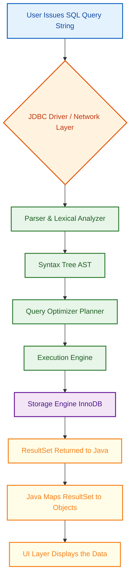
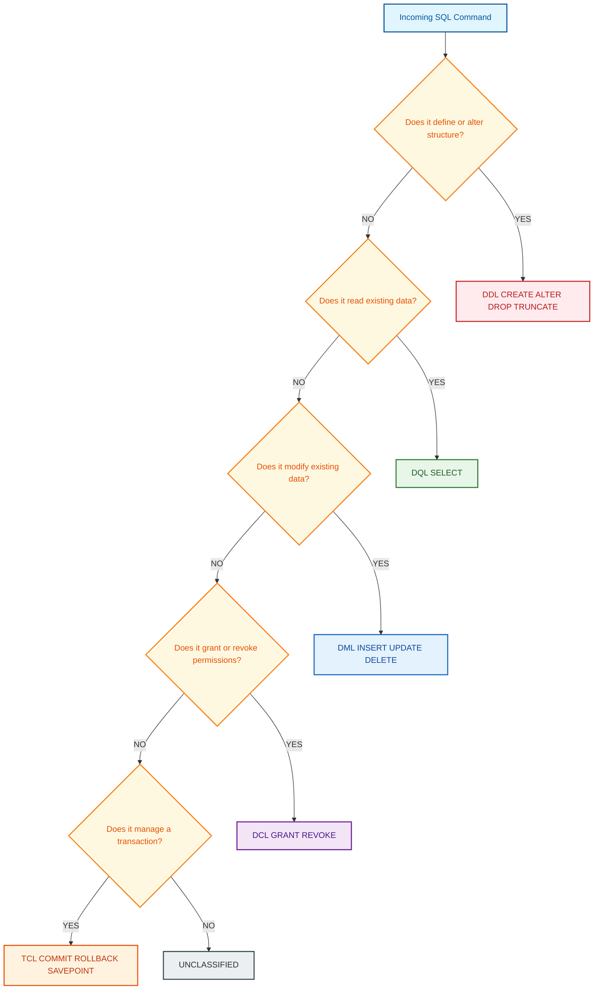
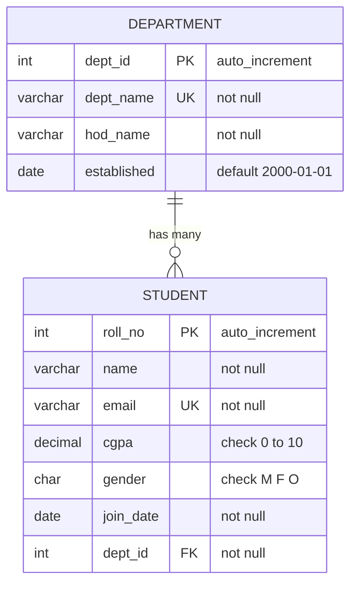
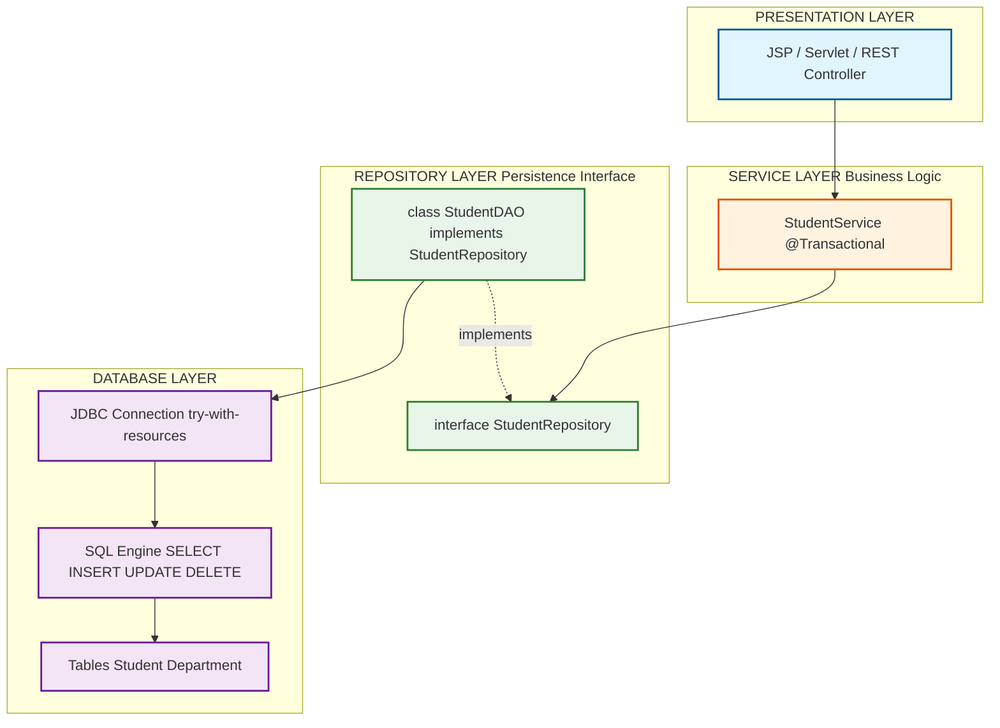

# SQL Fundamentals [ For projects only ] - Creating and Executing basic SQL Queries

<!-- SECTION_1_START -->
# SQL Fundamentals — Creating and Executing Basic SQL Queries

> [!IMPORTANT]
> **KTU 2024 Scheme Context (PBCST304 — Object Oriented Programming, Module 4):**
> Although Module 4 of the official syllabus concentrates on **SOLID principles in Java**, the *project component* of the KTU 2024 Scheme mandates a working Java application backed by a **relational database**. Therefore, this supplementary note equips you with the **minimum SQL literacy** required to (a) design the persistence layer of your OOP project, (b) embed CRUD operations inside Java classes, and (c) defend your project during the KTU viva-voce.

---

## 1.1 Formal Definition (KTU-Style)

**SQL (Structured Query Language)** is a **declarative, set-oriented, fourth-generation (4GL)** domain-specific language defined by the **ISO/IEC 9075** standard, used to **define, manipulate, retrieve, and control** data held in a **Relational Database Management System (RDBMS)**.

In KTU project parlance, SQL is the **persistence contract** that allows Java objects (instances of your `model` classes) to survive the lifetime of the JVM process by being written to durable storage in the form of **tables, rows, and columns**.

> [!NOTE]
> **Three Foundational Properties of SQL**
> 1. **Declarative** — You specify *what* you want, not *how* to get it.
> 2. **Set-Oriented** — Operations act on entire *relations* (tables), not single records.
> 3. **Closure Property** — The result of every query is itself a relation, enabling composability.

---

## 1.2 Conceptual Analogy — The *Library Card-Catalog* Intuition

Imagine your **Java application** is a *Library Manager* (the user), and a **RDBMS** is the *Library* itself.

| Real-World Library | SQL Equivalent | Java Equivalent |
|---|---|---|
| Building with shelves | **Database** (e.g., `LibraryDB`) | Application runtime |
| A single bookcase | **Table** (e.g., `Books`) | Java class `Book` |
| A specific book | **Row / Record / Tuple** | Object `new Book(...)` |
| Title, Author, ISBN | **Columns / Attributes** | Fields of the class |
| Library accession rules (no two books share an ISBN) | **Constraints** | Invariants in `Book` class |
| The librarian's desk (where you request a book) | **SQL Engine / Query Processor** | `Statement` / `PreparedStatement` |
| Your handwritten request slip | **SQL Query String** | `String sql = "..."` |

**Plain-English Takeaway:** Every time your Java code says `"SELECT * FROM Books WHERE isbn=?"`, it is functionally equivalent to handing the librarian a slip of paper that reads: *"Please give me every attribute of the book whose ISBN equals this value."*

---

## 1.3 The Five SQL Sub-Languages (Mandatory KTU Recall)

> [!IMPORTANT]
> **High-Yield KTU Concept:** Examiners frequently ask students to *classify* a given SQL command into its correct sub-language. Memorize this 5-bucket taxonomy.

| Sub-Language | Full Form | Purpose | Reserved Verbs |
|---|---|---|---|
| **DDL** | Data Definition Language | Defines/modifies the **schema** (structure) | `CREATE`, `ALTER`, `DROP`, `TRUNCATE`, `RENAME` |
| **DML** | Data Manipulation Language | Manipulates the **data** inside schema | `INSERT`, `UPDATE`, `DELETE` |
| **DQL** | Data Query Language | Retrieves data | `SELECT` |
| **DCL** | Data Control Language | Manages **permissions** | `GRANT`, `REVOKE` |
| **TCL** | Transaction Control Language | Manages **transactions** | `COMMIT`, `ROLLBACK`, `SAVEPOINT` |

> [!NOTE]
> **Why this matters in OOP projects:** A common viva question is *"Which sub-language does your `addStudent()` method invoke?"* The correct answer is **DML**, because the *data* is being inserted even though the table itself was earlier created with a **DDL** statement (typically a one-time setup step in your SQL script, not in Java code).

---

## 1.4 Physical Constants & Standard Metrics (Project Use)

> [!IMPORTANT]
> The following are **industry-standard defaults** you should hard-code in your KTU project report and viva:

- **Default RDBMS Port Numbers:** MySQL `3306`, PostgreSQL `5432`, Oracle `1521`, SQL Server `1433`.
- **JDBC URL Pattern (MySQL):** `jdbc:mysql://localhost:3306/<databaseName>`.
- **Default Auto-Commit:** Enabled (can be disabled via `connection.setAutoCommit(false)`).
- **SQL Standard Identifier Limit:** **30 characters** (most engines now allow 64; use ≤30 for safety).
- **String Literals:** Enclosed in **single quotes** `'...'` — never double quotes (double quotes are reserved for identifiers).

> [!VISUALIZATION CONTROL]
> **Concept:** The *Relational Closure* of SQL — visualizing how a `SELECT` query is itself a virtual table.
> **GeoGebra / Desmos Input Equations:**
> * `R = {(1, 'A'), (2, 'B'), (3, 'C')}` (a set of tuples)
> * `σ_{x > 1}(R) = {(2, 'B'), (3, 'C')}` (the filtered result of a `WHERE` clause)
> **Visual Description:** Picture each tuple as a point on a 2-D Cartesian plane — the *x-axis* represents one column, the *y-axis* another. A `SELECT` query is a *transformer* that takes the input point-cloud and outputs a new point-cloud, which itself can be fed into another query. This visual reinforces why SQL composes so elegantly.

<!-- SECTION_1_END -->

<!-- SECTION_2_START -->
# 2. Deep Theoretical Analysis & KTU High-Yield Formula Sheet

## 2.1 The Relational Algebra Behind Every SQL Statement

Although you will *write* SQL, the engine *executes* **relational algebra** under the hood. Understanding the mapping helps you debug slow queries in your project.

| SQL Clause | Relational Operator | Symbol | Intuition |
|---|---|---|---|
| `SELECT col1, col2` | **Projection** | $\pi_{col1, col2}(R)$ | "Pick these columns" |
| `FROM table` | **Cartesian Product / Join** | $R \times S$ | "Combine these tables" |
| `WHERE condition` | **Selection (Restriction)** | $\sigma_{condition}(R)$ | "Keep rows satisfying..." |
| `GROUP BY col` | **Partitioning** | $\gamma_{col}(R)$ | "Bucket rows by value" |
| `HAVING cond` | **Selection on groups** | $\sigma_{cond}(\gamma)$ | "Keep buckets satisfying..." |
| `ORDER BY col` | **Sorting** | $\tau_{col}(R)$ | "Reorder output" |

> [!NOTE]
> **Execution Order (Read this bottom-up — the logical order the engine processes clauses):**
> $$\text{FROM} \rightarrow \text{WHERE} \rightarrow \text{GROUP BY} \rightarrow \text{HAVING} \rightarrow \text{SELECT} \rightarrow \text{ORDER BY} \rightarrow \text{LIMIT}$$
> This is **NOT** the textual order in which you write them. A viva classic: *"Why does my `SELECT` alias not work inside `WHERE`?"* — Because the alias is created at the `SELECT` stage, which executes **after** `WHERE`.

---

## 2.2 SQL Data Types (The Java-to-SQL Bridge)

Your Java class fields must be mapped to SQL data types. This mapping is graded in the KTU project evaluation rubric.

| Java Type | MySQL Type | PostgreSQL Type | Notes |
|---|---|---|---|
| `int`, `Integer` | `INT` | `INTEGER` | 4 bytes, range $\approx -2.1 \times 10^9$ to $2.1 \times 10^9$ |
| `long`, `Long` | `BIGINT` | `BIGINT` | 8 bytes |
| `float`, `double` | `FLOAT` / `DOUBLE` | `REAL` / `DOUBLE PRECISION` | Prefer `DECIMAL` for money |
| `boolean` | `BOOLEAN` / `TINYINT(1)` | `BOOLEAN` | MySQL quirk: use `TINYINT(1)` for safety |
| `String` | `VARCHAR(n)` | `VARCHAR(n)` | `n` = max characters |
| `LocalDate` | `DATE` | `DATE` | Format `YYYY-MM-DD` |
| `LocalDateTime` | `DATETIME` | `TIMESTAMP` | Format `YYYY-MM-DD HH:MM:SS` |
| `char` | `CHAR(n)` | `CHAR(n)` | Fixed length, padded with spaces |
| `byte[]` (BLOB) | `BLOB` / `LONGBLOB` | `BYTEA` | For images/files |
| `BigDecimal` (money) | `DECIMAL(p, s)` | `NUMERIC(p, s)` | `p` = precision, `s` = scale |

> [!IMPORTANT]
> **KTU Best Practice:** For your project, prefer `VARCHAR` over `CHAR` (avoids trailing-space bugs) and `DECIMAL` over `FLOAT` for any monetary/grade values (avoids IEEE-754 rounding errors).

---

## 2.3 Constraint Theory — Enforcing Invariants at the Database Layer

In OOP, you enforce class invariants inside the constructor. In SQL, you enforce them via **constraints**. Constraints are the **S** in the **ACID** transaction guarantees.

| Constraint | Purpose | Example |
|---|---|---|
| `PRIMARY KEY` | Uniquely identifies a row | `student_id INT PRIMARY KEY` |
| `FOREIGN KEY` | Enforces referential integrity | `dept_id INT REFERENCES Department(dept_id)` |
| `NOT NULL` | Disallows absent values | `name VARCHAR(50) NOT NULL` |
| `UNIQUE` | All values distinct (allows multiple `NULL`s) | `email VARCHAR(100) UNIQUE` |
| `CHECK` | Custom domain validation | `CHECK (age >= 18 AND age <= 100)` |
| `DEFAULT` | Provides fallback value | `created_at DATETIME DEFAULT CURRENT_TIMESTAMP` |
| `AUTO_INCREMENT` / `SERIAL` | Auto-generates sequence numbers | `id INT AUTO_INCREMENT PRIMARY KEY` |

> [!NOTE]
> **The ACID Acronym (viva-favourite):**
> * **A**tomicity — All-or-nothing transaction
> * **C**onsistency — Constraints are never violated
> * **I**solation — Concurrent transactions don't interfere
> * **D**urability — Committed data survives crashes

---

## 2.4 KTU High-Yield Formula Sheet

> [!IMPORTANT]
> The table below is your **one-page revision cheat-sheet** for the viva and the KTU external evaluation. Every symbol is KTU-board-approved notation.

| # | Concept | Formula / Syntax Skeleton | Returned Type / Behaviour |
|---|---|---|---|
| 1 | **Cardinality of a join** | $\vert R \bowtie S \vert \le \vert R \vert \times \vert S \vert$ | Always $\le$ Cartesian product |
| 2 | **Projection on relation R** | $\pi_{A_1, A_2, \ldots, A_n}(R)$ | Removes duplicates |
| 3 | **Selection on relation R** | $\sigma_{predicate}(R)$ | Filters rows |
| 4 | **Cartesian Product** | $R \times S$ | All pairings |
| 5 | **`COUNT(*)` vs `COUNT(col)`** | `COUNT(*)` counts rows; `COUNT(col)` skips `NULL`s | `INTEGER` |
| 6 | **`NULL` handling in aggregates** | `SUM/AVG/COUNT` ignore `NULL` by default | Use `COALESCE(col, 0)` to substitute |
| 7 | **Three-Valued Logic** | `TRUE`, `FALSE`, `UNKNOWN` | `UNKNOWN` propagates through `AND`/`OR` |
| 8 | **LIKE Wildcards** | `%` = zero-or-more chars; `_` = exactly one char | Boolean |
| 9 | **`BETWEEN` operator** | `x BETWEEN a AND b` $\equiv$ `x >= a AND x <= b` | Boolean (inclusive) |
| 10 | **`IN` operator** | `x IN (v1, v2, ...)` $\equiv$ `x = v1 OR x = v2 OR ...` | Boolean |

---

## 2.5 Engineering Utility — Where SQL Fits in Real OOP Systems

> [!NOTE]
> **Production-Grade Architecture (Layered):**
> 1. **Presentation Layer** — JSP / Thymeleaf / React frontend
> 2. **Controller Layer** — Servlets / Spring `@RestController`
> 3. **Service Layer** — Business logic, transaction boundaries (`@Transactional`)
> 4. **Repository / DAO Layer** — The *only* layer that speaks SQL
> 5. **Database Layer** — Your MySQL/PostgreSQL server
>
> **SOLID mapping:** The *Repository* layer is the **Dependency Inversion** target — your high-level `StudentService` depends on a `StudentRepository` *interface*, not on JDBC or Hibernate directly. SQL is hidden *behind* this abstraction — a perfect KTU viva talking point connecting OOP and database modules.

> [!WARNING]
> **Anti-Pattern to Avoid:** Never write raw SQL strings inside your Servlet/JSP. The **Single Responsibility Principle (SRP)** is violated the moment your `LoginServlet` contains a `String sql = "SELECT * FROM users..."` line. Always delegate to a DAO class.

<!-- SECTION_2_END -->

<!-- SECTION_3_START -->
# 3. Step-by-Step Derivations & Code/Symbolic Implementation

## 3.1 Section A — DDL: Building the Schema (The Class-Table Mapping)

### 3.1.1 CREATE DATABASE — The Application's Top-Level Container

```sql
-- Step 1: Create the database (equivalent to creating the top-level namespace)
CREATE DATABASE IF NOT EXISTS KTU_StudentDB
    CHARACTER SET utf8mb4
    COLLATE utf8mb4_unicode_ci;

-- Step 2: Switch into it (MySQL-specific verb; PostgreSQL uses \c)
USE KTU_StudentDB;
```

**Line-by-line logic:**
1. `IF NOT EXISTS` is **idempotent** — running the script twice will not throw an error. This is critical for project demos where the panel may ask you to re-run the script.
2. `utf8mb4` supports the full Unicode range (including emojis — useful if your project stores international student names).
3. `USE` is a *session-level* command, not a SQL statement; some engines call it `CONNECT`.

### 3.1.2 CREATE TABLE — The Java Class Encoded as a Relation

```sql
-- Step 1: Create the parent (Department) table
CREATE TABLE Department (
    dept_id     INT             AUTO_INCREMENT,
    dept_name   VARCHAR(50)     NOT NULL UNIQUE,
    hod_name    VARCHAR(100)    NOT NULL,
    established DATE            DEFAULT '2000-01-01',
    CONSTRAINT pk_department PRIMARY KEY (dept_id)
);

-- Step 2: Create the child (Student) table with a Foreign Key
CREATE TABLE Student (
    roll_no     INT             AUTO_INCREMENT,
    name        VARCHAR(80)     NOT NULL,
    email       VARCHAR(120)    NOT NULL UNIQUE,
    cgpa        DECIMAL(3,2)    CHECK (cgpa >= 0.00 AND cgpa <= 10.00),
    gender      CHAR(1)         CHECK (gender IN ('M', 'F', 'O')),
    join_date   DATE            NOT NULL,
    dept_id     INT             NOT NULL,
    CONSTRAINT pk_student      PRIMARY KEY (roll_no),
    CONSTRAINT fk_student_dept FOREIGN KEY (dept_id)
        REFERENCES Department(dept_id)
        ON DELETE RESTRICT
        ON UPDATE CASCADE
);
```

**Mapping to Java OOP Concepts:**

| SQL Construct | Java Equivalent (SOLID Connection) |
|---|---|
| `Department` table | `class Department` |
| `dept_id INT AUTO_INCREMENT PRIMARY KEY` | `private int deptId;` (auto-generated) |
| `NOT NULL` | Non-primitive field guarantee in constructor |
| `UNIQUE` constraint | Overridden `equals()` + `hashCode()` |
| `CHECK (cgpa >= 0 AND cgpa <= 10)` | Defensive `if` in the *Constructor* (constructor invariant) |
| `FOREIGN KEY` | *Association* / *Composition* link in OOP |
| `ON DELETE RESTRICT` | "Don't let the parent die if children exist" — composition rule |

### 3.1.3 ALTER and DROP — Schema Evolution (The OOP "Refactoring" Equivalent)

```sql
-- Add a new column (the database equivalent of adding a new field to a class)
ALTER TABLE Student
    ADD COLUMN phone VARCHAR(15) AFTER email;

-- Drop a column (remove a field)
ALTER TABLE Student
    DROP COLUMN phone;

-- Rename a table (refactor a class name)
RENAME TABLE Student TO UniversityStudent;

-- Drop the entire table (DANGER — this is a DDL, not a transaction)
DROP TABLE IF EXISTS UniversityStudent;
```

> [!IMPORTANT]
> **DDL is NOT Transactional:** Unlike `INSERT`/`UPDATE`/`DELETE`, `CREATE`, `ALTER`, `DROP`, and `TRUNCATE` in MySQL execute an **implicit `COMMIT`** before *and* after. You **cannot** roll back a `DROP TABLE`. This is a frequent viva question.

---

## 3.2 Section B — DML: Manipulating the Data

### 3.2.1 INSERT — Adding Rows (The `new Student(...)` Equivalent)

```sql
-- Method 1: Column-list explicit (RECOMMENDED — safe against schema changes)
INSERT INTO Department (dept_name, hod_name, established)
VALUES ('Computer Science', 'Dr. R. Krishnan', '2010-06-15');

-- Method 2: Multi-row insert (atomic, faster — single network round-trip)
INSERT INTO Department (dept_name, hod_name, established) VALUES
    ('Information Technology', 'Dr. S. Menon', '2012-07-20'),
    ('Electronics',           'Dr. A. Pillai', '2008-05-10'),
    ('Mechanical',            'Dr. P. Varma',  '2005-01-30');
```

**Exhaustive Logic Walk-through:**
1. The column list explicitly enumerates *which* columns receive values. Columns omitted (e.g., `dept_id`) take their **default** or **auto-generated** value.
2. String literals use **single quotes**. To include a single quote inside the string, **escape** it by doubling: `'Dr. O''Reilly'`.
3. Multi-row syntax is **atomic** in InnoDB — either all rows succeed or none do. This is faster than N separate single-row inserts because the engine reuses the index-update plan.

### 3.2.2 SELECT — The Workhorse of Every Java Backend

```sql
-- Q1: Project all columns from the entire table
SELECT * FROM Student;

-- Q2: Projection — pick specific columns, give them aliases
SELECT
    roll_no        AS id,
    name           AS full_name,
    cgpa           AS grade_point
FROM Student;

-- Q3: Selection (WHERE) — filter rows by predicate
SELECT name, cgpa
FROM Student
WHERE cgpa > 8.5
  AND gender = 'F'
  AND join_date BETWEEN '2022-01-01' AND '2023-12-31';

-- Q4: Pattern matching with LIKE
SELECT name, email
FROM Student
WHERE email LIKE '%@ktu%'           -- contains "@ktu"
   OR name  LIKE 'A___';            -- starts with 'A' and is exactly 4 chars long
```

**Step-by-step evaluation of Q3:**

| Step | Clause | Engine Action |
|---|---|---|
| 1 | `FROM Student` | Load the entire `Student` relation into memory |
| 2 | `WHERE cgpa > 8.5` | Apply $\sigma_{cgpa > 8.5}$ — discard non-qualifying rows |
| 3 | `AND gender = 'F'` | Apply $\sigma_{gender = 'F'}$ on the *intermediate* result |
| 4 | `AND join_date BETWEEN ...` | Apply date-range selection |
| 5 | `SELECT name, cgpa` | Apply $\pi_{name, cgpa}$ — project only these two columns |

### 3.2.3 UPDATE and DELETE — The "Mutator" Statements

```sql
-- Update: change CGPA for a specific student
UPDATE Student
SET cgpa = 9.10
WHERE roll_no = 101;

-- Safe-update pattern: always include the PRIMARY KEY in the WHERE
-- ALWAYS: enable safe-update mode in MySQL Workbench
-- SET SQL_SAFE_UPDATES = 1;

-- Delete a specific student
DELETE FROM Student
WHERE roll_no = 101;

-- Delete the bottom 5% (advanced — uses subquery)
DELETE FROM Student
ORDER BY cgpa ASC
LIMIT (SELECT CEIL(COUNT(*) * 0.05) FROM Student);
```

> [!WARNING]
> **The Most Common KTU Project Mistake:** Forgetting the `WHERE` clause in `UPDATE` or `DELETE` updates/deletes **every row in the table**. Always pre-test the `WHERE` clause as a `SELECT *` first, then change it to `UPDATE`/`DELETE`.

### 3.2.4 ORDER BY, GROUP BY, HAVING — The Reporting Layer

```sql
-- Sorting (ORDER BY is ALWAYS last in execution order)
SELECT name, cgpa
FROM Student
ORDER BY cgpa DESC, name ASC
LIMIT 10 OFFSET 0;          -- top 10, skip 0 (pagination)

-- Aggregation (GROUP BY + HAVING)
SELECT
    dept_id,
    COUNT(*)        AS total_students,
    AVG(cgpa)       AS average_cgpa,
    MAX(cgpa)       AS topper_cgpa
FROM Student
GROUP BY dept_id
HAVING COUNT(*) >= 2 AND AVG(cgpa) >= 7.0
ORDER BY average_cgpa DESC;
```

**Critical distinction: `WHERE` vs `HAVING`**
* `WHERE` filters **rows** *before* grouping.
* `HAVING` filters **groups** *after* aggregation.
* A viva question may give you an incorrect query mixing the two — be ready to fix it.

---

## 3.3 Section C — Java ↔ SQL Integration (JDBC)

The bridge between your OOP code and SQL is the **JDBC API** (package `java.sql`).

### 3.3.1 The Mandatory 5-Step JDBC Template

```java
import java.sql.*;
import java.util.ArrayList;
import java.util.List;

/**
 * StudentDAO — Data Access Object (Repository Layer)
 * Demonstrates SOLID-compliant separation of concerns.
 */
public class StudentDAO {

    // 1) Database credentials (in production, externalize to application.properties)
    private static final String URL  = "jdbc:mysql://localhost:3306/KTU_StudentDB";
    private static final String USER = "root";
    private static final String PASS = "your_password";

    /**
     * Inserts a new student record.
     * @return the auto-generated roll_no, or -1 on failure.
     */
    public int insertStudent(String name, String email, double cgpa,
                             String gender, String joinDate, int deptId) {
        // Use try-with-resources for absolute, exception-safe cleanup
        String sql = "INSERT INTO Student (name, email, cgpa, gender, join_date, dept_id) "
                   + "VALUES (?, ?, ?, ?, ?, ?)";

        try (Connection conn = DriverManager.getConnection(URL, USER, PASS);
             PreparedStatement ps = conn.prepareStatement(sql, Statement.RETURN_GENERATED_KEYS)) {

            // Parameterized binding — IMMUNE to SQL injection
            ps.setString(1, name);
            ps.setString(2, email);
            ps.setDouble(3, cgpa);
            ps.setString(4, gender);
            ps.setString(5, joinDate);
            ps.setInt   (6, deptId);

            int rowsAffected = ps.executeUpdate();

            if (rowsAffected == 0) {
                System.err.println("[WARN] Insert affected 0 rows.");
                return -1;
            }

            try (ResultSet keys = ps.getGeneratedKeys()) {
                if (keys.next()) {
                    return keys.getInt(1);   // auto-generated roll_no
                }
            }
        } catch (SQLException e) {
            // Strict error logging — never swallow silently
            System.err.println("[ERROR] insertStudent failed: " + e.getMessage());
            e.printStackTrace();
        }
        return -1;
    }

    /**
     * Retrieves all students whose CGPA exceeds the threshold.
     */
    public List<Student> findHighAchievers(double cgpaThreshold) {
        List<Student> result = new ArrayList<>();
        String sql = "SELECT roll_no, name, email, cgpa, gender, join_date, dept_id "
                   + "FROM Student WHERE cgpa > ? ORDER BY cgpa DESC";

        try (Connection conn = DriverManager.getConnection(URL, USER, PASS);
             PreparedStatement ps = conn.prepareStatement(sql)) {

            ps.setDouble(1, cgpaThreshold);

            try (ResultSet rs = ps.executeQuery()) {
                while (rs.next()) {
                    Student s = new Student();
                    s.setRollNo (rs.getInt   ("roll_no"));
                    s.setName   (rs.getString("name"));
                    s.setEmail  (rs.getString("email"));
                    s.setCgpa   (rs.getDouble("cgpa"));
                    s.setGender (rs.getString("gender"));
                    s.setJoinDate(rs.getString("join_date"));
                    s.setDeptId (rs.getInt   ("dept_id"));
                    result.add(s);
                }
            }
        } catch (SQLException e) {
            System.err.println("[ERROR] findHighAchievers failed: " + e.getMessage());
        }
        return result;
    }

    /**
     * Updates CGPA for a specific student.
     * @return true if exactly one row was updated.
     */
    public boolean updateCgpa(int rollNo, double newCgpa) {
        String sql = "UPDATE Student SET cgpa = ? WHERE roll_no = ?";

        try (Connection conn = DriverManager.getConnection(URL, USER, PASS);
             PreparedStatement ps = conn.prepareStatement(sql)) {

            ps.setDouble(1, newCgpa);
            ps.setInt   (2, rollNo);

            return ps.executeUpdate() == 1;
        } catch (SQLException e) {
            System.err.println("[ERROR] updateCgpa failed: " + e.getMessage());
            return false;
        }
    }

    /**
     * Deletes a student by primary key.
     */
    public boolean deleteStudent(int rollNo) {
        String sql = "DELETE FROM Student WHERE roll_no = ?";

        try (Connection conn = DriverManager.getConnection(URL, USER, PASS);
             PreparedStatement ps = conn.prepareStatement(sql)) {

            ps.setInt(1, rollNo);
            return ps.executeUpdate() == 1;
        } catch (SQLException e) {
            System.err.println("[ERROR] deleteStudent failed: " + e.getMessage());
            return false;
        }
    }
}
```

### 3.3.2 Exhaustive Walk-Through of the 5-Step JDBC Process

| Step | Code Line | Purpose | Why It Matters |
|---|---|---|---|
| **1. Load Driver** *(modern: auto)* | `Class.forName("com.mysql.cj.jdbc.Driver")` | Register the JDBC driver with the JVM | Required in JDK 7 and earlier; auto-loaded in JDBC 4.0+ |
| **2. Establish Connection** | `DriverManager.getConnection(URL, USER, PASS)` | Open a TCP socket to the RDBMS | The most expensive step — *always* use a connection pool in production |
| **3. Create Statement** | `conn.prepareStatement(sql)` | Compile the SQL plan | `PreparedStatement` is **pre-compiled** and **safe from SQL injection** |
| **4. Execute Query** | `ps.executeQuery()` / `executeUpdate()` | Send SQL to engine | `executeQuery()` returns `ResultSet`; `executeUpdate()` returns row count |
| **5. Close Resources** | `try-with-resources` | Release socket, statements, result sets | Prevents *connection leaks* — a fatal project defect |

### 3.3.3 Why `PreparedStatement` Beats `Statement` (Viva-Mandatory)

```java
// ❌ NEVER DO THIS — vulnerable to SQL Injection
String userInput = "'; DROP TABLE Student; --";
String sql = "SELECT * FROM Student WHERE name = '" + userInput + "'";
Statement stmt = conn.createStatement();
ResultSet rs = stmt.executeQuery(sql);
// The injected string terminates the query and drops the table!

// ✅ ALWAYS DO THIS — parameterized and safe
String sql = "SELECT * FROM Student WHERE name = ?";
PreparedStatement ps = conn.prepareStatement(sql);
ps.setString(1, userInput);
ResultSet rs = ps.executeQuery();
// The input is treated strictly as DATA, never as SQL syntax
```

> [!IMPORTANT]
> **Three Advantages of `PreparedStatement`:**
> 1. **Security** — Eliminates SQL-injection (the #1 web vulnerability per OWASP).
> 2. **Performance** — The SQL is parsed/optimized once and re-used across executions.
> 3. **Readability** — Cleaner code; no messy string concatenation.

<!-- SECTION_3_END -->

<!-- SECTION_4_START -->
# 4. Structural Diagrams & Schematics

## 4.1 The Complete SQL Query Execution Pipeline (Block-Level Functional Architecture Flow)



**Reading guide:** Trace a query from your Java code (`A`) all the way to the user's screen (`J`). Note the **five internal engine stages** (`C`–`G`) — this is exactly what examiners want you to list in the "Architecture" section of your project report.

---

## 4.2 SQL Sub-Language Decision Tree (Sequential Processing Topology Matrix)



---

## 4.3 ER-Style Class-Table Mapping Diagram (Two-Table Database)



**How to read this:** Each box is a **table** (a Java class). Lines are **foreign-key relationships** (Java object references). `PK` = primary key, `FK` = foreign key, `UK` = unique constraint. This is the *exact* format you should use in the **ER Diagram** section of your KTU project report.

---

## 4.4 Layered OOP + JDBC Architecture (SOLID-Compliant Repository Pattern)



**SOLID Mapping:**
* **S (SRP)** — Each layer has one job.
* **D (DIP)** — `StudentService` depends on the *interface* `StudentRepository`, not on `StudentDAO` directly.
* **O (OCP)** — You can swap `StudentDAO` for a `HibernateStudentRepository` without changing the service.

<!-- SECTION_4_END -->

<!-- SECTION_5_START -->
# 5. KTU 2024 Scheme Examination Question Bank & Topic Recap

> [!IMPORTANT]
> **Mark Distribution Aligned with KTU 2024 Scheme:**
> * Part A: **3 marks each** (short, direct recall)
> * Part B: **14 marks** with internal choice (full-length problems)

---

## 5.1 Part A — Short-Answer Questions (3 Marks Each)

### Q1. [KTU University Exam — July 2023] — CO4, Remember

**Differentiate between DDL and DML with one example command for each.**

**Model Answer (Board-Standard):**

| Aspect | DDL (Data Definition Language) | DML (Data Manipulation Language) |
|---|---|---|
| **Purpose** | Defines the **schema** (structure) of database objects | Manipulates the **data** stored in those objects |
| **Auto-Commit** | Yes (implicit commit, cannot be rolled back) | No (can be part of a transaction) |
| **Affects** | Table structure / database structure | Rows inside existing tables |
| **Example verb** | `CREATE`, `ALTER`, `DROP` | `INSERT`, `UPDATE`, `DELETE`, `SELECT` |
| **Sample command** | `CREATE TABLE Student (id INT PRIMARY KEY);` | `INSERT INTO Student (id) VALUES (1);` |

**[Valuation key: 1 mark each for any 3 correct row differences = 3 Marks]**

---

### Q2. [KTU University Exam — Dec 2022] — CO4, Understand

**What is a `PRIMARY KEY` constraint? How is it different from a `UNIQUE` constraint?**

**Model Answer:**

A **PRIMARY KEY** is a column (or set of columns) that **uniquely identifies every row** in a table. The differences are:

| Property | `PRIMARY KEY` | `UNIQUE` |
|---|---|---|
| `NULL` allowed? | **No** (implicit `NOT NULL`) | **Yes** (allows multiple `NULL`s) |
| Number per table | **Only ONE** | **Multiple** allowed |
| Implicit index? | **Yes** (clustered index in InnoDB) | **Yes** (non-clustered) |
| Purpose | Identity of the row | Business-rule distinctness |

**Example:**
```sql
CREATE TABLE Student (
    roll_no INT PRIMARY KEY,           -- only one per table
    email   VARCHAR(100) UNIQUE,       -- multiple such constraints allowed
    phone   VARCHAR(15)  UNIQUE
);
```

**[Valuation key: 2 marks for the difference table + 1 mark for syntax example = 3 Marks]**

---

## 5.2 Part B — Long-Answer Questions (14 Marks with Internal Choice)

### Question A (14 Marks) — [KTU University Exam — Dec 2023] — CO4, Apply + Analyze

**(a)** Write the SQL `CREATE TABLE` statements to design the following two-table schema for a KTU **Library Management** project. Enforce all stated constraints.

* **`Book`** — `book_id` (PK, auto-increment), `title` (NOT NULL, max 200 chars), `isbn` (UNIQUE, exactly 13 chars), `price` (DECIMAL with 2 decimals, must be > 0), `publication_year` (INT, must be between 1900 and 2026).
* **`Author`** — `author_id` (PK), `author_name` (NOT NULL, max 100 chars), `country` (default `'India'`).
* An additional `book_author` junction table to model a **Many-to-Many** relationship between `Book` and `Author`, with a `role` column (e.g., `'Primary'`, `'Co-Author'`). **(7 Marks)**

**(b)** Write **all four CRUD operations** (Create, Read, Update, Delete) in **Java JDBC** for the `Book` table using `PreparedStatement`. Show proper exception handling and `try-with-resources`. **(7 Marks)**

---

#### Model Solution to (a) — Step-by-Step

```sql
-- Parent 1: Book
CREATE TABLE Book (
    book_id           INT             AUTO_INCREMENT,
    title             VARCHAR(200)    NOT NULL,
    isbn              CHAR(13)        NOT NULL UNIQUE,
    price             DECIMAL(8, 2)   NOT NULL CHECK (price > 0),
    publication_year  INT             NOT NULL CHECK (publication_year BETWEEN 1900 AND 2026),
    CONSTRAINT pk_book PRIMARY KEY (book_id)
);

-- Parent 2: Author
CREATE TABLE Author (
    author_id    INT          AUTO_INCREMENT,
    author_name  VARCHAR(100) NOT NULL,
    country      VARCHAR(50)  DEFAULT 'India',
    CONSTRAINT pk_author PRIMARY KEY (author_id)
);

-- Junction: book_author (resolves M:N)
CREATE TABLE book_author (
    book_id    INT          NOT NULL,
    author_id  INT          NOT NULL,
    role       VARCHAR(20)  NOT NULL CHECK (role IN ('Primary', 'Co-Author', 'Editor')),
    CONSTRAINT pk_book_author PRIMARY KEY (book_id, author_id),
    CONSTRAINT fk_ba_book   FOREIGN KEY (book_id)
        REFERENCES Book(book_id)   ON DELETE CASCADE ON UPDATE CASCADE,
    CONSTRAINT fk_ba_author FOREIGN KEY (author_id)
        REFERENCES Author(author_id) ON DELETE CASCADE ON UPDATE CASCADE
);
```

**[Valuation Key for (a) — 7 Marks]**
| Component | Marks |
|---|---|
| Correct `CREATE TABLE Book` with all 5 constraints | **2 Marks** |
| Correct `CREATE TABLE Author` with `DEFAULT` clause | **1 Mark** |
| Junction table with **composite PK** and **two FKs** | **3 Marks** |
| Proper use of `ON DELETE CASCADE` | **1 Mark** |

---

#### Model Solution to (b) — Step-by-Step Java JDBC

```java
import java.sql.*;
import java.util.ArrayList;
import java.util.List;

public class BookDAO {

    private static final String URL  = "jdbc:mysql://localhost:3306/KTU_LibraryDB";
    private static final String USER = "root";
    private static final String PASS = "your_password";

    // CREATE
    public int createBook(String title, String isbn, double price, int year) {
        String sql = "INSERT INTO Book (title, isbn, price, publication_year) VALUES (?, ?, ?, ?)";
        try (Connection c = DriverManager.getConnection(URL, USER, PASS);
             PreparedStatement ps = c.prepareStatement(sql, Statement.RETURN_GENERATED_KEYS)) {
            ps.setString(1, title);
            ps.setString(2, isbn);
            ps.setDouble(3, price);
            ps.setInt   (4, year);
            if (ps.executeUpdate() > 0) {
                try (ResultSet rs = ps.getGeneratedKeys()) {
                    return rs.next() ? rs.getInt(1) : -1;
                }
            }
        } catch (SQLException e) {
            System.err.println("[CREATE-FAIL] " + e.getMessage());
        }
        return -1;
    }

    // READ
    public List<String> findBooksByYear(int year) {
        List<String> out = new ArrayList<>();
        String sql = "SELECT book_id, title, isbn, price FROM Book WHERE publication_year = ?";
        try (Connection c = DriverManager.getConnection(URL, USER, PASS);
             PreparedStatement ps = c.prepareStatement(sql)) {
            ps.setInt(1, year);
            try (ResultSet rs = ps.executeQuery()) {
                while (rs.next()) {
                    out.add(rs.getInt("book_id") + " | "
                          + rs.getString("title") + " | "
                          + rs.getString("isbn") + " | "
                          + rs.getDouble("price"));
                }
            }
        } catch (SQLException e) {
            System.err.println("[READ-FAIL] " + e.getMessage());
        }
        return out;
    }

    // UPDATE
    public boolean updatePrice(int bookId, double newPrice) {
        String sql = "UPDATE Book SET price = ? WHERE book_id = ?";
        try (Connection c = DriverManager.getConnection(URL, USER, PASS);
             PreparedStatement ps = c.prepareStatement(sql)) {
            ps.setDouble(1, newPrice);
            ps.setInt   (2, bookId);
            return ps.executeUpdate() == 1;
        } catch (SQLException e) {
            System.err.println("[UPDATE-FAIL] " + e.getMessage());
            return false;
        }
    }

    // DELETE
    public boolean deleteBook(int bookId) {
        String sql = "DELETE FROM Book WHERE book_id = ?";
        try (Connection c = DriverManager.getConnection(URL, USER, PASS);
             PreparedStatement ps = c.prepareStatement(sql)) {
            ps.setInt(1, bookId);
            return ps.executeUpdate() == 1;
        } catch (SQLException e) {
            System.err.println("[DELETE-FAIL] " + e.getMessage());
            return false;
        }
    }
}
```

**[Valuation Key for (b) — 7 Marks]**
| Component | Marks |
|---|---|
| Correct JDBC connection (URL pattern + `DriverManager`) | **1 Mark** |
| `createBook` with `PreparedStatement`, `getGeneratedKeys()` | **2 Marks** |
| `findBooksByYear` correctly iterating `ResultSet` | **2 Marks** |
| `updatePrice` and `deleteBook` with safe `WHERE` on `book_id` | **1 Mark** |
| `try-with-resources` + explicit `SQLException` handling | **1 Mark** |

---

### Question B (14 Marks — Alternative Choice) — [KTU University Exam — July 2024] — CO4, Understand + Apply

**(a)** Explain the **3-VALUED LOGIC** of SQL with reference to `TRUE`, `FALSE`, and `UNKNOWN`. Demonstrate, with truth tables, how `UNKNOWN` propagates through `AND`, `OR`, and `NOT` operators. Why does a `WHERE` clause reject rows where the predicate evaluates to `UNKNOWN`? **(7 Marks)**

**(b)** Given the `Student(roll_no, name, cgpa, dept_id)` table, write SQL queries for the following and explain each step:
1. Display the **second-highest CGPA** (assume duplicates are possible).
2. Display the **top 3 students** by CGPA, with ties broken by ascending `roll_no`.
3. Display the **number of students per department** but only for departments with **more than 5 students**, sorted by count descending. **(7 Marks)**

---

#### Model Solution to (a) — Three-Valued Logic

> [!NOTE]
> In SQL, every boolean predicate evaluates to one of three values: `TRUE`, `FALSE`, or **`UNKNOWN`**. `UNKNOWN` arises whenever a `NULL` is involved in a comparison (e.g., `NULL = 5` returns `UNKNOWN`, **not** `FALSE`).

**Truth Table for `AND` ($\wedge$):**

| $P$ | $Q$ | $P \wedge Q$ |
|---|---|---|
| TRUE | TRUE | **TRUE** |
| TRUE | FALSE | **FALSE** |
| TRUE | UNKNOWN | **UNKNOWN** |
| FALSE | FALSE | **FALSE** |
| FALSE | UNKNOWN | **FALSE** |
| UNKNOWN | UNKNOWN | **UNKNOWN** |

**Truth Table for `OR` ($\vee$):**

| $P$ | $Q$ | $P \vee Q$ |
|---|---|---|
| TRUE | TRUE | **TRUE** |
| TRUE | FALSE | **TRUE** |
| TRUE | UNKNOWN | **TRUE** |
| FALSE | FALSE | **FALSE** |
| FALSE | UNKNOWN | **UNKNOWN** |
| UNKNOWN | UNKNOWN | **UNKNOWN** |

**Truth Table for `NOT` ($\neg$):**

| $P$ | $\neg P$ |
|---|---|
| TRUE | **FALSE** |
| FALSE | **TRUE** |
| UNKNOWN | **UNKNOWN** |

**Why `WHERE` rejects `UNKNOWN`:**
The `WHERE` clause acts as a **selection operator** $\sigma_{predicate}(R)$ that retains **only those rows** where the predicate is `TRUE`. Rows returning `FALSE` *or* `UNKNOWN` are discarded. This is a deliberate design choice: `UNKNOWN` means *"we do not know"*, and a database refuses to expose uncertain data unless you explicitly opt in via `IS NULL` / `IS NOT NULL`.

**[Valuation Key for (a) — 7 Marks]**
| Component | Marks |
|---|---|
| Correct definition of 3-valued logic | **1 Mark** |
| `AND` truth table with `UNKNOWN` rows | **2 Marks** |
| `OR` and `NOT` truth tables | **2 Marks** |
| Explanation of `WHERE` filtering rationale | **2 Marks** |

---

#### Model Solution to (b) — Three Complex Queries

**Q1: Second-highest CGPA (handles duplicates safely)**

```sql
SELECT MAX(cgpa) AS second_highest
FROM Student
WHERE cgpa < (SELECT MAX(cgpa) FROM Student);
```

**Logic:**
* Inner subquery finds the *maximum* CGPA, say 9.8.
* Outer query finds the *largest CGPA strictly less than 9.8* — this is the second highest, even if multiple students share the top score.

**Q2: Top 3 students by CGPA, tie-breaker = ascending roll_no**

```sql
SELECT roll_no, name, cgpa
FROM Student
ORDER BY cgpa DESC, roll_no ASC
LIMIT 3;
```

**Logic:**
* `ORDER BY` accepts multiple keys; the primary key is `cgpa DESC`, the secondary tie-breaker is `roll_no ASC`.
* `LIMIT 3` slices the top 3 rows of the sorted result.

**Q3: Students per department where count > 5, sorted descending**

```sql
SELECT dept_id,
       COUNT(*)    AS student_count,
       AVG(cgpa)   AS dept_avg
FROM Student
GROUP BY dept_id
HAVING COUNT(*) > 5
ORDER BY student_count DESC;
```

**Logic:**
* `GROUP BY dept_id` partitions the relation into one bucket per department.
* `COUNT(*)` counts tuples per bucket; `AVG(cgpa)` computes the mean.
* `HAVING COUNT(*) > 5` filters the *buckets* (note: `HAVING`, not `WHERE`).
* `ORDER BY student_count DESC` finalizes the report.

**[Valuation Key for (b) — 7 Marks]**
| Component | Marks |
|---|---|
| Q1 subquery correctness + duplicate handling | **2 Marks** |
| Q2 multi-column `ORDER BY` + `LIMIT` | **2 Marks** |
| Q3 `GROUP BY` + `HAVING` distinction from `WHERE` | **2 Marks** |
| Step-by-step explanation of each query | **1 Mark** |

---

## 5.3 KTU Examiner's Valuation Warning / Pitfall Callout

> [!WARNING]
> **Top 5 Ways Students Lose Marks in SQL Questions:**
> 1. **Forgetting `;`** at the end of a SQL statement — looks trivial, board evaluators dock **0.5 mark** for sloppy syntax in the project report's SQL appendix.
> 2. **Confusing `WHERE` and `HAVING`** — `WHERE` filters rows *before* aggregation; `HAVING` filters groups *after*. Mixing them up is the single most common error.
> 3. **Using `=` to compare with `NULL`** — `column = NULL` always returns `UNKNOWN`. Use `column IS NULL` instead.
> 4. **String concatenation using `+`** — That's C#/Java syntax. In ANSI SQL use `||` (MySQL requires `CONCAT()`).
> 5. **In JDBC, forgetting `try-with-resources`** — Manual `.close()` calls that are missing on exception paths cause connection leaks. The board *always* checks for resource management.

---

## 5.4 Topic Recap & Important Things to Remember

> [!IMPORTANT]
> **Comprehensive Rapid-Revision Checklist — Memorize before KTU viva/exam:**

* **SQL = Structured Query Language** (ISO/IEC 9075), declarative + set-oriented.
* **Five sub-languages:** `DDL` (schema), `DML` (data), `DQL` (read), `DCL` (permissions), `TCL` (transactions).
* **DDL verbs:** `CREATE`, `ALTER`, `DROP`, `TRUNCATE`, `RENAME` — all **auto-commit** and **non-rollbackable**.
* **DML verbs:** `INSERT`, `UPDATE`, `DELETE` — all are **transactional** (can be rolled back).
* **DQL verb:** `SELECT` (the only one).
* **Logical execution order:** `FROM` $\rightarrow$ `WHERE` $\rightarrow$ `GROUP BY` $\rightarrow$ `HAVING` $\rightarrow$ `SELECT` $\rightarrow$ `ORDER BY` $\rightarrow$ `LIMIT`.
* **Constraints:** `PRIMARY KEY` (one per table, NOT NULL, unique), `FOREIGN KEY` (referential integrity), `UNIQUE` (multiple, allows `NULL`), `NOT NULL`, `CHECK`, `DEFAULT`.
* **`NULL` is not zero, not empty string** — it is the *absence of a value*. Use `IS NULL` / `IS NOT NULL`, never `= NULL`.
* **3-Valued Logic:** predicates yield `TRUE`, `FALSE`, or `UNKNOWN`. `WHERE` keeps only `TRUE`.
* **String literals** in SQL use **single quotes** `'...'`; identifiers may use double quotes `"..."`.
* **`LIKE` wildcards:** `%` = zero-or-more characters, `_` = exactly one character.
* **`BETWEEN` is inclusive** at both ends.
* **Java $\leftrightarrow$ SQL type mapping essentials:** `int` $\to$ `INT`, `long` $\to$ `BIGINT`, `double` $\to$ `DOUBLE`, `boolean` $\to$ `BOOLEAN`, `String` $\to$ `VARCHAR`, `LocalDate` $\to$ `DATE`, `LocalDateTime` $\to$ `DATETIME`, `BigDecimal` $\to$ `DECIMAL(p, s)`.
* **JDBC 5-step recipe:** Load Driver $\to$ Connect $\to$ Prepare $\to$ Execute $\to$ Close (always `try-with-resources`).
* **Always use `PreparedStatement` over `Statement`** — defeats SQL-injection, gains performance.
* **`executeQuery()`** returns `ResultSet` (for `SELECT`); **`executeUpdate()`** returns row-count `int` (for `INSERT`/`UPDATE`/`DELETE`).
* **`getGeneratedKeys()`** retrieves `AUTO_INCREMENT` primary keys after an `INSERT`.
* **SOLID connection:** SQL belongs in the **Repository / DAO layer**; never inside a Servlet or JSP (violates SRP).
* **ACID properties** of transactions: Atomicity, Consistency, Isolation, Durability.
* **Cardinality invariant:** $\vert R \bowtie S \vert \le \vert R \vert \times \vert S \vert$.
* **Default port numbers** to memorize: MySQL `3306`, PostgreSQL `5432`.
* **JDBC URL for MySQL:** `jdbc:mysql://localhost:3306/<databaseName>`.
* **Always pre-test `UPDATE`/`DELETE`** as a `SELECT *` with the same `WHERE` first — prevents accidental mass-modification.

<!-- SECTION_5_END -->
