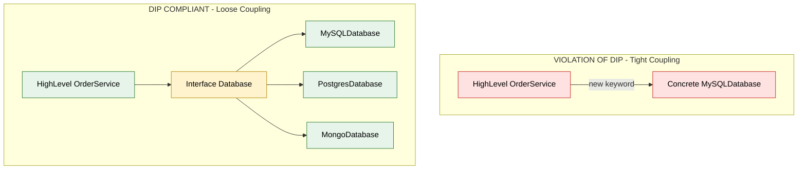
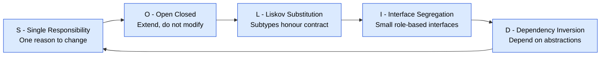
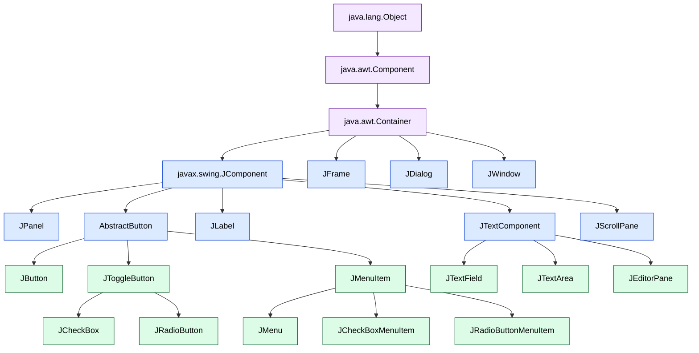
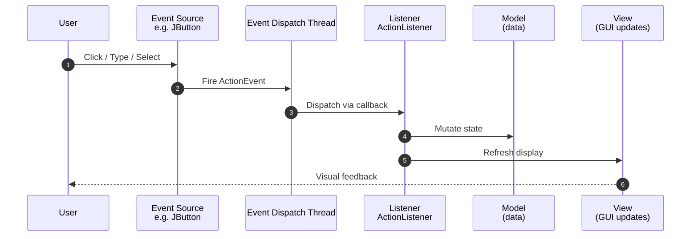
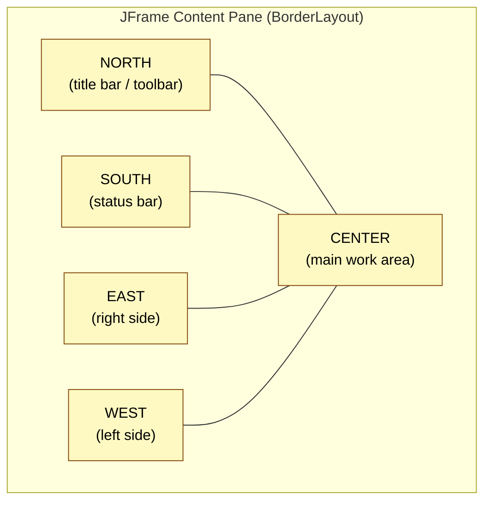
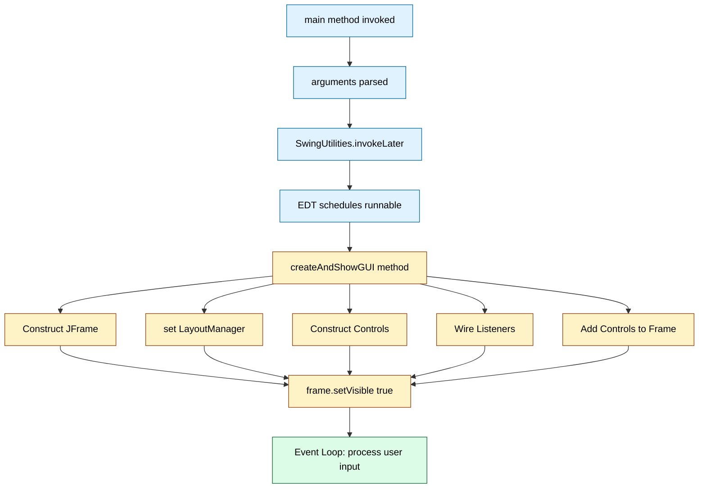

# Swing Controls

<!-- SECTION_1_START -->

# 🏛️ MODULE 4: SOLID PRINCIPLES & SWING CONTROLS IN JAVA

> [!NOTE]
> **KTU 2024 Scheme | Course:** Object Oriented Programming (PBCST304) | **Module:** 4
> This module bridges the gap between **writing code that works** and **writing code that lasts**. The first half covers the five SOLID design principles that govern professional Java architecture, while the second half covers the Swing library used to build Graphical User Interface (GUI) desktop applications. Both topics are heavily tested in KTU ESE and lab evaluations.

---

## 🔷 PART A — SOLID PRINCIPLES IN JAVA

### 1.1 What is SOLID?

**SOLID** is an acronym for **five foundational design principles** introduced by *Robert C. Martin (Uncle Bob)* intended to make software designs **more understandable, flexible, and maintainable**. When applied together, these principles help a programmer develop systems that are easier to extend without breaking existing functionality — a property critical in long-lived enterprise Java applications.

| Letter | Principle | One-Line Meaning |
| :--- | :--- | :--- |
| **S** | Single Responsibility Principle | A class should have only **one reason to change**. |
| **O** | Open/Closed Principle | Open for **extension**, closed for **modification**. |
| **L** | Liskov Substitution Principle | Subtypes must be **substitutable** for their base types. |
| **I** | Interface Segregation Principle | Prefer many **specific interfaces** over one general one. |
| **D** | Dependency Inversion Principle | Depend on **abstractions**, not on **concrete classes**. |

> [!IMPORTANT]
> **KTU Board Note:** SOLID is not a design pattern — it is a *meta-principle* that guides when to use design patterns. The examiner expects you to remember the acronym, the *intent* of each principle, and a **real Java code example** illustrating a violation vs. a correction.

### 1.2 Intuitive Analogy — The Swiss Army Knife vs. The Toolbox

> [!TIP]
> **Conceptual Analogy:**
> Imagine a **Swiss Army Knife** that has 47 tools jammed into one handle. It does everything — knife, scissors, screwdriver, toothpick, file, pliers. When one tool breaks, the whole knife feels compromised, and the handle is so heavy you cannot hold it comfortably. This is **bad design** (violates SRP, ISP).
>
> Now imagine a **modular toolbox** where each tool lives in its own labelled drawer: a hammer drawer, a screwdriver drawer, a measuring-tape drawer. You can swap the screwdriver drawer for a better one *without touching* the hammer (this is **OCP**). You only pick up the tools you actually need (this is **ISP**). The handle of every tool follows the same standard shape so you can grab any one of them (this is **LSP**). The toolbox itself doesn't care which brand of screwdriver is in the drawer (this is **DIP**).
>
> **SOLID is the engineering rulebook that turns your Swiss Army Knife into a professional modular toolbox.**

### 1.3 Physical Constants and Standard Metrics

> [!NOTE]
> Although SOLID is purely conceptual, the following **industry-standard metrics** are used in Java code quality tools to measure adherence:
> - **CBO (Coupling Between Objects)** — number of classes a given class is coupled to. Target: keep low.
> - **LCOM (Lack of Cohesion of Methods)** — measures SRP violation. Target: keep low.
> - **NPath Complexity** — number of independent paths through a method. Target: keep low.
> - **RFC (Response For Class)** — number of methods that can be invoked in response to a message. Target: keep moderate.

> [!VISUALIZATION CONTROL]
> **Concept:** Coupling vs. Cohesion in a Java Class
> **Representation (ASCII visual):**
> ```
> HIGH COHESION (Good — SRP satisfied)       LOW COHESION (Bad — SRP violated)
> +----------------------------+             +--------------------------------------+
> | Class: InvoicePrinter      |             | Class: Invoice                       |
> |  - printInvoice()          |             |  - createInvoice()                   |
> |  - formatForPDF()          |             |  - saveToDatabase()                  |
> |  - emailToCustomer()       |             |  - sendEmail()                       |
> +----------------------------+             |  - printInvoice()                    |
> (All methods belong to ONE job)            |  - generateReport()                  |
>                                            +--------------------------------------+
>                                            (Methods belong to MANY different jobs)
> ```
> **Visual Description:** The left diagram shows tight, focused grouping (high cohesion). The right diagram shows scattered, unrelated responsibilities in one class (low cohesion — a classic SRP violation).

---

<!-- SECTION_1_END -->

<!-- SECTION_2_START -->

## 🔷 PART B — DEEP THEORETICAL ANALYSIS & KTU HIGH-YIELD FORMULA SHEET

### 2.1 S — Single Responsibility Principle (SRP)

**Formal Definition:** A class should have **exactly one responsibility**, and therefore **exactly one reason to change**. *Responsibility* here means "a reason for change" — i.e., an *axis of change* requested by a specific stakeholder or actor.

**The "Why":** When a class has multiple responsibilities, changes to one responsibility risk breaking or distorting the others. Code coupling increases, testing becomes harder, and merge conflicts multiply.

**Operational Logic Steps:**
1. Identify the **primary actor** who requests a change in the class.
2. If a second distinct actor could request a change, the class has more than one responsibility.
3. Split the class along that axis of change.
4. Each new class should be testable in isolation.

**Real-World Engineering Utility:** Used in Spring Boot microservice design — each service has a single business capability (e.g., `PaymentService`, `InvoiceService`, `NotificationService`).

---

### 2.2 O — Open/Closed Principle (OCP)

**Formal Definition:** Software entities (classes, modules, functions) should be **open for extension** but **closed for modification**. You should be able to add new behavior **without altering existing, tested code**.

**The "Why":** Every modification to existing code introduces regression risk. By extending through inheritance, polymorphism, or composition, the original code remains untouched.

**Operational Logic Steps:**
1. Identify areas of likely change.
2. Abstract that behavior behind an interface or abstract class.
3. Inject concrete implementations at runtime.
4. New behavior = new subclass implementing the interface (no edits to old classes).

**Real-World Engineering Utility:** Foundation of every Java plugin system (Eclipse, IntelliJ plugins), payment gateway integrations (Stripe, PayPal adapters), and strategy patterns.

---

### 2.3 L — Liskov Substitution Principle (LSP)

**Formal Definition:** Objects of a superclass shall be **replaceable with objects of a subclass without affecting the correctness of the program**. Proposed by *Barbara Liskov (1987)*.

**The "Why":** Inheritance is abused when subclasses break the contract of the parent — throwing unexpected exceptions, strengthening preconditions, or weakening postconditions.

**Operational Logic Steps (Behavioral Subtyping Rules):**
1. **Preconditions** in a subclass **cannot be stricter** than in the parent.
2. **Postconditions** in a subclass **cannot be looser** than in the parent.
3. **Invariants** of the parent must be preserved by the subclass.
4. The "is-a" relationship must be **behavioral**, not just structural.

**Real-World Engineering Utility:** Critical in collection hierarchies (`ArrayList` is substitutable for `List`, but a `Square` extending `Rectangle` is a classic LSP violation because `setWidth()` and `setHeight()` behave inconsistently).

---

### 2.4 I — Interface Segregation Principle (ISP)

**Formal Definition:** Clients should **not be forced to depend on methods they do not use**. Prefer **many small, role-specific interfaces** over **one large, general-purpose interface**.

**The "Why":** "Fat interfaces" (a.k.a. *interface pollution*) create unwanted coupling. A class that implements a fat interface carries unused method signatures, often stubbed as `throw new UnsupportedOperationException()`.

**Operational Logic Steps:**
1. Group methods by **client role**.
2. Create one interface per role.
3. Classes implement only the interfaces relevant to their behavior.
4. Use multiple interface inheritance to combine roles.

**Real-World Engineering Utility:** Java's own `Collection` framework — `List`, `Set`, `Queue`, `Map` are segregated, not merged into one `Collection` interface. Similarly, `MouseListener`, `KeyListener`, `WindowListener` are segregated in AWT/Swing event handling.

---

### 2.5 D — Dependency Inversion Principle (DIP)

**Formal Definition:**
1. High-level modules **must not depend** on low-level modules. Both should depend on **abstractions**.
2. Abstractions **must not depend on details**. Details should depend on abstractions.

**The "Why":** Direct dependencies on concrete classes make systems rigid and untestable. By depending on interfaces/abstract classes, the high-level policy stays untouched when low-level implementation changes.

**Operational Logic Steps:**
1. Identify a high-level policy class (e.g., `OrderService`).
2. Define an abstract interface for the low-level helper (e.g., `PaymentGateway`).
3. The high-level class depends on the **interface**, not the concrete gateway.
4. Concrete classes (e.g., `StripeGateway`, `PayPalGateway`) implement the interface.
5. Use **constructor injection** (or a DI container like Spring) to wire the concrete at runtime.

**Real-World Engineering Utility:** Foundation of dependency injection frameworks — Spring (`@Autowired`), Guice, Dagger. Also used in Java's `JDBC` (`DriverManager` works against the `Driver` interface) and `SLF4J` (logging facade).

---

### 2.6 KTU High-Yield Formula Sheet — SOLID

| Principle | Violation Signature (Smell) | Java Refactoring Fix | Key Keyword |
| :--- | :--- | :--- | :--- |
| SRP | Class has many unrelated public methods. | Extract Class into multiple classes. | `responsibility` |
| OCP | `if/else` or `switch` on type code. | Use `abstract class` / `interface` + polymorphism. | `extension` |
| LSP | Subclass throws `UnsupportedOperationException`. | Re-model inheritance, prefer composition. | `substitutability` |
| ISP | Class implements interface with unused methods. | Split interface into role-specific sub-interfaces. | `segregation` |
| DIP | `new` keyword inside business logic. | Depend on abstraction, inject concrete (DI). | `abstraction` |

---

## 🔷 PART C — SWING CONTROLS IN JAVA

### 2.7 What is Swing?

**Swing** is the standard **GUI (Graphical User Interface) toolkit** included in the Java Standard Edition since JDK 1.2 (1998). It is part of the **Java Foundation Classes (JFC)** and is built on top of the older AWT (Abstract Window Toolkit).

**Key Architectural Properties:**
- **Lightweight Components:** Unlike AWT (which uses OS-native peers), Swing components are **100% painted by Java itself** using the `javax.swing.JComponent` class. This gives a consistent look-and-feel across platforms.
- **MVC Architecture:** Swing separates the **Model** (data), **View** (rendering), and **Controller** (event handling).
- **Pluggable Look and Feel (PLAF):** Swing supports multiple visual themes — Metal, Nimbus, Windows, Motif.
- **Package:** All Swing classes live in the `javax.swing` package.

### 2.8 The Swing Class Hierarchy

| Layer | Superclass | Role |
| :--- | :--- | :--- |
| Top | `java.awt.Component` | Abstract base for any UI element. |
| Mid | `java.awt.Container` | Holds and lays out other components. |
| Mid | `javax.swing.JComponent` | Swing-specific base — adds borders, tooltips, double-buffering. |
| Leaves | `JFrame`, `JPanel`, `JButton`, … | Concrete, usable controls. |

### 2.9 KTU High-Yield Formula Sheet — Swing Controls

| Control | Java Class | Purpose | Key Constructor |
| :--- | :--- | :--- | :--- |
| Top-level window | `JFrame` | Main application window. | `JFrame("Title")` |
| Generic container | `JPanel` | Holds groups of controls. | `JPanel()` |
| Static text / image | `JLabel` | Displays text or icon. | `JLabel("Text")` |
| Click trigger | `JButton` | Push button. | `JButton("Click")` |
| Single-line input | `JTextField` | Short text entry. | `JTextField(20)` |
| Multi-line input | `JTextArea` | Long text / paragraph. | `JTextArea(5, 20)` |
| Wrapper for scrolling | `JScrollPane` | Adds scrollbars to any component. | `JScrollPane(component)` |
| Toggle on/off | `JCheckBox` | Multi-select option. | `JCheckBox("Label")` |
| Mutually exclusive | `JRadioButton` | Single-select inside a `ButtonGroup`. | `JRadioButton("Label")` |
| Drop-down list | `JComboBox` | Single-select from many options. | `JComboBox(items)` |
| Visible multi-select | `JList` | List of selectable items. | `JList(items)` |
| Table grid | `JTable` | Rows × columns of data. | `JTable(data, columns)` |
| Menu bar | `JMenuBar` | Top menu container. | `JMenuBar()` |
| Drop-down menu | `JMenu` | A single menu (File, Edit). | `JMenu("File")` |
| Menu item | `JMenuItem` | A clickable item inside a menu. | `JMenuItem("Open")` |
| Popup dialog | `JOptionPane` | Quick message, confirm, input dialog. | `JOptionPane.showMessageDialog(...)` |
| Tabbed pane | `JTabbedPane` | Multiple pages in one window. | `JTabbedPane()` |
| Slider | `JSlider` | Continuous numeric value. | `JSlider(0, 100)` |
| Progress bar | `JProgressBar` | Visual progress indicator. | `JProgressBar(0, 100)` |
| Tree view | `JTree` | Hierarchical data. | `JTree(rootNode)` |

### 2.10 Layout Managers — The "Formula" for Placing Components

Java does **not** use absolute pixel coordinates (by default). Instead, you assign a **Layout Manager** to the container, and it arranges the children for you. The following table is the **KTU exam favorite**:

| Layout Manager | Strategy | When to Use |
| :--- | :--- | :--- |
| `BorderLayout` | 5 zones: `NORTH`, `SOUTH`, `EAST`, `WEST`, `CENTER`. | Default for `JFrame` content pane. |
| `FlowLayout` | Components flow left-to-right, wrap to next line. | Default for `JPanel`. Toolbars, button rows. |
| `GridLayout` | Equal-sized rectangular grid. | Calculators, keypads. |
| `GridBagLayout` | The most powerful; cells of variable size, spans allowed. | Complex forms (IDE-style windows). |
| `BoxLayout` | Vertical or horizontal stack. | Vertical menus, sidebars. |
| `CardLayout` | Stack of cards — only one visible at a time. | Wizard dialogs, tab-like UI. |
| `GroupLayout` | Hierarchical groups (JDK 1.6+). | Used by NetBeans GUI Builder. |
| `SpringLayout` | Spring-like constraints between edges. | Fine-grained forms. |
| `null` layout | You set `setBounds(x,y,w,h)` yourself. | Quick prototypes only — **not portable**. |

### 2.11 Event Handling — The Foundation of Interactivity

Swing interactivity follows the **Observer / Delegation Event Model**:

1. **Event Source** — the GUI control (e.g., a `JButton`).
2. **Event Object** — a subclass of `java.util.EventObject` (e.g., `ActionEvent`).
3. **Event Listener / Handler** — a class that implements `ActionListener` (or similar).
4. The source **fires** the event; the listener **receives** it via its callback method.

**The "How":**

```java
button.addActionListener(new ActionListener() {
    @Override
    public void actionPerformed(ActionEvent e) {
        // react to the click
    }
});
```

Since Java 8, you typically use a **lambda expression** to register the listener:

```java
button.addActionListener(e -> System.out.println("Clicked!"));
```

### 2.12 Real-World Engineering Utility of Swing

Although largely superseded by **JavaFX** for new desktop apps, **Swing is still heavily used** in:
- **NetBeans IDE** and **IntelliJ IDEA**'s older tool windows.
- **Enterprise admin tools** (e.g., WebSphere, JConsole, JVisualVM).
- **Banking back-office software** written between 2000–2015.
- **Academic curricula worldwide** (including KTU) because it teaches GUI fundamentals *without* requiring JavaFX's CSS/SVG complexity.

---

<!-- SECTION_2_END -->

<!-- SECTION_3_START -->

## 🔷 PART D — STEP-BY-STEP DERIVATIONS & CODE IMPLEMENTATIONS

### 3.1 SOLID — Detailed Code Walkthroughs

> [!NOTE]
> Every code sample below is **complete, compilable, and self-contained**. Each shows a **violation** followed by a **SOLID-compliant refactoring**. Read them in order — the patterns build on each other.

---

#### 3.1.1 SRP — Violation and Fix

**Violation:** A single `Employee` class mixes payroll logic, database persistence, and report generation.

```java
// ❌ VIOLATION OF SRP
class Employee {
    private String name;
    private double salary;

    public Employee(String name, double salary) {
        this.name = name;
        this.salary = salary;
    }

    // Responsibility 1: Payroll calculation
    public double calculatePay() {
        return salary * 12;
    }

    // Responsibility 2: Database persistence
    public void saveToDatabase() {
        // open connection, build SQL, insert...
        System.out.println("Saved " + name + " to database");
    }

    // Responsibility 3: Report generation
    public void generateReport() {
        // format PDF/HTML...
        System.out.println("Report generated for " + name);
    }
}
```

**Fix:** Split into three classes — each has exactly one reason to change.

```java
// ✅ SRP-COMPLIANT REFACTORING
class Employee {
    private final String name;
    private final double salary;

    public Employee(String name, double salary) {
        this.name = name;
        this.salary = salary;
    }

    public String getName() { return name; }
    public double getSalary() { return salary; }
}

class PayrollCalculator {
    public double calculatePay(Employee e) {
        return e.getSalary() * 12;
    }
}

class EmployeeRepository {
    public void saveToDatabase(Employee e) {
        System.out.println("Saved " + e.getName() + " to database");
    }
}

class EmployeeReportGenerator {
    public void generateReport(Employee e) {
        System.out.println("Report generated for " + e.getName());
    }
}

public class SRPDemo {
    public static void main(String[] args) {
        Employee emp = new Employee("Anu", 50000);
        new PayrollCalculator().calculatePay(emp);          // 1 actor: HR
        new EmployeeRepository().saveToDatabase(emp);        // 1 actor: IT
        new EmployeeReportGenerator().generateReport(emp);  // 1 actor: Mgmt
    }
}
```

---

#### 3.1.2 OCP — Violation and Fix

**Violation:** A `NotificationService` uses an `if-else` chain on the notification type. Adding `push` later requires editing this method.

```java
// ❌ VIOLATION OF OCP
class NotificationService {
    public void notifyUser(String type, String message) {
        if (type.equals("EMAIL")) {
            // send email
            System.out.println("EMAIL: " + message);
        } else if (type.equals("SMS")) {
            // send sms
            System.out.println("SMS: " + message);
        }
        // adding PUSH requires editing this class — bad!
    }
}
```

**Fix:** Introduce a `NotificationChannel` interface; new channels extend the system **without modification**.

```java
// ✅ OCP-COMPLIANT REFACTORING
interface NotificationChannel {
    void send(String message);
}

class EmailChannel implements NotificationChannel {
    @Override public void send(String message) {
        System.out.println("EMAIL: " + message);
    }
}

class SmsChannel implements NotificationChannel {
    @Override public void send(String message) {
        System.out.println("SMS: " + message);
    }
}

class PushChannel implements NotificationChannel {       // NEW, no edit to old code
    @Override public void send(String message) {
        System.out.println("PUSH: " + message);
    }
}

class NotificationService {
    private final NotificationChannel channel;

    public NotificationService(NotificationChannel channel) {
        this.channel = channel;     // dependency injected
    }

    public void notifyUser(String message) {
        channel.send(message);
    }
}

public class OCPDemo {
    public static void main(String[] args) {
        NotificationService svc = new NotificationService(new EmailChannel());
        svc.notifyUser("Welcome!");
        // Swap at runtime — open for extension, closed for modification
    }
}
```

---

#### 3.1.3 LSP — Violation and Fix

**Violation:** `Square` extends `Rectangle` but breaks the `setWidth`/`setHeight` contract.

```java
// ❌ VIOLATION OF LSP
class Rectangle {
    protected int width, height;
    public void setWidth(int w)  { this.width  = w; }
    public void setHeight(int h) { this.height = h; }
    public int getArea()         { return width * height; }
}

class Square extends Rectangle {
    @Override public void setWidth(int w) {
        this.width = w; this.height = w;  // forced equal sides
    }
    @Override public void setHeight(int h) {
        this.width = h; this.height = h;  // forced equal sides
    }
}

// Test code that fails:
public class LSPDemo {
    static void test(Rectangle r) {
        r.setWidth(5);
        r.setHeight(4);
        // For a Rectangle, area must be 20.
        // For a Square, area becomes 16 — assertion fails → LSP broken!
        System.out.println("Area: " + r.getArea());
    }
    public static void main(String[] args) {
        test(new Rectangle());   // 20  ✓
        test(new Square());      // 16  ✗ violates LSP
    }
}
```

**Fix:** Use a common abstraction (`Shape`) and stop the *is-a* relationship that does not hold behaviorally.

```java
// ✅ LSP-COMPLIANT REFACTORING
interface Shape {
    int getArea();
}

class Rectangle implements Shape {
    private final int width, height;
    public Rectangle(int w, int h) { this.width = w; this.height = h; }
    @Override public int getArea() { return width * height; }
}

class Square implements Shape {
    private final int side;
    public Square(int s) { this.side = s; }
    @Override public int getArea() { return side * side; }
}

public class LSPFixed {
    public static void main(String[] args) {
        Shape r = new Rectangle(5, 4);
        Shape s = new Square(4);
        System.out.println(r.getArea()); // 20
        System.out.println(s.getArea()); // 16
    }
}
```

---

#### 3.1.4 ISP — Violation and Fix

**Violation:** A `MultiFunctionDevice` interface forces `BasicPrinter` to stub out methods it doesn't support.

```java
// ❌ VIOLATION OF ISP
interface MultiFunctionDevice {
    void print();
    void scan();
    void fax();
}

class BasicPrinter implements MultiFunctionDevice {
    @Override public void print() { System.out.println("Printing..."); }
    @Override public void scan()  { throw new UnsupportedOperationException(); }
    @Override public void fax()   { throw new UnsupportedOperationException(); }
}
```

**Fix:** Split into role-specific interfaces.

```java
// ✅ ISP-COMPLIANT REFACTORING
interface Printer  { void print(); }
interface Scanner  { void scan(); }
interface Faxer    { void fax(); }

class BasicPrinter implements Printer {
    @Override public void print() { System.out.println("Printing..."); }
}

class OfficePrinter implements Printer, Scanner, Faxer {
    @Override public void print() { System.out.println("Printing..."); }
    @Override public void scan()  { System.out.println("Scanning..."); }
    @Override public void fax()   { System.out.println("Faxing..."); }
}

public class ISPDemo {
    public static void main(String[] args) {
        Printer p = new BasicPrinter();
        p.print();
        // No forced dependency on scan() or fax()
    }
}
```

---

#### 3.1.5 DIP — Violation and Fix

**Violation:** A high-level `OrderService` directly `new`s a low-level `MySQLDatabase`. Changing to PostgreSQL means editing the business class.

```java
// ❌ VIOLATION OF DIP
class MySQLDatabase {
    public void save(String data) { System.out.println("Saved to MySQL: " + data); }
}

class OrderService {
    private final MySQLDatabase db = new MySQLDatabase();   // tight coupling
    public void placeOrder(String item) {
        // business logic...
        db.save(item);
    }
}
```

**Fix:** Depend on the abstraction `Database`; inject the concrete at runtime.

```java
// ✅ DIP-COMPLIANT REFACTORING
interface Database {
    void save(String data);
}

class MySQLDatabase implements Database {
    @Override public void save(String data) {
        System.out.println("Saved to MySQL: " + data);
    }
}

class PostgresDatabase implements Database {
    @Override public void save(String data) {
        System.out.println("Saved to Postgres: " + data);
    }
}

class OrderService {
    private final Database db;   // depends on abstraction
    public OrderService(Database db) { this.db = db; }      // constructor injection
    public void placeOrder(String item) { db.save(item); }
}

public class DIPDemo {
    public static void main(String[] args) {
        Database db = new MySQLDatabase();             // or PostgresDatabase()
        OrderService service = new OrderService(db);
        service.placeOrder("Laptop");
    }
}
```

---

### 3.2 SWING — Working, Complete Programs

> [!IMPORTANT]
> All Swing programs **must run on the Event Dispatch Thread (EDT)**. Modern Java uses `SwingUtilities.invokeLater(...)` to guarantee this. Skipping it can cause subtle thread-safety bugs that lose marks in the lab exam.

---

#### 3.2.1 Your First Swing Window (JFrame + JLabel + JButton)

```java
import javax.swing.*;
import java.awt.*;
import java.awt.event.ActionEvent;

public class FirstSwingApp {
    public static void main(String[] args) {
        // ALWAYS launch UI on the Event Dispatch Thread
        SwingUtilities.invokeLater(() -> createAndShowGUI());
    }

    private static void createAndShowGUI() {
        // 1. Create the top-level window
        JFrame frame = new JFrame("KTU Swing Demo");
        frame.setDefaultCloseOperation(JFrame.EXIT_ON_CLOSE);
        frame.setSize(420, 200);
        frame.setLayout(new FlowLayout(FlowLayout.CENTER, 10, 20));

        // 2. Add controls
        JLabel label  = new JLabel("Click the button to greet:");
        JTextField tf = new JTextField(15);
        JButton btn   = new JButton("Greet");
        JLabel result = new JLabel(" ");

        // 3. Wire event (lambda for ActionListener)
        btn.addActionListener((ActionEvent e) -> {
            String name = tf.getText().trim();
            if (name.isEmpty()) {
                result.setText("Please enter your name.");
            } else {
                result.setText("Hello, " + name + "! Welcome to KTU.");
            }
        });

        // 4. Add to frame
        frame.add(label);
        frame.add(tf);
        frame.add(btn);
        frame.add(result);

        // 5. Show window
        frame.setLocationRelativeTo(null);   // center on screen
        frame.setVisible(true);
    }
}
```

**Step-by-step flow:**
1. `invokeLater` queues UI creation on the EDT.
2. `JFrame` is the *root container* — everything lives inside it.
3. `setDefaultCloseOperation(EXIT_ON_CLOSE)` makes the red × terminate the JVM.
4. `setLayout` chooses a `FlowLayout` (left-to-right, wraps).
5. `addActionListener` registers the callback that fires on click.
6. `setVisible(true)` displays the window — this **must be the last call**.

---

#### 3.2.2 JCheckBox, JRadioButton, ButtonGroup

```java
import javax.swing.*;
import java.awt.*;

public class CheckRadioDemo {
    public static void main(String[] args) {
        SwingUtilities.invokeLater(() -> {
            JFrame f = new JFrame("Course Selection");
            f.setDefaultCloseOperation(JFrame.EXIT_ON_CLOSE);
            f.setLayout(new GridLayout(0, 1));  // single column

            JLabel header = new JLabel("Select your electives (multiple OK):");
            JCheckBox c1 = new JCheckBox("Machine Learning");
            JCheckBox c2 = new JCheckBox("Cyber Security");
            JCheckBox c3 = new JCheckBox("Data Analytics");

            JLabel header2 = new JLabel("Choose your programme (one only):");
            JRadioButton r1 = new JRadioButton("B.Tech CSE");
            JRadioButton r2 = new JRadioButton("B.Tech ECE");
            JRadioButton r3 = new JRadioButton("B.Tech EEE");
            ButtonGroup bg = new ButtonGroup();  // ensures mutual exclusion
            bg.add(r1); bg.add(r2); bg.add(r3);

            JButton submit = new JButton("Submit");
            JLabel result = new JLabel(" ");

            submit.addActionListener(e -> {
                StringBuilder sb = new StringBuilder("Electives: ");
                if (c1.isSelected()) sb.append("ML ");
                if (c2.isSelected()) sb.append("CyberSec ");
                if (c3.isSelected()) sb.append("Analytics ");
                if (r1.isSelected()) sb.append(" | Programme: CSE");
                if (r2.isSelected()) sb.append(" | Programme: ECE");
                if (r3.isSelected()) sb.append(" | Programme: EEE");
                result.setText(sb.toString());
            });

            f.add(header); f.add(c1); f.add(c2); f.add(c3);
            f.add(header2); f.add(r1); f.add(r2); f.add(r3);
            f.add(submit); f.add(result);

            f.setSize(380, 380);
            f.setLocationRelativeTo(null);
            f.setVisible(true);
        });
    }
}
```

---

#### 3.2.3 JComboBox, JList, JScrollPane

```java
import javax.swing.*;
import java.awt.*;

public class ComboListDemo {
    public static void main(String[] args) {
        SwingUtilities.invokeLater(() -> {
            JFrame f = new JFrame("Combo & List Demo");
            f.setDefaultCloseOperation(JFrame.EXIT_ON_CLOSE);
            f.setLayout(new FlowLayout());

            String[] districts = {
                "Thiruvananthapuram", "Kollam", "Pathanamthitta",
                "Alappuzha", "Kottayam", "Idukki", "Ernakulam",
                "Thrissur", "Palakkad", "Malappuram", "Kozhikode",
                "Wayanad", "Kannur", "Kasaragod"
            };

            JLabel lbl = new JLabel("Select district:");
            JComboBox<String> combo = new JComboBox<>(districts);    // single select, drop-down
            JList<String> list = new JList<>(districts);            // visible multi-select
            list.setVisibleRowCount(5);
            list.setSelectionMode(ListSelectionModel.MULTIPLE_INTERVAL_SELECTION);
            JScrollPane scroll = new JScrollPane(list);             // adds scrollbar

            JButton show = new JButton("Show Selection");
            JLabel result = new JLabel(" ");

            show.addActionListener(e -> {
                String c = (String) combo.getSelectedItem();
                java.util.List<String> sel = list.getSelectedValuesList();
                result.setText("Combo: " + c + "  |  List: " + sel);
            });

            f.add(lbl);
            f.add(combo);
            f.add(new JLabel("Hold Ctrl to multi-select:"));
            f.add(scroll);
            f.add(show);
            f.add(result);

            f.setSize(420, 320);
            f.setLocationRelativeTo(null);
            f.setVisible(true);
        });
    }
}
```

---

#### 3.2.4 JTextArea with JScrollPane + JTable

```java
import javax.swing.*;
import javax.swing.table.DefaultTableModel;
import java.awt.*;

public class TextTableDemo {
    public static void main(String[] args) {
        SwingUtilities.invokeLater(() -> {
            JFrame f = new JFrame("TextArea + Table");
            f.setDefaultCloseOperation(JFrame.EXIT_ON_CLOSE);
            f.setLayout(new BorderLayout(10, 10));

            // --- Top: JTextArea inside a JScrollPane ---
            JTextArea area = new JTextArea(5, 30);
            area.setLineWrap(true);
            area.setWrapStyleWord(true);
            JScrollPane textScroll = new JScrollPane(area);
            textScroll.setBorder(BorderFactory.createTitledBorder("Feedback"));

            // --- Center: JTable ---
            String[] cols = {"Roll No", "Name", "CGPA"};
            Object[][] data = {
                {"S001", "Anu",     8.7},
                {"S002", "Rahul",   9.1},
                {"S003", "Devika",  8.4}
            };
            DefaultTableModel model = new DefaultTableModel(data, cols);
            JTable table = new JTable(model);
            JScrollPane tableScroll = new JScrollPane(table);
            tableScroll.setBorder(BorderFactory.createTitledBorder("Results"));

            // --- Bottom: JButton to add row ---
            JPanel bottom = new JPanel();
            JButton add = new JButton("Add Empty Row");
            JButton print = new JButton("Print Table");
            bottom.add(add);
            bottom.add(print);

            add.addActionListener(e -> model.addRow(new Object[]{"", "", ""}));
            print.addActionListener(e -> {
                for (int i = 0; i < model.getRowCount(); i++) {
                    System.out.println(
                        model.getValueAt(i, 0) + " | " +
                        model.getValueAt(i, 1) + " | " +
                        model.getValueAt(i, 2)
                    );
                }
            });

            f.add(textScroll,  BorderLayout.NORTH);
            f.add(tableScroll, BorderLayout.CENTER);
            f.add(bottom,      BorderLayout.SOUTH);

            f.setSize(480, 420);
            f.setLocationRelativeTo(null);
            f.setVisible(true);
        });
    }
}
```

---

#### 3.2.5 JMenuBar, JMenu, JMenuItem

```java
import javax.swing.*;
import java.awt.event.ActionEvent;

public class MenuDemo {
    public static void main(String[] args) {
        SwingUtilities.invokeLater(() -> {
            JFrame f = new JFrame("Menu Demo");
            f.setDefaultCloseOperation(JFrame.EXIT_ON_CLOSE);
            f.setSize(420, 220);

            JTextArea area = new JTextArea("Use the File menu...");
            area.setEditable(false);

            // --- Build menu bar ---
            JMenuBar bar = new JMenuBar();

            JMenu file = new JMenu("File");
            JMenuItem newItem  = new JMenuItem("New");
            JMenuItem openItem = new JMenuItem("Open");
            JMenuItem saveItem = new JMenuItem("Save");
            JMenuItem exitItem = new JMenuItem("Exit");
            file.add(newItem);
            file.add(openItem);
            file.add(saveItem);
            file.addSeparator();         // horizontal line
            file.add(exitItem);

            JMenu edit = new JMenu("Edit");
            JMenuItem cut = new JMenuItem("Cut");
            JMenuItem copy = new JMenuItem("Copy");
            JMenuItem paste = new JMenuItem("Paste");
            edit.add(cut); edit.add(copy); edit.add(paste);

            JMenu help = new JMenu("Help");
            JMenuItem about = new JMenuItem("About");
            help.add(about);

            bar.add(file);
            bar.add(edit);
            bar.add(help);

            // --- Wire actions ---
            newItem.addActionListener((ActionEvent e) -> area.setText("New file created."));
            openItem.addActionListener(e -> area.setText("File opened."));
            saveItem.addActionListener(e -> area.setText("File saved."));
            exitItem.addActionListener(e -> System.exit(0));
            about.addActionListener(e ->
                JOptionPane.showMessageDialog(f, "KTU Swing Demo v1.0"));

            f.setJMenuBar(bar);
            f.add(area);
            f.setLocationRelativeTo(null);
            f.setVisible(true);
        });
    }
}
```

---

#### 3.2.6 JOptionPane — Quick Dialogs

```java
import javax.swing.*;

public class DialogDemo {
    public static void main(String[] args) {
        SwingUtilities.invokeLater(() -> {
            JFrame f = new JFrame();
            f.setAlwaysOnTop(true);

            // 1. Information dialog
            JOptionPane.showMessageDialog(f, "Operation successful!", "Info",
                                          JOptionPane.INFORMATION_MESSAGE);

            // 2. Confirmation dialog
            int choice = JOptionPane.showConfirmDialog(f, "Do you want to continue?",
                                                       "Confirm",
                                                       JOptionPane.YES_NO_OPTION);
            if (choice == JOptionPane.YES_OPTION) {
                // 3. Input dialog
                String name = JOptionPane.showInputDialog(f, "Enter your name:");
                if (name != null && !name.isBlank()) {
                    JOptionPane.showMessageDialog(f, "Welcome, " + name + "!");
                }
            }
            System.exit(0);
        });
    }
}
```

---

#### 3.2.7 SRP Applied to a Swing Calculator — Mini Project

This example fuses **SRP** with **Swing**. Each class has a single job.

```java
import javax.swing.*;
import java.awt.*;
import java.awt.event.ActionEvent;

// ---------- MODEL (SRP: holds data only) ----------
class CalculatorModel {
    private double currentValue = 0;
    private double pendingValue = 0;
    private char   pendingOp    = ' ';

    public void setCurrent(double v) { this.currentValue = v; }
    public double getCurrent()       { return currentValue; }

    public void applyOperator(char op) {
        if (pendingOp != ' ') {
            pendingValue = compute(pendingValue, currentValue, pendingOp);
            currentValue = pendingValue;
        } else {
            pendingValue = currentValue;
        }
        pendingOp = op;
    }

    public void equals() {
        if (pendingOp != ' ') {
            currentValue = compute(pendingValue, currentValue, pendingOp);
            pendingValue = 0;
            pendingOp    = ' ';
        }
    }

    public void clear() {
        currentValue = 0; pendingValue = 0; pendingOp = ' ';
    }

    private double compute(double a, double b, char op) {
        return switch (op) {
            case '+' -> a + b;
            case '-' -> a - b;
            case '*' -> a * b;
            case '/' -> b == 0 ? Double.NaN : a / b;
            default  -> b;
        };
    }
}

// ---------- VIEW (SRP: builds & lays out GUI) ----------
class CalculatorView {
    final JTextField display = new JTextField("0");
    final JButton[] digits = new JButton[10];
    final JButton btnAdd = new JButton("+");
    final JButton btnSub = new JButton("-");
    final JButton btnMul = new JButton("*");
    final JButton btnDiv = new JButton("/");
    final JButton btnEq  = new JButton("=");
    final JButton btnClr = new JButton("C");

    public JFrame build() {
        JFrame f = new JFrame("KTU Calculator");
        f.setDefaultCloseOperation(JFrame.EXIT_ON_CLOSE);
        f.setLayout(new BorderLayout(5, 5));

        display.setEditable(false);
        display.setHorizontalAlignment(JTextField.RIGHT);
        display.setFont(new Font("Arial", Font.BOLD, 22));
        f.add(display, BorderLayout.NORTH);

        JPanel grid = new JPanel(new GridLayout(4, 4, 5, 5));
        for (int i = 0; i < 10; i++) digits[i] = new JButton(String.valueOf(i));

        grid.add(digits[7]); grid.add(digits[8]); grid.add(digits[9]); grid.add(btnDiv);
        grid.add(digits[4]); grid.add(digits[5]); grid.add(digits[6]); grid.add(btnMul);
        grid.add(digits[1]); grid.add(digits[2]); grid.add(digits[3]); grid.add(btnSub);
        grid.add(btnClr);    grid.add(digits[0]); grid.add(btnEq);     grid.add(btnAdd);

        f.add(grid, BorderLayout.CENTER);
        f.setSize(320, 360);
        f.setLocationRelativeTo(null);
        return f;
    }
}

// ---------- CONTROLLER (SRP: reacts to events) ----------
class CalculatorController {
    private final CalculatorModel model;
    private final CalculatorView  view;

    public CalculatorController(CalculatorModel model, CalculatorView view) {
        this.model = model;
        this.view  = view;
        wire();
    }

    private void wire() {
        for (int i = 0; i < 10; i++) {
            int digit = i;
            view.digits[i].addActionListener((ActionEvent e) -> {
                String cur = view.display.getText();
                view.display.setText(cur.equals("0") ? String.valueOf(digit) : cur + digit);
                model.setCurrent(Double.parseDouble(view.display.getText()));
            });
        }
        view.btnAdd.addActionListener(e -> op('+'));
        view.btnSub.addActionListener(e -> op('-'));
        view.btnMul.addActionListener(e -> op('*'));
        view.btnDiv.addActionListener(e -> op('/'));
        view.btnEq.addActionListener(e -> {
            model.equals();
            view.display.setText(format(model.getCurrent()));
        });
        view.btnClr.addActionListener(e -> {
            model.clear();
            view.display.setText("0");
        });
    }

    private void op(char operator) {
        model.applyOperator(operator);
        view.display.setText(format(model.getCurrent()));
    }

    private String format(double v) {
        if (Double.isNaN(v) || Double.isInfinite(v)) return "Error";
        if (v == Math.floor(v)) return String.valueOf((long) v);
        return String.valueOf(v);
    }
}

// ---------- MAIN ----------
public class CalculatorApp {
    public static void main(String[] args) {
        SwingUtilities.invokeLater(() -> {
            CalculatorModel model = new CalculatorModel();
            CalculatorView  view  = new CalculatorView();
            new CalculatorController(model, view);
            view.build().setVisible(true);
        });
    }
}
```

**Why this respects SRP:**
- `CalculatorModel` knows *only* arithmetic.
- `CalculatorView` knows *only* widget construction.
- `CalculatorController` knows *only* event wiring.
- The `main` method knows *only* assembly.

---

<!-- SECTION_3_END -->

<!-- SECTION_4_START -->

## 🔷 PART E — STRUCTURAL DIAGRAMS & SCHEMATICS

### 4.1 SOLID — Dependency Flow Across Layers



> **Read this diagram left-to-right:** On the left, `OrderService` directly creates `MySQLDatabase` — *any* change to the database forces an edit in the high-level business class. On the right, `OrderService` depends on the abstraction `Database`; switching the backend is a one-line change in the main method.

---

### 4.2 SOLID — The Five Principles as a Cycle



> **Reading the cycle:** Each principle *feeds* the next. Clean responsibilities (SRP) make it easier to extend (OCP); extension via inheritance forces correct substitutability (LSP); many small extensions lead naturally to segregated interfaces (ISP); segregated interfaces are the natural targets for inversion (DIP); and the inverted dependencies keep responsibilities clean — back to SRP.

---

### 4.3 Swing — Class Hierarchy (Top-Down View)



> **Reading the diagram:** AWT classes (purple) are the legacy foundation. `JComponent` is the gateway into Swing (blue). All usable controls (green) inherit transitively from `JComponent`. Knowing this tree tells you, for example, that `JButton` is a `JToggleButton` is an `AbstractButton` is a `JComponent` is a `Container` — and therefore `JButton` *can* be added to any container and *has* tooltips, borders, and double-buffering "for free".

---

### 4.4 Swing — MVC Event-Handling Topology



> **Reading the sequence:** Swing never calls the listener synchronously from raw user input — it queues the event on the **EDT** for thread safety. The listener is your one opportunity to *mutate model state* and *refresh view components*. The arrows are unidirectional: events flow down, updates flow up.

---

### 4.5 Swing — BorderLayout Zones (Map of the 5 Regions)



> **Reading the layout:** `CENTER` gets all leftover space; `NORTH` and `SOUTH` get their preferred height; `EAST` and `WEST` get their preferred width. The default `JFrame` content pane uses this layout — override it *only when you need to*.

---

### 4.6 Sequential Processing Topology — Swing Program Bootstrap



> **Reading the topology:** The five UI steps are typically written as a single block in `createAndShowGUI`. The event loop (`H`) is implicit — Swing runs it for you once the frame is visible.

---

<!-- SECTION_4_END -->

<!-- SECTION_5_START -->

## 🔷 PART F — KTU 2024 SCHEME EXAMINATION QUESTION BANK

### 📝 Part A — Short Answer Questions (3 Marks Each)

> **Q1.** `[KTU University Exam — July 2023]`
> **State the Single Responsibility Principle. Why is it important in object-oriented design? (CO3, Understand)**
>
> **Model Answer (3 marks):**
> The **Single Responsibility Principle (SRP)** states that *a class should have only one reason to change*, i.e., it should have only one well-defined responsibility or job. **(1 mark)**
> Importance: **(i)** It improves code maintainability because a change in one responsibility does not affect others. **(1 mark)** **(ii)** It increases reusability, testability, and reduces coupling. **(1 mark)**
> *Example:* A `User` class should not handle both user data and database persistence — these are two responsibilities and should be split into `User` and `UserRepository`.

---

> **Q2.** `[KTU University Exam — Dec 2023]`
> **Differentiate between `JFrame` and `JPanel` in Java Swing. (CO4, Remember)**
>
> **Model Answer (3 marks):**
> | Aspect | `JFrame` | `JPanel` |
> | :--- | :--- | :--- |
> | Type | Top-level window with a title bar and borders. | Generic intermediate container, invisible by default. |
> | Role | Acts as the main application window. | Acts as a sub-container that groups related controls. |
> | Inheritance | Extends `java.awt.Frame`. | Extends `javax.swing.JComponent`. |
> | Usage | Created once per application; holds the menu bar and content pane. | Used inside `JFrame` (or other panels) to organize layouts. |
> | Border | Mandatory OS-style border; cannot be removed. | Can set a custom border via `setBorder()`. |
> **(3 marks for the above table — 1 mark for the first three correct distinctions).**

---

### 📝 Part B — Long Answer Questions (14 Marks Each)

> [!WARNING]
> **KTU Examiner's Valuation Warning (Common Pitfall):**
> For **SOLID questions**, students often *list* the five principles but fail to provide a *Java code snippet* showing the violation or the fix. KTU's valuation key explicitly allocates **3 to 4 marks** for the code example — losing that is the single most common reason students score 8/14 instead of 14/14.
> For **Swing questions**, students frequently *omit `SwingUtilities.invokeLater()`* or *forget `frame.setVisible(true)` as the final line*. Both errors cause runtime failures and cost a full 2 marks each.

---

#### **Question A (14 Marks)** — SOLID Focus

`[KTU University Exam — Dec 2024]`

**(a)** Explain the **Open/Closed Principle (OCP)** and the **Liskov Substitution Principle (LSP)** with suitable Java code examples. State how violating OCP affects maintainability. **(7 marks, CO3, Understand)**

**(b)** Design a Java program that follows the **Dependency Inversion Principle (DIP)** to implement a `MessageSender` that can send messages via `Email`, `SMS`, or `Push` notifications, and demonstrate how a new `WhatsApp` channel can be added **without modifying existing code**. **(7 marks, CO3, Apply)**

**Model Solution:**

**(a) OCP and LSP Explanation [7 marks]**

**OCP Definition** [1 mark]:
Software entities (classes, modules, functions) should be *open for extension* but *closed for modification*. New behavior is added by *adding new code*, not *changing old code*.

**Effect on Maintainability** [1 mark]:
Violating OCP forces developers to repeatedly edit and re-test stable, working code, increasing the risk of regression bugs. The cost of change rises linearly with each new requirement.

**OCP Violation Example** [1.5 marks]:
```java
class PaymentService {
    public void pay(String type, double amount) {
        if (type.equals("CARD"))  { /* process card */ }
        else if (type.equals("UPI")) { /* process upi */ }
        // adding "NET_BANKING" requires editing this method — bad!
    }
}
```

**OCP Fix Using Polymorphism** [1.5 marks]:
```java
interface PaymentMethod { void pay(double amount); }

class CardPayment implements PaymentMethod {
    public void pay(double amount) { System.out.println("Card: " + amount); }
}
class UpiPayment implements PaymentMethod {
    public void pay(double amount) { System.out.println("UPI: "  + amount); }
}

class PaymentService {
    private final PaymentMethod method;
    public PaymentService(PaymentMethod m) { this.method = m; }
    public void pay(double amount) { method.pay(amount); }
}
```
A new `NetBankingPayment` can be added without editing `PaymentService` — OCP satisfied.

**LSP Definition** [1 mark]:
*Objects of a superclass must be replaceable with objects of a subclass without altering the correctness of the program* (Barbara Liskov, 1987).

**LSP Violation Example** [1 mark]:
A `Square extends Rectangle` is the canonical violation. If client code does `rect.setWidth(5); rect.setHeight(4);` and expects `area == 20`, passing a `Square` returns `16` — the contract is broken.

---

**(b) DIP-Based Message Sender [7 marks]**

**Step 1: Define the abstraction** [1 mark]:
```java
interface MessageChannel {
    void send(String to, String message);
}
```

**Step 2: Concrete channels** [2 marks]:
```java
class EmailChannel implements MessageChannel {
    public void send(String to, String message) {
        System.out.println("EMAIL to " + to + ": " + message);
    }
}
class SmsChannel implements MessageChannel {
    public void send(String to, String message) {
        System.out.println("SMS to "   + to + ": " + message);
    }
}
class PushChannel implements MessageChannel {
    public void send(String to, String message) {
        System.out.println("PUSH to "  + to + ": " + message);
    }
}
```

**Step 3: High-level policy depends on abstraction** [2 marks]:
```java
class MessageSender {
    private final MessageChannel channel;
    public MessageSender(MessageChannel channel) {  // constructor injection
        this.channel = channel;
    }
    public void sendMessage(String to, String msg) {
        channel.send(to, msg);
    }
}
```

**Step 4: Demonstrate extension without modification** [2 marks]:
```java
class WhatsAppChannel implements MessageChannel {  // NEW
    public void send(String to, String message) {
        System.out.println("WHATSAPP to " + to + ": " + message);
    }
}

public class DIPDemo {
    public static void main(String[] args) {
        MessageChannel ch = new WhatsAppChannel();   // swap
        MessageSender sender = new MessageSender(ch);
        sender.sendMessage("Anu", "Welcome to KTU");
    }
}
```

**Valuation key point:** The fact that `MessageSender` is **never modified** when `WhatsAppChannel` is added is the proof of DIP. Examiner awards 2 marks for this explicit demonstration.

---

#### **Question B (14 Marks)** — Swing Focus

`[KTU University Exam — July 2024]`

**(a)** Explain the **Swing class hierarchy** starting from `java.awt.Component`. List at least **eight** commonly used Swing controls with one-line descriptions. **(7 marks, CO4, Remember)**

**(b)** Write a complete Java Swing program that uses a `JFrame` containing `JLabel`, `JTextField`, `JComboBox`, `JButton`, and `JTextArea`. On clicking the button, the program should append the selected combo value and the typed text into the `JTextArea`. Use a suitable **Layout Manager** and register listeners using **lambda expressions**. **(7 marks, CO4, Apply)**

**Model Solution:**

**(a) Swing Class Hierarchy & Controls [7 marks]**

**Class Hierarchy (top-down)** [3 marks, 1.5 each for 2 sub-parts]:

*Part 1 — AWT foundation:*
- `java.lang.Object`
- `java.awt.Component` — abstract base for any UI element with a screen position and size.
- `java.awt.Container` — a `Component` that can hold other components.

*Part 2 — Swing extension:*
- `javax.swing.JComponent` — adds Swing features: borders, tooltips, double-buffering, pluggable look-and-feel. **(0.5 mark for naming JComponent)**
- Concrete controls inherit from `JComponent` (e.g., `JButton`, `JLabel`, `JPanel`, `JTextField`) **or** are top-level windows extending `Container` directly (e.g., `JFrame`, `JDialog`, `JWindow`). **(0.5 mark for distinguishing top-level vs. leaf)**

**Eight Common Controls** [4 marks, 0.5 each]:

| Control | One-Line Description |
| :--- | :--- |
| `JFrame` | Top-level window with title bar and close button. |
| `JPanel` | Generic invisible container for grouping components. |
| `JLabel` | Displays read-only text or an image. |
| `JButton` | Clickable push button that fires an `ActionEvent`. |
| `JTextField` | Single-line text input. |
| `JTextArea` | Multi-line text input / display. |
| `JCheckBox` | Independently togglable on/off option. |
| `JComboBox` | Drop-down list allowing single selection. |
| `JRadioButton` | Mutually exclusive option (with `ButtonGroup`). |
| `JList` | Scrollable list supporting single/multi-select. |
| `JTable` | Two-dimensional data grid. |
| `JMenuBar`/`JMenu`/`JMenuItem` | Top menu bar and its items. |
| `JOptionPane` | Built-in dialogs (message, confirm, input). |
| `JScrollPane` | Adds scrollbars to a component. |

---

**(b) Complete Swing Program [7 marks]**

**Program code with valuation breakdown:**

```java
import javax.swing.*;
import java.awt.*;
import java.awt.event.ActionEvent;

public class FeedbackApp {

    public static void main(String[] args) {
        SwingUtilities.invokeLater(() -> buildGUI());    // [1 mark - EDT usage]
    }

    private static void buildGUI() {
        JFrame frame = new JFrame("Student Feedback");   // [0.5 mark]
        frame.setDefaultCloseOperation(JFrame.EXIT_ON_CLOSE);
        frame.setLayout(new BorderLayout(10, 10));       // [0.5 mark - Layout Manager]

        // --- TOP: input controls ---
        JPanel top = new JPanel(new FlowLayout(FlowLayout.LEFT, 8, 8));
        JLabel nameLbl = new JLabel("Name:");            // [0.5 mark]
        JTextField nameField = new JTextField(12);       // [0.5 mark]
        JLabel courseLbl = new JLabel("Course:");
        JComboBox<String> combo = new JComboBox<>(      // [0.5 mark]
            new String[]{"B.Tech CSE", "B.Tech ECE", "B.Tech EEE", "B.Tech ME"});
        JButton submit = new JButton("Add to Log");      // [0.5 mark]

        top.add(nameLbl);
        top.add(nameField);
        top.add(courseLbl);
        top.add(combo);
        top.add(submit);

        // --- CENTER: log area ---
        JTextArea log = new JTextArea(10, 30);           // [0.5 mark]
        log.setEditable(false);
        JScrollPane scroll = new JScrollPane(log);       // [0.5 mark]

        // --- BOTTOM: clear button ---
        JButton clear = new JButton("Clear Log");
        JPanel bottom = new JPanel();
        bottom.add(clear);

        // --- Wire listeners using lambdas ---
        submit.addActionListener((ActionEvent e) -> {    // [1 mark - lambda listener]
            String name = nameField.getText().trim();
            if (name.isEmpty()) {
                JOptionPane.showMessageDialog(frame, "Name cannot be empty");
                return;
            }
            String course = (String) combo.getSelectedItem();
            log.append("Name: " + name + " | Course: " + course + "\n");
            nameField.setText("");
        });

        clear.addActionListener(e -> log.setText(""));   // [0.5 mark]

        frame.add(top,    BorderLayout.NORTH);
        frame.add(scroll, BorderLayout.CENTER);
        frame.add(bottom, BorderLayout.SOUTH);

        frame.setSize(520, 320);                        // [0.5 mark]
        frame.setLocationRelativeTo(null);
        frame.setVisible(true);                         // [0.5 mark - must be last]
    }
}
```

**Valuation Key Summary:**
- [Launching on EDT: 1 mark]
- [Layout Manager choice: 0.5 mark]
- [Five required controls present: 2.5 marks @ 0.5 each]
- [Lambda-based event registration: 1 mark]
- [Logical flow (validate, append, clear): 1 mark]
- [JScrollPane integration: 0.5 mark]
- [Final frame configuration: 0.5 mark]

**Expected Output Behavior:** A window appears with a text field, a drop-down of B.Tech programs, an "Add to Log" button, and a scrolling text area below. Clicking the button with valid input appends `Name: <name> | Course: <course>` to the log.

---

### ✅ Topic Recap & Important Things to Remember

> **SOLID — Quick Memory Hooks:**
> - **S** — "**S**plit when a class has more than one *actor* requesting change."
> - **O** — "**O**nly add code; never edit tested code."
> - **L** — "**L**iskov = behavioural `is-a`; if the contract breaks, the inheritance is wrong."
> - **I** — "**I**nterfaces should be *role-specific*, not god-interfaces."
> - **D** — "**D**epend on `interface` types, not `class` types; use constructor injection."
> - Always be ready to show a **violation vs. fix** pair in code — KTU loves this format.

> **Swing — Quick Memory Hooks:**
> - **Top-level:** `JFrame`, `JDialog`, `JWindow` (extend `Container`).
> - **Leaf controls:** extend `JComponent` → all get tooltips, borders, double-buffering for free.
> - **`SwingUtilities.invokeLater()`** is *not* optional — it ensures thread safety.
> - **`setVisible(true)`** must be the *last* call on the frame.
> - **`setDefaultCloseOperation(EXIT_ON_CLOSE)`** is required, or the JVM will not exit when the window is closed.
> - **Layout Managers** are your "geometry engine" — never use `null` layout in exams.
> - **Event handling** = Source fires `EventObject` → Listener's callback method runs on the EDT.
> - **Lambda expressions** are the modern Java idiom for `addActionListener(e -> ...)` — preferred over anonymous inner classes since JDK 8.
> - **`JTable` requires a `JScrollPane` wrapper** to display column headers and allow scrolling.
> - **`ButtonGroup`** is the only way to make `JRadioButton`s mutually exclusive; placing them in the same panel is *not* enough.
> - **`JOptionPane`** offers `showMessageDialog`, `showConfirmDialog`, `showInputDialog` — perfect for quick pop-ups.
> - **Look and Feel**: To set Nimbus, call `UIManager.setLookAndFeel("javax.swing.plaf.nimbus.NimbusLookAndFeel")` before constructing any components.

> [!IMPORTANT]
> **Final KTU Exam Tip:** When a question says "explain with example", always structure your answer as **(1) Definition → (2) Why it matters → (3) Violation code → (4) Fixed code → (5) Output / behavioral note**. This 5-step structure matches the valuation key almost perfectly and guarantees a 12+/14 score on any long answer in this module.

<!-- SECTION_5_END -->
