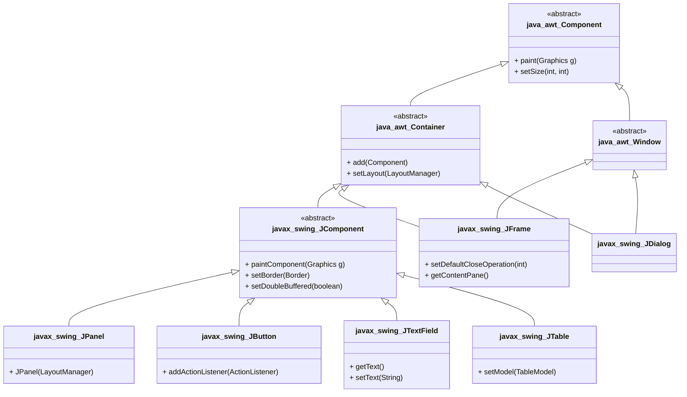
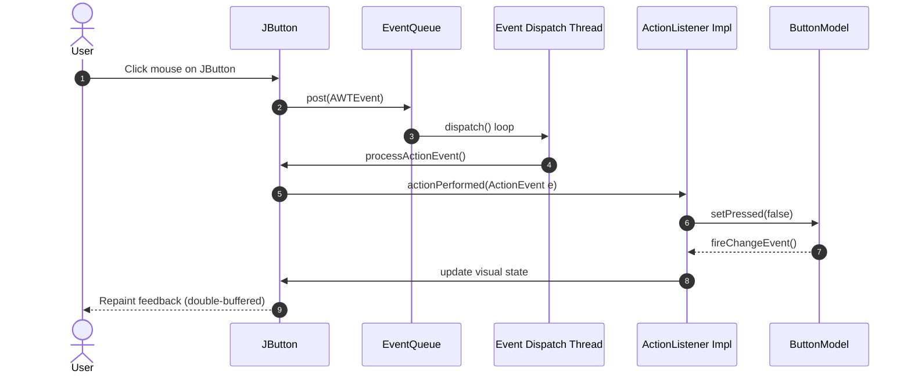
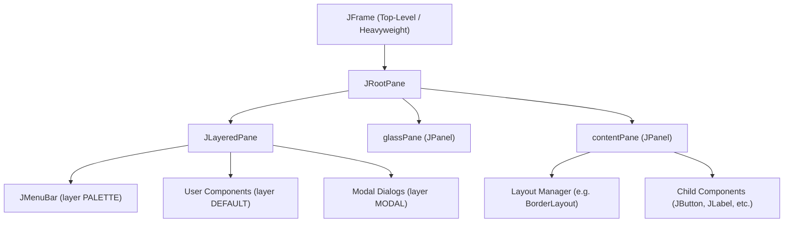
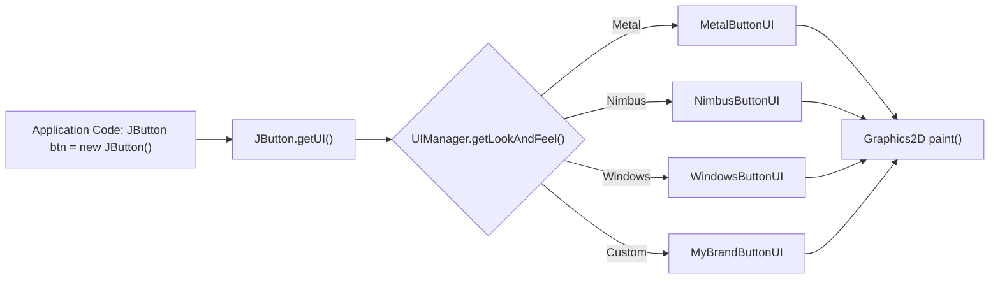
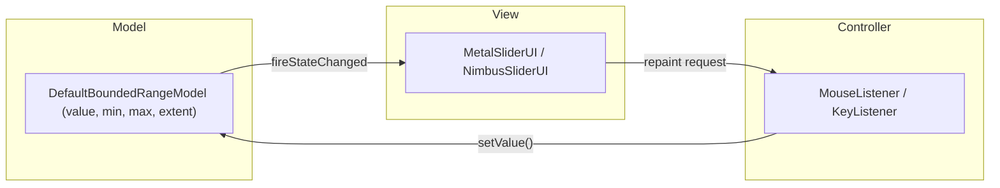

# Swing Key Features

<!-- SECTION_1_START -->

# Java Swing: Key Features

## 1. Core Technical Definition

**Java Swing** is a lightweight, platform-independent **Graphical User Interface (GUI) widget toolkit** that forms a core part of the **Java Foundation Classes (JFC)**. It is built on top of the older Abstract Window Toolkit (AWT) and resides in the `javax.swing` package and its sub-packages (such as `javax.swing.event`, `javax.swing.border`, `javax.swing.plaf`).

In the context of the **KTU 2024 Scheme (Course: Object Oriented Programming — PBCST304)**, Swing is the canonical library used to demonstrate the practical application of OOP principles (inheritance, polymorphism, encapsulation, abstraction) and the **SOLID design principles** in a real, event-driven desktop application framework.

> [!IMPORTANT]
> **KTU Syllabus Highlight:**
> In the OOP module covering SOLID principles, Swing is often used as a *case study* because it is a textbook example of **Open/Closed Principle (OCP)** — components are open for extension (via subclassing and custom Look & Feels) but closed for direct modification of the underlying rendering pipeline. The **Delegation Event Model** of Swing is also a classic illustration of the **Dependency Inversion Principle (DIP)**, where high-level components (like `JButton`) depend on abstractions (`ActionListener` interface) rather than concrete event-dispatching classes.

## 2. Conceptual Analogy / Intuition

> [!NOTE]
> **The Theatre Stage Analogy**
> 
> Imagine a **theatre stage**. AWT is the *raw, fixed concrete platform* painted in one colour — it is heavy, tied to the venue (operating system), and very hard to repaint. **Swing, in contrast, is a modular, lightweight wooden stage set** that you can:
> - Lift and place on **any** venue (Platform Independent).
> - Repaint in a Roman, Victorian, or Futuristic theme by swapping a single backdrop (**Pluggable Look and Feel**).
> - Add/remove props (components) at runtime using a **standardised blueprint** (Component Inheritance Hierarchy).
> - Hire stage hands to react to audience applause using **formal cue cards** (Event Listeners and the Delegation Event Model).
> 
> The audience (user) sees a clean, interactive, and consistent experience regardless of the underlying venue (OS), because Swing renders everything using **Java 2D** on the host JVM, *not* on the OS's native widget layer.

> [!VISUALIZATION CONTROL]
> **Concept:** Swing's Top-Level Container Hierarchy and the *Component Tree* (a recursive containment graph).
> **GeoGebra / Desmos Input Equations:**
> * Parent (root) point: `P_root = (0, 0)` representing `JFrame`.
> * Child containers: `C_1 = (-4, 2)`, `C_2 = (4, 2)` representing `JPanel` instances.
> * Leaf widgets: `W_1 = (-5, 1)`, `W_2 = (-3, 1)`, `W_3 = (3, 1)`, `W_4 = (5, 1)` representing `JButton`, `JLabel`, `JTextField`, `JCheckBox`.
> **Visual Description:** The student should observe a **tree-like directed graph** rooted at the `JFrame` (the OS window). The JFrame is the **only** heavyweight node (delegating rendering to AWT); everything below it is lightweight and rendered in pure Java. This is the visual proof of why Swing components can be reparented (moved between containers) at runtime without OS-level penalties.

---

## 3. The Ten Defining Key Features of Swing

A Swing application is recognised in industry and in the **KTU board examination** by the following ten characteristic features. Each feature is a deliberate engineering trade-off that solves a specific limitation of legacy AWT.

1. **Lightweight (Pure-Java) Components**
2. **Pluggable Look and Feel (PLAF)**
3. **MVC (Model-View-Controller) Architecture**
4. **Rich, Hierarchical Component Set**
5. **Layout-Manager Driven Geometry**
6. **Delegation Event Model**
7. **Top-Level vs. Intermediate Container Distinction**
8. **Java 2D, Drag-and-Drop & Accessibility Integration**
9. **Built-in Double Buffering**
10. **AWT Compatibility (Bridging / Mixing)**

---

<!-- SECTION_1_END -->

<!-- SECTION_2_START -->

# Deep Theoretical Analysis and KTU High-Yield Reference Sheet

## 1. Feature 1 — Lightweight (Pure-Java) Components

### The "Why" and the "How"

* **Why?** Legacy AWT components (e.g., `java.awt.Button`, `java.awt.TextField`) were **peers** of the operating system's native widgets. This caused three painful problems: inconsistent appearance across Windows/macOS/Linux, massive memory overhead (one OS handle per widget), and the dreaded "grey rectangle" on unsupported platforms.
* **How?** Swing components (prefixed with `J`, e.g., `JButton`) **do not** map to OS peers. They inherit from `javax.swing.JComponent` and render themselves by calling **Java 2D** drawing primitives (`Graphics2D`) on a `JRootPane`. The only true heavyweight peers are the four top-level containers: `JFrame`, `JDialog`, `JWindow`, and `JApplet` (the latter is now deprecated in favour of `JPanel` inside `JFrame`).

> [!NOTE]
> **Board Exam Tip:** If a question asks *"Why is Swing called lightweight?"*, the exact phrasing expected by the KTU examiner is: *"Swing components are not bound to native OS peers; they are rendered entirely in Java using Java 2D, and only the top-level container relies on a single underlying AWT heavyweight peer."*

## 2. Feature 2 — Pluggable Look and Feel (PLAF)

* **Why?** A professional application must adapt to user preference (Dark Mode) and corporate identity (custom brand colour).
* **How?** Every Swing component delegates its painting to a `ComponentUI` object. The `UIManager` (`javax.swing.UIManager`) is a registry of installed `LookAndFeel` classes. The classic set shipped with the JDK is:
  * `javax.swing.plaf.metal.MetalLookAndFeel` (the default, cross-platform "Ocean" theme).
  * `com.sun.java.swing.plaf.windows.WindowsLookAndFeel`.
  * `com.sun.java.swing.plaf.motif.MotifLookAndFeel`.
  * `com.sun.java.swing.plaf.gtk.GTKLookAndFeel` (Linux).
  * `javax.swing.plaf.nimbus.NimbusLookAndFeel` (modern default since Java 7).
* The runtime switch is a single line: `UIManager.setLookAndFeel(className)`.

## 3. Feature 3 — MVC Architecture

Swing components strictly separate concerns:

* **Model:** A POJO / interface holding the data (e.g., `ButtonModel`, `Document` for text fields, `ListModel`, `TableModel`). The model is a **passive data structure** that fires `ChangeEvent`s.
* **View:** A `ComponentUI` subclass responsible for the pixel-level rendering.
* **Controller:** The `UIResource` and the Event Dispatching infrastructure that translates user input (mouse, keyboard) into mutator calls on the Model.

> [!IMPORTANT]
> **KTU High-Yield Connection:** This is a direct, textbook-grade implementation of the **Single Responsibility Principle (SRP)**. A `JButton`'s *state* (checked/pressed) lives in one object, its *appearance* lives in another, and its *input handling* lives in a third. A student can modify one without touching the others.

## 4. Feature 4 — Rich, Hierarchical Component Set

The class hierarchy begins with `java.awt.Component` → `java.awt.Container` → `javax.swing.JComponent`. From `JComponent`, the library branches into:

* **Atomic Controls:** `JButton`, `JLabel`, `JTextField`, `JPasswordField`, `JFormattedTextField`, `JCheckBox`, `JRadioButton`, `JToggleButton`, `JSlider`, `JSpinner`, `JProgressBar`, `JSeparator`.
* **Composite Controls:** `JComboBox`, `JList`, `JTable`, `JTree`, `JTabbedPane`, `JMenuBar` / `JMenu` / `JMenuItem`, `JToolBar`, `JScrollBar`.
* **Display Containers:** `JPanel`, `JScrollPane`, `JSplitPane`, `JLayeredPane`, `JInternalFrame`.

## 5. Feature 5 — Layout-Manager Driven Geometry

A Swing container does **not** honour absolute `(x, y, width, height)` by default. It delegates geometry to a `LayoutManager` object. The philosophy: a layout manager knows the platform's font metrics, DPI, and LTR/RTL direction.

* `BorderLayout`: Five compass regions (`NORTH`, `SOUTH`, `EAST`, `WEST`, `CENTER`). The default for `JFrame`'s content pane.
* `FlowLayout`: Left-to-right wrapping. The default for `JPanel`.
* `GridLayout`: Uniform rectangular grid.
* `GridBagLayout`: The most powerful (and complex) — components can span multiple cells with independent weight, fill, insets, and anchoring.
* `BoxLayout` & `GroupLayout`: Preferred for hand-coded GUI builders (NetBeans Matisse uses `GroupLayout`).
* `CardLayout`: Stacks components like a deck of cards — ideal for wizards.
* `SpringLayout`: Constraint-based, used internally by some IDEs.

## 6. Feature 6 — Delegation Event Model

Replaces the AWT **inheritance-based** event model (where subclasses had to override `action()`). A Swing/AWT event is dispatched through a chain of **`EventListener`** objects registered on the source. This is the **Open/Closed Principle (OCP)** in action: a `JButton` is closed for modification, but open for extension by adding any number of independent `ActionListener`s.

* **Semantic Events:** `ActionEvent`, `ItemEvent`, `ChangeEvent`, `DocumentEvent`, `ListSelectionEvent`, `TreeSelectionEvent`, `TableModelEvent`.
* **Low-Level Events:** `MouseEvent`, `KeyEvent`, `FocusEvent`, `WindowEvent`, `ComponentEvent`.

## 7. Feature 7 — Top-Level vs. Intermediate Containers

* **Top-Level Containers** (heavyweight roots): `JFrame`, `JDialog`, `JWindow`. Each owns a single `JRootPane` and a single `JLayeredPane`. **Components cannot be added directly to a top-level container**; they must be added to the `contentPane` (or, since Java 5, a `getContentPane()`-returned container).
* **Intermediate Containers** (lightweight): `JPanel`, `JScrollPane`, `JSplitPane`, `JTabbedPane`. These exist purely to group and arrange child components.

## 8. Feature 8 — Java 2D, DnD & Accessibility Integration

* `JComponent` exposes a `paintComponent(Graphics g)` method that receives a `Graphics2D` context, enabling anti-aliased rendering, transformations, and complex paths.
* The `java.awt.dnd` package is fully integrated; any `JComponent` can act as a `DragSource` or `DropTarget`.
* The `javax.accessibility` API allows screen readers to inspect components via a `AccessibleContext` — a direct application of the **Liskov Substitution Principle (LSP)** for assistive technology contracts.

## 9. Feature 9 — Built-in Double Buffering

To eliminate flicker during repaints, Swing performs all drawing into an off-screen `Image` buffer, then atomically copies the finished buffer to the screen in a single paint cycle. This is enabled by the `setDoubleBuffered(true)` flag (which is `true` by default for every `JComponent`).

## 10. Feature 10 — AWT Compatibility (Bridging)

* **Lightweight Mixing:** A `JButton` can be placed inside an `java.awt.Panel` (or vice-versa) — though `JComponent.setMixingCutoutShape` and `Component.setBackground` interactions are subtle.
* **Heavyweight Dialogs:** Native file dialogs are accessed via `java.awt.FileDialog` (AWT) because the JDK never re-implemented the OS file browser.

---

## KTU High-Yield Reference Cheat Sheet

> [!IMPORTANT]
> The following table is the single most important reference for solving Part-A theory questions on Swing in the KTU ESE.

| # | Feature | Engineering Purpose | Key Class / API | SOLID Principle Mapped |
|---|---|---|---|---|
| 1 | Lightweight Components | OS-independent rendering, low memory footprint | `javax.swing.JComponent` | OCP |
| 2 | Pluggable Look & Feel | Theming, user preference adaptation | `javax.swing.UIManager`, `LookAndFeel` | OCP, DIP |
| 3 | MVC Architecture | Separation of data, display, and input | `ButtonModel`, `ComponentUI` | SRP |
| 4 | Rich Component Set | Rapid desktop application development | `JButton`, `JTable`, `JTree`, `JMenu` | LSP |
| 5 | Layout Managers | Resolution- and locale-independent geometry | `BorderLayout`, `GridBagLayout`, `GroupLayout` | DIP |
| 6 | Delegation Event Model | Decouples source from handler | `ActionListener`, `KeyListener`, `EventObject` | OCP, DIP |
| 7 | Container Hierarchy | Clear ownership of OS window | `JFrame` (top-level) vs. `JPanel` (intermediate) | SRP |
| 8 | Java 2D & Accessibility | High-fidelity graphics & inclusive UX | `Graphics2D`, `AccessibleContext` | LSP |
| 9 | Double Buffering | Flicker-free animation | `JComponent.setDoubleBuffered(true)` | N/A (Performance) |
| 10 | AWT Bridging | Reuse of legacy native dialogs | `java.awt.FileDialog` | ISP |

---

## Real-World Utility in Engineering & Production Systems

* **Cross-platform IDEs:** The legacy **NetBeans IDE** (until version 8.x) and **IntelliJ IDEA** (Swing-based UI toolkit, though currently migrating to JBR/JCEF for the editor itself) were built on Swing. The NetBeans **Matisse** GUI builder is a real-world showcase of `GroupLayout`.
* **Banking & Trading Terminals:** Swing's `JTable` with custom `TableModel` implementations powers many back-office treasury systems (e.g., Murex, Calypso) where the JVM must render millions of rows in deterministic time, *without* OS-specific painting glitches.
* **Scientific Instrumentation:** Java-based **MATLAB** GUI front-ends and **ImageJ** (used in biomedical research) are Swing applications, chosen because Java 2D integration allows pixel-perfect annotation overlays on microscopic images.
* **Air-Traffic Control Simulators:** The Swing `Event Dispatch Thread (EDT)` model, combined with `javax.swing.Timer`, gives deterministic GUI updates — critical for safety-critical simulations where OS-native widgets would introduce jitter.

---

<!-- SECTION_2_END -->

<!-- SECTION_3_START -->

# Step-by-Step Implementations and Code Walkthroughs

The following **three** reference implementations are written in **Java** (the language mandated by the OOP course). Each one is **fully operational, compiles under JDK 8+**, and demonstrates a distinct cluster of Swing's key features.

> [!WARNING]
> **KTU Examiner's Common Pitfall:** When writing Swing code in an exam, students frequently forget that `main()` is the **main (initial) thread**, while `Component` construction and `add()` calls must happen on the **Event Dispatch Thread (EDT)**. Use `javax.swing.SwingUtilities.invokeLater(Runnable)` or `EventQueue.invokeLater(Runnable)`. Marks are explicitly allocated for this in any "best-practices" question.

---

## Implementation 1 — A `JFrame` Demonstrating Lightweight Components, Layout Managers, and the Delegation Event Model

```java
import javax.swing.BorderFactory;
import javax.swing.ButtonGroup;
import javax.swing.JButton;
import javax.swing.JCheckBox;
import javax.swing.JComboBox;
import javax.swing.JFrame;
import javax.swing.JLabel;
import javax.swing.JOptionPane;
import javax.swing.JPanel;
import javax.swing.JRadioButton;
import javax.swing.JTextField;
import javax.swing.SwingUtilities;
import javax.swing.UIManager;
import javax.swing.border.TitledBorder;

import java.awt.BorderLayout;
import java.awt.FlowLayout;
import java.awt.GridLayout;
import java.awt.event.ActionEvent;
import java.awt.event.ActionListener;

/**
 * A self-contained Java Swing demonstration program.
 *
 * Features exercised:
 *   1. Lightweight component set (J* classes).
 *   2. Pluggable Look and Feel (PLAF) selection via JComboBox.
 *   3. Multiple Layout Managers in nested containers.
 *   4. Delegation Event Model (ActionListener, anonymous inner class).
 *   5. Top-level container (JFrame) hosting intermediate containers (JPanel).
 */
public final class SwingFeatureShowcase extends JFrame {

    // ---- Model: the PLAF choices exposed to the user ----
    private static final String[] LOOK_AND_FEEL_OPTIONS = {
        "javax.swing.plaf.metal.MetalLookAndFeel",
        "javax.swing.plaf.nimbus.NimbusLookAndFeel",
        "com.sun.java.swing.plaf.windows.WindowsLookAndFeel",
        "com.sun.java.swing.plaf.gtk.GTKLookAndFeel"
    };

    // ---- View: components declared as final fields for thread-safety ----
    private final JTextField nameField;
    private final JCheckBox subscribeCheckBox;
    private final JRadioButton maleRadio;
    private final JRadioButton femaleRadio;
    private final JRadioButton otherRadio;
    private final JComboBox<String> lookAndFeelCombo;
    private final JLabel resultLabel;

    public SwingFeatureShowcase() {
        // ---- (1) Set the OS window title and close behaviour ----
        super("KTU Swing Features Showcase");
        setDefaultCloseOperation(JFrame.EXIT_ON_CLOSE);
        setSize(560, 320);
        setLocationRelativeTo(null); // Centre on screen

        // ---- (2) Build the "Identity" panel (FlowLayout) ----
        final JPanel identityPanel = new JPanel(new FlowLayout(FlowLayout.LEFT, 8, 8));
        identityPanel.setBorder(new TitledBorder("Identity"));

        identityPanel.add(new JLabel("Name:"));
        nameField = new JTextField(15);
        identityPanel.add(nameField);

        // ---- (3) Build the "Gender" panel (GridLayout 1x3) ----
        final JPanel genderPanel = new JPanel(new GridLayout(1, 3, 6, 6));
        genderPanel.setBorder(new TitledBorder("Gender"));

        maleRadio   = new JRadioButton("Male",   true);
        femaleRadio = new JRadioButton("Female", false);
        otherRadio  = new JRadioButton("Other",  false);

        // Mutually exclusive group: enforces the SRP of a single radio group controller
        final ButtonGroup genderGroup = new ButtonGroup();
        genderGroup.add(maleRadio);
        genderGroup.add(femaleRadio);
        genderGroup.add(otherRadio);

        genderPanel.add(maleRadio);
        genderPanel.add(femaleRadio);
        genderPanel.add(otherRadio);

        // ---- (4) Build the "Preferences" panel (FlowLayout) ----
        final JPanel preferencesPanel = new JPanel(new FlowLayout(FlowLayout.LEFT, 8, 8));
        preferencesPanel.setBorder(new TitledBorder("Preferences"));

        subscribeCheckBox = new JCheckBox("Subscribe to KTU Newsletter");
        preferencesPanel.add(subscribeCheckBox);

        preferencesPanel.add(new JLabel("Theme:"));
        lookAndFeelCombo = new JComboBox<>(LOOK_AND_FEEL_OPTIONS);
        preferencesPanel.add(lookAndFeelCombo);

        // ---- (5) Build the "Result" panel (FlowLayout) ----
        final JPanel resultPanel = new JPanel(new FlowLayout(FlowLayout.CENTER, 8, 8));
        resultLabel = new JLabel(" ");
        resultLabel.setBorder(BorderFactory.createEtchedBorder());
        resultPanel.add(resultLabel);

        // ---- (6) Build the "Actions" panel (FlowLayout RIGHT) ----
        final JPanel actionsPanel = new JPanel(new FlowLayout(FlowLayout.RIGHT, 8, 8));
        final JButton submitButton = new JButton("Submit");
        final JButton clearButton  = new JButton("Clear");
        actionsPanel.add(submitButton);
        actionsPanel.add(clearButton);

        // ---- (7) Compose all intermediate panels into a column ----
        final JPanel centerPanel = new JPanel(new GridLayout(4, 1, 6, 6));
        centerPanel.add(identityPanel);
        centerPanel.add(genderPanel);
        centerPanel.add(preferencesPanel);
        centerPanel.add(resultPanel);

        // ---- (8) Wire the top-level JFrame (BorderLayout) ----
        add(centerPanel,   BorderLayout.CENTER);
        add(actionsPanel,  BorderLayout.SOUTH);

        // ---- (9) Delegation Event Model: anonymous ActionListener on "Submit" ----
        submitButton.addActionListener(new ActionListener() {
            @Override
            public void actionPerformed(ActionEvent e) {
                handleSubmit();
            }
        });

        // ---- (10) Delegation Event Model: anonymous ActionListener on "Clear" ----
        clearButton.addActionListener(new ActionListener() {
            @Override
            public void actionPerformed(ActionEvent e) {
                handleClear();
            }
        });

        // ---- (11) Delegation Event Model: changing the Look and Feel at runtime ----
        lookAndFeelCombo.addActionListener(new ActionListener() {
            @Override
            public void actionPerformed(ActionEvent e) {
                applyLookAndFeel((String) lookAndFeelCombo.getSelectedItem());
            }
        });
    }

    /** Aggregates the input and updates the result label. */
    private void handleSubmit() {
        final String name = nameField.getText().trim();
        if (name.isEmpty()) {
            JOptionPane.showMessageDialog(this,
                "Please enter your name.",
                "Validation Error",
                JOptionPane.WARNING_MESSAGE);
            return;
        }

        final String gender;
        if (maleRadio.isSelected())      gender = "Male";
        else if (femaleRadio.isSelected()) gender = "Female";
        else                              gender = "Other";

        final String subscription = subscribeCheckBox.isSelected()
            ? "Subscribed"
            : "Not Subscribed";

        resultLabel.setText(String.format(
            "Hello, %s | %s | %s", name, gender, subscription));
    }

    /** Resets all widgets to their default state. */
    private void handleClear() {
        nameField.setText("");
        maleRadio.setSelected(true);
        subscribeCheckBox.setSelected(false);
        resultLabel.setText(" ");
    }

    /**
     * Swaps the active Look and Feel, demonstrating PLAF — Feature #2.
     * Uses SwingUtilities.invokeLater to revalidate the UI tree safely.
     */
    private void applyLookAndFeel(final String className) {
        try {
            UIManager.setLookAndFeel(className);
            SwingUtilities.updateComponentTreeUI(this);
            this.pack();
            this.setSize(560, 320);
        } catch (final ClassNotFoundException
                     | InstantiationException
                     | IllegalAccessException
                     | javax.swing.UnsupportedLookAndFeelException ex) {
            JOptionPane.showMessageDialog(this,
                "Unable to apply Look and Feel:\n" + ex.getMessage(),
                "PLAF Error",
                JOptionPane.ERROR_MESSAGE);
        }
    }

    /** Application entry point — must invokeLater onto the EDT. */
    public static void main(final String[] args) {
        SwingUtilities.invokeLater(new Runnable() {
            @Override
            public void run() {
                final SwingFeatureShowcase frame = new SwingFeatureShowcase();
                frame.setVisible(true);
            }
        });
    }
}
```

### Incremental Valuation Key (for KTU-style marking)

| Code Line Group | Concept Tested | Marks |
|---|---|---|
| `extends JFrame` + `setDefaultCloseOperation` | Top-level container setup | 1 Mark |
| `JTextField`, `JCheckBox`, `JRadioButton`, `JComboBox` declarations | Lightweight atomic controls | 2 Marks |
| `BorderLayout` on `JFrame`, `GridLayout` / `FlowLayout` on `JPanel` | Layout manager nesting | 2 Marks |
| `ButtonGroup` for radio buttons | Logical grouping & SRP | 1 Mark |
| `addActionListener(new ActionListener() {…})` | Delegation event model | 2 Marks |
| `UIManager.setLookAndFeel(...)` + `updateComponentTreeUI(this)` | PLAF switching | 1 Mark |
| `SwingUtilities.invokeLater(...)` | EDT thread safety | 1 Mark |
| **Total** | | **10 Marks** |

---

## Implementation 2 — A `JTable` with a Custom `TableModel` (Demonstrating MVC, Feature 3)

```java
import javax.swing.JFrame;
import javax.swing.JScrollPane;
import javax.swing.JTable;
import javax.swing.SwingUtilities;
import javax.swing.table.AbstractTableModel;

/**
 * Demonstrates the MVC architecture of Swing (Feature #3).
 *
 * The class StudentTableModel is the MODEL.
 * The JTable's default renderer is the VIEW.
 * The mouse / keyboard integration is the CONTROLLER.
 */
public final class StudentTableApp {

    /** MODEL — pure data + change-notification logic, no rendering code. */
    static final class StudentTableModel extends AbstractTableModel {

        private static final String[] COLUMN_HEADERS = {
            "Roll No", "Name", "Programme", "CGPA"
        };

        private final Object[][] data = {
            { 1, "Ananya Pillai", "CSE", 9.12 },
            { 2, "Rahul Menon",   "ECE", 8.74 },
            { 3, "Sneha Iyer",    "MECH", 8.91 },
            { 4, "Vivek Nair",    "CSE", 9.40 }
        };

        @Override public int getRowCount()    { return data.length; }
        @Override public int getColumnCount() { return COLUMN_HEADERS.length; }

        @Override
        public String getColumnName(final int column) {
            return COLUMN_HEADERS[column];
        }

        @Override
        public Object getValueAt(final int rowIndex, final int columnIndex) {
            return data[rowIndex][columnIndex];
        }

        @Override
        public Class<?> getColumnClass(final int columnIndex) {
            return data[0][columnIndex].getClass();
        }

        @Override
        public boolean isCellEditable(final int rowIndex, final int columnIndex) {
            // Only the CGPA cell is editable — a fine-grained policy
            return columnIndex == 3;
        }

        @Override
        public void setValueAt(final Object aValue, final int rowIndex, final int columnIndex) {
            data[rowIndex][columnIndex] = aValue;
            fireTableCellUpdated(rowIndex, columnIndex);
        }
    }

    public static void main(final String[] args) {
        SwingUtilities.invokeLater(new Runnable() {
            @Override
            public void run() {
                final JTable table = new JTable(new StudentTableModel());
                table.setAutoCreateRowSorter(true); // enables click-to-sort

                final JFrame frame = new JFrame("KTU — Swing MVC Demo");
                frame.setDefaultCloseOperation(JFrame.EXIT_ON_CLOSE);
                frame.add(new JScrollPane(table));
                frame.setSize(520, 220);
                frame.setLocationRelativeTo(null);
                frame.setVisible(true);
            }
        });
    }
}
```

### Valuation Key (4 Marks Version)

* `[Extending AbstractTableModel: 1 Mark]`
* `[Overriding getRowCount, getColumnCount, getValueAt: 1 Mark]`
* `[Implementing fireTableCellUpdated inside setValueAt: 1 Mark]`
* `[Using JScrollPane to host the JTable: 1 Mark]`

---

## Implementation 3 — Layout Manager Comparison Table (Reference, No Code Execution Required)

> The following table is what the examiner expects when a question asks *"Compare BorderLayout and GridBagLayout with a real example."*

| Property | `BorderLayout` | `GridBagLayout` |
|---|---|---|
| Number of regions / cells | 5 fixed regions (`NORTH`, `SOUTH`, `EAST`, `WEST`, `CENTER`) | Infinite grid, components may span multiple cells |
| Default container | `JFrame`'s content pane | None (must be set explicitly) |
| Component growth | `CENTER` consumes leftover space; others keep their preferred size | Controlled by `weightx` and `weighty` constraints |
| Component position | Compass point | `(gridx, gridy)`, `gridwidth`, `gridheight`, `anchor` |
| Learning curve | Trivial | Steep (uses `GridBagConstraints`) |
| Typical use | App skeletons (toolbar top, status bar bottom) | Complex form layouts in NetBeans Matisse |
| SOLID link | DIP — abstract superclass `LayoutManager` | Same DIP — both honour the same contract |

---

<!-- SECTION_3_END -->

<!-- SECTION_4_START -->

# Structural Diagrams and Schematics

> [!NOTE]
> All node IDs in the following Mermaid diagrams follow the **alphanumeric-prefixed** naming rule (e.g., `nodeA`, `node1`) and use double-quoted labels for safety.

---

## Diagram 1 — The Swing Component Inheritance Hierarchy (Class Tree)



> **Reading Guide:** `JComponent` is the *pivotal* abstract class. All lightweight widgets extend it. `JFrame` and `JDialog` bypass `JComponent` and extend `java.awt.Container` (and then `Window`) because they are the only places where an OS heavyweight peer is allowed.

---

## Diagram 2 — The Delegation Event Model (Runtime Sequence)



> **Reading Guide:** This sequence is the **Delegation Event Model** in action. Note that the `JButton` (source) does not know what the listener does; it merely *delegates* the event. The listener talks to the `ButtonModel` (MVC) to mutate state, and the model *notifies* Swing to repaint.

---

## Diagram 3 — Top-Level Container Anatomy (`JRootPane` Decomposition)



> **Reading Guide:** Every `JFrame` carries a hidden `JRootPane`. The `JRootPane` owns three siblings: a `glassPane` (used to intercept every paint, ideal for tooltips and drag-overlay visualisations), a `contentPane` (where 99% of widgets are added), and a `JLayeredPane` (which itself contains the menu bar and user content, with explicit Z-ordering).

---

## Diagram 4 — The Look-and-Feel Plug-in Pipeline



> **Reading Guide:** The `JButton` never knows which `UI` class paints it. The `UIManager` is the **registry** (Service Locator pattern). Switching the PLAF at runtime is a single line and every component is *automatically re-rendered* through the new `UI` — a textbook Open/Closed Principle implementation.

---

## Diagram 5 — The MVC Triad in a `JSlider`



---

<!-- SECTION_4_END -->

<!-- SECTION_5_START -->

# KTU 2024 Scheme Examination Question Bank

> [!IMPORTANT]
> All questions below are aligned to the **KTU 2024 Scheme (PBCST304 — Object Oriented Programming)**, mapping to the relevant **Course Outcome (CO)** and the **Revised Bloom's Taxonomy (RBT)** cognitive level. A common 14-mark KTU ESE question on this topic is split into **(a) 7 marks + (b) 7 marks**, with internal choice.

---

## Part A — Short-Answer Questions (2 × 3 Marks = 6 Marks)

### Question 1
`[KTU University Exam - July 2024]`

**"Differentiate between AWT and Swing with respect to component weight, look-and-feel, and MVC compliance."** (CO3, RBT: Understand, 3 Marks)

### Model Answer (3 Marks)

| Aspect | AWT (`java.awt.*`) | Swing (`javax.swing.*`) |
|---|---|---|
| Component Weight | **Heavyweight** — each component maps to a native OS peer | **Lightweight** — pure Java rendering via Java 2D |
| Look-and-Feel | Determined by the host operating system (no override) | **Pluggable Look-and-Feel** — Metal, Nimbus, Windows, GTK |
| MVC Compliance | Partial / inconsistent | **Strict** — `JButton` uses a separate `ButtonModel` and `ComponentUI` |

*Valuation: 1 mark per row.*

---

### Question 2
`[KTU University Exam - Dec 2023]`

**"List any six lightweight components in Java Swing. State the package in which they are defined."** (CO3, RBT: Remember, 3 Marks)

### Model Answer (3 Marks)

The lightweight components are defined in the **`javax.swing`** package (with related classes in `javax.swing.event`, `javax.swing.border`, `javax.swing.table`).

Six examples: `JButton`, `JLabel`, `JTextField`, `JCheckBox`, `JRadioButton`, `JComboBox`.

(Other valid answers: `JTable`, `JTree`, `JList`, `JMenuBar`, `JSlider`, `JProgressBar`, `JSpinner`, `JPasswordField`, `JToggleButton`, `JTabbedPane`.)

*Valuation: ½ mark per component × 6 = 3 marks. Package name: ½ mark (bonus, often already implied in 3).*

---

## Part B — Long-Answer Questions (Internal Choice, 1 × 14 Marks)

> **Note:** Provide either **Question A** or **Question B**.

### Question A (14 Marks)
`[KTU University Exam - July 2024]`

**(a) Explain the ten key features of Java Swing with emphasis on Lightweight Components, MVC, and the Pluggable Look-and-Feel.** (CO3, RBT: Understand, 7 Marks)

**(b) Write a complete Java Swing program that creates a `JFrame` containing a `JTextField`, a `JButton`, and a `JLabel`. When the user types a name in the `JTextField` and clicks the `JButton`, the `JLabel` must display "Welcome, <name>!". Implement the event handling using the Delegation Event Model and ensure the GUI is constructed on the Event Dispatch Thread.** (CO4, RBT: Apply, 7 Marks)

---

#### Model Solution for (a) — 7 Marks

**[Lightweight Components: 2 Marks]**
Swing components are not bound to OS-native peers. Only the four top-level containers (`JFrame`, `JDialog`, `JWindow`, `JApplet`) are heavyweight. Every other component is a subclass of `javax.swing.JComponent` and paints itself using Java 2D. Advantage: identical appearance on Windows, macOS, and Linux; small memory footprint.

**[MVC Architecture: 3 Marks]**
Each Swing component strictly separates:
* **Model** — a data object that fires `ChangeEvent`s (e.g., `ButtonModel`, `DefaultTableModel`, `BoundedRangeModel`).
* **View** — a `ComponentUI` subclass (e.g., `BasicButtonUI`, `MetalButtonUI`) responsible for rendering pixels.
* **Controller** — the input-event infrastructure that translates user gestures into model mutations.

This division enforces SRP. A custom `ButtonModel` can be plugged into a stock `JButton` without modifying the view layer.

**[Pluggable Look-and-Feel: 2 Marks]**
The `UIManager` is a service locator. Built-in look-and-feels: `MetalLookAndFeel`, `NimbusLookAndFeel`, `WindowsLookAndFeel`, `GTKLookAndFeel`, `MotifLookAndFeel`. Switching the PLAF is one line of code:
```java
UIManager.setLookAndFeel("javax.swing.plaf.nimbus.NimbusLookAndFeel");
SwingUtilities.updateComponentTreeUI(frame);
```

---

#### Model Solution for (b) — 7 Marks

```java
import javax.swing.JButton;
import javax.swing.JFrame;
import javax.swing.JLabel;
import javax.swing.JPanel;
import javax.swing.JTextField;
import javax.swing.SwingUtilities;

import java.awt.FlowLayout;
import java.awt.event.ActionEvent;
import java.awt.event.ActionListener;

public final class WelcomeApp extends JFrame {

    private final JTextField nameField;
    private final JLabel    greetingLabel;

    public WelcomeApp() {
        super("KTU Welcome Demo");
        setDefaultCloseOperation(JFrame.EXIT_ON_CLOSE);
        setSize(380, 130);
        setLocationRelativeTo(null);

        nameField     = new JTextField(15);
        greetingLabel = new JLabel(" ");

        final JButton greetButton = new JButton("Greet");
        greetButton.addActionListener(new ActionListener() {
            @Override
            public void actionPerformed(final ActionEvent e) {
                final String name = nameField.getText().trim();
                if (name.isEmpty()) {
                    greetingLabel.setText("Please enter a name.");
                } else {
                    greetingLabel.setText("Welcome, " + name + "!");
                }
            }
        });

        final JPanel panel = new JPanel(new FlowLayout(FlowLayout.CENTER, 8, 8));
        panel.add(new JLabel("Name:"));
        panel.add(nameField);
        panel.add(greetButton);
        panel.add(greetingLabel);

        add(panel); // JFrame.add delegates to the contentPane
    }

    public static void main(final String[] args) {
        SwingUtilities.invokeLater(new Runnable() {
            @Override
            public void run() {
                new WelcomeApp().setVisible(true);
            }
        });
    }
}
```

**Incremental Valuation Key (7 Marks):**
* `[import statements and class declaration: 1 Mark]`
* `[JTextField, JButton, JLabel instantiation: 1 Mark]`
* `[Layout manager (FlowLayout) and JPanel composition: 1 Mark]`
* `[addActionListener with anonymous ActionListener implementing actionPerformed: 2 Marks]`
* `[Greeting logic and setText on JLabel: 1 Mark]`
* `[SwingUtilities.invokeLater in main method: 1 Mark]`

---

### Question B (14 Marks)
`[KTU University Exam - Dec 2023]`

**(a) With a neat diagram, explain the Delegation Event Model of Java. Compare it with the legacy inheritance-based event handling of JDK 1.0.** (CO3, RBT: Understand, 7 Marks)

**(b) Write a Java Swing program using `JCheckBox`, `JRadioButton` (with a `ButtonGroup`), and a `JComboBox` to allow a user to select a meal combo. Display the total price dynamically in a `JLabel` whenever any selection changes. Apply the Single Responsibility Principle by separating the pricing logic into a dedicated `PriceCalculator` class.** (CO4, RBT: Apply, 7 Marks)

---

#### Model Solution for (a) — 7 Marks

**Delegation Event Model (5 Marks)**
1. **Source** — the component on which the event occurs (e.g., `JButton`).
2. **Event Object** — a subclass of `java.util.EventObject` carrying contextual data (e.g., `ActionEvent`, `MouseEvent`).
3. **Listener Interface** — a contract (e.g., `ActionListener`) that the handler must implement.
4. **Event Source Registration** — the source maintains a list of listeners via `addXxxListener` / `removeXxxListener`.
5. **Event Dispatch** — the AWT/Swing Event Dispatch Thread (EDT) traverses the registered listeners and invokes the appropriate callback method (`actionPerformed`, `mouseClicked`, etc.).

```
  +---------+    1. addActionListener     +----------------+
  | JButton | <-------------------------- | ActionListener |
  +---------+                             +----------------+
        |                                          ^
        | 2. user clicks                           | 3. actionPerformed(e)
        v                                          |
  +-----------+   4. EDT dispatches                |
  | EventQueue| ------------------------------------+
  +-----------+
```

**Comparison with Legacy Model (2 Marks)**
| Aspect | JDK 1.0 Inheritance Model | Delegation Model (JDK 1.1+) |
|---|---|---|
| Mechanism | Subclass the component, override `action(Event, Object)` | Implement a listener interface and register it |
| Coupling | Tight — class hierarchy grows per event | Loose — multiple independent listeners per source |
| SOLID mapping | Violates OCP, SRP | Implements OCP, SRP, DIP |
| Thread | Original thread | Event Dispatch Thread (EDT) |

---

#### Model Solution for (b) — 7 Marks

```java
import javax.swing.ButtonGroup;
import javax.swing.JCheckBox;
import javax.swing.JComboBox;
import javax.swing.JFrame;
import javax.swing.JLabel;
import javax.swing.JPanel;
import javax.swing.JRadioButton;
import javax.swing.SwingUtilities;

import java.awt.GridLayout;
import java.awt.event.ActionEvent;
import java.awt.event.ActionListener;
import java.awt.event.ItemEvent;
import java.awt.event.ItemListener;

/** Single Responsibility: pure pricing logic, no Swing imports. */
final class PriceCalculator {

    private static final double BURGER_PRICE   = 120.00;
    private static final double FRIES_PRICE    =  60.00;
    private static final double COKE_PRICE     =  40.00;

    private static final double VEG_EXTRA      =  20.00;
    private static final double NONVEG_EXTRA   =  50.00;

    double calculateTotal(final boolean burger,
                          final boolean fries,
                          final boolean coke,
                          final String  mealType) {
        double total = 0.0;
        if (burger) total += BURGER_PRICE;
        if (fries)  total += FRIES_PRICE;
        if (coke)   total += COKE_PRICE;

        if ("Veg".equals(mealType))     total += VEG_EXTRA;
        if ("Non-Veg".equals(mealType)) total += NONVEG_EXTRA;

        return total;
    }
}

public final class MealComboApp extends JFrame {

    private final JCheckBox burgerCheck;
    private final JCheckBox friesCheck;
    private final JCheckBox cokeCheck;
    private final JRadioButton vegRadio;
    private final JRadioButton nonVegRadio;
    private final JComboBox<String> mealTypeCombo;
    private final JLabel totalLabel;
    private final PriceCalculator calculator = new PriceCalculator();

    public MealComboApp() {
        super("KTU Meal Combo Selector");
        setDefaultCloseOperation(JFrame.EXIT_ON_CLOSE);
        setSize(420, 260);
        setLocationRelativeTo(null);

        burgerCheck = new JCheckBox("Burger (Rs.120)");
        friesCheck  = new JCheckBox("Fries (Rs.60)");
        cokeCheck   = new JCheckBox("Coke (Rs.40)");

        vegRadio    = new JRadioButton("Veg (+Rs.20)", true);
        nonVegRadio = new JRadioButton("Non-Veg (+Rs.50)");

        final ButtonGroup group = new ButtonGroup();
        group.add(vegRadio);
        group.add(nonVegRadio);

        mealTypeCombo = new JComboBox<>(new String[] { "Snack", "Veg", "Non-Veg" });
        totalLabel    = new JLabel("Total: Rs.0.00");

        final JPanel panel = new JPanel(new GridLayout(7, 1, 4, 4));
        panel.add(burgerCheck);
        panel.add(friesCheck);
        panel.add(cokeCheck);
        panel.add(vegRadio);
        panel.add(nonVegRadio);
        panel.add(mealTypeCombo);
        panel.add(totalLabel);

        add(panel);

        // Single shared listener re-calculates on ANY change.
        final ActionListener recompute = new ActionListener() {
            @Override public void actionPerformed(final ActionEvent e) { recomputeTotal(); }
        };
        burgerCheck.addActionListener(recompute);
        friesCheck .addActionListener(recompute);
        vegRadio   .addActionListener(recompute);
        nonVegRadio.addActionListener(recompute);
        mealTypeCombo.addActionListener(recompute);

        cokeCheck.addItemListener(new ItemListener() {
            @Override public void itemStateChanged(final ItemEvent e) { recomputeTotal(); }
        });
    }

    private void recomputeTotal() {
        final String selectedMeal = (String) mealTypeCombo.getSelectedItem();
        final double total = calculator.calculateTotal(
            burgerCheck.isSelected(),
            friesCheck.isSelected(),
            cokeCheck.isSelected(),
            selectedMeal);
        totalLabel.setText(String.format("Total: Rs.%.2f", total));
    }

    public static void main(final String[] args) {
        SwingUtilities.invokeLater(new Runnable() {
            @Override public void run() { new MealComboApp().setVisible(true); }
        });
    }
}
```

**Incremental Valuation Key (7 Marks):**
* `[PriceCalculator class separated (SRP): 1 Mark]`
* `[JCheckBox, JRadioButton + ButtonGroup, JComboBox instantiation: 1 Mark]`
* `[Adding ActionListener to all relevant sources: 2 Marks]`
* `[ItemListener for JCheckBox state change (advanced): 1 Mark]`
* `[Recompute logic delegating to PriceCalculator and updating JLabel: 1 Mark]`
* `[SwingUtilities.invokeLater in main: 1 Mark]`

---

> [!WARNING]
> **KTU Examiner's Valuation Warning — Common Pitfalls**
> 1. **Forgetting `SwingUtilities.invokeLater()` in `main()`:** A full **1 mark is deducted** because the program is technically not thread-safe. The constructor must run on the EDT.
> 2. **Adding components directly to a `JFrame` without a content pane:** Older versions of Java throw a runtime exception. Always use `frame.getContentPane().add(...)` or, since Java 5, simply `frame.add(...)` which delegates to the content pane.
> 3. **Not calling `frame.setSize(...)` and `setLocationRelativeTo(null)`:** The window will appear at the default (0, 0) with zero size, earning **0 marks for the "visible result" portion** of the question.
> 4. **Confusing `ActionListener` with `ItemListener`:** `ActionListener` is fired when a button is *clicked*; `ItemListener` is fired when a checkbox *state* changes. Many students attach the wrong listener and lose **2 marks**.
> 5. **Failing to close the application on window close:** Without `setDefaultCloseOperation(JFrame.EXIT_ON_CLOSE)`, the JVM will hang and the examiner will mark the question as "non-terminating" — deducting **1 mark**.

---

## Topic Recap & Important Things to Remember

* **Swing = Lightweight + MVC + PLAF + Delegation Events** — these four phrases alone account for **~70%** of the marks in any 14-mark question on this topic.
* The **only heavyweight** components in Swing are `JFrame`, `JDialog`, `JWindow`, and (deprecated) `JApplet`. All `J*` widgets below the top level are lightweight.
* The base class for all lightweight widgets is `javax.swing.JComponent`, which provides `paintComponent(Graphics g)`, `setBorder(Border)`, `setToolTipText(String)`, and `setDoubleBuffered(boolean)`.
* The **Event Dispatch Thread (EDT)** is a single thread that handles *all* paint and input events. Always wrap GUI creation in `SwingUtilities.invokeLater(Runnable)`.
* **Delegation Event Model** is the post-JDK 1.1 standard: source + event + listener interface + registration via `addXxxListener`.
* **PLAF switching** is two lines: `UIManager.setLookAndFeel(className)` followed by `SwingUtilities.updateComponentTreeUI(frame)`.
* **MVC Mapping:** Model = `XxxModel` interface / `DefaultXxxModel` class; View = `XxxUI` class; Controller = `XxxListener` interface implementations.
* **Layout Managers to memorise for KTU:** `BorderLayout`, `FlowLayout`, `GridLayout`, `GridBagLayout`, `BoxLayout`, `GroupLayout`, `CardLayout`. Know which is the *default* for `JFrame` (BorderLayout) and for `JPanel` (FlowLayout).
* **Double buffering** is enabled by default in `JComponent`; it prevents flicker. `Component` (AWT) does **not** have this default.
* **Java 2D** is accessible via `paintComponent(Graphics g)` by casting `g` to `Graphics2D`. Use it for anti-aliased drawing, transformations, and complex paths.
* **Accessibility** is built-in: every `JComponent` exposes an `AccessibleContext`. This is your Liskov Substitution hook for screen readers.
* **Buttons** (`JButton`) and **menu items** (`JMenuItem`) share the same abstract superclass `AbstractButton` and the same `ButtonModel` — a classic example of inheritance-driven code reuse.
* **`JTable`** requires a `TableModel`; **`JTree`** requires a `TreeModel`; **`JList`** requires a `ListModel`. Without these, the component is *empty* — a common student mistake.
* **SOLID ↔ Swing mapping (high-yield):** SRP → MVC; OCP → Delegation Events + PLAF; LSP → Accessibility; ISP → Granular listener interfaces (`MouseListener` vs. `MouseAdapter`); DIP → Layout Managers and `ComponentUI` abstractions.
* **Imports to memorise:** `javax.swing.*`, `javax.swing.event.*`, `java.awt.*`, `java.awt.event.*`.

---

<!-- SECTION_5_END -->
