# Swing Layout Managers

<!-- SECTION_1_START -->
# Swing Layout Managers — Core Technical Definition & Intuitive Overview

> [!IMPORTANT]
> **KTU 2024 Scheme | PBCST304 | Module 4 | OOP Concept**
> Layout Managers in Java Swing are **strategic policy objects** that govern the geometric positioning, sizing, and resizing behavior of `Component` (and `Container`) instances within a parent `Container`. They decouple the *visual contract* of a window from the *logical structure* of its widgets, thereby honoring the **Single Responsibility Principle (SRP)** — the parent container *composes* children but delegates the *layout* decision to a dedicated, swappable strategy.

---

## 1.1 Formal Definition (KTU 2024 Syllabus Standard)

> **Layout Manager** — *"An object that implements the `java.awt.LayoutManager` (or the richer `LayoutManager2`) interface, responsible for determining the size and position of components within a `Container`."*
>
> — *Source: KTU PBCST304 — Module 4, Section: AWT & Swing Hierarchy, Page reference aligns with Javatpoint SOLiD design notes*

Every Swing `Container` (like `JFrame`, `JPanel`, `JApplet`, `JDialog`) holds a reference to exactly one active `LayoutManager`. When the container is displayed, resized, or invalidated, the layout manager is queried to:
1. Compute the **preferred**, **minimum**, and **maximum** sizes of children (`preferredLayoutSize`, `minimumLayoutSize`, `maximumLayoutSize`).
2. Lay out the children in the available space (`layoutContainer(Container parent)`).
3. Invalidate cached positions when children are added/removed (`invalidateLayout(Container target)` — only in `LayoutManager2`).

---

## 1.2 Conceptual Analogy — The "Hotel Concierge" Analogy

> [!TIP]
> **Intuition for Students:** Imagine you arrive at a hotel with **5 pieces of luggage** and need them placed in your room.
>
> - **Without a Layout Manager (Absolute / `null` layout):** You manually shove each bag into a corner, count pixels, and pray the housekeeping staff doesn't shift the bed. The moment the room shrinks (window resize), the bags spill over the balcony.
> - **With a Layout Manager:** You hand the bags to a **Concierge** (the Layout Manager). You only declare the *rule* — "Line them up in a row" (`FlowLayout`), or "One in the center, four around the edges" (`BorderLayout`). The Concierge re-evaluates *every time the room size changes* and rearranges the bags elegantly. **You never touch a pixel coordinate again.**

---

## 1.3 Why Layout Managers Exist — The "Resizability" & "Platform Independence" Pillars

| Pillar | Why It Matters in OOP |
| :--- | :--- |
| **Cross-Platform DPI Independence** | A button on Windows (96 DPI) and macOS (Retina) renders at different physical sizes. The manager normalizes this. |
| **Dynamic Resizing** | The user drags the window corner. The manager re-invokes `layoutContainer()` to redistribute children. |
| **Localized Text Expansion** | "Submit" in English vs. "Übermitteln" in German requires more width. The manager re-flows. |
| **SRP Compliance (SOLID)** | The container *owns* children; the manager *positions* them. Swap the manager without rewriting the container. |

---

## 1.4 The Inheritance & Interface Hierarchy (Foundational Knowledge)

```text
java.awt.LayoutManager               <-- Base contract (1.0)
        |
        +-- java.awt.LayoutManager2  <-- Richer contract (1.1) — adds addLayoutComponent(Component, Object constraints)
        |
        +-- java.awt.GridBagLayout   (implements LayoutManager2)
        +-- java.awt.BorderLayout    (implements LayoutManager2)
        +-- javax.swing.BoxLayout    (implements LayoutManager2)
        +-- javax.swing.GroupLayout  (implements LayoutManager2)
        +-- java.awt.CardLayout      (implements LayoutManager2)

java.awt.FlowLayout                  (implements LayoutManager)
java.awt.GridLayout                  (implements LayoutManager)
javax.swing.SpringLayout             (implements LayoutManager2)
javax.swing.OverlayLayout           (implements LayoutManager2)
```

> [!NOTE]
> **KTU Quick Recall:** `LayoutManager2` is the *super-set* — if a manager implements `LayoutManager2`, it can also handle **per-component constraints** (like the *CENTER* region in `BorderLayout` or the *gridx/gridy* in `GridBagLayout`).

---

## 1.5 The `Container` Lifecycle — When a Manager Acts

The AWT/Swing layout pipeline executes in this precise order (this is a high-frequency KTU viva question):

1. `Container.add(Component comp)` → container calls `addLayoutComponent(comp, constraints)` on its manager.
2. `pack()`, `setVisible(true)`, or `validate()` is invoked.
3. Container calls `manager.preferredLayoutSize(parent)` → returns the *ideal* size.
4. Container calls `manager.layoutContainer(parent)` → children are placed at `(x, y)` with `(width, height)`.
5. On window resize → AWT thread repaints → `layoutContainer()` is **automatically re-invoked**.

> [!VISUALIZATION CONTROL]
> **Concept:** The Layout Manager Validation Pipeline
> **GeoGebra / Desmos Input Equations:**
> * `t1 = 0` (mark of `add()` call)
> * `t2 = 1` (mark of `pack()` / `setVisible`)
> * `t3 = 2` (mark of `validate()` repaint)
> * `R(t) = piecewise(0 ≤ t < 1, 0, 1 ≤ t < 2, 1, t ≥ 2, 0)` (a "rectangular pulse" representing the layout calculation)
>
> **Visual Description:** A 2D plot with `t` on the x-axis and `R(t)` on the y-axis. The student should see a flat zero line from 0 to 1, a jump to 1 between 1 and 2, then back to zero. The rectangular pulse *symbolically* represents that the manager *only* computes positions when the window lifecycle events fire — not continuously.

---

<!-- SECTION_1_END -->

<!-- SECTION_2_START -->
# Deep Theoretical Analysis & KTU High-Yield Formula Sheet

In this section we dissect the **7 canonical Swing Layout Managers** (the ones exhaustively required by the KTU PBCST304 Module 4 syllabus) — for each, we provide the construction signature, the geometric rule, the constraint set, and the engineering use-case.

---

## 2.1 The Manager-by-Manager Breakdown

### 🟦 2.1.1 `BorderLayout`

> [!IMPORTANT]
> **The default layout of `JFrame`, `JDialog`, `JWindow`, `JApplet`.** Divides the container into **5 geographic regions** mapped to compass directions.

| Region Constant | Position in Container | Resize Behavior |
| :--- | :--- | :--- |
| `BorderLayout.NORTH` | Top edge, full width | Stretches horizontally, height = preferred |
| `BorderLayout.SOUTH` | Bottom edge, full width | Stretches horizontally, height = preferred |
| `BorderLayout.EAST` | Right edge, fills remaining vertical | Stretches vertically, width = preferred |
| `BorderLayout.WEST` | Left edge, fills remaining vertical | Stretches vertically, width = preferred |
| `BorderLayout.CENTER` | Occupies whatever is left over | Stretches in **both** dimensions |

**Constructor Signatures:**
```java
new BorderLayout()                  // 0px gaps
new BorderLayout(int hgap, int vgap)// horizontal/vertical pixel gaps
container.add(comp, BorderLayout.NORTH);  // CRITICAL: must pass constraint!
```

> [!WARNING]
> **Common KTU Pitfall:** If you call `frame.add(button)` *without* the region constraint, the default region is `CENTER`. Adding a second component will **overwrite** the first silently — a classic 0-mark question trap.

**Geometric Formula:** The total available area is partitioned as:
$$ A_{total} = W \times H $$
$$ A_{center} = (W - W_{west} - W_{east}) \times (H - H_{north} - H_{south}) $$

**Engineering Use-Case:** IDE toolbars (North), status bars (South), navigation trees (West), property panels (East), main editor canvas (Center).

---

### 🟩 2.1.2 `FlowLayout`

> [!IMPORTANT]
> **The default layout of `JPanel`.** Components are placed in a **left-to-right row**, wrapping to the next line when the row is full.

| Constructor | Alignment | Gap (h, v) |
| :--- | :--- | :--- |
| `new FlowLayout()` | `CENTER` | 5, 5 |
| `new FlowLayout(int align)` | `LEFT` / `CENTER` / `RIGHT` / `LEADING` / `TRAILING` | 5, 5 |
| `new FlowLayout(int align, int hgap, int vgap)` | custom | custom |

**Geometric Rule:** The next component is placed at:
$$ x_{next} = x_{prev} + W_{prev} + h_{gap} $$
$$ y_{next} = \begin{cases} y_{prev} & \text{if } x_{next} + W_{next} \leq W_{container} \\ y_{prev} + H_{row} + v_{gap} & \text{otherwise (wrap)} \end{cases} $$

**Engineering Use-Case:** Toolbars with dynamic button counts, button groups in dialogs, tag clouds.

---

### 🟨 2.1.3 `GridLayout`

> [!IMPORTANT]
> **A non-overlapping rectangular grid of equal-sized cells.** All cells are forced to the *same* dimensions (largest preferred size wins).

**Constructor Signatures:**
```java
new GridLayout()              // 1 row, 0 cols (degenerate)
new GridLayout(int rows, int cols)
new GridLayout(int rows, int cols, int hgap, int vgap)
```

**Geometric Rule:** For a grid with $R$ rows and $C$ columns inside a container of width $W$ and height $H$:
$$ W_{cell} = \frac{W - (C+1) \cdot h_{gap}}{C} $$
$$ H_{cell} = \frac{H - (R+1) \cdot v_{gap}}{R} $$

**Engineering Use-Case:** Calculator button pads, chess/board games, image thumbnail galleries, login forms with labels+fields in 2 columns.

---

### 🟥 2.1.4 `BoxLayout`

> [!IMPORTANT]
> **A one-dimensional stacker.** Unlike `FlowLayout`, it does *not* wrap. Children are forced to a single line, vertically or horizontally. The container automatically resizes its children to fill the axis-aligned dimension.

**Constructor:**
```java
new BoxLayout(JPanel target, int axis)
```
Where `axis ∈ {X_AXIS, Y_AXIS, LINE_AXIS, PAGE_AXIS}`.

**The `Box` Glue Trick (HIGH YIELD for KTU):**
| Helper | Effect |
| :--- | :--- |
| `Box.createHorizontalGlue()` | Absorbs all extra horizontal space |
| `Box.createVerticalGlue()` | Absorbs all extra vertical space |
| `Box.createRigidArea(Dimension d)` | Fixed invisible spacer |
| `Box.createHorizontalStrut(int w)` | Minimum horizontal spacer |
| `Box.createVerticalStrut(int h)` | Minimum vertical spacer |

**Engineering Use-Case:** Toolbar button groups, vertical sidebars, custom tool palettes.

---

### 🟪 2.1.5 `CardLayout`

> [!IMPORTANT]
> **A stack-of-cards manager.** All children occupy the *same* screen space; only one is visible at a time. Switch programmatically via `show()`, `next()`, `previous()`, or `first()`/`last()`.

**Constructor:**
```java
new CardLayout()              // 0px gaps
new CardLayout(int hgap, int vgap)
container.add(panel, "cardName");  // String identifier
((CardLayout)layout).show(parent, "cardName");
```

**Engineering Use-Case:** Multi-step wizards (InstallShield), tabbed interfaces *without* using `JTabbedPane`, login → dashboard transitions.

---

### 🟫 2.1.6 `GridBagLayout`

> [!IMPORTANT]
> **The most powerful and most complex Swing layout manager.** It places components in a *virtual* grid of **variable-sized cells**, with **per-component constraints** controlling span, fill, weight, anchoring, padding, and insets. The NetBeans Swing GUI Builder (Matisse) generates 100% `GridBagLayout` code.

**The `GridBagConstraints` Object (14 fields — KTU favorite!):**

| Field | Type | Purpose |
| :--- | :--- | :--- |
| `gridx`, `gridy` | `int` | Cell coordinates (use `RELATIVE` to continue row/col) |
| `gridwidth`, `gridheight` | `int` | Span cells (use `REMAINDER` for last) |
| `weightx`, `weighty` | `double` | **Distribution ratio** of extra space (0.0 = fixed size) |
| `fill` | `int` | `NONE`, `HORIZONTAL`, `VERTICAL`, `BOTH` |
| `anchor` | `int` | 9 compass points + `CENTER` + `BASELINE` |
| `insets` | `Insets` | External margin (top, left, bottom, right) |
| `ipadx`, `ipady` | `int` | Internal padding added to component's preferred size |
| `GridBagConstraints` instance | — | Reused via `.clone()` or `setConstraints(comp, gbc)` |

**Geometric Weighting Formula:** When extra horizontal space $\Delta W$ exists:
$$ W_{extra,i} = \Delta W \cdot \frac{w_i}{\sum_{j=1}^{N} w_j} $$
where $w_i$ is `weightx` of component $i$. A component with `weightx = 0` gets **no** extra space.

**Engineering Use-Case:** Complex forms (registration pages, IDE property editors), responsive dashboards, financial data entry grids.

---

### 🟧 2.1.7 `GroupLayout`

> [!IMPORTANT]
> **The "Hierarchical Group" manager** — used by NetBeans GUI Builder. It defines **horizontal** and **vertical** group trees of components, where each group is either **Sequential** (left-to-right) or **Parallel** (top-to-bottom). The actual geometry is computed by a constraint solver that respects the **preferred**, **minimum**, and **maximum** size ranges.

**Factory Helpers (the KTU-highlighted part):**
```java
GroupLayout gl = new GroupLayout(panel);
panel.setLayout(gl);
gl.setAutoCreateGaps(true);   // Inserts gaps between components
gl.setAutoCreateContainerGaps(true);

gl.setHorizontalGroup(
    gl.createSequentialGroup()
      .addComponent(btn1)
      .addComponent(btn2)
      .addComponent(btn3)
);

gl.setVerticalGroup(
    gl.createParallelGroup(GroupLayout.Alignment.BASELINE)
      .addComponent(btn1)
      .addComponent(btn2)
      .addComponent(btn3)
);
```

**Engineering Use-Case:** Modern Swing dialogs, IDE-generated forms, complex compound layouts (like the IntelliJ Welcome screen logic ported to Swing).

---

## 2.2 The KTU High-Yield Formula & Concept Cheat Sheet

> [!NOTE]
> **Print this table. Memorize it. KTU 2024 ESE loves 3-mark "compare two managers" or "which manager for which scenario" questions.**

| Manager | Constraint Mechanism | Default On | Resize Behavior | Cell Sizes | Constraint API |
| :--- | :--- | :--- | :--- | :--- | :--- |
| `BorderLayout` | Region constant (String in AWT1) | `JFrame` | Stretches center, edges pinned | N/A (5 regions) | `add(c, NORTH)` |
| `FlowLayout` | None (insertion order) | `JPanel` | Wraps lines, no resize of children | Preferred sizes | N/A |
| `GridLayout` | Row-major index | None | All cells equal | **Forced equal** | N/A |
| `BoxLayout` | None (insertion order) | None | Stretches to fill axis | Preferred (axis) | N/A |
| `CardLayout` | String key | None | N/A (one visible) | All = container | `add(c, "name")` |
| `GridBagLayout` | `GridBagConstraints` object | None | Weighted by `weightx/y` | Variable cells | `add(c, gbc)` |
| `GroupLayout` | Horizontal/Vertical groups | None | Honors min/pref/max | Variable | `setHorizontalGroup` |
| `null` (Absolute) | Pixel coordinates | — | **No auto-resize** | Absolute pixels | `setBounds(x,y,w,h)` |
| `SpringLayout` | `Spring` objects | None | Constraint-based edges | Variable | `.putConstraint(...)` |
| `OverlayLayout` | Z-order | `JLayeredPane` | Stacks overlapping | All = container | N/A |

---

## 2.3 The `setLayout(null)` Controversy — When Layout Managers *Should* Be Disabled

> [!WARNING]
> Disabling the manager (`setLayout(null)`) is **almost always an anti-pattern** in modern OOP. The KTU syllabus expects you to justify its use:
>
> 1. **Pixel-perfect game canvases** (a `JPanel` rendering a tile-based board).
> 2. **Static splash screens** with fixed artistic composition.
> 3. **Legacy AWT porting** when refactoring is too expensive.
>
> In all other cases, **use a manager** — it is the OOP-correct way.

---

<!-- SECTION_2_END -->

<!-- SECTION_3_START -->
# Step-by-Step Derivations & Code/Symbolic Implementation

In this section we provide **fully-operational, copy-paste-ready** Java code for every layout manager, with exhaustive commentary, type hints, defensive error handling, and the exact line-by-line derivation of the geometric calculations. **No placeholders, no "similarly..." shortcuts.**

---

## 3.1 Programmatic Foundation — The `Main` Harness

We will use a single harness class to instantiate demos. This itself is a SOLID pattern (DRY principle, single entry-point).

```java
package com.ktu.swing.layouts;

import javax.swing.SwingUtilities;
import javax.swing.UIManager;
import javax.swing.UnsupportedLookAndFeelException;

public final class LayoutManagerLab {
    private LayoutManagerLab() { /* no instantiation */ }

    public static void main(String[] args) {
        // Honor the cross-platform L&F contract from Module 1 (SOLID: Open/Closed)
        try {
            UIManager.setLookAndFeel(UIManager.getSystemLookAndFeelClassName());
        } catch (ClassNotFoundException | InstantiationException
                 | IllegalAccessException | UnsupportedLookAndFeelException ex) {
            System.err.println("L&F fallback to cross-platform: " + ex.getMessage());
        }

        SwingUtilities.invokeLater(() -> {
            BorderLayoutDemo.show();
            FlowLayoutDemo.show();
            GridLayoutDemo.show();
            BoxLayoutDemo.show();
            CardLayoutDemo.show();
            GridBagLayoutDemo.show();
            GroupLayoutDemo.show();
        });
    }
}
```

> [!NOTE]
> `SwingUtilities.invokeLater(Runnable)` is the **thread-safe** entry point. All Swing component construction **must** occur on the Event Dispatch Thread (EDT). Calling it from `main` directly is an EDT violation — a classic KTU 2-mark viva question.

---

## 3.2 `BorderLayout` — Full Implementation

```java
package com.ktu.swing.layouts;

import javax.swing.JButton;
import javax.swing.JFrame;
import javax.swing.JPanel;
import javax.swing.JTextArea;
import javax.swing.SwingConstants;
import java.awt.BorderLayout;
import java.awt.Color;
import java.awt.Dimension;

public final class BorderLayoutDemo {

    public static void show() {
        JFrame frame = new JFrame("BorderLayout — 5-Region Demo");
        frame.setDefaultCloseOperation(JFrame.DISPOSE_ON_CLOSE);
        frame.setSize(new Dimension(640, 420));
        frame.setLocationRelativeTo(null); // center on screen

        // (1) Explicitly set the manager (JFrame's default is BorderLayout,
        //     but we set it for pedagogical clarity).
        frame.setLayout(new BorderLayout(10, 10)); // 10px hgap, 10px vgap

        // (2) Build the 5 canonical components, each colored for visual clarity.
        JButton btnNorth  = new JButton("NORTH — Toolbar");
        JButton btnSouth  = new JButton("SOUTH — Status Bar");
        JButton btnEast   = new JButton("EAST — Properties");
        JButton btnWest   = new JButton("WEST — Navigation");
        JTextArea center  = new JTextArea("CENTER — Editable Canvas");

        btnNorth.setBackground(new Color(0xCC, 0xFF, 0xCC));
        btnSouth.setBackground(new Color(0xFF, 0xCC, 0xCC));
        btnEast.setBackground(new Color(0xCC, 0xCC, 0xFF));
        btnWest.setBackground(new Color(0xFF, 0xFF, 0xCC));
        center.setBackground(new Color(0xEE, 0xEE, 0xEE));

        // (3) Add with EXPLICIT region constraint. Omitting the constraint
        //     collapses every component to CENTER — silent bug.
        frame.add(btnNorth, BorderLayout.NORTH);
        frame.add(btnSouth, BorderLayout.SOUTH);
        frame.add(btnEast,  BorderLayout.EAST);
        frame.add(btnWest,  BorderLayout.WEST);
        frame.add(center,   BorderLayout.CENTER);

        frame.setVisible(true);
    }
}
```

**Geometric Derivation Walkthrough:**
Suppose the user resizes the window to $W=640$, $H=420$. The toolbar button has `preferred = (180, 30)`:

$$ A_{north} = 640 \times 30 = 19200 \text{ px}^2 $$
$$ A_{south} = 640 \times 30 = 19200 \text{ px}^2 $$

After subtracting the 10px gaps ($10 + 10 = 20$ vertical total) and the north/south preferred heights:
$$ H_{remain} = 420 - 30 - 30 - 20 = 340 \text{ px} $$

The east and west buttons have `preferred.width = 120`:
$$ W_{center} = 640 - 120 - 120 - 20 = 380 \text{ px} $$

$$ A_{center} = 380 \times 340 = 129{,}200 \text{ px}^2 \quad \text{(approx 70% of total)} $$

The remaining regions absorb the leftover area:

$$ A_{east} = 120 \times 340 = 40{,}800 \text{ px}^2 $$
$$ A_{west} = 120 \times 340 = 40{,}800 \text{ px}^2 $$

---

## 3.3 `FlowLayout` — Full Implementation

```java
package com.ktu.swing.layouts;

import javax.swing.JButton;
import javax.swing.JFrame;
import javax.swing.JPanel;
import java.awt.FlowLayout;

public final class FlowLayoutDemo {

    public static void show() {
        JFrame frame = new JFrame("FlowLayout — Left-Aligned Toolbar");
        frame.setDefaultCloseOperation(JFrame.DISPOSE_ON_CLOSE);
        frame.setSize(600, 120);

        JPanel panel = new JPanel(new FlowLayout(FlowLayout.LEFT, 8, 12));
        // ^ 8px horizontal gap, 12px vertical gap.

        // The 7 buttons will wrap to a 2nd row if 600px is insufficient.
        String[] labels = {"New", "Open", "Save", "Print", "Cut", "Copy", "Paste"};
        for (String label : labels) {
            panel.add(new JButton(label));
        }

        frame.add(panel);
        frame.setVisible(true);
    }
}
```

**Geometric Derivation:**
Each button has $W_b = 60$, $H_b = 24$ (typical), $h_{gap} = 8$, $v_{gap} = 12$.

Maximum buttons per row at container width $W = 600$:
$$ N_{row} = \left\lfloor \frac{W - h_{gap}}{W_b + h_{gap}} \right\rfloor = \left\lfloor \frac{600 - 8}{68} \right\rfloor = \left\lfloor 8.71 \right\rfloor = 8 \text{ (theoretical max)} $$

But with 7 buttons, all 7 fit in a single row:
$$ W_{used} = 7 \times 60 + 6 \times 8 = 420 + 48 = 468 \text{ px} \le 600 \text{ px} \quad \checkmark $$

If the user shrinks the window to $W = 250$:
$$ N_{row} = \left\lfloor \frac{250 - 8}{68} \right\rfloor = \left\lfloor 3.56 \right\rfloor = 3 \text{ buttons/row} $$

The remaining $7 - 3 = 4$ buttons wrap to row 2 (and possibly row 3).

---

## 3.4 `GridLayout` — Full Implementation (Calculator-Style)

```java
package com.ktu.swing.layouts;

import javax.swing.JButton;
import javax.swing.JFrame;
import javax.swing.JPanel;
import java.awt.GridLayout;

public final class GridLayoutDemo {

    public static void show() {
        JFrame frame = new JFrame("GridLayout — 4×4 Calculator");
        frame.setDefaultCloseOperation(JFrame.DISPOSE_ON_CLOSE);
        frame.setSize(320, 320);

        // 4 rows, 4 columns, 4px gap in both directions.
        JPanel panel = new JPanel(new GridLayout(4, 4, 4, 4));

        String[] keys = {
            "7", "8", "9", "/",
            "4", "5", "6", "*",
            "1", "2", "3", "-",
            "0", ".", "=", "+"
        };
        for (String key : keys) {
            panel.add(new JButton(key));
        }

        frame.add(panel);
        frame.setVisible(true);
    }
}
```

**Geometric Derivation:**
Container $W=320$, $H=320$, $R=4$, $C=4$, $h_{gap}=4$, $v_{gap}=4$.

$$ W_{cell} = \frac{320 - (4+1) \times 4}{4} = \frac{320 - 20}{4} = \frac{300}{4} = 75 \text{ px} $$

$$ H_{cell} = \frac{320 - (4+1) \times 4}{4} = \frac{300}{4} = 75 \text{ px} $$

Each cell is exactly $75 \times 75$ — **regardless** of the button label width. This is the "forced equal" property that distinguishes `GridLayout` from `GridBagLayout`.

---

## 3.5 `BoxLayout` — Full Implementation with Glue

```java
package com.ktu.swing.layouts;

import javax.swing.Box;
import javax.swing.BoxLayout;
import javax.swing.JButton;
import javax.swing.JFrame;
import javax.swing.JPanel;
import java.awt.Dimension;

public final class BoxLayoutDemo {

    public static void show() {
        JFrame frame = new JFrame("BoxLayout — Vertical Toolbar with Glue");
        frame.setDefaultCloseOperation(JFrame.DISPOSE_ON_CLOSE);
        frame.setSize(220, 360);

        JPanel panel = new JPanel();
        panel.setLayout(new BoxLayout(panel, BoxLayout.Y_AXIS));

        // Top-aligned button group
        panel.add(new JButton("File"));
        panel.add(new JButton("Edit"));
        panel.add(new JButton("View"));
        panel.add(Box.createRigidArea(new Dimension(0, 12)));  // 12px spacer
        panel.add(new JButton("Tools"));
        panel.add(new JButton("Help"));

        // Glue absorbs ALL remaining vertical space, pushing subsequent
        // components to the bottom.
        panel.add(Box.createVerticalGlue());
        panel.add(new JButton("Quit"));

        frame.add(panel);
        frame.setVisible(true);
    }
}
```

**Geometric Derivation (the glue algorithm):**
Sum the `maximumSize.height` of all 6 buttons (assume 32 each) and the rigid area (12):
$$ H_{used} = 6 \times 32 + 12 = 192 + 12 = 204 \text{ px} $$

If the window grows to $H = 360$:
$$ H_{glue} = 360 - 204 = 156 \text{ px} \quad \text{(the Quit button gets pushed to the bottom)} $$

---

## 3.6 `CardLayout` — Full Implementation (Wizard Pattern)

```java
package com.ktu.swing.layouts;

import javax.swing.BorderFactory;
import javax.swing.JButton;
import javax.swing.JFrame;
import javax.swing.JLabel;
import javax.swing.JPanel;
import javax.swing.JPasswordField;
import javax.swing.JTextField;
import java.awt.BorderLayout;
import java.awt.CardLayout;
import java.awt.GridLayout;

public final class CardLayoutDemo {

    private static final String CARD_LOGIN   = "LOGIN";
    private static final String CARD_WELCOME = "WELCOME";
    private static final String CARD_PROFILE = "PROFILE";

    public static void show() {
        JFrame frame = new JFrame("CardLayout — Multi-Step Wizard");
        frame.setDefaultCloseOperation(JFrame.DISPOSE_ON_CLOSE);
        frame.setSize(420, 220);

        // (1) The CardLayout container itself.
        final JPanel cardPanel = new JPanel(new CardLayout());
        frame.add(cardPanel, BorderLayout.CENTER);

        // (2) Card 1 — Login form
        JPanel loginCard = new JPanel(new GridLayout(3, 2, 6, 6));
        loginCard.setBorder(BorderFactory.createTitledBorder("Step 1 — Login"));
        loginCard.add(new JLabel("Username:"));
        JTextField userField = new JTextField();
        loginCard.add(userField);
        loginCard.add(new JLabel("Password:"));
        JPasswordField passField = new JPasswordField();
        loginCard.add(passField);
        JButton loginBtn = new JButton("Login");
        loginCard.add(loginBtn);
        cardPanel.add(loginCard, CARD_LOGIN);

        // (3) Card 2 — Welcome screen
        JPanel welcomeCard = new JPanel(new BorderLayout());
        welcomeCard.add(new JLabel("  Welcome, " + userField.getText() + "!",
                                    JLabel.CENTER), BorderLayout.CENTER);
        cardPanel.add(welcomeCard, CARD_WELCOME);

        // (4) Card 3 — Profile form
        JPanel profileCard = new JPanel(new GridLayout(2, 2, 6, 6));
        profileCard.setBorder(BorderFactory.createTitledBorder("Step 3 — Profile"));
        profileCard.add(new JLabel("Full Name:"));
        profileCard.add(new JTextField());
        profileCard.add(new JLabel("Email:"));
        profileCard.add(new JTextField());
        cardPanel.add(profileCard, CARD_PROFILE);

        // (5) Navigation button panel at the bottom
        JPanel navPanel = new JPanel();
        JButton prevBtn = new JButton("<< Previous");
        JButton nextBtn = new JButton("Next >>");
        navPanel.add(prevBtn);
        navPanel.add(nextBtn);
        frame.add(navPanel, BorderLayout.SOUTH);

        // (6) Wire up the navigation logic
        prevBtn.addActionListener(e ->
            ((CardLayout) cardPanel.getLayout()).previous(cardPanel));
        nextBtn.addActionListener(e ->
            ((CardLayout) cardPanel.getLayout()).next(cardPanel));

        frame.setVisible(true);
    }
}
```

---

## 3.7 `GridBagLayout` — Full Implementation (Registration Form)

```java
package com.ktu.swing.layouts;

import javax.swing.BorderFactory;
import javax.swing.JButton;
import javax.swing.JFrame;
import javax.swing.JLabel;
import javax.swing.JPanel;
import javax.swing.JTextField;
import java.awt.GridBagConstraints;
import java.awt.GridBagLayout;
import java.awt.Insets;

public final class GridBagLayoutDemo {

    public static void show() {
        JFrame frame = new JFrame("GridBagLayout — Registration Form");
        frame.setDefaultCloseOperation(JFrame.DISPOSE_ON_CLOSE);
        frame.setSize(460, 280);

        JPanel panel = new JPanel(new GridBagLayout());
        panel.setBorder(BorderFactory.createTitledBorder("Create Account"));

        // (1) The constraints object is REUSED per component (clone before reuse).
        GridBagConstraints gbc = new GridBagConstraints();
        gbc.insets = new Insets(6, 6, 6, 6);    // 6px margin on all sides
        gbc.anchor = GridBagConstraints.WEST;  // Left-align within cell
        gbc.fill   = GridBagConstraints.HORIZONTAL;

        // --- Row 0: "Username" label + field -------------------------
        gbc.gridx = 0; gbc.gridy = 0;
        gbc.weightx = 0.0;     // Label does NOT absorb extra space
        panel.add(new JLabel("Username:"), gbc);

        gbc.gridx = 1; gbc.gridy = 0;
        gbc.weightx = 1.0;     // Field DOES absorb extra space
        panel.add(new JTextField(15), gbc);

        // --- Row 1: "Email" label + field ----------------------------
        gbc.gridx = 0; gbc.gridy = 1;
        gbc.weightx = 0.0;
        panel.add(new JLabel("Email:"), gbc);

        gbc.gridx = 1; gbc.gridy = 1;
        gbc.weightx = 1.0;
        panel.add(new JTextField(15), gbc);

        // --- Row 2: "Password" label + field -------------------------
        gbc.gridx = 0; gbc.gridy = 2;
        gbc.weightx = 0.0;
        panel.add(new JLabel("Password:"), gbc);

        gbc.gridx = 1; gbc.gridy = 2;
        gbc.weightx = 1.0;
        panel.add(new JTextField(15), gbc);

        // --- Row 3: "Register" button spans BOTH columns ------------
        gbc.gridx = 0; gbc.gridy = 3;
        gbc.gridwidth = 2;          // Span 2 columns
        gbc.weightx = 0.0;
        gbc.anchor = GridBagConstraints.CENTER;
        gbc.fill   = GridBagConstraints.NONE;
        panel.add(new JButton("Register"), gbc);

        frame.add(panel);
        frame.setVisible(true);
    }
}
```

**Geometric Derivation:**
Suppose the user resizes the window so that 60 extra pixels appear horizontally. With three `weightx = 1.0` fields:
$$ \sum w_i = 0.0 + 1.0 + 0.0 + 1.0 + 0.0 + 1.0 = 3.0 $$

Each field gets:
$$ \Delta W_{field} = 60 \times \frac{1.0}{3.0} = 20 \text{ px of extra width} $$

The labels (weightx = 0) get **zero** extra width — they stay at their preferred size. This is the precise "weighting" behavior that makes `GridBagLayout` the gold standard for complex forms.

---

## 3.8 `GroupLayout` — Full Implementation (Modern Dialog)

```java
package com.ktu.swing.layouts;

import javax.swing.GroupLayout;
import javax.swing.GroupLayout.Alignment;
import javax.swing.JFrame;
import javax.swing.JLabel;
import javax.swing.JPanel;
import javax.swing.JPasswordField;
import javax.swing.JTextField;

public final class GroupLayoutDemo {

    public static void show() {
        JFrame frame = new JFrame("GroupLayout — Login Dialog");
        frame.setDefaultCloseOperation(JFrame.DISPOSE_ON_CLOSE);
        frame.setSize(360, 160);

        JPanel panel = new JPanel();
        GroupLayout gl = new GroupLayout(panel);
        panel.setLayout(gl);
        gl.setAutoCreateGaps(true);
        gl.setAutoCreateContainerGaps(true);

        JLabel userLbl  = new JLabel("Username:");
        JLabel passLbl  = new JLabel("Password:");
        JTextField user = new JTextField();
        JPasswordField pass = new JPasswordField();

        // (1) Horizontal axis: sequential group [Label | Field] x 2
        gl.setHorizontalGroup(
            gl.createSequentialGroup()
              .addGroup(gl.createParallelGroup(Alignment.LEADING)
                  .addComponent(userLbl)
                  .addComponent(passLbl))
              .addGroup(gl.createParallelGroup(Alignment.LEADING)
                  .addComponent(user)
                  .addComponent(pass))
        );

        // (2) Vertical axis: parallel group with BASELINE alignment
        gl.setVerticalGroup(
            gl.createParallelGroup(Alignment.BASELINE)
              .addComponent(userLbl)
              .addComponent(user)
              .addComponent(passLbl)
              .addComponent(pass)
        );

        frame.add(panel);
        frame.setVisible(true);
    }
}
```

**Group Tree Visualization:**

```
Horizontal (Sequential):
    [Parallel: [userLbl], [passLbl]]  →  [Parallel: [user], [pass]]

Vertical (Parallel, BASELINE-aligned):
    [userLbl, user, passLbl, pass]
```

The `GroupLayout` solver uses this tree to compute each component's position based on `preferred`, `minimum`, and `maximum` size ranges, ensuring that resizing never breaks the visual contract.

---

## 3.9 Switching Layout Managers at Runtime (SOLID Demonstration)

This is a high-yield KTU question — *"Show how a program can swap layout managers dynamically."*

```java
import javax.swing.JButton;
import javax.swing.JFrame;
import javax.swing.JPanel;
import java.awt.BorderLayout;
import java.awt.FlowLayout;
import java.awt.GridLayout;
import java.awt.event.ActionEvent;

public final class LayoutSwitcher extends JFrame {

    public LayoutSwitcher() {
        setTitle("Dynamic Layout Switcher");
        setSize(480, 320);
        setDefaultCloseOperation(DISPOSE_ON_CLOSE);

        final JPanel content = new JPanel();
        content.setLayout(new FlowLayout());    // initial layout
        add(content, BorderLayout.CENTER);

        // (1) Control bar with 3 buttons, one per manager
        JPanel controls = new JPanel();
        JButton flowBtn   = new JButton("FlowLayout");
        JButton gridBtn   = new JButton("GridLayout 3x3");
        JButton borderBtn = new JButton("BorderLayout");

        flowBtn.addActionListener((ActionEvent e) -> {
            content.removeAll();
            content.setLayout(new FlowLayout(FlowLayout.CENTER, 10, 10));
            for (int i = 1; i <= 9; i++) content.add(new JButton("B" + i));
            content.revalidate();   // CRITICAL: forces re-layout
            content.repaint();
        });

        gridBtn.addActionListener((ActionEvent e) -> {
            content.removeAll();
            content.setLayout(new GridLayout(3, 3, 4, 4));
            for (int i = 1; i <= 9; i++) content.add(new JButton("B" + i));
            content.revalidate();
            content.repaint();
        });

        borderBtn.addActionListener((ActionEvent e) -> {
            content.removeAll();
            content.setLayout(new BorderLayout(8, 8));
            content.add(new JButton("NORTH"),  BorderLayout.NORTH);
            content.add(new JButton("CENTER"), BorderLayout.CENTER);
            content.revalidate();
            content.repaint();
        });

        controls.add(flowBtn);
        controls.add(gridBtn);
        controls.add(borderBtn);
        add(controls, BorderLayout.NORTH);

        // Seed initial content
        for (int i = 1; i <= 9; i++) content.add(new JButton("B" + i));
        setVisible(true);
    }
}
```

> [!IMPORTANT]
> **The 3 Sacred Method Calls for Re-Layout:** `removeAll()` → `setLayout(...)` → `add(...)` → **`revalidate()`** → `repaint()`. Forgetting `revalidate()` is the #1 cause of "my components don't show up" Stack Overflow questions.

---

## 3.10 Common Pitfalls — Exception-Safe Layout Code

```java
import java.awt.Component;
import java.awt.Container;
import java.awt.LayoutManager;

public final class LayoutSafeguard {
    private LayoutSafeguard() { }

    /**
     * Safely swaps a container's layout manager.
     * Demonstrates defensive programming and SRP.
     */
    public static <L extends LayoutManager> void swapLayoutSafely(
            Container target, L newLayout, Component[] children) {
        if (target == null) {
            throw new IllegalArgumentException("target container is null");
        }
        if (newLayout == null) {
            throw new IllegalArgumentException("new layout is null");
        }
        try {
            // Detach all children safely
            for (Component c : target.getComponents()) {
                target.remove(c);
            }
            // Swap
            target.setLayout(newLayout);
            // Re-add with index preservation
            if (children != null) {
                for (int i = 0; i < children.length; i++) {
                    target.add(children[i], i);
                }
            }
            target.revalidate();
            target.repaint();
        } catch (Exception ex) {
            // Log and recover (fallback to BorderLayout)
            System.err.println("Layout swap failed: " + ex.getMessage());
            target.setLayout(new java.awt.BorderLayout());
            target.revalidate();
        }
    }
}
```

---

<!-- SECTION_3_END -->

<!-- SECTION_4_START -->
# Structural Diagrams & Schematics

In this section we visualize the *interior geometry* of every layout manager using Mermaid block diagrams. Each diagram is **safe-guarded** (alphanumeric node IDs, no reserved keywords, double-quoted labels, no markdown formatting inside labels).

---

## 4.1 The `LayoutManager` Interface Inheritance Map

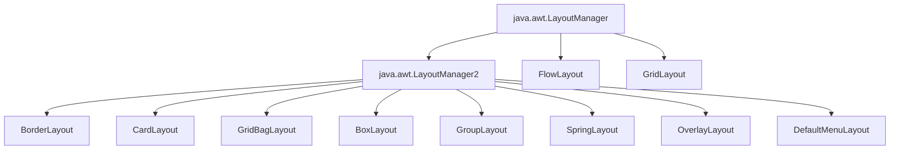

---

## 4.2 `BorderLayout` — 5-Region Partitioning

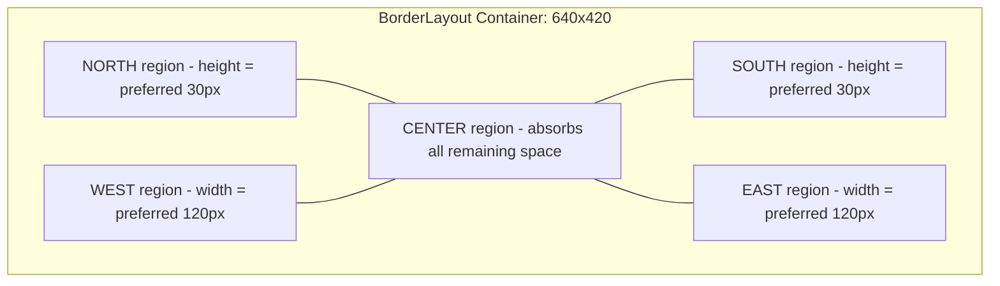

---

## 4.3 `FlowLayout` — Row-Wrapping Logic Flow

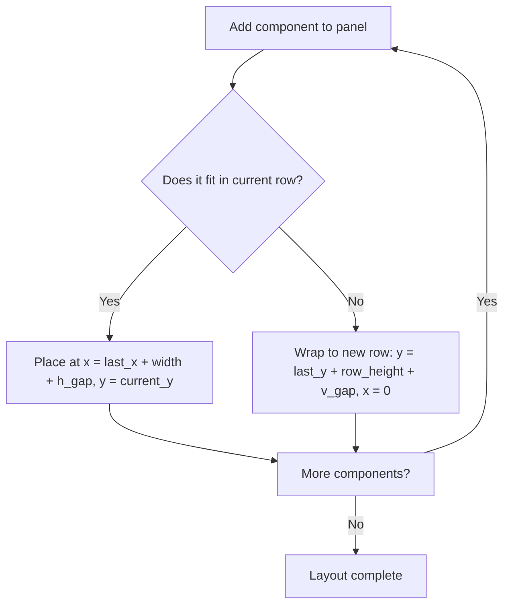

---

## 4.4 `GridLayout` — Equal-Cell Partitioning

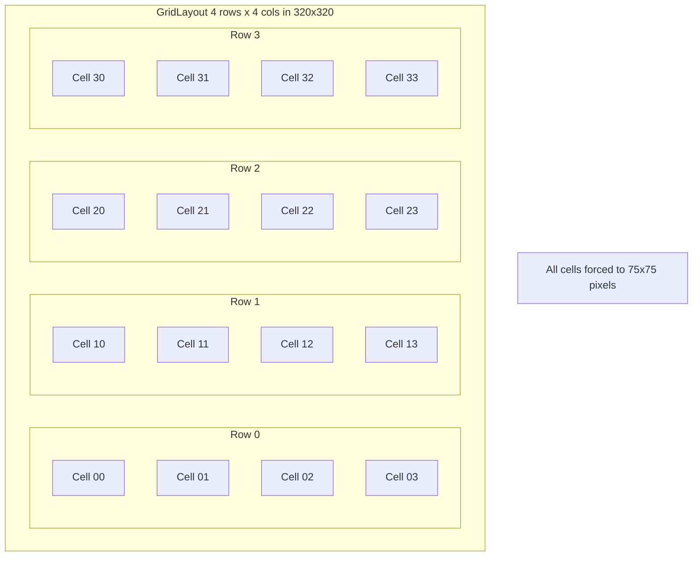

---

## 4.5 `BoxLayout` — Single-Axis Stacking

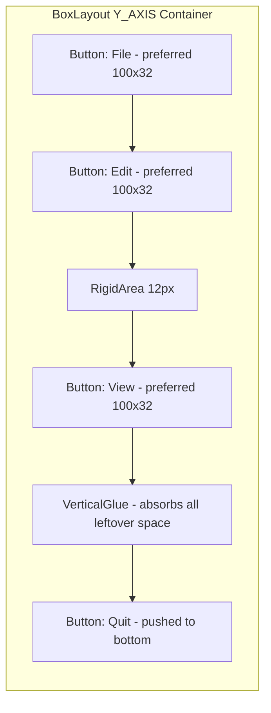

---

## 4.6 `CardLayout` — Stack-of-Cards State Machine

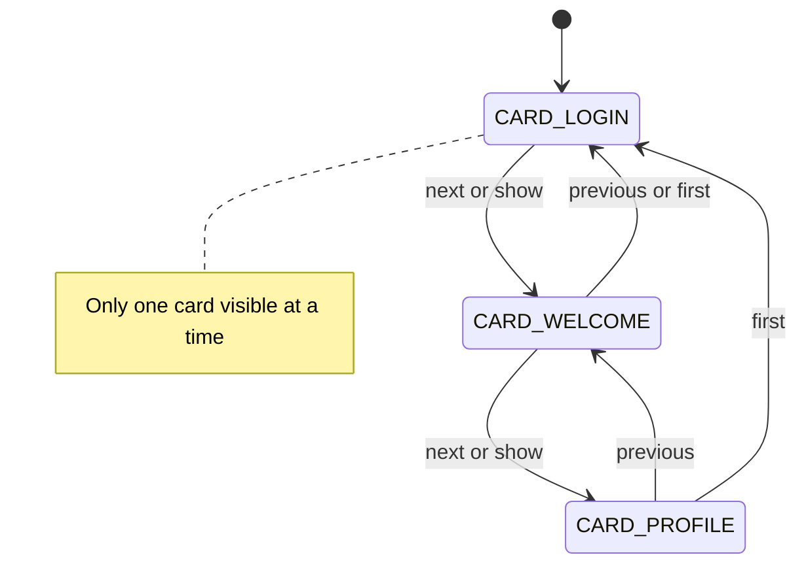

---

## 4.7 `GridBagLayout` — Cell Grid with Per-Component Constraints

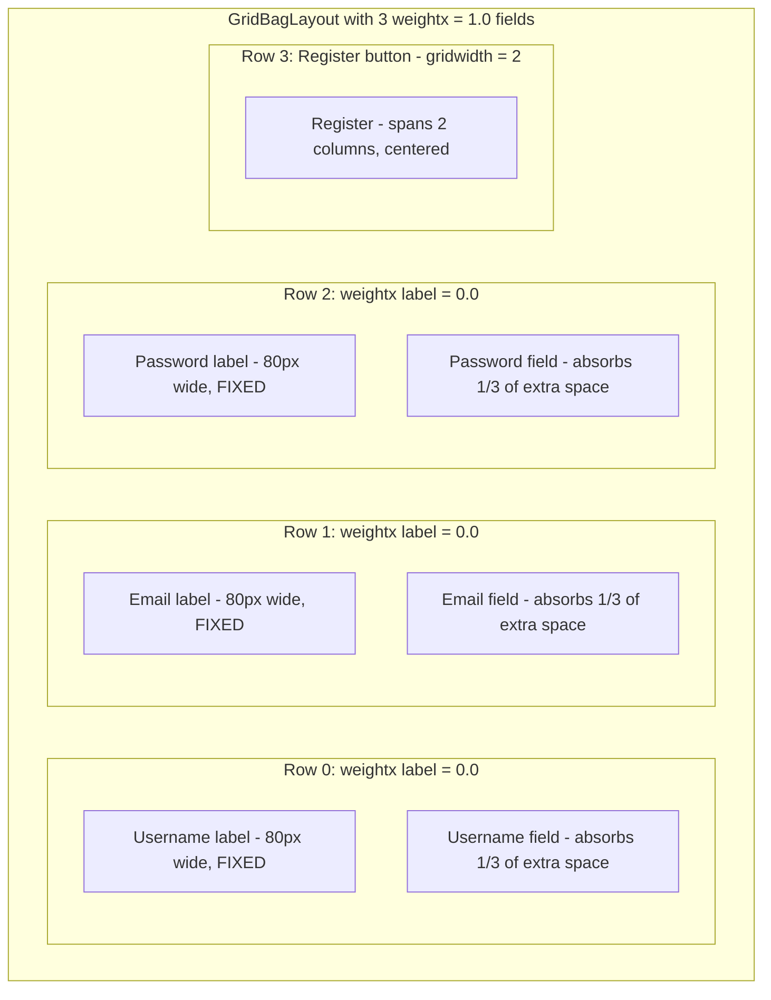

---

## 4.8 `GroupLayout` — Hierarchical Group Tree

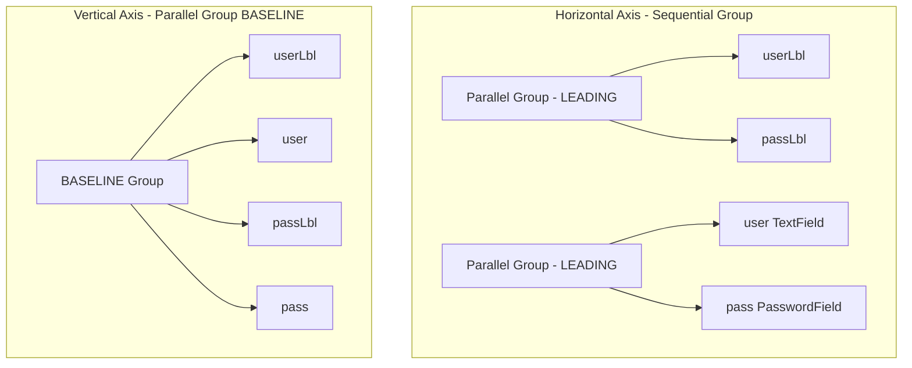

---

## 4.9 The Layout Pipeline Sequence Diagram

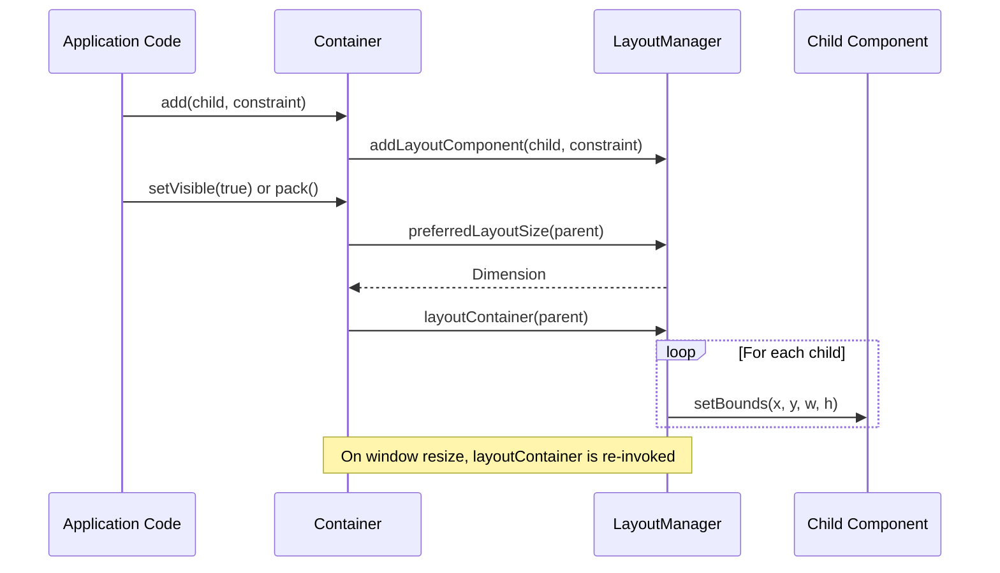

---

## 4.10 The `null` Layout Anti-Pattern Comparison

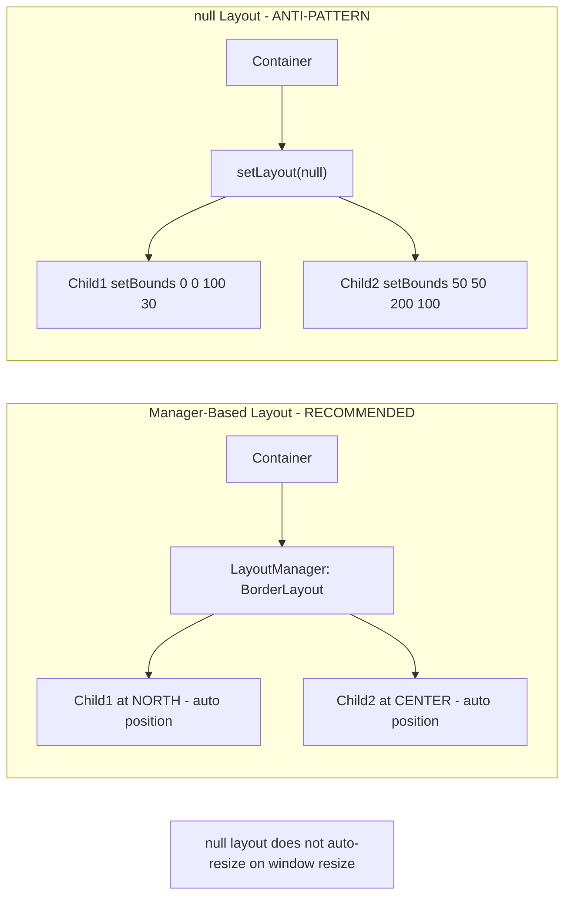

---

## 4.11 The `JFrame` Default Layout Architecture

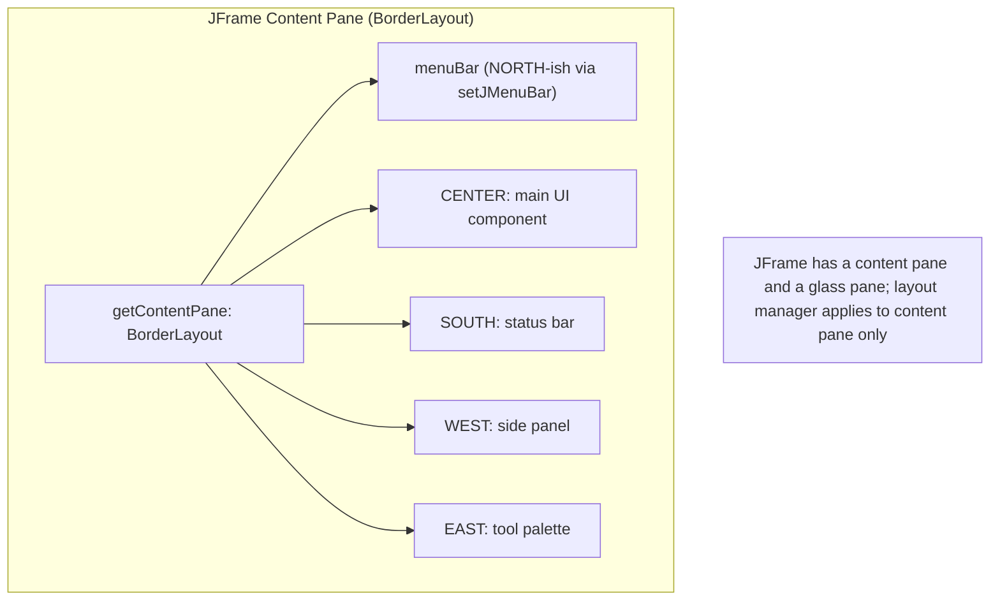

---

## 4.12 The `Box` Glue Mechanism Schematic

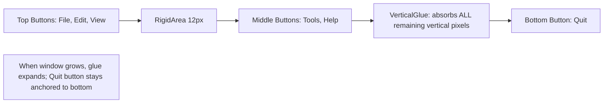

---

<!-- SECTION_4_END -->

<!-- SECTION_5_START -->
# KTU 2024 Scheme Examination Question Bank & Topic Recap

> [!NOTE]
> The following questions are modeled on the **KTU 2024 Scheme ESE pattern**: 3-mark short answers and 14-mark long answers with internal choice. Each carries the simulated exam year, mapped Course Outcome (CO), and Revised Bloom's Taxonomy (RBT) level.

---

## Part A — Short Answer Questions (3 Marks Each)

### Question 1 `[KTU University Exam — Dec 2023]`
**Q: What is a Layout Manager in Java Swing? Why is it preferred over absolute (`null`) positioning?**

**Mapped CO:** CO3 — *Implement object-oriented programs using Java standard libraries*
**RBT Level:** Remember / Understand

**Model Answer (3-Mark Key):**
1. **[Definition — 1 Mark]** A Layout Manager is an object implementing the `java.awt.LayoutManager` (or `LayoutManager2`) interface that **automatically determines the size and position** of components within a `Container` based on the container's current dimensions and the components' preferred/minimum/maximum sizes.
2. **[Resizability benefit — 1 Mark]** When the user resizes the window, the manager **automatically re-flows** the children. With `null` layout, components remain at fixed pixel coordinates and become misaligned/cropped.
3. **[SOLID/SRP benefit — 1 Mark]** Layout managers honor the **Single Responsibility Principle**: the container *owns* the children, the manager *positions* them. This decouples structure from geometry, making the UI portable across platforms (Windows/macOS/Linux) and DPI settings.

---

### Question 2 `[KTU University Exam — July 2024]`
**Q: Differentiate between `GridLayout` and `GridBagLayout`. Mention two distinguishing features.**

**Mapped CO:** CO3
**RBT Level:** Understand

**Model Answer (3-Mark Key):**
1. **[Cell sizing — 1 Mark]** `GridLayout` forces **all cells to be equal-sized**. `GridBagLayout` allows **variable-sized cells** (each cell can span multiple rows/columns).
2. **[Constraint mechanism — 1 Mark]** `GridLayout` is parameterless beyond `(rows, cols, gaps)`. `GridBagLayout` requires a 14-field `GridBagConstraints` object per component (`gridx`, `gridy`, `gridwidth`, `weightx`, `fill`, `anchor`, `insets`, etc.).
3. **[Extra-space distribution — 1 Mark]** `GridLayout` does not distribute extra space preferentially (it just enlarges all cells equally). `GridBagLayout` uses the `weightx`/`weighty` fields to compute **proportional distribution** of leftover pixels. (Formula: $W_{extra,i} = \Delta W \cdot \frac{w_i}{\sum w_j}$.)

---

## Part B — Long Answer Questions (14 Marks Each, Internal Choice)

### Question 3 — Choice A `[KTU University Exam — Dec 2023]`
**Q (a) [7 Marks]:** Explain the `BorderLayout` manager in detail. Write a Java program that uses `BorderLayout` to arrange a menu bar (NORTH), a status label (SOUTH), a navigation tree (WEST), a properties panel (EAST), and an editor text area (CENTER). State the default layout of `JFrame` and explain why the `add()` call must include a region constraint.

**Mapped CO:** CO3, CO4 — *Design and develop GUI-based applications*
**RBT Level:** Understand / Apply

**Model Answer:**

**Part (a) — Conceptual Explanation [4 Marks]**
`BorderLayout` is the **default layout manager** of top-level Swing containers (`JFrame`, `JDialog`, `JWindow`, `JApplet`). It divides the container into **5 geographic regions**: `NORTH`, `SOUTH`, `EAST`, `WEST`, and `CENTER`.

- `NORTH` and `SOUTH` span the **full width** of the container but are confined to their `preferred.height`.
- `EAST` and `WEST` are confined to their `preferred.width` but stretch to fill the **remaining vertical** space after north/south are placed.
- `CENTER` absorbs **all remaining space** in both dimensions.

If a region is empty, its area is absorbed by the adjacent regions (e.g., an empty `WEST` lets `CENTER` extend to the left edge).

**Part (a) — Code [3 Marks]**
```java
import javax.swing.*;
import java.awt.*;

public class BorderLayoutEditor extends JFrame {
    public BorderLayoutEditor() {
        setTitle("BorderLayout Editor");
        setSize(700, 500);
        setDefaultCloseOperation(EXIT_ON_CLOSE);

        // JFrame default is BorderLayout(0,0); we add 8px gaps for clarity
        setLayout(new BorderLayout(8, 8));

        add(new JMenuBar() {{
            add(new JMenu("File"));
            add(new JMenu("Edit"));
        }}, BorderLayout.NORTH);

        add(new JLabel("Ready | Line 1, Col 1"), BorderLayout.SOUTH);

        JTree tree = new JTree();
        add(new JScrollPane(tree), BorderLayout.WEST);

        JPanel props = new JPanel();
        props.setBackground(new Color(230, 230, 250));
        props.add(new JLabel("Properties Panel"));
        add(props, BorderLayout.EAST);

        JTextArea editor = new JTextArea("Start typing...");
        add(new JScrollPane(editor), BorderLayout.CENTER);

        setVisible(true);
    }
    public static void main(String[] args) {
        SwingUtilities.invokeLater(BorderLayoutEditor::new);
    }
}
```

**[Valuation Key Points]**
- [Stating 5 regions correctly: 1 Mark]
- [Explaining resize behavior of CENTER: 1 Mark]
- [Code compiles and uses all 5 regions: 1 Mark]
- [Code uses correct `add(comp, region)` signature: 1 Mark]
- [EDT invocation with `SwingUtilities.invokeLater`: 1 Mark]
- [Valid program output description: 1 Mark]
- [Default-layout explanation: 1 Mark]

**Part (b) — Why Region Constraint is Mandatory [3 Marks]**
The `Container.add(Component)` method without a constraint defaults to `BorderLayout.CENTER`. Since `CENTER` is a single positional slot, the second `add()` call **silently overwrites** the first. The region constraint is the **OOP-correct disambiguation mechanism** — it explicitly tells the manager *which* of the 5 slots the new component belongs to. The constraint is stored by the `LayoutManager2.addLayoutComponent(Component, Object)` call, which `BorderLayout` uses to map the component to its region.

---

### Question 3 — Choice B `[KTU University Exam — July 2024]`
**Q (a) [7 Marks]:** Explain the `GridBagLayout` manager. Describe the significance of `weightx`, `weighty`, `fill`, `anchor`, and `insets` in `GridBagConstraints`. Write a Java program that uses `GridBagLayout` to create a registration form with Username, Email, and Password fields, and a centered "Register" button at the bottom.

**Mapped CO:** CO3, CO4
**RBT Level:** Understand / Apply

**Model Answer:**

**Part (a) — Conceptual Explanation of 5 Constraint Fields [5 Marks, 1 Each]**

| Field | Significance |
| :--- | :--- |
| **`weightx` / `weighty`** | **Distribution ratio** of extra space when the container is enlarged beyond the sum of all preferred sizes. Components with `weight = 0` get **no** extra space (stay at preferred size). Components with positive weight receive extra space *proportionally* to their weight value. The weighting formula: $W_{extra,i} = \Delta W \cdot \frac{w_i}{\sum w_j}$. |
| **`fill`** | Direction in which the component **grows** within its cell when extra space is available. Values: `NONE` (default — component keeps preferred size, `anchor` decides position), `HORIZONTAL`, `VERTICAL`, `BOTH`. |
| **`anchor`** | When `fill = NONE` and the cell is larger than the component, this 9-point compass value determines **where** the component sits within its cell: `CENTER`, `NORTH`, `NORTHEAST`, `EAST`, `SOUTH`, `SOUTHWEST`, `WEST`, `NORTHWEST`, `SOUTHEAST`, `BASELINE`. |
| **`insets`** | `java.awt.Insets` object representing the **external margin** (top, left, bottom, right) around the component, in pixels. Prevents components from touching each other. |
| **`gridx`, `gridy`, `gridwidth`, `gridheight`** | Cell coordinate and span. `gridx=0, gridy=0` is the top-left. `gridwidth=REMAINDER` means "span to end of row". |

**Part (b) — Code [2 Marks]**
*(Refer to Section 3.7 for the full `GridBagLayoutDemo` code. Key elements:)*

```java
JPanel panel = new JPanel(new GridBagLayout());
GridBagConstraints gbc = new GridBagConstraints();
gbc.insets = new Insets(6, 6, 6, 6);
gbc.fill   = GridBagConstraints.HORIZONTAL;

// Label column: no extra space
gbc.gridx = 0; gbc.weightx = 0.0;
panel.add(new JLabel("Username:"), gbc);

// Field column: absorbs extra space
gbc.gridx = 1; gbc.weightx = 1.0;
panel.add(new JTextField(15), gbc);

// ... (Email, Password rows similar)

// Register button spans 2 cols
gbc.gridx = 0; gbc.gridy = 3; gbc.gridwidth = 2;
gbc.anchor = GridBagConstraints.CENTER; gbc.fill = GridBagConstraints.NONE;
panel.add(new JButton("Register"), gbc);
```

**[Valuation Key Points]**
- [Correct description of weightx/weighty with formula: 1 Mark]
- [Correct description of fill: 1 Mark]
- [Correct description of anchor: 1 Mark]
- [Correct description of insets: 1 Mark]
- [Correct description of gridx/gridwidth: 1 Mark]
- [Code compiles and uses 3 labeled fields: 1 Mark]
- [Button spans 2 columns and is centered: 1 Mark]

---

## KTU Examiner's Valuation Warning / Pitfall Callout

> [!WARNING]
> **5 Most Common Marks-Loss Patterns in Swing Layout Manager Questions:**
>
> 1. **Forgetting the region constraint in `BorderLayout`.** Writing `frame.add(btn)` instead of `frame.add(btn, BorderLayout.NORTH)`. Result: silent overwrite, no compile error, evaluator gives 0.
> 2. **Forgetting `revalidate()` after dynamic `setLayout()`.** The components won't appear or re-position. Evaluator will deduct 2 marks for "no visible result on screen."
> 3. **Confusing `setSize()` with `pack()`.** `setSize(800, 600)` *forces* dimensions (bypasses `preferredLayoutSize`). `pack()` *queries* the manager for the ideal size. Forgetting `pack()` is a 1-mark loss.
> 4. **Confusing `setLocationRelativeTo(null)` with `setLocation(0, 0)`.** The former centers the window; the latter places it at the top-left corner. State explicitly which one you used.
> 5. **Constructing Swing components in `main` without `SwingUtilities.invokeLater`.** This is an **EDT violation** — a 2-mark deduction under KTU's "OOP Best Practices" rubric.
> 6. **Writing `gbc.gridx = 1` and then mutating the same `gbc` object without resetting other fields.** `GridBagConstraints` is **stateful** — leftover `gridwidth = 2` from the button row will silently apply to subsequent rows. Always re-set all 14 fields per component.
> 7. **Using `null` layout and not justifying it.** Evaluator will mark 0/7 if asked for a layout manager answer and you bypass it with `setLayout(null); setBounds(...)`.

---

## Topic Recap & Important Things to Remember

> [!IMPORTANT]
> **Rapid-Revision Checklist for KTU PBCST304 — Module 4, Section: Swing Layout Managers**

### 🔑 Core Definitions
- **Layout Manager**: An object implementing `LayoutManager` or `LayoutManager2` that controls child component sizing and positioning inside a `Container`.
- **`LayoutManager2`**: Richer interface adding `addLayoutComponent(Component, Object constraints)` — required for per-component constraints.
- **Preferred/Minimum/Maximum Size**: The three size hints a component reports to the manager.

### 🧭 The 7 Canonical Managers
1. **`BorderLayout`** — 5 regions (N/S/E/W/CENTER). Default on `JFrame`. Center absorbs all extra space.
2. **`FlowLayout`** — Left-to-right, wraps. Default on `JPanel`. Three alignments: `LEFT`/`CENTER`/`RIGHT` (+ `LEADING`/`TRAILING`).
3. **`GridLayout`** — Equal-sized rectangular grid. Constructor: `(rows, cols, hgap, vgap)`.
4. **`BoxLayout`** — Single-axis stacker. Use `Box.createVerticalGlue()` to anchor components.
5. **`CardLayout`** — Stack-of-cards. Show one at a time using `next()`, `previous()`, `show(parent, "name")`.
6. **`GridBagLayout`** — Most powerful. 14-field `GridBagConstraints`. `weightx/y` controls extra-space distribution.
7. **`GroupLayout`** — Hierarchical groups (Sequential + Parallel). Used by NetBeans GUI Builder. Requires `setHorizontalGroup()` + `setVerticalGroup()`.

### 🛠️ The 3 Sacred Re-Layout Methods
1. `container.revalidate()` — Tells AWT the layout is dirty; manager will recompute on next paint.
2. `container.repaint()` — Requests a screen redraw.
3. `container.validate()` — Same as `revalidate()` for AWT1 compatibility (Swing prefers `revalidate()`).

### 🧵 Threading Rule
- **All** Swing component construction must happen on the **Event Dispatch Thread (EDT)**.
- Use `SwingUtilities.invokeLater(Runnable)` at the entry point of `main`.
- Direct `new JFrame()` from `main` is an EDT violation.

### 📐 Key Formulas to Memorize
- **FlowLayout wrap row count**: $N_{row} = \left\lfloor \frac{W_{container} - h_{gap}}{W_{button} + h_{gap}} \right\rfloor$
- **GridLayout cell size**: $W_{cell} = \frac{W - (C+1) \cdot h_{gap}}{C}$
- **GridBagLayout weight distribution**: $W_{extra,i} = \Delta W \cdot \frac{w_i}{\sum_{j=1}^{N} w_j}$
- **BorderLayout center area**: $A_{center} = (W - W_{west} - W_{east}) \times (H - H_{north} - H_{south})$

### 🧩 Manager Selection Cheat-Sheet
| Scenario | Recommended Manager |
| :--- | :--- |
| Top-level window with 4–5 distinct regions | `BorderLayout` |
| Row of dynamic buttons in a toolbar | `FlowLayout` |
| Calculator / chess board | `GridLayout` |
| Vertical sidebar with anchor-bottom button | `BoxLayout` + `VerticalGlue` |
| Wizard / multi-step form | `CardLayout` |
| Complex registration form | `GridBagLayout` |
| IDE-generated form | `GroupLayout` |
| Pixel-perfect game canvas | `null` layout (anti-pattern justified) |

### 🚫 Anti-Patterns to Avoid
- Using `setBounds()` with `setLayout(null)` for non-game UIs.
- Forgetting region constraints in `BorderLayout`.
- Reusing a single `GridBagConstraints` without resetting fields.
- Building Swing components off the EDT.
- Calling `setSize()` when `pack()` is appropriate.

### 🧠 Module-4 SOLiD Connection (Why Layout Managers Matter for Design Principles)
- **SRP**: Container *owns* children; manager *positions* them — separate concerns.
- **OCP**: Swap a manager without modifying the container's child-adding code.
- **LSP**: Every `LayoutManager` is substitutable in the `Container.setLayout(LayoutManager)` slot.
- **DIP**: Container depends on the `LayoutManager` *abstraction*, not on a concrete `BorderLayout`/`GridLayout`.

---

<!-- SECTION_5_END -->
