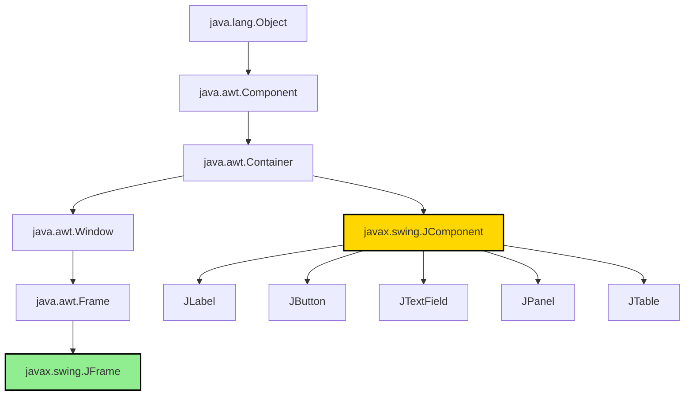
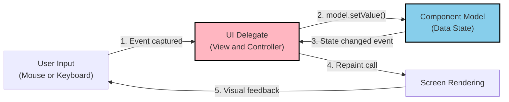
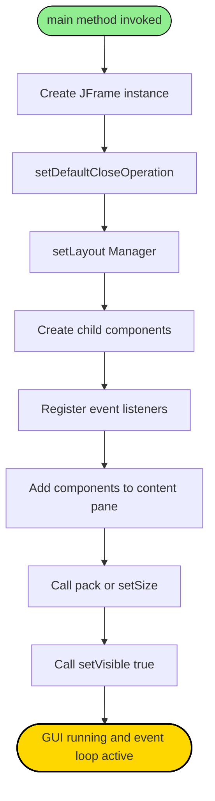
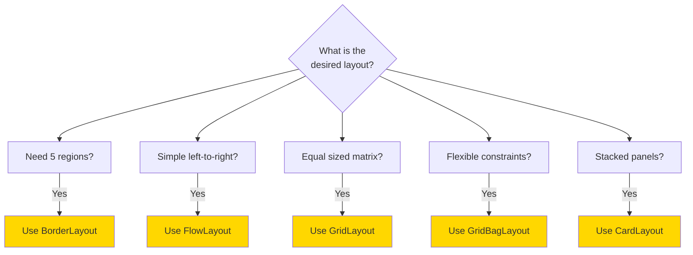

# Swing Packages

<!-- SECTION_1_START -->

# Swing Packages in Java — A Foundational Overview

## 1.1 Formal Definition

> [!IMPORTANT]
> **Swing Packages** in Java refer to the collection of classes and interfaces under the `javax.swing` package hierarchy, introduced as part of Java Foundation Classes (JFC) in **JDK 1.2 (1998)**. Swing provides a rich set of **lightweight, platform-independent GUI (Graphical User Interface) components** that replace and extend the older, heavyweight AWT (Abstract Window Toolkit).

**KTU Syllabus Terminology (2024 Scheme):** The Swing API is a **Model-View-Controller (MVC) based, pluggable look-and-feel, lightweight component framework** used to build desktop GUI applications in Java.

The core package is:

```java
import javax.swing.*;
```

The complete Swing class hierarchy resides in the following packages:

| Package | Purpose |
| :--- | :--- |
| `javax.swing` | Core Swing components (`JButton`, `JLabel`, `JFrame`, etc.) |
| `javax.swing.event` | Swing-specific event classes and listener interfaces |
| `javax.swing.border` | Border classes for Swing components |
| `javax.swing.plaf` | Pluggable Look-And-Feel (UI delegates) |
| `javax.swing.table` | `JTable` model and renderer classes |
| `javax.swing.tree` | `JTree` model and renderer classes |
| `javax.swing.text` | Text components (`JTextField`, `JTextArea`, `JEditorPane`) |

---

## 1.2 Conceptual Analogy / Intuition

> [!NOTE]
> **The "Stage and Actors" Analogy**
>
> Imagine building a theatrical stage. The **AWT** toolkit is like having fixed, rigid backdrops borrowed from the venue — they look different in every theatre (platform-dependent). **Swing**, on the other hand, is like a **modular stage crew** that paints its own backdrops, brings its own lighting, and produces the same show regardless of the venue — that is **platform independence**.

**Why "lightweight"?** Swing components are **100% Java-rendered** — they are *not* peer components of the underlying OS. The OS merely provides a blank canvas (a "top-level container" like `JFrame`), and Swing paints every pixel using Java's own 2D graphics engine.

| Property | AWT | Swing |
| :--- | :--- | :--- |
| Component Type | **Heavyweight** (OS peers) | **Lightweight** (pure Java) |
| Package | `java.awt` | `javax.swing` |
| Look & Feel | Platform-bound | Pluggable / Themeable |
| Component Prefix | `Button`, `Frame` | `JButton`, `JFrame` |
| MVC Support | No | Yes |

---

## 1.3 Top-Level Container Class Hierarchy

The most important class to remember is `java.awt.Container` (from AWT) and its Swing subclass `javax.swing.JComponent`.

```text
java.lang.Object
  └── java.awt.Component
        └── java.awt.Container
              └── javax.swing.JComponent
                    ├── JLabel
                    ├── JButton
                    ├── JTextField
                    ├── JTextArea
                    ├── JPanel
                    ├── JTable
                    └── JTree
```

Top-level containers (which require a peer from the OS) extend `java.awt.Window` and live in Swing as `JFrame`, `JDialog`, and `JApplet`.

> [!VISUALIZATION CONTROL]
> **Concept:** Class inheritance tree of Swing components.
> **Visual Description:** Picture a pyramid. The top of the pyramid is `Object`. Just below is `Component`, then `Container`, then `JComponent` — from which all the visible Swing widgets (`JButton`, `JLabel`, `JTextField`, `JTable`) cascade downward as leaves. The right branch of the pyramid is `Window` → `Frame` → `JFrame` and `Dialog` → `JDialog`.

---

<!-- SECTION_1_END -->

<!-- SECTION_2_START -->

# Deep Theoretical Analysis — The Swing Architecture

## 2.1 The MVC Pattern in Swing

Swing was the **first major Java API to be designed around the Model-View-Controller (MVC) architectural pattern**. Every visible Swing component (e.g., a `JSlider`, `JTree`, `JTable`) is composed of **three collaborating objects**:

1. **Model** — Stores the component's data and state. Example: `DefaultTableModel` for `JTable`, `BoundedRangeModel` for `JScrollBar`.
2. **View** — Renders the data visually on screen.
3. **Controller** — Handles user input (mouse, keyboard) and translates it into model changes.

> [!TIP]
> In modern Swing, the View and Controller are merged into a single **UI Delegate** object (the `ComponentUI` class). This is sometimes called the **"Model-Delegate"** architecture — but the KTU textbook still calls it **MVC**, and so will the exam.

## 2.2 Lightweight vs. Heavyweight Components

> [!IMPORTANT]
> **Heavyweight Components** depend on the OS for rendering (e.g., original AWT `Button`, `TextField`).
> **Lightweight Components** render themselves entirely in Java code, sharing the screen real estate of an underlying heavyweight peer container.

**Rule of Thumb:** If a class name starts with `J`, it is a **lightweight** Swing component — with one exception: `JFrame`, `JDialog`, and `JApplet` are the only *top-level* containers and they **must be heavyweight** because they need direct OS windowing support.

## 2.3 Pluggable Look and Feel (PLAF)

Swing components can dynamically swap their visual appearance at runtime using the `UIManager` class.

```java
UIManager.setLookAndFeel("com.sun.java.swing.plaf.windows.WindowsLookAndFeel");
```

Common Look-and-Feel identifiers:

| Look & Feel | Class String |
| :--- | :--- |
| Metal (Cross-Platform, Default) | `javax.swing.plaf.metal.MetalLookAndFeel` |
| Windows | `com.sun.java.swing.plaf.windows.WindowsLookAndFeel` |
| Motif | `com.sun.java.swing.plaf.motif.MotifLookAndFeel` |
| Nimbus (Java 7+) | `javax.swing.plaf.nimbus.NimbusLookAndFeel` |

## 2.4 Layout Managers

Swing uses **Layout Managers** to arrange components within a container dynamically. The container's `setLayout()` method accepts a `LayoutManager` object.

| Layout Manager | Class | Behavior |
| :--- | :--- | :--- |
| Border Layout | `BorderLayout` | Divides container into 5 regions (North, South, East, West, Center) |
| Flow Layout | `FlowLayout` | Left-to-right, top-to-bottom; default for `JPanel` |
| Grid Layout | `GridLayout` | Equal-sized cells in a matrix |
| Box Layout | `BoxLayout` | Single row or column, respects preferred sizes |
| Grid Bag Layout | `GridBagLayout` | The most flexible; uses `GridBagConstraints` |
| Card Layout | `CardLayout` | Stack of panels, only one visible at a time |
| Group Layout | `GroupLayout` | Used by GUI builders like NetBeans |
| Spring Layout | `SpringLayout` | Spring-based constraints |

## 2.5 KTU High-Yield Formula Sheet

| Concept | Syntax / Equation | Description |
| :--- | :--- | :--- |
| Importing Swing | `import javax.swing.*;` | Brings in all Swing classes |
| Frame Creation | `JFrame f = new JFrame("Title");` | Top-level window |
| Visibility | `f.setVisible(true);` | Displays the window on screen |
| Default Close | `f.setDefaultCloseOperation(JFrame.EXIT_ON_CLOSE);` | Closes JVM on X click |
| Size | `f.setSize(width, height);` | Sets window dimensions in pixels |
| Adding Components | `Container c = f.getContentPane(); c.add(btn);` | Add to content pane |
| Layout | `f.setLayout(new FlowLayout());` | Assign a layout manager |
| Event Hook | `btn.addActionListener(this);` | Register an event handler |

> [!WARNING]
> The standard event-handling method signature that the KTU examiner expects is:
>
> ```java
> public void actionPerformed(ActionEvent e) { ... }
> ```
> Note the exact spelling — it is **"Performed"**, not "Perform".

## 2.6 Real-World Engineering Utility

Swing is used in:

- **Enterprise desktop tools**: IDEs like NetBeans, IntelliJ (initial versions), Eclipse (uses SWT but is similar in concept).
- **Internal banking/ATM software** (legacy).
- **Scientific simulation GUIs** (e.g., MATLAB's old interface).
- **Point-of-Sale (POS) terminals** in retail.
- **Education & research labs** for rapid UI prototyping without HTML/CSS.

While modern Java GUI has shifted to **JavaFX**, Swing remains a **mandatory KTU syllabus topic** and is widely present in **legacy production systems** still in operation.

---

<!-- SECTION_2_END -->

<!-- SECTION_3_START -->

# Step-by-Step Implementation — Swing Components in Action

## 3.1 Program 1: The Classic "Hello Swing" First Window

```java
import javax.swing.JFrame;
import javax.swing.JLabel;
import java.awt.FlowLayout;

public class HelloSwing {
    public static void main(String[] args) {
        // Step 1: Create the top-level window (heavyweight container)
        JFrame frame = new JFrame("My First Swing Window");

        // Step 2: Configure the window's close behaviour
        frame.setDefaultCloseOperation(JFrame.EXIT_ON_CLOSE);

        // Step 3: Set a layout manager (FlowLayout is the simplest)
        frame.setLayout(new FlowLayout());

        // Step 4: Create a lightweight component (JLabel)
        JLabel label = new JLabel("Welcome to Java Swing!");

        // Step 5: Add the component to the content pane
        frame.add(label);

        // Step 6: Auto-size based on contents (alternative to setSize)
        frame.pack();

        // Step 7: Make the window appear on screen
        frame.setVisible(true);
    }
}
```

**Line-by-line Explanation:**

| Line | What it does | KTU Board Mark Weight |
| :---: | :--- | :---: |
| 1–3 | Imports the classes used | 1 |
| 5 | `JFrame` constructor takes a `String` title | 1 |
| 7 | `EXIT_ON_CLOSE` terminates the JVM | 1 |
| 9 | `setLayout()` accepts any `LayoutManager` | 1 |
| 11 | `JLabel` is a passive display component | 1 |
| 13 | `add()` attaches the component to the content pane | 1 |
| 15 | `pack()` computes the ideal size from components | 1 |
| 17 | `setVisible(true)` triggers Swing to paint the UI | 1 |

---

## 3.2 Program 2: A Simple Calculator-Style Button Grid (Event Handling)

```java
import javax.swing.*;
import java.awt.*;
import java.awt.event.*;

public class ButtonGridDemo extends JFrame implements ActionListener {

    private JLabel displayLabel;
    private String currentInput = "";

    // Constructor — builds the GUI
    public ButtonGridDemo() {
        setTitle("Swing Button Grid Demo");
        setDefaultCloseOperation(JFrame.EXIT_ON_CLOSE);
        setSize(300, 400);
        setLayout(new BorderLayout());

        // --- Display at the top (NORTH region) ---
        displayLabel = new JLabel("0");
        displayLabel.setHorizontalAlignment(JLabel.RIGHT);
        displayLabel.setFont(new Font("Arial", Font.BOLD, 24));
        add(displayLabel, BorderLayout.NORTH);

        // --- Button grid in the CENTER region ---
        JPanel buttonPanel = new JPanel();
        buttonPanel.setLayout(new GridLayout(3, 3, 5, 5));

        String[] labels = {"1", "2", "3", "4", "5", "6", "7", "8", "9"};
        for (String text : labels) {
            JButton btn = new JButton(text);
            btn.addActionListener(this);  // Register THIS frame as listener
            buttonPanel.add(btn);
        }
        add(buttonPanel, BorderLayout.CENTER);
    }

    // The Controller — called when any button is clicked
    @Override
    public void actionPerformed(ActionEvent e) {
        JButton source = (JButton) e.getSource();
        currentInput += source.getText();
        displayLabel.setText(currentInput);
    }

    // Entry point
    public static void main(String[] args) {
        ButtonGridDemo app = new ButtonGridDemo();
        app.setVisible(true);
    }
}
```

**Why `implements ActionListener`?** This is the classic KTU pattern: the **frame itself** acts as the event handler, so `actionPerformed()` is implemented inside the same class. This avoids creating separate listener classes for small programs.

---

## 3.3 Program 3: Demonstrating Layout Managers Side by Side

```java
import javax.swing.*;
import java.awt.*;

public class LayoutShowcase extends JFrame {
    public LayoutShowcase() {
        setTitle("Layout Manager Showcase");
        setDefaultCloseOperation(JFrame.EXIT_ON_CLOSE);
        setSize(500, 400);
        setLayout(new GridLayout(2, 2, 10, 10)); // 2x2 grid for 4 demos

        // --- Panel 1: BorderLayout ---
        JPanel p1 = new JPanel(new BorderLayout());
        p1.setBorder(BorderFactory.createTitledBorder("BorderLayout"));
        p1.add(new JButton("North"), BorderLayout.NORTH);
        p1.add(new JButton("South"), BorderLayout.SOUTH);
        p1.add(new JButton("East"),  BorderLayout.EAST);
        p1.add(new JButton("West"),  BorderLayout.WEST);
        p1.add(new JButton("Center"),BorderLayout.CENTER);
        add(p1);

        // --- Panel 2: FlowLayout ---
        JPanel p2 = new JPanel(new FlowLayout());
        p2.setBorder(BorderFactory.createTitledBorder("FlowLayout"));
        p2.add(new JButton("A"));
        p2.add(new JButton("B"));
        p2.add(new JButton("C"));
        p2.add(new JButton("D"));
        add(p2);

        // --- Panel 3: GridLayout 2x2 ---
        JPanel p3 = new JPanel(new GridLayout(2, 2, 5, 5));
        p3.setBorder(BorderFactory.createTitledBorder("GridLayout 2x2"));
        p3.add(new JButton("1"));
        p3.add(new JButton("2"));
        p3.add(new JButton("3"));
        p3.add(new JButton("4"));
        add(p3);

        // --- Panel 4: BoxLayout (vertical column) ---
        JPanel p4 = new JPanel();
        p4.setLayout(new BoxLayout(p4, BoxLayout.Y_AXIS));
        p4.setBorder(BorderFactory.createTitledBorder("BoxLayout (Y)"));
        p4.add(new JButton("Top"));
        p4.add(new JButton("Middle"));
        p4.add(new JButton("Bottom"));
        add(p4);
    }

    public static void main(String[] args) {
        new LayoutShowcase().setVisible(true);
    }
}
```

---

## 3.4 Program 4: Inner-Class Event Handling (The Preferred KTU Pattern)

```java
import javax.swing.*;
import java.awt.*;
import java.awt.event.*;

public class InnerClassDemo extends JFrame {
    private JTextField nameField;
    private JLabel outputLabel;

    public InnerClassDemo() {
        setTitle("Inner Class Listener Demo");
        setSize(350, 150);
        setDefaultCloseOperation(JFrame.EXIT_ON_CLOSE);
        setLayout(new FlowLayout());

        add(new JLabel("Enter Name: "));
        nameField = new JTextField(15);
        add(nameField);

        JButton greetBtn = new JButton("Greet");
        add(greetBtn);

        outputLabel = new JLabel(" ");
        add(outputLabel);

        // --- Inner anonymous class as the listener ---
        greetBtn.addActionListener(new ActionListener() {
            @Override
            public void actionPerformed(ActionEvent e) {
                String name = nameField.getText();
                outputLabel.setText("Hello, " + name + "!");
            }
        });
    }

    public static void main(String[] args) {
        new InnerClassDemo().setVisible(true);
    }
}
```

**Why this matters for the exam:** KTU board examiners reward the **anonymous inner class** form because it cleanly demonstrates **encapsulation of the handler** with the data it operates on. It avoids polluting the enclosing class with a single, reusable method.

---

## 3.5 Program 5: Adding an Icon to a `JButton`

```java
import javax.swing.*;
import java.awt.*;

public class IconButtonDemo extends JFrame {
    public IconButtonDemo() {
        setTitle("Iconic Button");
        setSize(250, 150);
        setDefaultCloseOperation(JFrame.EXIT_ON_CLOSE);
        setLayout(new FlowLayout());

        // Path is relative to the project working directory
        ImageIcon icon = new ImageIcon("src/images/ok.png");
        JButton okBtn = new JButton("Click Me", icon);
        okBtn.setHorizontalTextPosition(SwingConstants.CENTER);
        okBtn.setVerticalTextPosition(SwingConstants.BOTTOM);
        add(okBtn);
    }

    public static void main(String[] args) {
        new IconButtonDemo().setVisible(true);
    }
}
```

> [!TIP]
> KTU students often lose marks by **forgetting the image path**. Always use a path **relative to the project root** (e.g., `src/images/ok.png`) and confirm the file is actually inside the project's working directory.

---

## 3.6 Program 6: `JTable` with a `DefaultTableModel`

```java
import javax.swing.*;
import javax.swing.table.DefaultTableModel;

public class TableDemo extends JFrame {
    public TableDemo() {
        setTitle("JTable Demo");
        setSize(400, 200);
        setDefaultCloseOperation(JFrame.EXIT_ON_CLOSE);

        // Model holds the actual data
        String[] columns = {"Roll No", "Name", "Marks"};
        Object[][] data = {
            {101, "Arjun", 88},
            {102, "Meera", 92},
            {103, "Rahul", 76}
        };
        DefaultTableModel model = new DefaultTableModel(data, columns);

        // View renders the model
        JTable table = new JTable(model);
        JScrollPane scrollPane = new JScrollPane(table);
        add(scrollPane);

        setVisible(true);
    }

    public static void main(String[] args) {
        new TableDemo();
    }
}
```

**Why wrap `JTable` in `JScrollPane`?** Without a scroll pane, the column headers disappear and only a fixed rectangular slice of the table is shown.

---

## 3.7 Common Event Listener Interfaces

| Event Type | Listener Interface | Method Signature |
| :--- | :--- | :--- |
| Button click | `ActionListener` | `void actionPerformed(ActionEvent e)` |
| Mouse click | `MouseListener` | `void mouseClicked(MouseEvent e)` |
| Key press | `KeyListener` | `void keyTyped(KeyEvent e)` |
| Window close | `WindowListener` | `void windowClosing(WindowEvent e)` |
| Item change | `ItemListener` | `void itemStateChanged(ItemEvent e)` |
| Focus change | `FocusListener` | `void focusGained(FocusEvent e)` |
| Mouse motion | `MouseMotionListener` | `void mouseMoved(MouseEvent e)` |

---

<!-- SECTION_3_END -->

<!-- SECTION_4_START -->

# Structural Diagrams & Schematics

## 4.1 Mermaid Flowchart — Swing Component Hierarchy



## 4.2 Mermaid Block — MVC Data Flow in a Swing Component



## 4.3 Mermaid Block — Sequential Processing Topology of a Swing Application Startup



## 4.4 Mermaid Block — Layout Manager Selection Matrix



---

<!-- SECTION_4_END -->

<!-- SECTION_5_START -->

# KTU 2024 Scheme Examination Question Bank

## Part A — Short Answer Questions (3 Marks Each)

> **Q1.** **[KTU University Exam — July 2024]** Differentiate between AWT and Swing.
>
> **Model Answer (3 Marks):**
>
> | Feature | AWT | Swing |
> | :--- | :--- | :--- |
> | Package | `java.awt` | `javax.swing` |
> | Component type | Heavyweight (OS peers) | Lightweight (pure Java) |
> | Look and feel | Platform dependent | Pluggable via `UIManager` |
> | Component prefix | `Button`, `Label` | `JButton`, `JLabel` |
> | MVC support | Not built-in | Built-in |
> | Performance | Faster (native) | Slightly slower (Java rendered) |
>
> **[Award 3 marks for a clean comparison covering at least 3 rows]**

> **Q2.** **[KTU University Exam — Dec 2023]** What is a lightweight component? Give an example.
>
> **Model Answer (3 Marks):**
>
> A **lightweight component** is one that does not rely on the operating system for rendering. It is drawn entirely in Java code on top of a native heavyweight container. Lightweight components are platform-independent and support the **pluggable look-and-feel** architecture.
>
> **Examples:** `JButton`, `JLabel`, `JTextField`, `JPanel`, `JTable`.
>
> **Exception:** `JFrame`, `JDialog`, and `JApplet` are **heavyweight** top-level containers because they require native window manager support.
>
> **[1 mark: definition, 1 mark: example, 1 mark: exception note]**

---

## Part B — Long Answer Questions (14 Marks Each, with Internal Choice)

### Question A (14 Marks)

> **Q3(a).** **[KTU University Exam — July 2024 — CO2, Understand — 7 Marks]** Explain the Swing class hierarchy with a neat diagram. List any **five** lightweight components.
>
> **Model Answer:**
>
> The Swing class hierarchy begins at `java.lang.Object` and extends to `java.awt.Component`, then to `java.awt.Container`. From `Container`, two branches emerge:
>
> 1. The lightweight branch: `javax.swing.JComponent` (parent of all `J` prefixed widgets).
> 2. The heavyweight branch: `java.awt.Window` → `java.awt.Frame` → `javax.swing.JFrame`.
>
> ```
> java.lang.Object
>   └── java.awt.Component
>         └── java.awt.Container
>               ├── javax.swing.JComponent
>               │     ├── JLabel
>               │     ├── JButton
>               │     ├── JTextField
>               │     ├── JCheckBox
>               │     ├── JRadioButton
>               │     └── JTable
>               └── java.awt.Window
>                     └── java.awt.Frame
>                           └── javax.swing.JFrame
> ```
>
> **Five Lightweight Components:**
> 1. `JButton` — clickable button.
> 2. `JLabel` — passive text or icon display.
> 3. `JTextField` — single-line text input.
> 4. `JCheckBox` — toggle checkbox.
> 5. `JTable` — tabular data display.
>
> **Valuation Key:**
> - [Drawing the hierarchy with at least 3 levels: 3 Marks]
> - [Identifying the two branches (lightweight vs top-level): 2 Marks]
> - [Listing 5 lightweight components with one-line purpose: 2 Marks]

> **Q3(b).** **[KTU University Exam — Dec 2023 — CO3, Apply — 7 Marks]** Write a Java Swing program to create a window with a `JTextField`, a `JButton` labeled "Show", and a `JLabel`. When the button is clicked, the text from the `JTextField` should appear in the `JLabel` prefixed with "Hello, ".
>
> **Model Answer:**
>
> ```java
> import javax.swing.*;
> import java.awt.*;
> import java.awt.event.*;
>
> public class GreetApp extends JFrame implements ActionListener {
>     private JTextField nameField;
>     private JLabel outputLabel;
>
>     public GreetApp() {
>         setTitle("Greet Application");
>         setSize(350, 150);
>         setDefaultCloseOperation(JFrame.EXIT_ON_CLOSE);
>         setLayout(new FlowLayout());
>
>         nameField = new JTextField(15);
>         add(nameField);
>
>         JButton showBtn = new JButton("Show");
>         showBtn.addActionListener(this);
>         add(showBtn);
>
>         outputLabel = new JLabel("Result will appear here");
>         add(outputLabel);
>     }
>
>     @Override
>     public void actionPerformed(ActionEvent e) {
>         String name = nameField.getText();
>         outputLabel.setText("Hello, " + name + "!");
>     }
>
>     public static void main(String[] args) {
>         new GreetApp().setVisible(true);
>     }
> }
> ```
>
> **Valuation Key:**
> - [Correct import statements: 1 Mark]
> - [Implementing `ActionListener`: 1 Mark]
> - [Proper frame setup (title, size, close operation, layout): 1 Mark]
> - [Creating all 3 components and adding them: 1 Mark]
> - [Registering listener with `addActionListener(this)`: 1 Mark]
> - [Correct `actionPerformed` logic with `getText()` and `setText()`: 2 Marks]

### Question B (14 Marks) — Alternative Choice

> **Q4(a).** **[KTU University Exam — July 2023 — CO2, Understand — 7 Marks]** Explain the MVC architecture as applied to Swing components.
>
> **Model Answer:**
>
> Swing components are designed around the **Model-View-Controller (MVC)** pattern, which decouples data from presentation:
>
> - **Model:** Stores the state of the component. Example: `DefaultTableModel` for `JTable`, `ButtonModel` for `JButton`.
> - **View:** The visual rendering of the component.
> - **Controller:** Handles user input events and forwards them to the model.
>
> **In Swing, the View and Controller are merged into a single `ComponentUI` object** (the UI delegate), so the architecture is sometimes called **"Model-Delegate"**. However, KTU syllabus still uses the MVC terminology.
>
> **Advantages of MVC in Swing:**
> 1. Multiple views can share a single model.
> 2. Pluggable look-and-feel can be swapped without changing the model.
> 3. Easier to unit-test the data layer independently of the UI.
>
> **Valuation Key:**
> - [Defining Model, View, Controller individually: 3 Marks]
> - [Swing-specific UI Delegate clarification: 2 Marks]
> - [Listing 2 advantages: 2 Marks]

> **Q4(b).** **[KTU University Exam — Dec 2024 — CO3, Apply — 7 Marks]** Write a Java Swing program using **`BorderLayout`** to place five buttons labeled "NORTH", "SOUTH", "EAST", "WEST", "CENTER" in their respective regions of a `JFrame`.
>
> **Model Answer:**
>
> ```java
> import javax.swing.*;
> import java.awt.*;
>
> public class BorderLayoutDemo extends JFrame {
>     public BorderLayoutDemo() {
>         setTitle("BorderLayout Demonstration");
>         setSize(400, 300);
>         setDefaultCloseOperation(JFrame.EXIT_ON_CLOSE);
>         setLayout(new BorderLayout(10, 10)); // 10px horizontal and vertical gaps
>
>         add(new JButton("NORTH"),  BorderLayout.NORTH);
>         add(new JButton("SOUTH"),  BorderLayout.SOUTH);
>         add(new JButton("EAST"),   BorderLayout.EAST);
>         add(new JButton("WEST"),   BorderLayout.WEST);
>         add(new JButton("CENTER"), BorderLayout.CENTER);
>     }
>
>     public static void main(String[] args) {
>         new BorderLayoutDemo().setVisible(true);
>     }
> }
> ```
>
> **Valuation Key:**
> - [Frame setup: 1 Mark]
> - [`BorderLayout` instantiation: 1 Mark]
> - [Adding all 5 buttons in the correct regions: 3 Marks]
> - [Compilable code: 1 Mark]
> - [Output understanding (CENTER takes remaining space): 1 Mark]

---

> [!WARNING]
> **KTU Examiner's Valuation Warning — Common Pitfalls**
>
> 1. **Importing `java.awt.*` but using `JFrame`:** Will not compile. Always add `import javax.swing.*;`.
> 2. **Forgetting `setVisible(true)`:** The window never appears. Examiners deduct full marks.
> 3. **Forgetting `EXIT_ON_CLOSE`:** The window closes but the JVM keeps running, causing confusion in the output.
> 4. **Spelling mistake: `actionPerformed`** — it is one word, **no underscore**.
> 5. **Adding components directly to `JFrame`:** Modern Swing requires `frame.getContentPane().add(component)` or simply `frame.add(component)` (which is auto-forwarded to the content pane in JDK 5+). The KTU textbook uses the direct `add()` form.
> 6. **Layout confusion with `BorderLayout`:** If you forget to specify the region, the button lands in `CENTER` by default and overlaps any previously centered component.

---

## Topic Recap & Important Things to Remember

- **Swing** is the **lightweight, MVC-based, pluggable look-and-feel** GUI toolkit in `javax.swing`.
- All Swing component class names start with **`J`** (e.g., `JButton`, `JFrame`).
- **`JComponent`** is the root class for all lightweight Swing components.
- **`JFrame`, `JDialog`, `JApplet`** are the only **heavyweight** Swing classes (they need OS windows).
- **MVC** in Swing: **Model** = data, **View** = rendering, **Controller** = input. The latter two are merged into a `ComponentUI` (UI Delegate).
- **Layout Managers** govern component placement: `FlowLayout` (default for `JPanel`), `BorderLayout` (default for `JFrame`'s content pane), `GridLayout`, `BoxLayout`, `GridBagLayout`, `CardLayout`, `GroupLayout`.
- **Event Handling** uses the **Delegation Event Model** — components delegate events to registered listeners.
- The five most common listener interfaces: `ActionListener`, `MouseListener`, `KeyListener`, `WindowListener`, `ItemListener`.
- **Pluggable Look and Feel** is changed via `UIManager.setLookAndFeel(...)`.
- **`pack()`** auto-sizes the frame to fit its components; `setSize()` uses fixed pixel dimensions.
- **`ImageIcon`** wraps an image for use in labels and buttons.
- **`JTable` requires `JScrollPane`** for the headers to be visible.
- **AWT** is heavyweight and platform-dependent; **Swing** is lightweight and platform-independent.
- Swing uses **single-threaded rule** for GUI updates: all UI updates must happen on the **Event Dispatch Thread (EDT)**.
- The standard event-handler method is **`public void actionPerformed(ActionEvent e)`** — never `performAction`, never `action_event`.
- Top-level container = `JFrame`; intermediate container = `JPanel`; atomic component = `JButton`, `JLabel`, etc.
- Swing is still used in **legacy enterprise software**, IDEs, and educational labs — knowing it remains a KTU-mandated skill.

---

<!-- SECTION_5_END -->
