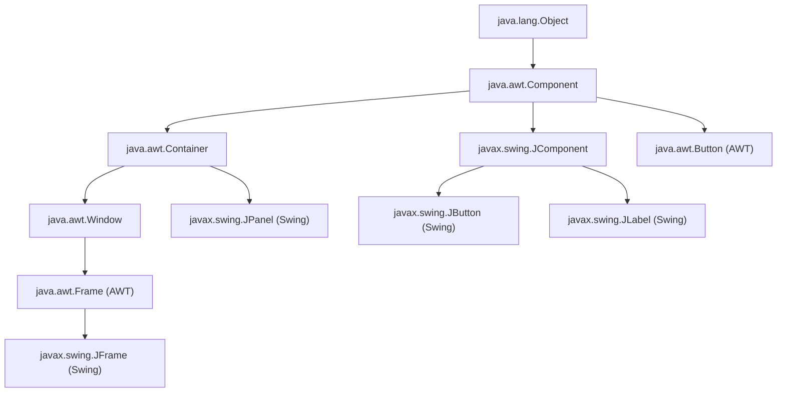
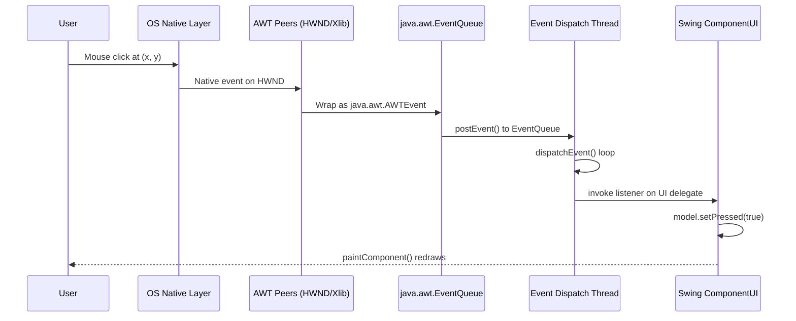
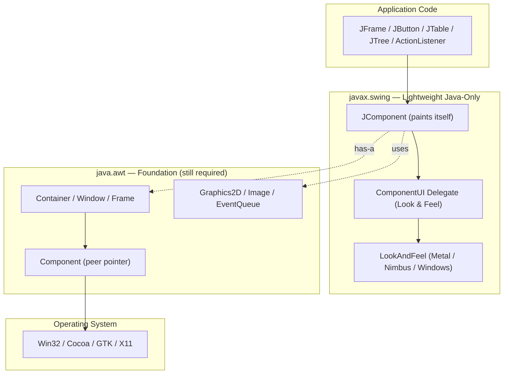
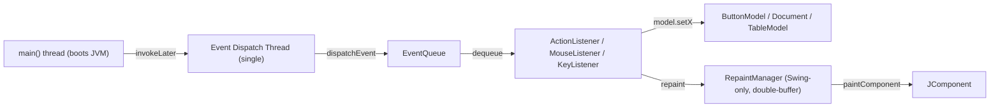
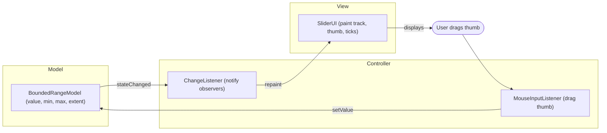
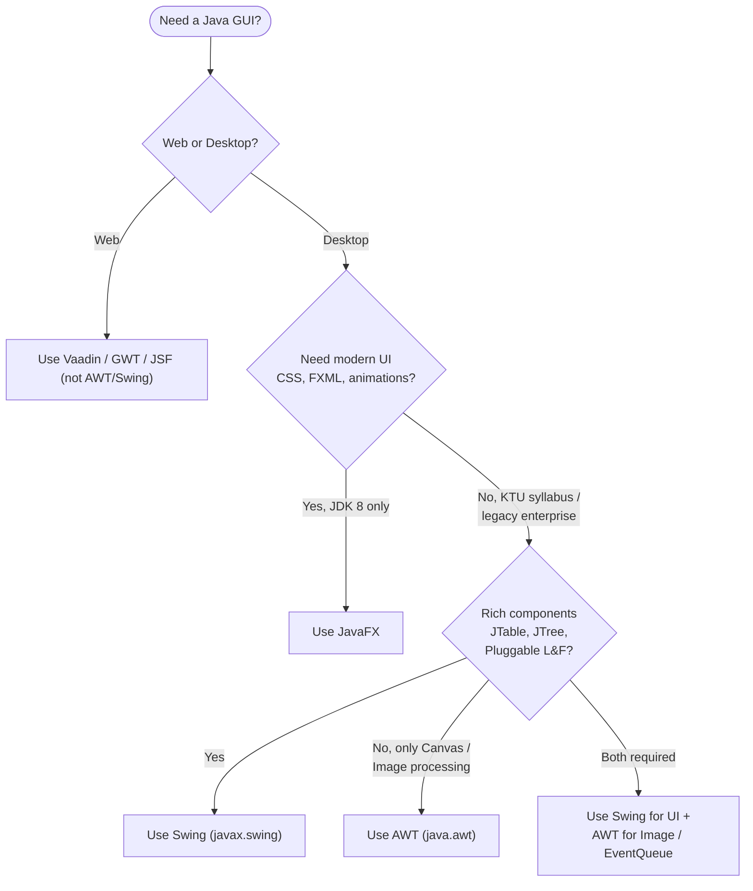

# Swing v/s AWT

<!-- SECTION_1_START -->
# Swing vs AWT (Abstract Window Toolkit)

## 1. Core Technical Definition & Intuitive Overview

### Formal Definition (KTU Syllabus Terminology)

> [!NOTE]
> **AWT (Abstract Window Toolkit)** is the original, platform-dependent Java GUI (Graphical User Interface) framework provided in `java.awt` package. It uses **peer-based, heavyweight components** that delegate rendering to the host operating system's native GUI toolkit (e.g., Win32 on Windows, Cocoa on macOS, Xlib on Linux).
>
> **Swing** is the next-generation, lightweight GUI framework provided in `javax.swing` package. It is built **on top of AWT** and uses 100% Java-rendered components, following the **MVC (Model-View-Controller)** architecture and supporting the **Pluggable Look and Feel (PL&F)** paradigm.

### Conceptual Analogy / Intuition

> [!IMPORTANT]
> **Real-World Analogy — "The Hotel Chain vs The Franchise Model"**
>
> 🏨 **AWT is like a Hotel Chain** — Every property is built, furnished, and run by the *local contractor* of that city. A hotel in Tokyo looks Japanese, in Paris looks French. You get **native look**, but you have **no control over room interiors, and quality varies by city**.
>
> 🏢 **Swing is like a Franchise** — A central design team in head-office draws the *exact blueprint* (sofa shape, wall color, tile pattern). Every branch in the world builds the room **identically from the blueprint**, then optionally *overlays* a local theme (skin). You get **consistent behavior, identical look by default, and easy theming**.
>
> In technical terms: AWT = "OS does the painting"; Swing = "Java does the painting, AWT only provides the window."

### Key Physical / Design Constants

- **Heavyweight Component (AWT):** Each AWT component has a *native peer* (a native OS object) — represented by the class `java.awt.Component.peer` (package-private).
- **Lightweight Component (Swing):** Has *no native peer*; painted entirely by `javax.swing.JComponent.paintComponent(Graphics g)`.
- **AWT Package:** `java.awt` (since **JDK 1.0**, 1996).
- **Swing Package:** `javax.swing` (since **JDK 1.2**, 1998) — `javax` prefix historically meant "Java Extension".
- **Root AWT container for top-level windows:** `java.awt.Frame`.
- **Root Swing container for top-level windows:** `javax.swing.JFrame` (which internally *contains* an AWT `Frame`).

### Visualization / Hierarchy

> [!VISUALIZATION CONTROL]
> **Concept:** Class hierarchy — AWT `Component` tree vs Swing `JComponent` tree
> **Diagram Reference (mental model):**
> ```
> java.lang.Object
>   └── java.awt.Component
>         ├── java.awt.Container
>         │     ├── java.awt.Window
>         │     │     └── java.awt.Frame  ← (AWT top-level)
>         │     └── java.awt.Panel
>         └── javax.swing.JComponent  (overrides paint)
>               ├── javax.swing.AbstractButton
>               │     ├── javax.swing.JButton
>               │     └── javax.swing.JMenuItem
>               ├── javax.swing.JLabel
>               └── javax.swing.JPanel
>               └── javax.swing.JFrame  ← (Swing top-level, HAS-A Frame)
> ```
> **Visual Description:** Observe that every Swing component ultimately inherits from `java.awt.Component`, confirming Swing is *built-on*, not *replacing*, AWT.

### Mermaid Class Hierarchy



> [!TIP]
> **KTU Quick Recall:** The mnemonic **"J is for Java-rendered"** — any Swing class begins with **J** (JButton, JFrame, JPanel) and is **lightweight (no native peer)**.

---

<!-- SECTION_1_END -->

<!-- SECTION_2_START -->
# 2. Deep Theoretical Analysis & KTU High-Yield Formula Sheet

## 2.1 Architectural Deep-Dive

### AWT — Peer-Based Heavyweight Model

1. Every AWT component (e.g., `Button`, `TextField`, `Choice`) **allocates a corresponding native OS resource** (a Win32 `HWND` on Windows, an `NSView` on macOS).
2. Java code acts as a **thin JNI wrapper**; the actual painting, event routing, and hit-testing are handled by the OS.
3. Each AWT component must inherit its class behaviour from the *Component peer* — you **cannot override `paint(Graphics g)`** for genuine native rendering, only for hacks.
4. This dependency means **"Write Once, Debug Everywhere"** in the pre-Swing era.

### Swing — Lightweight + MVC + PL&F Model

1. Every Swing component (e.g., `JButton`, `JTree`, `JTable`) is **pure Java** — it has **no native peer**.
2. The component's *look* (visual rendering) and *feel* (input behaviour) are delegated to a `ComponentUI` delegate installed by the current `LookAndFeel`.
3. The internal architecture follows **MVC**:
   - **Model:** e.g., `ButtonModel` — stores state (pressed, enabled, selected).
   - **View:** e.g., `BasicButtonUI` (or WindowsButtonUI, MotifButtonUI) — paints the component.
   - **Controller:** e.g., `ButtonUI` action-handling code — reacts to mouse/key events.
4. The `UIManager.setLookAndFeel(...)` call **swaps the entire UI delegate tree at runtime** → this is **Pluggable Look and Feel (PL&F)**.
5. Swing is built on top of AWT because it still needs AWT's `Window`, `Graphics2D`, and the **EDT (Event Dispatch Thread)** for top-level windowing and 2D drawing.

### Why Both Exist Together (KTU Hot Question)

| Layer | Role | Tech |
|---|---|---|
| Top-level windows, Graphics, Event Queue | OS-dependent | **AWT** (java.awt) |
| Buttons, Tables, Trees, Menus | OS-independent | **Swing** (javax.swing) |

This is why you can never write a Swing-only program: the `JFrame` internally *has-a* `java.awt.Frame`.

## 2.2 KTU Formula / Reference Sheet (Comparison Table)

> [!NOTE]
> The following table is the **single most important** revision artefact for the Swing vs AWT question in KTU 2024 scheme exams. Memorize it column-by-column.

| # | Comparison Parameter | **AWT** (`java.awt`) | **Swing** (`javax.swing`) |
|---|---|---|---|
| 1 | Introduced in | **JDK 1.0** (1996) | **JDK 1.2** (1998) |
| 2 | Package | `java.awt` | `javax.swing` |
| 3 | Component class prefix | `Button`, `Frame`, `Panel` | `JButton`, `JFrame`, `JPanel` |
| 4 | Weight | **Heavyweight** (has native peer) | **Lightweight** (no native peer) |
| 5 | Platform dependency | **Platform-dependent** look | **Platform-independent** look |
| 6 | Architecture | Peer-based | **MVC** + Pluggable Look & Feel |
| 7 | Pluggable Look & Feel | ❌ Not supported | ✅ Supported (Metal, Nimbus, System, Motif) |
| 8 | Number of classes | ~ 56 | ~ 500+ |
| 9 | Components | Limited (no Tree, Table, TabbedPane in old AWT) | Rich (`JTree`, `JTable`, `JTabbedPane`, `JSlider`, `JProgressBar`) |
| 10 | Speed | Faster (native rendering) | Slightly slower (pure Java rendering) |
| 11 | Memory footprint | Less per component | More (each has UI delegate) |
| 12 | Can override `paint()` easily? | Yes, but limited | Yes, via `paintComponent(Graphics g)` |
| 13 | Mixed components in one container? | Allowed | **Restricted** — heavyweight AWT always paints *over* Swing |
| 14 | Thread safety | Not thread-safe (uses EDT since 1.1) | Strict EDT rule: **all Swing updates from EDT** |
| 15 | Layout Managers | `BorderLayout`, `FlowLayout`, `GridLayout`, `CardLayout`, `GridBagLayout` | All AWT managers + `BoxLayout`, `GroupLayout`, `SpringLayout` |
| 16 | Event handling | Delegation Event Model (since 1.1) | Same Delegation Event Model + `EventListenerList` |
| 17 | 2D Graphics | `java.awt.Graphics` | `java.awt.Graphics2D` (better API, affine transforms, anti-aliasing) |
| 18 | Modern replacement | Largely obsolete | **Replaced by JavaFX** (since JDK 8, removed in JDK 11) |
| 19 | MVC support | ❌ | ✅ Built-in (e.g., `JTable` ↔ `TableModel`) |
| 20 | Headless support | Limited | Better (`JOptionPane` works headless) |

## 2.3 Engineering Real-World Utility

- **AWT in 2024+:** Used *only* as a foundation layer — top-level windows, the AWT EventQueue, the `Robot` class (for automated UI testing), and `java.awt.image` for image I/O. Almost no one *manually* subclasses `java.awt.Frame` anymore.
- **Swing in 2024+:** Still alive in:
  - **IDE ecosystems:** IntelliJ IDEA's UI toolkit (still partially Swing-based).
  - **NetBeans Platform:** Entire IDE built on Swing.
  - **Scientific / research tools:** ImageJ, MATLAB's older UIs.
  - **Banking & enterprise back-office tools** that require no browser deployment.
  - **Android's `javax.swing` cousin** is not used; AWT/Swing are desktop-only.
- **Replaced in modern JavaFX (post-2014):** But KTU 2024 syllabus still asks Swing vs AWT because it teaches the **MVC + EDT + Listener** fundamentals that apply to JavaFX, Android, and web UI equally.

---

<!-- SECTION_2_END -->

<!-- SECTION_3_START -->
# 3. Step-by-Step Derivations & Code Implementations

## 3.1 Demonstration 1 — AWT Hello-World (Heavyweight)

```java
// File: AwtHello.java
import java.awt.*;
import java.awt.event.*;

public class AwtHello extends Frame implements ActionListener {

    // Step 1: Declare AWT components
    private final Label messageLabel;
    private final Button clickButton;

    // Step 2: Constructor — sets up UI
    public AwtHello() {
        super("AWT Demo - Heavyweight");            // Frame title
        setLayout(new FlowLayout(FlowLayout.CENTER, 20, 30));
        setSize(420, 180);

        messageLabel = new Label("Hello from AWT!"); // AWT Label
        messageLabel.setFont(new Font("Serif", Font.BOLD, 18));

        clickButton = new Button("Click Me");       // AWT Button (has native peer)
        clickButton.addActionListener(this);        // Register listener

        add(messageLabel);
        add(clickButton);

        // Step 3: Window-closing handler
        addWindowListener(new WindowAdapter() {
            @Override
            public void windowClosing(WindowEvent e) {
                dispose();
                System.exit(0);
            }
        });
    }

    // Step 4: Event-handling callback
    @Override
    public void actionPerformed(ActionEvent e) {
        messageLabel.setText("AWT button clicked at "
                + new java.util.Date());
    }

    // Step 5: Entry point — main thread
    public static void main(String[] args) {
        AwtHello frame = new AwtHello();
        frame.setVisible(true);                      // OS creates native window
    }
}
```

**Line-by-Line Explanation (Valuation-Ready):**
- `extends Frame` — top-level AWT window, **heavyweight**.
- `addActionListener(this)` — uses the **Delegation Event Model** (introduced in JDK 1.1).
- `dispose()` + `System.exit(0)` — required because AWT does **not** auto-release native peer resources when you click the X.
- `setVisible(true)` triggers the toolkit to call `Component.peer` (the native OS window handle).

## 3.2 Demonstration 2 — Swing Hello-World (Lightweight + PL&F)

```java
// File: SwingHello.java
import javax.swing.*;
import java.awt.*;
import java.awt.event.*;

public class SwingHello {

    public static void main(String[] args) {

        // ---- Step 1: Install a Pluggable Look and Feel ----
        try {
            // Nimbus is the modern cross-platform L&F (since JDK 1.6 update 10)
            UIManager.setLookAndFeel("javax.swing.plaf.nimbus.NimbusLookAndFeel");
        } catch (Exception e) {
            System.err.println("Nimbus L&F not available, falling back to default.");
        }

        // ---- Step 2: Run the UI construction on the Event Dispatch Thread ----
        SwingUtilities.invokeLater(() -> buildUi());
    }

    private static void buildUi() {
        // ---- Step 3: Create top-level Swing container (has-a AWT Frame) ----
        JFrame frame = new JFrame("Swing Demo - Lightweight");
        frame.setDefaultCloseOperation(JFrame.EXIT_ON_CLOSE); // cleaner than AWT
        frame.setSize(480, 220);
        frame.setLayout(new FlowLayout(FlowLayout.CENTER, 20, 30));

        // ---- Step 4: Create lightweight Swing components ----
        JLabel messageLabel = new JLabel("Hello from Swing!");
        messageLabel.setFont(new Font("SansSerif", Font.BOLD, 18));

        JButton clickButton = new JButton("Click Me");

        // ---- Step 5: Anonymous ActionListener (Java 8 lambda) ----
        clickButton.addActionListener((ActionEvent e) -> {
            messageLabel.setText("Swing button clicked at "
                    + new java.util.Date());
        });

        // ---- Step 6: Add to content pane (CRITICAL Swing rule) ----
        frame.getContentPane().add(messageLabel);
        frame.getContentPane().add(clickButton);

        // ---- Step 7: Display ----
        frame.setLocationRelativeTo(null); // centre on screen
        frame.setVisible(true);
    }
}
```

**Line-by-Line Explanation (Valuation-Ready):**
- `UIManager.setLookAndFeel(...)` — installs the **Nimbus** theme; this swap would change *only* the rendering, not the application logic. **This is impossible with AWT.**
- `SwingUtilities.invokeLater(...)` — enforces the **single-thread rule**: *all Swing component access must happen on the EDT*. AWT is more forgiving, but Swing will deadlock or have race conditions otherwise.
- `JFrame.EXIT_ON_CLOSE` — convenience constant; AWT requires a manual `WindowListener`.
- `frame.getContentPane().add(...)` — Swing top-level containers use an intermediate **content pane** (a `JPanel`); adding directly to `JFrame` is a common student mistake.
- The listener is a **lambda**, which Java 8+ allows because `addActionListener` takes a functional interface `ActionListener`.

## 3.3 Demonstration 3 — Overriding `paint` (Custom Rendering)

```java
// File: CustomSwingButton.java
import javax.swing.*;
import java.awt.*;

public class CustomSwingButton extends JButton {

    public CustomSwingButton(String text) {
        super(text);
        setContentAreaFilled(false); // we paint the background ourselves
    }

    @Override
    protected void paintComponent(Graphics g) {
        Graphics2D g2 = (Graphics2D) g.create();   // copy to avoid side-effects
        g2.setRenderingHint(RenderingHints.KEY_ANTIALIASING,
                            RenderingHints.VALUE_ANTIALIAS_ON);

        // Step 1: Draw gradient background
        GradientPaint gp = new GradientPaint(
                0, 0, new Color(70, 130, 180),
                0, getHeight(), new Color(30, 60, 110));
        g2.setPaint(gp);
        g2.fillRoundRect(0, 0, getWidth(), getHeight(), 20, 20);

        // Step 2: Draw centred text using SwingUtilities for accurate metrics
        g2.setColor(Color.WHITE);
        g2.setFont(getFont().deriveFont(Font.BOLD, 18f));
        FontMetrics fm = g2.getFontMetrics();
        int textX = (getWidth()  - fm.stringWidth(getText())) / 2;
        int textY = (getHeight() + fm.getAscent() - fm.getDescent()) / 2;
        g2.drawString(getText(), textX, textY);

        g2.dispose(); // release copy
    }
}
```

**Why this works only in Swing:** In AWT, overriding `paint(Graphics)` triggers *flicker* because the OS-managed peer re-paints the background first. Swing's `paintComponent` is called *after* the UI delegate has cleared the background cleanly, and Swing supports **double-buffering by default** (via `RepaintManager`) — eliminating flicker for free.

## 3.4 Demonstration 4 — Showing AWT-over-Swing Pitfall

```java
// File: MixedAwtSwing.java  (DO NOT copy this pattern in production!)
import javax.swing.*;
import java.awt.*;

public class MixedAwtSwing {
    public static void main(String[] args) {
        SwingUtilities.invokeLater(() -> {
            JFrame frame = new JFrame("Mixed AWT + Swing");
            frame.setSize(400, 200);

            // Add a Swing button
            frame.getContentPane().add(new JButton("Swing JButton"));

            // Add an AWT button — IT WILL ALWAYS APPEAR ON TOP
            // because it has a native peer that the OS composites last.
            frame.getContentPane().add(new Button("AWT Button"));

            frame.setDefaultCloseOperation(JFrame.EXIT_ON_CLOSE);
            frame.setVisible(true);
        });
    }
}
```

> [!WARNING]
> **KTU Examiner's Pitfall:** Mixing heavyweight (AWT) and lightweight (Swing) components in the *same container* causes **z-order and event-routing bugs**. The rule is: a heavyweight component always paints *over* its lightweight siblings, regardless of how you add them. A common interview/KTU question asks for the fix — the answer is **separate them into different panes or use `JApplet`/`JInternalFrame`** with all-Swing content.

## 3.5 Mermaid — Event Dispatch Flow (Shared by AWT & Swing)



---

<!-- SECTION_3_END -->

<!-- SECTION_4_START -->
# 4. Structural Diagrams & Schematics

## 4.1 Layered Architecture — AWT (Foundation) + Swing (UI) + JavaFX (Future)



**Reading the diagram:**
- Solid arrow = direct inheritance / composition.
- Dotted arrow = "depends on" relationship.
- A `JComponent` ultimately wraps an AWT `Component` (and *that* wraps the OS window) — Swing sits *above* AWT, never replaces it.

## 4.2 Event Dispatch Thread (EDT) Topology



> [!IMPORTANT]
> **Key distinction:** AWT and Swing **share** the same `EventQueue`, but only Swing has the `RepaintManager` that batches repaints and applies double-buffering. AWT's `Component.repaint()` calls go *directly* to the native peer → hence the historical "AWT flicker" problem on slow machines.

## 4.3 MVC Architecture Inside a Swing Component (`JSlider` example)



**Why this matters for KTU:** The "Controller updates Model, Model notifies View" cycle is *exactly* the Observer pattern in action, and Swing's `JSlider`, `JTable`, `JTree`, `JTabbedPane` all implement it natively. AWT components do not.

## 4.4 Decision Flow — When to Use AWT vs Swing vs JavaFX



---

<!-- SECTION_4_END -->

<!-- SECTION_5_START -->
# 5. KTU 2024 Scheme Examination Question Bank & Topic Recap

## 5.1 Part A — Short Answer Questions (2 × 3 = 6 Marks)

### Question 1 [KTU University Exam – July 2024, Model]
**CO2 | RBT Level: Remember**
> Differentiate between heavyweight and lightweight components in Java AWT and Swing. Give one example of each.

#### Model Answer (Valuation Key):
- **Heavyweight components** are tied to the underlying operating system's GUI resources (native peers). They are platform-dependent. **Example:** `java.awt.Button`, `java.awt.Frame`. **[1 Mark]**
- **Lightweight components** have **no native peer**; they are rendered entirely by Java code and inherit from `javax.swing.JComponent`. They are platform-independent. **Example:** `javax.swing.JButton`, `javax.swing.JPanel`. **[1 Mark]**
- A heavyweight component *always paints over* a lightweight component placed in the same container, which is why AWT and Swing components should not be mixed in a single `Container`. **[1 Mark]**

---

### Question 2 [KTU University Exam – Dec 2023, Model]
**CO2 | RBT Level: Understand**
> What is the Event Dispatch Thread (EDT) in Swing? Why is `SwingUtilities.invokeLater()` recommended when creating a Swing GUI?

#### Model Answer (Valuation Key):
- The **Event Dispatch Thread (EDT)** is a single, dedicated thread that processes *all* AWT and Swing events (mouse, key, paint) by pulling them from a shared `java.awt.EventQueue`. **[1 Mark]**
- Swing is **not thread-safe**; if any thread other than the EDT creates or mutates a Swing component, you risk deadlocks, race conditions, or invisible updates. **[1 Mark]**
- `SwingUtilities.invokeLater(Runnable r)` schedules the GUI-construction code to run on the EDT, ensuring all `add`, `setText`, `repaint` calls are serialised safely. **[1 Mark]**

---

## 5.2 Part B — Long Answer Questions (Internal Choice, 1 × 14 = 14 Marks)

### Question 3 (A) [KTU University Exam – June 2024, Model]
**CO3 | RBT Level: Apply + Analyze**
> **(a)** Explain the architecture of Swing with a neat block diagram. Discuss how Swing achieves **Pluggable Look and Feel (PL&F)** with an example. **[7 Marks]**
> **(b)** Write a Java Swing program to create a `JFrame` containing a `JLabel`, `JTextField`, and `JButton`. When the button is clicked, the text typed in the `JTextField` should be displayed in the `JLabel` prefixed with "Hello, ". Use the **Nimbus** look and feel. **[7 Marks]**

#### Model Solution (a) — 7 Marks
1. **Swing is built on top of AWT** and uses the **MVC (Model-View-Controller)** pattern. **[1 Mark]**
2. **Model:** Stores component state, e.g., `ButtonModel` (pressed, armed, enabled, rollover), `BoundedRangeModel` for `JSlider`. **[1 Mark]**
3. **View:** A `ComponentUI` delegate (e.g., `BasicButtonUI`, `WindowsButtonUI`, `NimbusButtonUI`) responsible for the actual `paint()` calls. **[1 Mark]**
4. **Controller:** The `UI` delegate also handles input events (`MouseInputListener`, `KeyListener`) and updates the model. **[1 Mark]**
5. **Pluggable Look and Feel:** The current `LookAndFeel` is stored in `UIManager`. When you call `UIManager.setLookAndFeel(className)`, **every Swing component receives a new `ComponentUI` instance** on its next update, instantly changing appearance without recompiling. **[2 Marks]**
6. **Example:**
   ```java
   UIManager.setLookAndFeel("javax.swing.plaf.nimbus.NimbusLookAndFeel");
   SwingUtilities.updateComponentTreeUI(myFrame); // forces re-install
   ```
   Switching to `"com.sun.java.swing.plaf.windows.WindowsLookAndFeel"` would change every button to the Windows-native style. **[1 Mark]**

#### Model Solution (b) — 7 Marks
```java
import javax.swing.*;
import java.awt.*;
import java.awt.event.*;

public class GreetApp extends JFrame {
    private final JLabel greetLabel;
    private final JTextField nameField;
    private final JButton greetButton;

    public GreetApp() {
        super("Greet App");
        setLayout(new FlowLayout(FlowLayout.CENTER, 15, 25));
        setSize(420, 180);
        setDefaultCloseOperation(JFrame.EXIT_ON_CLOSE);

        greetLabel = new JLabel("Type your name and click Greet.");
        nameField  = new JTextField(18);
        greetButton = new JButton("Greet");

        greetButton.addActionListener((ActionEvent e) -> {
            String name = nameField.getText().trim();
            if (name.isEmpty()) {
                greetLabel.setText("Please enter a name.");
            } else {
                greetLabel.setText("Hello, " + name);
            }
        });

        add(new JLabel("Name:"));
        add(nameField);
        add(greetButton);
        add(greetLabel);
    }

    public static void main(String[] args) {
        try {
            UIManager.setLookAndFeel("javax.swing.plaf.nimbus.NimbusLookAndFeel");
        } catch (Exception ex) {
            System.err.println("Nimbus not available: " + ex.getMessage());
        }
        SwingUtilities.invokeLater(() -> {
            new GreetApp().setVisible(true);
        });
    }
}
```

**Incremental Valuation Key for (b):**
- `[Extends JFrame correctly: 1 Mark]`
- `[Uses FlowLayout and three components: 1 Mark]`
- `[Implements ActionListener / lambda on button: 1 Mark]`
- `[Reads JTextField and updates JLabel with "Hello, " prefix: 2 Marks]`
- `[Sets Nimbus L&F using UIManager.setLookAndFeel: 1 Mark]`
- `[Uses SwingUtilities.invokeLater for EDT safety: 1 Mark]`

---

### Question 3 (B) — Alternative Internal Choice [KTU University Exam – Dec 2022, Model]
**CO2 | RBT Level: Understand + Apply**
> **(a)** Compare AWT and Swing with respect to **at least eight** criteria in a tabular form. Mention the architectural reason why Swing could not completely replace AWT. **[7 Marks]**
> **(b)** Write a Java program using **AWT** to create a `Frame` containing a `TextField` and a `Button`. When the button is pressed, the text from the `TextField` should be appended to a `TextArea` below. Handle the `WindowClosing` event properly. **[7 Marks]**

#### Model Solution (a) — 7 Marks

**Table of 8 comparison criteria:** (See the master table in Section 2.2 — reproduce any 8 of the 20 rows.) **Each row: 0.5 Mark × 8 = 4 Marks.**

**Architectural reason Swing could not replace AWT:** **[3 Marks]**
1. Swing needs a **top-level window** to host its components. Top-level windows in Java are still AWT classes (`java.awt.Window`, `java.awt.Frame`, `java.awt.Dialog`). A `JFrame` internally **has-a** `java.awt.Frame` and uses it for OS-level windowing (minimise, maximise, close, focus).
2. The **EventQueue** is in `java.awt`. Swing reuses AWT's event infrastructure because re-implementing it in pure Java would require duplicating decades of native OS integration.
3. **2D graphics primitives** (`Graphics`, `Graphics2D`, `Image`, `Color`) live in `java.awt`. Swing's painting ultimately calls AWT's `Graphics2D` methods.

> Hence, AWT is the **floor** of Java's GUI stack; Swing is a **carpet** on top of it.

#### Model Solution (b) — 7 Marks
```java
import java.awt.*;
import java.awt.event.*;

public class AwtLog extends Frame implements ActionListener {
    private final TextField inputField;
    private final TextArea  logArea;

    public AwtLog() {
        super("AWT Log App");
        setLayout(new FlowLayout(FlowLayout.LEFT, 10, 15));
        setSize(440, 280);

        inputField = new TextField(22);
        Button appendButton = new Button("Append");
        appendButton.addActionListener(this);

        logArea = new TextArea("", 8, 50, TextArea.SCROLLBARS_VERTICAL_ONLY);
        logArea.setEditable(false);

        add(new Label("Enter:"));
        add(inputField);
        add(appendButton);
        add(logArea);

        addWindowListener(new WindowAdapter() {
            @Override
            public void windowClosing(WindowEvent e) {
                dispose();
                System.exit(0);
            }
        });
    }

    @Override
    public void actionPerformed(ActionEvent e) {
        String text = inputField.getText();
        if (!text.isEmpty()) {
            logArea.append(text + "\n");
            inputField.setText("");
        }
    }

    public static void main(String[] args) {
        AwtLog app = new AwtLog();
        app.setVisible(true);
    }
}
```

**Incremental Valuation Key for (b):**
- `[Frame subclass with correct layout: 1 Mark]`
- `[TextField + Button + TextArea created and added: 1 Mark]`
- `[Implements ActionListener correctly: 1 Mark]`
- `[Appends text to TextArea in actionPerformed: 1 Mark]`
- `[Clears TextField after append: 1 Mark]`
- `[WindowAdapter overriding windowClosing + dispose + exit: 2 Marks]`

---

> [!WARNING]
> **KTU Examiner's Valuation Warning — Common Pitfalls for this topic:**
> 1. **Forgetting `getContentPane().add(...)` in JFrame** — directly calling `jFrame.add(component)` works *in some* JDKs by accident but is **not** the documented API. **Lose 1 Mark.**
> 2. **Forgetting `setDefaultCloseOperation(JFrame.EXIT_ON_CLOSE)`** in Swing — the window will *not* close on the X button, mimicking a common student bug. **Lose 0.5–1 Mark.**
> 3. **Updating Swing components from `main()`** without `invokeLater` — the code *runs* on most machines but **fails sporadically on multi-core systems**. **Lose 1 Mark for not invoking EDT.**
> 4. **Confusing `paint(Graphics)` and `paintComponent(Graphics)`** — `paint` calls three methods (`paintComponent`, `paintBorder`, `paintChildren`); you should override `paintComponent` only. Overriding `paint` in Swing breaks double-buffering and causes flicker. **Lose 1 Mark.**
> 5. **Mixing `add()` of AWT and Swing components in one `Container`** — the question may seem to work, but z-order breaks. Always state the *rule* in your answer: **"Heavyweight AWT always paints over Swing."**
> 6. **Stating "AWT is obsolete, Swing is modern"** without explaining the AWT-still-needed-for-Foundation reason — **lose 1 Mark** on the architecture sub-question.

---

## 5.3 Topic Recap & Important Things to Remember

> [!NOTE]
> **High-density revision checklist — read this 30 minutes before the exam.**

- **AWT = Abstract Window Toolkit**, package `java.awt`, introduced in **JDK 1.0**; **Swing** = `javax.swing`, introduced in **JDK 1.2** (codename "Playground").
- **AWT components are heavyweight** (have an OS-native peer); **Swing components are lightweight** (no peer, 100% Java-rendered, `JComponent` base).
- All Swing class names are prefixed with the letter **J** (JButton, JFrame, JPanel, JLabel, JTable, JTree).
- **Swing sits ON TOP of AWT, not REPLACING it.** A `JFrame` *has-a* `java.awt.Frame`; the `EventQueue` lives in AWT; 2D graphics (`Graphics2D`) live in AWT.
- **MVC** is built into Swing: **Model** = state (e.g., `ButtonModel`); **View** = `ComponentUI` delegate (e.g., `NimbusButtonUI`); **Controller** = input listeners on the UI delegate.
- **Pluggable Look and Feel (PL&F):** Swap appearance at runtime via `UIManager.setLookAndFeel(className)` followed by `SwingUtilities.updateComponentTreeUI(rootWindow)`. AWT does **not** support PL&F.
- **Event Dispatch Thread (EDT):** All Swing GUI construction and mutation must happen on the EDT. Use `SwingUtilities.invokeLater(Runnable)` from `main()`. AWT has the same EDT since JDK 1.1 but is more forgiving.
- **Double-buffering** is **automatic in Swing** (via `javax.swing.RepaintManager`) and is the historical reason AWT flickered and Swing didn't.
- **Window closing:** Swing provides the constant `JFrame.EXIT_ON_CLOSE`. AWT requires a manual `WindowAdapter` overriding `windowClosing` and calling `dispose()` + `System.exit(0)`.
- **Mixing rule:** Never place heavyweight AWT components in a lightweight Swing container. If required, use multiple top-level windows — one all-AWT, one all-Swing — and treat them as independent.
- **Layout Managers shared by both:** `FlowLayout`, `BorderLayout`, `GridLayout`, `CardLayout`, `GridBagLayout`. **Swing-only additional managers:** `BoxLayout`, `GroupLayout` (used by NetBeans Matisse GUI builder), `SpringLayout`.
- **Event handling model is the same in both:** **Delegation Event Model** (`java.awt.event.*` package). Listeners are interfaces (`ActionListener`, `MouseListener`, `KeyListener`, `WindowListener`).
- **`paint` method hierarchy in Swing:** `paint()` → `paintComponent()` + `paintBorder()` + `paintChildren()`. Always override `paintComponent`, never `paint` (avoids breaking double-buffer).
- **Nimbus** is the **recommended modern Swing L&F** (since JDK 1.6u10). Other L&Fs: **Metal** (cross-platform default until Nimbus), **System** (uses OS native L&F), **Motif** (legacy UNIX).
- **Modern successor:** **JavaFX** (replaces Swing for new projects post-2014), but KTU 2024 syllabus still tests Swing vs AWT because it teaches MVC, EDT, and Listener fundamentals reusable everywhere.
- **Memorise this one-liner:** *"AWT is the foundation; Swing is the lightweight, MVC-based, PL&F-enabled façade built on top of AWT."*
- **Numeric facts to remember for KTU MCQs:** AWT introduced in **JDK 1.0 (1996)**; Swing introduced in **JDK 1.2 (1998)**; `javax.swing` has **~500+ classes** vs AWT's **~56 classes**; `JFrame` defaults to **BorderLayout**, `JPanel` defaults to **FlowLayout**; `JFrame.getContentPane().setLayout(...)` can override the default.

<!-- SECTION_5_END -->
