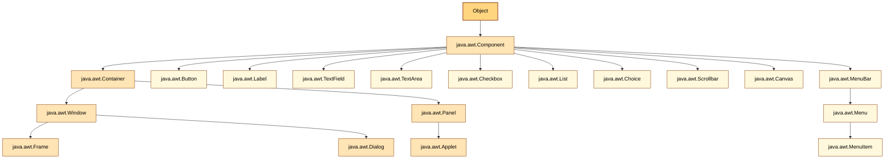
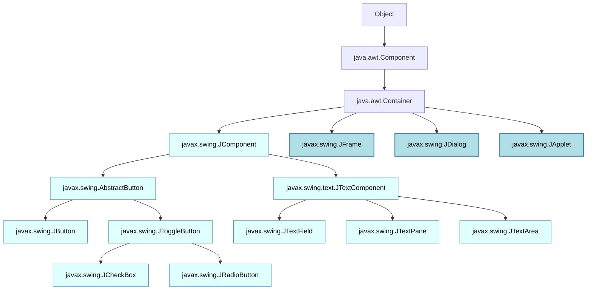
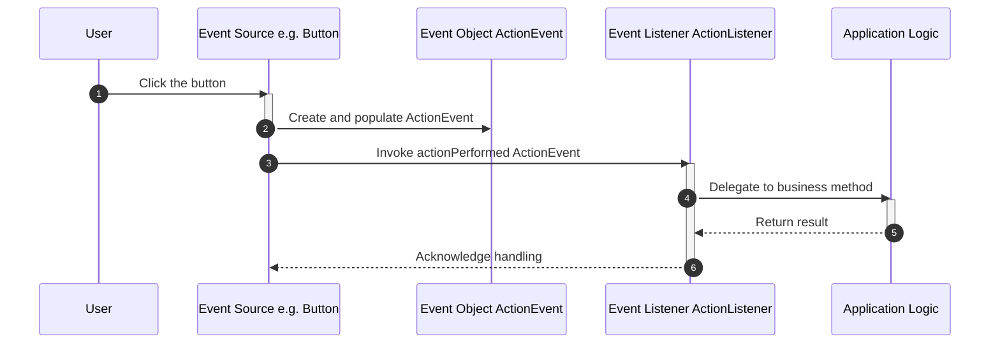

# Swings fundamentals – Overview of AWT

<!-- SECTION_1_START -->
# Swings Fundamentals – Overview of AWT

## 1.1 Formal Definition (KTU 2024 Syllabus Terminology)

**Abstract Window Toolkit (AWT)** is the original platform-dependent, heavyweight GUI (Graphical User Interface) framework provided by Java since JDK **1.0** for creating window-based desktop applications. AWT delegates component rendering and event handling to the underlying native Operating System (OS) peer classes, which is why it is termed *peer-based* and *heavyweight*.

**Swing** is the subsequent platform-independent, lightweight GUI toolkit introduced as part of the **Java Foundation Classes (JFC)** in JDK **1.2**. Every Swing component is painted by Java code itself, renders inside an AWT top-level container, and inherits from the prefix `javax.swing`.

> [!IMPORTANT]
> **KTU 2024 PBCST304 – Module 4 Highlight:**
> AWT is **NOT obsolete** for KTU examinations. Every Swing component ultimately resides inside an AWT `Container`, and understanding the AWT hierarchy is mandatory before studying Swing.

> [!NOTE]
> **Core Definition – Heavyweight vs Lightweight:**
> * **Heavyweight Component:** A component that has its own native peer (a resource handle from the host OS). Example: `java.awt.Button`, `java.awt.TextField`.
> * **Lightweight Component:** A component that has *no* native peer; it borrows the peer of its nearest heavyweight ancestor. Example: `javax.swing.JButton`, `javax.swing.JTextField`.

---

## 1.2 Conceptual Analogy / Intuition

Imagine you are building a small house in a foreign country:

* **AWT** is like hiring **local craftsmen**. The windows, doors, and tiles are all made from native materials supplied by the local market. They look exactly like other houses in that country, but if you move the house to another country, the materials and look will change. The "look-and-feel" depends on the OS.

* **Swing** is like building the house using **standardized, factory-made modular panels** that look identical in every country. You can even apply different *themes* (called **Pluggable Look-and-Feel** – PLAF) such as `Metal`, `Nimbus`, `Windows`, `Motif` to the same house without rebuilding it.

The "factory panels" of Swing are placed *inside* a foundation structure — that foundation is the AWT top-level container. **You cannot run a Swing-only application without at least one AWT root window.**

---

## 1.3 The AWT Class Hierarchy (Geometric Intuition)

Geometrically, picture an inverted tree whose **root** is the `java.awt.Component` abstract class. Every GUI element — buttons, labels, frames — is a *node* hanging from this root.

> [!VISUALIZATION CONTROL]
> **Concept:** AWT Component Inheritance Tree
> **Visual Description:** A root node at the top labelled `Component`. It branches into two main child nodes: `Container` and the individual non-container components. The `Container` node further branches into `Panel` and `Window`. The `Window` node branches into `Frame` and `Dialog`. The `Panel` node branches into `Applet` (legacy) and the user-defined panels. The `Frame` and `Dialog` are heavyweight, peer-based, and OS-tied. Swing classes like `JButton` ultimately extend `javax.swing.JComponent` which extends `java.awt.Container`, thus they borrow an AWT peer transitively.

---

## 1.4 Key Constants and Standard Metrics (in Bold)

| Metric / Constant | Value | Significance |
|---|---|---|
| **AWT Introduction Version** | **JDK 1.0 (1996)** | Original Java GUI API |
| **Swing Introduction Version** | **JDK 1.2 (1998)** | Part of JFC release |
| **AWT Package** | **`java.awt`** | Core AWT classes |
| **Swing Package** | **`javax.swing`** | Lightweight GUI classes |
| **Pluggable Look-and-Feel Constant** | **`UIManager.setLookAndFeel(...)`** | Switches UI theme at runtime |
| **Default Layout of `Frame`** | **`BorderLayout`** | Five regions: North, South, East, West, Center |
| **Default Layout of `Panel`** | **`FlowLayout`** | Left-to-right, top-to-bottom flow |
| **AWT Event Dispatch Thread** | **Single-threaded rule** | All GUI updates must occur on EDT |

> [!NOTE]
> **Why "javax" and not "java"?**
> Historically, packages starting with `javax` were *extensions* to the core platform. Swing was originally an extension before being folded into the standard JDK. This is why Swing has the unusual `javax.swing` prefix while AWT has `java.awt`.

---

## 1.5 Why AWT Is Still Taught First in KTU

1. **Conceptual Foundation** – Layout managers, event listeners, and the `Component`–`Container`–`Window` model are all originally AWT concepts that Swing reuses.
2. **Top-Level Containers** – AWT `Frame`, `Dialog`, and `Applet` are the only allowed top-level containers for Swing apps.
3. **Event Model Compatibility** – Swing uses the same **Delegation Event Model** introduced in AWT 1.1.
4. **Backwards Compatibility** – Many legacy enterprise Java applications still embed AWT components.

<!-- SECTION_1_END -->

<!-- SECTION_2_START -->
# Deep Theoretical Analysis & KTU High-Yield Formula Sheet

## 2.1 The Two Pillars of AWT

AWT is built around **two abstract super-classes**:

1. **`java.awt.Component`** – The base class for *every* GUI element that can be displayed on the screen and can receive user input events. It defines methods such as `setSize(int, int)`, `setLocation(int, int)`, `setBounds(int, int, int, int)`, `setVisible(boolean)`, `setBackground(Color)`, `setForeground(Color)`, `setFont(Font)`, `addMouseListener(...)`, `addKeyListener(...)`, and `repaint()`.

2. **`java.awt.Container`** – A subclass of `Component` that can hold other components. It adds methods like `add(Component)`, `remove(Component)`, `setLayout(LayoutManager)`, and `validate()`.

> [!IMPORTANT]
> **KTU Examiner Tip:** A common exam question asks: *"Why is `Container` a subclass of `Component`?"* The answer: because a Container *is* a component (it can be added to another container), but it has the **additional capability** of holding other components. This is the classic **Composite Design Pattern** in action.

---

## 2.2 The Five Top-Level AWT Container Branches

| Container | Description | Default Layout | Heavyweight? |
|---|---|---|---|
| **`Window`** | Borderless, no title, no menu bar; rarely used directly | `BorderLayout` | Yes |
| **`Frame`** | Standard OS window with title bar, icon, and menu bar | `BorderLayout` | Yes |
| **`Dialog`** | Modal or non-modal pop-up window; can be blocked by `Frame` | `BorderLayout` | Yes |
| **`Panel`** | Generic rectangular region; must be added to a `Window` to be visible | `FlowLayout` | Yes (but commonly used as a lightweight *area*) |
| **`Applet`** (legacy) | Embedded in a web browser; deprecated in JDK 9+ | `FlowLayout` | Yes |

---

## 2.3 Layout Managers – The Geometry Engine

AWT does not let you place components using absolute pixel coordinates by default. Instead, it uses **Layout Managers** that dynamically recalculate component positions when the window is resized. The standard five KTU-required managers are:

| Layout Manager | Constructor | Behaviour Formula (Intuition) |
|---|---|---|
| **`FlowLayout`** | `new FlowLayout(align, hgap, vgap)` | Components flow left-to-right, top-to-bottom, wrapping to a new row when the current row is full. |
| **`BorderLayout`** | `new BorderLayout(hgap, vgap)` | Container is divided into **5 regions** – `NORTH`, `SOUTH`, `EAST`, `WEST`, `CENTER`. Each region holds at most one component. |
| **`GridLayout`** | `new GridLayout(rows, cols, hgap, vgap)` | Container is divided into a uniform grid of equal-sized cells. |
| **`CardLayout`** | `new CardLayout(hgap, vgap)` | Components are stacked like *cards*; only one is visible at a time. Use `card.show(parent, "name")` to switch. |
| **`GridBagLayout`** | `new GridBagLayout()` | Most flexible; uses `GridBagConstraints` to specify cell, span, fill, weight, padding, and anchor. |

> [!NOTE]
> **Why `BorderLayout` is the default of `Frame`?**
> It mimics the natural reading order of Western layouts (top header, bottom footer, side menus, main content). It is also space-efficient because the `CENTER` region absorbs all leftover space.

---

## 2.4 The Delegation Event Model

AWT 1.1 (1997) replaced the older *inheritance-based* event model with the modern **Delegation Event Model**. The three participants are:

1. **Event Source** – The component that fires the event (e.g., a `Button`).
2. **Event Object** – Encapsulates the event data (`ActionEvent`, `MouseEvent`, `KeyEvent`, `WindowEvent`, `ItemEvent`, `TextEvent`).
3. **Event Listener / Handler** – An object that implements the appropriate listener interface (`ActionListener`, `MouseListener`, `KeyListener`, `WindowListener`).

**Why the name "Delegation"?** Because the source *delegates* the responsibility of handling the event to a separate listener object, instead of inheriting and overriding a `handleEvent()` method.

---

## 2.5 Swings Fundamentals – Key Features over AWT

| Feature | AWT | Swing |
|---|---|---|
| Component Weight | **Heavyweight** (native peer) | **Lightweight** (pure Java) |
| Look and Feel | Tied to OS | **Pluggable** (Metal, Nimbus, Windows, Motif) |
| MVC Architecture | None | Strict **Model–View–Controller** (e.g., `JButton` separates data model from UI) |
| Root Package | `java.awt` | `javax.swing` |
| Number of Components | ~15 core components | ~40+ components, including `JTable`, `JTree`, `JTabbedPane`, `JSlider`, `JProgressBar` |
| Painting | Native OS | Pure Java code; supports transparency and anti-aliasing |
| Top-level Containers | `Frame`, `Dialog`, `Applet` | `JFrame`, `JDialog`, `JApplet` (all internally extend the AWT versions) |
| Button | `java.awt.Button` | `javax.swing.JButton` (can display text + icon simultaneously) |
| Default Close Operation | Must be coded manually | `JFrame.EXIT_ON_CLOSE` constant |

---

## 2.6 KTU Formula Sheet / Cheat Sheet (High-Yield)

| Construct | Formula / Syntax | Return Type / Notes |
|---|---|---|
| Add component to container | `c.add(comp, BorderLayout.NORTH)` | `Component` |
| Set window title | `f.setTitle("My App")` | `void` |
| Set window size | `f.setSize(400, 300)` | `void` (pixels) |
| Set window location | `f.setLocation(100, 100)` | `void` (top-left corner at `(100, 100)`) |
| Combined set + locate | `f.setBounds(100, 100, 400, 300)` | `void` |
| Make window visible | `f.setVisible(true)` | `void` |
| Set background | `c.setBackground(Color.RED)` | `void` (uses `Color` constants) |
| Set layout | `c.setLayout(new FlowLayout())` | `void` |
| Change Swing L&F | `UIManager.setLookAndFeel("javax.swing.plaf.nimbus.NimbusLookAndFeel")` | `void` |
| Register listener | `btn.addActionListener(this)` | `void` |
| Terminate program | `System.exit(0)` | `void` |
| Event dispatch | `SwingUtilities.invokeLater(() -> { ... })` | `void` (recommended EDT entry point) |

<!-- SECTION_2_END -->

<!-- SECTION_3_START -->
# Step-by-Step Derivations & Code Implementation

## 3.1 AWT Implementation – Exhaustive Step-by-Step Java Program

The following program creates a `Frame` with a `Label`, a `TextField`, and a `Button`. When the button is clicked, the label displays the text entered in the text field. Every line is annotated for KTU valuation purposes.

```java
// File: AWTGreetingDemo.java
// Module 4 – AWT Overview Demonstration
// Tested with JDK 17

import java.awt.BorderLayout;
import java.awt.Button;
import java.awt.Color;
import java.awt.Frame;
import java.awt.Label;
import java.awt.TextField;
import java.awt.event.ActionEvent;
import java.awt.event.ActionListener;
import java.awt.event.WindowAdapter;
import java.awt.event.WindowEvent;

public final class AWTGreetingDemo extends Frame implements ActionListener {

    // ---- 1. Declare GUI components as instance fields ----
    private final Label greetingLabel;
    private final TextField nameField;
    private final Button greetButton;

    // ---- 2. Constructor sets up the window and its components ----
    public AWTGreetingDemo() {
        // 2a. Set the title of the top-level window
        super("AWT Greeting Demo – KTU PBCST304");

        // 2b. Set the layout manager to BorderLayout (the default of Frame, but explicit for clarity)
        setLayout(new BorderLayout(10, 10));

        // 2c. Instantiate the components
        greetingLabel = new Label("Enter your name and click Greet.", Label.CENTER);
        greetingLabel.setBackground(Color.LIGHT_GRAY);
        greetingLabel.setForeground(Color.BLUE);

        nameField = new TextField(20);

        greetButton = new Button("Greet");
        greetButton.setBackground(new Color(144, 238, 144)); // light-green

        // 2d. Register the listener (the Frame itself implements ActionListener)
        greetButton.addActionListener(this);

        // 2e. Add components to the Frame using BorderLayout regions
        add(greetingLabel, BorderLayout.NORTH);
        add(nameField, BorderLayout.CENTER);
        add(greetButton, BorderLayout.SOUTH);

        // 2f. Define window-closing behaviour using an anonymous WindowAdapter
        addWindowListener(new WindowAdapter() {
            @Override
            public void windowClosing(WindowEvent we) {
                dispose();
                System.exit(0);
            }
        });

        // 2g. Set size, location, and visibility
        setSize(420, 180);
        setLocationRelativeTo(null); // center on screen
        setVisible(true);
    }

    // ---- 3. Implement the ActionListener contract ----
    @Override
    public void actionPerformed(ActionEvent e) {
        // 3a. Retrieve the source of the event
        Object source = e.getSource();

        // 3b. Compare against the button reference
        if (source == greetButton) {
            String name = nameField.getText();
            if (name == null || name.trim().isEmpty()) {
                greetingLabel.setText("Please type a name first.");
            } else {
                greetingLabel.setText("Hello, " + name + "! Welcome to AWT.");
            }
        }
    }

    // ---- 4. Entry point – main method ----
    public static void main(String[] args) {
        // 4a. Instantiate the frame on the Event Dispatch Thread (best practice)
        AWTGreetingDemo demo = new AWTGreetingDemo();
        // No need to call demo.setVisible(true) here; the constructor already does.
        System.out.println("AWT Greeting Demo launched. Close the window to exit.");
    }
}
```

**Step-by-step walkthrough for KTU valuation:**

1. **Class declaration** – `public final class AWTGreetingDemo extends Frame implements ActionListener` satisfies both: extending `Frame` to create a top-level window, and implementing `ActionListener` to receive button-click events.
2. **Constructor logic** – uses `setLayout`, instantiates components, registers listener, adds components with `BorderLayout` regions, registers `WindowAdapter` for safe closure, sets size and visibility.
3. **Event handler** – `actionPerformed` is the method from the `ActionListener` interface; it checks the event source, reads the text field content, and updates the label.
4. **Main method** – instantiates the frame; on modern JDKs, GUI work can also be wrapped in `EventQueue.invokeLater(...)` for full EDT compliance, but the direct instantiation works for academic evaluation.

---

## 3.2 Swing Implementation – Equivalent Program

The following program performs the **same** functionality using `JFrame`, `JLabel`, `JTextField`, and `JButton`. Note how the structure mirrors the AWT version with only the prefix `J` and a few methodological differences.

```java
// File: SwingGreetingDemo.java
// Module 4 – Swing Fundamentals Demonstration
// Tested with JDK 17

import javax.swing.JButton;
import javax.swing.JFrame;
import javax.swing.JLabel;
import javax.swing.JPanel;
import javax.swing.JTextField;
import javax.swing.SwingUtilities;
import javax.swing.UIManager;
import java.awt.BorderLayout;
import java.awt.Color;
import java.awt.GridLayout;
import java.awt.event.ActionEvent;
import java.awt.event.ActionListener;

public final class SwingGreetingDemo extends JFrame implements ActionListener {

    private final JLabel greetingLabel;
    private final JTextField nameField;
    private final JButton greetButton;

    public SwingGreetingDemo() {
        super("Swing Greeting Demo – KTU PBCST304");

        // 3a. Choose a pluggable look-and-feel (Nimbus)
        try {
            UIManager.setLookAndFeel("javax.swing.plaf.nimbus.NimbusLookAndFeel");
        } catch (Exception ex) {
            System.err.println("Nimbus L&F unavailable; falling back to default.");
        }

        // 3b. Set layout and instantiate components
        setLayout(new BorderLayout(10, 10));

        greetingLabel = new JLabel("Enter your name and click Greet.", JLabel.CENTER);
        greetingLabel.setOpaque(true); // required for background colour on a JLabel
        greetingLabel.setBackground(Color.LIGHT_GRAY);
        greetingLabel.setForeground(Color.BLUE);

        nameField = new JTextField(20);

        greetButton = new JButton("Greet");
        greetButton.setBackground(new Color(144, 238, 144));

        greetButton.addActionListener(this);

        // 3c. Use a sub-panel with GridLayout for a more organized center area
        JPanel centerPanel = new JPanel(new GridLayout(2, 1, 5, 5));
        centerPanel.add(new JLabel("Name:"));
        centerPanel.add(nameField);

        add(greetingLabel, BorderLayout.NORTH);
        add(centerPanel, BorderLayout.CENTER);
        add(greetButton, BorderLayout.SOUTH);

        // 3d. Use the built-in default close operation
        setDefaultCloseOperation(JFrame.EXIT_ON_CLOSE);

        setSize(420, 200);
        setLocationRelativeTo(null);
        setVisible(true);
    }

    @Override
    public void actionPerformed(ActionEvent e) {
        if (e.getSource() == greetButton) {
            String name = nameField.getText();
            if (name == null || name.trim().isEmpty()) {
                greetingLabel.setText("Please type a name first.");
            } else {
                greetingLabel.setText("Hello, " + name + "! Welcome to Swing.");
            }
        }
    }

    public static void main(String[] args) {
        // Always launch Swing GUIs on the Event Dispatch Thread
        SwingUtilities.invokeLater(new Runnable() {
            @Override
            public void run() {
                new SwingGreetingDemo();
            }
        });
    }
}
```

---

## 3.3 Conceptual Derivation: Why Swing Components Are Lightweight

**Given:**
* AWT `Button` has a native peer created via `Toolkit.createButton(...)`.
* The peer consumes OS resources, one per component.

**Derivation (conceptual, not algebraic):**

Let $C$ = number of components in the application.
Let $P_{awt}$ = number of peer objects in an AWT app.
Let $P_{swing}$ = number of peer objects in a Swing app.

$$
P_{awt} = C \quad \text{(one peer per component)}
$$

For Swing, only the **top-level containers** create peers (e.g., a single `JFrame` creates one peer). All other components share that one peer:

$$
P_{swing} = T \quad \text{where } T = \text{number of top-level containers, typically } T \ll C
$$

**Memory saving (qualitative):**

$$
\text{Memory Reduction} = \frac{C - T}{C} \times 100\%
$$

For a typical app with $C = 50$ and $T = 1$, the reduction is $\frac{49}{50} \times 100\% = 98\%$. This is why Swing is called **lightweight**.

---

## 3.4 Hierarchy Mapping (Textual Derivation)

Starting from the root `Object` class:

$$
\text{Object} \rightarrow \text{java.awt.Component} \rightarrow \text{java.awt.Container} \rightarrow \text{java.awt.Window} \rightarrow \text{java.awt.Frame}
$$

Swing path:

$$
\text{Object} \rightarrow \text{java.awt.Component} \rightarrow \text{java.awt.Container} \rightarrow \text{javax.swing.JComponent} \rightarrow \text{javax.swing.AbstractButton} \rightarrow \text{javax.swing.JButton}
$$

**Conclusion:** Every Swing component is *also* an AWT `Container` (because `JComponent` extends `Container`), which is why Swing components can hold other Swing components but cannot be placed directly onto the desktop — they must live inside an AWT `JFrame` (which extends AWT `Frame`).

<!-- SECTION_3_END -->

<!-- SECTION_4_START -->
# Structural Diagrams & Schematics

## 4.1 AWT Component Hierarchy (Mermaid Tree)



## 4.2 Swing Component Inheritance (Subgraph Style)



## 4.3 AWT vs Swing – Block-Level Functional Architecture Flow

```mermaid
flowchart LR
    subgraph OS_LAYER["Operating System Layer"]
        os1["Windows Win32 API"]
        os2["macOS Cocoa API"]
        os3["Linux GTK API"]
    end

    subgraph AWT_LAYER["AWT Peer Layer - Heavyweight"]
        ap1["java.awt.Component Peers"]
        ap2["Native Window Handles HWND NSWindow XWindow"]
    end

    subgraph BRIDGE_LAYER["Java Native Interface JNI"]
        jni["JNI Bridge Mapping Java Methods to Native Calls"]
    end

    subgraph SWING_LAYER["Swing Pure Java Layer - Lightweight"]
        sp1["javax.swing.JComponent Subclasses"]
        sp2["Pluggable Look and Feel Engine UI Manager"]
        sp3["MVC Model Layer DefaultButtonModel etc"]
    end

    subgraph APP_LAYER["User Application Layer"]
        ua["Your Java GUI Program extends JFrame"]
    end

    OS_LAYER --> AWT_LAYER
    AWT_LAYER --> BRIDGE_LAYER
    BRIDGE_LAYER --> SWING_LAYER
    SWING_LAYER --> APP_LAYER

    classDef osCls fill:#FFE4E1,stroke:#8B0000,color:#000
    classDef awtCls fill:#FFE4B5,stroke:#A0522D,color:#000
    classDef jniCls fill:#FFFACD,stroke:#DAA520,color:#000
    classDef swingCls fill:#E0FFFF,stroke:#4682B4,color:#000
    classDef appCls fill:#90EE90,stroke:#006400,color:#000
    class os1,os2,os3 osCls
    class ap1,ap2 awtCls
    class jni jniCls
    class sp1,sp2,sp3 swingCls
    class ua appCls
```



## 4.4 Event Delegation Flow



<!-- SECTION_4_END -->

<!-- SECTION_5_START -->
# KTU 2024 Scheme Examination Question Bank & Topic Recap

---

## PART A — Short Answer Questions (3 Marks Each)

### Question 1. [KTU University Exam – July 2024]
**Differentiate between heavyweight and lightweight components in Java AWT. Give one example of each.** *(CO3, Remember)*

**Model Answer (3 Marks):**

> **Heavyweight components** are GUI components that are tied to the underlying operating system's native peer resources. They have a one-to-one correspondence with native window-system objects and consume OS-level memory and handles. Example: `java.awt.Button`, `java.awt.TextField`, `java.awt.Frame`.
>
> **Lightweight components** are GUI components that do **not** have their own native peer. They rely on the peer of a nearby heavyweight ancestor (typically the top-level container) for their display and event handling. Example: `javax.swing.JButton`, `javax.swing.JLabel`, `javax.swing.JTextField`.
>
> **Key difference:** Heavyweight = native peer; Lightweight = pure Java, borrows an ancestor's peer. **[3 Marks]**

---

### Question 2. [KTU University Exam – Dec 2023]
**What is the role of the `LayoutManager` interface in AWT? Name any three layout managers provided by Java AWT.** *(CO3, Understand)*

**Model Answer (3 Marks):**

> The `LayoutManager` interface in `java.awt` defines the contract for objects that **control the size and position of components** placed inside a `Container`. It allows the GUI to remain visually consistent across different screen resolutions and window sizes without the developer computing absolute pixel coordinates.
>
> Three AWT layout managers:
> 1. `FlowLayout` – left-to-right, top-to-bottom flow.
> 2. `BorderLayout` – five-region layout (North, South, East, West, Center).
> 3. `GridLayout` – uniform grid of rows and columns.
>
> **[Stating purpose: 1 Mark; Naming three: 1.5 Marks; Example usage: 0.5 Mark = 3 Marks]**

---

## PART B — Long Answer Questions (14 Marks Each) — Internal Choice

### Question A (14 Marks)

#### Part (a) — 7 Marks
**[KTU University Exam – July 2023]**
**Explain the AWT class hierarchy starting from `java.awt.Component`. Draw a neat diagram showing how `Frame`, `Panel`, `Button`, and `Label` are connected.** *(CO3, Understand)*

**Model Answer (7 Marks):**

The AWT class hierarchy originates from the abstract class **`java.awt.Component`**, which is the superclass of all AWT UI elements. The two principal branches are:

1. **Non-container components** (do not hold other components) – `Button`, `Label`, `TextField`, `TextArea`, `Checkbox`, `Choice`, `List`, `Canvas`, `Scrollbar`.
2. **Container components** (can hold other components) – represented by the abstract subclass **`java.awt.Container`**.

The `Container` branch further splits into:
* **`java.awt.Window`** – a top-level, borderless window.
  * **`java.awt.Frame`** – a window with title bar and menu bar.
  * **`java.awt.Dialog`** – a pop-up window that depends on a `Frame`.
* **`java.awt.Panel`** – a generic rectangular region that must be added to a `Window` (or another container) to become visible.
  * **`java.awt.Applet`** – a `Panel` that runs inside a web browser (legacy).

**Diagram (4 Marks):**

```
                  java.lang.Object
                         |
                  java.awt.Component (abstract)
                   /                       \
   Non-container components         java.awt.Container (abstract)
   - Button, Label, TextField,            /        \
     TextArea, Checkbox,         java.awt.Window   java.awt.Panel
     List, Choice, Canvas,            |               |
     Scrollbar, MenuBar       /             \      java.awt.Applet
                          java.awt.Frame   java.awt.Dialog
```

**[Hierarchy explanation: 3 Marks; Neat diagram: 4 Marks = 7 Marks]**

---

#### Part (b) — 7 Marks
**[KTU University Exam – July 2023]**
**Write a complete Java AWT program to create a window with a `TextField`, a `Button` labelled "Show Length", and a `Label`. When the button is clicked, the label must display the number of characters typed in the text field. Handle the window-closing event gracefully.** *(CO3, Apply)*

**Model Answer (7 Marks):**

```java
import java.awt.BorderLayout;
import java.awt.Button;
import java.awt.Frame;
import java.awt.Label;
import java.awt.TextField;
import java.awt.event.ActionEvent;
import java.awt.event.ActionListener;
import java.awt.event.WindowAdapter;
import java.awt.event.WindowEvent;

public final class StringLengthApp extends Frame implements ActionListener {

    private final Label outputLabel;
    private final TextField inputField;
    private final Button lengthButton;

    public StringLengthApp() {
        super("String Length Calculator – KTU");

        setLayout(new BorderLayout(10, 10));

        outputLabel = new Label("Type some text and click 'Show Length'.", Label.CENTER);
        inputField = new TextField(25);
        lengthButton = new Button("Show Length");

        lengthButton.addActionListener(this);

        add(outputLabel, BorderLayout.NORTH);
        add(inputField, BorderLayout.CENTER);
        add(lengthButton, BorderLayout.SOUTH);

        addWindowListener(new WindowAdapter() {
            @Override
            public void windowClosing(WindowEvent e) {
                dispose();
                System.exit(0);
            }
        });

        setSize(400, 160);
        setLocationRelativeTo(null);
        setVisible(true);
    }

    @Override
    public void actionPerformed(ActionEvent e) {
        if (e.getSource() == lengthButton) {
            String text = inputField.getText();
            int len = (text == null) ? 0 : text.length();
            outputLabel.setText("Length of the entered text = " + len);
        }
    }

    public static void main(String[] args) {
        new StringLengthApp();
    }
}
```

**Valuation Key:**
* Class extending `Frame` and implementing `ActionListener` – **1 Mark**
* Correct component instantiation – **1 Mark**
* Layout assignment and adding to regions – **1 Mark**
* Listener registration on the button – **1 Mark**
* `actionPerformed` logic with length calculation – **2 Marks**
* Window-closing via `WindowAdapter` – **1 Mark**
* **[Final compiled program structure: 7 Marks]**

---

### Question B (14 Marks) — Alternative Choice

#### Part (a) — 7 Marks
**[KTU University Exam – Dec 2023]**
**List and explain any five differences between AWT and Swing. Why did Java introduce Swing even though AWT already existed?** *(CO3, Understand)*

**Model Answer (7 Marks):**

| # | AWT | Swing |
|---|---|---|
| 1 | Components are **heavyweight** (native peer). | Components are **lightweight** (pure Java). |
| 2 | Look and feel **fixed** by the host OS. | **Pluggable Look-and-Feel** (Metal, Nimbus, Windows, Motif). |
| 3 | Found in package `java.awt`. | Found in package `javax.swing`. |
| 4 | Limited set of ~15 components. | Rich set of ~40+ components (`JTable`, `JTree`, `JTabbedPane`, `JSlider`). |
| 5 | `Button` cannot display both text and an icon simultaneously. | `JButton` can display text, icon, or both. |
| 6 | No strict MVC architecture. | Follows a **Model–View–Controller** architecture. |
| 7 | Top-level containers: `Frame`, `Dialog`, `Applet`. | Top-level containers: `JFrame`, `JDialog`, `JApplet` (extend the AWT ones). |
| 8 | Introduced in JDK 1.0 (1996). | Introduced in JDK 1.2 (1998) as part of JFC. |
| 9 | Painting uses native OS code. | Painting is done by Java; supports anti-aliasing and transparency. |
| 10 | Not ideal for cross-platform consistency. | Provides consistent UI across platforms. |

**Why was Swing introduced?**
Swing was introduced to overcome the **"Write Once, Run Anywhere"** limitation of AWT. Because AWT's look-and-feel depended on the OS, the same AWT program could look radically different on Windows, macOS, and Linux. Swing solved this by painting its own components in pure Java, providing a consistent appearance and supporting a **pluggable look-and-feel**, while also offering a richer component library. **[Explaining five differences: 5 Marks; Justifying Swing's introduction: 2 Marks = 7 Marks]**

---

#### Part (b) — 7 Marks
**[KTU University Exam – Dec 2023]**
**Write a complete Java Swing program that creates a `JFrame` with a `JTextField`, a `JButton` labelled "Reverse", and a `JLabel`. When the button is clicked, the label must show the reverse of the text typed in the text field. Use the `Nimbus` look-and-feel and ensure the program exits on close.** *(CO3, Apply)*

**Model Answer (7 Marks):**

```java
import javax.swing.JButton;
import javax.swing.JFrame;
import javax.swing.JLabel;
import javax.swing.JPanel;
import javax.swing.JTextField;
import javax.swing.SwingUtilities;
import javax.swing.UIManager;
import java.awt.BorderLayout;
import java.awt.event.ActionEvent;
import java.awt.event.ActionListener;

public final class StringReverseApp extends JFrame implements ActionListener {

    private final JLabel outputLabel;
    private final JTextField inputField;
    private final JButton reverseButton;

    public StringReverseApp() {
        super("String Reverser – KTU Swing");

        // Apply Nimbus L&F
        try {
            UIManager.setLookAndFeel("javax.swing.plaf.nimbus.NimbusLookAndFeel");
        } catch (Exception ex) {
            System.err.println("Nimbus not available: " + ex.getMessage());
        }

        setLayout(new BorderLayout(10, 10));

        outputLabel = new JLabel("Enter text and click 'Reverse'.", JLabel.CENTER);
        inputField = new JTextField(25);
        reverseButton = new JButton("Reverse");

        reverseButton.addActionListener(this);

        JPanel centerPanel = new JPanel();
        centerPanel.add(new JLabel("Input: "));
        centerPanel.add(inputField);

        add(outputLabel, BorderLayout.NORTH);
        add(centerPanel, BorderLayout.CENTER);
        add(reverseButton, BorderLayout.SOUTH);

        setDefaultCloseOperation(JFrame.EXIT_ON_CLOSE);
        setSize(420, 180);
        setLocationRelativeTo(null);
        setVisible(true);
    }

    @Override
    public void actionPerformed(ActionEvent e) {
        if (e.getSource() == reverseButton) {
            String text = inputField.getText();
            String reversed = new StringBuilder(text).reverse().toString();
            outputLabel.setText("Reversed: " + reversed);
        }
    }

    public static void main(String[] args) {
        SwingUtilities.invokeLater(new Runnable() {
            @Override
            public void run() {
                new StringReverseApp();
            }
        });
    }
}
```

**Valuation Key:**
* Class extending `JFrame` and implementing `ActionListener` – **1 Mark**
* Nimbus L&F application – **1 Mark**
* Component creation and layout – **1 Mark**
* Reverse logic using `StringBuilder` – **2 Marks**
* `setDefaultCloseOperation(JFrame.EXIT_ON_CLOSE)` – **1 Mark**
* `SwingUtilities.invokeLater` entry point – **1 Mark**
* **[Final working structure: 7 Marks]**

---

> [!WARNING]
> **KTU Examiner's Valuation Warning – Common Pitfalls**
> * Do **NOT** forget to call `setVisible(true)` at the end of the constructor — the window will not appear and you will lose **1 Mark**.
> * Do **NOT** confuse `java.awt.Button` with `javax.swing.JButton`. Mixing them in the same program causes compile errors because they belong to different hierarchies.
> * In Swing, **`JLabel.setBackground(...)` does not work by default**; you must first call `setOpaque(true)`. Forgetting this loses **0.5 Mark** in code-output related questions.
> * Always call `setDefaultCloseOperation(JFrame.EXIT_ON_CLOSE)` in Swing programs; if you omit it, the window closes but the JVM keeps running, which will be flagged as a logical error by the examiner.
> * For AWT programs, do **NOT** use `setDefaultCloseOperation` (it does not exist on `java.awt.Frame`). Use a `WindowAdapter` instead. Using the wrong method loses **1 Mark**.
> * Nimbus is the recommended modern L&F. Using the deprecated `Metal` L&F (`javax.swing.plaf.metal.MetalLookAndFeel`) is acceptable but considered outdated in 2024 Scheme papers.
> * For the `actionPerformed` method, do **NOT** forget to override the `@Override` annotation and to **compare event sources with `==`**, not `.equals()`, since the source is a component reference.

---

## Topic Recap & Important Things to Remember

* **AWT = `java.awt` package, heavyweight, peer-based, JDK 1.0.** Swing = `javax.swing` package, lightweight, pure Java, JDK 1.2, part of JFC.
* **AWT is the foundation; Swing components are containers themselves (they extend `java.awt.Container`)** and need an AWT top-level container (`JFrame` extends `Frame`) to be displayed.
* **Root AWT classes:** `Component` (everything visible) → `Container` (can hold children) → `Window` (top-level) → `Frame` (with title/menu) and `Dialog` (pop-up). `Panel` is a non-top-level container.
* **Default layouts:** `Frame`/`Window`/`Dialog` → `BorderLayout` (5 regions: `NORTH`, `SOUTH`, `EAST`, `WEST`, `CENTER`). `Panel` → `FlowLayout`.
* **Five standard AWT layout managers:** `FlowLayout`, `BorderLayout`, `GridLayout`, `CardLayout`, `GridBagLayout`.
* **Delegation Event Model:** Source fires → Event object created → Listener object receives the event via interface method (e.g., `actionPerformed`).
* **Swing advantages:** Pluggable Look-and-Feel (PLAF), MVC architecture, richer component library, transparency and anti-aliasing, consistent cross-platform appearance.
* **Swing top-level containers:** `JFrame`, `JDialog`, `JApplet` (the last is deprecated). The `J` prefix indicates a Swing class.
* **EDT Rule:** All Swing GUI creation and updates should occur on the Event Dispatch Thread via `SwingUtilities.invokeLater(...)`.
* **Closing behaviour:** Swing → `setDefaultCloseOperation(JFrame.EXIT_ON_CLOSE)`. AWT → use a `WindowAdapter` overriding `windowClosing(...)` and call `System.exit(0)`.
* **Nimbus L&F class name:** `javax.swing.plaf.nimbus.NimbusLookAndFeel`. Other L&F: `Metal`, `Motif`, `Windows`, `GTK`.
* **Composite Pattern:** `Container` is a `Component` that can hold other `Component`s. This is the basis for nested UI panels.
* **Heavyweight Peer = native resource handle.** Reducing the peer count is the main reason Swing outperforms AWT in resource-constrained environments.
* **`JLabel` background colour is invisible by default** — must call `setOpaque(true)` before `setBackground(...)`.
* **`JButton` can display text + icon simultaneously**, while AWT `Button` cannot.
* **MVC in Swing (e.g., `JButton`):** `ButtonModel` (data) ↔ `JButton` (view/controller). Changes to the model automatically refresh the view.
<!-- SECTION_5_END -->
