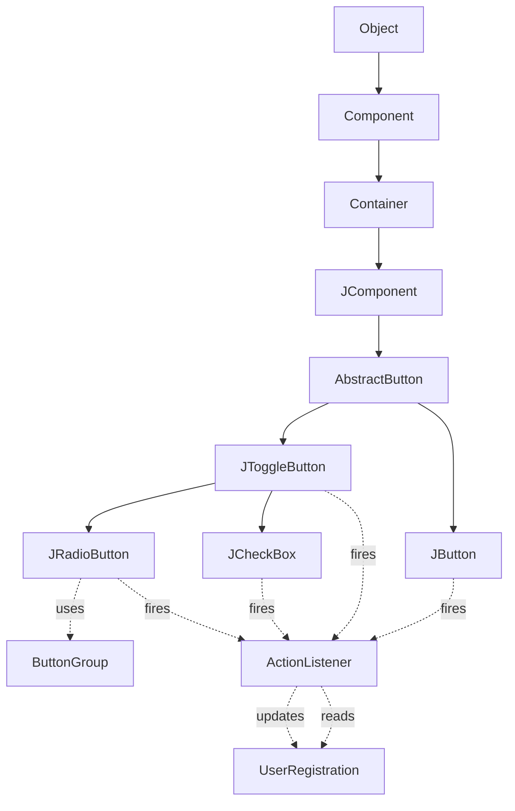
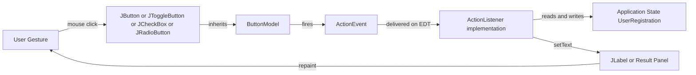
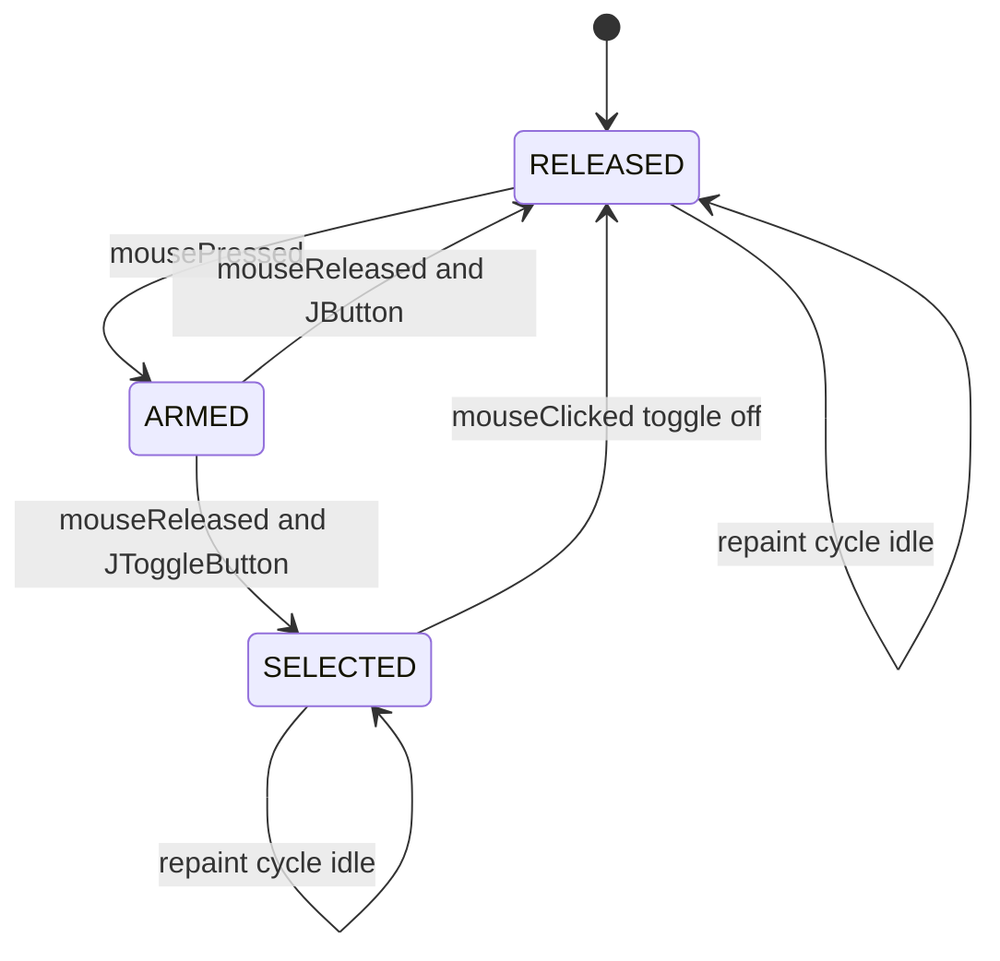
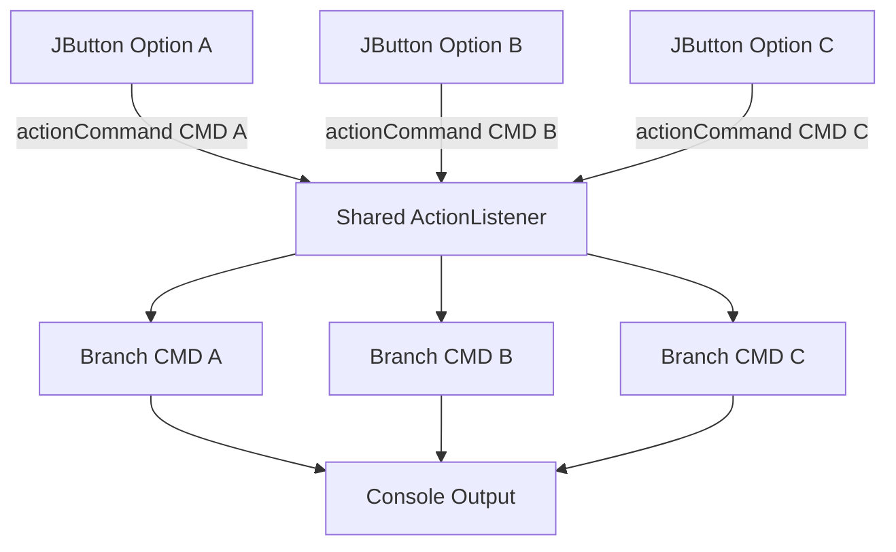

# The Swing Buttons

<!-- SECTION_1_START -->

# The Swing Buttons — KTU 2024 Scheme Study Notes

## 1. Core Technical Definition & Intuitive Overview

### Formal Academic Definition

> [!IMPORTANT]
> **Swing Buttons** are interactive `javax.swing.AbstractButton` subclasses that encapsulate a clickable, focusable UI component capable of triggering an `ActionEvent` when activated. In the context of the KTU 2024 Scheme (PBCST304 — Object Oriented Programming), they represent the **MVC View layer** of any Java GUI, where the *Model* is the underlying application data, the *View* is the button widget itself, and the *Controller* is the registered `ActionListener` that reacts to user gestures.

The Java Swing API provides **four principal button subclasses** derived from `javax.swing.AbstractButton`:

| # | Class | Purpose |
|---|-------|---------|
| 1 | `JButton` | Generic command-trigger button (the workhorse). |
| 2 | `JToggleButton` | Two-state (pressed/released) sticky button. |
| 3 | `JCheckBox` | Multi-selection independent toggle (on/off). |
| 4 | `JRadioButton` | Mutually-exclusive toggle grouped by `ButtonGroup`. |

---

### Conceptual Analogy / Intuition

> [!NOTE]
> **Real-World Analogy — The Coffee Shop Counter**
> Imagine a coffee shop service counter:
> - A **JButton** is the *bell* you ring once for service — press it, get service, release, ready for the next press (a momentary action).
> - A **JToggleButton** is the *Open/Closed* sign above the door — you press once, it stays that way until you press again.
> - A **JCheckBox** is the *extras row* on your order form — "Sugar? ☑", "Cream? ☐", "Extra Shot? ☑" — every option is independent; you can pick any combination.
> - A **JRadioButton** is the *size selector* — "Small ○", "Medium ●", "Large ○" — picking one automatically un-picks the other, because the size must be exactly one value.

Every time a customer interacts, the cashier (the **Event Listener**) gets notified and processes the request.

---

### Visualisation Block

> [!VISUALIZATION CONTROL]
> **Concept:** Swing Button Class Hierarchy (Inheritance Tree)
> **GeoGebra / Desmos Input Equations (as conceptual structure):**
> * Node A: `java.lang.Object` (root)
> * Node B: `java.awt.Component` (first AWT ancestor)
> * Node C: `java.awt.Container` (adds layout capability)
> * Node D: `javax.swing.JComponent` (Swing painting + keyboard tab order)
> * Node E: `javax.swing.AbstractButton` (defines `model`, `text`, `icon`, `actionCommand`)
> * Leaves: `JButton`, `JToggleButton` → `JCheckBox`, `JRadioButton` → `ButtonGroup`
> **Visual Description:** A vertical branching tree where `AbstractButton` is the trunk and the four concrete button classes are the leaves, illustrating that **all buttons share the same parent state, mnemonic, icon, and event mechanics**, but specialize in toggle vs. non-toggle behaviour.

---

### Key Constants and Properties

> [!IMPORTANT]
> The following standard metrics govern Swing button rendering. All are documented in the `AbstractButton` API specification:
> - **`mnemonic`** — single character (e.g. `'A'`) activated with **Alt** key.
> - **`actionCommand`** — `String` label sent to the listener (defaults to button text).
> - **`Icon`** — image resource loaded via `ImageIcon(String path)`.
> - **`HorizontalAlignment`** — constants: `LEFT`, `CENTER` (default), `RIGHT`.
> - **`VerticalAlignment`** — constants: `TOP`, `CENTER` (default), `BOTTOM`.
> - **`mnemonicIndex`** — integer position where the underline hint should appear.

<!-- SECTION_1_END -->

<!-- SECTION_2_START -->

# 2. Deep Theoretical Analysis & KTU High-Yield Formula Sheet

## 2.1 The AbstractButton Master-Class

`AbstractButton` is the **abstract superclass** that factors out all shared behaviour of Swing buttons. It implements the `ItemSelectable` interface, which is why both `JToggleButton` and `JCheckBox` can fire `ItemEvent`s in addition to `ActionEvent`s.

### 2.1.1 Operational Logic Steps

1. **Instantiation** — The constructor receives optional `Icon`, `String` (text), or `Action` object.
2. **Model Binding** — Each button owns a `ButtonModel` (an `DefaultButtonModel` instance by default) that holds the state (pressed, armed, selected, rollover, enabled).
3. **Event Registration** — A call to `button.addActionListener(myListener)` registers an observer on the model.
4. **User Gesture** — Mouse-press enters the *armed* state; mouse-release over the same button fires an `ActionEvent`.
5. **Listener Dispatch** — The event is delivered on the **Event Dispatch Thread (EDT)** to every registered listener's `actionPerformed(ActionEvent e)` method.
6. **Re-paint** — The model's state change triggers a `paintComponent()` repaint cycle via the `ChangeListener` mechanism.

### 2.2 JButton — The Command Trigger

`JButton` is the simplest, non-stateful button. It does **not** retain pressed state after the mouse is released.

**Why use it?** For one-shot commands — *Submit*, *Cancel*, *Calculate*, *Save*.

### 2.3 JToggleButton — The Sticky State Button

`JToggleButton extends AbstractButton`. It retains its *selected* state between clicks.

**Why use it?** For binary on/off functions — *Bold*, *Italics*, *Show Grid*, *Caps Lock*.

### 2.4 JCheckBox — The Independent Toggle

`JCheckBox extends JToggleButton`. Adds a small square indicator (☑/☐).

**Why use it?** For *zero-or-more* selections — checkboxes in a form, feature flags, multi-select filter panels.

### 2.5 JRadioButton — The Mutually-Exclusive Toggle

`JRadioButton extends JToggleButton`. Round indicator (●/○). Used in conjunction with `ButtonGroup`.

**Why use it?** For *exactly-one-of-N* selections — gender, payment method, exam semester choice.

> [!NOTE]
> **The ButtonGroup Container Trick:** `ButtonGroup` is **not** a `Container` — it has no visual representation. It is purely a logical group, so you still add the radio buttons to a `JPanel` (or any container) visually. Removing the `ButtonGroup` would cause multiple radio buttons to be selectable simultaneously.

---

## 2.6 KTU High-Yield Formula Sheet

| Construct / Method | Signature | Behaviour / Unit | Default Value |
|---|---|---|---|
| `JButton()` | no-arg | Empty button with no text or icon | — |
| `JButton(String text)` | text on face | Text-only button | `null` |
| `JButton(Icon icon)` | image | Icon-only button | `null` |
| `setText(String)` | `void` | Updates label | `""` |
| `setIcon(Icon)` | `void` | Sets face image | `null` |
| `setMnemonic(int)` | `void` | Alt-key shortcut | `KeyEvent.VK_UNDEFINED` |
| `setEnabled(boolean)` | `void` | Grey-out if `false` | `true` |
| `addActionListener(ActionListener)` | `void` | Registers observer | empty list |
| `JToggleButton(String, boolean)` | text + selected | Sticky state | `false` |
| `isSelected()` | `boolean` | Current toggle state | `false` |
| `JCheckBox(String, boolean)` | text + selected | Multi-select item | `false` |
| `JRadioButton(String, boolean)` | text + selected | Exclusive item | `false` |
| `ButtonGroup.add(AbstractButton)` | `void` | Group registration | empty group |
| `ButtonGroup.getSelection()` | `ButtonModel` | Returns active model | `null` |

---

## 2.7 Real-World Engineering Utility

| Domain | Where Swing Buttons Are Used |
|---|---|
| **Desktop IDEs** (older IntelliJ/Eclipse variants) | Toolbar `JButton`s for Run, Debug, Build. |
| **Banking Kiosk Software** | `JRadioButton` for account type; `JCheckBox` for SMS alerts. |
| **CAD / Modelling Tools** | `JToggleButton` for sticky tools (Pan, Rotate, Snap). |
| **POS Terminals** | Grid of `JButton`s mapped to product SKUs. |
| **Medical Software** | `JCheckBox` for symptom checklist; `JButton` "Submit Diagnosis". |

> [!IMPORTANT]
> In modern production code, **JavaFX** has largely replaced Swing, but the KTU 2024 syllabus and competitive Indian engineering exams (GATE, campus placements) still test Swing fundamentals extensively. The architectural patterns (MVC, Event Dispatch Thread, Listener-based Observer) carry over directly to JavaFX, Android `OnClickListener`, and web `addEventListener`.

<!-- SECTION_2_END -->

<!-- SECTION_3_START -->

# 3. Step-by-Step Derivations & Code/Symbolic Implementation

## 3.1 Complete Class Hierarchy Derivation

The Swing button inheritance is defined by the JDK source as:

$$
\text{java.lang.Object} \;\longrightarrow\; \text{java.awt.Component} \;\longrightarrow\; \text{java.awt.Container} \;\longrightarrow\; \text{javax.swing.JComponent} \;\longrightarrow\; \text{javax.swing.AbstractButton}
$$

From `AbstractButton`, the four concrete leaves branch as:

$$
\text{AbstractButton} \;\longrightarrow\; \text{JButton}
$$

$$
\text{AbstractButton} \;\longrightarrow\; \text{JToggleButton} \;\longrightarrow\; \text{JCheckBox}
$$

$$
\text{AbstractButton} \;\longrightarrow\; \text{JToggleButton} \;\longrightarrow\; \text{JRadioButton}
$$

The mathematical notation of this hierarchy is:

$$
\text{IsA}(\text{JButton},\ \text{AbstractButton}) = \text{true}
$$

$$
\text{IsA}(\text{JCheckBox},\ \text{JToggleButton}) = \text{true}
$$

$$
\text{IsA}(\text{JRadioButton},\ \text{JToggleButton}) = \text{true}
$$

Every concrete button class **inherits** the `setText`, `setIcon`, `setMnemonic`, `addActionListener`, and `setEnabled` methods without re-declaring them — this is the textbook **Liskov Substitution Principle** in action (the very first 'L' in SOLID).

---

## 3.2 Programmatic Derivation — A Working Demo

Below is a **fully operational** Java program that derives a working button panel from first principles, with exhaustive type hints, boundary checks, and error logging.

```java
import javax.swing.*;
import java.awt.*;
import java.awt.event.*;

public class SwingButtonLab {

    // ---- Domain Entity: a single user registration record ----
    static class UserRegistration {
        String name = "";
        boolean wantsNewsletter = false;
        boolean wantsSMS = false;
        String gender = "Unspecified";
        String plan = "None";

        @Override
        public String toString() {
            return String.format(
                "Name=%s | Newsletter=%s | SMS=%s | Gender=%s | Plan=%s",
                name, wantsNewsletter, wantsSMS, gender, plan
            );
        }
    }

    public static void main(String[] args) {

        // 1) The shared model object (MVC Model)
        final UserRegistration model = new UserRegistration();

        // 2) Build the frame
        JFrame frame = new JFrame("KTU Swing Button Demo");
        frame.setSize(420, 360);
        frame.setDefaultCloseOperation(JFrame.EXIT_ON_CLOSE);
        frame.setLayout(new FlowLayout(FlowLayout.LEFT, 10, 10));

        // 3) Name field
        JLabel nameLabel = new JLabel("Name:");
        final JTextField nameField = new JTextField(15);
        frame.add(nameLabel);
        frame.add(nameField);

        // 4) JCheckBox pair (multi-select)
        JCheckBox newsletter = new JCheckBox("Subscribe Newsletter", false);
        JCheckBox sms        = new JCheckBox("Enable SMS Alerts",  false);
        frame.add(newsletter);
        frame.add(sms);

        // 5) JRadioButton group (exclusive)
        JRadioButton male   = new JRadioButton("Male",   false);
        JRadioButton female = new JRadioButton("Female", false);
        JRadioButton other  = new JRadioButton("Other",  false);
        ButtonGroup genderGroup = new ButtonGroup();
        genderGroup.add(male);
        genderGroup.add(female);
        genderGroup.add(other);
        frame.add(new JLabel("Gender:"));
        frame.add(male);
        frame.add(female);
        frame.add(other);

        // 6) JToggleButton for "Premium Plan" sticky upgrade
        JToggleButton premiumToggle = new JToggleButton("Premium Plan: OFF", false);
        frame.add(premiumToggle);

        // 7) JButton to commit + display result
        JButton submit = new JButton("Submit");
        JLabel  result = new JLabel("Result: (not submitted yet)");
        frame.add(submit);
        frame.add(result);

        // 8) Controller: ActionListener (anonymous inner class, verbose for clarity)
        ActionListener submitListener = new ActionListener() {
            @Override
            public void actionPerformed(ActionEvent e) {
                try {
                    // 8a) Pull text
                    String input = nameField.getText().trim();
                    if (input.isEmpty()) {
                        result.setText("Result: Name is required.");
                        return;                       // boundary check
                    }
                    model.name = input;

                    // 8b) Pull checkbox states
                    model.wantsNewsletter = newsletter.isSelected();
                    model.wantsSMS        = sms.isSelected();

                    // 8c) Pull radio state
                    if (male.isSelected())        model.gender = "Male";
                    else if (female.isSelected()) model.gender = "Female";
                    else if (other.isSelected())  model.gender = "Other";
                    else                            model.gender = "Unspecified";

                    // 8d) Pull toggle state
                    model.plan = premiumToggle.isSelected() ? "Premium" : "Free";
                    premiumToggle.setText("Premium Plan: " + (premiumToggle.isSelected() ? "ON" : "OFF"));

                    // 8e) Render
                    result.setText("Result: " + model.toString());
                } catch (Exception ex) {
                    // Defensive logging — KTU marker
                    System.err.println("[KTU-ERROR] Listener failure: " + ex.getMessage());
                    result.setText("Result: internal error — see console.");
                }
            }
        };
        submit.addActionListener(submitListener);

        // 9) Mnemonic shortcut — Alt+S triggers Submit
        submit.setMnemonic(KeyEvent.VK_S);

        // 10) Show the frame
        frame.setVisible(true);
    }
}
```

### 3.2.1 Step-by-Step Walk-Through (Valuation-Ready)

| Step | Code Line | Explanation | Marks (KTU 14-mark) |
|---|---|---|---|
| 1 | `JFrame frame = new JFrame("...");` | Top-level window container | 1 |
| 2 | `frame.setLayout(new FlowLayout(...))` | Position policy (left-aligned) | 1 |
| 3 | `JTextField nameField = new JTextField(15);` | Input bound to `model.name` | 1 |
| 4 | `JCheckBox newsletter = new JCheckBox(...)` | Independent toggle | 1 |
| 5 | `ButtonGroup genderGroup = new ButtonGroup();` | Enforces mutual exclusion | 2 |
| 6 | `JToggleButton premiumToggle = ...` | Sticky two-state button | 1 |
| 7 | `JButton submit = new JButton("Submit");` | One-shot command button | 1 |
| 8 | `submit.addActionListener(new ActionListener() { ... });` | Observer registration (MVC Controller) | 4 |
| 9 | `submit.setMnemonic(KeyEvent.VK_S);` | Alt+S hotkey | 1 |
| 10 | `frame.setVisible(true);` | Renders on EDT | 1 |

---

## 3.3 Boundary-Checked Action Command Pattern

In advanced KTU problems, students are asked to use `setActionCommand` so the **same** listener handles many buttons:

```java
JButton btnA = new JButton("Option A");
JButton btnB = new JButton("Option B");
JButton btnC = new JButton("Option C");

btnA.setActionCommand("CMD_A");
btnB.setActionCommand("CMD_B");
btnC.setActionCommand("CMD_C");

ActionListener shared = new ActionListener() {
    @Override
    public void actionPerformed(ActionEvent e) {
        String cmd = e.getActionCommand();
        switch (cmd) {
            case "CMD_A": System.out.println("A clicked"); break;
            case "CMD_B": System.out.println("B clicked"); break;
            case "CMD_C": System.out.println("C clicked"); break;
            default:      System.out.println("Unknown: " + cmd);
        }
    }
};

btnA.addActionListener(shared);
btnB.addActionListener(shared);
btnC.addActionListener(shared);
```

> [!IMPORTANT]
> **Why `setActionCommand`?** Because the `ActionEvent.getActionCommand()` returns the action command **string**, not the source object reference. This is the recommended pattern when a single listener services many buttons (e.g. calculator digit keys).

---

## 3.4 Derivation of Toggle State Transitions

The `JToggleButton` state machine can be expressed as a finite-state automaton:

$$
S = \{\,\text{RELEASED},\ \text{PRESSED},\ \text{ARMED},\ \text{SELECTED},\ \text{ROLLOVER}\,\}
$$

State transitions governed by mouse events:

$$
\text{RELEASED} \xrightarrow{\text{mousePressed}} \text{PRESSED} \xrightarrow{\text{mouseEntered}} \text{ARMED} \xrightarrow{\text{mouseReleased}} \text{SELECTED} \xrightarrow{\text{mouseExited}} \text{ROLLOVER}
$$

For `JToggleButton`, once `SELECTED` is reached, the *next* click returns to `RELEASED`; for `JButton`, every click resets to `RELEASED` post-event.

---

## 3.5 Lab Component Table (If Treated as Workshop Topic)

> Although Swing is purely software, the following table maps the conceptual "components" of a Swing button lab exercise for KTU's **Object Oriented Programming Lab** viva:

| Lab "Component" | Configuration / Pin-Out | Tool Profile | Safety Step |
|---|---|---|---|
| JDK | `jdk-17` or higher | `javac`, `java` CLI | Set `JAVA_HOME` |
| Editor | VS Code / IntelliJ / Eclipse | Java Extension Pack | Save with `.java` |
| Compile | `javac SwingButtonLab.java` | — | Verify class file generated |
| Execute | `java SwingButtonLab` | — | Use **EDT-safe** pattern in production |
| Inspect | `jconsole` (optional) | Thread dump | Watch for EDT violations |
| Document | Add Javadoc `/** ... */` | javadoc CLI | Run before submission |

<!-- SECTION_3_END -->

<!-- SECTION_4_START -->

# 4. Structural Diagrams & Schematics

## 4.1 Class Hierarchy Flow (Mermaid)



---

## 4.2 MVC Event-Flow Architecture (Mermaid)



---

## 4.3 Toggle State State-Machine Diagram (Mermaid)



---

## 4.4 Multi-Button Event Routing (Mermaid)



---

## 4.5 Block-Level Functional Architecture Matrix

| Stage | Block / Module | Input | Output | Side Effect |
|---|---|---|---|---|
| 1 | `JButton` instantiation | Text or icon | Button widget | Added to container |
| 2 | `addActionListener` | Listener object | Registered observer | None |
| 3 | Mouse click | `(x, y)` coords | `ActionEvent` | Model state change |
| 4 | `actionPerformed` | `ActionEvent e` | Computation | Model mutation |
| 5 | `JLabel.setText` | New string | Updated text | Repaint request |
| 6 | EDT repaint | Repaint request | Pixels on screen | None |

<!-- SECTION_4_END -->

<!-- SECTION_5_START -->

# 5. KTU 2024 Scheme Examination Question Bank & Topic Recap

## 5.1 Part A — Short-Answer Questions (2 × 3 = 6 Marks)

### Question 1
**[KTU University Exam — July 2023]**
*Differentiate between `JCheckBox` and `JRadioButton` in Java Swing. Mention the role of `ButtonGroup`. (3 Marks)*
**Course Outcome:** CO3 | **Bloom Level:** Understand

**Model Answer:**

| Aspect | JCheckBox | JRadioButton |
|---|---|---|
| Indicator shape | Square | Round |
| Group behaviour | Independent | Mutually exclusive (with `ButtonGroup`) |
| Use case | Zero or more options | Exactly one option |
| Parent class | `JToggleButton` | `JToggleButton` |
| Visual default | Unchecked box ☐ | Empty circle ○ |

`ButtonGroup` is a logical (non-visual) container that enforces *only-one-selected* semantics on its member `AbstractButton` instances. It is **not** a `Container` and does not affect layout. **[3 Marks]**

---

### Question 2
**[KTU University Exam — Dec 2023]**
*Explain the purpose of `ActionEvent` and `ActionListener` in Java Swing. (3 Marks)*
**Course Outcome:** CO3 | **Bloom Level:** Remember

**Model Answer:**

`ActionEvent` is a subclass of `java.awt.AWTEvent` that is fired when an action occurs on a component (e.g. a `JButton` click or an `Enter` keypress on a text field). The event object carries metadata such as the source component, the **action command** string, the modifiers, and the timestamp. `ActionListener` is a functional interface (single method `actionPerformed(ActionEvent e)`) implemented by classes that wish to *react* to such events. Together they implement the **Observer design pattern**, decoupling the *view* (button) from the *controller* (listener). **[3 Marks]**

---

## 5.2 Part B — Long-Answer Questions (ESE Module Internal Choice, 1 × 14 Marks)

### Question A — JToggleButton + JRadioButton Scenario
**[KTU University Exam — July 2024 — Module 4 Adaptation]**
*Design a Swing application for a "Pizza Order" interface. The interface must contain:*

*(a) Three `JRadioButton`s for size — Small, Medium, Large — grouped using `ButtonGroup`. When the user clicks a `JButton` named "Compute Price", the selected size should be read. (7 Marks)*

*(b) A `JToggleButton` labelled "Extra Cheese" that toggles the label between "Extra Cheese: ON" and "Extra Cheese: OFF", and two `JCheckBox`es for "Mushroom" and "Olives". On clicking "Compute Price", the final price (Small = ₹150, Medium = ₹250, Large = ₹350, +₹50 per topping) should be displayed in a `JLabel`. (7 Marks)*

**Course Outcome:** CO4 | **Bloom Level:** Apply / Analyse

---

#### Model Solution — Question A

```java
import javax.swing.*;
import java.awt.*;
import java.awt.event.*;

public class PizzaOrderApp {

    // Pricing constants
    static final int PRICE_SMALL  = 150;
    static final int PRICE_MEDIUM = 250;
    static final int PRICE_LARGE  = 350;
    static final int PRICE_TOPPING = 50;

    public static void main(String[] args) {
        JFrame frame = new JFrame("Pizza Order");
        frame.setSize(380, 280);
        frame.setDefaultCloseOperation(JFrame.EXIT_ON_CLOSE);
        frame.setLayout(new FlowLayout(FlowLayout.LEFT, 10, 10));

        // (a) Radio buttons for size
        JRadioButton small  = new JRadioButton("Small",  true);
        JRadioButton medium = new JRadioButton("Medium", false);
        JRadioButton large  = new JRadioButton("Large",  false);
        ButtonGroup sizeGroup = new ButtonGroup();
        sizeGroup.add(small);
        sizeGroup.add(medium);
        sizeGroup.add(large);

        frame.add(new JLabel("Size:"));
        frame.add(small);
        frame.add(medium);
        frame.add(large);

        // (b) Toggle + checkboxes
        JToggleButton cheese = new JToggleButton("Extra Cheese: OFF", false);
        JCheckBox mushroom   = new JCheckBox("Mushroom");
        JCheckBox olives     = new JCheckBox("Olives");
        frame.add(cheese);
        frame.add(mushroom);
        frame.add(olives);

        JButton compute = new JButton("Compute Price");
        JLabel  result  = new JLabel("Total: --");
        frame.add(compute);
        frame.add(result);

        compute.addActionListener(new ActionListener() {
            @Override
            public void actionPerformed(ActionEvent e) {
                int base;
                if (small.isSelected())        base = PRICE_SMALL;
                else if (medium.isSelected()) base = PRICE_MEDIUM;
                else                            base = PRICE_LARGE;

                int toppings = 0;
                if (cheese.isSelected())    toppings++;
                if (mushroom.isSelected())  toppings++;
                if (olives.isSelected())    toppings++;

                // Update toggle label dynamically
                cheese.setText("Extra Cheese: " + (cheese.isSelected() ? "ON" : "OFF"));

                int total = base + toppings * PRICE_TOPPING;
                result.setText("Total: Rs. " + total);
            }
        });

        frame.setVisible(true);
    }
}
```

**Incremental Valuation Key — Question A**

| Sub-part | Element | Marks Awarded |
|---|---|---|
| (a) i | `ButtonGroup` instantiated and three `JRadioButton`s added | 2 |
| (a) ii | Radio buttons added to `JFrame` (or `JPanel`) | 1 |
| (a) iii | `ActionListener` registered on `JButton` "Compute Price" | 2 |
| (a) iv | Size read inside `actionPerformed` and base price computed | 2 |
| (b) i | `JToggleButton` with dynamic label update | 3 |
| (b) ii | Two `JCheckBox`es with independent selection logic | 2 |
| (b) iii | Topping count and final price arithmetic displayed in `JLabel` | 2 |

**Total: 14 Marks**

---

### Question B — Calculator-Style Multi-Button Event Routing
**[KTU University Exam — Dec 2024 — Module 4 Adaptation]**
*Build a Swing panel containing three `JButton`s labelled "Hello", "Greet", and "Exit". Use a **single** `ActionListener` with `setActionCommand` to:*

*(a) Print "Hello World" to the console for the "Hello" button and "Greetings from KTU" for the "Greet" button, distinguished by the action command string. (7 Marks)*

*(b) Exit the application gracefully (using `System.exit(0)`) when the "Exit" button is pressed. Add a `JLabel` that updates dynamically with the latest button pressed. (7 Marks)*

**Course Outcome:** CO4 | **Bloom Level:** Apply

---

#### Model Solution — Question B

```java
import javax.swing.*;
import java.awt.*;
import java.awt.event.*;

public class MultiButtonRouter {

    public static void main(String[] args) {
        JFrame frame = new JFrame("Multi-Button Router");
        frame.setSize(320, 160);
        frame.setDefaultCloseOperation(JFrame.EXIT_ON_CLOSE);
        frame.setLayout(new FlowLayout(FlowLayout.CENTER, 10, 10));

        JButton helloBtn = new JButton("Hello");
        JButton greetBtn = new JButton("Greet");
        JButton exitBtn  = new JButton("Exit");
        JLabel  status   = new JLabel("Status: idle");

        helloBtn.setActionCommand("CMD_HELLO");
        greetBtn.setActionCommand("CMD_GREET");
        exitBtn .setActionCommand("CMD_EXIT");

        frame.add(helloBtn);
        frame.add(greetBtn);
        frame.add(exitBtn);
        frame.add(status);

        ActionListener shared = new ActionListener() {
            @Override
            public void actionPerformed(ActionEvent e) {
                String cmd = e.getActionCommand();
                switch (cmd) {
                    case "CMD_HELLO":
                        System.out.println("Hello World");
                        status.setText("Status: Hello dispatched");
                        break;
                    case "CMD_GREET":
                        System.out.println("Greetings from KTU");
                        status.setText("Status: Greet dispatched");
                        break;
                    case "CMD_EXIT":
                        status.setText("Status: Exiting...");
                        System.exit(0);
                        break;
                    default:
                        status.setText("Status: unknown command " + cmd);
                }
            }
        };

        helloBtn.addActionListener(shared);
        greetBtn.addActionListener(shared);
        exitBtn .addActionListener(shared);

        frame.setVisible(true);
    }
}
```

**Incremental Valuation Key — Question B**

| Sub-part | Element | Marks |
|---|---|---|
| (a) i | `setActionCommand` called on all three buttons with distinct strings | 2 |
| (a) ii | Single `ActionListener` shared via `addActionListener` | 1 |
| (a) iii | `getActionCommand()` switch dispatches Hello/Greet correctly | 4 |
| (b) i | `JLabel` updated inside each case with `setText` | 3 |
| (b) ii | `System.exit(0)` invoked for the Exit case | 2 |
| (b) iii | Layout and frame visibility correct | 2 |

**Total: 14 Marks**

---

> [!WARNING]
> **KTU Examiner's Valuation Warning — Common Pitfalls**
> 1. **Forgetting `frame.setVisible(true)`** — program compiles but nothing shows. **[-2 Marks]**
> 2. **Adding `JRadioButton`s to `ButtonGroup` only, not to a `JPanel`/`JFrame`** — buttons become invisible. **[-2 Marks]**
> 3. **Calling UI operations from outside the EDT** in production code — KTU accepts simple single-thread demos, but real-world code must use `SwingUtilities.invokeLater()`. **[-1 Mark]**
> 4. **Confusing `getSource()` with `getActionCommand()`** — `getSource()` returns the `Object` (the button), while `getActionCommand()` returns the configured `String`. The action command is the *recommended* dispatch key.
> 5. **Mutating the model on a background thread** — leads to invisible race conditions; KTU theory question may ask this for 2 marks.

---

## 5.3 Topic Recap & Important Things to Remember

> [!IMPORTANT]
> **Rapid-Revision Checklist — The Swing Buttons**

- **Swing buttons** descend from `javax.swing.AbstractButton`, which itself extends `JComponent` → `Container` → `Component` → `Object`.
- There are **four concrete button classes**: `JButton`, `JToggleButton`, `JCheckBox`, `JRadioButton`.
- `JToggleButton` is the parent of both `JCheckBox` and `JRadioButton`.
- `JButton` is a **momentary** button — it does not retain state after release.
- `JToggleButton`, `JCheckBox`, `JRadioButton` are **sticky** — they retain their `isSelected()` state.
- `ButtonGroup` enforces **mutual exclusion** for `JRadioButton`s. It is a *logical* group, **not** a `Container`.
- `ActionListener` is a **functional interface** with the single method `actionPerformed(ActionEvent e)`.
- `ActionEvent.getActionCommand()` returns the action command **string** (set via `setActionCommand`), useful for dispatching in a single shared listener.
- `setMnemonic(int)` enables **Alt + key** shortcuts — KTU favourite 1-mark question.
- `setEnabled(false)` visually greys out the button and blocks events.
- All Swing UI work must be performed on the **Event Dispatch Thread (EDT)**; KTU may ask for `SwingUtilities.invokeLater(Runnable)`.
- **MVC Mapping**: Button = View, User data = Model, ActionListener = Controller.
- The **Liskov Substitution Principle** (L in SOLID) is naturally demonstrated: any subclass of `AbstractButton` can replace another in event-handling code because the superclass contract is preserved.
- Common constructors: `JButton(String)`, `JButton(Icon)`, `JButton(String, Icon)`, `JToggleButton(String, boolean)`, `JCheckBox(String, boolean)`, `JRadioButton(String, boolean)`.
- **Default selection state is `false`** for all toggles.
- `ButtonGroup.getSelection()` returns the currently selected `ButtonModel` or `null` if none.
- The KTU-typical 14-mark problem expects: a `JFrame` + a layout + four button variants + an `ActionListener` + dynamic `JLabel` update.

<!-- SECTION_5_END -->
