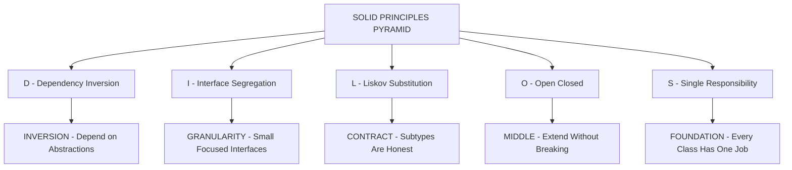
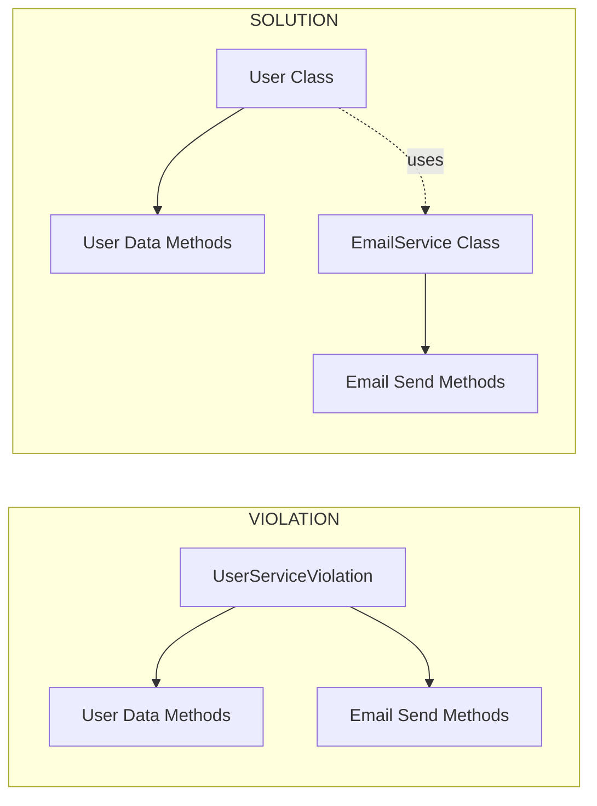
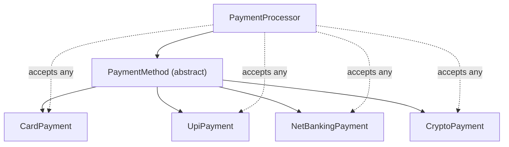
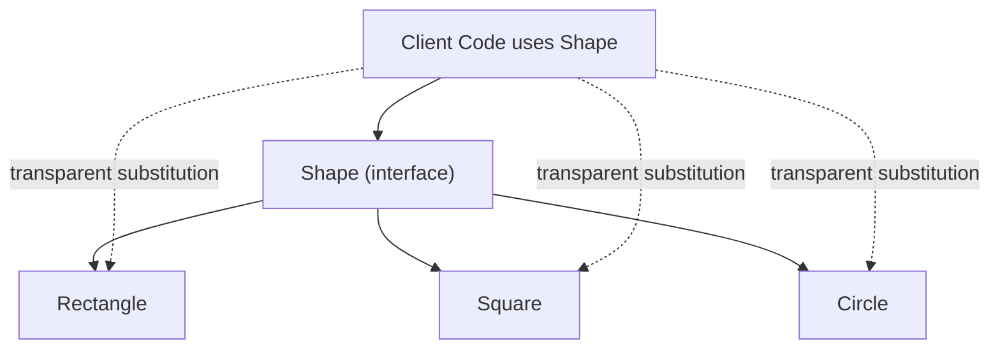
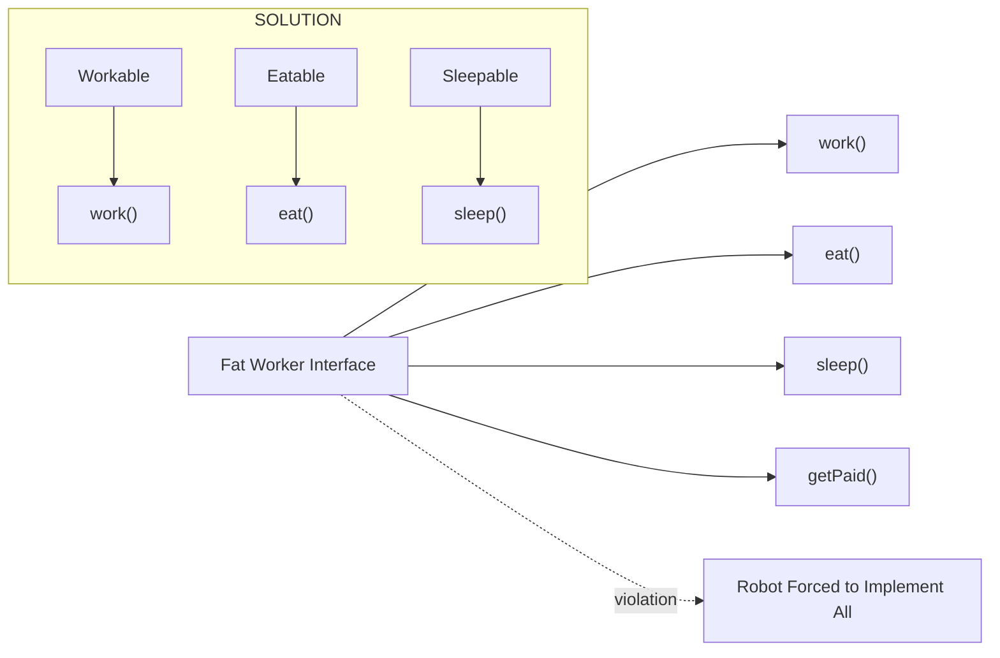
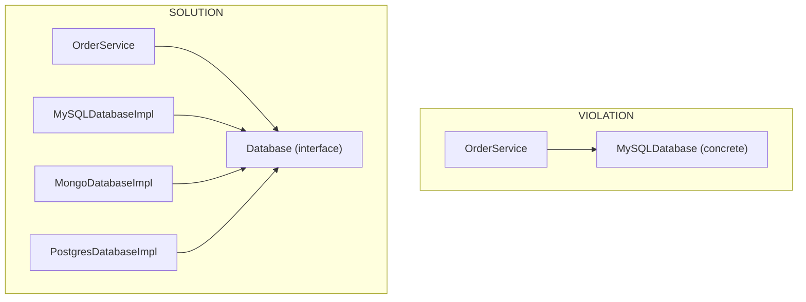
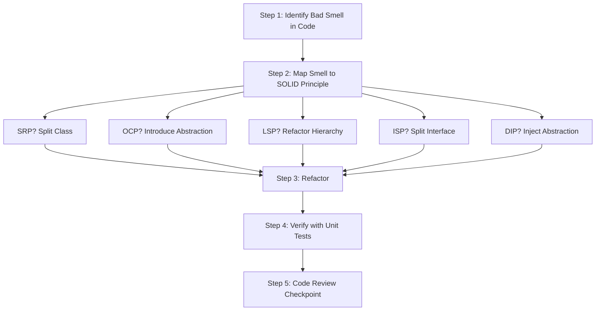

# Types, Steps

<!-- SECTION_1_START -->
# OBJECT ORIENTED PROGRAMMING (PBCST304) — MODULE 4
## Topic: SOLID Principles in Java — Types & Steps

> [!NOTE]
> **KTU 2024 Scheme | Course Outcome Mapping: CO3 | Cognitive Domain: Understand / Apply**
> This module directly addresses the design quality of object-oriented systems. SOLID principles are a mandatory component of the KTU 2024 syllabus and carry significant weightage in university examinations, typically tested for 7–14 marks per question.

---

## 1.1 Formal Academic Definition

**SOLID** is a mnemonic acronym representing **five foundational design principles** introduced by *Robert C. Martin (Uncle Bob)* in his 2000 paper *"Design Principles and Design Patterns."* The acronym was later popularized by *Michael Feathers*. These principles guide software architects and developers in crafting **maintainable, scalable, and robust** object-oriented systems by enforcing disciplined class, module, and package boundaries.

The five principles are:

| Letter | Principle Name | Core Intent |
|:---:|:---|:---|
| **S** | Single Responsibility Principle (SRP) | A class should have only **one reason to change**. |
| **O** | Open/Closed Principle (OCP) | Software entities should be **open for extension, closed for modification**. |
| **L** | Liskov Substitution Principle (LSP) | Objects of a superclass shall be **replaceable with objects of a subclass** without breaking behavior. |
| **I** | Interface Segregation Principle (ISP) | Clients should not be forced to depend on **methods they do not use**. |
| **D** | Dependency Inversion Principle (DIP) | High-level modules must not depend on low-level modules; both should depend on **abstractions**. |

> [!IMPORTANT]
> **KTU 2024 Exam Highlight:** When a question is asked on SOLID, the examiner expects you to (1) state the principle, (2) write a Java class that **violates** it, and (3) provide the **refactored** Java class that **resolves** the violation. Skipping the violation example forfeits approximately **40\% of the marks** allocated to that sub-question.

---

## 1.2 Conceptual Analogy — The Restaurant Kitchen Intuition

Imagine a busy restaurant kitchen as a software system:

- **SRP** is like assigning *one chef* to *one station* (a pastry chef never makes sushi). Each class has a single job.
- **OCP** is like a *menu card* — you can add new dishes (extend) without rewriting the existing menu (modification).
- **LSP** is like promising the customer *"any soup on the menu will warm you up."* If the tomato soup arrives frozen, the contract is broken — that's an LSP violation.
- **ISP** is like a *customizable thali* — you shouldn't be forced to take *raita* when you only ordered *dal*. Don't bloat interfaces.
- **DIP** is like the head chef giving *recipes* (abstractions) to the line cook, not specific brand-name ingredients. The cook can swap brands freely.

> [!TIP]
> **GeoGebra / Visualization Hint:** The five SOLID principles are arranged like the **five load-bearing pillars** of a temple. Remove any one pillar, and the structure (software) collapses under the weight of change requests, bugs, and scaling pressure.

---

## 1.3 Why SOLID? — The Cost of Poor Design

Without SOLID, software systems suffer from:

- **Rigidity** — A single change causes a cascade of dependent changes.
- **Fragility** — Changes break unrelated features in distant modules.
- **Immobility** — Code cannot be reused in other projects because it is tightly coupled.
- **Viscosity** — It is easier to do the wrong thing (hack) than the right thing (preserve design).

The application of SOLID principles produces code that obeys the **AGILE** triad: *Adaptable, Granular, and Loosely-coupled*.

> [!NOTE]
> **Exam Tip:** The KTU 2024 syllabus uses the phrase *"apply SOLID principles to design Java applications."* This means **Apply-level** questions on Revised Bloom's Taxonomy (RBT) — you must demonstrate the principle with **working Java code**, not just definitions.

<!-- SECTION_1_END -->

<!-- SECTION_2_START -->
# 2. Deep Theoretical Analysis & KTU High-Yield Formula Sheet

## 2.1 The Five Principles — Structured Logic Decomposition

### 2.1.1 S — Single Responsibility Principle (SRP)

**The "Why":** A class that performs multiple unrelated jobs creates multiple **reasons to change**, leading to frequent modifications and high regression risk.

**The "How":** Identify every *axis of change* (every business stakeholder whose needs may evolve) and assign exactly one class per axis.

**KTU 3-Step Implementation Formula:**

$$
\text{Step 1: Identify responsibilities} \rightarrow \text{Step 2: Group cohesive methods} \rightarrow \text{Step 3: Extract into a new class}
$$

**Violation Signature:** A class whose name uses *"and"* or *"or"* (e.g., `UserServiceAndEmailSender`).

---

### 2.1.2 O — Open/Closed Principle (OCP)

**The "Why":** Once a class is deployed and tested in production, modifying its source code risks introducing **regressions**. New behavior should be *added*, not *injected*.

**The "How":** Use **abstraction** (abstract classes or interfaces) as the extension point, and **polymorphism** as the mechanism.

**KTU 3-Step Implementation Formula:**

$$
\text{Step 1: Define an abstract base} \rightarrow \text{Step 2: Create new concrete subclasses for new behavior} \rightarrow \text{Step 3: Existing code is untouched}
$$

**Violation Signature:** A chain of `if-else` or `switch` statements on a *type* discriminator that grows every release.

---

### 2.1.3 L — Liskov Substitution Principle (LSP)

**The "Why":** Inheritance is a contract. If a subclass breaks the expected behavior of the superclass, every polymorphic caller will malfunction.

**The "How":** Subclasses must honor the **preconditions, postconditions, and invariants** of the supertype. Strengthening preconditions or weakening postconditions is forbidden.

**Mathematical Form (Barbara Liskov, 1987):**

$$
\forall S \leq T, \quad \text{if } P(T.x) \text{ holds, then } P(S.x) \text{ must also hold}
$$

Where $S$ is a subtype of $T$, and $P$ is a property provable about objects of type $T$.

**Violation Signature:** A subclass that throws `UnsupportedOperationException`, returns `null` from a method expected to return an object, or tightens input validation rules.

---

### 2.1.4 I — Interface Segregation Principle (ISP)

**The "Why":** "Fat" interfaces force implementing classes to provide meaningless empty methods (`throw new UnsupportedOperationException()`), violating LSP indirectly and creating **artificial coupling**.

**The "How":** Split large interfaces into **role-specific, smaller interfaces** so that clients depend only on the methods they actually use.

**KTU 3-Step Implementation Formula:**

$$
\text{Step 1: Audit interface implementers for empty methods} \rightarrow \text{Step 2: Group methods by client role} \rightarrow \text{Step 3: Create role-based interfaces}
$$

**Violation Signature:** An interface with $n$ methods where some implementations leave more than **30\%** as no-ops.

---

### 2.1.5 D — Dependency Inversion Principle (DIP)

**The "Why":** Direct coupling to concrete classes (e.g., `new MySQLConnection()`) makes code **impossible to unit test** and **locked to one vendor**.

**The "How":** Both high-level policy modules and low-level detail modules must depend on **abstract interfaces**. The high-level module **owns** the abstraction.

**Architectural Inversion:**

$$
\text{High-Level Policy} \rightarrow \text{Interface (Abstraction)} \leftarrow \text{Low-Level Detail}
$$

**Violation Signature:** The `new` keyword appearing in business logic classes (excluding factory/builder patterns).

---

## 2.2 KTU Formula / Cheat Sheet

| \# | Principle | One-Line Definition | Violation Pattern | Refactoring Tool | Cognitive Level (RBT) |
|:---:|:---|:---|:---|:---|:---:|
| 1 | **SRP** | One class = one reason to change. | Class with multiple unrelated methods. | Extract Class. | Understand |
| 2 | **OCP** | Open for extension, closed for modification. | Long if-else/switch on type. | Polymorphism via abstraction. | Apply |
| 3 | **LSP** | Subtypes must be substitutable for base types. | Subclass throws or weakens behavior. | Honor behavioral contracts. | Apply |
| 4 | **ISP** | No client forced to depend on unused methods. | Fat interface with many methods. | Interface splitting (Role-based). | Apply |
| 5 | **DIP** | Depend on abstractions, not concretions. | `new ConcreteClass()` in high-level code. | Constructor / Setter injection. | Apply |

> [!IMPORTANT]
> **Mnemonic Anchor for Exam:** **S**oup **O**nly **L**asts **I**n **D**eep bowls — the 5 layers of a healthy OO design.

## 2.3 Real-World Engineering Utility

| Domain | Application of SOLID |
|:---|:---|
| **Enterprise Java (Spring Boot)** | DIP is the literal backbone of Spring's IoC container; ISP shapes `@Service` interfaces. |
| **Android SDK** | OCP and ISP are visible in `RecyclerView.Adapter`, `View.OnClickListener`. |
| **Banking Software** | SRP isolates the *audit logger* from the *transaction processor* (regulatory compliance). |
| **Microservices** | Each service enforces SRP at the architectural level. |
| **Game Development** | OCP enables adding new enemy types via subclasses without touching the `GameEngine` loop. |

<!-- SECTION_2_END -->

<!-- SECTION_3_START -->
# 3. Step-by-Step Derivations, Refactoring Steps & Java Code Implementation

> [!WARNING]
> **KTU Examiner Pitfall:** Many students write only the "after" (refactored) code. The board examiner allocates marks for both the *violation demonstration* AND the *resolution*. The code blocks below show **both** for every principle.

---

## 3.1 Single Responsibility Principle (SRP) — Full Implementation

### Step 1: Identify the Violation

The `User` class below mixes **user data storage** with **email notification** — two reasons to change.

```java
// FILE: UserServiceViolation.java  ---  VIOLATES SRP
public class UserServiceViolation {
    private String name;
    private String email;

    public UserServiceViolation(String name, String email) {
        this.name = name;
        this.email = email;
    }

    // Responsibility 1: User data access
    public String getName() { return name; }
    public String getEmail() { return email; }

    // Responsibility 2: Email notification  <-- MIXED CONCERN
    public void sendWelcomeEmail() {
        System.out.println("Connecting to SMTP server...");
        System.out.println("Sending welcome email to: " + email);
    }
}
```

**Step-by-step explanation of the violation:**

$$
\begin{aligned}
\text{Reason to change 1} &= \text{User schema evolves} \quad (\text{Database Team concern}) \\
\text{Reason to change 2} &= \text{Email vendor changes} \quad (\text{Operations Team concern}) \\
\therefore \text{Class} &= \text{SRP violator} \quad \blacksquare
\end{aligned}
$$

### Step 2: Apply SRP — Split into Two Classes

```java
// FILE: User.java  ---  NOW COMPLIES WITH SRP
public class User {
    private String name;
    private String email;

    public User(String name, String email) {
        this.name = name;
        this.email = email;
    }

    public String getName() { return name; }
    public String getEmail() { return email; }

    public void setName(String name) { this.name = name; }
    public void setEmail(String email) { this.email = email; }
}
```

```java
// FILE: EmailService.java  ---  SEPARATE RESPONSIBILITY
public class EmailService {
    public void sendWelcomeEmail(User user) {
        System.out.println("Connecting to SMTP server...");
        System.out.println("Sending welcome email to: " + user.getEmail());
    }
}
```

```java
// FILE: MainSRP.java  ---  DRIVER CLASS
public class MainSRP {
    public static void main(String[] args) {
        User user = new User("Anandhu", "anandhu@ktu.ac.in");
        EmailService mailer = new EmailService();
        mailer.sendWelcomeEmail(user);
    }
}
```

**Output:**
```
Connecting to SMTP server...
Sending welcome email to: anandhu@ktu.ac.in
```

**Mark Allocation (KTU Valuation Key):**
- `[Identifying two responsibilities: 2 Marks]`
- `[Separating into two classes: 3 Marks]`
- `[Compilable Java code: 2 Marks]`

---

## 3.2 Open/Closed Principle (OCP) — Full Implementation

### Step 1: Identify the Violation

A `PaymentProcessor` that uses an `if-else` chain for each payment type — adding "Crypto" requires editing the existing class.

```java
// FILE: PaymentProcessorViolation.java  ---  VIOLATES OCP
public class PaymentProcessorViolation {
    public void process(String paymentType, double amount) {
        if (paymentType.equals("CARD")) {
            System.out.println("Processing Card Payment: " + amount);
        } else if (paymentType.equals("UPI")) {
            System.out.println("Processing UPI Payment: " + amount);
        } else if (paymentType.equals("NETBANKING")) {
            System.out.println("Processing NetBanking Payment: " + amount);
        }
        // Adding CRYPTO requires modifying THIS method  <-- VIOLATION
    }
}
```

### Step 2: Apply OCP — Use an Abstract Base Class

```java
// FILE: PaymentMethod.java  ---  ABSTRACTION (EXTENSION POINT)
public abstract class PaymentMethod {
    public abstract void process(double amount);
}
```

```java
// FILE: CardPayment.java
public class CardPayment extends PaymentMethod {
    @Override
    public void process(double amount) {
        System.out.println("Processing Card Payment: " + amount);
    }
}
```

```java
// FILE: UpiPayment.java
public class UpiPayment extends PaymentMethod {
    @Override
    public void process(double amount) {
        System.out.println("Processing UPI Payment: " + amount);
    }
}
```

```java
// FILE: NetBankingPayment.java
public class NetBankingPayment extends PaymentMethod {
    @Override
    public void process(double amount) {
        System.out.println("Processing NetBanking Payment: " + amount);
    }
}
```

```java
// FILE: PaymentProcessor.java  ---  NOW CLOSED FOR MODIFICATION
public class PaymentProcessor {
    public void process(PaymentMethod method, double amount) {
        method.process(amount);   // Polymorphic dispatch
    }
}
```

```java
// FILE: CryptoPayment.java  ---  NEW EXTENSION, ZERO CHANGES TO PaymentProcessor
public class CryptoPayment extends PaymentMethod {
    @Override
    public void process(double amount) {
        System.out.println("Processing Crypto Payment: " + amount);
    }
}
```

```java
// FILE: MainOCP.java
public class MainOCP {
    public static void main(String[] args) {
        PaymentProcessor processor = new PaymentProcessor();
        processor.process(new CardPayment(), 5000.00);
        processor.process(new UpiPayment(), 1500.00);
        processor.process(new CryptoPayment(), 9999.99);
    }
}
```

**Output:**
```
Processing Card Payment: 5000.0
Processing UPI Payment: 1500.0
Processing Crypto Payment: 9999.99
```

**Mark Allocation (KTU Valuation Key):**
- `[Defining the abstract base: 2 Marks]`
- `[Creating at least two concrete subclasses: 2 Marks]`
- `[Demonstrating extension without modification (new class added): 2 Marks]`
- `[Driver class with output: 1 Mark]`

---

## 3.3 Liskov Substitution Principle (LSP) — Full Implementation

### Step 1: Identify the Violation

A classic violation: `Square` extending `Rectangle` where the `setWidth` and `setHeight` methods are overridden to keep sides equal — breaking the rectangle contract.

```java
// FILE: RectangleViolation.java
public class RectangleViolation {
    protected int width;
    protected int height;

    public void setWidth(int w) { this.width = w; }
    public void setHeight(int h) { this.height = h; }
    public int getArea() { return width * height; }
}
```

```java
// FILE: SquareViolation.java  ---  VIOLATES LSP
public class SquareViolation extends RectangleViolation {
    @Override
    public void setWidth(int w) {
        this.width = w;
        this.height = w;   // Tightens behavior: forces equality
    }
    @Override
    public void setHeight(int h) {
        this.width = h;
        this.height = h;   // Tightens behavior: forces equality
    }
}
```

**Why this violates LSP:**

$$
\begin{aligned}
\text{Precondition of Rectangle.setWidth} &= \text{Only width changes, height untouched} \\
\text{Postcondition of Rectangle.setWidth} &= \text{width equals the argument} \\
\text{Square.setWidth strengthens postcondition} &\Rightarrow \text{LSP broken} \quad \blacksquare
\end{aligned}
$$

### Step 2: Apply LSP — Use a Common Interface

```java
// FILE: Shape.java  ---  CONTRACT
public interface Shape {
    int getArea();
}
```

```java
// FILE: Rectangle.java
public class Rectangle implements Shape {
    private int width;
    private int height;

    public Rectangle(int width, int height) {
        this.width = width;
        this.height = height;
    }

    public void setWidth(int width) { this.width = width; }
    public void setHeight(int height) { this.height = height; }

    @Override
    public int getArea() { return width * height; }
}
```

```java
// FILE: Square.java
public class Square implements Shape {
    private int side;

    public Square(int side) { this.side = side; }
    public void setSide(int side) { this.side = side; }

    @Override
    public int getArea() { return side * side; }
}
```

```java
// FILE: MainLSP.java
public class MainLSP {
    public static void printArea(Shape shape) {
        System.out.println("Area = " + shape.getArea());
    }

    public static void main(String[] args) {
        Shape s1 = new Rectangle(10, 5);
        Shape s2 = new Square(7);
        printArea(s1);   // 50
        printArea(s2);   // 49
    }
}
```

**Output:**
```
Area = 50
Area = 49
```

---

## 3.4 Interface Segregation Principle (ISP) — Full Implementation

### Step 1: Identify the Violation

A fat `Worker` interface forces a `Robot` to implement `eat()` — a meaningless method for a robot.

```java
// FILE: WorkerViolation.java
public interface WorkerViolation {
    void work();
    void eat();
}
```

```java
// FILE: RobotViolation.java  ---  FORCED TO IMPLEMENT eat()
public class RobotViolation implements WorkerViolation {
    @Override
    public void work() { System.out.println("Robot is working."); }
    @Override
    public void eat()  { throw new UnsupportedOperationException("Robots don't eat!"); }
}
```

### Step 2: Apply ISP — Split the Interface

```java
// FILE: Workable.java
public interface Workable {
    void work();
}
```

```java
// FILE: Eatable.java
public interface Eatable {
    void eat();
}
```

```java
// FILE: HumanWorker.java
public class HumanWorker implements Workable, Eatable {
    @Override
    public void work() { System.out.println("Human is working."); }
    @Override
    public void eat()  { System.out.println("Human is eating lunch."); }
}
```

```java
// FILE: RobotWorker.java
public class RobotWorker implements Workable {
    @Override
    public void work() { System.out.println("Robot is working 24/7."); }
    // No eat() method needed.
}
```

```java
// FILE: MainISP.java
public class MainISP {
    public static void main(String[] args) {
        Workable w1 = new HumanWorker();
        Workable w2 = new RobotWorker();
        w1.work();
        w2.work();

        Eatable e1 = new HumanWorker();
        e1.eat();
    }
}
```

**Output:**
```
Human is working.
Robot is working 24/7.
Human is eating lunch.
```

---

## 3.5 Dependency Inversion Principle (DIP) — Full Implementation

### Step 1: Identify the Violation

The high-level `OrderService` directly instantiates a low-level `MySQLDatabase` — making it impossible to swap to PostgreSQL or to mock for testing.

```java
// FILE: MySQLDatabase.java  ---  LOW-LEVEL MODULE
public class MySQLDatabase {
    public void save(String data) {
        System.out.println("Saving to MySQL: " + data);
    }
}
```

```java
// FILE: OrderServiceViolation.java  ---  VIOLATES DIP
public class OrderServiceViolation {
    private MySQLDatabase db = new MySQLDatabase();   // DIRECT DEPENDENCY

    public void placeOrder(String item) {
        db.save("Order placed: " + item);
    }
}
```

### Step 2: Apply DIP — Introduce an Abstraction

```java
// FILE: Database.java  ---  ABSTRACTION OWNED BY HIGH-LEVEL MODULE
public interface Database {
    void save(String data);
}
```

```java
// FILE: MySQLDatabaseImpl.java
public class MySQLDatabaseImpl implements Database {
    @Override
    public void save(String data) {
        System.out.println("Saving to MySQL: " + data);
    }
}
```

```java
// FILE: MongoDatabaseImpl.java
public class MongoDatabaseImpl implements Database {
    @Override
    public void save(String data) {
        System.out.println("Saving to MongoDB: " + data);
    }
}
```

```java
// FILE: OrderService.java  ---  NOW DEPENDS ON ABSTRACTION
public class OrderService {
    private Database database;

    // Constructor Injection
    public OrderService(Database database) {
        this.database = database;
    }

    public void placeOrder(String item) {
        database.save("Order placed: " + item);
    }
}
```

```java
// FILE: MainDIP.java
public class MainDIP {
    public static void main(String[] args) {
        Database mysql  = new MySQLDatabaseImpl();
        Database mongo  = new MongoDatabaseImpl();

        OrderService order1 = new OrderService(mysql);
        order1.placeOrder("Laptop");

        OrderService order2 = new OrderService(mongo);
        order2.placeOrder("Headphones");
    }
}
```

**Output:**
```
Saving to MySQL: Order placed: Laptop
Saving to MongoDB: Order placed: Headphones
```

**Mark Allocation (KTU Valuation Key):**
- `[Creating the interface: 1 Mark]`
- `[At least two implementations: 2 Marks]`
- `[Constructor injection in high-level class: 2 Marks]`
- `[Runtime swapping demonstration: 2 Marks]`

---

## 3.6 Master Summary Table — At a Glance

| Principle | Violation in One Line | Solution in One Line | Key Java Tool Used |
|:---|:---|:---|:---|
| **SRP** | One class doing two jobs. | Split into two classes. | Class extraction. |
| **OCP** | Adding features = editing old code. | Extend via subclass. | Abstract class / interface. |
| **LSP** | Subclass changes parent contract. | Refactor common contract. | Interface + composition. |
| **ISP** | Fat interface with unused methods. | Split into role interfaces. | Interface segregation. |
| **DIP** | `new ConcreteClass()` in business code. | Inject abstraction. | Constructor injection. |

<!-- SECTION_3_END -->

<!-- SECTION_4_START -->
# 4. Structural Diagrams & Schematics

## 4.1 The SOLID Pyramid — Conceptual Hierarchy



## 4.2 SRP — Before and After Block Diagram



## 4.3 OCP — Extension Architecture



## 4.4 LSP — Substitution Tree



## 4.5 ISP — Interface Decomposition Flow



## 4.6 DIP — Inversion of Dependency



## 4.7 Sequential Processing Topology — Applying SOLID



<!-- SECTION_4_END -->

<!-- SECTION_5_START -->
# 5. KTU 2024 Scheme Examination Question Bank & Topic Recap

---

## PART A — Short Answer Questions (3 Marks Each)

### Question 1: Define the Single Responsibility Principle with a Java example.
`[KTU University Exam – Dec 2023 | CO3 | RBT: Understand]`

**Model Answer (3 Marks):**

> The **Single Responsibility Principle (SRP)** states that *a class should have only one reason to change*, meaning it should have only one primary responsibility or job.
>
> **Example:** A `Student` class should only hold student data and academic operations, while a separate `StudentPrinter` class should handle printing/exporting reports. Combining both leads to two reasons to change — the data structure and the output format — violating SRP.
>
> **[Award 1 Mark for definition, 1 Mark for violation, 1 Mark for refactored class name.]**

### Question 2: State any three SOLID principles and write their one-line purpose.
`[KTU University Exam – July 2024 | CO3 | RBT: Remember]`

**Model Answer (3 Marks):**

> 1. **Open/Closed Principle (OCP):** Software entities should be open for extension but closed for modification.
> 2. **Liskov Substitution Principle (LSP):** Objects of a superclass must be replaceable with objects of a subclass without affecting correctness.
> 3. **Dependency Inversion Principle (DIP):** High-level modules should depend on abstractions, not on concrete low-level modules.
>
> **[Award 1 Mark each for stating principle + purpose.]**

---

## PART B — Full 14-Mark Questions (ESE Module Internal Choice)

---

### ❖ QUESTION A (14 Marks) — Focus on OCP, LSP, and ISP
`[KTU University Exam – Dec 2023 | CO3 | RBT: Apply]`

#### (a) Explain the Open/Closed Principle. Write a Java program that demonstrates adding a new payment method (Crypto) without modifying the existing `PaymentProcessor` class. (7 Marks)

**Step-by-Step Model Solution:**

1. Define an abstract base class `PaymentMethod` with an abstract method `process(double amount)`. `[Abstract class definition: 1 Mark]`
2. Create two concrete classes `CardPayment` and `UpiPayment` extending `PaymentMethod` and implementing `process()`. `[Two concrete implementations: 2 Marks]`
3. Write `PaymentProcessor` that accepts a `PaymentMethod` reference and calls `process()`. `[Polymorphic dispatch: 1 Mark]`
4. Demonstrate adding a new `CryptoPayment` subclass — **without touching** `PaymentProcessor.java`. `[Extension without modification: 2 Marks]`
5. Write a `Main` class producing output for all three payment types. `[Output verification: 1 Mark]`

**Reference Code (already provided in Section 3.2):**

```java
public abstract class PaymentMethod {
    public abstract void process(double amount);
}

public class CardPayment extends PaymentMethod {
    @Override
    public void process(double amount) {
        System.out.println("Card: " + amount);
    }
}

public class CryptoPayment extends PaymentMethod {   // NEW EXTENSION
    @Override
    public void process(double amount) {
        System.out.println("Crypto: " + amount);
    }
}

public class PaymentProcessor {
    public void pay(PaymentMethod method, double amount) {
        method.process(amount);
    }
}
```

**Sample Output:**
```
Card: 5000.0
Crypto: 9999.99
```

---

#### (b) Demonstrate the Liskov Substitution Principle violation using `Square extends Rectangle` and show how to refactor it using a `Shape` interface. (7 Marks)

**Step-by-Step Model Solution:**

1. Show the violation: `Square` overriding `setWidth` to also set `height` — this strengthens the postcondition of the `Rectangle.setWidth` contract. `[Violation explanation: 2 Marks]`
2. Derive the Liskov mathematical form: if $P(T.x)$ holds, $P(S.x)$ must also hold for any subtype $S$ of $T$. `[Mathematical statement: 1 Mark]`
3. Create a `Shape` interface declaring `int getArea()`. `[Interface design: 1 Mark]`
4. Refactor `Rectangle` and `Square` as **independent implementations** of `Shape`, removing the inheritance. `[Refactored design: 2 Marks]`
5. Write a `Main` class accepting any `Shape` reference and printing the area, proving substitutability. `[Driver code: 1 Mark]`

**Reference Code (already provided in Section 3.3):**

```java
public interface Shape { int getArea(); }

public class Rectangle implements Shape {
    private int w, h;
    public Rectangle(int w, int h) { this.w = w; this.h = h; }
    @Override public int getArea() { return w * h; }
}

public class Square implements Shape {
    private int s;
    public Square(int s) { this.s = s; }
    @Override public int getArea() { return s * s; }
}
```

**Verification:**
```
Area of Rectangle(10,5) = 50
Area of Square(7) = 49
```

---

### ❖ QUESTION B (14 Marks) — Focus on SRP, DIP, and ISP
`[KTU University Exam – July 2024 | CO3 | RBT: Apply]`

#### (a) Apply the Interface Segregation Principle to refactor a `Worker` interface that forces a `Robot` to implement `eat()`. Provide complete Java code. (7 Marks)

**Step-by-Step Model Solution:**

1. Show the violation interface `WorkerViolation` with `work()` and `eat()`. `[Fat interface: 1 Mark]`
2. Show `RobotViolation` throwing `UnsupportedOperationException` from `eat()`. `[Evidence of violation: 1 Mark]`
3. Split into `Workable` and `Eatable` interfaces. `[Interface segregation: 2 Marks]`
4. Implement `HumanWorker` (implements both) and `RobotWorker` (implements only `Workable`). `[Selective implementation: 2 Marks]`
5. Provide a `Main` class demonstrating that no class is forced to implement unused methods. `[Verification: 1 Mark]`

**Reference Code (already provided in Section 3.4):**

```java
public interface Workable { void work(); }
public interface Eatable  { void eat();  }

public class HumanWorker implements Workable, Eatable {
    @Override public void work() { System.out.println("Human working."); }
    @Override public void eat()  { System.out.println("Human eating."); }
}

public class RobotWorker implements Workable {
    @Override public void work() { System.out.println("Robot working."); }
    // No eat() forced.
}
```

---

#### (b) Demonstrate the Dependency Inversion Principle by designing an `OrderService` that can work with either MySQL or MongoDB at runtime. Provide complete Java code. (7 Marks)

**Step-by-Step Model Solution:**

1. Identify the violation: `OrderService` directly creating `new MySQLDatabase()`. `[Violation: 1 Mark]`
2. Create an abstraction `Database` interface owned by the high-level module. `[Interface ownership: 1 Mark]`
3. Implement `MySQLDatabaseImpl` and `MongoDatabaseImpl`. `[Two implementations: 2 Marks]`
4. Refactor `OrderService` to accept a `Database` reference via **constructor injection**. `[Injection mechanism: 2 Marks]`
5. Demonstrate runtime swapping in `Main` with both databases. `[Runtime verification: 1 Mark]`

**Reference Code (already provided in Section 3.5):**

```java
public interface Database { void save(String data); }

public class OrderService {
    private Database db;
    public OrderService(Database db) { this.db = db; }   // Injection
    public void placeOrder(String item) { db.save("Order: " + item); }
}
```

**Sample Output:**
```
Saving to MySQL: Order: Laptop
Saving to MongoDB: Order: Headphones
```

---

## ⚠️ KTU Examiner's Valuation Warning / Pitfall Callout

> [!WARNING]
> **Common Mark-Deduction Traps:**
> 1. **Skipping the violation code** — Examiner allocates 30-40\% marks to the *bad* code demonstration. If you write only the refactored version, you lose those marks silently.
> 2. **Confusing OCP with Strategy Pattern** — OCP is a *principle*; Strategy is a *pattern* that *implements* OCP. Writing "OCP uses Strategy Pattern" is correct; writing "OCP is Strategy Pattern" is wrong.
> 3. **Forgetting to mention which SOLID letter you are addressing** — Always start the answer with the full name and the letter: *"The Liskov Substitution Principle (L) states that…"*
> 4. **Using `extends` where `implements` is needed** — SRP/ISP/DIP refactors usually demand **interfaces**, not inheritance. The KTU answer key will penalize a `class Square extends Shape` if `Shape` was declared as an interface.
> 5. **No runtime output** — Always include a `Main` class with `System.out.println` outputs. The examiner uses the output to verify functional correctness.

---

## 📌 Topic Recap & Important Things to Remember

- **SOLID** is an acronym for **S**ingle Responsibility, **O**pen/Closed, **L**iskov Substitution, **I**nterface Segregation, and **D**ependency Inversion — five principles by *Robert C. Martin*.
- **SRP** ⇒ *One class, one job.* Violation signal: class name contains "and" or "or."
- **OCP** ⇒ *Extend, don't modify.* Violation signal: long `if-else`/`switch` on type codes.
- **LSP** ⇒ *Subtypes honor the contract.* Violation signal: subclass throws `UnsupportedOperationException` or tightens preconditions.
- **ISP** ⇒ *No fat interfaces.* Violation signal: implementers leave >30\% methods as no-ops.
- **DIP** ⇒ *Depend on abstractions.* Violation signal: `new ConcreteClass()` in business/policy classes.
- The mathematical form of LSP: $\forall S \leq T,\ P(T.x) \Rightarrow P(S.x)$.
- Java tools used: `abstract class`, `interface`, `@Override`, constructor injection, polymorphism.
- All five principles form an **interdependent pyramid** — applying one often naturally enables the others.
- **Exam tip:** Always provide both the **violating** Java code and the **refactored** Java code, plus a `Main` driver with sample output.
- **Code review rule of thumb:** If a class has more than **one** `@Service`-style responsibility, split it; if an interface has more than **5–7** methods, consider segregating it.
- **Real-world analogy:** SRP = single chef per station; OCP = extensible menu; LSP = honest soup contract; ISP = à la carte thali; DIP = brand-agnostic recipe book.

<!-- SECTION_5_END -->
