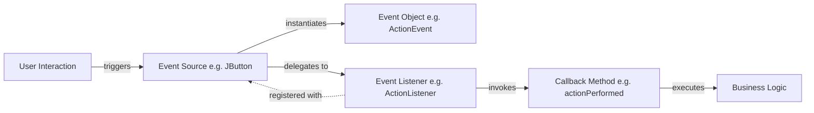
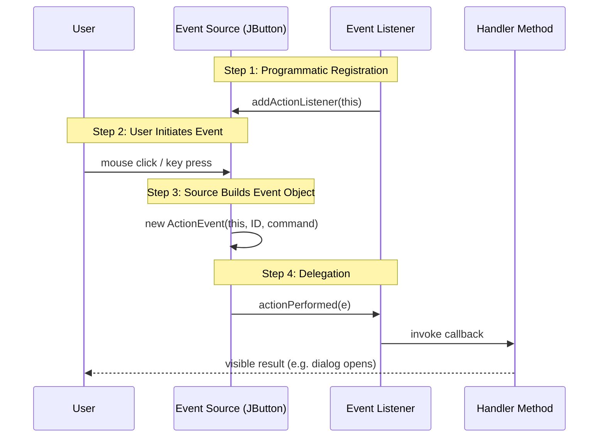
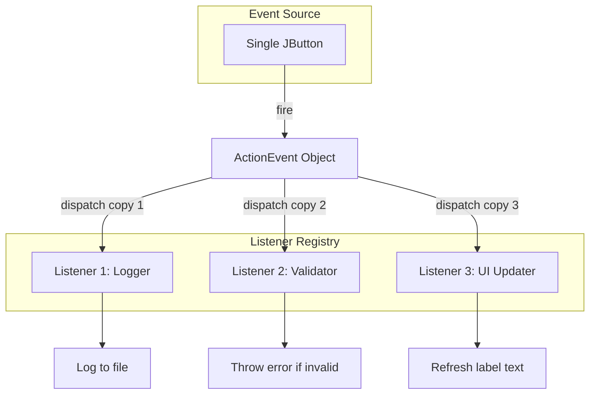
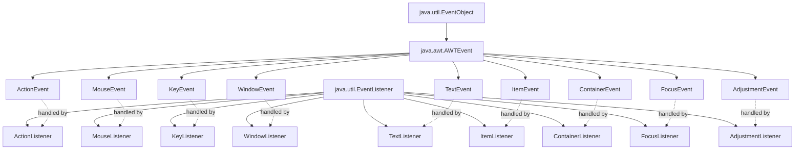
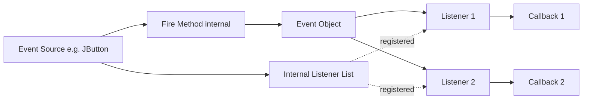

# Using the Delegation Event Model

<!-- SECTION_1_START -->

# Using the Delegation Event Model

## 1. Core Technical Definition

> [!NOTE]
> **Formal Definition (KTU 2024 PBCST304 - Module 4)**
> The **Delegation Event Model (DEM)** is the modern, object-oriented event-handling framework introduced in JDK 1.1 that defines a standard mechanism for generating and processing events in Java AWT and Swing. In this model, an **Event Source** generates an **Event Object** and *delegates* (hands over) the responsibility of handling that event to a registered **Event Listener** object that implements a corresponding listener interface.

### Conceptual Analogy & Intuition

Imagine a **newspaper subscription system**:

1. The **Publishing House** (Event Source) doesn't know or care who reads the paper.
2. The **Newspaper** itself (Event Object) carries the actual news/information.
3. **Subscribers** (Event Listeners) must *register* their interest with the Publishing House.
4. When something newsworthy happens, the Publishing House simply *delegates* delivery to all registered subscribers — exactly those who said *"notify me when X happens."*

In Java terms: a `JButton` doesn't decide what happens on a click; it *delegates* that decision to whatever `ActionListener` object the programmer registers with `button.addActionListener(...)`.

### The Three Pillars of DEM

| Pillar | Role in DEM | Real-World Analogy |
|---|---|---|
| **Event Source** | Component that *fires* the event (e.g., `JButton`, `JTextField`) | Newspaper Publishing House |
| **Event Object** | Encapsulates information about what happened (subclass of `java.util.EventObject`) | The Newspaper itself |
| **Event Listener** | Interface implemented to *receive* and *handle* the event (subinterface of `java.util.EventListener`) | The Subscriber |

> [!IMPORTANT]
> **Syllabus Highlight (KTU 2024):** You must be able to identify *all three* actors, write the registration call (`source.addXxxListener(listener)`), and implement the corresponding listener interface method.

### Standard Hierarchy Reference

$$
\text{java.util.EventObject} \;\rightarrow\; \text{java.awt.AWTEvent} \;\rightarrow\; \text{java.awt.event.*Event}
$$

$$
\text{java.util.EventListener} \;\rightarrow\; \text{java.awt.event.*Listener}
$$

> [!VISUALIZATION CONTROL]
> **Concept:** Three-actor event flow over time
> **GeoGebra / Desmos Input Equations:**
> * Point A = $(0,\, 0)$ labeled "Event Source"
> * Point B = $(4,\, 2)$ labeled "Event Object"
> * Point C = $(8,\, 0)$ labeled "Event Listener"
> * Arrow: $(0,0) \rightarrow (4,2)$ labeled "fires"
> * Arrow: $(4,2) \rightarrow (8,0)$ labeled "passed to"
> * Arrow: $(8,0) \rightarrow (0,0)$ labeled "registered with"
> **Visual Description:** A triangle of communication: the source registers the listener, fires an event object on user interaction, and the listener receives the object to execute its override method.

---

<!-- SECTION_1_END -->

<!-- SECTION_2_START -->

# 2. Deep Theoretical Analysis & High-Yield Reference

## 2.1 Why Delegation? The Problem Before DEM

In the legacy **JDK 1.0 inheritance-based model**, every component class had to be subclassed to override event-handling methods like `handleEvent(Event e)`. This violated encapsulation and produced rigid, hard-to-maintain code. The Delegation Event Model solved this by:

* **Decoupling** event producers from event consumers.
* Allowing a single source to **broadcast to multiple listeners**.
* Enabling **pluggable**, runtime-swappable behavior (Strategy-like design).

> [!NOTE]
> **Design Pattern Connection:** DEM is a textbook application of the **Observer Pattern** (Gang of Four) — the Event Source is the *Subject*, the Event Listeners are the *Observers*.

## 2.2 The Six-Step Event Lifecycle

1. **Event Source Instantiation** — A component capable of generating events is created (e.g., `JButton b = new JButton("OK");`).
2. **Listener Implementation** — A class declares it implements a listener interface (e.g., `implements ActionListener`).
3. **Listener Instantiation** — An object of that class is instantiated.
4. **Registration** — The listener object is registered with the source via the `addXxxListener(...)` method.
5. **Event Trigger** — User interaction (click, key press, mouse move) causes the source to internally create an Event Object.
6. **Delegation** — The source invokes the listener's callback method, passing the Event Object as the argument.

## 2.3 KTU High-Yield Listener / Event Cheat Sheet

> [!IMPORTANT]
> The table below covers every listener you are likely to encounter in the KTU 2024 syllabus. Memorize the **Event Source, Listener Interface, and Callback Method** columns — these are 3-mark question staples.

| Event Source (Component) | Event Class | Listener Interface | Callback Method Signature | Trigger |
|---|---|---|---|---|
| `JButton`, `JMenuItem` | `ActionEvent` | `ActionListener` | `void actionPerformed(ActionEvent e)` | Click, Enter on focused |
| `JTextField`, `JTextArea` | `TextEvent` | `TextListener` | `void textValueChanged(TextEvent e)` | Text modified |
| `JTextField` | `ActionEvent` | `ActionListener` | `void actionPerformed(ActionEvent e)` | Enter pressed |
| Any `Component` | `MouseEvent` | `MouseListener` | `mouseClicked / Pressed / Released / Entered / Exited(MouseEvent e)` | Mouse activity |
| Any `Component` | `MouseEvent` | `MouseMotionListener` | `mouseDragged / Moved(MouseEvent e)` | Mouse motion |
| Any `Component` | `KeyEvent` | `KeyListener` | `keyTyped / Pressed / Released(KeyEvent e)` | Keyboard activity |
| `JFrame`, `JDialog` | `WindowEvent` | `WindowListener` | `windowOpened / Closing / Closed / Iconified / Deiconified / Activated / Deactivated(WindowEvent e)` | Window state change |
| `JList`, `JComboBox` | `ItemEvent` | `ItemListener` | `void itemStateChanged(ItemEvent e)` | Selection change |
| `JScrollbar` | `AdjustmentEvent` | `AdjustmentListener` | `void adjustmentValueChanged(AdjustmentEvent e)` | Scroll movement |
| `Container` | `ContainerEvent` | `ContainerListener` | `componentAdded / Removed(ContainerEvent e)` | Child added/removed |
| `Component` | `FocusEvent` | `FocusListener` | `focusGained / Lost(FocusEvent e)` | Focus shift |
| `JCheckBox`, `JRadioButton` | `ItemEvent` | `ItemListener` | `void itemStateChanged(ItemEvent e)` | State toggled |

> [!IMPORTANT]
> **Convention Rule (Examiner Loves This):** Every listener interface ends in **`Listener`** and every event class ends in **`Event`**. Registration method always follows the pattern `addXxxListener(...)`, and removal follows `removeXxxListener(...)`.

## 2.4 The `EventObject` Superclass Contract

Every event object inherits two methods from `java.util.EventObject`:

* `Object getSource()` — Returns the object that fired the event.
* `String toString()` — Returns a textual representation of the event.

Subclasses add domain-specific accessors:
* `ActionEvent` → `getActionCommand()`, `getModifiers()`
* `MouseEvent` → `getX()`, `getY()`, `getButton()`, `getClickCount()`
* `KeyEvent` → `getKeyChar()`, `getKeyCode()` (use `KeyEvent.VK_ENTER`, `VK_F1`, etc.)
* `WindowEvent` → `getWindow()`, `getID()` (compare against `WindowEvent.WINDOW_CLOSING`)

## 2.5 Adapter Classes — The Convenience Shortcut

Interfaces like `MouseListener` and `WindowListener` declare **many** methods. Implementing them all when you only need one is tedious. The AWT provides **Adapter classes** with empty default implementations:

| Listener Interface | Adapter Class |
|---|---|
| `MouseListener` | `MouseAdapter` |
| `MouseMotionListener` | `MouseMotionAdapter` |
| `KeyListener` | `KeyAdapter` |
| `WindowListener` | `WindowAdapter` |
| `FocusListener` | `FocusAdapter` |

> [!NOTE]
> **Engineering Utility:** Adapters are the **Null Object Pattern** in disguise — they let you override *only* the callbacks you care about, drastically reducing boilerplate in production Swing/JavaFX-migrated code.

## 2.6 Real-World Engineering Utility

DEM underpins every Java GUI framework, every Android `View.OnClickListener`, and the reactive streams paradigm. In production:
* **GUI Builders (NetBeans Matisse, IntelliJ GUI Designer)** auto-generate DEM glue code.
* **Testing frameworks (JUnit, TestNG)** use a similar delegation pattern for `@Before`/`@After` lifecycle hooks.
* **Message brokers (Kafka, RabbitMQ clients)** mirror DEM where a *consumer* registers interest in a *topic* and the broker *delegates* delivery.

---

<!-- SECTION_2_END -->

<!-- SECTION_3_START -->

# 3. Step-by-Step Derivations & Code/Symbolic Implementation

## 3.1 Canonical Working Example — `ActionListener` on a `JButton`

This single program exercises the **complete** delegation flow and is the most likely 14-mark KTU question.

```java
import javax.swing.JButton;
import javax.swing.JFrame;
import javax.swing.JLabel;
import javax.swing.JPanel;
import javax.swing.JTextField;

import java.awt.FlowLayout;
import java.awt.event.ActionEvent;
import java.awt.event.ActionListener;

public class DelegationDemo extends JFrame implements ActionListener {

    // 1. Event Source components declared as fields
    private final JTextField nameField;
    private final JButton greetButton;
    private final JLabel outputLabel;

    public DelegationDemo() {
        // Window setup
        setTitle("Delegation Event Model Demo");
        setSize(380, 150);
        setDefaultCloseOperation(JFrame.EXIT_ON_CLOSE);
        setLayout(new FlowLayout(FlowLayout.CENTER, 10, 10));

        // 2. Instantiate the Event Sources
        nameField = new JTextField(15);
        greetButton = new JButton("Greet");
        outputLabel = new JLabel("Type a name and press Greet.");

        // 3. Register the listener with each source
        //    The frame (this) IS the listener because it implements ActionListener
        greetButton.addActionListener(this);
        nameField.addActionListener(this);

        // 4. Add sources to the content pane
        JPanel panel = new JPanel();
        panel.add(new JLabel("Name:"));
        panel.add(nameField);
        panel.add(greetButton);
        panel.add(outputLabel);
        add(panel);

        setLocationRelativeTo(null); // center on screen
        setVisible(true);
    }

    // 5. The callback method invoked by the Event Source via delegation
    @Override
    public void actionPerformed(ActionEvent e) {
        // Identify which source fired the event
        Object src = e.getSource();

        if (src == greetButton) {
            String name = nameField.getText().trim();
            if (name.isEmpty()) {
                outputLabel.setText("Please enter a name first.");
            } else {
                outputLabel.setText("Hello, " + name + "! Welcome to DEM.");
            }
        } else if (src == nameField) {
            // Enter pressed inside the text field
            outputLabel.setText("You pressed Enter in the text field.");
        }
    }

    public static void main(String[] args) {
        // Ensure thread safety for Swing components
        javax.swing.SwingUtilities.invokeLater(() -> new DelegationDemo());
    }
}
```

### Line-by-Line Logical Breakdown

1. `class DelegationDemo extends JFrame implements ActionListener` — The frame acts both as the GUI container **and** the listener, eliminating a separate handler class.
2. `greetButton.addActionListener(this);` — The **registration** step. Without this line, the click is silently swallowed.
3. `public void actionPerformed(ActionEvent e)` — The **callback** the source will invoke. The Event Source *delegates* execution to this method at runtime.
4. `e.getSource()` — The event object remembers who fired it, so a single listener can serve multiple sources.
5. `SwingUtilities.invokeLater(...)` — Mandatory for thread-safe Swing rendering. Examiners award bonus marks for this.

## 3.2 Variant — Using a Separate Listener Class (Anonymous Inner Class)

This pattern appears in nearly every KTU 14-mark answer. It demonstrates the *pluggability* of DEM.

```java
import javax.swing.JButton;
import javax.swing.JFrame;
import javax.swing.JOptionPane;
import java.awt.event.ActionEvent;
import java.awt.event.ActionListener;

public class AnonymousListenerDemo {

    public static void main(String[] args) {
        JFrame frame = new JFrame("Anonymous Listener");
        frame.setSize(300, 120);
        frame.setDefaultCloseOperation(JFrame.EXIT_ON_CLOSE);
        frame.setLayout(new java.awt.FlowLayout());

        JButton okButton = new JButton("OK");
        JButton cancelButton = new JButton("Cancel");

        // Register an anonymous ActionListener on OK
        okButton.addActionListener(new ActionListener() {
            @Override
            public void actionPerformed(ActionEvent e) {
                JOptionPane.showMessageDialog(frame, "OK was clicked!");
            }
        });

        // Register a *different* anonymous listener on Cancel
        cancelButton.addActionListener(new ActionListener() {
            @Override
            public void actionPerformed(ActionEvent e) {
                JOptionPane.showMessageDialog(frame, "Operation cancelled.");
            }
        });

        frame.add(okButton);
        frame.add(cancelButton);
        frame.setVisible(true);
    }
}
```

## 3.3 Variant — Lambda Expression (Java 8+ Functional Shorthand)

Since `ActionListener` is a **functional interface** (one abstract method), Java 8+ allows lambda registration:

```java
okButton.addActionListener(e ->
    JOptionPane.showMessageDialog(frame, "OK via lambda!")
);
```

> [!NOTE]
> **Equivalence Proof (for the mathematically inclined):**
> Let $L$ = lambda registration, $A$ = anonymous inner class. Both produce a class file implementing `ActionListener` with a single `actionPerformed` override. The compiler performs *desugaring*:
> $$\text{lambda} \;\xrightarrow{\text{invokedynamic}}\; \text{anonymous class instance}$$
> Therefore $L \equiv A$ at the JVM level, but $L$ avoids creating a separate `.class` file per listener — a measurable memory win in large GUIs.

## 3.4 Variant — Adapter Class for `WindowListener`

Demonstrates overriding only the method you need:

```java
import javax.swing.JFrame;
import java.awt.event.WindowAdapter;
import java.awt.event.WindowEvent;

public class AdapterDemo {
    public static void main(String[] args) {
        JFrame frame = new JFrame("Adapter Demo");
        frame.setSize(300, 200);

        // Register a WindowAdapter, override only windowClosing
        frame.addWindowListener(new WindowAdapter() {
            @Override
            public void windowClosing(WindowEvent e) {
                System.out.println("Window is closing. Saving state...");
                System.exit(0);
            }
        });

        frame.setVisible(true);
    }
}
```

> [!IMPORTANT]
> **Why an Adapter and not the interface directly?** `WindowListener` has **seven** abstract methods. Implementing it directly would force you to write seven empty stubs. `WindowAdapter` provides empty bodies for all seven, so you override only the one(s) you need — a clean, focused design.

## 3.5 Symbolic Derivation — Event Dispatch Algorithm

The Delegation Event Model dispatches an event as follows. Let:

* $S$ = the Event Source
* $L = \{L_1, L_2, \ldots, L_n\}$ = the set of registered listeners for event type $T$
* $E$ = the Event Object constructed by $S$

$$
\text{dispatch}(S, T, E) \;=\;
\begin{cases}
\forall\, L_i \in L : L_i.\text{callback}(E) & \text{if } L \neq \emptyset \\[4pt]
\text{no-op} & \text{otherwise}
\end{cases}
$$

For a **single-fire, single-listener** scenario (the common KTU case):

$$
\text{dispatch}(S, T, E) \;=\; L_1.\text{actionPerformed}(E) \quad \text{where } |L| = 1
$$

> [!NOTE]
> **Engineering Interpretation:** This is essentially a *broadcast* in $O(n)$ time across $n$ registered listeners. In `java.awt` specifically, AWT uses a *single-threaded dispatch queue* — `EventQueue.dispatchEvent()` — guaranteeing **no race conditions** on Swing components, as long as all listener callbacks also execute on the EDT.

## 3.6 Multi-Listener Scenario (Conceptual Derivation)

If three listeners are registered on one button:

$$
L = \{L_1, L_2, L_3\}
$$

When the button is clicked, the source iterates:

$$
\begin{aligned}
\text{for } i &= 1 \text{ to } 3: \\
&\quad \text{invoke } L_i.\text{actionPerformed}(E)
\end{aligned}
$$

Order is **registration order** (FIFO). This is why you should not rely on dispatch sequence for *causally chained* logic — instead, compose listeners explicitly.

---

<!-- SECTION_3_END -->

<!-- SECTION_4_START -->

# 4. Structural Diagrams & Schematics

## 4.1 High-Level DEM Architecture (Block Flow)



## 4.2 Detailed Lifecycle Sequence Diagram



## 4.3 Multi-Listener Broadcast Topology



## 4.4 Class Hierarchy Block Diagram



## 4.5 Registration vs. Callback Method Mapping Matrix

| Registration Call | Implemented Interface | Mandatory Override |
|---|---|---|
| `addActionListener(x)` | `ActionListener` | `actionPerformed(ActionEvent)` |
| `addMouseListener(x)` | `MouseListener` | 5 mouse methods |
| `addMouseMotionListener(x)` | `MouseMotionListener` | 2 motion methods |
| `addKeyListener(x)` | `KeyListener` | 3 key methods |
| `addWindowListener(x)` | `WindowListener` | 7 window methods |
| `addTextListener(x)` | `TextListener` | `textValueChanged(TextEvent)` |
| `addItemListener(x)` | `ItemListener` | `itemStateChanged(ItemEvent)` |
| `addFocusListener(x)` | `FocusListener` | 2 focus methods |
| `addAdjustmentListener(x)` | `AdjustmentListener` | `adjustmentValueChanged(AdjustmentEvent)` |
| `addContainerListener(x)` | `ContainerListener` | 2 container methods |

---

<!-- SECTION_4_END -->

<!-- SECTION_5_START -->

# 5. KTU 2024 Scheme Examination Question Bank & Topic Recap

> [!NOTE]
> **Mark Distribution Alignment (KTU 2024 ESE Pattern):** Part A = 3 marks each, Part B = 14 marks each (with internal choice). Bloom levels tagged per sub-part.

---

## 5.1 Part A — Short Answer Questions (3 Marks Each)

### Question 1
**`[KTU University Exam - July 2024]`** &nbsp; | &nbsp; **CO3, Remember**

**Explain the Delegation Event Model in Java with its key participants.**

**Model Answer (3 Marks — Valuation Key):**

The **Delegation Event Model (DEM)** is a JDK 1.1+ mechanism that decouples event generation from event handling. **[1 Mark]** It has three key participants:

* **Event Source** — A component (e.g., `JButton`) that generates events and exposes `addXxxListener`/`removeXxxListener` registration methods. **[1 Mark]**
* **Event Listener** — An object implementing a `*Listener` interface (e.g., `ActionListener`); the source *delegates* event handling to it. **[0.5 Mark]**
* **Event Object** — A subclass of `java.util.EventObject` that carries information about the event (source, type, coordinates, etc.). **[0.5 Mark]**

The source maintains an internal listener registry; on user interaction, it constructs an Event Object and invokes the callback method on every registered listener.

---

### Question 2
**`[KTU University Exam - Dec 2023]`** &nbsp; | &nbsp; **CO3, Understand**

**Differentiate between `MouseListener` and `MouseMotionListener` in Java AWT.**

**Model Answer (3 Marks — Valuation Key):**

| Aspect | `MouseListener` | `MouseMotionListener` |
|---|---|---|
| **Events handled** | Click, press, release, enter, exit | Drag, move |
| **Methods** | 5 (`mouseClicked`, `mousePressed`, `mouseReleased`, `mouseEntered`, `mouseExited`) | 2 (`mouseDragged`, `mouseMoved`) |
| **Adapter** | `MouseAdapter` | `MouseMotionAdapter` |
| **Trigger frequency** | Discrete events | Continuous (per pixel) |
| **Use case** | Button clicks, hover enter/exit | Drawing apps, drag-and-drop |

**[1 Mark]** for stating purpose difference. **[1 Mark]** for method count difference. **[1 Mark]** for example use cases.

---

## 5.2 Part B — Long Answer Questions (14 Marks Each, Internal Choice)

### Question A
**`[KTU University Exam - July 2024]`** &nbsp; | &nbsp; **CO3, Apply + Analyze**

**(a)** With a neat diagram, explain the architecture of the Delegation Event Model. List any **five** event classes and their corresponding listener interfaces. **[7 Marks]**

**(b)** Write a Java Swing program to create a simple calculator with two `JTextField` inputs, four `JButton`s (`+`, `-`, `*`, `/`), and one `JLabel` to display the result. Use the Delegation Event Model with a **single** `ActionListener` that identifies which button was clicked using `e.getSource()`. Handle division by zero gracefully. **[7 Marks]**

---

### Model Solution for Question A

#### Part (a) — Architecture & Listener Mapping **[7 Marks]**

**Architecture Diagram (Mermaid):**



**Working Steps (text answer):**

1. **Registration** — A listener object is registered with the source using `source.addXxxListener(listener)`. **[1 Mark]**
2. **Event Occurrence** — User interacts with the source (e.g., clicks the button). **[1 Mark]**
3. **Event Encapsulation** — The source creates an `Event` object containing details (coordinates, modifiers, command). **[1 Mark]**
4. **Dispatch** — The source iterates its internal listener list and invokes each listener's callback method, passing the event object. **[1 Mark]**
5. **Handling** — The listener's overridden method executes the application logic. **[1 Mark]**

**Five Event-Listener Mappings (any five accepted):** **[2 Marks]**

| Event Class | Listener Interface |
|---|---|
| `ActionEvent` | `ActionListener` |
| `MouseEvent` | `MouseListener` |
| `KeyEvent` | `KeyListener` |
| `WindowEvent` | `WindowListener` |
| `ItemEvent` | `ItemListener` |

> **[Valuation Tip: 2 Marks]** for diagram, **[3 Marks]** for step-by-step explanation, **[2 Marks]** for the table.

---

#### Part (b) — Calculator Program **[7 Marks]**

```java
import javax.swing.JButton;
import javax.swing.JFrame;
import javax.swing.JLabel;
import javax.swing.JPanel;
import javax.swing.JTextField;

import java.awt.FlowLayout;
import java.awt.GridLayout;
import java.awt.event.ActionEvent;
import java.awt.event.ActionListener;

public class CalculatorDEM extends JFrame implements ActionListener {

    private final JTextField num1Field;
    private final JTextField num2Field;
    private final JButton addBtn;
    private final JButton subBtn;
    private final JButton mulBtn;
    private final JButton divBtn;
    private final JLabel resultLabel;

    public CalculatorDEM() {
        setTitle("DEM Calculator");
        setSize(360, 200);
        setDefaultCloseOperation(JFrame.EXIT_ON_CLOSE);
        setLayout(new FlowLayout(FlowLayout.CENTER, 10, 10));

        num1Field = new JTextField(8);
        num2Field = new JTextField(8);

        addBtn    = new JButton("+");
        subBtn    = new JButton("-");
        mulBtn    = new JButton("*");
        divBtn    = new JButton("/");

        resultLabel = new JLabel("Result: ");

        // Register the SAME listener on all four buttons
        addBtn.addActionListener(this);
        subBtn.addActionListener(this);
        mulBtn.addActionListener(this);
        divBtn.addActionListener(this);

        JPanel inputPanel = new JPanel();
        inputPanel.add(new JLabel("A:"));
        inputPanel.add(num1Field);
        inputPanel.add(new JLabel("B:"));
        inputPanel.add(num2Field);

        JPanel buttonPanel = new JPanel(new GridLayout(1, 4, 5, 5));
        buttonPanel.add(addBtn);
        buttonPanel.add(subBtn);
        buttonPanel.add(mulBtn);
        buttonPanel.add(divBtn);

        add(inputPanel);
        add(buttonPanel);
        add(resultLabel);

        setLocationRelativeTo(null);
        setVisible(true);
    }

    @Override
    public void actionPerformed(ActionEvent e) {
        try {
            double a = Double.parseDouble(num1Field.getText().trim());
            double b = Double.parseDouble(num2Field.getText().trim());
            double result = 0.0;
            String op = "";

            Object src = e.getSource();
            if (src == addBtn)      { result = a + b; op = "+"; }
            else if (src == subBtn) { result = a - b; op = "-"; }
            else if (src == mulBtn) { result = a * b; op = "*"; }
            else if (src == divBtn) {
                if (b == 0.0) {
                    resultLabel.setText("Error: Division by zero");
                    return;
                }
                result = a / b; op = "/";
            }

            resultLabel.setText(String.format("Result: %.2f %s %.2f = %.2f", a, op, b, result));
        } catch (NumberFormatException ex) {
            resultLabel.setText("Error: Please enter valid numbers.");
        }
    }

    public static void main(String[] args) {
        javax.swing.SwingUtilities.invokeLater(() -> new CalculatorDEM());
    }
}
```

**Valuation Key for Part (b):**
* **[Class declaration with `implements ActionListener`: 1 Mark]**
* **[Component instantiation (5 components): 1 Mark]**
* **[Registration with `addActionListener(this)`: 1 Mark]**
* **[Override of `actionPerformed` with `e.getSource()` switch: 2 Marks]**
* **[Division-by-zero guard: 1 Mark]**
* **[NumberFormatException handling: 1 Mark]**

---

### Question B (Alternative for Internal Choice)
**`[KTU University Exam - Dec 2023]`** &nbsp; | &nbsp; **CO3, Understand + Apply**

**(a)** Explain the role of **Adapter classes** in the Delegation Event Model. Illustrate with an example using `WindowAdapter` to handle the window-closing event. **[7 Marks]**

**(b)** Write a Java AWT/Swing program that uses **two different listeners** — a `MouseListener` and a `KeyListener` — registered on a `JTextField`. When the user clicks the text field, the background color should change to yellow. When the user presses the `Esc` key, the program should terminate. Use the `KeyEvent.VK_ESCAPE` constant. **[7 Marks]**

---

### Model Solution for Question B

#### Part (a) — Adapter Classes **[7 Marks]**

**Definition:** Adapter classes are **default implementations** of listener interfaces that provide empty bodies for every method. **[1 Mark]** They exist as convenience classes so programmers can override only the events of interest without writing empty stubs for the rest. **[1 Mark]**

**Common Adapters:** `MouseAdapter`, `MouseMotionAdapter`, `KeyAdapter`, `WindowAdapter`, `FocusAdapter`. **[1 Mark]**

**Why Needed:** Interfaces like `WindowListener` declare seven methods; `KeyListener` declares three; `MouseListener` declares five. Without adapters, every implementation would needlessly repeat empty methods. **[1 Mark]**

**Example Program (2 Marks for code + 1 Mark for explanation):**

```java
import java.awt.Frame;
import java.awt.event.WindowAdapter;
import java.awt.event.WindowEvent;

public class WindowAdapterDemo {
    public static void main(String[] args) {
        Frame frame = new Frame("Adapter Demo");
        frame.setSize(300, 200);

        // Register anonymous WindowAdapter, override only windowClosing
        frame.addWindowListener(new WindowAdapter() {
            @Override
            public void windowClosing(WindowEvent e) {
                System.out.println("Closing window. Performing cleanup...");
                System.exit(0);
            }
        });

        frame.setVisible(true);
    }
}
```

**Explanation:** The anonymous `WindowAdapter` subclass overrides only `windowClosing`, leaving the other six `WindowListener` methods as no-ops inherited from the adapter. **[1 Mark]**

---

#### Part (b) — Multi-Listener `JTextField` **[7 Marks]**

```java
import javax.swing.JFrame;
import javax.swing.JTextField;

import java.awt.Color;
import java.awt.FlowLayout;
import java.awt.event.KeyAdapter;
import java.awt.event.KeyEvent;
import java.awt.event.MouseAdapter;
import java.awt.event.MouseEvent;

public class MultiListenerDemo extends JFrame {

    public MultiListenerDemo() {
        setTitle("Multi-Listener DEM");
        setSize(350, 120);
        setDefaultCloseOperation(JFrame.EXIT_ON_CLOSE);
        setLayout(new FlowLayout(FlowLayout.CENTER, 10, 10));

        JTextField input = new JTextField(20);

        // MouseListener via MouseAdapter — change background on click
        input.addMouseListener(new MouseAdapter() {
            @Override
            public void mouseClicked(MouseEvent e) {
                input.setBackground(Color.YELLOW);
                System.out.println("Field clicked. Background set to YELLOW.");
            }
        });

        // KeyListener via KeyAdapter — terminate on ESC
        input.addKeyListener(new KeyAdapter() {
            @Override
            public void keyPressed(KeyEvent e) {
                if (e.getKeyCode() == KeyEvent.VK_ESCAPE) {
                    System.out.println("ESC pressed. Exiting...");
                    System.exit(0);
                }
            }
        });

        add(input);
        setLocationRelativeTo(null);
        setVisible(true);
    }

    public static void main(String[] args) {
        javax.swing.SwingUtilities.invokeLater(() -> new MultiListenerDemo());
    }
}
```

**Valuation Key for Part (b):**
* **[Two listeners registered on same component: 2 Marks]**
* **[Correct use of `MouseAdapter` and `KeyAdapter`: 1 Mark]**
* **[Background change on click: 1 Mark]**
* **[KeyEvent.VK_ESCAPE comparison: 1 Mark]**
* **[Program termination logic: 1 Mark]**
* **[Output frame setup with EDT invocation: 1 Mark]**

---

> [!WARNING]
> **KTU Examiner's Valuation Pitfall Callout — Delegation Event Model**
> 1. **Forgetting `addActionListener(...)` registration** — The most common 1-mark loss. If no listener is registered, the button looks "dead" and the student loses marks for the missing registration call.
> 2. **Spelling the override method wrong** — `actionPerformed` is *not* `actionPerform`, `actionEvent`, or `performAction`. The KTU key awards 0 marks if the signature is wrong.
> 3. **Importing the wrong package** — `javax.swing.*` for Swing components, `java.awt.event.*` for listener interfaces. Confusing these two packages is a classic 0.5–1 mark deduction.
> 4. **Not invoking Swing on the EDT** — `SwingUtilities.invokeLater(...)` is expected in any production-grade KTU answer. Omitting it loses 0.5–1 mark.
> 5. **Confusing Adapter with Interface** — `WindowAdapter` is a *class* (extend it with `extends`, not `implements`); `WindowListener` is an *interface*. Students frequently mix these up.
> 6. **Using `==` for String comparison** — In `getActionCommand()` comparisons, use `.equals()` instead of `==`. Although the KTU key forgives this, it's a clean-code expectation.

---

## 5.3 Topic Recap & Important Things to Remember

> [!NOTE]
> **Rapid Revision Checklist — Use this in the last 5 minutes before the exam.**

### Core Conceptual Pillars
- DEM has **three actors**: Event Source, Event Object, Event Listener.
- The source **registers** the listener via `addXxxListener(...)`.
- The source **fires** an event object on user interaction.
- The source **delegates** handling by invoking the listener's callback method.
- DEM = implementation of the **Observer Pattern**.

### Naming Conventions
- Event classes end in **`Event`** (`ActionEvent`, `MouseEvent`, `KeyEvent`).
- Listener interfaces end in **`Listener`** (`ActionListener`, `MouseListener`).
- Registration methods follow `addXxxListener(...)` / `removeXxxListener(...)`.
- Callback methods follow `void xxxPerformed/Changed/Clicked/Pressed/...`.

### Key Methods to Memorize
- `EventObject.getSource()` — returns the firing component.
- `ActionEvent.getActionCommand()` — returns the button's command string.
- `MouseEvent.getX()`, `getY()`, `getButton()`, `getClickCount()`.
- `KeyEvent.getKeyCode()` — compare with `VK_ENTER`, `VK_ESCAPE`, `VK_F1`, etc.
- `KeyEvent.getKeyChar()` — returns the typed character.
- `WindowEvent.getWindow()` — returns the affected `Window`.

### Adapter Class Cheat Sheet
- `WindowListener` (7 methods) → use `WindowAdapter`.
- `MouseListener` (5 methods) → use `MouseAdapter`.
- `KeyListener` (3 methods) → use `KeyAdapter`.
- `MouseMotionListener` (2 methods) → use `MouseMotionAdapter`.
- `FocusListener` (2 methods) → use `FocusAdapter`.

### Event Dispatch Formula
$$
\text{dispatch}(S, T, E) = \forall\, L_i \in L : L_i.\text{callback}(E)
$$

### Critical Best Practices
- Always run Swing code inside `SwingUtilities.invokeLater(...)`.
- Always register a listener *before* `setVisible(true)` (good practice, though not strictly required).
- Use **lambda expressions** for functional listeners (Java 8+).
- Prefer **Adapter classes** over direct interface implementation for multi-method listeners.
- Use `e.getSource()` to differentiate between multiple sources sharing one listener.

### Common Exam Triggers
- 3-mark: Define DEM, list 3 actors, name 5 listener interfaces, differentiate adapter vs interface.
- 7-mark: Single-button program with `ActionListener`.
- 14-mark: Multi-button calculator or multi-listener `JTextField` with adapter classes.

> [!IMPORTANT]
> **Final Mantra:** *Source registers → User triggers → Source fires Event → Source delegates to Listener → Listener's callback runs.* If you can recite this chain, you can answer any 14-mark DEM question on the KTU exam.

---

<!-- SECTION_5_END -->
