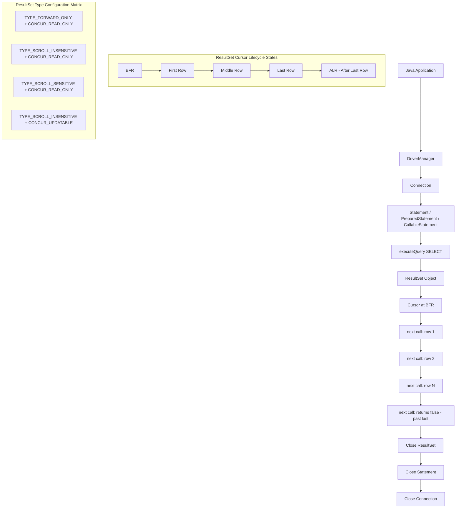
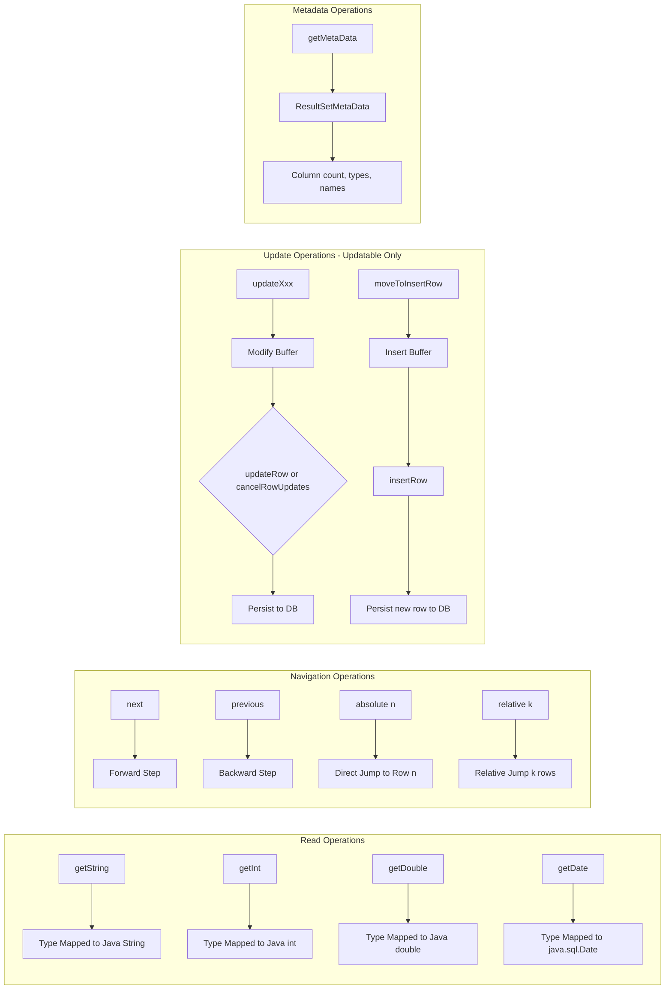
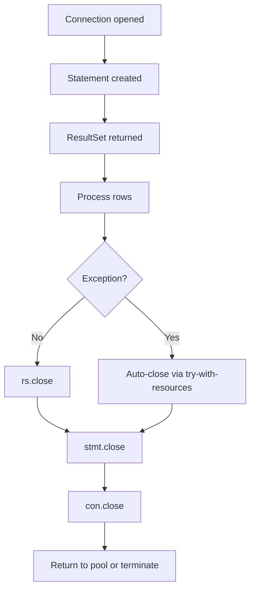

# Working with Result Set

<!-- SECTION_1_START -->
# Working with ResultSet in Java (JDBC)

> [!NOTE]
> **KTU 2024 Syllabus Reference:** This topic falls under **Module 4: Solid Principles in Java** (extended to JDBC Persistence Layer in OOP labs), mapping to **Course Outcome CO3** — *Implement database connectivity and persistence in Java applications using JDBC and the ResultSet API.*

## 1. Formal Academic Definition

A **`ResultSet`** in Java is an object that encapsulates the rows returned by the execution of a SQL `SELECT` query against a relational database through the Java Database Connectivity (JDBC) API. It maintains a **cursor** that points to the current row of data; initially, the cursor is positioned **before the first row**. The `ResultSet` interface (`java.sql.ResultSet`) provides accessor methods to retrieve column values using either the column name or the column index (1-based).

> [!IMPORTANT]
> **Key Property of ResultSet:** By default, a `ResultSet` is **scrollable only in the forward direction** and is **read-only**. This default type is known as `TYPE_FORWARD_ONLY` with concurrency `CONCUR_READ_ONLY`. The cursor can only move forward (using `next()`) and cannot be updated.

## 2. Intuitive Analogy — The Spreadsheet Cursor

Imagine a **printed Excel spreadsheet** lying flat on a desk:

- The query result is the entire printed sheet.
- The **`ResultSet` object is your finger** acting as a cursor on the page.
- Initially, your finger hovers **above row 1** (BFR — Before First Row).
- Calling `next()` moves your finger **down one row at a time**.
- Calling `previous()` moves your finger **up one row** (only if scrollable).
- Reading a column value is like **reading a specific cell** your finger currently points to.
- Closing the `ResultSet` is like **removing the sheet from the desk** and freeing memory.

> [!TIP]
> **Geometric Intuition:** Think of the `ResultSet` cursor as a **read/write head of a cassette tape** that traverses magnetic tape linearly. The head cannot jump arbitrarily unless the tape is rewound or fast-forwarded. This is exactly how `TYPE_FORWARD_ONLY` cursors operate.

## 3. Physical Constants and Standard Metrics

| Property | Standard Value | Significance |
|----------|---------------|--------------|
| Initial Cursor Position | **Before First Row (BFR)** | First `next()` returns the first row |
| Row Indexing | **1-based** for columns | `getString(1)` → first column |
| Default Fetch Size | **`10` rows** | JDBC driver-dependent |
| Default Type | `TYPE_FORWARD_ONLY` | Cursor moves only forward |
| Default Concurrency | `CONCUR_READ_ONLY` | Cannot update DB through ResultSet |
| Default Holdability | `HOLD_CURSORS_OVER_COMMIT` | Depends on driver |

> [!VISUALIZATION CONTROL]
> **Concept:** ResultSet cursor traversal geometry
> **Desmos Input Equations:**
> * `x = 1, 2, 3, 4, 5` (row positions)
> * `y = 0` (cursor baseline)
> * `f(x) = sin(pi*x/2)` (state transition wave on movement)
> **Visual Description:** Plot row positions 1 through 5 on the x-axis. The cursor starts at x=0 (BFR state). Each call to `next()` advances the cursor by one unit on the x-axis. The sin wave represents the boolean return value of `next()` — peaks (y=1) when a row exists, zero-crossing (y=0) when end of data is reached.

<!-- SECTION_1_END -->

<!-- SECTION_2_START -->
# Deep Theoretical Analysis — ResultSet Architecture

## 1. The Three Pillars of ResultSet Configuration

When creating a `Statement` (or `PreparedStatement`), the type of `ResultSet` returned is determined by **three mutually orthogonal parameters**:

| Parameter | Possible Values | Purpose |
|-----------|----------------|---------|
| **Type** | `TYPE_FORWARD_ONLY`, `TYPE_SCROLL_INSENSITIVE`, `TYPE_SCROLL_SENSITIVE` | Defines scrollability & sensitivity to DB changes |
| **Concurrency** | `CONCUR_READ_ONLY`, `CONCUR_UPDATABLE` | Defines whether data can be modified via ResultSet |
| **Holdability** | `HOLD_CURSORS_OVER_COMMIT`, `CLOSE_CURSORS_AT_COMMIT` | Determines cursor behavior at transaction commit |

### 1.1 Type — Direction of Navigation

- **`TYPE_FORWARD_ONLY`**: Cursor moves only from BFR → last row, one row at a time. **Most memory-efficient.**
- **`TYPE_SCROLL_INSENSITIVE`**: Cursor can move in any direction (`first()`, `last()`, `previous()`, `absolute(n)`, `relative(n)`). Does **not** see changes made by other transactions after the result set was created.
- **`TYPE_SCROLL_SENSITIVE`**: Scrollable + **does** see external changes. Requires more driver support.

### 1.2 Concurrency — Mutability of Rows

- **`CONCUR_READ_ONLY`**: Standard read-only mode. Cannot update DB through ResultSet.
- **`CONCUR_UPDATABLE`**: Allows in-place updates using `updateXxx()` methods followed by `updateRow()`. Allows inserts via `moveToInsertRow()`, `insertRow()`. Allows deletes via `deleteRow()`.

### 1.3 Holdability — Commit Behavior

- **`HOLD_CURSORS_OVER_COMMIT`**: Cursor remains open even after `Connection.commit()`.
- **`CLOSE_CURSORS_AT_COMMIT`** *(JDBC default)*: Cursor is closed at commit.

> [!IMPORTANT]
> **Statement Method to Configure ResultSet:**
> `createStatement(int resultSetType, int resultSetConcurrency)`
> `createStatement(int resultSetType, int resultSetConcurrency, int resultSetHoldability)`

## 2. Cursor Navigation Methods — Complete Map

| Method | Effect on Cursor | Return Type |
|--------|------------------|-------------|
| `next()` | Moves cursor **forward** one row | `boolean` (true if row exists) |
| `previous()` | Moves cursor **backward** one row | `boolean` |
| `first()` | Positions cursor at **first row** | `boolean` |
| `last()` | Positions cursor at **last row** | `boolean` |
| `beforeFirst()` | Positions cursor at **BFR** | `void` |
| `afterLast()` | Positions cursor **after last row** | `void` |
| `absolute(int row)` | Moves to **specific row number** | `boolean` |
| `relative(int rows)` | Moves **relative** to current position | `boolean` |
| `getRow()` | Returns **current row number** | `int` |

## 3. Getter Methods — Column Access Patterns

Two equivalent ways to retrieve column values:

1. **By Column Index** (1-based): `getString(1)`, `getInt(2)`, `getDouble(3)`
2. **By Column Label**: `getString("name")`, `getInt("age")`

> [!NOTE]
> **Column Index Rule:** In JDBC, column indices start from **1**, not 0. Index `0` is invalid and throws `SQLException`.

### Type-Safe Getter Methods

| SQL Type | ResultSet Getter | Java Return Type |
|----------|------------------|------------------|
| `CHAR`, `VARCHAR` | `getString()` | `String` |
| `INTEGER` | `getInt()` | `int` |
| `BIGINT` | `getLong()` | `long` |
| `DECIMAL`, `NUMERIC` | `getBigDecimal()` | `java.math.BigDecimal` |
| `FLOAT`, `DOUBLE` | `getDouble()` | `double` |
| `DATE` | `getDate()` | `java.sql.Date` |
| `TIME` | `getTime()` | `java.sql.Time` |
| `TIMESTAMP` | `getTimestamp()` | `java.sql.Timestamp` |
| `BOOLEAN`, `BIT` | `getBoolean()` | `boolean` |
| `BLOB` | `getBlob()` | `java.sql.Blob` |
| `CLOB` | `getClob()` | `java.sql.Clob` |
| `NULL` | `wasNull()` | `boolean` (check after getter call) |

## 4. Row Update Methods (Updatable ResultSet)

To enable updates, the underlying query **must**:
- Reference **only one table** (no joins).
- Select **all primary key columns**.
- Select **all NOT NULL columns** (for inserts).

Workflow:
1. Position cursor on a row using `next()` / `absolute()`.
2. Call `updateXxx(columnIndex, newValue)`.
3. Call `updateRow()` to **persist** the change to DB.
4. Call `cancelRowUpdates()` to **discard** pending changes.

For inserting:
1. `moveToInsertRow()` — moves to a special buffer row.
2. `updateXxx(...)` for each column.
3. `insertRow()` — commits the new row.
4. `moveToCurrentRow()` — returns to original position.

For deleting:
1. Position on the target row.
2. `deleteRow()` — removes the row from DB.

## 5. KTU High-Yield Formula Sheet

| Concept | Syntax / Formula | Notes |
|---------|------------------|-------|
| Create forward-only ResultSet | `stmt.executeQuery(sql)` | Default type |
| Create scrollable ResultSet | `stmt = con.createStatement(ResultSet.TYPE_SCROLL_INSENSITIVE, ResultSet.CONCUR_READ_ONLY)` | Requires explicit constants |
| Read first row | `rs.first(); String n = rs.getString(1);` | Returns false if empty |
| Read all rows (loop) | `while(rs.next()) { ... }` | Most common pattern |
| Get row count | `rs.last(); int n = rs.getRow();` | Only for scrollable |
| Check empty result | `if(!rs.next()) { /* empty */ }` | Must reposition cursor after |
| Close ResultSet | `rs.close();` | Also closed by `Statement.close()` |
| Detect null value | `int v = rs.getInt("col"); if(rs.wasNull()) { v = 0; }` | Per-column null check |

## 6. Real-World Engineering Utility

> [!TIP]
> **Production Use Cases:**
> - **Banking Systems:** Transaction history pagination using `absolute()` and `relative()` scrollable cursors.
> - **E-commerce Catalogs:** Paginated product listings (`rs.absolute(offset)` then iterate).
> - **Reporting Tools:** Multi-pass analysis requires `TYPE_SCROLL_INSENSITIVE` to walk the data twice.
> - **Data Migration Pipelines:** `CONCUR_UPDATABLE` ResultSets for in-place ETL transformations.
> - **ORM Frameworks (Hibernate/JPA):** Under the hood, scrollable ResultSets power lazy-loading and cursor-based streaming.

<!-- SECTION_2_END -->

<!-- SECTION_3_START -->
# Step-by-Step Derivations and Code Implementation

## 1. The Six-Step JDBC Lifecycle with ResultSet

### Step 1: Load and Register the Driver

```java
Class.forName("com.mysql.cj.jdbc.Driver"); // MySQL 8.x
// OR (preferred in JDBC 4.0+): auto-loading via classpath
```

### Step 2: Establish the Connection

```java
String url  = "jdbc:mysql://localhost:3306/studentdb";
String user = "root";
String pass = "root123";
Connection con = DriverManager.getConnection(url, user, pass);
```

### Step 3: Create a Statement

```java
Statement stmt = con.createStatement(
    ResultSet.TYPE_SCROLL_INSENSITIVE,
    ResultSet.CONCUR_READ_ONLY
);
```

### Step 4: Execute the Query → Obtain ResultSet

```java
String sql = "SELECT roll_no, name, cgpa FROM student";
ResultSet rs = stmt.executeQuery(sql);
```

### Step 5: Process the ResultSet (Iterate)

```java
while (rs.next()) {
    int    roll = rs.getInt("roll_no");
    String name = rs.getString("name");
    double cgpa = rs.getDouble("cgpa");
    System.out.printf("%d  %-20s  %.2f%n", roll, name, cgpa);
}
```

### Step 6: Close in Reverse Order (LIFO)

```java
rs.close();
stmt.close();
con.close();
```

## 2. Complete Production-Grade Implementation with Exception Handling

```java
import java.sql.Connection;
import java.sql.DriverManager;
import java.sql.ResultSet;
import java.sql.SQLException;
import java.sql.Statement;

/**
 * StudentDAO — Demonstrates scrollable, read-only ResultSet usage.
 * Pattern: Try-with-resources, absolute cursor positioning, wasNull() check.
 */
public class StudentDAO {

    private static final String URL  = "jdbc:mysql://localhost:3306/studentdb";
    private static final String USER = "root";
    private static final String PASS = "root123";

    public void printAllStudents() {
        String query = "SELECT roll_no, name, cgpa FROM student ORDER BY roll_no";

        // try-with-resources guarantees close even on exception
        try (Connection con = DriverManager.getConnection(URL, USER, PASS);
             Statement stmt = con.createStatement(
                     ResultSet.TYPE_SCROLL_INSENSITIVE,
                     ResultSet.CONCUR_READ_ONLY);
             ResultSet rs   = stmt.executeQuery(query)) {

            // -- (A) Forward iteration (standard pattern) --
            System.out.println("=== FORWARD TRAVERSAL ===");
            while (rs.next()) {
                int    roll = rs.getInt("roll_no");
                String name = rs.getString("name");
                double cgpa = rs.getDouble("cgpa");
                if (rs.wasNull()) {
                    cgpa = 0.0;
                }
                System.out.printf("Roll=%d  Name=%s  CGPA=%.2f%n", roll, name, cgpa);
            }

            // -- (B) Scrollable: jump to last row --
            if (rs.last()) {
                System.out.println("\nLast student → Roll: " + rs.getInt("roll_no"));
            }

            // -- (C) Scrollable: count rows via last()+getRow() --
            rs.last();
            int totalRows = rs.getRow();
            System.out.println("Total rows in ResultSet: " + totalRows);

            // -- (D) Jump to absolute row number --
            if (rs.absolute(2)) {
                System.out.println("Row #2 → " + rs.getString("name"));
            }

            // -- (E) Reverse traversal --
            System.out.println("\n=== REVERSE TRAVERSAL ===");
            rs.afterLast();
            while (rs.previous()) {
                System.out.println(rs.getInt("roll_no") + " : " + rs.getString("name"));
            }

        } catch (SQLException ex) {
            // Strict error logging with chained exception inspection
            System.err.println("SQLState   : " + ex.getSQLState());
            System.err.println("ErrorCode  : " + ex.getErrorCode());
            System.err.println("Message    : " + ex.getMessage());
            ex.printStackTrace();
        }
    }

    public static void main(String[] args) {
        new StudentDAO().printAllStudents();
    }
}
```

**Step-by-step Explanation of Critical Lines:**

| Line | Purpose |
|------|---------|
| `try (Connection con = ...)` | Auto-closeable; ensures `con.close()` even on exception |
| `TYPE_SCROLL_INSENSITIVE` | Allows `previous()`, `first()`, `last()`, `absolute()` |
| `CONCUR_READ_ONLY` | Read-only mode (cannot update DB) |
| `rs.wasNull()` | **Mandatory** after `getInt/getDouble` to detect SQL NULL → Java 0 |
| `rs.absolute(2)` | Jumps cursor to row index 2 directly (O(1) jump) |
| `rs.afterLast()` | Required before reverse loop; otherwise `previous()` fails on last row |

## 3. Updatable ResultSet — Complete Example

```java
import java.sql.*;

public class UpdatableResultSetDemo {

    public static void main(String[] args) {
        String url = "jdbc:mysql://localhost:3306/studentdb";
        String sql = "SELECT roll_no, name, cgpa FROM student";

        try (Connection con = DriverManager.getConnection(url, "root", "root123");
             Statement stmt = con.createStatement(
                     ResultSet.TYPE_SCROLL_INSENSITIVE,
                     ResultSet.CONCUR_UPDATABLE);
             ResultSet rs = stmt.executeQuery(sql)) {

            // -- UPDATE existing row: bump CGPA of row 1 by 0.5 --
            rs.absolute(1);
            double oldCgpa = rs.getDouble("cgpa");
            rs.updateDouble("cgpa", oldCgpa + 0.5);
            rs.updateRow();
            System.out.println("Updated CGPA from " + oldCgpa + " to " + (oldCgpa + 0.5));

            // -- INSERT a new row using the insert buffer --
            rs.moveToInsertRow();
            rs.updateInt("roll_no", 999);
            rs.updateString("name", "NEW_STUDENT");
            rs.updateDouble("cgpa", 8.5);
            rs.insertRow();
            rs.moveToCurrentRow();
            System.out.println("Inserted new student with roll_no 999");

            // -- DELETE the newly inserted row --
            rs.absolute(rs.getRow()); // re-position; moveToInsertRow shifted cursor
            // Re-fetch to be safe
            rs.beforeFirst();
            while (rs.next()) {
                if (rs.getInt("roll_no") == 999) {
                    rs.deleteRow();
                    System.out.println("Deleted student with roll_no 999");
                    break;
                }
            }

        } catch (SQLException e) {
            e.printStackTrace();
        }
    }
}
```

**Derived Conditions for Updatable ResultSet (from JDBC spec):**

$$
\begin{aligned}
\text{Query must satisfy:} \quad
Q &= \{T,\ PK_T,\ NN_T\} \\
\text{where } T &= \text{ single table name (no joins)} \\
PK_T &= \text{ all primary key columns selected} \\
NN_T &= \text{ all NOT NULL columns selected}
\end{aligned}
$$

If any of these conditions is violated, calling `updateRow()` or `insertRow()` throws `SQLException` with message starting with *"Invalid operation on updatable result set"*.

## 4. MetaData Extraction from ResultSet

```java
ResultSet rs = stmt.executeQuery("SELECT * FROM student");
ResultSetMetaData md = rs.getMetaData();

int colCount = md.getColumnCount();
System.out.println("Columns: " + colCount);

for (int i = 1; i <= colCount; i++) {
    String name     = md.getColumnName(i);
    String type     = md.getColumnTypeName(i);
    String javaType = md.getColumnClassName(i);
    int    size     = md.getColumnDisplaySize(i);
    boolean nullable = md.isNullable(i) != ResultSetMetaData.columnNoNulls;
    System.out.printf("Col %d: %s (%s, %s) size=%d nullable=%b%n",
                      i, name, type, javaType, size, nullable);
}
```

This is the foundation of **generic DAO frameworks** and **ORM tools** (Hibernate uses identical metadata traversal).

## 5. RowSet — The Scrollable, Disconnected Cousin

`javax.sql.RowSet` extends `ResultSet` semantics but is **disconnected** (serializable, can travel across network tiers). Subtypes:

- `JdbcRowSet` — connected, scrollable wrapper
- `CachedRowSet` — fully disconnected, in-memory cache
- `WebRowSet` — XML-serializable for web services
- `JoinRowSet` — performs SQL JOIN across multiple RowSets

## 6. Pagination Pattern — Industry Standard

```java
public void listPage(int pageNumber, int pageSize) throws SQLException {
    int offset = (pageNumber - 1) * pageSize;
    String sql = "SELECT roll_no, name FROM student LIMIT ? OFFSET ?";

    try (PreparedStatement ps = con.prepareStatement(sql)) {
        ps.setInt(1, pageSize);
        ps.setInt(2, offset);
        try (ResultSet rs = ps.executeQuery()) {
            while (rs.next()) {
                System.out.println(rs.getInt(1) + " " + rs.getString(2));
            }
        }
    }
}
```

<!-- SECTION_3_END -->

<!-- SECTION_4_START -->
# Structural Diagrams and Schematics

## 1. JDBC Architecture Flow with ResultSet



## 2. Sequential Processing Topology — ResultSet Operations Matrix



## 3. Resource Closure Dependency Graph



> [!WARNING]
> **Memory Leak Risk:** Failing to close `ResultSet`, `Statement`, and `Connection` in LIFO order can exhaust the database connection pool within minutes under production load. Always use **try-with-resources**.

<!-- SECTION_4_END -->

<!-- SECTION_5_START -->
# KTU 2024 Scheme Examination Question Bank

---

## Part A — 3-Mark Short Answer Questions

### Question 1
**[KTU University Exam — July 2023]**
**CO3 | Remember**

What is a `ResultSet` in JDBC? Mention any two methods used to retrieve data from it.

**Model Answer:**

A `ResultSet` is an interface in the `java.sql` package that represents the result set of a SQL `SELECT` query. It maintains a cursor pointing to the current row; the cursor is initially positioned **before the first row**.

Two methods to retrieve data:

- `next()` — moves the cursor to the next row; returns `false` if no more rows.
- `getString(int columnIndex)` / `getString(String columnLabel)` — retrieves the value of the specified column as a Java `String`.

> [!VALUATION KEY]
> [Defining ResultSet with cursor concept: 2 Marks] [Any two retrieval methods: 1 Mark]

---

### Question 2
**[KTU University Exam — Dec 2022]**
**CO3 | Understand**

Differentiate between `TYPE_FORWARD_ONLY` and `TYPE_SCROLL_INSENSITIVE` ResultSets.

**Model Answer:**

| Feature | `TYPE_FORWARD_ONLY` | `TYPE_SCROLL_INSENSITIVE` |
|---------|---------------------|---------------------------|
| Cursor movement | Forward only (via `next()`) | Bidirectional (`next`, `previous`, `first`, `last`, `absolute`, `relative`) |
| Sensitivity to external DB changes | N/A (one-pass) | **Insensitive** — does not see changes made by other transactions |
| Memory footprint | Lower | Higher (caches result locally) |
| Default in JDBC | **Yes** | No — must be specified explicitly |

> [!VALUATION KEY]
> [Forward-only definition: 1.5 Marks] [Scroll-insensitive definition with at least 2 navigation methods: 1.5 Marks]

---

## Part B — 14-Mark Questions (Module Internal Choice)

### Question A — 14 Marks
**[KTU University Exam — July 2024]**
**CO3 | Apply | Analyze**

#### (a) — 7 Marks | Understand + Apply

Write a Java program using JDBC to:
1. Connect to a MySQL database `studentdb`.
2. Create a scrollable and read-only `ResultSet` for the query `SELECT * FROM student WHERE cgpa > 8.0`.
3. Display the **third row** directly using cursor navigation, then print the **total number of rows** in the result.

**Model Solution:**

```java
import java.sql.*;

public class HighCgpaQuery {
    public static void main(String[] args) {
        String url  = "jdbc:mysql://localhost:3306/studentdb";
        String user = "root";
        String pass = "root123";
        String sql  = "SELECT roll_no, name, cgpa FROM student WHERE cgpa > 8.0";

        try (Connection con = DriverManager.getConnection(url, user, pass);
             Statement stmt = con.createStatement(
                     ResultSet.TYPE_SCROLL_INSENSITIVE,
                     ResultSet.CONCUR_READ_ONLY);
             ResultSet rs   = stmt.executeQuery(sql)) {

            // (i) Display the third row using absolute positioning
            if (rs.absolute(3)) {
                int    r   = rs.getInt("roll_no");
                String n   = rs.getString("name");
                double c   = rs.getDouble("cgpa");
                System.out.println("Third row → Roll: " + r + ", Name: " + n + ", CGPA: " + c);
            } else {
                System.out.println("Less than 3 rows in result set.");
            }

            // (ii) Compute total row count via last() + getRow()
            if (rs.last()) {
                int total = rs.getRow();
                System.out.println("Total rows with CGPA > 8.0 : " + total);
            } else {
                System.out.println("Result set is empty.");
            }

        } catch (SQLException e) {
            e.printStackTrace();
        }
    }
}
```

> [!VALUATION KEY]
> [Correct import statements: 1 Mark] [Proper Statement creation with type+concurrency: 2 Marks] [Correct use of `absolute(3)` and validation: 2 Marks] [`last()` + `getRow()` count logic: 1 Mark] [Proper try-with-resources closure: 1 Mark]

#### (b) — 7 Marks | Apply + Analyze

Explain the **three ResultSet type constants** and the **two concurrency constants** in JDBC with their constant integer values and behavior. How would you create a ResultSet that allows scrolling **and** updating rows?

**Model Solution:**

**Three Type Constants:**

| Constant | Integer Value | Behavior |
|----------|---------------|----------|
| `TYPE_FORWARD_ONLY` | `1003` | Cursor moves only forward via `next()`; one-pass traversal. |
| `TYPE_SCROLL_INSENSITIVE` | `1004` | Cursor moves in any direction; does **not** reflect concurrent DB modifications. |
| `TYPE_SCROLL_SENSITIVE` | `1005` | Scrollable and **does** reflect concurrent DB modifications (driver-dependent support). |

**Two Concurrency Constants:**

| Constant | Integer Value | Behavior |
|----------|---------------|----------|
| `CONCUR_READ_ONLY` | `1007` | Cannot update DB through the ResultSet. |
| `CONCUR_UPDATABLE` | `1008` | Can update, insert, and delete rows via `updateXxx()`, `insertRow()`, `deleteRow()`. |

**Code to create scrollable + updatable ResultSet:**

```java
Connection con = DriverManager.getConnection(url, user, pass);
Statement stmt = con.createStatement(
    ResultSet.TYPE_SCROLL_INSENSITIVE,   // scrollable
    ResultSet.CONCUR_UPDATABLE           // updatable
);
ResultSet rs = stmt.executeQuery("SELECT roll_no, name, cgpa FROM student");
```

> [!VALUATION KEY]
> [Three type constants with values: 3 Marks] [Two concurrency constants with values: 2 Marks] [Code for combined scroll+update: 2 Marks]

---

### Question B — 14 Marks (Alternative)
**[KTU University Exam — Dec 2023]**
**CO3 | Understand + Apply**

#### (a) — 7 Marks

List and explain any **five navigation methods** of the `ResultSet` interface. State which ResultSet type supports each method.

**Model Answer:**

| Method | Description | Required Type |
|--------|-------------|---------------|
| `next()` | Moves cursor to next row; returns `true` if row exists, `false` otherwise | All types |
| `previous()` | Moves cursor to previous row | `TYPE_SCROLL_INSENSITIVE` or `TYPE_SCROLL_SENSITIVE` |
| `first()` | Positions cursor at first row | Scrollable types only |
| `last()` | Positions cursor at last row | Scrollable types only |
| `absolute(int row)` | Moves cursor to specified row number (positive counts from start, negative from end) | Scrollable types only |
| `relative(int rows)` | Moves cursor relative to current position (positive = forward, negative = backward) | Scrollable types only |
| `getRow()` | Returns current row number (1-based) | Scrollable types only |
| `beforeFirst()` / `afterLast()` | Positions cursor at BFR / after last row | Scrollable types only |

> [!VALUATION KEY]
> [Five methods listed with descriptions: 5 Marks] [Specifying scrollable requirement for each: 2 Marks]

#### (b) — 7 Marks

Write a Java program to demonstrate the use of `wasNull()` to handle SQL NULL values retrieved via `getInt()`. Also explain why direct `getInt()` returns `0` for NULL and how `wasNull()` helps.

**Model Solution:**

```java
import java.sql.*;

public class NullHandlingDemo {
    public static void main(String[] args) {
        String url = "jdbc:mysql://localhost:3306/studentdb";
        String sql = "SELECT roll_no, scholarship_amount FROM student";

        try (Connection con = DriverManager.getConnection(url, "root", "root123");
             Statement stmt = con.createStatement();
             ResultSet rs   = stmt.executeQuery(sql)) {

            while (rs.next()) {
                int roll     = rs.getInt("roll_no");
                int amount   = rs.getInt("scholarship_amount");

                if (rs.wasNull()) {
                    // Distinguishing a real 0 from a NULL
                    System.out.println("Roll " + roll + " has NO scholarship (NULL).");
                } else {
                    System.out.println("Roll " + roll + " scholarship = Rs. " + amount);
                }
            }

        } catch (SQLException e) {
            e.printStackTrace();
        }
    }
}
```

**Why `wasNull()` is essential:**

When `getInt()` retrieves a SQL `NULL`, JDBC returns the Java primitive default value `0`. This is **indistinguishable** from a legitimate row where the scholarship amount is genuinely `0`. The `wasNull()` method returns `true` if the last column read was SQL NULL, allowing the application to **distinguish the two cases**.

> [!VALUATION KEY]
> [Correct try-with-resources + connection logic: 2 Marks] [Proper `wasNull()` check after `getInt()`: 3 Marks] [Conceptual explanation of 0 vs NULL distinction: 2 Marks]

---

> [!WARNING]
> **KTU Examiner's Valuation Warning — Common Pitfalls:**
> 1. **Column Index Trap:** Students often write `getString(0)`. Remember: JDBC columns are **1-based**, not 0-based. *(−1 Mark deduction)*
> 2. **Forgetting `wasNull()`:** When using primitive getters (`getInt`, `getDouble`), always follow up with `wasNull()` if the column may contain SQL NULL. *(−2 Marks deduction if missed in Part B)*
> 3. **Updatable ResultSet Restrictions:** Using a JOIN or omitting the primary key in the SELECT makes the ResultSet non-updatable. Calling `updateRow()` then throws `SQLException`. *(−2 Marks)*
> 4. **Resource Leak:** Not closing `rs`, `stmt`, `con` in LIFO order. KTU strictly expects try-with-resources or explicit close. *(−1 Mark per leaked resource, max −3)*
> 5. **Default Type Confusion:** `executeQuery()` returns a `TYPE_FORWARD_ONLY` ResultSet by default. Trying to call `previous()` on it throws `SQLException: Operation not allowed for forward-only result sets`. *(−1 Mark)*

---

## Topic Recap & Important Things to Remember

- **`ResultSet`** is a JDBC interface that holds rows returned by `executeQuery()` with a cursor initially at **BFR**.
- **Three configuration parameters:** Type, Concurrency, Holdability — orthogonal and combinable.
- **Default type:** `TYPE_FORWARD_ONLY` + `CONCUR_READ_ONLY` — most memory-efficient.
- **Scrollable cursors** require `TYPE_SCROLL_INSENSITIVE` or `TYPE_SCROLL_SENSITIVE`.
- **Column indexing is 1-based**, not 0-based.
- **NULL detection** with primitive getters requires `wasNull()` immediately after the getter call.
- **Updatable ResultSet** rules: single table, primary key included, all NOT NULL columns included.
- **Three update operations:** `updateXxx` + `updateRow` (modify), `moveToInsertRow` + `insertRow` (insert), `deleteRow` (delete).
- **Resource management** is critical — close in LIFO order using try-with-resources.
- **`ResultSetMetaData`** provides column count, names, types, nullability, and display sizes — used in generic frameworks.
- **RowSet** is the disconnected, serializable extension of ResultSet for tier-spanning enterprise applications.
- **Pagination pattern:** Use `LIMIT` + `OFFSET` in SQL rather than scrollable ResultSet for large datasets.
- **`executeQuery()`** is for `SELECT`; **`executeUpdate()`** returns an `int` (row count) for DML.
- **JDBC URL format:** `jdbc:<subprotocol>://<host>:<port>/<database>` (e.g., `jdbc:mysql://localhost:3306/studentdb`).
- **Common SQLException causes:** invalid SQL, connection failure, type mismatch, closed ResultSet access.

<!-- SECTION_5_END -->
