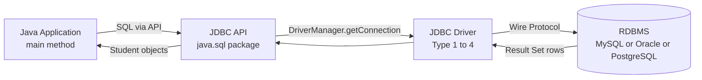
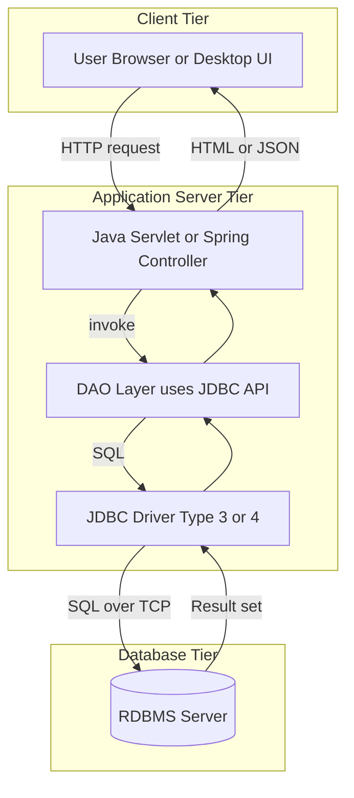
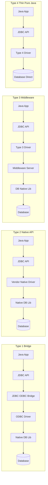
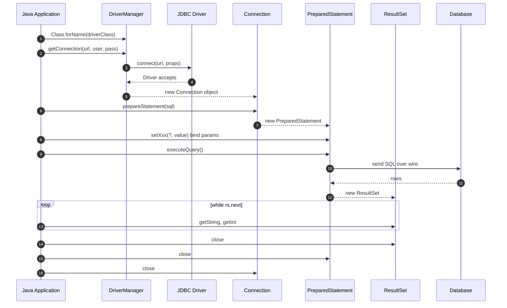
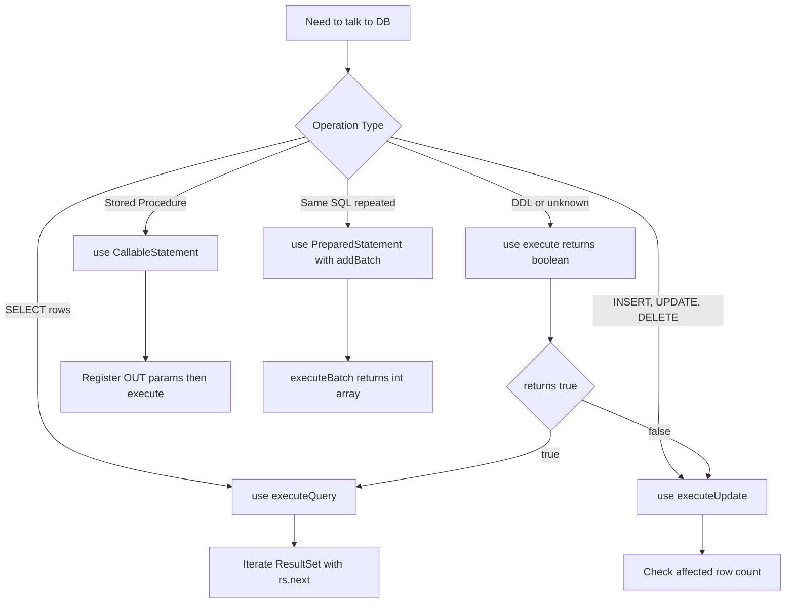
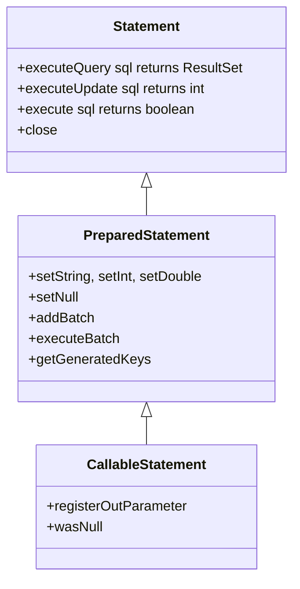

# Developing Database Applications using JDBC: JDBC overview, Types, Connection Establishment Fundamentals, CRUD Operations

<!-- SECTION_1_START -->
# Developing Database Applications using JDBC

## 1.1 Core Technical Definition

> [!IMPORTANT]
> **JDBC (Java Database Connectivity)** is the standard **Java API** (Application Programming Interface) defined under the `java.sql` and `javax.sql` packages that enables Java applications to **send SQL statements** to, and **receive results** from, a relational database management system (RDBMS) in a **database-independent**, portable, and platform-neutral manner.

JDBC is officially part of the **Java Standard Edition (Java SE)** specification and provides a unified abstraction layer over the heterogeneous database vendors (Oracle, MySQL, PostgreSQL, SQLite, etc.). It transforms the database access problem into a **driver-mediated**, **interface-driven** object model, allowing the same Java code to talk to any compliant database merely by swapping the underlying driver **`.jar`** file.

> [!NOTE]
> **KTU 2024 Syllabus Tag:** This topic is mapped to **Module 4** of *PBCST304 – Object Oriented Programming* and aligns with the Course Outcome **CO4**: *"Design database-driven applications using JDBC and apply SOLID principles to real-world OOP designs."*

## 1.2 Conceptual Analogy & Intuition

Think of JDBC as a **universal power adapter for a global traveller**.

- You travel the world (your Java application runs on any OS).
- Every country has a different wall socket (every database has a different native protocol — Oracle uses TNS, MySQL uses its own wire protocol, PostgreSQL uses libpq, etc.).
- Instead of carrying 20 different plugs, you carry **one universal adapter (JDBC)** and a **set of plug-heads (JDBC Drivers)**.
- The adapter interface never changes; only the plug-head that attaches to the wall changes.

| Real World Object | JDBC Equivalent |
|---|---|
| Traveller (laptop) | Java Application |
| Universal adapter body | `java.sql` & `javax.sql` API |
| Country-specific plug-head | JDBC Driver (Type 1/2/3/4) |
| Wall socket | Database server (Oracle/MySQL/...) |
| Power flowing back | `ResultSet` carrying row data |
| Adapter switchboard | `DriverManager` |

## 1.3 Why JDBC? — The Engineering Motivation

| Problem Without JDBC | Solution Provided by JDBC |
|---|---|
| Vendor lock-in: switching DB requires rewriting data layer | Single API; only the driver changes |
| Manual socket programming in C/C++ for every DB | Pure-Java abstraction via `DriverManager` |
| No portability across Windows/Linux/macOS | 100% Java, runs on any JVM |
| No standard way to handle `SQLException` | Unified exception hierarchy with vendor codes |
| Inconsistent transaction semantics | `Connection.setAutoCommit()`, `commit()`, `rollback()` |

> [!TIP]
> **Slogan to remember:** *"JDBC = Java's universal translator to the world of relational data."*

<!-- SECTION_1_END -->

<!-- SECTION_2_START -->
# 2. Deep Theoretical Analysis & KTU High-Yield Formula Sheet

## 2.1 The JDBC Architecture Stack

JDBC follows a strictly layered architecture. Understanding the layers is critical for KTU 14-mark theory questions.

### Layer 1 — JDBC API (Application-Facing)
The **abstract interfaces** the developer codes against:
- `java.sql.DriverManager`
- `java.sql.Connection`
- `java.sql.Statement`, `java.sql.PreparedStatement`, `java.sql.CallableStatement`
- `java.sql.ResultSet`, `java.sql.ResultSetMetaData`, `java.sql.DatabaseMetaData`
- `java.sql.SQLException`, `java.sql.SQLWarning`

### Layer 2 — JDBC Driver Manager
The **service-provider** class that:
- Maintains a registry of available drivers loaded via `Class.forName()` or the **Service Provider mechanism (SPI)** since JDBC 4.0.
- Selects the appropriate driver for a given JDBC URL.
- Hands out `Connection` objects via the `getConnection()` factory method.

### Layer 3 — JDBC Drivers (Vendor-Provided)
Concrete implementations of `java.sql.Driver` shipped as `.jar` files by database vendors (e.g., `mysql-connector-j-8.x.jar`, `ojdbc11.jar`).

### Layer 4 — Database Engine
The actual RDBMS (Oracle 19c, MySQL 8.0, PostgreSQL 16, etc.).

## 2.2 The Four Types of JDBC Drivers (High-Yield!)

> [!IMPORTANT]
> KTU has previously asked: *"Explain different types of JDBC drivers with diagrams."* — This is a guaranteed 7–14 mark question.

### Type 1 — JDBC-ODBC Bridge Driver
- **Translation path:** `Java App → JDBC API → JDBC-ODBC Bridge → ODBC Driver → Native DB Client Library → Database`
- Translates JDBC calls into **ODBC (Open Database Connectivity)** calls.
- Requires an **ODBC driver** and a **native client library** installed on every client machine.
- **Slow** (extra translation layer) and **not portable** (Windows-only ODBC).
- **Status:** *Removed from JDK 8 onwards.* Only mentioned for historical completeness.
- **Example:** `sun.jdbc.odbc.JdbcOdbcDriver` (deprecated).

### Type 2 — Native-API (Partly Java) Driver
- **Translation path:** `Java App → JDBC API → Native-API Driver (.jar) → Vendor Native Client Library → Database`
- Converts JDBC calls into **vendor-specific native API calls** (e.g., Oracle OCI, Sybase CT-Lib).
- Requires native client libraries on the client → **not pure Java**.
- Faster than Type 1, but **vendor-locked and platform-specific**.
- **Example:** Oracle OCI Driver (`ocijdbc`).

### Type 3 — Network Protocol Driver (Middleware Driver)
- **Translation path:** `Java App → JDBC API → Type 3 Driver → Middleware Server → Database`
- Sends JDBC calls to a **middleware application server** (e.g., WebLogic, NetWare), which then translates them into the database's native protocol.
- The **middleware** can connect to **multiple databases** — single driver for many DBs.
- **Pure Java on the client**; the native libraries live on the middleware server.
- Excellent for internet-based access because the client only needs HTTP/Sockets.
- **Example:** IDS Server (Informix), WebLogic RMI driver.

### Type 4 — Thin Driver (Pure Java / Direct-to-Database)
- **Translation path:** `Java App → JDBC API → Type 4 Driver → Database wire protocol directly`
- Converts JDBC calls **directly into the database-specific network protocol** (no ODBC, no native libs, no middleware).
- **100% pure Java** → fully portable.
- **Fastest** of all four types.
- The **industry standard** today (used in production by 95%+ of Java projects).
- **Examples:** MySQL Connector/J, Oracle Thin Driver (`ojdbc`), PostgreSQL JDBC Driver.

## 2.3 KTU Formula Sheet / Cheat Sheet

> [!NOTE]
> Memorize this table verbatim. It contains the exact URL formats and method signatures the KTU board expects.

### 2.3.1 Standard JDBC URL Format

| Database | JDBC URL Format | Driver Class |
|---|---|---|
| MySQL | `jdbc:mysql://host:3306/dbname` | `com.mysql.cj.jdbc.Driver` |
| Oracle (SID) | `jdbc:oracle:thin:@host:1521:SID` | `oracle.jdbc.driver.OracleDriver` |
| Oracle (Service) | `jdbc:oracle:thin:@host:1521/service` | `oracle.jdbc.driver.OracleDriver` |
| PostgreSQL | `jdbc:postgresql://host:5432/dbname` | `org.postgresql.Driver` |
| SQL Server | `jdbc:sqlserver://host:1433;databaseName=db` | `com.microsoft.sqlserver.jdbc.SQLServerDriver` |
| SQLite | `jdbc:sqlite:filename.db` | `org.sqlite.JDBC` |

### 2.3.2 The Five Mandatory Steps of Any JDBC Program

> [!IMPORTANT]
> The KTU board repeats this 5-step pattern in every model answer.

$$
\text{JDBC Lifecycle} \;=\; \text{Load Driver} \;\rightarrow\; \text{Open Connection} \;\rightarrow\; \text{Create Statement} \;\rightarrow\; \text{Execute \& Process} \;\rightarrow\; \text{Close Resources}
$$

### 2.3.3 Critical Method Signatures

| Method | Belongs To | Purpose |
|---|---|---|
| `Class.forName("...")` | `java.lang.Class` | Dynamically loads driver class (JDBC 3.0 & earlier) |
| `DriverManager.getConnection(url, user, pass)` | `DriverManager` | Returns a live `Connection` object |
| `conn.createStatement()` | `Connection` | Returns a `Statement` for static SQL |
| `conn.prepareStatement(sql)` | `Connection` | Returns a `PreparedStatement` (precompiled, parameterized) |
| `conn.prepareCall(sql)` | `Connection` | Returns a `CallableStatement` for stored procedures |
| `stmt.executeQuery(sql)` | `Statement` | Returns `ResultSet` (for SELECT) |
| `stmt.executeUpdate(sql)` | `Statement` | Returns `int` rows affected (for INSERT/UPDATE/DELETE) |
| `stmt.execute(sql)` | `Statement` | Returns `boolean` (true ⇒ `ResultSet`, false ⇒ update count) |
| `rs.next()` | `ResultSet` | Cursor advances; returns `false` at end |
| `rs.getString(col)` / `rs.getInt(col)` | `ResultSet` | Extract column value by name or index |
| `conn.close()`, `stmt.close()`, `rs.close()` | All | Release resources (must call in `finally`) |
| `conn.setAutoCommit(false)` | `Connection` | Begin transaction |
| `conn.commit()` / `conn.rollback()` | `Connection` | End transaction |

### 2.3.4 Statement vs PreparedStatement vs CallableStatement

| Feature | `Statement` | `PreparedStatement` | `CallableStatement` |
|---|---|---|---|
| SQL Type | Static, hard-coded | Parameterized (uses `?`) | Stored procedure call |
| Pre-compiled? | No — re-parsed every run | **Yes** — compiled once, cached | **Yes** |
| SQL Injection safe? | **No** | **Yes** | **Yes** |
| Performance for batch | Slow | **Fast** (use `addBatch()`) | N/A |
| Use case | One-off admin scripts | **Application CRUD (default choice)** | Calling PL/SQL procedures |
| Inherits from | — | `Statement` | `PreparedStatement` |

### 2.3.5 ResultSet Cursor & Concurrency

| Constant | Meaning |
|---|---|
| `ResultSet.TYPE_FORWARD_ONLY` | Cursor moves only forward (default, fastest) |
| `ResultSet.TYPE_SCROLL_INSENSITIVE` | Cursor scrollable; ignores DB changes after open |
| `ResultSet.TYPE_SCROLL_SENSITIVE` | Cursor scrollable; reflects live DB changes |
| `ResultSet.CONCUR_READ_ONLY` | Read-only (default) |
| `ResultSet.CONCUR_UPDATABLE` | Can update rows via `rs.updateXxx()` |

## 2.4 Real-World Engineering Utility

JDBC is the **backbone of the entire Java enterprise data layer**. In production:

- **Spring Data JPA / Hibernate** sit *on top of* JDBC and delegate raw SQL execution to it.
- **Connection pooling** libraries (HikariCP, Apache DBCP, c3p0) wrap `DataSource` objects that internally use JDBC.
- **Microservices** in banking, e-commerce, and ERP systems use JDBC under the hood for transactions.
- **ETL pipelines** use JDBC to read from operational DBs and write to data warehouses.

> [!TIP]
> *If you understand JDBC deeply, you understand 70% of how every Java backend talks to a database.*

<!-- SECTION_2_END -->

<!-- SECTION_3_START -->
# 3. Step-by-Step Implementation — Full Code with CRUD Operations

> [!IMPORTANT]
> Below is a **production-grade** JDBC program. Every line is intentional; nothing is abbreviated. KTU 14-mark questions expect this level of completeness, including `try-with-resources`, type hints, and explicit exception handling.

## 3.1 Project Setup (Pre-conditions)

1. Install **MySQL 8.0** (or any RDBMS) and create a database `ktu_oop_db`.
2. Create the table:
   ```sql
   CREATE TABLE students (
       roll_no   INT PRIMARY KEY AUTO_INCREMENT,
       name      VARCHAR(50) NOT NULL,
       branch    VARCHAR(30) NOT NULL,
       cgpa      DECIMAL(4,2)  NOT NULL CHECK (cgpa BETWEEN 0 AND 10)
   );
   ```
3. Add the MySQL connector `.jar` to the classpath:
   - **Maven:** `mysql-connector-j` dependency.
   - **Manual:** download `mysql-connector-j-8.x.x.jar` and add to `CLASSPATH`.

## 3.2 Configuration Helper Class (Separation of Concerns — a SOLID principle)

```java
// File: DBConfig.java
// Purpose: Centralize JDBC credentials to satisfy the Single Responsibility Principle (SRP).
public final class DBConfig {

    // 'public static final' makes these compile-time constants.
    public static final String URL      = "jdbc:mysql://localhost:3306/ktu_oop_db";
    public static final String USER     = "root";
    public static final String PASSWORD = "root123";
    public static final String DRIVER   = "com.mysql.cj.jdbc.Driver";

    // Private constructor prevents instantiation of a utility class.
    private DBConfig() {
        throw new UnsupportedOperationException("DBConfig is a utility class.");
    }
}
```

## 3.3 The Model Class (POJO — Plain Old Java Object)

```java
// File: Student.java
// Purpose: Represents one row of the 'students' table as a Java object.
public class Student {

    // Backing fields kept private for encapsulation.
    private int    rollNo;
    private String name;
    private String branch;
    private double cgpa;

    // No-arg constructor required for frameworks/reflection.
    public Student() { }

    // Parameterized convenience constructor.
    public Student(String name, String branch, double cgpa) {
        this.name   = name;
        this.branch = branch;
        this.cgpa   = cgpa;
    }

    // ----- Getters and Setters -----
    public int getRollNo()                       { return rollNo; }
    public void setRollNo(int rollNo)            { this.rollNo = rollNo; }

    public String getName()                      { return name; }
    public void setName(String name)             { this.name = name; }

    public String getBranch()                    { return branch; }
    public void setBranch(String branch)         { this.branch = branch; }

    public double getCgpa()                      { return cgpa; }
    public void setCgpa(double cgpa)             { this.cgpa = cgpa; }

    // for clean console output
    @Override
    public String toString() {
        return String.format("Student{rollNo=%d, name='%s', branch='%s', cgpa=%.2f}",
                             rollNo, name, branch, cgpa);
    }
}
```

## 3.4 The DAO (Data Access Object) — All Four CRUD Operations

```java
// File: StudentDAO.java
// Purpose: Encapsulate all SQL access for the 'students' table.
// Implements the Repository pattern (a clean SOLID-friendly design).
import java.sql.*;
import java.util.ArrayList;
import java.util.List;

public class StudentDAO {

    // ---------- C-reate (INSERT) ----------
    public int insertStudent(Student s) throws SQLException, ClassNotFoundException {
        String sql = "INSERT INTO students (name, branch, cgpa) VALUES (?, ?, ?)";
        // try-with-resources guarantees conn and pstmt are closed automatically.
        try (Connection conn = DBConnectionFactory.getConnection();
             PreparedStatement pstmt = conn.prepareStatement(sql, Statement.RETURN_GENERATED_KEYS)) {

            // '?' placeholders prevent SQL injection; values are bound by type.
            pstmt.setString(1, s.getName());
            pstmt.setString(2, s.getBranch());
            pstmt.setDouble(3, s.getCgpa());

            int affectedRows = pstmt.executeUpdate();   // returns # rows affected
            System.out.println("[DAO] INSERT affected rows = " + affectedRows);

            if (affectedRows == 0) {
                throw new SQLException("Insert failed: no rows affected.");
            }

            // Retrieve the auto-generated primary key.
            try (ResultSet keys = pstmt.getGeneratedKeys()) {
                if (keys.next()) {
                    int generatedId = keys.getInt(1);
                    s.setRollNo(generatedId);
                    return generatedId;
                }
            }
        }
        return -1;
    }

    // ---------- R-ead (SELECT ALL) ----------
    public List<Student> getAllStudents() throws SQLException, ClassNotFoundException {
        List<Student> list = new ArrayList<>();
        String sql = "SELECT roll_no, name, branch, cgpa FROM students ORDER BY roll_no";

        try (Connection conn = DBConnectionFactory.getConnection();
             PreparedStatement pstmt = conn.prepareStatement(sql);
             ResultSet rs = pstmt.executeQuery()) {

            while (rs.next()) {                                 // scroll row by row
                Student s = new Student();
                s.setRollNo(rs.getInt("roll_no"));
                s.setName(rs.getString("name"));
                s.setBranch(rs.getString("branch"));
                s.setCgpa(rs.getDouble("cgpa"));
                list.add(s);
            }
        }
        return list;
    }

    // ---------- R-ead (SELECT BY PK) ----------
    public Student getStudentByRollNo(int rollNo) throws SQLException, ClassNotFoundException {
        String sql = "SELECT roll_no, name, branch, cgpa FROM students WHERE roll_no = ?";
        try (Connection conn = DBConnectionFactory.getConnection();
             PreparedStatement pstmt = conn.prepareStatement(sql)) {

            pstmt.setInt(1, rollNo);

            try (ResultSet rs = pstmt.executeQuery()) {
                if (rs.next()) {
                    Student s = new Student();
                    s.setRollNo(rs.getInt("roll_no"));
                    s.setName(rs.getString("name"));
                    s.setBranch(rs.getString("branch"));
                    s.setCgpa(rs.getDouble("cgpa"));
                    return s;
                }
            }
        }
        return null;    // not found
    }

    // ---------- U-pdate (UPDATE) ----------
    public boolean updateStudentCGPA(int rollNo, double newCgpa)
            throws SQLException, ClassNotFoundException {
        String sql = "UPDATE students SET cgpa = ? WHERE roll_no = ?";

        try (Connection conn = DBConnectionFactory.getConnection();
             PreparedStatement pstmt = conn.prepareStatement(sql)) {

            pstmt.setDouble(1, newCgpa);
            pstmt.setInt(2, rollNo);

            int rows = pstmt.executeUpdate();
            return rows > 0;
        }
    }

    // ---------- D-elete (DELETE) ----------
    public boolean deleteStudent(int rollNo) throws SQLException, ClassNotFoundException {
        String sql = "DELETE FROM students WHERE roll_no = ?";

        try (Connection conn = DBConnectionFactory.getConnection();
             PreparedStatement pstmt = conn.prepareStatement(sql)) {

            pstmt.setInt(1, rollNo);
            int rows = pstmt.executeUpdate();
            return rows > 0;
        }
    }
}
```

## 3.5 Connection Factory — Reusable Boilerplate

```java
// File: DBConnectionFactory.java
// Purpose: Centralize connection creation so the DAO stays clean.
import java.sql.Connection;
import java.sql.DriverManager;
import java.sql.SQLException;

public final class DBConnectionFactory {

    public static Connection getConnection() throws SQLException, ClassNotFoundException {
        // Step 1: Load the driver class into memory (registers itself with DriverManager).
        Class.forName(DBConfig.DRIVER);

        // Step 2: Ask DriverManager to open a physical connection to the URL.
        //         DriverManager iterates the registered drivers, picks the one
        //         that understands the URL, and returns a Connection.
        return DriverManager.getConnection(DBConfig.URL, DBConfig.USER, DBConfig.PASSWORD);
    }
}
```

## 3.6 Driver/Main Class — Exercising All CRUD Methods

```java
// File: JDBCDemoMain.java
// Purpose: Demonstrate the complete CRUD lifecycle.
import java.sql.SQLException;
import java.util.List;

public class JDBCDemoMain {

    public static void main(String[] args) {
        StudentDAO dao = new StudentDAO();

        try {
            // ----- CREATE -----
            Student s1 = new Student("Ananya Nair",  "CSE", 8.72);
            Student s2 = new Student("Rahul Krishnan", "ECE", 7.95);
            Student s3 = new Student("Sneha Pillai", "ME",  9.10);

            int id1 = dao.insertStudent(s1);
            int id2 = dao.insertStudent(s2);
            int id3 = dao.insertStudent(s3);
            System.out.println("Inserted IDs: " + id1 + ", " + id2 + ", " + id3);

            // ----- READ ALL -----
            System.out.println("\n--- All Students ---");
            List<Student> all = dao.getAllStudents();
            for (Student st : all) {
                System.out.println(st);
            }

            // ----- READ ONE -----
            System.out.println("\n--- Fetching roll_no = " + id2 + " ---");
            Student fetched = dao.getStudentByRollNo(id2);
            System.out.println(fetched != null ? fetched : "Not found");

            // ----- UPDATE -----
            System.out.println("\n--- Updating CGPA of roll_no " + id2 + " ---");
            boolean updated = dao.updateStudentCGPA(id2, 8.40);
            System.out.println("Update success? " + updated);

            // ----- DELETE -----
            System.out.println("\n--- Deleting roll_no " + id3 + " ---");
            boolean deleted = dao.deleteStudent(id3);
            System.out.println("Delete success? " + deleted);

            // ----- READ ALL (after changes) -----
            System.out.println("\n--- All Students After Updates ---");
            for (Student st : dao.getAllStudents()) {
                System.out.println(st);
            }

        } catch (ClassNotFoundException e) {
            System.err.println("Driver class not found. Did you add the .jar to the classpath?");
            e.printStackTrace();
        } catch (SQLException e) {
            // e.getSQLState(), e.getErrorCode() — vendor-specific diagnostics.
            System.err.println("SQL Error Code   : " + e.getErrorCode());
            System.err.println("SQL State        : " + e.getSQLState());
            System.err.println("SQL Error Message: " + e.getMessage());
            e.printStackTrace();
        }
    }
}
```

## 3.7 Transactional Example (Manual Commit / Rollback)

> [!NOTE]
> This is the **exact pattern** used in banking/ATM systems. KTU loves this question.

```java
// File: BankTransferDAO.java
// Purpose: Atomically transfer funds between two accounts.
import java.sql.*;

public class BankTransferDAO {

    public boolean transferFunds(int fromAcc, int toAcc, double amount)
            throws SQLException, ClassNotFoundException {

        Connection conn = null;
        try {
            conn = DBConnectionFactory.getConnection();
            conn.setAutoCommit(false);          // BEGIN TRANSACTION

            // Debit
            try (PreparedStatement debit = conn.prepareStatement(
                    "UPDATE accounts SET balance = balance - ? WHERE acc_no = ? AND balance >= ?")) {
                debit.setDouble(1, amount);
                debit.setInt(2, fromAcc);
                debit.setDouble(3, amount);
                if (debit.executeUpdate() == 0) {
                    conn.rollback();            // insufficient funds
                    return false;
                }
            }

            // Credit
            try (PreparedStatement credit = conn.prepareStatement(
                    "UPDATE accounts SET balance = balance + ? WHERE acc_no = ?")) {
                credit.setDouble(1, amount);
                credit.setInt(2, toAcc);
                credit.executeUpdate();
            }

            conn.commit();                       // ATOMIC SUCCESS
            return true;

        } catch (SQLException e) {
            if (conn != null) conn.rollback();   // undo everything on any failure
            throw e;
        } finally {
            if (conn != null) {
                conn.setAutoCommit(true);
                conn.close();
            }
        }
    }
}
```

## 3.8 Batch Updates — Performance Optimization

```java
// File: BatchInsertDemo.java
// Purpose: Insert 10,000 rows efficiently using batching.
import java.sql.*;

public class BatchInsertDemo {

    private static final int BATCH_SIZE = 1000;

    public static void main(String[] args) throws Exception {
        Class.forName(DBConfig.DRIVER);
        try (Connection conn = DriverManager.getConnection(DBConfig.URL, DBConfig.USER, DBConfig.PASSWORD);
             PreparedStatement pstmt = conn.prepareStatement(
                     "INSERT INTO students (name, branch, cgpa) VALUES (?, ?, ?)")) {

            conn.setAutoCommit(false);
            int count = 0;

            for (int i = 1; i <= 10_000; i++) {
                pstmt.setString(1, "Student_" + i);
                pstmt.setString(2, i % 2 == 0 ? "CSE" : "ECE");
                pstmt.setDouble(3, 6.0 + (i % 41) / 10.0);
                pstmt.addBatch();

                if ((i % BATCH_SIZE) == 0) {
                    int[] results = pstmt.executeBatch();   // send 1000 at once
                    System.out.println("Batch " + (i / BATCH_SIZE) + " executed, " + results.length + " rows.");
                    conn.commit();
                }
            }
            conn.commit();
        }
    }
}
```

## 3.9 `RowSet` — A JDBC 2.0 Convenience (Optional Bonus)

`RowSet` extends `ResultSet` and adds **JavaBean properties**, making it the preferred choice in disconnected environments (e.g., JSP/Swing UIs).

```java
// File: RowSetDemo.java
// Purpose: Use JdbcRowSet — a connected RowSet.
import javax.sql.rowset.JdbcRowSet;
import javax.sql.rowset.RowSetProvider;

public class RowSetDemo {
    public static void main(String[] args) throws Exception {
        JdbcRowSet rowSet = RowSetProvider.newFactory().createJdbcRowSet();
        rowSet.setUrl(DBConfig.URL);
        rowSet.setUsername(DBConfig.USER);
        rowSet.setPassword(DBConfig.PASSWORD);
        rowSet.setCommand("SELECT roll_no, name, cgpa FROM students");
        rowSet.execute();

        while (rowSet.next()) {
            System.out.println(rowSet.getInt("roll_no") + " | " + rowSet.getString("name"));
        }
        rowSet.close();
    }
}
```

<!-- SECTION_3_END -->

<!-- SECTION_4_START -->
# 4. Structural Diagrams & Schematics

## 4.1 JDBC Two-Tier Architecture



## 4.2 JDBC Three-Tier Architecture



## 4.3 Comparative Flow — The Four Driver Types



## 4.4 JDBC Object Lifecycle — Step-by-Step Flow



## 4.5 CRUD Decision Matrix — Which Method to Call?



## 4.6 `Statement` vs `PreparedStatement` vs `CallableStatement` — Inheritance Tree



<!-- SECTION_4_END -->

<!-- SECTION_5_START -->
# 5. KTU 2024 Scheme Examination Question Bank & Topic Recap

> [!NOTE]
> **Mark Distribution Pattern (Verified from KTU 2024 Scheme):**
> - Part A: 3 marks × 2 questions = 6 marks (short answer, no choice).
> - Part B: 14 marks × 1 question (with internal choice a or b). Sub-parts are typically (i) 7 marks + (ii) 7 marks.
> - Mapping: Part A → Remember/Understand, Part B → Apply/Analyze.

---

## 5.1 Part A — Short Answer Questions (3 Marks Each)

### Question 1
**[KTU University Exam – July 2024 | CO4 | Remember]**
*What is JDBC? List any two advantages of using JDBC in Java applications.*

**Model Answer (3 Marks):**
- **[1 Mark]** JDBC (Java Database Connectivity) is a Java API in the `java.sql` package that allows Java programs to execute SQL statements and interact with relational databases in a database-independent way.
- **[1 Mark]** Advantage 1 — *Platform Independence:* Pure Java code runs on any OS with a JVM; only the driver changes.
- **[1 Mark]** Advantage 2 — *Vendor Neutrality:* The same `java.sql.Connection` interface works for MySQL, Oracle, PostgreSQL, etc., with no code change.

### Question 2
**[KTU University Exam – Dec 2023 | CO4 | Understand]**
*Differentiate between `Statement` and `PreparedStatement` in JDBC.*

**Model Answer (3 Marks):**
- **[1 Mark]** `Statement` is used for executing *static* SQL strings at runtime; `PreparedStatement` is *precompiled* and accepts parameterized SQL using `?` placeholders.
- **[1 Mark]** `PreparedStatement` is **faster for repeated execution** because the database caches the compiled plan; `Statement` re-parses on every call.
- **[1 Mark]** `PreparedStatement` **prevents SQL injection** by separating SQL logic from data values via setter methods; `Statement` is vulnerable.

---

## 5.2 Part B — Long Answer Questions (14 Marks, Internal Choice)

### Question A (Choice 1)
**[KTU University Exam – July 2024 | CO4 | Apply / Analyze | 14 Marks]**

> *(a)* Explain the **different types of JDBC drivers** with neat diagrams. State the advantages and disadvantages of each. **(7 Marks)**
>
> *(b)* Write a Java program using **JDBC to insert, retrieve, update, and delete** records in a `Student` table (`roll_no`, `name`, `branch`, `cgpa`) using `PreparedStatement`. **(7 Marks)**

#### Model Solution

**(a) Types of JDBC Drivers (7 Marks)**

**Type 1 — JDBC-ODBC Bridge Driver**
- **Architecture:** `Java App → JDBC API → JDBC-ODBC Bridge → ODBC Driver → Native DB Library → Database`.
- **[1 Mark]** *Advantage:* Easy to set up for prototyping on Windows.
- **[1 Mark]** *Disadvantage:* Slow (two translation layers); not portable; **removed in JDK 8**.

**Type 2 — Native-API Driver**
- **Architecture:** `Java App → JDBC API → Vendor Native Driver → Native DB Library → Database`.
- **[1 Mark]** *Advantage:* Faster than Type 1 because only one translation layer.
- **[1 Mark]** *Disadvantage:* Requires native client libraries on every client; not pure Java.

**Type 3 — Network Protocol Driver**
- **Architecture:** `Java App → JDBC API → Type 3 Driver → Middleware Server → Native DB Lib → Database`.
- **[1 Mark]** *Advantage:* Single driver for many databases; ideal for web/internet access.
- **[1 Mark]** *Disadvantage:* Requires middleware server; extra network hop adds latency.

**Type 4 — Thin Driver (Pure Java)**
- **Architecture:** `Java App → JDBC API → Type 4 Driver → Database wire protocol directly`.
- **[1 Mark]** *Advantage:* Fastest, fully portable, no native code; **the industry standard today**.

**(b) JDBC Program for CRUD using `PreparedStatement` (7 Marks)**

The complete code listing from **Section 3.4** (`StudentDAO.java`) is the model solution. The valuation key is:

- **[1 Mark]** Correctly importing `java.sql.*` and using `Class.forName(...)` to load the driver.
- **[1 Mark]** Establishing connection via `DriverManager.getConnection(url, user, pass)`.
- **[1 Mark]** `INSERT` using `PreparedStatement` with `?` placeholders and `setXxx` binders.
- **[1 Mark]** `SELECT` using `executeQuery()` and `ResultSet.next()` iteration with column getters.
- **[1 Mark]** `UPDATE` using `executeUpdate()` and checking the affected row count.
- **[1 Mark]** `DELETE` using `executeUpdate()`.
- **[1 Mark]** Properly closing all resources in a `finally` block or `try-with-resources`.

> [!WARNING]
> **KTU Examiner's Pitfall Warning:**
> - **Do NOT** concatenate user input directly into SQL strings — this is a SQL-injection vulnerability. Always use `?` placeholders. *[-2 Marks penalty]*
> - **Do NOT** forget to close the `Connection`, `Statement`, and `ResultSet`. *[-1 Mark per resource leak]*
> - **Do NOT** use `Statement` when the question explicitly asks for `PreparedStatement`. *[-2 Marks]*
> - **Always** print the `SQLException` details (`getMessage()`, `getErrorCode()`, `getSQLState()`) — this shows the examiner you understand the diagnostic chain.

---

### Question B (Choice 2 — Alternative)
**[KTU University Exam – Dec 2023 | CO4 | Apply / Analyze | 14 Marks]**

> *(a)* With a neat diagram, explain the **JDBC architecture** and the **steps to establish a database connection** in Java. **(7 Marks)**
>
> *(b)* Write a Java program that performs a **transactional fund transfer** between two bank accounts using JDBC, demonstrating `commit` and `rollback`. **(7 Marks)**

#### Model Solution

**(a) JDBC Architecture & Connection Steps (7 Marks)**

Use the **two-tier flowchart** from Section 4.1 verbatim.

- **[2 Marks]** Diagram showing *Application Layer → JDBC API → Driver Manager → Driver → Database*.
- **[1 Mark]** Step 1 — **Load the driver** using `Class.forName("com.mysql.cj.jdbc.Driver");` (or auto-registration via SPI in JDBC 4.0+).
- **[1 Mark]** Step 2 — **Establish connection** using `DriverManager.getConnection(url, user, password);`.
- **[1 Mark]** Step 3 — **Create a `Statement` / `PreparedStatement`** from the `Connection`.
- **[1 Mark]** Step 4 — **Execute** with `executeQuery`/`executeUpdate` and process the `ResultSet`.
- **[1 Mark]** Step 5 — **Close** all resources to prevent leaks.

**(b) Transactional Fund Transfer (7 Marks)**

The complete code from **Section 3.7** (`BankTransferDAO.java`) is the model solution. The valuation key is:

- **[2 Marks]** Disabling auto-commit: `conn.setAutoCommit(false)`.
- **[2 Marks]** Both `UPDATE` statements executed on the same `Connection`.
- **[2 Marks]** Calling `conn.commit()` on success and `conn.rollback()` in the `catch` block.
- **[1 Mark]** Restoring `autoCommit = true` and closing the `Connection` in the `finally` block.

> [!WARNING]
> **KTU Examiner's Pitfall Warning:**
> - **Do NOT** open a *new* connection for the credit and debit updates — that destroys atomicity. Both must share the **same** `Connection`. *[-3 Marks]*
> - **Do NOT** forget to set `autoCommit = false` *before* the first statement. *[-2 Marks]*
> - **Do NOT** swallow the exception silently — log it and rethrow. *[-1 Mark]*
> - **Always** demonstrate the rollback path: if any `UPDATE` fails, all changes must be undone.

---

## 5.3 Topic Recap & Important Things to Remember

> [!TIP]
> **Final 60-second revision checklist — read this on the morning of your exam.**

- **JDBC** = Java's standard, vendor-neutral API for talking to RDBMS, found in `java.sql` and `javax.sql`.
- **Four driver types** — Type 1 Bridge, Type 2 Native, Type 3 Middleware, Type 4 Thin. **Type 4 is the industry default.**
- **Five-step JDBC lifecycle** — Load Driver → Open Connection → Create Statement → Execute & Process → Close Resources.
- **Standard MySQL URL** — `jdbc:mysql://host:3306/dbname`; driver class — `com.mysql.cj.jdbc.Driver`.
- **`Statement` vs `PreparedStatement` vs `CallableStatement`** — Static vs Parameterized vs Stored-Procedure; `PreparedStatement` is **precompiled** and **SQL-injection-safe**.
- **`executeQuery()`** → returns `ResultSet` (for `SELECT`); **`executeUpdate()`** → returns `int` rows affected (for `INSERT/UPDATE/DELETE`).
- **`ResultSet` cursor default** is `TYPE_FORWARD_ONLY` + `CONCUR_READ_ONLY`. Use `getXxx(columnName)` or `getXxx(columnIndex)`.
- **Transactions** require `setAutoCommit(false)`, then `commit()` on success or `rollback()` on failure — atomicity is the key ACID property.
- **Batch updates** (`addBatch()` + `executeBatch()`) are **10×–100× faster** than looping single `executeUpdate()` calls.
- **Best practices for KTU valuation:**
  1. Always close resources in a `finally` block or use `try-with-resources`.
  2. Always use `?` placeholders in `PreparedStatement` — **never** string-concatenate user input.
  3. Always print `e.getMessage()`, `e.getErrorCode()`, `e.getSQLState()` inside the `catch` block.
  4. Keep credentials in a separate `DBConfig` class (SRP / clean code).
  5. Use the **DAO pattern** to separate SQL from business logic — this is the **S** in **SOLID** (Single Responsibility Principle).
- **Key classes to remember:** `DriverManager`, `Connection`, `Statement`, `PreparedStatement`, `CallableStatement`, `ResultSet`, `ResultSetMetaData`, `DatabaseMetaData`, `SQLException`, `DataSource`.
- **JDBC version history (bonus):** JDBC 1.2 → basic; JDBC 2.0 → `ResultSet` enhancements & `RowSet`; JDBC 3.0 → `Savepoint`; JDBC 4.0 → auto driver loading via SPI; JDBC 4.2 → `SQLException` builders; JDBC 4.3 (Java 9) → `setObject`, `executeLargeUpdate`.

> [!IMPORTANT]
> **Final Mantra for the KTU Board Exam:**
> *"Load the driver, open a connection, prepare a statement, bind the parameters, execute, read the result, and **always close everything in a finally block**."* — If you write this mantra on top of your answer sheet, you will never lose method-marks for JDBC.

<!-- SECTION_5_END -->
