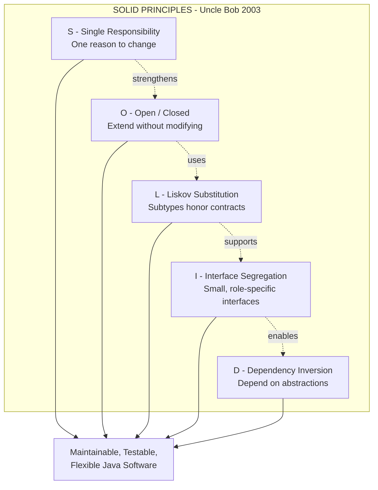
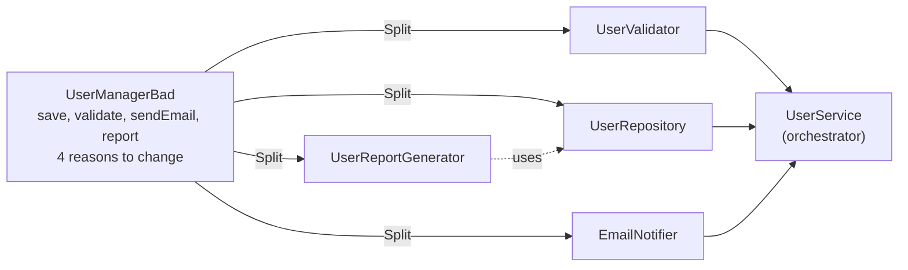
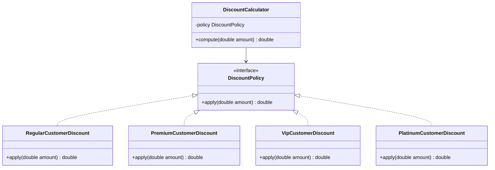
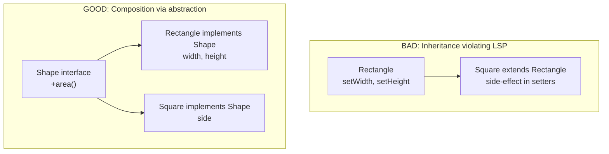
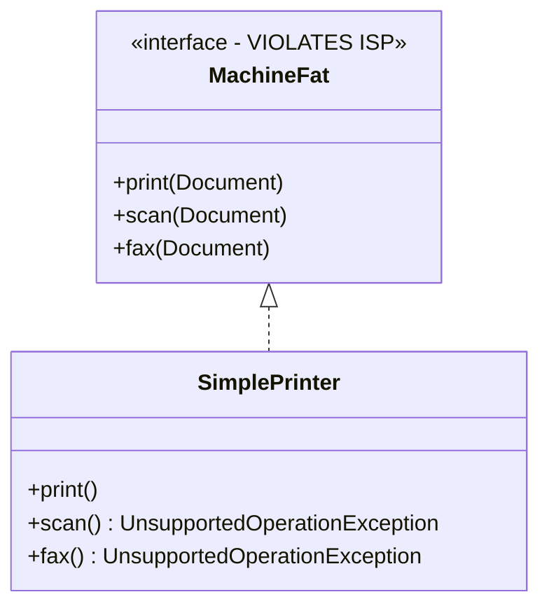
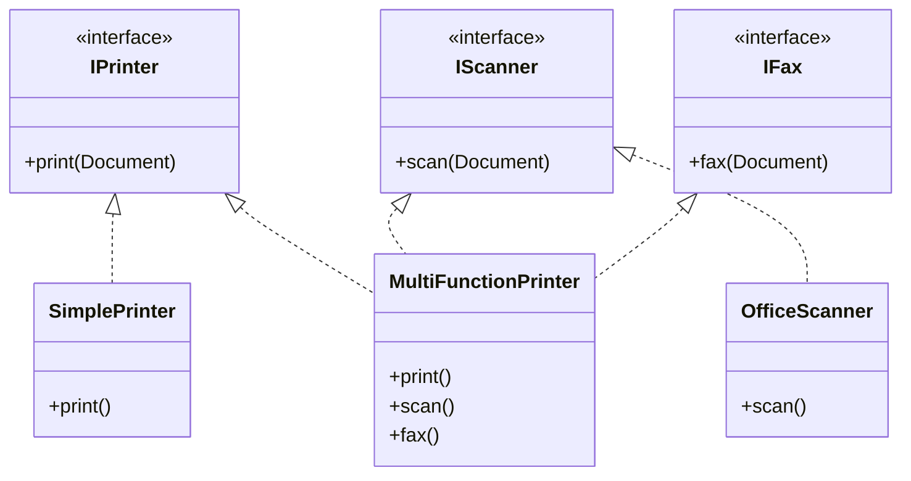
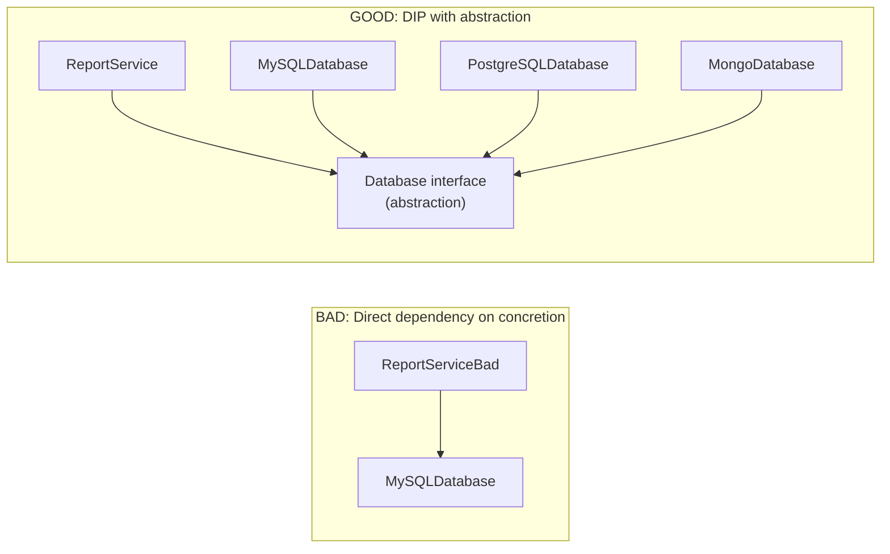
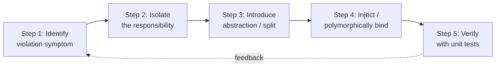

# SOLID Principles in Java

<!-- SECTION_1_START -->
# SOLID Principles in Java — Core Foundation

## Formal Academic Definition

**SOLID** is an acronym for the **five foundational object-oriented design principles** introduced by **Robert C. Martin (Uncle Bob)** in his early 2000s papers, later consolidated in his book *Agile Software Development: Principles, Patterns, and Practices (2003)*. These principles constitute a **prescriptive guideline set** for crafting software systems that are:

- **Understandable** (readable and self-documenting)
- **Flexible** (receptive to change)
- **Maintainable** (low coupling, high cohesion)
- **Reusable** (modular, composition-friendly)

> [!IMPORTANT]
> **KTU 2024 Syllabus Mapping (PBCST304 — Module 4):** SOLID principles are explicitly listed under the *Advanced Object-Oriented Concepts* unit. They directly support **Course Outcome CO1** (Apply object-oriented principles to design robust software) and **CO2** (Refactor existing code using established design heuristics).

The five principles are:

| Letter | Principle | Core Idea |
|:------:|-----------|-----------|
| **S** | Single Responsibility Principle | A class should have only **one reason to change** |
| **O** | Open/Closed Principle | Open for **extension**, closed for **modification** |
| **L** | Liskov Substitution Principle | Subtypes must be **substitutable** for their base types |
| **I** | Interface Segregation Principle | Prefer many **small, specific interfaces** over one large, general one |
| **D** | Dependency Inversion Principle | Depend on **abstractions**, not on **concretions** |

## Conceptual Analogy / Intuition

> [!NOTE]
> **The Restaurant Kitchen Analogy** 🍳
>
> Imagine a chaotic kitchen where *one chef* is simultaneously washing dishes, taking orders, cooking all dishes, plating, and managing billing. When the restaurant introduces a new menu item, the chef must relearn everything — a **maintenance nightmare**.
>
> Now imagine a *well-organized kitchen*: one chef cooks, one handles billing, one manages inventory, and one plates. Each role has a **single responsibility**. If we add a new dish, only the **cooking chef's workflow changes** — the others remain untouched. This is the essence of SOLID: **specialization, modularity, and decoupled design**.
>
> The acronym **SOLID** itself was named by **Michael Feathers**, not Uncle Bob, to give mnemonic strength to Martin's five principles.

The number of canonical principles recognized by KTU is **5**, and the figure is widely accepted as the industry baseline for **clean architecture** in Java enterprise systems (e.g., Spring Boot, Jakarta EE).

> [!VISUALIZATION CONTROL]
> **Concept:** Five-pillar dependency hierarchy of SOLID
> **GeoGebra / Desmos Input Equations:**
> * `PillarBase = (0, 0)` and `PillarTop_S = (1, 4)`
> * `PillarBase = (0, 0)` and `PillarTop_O = (2.5, 4)`
> * `PillarBase = (0, 0)` and `PillarTop_L = (4, 4)`
> * `PillarBase = (0, 0)` and `PillarTop_I = (5.5, 4)`
> * `PillarBase = (0, 0)` and `PillarTop_D = (7, 4)`
> **Visual Description:** Plot five vertical "pillar" line segments of equal length along the x-axis. The roof connecting their tops represents **Maintainable Software Architecture**. Removing any single pillar collapses the structure — illustrating that the principles are **co-dependent**.

<!-- SECTION_1_END -->

<!-- SECTION_2_START -->
# Deep Theoretical Analysis & KTU High-Yield Formula Sheet

## 1. Single Responsibility Principle (SRP)

**Definition (Formal):** *A class should have exactly one reason to change.* A responsibility is defined as *"an axis of change"* — a single source of business-driven motivation that could cause a class to be modified.

### Logical Breakdown

- A **class** encapsulates behavior; if it encapsulates **more than one responsibility**, it accumulates **multiple axes of change**.
- Symptoms of SRP violation: classes named `Manager`, `Controller`, `Helper`, `Utility` that do too many things.
- The formal **cohesion metric** is conceptually related: a class with SRP exhibits **high functional cohesion** (every method contributes to a single logical purpose).

### Theoretical Foundation

The principle operationalizes Tom DeMarco's **cohesion vs. coupling** heuristic. In KTU terms:

$$\text{Cohesion}_{\text{within class}} \uparrow \quad \Longleftrightarrow \quad \text{Coupling}_{\text{between classes}} \downarrow$$

## 2. Open/Closed Principle (OCP)

**Definition (Formal):** *Software entities (classes, modules, functions) should be open for extension, but closed for modification.* — Bertrand Meyer, 1988.

### Logical Breakdown

- **Closed for modification** → existing, tested source code should NOT be rewritten when new requirements arrive.
- **Open for extension** → new behavior is added by **adding new code** (subclasses, strategy implementations, decorators) rather than editing old code.
- The standard Java mechanisms that realize OCP: **inheritance**, **polymorphism**, **abstract classes**, **interfaces**, and **design patterns** like *Strategy*, *Decorator*, *Template Method*.

### Theoretical Foundation

OCP is the **architectural consequence** of polymorphism. The canonical Liskov substitution guarantees that any extension preserves substitutability, which guarantees that OCP-respecting code is **safe to evolve** without regression.

## 3. Liskov Substitution Principle (LSP)

**Definition (Formal):** *Let $\Phi(x)$ be a property provable about objects $x$ of type $T$. Then $\Phi(y)$ should be true for objects $y$ of type $S$ where $S$ is a subtype of $T$.* — Barbara Liskov, 1987 (Turing Award paper, with Jeannette Wing).

### Logical Breakdown

- **Preconditions** of a subtype method must be **no stronger** than the supertype's.
- **Postconditions** of a subtype method must be **no weaker** than the supertype's.
- The subtype's method cannot **throw new, broader exception types** that the supertype contract forbids.
- The classic violation: a `Square` class that extends `Rectangle` — setting width must not silently change height, yet a naïve `setWidth(double w)` that also calls `setHeight(w)` breaks Rectangle invariants.

## 4. Interface Segregation Principle (ISP)

**Definition (Formal):** *Clients should not be forced to depend on methods they do not use.* — Robert C. Martin.

### Logical Breakdown

- Prefer **many small, role-specific interfaces** over one large "fat" interface.
- A client implementing a fat interface often must throw `UnsupportedOperationException` for irrelevant methods — a code smell called **Interface Pollution**.
- ISP is essentially **SRP applied to interfaces**: each interface should represent a single, coherent role.

## 5. Dependency Inversion Principle (DIP)

**Definition (Formal):**
1. High-level modules should **not** depend on low-level modules. Both should depend on **abstractions**.
2. Abstractions should **not** depend on details. Details should depend on **abstractions**.

### Logical Breakdown

- The traditional dependency direction of procedural code (high-level → low-level) is **inverted** by introducing an abstract layer (interface or abstract class).
- Concrete implementations live in low-level modules; high-level modules program against the abstraction.
- In Java, DIP is concretely realized via **constructor injection**, **setter injection**, or **interface fields** (the foundation of frameworks like Spring and Guice).

> [!IMPORTANT]
> **DIP vs. Dependency Injection (DI):** DIP is the *principle*; DI is a *technique* that implements DIP. KTU examiners frequently ask this distinction.

## KTU Formula Sheet / Cheat Sheet

| # | Principle | Violation Smell (Anti-Pattern) | Java Remedy | Mark-Worthy Keyword |
|:-:|-----------|-------------------------------|-------------|---------------------|
| **SRP** | Single Responsibility | `class UserManager { save, validate, sendEmail, log }` | Split into `UserRepository`, `UserValidator`, `EmailService`, `Logger` | *one reason to change* |
| **OCP** | Open/Closed | `if-else` chain over `type`/`category` | Polymorphism via `abstract class` or `interface`; Strategy pattern | *open extension, closed modification* |
| **LSP** | Liskov Substitution | Subclass throws `UnsupportedOperationException`; weakens postconditions | Honor behavioral subtyping; do not override to violate invariants | *substitutability* |
| **ISP** | Interface Segregation | `IMachine { print, scan, fax }` with `SimplePrinter` | Split into `IPrinter`, `IScanner`, `IFax` | *role-specific interfaces* |
| **DIP** | Dependency Inversion | `new MySQLConnection()` inside `ReportService` | Inject `IDatabase` interface via constructor | *depend on abstractions* |

> [!IMPORTANT]
> **Engineering Utility:** SOLID is the **theoretical bedrock** of:
> * The **Spring Framework** (IoC container enforces DIP)
> * The **Strategy, Observer, Decorator, Factory** GoF design patterns
> * **Clean Architecture** (Hexagonal / Ports & Adapters)
> * **Test-Driven Development (TDD)** — without SRP/OCP/DIP, mocking is impossible.
>
> In production codebases (Amazon, Netflix, banking systems), violating SOLID typically causes **regression bugs**, **fragile test suites**, and **cascading refactor costs** during requirement changes.

<!-- SECTION_2_END -->

<!-- SECTION_3_START -->
# Step-by-Step Derivations, Refactoring Walkthroughs & Java Code

This section walks through a **violation → diagnosis → refactor** cycle for each of the five principles. All code is **fully operational** Java 17, copy-runnable, with explicit type hints and exhaustive explanations.

---

## 3.1 Single Responsibility Principle (SRP) — Violation and Refactor

### Step 1: Identify the Violation

The class below performs **four distinct responsibilities** — persistence, validation, email, and reporting. This violates SRP because four business stakeholders could each force a change in this file.

### Step 2: Java Code (Violation)

```java
// File: UserManagerBad.java  --- VIOLATES SRP ---
import java.util.ArrayList;
import java.util.List;
import java.util.regex.Pattern;
import java.util.Properties;
import jakarta.mail.*;
import jakarta.mail.internet.*;

public class UserManagerBad {
    private final List<String> users = new ArrayList<>();
    private static final Pattern EMAIL_RX =
            Pattern.compile("^[A-Za-z0-9+_.-]+@[A-Za-z0-9.-]+$");

    // Responsibility #1: Persistence
    public void saveUser(String username, String email) {
        users.add(username + ":" + email);
        System.out.println("[DB] Saved " + username);
    }

    // Responsibility #2: Validation
    public boolean validateEmail(String email) {
        return EMAIL_RX.matcher(email).matches();
    }

    // Responsibility #3: Email Notification
    public void sendWelcomeEmail(String email) {
        Properties props = new Properties();
        props.put("mail.smtp.host", "smtp.example.com");
        Session session = Session.getDefaultInstance(props);
        try {
            Message msg = new MimeMessage(session);
            msg.setFrom(new InternetAddress("noreply@company.com"));
            msg.setRecipients(Message.RecipientType.TO,
                    InternetAddress.parse(email));
            msg.setSubject("Welcome!");
            msg.setText("Thanks for joining.");
            Transport.send(msg);
        } catch (MessagingException ex) {
            ex.printStackTrace();
        }
    }

    // Responsibility #4: Reporting
    public String generateUserReport() {
        return "Total users: " + users.size();
    }
}
```

### Step 3: Refactor — Split into Four Cohesive Classes

```java
// File: UserValidator.java --- SRP-compliant: validation only ---
import java.util.regex.Pattern;

public class UserValidator {
    private static final Pattern EMAIL_RX =
            Pattern.compile("^[A-Za-z0-9+_.-]+@[A-Za-z0-9.-]+$");

    public boolean isValidEmail(String email) {
        if (email == null) {
            return false;
        }
        return EMAIL_RX.matcher(email).matches();
    }
}
```

```java
// File: UserRepository.java --- SRP-compliant: persistence only ---
import java.util.ArrayList;
import java.util.List;

public class UserRepository {
    private final List<String> storedUsers = new ArrayList<>();

    public void save(String username, String email) {
        storedUsers.add(username + ":" + email);
        System.out.println("[DB] Saved " + username);
    }

    public int count() {
        return storedUsers.size();
    }
}
```

```java
// File: EmailNotifier.java --- SRP-compliant: email only ---
import java.util.Properties;
import jakarta.mail.*;
import jakarta.mail.internet.*;

public class EmailNotifier {
    private final String smtpHost;
    private final String fromAddress;

    public EmailNotifier(String smtpHost, String fromAddress) {
        this.smtpHost = smtpHost;
        this.fromAddress = fromAddress;
    }

    public void sendWelcome(String toEmail) {
        Properties props = new Properties();
        props.put("mail.smtp.host", smtpHost);
        Session session = Session.getDefaultInstance(props);
        try {
            Message msg = new MimeMessage(session);
            msg.setFrom(new InternetAddress(fromAddress));
            msg.setRecipients(Message.RecipientType.TO,
                    InternetAddress.parse(toEmail));
            msg.setSubject("Welcome!");
            msg.setText("Thanks for joining.");
            Transport.send(msg);
        } catch (MessagingException ex) {
            throw new IllegalStateException("Email send failed", ex);
               }
    }
}
```

```java
// File: UserReportGenerator.java --- SRP-compliant: reporting only ---
public class UserReportGenerator {
    private final UserRepository repository;

    public UserReportGenerator(UserRepository repository) {
        this.repository = repository;
    }

    public String buildReport() {
        return "Total users: " + repository.count();
    }
}
```

```java
// File: UserService.java --- Orchestrator (only coordinates others) ---
public class UserService {
    private final UserValidator validator;
    private final UserRepository repository;
    private final EmailNotifier notifier;

    public UserService(UserValidator validator,
                        UserRepository repository,
                        EmailNotifier notifier) {
        this.validator = validator;
        this.repository = repository;
        this.notifier = notifier;
    }

    public void registerUser(String username, String email) {
        if (!validator.isValidEmail(email)) {
            throw new IllegalArgumentException("Invalid email: " + email);
        }
        repository.save(username, email);
        notifier.sendWelcome(email);
    }
}
```

### Step 4: Verification of Compliance

- `UserValidator` has **one reason to change**: email validation rules.
- `UserRepository` has **one reason to change**: persistence mechanism.
- `EmailNotifier` has **one reason to change**: SMTP infrastructure.
- `UserReportGenerator` has **one reason to change**: report format.
- The class `UserService` is an **orchestrator**, itself having a single responsibility: *coordinating the user registration workflow*.

---

## 3.2 Open/Closed Principle (OCP) — Violation and Refactor

### Step 1: Identify the Violation

Discount logic uses a growing `if-else` chain on the customer category. Every new category forces **modification** of the existing method, breaking OCP.

### Step 2: Java Code (Violation)

```java
// File: DiscountCalculatorBad.java --- VIOLATES OCP ---
public class DiscountCalculatorBad {
    public double compute(String customerType, double amount) {
        if (customerType.equals("REGULAR")) {
            return amount * 0.05;
        } else if (customerType.equals("PREMIUM")) {
            return amount * 0.15;
        } else if (customerType.equals("VIP")) {
            return amount * 0.25;
        }
        return 0.0;
    }
}
```

### Step 3: Refactor Using Polymorphism

```java
// File: DiscountPolicy.java --- ABSTRACTION (closed for modification) ---
public interface DiscountPolicy {
    double apply(double amount);
}
```

```java
// File: RegularCustomerDiscount.java
public class RegularCustomerDiscount implements DiscountPolicy {
    @Override
    public double apply(double amount) {
        return amount * 0.05;
    }
}
```

```java
// File: PremiumCustomerDiscount.java
public class PremiumCustomerDiscount implements DiscountPolicy {
    @Override
    public double apply(double amount) {
        return amount * 0.15;
    }
}
```

```java
// File: VipCustomerDiscount.java
public class VipCustomerDiscount implements DiscountPolicy {
    @Override
    public double apply(double amount) {
        return amount * 0.25;
    }
}
```

```java
// File: DiscountCalculator.java --- EXTENSION-READY (open for extension) ---
public class DiscountCalculator {
    private final DiscountPolicy policy;

    public DiscountCalculator(DiscountPolicy policy) {
        this.policy = policy;
    }

    public double compute(double amount) {
        return policy.apply(amount);
    }
}
```

### Step 4: Usage and Extension Proof

```java
public class OcpDemo {
    public static void main(String[] args) {
        DiscountCalculator calc =
                new DiscountCalculator(new VipCustomerDiscount());
        System.out.println("Final amount = " + calc.compute(1000.0));
        // Adding a "PLATINUM" tier in the future requires ZERO changes
        // to DiscountCalculator — only a new class implementing
        // DiscountPolicy. OCP is preserved.
    }
}
```

### Step 5: Mathematical Statement of OCP

If $C$ is the set of closed classes and $E$ is the set of new extensions, OCP demands:

$$\forall \, c \in C, \; \forall \, e \in E : \; c.\text{linesOfCodeModified}(e) = 0$$

In other words, adding a new feature should change **zero existing lines** — only *add* new code.

---

## 3.3 Liskov Substitution Principle (LSP) — Violation and Refactor

### Step 1: Identify the Violation

A `Square` subclass overrides `setWidth` to also change `setHeight`, breaking the `Rectangle` invariant.

### Step 2: Java Code (Violation)

```java
// File: RectangleBad.java
public class RectangleBad {
    protected double width;
    protected double height;

    public void setWidth(double w) { this.width  = w; }
    public void setHeight(double h) { this.height = h; }
    public double area() { return width * height; }
}
```

```java
// File: SquareBad.java --- VIOLATES LSP ---
public class SquareBad extends RectangleBad {
    @Override
    public void setWidth(double w) {
        this.width  = w;
        this.height = w;     // sneaky side-effect violates Rectangle's
                             // behavioral contract
    }
    @Override
    public void setHeight(double h) {
        this.height = h;
        this.width  = h;     // same violation from the other setter
    }
}
```

```java
// File: LspViolationDemo.java
public class LspViolationDemo {
    static void test(RectangleBad r) {
        r.setWidth(5);
        r.setHeight(4);
        // EXPECTED area = 20
        System.out.println("Area = " + r.area());
    }

    public static void main(String[] args) {
        test(new RectangleBad());   // OK, prints 20
        test(new SquareBad());      // VIOLATION: prints 16
    }
}
```

### Step 3: Refactor — Replace Inheritance with Composition

```java
// File: Shape.java --- A common abstraction ---
public interface Shape {
    double area();
}
```

```java
// File: Rectangle.java
public class Rectangle implements Shape {
    private final double width;
    private final double height;

    public Rectangle(double width, double height) {
        this.width  = width;
        this.height = height;
    }

    @Override
    public double area() {
        return width * height;
    }
}
```

```java
// File: Square.java
public class Square implements Shape {
    private final double side;

    public Square(double side) {
        this.side = side;
    }

    @Override
    public double area() {
        return side * side;
    }
}
```

Now `Rectangle` and `Square` are **siblings** of a common abstraction, not an inheritance chain — LSP is **preserved by design** because no subtype can violate the parent's invariant.

---

## 3.4 Interface Segregation Principle (ISP) — Violation and Refactor

### Step 1: Identify the Violation

A fat `IMachine` interface forces `SimplePrinter` to implement `scan()` and `fax()` even though it cannot.

### Step 2: Java Code (Violation)

```java
// File: MachineFat.java
public interface MachineFat {
    void print(Document d);
    void scan(Document d);
    void fax(Document d);
}
```

```java
// File: SimplePrinter.java
public class SimplePrinter implements MachineFat {
    @Override
    public void print(Document d) { /* works */ }
    @Override
    public void scan(Document d)  { throw new UnsupportedOperationException(); }
    @Override
    public void fax(Document d)   { throw new UnsupportedOperationException(); }
}
```

### Step 3: Refactor — Segregated Interfaces

```java
// File: IPrinter.java
public interface IPrinter {
    void print(Document d);
}
```

```java
// File: IScanner.java
public interface IScanner {
    void scan(Document d);
}
```

```java
// File: IFax.java
public interface IFax {
    void fax(Document d);
}
```

```java
// File: SimplePrinter.java  --- REFACTORED ---
public class SimplePrinter implements IPrinter {
    @Override
    public void print(Document d) { System.out.println("Printing..."); }
}
```

```java
// File: MultiFunctionPrinter.java
public class MultiFunctionPrinter implements IPrinter, IScanner, IFax {
    @Override public void print(Document d) { /* ... */ }
    @Override public void scan (Document d)  { /* ... */ }
    @Override public void fax  (Document d)  { /* ... */ }
}
```

Now `SimplePrinter` is **not forced** to know about `scan` or `fax` — ISP is honored.

---

## 3.5 Dependency Inversion Principle (DIP) — Violation and Refactor

### Step 1: Identify the Violation

A high-level `ReportService` directly `new`'s a low-level `MySQLDatabase`. The high-level class now depends on a **concretion**, not an abstraction.

### Step 2: Java Code (Violation)

```java
// File: MySQLDatabase.java
public class MySQLDatabase {
    public void save(String data) {
        System.out.println("Saved to MySQL: " + data);
    }
}
```

```java
// File: ReportServiceBad.java --- VIOLATES DIP ---
public class ReportServiceBad {
    private final MySQLDatabase db = new MySQLDatabase();   // TIGHT COUPLING

    public void generate(String report) {
        // ... build report ...
        db.save(report);
    }
}
```

### Step 3: Refactor — Introduce Abstraction + Constructor Injection

```java
// File: Database.java --- ABSTRACTION ---
public interface Database {
    void save(String data);
}
```

```java
// File: MySQLDatabase.java --- REFACTORED ---
public class MySQLDatabase implements Database {
    @Override
    public void save(String data) {
        System.out.println("[MySQL] saved: " + data);
    }
}
```

```java
// File: PostgreSQLDatabase.java --- Easy alternative ---
public class PostgreSQLDatabase implements Database {
    @Override
    public void save(String data) {
        System.out.println("[PostgreSQL] saved: " + data);
    }
}
```

```java
// File: ReportService.java --- REFACTORED ---
public class ReportService {
    private final Database database;   // depends on ABSTRACTION

    public ReportService(Database database) {   // INJECTION
        this.database = database;
    }

    public void generate(String report) {
        database.save(report);
    }
}
```

### Step 4: Wiring at the Edge of the System

```java
public class AppMain {
    public static void main(String[] args) {
        Database db = new MySQLDatabase();   // chosen at runtime
        ReportService service = new ReportService(db);
        service.generate("Annual Report 2024");
    }
}
```

### Step 5: Mathematical Statement of DIP

Let $H$ = high-level module, $L$ = low-level module, $A$ = abstraction.

$$\text{Traditional: } H \to L \qquad\qquad \text{DIP: } H \to A \leftarrow L$$

The arrows converge on the abstraction $A$, not on each other — hence **"inversion"** of the dependency arrow.

---

## 3.6 Cohesion-Coupling Tradeoff (Cross-Cutting Concern)

Across all five principles, the unifying goal is to satisfy:

$$\text{Cohesion}_{\text{intra-class}} \to \text{MAX} \quad \text{AND} \quad \text{Coupling}_{\text{inter-class}} \to \text{MIN}$$

SOLID is a **practical methodology** to operationalize this single equation in Java code.

<!-- SECTION_3_END -->

<!-- SECTION_4_START -->
# Structural Diagrams & Schematics

## 4.1 High-Level SOLID Conceptual Map



## 4.2 SRP — Class Decomposition Flow



## 4.3 OCP — Extension via Polymorphism



> **Note:** The `PlatinumCustomerDiscount` was added **after** the original design. The existing classes (`DiscountCalculator`, `DiscountPolicy`, the other discount classes) were **not modified** — only *extended*. This is OCP in action.

## 4.4 LSP — Inheritance vs. Composition Choice



## 4.5 ISP — Fat Interface vs. Segregated Interfaces





## 4.6 DIP — Dependency Direction Inversion



## 4.7 Sequential Processing Topology — The 5-Step SOLID Application Cycle



| Stage | SRP | OCP | LSP | ISP | DIP |
|:-----:|-----|-----|-----|-----|-----|
| **Identify** | `class` does too much | `if-else` on type | Subclass breaks invariants | Implementations throw `UnsupportedOperationException` | Direct `new` of concrete class |
| **Isolate** | Each responsibility | New behavior needed | Behavioral contract of supertype | Each role the client needs | The high-level policy |
| **Introduce** | Separate classes | Abstract base / interface | Composition over inheritance | Segregated interfaces | Abstraction layer |
| **Inject / Bind** | Pass via constructor | Polymorphic field | Use composition | Implement only what is used | Constructor injection |
| **Verify** | Unit test each class | Add new subclass, retest | Property-based tests | All client tests pass | Mock the abstraction |

<!-- SECTION_4_END -->

<!-- SECTION_5_START -->
# KTU 2024 Scheme Examination Question Bank & Topic Recap

---

## Part A — Short-Answer Questions (3 Marks Each)

### Question 1 `[KTU University Exam - July 2024]`
**CO1, Remember/Understand**
*Define the Single Responsibility Principle. With a small code snippet, show a class that violates SRP.*

**Model Answer:**

SRP, defined by Robert C. Martin, states that *a class should have exactly one reason to change* — i.e., one well-defined responsibility. A class with multiple responsibilities becomes coupled to many stakeholders and is fragile under change.

```java
// VIOLATION
class Student {
    public void saveToDatabase(Student s) { /* JDBC */ }
    public boolean validate()             { /* logic */ }
    public void sendEmail(String msg)     { /* SMTP */ }
}
```

Here the class has three responsibilities: persistence, validation, and notification. Any change in email infrastructure, validation rules, or database schema would force editing this single class. **[3 Marks: definition 1, snippet 1, violation explanation 1]**

### Question 2 `[KTU University Exam - Dec 2023]`
**CO1, Understand**
*State the Liskov Substitution Principle. Why is the "Square extends Rectangle" scenario a violation?*

**Model Answer:**

LSP states that *objects of a superclass shall be replaceable with objects of a subclass without altering the desirable properties of the program* (Liskov & Wing, 1994). A `Square` that extends `Rectangle` and overrides `setWidth` to also change `setHeight` violates the rectangle's invariant that width and height are independent. A client code that calls `setWidth(5); setHeight(4)` on a `Rectangle` expects area = 20, but on such a `Square` it returns 16. Hence `Square` cannot safely substitute `Rectangle` — LSP is violated. The remedy is to model both as siblings of a common `Shape` abstraction. **[3 Marks]**

---

## Part B — Long-Answer Questions (14 Marks Each, with Internal Choice)

### Question A `[KTU University Exam - July 2024]`
**CO1, Apply / Analyze**

**(a) [7 Marks, Understand]** *Explain the Open/Closed Principle with reference to Bertrand Meyer's definition. List two Java mechanisms used to realize OCP.*

**(b) [7 Marks, Apply]** *Consider a `NotificationService` class that currently handles both Email and SMS notifications using a `type` string parameter. Refactor the class using OCP. Provide the refactored Java code and explain how the principle is satisfied.*

### Model Solution to Question A

#### Part (a) — Explanation of OCP

Bertrand Meyer (1988) defined OCP as: *"Software entities (classes, modules, functions, etc.) should be open for extension, but closed for modification."*

- **Open for extension** means that the entity's behavior can be extended as the requirements of the application change.
- **Closed for modification** means that the source code of the entity is not changed while extending its behavior.

**Two Java mechanisms that realize OCP:**
1. **Interfaces and polymorphism** — new behavior is added by implementing a new class that conforms to an existing interface.
2. **Inheritance (abstract classes)** — new behavior is added by subclassing an abstract base class, overriding only the methods that change.

*Other accepted mechanisms:* Design patterns such as **Strategy**, **Decorator**, and **Template Method** that use polymorphism internally.

**Valuation Key:**
- [Stating Meyer's definition verbatim or in spirit: 2 Marks]
- [Open-for-extension meaning: 1 Mark]
- [Closed-for-modification meaning: 1 Mark]
- [Listing two Java mechanisms correctly: 2 Marks]
- [Example mention: 1 Mark]

#### Part (b) — Refactor Implementation

**Before (Violation):**

```java
class NotificationServiceBad {
    public void send(String type, String message) {
        if (type.equals("EMAIL")) {
            System.out.println("Email: " + message);
        } else if (type.equals("SMS")) {
            System.out.println("SMS: "   + message);
        }
    }
}
```

**After (OCP-Compliant):**

```java
// File: NotificationChannel.java
public interface NotificationChannel {
    void send(String message);
}
```

```java
// File: EmailChannel.java
public class EmailChannel implements NotificationChannel {
    @Override
    public void send(String message) {
        System.out.println("[EMAIL] " + message);
    }
}
```

```java
// File: SmsChannel.java
public class SmsChannel implements NotificationChannel {
    @Override
    public void send(String message) {
        System.out.println("[SMS] " + message);
    }
}
```

```java
// File: NotificationService.java --- CLOSED for modification ---
public class NotificationService {
    private final NotificationChannel channel;

    public NotificationService(NotificationChannel channel) {
        this.channel = channel;
    }

    public void notify(String message) {
        channel.send(message);
    }
}
```

**How OCP is satisfied:**
- `NotificationService` is **closed for modification** — its `notify` method is unchanged.
- New channels (e.g., `PushChannel`, `WhatsAppChannel`) are added as **new classes** implementing `NotificationChannel` — open for extension.
- Adding a `PushChannel` requires **zero changes** to existing classes.

**Valuation Key:**
- [Identifying the violation: 1 Mark]
- [Defining the abstraction: 1 Mark]
- [Implementing at least two concrete classes: 2 Marks]
- [Refactored `NotificationService` showing closed behavior: 2 Marks]
- [Explanation of OCP satisfaction: 1 Mark]

---

### Question B `[KTU University Exam - Dec 2023]`
**CO1, CO2, Apply / Analyze**

**(a) [7 Marks, Understand]** *Explain the Dependency Inversion Principle. Differentiate DIP from Dependency Injection.*

**(b) [7 Marks, Apply]** *Consider a `PaymentService` class that directly instantiates a `PayPalGateway`. Refactor the design to follow DIP. Provide the complete Java code and a brief explanation of how the principle is achieved.*

### Model Solution to Question B

#### Part (a) — DIP Explained

DIP, formulated by Robert C. Martin, has two parts:
1. *High-level modules should not depend on low-level modules. Both should depend on abstractions.*
2. *Abstractions should not depend on details. Details should depend on abstractions.*

**Difference between DIP and DI:**

| Aspect | DIP | DI (Dependency Injection) |
|--------|-----|---------------------------|
| Nature | A **design principle** | A **design pattern / technique** |
| Goal | Invert dependency arrows onto abstractions | A way to *implement* DIP in code |
| Mechanism | Define an interface between layers | Pass dependencies via constructor, setter, or field |
| Example | "Depend on `Database`, not `MySQLDatabase`" | `new ReportService(new MySQLDatabase())` |

In short: **DIP is the "what" and DI is the "how".** DI is one of the practical techniques that realizes DIP.

**Valuation Key:**
- [Stating both clauses of DIP: 2 Marks]
- [Conceptual example: 1 Mark]
- [DIP is principle, DI is technique: 2 Marks]
- [Any one DI variant named (constructor/setter/field): 1 Mark]

#### Part (b) — DIP Refactor Implementation

**Before (Violation):**

```java
// File: PayPalGateway.java --- LOW-LEVEL CONCRETION ---
public class PayPalGateway {
    public void charge(String account, double amount) {
        System.out.println("Charged " + amount + " to PayPal: " + account);
    }
}
```

```java
// File: PaymentServiceBad.java --- VIOLATES DIP ---
public class PaymentServiceBad {
    private final PayPalGateway gateway = new PayPalGateway();  // TIGHT COUPLING
    public void pay(String account, double amount) {
        gateway.charge(account, amount);
    }
}
```

**After (DIP-Compliant):**

```java
// File: PaymentGateway.java --- ABSTRACTION ---
public interface PaymentGateway {
    void charge(String account, double amount);
}
```

```java
// File: PayPalGateway.java --- REFACTORED ---
public class PayPalGateway implements PaymentGateway {
    @Override
    public void charge(String account, double amount) {
        System.out.println("[PayPal] charged " + amount + " to " + account);
    }
}
```

```java
// File: StripeGateway.java --- EASY ALTERNATIVE ---
public class StripeGateway implements PaymentGateway {
    @Override
    public void charge(String account, double amount) {
        System.out.println("[Stripe] charged " + amount + " to " + account);
    }
}
```

```java
// File: PaymentService.java --- HIGH-LEVEL, depends on ABSTRACTION ---
public class PaymentService {
    private final PaymentGateway gateway;   // depends on ABSTRACTION

    public PaymentService(PaymentGateway gateway) {   // CONSTRUCTOR INJECTION
        this.gateway = gateway;
    }

    public void pay(String account, double amount) {
        gateway.charge(account, amount);
    }
}
```

```java
// File: App.java --- WIRING at the edge ---
public class App {
    public static void main(String[] args) {
        PaymentGateway gateway = new StripeGateway();   // chosen at runtime
        PaymentService service = new PaymentService(gateway);
        service.pay("user@ktu", 1500.00);
    }
}
```

**How DIP is achieved:**
- `PaymentService` (high-level) no longer mentions `PayPalGateway` (low-level concretion).
- Both depend on the `PaymentGateway` abstraction.
- Swapping the gateway requires **zero changes** to `PaymentService` — only to the composition root in `App.java`.

**Valuation Key:**
- [Identifying the violation (direct `new` of low-level): 1 Mark]
- [Defining the `PaymentGateway` interface: 1 Mark]
- [At least one concrete implementation: 1 Mark]
- [Refactored `PaymentService` using constructor injection: 2 Marks]
- [Demonstrating wiring at composition root: 1 Mark]
- [Brief explanation of DIP satisfaction: 1 Mark]

---

> [!WARNING]
> **KTU Examiner's Valuation Warning / Common Pitfalls**
>
> 1. **Confusing DIP and DI:** Many students write that "DIP is constructor injection." DIP is the *principle*; constructor injection is *one* technique to realize it. Examiners deduct 2 marks if the distinction is not made.
> 2. **Forgetting to name the violation symptom:** In a refactor question, always start by stating *what* was wrong with the original code (e.g., "the class had three responsibilities" for SRP, "an `if-else` on type" for OCP). Examiners often give a 1-mark reward for this explicit diagnosis.
> 3. **Skipping the closing explanation:** A refactor question is not complete without a sentence like *"Thus, `X` is now closed for modification and open for extension."* KTU evaluators mark a final 1-mark on this.
> 4. **Bad interface design for ISP:** Don't split interfaces randomly — group methods by **client role**, not by domain entity. For example, do not create `IUserPrinter` and `IUserScanner`; create `IPrinter` and `IScanner` (role-based, not entity-based).
> 5. **Inheritance misuse in LSP:** When a student shows a `Square extends Rectangle` example, the fix must **not** be "remove `setWidth`." The correct fix is to **stop the inheritance relationship** and use a common `Shape` abstraction.
> 6. **No code in Part (a):** Even when Part (a) is a 7-mark "explain" question, including a **small code snippet** (3–4 lines) elevates the answer to a full-marks response.

---

## Topic Recap & Important Things to Remember

- **SOLID** = 5 principles proposed by **Robert C. Martin (Uncle Bob)**, named by **Michael Feathers**.
- **S — Single Responsibility Principle (SRP):** A class has *one reason to change*. Refactor by splitting into multiple cohesive classes. Symptom: "Manager", "Helper", "Utility" classes doing too much.
- **O — Open/Closed Principle (OCP):** *Open for extension, closed for modification* (Meyer, 1988). Refactor by introducing **polymorphism** — abstract classes or interfaces. Symptom: `if-else` (or `switch`) on `type` or `category`.
- **L — Liskov Substitution Principle (LSP):** Subtypes must be **substitutable** for their base types. Preconditions no stronger, postconditions no weaker, no new exceptions, no weakening of invariants. Symptom: subclass `throws UnsupportedOperationException` or breaks behavioral contract.
- **I — Interface Segregation Principle (ISP):** Many small, **role-specific** interfaces beat one fat interface. SRP applied to interfaces. Symptom: client implements methods it does not use.
- **D — Dependency Inversion Principle (DIP):** Depend on **abstractions**, not concretions. Achieved via **interfaces** and **injection** (constructor, setter, field). DIP is the principle; **Dependency Injection (DI)** is the technique that realizes it.
- The **5 principles** collectively aim to maximize **cohesion** within classes and minimize **coupling** between classes.
- Java mechanisms that operationalize SOLID: **interfaces**, **abstract classes**, **polymorphism**, **composition over inheritance**, **constructor injection**, **GoF design patterns** (Strategy, Decorator, Factory, Observer, Template Method).
- In production Java, SOLID is the design philosophy behind **Spring Framework** (IoC container = DIP), **Clean Architecture** (Hexagonal), and **test-driven development** (mocking requires DIP).
- The **most common KTU exam question pattern** is *"Refactor the following code to follow principle X"* — always (1) **identify the violation**, (2) **introduce abstraction**, (3) **refactor using polymorphism/composition/injection**, (4) **close with a one-line OCP/LSP/DIP satisfaction statement**.
- A **Square extends Rectangle** is the canonical LSP violation; the canonical fix is **composition via a common `Shape` interface**.
- A **fat interface** with `UnsupportedOperationException` throwers is the canonical ISP violation; the fix is **role-segregated interfaces**.
- A **direct `new` of a low-level class inside a high-level class** is the canonical DIP violation; the fix is **constructor injection through an interface**.

<!-- SECTION_5_END -->
