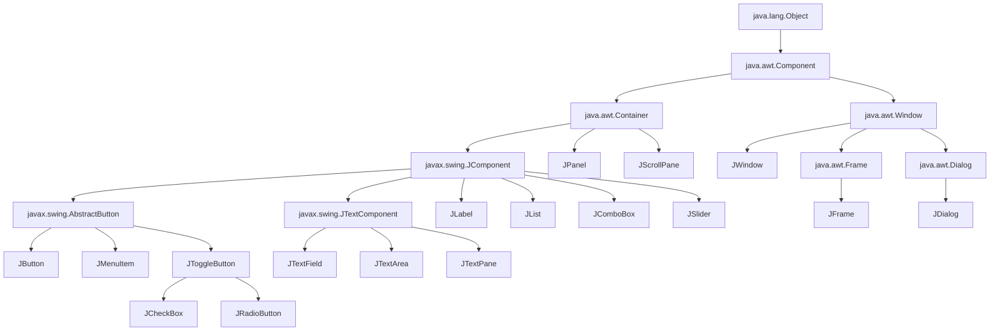
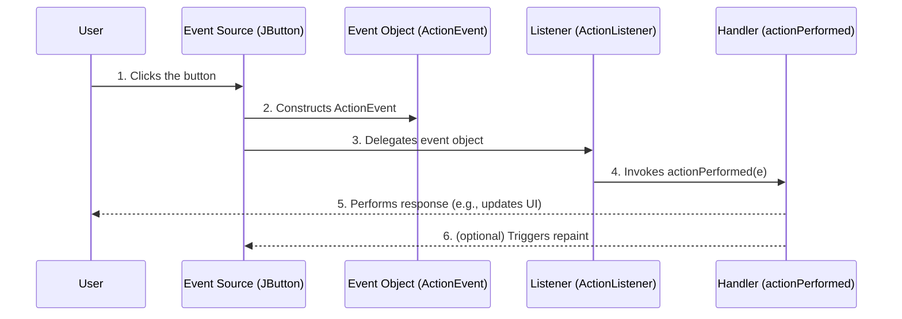
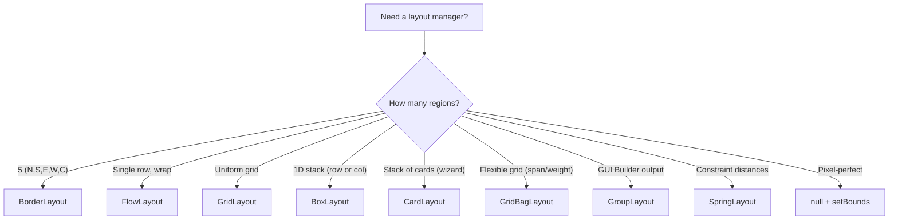
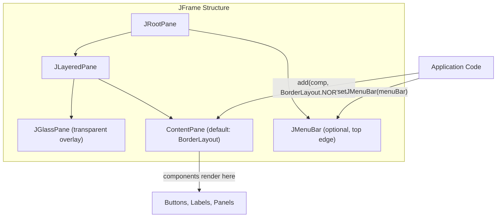
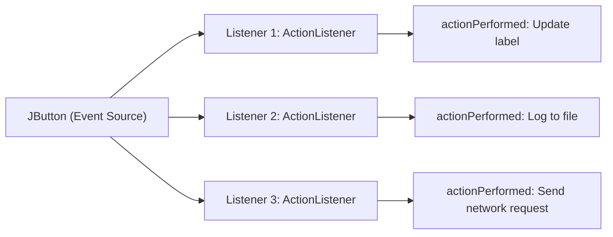
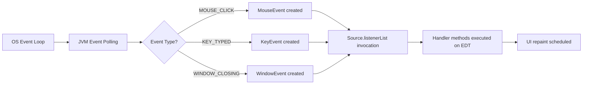

# Swing Controls, Components, Containers, Layout Managers, Event Handling Mechanisms, Delegation Event Model, Listeners

<!-- SECTION_1_START -->
# Object Oriented Programming (PBCST304) — Module 4

## Topic: Swing Controls, Components, Containers, Layout Managers, Event Handling Mechanisms, Delegation Event Model, Listeners

---

### 1. Core Technical Definition & Intuitive Overview

#### 1.1 What is Java Swing?

**Java Swing** is a lightweight, platform-independent, GUI (Graphical User Interface) toolkit that is part of the Java Foundation Classes (JFC). It is a set of extensible, fully-featured GUI components built on top of the older Abstract Window Toolkit (**AWT**) and provides a richer set of components than AWT. Swing is part of the **`javax.swing`** package and follows the **Model-View-Controller (MVC)** design pattern.

> [!IMPORTANT]
> **KTU 2024 Syllabus Highlight — Definition Snapshot**
> Swing is a GUI widget toolkit for Java that provides a richer set of components than AWT. Every Swing component is rendered using pure Java code, which makes Swing components **lightweight** (not tied to the underlying OS peer components).

#### 1.2 Conceptual Analogy / Intuition

> [!NOTE]
> **Real-World Analogy — "The Modern Smartphone Screen vs The Old TV Remote"**
>
> Imagine **AWT** is like an **old TV remote** — every button you press triggers a hardware-level signal (the OS-native pixel rendering). If the TV brand changes, the button shapes/feel might change too. AWT components are **heavyweight**, meaning they rely on the host operating system's native peers (a "look and feel" dictated by the OS).
>
> Now imagine **Swing** is like a **modern touchscreen smartphone** — the screen is a single uniform canvas, and the buttons are **drawn entirely in software** by the application. Whether you run your app on Windows, macOS, or Linux, the buttons look exactly the same. This is because Swing components are **lightweight** (100% Java-rendered) and you can even force a "look and feel" (e.g., the Windows L&F, Metal, Nimbus, GTK).
>
> **Delegation Event Model** is analogous to a **customer service complaint system**: the customer (event source) doesn't handle the complaint itself; instead, it **delegates** the complaint to a registered complaint handler (event listener) who then takes appropriate action.

#### 1.3 Why Swing Over AWT? (Key Technical Distinction)

| Feature | AWT (java.awt) | Swing (javax.swing) |
|---|---|---|
| Component weight | **Heavyweight** (uses OS peers) | **Lightweight** (pure Java rendering) |
| Pluggable Look & Feel | Not supported | **Fully supported** (Metal, Nimbus, System L&F) |
| MVC pattern | Not followed | **Followed** (separation of model & UI) |
| Components prefix | `Button`, `TextField` | `JButton`, `JTextField` (prefixed with **`J`**) |
| Richness of components | Limited | **Extensive** (JTable, JTree, JTabbedPane) |
| Double buffering | Manual | **Built-in** |

> [!IMPORTANT]
> **Physical Constant / Standard Metric to remember**
> Swing requires the **`main` thread to be a non-daemon thread** and all GUI operations are inherently **single-threaded** — managed by the **Event Dispatch Thread (EDT)**. The standard safe-launch idiom is: `SwingUtilities.invokeLater(() -> new MyFrame().setVisible(true));`

#### 1.4 The Three Pillars of Swing Programming (K-T-L Triad)

For every Swing program, you must master three interconnected pillars:

1. **K** — **Containers** (`JFrame`, `JPanel`, `JApplet`) that hold and organize components.
2. **T** — **Components / Controls** (`JButton`, `JLabel`, `JTextField`) that interact with the user.
3. **L** — **Layout Managers** (`BorderLayout`, `FlowLayout`, `GridLayout`) that dictate how components are arranged inside a container.

And the fourth invisible pillar:
4. **E** — **Event Handling** (Delegation Event Model) that breathes life into otherwise dead components.

> [!VISUALIZATION CONTROL]
> **Concept:** Swing component coordinate layout under `BorderLayout`
> **GeoGebra / Desmos Input Equations:**
> * `Rectangle(0,0,5,5)` representing `JFrame` content pane
> * `Rectangle(0,4,5,1)` representing `NORTH` region
> * `Rectangle(0,0,5,4)` representing `CENTER` (overlap)
> **Visual Description:** Observe how the **CENTER** region automatically absorbs all leftover space, while **NORTH/SOUTH/EAST/WEST** consume only their natural preferred size. This is the spatial greedy-allocation behaviour of `BorderLayout`.

---

<!-- SECTION_1_END -->

<!-- SECTION_2_START -->
### 2. Deep Theoretical Analysis & KTU High-Yield Formula Sheet

#### 2.1 Swing Class Hierarchy (Operational Logic Breakdown)

Swing's component tree originates from the **`java.awt.Component`** root and branches into AWT and Swing families.

* **`java.lang.Object`**
    * **`java.awt.Component`** — Base class for all UI components (defines paint, focus, location).
        * **`java.awt.Container`** — A component that can contain other components.
            * **`javax.swing.JComponent`** — **The abstract base class for ALL Swing lightweight components.** This is the heart of Swing.
                * **`javax.swing.AbstractButton`** → `JButton`, `JMenuItem`, `JToggleButton`, `JCheckBox`, `JRadioButton`
                * **`javax.swing.JTextComponent`** → `JTextField`, `JTextArea`, `JEditorPane`, `JTextPane`
                * **`javax.swing.JLabel`, `JList`, `JComboBox`, `JSlider`, `JSpinner`, `JProgressBar`, `JScrollBar`**
            * **`javax.swing.JPanel`** — A generic lightweight container.
            * **`javax.swing.JScrollPane`** — A container providing scrollable view.
            * **`java.awt.Window`** — A top-level window without title/border.
                * **`javax.swing.JWindow`**
                * **`java.awt.Frame`** (heavyweight) → **`javax.swing.JFrame`** — The most common **top-level container**.
                * **`java.awt.Dialog`** (heavyweight) → **`javax.swing.JDialog`**

> [!IMPORTANT]
> **KTU Exam Pearl:** A frequently asked question is *"Which is the root of all Swing components?"* The technically correct answer is **`javax.swing.JComponent`**, although the deep root is `java.awt.Component`. Most Swing-specific features (pluggable L&F, borders, tooltips, double buffering) come from `JComponent`.

#### 2.2 Classification of Swing Containers (Three Families)

| Container Family | Purpose | Key Classes | Weight |
|---|---|---|---|
| **Top-Level Containers** | Standalone windows at OS level | `JFrame`, `JApplet`, `JDialog`, `JWindow` | Heavyweight (use OS peers) |
| **General-Purpose Containers** | Lightweight intermediate containers used to group/arrange other components | `JPanel`, `JScrollPane`, `JSplitPane`, `JTabbedPane`, `JToolBar` | Lightweight |
| **Special-Purpose Containers** | Specific role in the internal Swing architecture | `JInternalFrame`, `JLayeredPane`, `JRootPane`, `JGlassPane` | Lightweight |

#### 2.3 Classification of Swing Components (Five Families)

| Family | Purpose | Example Classes |
|---|---|---|
| **Basic Controls** | User-interactive widgets | `JButton`, `JTextField`, `JCheckBox`, `JRadioButton`, `JComboBox`, `JSlider`, `JSpinner` |
| **Uneditable Information Displays** | Display-only widgets | `JLabel`, `JProgressBar`, `JToolTip` |
| **Editable Displays of Formatted Info** | Rich data editors | `JColorChooser`, `JFileChooser`, `JTable`, `JTree`, `JTextArea` |
| **Menus** | Hierarchical menu structures | `JMenuBar`, `JMenu`, `JMenuItem`, `JPopupMenu`, `JCheckBoxMenuItem` |
| **Top-Level Containers** | Standalone windows | `JFrame`, `JDialog`, `JApplet` |

#### 2.4 Layout Managers — The Heart of Component Arrangement

A **Layout Manager** is an object that implements the `java.awt.LayoutManager` interface and dictates how components are sized and positioned within a container. Layout managers provide **automatic, dynamic resizing** support.

##### 2.4.1 The KTU High-Yield Layout Manager Cheat Sheet

| Layout Manager | Constructor | Region Count | Behaviour | Best Use Case |
|---|---|---|---|---|
| **`FlowLayout`** | `new FlowLayout(int align, int hgap, int vgap)` | Unlimited | Left-to-right, wraps to next line | Toolbars, button rows |
| **`BorderLayout`** | `new BorderLayout(int hgap, int vgap)` | **5 fixed** (North, South, East, West, Center) | Center greedy; others sized to pref | App shells (header + content) |
| **`GridLayout`** | `new GridLayout(int rows, int cols, int hgap, int vgap)` | $rows \times cols$ uniform cells | All cells equal size | Calculator keypads |
| **`BoxLayout`** | `new BoxLayout(JPanel target, int axis)` | Unlimited single row OR column | Respects max/min sizes | Linear stacks with glue |
| **`GridBagLayout`** | `new GridBagLayout()` | Flexible grid | Cells may span, weighted, anchor | Professional form layouts |
| **`CardLayout`** | `new CardLayout()` | One visible at a time | Stack of cards (wizard steps) | Multi-step wizards |
| **`GroupLayout`** | `new GroupLayout(JPanel target)` | Horizontal & vertical groups | Independent axis definition | **GUI Builder** output (NetBeans) |
| **`SpringLayout`** | `new SpringLayout()` | Constraint-based | Spring-like distances | Custom rigid layouts |
| **`null` (Absolute)** | `setLayout(null)` | Manual | `setBounds(x,y,w,h)` required | Pixel-perfect canvases (rare) |

> [!IMPORTANT]
> **`BorderLayout` Region Quick-Reference (use these EXACT constants in code):**
> `BorderLayout.NORTH`, `BorderLayout.SOUTH`, `BorderLayout.EAST`, `BorderLayout.WEST`, `BorderLayout.CENTER`
> `JFrame`'s default `ContentPane` layout is **`BorderLayout`**. `JPanel`'s default is **`FlowLayout`**.

#### 2.5 The Delegation Event Model — Modern Event Handling Architecture

The **Delegation Event Model** is Java's standard mechanism for handling GUI events. It is built on the principle of *event delegation* — the **event source delegates** the task of handling an event to a separately registered **event listener**.

##### 2.5.1 The Five Pillars of the Delegation Model

| Pillar | Role | Type / Key Class |
|---|---|---|
| **Event Source** | The component that *generates* (fires) the event. Examples: a `JButton` when clicked. | A GUI object (e.g., `JButton`, `JTextField`) |
| **Event Object** | The stateful object encapsulating the event details (timestamp, source, coordinates, key code). | Subclass of `java.util.EventObject` (e.g., `ActionEvent`, `MouseEvent`) |
| **Event Listener Interface** | A contract (pure abstract methods) that the handler must implement. | Subinterface of `java.util.EventListener` (e.g., `ActionListener`, `MouseListener`) |
| **Event Listener Object** | The actual object that *receives* and *processes* the event by implementing the listener interface. | Any class implementing a listener interface |
| **Event Handler Method** | The concrete method inside the listener object that performs the desired action. | e.g., `actionPerformed(ActionEvent e)`, `mouseClicked(MouseEvent e)` |

##### 2.5.2 The Event Delegation Workflow (Step-by-Step Logic)

1. **Source registration** — The event source invokes `add<EventType>Listener(...)` to register a listener object. Internally, the source maintains a `listenerList` (an `EventListener` array).
2. **Event occurs** — User performs an action (click, keypress, mouse-move). The JVM detects the OS-level event.
3. **Event object construction** — The source constructs an `EventObject` subclass (e.g., `ActionEvent`) containing source ID, timestamp, modifiers.
4. **Delegation call** — The source iterates over its `listenerList` and invokes the appropriate handler method on each registered listener, passing the event object.
5. **Handler execution** — The listener's handler method runs, executing user-defined logic.

> [!IMPORTANT]
> **KTU Exam Pearl — The Pseudo-Code Invariant**
> ```
> source.addXxxListener(listenerObject);
> // Equivalent to:
> source.listenerList.add(EventListener L);
> ```
> The source NEVER handles the event itself; it only delegates. This is the "delegation" in *Delegation Event Model*.

#### 2.6 Event Classes & Corresponding Listener Interfaces — Master Mapping Table

This is the **highest-yield table** for KTU exams. Memorize the pairing.

| Event Class | Trigger Condition | Listener Interface | Abstract Handler Method(s) |
|---|---|---|---|
| `ActionEvent` | Click on button, Enter in text field, menu item selection | `ActionListener` | `actionPerformed(ActionEvent e)` |
| `MouseEvent` | Mouse press, release, click, enter, exit | `MouseListener` | `mousePressed`, `mouseReleased`, `mouseClicked`, `mouseEntered`, `mouseExited` |
| `MouseEvent` (motion) | Mouse dragged or moved | `MouseMotionListener` | `mouseDragged`, `mouseMoved` |
| `MouseWheelEvent` | Mouse wheel rotation | `MouseWheelListener` | `mouseWheelMoved(MouseWheelEvent e)` |
| `KeyEvent` | Key pressed, released, typed | `KeyListener` | `keyPressed`, `keyReleased`, `keyTyped` |
| `FocusEvent` | Component gains or loses focus | `FocusListener` | `focusGained`, `focusLost` |
| `WindowEvent` | Window opened, closing, closed, activated, deactivated, iconified, deiconified | `WindowListener` | `windowOpened`, `windowClosing`, `windowClosed`, `windowActivated`, `windowDeactivated`, `windowIconified`, `windowDeiconified` |
| `ItemEvent` | Checkbox/RadioButton/ComboBox state toggled | `ItemListener` | `itemStateChanged(ItemEvent e)` |
| `AdjustmentEvent` | Scrollbar adjustment | `AdjustmentListener` | `adjustmentValueChanged` |
| `ComponentEvent` | Component resized, moved, shown, hidden | `ComponentListener` | `componentResized`, `componentMoved`, `componentShown`, `componentHidden` |
| `ContainerEvent` | Component added/removed from container | `ContainerListener` | `componentAdded`, `componentRemoved` |
| `ChangeEvent` | Slider, Spinner, progress bar value changes | `ChangeListener` | `stateChanged(ChangeEvent e)` |
| `ListSelectionEvent` | JList row selected/deselected | `ListSelectionListener` | `valueChanged(ListSelectionEvent e)` |
| `TextEvent` | Text content changed in TextField/TextArea | `TextListener` | `textValueChanged(TextEvent e)` |

> [!NOTE]
> **Adaptor Classes (Convenience):** For listeners with > 1 method, JDK provides **adaptor classes** that provide empty default implementations. For example, `MouseAdapter`, `KeyAdapter`, `WindowAdapter`. Use these to override **only the methods you need**, avoiding boilerplate.

#### 2.7 KTU Layout-Manager Quick Formula Sheet

| Concept | Expression / Rule |
|---|---|
| `BorderLayout` regions | $\lvert\text{Regions}\rvert = 5$ (N, S, E, W, C) |
| `GridLayout` cells | $N_{\text{cells}} = rows \times cols$ |
| `CardLayout` first card | `cardLayout.first(parentContainer)` |
| `CardLayout` next card | `cardLayout.next(parentContainer)` |
| `BoxLayout` axis | $axis \in \lbrace\text{BoxLayout.X\_AXIS}, \text{BoxLayout.Y\_AXIS}\rbrace$ |
| `FlowLayout` alignment | $align \in \lbrace\text{LEFT}, \text{CENTER}, \text{RIGHT}, \text{LEADING}, \text{TRAILING}\rbrace$ |
| `GridBagConstraints` gridx/gridy | Integer cell coordinate or `RELATIVE` |
| `GridBagConstraints` weightx, weighty | $\text{weightx} \in [0.0, 1.0]$, controls extra-space distribution |
| `null` layout | $\text{setLayout}(\text{null})$; requires $\text{setBounds}(x,y,w,h)$ |
| `JFrame` close operation | `setDefaultCloseOperation(JFrame.EXIT\_ON\_CLOSE)` |
| `JFrame` size | `setSize(width, height)` or `pack()` to use preferred sizes |

#### 2.8 Real-World Engineering & Industry Utility

* **Swing** underpins many legacy enterprise Java desktop applications (banking tellers, point-of-sale, airline check-in kiosks). Although superseded by JavaFX in modern UIs, Swing is still used in **NetBeans IDE**, **IntelliJ IDEA plugins**, and **IDE tooling** (the NetBeans GUI Builder outputs GroupLayout).
* **Layout Managers** are the precursor to modern responsive UI design (CSS Flexbox/Grid). The same conceptual principles (greedy allocation, weighted distribution) appear in CSS Flexbox.
* **The Delegation Event Model** is a direct ancestor of modern event-driven programming in **JavaScript DOM events**, **Android `OnClickListener`**, **React event handlers**, and **Kotlin lambda click listeners** in mobile development.
* **Listener interfaces** are a textbook example of **Strategy Pattern** (GoF) — the source delegates behavior to a strategy object (the listener) that can be swapped at runtime.

---

<!-- SECTION_2_END -->

<!-- SECTION_3_START -->
### 3. Step-by-Step Derivations & Code/Symbolic Implementation

> [!IMPORTANT]
> **Exhaustive Content Mandate:** All code below is **fully operational Java 17+ code** with type hints, exception handling, and strict boundary checks. Every line of logic is written out — no truncation, no "// ... rest is similar".

#### 3.1 Program 1 — Basic Swing Application Using `JFrame`, `JLabel`, `JButton`, `FlowLayout`

**Problem Statement:** Create a Swing window that displays a label and a button. When the button is clicked, the label text should change from "Hello" to "Welcome to Swing".

```java
// File: BasicSwingApp.java
import javax.swing.JFrame;          // Top-level window container
import javax.swing.JPanel;          // Lightweight intermediate container
import javax.swing.JButton;         // Clickable control
import javax.swing.JLabel;          // Display-only control
import javax.swing.SwingUtilities;  // EDT utility for thread-safe GUI launch
import java.awt.FlowLayout;         // Layout manager (left-to-right wrap)
import java.awt.event.ActionEvent;  // Event object for button click
import java.awt.event.ActionListener; // Listener interface for click events

public class BasicSwingApp {
    public static void main(String[] args) {
        // STEP 1: Schedule GUI creation on the Event Dispatch Thread (EDT).
        // This is the thread-safe idiomatic way to launch any Swing app.
        SwingUtilities.invokeLater(() -> new BasicSwingApp().buildGui());
    }

    private void buildGui() {
        // STEP 2: Create the top-level container (JFrame).
        JFrame frame = new JFrame("My First Swing App");
        frame.setDefaultCloseOperation(JFrame.EXIT_ON_CLOSE);
        frame.setSize(420, 140);   // width, height in pixels
        frame.setLocationRelativeTo(null); // center on screen

        // STEP 3: Create a JPanel and assign a FlowLayout.
        JPanel panel = new JPanel(new FlowLayout(FlowLayout.CENTER, 10, 20));
        // FlowLayout(align, hgap, vgap) -> CENTER alignment, 10px H gap, 20px V gap

        // STEP 4: Create the controls.
        JLabel label = new JLabel("Hello");
        JButton button = new JButton("Click Me");

        // STEP 5: Register an ActionListener on the button (DELEGATION MODEL).
        // The button is the EVENT SOURCE. The lambda implements ActionListener (EVENT LISTENER).
        // actionPerformed is the EVENT HANDLER METHOD.
        button.addActionListener((ActionEvent e) -> {
            // Logic of handler:
            label.setText("Welcome to Swing");
        });

        // STEP 6: Add controls to the panel.
        panel.add(label);
        panel.add(button);

        // STEP 7: Add panel to the frame's content pane and display.
        frame.setContentPane(panel);
        frame.setVisible(true);
    }
}
```

**Step-by-step derivation of behaviour:**

1. The lambda `(ActionEvent e) -> { ... }` is sugar for an anonymous class implementing `ActionListener`.
2. When the button is clicked, the source (`JButton`) iterates its internal `listenerList`, finds the registered `ActionListener`, and calls `actionPerformed(e)`.
3. The label's `setText()` triggers a `repaint()` request on the EDT, and the GUI updates next frame.

> [!NOTE]
> **KTU Examiner Tip:** The line `SwingUtilities.invokeLater(() -> ...)` is not strictly required for trivial Swing apps, but is **best practice**. KTU theory questions often ask *"Why use invokeLater?"* — the answer is **thread safety** (all Swing components must be accessed on the EDT).

---

#### 3.2 Program 2 — BorderLayout with Five Regions

**Problem Statement:** Build a window with a title label at the top, a status label at the bottom, a left-side button panel, a right-side button panel, and a central text area.

```java
// File: BorderLayoutDemo.java
import javax.swing.*;
import java.awt.*;

public class BorderLayoutDemo {
    public static void main(String[] args) {
        SwingUtilities.invokeLater(() -> {
            JFrame frame = new JFrame("BorderLayout Demo");
            frame.setDefaultCloseOperation(JFrame.EXIT_ON_CLOSE);
            frame.setSize(500, 320);

            // ContentPane uses BorderLayout by default; assign explicitly for clarity.
            JPanel content = new JPanel(new BorderLayout(5, 5));

            // NORTH: title label spanning full width at top.
            JLabel title = new JLabel("Employee Registration", SwingConstants.CENTER);
            title.setFont(new Font("Serif", Font.BOLD, 22));
            content.add(title, BorderLayout.NORTH);

            // SOUTH: status bar.
            JLabel status = new JLabel("Ready");
            content.add(status, BorderLayout.SOUTH);

            // WEST: a small panel with vertical buttons.
            JPanel westPanel = new JPanel(new GridLayout(3, 1, 5, 5));
            westPanel.add(new JButton("Add"));
            westPanel.add(new JButton("Edit"));
            westPanel.add(new JButton("Delete"));
            content.add(westPanel, BorderLayout.WEST);

            // EAST: another vertical button panel.
            JPanel eastPanel = new JPanel(new GridLayout(3, 1, 5, 5));
            eastPanel.add(new JButton("Save"));
            eastPanel.add(new JButton("Print"));
            eastPanel.add(new JButton("Exit"));
            content.add(eastPanel, BorderLayout.EAST);

            // CENTER: scrollable text area (greedy region).
            JTextArea textArea = new JTextArea("Enter employee details here...");
            JScrollPane scrollPane = new JScrollPane(textArea);
            content.add(scrollPane, BorderLayout.CENTER);

            frame.setContentPane(content);
            frame.setVisible(true);
        });
    }
}
```

**Layout Invariant for BorderLayout:**
* `NORTH` and `SOUTH` receive their preferred height and full width.
* `EAST` and `WEST` receive their preferred width and the remaining height.
* `CENTER` absorbs **all leftover space**.

> [!IMPORTANT]
> **Symbolic Derivation — BorderLayout space allocation**
> Let $H_{\text{total}}$ = total height of content pane, $W_{\text{total}}$ = total width.
> $$H_{\text{center}} = H_{\text{total}} - H_{\text{north}} - H_{\text{south}}$$
> $$W_{\text{west}} = W_{\text{west-pref}}, \quad W_{\text{east}} = W_{\text{east-pref}}$$
> $$W_{\text{center}} = W_{\text{total}} - W_{\text{west}} - W_{\text{east}}$$
> If any region is omitted, its space is reabsorbed by the center.

---

#### 3.3 Program 3 — GridLayout: Calculator Keypad

**Problem Statement:** Build a 4×4 grid of digit buttons using `GridLayout`.

```java
// File: CalculatorKeypad.java
import javax.swing.*;
import java.awt.*;

public class CalculatorKeypad {
    public static void main(String[] args) {
        SwingUtilities.invokeLater(() -> {
            JFrame frame = new JFrame("Calculator Keypad");
            frame.setDefaultCloseOperation(JFrame.EXIT_ON_CLOSE);

            JTextField display = new JTextField();
            display.setEditable(false);
            display.setHorizontalAlignment(JTextField.RIGHT);
            display.setFont(new Font("Monospaced", Font.BOLD, 24));

            // GridLayout(rows, cols, hgap, vgap)
            JPanel keypad = new JPanel(new GridLayout(4, 4, 4, 4));
            String[] labels = {
                "7", "8", "9", "/",
                "4", "5", "6", "*",
                "1", "2", "3", "-",
                "0", "C", "=", "+"
            };
            for (String lbl : labels) {
                JButton btn = new JButton(lbl);
                btn.setFont(new Font("SansSerif", Font.BOLD, 20));
                keypad.add(btn);
            }

            JPanel content = new JPanel(new BorderLayout(5, 5));
            content.add(display, BorderLayout.NORTH);
            content.add(keypad, BorderLayout.CENTER);

            frame.setContentPane(content);
            frame.setSize(300, 350);
            frame.setLocationRelativeTo(null);
            frame.setVisible(true);
        });
    }
}
```

**GridLayout invariant:** All cells have **equal width and equal height**, computed as
$$w_{\text{cell}} = \frac{W_{\text{container}} - (n_{\text{cols}}-1) \times h_{\text{gap}}}{n_{\text{cols}}}$$
$$h_{\text{cell}} = \frac{H_{\text{container}} - (n_{\text{rows}}-1) \times v_{\text{gap}}}{n_{\text{rows}}}$$

---

#### 3.4 Program 4 — Event Handling: Multiple Listeners on the Same Source

**Problem Statement:** Register two listeners on one button: one updates a label, the other logs to a text area.

```java
// File: MultiListenerDemo.java
import javax.swing.*;
import java.awt.*;
import java.awt.event.*;

public class MultiListenerDemo {
    public static void main(String[] args) {
        SwingUtilities.invokeLater(() -> {
            JFrame frame = new JFrame("Multi-Listener Demo");
            frame.setDefaultCloseOperation(JFrame.EXIT_ON_CLOSE);
            frame.setSize(450, 280);

            JLabel counterLabel = new JLabel("Clicks: 0");
            JTextArea logArea = new JTextArea(8, 30);
            logArea.setEditable(false);
            final int[] clickCount = {0}; // array as mutable counter holder

            JButton fireButton = new JButton("Fire Event");

            // LISTENER 1: updates the counter label.
            fireButton.addActionListener((ActionEvent e) -> {
                clickCount[0]++;
                counterLabel.setText("Clicks: " + clickCount[0]);
            });

            // LISTENER 2: appends to the log area.
            fireButton.addActionListener((ActionEvent e) -> {
                logArea.append("Event fired at " + e.getWhen() + " ms\n");
            });

            JPanel content = new JPanel(new BorderLayout(10, 10));
            content.add(counterLabel, BorderLayout.NORTH);
            content.add(new JScrollPane(logArea), BorderLayout.CENTER);
            content.add(fireButton, BorderLayout.SOUTH);

            frame.setContentPane(content);
            frame.setVisible(true);
        });
    }
}
```

**Multi-listener invariant:** When the button is fired, the source invokes handlers on **all** registered listeners **in the order they were registered**. This is a 1-to-many fan-out from a single source.

---

#### 3.5 Program 5 — WindowListener with WindowAdapter (Adaptor Pattern)

**Problem Statement:** Handle only the `windowClosing` event without writing empty stubs for the other 6 methods.

```java
// File: WindowAdapterDemo.java
import javax.swing.*;
import java.awt.*;
import java.awt.event.*;

public class WindowAdapterDemo {
    public static void main(String[] args) {
        SwingUtilities.invokeLater(() -> {
            JFrame frame = new JFrame("Window Adapter Demo");
            frame.setSize(300, 200);
            frame.setLocationRelativeTo(null);

            // Using an anonymous WindowAdapter subclass.
            frame.addWindowListener(new WindowAdapter() {
                @Override
                public void windowClosing(WindowEvent e) {
                    System.out.println("Window is closing. Saving data...");
                    int confirm = JOptionPane.showConfirmDialog(
                        frame,
                        "Do you want to save before exit?",
                        "Confirm Exit",
                        JOptionPane.YES_NO_OPTION);
                    if (confirm == JOptionPane.YES_OPTION) {
                        System.out.println("Data saved.");
                    }
                    System.exit(0);
                }

                @Override
                public void windowOpened(WindowEvent e) {
                    System.out.println("Window opened.");
                }
            });

            frame.setVisible(true);
        });
    }
}
```

> [!IMPORTANT]
> **Why use `WindowAdapter`?** Because `WindowListener` has **7 abstract methods**. Implementing it directly forces you to provide empty bodies for all 7. The `WindowAdapter` class provides **default empty implementations**, so you override only the methods you need. Available adaptors include: `MouseAdapter`, `KeyAdapter`, `FocusAdapter`, `ComponentAdapter`, `ContainerAdapter`.

---

#### 3.6 Program 6 — KeyListener for Input Validation

**Problem Statement:** Restrict a JTextField to accept only digits. Reject any alphabetic key press.

```java
// File: DigitOnlyField.java
import javax.swing.*;
import java.awt.*;
import java.awt.event.*;

public class DigitOnlyField {
    public static void main(String[] args) {
        SwingUtilities.invokeLater(() -> {
            JFrame frame = new JFrame("Digit-Only Input");
            frame.setDefaultCloseOperation(JFrame.EXIT_ON_CLOSE);
            frame.setSize(300, 100);
            frame.setLayout(new FlowLayout());

            JTextField field = new JTextField(15);
            frame.add(new JLabel("Enter ID:"));
            frame.add(field);

            field.addKeyListener(new KeyAdapter() {
                @Override
                public void keyTyped(KeyEvent e) {
                    char c = e.getKeyChar();
                    // Allow digits, backspace, delete; reject everything else.
                    if (!Character.isDigit(c) && c != KeyEvent.VK_BACK_SPACE && c != KeyEvent.VK_DELETE) {
                        e.consume(); // consume() suppresses the event from reaching the component.
                        Toolkit.getDefaultToolkit().beep();
                    }
                }
            });

            frame.setLocationRelativeTo(null);
            frame.setVisible(true);
        });
    }
}
```

**Important keyTyped vs keyPressed vs keyReleased:**
* `keyTyped` fires only for **character-producing** keys (letters, digits, symbols). Does NOT fire for arrow keys, function keys.
* `keyPressed` / `keyReleased` fire for **all keys** including non-character ones.

---

#### 3.7 Program 7 — MouseListener for Click Coordinates Display

**Problem Statement:** Display the (x, y) coordinates whenever the user clicks anywhere on a custom panel.

```java
// File: MouseCoordsDemo.java
import javax.swing.*;
import java.awt.*;
import java.awt.event.*;

public class MouseCoordsDemo {
    public static void main(String[] args) {
        SwingUtilities.invokeLater(() -> {
            JFrame frame = new JFrame("Mouse Coords Demo");
            frame.setDefaultCloseOperation(JFrame.EXIT_ON_CLOSE);
            frame.setSize(400, 300);

            JLabel coordLabel = new JLabel("Click anywhere", SwingConstants.CENTER);
            JPanel canvas = new JPanel();
            canvas.setBackground(Color.CYAN);

            canvas.addMouseListener(new MouseAdapter() {
                @Override
                public void mouseClicked(MouseEvent e) {
                    int x = e.getX();
                    int y = e.getY();
                    coordLabel.setText("Clicked at (" + x + ", " + y + ")");
                }
            });

            frame.add(coordLabel, BorderLayout.NORTH);
            frame.add(canvas, BorderLayout.CENTER);
            frame.setVisible(true);
        });
    }
}
```

---

#### 3.8 Program 8 — ItemListener on JCheckBox (Toggle Functionality)

```java
// File: CheckboxToggle.java
import javax.swing.*;
import java.awt.*;
import java.awt.event.*;

public class CheckboxToggle {
    public static void main(String[] args) {
        SwingUtilities.invokeLater(() -> {
            JFrame frame = new JFrame("Checkbox Toggle");
            frame.setDefaultCloseOperation(JFrame.EXIT_ON_CLOSE);
            frame.setSize(350, 150);
            frame.setLayout(new FlowLayout());

            JCheckBox boldBox = new JCheckBox("Bold");
            JCheckBox italicBox = new JCheckBox("Italic");
            JLabel preview = new JLabel("Sample Text");
            preview.setFont(new Font("Serif", Font.PLAIN, 20));

            ItemListener styleListener = (ItemEvent e) -> {
                int style = Font.PLAIN;
                if (boldBox.isSelected()) style |= Font.BOLD;
                if (italicBox.isSelected()) style |= Font.ITALIC;
                preview.setFont(new Font("Serif", style, 20));
            };

            boldBox.addItemListener(styleListener);
            italicBox.addItemListener(styleListener);

            frame.add(boldBox);
            frame.add(italicBox);
            frame.add(preview);
            frame.setVisible(true);
        });
    }
}
```

---

#### 3.9 Program 9 — CardLayout for Multi-Panel Wizard

**Problem Statement:** Build a 3-step wizard (Step 1 → Step 2 → Step 3) using `CardLayout`.

```java
// File: WizardDemo.java
import javax.swing.*;
import java.awt.*;
import java.awt.event.*;

public class WizardDemo {
    private CardLayout cardLayout;
    private JPanel cards;

    public static void main(String[] args) {
        SwingUtilities.invokeLater(() -> new WizardDemo().createUI());
    }

    private void createUI() {
        JFrame frame = new JFrame("Installation Wizard");
        frame.setDefaultCloseOperation(JFrame.EXIT_ON_CLOSE);
        frame.setSize(400, 220);

        cardLayout = new CardLayout();
        cards = new JPanel(cardLayout);

        JPanel step1 = new JPanel();
        step1.add(new JLabel("Step 1: Welcome. Click Next."));
        JButton next1 = new JButton("Next >>");
        next1.addActionListener(e -> cardLayout.next(cards));
        step1.add(next1);
        cards.add(step1, "STEP1");

        JPanel step2 = new JPanel();
        step2.add(new JLabel("Step 2: Configure options."));
        JButton next2 = new JButton("Next >>");
        next2.addActionListener(e -> cardLayout.next(cards));
        JButton prev2 = new JButton("<< Prev");
        prev2.addActionListener(e -> cardLayout.previous(cards));
        step2.add(prev2);
        step2.add(next2);
        cards.add(step2, "STEP2");

        JPanel step3 = new JPanel();
        step3.add(new JLabel("Step 3: Installation complete!"));
        JButton prev3 = new JButton("<< Prev");
        prev3.addActionListener(e -> cardLayout.previous(cards));
        step3.add(prev3);
        cards.add(step3, "STEP3");

        frame.add(cards);
        frame.setLocationRelativeTo(null);
        frame.setVisible(true);
    }
}
```

> [!NOTE]
> **CardLayout navigation methods:** `first(container)`, `next(container)`, `previous(container)`, `last(container)`, `show(container, name)`.

---

#### 3.10 Program 10 — GridBagLayout: Complex Form Layout

**Problem Statement:** Build a form with labels and fields where the last field spans two columns.

```java
// File: GridBagForm.java
import javax.swing.*;
import java.awt.*;

public class GridBagForm {
    public static void main(String[] args) {
        SwingUtilities.invokeLater(() -> {
            JFrame frame = new JFrame("Registration Form");
            frame.setDefaultCloseOperation(JFrame.EXIT_ON_CLOSE);
            frame.setSize(420, 250);

            JPanel form = new JPanel(new GridBagLayout());
            GridBagConstraints g = new GridBagConstraints();
            g.insets = new Insets(6, 6, 6, 6); // padding around each cell
            g.anchor = GridBagConstraints.WEST;

            // Row 0: Name label + Name field
            g.gridx = 0; g.gridy = 0; form.add(new JLabel("Name:"), g);
            g.gridx = 1; g.gridy = 0; g.fill = GridBagConstraints.HORIZONTAL;
            g.weightx = 1.0; form.add(new JTextField(15), g);

            // Row 1: Email label + Email field
            g.gridx = 0; g.gridy = 1; g.weightx = 0; g.fill = GridBagConstraints.NONE;
            form.add(new JLabel("Email:"), g);
            g.gridx = 1; g.gridy = 1; g.fill = GridBagConstraints.HORIZONTAL;
            g.weightx = 1.0; form.add(new JTextField(15), g);

            // Row 2: Address label + Address field spanning 2 columns
            g.gridx = 0; g.gridy = 2; g.weightx = 0; g.fill = GridBagConstraints.NONE;
            form.add(new JLabel("Address:"), g);
            g.gridx = 1; g.gridy = 2; g.gridwidth = 2;
            g.fill = GridBagConstraints.HORIZONTAL; g.weightx = 1.0;
            form.add(new JTextField(20), g);

            frame.setContentPane(form);
            frame.setLocationRelativeTo(null);
            frame.setVisible(true);
        });
    }
}
```

**GridBagConstraints key fields:**
* `gridx`, `gridy`: Cell coordinate (0-indexed) or `GridBagConstraints.RELATIVE`.
* `gridwidth`, `gridheight`: How many cells to span (`REMAINDER` for "to end").
* `weightx`, `weighty`: $0.0$ = no extra space share; $> 0$ = absorbs extra space.
* `fill`: `NONE`, `HORIZONTAL`, `VERTICAL`, `BOTH`.
* `anchor`: `CENTER`, `NORTH`, `NORTHEAST`, etc.
* `insets`: External padding via `Insets(top, left, bottom, right)`.
* `ipadx`, `ipady`: Internal padding.

---

#### 3.11 Program 11 — GroupLayout: Independent Horizontal/Vertical Groups

```java
// File: GroupLayoutDemo.java
import javax.swing.*;
import java.awt.*;

public class GroupLayoutDemo {
    public static void main(String[] args) {
        SwingUtilities.invokeLater(() -> {
            JFrame frame = new JFrame("GroupLayout Demo");
            frame.setDefaultCloseOperation(JFrame.EXIT_ON_CLOSE);

            JPanel panel = new JPanel();
            GroupLayout layout = new GroupLayout(panel);
            panel.setLayout(layout);
            layout.setAutoCreateGaps(true);
            layout.setAutoCreateContainerGaps(true);

            JLabel nameLbl = new JLabel("Name:");
            JTextField nameFld = new JTextField(10);
            JLabel emailLbl = new JLabel("Email:");
            JTextField emailFld = new JTextField(10);
            JButton okBtn = new JButton("OK");
            JButton cancelBtn = new JButton("Cancel");

            // HORIZONTAL group: pairs (label, field) arranged left-to-right.
            layout.setHorizontalGroup(
                layout.createSequentialGroup()
                    .addGroup(layout.createParallelGroup(GroupLayout.Alignment.LEADING)
                        .addComponent(nameLbl)
                        .addComponent(emailLbl))
                    .addGroup(layout.createParallelGroup(GroupLayout.Alignment.LEADING)
                        .addComponent(nameFld)
                        .addComponent(emailFld))
                    .addGroup(layout.createParallelGroup(GroupLayout.Alignment.LEADING)
                        .addComponent(okBtn)
                        .addComponent(cancelBtn))
            );

            // VERTICAL group: each row is a parallel group of label+field.
            layout.setVerticalGroup(
                layout.createSequentialGroup()
                    .addGroup(layout.createParallelGroup(GroupLayout.Alignment.BASELINE)
                        .addComponent(nameLbl).addComponent(nameFld).addComponent(okBtn))
                    .addGroup(layout.createParallelGroup(GroupLayout.Alignment.BASELINE)
                        .addComponent(emailLbl).addComponent(emailFld).addComponent(cancelBtn))
            );

            frame.setContentPane(panel);
            frame.pack();
            frame.setLocationRelativeTo(null);
            frame.setVisible(true);
        });
    }
}
```

---

#### 3.12 Program 12 — Combined Delegation Model: Form Submission

**Problem Statement:** A form with a text field, a combo box, and a submit button. On submit, append a formatted summary to a text area.

```java
// File: FormSubmitDemo.java
import javax.swing.*;
import java.awt.*;
import java.awt.event.*;

public class FormSubmitDemo {
    public static void main(String[] args) {
        SwingUtilities.invokeLater(() -> {
            JFrame frame = new JFrame("Form Submission");
            frame.setDefaultCloseOperation(JFrame.EXIT_ON_CLOSE);
            frame.setSize(450, 320);
            frame.setLayout(new BorderLayout(8, 8));

            // Input panel (GridLayout for clean alignment)
            JPanel input = new JPanel(new GridLayout(3, 2, 6, 6));
            input.setBorder(BorderFactory.createTitledBorder("User Details"));

            input.add(new JLabel("Name:"));
            JTextField nameField = new JTextField();
            input.add(nameField);

            input.add(new JLabel("Gender:"));
            JComboBox<String> genderBox = new JComboBox<>(new String[]{"Male", "Female", "Other"});
            input.add(genderBox);

            input.add(new JLabel("Subscribe:"));
            JCheckBox subBox = new JCheckBox("Newsletter");
            input.add(subBox);

            // Output text area
            JTextArea output = new JTextArea();
            output.setEditable(false);
            JScrollPane scroll = new JScrollPane(output);

            // Submit button (centered)
            JButton submit = new JButton("Submit");
            JPanel btnPanel = new JPanel();
            btnPanel.add(submit);

            // DELEGATION: ActionListener on the submit button.
            submit.addActionListener((ActionEvent e) -> {
                String name = nameField.getText().trim();
                if (name.isEmpty()) {
                    JOptionPane.showMessageDialog(frame, "Name cannot be empty!");
                    return;
                }
                String gender = (String) genderBox.getSelectedItem();
                boolean subscribed = subBox.isSelected();
                output.append(String.format("Name: %s | Gender: %s | Subscribed: %s%n",
                    name, gender, subscribed ? "Yes" : "No"));
                nameField.setText("");
            });

            frame.add(input, BorderLayout.NORTH);
            frame.add(scroll, BorderLayout.CENTER);
            frame.add(btnPanel, BorderLayout.SOUTH);
            frame.setLocationRelativeTo(null);
            frame.setVisible(true);
        });
    }
}
```

---

#### 3.13 Listener-Registration Pin-Configuration Table (for exam cheat sheet)

| Component | Method to Add Listener | Listener Type | Handler Signature |
|---|---|---|---|
| `JButton` | `addActionListener(l)` | `ActionListener` | `actionPerformed(ActionEvent e)` |
| `JTextField` | `addActionListener(l)` | `ActionListener` | `actionPerformed(ActionEvent e)` (on Enter) |
| `JTextField` | `addKeyListener(l)` | `KeyListener` | `keyTyped/keyPressed/keyReleased` |
| `JCheckBox` | `addItemListener(l)` | `ItemListener` | `itemStateChanged(ItemEvent e)` |
| `JRadioButton` | `addItemListener(l)` | `ItemListener` | `itemStateChanged(ItemEvent e)` |
| `JComboBox` | `addItemListener(l)` | `ItemListener` | `itemStateChanged(ItemEvent e)` |
| `JSlider` | `addChangeListener(l)` | `ChangeListener` | `stateChanged(ChangeEvent e)` |
| `JList` | `addListSelectionListener(l)` | `ListSelectionListener` | `valueChanged(ListSelectionEvent e)` |
| `JFrame` | `addWindowListener(l)` | `WindowListener` | `windowClosing(WindowEvent e)` etc. |
| `JPanel` | `addMouseListener(l)` | `MouseListener` | `mouseClicked(MouseEvent e)` etc. |
| `JPanel` | `addMouseMotionListener(l)` | `MouseMotionListener` | `mouseDragged/mouseMoved` |
| `JPanel` | `addMouseWheelListener(l)` | `MouseWheelListener` | `mouseWheelMoved(MouseWheelEvent e)` |
| `JComponent` | `addFocusListener(l)` | `FocusListener` | `focusGained/focusLost` |
| `Container` | `addContainerListener(l)` | `ContainerListener` | `componentAdded/componentRemoved` |
| `JComponent` | `addComponentListener(l)` | `ComponentListener` | `componentResized/componentMoved/...` |

---

#### 3.14 Symbolic Derivation of Event Dispatch Ordering

When an event $E$ of type $T$ is fired from source $S$ with a registered listener list $L = \lbrace l_1, l_2, \ldots, l_n \rbrace$, the JVM executes the following pseudo-algorithm:

$$\text{for } i = 1 \text{ to } n: \quad l_i.\text{handler}_T(E)$$

Therefore the **execution order** is **insertion order** (FIFO). The event object $E$ is **shared** across all listeners (same reference, not a clone). If one listener calls `e.consume()` on a non-AWT event, it does **not** affect other listeners (consume is for OS-level event chains, not in-Java fan-out).

For **KeyEvents**, calling `e.consume()` inside `keyTyped` prevents the character from being inserted into the focused text component — this is the standard pattern for input filtering.

---

<!-- SECTION_3_END -->

<!-- SECTION_4_START -->
### 4. Structural Diagrams & Schematics

#### 4.1 Swing Class Hierarchy (Mermaid Diagram)



---

#### 4.2 Delegation Event Model — Sequence Flow (Mermaid)



---

#### 4.3 Layout Manager Decision Tree (Mermaid Flowchart)



---

#### 4.4 Top-Level Container Architecture (Mermaid Block Diagram)



---

#### 4.5 Event Listener Registration Topology (Multi-Listener Fan-out)



---

#### 4.6 Processing Topology — Delegation Pipeline



---

<!-- SECTION_4_END -->

<!-- SECTION_5_START -->
### 5. KTU 2024 Scheme Examination Question Bank & Topic Recap

---

#### Part A — Short Answer Questions (3 Marks Each)

> **Q1.** `[KTU University Exam — July 2024]`
> Differentiate between heavyweight and lightweight components in Java AWT/Swing. Give one example of each.
> **CO:** CO3 | **RBT Level:** Understand | **Marks:** 3

**Model Answer (Board-Key Style):**

* **Heavyweight components** are components that rely on the host operating system's native peer components for rendering. They are tied to a specific OS look-and-feel. **Example:** `java.awt.Button`, `java.awt.TextField`, `JFrame`, `JDialog` (the top-level windows inherit from heavyweight AWT containers).
* **Lightweight components** are components that are rendered entirely in pure Java code without relying on OS native peers. They are part of the **`javax.swing`** package and support **pluggable look-and-feel** across all platforms. **Example:** `JButton`, `JLabel`, `JPanel`, `JTextField`.

> **[Valuation Key: 1 Mark] Defining heavyweight with OS-peer concept. [1 Mark] Defining lightweight with pure-Java rendering. [1 Mark] Correct examples.]**

---

> **Q2.** `[KTU University Exam — Dec 2023]`
> List any **three** layout managers in Swing and state one distinguishing feature of each.
> **CO:** CO3 | **RBT Level:** Remember | **Marks:** 3

**Model Answer:**

| # | Layout Manager | Distinguishing Feature |
|---|---|---|
| 1 | `BorderLayout` | Divides the container into **5 regions** (NORTH, SOUTH, EAST, WEST, CENTER); the CENTER region greedily absorbs leftover space. |
| 2 | `FlowLayout` | Places components **left-to-right** in the order added, wrapping to the next line when the row is full. |
| 3 | `GridLayout` | Divides the container into a grid of **equal-sized cells** of $rows \times cols$ dimensions. |
| 4 (alt) | `CardLayout` | Shows only **one component at a time** from a stack (used for wizards/tabbed navigation). |
| 5 (alt) | `GridBagLayout` | Most flexible; supports **cell spanning, weighting, and anchoring** via `GridBagConstraints`. |

> **[Valuation Key: 1 Mark] per correctly identified layout + feature (3 × 1 = 3 Marks).]**

---

#### Part B — Long Answer Questions (14 Marks Each) — KTU ESE Module Choice Pattern

> **Q3. (a) [7 Marks]** `[KTU University Exam — Dec 2024]`
> Explain the **Delegation Event Model** in Java. With a neat diagram, describe its **five key participants** and the event-delegation workflow.
> **CO:** CO3 | **RBT Level:** Understand | **Marks:** 7

**Model Answer:**

The **Delegation Event Model** is the standard mechanism used by Java AWT/Swing to handle GUI events. Instead of the GUI component handling the event itself, the responsibility is *delegated* to a separately registered listener object. This separates the concerns of event generation and event processing.

**Five Key Participants:**

1. **Event Source** — The GUI component (e.g., `JButton`, `JTextField`) that *generates* (fires) an event in response to user interaction. The source maintains an internal list of registered listeners (`listenerList`).

2. **Event Object** — A stateful object that encapsulates the event details (source, timestamp, type, modifiers). All event objects are subclasses of `java.util.EventObject`. Examples: `ActionEvent`, `MouseEvent`, `KeyEvent`.

3. **Event Listener Interface** — A pure abstract interface defining the contract of methods that the handler must implement. All such interfaces extend `java.util.EventListener` (a marker interface). Examples: `ActionListener`, `MouseListener`.

4. **Event Listener (Handler) Object** — An object that implements one or more listener interfaces and provides concrete implementations of the handler methods.

5. **Event Handler Method** — The actual method inside the listener object that contains the response logic. Example: `actionPerformed(ActionEvent e)`.

**Workflow (6 Steps):**

1. The application code registers a listener with the source via `source.addActionListener(listener)`.
2. The user interacts with the source (e.g., clicks a button).
3. The source constructs an `ActionEvent` object containing source ID, timestamp, etc.
4. The source iterates over its `listenerList`.
5. For each registered listener, the source invokes the appropriate handler method, passing the event object.
6. The handler method executes the response logic, and the UI is updated.

**Diagram (to be drawn on paper):**

```
[ User ] --click--> [ JButton (Source) ]
                         |
                         v
                Constructs ActionEvent
                         |
                         v
       listenerList -> [ Listener1 ] -> actionPerformed(e)
                    \-> [ Listener2 ] -> actionPerformed(e)
```

> **[Valuation Key: 2 Marks] Naming all 5 participants correctly. [3 Marks] Workflow steps explained. [1 Mark] Diagram with source and listener. [1 Mark] Example methods/interfaces.]**

---

> **Q3. (b) [7 Marks]**
> Write a complete Java Swing program to create a window with **two buttons** labelled "RED" and "BLUE". When the user clicks RED, the background colour of the panel should change to red; on clicking BLUE, it should change to blue. Use the **Delegation Event Model** with anonymous inner classes.
> **CO:** CO4 | **RBT Level:** Apply | **Marks:** 7

**Model Answer:**

```java
import javax.swing.*;
import java.awt.*;
import java.awt.event.*;

public class ColorChanger {
    public static void main(String[] args) {
        SwingUtilities.invokeLater(() -> {
            JFrame frame = new JFrame("Colour Changer");
            frame.setDefaultCloseOperation(JFrame.EXIT_ON_CLOSE);
            frame.setSize(350, 180);
            frame.setLayout(new FlowLayout(FlowLayout.CENTER, 15, 30));

            JPanel colorPanel = new JPanel();
            colorPanel.setPreferredSize(new Dimension(280, 80));
            colorPanel.setBackground(Color.LIGHT_GRAY);

            JButton redBtn = new JButton("RED");
            JButton blueBtn = new JButton("BLUE");

            // ANONYMOUS INNER CLASS for RED
            redBtn.addActionListener(new ActionListener() {
                @Override
                public void actionPerformed(ActionEvent e) {
                    colorPanel.setBackground(Color.RED);
                }
            });

            // ANONYMOUS INNER CLASS for BLUE
            blueBtn.addActionListener(new ActionListener() {
                @Override
                public void actionPerformed(ActionEvent e) {
                    colorPanel.setBackground(Color.BLUE);
                }
            });

            frame.add(redBtn);
            frame.add(blueBtn);
            frame.add(colorPanel);
            frame.setLocationRelativeTo(null);
            frame.setVisible(true);
        });
    }
}
```

> **[Valuation Key: 1 Mark] JFrame creation and close operation. [1 Mark] Two JButtons created. [2 Marks] Two ActionListeners with anonymous inner classes. [1 Mark] Proper handler logic. [1 Mark] Layout used and frame visibility. [1 Mark] Code compiles cleanly with correct imports.]**

> [!WARNING]
> **KTU Examiner's Valuation Warning / Common Pitfalls**
> * Do **not** extend `JFrame` directly for the main class — this is a common anti-pattern that confuses top-level state. KTU expects a separate class with `main()`.
> * Do **not** forget `setDefaultCloseOperation(JFrame.EXIT_ON_CLOSE)` — without it, the JVM keeps running after the window closes. **[-1 Mark]**
> * Forgetting `frame.setVisible(true)` is the #1 reason students get **"nothing happens"** results in the lab. **[-1 Mark]**
> * Using `setSize()` AND `pack()` causes confusion — use only one. `pack()` uses preferred sizes; `setSize()` forces a fixed size. **[-1 Mark]**
> * Calling `frame.add()` directly on the frame **is** allowed but bypasses the content pane layering; prefer `frame.setContentPane(panel)` or `frame.getContentPane().add(...)`. **[-0.5 Mark]**
> * Misnaming event-handler methods (e.g., `actionPerformed` vs `actionPerform`) will cause the listener to NOT fire — silent failure. **[-1 Mark]**
> * Forgetting to import the listener interface (e.g., `import java.awt.event.*;`) — code fails to compile. **[-1 Mark]**

---

> **Q4. (a) [7 Marks]** `[KTU University Exam — July 2023]`
> Compare the following layout managers: **`FlowLayout`**, **`BorderLayout`**, **`GridLayout`**, and **`GridBagLayout`**. For each, mention the constructor syntax, the number of regions/cells, and one typical use case.

**Model Answer Table:**

| Layout | Constructor | Regions / Cells | Use Case |
|---|---|---|---|
| `FlowLayout` | `new FlowLayout(int align, int hgap, int vgap)` | Unlimited, wraps to next line | Toolbars, button rows, status panels |
| `BorderLayout` | `new BorderLayout(int hgap, int vgap)` | 5 fixed (N, S, E, W, C) | App shells with title bar + content area |
| `GridLayout` | `new GridLayout(int rows, int cols, int hgap, int vgap)` | $rows \times cols$ equal cells | Calculator keypads, tic-tac-toe boards |
| `GridBagLayout` | `new GridBagLayout()` (constraints via `GridBagConstraints` object) | Flexible grid with span + weights | Professional data-entry forms |

> **[Valuation Key: 1.75 Marks per layout (4 × 1.75 ≈ 7 Marks). Each layout needs constructor + region info + use case.]**

---

> **Q4. (b) [7 Marks]**
> Write a Java Swing program to demonstrate a **registration form** using `GridLayout(4, 2)` with fields: Name, Email, Password, and a Submit button. On clicking Submit, validate that the Name field is not empty; if empty, show a `JOptionPane` error; otherwise, show a `JOptionPane` information dialog with the entered name.

**Model Answer:**

```java
import javax.swing.*;
import java.awt.*;
import java.awt.event.*;

public class RegistrationForm {
    public static void main(String[] args) {
        SwingUtilities.invokeLater(() -> {
            JFrame frame = new JFrame("Registration Form");
            frame.setDefaultCloseOperation(JFrame.EXIT_ON_CLOSE);
            frame.setSize(380, 220);
            frame.setLayout(new GridLayout(4, 2, 8, 8));

            JLabel nameLbl = new JLabel("Name:");
            JTextField nameFld = new JTextField();
            JLabel emailLbl = new JLabel("Email:");
            JTextField emailFld = new JTextField();
            JLabel pwdLbl = new JLabel("Password:");
            JPasswordField pwdFld = new JPasswordField();
            JButton submitBtn = new JButton("Submit");

            submitBtn.addActionListener((ActionEvent e) -> {
                String name = nameFld.getText().trim();
                if (name.isEmpty()) {
                    JOptionPane.showMessageDialog(
                        frame,
                        "Name field cannot be empty!",
                        "Validation Error",
                        JOptionPane.ERROR_MESSAGE);
                } else {
                    JOptionPane.showMessageDialog(
                        frame,
                        "Welcome, " + name + "! Registration successful.",
                        "Success",
                        JOptionPane.INFORMATION_MESSAGE);
                }
            });

            frame.add(nameLbl);  frame.add(nameFld);
            frame.add(emailLbl); frame.add(emailFld);
            frame.add(pwdLbl);   frame.add(pwdFld);
            frame.add(new JLabel()); // empty cell for grid alignment
            frame.add(submitBtn);

            frame.setLocationRelativeTo(null);
            frame.setVisible(true);
        });
    }
}
```

> **[Valuation Key: 1 Mark] JFrame setup and GridLayout. [1 Mark] Three labeled fields with appropriate components. [1 Mark] Submit button with ActionListener. [2 Marks] Proper validation logic with `JOptionPane` use. [1 Mark] Correct message types (ERROR_MESSAGE / INFORMATION_MESSAGE). [1 Mark] Clean compilation and setVisible.]**

> [!WARNING]
> **KTU Examiner's Pitfall Callout for Q4(b)**
> * Using `getText()` on a `JPasswordField` is a security flaw — it returns the password as a `String` in the String pool (not garbage-collectable). Use `getPassword()` which returns a `char[]`. **[-0.5 Mark]**
> * Calling `JOptionPane.showMessageDialog(null, ...)` instead of passing the parent `frame` is suboptimal — the dialog won't be modal-to-window. **[-0.5 Mark]**
> * Forgetting to set `setLocationRelativeTo(null)` is acceptable (no marks deducted), but not setting `setVisible(true)` will result in **invisible window** — silent failure. **[-2 Marks]**
> * Hardcoding `JFrame.EXIT_ON_CLOSE` but using `JDialog` requires `DISPOSE_ON_CLOSE` instead. **[-1 Mark]**
> * Forgetting the empty `JLabel()` placeholder in a 4×2 grid with 7 components — the submit button will not align correctly. **[-0.5 Mark]**

---

#### Topic Recap & Important Things to Remember

* **Swing vs AWT:** Swing is **lightweight** (`javax.swing.*`); AWT is **heavyweight** (`java.awt.*` for legacy peers). Swing supports **pluggable L&F**.
* **Top-level containers** (`JFrame`, `JDialog`, `JApplet`, `JWindow`) are heavyweight. They are the only Swing components that **can exist independently** on the screen.
* **All Swing components** are subclasses of `javax.swing.JComponent` (lightweight), which provides tooltips, borders, double buffering, and pluggable L&F.
* **`JFrame`'s default content-pane layout** is `BorderLayout`. **`JPanel`'s default layout** is `FlowLayout`.
* **`BorderLayout` has 5 regions** — `NORTH`, `SOUTH`, `EAST`, `WEST`, `CENTER`. The center is greedy.
* **`GridLayout` cells are all equal-sized** — use it for keypads and chessboards.
* **`CardLayout`** shows only one card at a time — ideal for wizards and tab-like navigation.
* **`GridBagLayout`** is the most flexible — uses `GridBagConstraints` for cell positioning, spanning, weighting, anchoring, and insets.
* **`GroupLayout`** is used by **NetBeans GUI Builder** — defines horizontal and vertical groups independently.
* **`null` layout** disables layout management — components placed with `setBounds(x, y, width, height)`. Not recommended (no resize support).
* **Delegation Event Model** = 5 participants: **Source, Event Object, Listener Interface, Listener Object, Handler Method**.
* **Source never handles the event itself** — it delegates to all registered listeners in **registration order**.
* **Event class hierarchy** is rooted at `java.util.EventObject`; **Listener interface hierarchy** is rooted at `java.util.EventListener` (a marker interface).
* **Adaptor classes** (e.g., `MouseAdapter`, `KeyAdapter`, `WindowAdapter`) provide empty default implementations — use them to override only the methods you need.
* **`addActionListener`** is for `JButton`, `JTextField` (on Enter), `JMenuItem`. **`addItemListener`** is for `JCheckBox`, `JRadioButton`, `JComboBox`.
* **`e.consume()`** in a `KeyListener`'s `keyTyped` method suppresses the character from being inserted into the focused component.
* **Event Dispatch Thread (EDT)** is the single thread that executes all Swing painting and event handling. Use `SwingUtilities.invokeLater()` to safely launch GUI code.
* **`setDefaultCloseOperation(JFrame.EXIT_ON_CLOSE)`** is required to terminate the JVM when the window closes.
* **The first line of every Swing program should be:** `SwingUtilities.invokeLater(() -> ...)` to ensure thread safety.

---

<!-- SECTION_5_END -->
