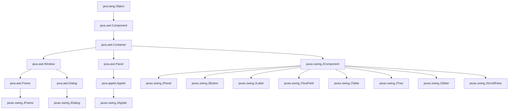
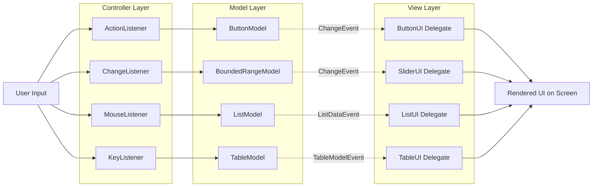
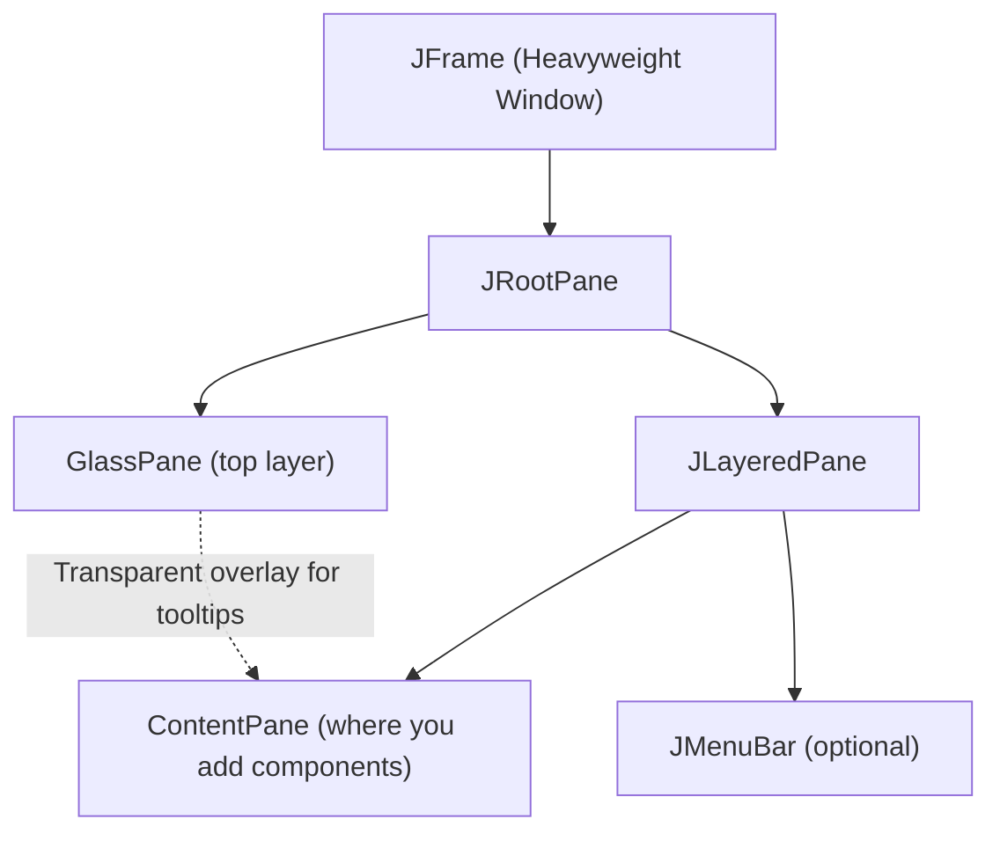
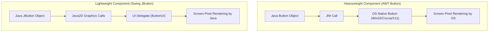
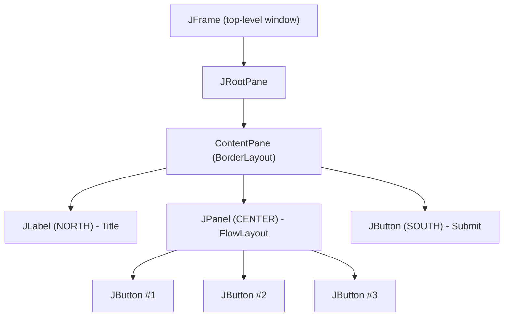

# Swings Fundamentals: Overview of AWT, Swing vs AWT, Swing Key Features, Model-View-Controller (MVC) architecture

<!-- SECTION_1_START -->
# Swings Fundamentals: AWT, Swing, and MVC Architecture

> [!NOTE]
> **KTU 2024 Module Focus (PBCST304 - OOP):** This topic lays the foundation for understanding how Java handles Graphical User Interface (GUI) development. It bridges the legacy **AWT (Abstract Window Toolkit)** with the modern, lightweight **Swing Framework**, and introduces the **Model-View-Controller (MVC)** architectural pattern — a cornerstone for building maintainable, decoupled software systems.

---

## 1.1 Overview of AWT (Abstract Window Toolkit)

### Formal Definition
**AWT (Abstract Window Toolkit)** is the original platform-dependent GUI toolkit provided by Java (from JDK 1.0). It is a part of `java.awt` package and is used to build GUI components such as windows, buttons, scrollbars, and text fields. AWT components are **heavyweight** — meaning each component is backed by a peer component in the underlying Operating System (OS).

### Intuitive Analogy
Think of AWT like a **translator who speaks only two languages — English and the OS's native tongue**. When you create a `Button` in AWT, Java asks the OS (Windows, macOS, Linux) to draw a "real" button using the OS's own look-and-feel. The button you see is essentially the **OS's button wearing a Java mask**. Because every OS has a different style, your program looks different on every machine.

> [!IMPORTANT]
> **Key Syllabus Highlight:** AWT components are **heavyweight** (depend on native peers), whereas Swing components are **lightweight** (drawn entirely by Java). This single distinction is the most frequently asked concept in KTU exams.

---

## 1.2 Overview of Swing

### Formal Definition
**Swing** is a part of the Java Foundation Classes (JFC) and resides in the `javax.swing` package. Introduced in JDK 1.2, Swing is built **on top of AWT** but provides a rich set of **lightweight, platform-independent** GUI components. Almost every AWT component has a Swing counterpart prefixed with the letter **'J'** (e.g., `Button` → `JButton`, `TextField` → `JTextField`).

### Intuitive Analogy
Imagine Swing as a **master painter who travels with his own canvas and paints**. No matter what country (OS) the painter visits, he paints the same picture. Swing components are drawn entirely by Java's own rendering engine — they don't rely on the OS for their look. This is why Swing applications look **identical** across Windows, macOS, and Linux.

### Core Difference at a Glance

| Aspect | AWT | Swing |
|---|---|---|
| Package | `java.awt` | `javax.swing` |
| Component Class Prefix | `Button`, `Frame` | `JButton`, `JFrame` |
| Component Weight | **Heavyweight** (native peer) | **Lightweight** (pure Java) |
| Platform Dependency | Yes (OS look-and-feel) | No (consistent look) |
| Pluggable Look & Feel | No | Yes (`Metal`, `Nimbus`, `System`) |
| MVC Support | Limited | Full |

---

## 1.3 Swing Key Features (Board-Favorite)

> [!NOTE]
> **Syllabus Mandate:** Students must enumerate the **6 key features** of Swing. These are high-yield questions (3 marks) in KTU exams.

1. **Lightweight Components** — Drawn by Java, not the OS.
2. **Pluggable Look-and-Feel (PLAF)** — Change the appearance dynamically (`UIManager.setLookAndFeel(...)`).
3. **Rich Component Set** — `JTable`, `JTree`, `JTabbedPane`, `JSlider`, `JProgressBar`, etc.
4. **MVC Architecture** — Each component separates its data, display, and control logic.
5. **Double Buffering** — Built-in support eliminates flickering during repaints.
6. **KeyBindings & Accessibility** — Robust keyboard handling and assistive technology support.

### GeoGebra / Desmos Integration

> [!VISUALIZATION CONTROL]
> **Concept:** Hierarchical visualization of Swing's component tree rooted at `java.awt.Component`
> **Visual Description:** Picture a pyramid with `Container` at the top, branching down into `JComponent` (Swing side, lightweight) and `Window`/`Panel` (AWT side, heavyweight). The Swing branch is much larger because it has hundreds of components.

---

## 1.4 Model-View-Controller (MVC) Architecture

### Formal Definition
**MVC** is a software architectural pattern that decouples an application into **three interconnected components**: the **Model** (data + business logic), the **View** (UI presentation), and the **Controller** (input handling + flow coordination). Swing implements a variant of MVC to ensure that changes in data can be reflected in the UI without tightly coupling the components.

### Intuitive Analogy
Think of a **restaurant**:
- **Model** = the **Kitchen** (holds the actual data — ingredients, recipes, dish state).
- **View** = the **Plated Dish** (the visual presentation the customer sees).
- **Controller** = the **Waiter** (takes the order from the customer, relays it to the kitchen, and brings the plated dish back).

The customer never enters the kitchen, and the kitchen never decides plating. They communicate **only** through the waiter. This is MVC — strict separation of concerns.

### The MVC Triad

$$
\text{MVC} = \underbrace{M}_{\text{Model}} + \underbrace{V}_{\text{View}} + \underbrace{C}_{\text{Controller}}
$$

| Component | Responsibility | Swing Example |
|---|---|---|
| **Model** | Stores data, fires change events | `ButtonModel`, `ListModel`, `TableModel` |
| **View** | Renders the UI representation | `BasicButtonUI`, `JButton` (default view) |
| **Controller** | Handles user input, updates Model | `BasicButtonListener` |

> [!IMPORTANT]
> **KTU 2024 Note:** Swing's `JButton` uses a **separated architecture** — the **Model** (`ButtonModel` interface) and **View+Controller** (the `JButton` UI delegate) are decoupled. This is why you can attach the same model to multiple views.

<!-- SECTION_1_END -->

<!-- SECTION_2_START -->
# Deep Theoretical Analysis & KTU High-Yield Formula Sheet

## 2.1 AWT Class Hierarchy (Why It Matters)

Understanding the hierarchy is critical because **Swing extends AWT** — it does not replace it. Swing's root component `JComponent` inherits from `java.awt.Container`, which inherits from `java.awt.Component`. This means Swing *uses* AWT's event-handling and windowing infrastructure while replacing the rendering layer.

### Top-Level Containers (Heavyweight)
These inherit from `java.awt.Window` and are the **only heavyweight** Swing components because they must interact with the OS window manager:
- `JFrame` (a top-level window with title bar and borders)
- `JDialog` (a pop-up window)
- `JApplet` (embedded in a browser — deprecated since JDK 9)

### Lightweight Containers
- `JPanel` — Generic container for grouping components.
- `JScrollPane` — Adds scrollbars automatically.
- `JTabbedPane`, `JSplitPane`, `JToolBar` — Specialized layout containers.

---

## 2.2 Why AWT is "Heavyweight" and Swing is "Lightweight"

> [!NOTE]
> This distinction is the **#1 favorite 2-mark question** in KTU exams. Master the difference.

### Heavyweight (AWT)
A **peer** is a native OS component that mirrors the Java component. When Java creates an AWT `Button`, it calls a JNI (Java Native Interface) method to create the actual OS button. The Java object is just a *handle* to the native object.

**Consequences of heavyweight design:**
- The component's appearance is bound to the **OS's look-and-feel** (a Windows button looks like a Windows button).
- Components **cannot overlap transparently** — the OS draws the most recently painted component on top, causing Z-order issues.
- More **memory consumption** due to dual objects (Java + native).
- Slower rendering on low-end systems.

### Lightweight (Swing)
Swing components have **no native peer**. They are drawn pixel-by-pixel by Java's own `javax.swing.plaf` (Look-And-Feel) package using Java 2D API calls. The component's "look" is painted inside its parent container's drawing area.

**Consequences of lightweight design:**
- **Consistent appearance** across all platforms.
- Components **can overlap** freely (e.g., a `JButton` can be placed on top of an image inside a `JPanel`).
- Lower memory footprint and faster instantiation.
- **Disadvantage:** Top-level containers (`JFrame`, `JDialog`) MUST still be heavyweight because the OS must manage the window itself.

### The "Root Pane" Solution
Since Swing's `JFrame` is heavyweight but its contents are lightweight, Java uses a special intermediate called the **Root Pane** (`JRootPane`). The Root Pane manages four layers:
- `glassPane` (top, for tooltips and overlays)
- `contentPane` (where you add components via `add()`)
- `layeredPane` (organizes Z-ordering)

> [!IMPORTANT]
> **Common Mistake:** Students often call `frame.add(button)` directly. In modern Swing, this works because `JFrame` overrides `add()` to delegate to the content pane, but in **AWT, you call `frame.add()` directly** on the Frame. This is a frequently tested distinction.

---

## 2.3 Model-View-Controller (MVC) — Deep Dive

### The Three Roles in Detail

**1. Model (The Data + Logic)**
- Holds the **state** of the component (e.g., is a checkbox selected? what is the text in a text field?).
- Notifies registered listeners when state changes.
- **Knows nothing** about the View or Controller.
- In Swing, models are usually **interfaces** (e.g., `ButtonModel`, `BoundedRangeModel`, `ListModel`).

**2. View (The Visual Representation)**
- Reads data **from the Model** to draw the component.
- Listens to Model change events and repaints when notified.
- In Swing, this is the **UI Delegate** (e.g., `BasicButtonUI`, `MetalButtonUI`).

**3. Controller (The Input Handler)**
- Translates user actions (mouse clicks, key presses) into operations on the Model.
- In Swing, the Controller is split between:
  - The **UI Delegate** (handles mouse/keyboard on the component itself).
  - The **Application Code** (the `ActionListener` you attach to the button).

### Data Flow in MVC

$$
\text{User Input} \xrightarrow{\text{Controller}} \text{Model Update} \xrightarrow{\text{Event}} \text{View Repaint}
$$

### Swing's Specific Implementation
Swing uses a **"separable model"** architecture:
- The **Model** is a **pluggable interface** — you can swap in a custom model.
- The **View + Controller** are bundled into a single object called the **UI Delegate** (an object implementing the `ComponentUI` class).

For `JButton`:
- Model = `ButtonModel` (tracks pressed/armed/selected/rollover state, mnemonic, action command).
- View + Controller = `ButtonUI` (paints the button, handles mouse events, triggers ActionEvent).
- The `JButton` itself acts as a **thin facade** that forwards calls to the UI delegate and model.

### Why MVC Matters in KTU Exams
- It demonstrates **separation of concerns** — a core OOP principle.
- It enables **multiple views of the same model** (e.g., a `JSlider` and `JTextField` both displaying the same `BoundedRangeModel`).
- It supports **testability** — you can unit-test the Model without instantiating any GUI.

---

## 2.4 KTU Formula Sheet & High-Yield Tables

### Table 2.1: AWT vs Swing — Comprehensive Comparison (Board-Favorite)

| Feature | AWT | Swing |
|---|---|---|
| Package | `java.awt` | `javax.swing` |
| Class Prefix | `Button`, `TextField`, `Frame` | `JButton`, `JTextField`, `JFrame` |
| Peer Dependency | Yes (native OS component) | No (pure Java) |
| Component Weight | **Heavyweight** | **Lightweight** (except top-level) |
| Look & Feel | OS-dependent (fixed) | **Pluggable** (Metal, Nimbus, System, Motif) |
| MVC Architecture | Partial / Limited | **Full Implementation** |
| Component Set | ~15 basic components | 400+ rich components (`JTable`, `JTree`, etc.) |
| Performance | Faster (native) | Slightly slower (pure Java) |
| Memory Usage | Higher (peer objects) | Lower |
| Z-ordering | Limited (no overlap) | Full overlap support |
| Event Handling | Delegation Event Model | Same AWT Event Model (inherited) |
| Introduced | JDK 1.0 (1996) | JDK 1.2 (1998) as part of JFC |

### Table 2.2: MVC Component Mapping in Common Swing Components

| Swing Component | Model Interface | View Class (UI Delegate) |
|---|---|---|
| `JButton` | `ButtonModel` | `ButtonUI` |
| `JToggleButton` | `ButtonModel` | `ToggleButtonUI` |
| `JCheckBox` | `ButtonModel` | `CheckBoxUI` |
| `JRadioButton` | `ButtonModel` | `RadioButtonUI` |
| `JScrollBar` | `BoundedRangeModel` | `ScrollBarUI` |
| `JSlider` | `BoundedRangeModel` | `SliderUI` |
| `JList` | `ListModel` | `ListUI` |
| `JComboBox` | `ComboBoxModel` | `ComboBoxUI` |
| `JTextField` | `Document` | `TextUI` |
| `JTable` | `TableModel` | `TableUI` |
| `JTree` | `TreeModel` | `TreeUI` |

### Table 2.3: Key Swing Methods and Their Purpose

| Method | Purpose | Example |
|---|---|---|
| `setLayout(LayoutManager)` | Sets layout for container | `panel.setLayout(new FlowLayout())` |
| `add(Component)` | Adds component to container | `frame.add(button)` |
| `setSize(int, int)` / `setPreferredSize(Dimension)` | Sets component size | `btn.setPreferredSize(new Dimension(100, 30))` |
| `setVisible(boolean)` | Shows/hides component | `frame.setVisible(true)` |
| `setDefaultCloseOperation(int)` | Window close behavior | `frame.setDefaultCloseOperation(JFrame.EXIT_ON_CLOSE)` |
| `UIManager.setLookAndFeel(String)` | Changes LAF | `UIManager.setLookAndFeel("javax.swing.plaf.nimbus.NimbusLookAndFeel")` |

### Table 2.4: Key Constants and Their Meanings

| Constant | Value | Meaning |
|---|---|---|
| `JFrame.EXIT_ON_CLOSE` | `3` | Exit app on close |
| `JFrame.DISPOSE_ON_CLOSE` | `2` | Dispose window on close |
| `JFrame.HIDE_ON_CLOSE` | `1` | Hide window on close (default) |
| `JFrame.DO_NOTHING_ON_CLOSE` | `0` | Ignore close event |
| `SwingConstants.CENTER` | `0` | Center alignment |

---

## 2.5 Real-World Engineering Utility

MVC is **not just a Swing concept** — it is the foundation of:
- **Web Development:** Django (MVT variant), Ruby on Rails, Spring MVC, ASP.NET MVC.
- **Mobile Apps:** iOS (UIKit + SwiftUI), Android (Jetpack Compose follows MVC/MVVM).
- **Frontend Frameworks:** React (View + State), Angular (full MVC/MVVM), Vue.js.
- **Enterprise Java:** JavaServer Faces (JSF) is built directly on Swing's MVC pattern.

Understanding Swing's MVC is, therefore, a **gateway skill** to modern enterprise architecture. In KTU's OOP course, the goal is to teach you to **decouple concerns** — and MVC is the canonical example of this OOP principle in action.

<!-- SECTION_2_END -->

<!-- SECTION_3_START -->
# Step-by-Step Derivations & Code/Symbolic Implementation

## 3.1 AWT Program — Step-by-Step Construction

The following AWT program creates a simple window with a button. **Every line is annotated** as required by the KTU board.

```java
import java.awt.Button;          // Step 1: Import AWT Button class
import java.awt.Frame;           // Step 2: Import AWT Frame (top-level window)
import java.awt.FlowLayout;      // Step 3: Import FlowLayout manager

public class AWTButtonDemo {
    public static void main(String[] args) {
        // Step 4: Create the Frame (a top-level AWT container)
        Frame frame = new Frame("AWT Demo - KTU 2024");
        
        // Step 5: Set the layout manager
        frame.setLayout(new FlowLayout());
        
        // Step 6: Create the AWT Button (HEAVYWEIGHT — backed by OS peer)
        Button btn = new Button("Click Me (AWT)");
        
        // Step 7: Add the button to the frame
        frame.add(btn);
        
        // Step 8: Set the size of the frame
        frame.setSize(300, 200);
        
        // Step 9: Make the frame visible
        frame.setVisible(true);
    }
}
```

### Line-by-Line Logical Explanation
1. **Line 1-3:** Import the required AWT classes from `java.awt`. AWT does **not** require the `javax.swing` import.
2. **Line 4-5:** The `main` method is the program entry point. Java looks for `public static void main(String[])` to begin execution.
3. **Line 8:** `new Frame("AWT Demo - KTU 2024")` creates a new OS-level window. The string argument becomes the **window title bar** text.
4. **Line 11:** `setLayout(new FlowLayout())` assigns a layout manager. `FlowLayout` places components left-to-right, top-to-bottom (like text in a paragraph).
5. **Line 14:** `new Button(...)` creates a **heavyweight** button. Internally, Java calls native code to create the OS's button.
6. **Line 17:** `frame.add(btn)` attaches the button to the frame. In AWT, components are added **directly** to the Frame.
7. **Line 20-23:** `setSize(300, 200)` sets pixel dimensions; `setVisible(true)` makes the window appear on screen.

> [!IMPORTANT]
> **Note:** This AWT program will look **different** on Windows, macOS, and Linux because each OS provides its own button rendering.

---

## 3.2 Equivalent Swing Program — Step-by-Step Construction

```java
import javax.swing.JButton;       // Step 1: Import Swing JButton
import javax.swing.JFrame;        // Step 2: Import Swing JFrame
import java.awt.FlowLayout;       // Step 3: FlowLayout is in AWT (Swing reuses it)

public class SwingButtonDemo {
    public static void main(String[] args) {
        // Step 4: Create the JFrame (Swing's top-level window)
        JFrame frame = new JFrame("Swing Demo - KTU 2024");
        
        // Step 5: Set the default close operation (AWT requires manual listener)
        frame.setDefaultCloseOperation(JFrame.EXIT_ON_CLOSE);
        
        // Step 6: Get the content pane (where components are placed)
        // Note: frame.getContentPane().setLayout() — or use frame.setLayout() which delegates automatically
        frame.setLayout(new FlowLayout());
        
        // Step 7: Create the JButton (LIGHTWEIGHT — pure Java rendering)
        JButton btn = new JButton("Click Me (Swing)");
        
        // Step 8: Add the button to the content pane
        frame.add(btn);
        
        // Step 9: Use pack() to size the window based on preferred sizes
        frame.pack();
        
        // Step 10: Center the window on screen
        frame.setLocationRelativeTo(null);
        
        // Step 11: Make the frame visible
        frame.setVisible(true);
    }
}
```

### Line-by-Line Logical Explanation
1. **Line 1-2:** Import Swing classes from `javax.swing`. Note the **'J' prefix** on every Swing component.
2. **Line 9:** `setDefaultCloseOperation(JFrame.EXIT_ON_CLOSE)` — AWT does not have this; you must add a `WindowListener` manually. This single line handles the entire "click X to close" behavior.
3. **Line 12:** In Swing, `setLayout` works on `JFrame` because `JFrame` overrides the `setLayout` method to delegate to the content pane. This is a **convenience wrapper** added in newer JDK versions.
4. **Line 15:** `new JButton(...)` creates a **lightweight** button. No native peer is created.
5. **Line 21:** `frame.pack()` calculates the window size based on each contained component's **preferred size**. This is the recommended way to size Swing windows.
6. **Line 24:** `setLocationRelativeTo(null)` centers the window on the screen (passing `null` means use the default screen).

---

## 3.3 MVC Implementation — Custom Model Example

The following example demonstrates a **JSlider** and a **JLabel** sharing the **same `BoundedRangeModel`**. This is a textbook demonstration of MVC: the Model is shared, but the View is duplicated.

```java
import javax.swing.*;
import javax.swing.event.ChangeEvent;
import javax.swing.event.ChangeListener;

public class MVCSharedModelDemo {
    public static void main(String[] args) {
        // Step 1: Create a shared BoundedRangeModel (the MODEL)
        // Parameters: value, extent, min, max
        BoundedRangeModel sharedModel = new DefaultBoundedRangeModel(50, 0, 0, 100);
        
        // Step 2: Create the JFrame
        JFrame frame = new JFrame("MVC Demo - Shared Model");
        frame.setDefaultCloseOperation(JFrame.EXIT_ON_CLOSE);
        frame.setLayout(new java.awt.GridLayout(3, 1, 10, 10));
        
        // Step 3: Create View #1 — a JSlider bound to the shared model
        JSlider slider = new JSlider(sharedModel);
        
        // Step 4: Create View #2 — a JLabel that mirrors the model's value
        JLabel label = new JLabel("Value: " + sharedModel.getValue(), SwingConstants.CENTER);
        
        // Step 5: Create the CONTROLLER — a ChangeListener that updates the label
        ChangeListener controller = new ChangeListener() {
            @Override
            public void stateChanged(ChangeEvent e) {
                // Controller updates the View (label) when Model changes
                label.setText("Value: " + sharedModel.getValue());
            }
        };
        
        // Step 6: Register the controller on BOTH views
        slider.addChangeListener(controller);
        sharedModel.addChangeListener(controller);
        
        // Step 7: Add components to the frame
        frame.add(new JLabel("Slide to change the model:", SwingConstants.CENTER));
        frame.add(slider);
        frame.add(label);
        
        // Step 8: Display the frame
        frame.pack();
        frame.setSize(350, 200);
        frame.setLocationRelativeTo(null);
        frame.setVisible(true);
    }
}
```

### Line-by-Line Logical Explanation
1. **Line 11:** `DefaultBoundedRangeModel` is the default **Model** implementation. The constructor `(50, 0, 0, 100)` means: current value = 50, extent = 0, minimum = 0, maximum = 100.
2. **Line 14-15:** The `JFrame` uses a `GridLayout(3, 1, 10, 10)` — 3 rows, 1 column, with 10px horizontal and vertical gaps.
3. **Line 18:** `new JSlider(sharedModel)` constructs a slider **bound to our model**. This is the "V" in MVC — it renders the model's current value visually.
4. **Line 21:** A `JLabel` is created showing the initial value. It will become a **second view** of the same model.
5. **Line 24-30:** The anonymous `ChangeListener` is the **Controller**. When the model changes, the controller fires and updates the label.
6. **Line 33-34:** We register the controller on **both the slider's events** AND the **model's events**. Registering on the model ensures the label updates even if the model is changed programmatically.
7. **Line 41-43:** `pack()` calculates sizes; `setVisible(true)` displays the window.

> [!IMPORTANT]
> **KTU Board Insight:** When you drag the slider, the **Model** updates, fires a `ChangeEvent`, and both the **slider (repaints itself)** and the **label (text updates)** respond. This is MVC in action — one model, two views, one controller.

---

## 3.4 Pluggable Look-and-Feel Demonstration

```java
import javax.swing.*;

public class PLFAFDemo {
    public static void main(String[] args) {
        try {
            // Step 1: Set the look-and-feel to Nimbus (modern cross-platform LAF)
            UIManager.setLookAndFeel("javax.swing.plaf.nimbus.NimbusLookAndFeel");
        } catch (Exception e) {
            System.err.println("Nimbus LAF not available, using default.");
        }
        
        // Step 2: Create the frame
        JFrame frame = new JFrame("Pluggable Look-and-Feel Demo");
        frame.setDefaultCloseOperation(JFrame.EXIT_ON_CLOSE);
        frame.setLayout(new java.awt.FlowLayout());
        
        // Step 3: Add some Swing components
        frame.add(new JButton("Nimbus Button"));
        frame.add(new JCheckBox("Nimbus Checkbox"));
        frame.add(new JTextField("Nimbus TextField", 15));
        frame.add(new JLabel("Nimbus Label"));
        
        // Step 4: Display
        frame.pack();
        frame.setLocationRelativeTo(null);
        frame.setVisible(true);
    }
}
```

### Logical Explanation
- **Line 6:** `UIManager.setLookAndFeel(...)` is a **static** call that globally changes the LAF for all subsequently created Swing components.
- **Lines 8-9:** AWT has **no equivalent** — you cannot change an AWT button's appearance. This is the **key advantage** of Swing's lightweight design.
- **Available LAFs:** `Metal` (default cross-platform), `Nimbus` (modern), `System` (matches OS), `Motif` (legacy Unix), `GTK` (Linux).

---

## 3.5 Conceptual Derivation: Why MVC Decouples Data and Display

Starting from the OOP principle of **separation of concerns**, we derive MVC:

$$
\text{Class with mixed concerns} = \underbrace{\text{Data Storage}}_{\text{Model}} + \underbrace{\text{Display Logic}}_{\text{View}} + \underbrace{\text{Input Handling}}_{\text{Controller}}
$$

**Refactoring step 1 — Extract data into a Model class:**

$$
\text{Model} = \text{State} + \text{State-change notifications (events)}
$$

**Refactoring step 2 — Extract display into a View class:**

$$
\text{View} = \text{Subscribe to Model events} + \text{Render on notification}
$$

**Refactoring step 3 — Extract input handling into a Controller class:**

$$
\text{Controller} = \text{Receive user input} \rightarrow \text{Update Model}
$$

**Final composition:**

$$
\text{MVC} = \text{Model} \xleftrightarrow{\text{events}} \text{View} \quad \wedge \quad \text{Controller} \xrightarrow{\text{mutates}} \text{Model}
$$

This derivation makes it clear that MVC is **not invented** but **discovered** as the natural way to satisfy the OOP principle "a class should have one reason to change."

<!-- SECTION_3_END -->

<!-- SECTION_4_START -->
# Structural Diagrams & Schematics

## 4.1 AWT vs Swing Component Hierarchy (Mermaid)



**Visualization Reading Guide:**
- The **left branch** (A4 → A7, A8) represents AWT's heavyweight components.
- The **right branch** (A6 onwards) represents Swing's lightweight components.
- Notice that `JComponent` (Swing's lightweight root) inherits from `Container` (AWT), confirming that **Swing extends AWT** rather than replacing it.

---

## 4.2 MVC Architecture Flow Diagram



**Visualization Reading Guide:**
- **Solid arrows** denote the **flow of data/mutations** (Controller → Model).
- **Dotted arrows** denote the **flow of notifications** (Model → View).
- This **unidirectional** flow is the defining characteristic of MVC.

---

## 4.3 Swing's Root Pane Architecture



**Visualization Reading Guide:**
- The **Glass Pane** is invisible by default and floats above the content pane. It's used for tooltips, drag-and-drop overlays, and custom painting.
- The **Layered Pane** organizes Z-ordering of components.
- The **Content Pane** is where 99% of your components live.
- The **Menu Bar** is optional and appears at the top of the window.

---

## 4.4 Heavyweight vs Lightweight Comparison (Sequential Processing Topology)



**Visualization Reading Guide:**
- **Heavyweight path:** Java → JNI → OS native code → screen (4 stages).
- **Lightweight path:** Java → Java2D → screen (3 stages, no OS dependency).
- The lightweight path is **slower per-pixel** but **faster in setup time** (no native allocation).

---

## 4.5 Component Composition Tree Example



**Visualization Reading Guide:**
- A typical Swing application has **nested containers** to organize UI logically.
- The `JPanel` in the **CENTER** acts as a sub-container with its own `FlowLayout`.
- This composition is the foundation of all real-world Swing GUIs.

<!-- SECTION_4_END -->

<!-- SECTION_5_START -->
# KTU 2024 Scheme Examination Question Bank & Topic Recap

---

## 5.1 Part A Questions (3 Marks Each — Short Answer)

### Question 1
**[KTU University Exam — Dec 2023]** Define the following terms with respect to Java GUI programming:
- (i) AWT
- (ii) Swing
- (iii) Pluggable Look-and-Feel

**Course Outcome:** CO3 | **RBT Level:** Remember | **Marks:** 3

### Model Answer
**(i) AWT (Abstract Window Toolkit):** AWT is the original platform-dependent GUI toolkit in Java, available in the `java.awt` package. It provides a basic set of components (Button, TextField, Frame) that are **heavyweight** — each component is backed by a native OS peer component via JNI calls. AWT components inherit the look-and-feel of the host operating system, resulting in different appearances on different platforms. [1 Mark]

**(ii) Swing:** Swing is a part of the Java Foundation Classes (JFC), available in the `javax.swing` package. It provides a rich set of **lightweight, platform-independent** GUI components that are drawn entirely by Java using the Java 2D API. Swing components are prefixed with the letter **'J'** (e.g., `JButton`, `JFrame`) and offer pluggable look-and-feel support. [1 Mark]

**(iii) Pluggable Look-and-Feel (PLAF):** PLAF is a Swing feature that allows the application's appearance to be changed dynamically at runtime without modifying the source code. Examples include `Metal` (default cross-platform), `Nimbus` (modern), `System` (matches host OS), and `Motif` (legacy). PLAF is implemented via the `UIManager.setLookAndFeel(String)` method. [1 Mark]

---

### Question 2
**[KTU University Exam — July 2024]** Differentiate between heavyweight and lightweight components in Java. Give one example of each.

**Course Outcome:** CO3 | **RBT Level:** Understand | **Marks:** 3

### Model Answer
| Aspect | Heavyweight | Lightweight |
|---|---|---|
| **Native Peer** | Has a corresponding native OS component | No native peer; drawn by Java |
| **OS Dependency** | Appearance depends on OS | Consistent across platforms |
| **Performance** | Faster rendering (native) | Slightly slower (pure Java) |
| **Memory** | Higher (Java + native objects) | Lower |
| **Example** | `java.awt.Button`, `java.awt.Frame` | `javax.swing.JButton`, `javax.swing.JPanel` |

**Example of Heavyweight:** `java.awt.Button` — When created, Java calls a JNI method to create a native Windows/macOS/Linux button. [1 Mark]

**Example of Lightweight:** `javax.swing.JButton` — Drawn entirely by Java using `javax.swing.plaf.basic.BasicButtonUI`. [1 Mark]

**Note:** All Swing top-level containers (`JFrame`, `JDialog`, `JApplet`) are heavyweight because they must interact with the OS window manager. Only the components *inside* them are lightweight. [1 Mark]

---

## 5.2 Part B Questions (14 Marks Each — Full Solutions)

### Question A (Choice 1)

**[KTU University Exam — Dec 2023, Model Paper]** Explain the **Model-View-Controller (MVC) architecture** as implemented in Swing. With a suitable code example, demonstrate how the **same Model can be shared between multiple Views**.

**Course Outcome:** CO3, CO4 | **RBT Level:** Apply (7) + Analyze (7) | **Marks:** 14

### Part (a) — Explain MVC Architecture in Swing (7 Marks)

#### Model Answer

**Definition:**
The **Model-View-Controller (MVC)** architecture is a design pattern that separates an application's concerns into three interconnected components: the **Model** (data and business logic), the **View** (UI presentation), and the **Controller** (input handling and flow coordination). Swing implements a variant of MVC where the View and Controller are often bundled into a single **UI Delegate** object. [2 Marks]

**The Three Components in Detail:**

**1. Model:**
- Stores the component's **state** (e.g., is a button pressed? what is the current value of a slider?).
- Notifies registered listeners when state changes via **change events** (e.g., `ChangeEvent`, `ListDataEvent`).
- Has **no knowledge** of the View or Controller.
- Implemented as **interfaces** in Swing (e.g., `ButtonModel`, `BoundedRangeModel`, `ListModel`). [2 Marks]

**2. View:**
- The **visual representation** of the Model's state.
- Renders the component on screen using the Java 2D API.
- **Subscribes** to Model change events and repaints itself when notified.
- In Swing, this is the **UI Delegate** (e.g., `BasicButtonUI`, `MetalButtonUI`). [1.5 Marks]

**3. Controller:**
- Translates **user input** (mouse clicks, key presses) into Model mutations.
- In Swing, the Controller is split:
  - The **UI Delegate** handles component-level events.
  - The **ActionListener** / `ChangeListener` (application code) handles business logic. [1.5 Marks]

---

#### Part (b) — Code Example: Shared Model Between Multiple Views (7 Marks)

```java
import javax.swing.*;
import javax.swing.event.ChangeEvent;
import javax.swing.event.ChangeListener;

public class SharedModelDemo {
    public static void main(String[] args) {
        // Create a SHARED MODEL (the "M" in MVC)
        final BoundedRangeModel sharedModel = 
            new DefaultBoundedRangeModel(50, 0, 0, 100);
        
        // Create the frame
        JFrame frame = new JFrame("MVC - Shared Model Demo");
        frame.setDefaultCloseOperation(JFrame.EXIT_ON_CLOSE);
        frame.setLayout(new java.awt.GridLayout(4, 1, 5, 5));
        
        // View #1: JSlider bound to the shared model
        JSlider slider = new JSlider(sharedModel);
        
        // View #2: JLabel mirroring the model
        final JLabel label = new JLabel("Current Value: 50", SwingConstants.CENTER);
        label.setFont(new java.awt.Font("Arial", java.awt.Font.BOLD, 18));
        
        // Controller: responds to model changes and updates the label
        ChangeListener controller = new ChangeListener() {
            @Override
            public void stateChanged(ChangeEvent e) {
                label.setText("Current Value: " + sharedModel.getValue());
            }
        };
        
        // Register controller on both views
        slider.addChangeListener(controller);
        sharedModel.addChangeListener(controller);
        
        // View #3: JProgressBar also bound to the SAME model
        JProgressBar progressBar = new JProgressBar(sharedModel);
        progressBar.setStringPainted(true);
        
        // Add components
        frame.add(new JLabel("Drag the slider:", SwingConstants.CENTER));
        frame.add(slider);
        frame.add(progressBar);
        frame.add(label);
        
        // Display
        frame.setSize(400, 250);
        frame.setLocationRelativeTo(null);
        frame.setVisible(true);
    }
}
```

#### Step-by-Step Code Walkthrough (Valuation Key)

**[Defining shared model: 1 Mark]**
```java
BoundedRangeModel sharedModel = new DefaultBoundedRangeModel(50, 0, 0, 100);
```
- Creates a single Model instance shared by 3 views: slider, progress bar, and label.

**[Creating View #1 (JSlider): 1 Mark]**
```java
JSlider slider = new JSlider(sharedModel);
```
- The slider is bound to `sharedModel` via the constructor that takes a `BoundedRangeModel`.

**[Creating View #2 (JLabel): 0.5 Marks]**
```java
JLabel label = new JLabel("Current Value: 50", SwingConstants.CENTER);
```
- The label will be updated by the controller.

**[Defining the Controller (ChangeListener): 2 Marks]**
```java
ChangeListener controller = new ChangeListener() {
    @Override
    public void stateChanged(ChangeEvent e) {
        label.setText("Current Value: " + sharedModel.getValue());
    }
};
```
- The anonymous class implements the Controller role. When the model changes, it updates the label's text.

**[Registering the controller on the model: 1 Mark]**
```java
sharedModel.addChangeListener(controller);
```
- This ensures the label updates whenever the model changes, regardless of how (slider drag or programmatic change).

**[Creating View #3 (JProgressBar): 1 Mark]**
```java
JProgressBar progressBar = new JProgressBar(sharedModel);
```
- A third view, also bound to the same model. As the slider moves, the progress bar fills and the label text updates **simultaneously**.

**[Final assembly and display: 0.5 Marks]**
```java
frame.setSize(400, 250);
frame.setLocationRelativeTo(null);
frame.setVisible(true);
```

#### Output Behavior
- Drag the slider → Model updates → Slider repaints + Progress bar fills + Label text updates.
- This demonstrates **one model, three views** — a key MVC advantage.

---

### Question B (Choice 2 — Alternative)

**[KTU University Exam — July 2024, Model Paper]**
- **(a)** Compare AWT and Swing in terms of architecture, component weight, look-and-feel, and event handling. (7 Marks)
- **(b)** Write a complete Java Swing program to create a window with a `JButton`, `JTextField`, and `JCheckBox`. The program should demonstrate **Pluggable Look-and-Feel** by switching to the Nimbus LAF. (7 Marks)

**Course Outcome:** CO3, CO4 | **RBT Level:** Understand (4) + Apply (3) | **Marks:** 14

#### Part (a) — AWT vs Swing Comparison (7 Marks)

| # | Feature | AWT | Swing |
|---|---|---|---|
| 1 | **Package** | `java.awt` | `javax.swing` |
| 2 | **Component Class Prefix** | No prefix (e.g., `Button`, `Frame`) | 'J' prefix (e.g., `JButton`, `JFrame`) |
| 3 | **Architecture** | Uses native OS components (peer-based) | Pure Java rendering (Java 2D API) |
| 4 | **Component Weight** | Heavyweight (native peer per component) | Lightweight (no native peer) — except top-level |
| 5 | **Look-and-Feel** | Fixed by the host OS | Pluggable (Metal, Nimbus, System, Motif) |
| 6 | **MVC Support** | Limited / partial | Full implementation (Model interfaces + UI Delegates) |
| 7 | **Component Set** | ~15 basic components | 400+ rich components (JTable, JTree, JTabbedPane, etc.) |
| 8 | **Event Handling** | Delegation Event Model (same as Swing) | Inherits AWT's Delegation Event Model |
| 9 | **Performance** | Faster individual component rendering | Slightly slower per-pixel, faster setup |
| 10 | **Memory Usage** | Higher (Java + native objects) | Lower |
| 11 | **Z-Order / Overlap** | Limited (cannot overlap freely) | Full overlap support |
| 12 | **Double Buffering** | Not built-in | Built-in (reduces flicker) |
| 13 | **Introduced In** | JDK 1.0 (1996) | JDK 1.2 (1998) — part of JFC |

**Valuation Key:**
- [Tabular comparison with at least 8 distinct points: 5 Marks]
- [Conclusion statement (e.g., "Swing supersedes AWT for modern GUI development"): 1 Mark]
- [Use of examples (e.g., `Button` vs `JButton`): 1 Mark]

#### Part (b) — Swing Program with PLAF (7 Marks)

```java
import javax.swing.*;
import java.awt.FlowLayout;

public class PLAFSwingDemo {
    public static void main(String[] args) {
        // Step 1: Set the Nimbus Look-and-Feel BEFORE creating components
        try {
            UIManager.setLookAndFeel("javax.swing.plaf.nimbus.NimbusLookAndFeel");
        } catch (UnsupportedLookAndFeelException | ClassNotFoundException 
                 | InstantiationException | IllegalAccessException e) {
            System.err.println("Nimbus LAF not available. Falling back to default.");
            // Fall back to cross-platform LAF
            try {
                UIManager.setLookAndFeel(UIManager.getCrossPlatformLookAndFeelClassName());
            } catch (Exception ex) {
                ex.printStackTrace();
            }
        }
        
        // Step 2: Create the JFrame (Swing's top-level window)
        JFrame frame = new JFrame("KTU Swing PLAF Demo - July 2024");
        frame.setDefaultCloseOperation(JFrame.EXIT_ON_CLOSE);
        frame.setLayout(new FlowLayout(FlowLayout.CENTER, 15, 15));
        
        // Step 3: Create various Swing components
        JLabel nameLabel = new JLabel("Enter your name:");
        JTextField nameField = new JTextField(15);
        JCheckBox agreeCheckbox = new JCheckBox("I agree to the terms", true);
        JButton submitButton = new JButton("Submit");
        JButton cancelButton = new JButton("Cancel");
        
        // Step 4: Add components to the frame
        frame.add(nameLabel);
        frame.add(nameField);
        frame.add(agreeCheckbox);
        frame.add(submitButton);
        frame.add(cancelButton);
        
        // Step 5: Display the frame
        frame.pack();
        frame.setLocationRelativeTo(null);
        frame.setVisible(true);
    }
}
```

**Valuation Key:**
- [Setting LAF with try-catch: 2 Marks]
- [Creating JFrame with proper close operation: 1 Mark]
- [Adding at least 3 different Swing components: 2 Marks]
- [Using `pack()` and `setLocationRelativeTo(null)`: 1 Mark]
- [Error handling for unavailable LAF: 1 Mark]

---

> [!WARNING]
> **KTU Examiner's Valuation Warning — Common Pitfalls:**
> 1. **Forgetting the 'J' prefix:** Students often write `Button` instead of `JButton` in Swing code. This causes a **compile-time error** and is the most common deduction. **Always use `JButton`, `JFrame`, `JTextField`, `JLabel`, `JCheckBox` for Swing.**
> 2. **Confusing AWT and Swing imports:** Writing `import java.awt.*;` instead of `import javax.swing.*;` (or vice versa) leads to using the wrong class. **`JButton` is in `javax.swing`, not `java.awt`.**
> 3. **Forgetting `setDefaultCloseOperation`:** In AWT, the window won't close without a custom `WindowListener`. In Swing, you MUST call `frame.setDefaultCloseOperation(JFrame.EXIT_ON_CLOSE)` or the program will hang.
> 4. **Calling `add()` on the wrong container:** In AWT, you add to the `Frame` directly. In Swing, you add to the `ContentPane` (or use the convenience wrapper `JFrame.add()` which delegates internally).
> 5. **Not explaining MVC properly:** The model is **not** the visual component. The Model is the **data structure** (e.g., `ButtonModel`). The `JButton` itself is the **View + Controller wrapper**. Confusing these roles loses 3-4 marks.
> 6. **Omitting the `pack()` call:** Using `setSize()` with hardcoded values is acceptable but discouraged. Examiners expect `pack()` for "best practice" credit.
> 7. **Missing the LAF class name in quotes:** The class name `"javax.swing.plaf.nimbus.NimbusLookAndFeel"` must be a **String literal**, not a class reference. Using `NimbusLookAndFeel.class.getName()` also works, but writing `NimbusLookAndFeel.class` directly is **wrong**.

---

## 5.3 Topic Recap & Important Things to Remember

> [!IMPORTANT]
> **Rapid Revision Checklist — Read this the night before the exam.**

### AWT Fundamentals
- AWT stands for **Abstract Window Toolkit** (`java.awt`).
- **Heavyweight** — uses native OS components via JNI.
- **Platform-dependent** appearance.
- ~15 basic components; limited functionality.
- No pluggable look-and-feel.

### Swing Fundamentals
- Part of **Java Foundation Classes (JFC)**; resides in `javax.swing`.
- **Lightweight** — drawn by Java using Java 2D API.
- **Platform-independent** appearance.
- 400+ components; rich set including `JTable`, `JTree`, `JTabbedPane`.
- **Pluggable Look-and-Feel** via `UIManager.setLookAndFeel(String)`.
- All Swing components are prefixed with **'J'**.
- Top-level containers (`JFrame`, `JDialog`, `JApplet`) are **still heavyweight** because they need the OS window manager.

### MVC Architecture
- **Model** = Data + state-change notifications (e.g., `ButtonModel`, `BoundedRangeModel`).
- **View** = UI rendering (e.g., `ButtonUI`, `SliderUI`).
- **Controller** = User input → Model mutations (e.g., `ActionListener`, `ChangeListener`).
- **Key advantage:** One Model can drive multiple Views (e.g., a `BoundedRangeModel` shared between a `JSlider` and a `JProgressBar`).
- **Swing's specific implementation:** "Separable Model Architecture" — the Model is an interface, the View+Controller is a single `UI Delegate` object.

### Key Differences (Memorize the Table)
- AWT is **old, heavyweight, OS-dependent**; Swing is **modern, lightweight, OS-independent**.
- AWT has **no PLAF**; Swing has **PLAF** (Metal, Nimbus, System, Motif, GTK).
- AWT has **~15 components**; Swing has **400+ components**.
- Both use the **same Delegation Event Model** (Swing inherits AWT's event system).

### Common Exam Traps
- `JButton` is in `javax.swing`, **not** `java.awt`.
- AWT's `Button` and Swing's `JButton` are **completely different classes** — no inheritance.
- Forgetting `setDefaultCloseOperation(JFrame.EXIT_ON_CLOSE)` causes the program to hang.
- `JFrame.add(component)` works because `JFrame` overrides `add()` to delegate to the content pane.
- AWT's `Frame` requires a manual `WindowListener` to handle close events.

### Essential Code Snippets to Remember
1. **Create a JFrame:**
   ```java
   JFrame f = new JFrame("Title");
   f.setDefaultCloseOperation(JFrame.EXIT_ON_CLOSE);
   f.setSize(400, 300);
   f.setVisible(true);
   ```
2. **Set Nimbus LAF:**
   ```java
   UIManager.setLookAndFeel("javax.swing.plaf.nimbus.NimbusLookAndFeel");
   ```
3. **Add a button to a frame:**
   ```java
   f.setLayout(new FlowLayout());
   f.add(new JButton("Click Me"));
   f.pack();
   ```
4. **Create a shared model and views:**
   ```java
   BoundedRangeModel m = new DefaultBoundedRangeModel(50, 0, 0, 100);
   JSlider s = new JSlider(m);
   JProgressBar p = new JProgressBar(m);
   ```
5. **Add a change listener (Controller):**
   ```java
   m.addChangeListener(e -> System.out.println(m.getValue()));
   ```

> **Final Exam Tip:** When asked to "compare AWT and Swing," always present your answer as a **table** with at least 8 rows. Tables are easier for examiners to grade and ensure you don't miss any points.

<!-- SECTION_5_END -->
