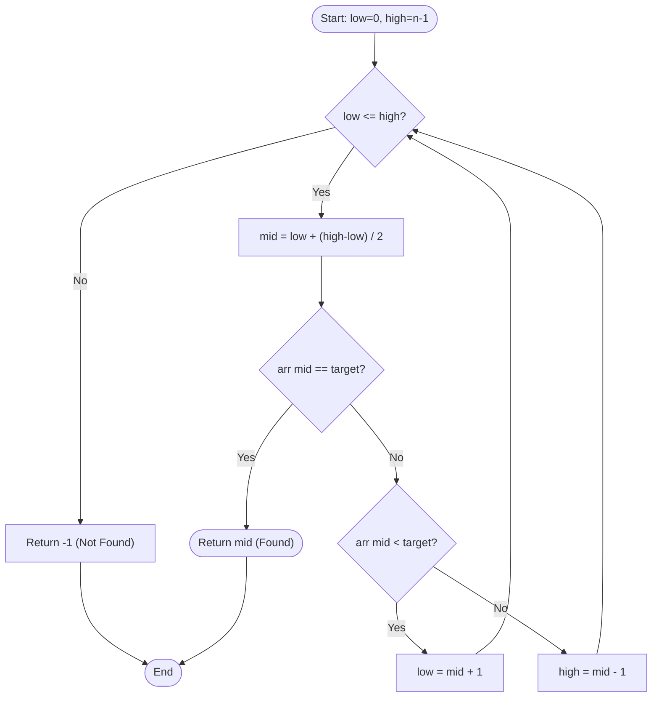
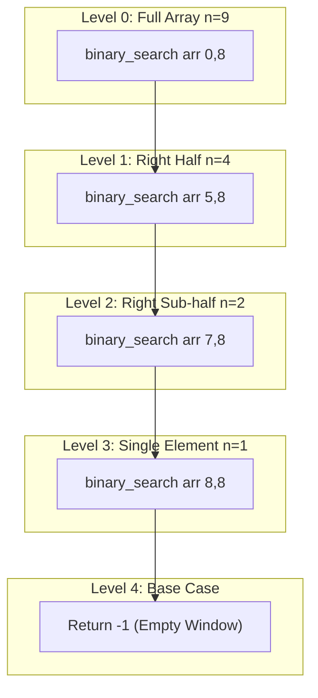
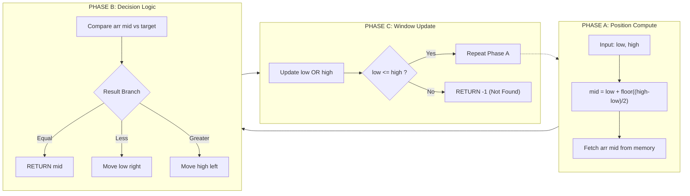
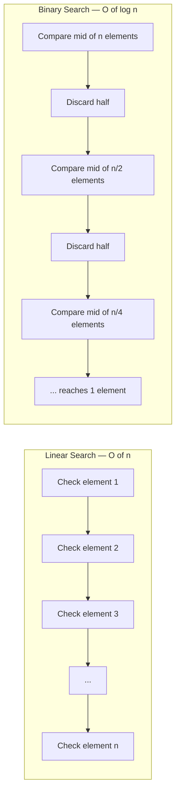

# Binary search

<!-- SECTION_1_START -->
# Binary Search — KTU 2024 Premium Study Notes

## 1. Core Technical Definition & Intuitive Overview

> [!IMPORTANT]
> **Formal Definition (KTU 2024 Syllabus Aligned):**
> **Binary Search** is a *divide-and-conquer* search algorithm that locates the position of a target value within a **pre-sorted (monotonic) array** by repeatedly halving the searchable interval. At every step, the middle element of the current interval is compared with the target. If the middle element equals the target, the search terminates successfully. If the middle element is smaller than the target, the search continues on the **right sub-array**; if larger, the search continues on the **left sub-array**.

### Conceptual Analogy / Intuition

Imagine you are searching for the word **"Mercury"** in a printed English dictionary of 1000 pages.

- You would **not** flip page by page from the start (that is *linear search*).
- You open roughly the **middle** of the dictionary. If the first word on that page is "Mango", you know Mercury is in the **second half** — so you discard the entire first half instantly.
- You open the middle of the remaining half. If the word is "Mountain", you discard the upper quarter.
- You repeat this **halving** until you land on Mercury.

This *halving process* is exactly what Binary Search does on a sorted array. Each comparison reduces the search space by a factor of **2**, giving the celebrated logarithmic runtime of **$O(\log_2 n)$**.

### Why Sorting is Non-Negotiable

> [!NOTE]
> Binary search **only works on sorted (ascending or descending) data structures**. If the data is unsorted, the algorithm's core assumption — *that the target lies in one specific half* — collapses, and the algorithm becomes mathematically invalid.

### Standard Metrics & Constants

| Metric | Value / Description |
|---|---|
| **Time Complexity (Best Case)** | $O(1)$ — target is at the middle index on the first comparison |
| **Time Complexity (Worst Case)** | $O(\log_2 n)$ — target absent or at an extreme end |
| **Time Complexity (Average Case)** | $O(\log_2 n)$ |
| **Space Complexity (Iterative)** | $O(1)$ — uses only constant extra variables |
| **Space Complexity (Recursive)** | $O(\log_2 n)$ — call stack depth |
| **Prerequisite Condition** | Array must be sorted in monotonic order |
| **Stable?** | N/A (searching, not sorting) |

> [!VISUALIZATION CONTROL]
> **Concept:** Halving visualization of binary search on a 16-element array
> **GeoGebra / Desmos Input Equations:**
> * `n = 16`
> * `step_0(x) = 16`
> * `step_1(x) = 8`
> * `step_2(x) = 4`
> * `step_3(x) = 2`
> * `step_4(x) = 1`
> **Visual Description:** A staircase plot where the y-axis shows the size of the remaining search space (n) and the x-axis shows the iteration count. The curve descends rapidly — from 16 → 8 → 4 → 2 → 1 — illustrating logarithmic reduction.

<!-- SECTION_1_END -->

<!-- SECTION_2_START -->
## 2. Deep Theoretical Analysis & KTU High-Yield Formula Sheet

### 2.1 Operational Logic — The Three-Stage Comparison Engine

The algorithm operates on three logical pillars at every iteration:

1. **Compute the midpoint index** of the current valid search window.
2. **Compare** the element at that midpoint with the target value.
3. **Discard exactly one half** of the window based on the comparison outcome, then repeat.

### 2.2 Mathematical Foundation of the Halving

Let the array size be **$n$**. After the first comparison, the search space reduces from $n$ to at most $\lfloor n/2 \rfloor$. After $k$ comparisons:

$$n_k = \left\lfloor \frac{n}{2^k} \right\rfloor$$

The algorithm terminates when the search space collapses to size **1** (or 0), i.e., $n_k = 1$:

$$\left\lfloor \frac{n}{2^k} \right\rfloor = 1 \quad \Rightarrow \quad 2^k \le n \quad \Rightarrow \quad k \le \log_2 n$$

Therefore, the maximum number of comparisons required is:

$$T(n) = \lceil \log_2 (n+1) \rceil \quad \text{(worst case)}$$

### 2.3 Midpoint Index — The Subtle Pitfall

The naive formula $mid = (low + high) / 2$ is **vulnerable to integer overflow** in languages with fixed-width integers (C, C++, Java for very large arrays). The KTU-recommended safe formulation is:

$$mid = low + \left\lfloor \frac{high - low}{2} \right\rfloor$$

### 2.4 KTU Formula Sheet / Cheat Sheet

| Concept | Formula / Expression | Description |
|---|---|---|
| Initial Search Window | $[low, high] = [0, n-1]$ | Full valid range |
| Midpoint Index | $mid = low + \lfloor (high - low)/2 \rfloor$ | Safe midpoint computation |
| Left Shrink Condition | $high = mid - 1$ when $arr[mid] > target$ | Target lies in left half |
| Right Shrink Condition | $low = mid + 1$ when $arr[mid] < target$ | Target lies in right half |
| Termination (Success) | $arr[mid] = target$ | Element found |
| Termination (Failure) | $low > high$ | Element absent |
| Worst-Case Comparisons | $\lceil \log_2(n+1) \rceil$ | Maximum iterations |
| Recurrence Relation | $T(n) = T(n/2) + 1$ | Master's theorem form |
| Asymptotic Bound | $O(\log_2 n)$ | Time complexity |

> [!NOTE]
> **Engineering Utility:** Binary search is the *backbone* of production systems — from database indexing (B-Trees are generalized binary searches), to Git's bisect command for finding buggy commits, to debugging performance regressions in code, to lookups in sorted datasets within OS kernels, to lower_bound/upper_bound operations in STL (C++) and Python's `bisect` module.

### 2.5 Decision Logic Flow (Per Iteration)

- If $arr[mid] = target$ → return $mid$ (success).
- Else if $arr[mid] < target$ → discard $arr[low \ldots mid]$ → set $low = mid + 1$.
- Else if $arr[mid] > target$ → discard $arr[mid \ldots high]$ → set $high = mid - 1$.
- If $low > high$ → return $-1$ (failure sentinel).

<!-- SECTION_2_END -->

<!-- SECTION_3_START -->
## 3. Step-by-Step Derivations & Code/Symbolic Implementation

### 3.1 Iterative Binary Search — Exhaustive Python Implementation

```python
"""
Binary Search - Iterative Implementation
Course: DATA STRUCTURES & ALGORITHMS LAB (PCCSL306)
Module: 1 - Basic and Linear Data Structures
KTU 2024 Scheme Aligned
"""

from typing import List, Tuple
import logging

# Configure structured error logging
logging.basicConfig(
    level=logging.INFO,
    format="%(asctime)s [%(levelname)s] %(message)s"
)


def binary_search_iterative(
    sorted_array: List[int],
    target: int
) -> Tuple[int, int]:
    """
    Performs iterative binary search on a sorted list.

    Parameters
    ----------
    sorted_array : List[int]
        A monotonically increasing sorted list of integers.
    target : int
        The value to search for.

    Returns
    -------
    Tuple[int, int]
        (index_of_target, comparisons_made)
        Returns (-1, comparisons) if target is absent.
    """
    # ---- BOUNDARY & VALIDATION CHECKS ----
    if not isinstance(sorted_array, list):
        logging.error("Input is not a list type.")
        raise TypeError("sorted_array must be of type list.")

    if len(sorted_array) == 0:
        logging.warning("Empty array passed. Returning -1.")
        return -1, 0

    # Verify sorted property (engineering safety net)
    for i in range(len(sorted_array) - 1):
        if sorted_array[i] > sorted_array[i + 1]:
            logging.error("Array is not sorted in ascending order.")
            raise ValueError("Binary search requires a sorted array.")

    # ---- CORE ALGORITHM ----
    low: int = 0
    high: int = len(sorted_array) - 1
    comparisons: int = 0

    logging.info(f"Initial window: low={low}, high={high}, target={target}")

    while low <= high:
        comparisons += 1

        # Safe midpoint (avoids overflow in low-level languages)
        mid: int = low + (high - low) // 2
        mid_value: int = sorted_array[mid]

        logging.info(
            f"  Iteration {comparisons}: low={low}, mid={mid}, "
            f"high={high}, arr[mid]={mid_value}"
        )

        if mid_value == target:
            logging.info(f"Target {target} found at index {mid}.")
            return mid, comparisons

        elif mid_value < target:
            # Target lies in the right half
            low = mid + 1

        else:
            # Target lies in the left half
            high = mid - 1

    logging.info(f"Target {target} not found after {comparisons} comparisons.")
    return -1, comparisons


# ---------- DEMONSTRATION DRIVER ----------
if __name__ == "__main__":
    sample: List[int] = [2, 5, 8, 12, 16, 23, 38, 56, 72, 91]
    test_targets: List[int] = [23, 2, 91, 100, 8]

    for t in test_targets:
        idx, comps = binary_search_iterative(sample, t)
        if idx != -1:
            print(f"Target {t:>4} -> Found at index {idx:>2} "
                  f"in {comps} comparison(s).")
        else:
            print(f"Target {t:>4} -> Not found      "
                  f"in {comps} comparison(s).")
```

### 3.2 Recursive Binary Search — Exhaustive Python Implementation

```python
def binary_search_recursive(
    sorted_array: List[int],
    target: int,
    low: int = 0,
    high: int = -1,
    depth: int = 0
) -> Tuple[int, int]:
    """
    Performs recursive binary search on a sorted list.
    Returns (index, total_comparisons).
    """
    # Initialise high on first call
    if high == -1:
        high = len(sorted_array) - 1

    # Base case: search window invalidated
    if low > high:
        logging.info(f"{'  ' * depth}Base case: low > high. Target absent.")
        return -1, 0

    # Compute midpoint
    mid: int = low + (high - low) // 2
    mid_value: int = sorted_array[mid]

    logging.info(
        f"{'  ' * depth}Recursion depth={depth}: "
        f"low={low}, mid={mid}, high={high}, arr[mid]={mid_value}"
    )

    # Base case: match found
    if mid_value == target:
        logging.info(f"{'  ' * depth}Match at index {mid}.")
        return mid, 1

    # Recursive cases
    if mid_value < target:
        idx, comps = binary_search_recursive(
            sorted_array, target, mid + 1, high, depth + 1
        )
    else:
        idx, comps = binary_search_recursive(
            sorted_array, target, low, mid - 1, depth + 1
        )

    return idx, 1 + comps
```

### 3.3 Mathematical Derivation of Worst-Case Comparisons

We derive $T(n) = \lceil \log_2(n+1) \rceil$ rigorously.

$$
\begin{aligned}
\text{Let } T(n) &= \text{maximum comparisons for an array of size } n. \\
\text{Recurrence: } T(n) &= 1 + T\!\left(\left\lfloor \frac{n-1}{2} \right\rfloor\right), \quad T(1) = 1. \\
\text{Unrolling the recurrence: } T(n) &= 1 + 1 + T\!\left(\left\lfloor \frac{n-1}{4} \right\rfloor\right) \\
&= 2 + T\!\left(\left\lfloor \frac{n-1}{4} \right\rfloor\right) \\
&\;\;\vdots \\
&= k + T\!\left(\left\lfloor \frac{n-1}{2^k} \right\rfloor\right) \\
\text{Termination when } \left\lfloor \frac{n-1}{2^k} \right\rfloor &\le 0, \text{ i.e., } 2^k \ge n+1. \\
\text{Smallest such } k &= \lceil \log_2(n+1) \rceil.
\end{aligned}
$$

Hence, $T(n) = \lceil \log_2(n+1) \rceil$.

### 3.4 Worked Example — Trace of Binary Search

**Input Array:** $[3, 7, 11, 15, 19, 23, 31, 42, 56]$, **Target:** $31$

| Step | $low$ | $high$ | $mid$ | $arr[mid]$ | Compare with 31 | Action |
|---|---|---|---|---|---|---|
| 1 | 0 | 8 | 4 | 19 | $19 < 31$ | $low = 5$ |
| 2 | 5 | 8 | 6 | 31 | $31 = 31$ | **Found at index 6** |

Total comparisons: **2** (best-case for this target).

**Input Array:** $[3, 7, 11, 15, 19, 23, 31, 42, 56]$, **Target:** $100$ (absent)

| Step | $low$ | $high$ | $mid$ | $arr[mid]$ | Compare with 100 | Action |
|---|---|---|---|---|---|---|
| 1 | 0 | 8 | 4 | 19 | $19 < 100$ | $low = 5$ |
| 2 | 5 | 8 | 6 | 31 | $31 < 100$ | $low = 7$ |
| 3 | 7 | 8 | 7 | 42 | $42 < 100$ | $low = 8$ |
| 4 | 8 | 8 | 8 | 56 | $56 < 100$ | $low = 9$ |
| 5 | 9 | 8 | — | — | $low > high$ | **Not found** |

Total comparisons: **4** = $\lceil \log_2(10) \rceil = 4$. ✔ Matches the formula.

### 3.5 Variant 1 — First Occurrence of a Target in a Sorted Array with Duplicates

```python
def find_first_occurrence(
    sorted_array: List[int],
    target: int
) -> int:
    """
    Returns the lowest index i such that sorted_array[i] == target.
    Returns -1 if target is absent.
    """
    low, high = 0, len(sorted_array) - 1
    result: int = -1

    while low <= high:
        mid = low + (high - low) // 2
        if sorted_array[mid] == target:
            result = mid        # Record this, but keep searching left
            high = mid - 1     # ← key difference from standard binary search
        elif sorted_array[mid] < target:
            low = mid + 1
        else:
            high = mid - 1

    return result
```

### 3.6 Variant 2 — Count of Occurrences in $O(\log n)$

If we know the first and last occurrence indices, count = last - first + 1. Both can be found using binary search in $O(\log n)$, giving total $O(\log n)$ for the count.

> [!IMPORTANT]
> **Counting Occurrences in $O(\log n)$ Time:**
> $$ \text{count} = \text{last\_occurrence}(target) - \text{first\_occurrence}(target) + 1 $$
> This is a classic KTU question pattern — combining two binary searches.

### 3.7 Variant 3 — Lower Bound and Upper Bound (Python's `bisect` Style)

The `bisect_left(arr, x)` function returns the leftmost position where $x$ can be inserted to keep `arr` sorted — equivalent to "first occurrence $\ge x$". The `bisect_right(arr, x)` returns the position after all occurrences of $x$.

These operations are implemented internally using **modified binary search** and run in $O(\log n)$.

<!-- SECTION_3_END -->

<!-- SECTION_4_START -->
## 4. Structural Diagrams & Schematics

### 4.1 Mermaid Flowchart — Iterative Binary Search



### 4.2 Mermaid Block Diagram — Recursive Call Stack Decomposition



### 4.3 Sequential Processing Topology — Three Phases of a Single Search Iteration



### 4.4 Comparison Topology — Linear vs Binary Search



<!-- SECTION_4_END -->

<!-- SECTION_5_START -->
## 5. KTU 2024 Scheme Examination Question Bank & Topic Recap

### 5.1 Part A — Short Answer Questions (3 Marks Each)

---

**Q1. [KTU University Exam — July 2023]**
**CO1, Remember:**
*State the precondition required for binary search to work. Mention the time complexity in the worst case.*

> [!IMPORTANT]
> **Model Answer (3 Marks):**
> **[Precondition: 1 Mark]** Binary search requires the input array (or data structure) to be **sorted in monotonic order** (ascending or descending). Without sorting, the algorithm's correctness guarantee collapses because the decision to discard one half relies on the order property.
>
> **[Worst-case time complexity: 1 Mark]** The worst-case time complexity is $O(\log_2 n)$, where $n$ is the number of elements in the array.
>
> **[Reasoning: 1 Mark]** This is because at each comparison, the search space is reduced to half of its previous size, leading to a recurrence $T(n) = T(n/2) + 1$, which by the Master Theorem yields $\Theta(\log_2 n)$.

---

**Q2. [KTU University Exam — Dec 2022]**
**CO1, Understand:**
*Distinguish between binary search and linear search. When is binary search preferred?*

> [!IMPORTANT]
> **Model Answer (3 Marks):**
> **[Linear Search: 1 Mark]** Linear search scans elements sequentially from the start until the target is found or the array is exhausted. Time complexity: $O(n)$. Works on unsorted data.
>
> **[Binary Search: 1 Mark]** Binary search repeatedly divides a *sorted* array into halves. Time complexity: $O(\log_2 n)$. Requires the array to be pre-sorted.
>
> **[When Preferred: 1 Mark]** Binary search is preferred when: (i) the data is sorted or can be sorted once and searched many times, (ii) the dataset is large (e.g., $n > 1000$), and (iii) random access to elements is available (e.g., arrays, not linked lists).

---

### 5.2 Part B — Long Answer Questions (14 Marks, Internal Choice)

---

#### **Question A (14 Marks)**

**[KTU University Exam — July 2024]**
**CO2, Apply & Analyze:**

(a) **[7 Marks]** *Write a Python function to perform **recursive binary search** on a sorted list. The function should return both the index of the target element and the number of comparisons made. Clearly handle the case when the target is not present.*

(b) **[7 Marks]** *For the input array $[2, 5, 8, 12, 16, 23, 38, 56, 72, 91]$ and target $= 23$, trace the recursive binary search algorithm step-by-step. Show the values of $low$, $high$, $mid$, and $arr[mid]$ at every recursive call.*

##### Model Solution

**(a) Recursive Function [7 Marks]**

```python
def binary_search_recursive(arr, target, low, high, comps=0):
    # [Base case: invalid window — 1 Mark]
    if low > high:
        return -1, comps

    mid = low + (high - low) // 2          # [Safe midpoint — 1 Mark]
    comps += 1                              # [Increment comparisons — 1 Mark]

    if arr[mid] == target:                  # [Base case: match — 1 Mark]
        return mid, comps
    elif arr[mid] < target:
        return binary_search_recursive(     # [Right recursive call — 1 Mark]
            arr, target, mid + 1, high, comps
        )
    else:
        return binary_search_recursive(     # [Left recursive call — 1 Mark]
            arr, target, low, mid - 1, comps
        )
```

**[Calling Code: 1 Mark]**
```python
result, comparisons = binary_search_recursive(arr, 23, 0, len(arr) - 1)
```

**(b) Trace Table [7 Marks]**

| Recursive Call | $low$ | $high$ | $mid$ | $arr[mid]$ | Compare with 23 | Action |
|---|---|---|---|---|---|---|
| 1 (depth 0) | 0 | 9 | 4 | 16 | $16 < 23$ | Recurse on right |
| 2 (depth 1) | 5 | 9 | 7 | 56 | $56 > 23$ | Recurse on left |
| 3 (depth 2) | 5 | 6 | 5 | 23 | $23 = 23$ | **Return index 5** |

**[Mark Allocation]**
- [Correct computation of $mid$ at each level: 3 Marks]
- [Correct comparison logic and direction choice: 2 Marks]
- [Final answer with index and total comparisons (2 comparisons): 2 Marks]

---

#### **Question B (14 Marks)**

**[KTU University Exam — Dec 2023]**
**CO2, Apply & Analyze:**

(a) **[7 Marks]** *Write a Python function to find the **first occurrence** of a target element in a sorted array containing duplicates, using a modified binary search in $O(\log n)$ time.*

(b) **[7 Marks]** *Given the array $[1, 3, 5, 5, 5, 7, 9, 11, 13]$ and target $= 5$, show how your function returns index $2$ (the first occurrence). Also, write a one-line Python expression using your function to compute the **total count** of $5$ in the array.*

##### Model Solution

**(a) Function for First Occurrence [7 Marks]**

```python
def first_occurrence(arr, target):
    low, high = 0, len(arr) - 1
    result = -1                          # [Initialization: 1 Mark]

    while low <= high:                   # [Loop guard: 1 Mark]
        mid = low + (high - low) // 2

        if arr[mid] == target:
            result = mid                  # [Record candidate: 1 Mark]
            high = mid - 1                # [Key move: keep searching LEFT: 1 Mark]
        elif arr[mid] < target:
            low = mid + 1                 # [Right shrink: 1 Mark]
        else:
            high = mid - 1                # [Left shrink: 1 Mark]

    return result                         # [Return: 1 Mark]
```

**(b) Trace & Count [7 Marks]**

**Trace of `first_occurrence([1,3,5,5,5,7,9,11,13], 5)`:**

| Step | $low$ | $high$ | $mid$ | $arr[mid]$ | Action |
|---|---|---|---|---|---|
| 1 | 0 | 8 | 4 | 5 | Match → record 4, move high=3 |
| 2 | 0 | 3 | 1 | 3 | $3 < 5$ → move low=2 |
| 3 | 2 | 3 | 2 | 5 | Match → record 2, move high=1 |
| 4 | 2 | 1 | — | — | Loop exits |

**Final return: `2`** ✔ **[Correct final index: 3 Marks]**

**One-line expression for count [4 Marks]:**

If we similarly define `last_occurrence(arr, target)`, the count is:
```python
count = last_occurrence(arr, 5) - first_occurrence(arr, 5) + 1
```

For this array: `last_occurrence` returns `4`, so `count = 4 - 2 + 1 = 3`. ✔

---

### 5.3 KTU Examiner's Valuation Warning / Pitfall Callout

> [!WARNING]
> **Common Mistakes That Cost Marks:**
> 1. **Forgetting the sorted precondition** — many students dive into the algorithm without stating the array must be sorted. KTU examiners explicitly allocate marks for stating assumptions. **Deduction: 1–2 marks.**
> 2. **Using the unsafe midpoint** $(low + high) / 2$ — although Python handles big integers, the KTU-recommended safe formula is $low + (high - low) / 2$. Examiners reward the safer formulation. **Deduction: 0.5–1 mark.**
> 3. **Off-by-one errors in boundary update** — setting `low = mid` or `high = mid` (instead of `mid + 1` / `mid - 1`) leads to infinite loops. **Deduction: 1–2 marks.**
> 4. **No return statement for "not found"** — failing to return `-1` when the loop exits means the function returns `None`. **Deduction: 1 mark.**
> 5. **Not counting comparisons in trace questions** — KTU traces often require explicit comparison counting. **Deduction: 1 mark.**
> 6. **Recursion without base case** — infinite recursion will be marked strictly. **Deduction: 2–3 marks.**

---

### 5.4 Topic Recap & Important Things to Remember

> [!NOTE]
> **Rapid Revision Checklist:**

- **Definition:** Binary search is a divide-and-conquer algorithm that locates a target in a **sorted** array by repeatedly halving the search interval.
- **Hard Prerequisite:** Input array MUST be sorted. Algorithm is **invalid** otherwise.
- **Core Operation:** Compute $mid = low + (high - low) / 2$, compare $arr[mid]$ with target, discard one half.
- **Time Complexity:**
  - Best case: $O(1)$ (target at middle on first try).
  - Worst case: $O(\log_2 n)$.
  - Average case: $O(\log_2 n)$.
- **Space Complexity:**
  - Iterative: $O(1)$ (constant extra memory).
  - Recursive: $O(\log_2 n)$ (call stack).
- **Recurrence Relation:** $T(n) = T(n/2) + 1$, which solves to $T(n) = O(\log_2 n)$.
- **Worst-Case Comparison Formula:** $\lceil \log_2(n+1) \rceil$.
- **Safe Midpoint:** Always use $low + (high - low) / 2$, never $(low + high) / 2$, to avoid overflow.
- **Boundary Update Rules:** On $arr[mid] < target$ → $low = mid + 1$. On $arr[mid] > target$ → $high = mid - 1$. Never reuse $mid$ itself.
- **Termination Conditions:** Loop exits when $low > high$ (failure) or $arr[mid] = target$ (success).
- **Failure Sentinel:** Conventionally return $-1$ to indicate "not found."
- **Variants to Master:**
  1. First occurrence (search left even on match).
  2. Last occurrence (search right even on match).
  3. Count occurrences (last - first + 1).
  4. Lower bound / Upper bound (Python `bisect`).
  5. Search in rotated sorted array (uses modified binary search).
- **Linear vs Binary:** Linear = $O(n)$, no preconditions. Binary = $O(\log n)$, requires sorted data and random access.
- **Real-World Usage:** Database indexing (B-Trees), `git bisect` for regression detection, dictionary lookups, finding square roots, debugging monotonic functions.
- **Master Theorem Connection:** Binary search is the canonical example of a $T(n) = T(n/b) + f(n)$ recurrence with $b=2$ and $f(n) = O(1)$, yielding Case 2 of the Master Theorem.
- **Interview Tip:** Always state the precondition, the recurrence, and the safe midpoint formula — these are the three most-checked items by KTU examiners.

<!-- SECTION_5_END -->
