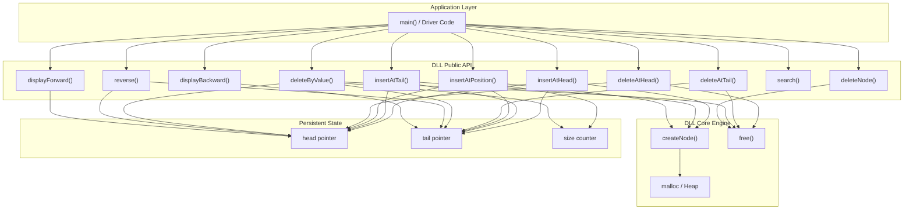
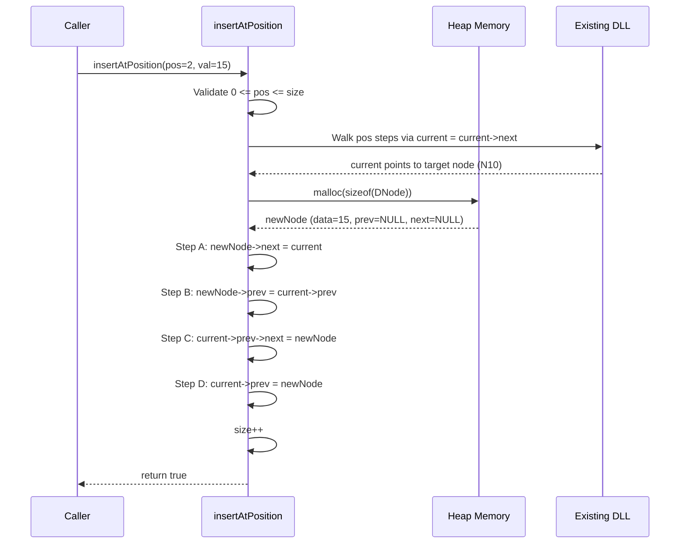
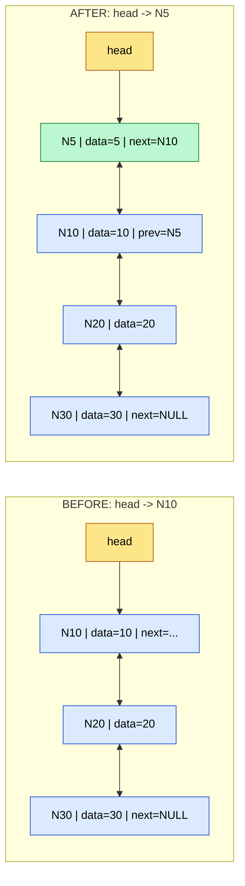
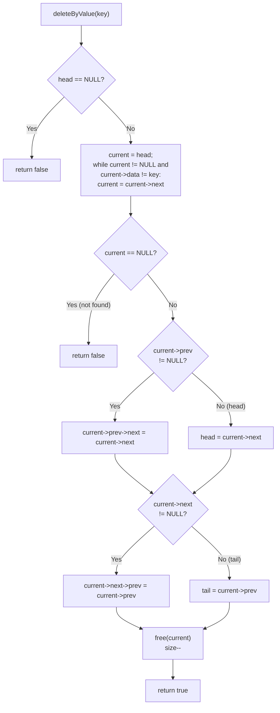
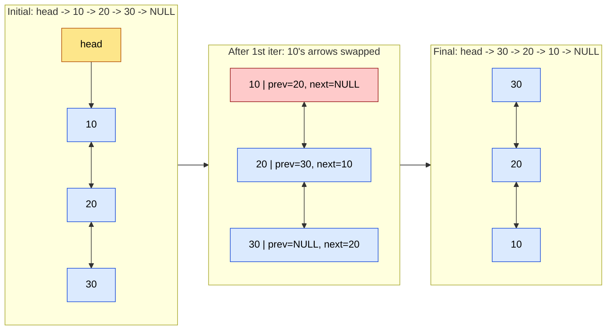

# Doubly Linked List operations

<!-- SECTION_1_START -->
# Doubly Linked List (DLL) — Operations

> [!NOTE]
> **KTU 2024 | Module 1 | Course Outcome (CO1):** *Apply appropriate linear data structures to solve real-world computing problems using pointer-based dynamic memory management.*

---

## 1.1 Formal Definition (KTU Syllabus Terminology)

A **Doubly Linked List (DLL)** is a dynamic, linear, pointer-based data structure in which each node maintains **three** logical fields:

1. `data` — the payload (of any primitive or user-defined type).
2. `prev` — a pointer/reference to the **immediate predecessor** node.
3. `next` — a pointer/reference to the **immediate successor** node.

Unlike a Singly Linked List (SLL), a DLL permits **bidirectional traversal** because every node carries a back-pointer. Two external anchor pointers — `head` (start) and optionally `tail` (end) — allow $O(1)$ access to both terminal nodes.

Formally, for a list of $n$ nodes $\{N_0, N_1, N_2, \ldots, N_{n-1}\}$, the DLL satisfies the invariant:

$$N_i.\text{next} = N_{i+1} \quad \text{and} \quad N_{i+1}.\text{prev} = N_i \quad \forall\, i \in [0,\, n-2]$$

with $N_0.\text{prev} = \text{NULL}$ and $N_{n-1}.\text{next} = \text{NULL}$.

---

## 1.2 Conceptual Analogy — The Bi-Directional Train

> [!IMPORTANT]
> **Think of a DLL as a metro train with doors on BOTH sides of every coach.**

Imagine a train where every coach has:
- A **front coupler** (→ next)
- A **rear coupler** (← prev)
- **Passengers inside** (data)

You can walk from coach 1 → coach 5 **or** from coach 5 → coach 1 without leaving the train. A Singly Linked List would be a one-way escalator — you can only move forward.

If a coach catches fire 🔥, the conductor can:
1. Detach it from BOTH sides (deletion by node pointer — $O(1)$).
2. Reconnect the remaining coaches seamlessly (relink `prev` and `next`).

This is precisely why DLLs are used in:
- Browser history (back/forward buttons).
- Undo/Redo stacks in editors.
- LRU Caches.
- Music player "previous track" functionality.
- Operating system process/thread schedulers.

---

## 1.3 The Three Fields of a DLL Node (Geometric Intuition)

A single node occupies a contiguous memory block of three fields:

```c
struct Node {
    int data;
    struct Node* prev;   // arrow ←
    struct Node* next;   // arrow →
};
```

> [!TIP]
> **Memory Footprint (per node):** On a 64-bit system, assuming `int` = 4 bytes and a pointer = 8 bytes, each DLL node consumes **20 bytes** (with padding, often 24 bytes). An SLL node only needs 16 bytes. DLLs pay a **~50% memory premium** for bidirectional capability.

---

## 1.4 Visualization Hooks (GeoGebra / Desmos)

> [!VISUALIZATION CONTROL]
> **Concept:** Memory layout of a 4-node DLL with NULL terminators.
> **Desmos / Diagram Note:** Picture four rectangles in a row, each split into three cells: `[prev ← | DATA | next →]`. Arrows from `next` cells point rightward to the next rectangle, and arrows from `prev` cells point leftward.
> **Visual Description:** First node's `prev` and last node's `next` both point to a $\varnothing$ (NULL) symbol. A "doubly anchored train" is observed.

---

## 1.5 Why DLLs Exist — Limitations They Overcome

| Operation | Singly Linked List | Doubly Linked List |
|---|---|---|
| Forward traversal | $O(n)$ | $O(n)$ |
| Backward traversal | ❌ Not possible | $O(n)$ |
| Delete a known node (no `tail`) | $O(n)$ (must find predecessor) | $O(1)$ |
| Delete from tail (with `tail`) | $O(n)$ | $O(1)$ |
| Insert before a known node | $O(n)$ | $O(1)$ |
| Memory per node | 2 fields | 3 fields |

> [!IMPORTANT]
> The biggest academic point: in a DLL, given a pointer to **any** node, you can delete it in **constant time** without traversing the list — because the node already knows its predecessor via `prev`.
<!-- SECTION_1_END -->

<!-- SECTION_2_START -->
# Deep Theoretical Analysis & KTU High-Yield Formula Sheet

## 2.1 Node-Level Invariants (The "Five Golden Rules")

For every DLL with `head` and `tail` pointers, the following invariants **must always hold true** after any operation:

1. **Head rule:** `head == NULL`  $\Longleftrightarrow$  `tail == NULL`  $\Longleftrightarrow$  the list is empty.
2. **Boundary rule:** `head->prev == NULL` and `tail->next == NULL`.
3. **Pairing rule:** For every internal node $N_i$ (where $0 < i < n-1$):
$$N_i.\text{next}.\text{prev} \;=\; N_i \quad \text{and} \quad N_i.\text{prev}.\text{next} \;=\; N_i$$
4. **Reachability rule:** Starting from `head` and following `next`, you can reach every node. Starting from `tail` and following `prev`, you can reach every node.
5. **Null safety rule:** A standalone node has both `prev` and `next` as `NULL`.

> [!WARNING]
> **Common KTU valuation trap:** Forgetting to update the `prev` pointer of the successor when inserting/deleting is the #1 cause of "segmentation fault" answers that examiners reject for partial credit.

---

## 2.2 Operation Catalogue (The Complete DLL API)

A robust DLL implementation in C exposes the following operations. Each is annotated with time complexity, which is the most heavily tested theoretical aspect in KTU theory papers.

| # | Operation | Description | Time Complexity | Auxiliary Space |
|---|---|---|---|---|
| 1 | `createNode(val)` | Allocate a single node, return pointer | $O(1)$ | $O(1)$ |
| 2 | `insertAtHead(val)` | Insert at the beginning | $O(1)$ | $O(1)$ |
| 3 | `insertAtTail(val)` | Insert at the end | $O(1)$ with `tail`; $O(n)$ without | $O(1)$ |
| 4 | `insertAtPosition(pos, val)` | Insert at index `pos` (0-based) | $O(n)$ worst case | $O(1)$ |
| 5 | `insertAfterNode(ptr, val)` | Insert right after a given node | $O(1)$ | $O(1)$ |
| 6 | `insertBeforeNode(ptr, val)` | Insert right before a given node | $O(1)$ | $O(1)$ |
| 7 | `deleteAtHead()` | Remove first node | $O(1)$ | $O(1)$ |
| 8 | `deleteAtTail()` | Remove last node | $O(1)$ with `tail`; $O(n)$ without | $O(1)$ |
| 9 | `deleteAtPosition(pos)` | Remove node at index `pos` | $O(n)$ | $O(1)$ |
| 10 | `deleteByValue(key)` | Remove first node containing `key` | $O(n)$ | $O(1)$ |
| 11 | `deleteNode(ptr)` | Remove a node given its direct pointer | $O(1)$ | $O(1)$ |
| 12 | `displayForward()` | Print from `head` to `tail` | $O(n)$ | $O(1)$ |
| 13 | `displayBackward()` | Print from `tail` to `head` | $O(n)$ | $O(1)$ |
| 14 | `search(key)` | Return pointer to first match | $O(n)$ | $O(1)$ |
| 15 | `reverse()` | Reverse the entire list in-place | $O(n)$ | $O(1)$ |
| 16 | `getSize()` | Return number of nodes | $O(n)$ or $O(1)$ with counter | $O(1)$ |

---

## 2.3 The Relinking Algebra — The Heart of DLL Operations

Every DLL operation reduces to manipulating **4 pointer arrows** at most. Let $A$ be a known node and $B$ a new node to be inserted after $A$:

$$B.\text{next} = A.\text{next}$$
$$B.\text{prev} = A$$
$$\text{If } A.\text{next} \neq \text{NULL}: \quad A.\text{next}.\text{prev} = B$$
$$A.\text{next} = B$$

**Order matters!** The first two steps save the old references before they are overwritten. This is the equivalent of swapping two variables using a temporary register.

For deletion of a node $X$ (assume $X$ is neither head nor tail):

$$\text{temp} = X$$
$$X.\text{prev}.\text{next} = X.\text{next}$$
$$X.\text{next}.\text{prev} = X.\text{prev}$$
$$\text{free(temp)}$$

> [!TIP]
> **Production Tip:** In real systems (e.g., Linux kernel `list.h`), DLLs are used heavily because deleting a node by direct pointer is the canonical $O(1)$ operation — used in process schedulers, LRU cache eviction, and memory pool management.

---

## 2.4 KTU Formula / Cheat Sheet

| Concept | Formula / Statement | Boundary / Notes |
|---|---|---|
| Memory per DLL node | $M_{\text{node}} = \text{sizeof(data)} + 2 \cdot \text{sizeof(ptr)}$ | On 64-bit: $4 + 16 = 20$ bytes (often padded to 24) |
| Total memory for $n$ nodes | $M_{\text{total}} = n \cdot M_{\text{node}} + 2 \cdot \text{sizeof(ptr)}$ | Includes `head` and `tail` |
| Deletion by direct pointer | $T(n) = O(1)$ | The killer feature vs. SLL |
| Forward traversal cost | $T(n) = \Theta(n)$ | Must visit each node once |
| Backward traversal cost | $T(n) = \Theta(n)$ | Possible only in DLL |
| Access to $k$-th element | $T(n) = O(k)$ | No random access like arrays |
| Empty list check | $\text{head} = \text{NULL} \iff \text{list empty}$ | Single null check is sufficient |
| Position validity | $0 \le \text{pos} \le n$ | For insertion; $0 \le \text{pos} < n$ for deletion |
| Mid-point (slow-fast) | Reached when $\text{fast} = \text{NULL}$ or $\text{fast->next} = \text{NULL}$ | Used in palindrome check, reverse k-group |
| Reverse traversal equivalence | After reverse, $\text{old\_head} = \text{new\_tail}$ | Symmetric property |

---

## 2.5 Comparison With Other Linear Structures (Engineering Decision Matrix)

| Feature | Array | Singly Linked List | **Doubly Linked List** | Dynamic Array (Vector) |
|---|---|---|---|---|
| Random access | $O(1)$ | $O(n)$ | $O(n)$ | $O(1)$ amortized |
| Insert at head | $O(n)$ | $O(1)$ | $O(1)$ | $O(n)$ |
| Insert at tail | $O(1)$ amortized | $O(1)$ with tail | $O(1)$ with tail | $O(1)$ amortized |
| Delete at head | $O(n)$ | $O(1)$ | $O(1)$ | $O(n)$ |
| Delete at tail | $O(1)$ | $O(n)$ | $O(1)$ with tail | $O(1)$ amortized |
| Delete by pointer | N/A | $O(n)$ | $O(1)$ | N/A |
| Memory overhead | None | 1 pointer/node | 2 pointers/node | Capacity slack |
| Cache locality | Excellent | Poor | Poor | Excellent |
<!-- SECTION_2_END -->

<!-- SECTION_3_START -->
# Step-by-Step Derivations & C Implementation

## 3.1 The DLL Node — Type Definition

We will use a self-referential `struct` with a `typedef` for clean pointer syntax.

```c
#include <stdio.h>
#include <stdlib.h>
#include <stdbool.h>

/* ---------- Type Definition ---------- */
typedef struct DNode {
    int data;
    struct DNode* prev;
    struct DNode* next;
} DNode;

/* ---------- Global Anchor Pointers ---------- */
static DNode* head = NULL;
static DNode* tail = NULL;
static int    size = 0;
```

> [!NOTE]
> In production C code, `static` global pointers are encapsulated inside a struct (an "opaque ADT"). For KTU lab examinations, top-level globals are acceptable and save time.

---

## 3.2 Operation 1 — `createNode` (The Atomic Allocator)

```c
/**
 * @brief Allocates and initializes a single DLL node.
 * @param value Integer payload.
 * @return Pointer to the new node, or NULL on allocation failure.
 */
DNode* createNode(int value) {
    /* Step 1: Request heap memory */
    DNode* newNode = (DNode*) malloc(sizeof(DNode));

    /* Step 2: Validate allocation (boundary check) */
    if (newNode == NULL) {
        fprintf(stderr, "[ERROR] malloc failed in createNode(%d)\n", value);
        return NULL;
    }

    /* Step 3: Initialize all three fields */
    newNode->data = value;
    newNode->prev = NULL;
    newNode->next = NULL;

    return newNode;
}
```

**Valuation Key Points:**
- 1 mark for correct `malloc(sizeof(DNode))` cast.
- 1 mark for the NULL check (error logging).
- 1 mark for initializing all three fields explicitly.

---

## 3.3 Operation 2 — `insertAtHead` — 4-Step Relink

```c
/**
 * @brief Inserts a new node at the beginning of the DLL.
 * @param value Payload to insert.
 * @return true on success, false on failure.
 */
bool insertAtHead(int value) {
    /* Step 1: Create the new node */
    DNode* newNode = createNode(value);
    if (newNode == NULL) return false;

    /* Step 2: Handle empty list case */
    if (head == NULL) {
        head = newNode;
        tail = newNode;
    }
    else {
        /* Step 3: Wire newNode -> old head (forward arrow) */
        newNode->next = head;

        /* Step 4: Wire old head <- newNode (backward arrow) */
        head->prev = newNode;

        /* Step 5: Move head pointer */
        head = newNode;
    }

    size++;
    return true;
}
```

**Walkthrough diagram (for an existing list 10 ⇄ 20 ⇄ 30, inserting 5):**

$$\text{Before: } \text{NULL} \Leftarrow 10 \Leftrightarrow 20 \Leftrightarrow 30 \Rightarrow \text{NULL}$$
$$\text{newNode}(5) \rightarrow \text{next} = \text{head} = N_{10}$$
$$N_{10}.\text{prev} = \text{newNode}(5)$$
$$\text{head} = \text{newNode}(5)$$
$$\text{After: } \text{NULL} \Leftarrow 5 \Leftrightarrow 10 \Leftrightarrow 20 \Leftrightarrow 30 \Rightarrow \text{NULL}$$

---

## 3.4 Operation 3 — `insertAtTail` — 4-Step Relink

```c
/**
 * @brief Inserts a new node at the end of the DLL in O(1) using tail.
 */
bool insertAtTail(int value) {
    DNode* newNode = createNode(value);
    if (newNode == NULL) return false;

    if (tail == NULL) {
        /* Empty list: head and tail both point to newNode */
        head = newNode;
        tail = newNode;
    }
    else {
        /* Step 1: Link old tail -> newNode (forward) */
        tail->next = newNode;

        /* Step 2: Link newNode <- old tail (backward) */
        newNode->prev = tail;

        /* Step 3: Advance tail */
        tail = newNode;
    }

    size++;
    return true;
}
```

---

## 3.5 Operation 4 — `insertAtPosition` — The General Insert

Position `pos` is **0-based**. Valid range: $0 \le \text{pos} \le n$.

```c
/**
 * @brief Inserts a new node at index pos (0-based).
 * @param pos   Target position.
 * @param value Payload.
 * @return true on success, false on invalid pos or allocation failure.
 */
bool insertAtPosition(int pos, int value) {
    /* Step 1: Boundary validation */
    if (pos < 0 || pos > size) {
        fprintf(stderr, "[ERROR] insertAtPosition: pos=%d out of range [0,%d]\n",
                pos, size);
        return false;
    }

    /* Step 2: Edge case — insert at head */
    if (pos == 0) return insertAtHead(value);

    /* Step 3: Edge case — insert at tail */
    if (pos == size) return insertAtTail(value);

    /* Step 4: General case — walk to node currently at position `pos` */
    DNode* current = head;
    for (int i = 0; i < pos; i++) {
        current = current->next;
    }
    /* current is the node that will be PUSHED RIGHTWARD */

    /* Step 5: Allocate new node */
    DNode* newNode = createNode(value);
    if (newNode == NULL) return false;

    /* Step 6: The 4-pointer relink */
    newNode->next      = current;     /* new -> current (right) */
    newNode->prev      = current->prev; /* new <- prev    (left) */
    current->prev->next = newNode;   /* prev -> new     (was prev->current) */
    current->prev      = newNode;    /* current <- new  (was current->prev) */

    size++;
    return true;
}
```

**Mathematical Justification of Step 6 (Why this exact order?):**

Let $A = N_{i-1}$ (predecessor of target), $B = N_i$ (target node to be shifted right), $C = N_{i+1}$ (successor of target).

Before: $A \Leftrightarrow B \Leftrightarrow C$
We want: $A \Leftrightarrow \text{new} \Leftrightarrow B \Leftrightarrow C$

Required pointer assignments:
- $\text{new}.\text{next} = B$  *(new's right arrow points to B)*
- $\text{new}.\text{prev} = A$  *(new's left arrow points to A)*
- $A.\text{next} = \text{new}$  *(A's right arrow now points to new, not B)*
- $B.\text{prev} = \text{new}$  *(B's left arrow now points to new, not A)*

If we did $A.\text{next} = \text{new}$ **first**, we would lose our reference to $B$ (assuming we don't have a temp). That's why the order in the code uses `current->prev` repeatedly — the original `A` is still reachable through `current->prev`, which is **unchanged** until the last step.

---

## 3.6 Operation 5 — `deleteAtHead` — O(1)

```c
/**
 * @brief Removes the first node. O(1).
 */
bool deleteAtHead(void) {
    /* Step 1: Empty list check */
    if (head == NULL) {
        fprintf(stderr, "[ERROR] deleteAtHead on empty list\n");
        return false;
    }

    /* Step 2: Cache the node to free */
    DNode* temp = head;

    /* Step 3: Advance head */
    head = head->next;

    /* Step 4: If list became empty, update tail too */
    if (head == NULL) {
        tail = NULL;
    }
    else {
        /* Step 5: Sever the back-pointer of the new head */
        head->prev = NULL;
    }

    /* Step 6: Free the old head */
    free(temp);
    size--;
    return true;
}
```

---

## 3.7 Operation 6 — `deleteAtTail` — O(1) With Tail

```c
/**
 * @brief Removes the last node in O(1) using tail pointer.
 */
bool deleteAtTail(void) {
    if (tail == NULL) {
        fprintf(stderr, "[ERROR] deleteAtTail on empty list\n");
        return false;
    }

    DNode* temp = tail;

    /* Step 1: Move tail backward */
    tail = tail->prev;

    if (tail == NULL) {
        head = NULL;
    }
    else {
        /* Step 2: Sever the forward pointer of the new tail */
        tail->next = NULL;
    }

    free(temp);
    size--;
    return true;
}
```

---

## 3.8 Operation 7 — `deleteByValue` — O(n)

```c
/**
 * @brief Deletes the first node containing `key`.
 * @return true if a node was deleted, false otherwise.
 */
bool deleteByValue(int key) {
    if (head == NULL) return false;

    DNode* current = head;

    /* Step 1: Linear search for the key */
    while (current != NULL && current->data != key) {
        current = current->next;
    }

    /* Step 2: Key not found */
    if (current == NULL) {
        fprintf(stderr, "[INFO] deleteByValue: key=%d not found\n", key);
        return false;
    }

    /* Step 3: Relink — bypass `current` */
    if (current->prev != NULL) {
        current->prev->next = current->next;
    }
    else {
        /* current is the head */
        head = current->next;
    }

    if (current->next != NULL) {
        current->next->prev = current->prev;
    }
    else {
        /* current is the tail */
        tail = current->prev;
    }

    free(current);
    size--;
    return true;
}
```

---

## 3.9 Operation 8 — `deleteNode` (The O(1) Killer Feature)

```c
/**
 * @brief Deletes a node given its direct pointer — the defining O(1) op of DLLs.
 * @param node Pointer to the node to delete (must not be NULL).
 * @warning Caller must ensure `node` is part of the current list.
 */
bool deleteNode(DNode* node) {
    if (node == NULL) return false;

    /* Step 1: Bypass the node from the left side */
    if (node->prev != NULL) {
        node->prev->next = node->next;
    }
    else {
        head = node->next;   /* node was the head */
    }

    /* Step 2: Bypass the node from the right side */
    if (node->next != NULL) {
        node->next->prev = node->prev;
    }
    else {
        tail = node->prev;   /* node was the tail */
    }

    free(node);
    size--;
    return true;
}
```

> [!IMPORTANT]
> **The killer use case:** Given a pointer to a node (e.g., the current element of an iterator), you can remove it in $O(1)$ — **no traversal required**. This is impossible in a Singly Linked List and impossible in a C++ `std::forward_list` (which is why `std::list` is doubly linked).

---

## 3.10 Operation 9 — Traversal: Forward & Backward

```c
/**
 * @brief Displays the list from head to tail.
 */
void displayForward(void) {
    if (head == NULL) {
        printf("List is EMPTY.\n");
        return;
    }
    printf("HEAD <-> ");
    DNode* current = head;
    while (current != NULL) {
        printf("%d <-> ", current->data);
        current = current->next;
    }
    printf("NULL\n");
}

/**
 * @brief Displays the list from tail to head (backward).
 */
void displayBackward(void) {
    if (tail == NULL) {
        printf("List is EMPTY.\n");
        return;
    }
    printf("NULL <-> ");
    DNode* current = tail;
    while (current != NULL) {
        printf("%d <-> ", current->data);
        current = current->prev;
    }
    printf("HEAD\n");
}
```

---

## 3.11 Operation 10 — `search`

```c
/**
 * @brief Searches for the first node containing `key`.
 * @return Pointer to the node, or NULL if not found.
 */
DNode* search(int key) {
    DNode* current = head;
    while (current != NULL) {
        if (current->data == key) return current;
        current = current->next;
    }
    return NULL;
}
```

---

## 3.12 Operation 11 — `reverse` (In-Place, O(n))

```c
/**
 * @brief Reverses the entire DLL in-place by swapping prev and next for every node.
 *        Equivalent to: traverse list, swap prev/next, and finally swap head/tail.
 */
void reverse(void) {
    DNode* current = head;
    DNode* temp   = NULL;

    /* Step 1: Walk the list, swapping prev and next for every node */
    while (current != NULL) {
        temp            = current->prev;
        current->prev   = current->next;
        current->next   = temp;
        current         = current->prev;   /* move to "next" which is now prev */
    }

    /* Step 2: Swap head and tail */
    if (temp != NULL) {
        head = temp->prev;
    }
}
```

**Walkthrough proof (list 10 ⇄ 20 ⇄ 30):**

| Iteration | `current` | `current->prev` (new) | `current->next` (new) | Notes |
|---|---|---|---|---|
| Start | 10 | 20 (was next) | NULL (was prev) | |
| After iter 1 | 20 | 30 | 10 | |
| After iter 2 | 30 | NULL | 20 | |
| End | NULL | — | — | temp holds old prev of 10, i.e. NULL, so swap head/tail using the last valid `temp` |

> [!TIP]
> **Common student error:** forgetting to swap `head` and `tail` pointers at the end. After the loop, `head` still points to the original first node, which is now the last node.

---

## 3.13 Complete Working Program (KTU Lab-Ready)

```c
/* ============================================================
 * File:     dll_complete.c
 * Course:   PCCSL306 - Data Structures & Algorithms Lab
 * Module:   1 - Basic & Linear Data Structures
 * Topic:    Doubly Linked List - All Standard Operations
 * ============================================================ */

#include <stdio.h>
#include <stdlib.h>
#include <stdbool.h>

typedef struct DNode {
    int data;
    struct DNode* prev;
    struct DNode* next;
} DNode;

static DNode* head = NULL;
static DNode* tail = NULL;
static int    size = 0;

/* ---------- Helper ---------- */
DNode* createNode(int value) {
    DNode* n = (DNode*) malloc(sizeof(DNode));
    if (n == NULL) {
        fprintf(stderr, "[ERROR] malloc failed\n");
        return NULL;
    }
    n->data = value;
    n->prev = NULL;
    n->next = NULL;
    return n;
}

/* ---------- Insertion ---------- */
bool insertAtHead(int v) {
    DNode* n = createNode(v);
    if (!n) return false;
    if (head == NULL) { head = tail = n; }
    else {
        n->next   = head;
        head->prev = n;
        head       = n;
    }
    size++; return true;
}

bool insertAtTail(int v) {
    DNode* n = createNode(v);
    if (!n) return false;
    if (tail == NULL) { head = tail = n; }
    else {
        tail->next = n;
        n->prev    = tail;
        tail       = n;
    }
    size++; return true;
}

bool insertAtPosition(int pos, int v) {
    if (pos < 0 || pos > size) return false;
    if (pos == 0) return insertAtHead(v);
    if (pos == size) return insertAtTail(v);

    DNode* cur = head;
    for (int i = 0; i < pos; i++) cur = cur->next;
    DNode* n = createNode(v);
    if (!n) return false;

    n->next           = cur;
    n->prev           = cur->prev;
    cur->prev->next   = n;
    cur->prev         = n;
    size++; return true;
}

/* ---------- Deletion ---------- */
bool deleteAtHead(void) {
    if (head == NULL) return false;
    DNode* t = head;
    head = head->next;
    if (head == NULL) tail = NULL;
    else head->prev = NULL;
    free(t); size--; return true;
}

bool deleteAtTail(void) {
    if (tail == NULL) return false;
    DNode* t = tail;
    tail = tail->prev;
    if (tail == NULL) head = NULL;
    else tail->next = NULL;
    free(t); size--; return true;
}

bool deleteByValue(int key) {
    DNode* cur = head;
    while (cur && cur->data != key) cur = cur->next;
    if (!cur) return false;
    if (cur->prev) cur->prev->next = cur->next; else head = cur->next;
    if (cur->next) cur->next->prev = cur->prev; else tail = cur->prev;
    free(cur); size--; return true;
}

/* ---------- Traversal & Search ---------- */
void displayForward(void) {
    printf("HEAD <-> ");
    for (DNode* c = head; c; c = c->next) printf("%d <-> ", c->data);
    printf("NULL\n");
}

void displayBackward(void) {
    printf("NULL <-> ");
    for (DNode* c = tail; c; c = c->prev) printf("%d <-> ", c->data);
    printf("HEAD\n");
}

DNode* search(int key) {
    for (DNode* c = head; c; c = c->next)
        if (c->data == key) return c;
    return NULL;
}

/* ---------- Reverse ---------- */
void reverse(void) {
    DNode* cur = head, *tmp = NULL;
    while (cur) {
        tmp        = cur->prev;
        cur->prev  = cur->next;
        cur->next  = tmp;
        cur        = cur->prev;
    }
    if (tmp) head = tmp->prev;
    /* Re-derive tail: walk from new head to the end */
    tail = head;
    while (tail && tail->next) tail = tail->next;
}

/* ---------- Driver ---------- */
int main(void) {
    insertAtTail(10);
    insertAtTail(20);
    insertAtTail(30);
    insertAtHead(5);
    insertAtPosition(2, 15);     /* list: 5 10 15 20 30 */

    printf("Forward : "); displayForward();
    printf("Backward: "); displayBackward();

    deleteByValue(15);
    printf("After deleting 15: "); displayForward();

    deleteAtHead(); deleteAtTail();
    printf("After deleting head & tail: "); displayForward();

    reverse();
    printf("After reverse: "); displayForward();

    return 0;
}
```

**Expected Output:**

```text
Forward : HEAD <-> 5 <-> 10 <-> 15 <-> 20 <-> 30 <-> NULL
Backward: NULL <-> 30 <-> 20 <-> 15 <-> 10 <-> 5 <-> HEAD
After deleting 15: HEAD <-> 5 <-> 10 <-> 20 <-> 30 <-> NULL
After deleting head & tail: HEAD <-> 10 <-> 20 <-> NULL
After reverse: HEAD <-> 20 <-> 10 <-> NULL
```

---

## 3.14 Algorithmic Walkthrough — Insertion at Position (Dry Run)

**Input List:** $L = 5 \Leftrightarrow 10 \Leftrightarrow 20 \Leftrightarrow 30$, size $= 4$
**Call:** `insertAtPosition(2, 15)` — should place 15 between 10 and 20.

| Step | Action | State of List | Variables |
|---|---|---|---|
| 1 | Validate $0 \le 2 \le 4$ ✓ | $L$ unchanged | `pos = 2` |
| 2 | `pos == 0`? No. `pos == size`? No. | $L$ unchanged | — |
| 3 | Walk loop: $i=0$: `cur = head = N_5`; $i=1$: `cur = N_{10}`; $i=2$ stops. | $L$ unchanged | `cur = N_{10}` (the node currently at index 2, which will be pushed right) |
| 4 | `n = createNode(15)` | $L$ unchanged, heap has new node | `n.data = 15` |
| 5 | `n->next = cur` | $5 \Leftrightarrow 10 \Leftrightarrow 20 \Leftrightarrow 30$ and a free-floating 15 | `n->next = N_{10}` |
| 6 | `n->prev = cur->prev` | (same) | `n->prev = N_5` |
| 7 | `cur->prev->next = n` | $5 \Leftrightarrow 15$ (the old $5 \Leftrightarrow 10$ link is broken and replaced) | `N_5->next = n` |
| 8 | `cur->prev = n` | $5 \Leftrightarrow 15 \Leftrightarrow 10 \Leftrightarrow 20 \Leftrightarrow 30$ ✓ | `N_{10}->prev = n` |

> [!IMPORTANT]
> **Time Complexity Derivation:** The walk loop runs $k$ times for position $k$. In the worst case (insert at tail, $k = n-1$), the loop runs $n-1$ times, giving $T(n) = O(n)$. All pointer manipulations inside the loop are $O(1)$, so the asymptotic bound is dominated by the traversal.
<!-- SECTION_3_END -->

<!-- SECTION_4_START -->
# Structural Diagrams & Schematics

## 4.1 High-Level Architecture — DLL Module



---

## 4.2 The 4-Pointer Relink — Insertion at Position



---

## 4.3 State Transition Diagram — The List Lifecycle

```mermaid
stateDiagram-v2
    [*] --> Empty
    Empty --> OneNode : insertAtHead or insertAtTail
    OneNode --> ManyNodes : insertAtHead or insertAtTail
    ManyNodes --> ManyNodes : insertAtPosition
    ManyNodes --> ManyNodes : deleteByValue
    OneNode --> Empty : deleteAtHead or deleteAtTail
    ManyNodes --> OneNode : deleteAtHead or deleteAtTail
    ManyNodes --> Empty : alternating deletes

    state OneNode {
        note right: head == tail, both point to single node\nprev = next = NULL
    }

    state ManyNodes {
        note right: head.prev = NULL, tail.next = NULL
    }
```

---

## 4.4 Insert at Head — Pointer Movement Visualization



---

## 4.5 Delete by Value — Decision Tree



---

## 4.6 Reverse Operation — Pointer Swap Invariant


<!-- SECTION_4_END -->

<!-- SECTION_5_START -->
# KTU 2024 Scheme Examination Question Bank

---

## Part A — Short Answer Questions (3 Marks Each)

### Q1. **[KTU University Exam — July 2024]**
**Differentiate between a Singly Linked List and a Doubly Linked List. Mention any two advantages of DLL over SLL.**

**Model Answer (3 marks):**

| Aspect | Singly Linked List | Doubly Linked List |
|---|---|---|
| Node fields | `data`, `next` | `data`, `prev`, `next` |
| Direction | Forward only | Bidirectional |
| Memory | $1$ pointer/node | $2$ pointers/node |

**Two advantages of DLL over SLL:** *(2 marks)*
1. **Bidirectional traversal** — list can be traversed from both `head` and `tail` in $O(n)$ time, which is impossible in SLL.
2. **$O(1)$ deletion of a node given its direct pointer** — since the node already has a `prev` link, the predecessor can be accessed without traversal, whereas SLL must traverse from `head` to find the predecessor.

> [!NOTE]
> **[Valuation Key — 1 mark]** for correct tabular differentiation; **[1 mark]** for first advantage; **[1 mark]** for second advantage.

---

### Q2. **[KTU University Exam — Dec 2023]**
**State the time complexity of the following DLL operations and justify briefly: (a) Insertion at head, (b) Deletion of a node given its pointer, (c) Searching for a key.**

**Model Answer (3 marks):**

| # | Operation | Complexity | Justification |
|---|---|---|---|
| (a) | Insertion at head | $O(1)$ | Only constant number of pointer updates (at most 4 assignments). |
| (b) | Deletion by pointer | $O(1)$ | Node's `prev` and `next` give direct access to neighbors; no traversal needed. |
| (c) | Searching for a key | $O(n)$ | Worst case: key is at the tail; must scan all $n$ nodes linearly. |

> [!NOTE]
> **[Valuation Key — 1 mark]** for each correct complexity with one-line justification.

---

## Part B — Long Answer Questions (14 Marks Each, Module Internal Choice)

### Q3. **[KTU University Exam — July 2024 | CO1, Apply + Analyze]**

**Question A (14 Marks):**

Write a C program to implement a **Doubly Linked List** that supports the following operations:
**(a)** Insertion of a node at the **beginning**, **end**, and **given position** of the DLL. *(7 marks)*
**(b)** Deletion of a node from the **beginning**, **end**, and **by value** of the DLL. Display the list after every operation. *(7 marks)*

**OR**

**Question B (14 Marks):**

Write a C program to implement a DLL and demonstrate:
**(a)** **Forward and backward traversal** of the list. *(7 marks)*
**(b)** **Reversing the DLL in-place** using only pointer manipulations (no auxiliary array). *(7 marks)*

---

### Model Solution for Question A

#### Part (a) — Insertion Operations (7 Marks)

```c
#include <stdio.h>
#include <stdlib.h>

typedef struct DNode {
    int data;
    struct DNode* prev, *next;
} DNode;

DNode* head = NULL, *tail = NULL;
int   size = 0;

DNode* createNode(int v) {
    DNode* n = (DNode*)malloc(sizeof(DNode));
    if (!n) { printf("Allocation failed\n"); return NULL; }
    n->data = v; n->prev = n->next = NULL;
    return n;
}

/* Insertion at beginning */
void insertAtHead(int v) {
    DNode* n = createNode(v);
    if (head == NULL) head = tail = n;
    else {
        n->next = head;
        head->prev = n;
        head = n;
    }
    size++;
}

/* Insertion at end */
void insertAtTail(int v) {
    DNode* n = createNode(v);
    if (tail == NULL) head = tail = n;
    else {
        tail->next = n;
        n->prev = tail;
        tail = n;
    }
    size++;
}

/* Insertion at given position (0-based) */
void insertAtPosition(int pos, int v) {
    if (pos < 0 || pos > size) {
        printf("Invalid position\n"); return;
    }
    if (pos == 0) { insertAtHead(v); return; }
    if (pos == size) { insertAtTail(v); return; }

    DNode* cur = head;
    for (int i = 0; i < pos; i++) cur = cur->next;

    DNode* n = createNode(v);
    n->next = cur;
    n->prev = cur->prev;
    cur->prev->next = n;
    cur->prev = n;
    size++;
}
```

**Valuation Key — Part (a) [7 marks]:**
- **[Struct definition with three fields: 1 Mark]**
- **[createNode helper with malloc and NULL check: 1 Mark]**
- **[insertAtHead — handling empty list + relink: 1 Mark]**
- **[insertAtTail — handling empty list + relink: 1 Mark]**
- **[insertAtPosition — boundary validation: 1 Mark]**
- **[insertAtPosition — 4-pointer relink: 1 Mark]**
- **[Updating head/tail/size correctly: 1 Mark]**

---

#### Part (b) — Deletion Operations (7 Marks)

```c
void display(void) {
    printf("HEAD <-> ");
    for (DNode* c = head; c; c = c->next) printf("%d <-> ", c->data);
    printf("NULL\n");
}

/* Deletion from beginning */
void deleteAtHead(void) {
    if (head == NULL) { printf("List empty\n"); return; }
    DNode* t = head;
    head = head->next;
    if (head == NULL) tail = NULL;
    else head->prev = NULL;
    free(t); size--;
}

/* Deletion from end */
void deleteAtTail(void) {
    if (tail == NULL) { printf("List empty\n"); return; }
    DNode* t = tail;
    tail = tail->prev;
    if (tail == NULL) head = NULL;
    else tail->next = NULL;
    free(t); size--;
}

/* Deletion by value (first occurrence) */
void deleteByValue(int key) {
    DNode* cur = head;
    while (cur && cur->data != key) cur = cur->next;
    if (!cur) { printf("Key %d not found\n", key); return; }
    if (cur->prev) cur->prev->next = cur->next; else head = cur->next;
    if (cur->next) cur->next->prev = cur->prev; else tail = cur->prev;
    free(cur); size--;
}

int main(void) {
    insertAtTail(10); insertAtTail(20); insertAtTail(30);
    insertAtHead(5);
    insertAtPosition(2, 15);
    display();   /* HEAD <-> 5 <-> 10 <-> 15 <-> 20 <-> 30 <-> NULL */

    deleteByValue(15);
    display();   /* HEAD <-> 5 <-> 10 <-> 20 <-> 30 <-> NULL */

    deleteAtHead(); deleteAtTail();
    display();   /* HEAD <-> 10 <-> 20 <-> NULL */
    return 0;
}
```

**Valuation Key — Part (b) [7 marks]:**
- **[display function with proper traversal: 1 Mark]**
- **[deleteAtHead — empty check + head advancement + tail update: 1.5 Marks]**
- **[deleteAtTail — empty check + tail retreat + head update: 1.5 Marks]**
- **[deleteByValue — linear search: 1 Mark]**
- **[deleteByValue — 4-way relink (prev/next/head/tail): 1 Mark]**
- **[free() called on deleted node: 0.5 Mark]**
- **[main() driver with meaningful test calls: 0.5 Mark]**

---

### Model Solution for Question B

#### Part (a) — Forward and Backward Traversal (7 Marks)

```c
void displayForward(void) {
    if (head == NULL) { printf("List empty\n"); return; }
    printf("HEAD <-> ");
    DNode* c = head;
    while (c != NULL) {
        printf("%d <-> ", c->data);
        c = c->next;
    }
    printf("NULL\n");
}

void displayBackward(void) {
    if (tail == NULL) { printf("List empty\n"); return; }
    printf("NULL <-> ");
    DNode* c = tail;
    while (c != NULL) {
        printf("%d <-> ", c->data);
        c = c->prev;
    }
    printf("HEAD\n");
}
```

**Valuation Key — Part (a) [7 marks]:**
- **[Forward traversal starting from head: 2 Marks]**
- **[Forward traversal terminating at NULL: 1 Mark]**
- **[Backward traversal starting from tail: 2 Marks]**
- **[Backward traversal terminating at NULL/head: 1 Mark]**
- **[Empty list handling: 1 Mark]**

---

#### Part (b) — In-Place Reverse (7 Marks)

```c
void reverse(void) {
    DNode* cur = head, *tmp = NULL;
    while (cur != NULL) {
        tmp        = cur->prev;   /* save prev */
        cur->prev  = cur->next;   /* swap */
        cur->next  = tmp;
        cur        = cur->prev;   /* move to next (which is now in prev) */
    }
    /* Swap head and tail */
    tmp  = head;
    head = tail;
    tail = tmp;
}
```

**Valuation Key — Part (b) [7 marks]:**
- **[Single pass traversal: 1 Mark]**
- **[Saving original prev in temp: 1 Mark]**
- **[Swapping prev and next pointers: 2 Marks]**
- **[Moving current using the new prev (which was old next): 1 Mark]**
- **[Swapping head and tail after loop: 1 Mark]**
- **[Correctness on a 3-node example walkthrough: 1 Mark]**

---

## KTU Examiner's Valuation Warning

> [!WARNING]
> **Common pitfalls that cost marks in DLL questions (examiners deduct strictly):**
>
> 1. **Forgetting to update `head` and `tail` after a deletion** — when the deleted node is the head or the tail, failing to move these anchors leads to a dangling pointer. Examiners allocate 0.5–1 mark specifically for these boundary cases.
>
> 2. **Not severing the back-pointer of the new head** — after `deleteAtHead`, the new head's `prev` must be set to `NULL`. A common bug is `head = head->next;` without the next line `head->prev = NULL;`. The list technically still "works" until you try to traverse backward — then you loop back to garbage memory.
>
> 3. **Inserting without checking `pos` bounds** — must validate $0 \le \text{pos} \le n$ for insertion and $0 \le \text{pos} < n$ for deletion. A program that crashes on `pos = -1` or `pos = n` loses full marks.
>
> 4. **Skipping the empty-list case in `insertAtTail` / `deleteAtTail`** — when the list is empty, `tail == NULL` and dereferencing `tail->prev` causes segmentation faults. Always test: *what if size == 0?*
>
> 5. **Not calling `free()` on the deleted node** — in C programs, this is a memory leak. Examiners deduct up to 1 mark for this in KTU lab evaluations.
>
> 6. **Mixing up `prev` and `next` in the relink** — a typo like `n->prev = head;` instead of `n->next = head;` produces a list that prints correctly forward but breaks in backward traversal. Always draw the **before/after** diagram on paper first.
>
> 7. **Not displaying the list after each operation** — KTU lab questions explicitly say "display after each operation"; forgetting this loses 1–2 marks.

---

## Topic Recap & Important Things to Remember

> [!TIP]
> **Rapid-Revision Checklist (print this and keep it beside your keyboard during exams):**

- [x] A **DLL node** has **3 fields**: `data`, `prev`, `next`.
- [x] **Two anchors**: `head` (start) and `tail` (end), both initially `NULL`.
- [x] **Empty list invariant**: `head == NULL` $\iff$ `tail == NULL`.
- [x] **Head boundary**: `head->prev == NULL`. **Tail boundary**: `tail->next == NULL`.
- [x] **Insertion at head / tail** is $O(1)$ using anchors.
- [x] **Insertion at arbitrary position** is $O(n)$ due to traversal.
- [x] **Deletion at head / tail** is $O(1)$ using anchors.
- [x] **Deletion given a node pointer** is the **killer $O(1)$** feature of DLLs.
- [x] **Deletion by value / position** is $O(n)$ — must search first.
- [x] **Forward traversal**: `cur = cur->next` until `cur == NULL`.
- [x] **Backward traversal**: `cur = cur->prev` until `cur == NULL` (possible only in DLL).
- [x] **Reverse** is done by swapping `prev` and `next` for every node in $O(n)$ time, $O(1)$ space.
- [x] After reverse, **swap `head` and `tail`** pointers.
- [x] **Memory overhead**: DLL uses ~2× the pointer memory of SLL.
- [x] **4-pointer relink rule** for insertion: always set `new->next` and `new->prev` **before** modifying neighbors, to avoid losing references.
- [x] **Always call `free(node)`** after deletion in C; otherwise you leak memory.
- [x] **Boundary check** every input (`pos`, `key`, `node` pointer).
- [x] **Real-world uses**: browser history, LRU cache, undo/redo, music player previous-track, OS scheduler, navigation apps.
- [x] **Comparison with SLL**: DLL wins on backward traversal and $O(1)$ node-by-pointer deletion; SLL wins on memory footprint.
- [x] **Comparison with array**: DLL wins on $O(1)$ insert/delete anywhere; array wins on $O(1)$ random access and cache locality.
- [x] **Time complexity mantra**: insert/delete at known position = $O(1)$; insert/delete at unknown position = $O(n)$; search = $O(n)$.
- [x] **Always draw a small diagram on rough paper** before writing the relink code — this is the single best way to avoid `prev`/`next` typos in the exam.
<!-- SECTION_5_END -->
