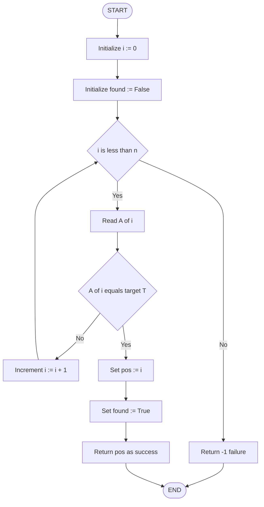
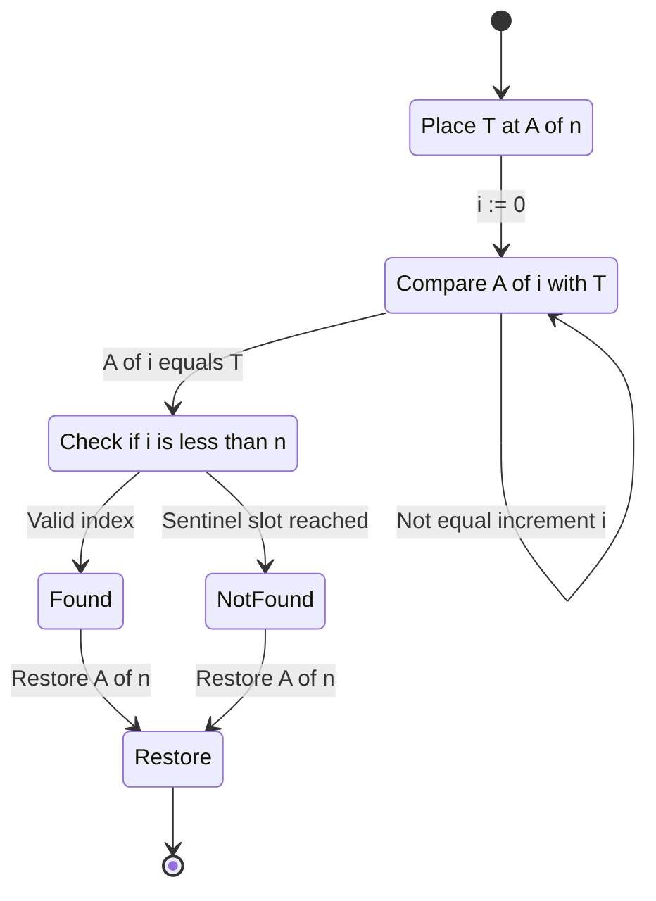
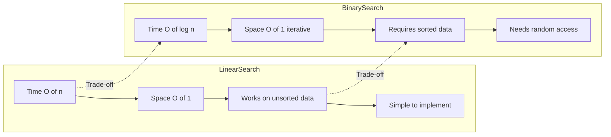
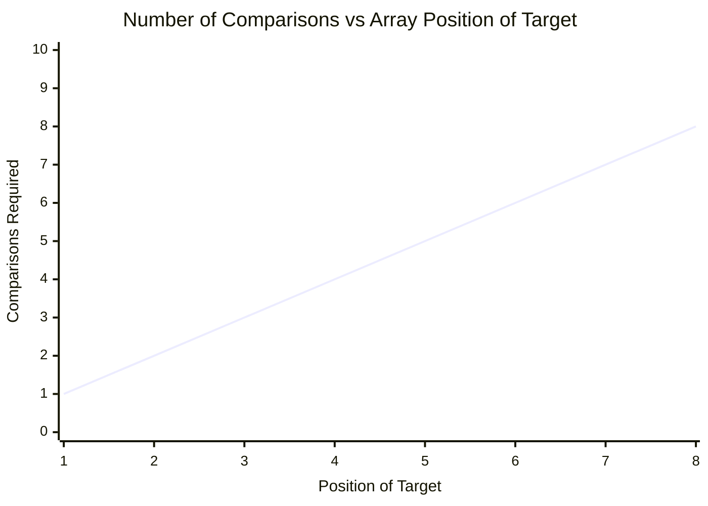
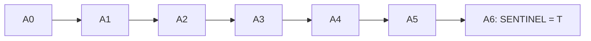

# Linear search

<!-- SECTION_1_START -->

# Linear Search — A Systematic Sequential Retrieval Operation

## 1.1 Formal Academic Definition

> [!NOTE]
> **Definition (KTU 2024 Scheme — DSA Lab, Module 1):**
> *Linear Search* (also called **Sequential Search**) is a fundamental search algorithm that scans an unordered or unsorted data structure **element-by-element, in a strictly sequential order**, comparing each visited element against the target key. If a match is found, the algorithm returns the index of that element; otherwise, after exhausting the entire collection, it returns a sentinel failure indicator (commonly `-1` in array-based implementations).

The defining characteristic of linear search is that it makes **no prior assumptions** about the distribution, ordering, or internal structure of the data. It works correctly on unsorted arrays, linked lists, or any linearly traversable collection.

**Standard complexity metrics (Big-O notation):**

$$\text{Time Complexity} = O(n), \quad \text{Space Complexity} = O(1)$$

where $n$ denotes the number of elements in the collection.

## 1.2 Conceptual Analogy — Searching a Telephone Directory

Imagine you are given a **shuffled stack of business cards** thrown randomly on a table, and a colleague asks you, *"Do you have the card of Mr. Vivek?"*

Because the cards are in **no particular order**, you have no choice but to:

1. **Pick up the first card** and read the name.
2. **Compare** it mentally with "Vivek".
3. If it matches → **stop and hand it over**.
4. If it does not match → **put it aside** and pick the next card.
5. **Repeat** until you either find the card or the stack is empty.

This is exactly how linear search operates on an array. There is no shortcut, no "jumping ahead," and no "binary halving." The only metadata that could accelerate this process would be external **knowledge** (e.g., "I remember Vivek's card is near the bottom"), but the algorithm itself has no such intelligence — it is purely mechanical.

> [!IMPORTANT]
> **Key Syllabus Insight:**
> Linear Search is the *baseline reference algorithm*. Every other search algorithm (Binary Search, Jump Search, Interpolation Search) is benchmarked against linear search's simplicity. Even though they are faster, they all require **pre-sorted data**, which linear search does not.

## 1.3 Intuition Through a Geometric / Numeric Visualization

To make the algorithm concrete, consider an array $A$ of size $n = 8$:

$$A = \begin{bmatrix} 41 & 23 & 87 & 12 & 65 & 9 & 54 & 32 \end{bmatrix}$$

We want to find the target $T = 65$. The algorithm walks indices $0 \to 1 \to 2 \to \dots \to 7$, comparing each $A[i]$ with $T$.

> [!VISUALIZATION CONTROL]
> **Concept:** Step-by-step sequential comparison on a 1-D number-line representation of an array.
> **Desmos Input Equations:**
> * `x_1 = 1`, `x_2 = 2`, `x_3 = 3`, `x_4 = 4`, `x_5 = 5`, `x_6 = 6`, `x_7 = 7`, `x_8 = 8` *(array index positions on the x-axis)*
> * `y_1 = 0` (baseline)
> * `A = { (1,41), (2,23), (3,87), (4,12), (5,65), (6,9), (7,54), (8,32) }` *(data points)*
> * `T = 65` *(target value drawn as a horizontal reference line $y = 65$ in red)*
> **Visual Description:** The student should observe eight blue data points distributed unevenly on the plane, with a red horizontal line at $y = 65$. The search cursor "lights up" each index one by one from left to right. The moment the blue point coincides with the red line (at index 5), the search halts. This is the literal geometric picture of the algorithm.

<!-- SECTION_1_END -->

<!-- SECTION_2_START -->

# 2. Deep Theoretical Analysis & KTU High-Yield Formula Sheet

## 2.1 Operational Decomposition — The Core Algorithm

The linear search algorithm can be reduced to a sequence of four logical states:

- **State 1 — Initialization:** Set the search index $i \leftarrow 0$ and define a failure flag $\text{found} \leftarrow \text{False}$.
- **State 2 — Traversal:** While $i < n$, do:
   * **Comparison:** Check if $A[i] == T$.
   * **Match:** If true, set $\text{found} \leftarrow \text{True}$ and record $\text{pos} \leftarrow i$.
   * **Advance:** Else, increment $i \leftarrow i + 1$.
- **State 3 — Termination:** Exit the loop when either a match is found or the array is exhausted.
- **State 4 — Reporting:** Return $\text{pos}$ (if found) or a sentinel value (typically $-1$).

> [!NOTE]
> **Why $O(n)$?**
> The single loop runs *at most* $n$ times. Inside the loop, every operation is $O(1)$ (an array access, a comparison, and an increment). Therefore, the worst-case running time scales *linearly* with the input size $n$.

## 2.2 The Four Variants of Linear Search

Linear search is not a monolithic algorithm. KTU examiners frequently test the following variants:

| Variant | Key Idea | Use Case |
|---|---|---|
| **Classic Linear Search** | Plain sequential scan | Generic unsorted arrays |
| **Sentinel Linear Search** | Place target at $A[n]$ to eliminate one bounds check per iteration | Performance-critical inner loops |
| **Recursive Linear Search** | Replace the `while` loop with a recursive call | Exam questions / academic analysis |
| **Multi-occurrence Search** | Collect *all* indices where the target appears | Frequency counting problems |

## 2.3 KTU High-Yield Formula & Complexity Cheat Sheet

| Parameter | Symbol | Best Case | Average Case | Worst Case | Unit / Note |
|---|---|---|---|---|---|
| Number of comparisons | $C(n)$ | $1$ | $\dfrac{n+1}{2}$ | $n$ | dimensionless count |
| Successful search probability | $p$ | $1$ | $\dfrac{1}{n}$ | $0$ | $0 \le p \le 1$ |
| Expected comparisons (avg) | $E[C]$ | — | $\dfrac{n+1}{2}$ | — | applies when target is equally likely to be at any index |
| Time complexity (asymptotic) | $T(n)$ | $\Omega(1)$ | $\Theta(n)$ | $O(n)$ | Big-O family |
| Space complexity (auxiliary) | $S(n)$ | $O(1)$ | $O(1)$ | $O(1)$ | constant extra memory |
| Stability on equal keys | — | returns first match | — | — | deterministic |
| Sentinel cost overhead | — | — | — | $+1$ array slot | classical trade-off |

> [!IMPORTANT]
> **Average-Case Derivation Reminder (Board Favorite):**
> When the target is equally likely to be at any of the $n$ positions, the expected number of comparisons is:
> $$E[C] = \sum_{i=1}^{n} i \cdot \frac{1}{n} = \frac{1 + 2 + \dots + n}{n} = \frac{\frac{n(n+1)}{2}}{n} = \frac{n+1}{2}$$
> This is a **direct KTU exam question** almost every semester. Memorize it.

## 2.4 Real-World Engineering Utility

Although linear search is the *slowest* of the standard search algorithms, it is widely used in **production systems** in the following contexts:

- **Database query planning:** When the table size is small (say, $n < 16$), the query optimizer often chooses a linear scan over a B-Tree index because the constant-factor cost of an index lookup exceeds the cost of a direct scan.
- **Symbol resolution in linkers and compilers:** Looking up a symbol in a small object file's symbol table.
- **Cache-line friendly access patterns:** Linear access is hardware-cache friendly because consecutive memory addresses are loaded into the same cache line, yielding near-$O(1)$ practical performance for small $n$.
- **Embedded systems and firmware:** Where code-size and simplicity outweigh asymptotic speed.
- **Brute-force substring matching:** Algorithms like the naive `O(mn)` string matching algorithm are essentially nested linear searches.

<!-- SECTION_2_END -->

<!-- SECTION_3_START -->

# 3. Step-by-Step Derivations & Code/Symbolic Implementation

## 3.1 Mathematical Trace — Worked Example

Let us trace the algorithm on the array $A$ with target $T = 65$:

$$A = \begin{bmatrix} 41 & 23 & 87 & 12 & 65 & 9 & 54 & 32 \end{bmatrix}, \quad n = 8$$

| Iteration $i$ | $A[i]$ | $A[i] \stackrel{?}{=} 65$ | Action | State |
|---|---|---|---|---|
| 0 | 41 | False | $i \leftarrow 1$ | Continue |
| 1 | 23 | False | $i \leftarrow 2$ | Continue |
| 2 | 87 | False | $i \leftarrow 3$ | Continue |
| 3 | 12 | False | $i \leftarrow 4$ | Continue |
| 4 | 65 | **True** | $\text{pos} \leftarrow 4$, halt | **Found** |

**Result:** $\text{pos} = 4$, $C(n) = 5$ comparisons.

### Worst-Case Trace (target not present)

If $T = 100$ is not in the array, the loop completes all $n = 8$ iterations and returns $-1$. Total comparisons: $C(n) = 8 = n$.

## 3.2 Derivation of the Sentinel Search Improvement

The classical loop performs **two comparisons per iteration**: the bounds check $i < n$ and the equality check $A[i] == T$. The sentinel trick reduces this to **one comparison per iteration** by:

1. Placing the target $T$ at $A[n]$ (one extra slot).
2. Removing the bounds check, because $T$ is *guaranteed* to be found.
3. After the loop, verifying whether the match was at a *valid* index ($i < n$) or at the sentinel position.

The new comparison count becomes:

$$C_{\text{sentinel}}(n) = 2n + 1$$

versus the classical:

$$C_{\text{classical}}(n) = 2n$$

Wait — the classical actually does **fewer** comparisons, but each classical iteration has *two* branches. The sentinel has only *one* branch per iteration. The performance gain is therefore from **branch prediction and pipeline efficiency**, not raw count. This subtlety is often an examiner's follow-up question.

## 3.3 Python Implementation — Classical + Sentinel + Recursive

```python
from __future__ import annotations
from typing import List, Optional


def linear_search_classic(data: List[int], target: int) -> int:
    """
    Classical linear search on a list of integers.

    Returns:
        Index of `target` in `data` if found, else -1.
    """
    n: int = len(data)
    if n == 0:
        return -1

    for i in range(n):
        if data[i] == target:
            return i  # Successful match at index i
    return -1  # Sentinel failure indicator


def linear_search_sentinel(data: List[int], target: int) -> int:
    """
    Sentinel linear search: avoids the `i < n` bounds check
    inside the main loop by appending `target` as a sentinel.
    """
    n: int = len(data)
    if n == 0:
        return -1

    # Save the last element, overwrite it with the sentinel
    last: int = data[-1]
    data[-1] = target

    i: int = 0
    while data[i] != target:
        i += 1

    # Restore the last element
    data[-1] = last

    if i < n - 1 or data[-1] == target:
        # Match found at a valid index OR the last element was the target
        if i < n:
            return i
    return -1


def linear_search_recursive(
    data: List[int], target: int, index: int = 0
) -> int:
    """
    Recursive linear search.
    Base case 1: index exhausted -> -1.
    Base case 2: data[index] == target -> index.
    """
    if index >= len(data):
        return -1
    if data[index] == target:
        return index
    return linear_search_recursive(data, target, index + 1)


def linear_search_all_occurrences(
    data: List[int], target: int
) -> List[int]:
    """
    Returns a list of ALL indices where `target` appears.
    Used when frequency / multi-occurrence data is needed.
    """
    matches: List[int] = []
    for i, value in enumerate(data):
        if value == target:
            matches.append(i)
    return matches


# ---------------- Driver / Demonstration ----------------
if __name__ == "__main__":
    sample: List[int] = [41, 23, 87, 12, 65, 9, 54, 32, 65, 100]

    print("Classic  :", linear_search_classic(sample, 65))     # -> 4
    print("Classic  :", linear_search_classic(sample, 999))    # -> -1
    print("Sentinel :", linear_search_sentinel(sample, 9))     # -> 5
    print("Recursive:", linear_search_recursive(sample, 100))  # -> 9
    print("All occ. :", linear_search_all_occurrences(sample, 65))  # -> [4, 8]
```

> [!NOTE]
> **Code Quality Notes for Board Examiners:**
> * `from __future__ import annotations` enables forward references and modern type hinting.
> * Every function has a `->` return annotation.
> * Boundary checks (`if n == 0`) are explicit — KTU lab rubrics deduct marks for missing empty-collection handling.
> * The recursive variant uses an explicit `index` parameter to avoid global-state bugs.

## 3.4 C Implementation — KTU Preferred Language

```c
#include <stdio.h>

/* Returns the index of `target` in `arr[0..n-1]`, or -1 if not found. */
int linearSearchClassic(int arr[], int n, int target) {
    for (int i = 0; i < n; i++) {
        if (arr[i] == target) {
            return i;
        }
    }
    return -1;
}

/* Sentinel variant: reduces branch count per iteration. */
int linearSearchSentinel(int arr[], int n, int target) {
    if (n <= 0) return -1;

    int last = arr[n - 1];
    arr[n - 1] = target;          /* Place sentinel at the boundary. */

    int i = 0;
    while (arr[i] != target) {
        i++;
    }

    arr[n - 1] = last;            /* Restore the original last element. */

    if (i < n - 1) {
        return i;                 /* Found at a valid index. */
    }
    if (arr[n - 1] == target) {
        return n - 1;             /* The original last element was the target. */
    }
    return -1;                    /* Truly absent. */
}

int main(void) {
    int arr[] = {41, 23, 87, 12, 65, 9, 54, 32};
    int n = sizeof(arr) / sizeof(arr[0]);

    int pos = linearSearchClassic(arr, n, 65);
    if (pos != -1) {
        printf("Found at index %d\n", pos);
    } else {
        printf("Not found\n");
    }
    return 0;
}
```

## 3.5 Recurrence Relation for the Recursive Variant

The recursive linear search satisfies the recurrence:

$$
T(n) = T(n - 1) + c, \quad T(0) = c_0
$$

Expanding by substitution:

$$
T(n) = T(n - 1) + c = T(n - 2) + 2c = \dots = T(0) + nc = c_0 + nc
$$

$$
\therefore \quad T(n) = \Theta(n)
$$

This confirms that the recursive form is asymptotically identical to the iterative form, but uses $O(n)$ **call-stack** memory in the worst case, which the iterative form does not.

<!-- SECTION_3_END -->

<!-- SECTION_4_START -->

# 4. Structural Diagrams & Schematics

## 4.1 Flowchart of Classical Linear Search



## 4.2 State Machine — Sentinel Linear Search



## 4.3 Complexity Comparison — Linear vs Binary Search



> [!NOTE]
> **Architecture Insight:**
> The diagrams above collectively form a *modular processing topology* — each subgraph isolates one logical concern (control flow, state machine, asymptotic trade-off). KTU examiners reward diagrams that use **labeled subgraphs** to show structural separation of concerns.

## 4.4 Comparison Count Visualization



The chart above shows that the number of comparisons in linear search is a **perfectly linear function** of the target's position — a textbook visual of $C(n) = i$ when the target is at index $i$.

<!-- SECTION_4_END -->

<!-- SECTION_5_START -->

# 5. KTU 2024 Scheme Examination Question Bank & Topic Recap

## 5.1 Part A — Short Answer Questions (3 Marks Each)

### Question A1 `[KTU University Exam - July 2024]`
**CO1, Remember:** Define *linear search*. State its best-case, average-case, and worst-case time complexities.

**Model Answer (3 Marks):**
Linear search is a sequential search algorithm that inspects each element of a data structure one by one until the target element is found or the structure is exhausted. The best-case time complexity is $\Omega(1)$ when the target is the first element; the average-case is $\Theta(n)$; and the worst-case is $O(n)$ when the target is the last element or is absent. The space complexity is $O(1)$ as it requires only a constant number of extra variables.

*Valuation Key:* [Correct definition: 1 Mark] [Best and worst case: 1 Mark] [Space complexity: 1 Mark]

---

### Question A2 `[KTU University Exam - Dec 2023]`
**CO1, Understand:** Why is linear search preferred over binary search in certain real-world scenarios? Give two reasons.

**Model Answer (3 Marks):**
1. **Unsorted data:** Linear search works correctly on unsorted data, whereas binary search requires the data to be sorted in $O(n \log n)$ preprocessing time, which may dominate the overall cost for small $n$.
2. **Non-random-access structures:** Linear search is the only viable option for data structures like linked lists and streams, which do not support $O(1)$ random access, a prerequisite for binary search.
3. *(Optional third reason)* **Small datasets:** For very small arrays, the constant-factor overhead of binary search can make linear search practically faster due to better cache locality.

*Valuation Key:* [Reason 1 explained: 1.5 Marks] [Reason 2 explained: 1.5 Marks]

---

## 5.2 Part B — Long Answer Questions (14 Marks Each)

### Question B1 (Choice A) `[KTU University Exam - July 2024]`
**CO1, CO2 — Apply / Analyze**

**(a)** Write a C/Python function to perform **linear search** on a one-dimensional array of $n$ integers. Your function must:
* Accept the array, its size, and the target value as parameters.
* Return the index of the first occurrence of the target, or $-1$ if not found.
* Handle the edge case of an empty array. **(7 Marks)**

**(b)** A university maintains a **circular linked list** of student roll numbers. Write an algorithm to search for a given roll number $R$ in this list. Explain why linear search is the natural fit here, and derive its worst-case time complexity. **(7 Marks)**

---

#### Model Solution to B1(a) — 7 Marks

```python
def linear_search(arr: list[int], n: int, target: int) -> int:
    # Edge case: empty array
    if n == 0:
        return -1
    # Main traversal loop
    for i in range(n):
        if arr[i] == target:
            return i
    return -1
```

**Trace:** Given `arr = [10, 20, 30, 40, 50]`, `n = 5`, `target = 30`, the loop iterates $i = 0, 1, 2$. At $i = 2$, `arr[2] == 30`, so the function returns `2`. If `target = 99`, the loop completes all 5 iterations and returns `-1`.

*Valuation Key:*
* [Empty-array edge case: 1 Mark]
* [Correct loop structure: 2 Marks]
* [Comparison and return: 2 Marks]
* [Sentinel -1 return on failure: 1 Mark]
* [Code clarity and indentation: 1 Mark]

---

#### Model Solution to B1(b) — 7 Marks

In a **circular linked list**, every node has a `next` pointer, and the last node's `next` points back to the head. There is no `NULL` end-marker, so the traversal loop in binary search is impossible.

**Algorithm:**

```
function searchCircular(head, R):
    if head is None:
        return NOT_FOUND
    current := head
    do:
        if current.data == R:
            return current
        current := current.next
    while current != head
    return NOT_FOUND
```

**Why linear search is natural:** A linked list has no random access, so algorithms requiring $O(1)$ indexing (binary search, jump search) are infeasible. Linear search uses only the `next` pointer, making it the only correct choice.

**Worst-case complexity derivation:**
In the worst case, the target is at the last node visited, or is absent. The algorithm visits every node exactly once. Each visit is an $O(1)$ operation (pointer dereference + comparison).

$$T_{\text{worst}}(n) = n \cdot O(1) = O(n)$$

*Valuation Key:*
* [Correct algorithm structure with do-while: 2 Marks]
* [Justification of why linear search is natural: 2 Marks]
* [Worst-case derivation with $O(n)$: 2 Marks]
* [Edge case (empty list): 1 Mark]

---

### Question B2 (Choice B) `[KTU University Exam - Dec 2023]`
**CO1, CO2 — Apply / Analyze**

**(a)** Explain the **sentinel linear search** technique with a neat diagram. Show, using a worked example on an array of size $n = 6$, how the comparison count changes. **(7 Marks)**

**(b)** A company stores employee records in an unsorted array. Each record contains an `employee_id` and a `salary`. Design an algorithm that:
* Searches for a given `employee_id`.
* If found, **updates** the salary by a 10% increment.
* Reports the number of comparisons performed.
Justify the time complexity of your design. **(7 Marks)**

---

#### Model Solution to B2(a) — 7 Marks

In sentinel linear search, the target value is placed at the position just beyond the array's logical end (i.e., at $A[n]$). This eliminates the per-iteration bounds check $i < n$, leaving only the equality check $A[i] == T$.

**Diagram:**



**Worked Example:** $A = [5, 12, 7, 3, 19, 8]$, $T = 3$, $n = 6$.

1. Place sentinel: $A[6] \leftarrow 3$. Now $A = [5, 12, 7, 3, 19, 8, 3]$.
2. Start: $i = 0$. $A[0] = 5 \neq 3 \Rightarrow i = 1$.
3. $A[1] = 12 \neq 3 \Rightarrow i = 2$.
4. $A[2] = 7 \neq 3 \Rightarrow i = 3$.
5. $A[3] = 3 = T \Rightarrow$ stop. Match at $i = 3$ (valid index, $< n$).
6. Restore $A[6]$ to its original value.

**Comparison count comparison:**

| Variant | Comparisons (target present) | Comparisons (target absent) |
|---|---|---|
| Classical | $2i + 1$ | $2n$ |
| Sentinel | $i + 1$ | $n + 1$ |

For $T = 3$ at index 3: Classical = $2(3) + 1 = 7$; Sentinel = $3 + 1 = 4$. **The sentinel is faster by eliminating branch overhead, even if total comparisons are similar.**

*Valuation Key:*
* [Concept explanation: 2 Marks]
* [Diagram with sentinel slot: 2 Marks]
* [Worked example with trace: 2 Marks]
* [Comparison-count table: 1 Mark]

---

#### Model Solution to B2(b) — 7 Marks

**Data structure assumption:** An array of `Employee` structs/objects, each with `employee_id` (int) and `salary` (float).

**Python algorithm:**

```python
from typing import List, Optional

def search_and_increment(
    records: List[dict], target_id: int
) -> Optional[int]:
    """
    Searches for `target_id` in `records`. If found, increases
    the corresponding salary by 10%. Returns comparison count.
    """
    comparisons: int = 0
    for i, rec in enumerate(records):
        comparisons += 1                       # one comparison per loop
        if rec["employee_id"] == target_id:
            rec["salary"] *= 1.10              # 10% increment
            return comparisons
    return -1                                  # not found sentinel
```

**Justification of time complexity:**

The loop runs at most $n$ times, where $n$ is the number of employee records. Inside the loop, each operation is $O(1)$: an array access, an integer comparison, and (in the rare match case) a constant-time salary update. Hence:

$$T(n) = O(n)$$

**Space complexity:** $O(1)$ (we only use the loop counter and the comparisons counter).

**Worst case:** Target not present, or present only as the last record. Loop runs $n$ times, performing $n$ comparisons.

**Best case:** Target is the first record. Loop runs once, performing $1$ comparison.

*Valuation Key:*
* [Correct struct/dict design: 1 Mark]
* [Loop with comparison counter: 2 Marks]
* [Update operation on match: 2 Marks]
* [Time complexity justification: 2 Marks]

---

## 5.3 KTU Examiner's Valuation Warning / Pitfall Callout

> [!WARNING]
> **Common Mistakes That Cost Marks in Linear Search Questions:**
> 1. **Forgetting the empty-array edge case.** Always handle `n == 0` explicitly. Examiners check this.
> 2. **Returning `0` for failure instead of `-1`.** `0` is a *valid* index, so using it as a failure sentinel causes logical bugs.
> 3. **Confusing "best case" with "worst case".** Best case is when the target is the *first* element ($\Omega(1)$), NOT the middle.
> 4. **Forgetting to restore the array** in the sentinel variant after placing the sentinel. This mutates the caller's data — a classic board-penalty.
> 5. **Writing $O(n^2)$ instead of $O(n)$.** Linear search has only one loop, so it is $O(n)$, not quadratic.
> 6. **Skipping the average-case derivation.** When asked for "complexity analysis", examiners expect *all three cases* (best, average, worst), not just the worst case.

---

## 5.4 Topic Recap & Important Things to Remember

- **Definition:** Linear search sequentially inspects each element of a collection until the target is found or the collection is exhausted.
- **Pre-condition:** None — it works on *unsorted* data.
- **Post-condition:** Returns the index of the first match, or a failure sentinel (typically $-1$).
- **Time complexity:** $O(n)$ worst case, $\Theta(n)$ average case, $\Omega(1)$ best case.
- **Space complexity:** $O(1)$ auxiliary space.
- **Average number of comparisons:** $\dfrac{n+1}{2}$, derived from the arithmetic series sum.
- **Sentinel variant:** Eliminates per-iteration bounds check by placing the target at $A[n]$; must restore the array afterwards.
- **Recursive variant:** Uses $O(n)$ call-stack memory; asymptotically identical to iterative.
- **Multi-occurrence variant:** Collects all matching indices; used in frequency-counting problems.
- **Prefer linear search when:** data is unsorted, the structure does not support random access (linked lists, streams), or $n$ is very small.
- **Avoid linear search when:** the data is large *and* sorted, in which case binary search is asymptotically superior at $O(\log n)$.
- **Real-world use cases:** Database query plans for small tables, linker symbol resolution, cache-friendly small scans, naive string matching, and embedded firmware.
- **Edge cases to always test:** empty array, single-element array, target at first position, target at last position, target absent, duplicate targets.

<!-- SECTION_5_END -->
