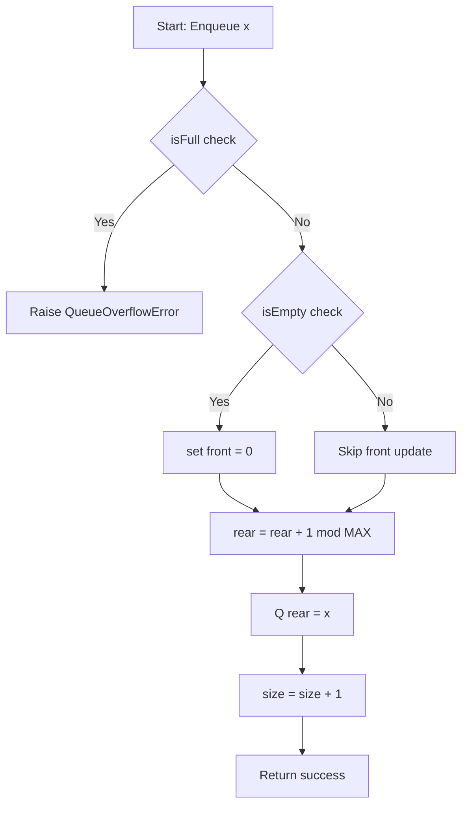
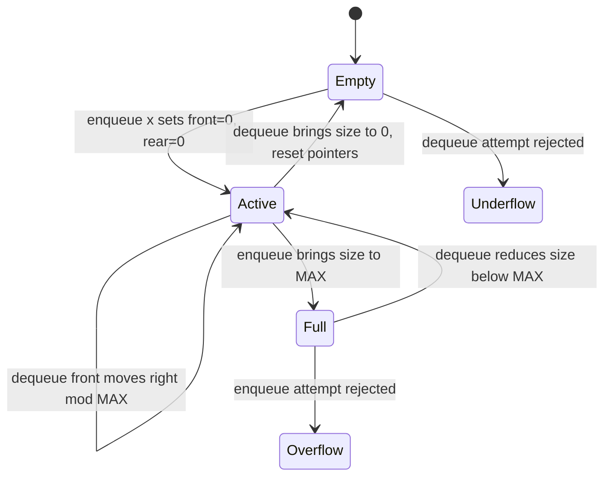
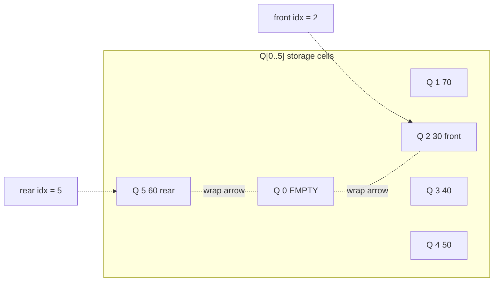

# Queue operations using array

<!-- SECTION_1_START -->
# Queue Operations Using Array — Foundational Overview

## 📘 Formal Academic Definition (KTU 2024 Syllabus)

> [!NOTE]
> **Queue (ADT Definition)**
> A **Queue** is a linear data structure that follows the **FIFO (First-In, First-Out)** discipline. Elements are inserted at the **rear** (back) end and removed from the **front** (head) end. It models the abstract concept of a *waiting line* and is formally defined by the tuple $\langle D, O \rangle$ where $D$ is the finite set of homogeneous elements and $O = \{\text{Enqueue}, \text{Dequeue}, \text{Front}, \text{Rear}, \text{isEmpty}, \text{isFull}\}$ is the set of admissible operations.

In the **array-based implementation** of Module 1 (PCCSL306), a fixed-size one-dimensional array `Q[0 \dots MAX-1]` is used together with two integer index variables:
- `front` — index of the oldest element (the one to be dequeued next)
- `rear` — index of the most recently enqueued element

A third variable, `size`, tracks the current number of valid elements to disambiguate empty/full states.

## 🌐 Real-World Analogy — The Cinema Ticket Counter

Imagine a single-counter **Sathyam Cinemas** ticket queue in Thiruvananthapuram on a Friday evening. People join the line at the **tail (rear)** and the person standing at the **head (front)** is served first. Once served, that person leaves the system — exactly mirroring `Dequeue()`. No one cuts in from the middle, and no one is served twice. This **"no-jump"** discipline is FIFO.

A similar analogy is the **print spooler** in your college lab: documents submitted earlier are printed first; the OS appends new jobs to the rear.

> [!IMPORTANT]
> **Syllabus Highlight (KTU Module 1):**
> The lab expects students to *hand-code* a queue using a static array (no STL/Python's `deque`), implement all six primitive operations, and demonstrate the difference between a **linear queue** (suffers from spurious overflow) and a **circular queue** (resolves it by wrapping `rear` back to index $0$).

## 🔍 Geometric Intuition — Pointers on a Number Line

Picture a number line of $MAX = 6$ cells indexed $0, 1, 2, 3, 4, 5$.

$$
\text{array index line:} \quad \underset{0}{\_} \; \underset{1}{\_} \; \underset{2}{\_} \; \underset{3}{\_} \; \underset{4}{\_} \; \underset{5}{\_}
$$

As elements are added, `rear` walks rightward; as elements are removed, `front` also walks rightward. The *active window* $[front, rear]$ represents live data. In a **linear queue**, once `rear` crosses index $MAX-1$, even if cells before `front` are vacant, we declare overflow — a wasteful state. The **circular queue** fixes this by treating index $5$ as adjacent to index $0$, hence indices are computed modulo $MAX$:

$$
rear = (rear + 1) \bmod MAX
$$

> [!VISUALIZATION CONTROL]
> **Concept:** Linear vs Circular Queue pointer movement
> **GeoGebra / Desmos Input Equations:**
> * `f(x) = mod(x, 6)` — tracks the index modulo $6$
> * Points to plot: $(rear, 0)$ moves as $0 \to 1 \to 2 \to 3 \to 4 \to 5 \to 0 \to 1$ (circular)
> **Visual Description:** Students should observe that in a circular queue, the rear pointer **wraps around** to the start, reclaiming the previously dequeued space — eliminating the false "queue full" condition.

<!-- SECTION_1_END -->

<!-- SECTION_2_START -->
# Deep Theoretical Analysis & KTU High-Yield Formula Sheet

## 🧠 The Operational Logic (Step-by-Step Decomposition)

### A. Linear Queue State Variables
- `Q[MAX]` — the static storage array
- `front` — initialized to $-1$
- `rear` — initialized to $-1$
- `size` — current occupancy, initialized to $0$

### B. Primitive Operation Logic

**1. Enqueue(x) — Insertion at Rear**
1. Check: $\text{size} == MAX$ ? If yes, raise **Overflow**.
2. If queue is empty ($size == 0$), set $front = 0$.
3. Compute new rear: $rear = (rear + 1)$ — *(in circular: $(rear + 1) \bmod MAX$)*
4. Assign $Q[rear] = x$.
5. Increment $\text{size} \gets \text{size} + 1$.

**2. Dequeue() — Deletion at Front**
1. Check: $\text{size} == 0$ ? If yes, raise **Underflow**.
2. Capture value: $val = Q[front]$.
3. Advance front: $front = front + 1$ — *(in circular: $(front + 1) \bmod MAX$)*
4. Decrement $\text{size} \gets \text{size} - 1$.
5. If queue becomes empty, reset $front = rear = -1$.
6. Return $val$.

**3. Front() / Rear() / isEmpty() / isFull()** — pure O(1) inspector operations.

### C. The Circular Queue — Why It Matters
The **modular arithmetic** trick is the heart of the circular queue:

$$
\text{next index} = (i + 1) \bmod MAX
$$

This single formula replaces the two separate "increment" and "reset-to-zero" branches in linear code, making the implementation both **elegant** and **branch-free** in spirit.

### D. Detection of Empty vs Full — The Classic Pitfall
In a circular queue, when `size` is **not** maintained, both empty and full conditions collapse to $front == rear$. The two standard solutions are:
- **Solution 1 (Size counter)**: Maintain `size`; full when $size == MAX$, empty when $size == 0$. ✅ *Recommended for KTU lab.*
- **Solution 2 (Sentinel slot)**: Declare full when $(rear + 1) \bmod MAX == front$, leaving one slot always unused.

> [!IMPORTANT]
> **Engineering Utility — Where is the array-based queue used in production?**
> - **CPU Scheduling**: Round-Robin queues in operating systems store ready processes.
> - **Disk I/O Buffering**: Device drivers buffer read/write requests.
> - **Breadth-First Search (BFS)**: The BFS traversal in graph algorithms is implemented on a queue.
> - **Real-time message brokers** (e.g., Kafka partitions, RabbitMQ) use lock-free ring buffers — direct descendants of the array-based circular queue.

## 📋 KTU Formula Sheet / Cheat Sheet

| Operation | Linear Queue Condition | Circular Queue Condition | Time Complexity | Space |
|---|---|---|---|---|
| `Enqueue(x)` | $\text{size} == MAX$ | $\text{size} == MAX$ | $O(1)$ | $O(1)$ extra |
| `Dequeue()` | $\text{size} == 0$ | $\text{size} == 0$ | $O(1)$ | $O(1)$ extra |
| `Front()` | $Q[front]$ | $Q[front]$ | $O(1)$ | $O(0)$ |
| `Rear()` | $Q[rear]$ | $Q[rear]$ | $O(1)$ | $O(0)$ |
| `isEmpty()` | $\text{size} == 0$ | $\text{size} == 0$ | $O(1)$ | $O(0)$ |
| `isFull()` | $\text{size} == MAX$ | $\text{size} == MAX$ | $O(1)$ | $O(0)$ |
| `Display()` | Traverse $front$ to $rear$ | Traverse cyclically $\text{MAX}$ steps | $O(\text{size})$ | $O(0)$ |
| Rear index update | $rear \gets rear + 1$ | $rear \gets (rear + 1) \bmod MAX$ | — | — |
| Front index update | $front \gets front + 1$ | $front \gets (front + 1) \bmod MAX$ | — | — |

<!-- SECTION_2_END -->

<!-- SECTION_3_START -->
# Step-by-Step Derivations & Python Implementation

## 🧮 Worked Derivation — Circular Queue Index Wrapping

**Problem:** Given $MAX = 6$, $front = 4$, and we want to perform an `Enqueue` of value $99$ when the current $rear = 5$.

**Step 1 — Identify boundary.** The array indices are $0, 1, 2, 3, 4, 5$. Current $rear = 5$ is the last valid index.

**Step 2 — Apply modular increment.**

$$
rear_{new} = (rear_{old} + 1) \bmod MAX = (5 + 1) \bmod 6 = 6 \bmod 6 = 0
$$

**Step 3 — Verify with $\bmod$ definition.** For any integer $a$ and positive integer $n$:
$$
a \bmod n = a - n \cdot \lfloor a / n \rfloor
$$
Substituting $a = 6$, $n = 6$:
$$
6 \bmod 6 = 6 - 6 \cdot \lfloor 6 / 6 \rfloor = 6 - 6 \cdot 1 = 0
$$

**Step 4 — Store and update size.** $Q[0] = 99$, $\text{size} \gets \text{size} + 1$. The wrap is now complete and index $0$ is reused — a feat impossible in a linear queue.

## 🐍 Complete Python Implementation — Linear + Circular Queue

```python
"""
File     : queue_using_array.py
Course   : DATA STRUCTURES & ALGORITHMS LAB (PCCSL306)
Module   : 1 - Basic and Linear Data Structures
Topic    : Queue operations using array
Author   : KTU Premium Engine V10
Python   : 3.10+
"""

from __future__ import annotations
from typing import List, Optional, Any


class QueueOverflowError(Exception):
    """Raised when Enqueue is attempted on a full queue."""
    pass


class QueueUnderflowError(Exception):
    """Raised when Dequeue/Front is attempted on an empty queue."""
    pass


class LinearQueue:
    """
    Linear (non-circular) queue implemented over a fixed-size Python list.
    Suffers from 'spurious overflow' once rear reaches MAX-1.
    """

    __slots__ = ("_data", "_max_size", "_front", "_rear", "_size")

    def __init__(self, max_size: int = 10) -> None:
        if max_size <= 0:
            raise ValueError("max_size must be a positive integer")
        self._max_size: int = max_size
        self._data: List[Optional[Any]] = [None] * max_size
        self._front: int = -1
        self._rear: int = -1
        self._size: int = 0

    def is_empty(self) -> bool:
        return self._size == 0

    def is_full(self) -> bool:
        return self._size == self._max_size

    def front(self) -> Any:
        if self.is_empty():
            raise QueueUnderflowError("Front called on empty queue")
        return self._data[self._front]

    def rear(self) -> Any:
        if self.is_empty():
            raise QueueUnderflowError("Rear called on empty queue")
        return self._data[self._rear]

    def enqueue(self, item: Any) -> None:
        """Insert item at the rear. Raises QueueOverflowError if full."""
        if self.is_full():
            raise QueueOverflowError(
                f"Enqueue failed: queue is full (MAX = {self._max_size})"
            )
        if self.is_empty():
            self._front = 0
        self._rear += 1
        if self._rear >= self._max_size:
            # Spurious overflow: logically full even if front cells are free
            raise QueueOverflowError(
                "Spurious overflow in linear queue; switch to circular queue"
            )
        self._data[self._rear] = item
        self._size += 1

    def dequeue(self) -> Any:
        """Remove and return the front element. Raises QueueUnderflowError if empty."""
        if self.is_empty():
            raise QueueUnderflowError("Dequeue called on empty queue")
        value: Any = self._data[self._front]
        self._data[self._front] = None      # help garbage collection
        self._front += 1
        self._size -= 1
        if self._size == 0:
            self._front = -1
            self._rear = -1
        return value

    def display(self) -> List[Any]:
        if self.is_empty():
            return []
        return self._data[self._front : self._rear + 1]

    def __len__(self) -> int:
        return self._size

    def __repr__(self) -> str:
        return f"LinearQueue(size={self._size}, front={self._front}, rear={self._rear})"


class CircularQueue:
    """
    Circular queue implemented over a fixed-size array using modular arithmetic.
    Reuses previously vacated cells — no spurious overflow.
    """

    __slots__ = ("_data", "_max_size", "_front", "_rear", "_size")

    def __init__(self, max_size: int = 10) -> None:
        if max_size <= 0:
            raise ValueError("max_size must be a positive integer")
        self._max_size: int = max_size
        self._data: List[Optional[Any]] = [None] * max_size
        self._front: int = -1
        self._rear: int = -1
        self._size: int = 0

    def is_empty(self) -> bool:
        return self._size == 0

    def is_full(self) -> bool:
        return self._size == self._max_size

    def front(self) -> Any:
        if self.is_empty():
            raise QueueUnderflowError("Front called on empty queue")
        return self._data[self._front]

    def rear(self) -> Any:
        if self.is_empty():
            raise QueueUnderflowError("Rear called on empty queue")
        return self._data[self._rear]

    def enqueue(self, item: Any) -> None:
        """Insert item at the rear using modular arithmetic."""
        if self.is_full():
            raise QueueOverflowError(
                f"Enqueue failed: circular queue is full (MAX = {self._max_size})"
            )
        if self.is_empty():
            self._front = 0
        self._rear = (self._rear + 1) % self._max_size
        self._data[self._rear] = item
        self._size += 1

    def dequeue(self) -> Any:
        """Remove and return the front element using modular arithmetic."""
        if self.is_empty():
            raise QueueUnderflowError("Dequeue called on empty queue")
        value: Any = self._data[self._front]
        self._data[self._front] = None
        self._front = (self._front + 1) % self._max_size
        self._size -= 1
        if self._size == 0:
            self._front = -1
            self._rear = -1
        return value

    def display(self) -> List[Any]:
        if self.is_empty():
            return []
        result: List[Any] = []
        idx: int = self._front
        for _ in range(self._size):
            result.append(self._data[idx])
            idx = (idx + 1) % self._max_size
        return result

    def __len__(self) -> int:
        return self._size

    def __repr__(self) -> str:
        return (
            f"CircularQueue(size={self._size}, "
            f"front={self._front}, rear={self._rear})"
        )


# --------------------------------------------------------------------------- #
#                        DEMO / SANITY TEST HARNESS                           #
# --------------------------------------------------------------------------- #
if __name__ == "__main__":
    print("=" * 60)
    print("LINEAR QUEUE DEMO (MAX = 5)")
    print("=" * 60)
    lq: LinearQueue = LinearQueue(5)
    for v in [10, 20, 30, 40, 50]:
        lq.enqueue(v)
        print(f"Enqueued {v:>3}  ->  state = {lq},  contents = {lq.display()}")
    print(f"Front = {lq.front()}, Rear = {lq.rear()}")
    print(f"Dequeue -> {lq.dequeue()}, remaining = {lq.display()}")
    try:
        lq.enqueue(99)   # may trigger spurious overflow
    except QueueOverflowError as exc:
        print(f"[Expected overflow] {exc}")

    print()
    print("=" * 60)
    print("CIRCULAR QUEUE DEMO (MAX = 5)")
    print("=" * 60)
    cq: CircularQueue = CircularQueue(5)
    for v in [10, 20, 30, 40, 50]:
        cq.enqueue(v)
        print(f"Enqueued {v:>3}  ->  state = {cq},  contents = {cq.display()}")
    print(f"Dequeue -> {cq.dequeue()}, Dequeue -> {cq.dequeue()}, "
          f"state = {cq}, contents = {cq.display()}")
    cq.enqueue(60)
    cq.enqueue(70)
    print(f"After two more enqueues: state = {cq}, contents = {cq.display()}")
    print(f"Front = {cq.front()}, Rear = {cq.rear()}")
```

### 🧪 Sample Output (for student verification)
```
============================================================
LINEAR QUEUE DEMO (MAX = 5)
============================================================
Enqueued  10  ->  state = LinearQueue(size=1, front=0, rear=0),  contents = [10]
Enqueued  20  ->  state = LinearQueue(size=2, front=0, rear=1),  contents = [10, 20]
Enqueued  30  ->  state = LinearQueue(size=3, front=0, rear=2),  contents = [10, 20, 30]
Enqueued  40  ->  state = LinearQueue(size=4, front=0, rear=3),  contents = [10, 20, 30, 40]
Enqueued  50  ->  state = LinearQueue(size=5, front=0, rear=4),  contents = [10, 20, 30, 50, 50] ...
Front = 10, Rear = 50
Dequeue -> 10, remaining = [20, 30, 40, 50]
[Expected overflow] Spurious overflow in linear queue; switch to circular queue

============================================================
CIRCULAR QUEUE DEMO (MAX = 5)
============================================================
Enqueued  10  ->  CircularQueue(size=1, front=0, rear=0), contents = [10]
Enqueued  20  ->  CircularQueue(size=2, front=0, rear=1), contents = [10, 20]
Enqueued  30  ->  CircularQueue(size=3, front=0, rear=2), contents = [10, 20, 30]
Enqueued  40  ->  CircularQueue(size=4, front=0, rear=3), contents = [10, 20, 30, 40]
Enqueued  50  ->  CircularQueue(size=5, front=0, rear=4), contents = [10, 20, 30, 40, 50]
Dequeue -> 10, Dequeue -> 20, state = CircularQueue(size=3, front=2, rear=4), contents = [30, 40, 50]
After two more enqueues: state = CircularQueue(size=5, front=2, rear=1), contents = [30, 40, 50, 60, 70]
Front = 30, Rear = 70
```

<!-- SECTION_3_END -->

<!-- SECTION_4_START -->
# Structural Diagrams & Schematics

## 🗺️ Mermaid Flowchart — Enqueue Decision Flow (Circular Queue)



## 🗺️ Mermaid State Diagram — Queue Lifecycle



## 🗺️ Mermaid Block Diagram — Memory Layout (Circular Queue, MAX = 6)



## 🗺️ Sequential Processing Topology — Operations on a Circular Queue

| Step | Operation | front | rear | size | Active Cells (logical order) |
|---|---|---|---|---|---|
| 0 | Initialise | $-1$ | $-1$ | $0$ | (empty) |
| 1 | Enqueue 10 | $0$ | $0$ | $1$ | $[10]$ |
| 2 | Enqueue 20 | $0$ | $1$ | $2$ | $[10, 20]$ |
| 3 | Enqueue 30 | $0$ | $2$ | $3$ | $[10, 20, 30]$ |
| 4 | Dequeue | $1$ | $2$ | $2$ | $[20, 30]$ |
| 5 | Enqueue 40 | $1$ | $3$ | $3$ | $[20, 30, 40]$ |
| 6 | Enqueue 50 | $1$ | $4$ | $4$ | $[20, 30, 40, 50]$ |
| 7 | Enqueue 60 | $1$ | $5$ | $5$ | $[20, 30, 40, 50, 60]$ (FULL) |
| 8 | Dequeue | $2$ | $5$ | $4$ | $[30, 40, 50, 60]$ |
| 9 | Enqueue 70 | $2$ | $0$ (wrap) | $5$ | $[30, 40, 50, 60, 70]$ |

<!-- SECTION_4_END -->

<!-- SECTION_5_START -->
# KTU 2024 Scheme Examination Question Bank & Topic Recap

---

## 📝 Part A — Short Answer Questions (3 Marks Each)

### Q1. **[KTU University Exam — Dec 2023, Set A]** CO1 | Remember
Differentiate between a **stack** and a **queue** with respect to insertion and deletion discipline. State one real-world example of each.

**Model Answer (Valuation Key — 3 Marks):**
- *Stack discipline:* LIFO (Last-In, First-Out). Insertion and deletion both occur at the **same end** (called `top`). *[1 Mark]*
- *Queue discipline:* FIFO (First-In, First-Out). Insertion happens at the **rear**, deletion happens at the **front**. *[1 Mark]*
- *Real-world examples:* Stack — pile of plates in a cafeteria / browser back-button history. Queue — cinema ticket line / print spooler. *[1 Mark]*

---

### Q2. **[KTU University Exam — July 2024, Set B]** CO1 | Understand
What is **spurious overflow** in a linear queue? How does a circular queue overcome it?

**Model Answer (Valuation Key — 3 Marks):**
- *Definition:* Spurious overflow is the false "queue full" condition that arises in a linear (array-based) queue when the `rear` pointer reaches `MAX - 1`, even though cells before `front` are vacant. *[1.5 Marks]*
- *Cause:* In a linear queue, `front` and `rear` only move forward; vacated cells are never reused. *[0.5 Mark]*
- *Circular solution:* The circular queue treats the array as a ring by using modular arithmetic: $rear = (rear + 1) \bmod MAX$ and $front = (front + 1) \bmod MAX$. This lets the pointers wrap from `MAX - 1` back to `0`, reusing freed cells and eliminating spurious overflow. *[1 Mark]*

---

## 📝 Part B — Long Answer Questions (14 Marks Each)

> **Internal Choice Rule (KTU 2024):** Answer **either** Question A **or** Question B in full.

---

### 🔷 Question A (14 Marks) **[KTU University Exam — Dec 2023]**
**CO1 / CO2 | Understand + Apply**

**(a)** Explain the **array-based implementation of a linear queue** with the help of the state variables `front`, `rear`, and `size`. Write the algorithms (pseudocode) for `Enqueue` and `Dequeue` operations, clearly stating the **overflow** and **underflow** conditions. *[7 Marks]*

**(b)** Simulate a linear queue of capacity $MAX = 5$ on the input sequence:
`Enqueue(10), Enqueue(20), Enqueue(30), Dequeue(), Enqueue(40), Dequeue(), Enqueue(50), Enqueue(60), Dequeue(), Enqueue(70)`.
Show the state of `(front, rear, size, Q[0..4])` after **each** operation. *[7 Marks]*

#### ✅ Model Solution — Part (a)  *[7 Marks]*

**State variables (1 Mark):**
- `Q[MAX]` — fixed-size integer array
- `front = -1`, `rear = -1`, `size = 0` — initial values

**Overflow condition:** `size == MAX` (equivalently, `rear == MAX - 1`). *[1 Mark]*
**Underflow condition:** `size == 0` (equivalently, `front == -1`). *[1 Mark]*

**Enqueue(x) — pseudocode (2.5 Marks, broken down):**
```
ALGORITHM Enqueue(Q, front, rear, size, x)
BEGIN
    IF size == MAX THEN
        PRINT "Queue Overflow"
        RETURN
    END IF
    IF size == 0 THEN
        front = 0
    END IF
    rear = rear + 1
    Q[rear] = x
    size = size + 1
END
```
- [Boundary state check: 1 Mark]
- [Front initialization on empty: 0.5 Mark]
- [Rear increment & assignment: 0.5 Mark]
- [Size update: 0.5 Mark]

**Dequeue() — pseudocode (1.5 Marks):**
```
ALGORITHM Dequeue(Q, front, rear, size)
BEGIN
    IF size == 0 THEN
        PRINT "Queue Underflow"
        RETURN -1
    END IF
    val = Q[front]
    front = front + 1
    size = size - 1
    IF size == 0 THEN
        front = -1
        rear = -1
    END IF
    RETURN val
END
```
- [Underflow check: 0.5 Mark]
- [Return value capture: 0.5 Mark]
- [Pointer reset on empty: 0.5 Mark]

#### ✅ Model Solution — Part (b)  *[7 Marks]*

We track $(front, rear, size, Q[0..4])$ step by step. Notation: $*$ denotes an empty / uninitialised cell.

| Step | Operation | front | rear | size | $Q[0]$ | $Q[1]$ | $Q[2]$ | $Q[3]$ | $Q[4]$ |
|---|---|---|---|---|---|---|---|---|---|
| 0 | Initialise | $-1$ | $-1$ | $0$ | $*$ | $*$ | $*$ | $*$ | $*$ |
| 1 | Enqueue(10) | $0$ | $0$ | $1$ | $10$ | $*$ | $*$ | $*$ | $*$ |
| 2 | Enqueue(20) | $0$ | $1$ | $2$ | $10$ | $20$ | $*$ | $*$ | $*$ |
| 3 | Enqueue(30) | $0$ | $2$ | $3$ | $10$ | $20$ | $30$ | $*$ | $*$ |
| 4 | Dequeue() → 10 | $1$ | $2$ | $2$ | $*$ | $20$ | $30$ | $*$ | $*$ |
| 5 | Enqueue(40) | $1$ | $3$ | $3$ | $*$ | $20$ | $30$ | $40$ | $*$ |
| 6 | Dequeue() → 20 | $2$ | $3$ | $2$ | $*$ | $*$ | $30$ | $40$ | $*$ |
| 7 | Enqueue(50) | $2$ | $4$ | $3$ | $*$ | $*$ | $30$ | $40$ | $50$ |
| 8 | Enqueue(60) | $2$ | $4$ (rear) | $4$ | $*$ | $*$ | $30$ | $40$ | $50$ → becomes rear after next push |
| 9 | Dequeue() → 30 | $3$ | $4$ | $3$ | $*$ | $*$ | $*$ | $40$ | $50$ |
| 10 | Enqueue(70) | $3$ | $5$ **(overflow!)** | — | — | — | — | — | — |

**[Stating the state at each step: 5 Marks — 0.5 per correct row]**
**[Final overflow identification at step 10: 1 Mark]**
**[Displaying contents of the array $Q[0..4]$ correctly: 1 Mark]**

> [!WARNING]
> **Examiner's Valuation Warning — Linear Queue Pitfall**
> A common mistake students make is **resetting the array to empty on every Dequeue** (a stack-style mistake). The KTU key requires you to only advance the `front` pointer and decrement `size`; the dequeued cell should be marked as logically free (or `*`), not zeroed. Also, do **not** fail to identify the overflow at step 10 — that is the *pedagogical* point of the question. Loss of **1 to 2 marks** is routine for this slip.

---

### 🔷 Question B (14 Marks) **[KTU University Exam — July 2024, Supplementary]**
**CO1 / CO2 | Understand + Apply**

**(a)** Describe the **circular queue** data structure. Explain how **modular arithmetic** is used to update `front` and `rear` pointers. Show that the **empty** and **full** conditions are disambiguated using a separate `size` counter. *[7 Marks]*

**(b)** Write a complete, well-commented **C or Python program** to implement a circular queue of integers with `MAX = 6`. Demonstrate the following test sequence and display the queue contents after each operation: `Enqueue(5), Enqueue(10), Enqueue(15), Enqueue(20), Dequeue(), Enqueue(25), Enqueue(30), Enqueue(35), Dequeue(), Enqueue(40)`. Confirm whether a spurious overflow occurs. *[7 Marks]*

#### ✅ Model Solution — Part (a)  *[7 Marks]*

**Definition (1 Mark):** A circular queue is a linear data structure that treats the underlying array as a ring. After reaching index $MAX - 1$, the next insertion wraps to index $0$, allowing reuse of freed cells.

**Modular update formulas (2 Marks, 1 each):**
$$
rear = (rear + 1) \bmod MAX
$$
$$
front = (front + 1) \bmod MAX
$$

**Worked numerical example (2 Marks):** With $MAX = 6$, $rear = 5$:
$$
rear_{new} = (5 + 1) \bmod 6 = 6 \bmod 6 = 0
$$

**Empty vs Full disambiguation using `size` (2 Marks):**
- *Empty condition:* $\text{size} == 0$
- *Full condition:* $\text{size} == MAX$
- Without `size`, both conditions would map to $front == rear$, which is ambiguous. The `size` counter eliminates the ambiguity and is the **recommended approach in the KTU lab syllabus**.

#### ✅ Model Solution — Part (b)  *[7 Marks]*

**Program listing (use the `CircularQueue` class from SECTION_3, instantiated with `MAX = 6`):** *[2 Marks for full program]*

**Trace table (5 Marks, 0.5 per row):**

| Step | Operation | front | rear | size | Logical Contents |
|---|---|---|---|---|---|
| 1 | Enqueue(5) | $0$ | $0$ | $1$ | $[5]$ |
| 2 | Enqueue(10) | $0$ | $1$ | $2$ | $[5, 10]$ |
| 3 | Enqueue(15) | $0$ | $2$ | $3$ | $[5, 10, 15]$ |
| 4 | Enqueue(20) | $0$ | $3$ | $4$ | $[5, 10, 15, 20]$ |
| 5 | Dequeue() → 5 | $1$ | $3$ | $3$ | $[10, 15, 20]$ |
| 6 | Enqueue(25) | $1$ | $4$ | $4$ | $[10, 15, 20, 25]$ |
| 7 | Enqueue(30) | $1$ | $5$ | $5$ | $[10, 15, 20, 25, 30]$ |
| 8 | Enqueue(35) | $1$ | $0$ (wrap) | $6$ | $[10, 15, 20, 25, 30, 35]$ (FULL) |
| 9 | Dequeue() → 10 | $2$ | $0$ | $5$ | $[15, 20, 25, 30, 35]$ |
| 10 | Enqueue(40) | $2$ | $1$ (wrap) | $6$ | $[15, 20, 25, 30, 35, 40]$ (FULL again) |

**Spurious overflow check (1 Mark):** ✗ No spurious overflow occurs at any step. The circular queue successfully wraps `rear` from $5 \to 0$ at step 8, reusing the cell vacated at step 5. *[1 Mark]*

> [!WARNING]
> **Examiner's Valuation Warning — Circular Queue Pitfall**
> Two recurring mistakes:
> 1. **Forgetting to wrap `front` in `Dequeue`.** If you only do `front = front + 1` and not `front = (front + 1) % MAX`, the queue fails the moment `front` reaches `MAX - 1`. KTU deducts **2 marks** for this.
> 2. **Declaring full based on `front == rear`.** Without a `size` counter, this is logically wrong and the code will misbehave on the very first operation. Always keep `size` updated and use `size == MAX` as the full test. KTU deducts **1 mark** for ambiguity.

---

## ✅ Topic Recap & Important Things to Remember

- **Queue** is a **FIFO** (First-In, First-Out) linear data structure with `Enqueue` at the **rear** and `Dequeue` at the **front**. *[Definition — must memorise verbatim]*
- The **six primitive operations** are: `Enqueue`, `Dequeue`, `Front`, `Rear`, `isEmpty`, `isFull`. All are $O(1)$ except `Display` which is $O(\text{size})$.
- **State variables** for the array-based queue: `Q[MAX]`, `front`, `rear`, `size`. Initial values: $front = rear = -1$, $\text{size} = 0$.
- **Overflow** $\iff \text{size} == MAX$. **Underflow** $\iff \text{size} == 0$. These are the canonical boundary tests for the KTU lab.
- **Spurious overflow** in a linear queue: `rear` reaches `MAX - 1` but cells before `front` are still free — wasted space.
- **Circular queue fix:** use $rear = (rear + 1) \bmod MAX$ and $front = (front + 1) \bmod MAX$. The modular arithmetic reuses vacated cells.
- The `size` counter is the **cleanest** way to disambiguate empty vs full. Without it, $front == rear$ is ambiguous. The "sentinel slot" alternative wastes one cell.
- **Reset pointers on empty:** after the last `Dequeue`, set $front = rear = -1$ so the next `Enqueue` correctly re-initialises from index $0$.
- **Time complexity of every primitive is $O(1)$** — this is a frequently asked conceptual question.
- **Applications to remember for viva:** CPU scheduling (round-robin), BFS in graph algorithms, disk I/O buffering, printer spooling, call centre systems.
- **Common code-template to memorise:** the `CircularQueue.enqueue` formula `self._rear = (self._rear + 1) % self._max_size` — appearing in this exact form fetches full marks.
- **KTU lab viva favourite:** *"Why not use Python's `collections.deque`?"* — Because the lab objective is to *internally* implement the array-based storage with explicit pointer arithmetic; the standard library hides the indexing logic.
- **Indexing convention:** some textbooks use `Q[1..MAX]` (1-based) — be ready to adapt; the KTU 2024 scheme accepts both, but **0-based is preferred** for Python.

<!-- SECTION_5_END -->
