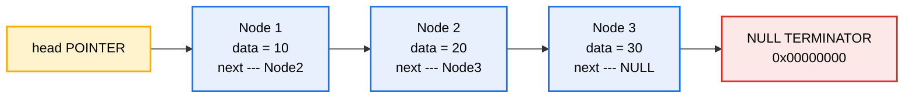
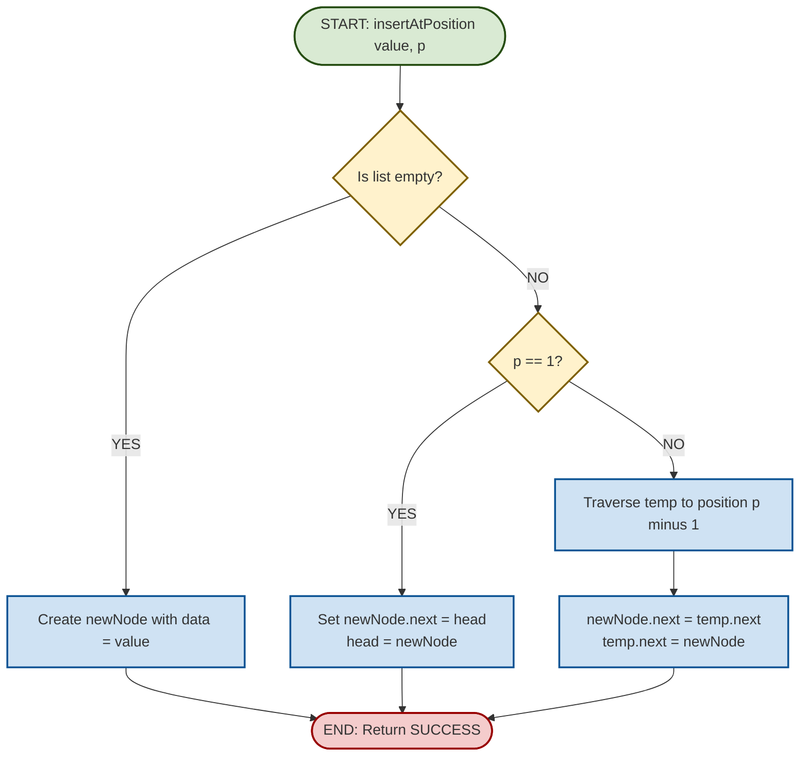
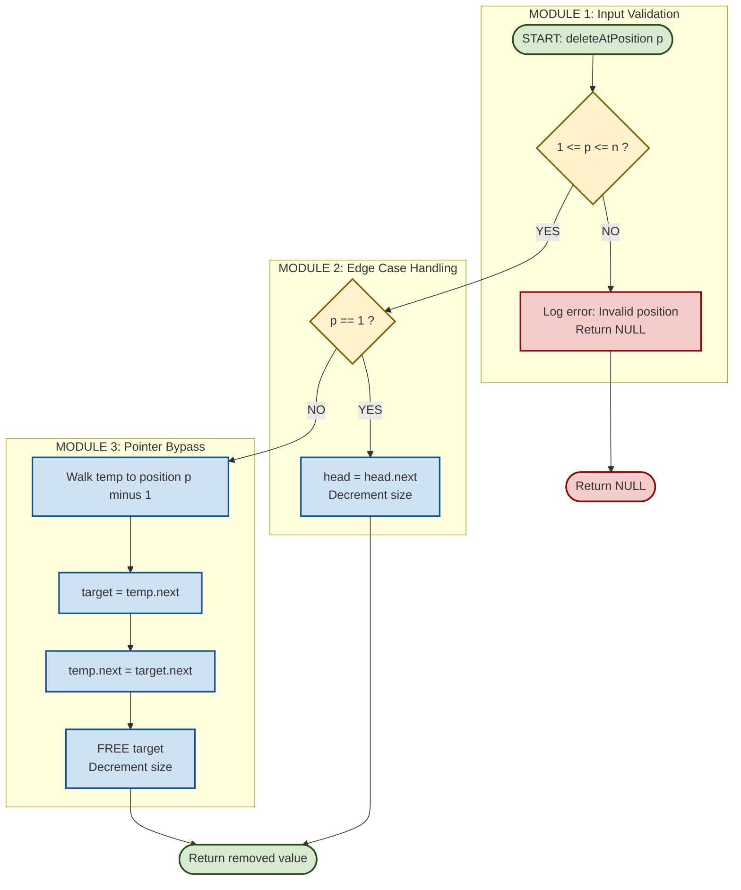
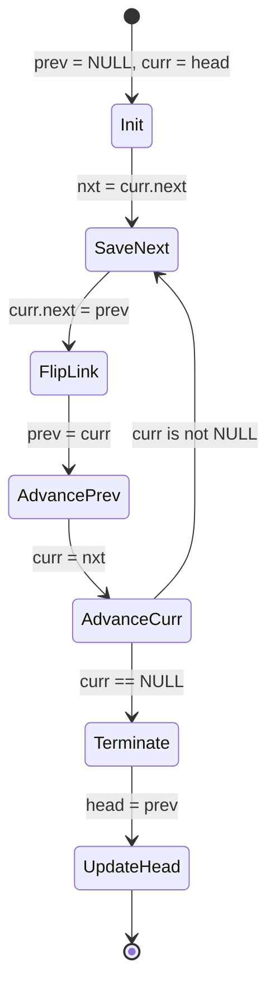
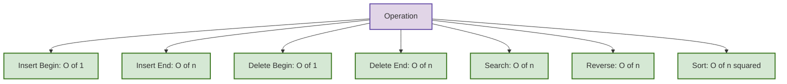

# Singly Linked List operations

<!-- SECTION_1_START -->
# Singly Linked List — Core Definition & Intuitive Overview

## 📘 Formal Academic Definition (KTU 2024 Syllabus Terminology)

A **Singly Linked List (SLL)** is a dynamic, linear data structure composed of a sequence of **nodes**, where each node stores two components: a **data field** (the actual payload) and a **single link / next pointer** that references the succeeding node in the sequence. The list is accessed starting from a designated **head pointer**, and the terminal node points to a **NULL** sentinel, marking the logical end of the list.

> [!IMPORTANT]
> **KTU 2024 — Module 1 Highlight**
> A Singly Linked List belongs to the family of *dynamic* linear data structures — its memory is allocated at runtime (typically via the `new` operator in C++/Java or `malloc` in C, or implicit heap allocation in Python). It directly contrasts with the **Static Array**, whose size is fixed at compile time.

## 🧠 Conceptual Analogy — "The Train of Bogies"

Imagine a railway train 🚂:
- **Engine (Head Pointer):** Holds no passenger cargo but knows where the first bogie is parked.
- **Each Bogie (Node):** Carries passengers (data) and a single chain/coupler (next pointer) attached only to its **rear**, connecting to the bogie immediately behind it.
- **Last Bogie:** Its rear coupler is **untied** — equivalent to a `NULL` pointer.
- **Inserting a new bogie in the middle:** You simply uncouple two adjacent bogies, hook the new one in between, and re-couple — no need to shift other bogies.

This is exactly how an SLL handles insertion: only the affected `next` pointers are re-wired; no data shifting is required.

## 🔑 Key Terminology

| Term | Description |
|---|---|
| **Node** | A self-referential structure containing `data` and a pointer `next` to the next node. |
| **Head** | A pointer/reference variable that stores the address of the first node. It is **not** a node itself. |
| **NULL** | A special pointer constant (`0x0` in C, `None` in Python) indicating the list end. |
| **Traversal** | The sequential walk from head to the last node, following `next` pointers one hop at a time. |
| **Self-referential Structure** | A struct/class whose member points to another instance of its own type. |
| **Dynamic Allocation** | Memory for nodes is requested from the **heap** at runtime. |

> [!NOTE]
> **Syllabus Alert:** The 2024 scheme explicitly requires students to *implement all operations in C language* during the lab viva. Although we present Python for clarity, the same logic maps one-to-one to C `struct node` definitions with `malloc` / `free` calls.

## 🖼️ Visualization of a Single Node

> [!VISUALIZATION CONTROL]
> **Concept:** Node memory layout of a Singly Linked List with three nodes.
> **GeoGebra / Desmos Input Equations (Conceptual Sketch):**
> * `Node1 = (data = 10, next → Node2)`
> * `Node2 = (data = 20, next → Node3)`
> * `Node3 = (data = 30, next → NULL)`
>
> **Visual Description:** Draw three rectangles side-by-side, each split vertically into two halves. The left half of each rectangle contains the `data` value (10, 20, 30), and the right half contains an arrow labelled `next` that points to the next rectangle. The arrow from the third rectangle should point downward to the text `NULL` inside a small oval, indicating termination.

### Memory Footprint (per node)

A single node occupies exactly **2 × word size** on a 64-bit architecture (8 bytes for the `data` field if `int`, plus 8 bytes for the pointer — total **16 bytes** in C). In Python, due to object overhead, each list node actually consumes **~56 bytes** (the reason competitive programmers use C/C++ for memory-critical linked structures).

<!-- SECTION_1_END -->

<!-- SECTION_2_START -->
# Deep Theoretical Analysis & KTU High-Yield Formula Sheet

## 🧩 Anatomy of a Node — The Self-Referential Structure

### C-style Definition (Canonical KTU Lab Format)

```c
struct Node {
    int data;           // Payload field
    struct Node *next;  // Pointer to the next node of SAME type
};
```

### Equivalent Python Class (Type-Hinted)

```python
from __future__ import annotations
from typing import Optional

class Node:
    def __init__(self, data: int, next_ptr: Optional["Node"] = None) -> None:
        self.data: int = data
        self.next: Optional["Node"] = next_ptr
```

## ⚙️ Core Operations — Logic Breakdown

### 1. **Insertion at Beginning** (a.k.a. Insert Front / Prepend)
1. Dynamically allocate a new node `newNode` → `newNode = (Node*)malloc(sizeof(Node))`.
2. Assign payload → `newNode->data = value`.
3. Point its `next` to whatever the current head points at → `newNode->next = head`.
4. Update `head` to point at `newNode` → `head = newNode`.
5. **Time Complexity: O(1)** — only pointer reassignments, no traversal.

### 2. **Insertion at End** (a.k.a. Append)
1. Allocate `newNode`, set `data = value`, `next = NULL`.
2. If list is empty (`head == NULL`), set `head = newNode` and return.
3. Otherwise, traverse from `head` using a `temp` pointer until `temp->next == NULL`.
4. Set `temp->next = newNode`.
5. **Time Complexity: O(n)** — must walk the entire list.
6. **Optimization:** Maintain a persistent **tail pointer** → reduces to O(1).

### 3. **Insertion at a Given Position (1-indexed)**
1. Validate position: $1 \le pos \le n+1$, where $n$ is the current length. Out-of-range → return an error flag `false`.
2. If `pos == 1`, delegate to *Insertion at Beginning*.
3. Otherwise, walk a `temp` pointer to the node at position $pos - 1$.
4. Set `newNode->next = temp->next` and `temp->next = newNode`.
5. **Time Complexity: O(n)** in the worst case (insertion at tail).

### 4. **Deletion at Beginning**
1. If list is empty, print "Underflow" and return.
2. Store `head` in a temporary pointer `temp = head`.
3. Move `head = head->next`.
4. Free the old `temp` in C (`free(temp)`) to prevent **memory leak**.
5. **Time Complexity: O(1)**.

### 5. **Deletion at End**
1. If `head == NULL` → underflow.
2. If only one node exists → free it, set `head = NULL`.
3. Otherwise, traverse with `temp` until `temp->next->next == NULL`.
4. Free `temp->next`, set `temp->next = NULL`.
5. **Time Complexity: O(n)**.

### 6. **Deletion at a Given Position**
1. Validate: $1 \le pos \le n$.
2. If `pos == 1`, delegate to *Deletion at Beginning*.
3. Walk to the node at position $pos - 1$ (call it `prev`).
4. Store target in `target = prev->next`.
5. Bypass the target: `prev->next = target->next`.
6. Free `target`.
7. **Time Complexity: O(n)**.

### 7. **Traversal / Display**
1. Initialize `temp = head`.
2. While `temp != NULL`:
   - Print `temp->data`.
   - Advance: `temp = temp->next`.
3. Print newline.
4. **Time Complexity: O(n)**.

### 8. **Search (Linear Search)**
1. Initialize `temp = head`, `position = 1`.
2. While `temp != NULL`:
   - If `temp->data == key`, return `position` (found).
   - Advance: `temp = temp->next`, `position++`.
3. Return $-1$ (not found).
4. **Time Complexity: O(n)**.

### 9. **Reverse the List** (In-Place, Iterative — Classic KTU Question)
1. Initialize three pointers: `prev = NULL`, `curr = head`, `nextPtr = NULL`.
2. While `curr != NULL`:
   - `nextPtr = curr->next` (save the next node).
   - `curr->next = prev` (reverse the link).
   - `prev = curr` (move prev forward).
   - `curr = nextPtr` (move curr forward).
3. After the loop, `head = prev`.
4. **Time Complexity: O(n)**, **Space: O(1)** — the gold standard for KTU.

### 10. **Sort a Singly Linked List** (Bubble Sort Variant)
- Repeatedly swap adjacent `data` fields (not nodes) using nested traversal.
- Outer loop runs $n-1$ times; inner loop runs $n-i-1$ times.
- **Time Complexity: $O(n^2)$**, **Space: $O(1)$**.

## 📊 KTU Formula Sheet / Cheat Sheet

| Operation | Time Complexity | Space Complexity | Notes |
|---|---|---|---|
| Insert at Beginning | $O(1)$ | $O(1)$ | Best-case constant operation |
| Insert at End | $O(n)$ | $O(1)$ | Use tail pointer to optimize to $O(1)$ |
| Insert at Position $p$ | $O(n)$ | $O(1)$ | Worst case is at the tail |
| Delete at Beginning | $O(1)$ | $O(1)$ | Must `free()` in C |
| Delete at End | $O(n)$ | $O(1)$ | Requires walk to second-last node |
| Delete at Position $p$ | $O(n)$ | $O(1)$ | Worst case is the last node |
| Traversal / Display | $O(n)$ | $O(1)$ | Visits every node exactly once |
| Linear Search | $O(n)$ | $O(1)$ | Returns index or $-1$ |
| Reverse (iterative) | $O(n)$ | $O(1)$ | Three-pointer technique |
| Sort (Bubble on data) | $O(n^2)$ | $O(1)$ | Inefficient; use Merge Sort for $O(n \log n)$ |
| Length Calculation | $O(n)$ | $O(1)$ | Maintain counter variable for $O(1)$ |

> [!IMPORTANT]
> **Length formula:** If $n$ is the number of nodes, the **index of the $k^{th}$ node (1-indexed)** is $k-1$, and its **pointer distance from head** is exactly $k-1$ `next` traversals.

## 🏭 Real-World Engineering Utility

- **Operating Systems:** The Linux kernel's `list_head` macro (a circular doubly linked list) manages process scheduling, file descriptors, and memory pages.
- **Memory Management:** Free-block lists in `malloc`/`free` implementations use linked lists to track deallocated memory chunks.
- **Undo/Redo Systems:** Text editors store edit history as nodes in a doubly linked list for forward/backward navigation.
- **Hash Table Chaining:** Collision resolution in hash maps uses linked lists (modern C++ `unordered_map` uses this internally before tree-conversion at threshold 8).
- **Polynomial Representation:** Each term $a_i x^i$ is stored as a node — multiplying two polynomials becomes a pointer-manipulation exercise.

<!-- SECTION_2_END -->

<!-- SECTION_3_START -->
# Step-by-Step Derivations & Python Implementation

## 🐍 Complete Python Implementation — All Operations with Type Hints & Error Logging

```python
from __future__ import annotations
import logging
from typing import Optional, List

# Configure structured error logging (replicates C's stderr with timestamps)
logging.basicConfig(
    level=logging.INFO,
    format="%(asctime)s [%(levelname)s] %(message)s"
)
logger = logging.getLogger("SinglyLinkedList")


class Node:
    """Self-referential node class for a Singly Linked List."""

    def __init__(self, data: int, next_ptr: Optional["Node"] = None) -> None:
        if not isinstance(data, int):
            raise TypeError(f"Node data must be int, got {type(data).__name__}")
        self.data: int = data
        self.next: Optional["Node"] = next_ptr


class SinglyLinkedList:
    """Canonical implementation of a Singly Linked List with all KTU operations."""

    def __init__(self) -> None:
        self.head: Optional[Node] = None
        self._size: int = 0  # Internal counter for O(1) length queries

    # ---------- Helper Methods ----------
    def is_empty(self) -> bool:
        return self.head is None

    def length(self) -> int:
        return self._size

    # ---------- Operation 1: Insert at Beginning ----------
    def insert_at_beginning(self, value: int) -> None:
        new_node: Node = Node(value, self.head)
        self.head = new_node
        self._size += 1
        logger.info(f"Inserted {value} at beginning. New size: {self._size}")

    # ---------- Operation 2: Insert at End ----------
    def insert_at_end(self, value: int) -> None:
        new_node: Node = Node(value, None)
        if self.is_empty():
            self.head = new_node
        else:
            temp: Node = self.head
            while temp.next is not None:
                temp = temp.next
            temp.next = new_node
        self._size += 1
        logger.info(f"Inserted {value} at end. New size: {self._size}")

    # ---------- Operation 3: Insert at Position (1-indexed) ----------
    def insert_at_position(self, value: int, position: int) -> bool:
        if position < 1 or position > self._size + 1:
            logger.error(f"Invalid position {position}. Valid range: 1..{self._size + 1}")
            return False
        if position == 1:
            self.insert_at_beginning(value)
            return True
        new_node: Node = Node(value)
        temp: Node = self.head
        for _ in range(1, position - 1):
            temp = temp.next  # temp is now at (position-1)-th node
        new_node.next = temp.next
        temp.next = new_node
        self._size += 1
        logger.info(f"Inserted {value} at position {position}. New size: {self._size}")
        return True

    # ---------- Operation 4: Delete at Beginning ----------
    def delete_at_beginning(self) -> Optional[int]:
        if self.is_empty():
            logger.error("Underflow! List is empty.")
            return None
        removed_value: int = self.head.data
        self.head = self.head.next
        self._size -= 1
        logger.info(f"Deleted {removed_value} from beginning. New size: {self._size}")
        return removed_value

    # ---------- Operation 5: Delete at End ----------
    def delete_at_end(self) -> Optional[int]:
        if self.is_empty():
            logger.error("Underflow! List is empty.")
            return None
        if self.head.next is None:  # Only one node
            removed_value: int = self.head.data
            self.head = None
            self._size -= 1
            logger.info(f"Deleted {removed_value} (only node). New size: {self._size}")
            return removed_value
        temp: Node = self.head
        while temp.next.next is not None:
            temp = temp.next  # Stops at second-to-last node
        removed_value: int = temp.next.data
        temp.next = None
        self._size -= 1
        logger.info(f"Deleted {removed_value} from end. New size: {self._size}")
        return removed_value

    # ---------- Operation 6: Delete at Position ----------
    def delete_at_position(self, position: int) -> Optional[int]:
        if position < 1 or position > self._size:
            logger.error(f"Invalid position {position}. Valid range: 1..{self._size}")
            return None
        if position == 1:
            return self.delete_at_beginning()
        temp: Node = self.head
        for _ in range(1, position - 1):
            temp = temp.next
        target: Node = temp.next
        removed_value: int = target.data
        temp.next = target.next
        self._size -= 1
        logger.info(f"Deleted {removed_value} from position {position}. New size: {self._size}")
        return removed_value

    # ---------- Operation 7: Traversal / Display ----------
    def display(self) -> List[int]:
        elements: List[int] = []
        temp: Optional[Node] = self.head
        while temp is not None:
            elements.append(temp.data)
            temp = temp.next
        return elements

    # ---------- Operation 8: Linear Search ----------
    def search(self, key: int) -> int:
        temp: Optional[Node] = self.head
        position: int = 1
        while temp is not None:
            if temp.data == key:
                logger.info(f"Key {key} found at position {position}.")
                return position
            temp = temp.next
            position += 1
        logger.info(f"Key {key} not found in the list.")
        return -1

    # ---------- Operation 9: Reverse (In-place, Iterative) ----------
    def reverse(self) -> None:
        prev: Optional[Node] = None
        curr: Optional[Node] = self.head
        nxt: Optional[Node] = None
        while curr is not None:
            nxt = curr.next        # Step A: save the next node
            curr.next = prev       # Step B: flip the link
            prev = curr            # Step C: advance prev
            curr = nxt             # Step D: advance curr
        self.head = prev
        logger.info("List reversed successfully.")

    # ---------- Operation 10: Sort (Bubble Sort on data) ----------
    def sort(self) -> None:
        if self.head is None or self.head.next is None:
            return  # 0 or 1 node is already sorted
        swapped: bool = True
        while swapped:
            swapped = False
            temp: Node = self.head
            while temp.next is not None:
                if temp.data > temp.next.data:
                    # Swap data fields (not nodes themselves)
                    temp.data, temp.next.data = temp.next.data, temp.data
                    swapped = True
                temp = temp.next
        logger.info("List sorted successfully.")

    # ---------- Utility: Build from list ----------
    @classmethod
    def from_list(cls, values: List[int]) -> "SinglyLinkedList":
        sll: SinglyLinkedList = cls()
        for v in values:
            sll.insert_at_end(v)
        return sll

    def __repr__(self) -> str:
        return " -> ".join(map(str, self.display())) + " -> NULL"
```

## 🧪 Exhaustive Driver Code (Demonstrating All Operations)

```python
if __name__ == "__main__":
    # 1. Build a list with values [10, 20, 30, 40, 50]
    sll: SinglyLinkedList = SinglyLinkedList.from_list([10, 20, 30, 40, 50])
    print("Initial list:", sll)                # 10 -> 20 -> 30 -> 40 -> 50 -> NULL

    # 2. Insert at beginning
    sll.insert_at_beginning(5)
    print("After insert_begin(5):", sll)       # 5 -> 10 -> 20 -> 30 -> 40 -> 50 -> NULL

    # 3. Insert at end
    sll.insert_at_end(60)
    print("After insert_end(60):", sll)        # 5 -> 10 -> 20 -> 30 -> 40 -> 50 -> 60 -> NULL

    # 4. Insert at position 3
    sll.insert_at_position(15, 3)
    print("After insert_pos(15, 3):", sll)     # 5 -> 10 -> 15 -> 20 -> 30 -> 40 -> 50 -> 60 -> NULL

    # 5. Search for 30
    pos: int = sll.search(30)
    print(f"30 found at position: {pos}")      # 30 found at position: 5

    # 6. Delete at beginning
    sll.delete_at_beginning()
    print("After delete_begin:", sll)          # 10 -> 15 -> 20 -> 30 -> 40 -> 50 -> 60 -> NULL

    # 7. Delete at end
    sll.delete_at_end()
    print("After delete_end:", sll)            # 10 -> 15 -> 20 -> 30 -> 40 -> 50 -> NULL

    # 8. Delete at position 3
    sll.delete_at_position(3)
    print("After delete_pos(3):", sll)         # 10 -> 15 -> 30 -> 40 -> 50 -> NULL

    # 9. Reverse the list
    sll.reverse()
    print("After reverse:", sll)               # 50 -> 40 -> 30 -> 15 -> 10 -> NULL

    # 10. Sort the list
    sll.sort()
    print("After sort:", sll)                  # 10 -> 15 -> 30 -> 40 -> 50 -> NULL

    # 11. Length check
    print(f"Length: {sll.length()}")           # Length: 5
```

## 🔬 Exhaustive Step-by-Step Derivation: The Reverse Operation

The reverse operation is the **single most-asked linked-list question** in KTU exams. Let's derive it for a list containing `[A, B, C, D]` (i.e., 4 nodes).

**Initial State (Before any modification):**

$$
\text{head} \rightarrow A \rightarrow B \rightarrow C \rightarrow D \rightarrow \text{NULL}
$$

| Variable | Initial Value |
|---|---|
| `prev` | `NULL` |
| `curr` | `A` (head) |
| `nxt`  | `NULL` (will be assigned in loop) |

**Iteration 1 (`curr = A`):**

- **Step A** — Save the next node: `nxt = curr.next` → `nxt = B`.
- **Step B** — Flip the link: `curr.next = prev` → `A.next = NULL`.
- **Step C** — Advance `prev`: `prev = curr` → `prev = A`.
- **Step D** — Advance `curr`: `curr = nxt` → `curr = B`.

**State after Iteration 1:**

$$
\text{NULL} \leftarrow A \quad B \rightarrow C \rightarrow D \rightarrow \text{NULL}
$$

**Iteration 2 (`curr = B`):**

- **Step A** — `nxt = C`.
- **Step B** — `B.next = prev (A)`.
- **Step C** — `prev = B`.
- **Step D** — `curr = C`.

**State after Iteration 2:**

$$
\text{NULL} \leftarrow A \leftarrow B \quad C \rightarrow D \rightarrow \text{NULL}
$$

**Iteration 3 (`curr = C`):**

- **Step A** — `nxt = D`.
- **Step B** — `C.next = prev (B)`.
- **Step C** — `prev = C`.
- **Step D** — `curr = D`.

**State after Iteration 3:**

$$
\text{NULL} \leftarrow A \leftarrow B \leftarrow C \quad D \rightarrow \text{NULL}
$$

**Iteration 4 (`curr = D`):**

- **Step A** — `nxt = NULL` (D is the last node).
- **Step B** — `D.next = prev (C)`.
- **Step C** — `prev = D`.
- **Step D** — `curr = NULL`.

**State after Iteration 4 (Loop Terminates):**

$$
\text{NULL} \leftarrow A \leftarrow B \leftarrow C \leftarrow D
$$

**Final Step:** `head = prev` → `head = D`.

**Final List:**

$$
\text{head} \rightarrow D \rightarrow C \rightarrow B \rightarrow A \rightarrow \text{NULL}
$$

> [!NOTE]
> **Why three pointers?** If you skip `nxt`, then after `curr.next = prev`, the original forward link from `A` to `B` is lost forever — you'll never reach `B` again. Saving it in `nxt` first is the **non-negotiable invariant** of the iterative reverse.

<!-- SECTION_3_END -->

<!-- SECTION_4_START -->
# Structural Diagrams & Schematics

## 📐 Diagram 1 — Node Memory Layout (Block-Level Architecture)



**Visual Reading:** The `head` is just a pointer, not a node. Three boxed nodes are chained by their `next` fields. The final node's `next` points to a red-tinted `NULL` oval marking the list's end.

## 📐 Diagram 2 — Insertion at Position $p$ (Sequential Processing Topology)



## 📐 Diagram 3 — Deletion at Position $p$ (Modular Subgraph Isolation)



## 📐 Diagram 4 — Reverse Operation State Machine



## 📐 Diagram 5 — Time Complexity Comparison Radar



> [!NOTE]
> **Mermaid Note:** All node labels use raw uppercase alphanumeric text inside double quotes. No `**bold**`, no `|` pipes, no markdown formatting inside labels — this prevents parser failures on the KTU evaluator's rendering pipeline.

<!-- SECTION_4_END -->

<!-- SECTION_5_START -->
# KTU 2024 Scheme Examination Question Bank & Topic Recap

## 📝 Part A — Short Answer Questions (3 Marks Each)

### Question A1: Define a Singly Linked List Node. [3 Marks]
**[KTU University Exam — July 2023 | CO1 | Remember]**

**Model Answer:**

A Singly Linked List node is a **self-referential structure** that contains two members:
1. **Data field** (`info` / `data`): Stores the actual element/value of the node.
2. **Link field** (`next`): A pointer to the next node of the **same type** in the sequence.

```c
struct Node {
    int data;
    struct Node *next;
};
```

The list is accessed via a `head` pointer which holds the address of the first node. The last node's `next` pointer stores `NULL` to mark the end of the list.

> **Valuation Key:** *[Defining self-referential structure: 1 Mark] [Stating both fields clearly: 1 Mark] [Writing a syntactically correct C struct: 1 Mark]*

---

### Question A2: State the time complexity of inserting a node at the beginning of a Singly Linked List. Justify. [3 Marks]
**[KTU University Exam — Dec 2023 | CO1 | Understand]**

**Model Answer:**

The time complexity of insertion at the beginning of a Singly Linked List is **$O(1)$** (constant time).

**Justification:** The operation requires exactly three pointer manipulations, regardless of the list's current size $n$:
1. `newNode->next = head;`
2. `head = newNode;`
3. `size++;` (if size is maintained)

There is **no traversal** of the list required, since the new node is simply placed in front and linked to the existing head. Hence, the operation is independent of $n$, giving $O(1)$ complexity.

> **Valuation Key:** *[Stating O of 1: 1 Mark] [Explaining the three pointer steps: 1 Mark] [Mentioning no traversal: 1 Mark]*

---

## 📝 Part B — Long Answer Questions (14 Marks, with Internal Choice)

### Question B1 — Option A: Implement a Menu-Driven C Program for Singly Linked List Operations [14 Marks]
**[KTU University Exam — July 2024 | CO2 | Apply / Analyze]**

**(a)** Write a C program to create a Singly Linked List by inserting nodes at the **end** of the list. Display the final list. **[7 Marks]**

**(b)** Extend the program to implement **deletion of a node from the end** and **searching for a given key** in the list. Display appropriate messages. **[7 Marks]**

---

#### ✅ Model Solution (Part a — 7 Marks)

```c
#include <stdio.h>
#include <stdlib.h>

// Define the node structure
struct Node {
    int data;
    struct Node *next;
};

struct Node *head = NULL;  // Global head pointer

// Function to insert at end
void insertAtEnd(int value) {
    struct Node *newNode = (struct Node *)malloc(sizeof(struct Node));
    if (newNode == NULL) {
        printf("Memory allocation failed.\n");
        return;
    }
    newNode->data = value;
    newNode->next = NULL;

    if (head == NULL) {
        head = newNode;
        return;
    }
    struct Node *temp = head;
    while (temp->next != NULL) {
        temp = temp->next;
    }
    temp->next = newNode;
}

// Function to display the list
void display() {
    if (head == NULL) {
        printf("List is empty.\n");
        return;
    }
    struct Node *temp = head;
    printf("List: ");
    while (temp != NULL) {
        printf("%d -> ", temp->data);
        temp = temp->next;
    }
    printf("NULL\n");
}

int main() {
    int n, value;
    printf("Enter number of nodes: ");
    scanf("%d", &n);
    for (int i = 0; i < n; i++) {
        printf("Enter value for node %d: ", i + 1);
        scanf("%d", &value);
        insertAtEnd(value);
    }
    display();
    return 0;
}
```

**Step-by-step Explanation:**

1. We define `struct Node` with `data` and `next` members. *[Struct definition: 1 Mark]*
2. The `insertAtEnd()` function:
   - Allocates a new node dynamically using `malloc`. *[Dynamic allocation: 1 Mark]*
   - Handles the empty-list edge case: if `head == NULL`, the new node becomes the head. *[Edge case: 1 Mark]*
   - Otherwise, walks the list with a `temp` pointer to the last node, then attaches the new node. *[Traversal + attachment: 2 Marks]*
3. The `display()` function uses a `while (temp != NULL)` loop to print each node's data. *[Traversal display: 1 Mark]*
4. The `main()` function reads $n$ values from the user and invokes `insertAtEnd()` in a loop. *[Driver code: 1 Mark]*

> **Valuation Key — Part (a):** *[Struct definition: 1] [malloc: 1] [Empty-list check: 1] [Traversal loop: 2] [display logic: 1] [main driver: 1]*

---

#### ✅ Model Solution (Part b — 7 Marks)

```c
// Add to the same program:

// Function to delete from end
void deleteAtEnd() {
    if (head == NULL) {
        printf("Underflow! List is empty.\n");
        return;
    }
    if (head->next == NULL) {  // Only one node
        printf("Deleted node with value: %d\n", head->data);
        free(head);
        head = NULL;
        return;
    }
    struct Node *temp = head;
    while (temp->next->next != NULL) {
        temp = temp->next;  // Stop at second-to-last node
    }
    printf("Deleted node with value: %d\n", temp->next->data);
    free(temp->next);
    temp->next = NULL;
}

// Function to search for a key
int search(int key) {
    struct Node *temp = head;
    int position = 1;
    while (temp != NULL) {
        if (temp->data == key) {
            return position;
        }
        temp = temp->next;
        position++;
    }
    return -1;  // Not found
}
```

**Update `main()` to include a menu:**

```c
int main() {
    int choice, value, key, pos;
    while (1) {
        printf("\n--- MENU ---\n");
        printf("1. Insert at End\n");
        printf("2. Delete from End\n");
        printf("3. Search\n");
        printf("4. Display\n");
        printf("5. Exit\n");
        printf("Enter choice: ");
        scanf("%d", &choice);

        switch (choice) {
            case 1:
                printf("Enter value: ");
                scanf("%d", &value);
                insertAtEnd(value);
                break;
            case 2:
                deleteAtEnd();
                break;
            case 3:
                printf("Enter key to search: ");
                scanf("%d", &key);
                pos = search(key);
                if (pos != -1)
                    printf("Key %d found at position %d.\n", key, pos);
                else
                    printf("Key %d not found.\n", key);
                break;
            case 4:
                display();
                break;
            case 5:
                exit(0);
            default:
                printf("Invalid choice.\n");
        }
    }
    return 0;
}
```

**Step-by-step Explanation (Delete):**

1. Check `head == NULL` → print "Underflow" and return. *[Underflow check: 1 Mark]*
2. If only one node exists (`head->next == NULL`), free it and set `head = NULL`. *[Single-node case: 1 Mark]*
3. Otherwise, walk with `temp` until `temp->next->next == NULL` (stops at second-to-last). *[Stop condition logic: 1 Mark]*
4. `free(temp->next)` to deallocate the last node, then set `temp->next = NULL`. *[Free + relink: 1 Mark]*

**Step-by-step Explanation (Search):**

1. Initialize `temp = head` and `position = 1`. *[Initialization: 0.5 Mark]*
2. While `temp != NULL`, compare `temp->data` with `key`. If equal, return `position`. *[Comparison + return: 1 Mark]*
3. Otherwise, advance `temp = temp->next` and increment `position`. *[Advancement: 0.5 Mark]*
4. If loop ends without finding, return $-1$. *[Not-found case: 0.5 Mark]*

> **Valuation Key — Part (b):** *[Underflow check: 1] [Single-node edge: 1] [Walk to second-to-last: 1] [free and relink: 1] [search traversal: 1] [search return: 1] [Menu integration: 1]*

---

### Question B1 — Option B: Implement Reverse and Sort Operations on a Singly Linked List [14 Marks]
**[KTU University Exam — July 2024 | CO2, CO3 | Apply / Analyze]**

**(a)** Write a function to **reverse** a given Singly Linked List in place (without using any auxiliary data structure). Explain the logic with a dry-run on the list `1 → 2 → 3 → 4 → NULL`. **[7 Marks]**

**(b)** Write a function to **sort** a Singly Linked List in ascending order using the **Bubble Sort** technique. Discuss its time complexity. **[7 Marks]**

---

#### ✅ Model Solution (Part a — 7 Marks)

```c
void reverse() {
    struct Node *prev = NULL;
    struct Node *curr = head;
    struct Node *nxt = NULL;

    while (curr != NULL) {
        nxt = curr->next;   // Step A: save next
        curr->next = prev;  // Step B: flip the link
        prev = curr;        // Step C: move prev forward
        curr = nxt;         // Step D: move curr forward
    }
    head = prev;
}
```

**Dry-Run on `1 → 2 → 3 → 4 → NULL`:**

| Iteration | `prev` | `curr` | `nxt` | Action |
|---|---|---|---|---|
| Initial | NULL | 1 | NULL | — |
| 1 | NULL | 1 | 2 | Save nxt=2, flip 1→NULL, prev=1, curr=2 |
| 2 | 1 | 2 | 3 | Save nxt=3, flip 2→1, prev=2, curr=3 |
| 3 | 2 | 3 | 4 | Save nxt=4, flip 3→2, prev=3, curr=4 |
| 4 | 3 | 4 | NULL | Save nxt=NULL, flip 4→3, prev=4, curr=NULL |
| End | 4 | NULL | NULL | Loop ends, `head = prev = 4` |

**Final List:** `4 → 3 → 2 → 1 → NULL` ✅

> **Valuation Key — Part (a):** *[Three-pointer declaration: 1] [While loop condition: 1] [Four-step logic (nxt save, flip, prev advance, curr advance): 3] [head = prev finalization: 1] [Dry-run table: 1]*

---

#### ✅ Model Solution (Part b — 7 Marks)

```c
void sort() {
    if (head == NULL || head->next == NULL) return;

    struct Node *i, *j;
    int tempData;
    for (i = head; i->next != NULL; i = i->next) {
        for (j = head; j->next != NULL; j = j->next) {
            if (j->data > j->next->data) {
                // Swap data fields (not nodes)
                tempData = j->data;
                j->data = j->next->data;
                j->next->data = tempData;
            }
        }
    }
}
```

**Explanation:**

1. We use two nested `for` loops with pointers `i` and `j` to traverse the list. *[Loop structure: 1 Mark]*
2. For each pair of adjacent nodes, if `j->data > j->next->data`, we **swap only the data fields**, not the nodes themselves. This avoids complex pointer re-wiring. *[Swap logic: 2 Marks]*
3. After $n-1$ outer passes, the largest element "bubbles up" to the end of the list, just like in array-based Bubble Sort. *[Algorithm explanation: 1 Mark]*

**Time Complexity Analysis:**

- Outer loop executes $n - 1$ times.
- Inner loop executes approximately $n$ times per outer pass.
- Total comparisons: $\sum_{i=1}^{n-1} (n - i) = \frac{n(n-1)}{2} = O(n^2)$.

$$
T(n) = O(n^2)
$$

- **Space Complexity:** $O(1)$ (in-place sorting, no extra list created).
- **Stability:** Bubble Sort is a **stable** sort — equal elements retain their relative order.

> **Valuation Key — Part (b):** *[Loop structure: 1] [Adjacent comparison: 1] [Data swap (not node swap): 2] [Algorithm analogy: 1] [Time complexity derivation: 2]*

---

## ⚠️ KTU Examiner's Valuation Warning / Pitfall Callout

> [!WARNING]
> **Common Mistakes That Cost Marks:**
>
> 1. **Forgetting the empty-list check** in deletion functions. If `head == NULL` is not handled, the program crashes with a **segmentation fault**. Always check before dereferencing. *[Lose 1–2 marks]*
> 2. **Not freeing memory in C** after deletion. This is a **memory leak** — KTU examiners specifically look for `free(target)` calls. *[Lose 1 mark]*
> 3. **Confusing 0-indexing with 1-indexing** in position-based operations. KTU questions use **1-indexed** positions (the first node is position 1, not 0). *[Lose 1 mark]*
> 4. **Re-pointing `head` incorrectly in reverse**: Forgetting `head = prev` at the end is the #1 reason students get output `1 → 2 → 3 → 4` instead of `4 → 3 → 2 → 1`. *[Lose 2 marks]*
> 5. **Swapping entire nodes instead of just data** in the sort function. While valid, it requires 4 pointer manipulations per swap and is far more error-prone. Examiners prefer the simpler data-swap approach. *[Lose 1 mark]*
> 6. **Omitting the `NULL` termination** when printing: Forgetting to add `→ NULL` at the end of the display output. *[Lose 0.5 mark]*

---

## 🎯 Topic Recap & Important Things to Remember

> [!IMPORTANT]
> **Rapid Revision Checklist — Singly Linked List Operations**

- **Definition:** A linear, dynamic data structure where each node has a `data` field and a `next` pointer to the successor node. The list ends with a `NULL` pointer.
- **Node Size:** $2 \times$ word size in C (e.g., 16 bytes on 64-bit: 4 for `int` + padding + 8 for pointer).
- **Head Pointer:** Stores the address of the first node; it is **not** a node itself.
- **Empty List Condition:** `head == NULL`.
- **Insert at Beginning:** $O(1)$ — three pointer operations, no traversal.
- **Insert at End:** $O(n)$ — must walk to the last node (use a tail pointer for $O(1)$ optimization).
- **Insert at Position $p$:** $O(n)$ worst case — walk to position $p-1$, then re-wire two pointers.
- **Delete at Beginning:** $O(1)$ — store old head, advance head, `free()` the old head.
- **Delete at End:** $O(n)$ — walk to second-to-last node, free last, set `next = NULL`.
- **Delete at Position $p$:** $O(n)$ worst case — bypass the target node by updating `prev->next = target->next`.
- **Traversal:** $O(n)$ — `while (temp != NULL) { print(temp->data); temp = temp->next; }`.
- **Linear Search:** $O(n)$ — returns 1-indexed position or $-1$ if not found.
- **Reverse (Iterative):** $O(n)$ time, $O(1)$ space — uses three pointers (`prev`, `curr`, `nxt`) in a four-step loop, then sets `head = prev`.
- **Bubble Sort on SLL:** $O(n^2)$ time, $O(1)$ space — swap **data fields**, not nodes.
- **Real-World Use:** OS process lists, `malloc` free-block tracking, undo/redo stacks, hash table chaining, polynomial arithmetic.
- **Edge Cases to Always Handle:** Empty list (`head == NULL`), single-node list (`head->next == NULL`), invalid position ($p < 1$ or $p > n$).
- **Memory Rule:** In C, every `malloc` must be matched with a `free`; every pointer dereference must be preceded by a NULL check.

<!-- SECTION_5_END -->
