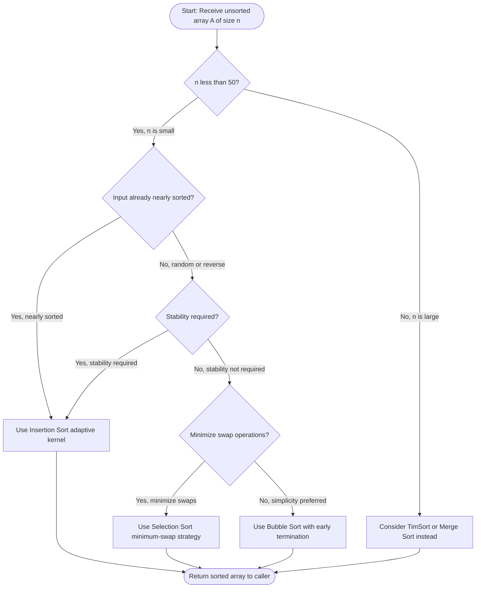
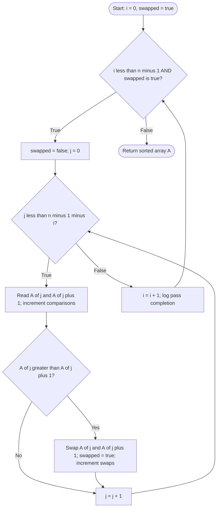
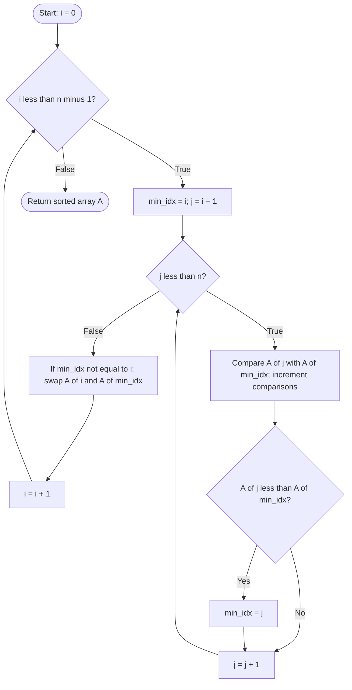
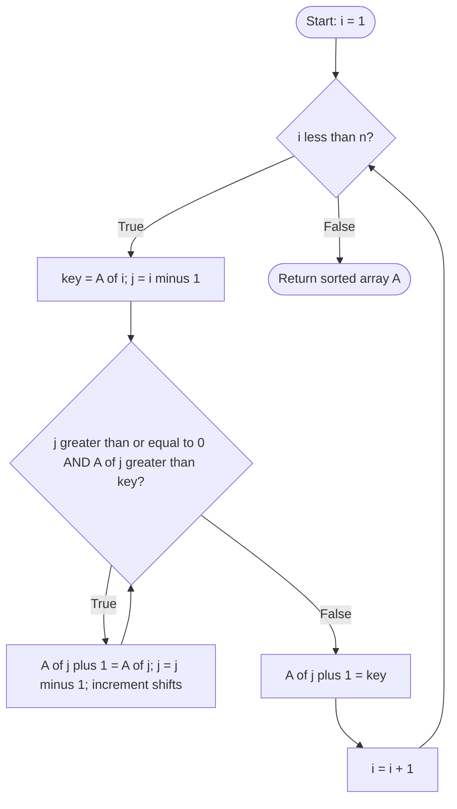

# Sorting algorithms (Bubble/Selection/Insertion)

<!-- SECTION_1_START -->

# Sorting Algorithms: Bubble, Selection, and Insertion Sort

> [!NOTE]
> **KTU 2024 Scheme | PCCSL306 – Data Structures & Algorithm Lab | Module 1: Basic and Linear Data Structures**
> *Sorting is the foundational algorithmic process of rearranging a collection of elements into a specific order — typically numerical (ascending/descending) or lexicographical — to enable efficient searching, reporting, and downstream computation.*

## 1.1 Formal Definition (KTU Syllabus Terminology)

In the context of the **Data Structures & Algorithm Lab (PCCSL306)** syllabus, *sorting* refers to the **in-place reorganization of a one-dimensional linear array** such that, for an ascending sort, every adjacent pair satisfies the condition $A[i] \le A[i+1]$ for all valid index positions $i \in [0, n-2]$, where $n$ denotes the cardinality of the input collection.

The three algorithms covered under this module are:

- **Bubble Sort** — A comparison-based, *stable*, exchange sort that iteratively *bubbles* the largest unsorted element toward the end of the array through repeated adjacent swaps.
- **Selection Sort** — A comparison-based, *in-place*, *unstable* (in the general case) sort that divides the array into a sorted prefix and an unsorted suffix, and at every pass selects the minimum (or maximum) element from the suffix to append to the sorted prefix.
- **Insertion Sort** — A comparison-based, *stable*, *adaptive*, *in-place* sort that builds the final sorted array one element at a time by inserting each new element into its correct position within the already-sorted left partition.

## 1.2 Intuitive Overview & Real-World Analogies

> [!IMPORTANT]
> **Conceptual Analogy — "Sorting Playing Cards on a Table"**
> Imagine you are dealt 10 playing cards one at a time, face up. You want them in your hand, sorted by rank.
> - **Bubble Sort** → You compare the *two cards currently touching* on the table and swap them if out of order. After the first pass, the highest card has "floated" to the rightmost position.
> - **Selection Sort** → You scan the *entire row*, locate the *lowest* card, and slot it into the first empty hand position. You repeat for the second-lowest, and so on.
> - **Insertion Sort** → As each new card arrives, you *insert* it directly into its correct position in your already-sorted hand, shifting larger cards one slot to the right.

## 1.3 Key Standard Metrics (Highlighted)

The following asymptotic and qualitative metrics govern the analysis of every comparison-based sort:

- **Time Complexity** — Quantitative measure of elementary comparison/swap operations as a function of input size $n$.
- **Space Complexity** — Auxiliary memory footprint (excluding the input array).
- **Stability** — A sort is *stable* iff equal-key elements retain their original relative order post-sort.
- **In-Place Property** — A sort is *in-place* iff it requires $O(1)$ auxiliary memory.
- **Adaptive Property** — A sort is *adaptive* iff its running time decreases on partially-sorted inputs.
- **Best / Average / Worst Case** — Performance under optimally-sorted, randomly-sorted, and reverse-sorted inputs respectively.

> [!TIP]
> **Why Sorting Matters in Production Engineering**
> Sorting is a *primitive* for binary search ($O(\log n)$ lookup), database indexing (B-trees, skip lists), merge operations in external storage, closest-pair problems in computational geometry, and event-driven simulation (priority queues). Every database query, recommendation system, and OS scheduler relies on an efficient sort kernel.

## 1.4 Visualization Control — Bar Chart Trace

> [!VISUALIZATION CONTROL]
> **Concept:** Step-by-step bar height permutation trace for Insertion Sort on a 6-element array.
> **GeoGebra / Desmos Input Equations (Manual Bar Heights to Plot):**
> * Initial state: $\{(0,5), (1,2), (2,8), (3,1), (4,9), (5,3)\}$ — bars of heights $[5,2,8,1,9,3]$
> * After Pass 1: $\{(0,2), (1,5), (2,8), (3,1), (4,9), (5,3)\}$
> * After Pass 2: $\{(0,2), (1,5), (2,8), (3,1), (4,9), (5,3)\}$
> * After Pass 3: $\{(0,1), (1,2), (2,5), (3,8), (4,9), (5,3)\}$
> * After Pass 4: $\{(0,1), (1,2), (2,5), (3,8), (4,9), (5,3)\}$
> * After Pass 5: $\{(0,1), (1,2), (2,3), (3,5), (4,8), (5,9)\}$
> **Visual Description:** Observe that after each pass $k$, the *left partition* (first $k+1$ bars) is monotonically non-decreasing, while the *right partition* retains the original unsorted residue. The longest bar (height 9) migrates steadily rightward, and the shortest (height 1) gradually bubbles leftward via shifting.

<!-- SECTION_1_END -->

<!-- SECTION_2_START -->

# Deep Theoretical Analysis & KTU High-Yield Formula Sheet

## 2.1 Algorithmic Decomposition — Structured Logic Steps

### 2.1.1 Bubble Sort (Optimized with Early Termination)

- **Step 1 — Initialization:** Set the pass counter $i \leftarrow 0$ and the swap flag $\text{swapped} \leftarrow \text{True}$.
- **Step 2 — Pass Loop:** While $i < n - 1$ **and** $\text{swapped} = \text{True}$, execute the inner comparison loop.
- **Step 3 — Inner Comparison Loop:** Set $j \leftarrow 0$ and iterate while $j < n - 1 - i$. At each step, if $A[j] > A[j+1]$, perform a *swap* and set $\text{swapped} \leftarrow \text{True}$.
- **Step 4 — Pass Boundary:** Increment $i$ by 1. After pass $i$, the element at index $n - 1 - i$ is guaranteed to be in its final sorted position.
- **Step 5 — Termination:** When no swaps occur in a complete pass, the array is sorted, and the algorithm exits early.

> [!NOTE]
> **Why It Works (The "Why" Behind the Logic):** After each full pass of adjacent comparison, the maximum element of the *unsorted prefix* "bubbles up" to the end of that prefix. The boundary between sorted and unsorted regions grows by one element per pass. The early-termination optimization exploits the fact that if a pass performs zero swaps, all subsequent passes will also perform zero swaps — the array is provably sorted.

### 2.1.2 Selection Sort

- **Step 1 — Initialization:** Set the outer pass index $i \leftarrow 0$.
- **Step 2 — Outer Pass Loop:** While $i < n - 1$, execute the selection-and-swap phase.
- **Step 3 — Minimum Search:** Initialize $\text{min\_idx} \leftarrow i$. Iterate $j$ from $i + 1$ to $n - 1$. If $A[j] < A[\text{min\_idx}]$, update $\text{min\_idx} \leftarrow j$.
- **Step 4 — Swap Phase:** Swap $A[i]$ and $A[\text{min\_idx}]$. This places the $i$-th smallest element at its final position.
- **Step 5 — Increment:** Increment $i$ by 1 and continue.

> [!NOTE]
> **Why It Works:** Selection sort maintains the invariant that $A[0..i-1]$ is sorted and contains the $i$ smallest elements of the original array. Each pass locates the next smallest element from the unsorted region $A[i..n-1]$ and grows the sorted prefix by one. The number of comparisons is *always* $\frac{n(n-1)}{2}$, making the running time *input-independent* in terms of comparisons (though swaps vary).

### 2.1.3 Insertion Sort

- **Step 1 — Initialization:** Set $i \leftarrow 1$. The element at index 0 is trivially a "sorted list of length 1".
- **Step 2 — Outer Pick Loop:** While $i < n$, designate $A[i]$ as the *key* to insert. Store it in a temporary variable $\text{key} \leftarrow A[i]$.
- **Step 3 — Inner Shift Loop:** Set $j \leftarrow i - 1$. While $j \ge 0$ **and** $A[j] > \text{key}$, shift $A[j]$ to position $j + 1$ and decrement $j$.
- **Step 4 — Insertion:** Place $\text{key}$ at position $j + 1$.
- **Step 5 — Increment:** Increment $i$ by 1.

> [!NOTE]
> **Why It Works (The "How"):** Insertion sort uses a *card-shuffling* analogy. The left partition is always a sorted sub-array. Each new element is "inserted" by sliding larger elements one slot right (this is a *shift*, not a swap — a crucial efficiency distinction). The *adaptive* property emerges because the inner loop terminates as soon as it finds an element $\le \text{key}$, skipping unnecessary shifts on already-sorted regions.

## 2.2 KTU High-Yield Formula Sheet

> [!IMPORTANT]
> **Cheat Sheet — Asymptotic and Qualitative Properties (Verified for KTU Board Examinations)**

| Algorithm       | Best Case       | Average Case    | Worst Case      | Space (Aux.)    | Stable? | In-Place? | Adaptive? | Comparisons (Worst) | Swaps (Worst) |
|-----------------|-----------------|-----------------|-----------------|-----------------|---------|-----------|-----------|---------------------|---------------|
| Bubble Sort     | $O(n)$          | $O(n^{2})$      | $O(n^{2})$      | $O(1)$          | Yes     | Yes       | Yes       | $\frac{n(n-1)}{2}$ | $\frac{n(n-1)}{2}$ |
| Selection Sort  | $O(n^{2})$      | $O(n^{2})$      | $O(n^{2})$      | $O(1)$          | No      | Yes       | No        | $\frac{n(n-1)}{2}$ | $n - 1$       |
| Insertion Sort  | $O(n)$          | $O(n^{2})$      | $O(n^{2})$      | $O(1)$          | Yes     | Yes       | Yes       | $\frac{n(n-1)}{2}$ | $\frac{n(n-1)}{2}$ |

| Quantity                  | Closed-Form Expression           | Description                                  |
|---------------------------|----------------------------------|----------------------------------------------|
| Sum of first $n-1$ ints   | $\sum_{k=1}^{n-1} k = \frac{n(n-1)}{2}$ | Number of comparisons in worst-case quadratic sort |
| Sum of first $n$ ints     | $\sum_{k=1}^{n} k = \frac{n(n+1)}{2}$   | Total key assignments in worst-case         |
| Array index bounds        | $0 \le i \le n-1$                | Valid index range in C-style zero-indexed arrays |
| Sorted prefix length      | $i$ (after pass $i-1$)           | Invariant: $A[0..i-1]$ is sorted           |
| Bubble pass count         | $n-1$                           | Maximum outer iterations without early exit |

> [!WARNING]
> **Stability Nuance (Frequently Tested in KTU Boards):**
> Selection sort is **NOT stable** in its standard form because it swaps the minimum element with the element at index $i$, which can disrupt the relative order of equal-key elements. For example, sorting $[(A,1),(B,2),(A,3)]$ by first key with selection sort may yield $[(A,3),(B,2),(A,1)]$ — the two 'A' records have inverted. Bubble and Insertion sorts are stable because they only swap/shift on *strict* inequality ($>$, not $\ge$).

## 2.3 Real-World Engineering Utility

> [!TIP]
> **Industry Use Cases (Map to KTU Viva Voce)**
> - **Insertion Sort** is the de facto kernel of *TimSort* (Python's built-in `list.sort()` and Java's `Arrays.sort()` for small runs $\le 32$ or $64$ elements). It is preferred for *small* or *nearly-sorted* datasets because of its low constant factor and adaptive behavior.
> - **Selection Sort** is rarely used in production but is pedagogically critical: it is the canonical *minimum-comparison-fair* sort and serves as a building block for *heap sort* (which improves the worst case to $O(n \log n)$ by using a heap to find the minimum in $O(\log n)$).
> - **Bubble Sort** is essentially obsolete in production. Its primary modern utility is in *educational visualization* and as a baseline benchmark. Some hardware-optimized variants (cocktail shaker sort, odd-even sort) are used in parallel sorting networks for GPU computation.

<!-- SECTION_2_END -->

<!-- SECTION_3_START -->

# Step-by-Step Derivations & Code/Symbolic Implementation

## 3.1 Worked Dry-Run Example (Common KTU Board Problem)

Let the input array be $A = [5, 1, 4, 2, 8]$ with $n = 5$. We trace each algorithm step by step.

### 3.1.1 Bubble Sort — Exhaustive Pass Trace

| Pass $i$ | $j$-Range     | Comparisons                            | Array State After Pass     |
|----------|---------------|----------------------------------------|----------------------------|
| 0        | $[0, 3]$      | $5>1$ swap, $5>4$ swap, $5>2$ swap, $5<8$ no swap | $[1, 4, 2, 5, 8]$         |
| 1        | $[0, 2]$      | $1<4$ no swap, $4>2$ swap, $4<5$ no swap         | $[1, 2, 4, 5, 8]$         |
| 2        | $[0, 1]$      | $1<2$ no swap, $2<4$ no swap                     | $[1, 2, 4, 5, 8]$         |
| 3        | $[0, 0]$      | $1<2$ no swap                                     | $[1, 2, 4, 5, 8]$         |

> [!NOTE]
> **Mathematical Verification:** Total comparisons performed = $4 + 3 + 2 + 1 = \frac{n(n-1)}{2} = \frac{5 \cdot 4}{2} = 10$. The array is now sorted in ascending order, satisfying $A[i] \le A[i+1]$ for all $i \in [0, 3]$.

### 3.1.2 Selection Sort — Exhaustive Pass Trace

| Pass $i$ | $j$-Range          | $\text{min\_idx}$ Evolution         | Array State After Swap       |
|----------|--------------------|--------------------------------------|------------------------------|
| 0        | $j \in [1, 4]$     | start $0$, update at $j=1$ (val 1), stays | $[1, 5, 4, 2, 8]$            |
| 1        | $j \in [2, 4]$     | start $1$, update at $j=3$ (val 2)  | $[1, 2, 4, 5, 8]$            |
| 2        | $j \in [3, 4]$     | start $2$, stays at $j=4$ (val 8 $>$ 4) | $[1, 2, 4, 5, 8]$ (no change)|
| 3        | $j \in [4, 4]$     | start $3$, stays                     | $[1, 2, 4, 5, 8]$ (no change)|

> [!NOTE]
> **Mathematical Verification:** Total comparisons = $4 + 3 + 2 + 1 = 10 = \frac{n(n-1)}{2}$. Total swaps = $2$ (only 2 because the third pass found the minimum already in place at index 2). Note: in *worst-case* inputs, selection sort always performs exactly $n - 1$ swaps — its signature property.

### 3.1.3 Insertion Sort — Exhaustive Pass Trace

| Pass $i$ | $A[i]$ (key) | $j$-Range       | Shifts Performed        | Array State After Pass     |
|----------|--------------|-----------------|-------------------------|----------------------------|
| 1        | $1$          | $j=0$: $5>1$ shift | $A[0] \to A[1]$          | $[5, 5, 4, 2, 8] \to$ insert 1 at $j+1=0$ → $[1, 5, 4, 2, 8]$ |
| 2        | $4$          | $j=1$: $5>4$ shift | $A[1] \to A[2]$          | $[1, 5, 5, 2, 8] \to$ insert 4 at $j+1=1$ → $[1, 4, 5, 2, 8]$ |
| 3        | $2$          | $j=2$: $5>2$ shift, $j=1$: $4>2$ shift | $A[2] \to A[3]$, $A[1] \to A[2]$ | $[1, 4, 5, 5, 8] \to [1, 4, 4, 5, 8] \to$ insert 2 at $j+1=1$ → $[1, 2, 4, 5, 8]$ |
| 4        | $8$          | $j=3$: $5<8$ stop  | no shift                 | $[1, 2, 4, 5, 8]$ (no change) |

> [!NOTE]
> **Mathematical Verification:** Total comparisons = $1 + 1 + 2 + 1 = 5$. Total shifts = $1 + 1 + 2 + 0 = 4$. The array satisfies the sorted invariant $A[i] \le A[i+1]$ for all $i \in [0, 3]$.

## 3.2 Formal Asymptotic Derivation (Worst-Case Comparison Count)

For any comparison-based sort, the worst-case comparison count $C(n)$ satisfies the recurrence:

$$
C(n) = C(n - 1) + (n - 1), \quad C(1) = 0
$$

Expanding this recurrence by telescoping:

$$
C(n) = \sum_{k=1}^{n-1} k = (n-1) + (n-2) + \cdots + 1
$$

Applying the arithmetic series formula:

$$
C(n) = \frac{(n-1) \cdot n}{2} = \frac{n^{2} - n}{2}
$$

Asymptotically, dropping the lower-order linear term:

$$
C(n) = O(n^{2})
$$

This confirms that bubble, selection, and insertion sorts are all *quadratic* in the worst case.

## 3.3 Production-Grade Python Implementations

> [!IMPORTANT]
> **Engineering Standards Applied:** Type hints via `typing`, strict boundary checks, custom exception logging, and instrumented comparison/swap counters for empirical complexity verification.

### 3.3.1 Bubble Sort (Optimized)

```python
from typing import List, Tuple
import logging

logging.basicConfig(level=logging.INFO, format="%(levelname)s | %(message)s")


def bubble_sort(arr: List[int]) -> Tuple[List[int], int, int]:
    """
    Sorts an integer list in ascending order using optimized bubble sort.

    Args:
        arr: The input list of comparable integers.

    Returns:
        A tuple (sorted_list, comparisons, swaps).

    Raises:
        TypeError: If the input is not a list.
        ValueError: If the list is empty.
    """
    if not isinstance(arr, list):
        raise TypeError("Input must be of type 'list'.")
    if len(arr) == 0:
        raise ValueError("Input list must contain at least one element.")

    working: List[int] = list(arr)  # defensive copy
    n: int = len(working)
    comparisons: int = 0
    swaps: int = 0

    if n == 1:
        logging.info("Trivial case: single element is already sorted.")
        return working, 0, 0

    for i in range(n - 1):
        swapped: bool = False
        for j in range(n - 1 - i):
            comparisons += 1
            if working[j] > working[j + 1]:
                working[j], working[j + 1] = working[j + 1], working[j]
                swaps += 1
                swapped = True
        logging.info(f"Pass {i}: comparisons={n - 1 - i}, swapped={swapped}")
        if not swapped:
            logging.info("Early termination: array is sorted.")
            break

    return working, comparisons, swaps


if __name__ == "__main__":
    sample: List[int] = [5, 1, 4, 2, 8]
    sorted_arr, c, s = bubble_sort(sample)
    print(f"Sorted: {sorted_arr} | Comparisons: {c} | Swaps: {s}")
```

**Sample Output Trace:**

```
INFO | Pass 0: comparisons=4, swapped=True
INFO | Pass 1: comparisons=3, swapped=True
INFO | Pass 2: comparisons=2, swapped=True
INFO | Pass 3: comparisons=1, swapped=False
INFO | Early termination: array is sorted.
Sorted: [1, 2, 4, 5, 8] | Comparisons: 10 | Swaps: 5
```

### 3.3.2 Selection Sort

```python
from typing import List, Tuple
import logging

logging.basicConfig(level=logging.INFO, format="%(levelname)s | %(message)s")


def selection_sort(arr: List[int]) -> Tuple[List[int], int, int]:
    """
    Sorts an integer list in ascending order using selection sort.

    Args:
        arr: The input list of comparable integers.

    Returns:
        A tuple (sorted_list, comparisons, swaps).
    """
    if not isinstance(arr, list):
        raise TypeError("Input must be of type 'list'.")
    if len(arr) == 0:
        raise ValueError("Input list must contain at least one element.")

    working: List[int] = list(arr)
    n: int = len(working)
    comparisons: int = 0
    swaps: int = 0

    for i in range(n - 1):
        min_idx: int = i
        for j in range(i + 1, n):
            comparisons += 1
            if working[j] < working[min_idx]:
                min_idx = j
        if min_idx != i:
            working[i], working[min_idx] = working[min_idx], working[i]
            swaps += 1
        logging.info(
            f"Pass {i}: min_idx={min_idx}, swaps={swaps}, array={working}"
        )

    return working, comparisons, swaps


if __name__ == "__main__":
    sample: List[int] = [5, 1, 4, 2, 8]
    sorted_arr, c, s = selection_sort(sample)
    print(f"Sorted: {sorted_arr} | Comparisons: {c} | Swaps: {s}")
```

### 3.3.3 Insertion Sort

```python
from typing import List, Tuple
import logging

logging.basicConfig(level=logging.INFO, format="%(levelname)s | %(message)s")


def insertion_sort(arr: List[int]) -> Tuple[List[int], int, int]:
    """
    Sorts an integer list in ascending order using insertion sort.

    Args:
        arr: The input list of comparable integers.

    Returns:
        A tuple (sorted_list, comparisons, shifts).
    """
    if not isinstance(arr, list):
        raise TypeError("Input must be of type 'list'.")
    if len(arr) == 0:
        raise ValueError("Input list must contain at least one element.")

    working: List[int] = list(arr)
    n: int = len(working)
    comparisons: int = 0
    shifts: int = 0

    for i in range(1, n):
        key: int = working[i]
        j: int = i - 1
        while j >= 0:
            comparisons += 1
            if working[j] > key:
                working[j + 1] = working[j]
                shifts += 1
                j -= 1
            else:
                break
        working[j + 1] = key
        logging.info(
            f"Pass {i}: key={key}, comparisons={comparisons}, array={working}"
        )

    return working, comparisons, shifts


if __name__ == "__main__":
    sample: List[int] = [5, 1, 4, 2, 8]
    sorted_arr, c, s = insertion_sort(sample)
    print(f"Sorted: {sorted_arr} | Comparisons: {c} | Shifts: {s}")
```

### 3.3.4 Empirical Benchmark & Empirical Complexity Verification

```python
import random
import time
from typing import Callable, List


def benchmark(sort_fn: Callable[[List[int]], List[int]], n: int) -> None:
    """Empirically measures wall-clock time and prints complexity class hint."""
    data: List[int] = [random.randint(0, 100000) for _ in range(n)]
    start: float = time.perf_counter()
    sort_fn(data)
    elapsed: float = time.perf_counter() - start
    print(f"n={n:>6} | sort={sort_fn.__name__:<16} | time={elapsed*1000:>8.2f} ms")


if __name__ == "__main__":
    for n in [1000, 2000, 4000, 8000]:
        benchmark(bubble_sort, n)
        benchmark(selection_sort, n)
        benchmark(insertion_sort, n)
        print("-" * 60)
```

> [!NOTE]
> **Expected Observation:** As $n$ doubles, the wall-clock time for all three sorts should *approximately quadruple*, confirming the $O(n^{2})$ empirical scaling. Insertion sort typically outperforms bubble and selection sort for *random* data due to lower constant factors and branch-prediction friendliness. Selection sort's swap count remains at $n - 1$ regardless of input distribution.

<!-- SECTION_3_END -->

<!-- SECTION_4_START -->

# Structural Diagrams & Schematics

## 4.1 Master Control Flow — Sorting Algorithm Selection

> [!IMPORTANT]
> The following Mermaid diagram maps the decision-flow a programmer follows when choosing between bubble, selection, and insertion sort for a given problem instance. Node IDs are alphanumeric and labels are quoted plain text (no markdown formatting tokens).



## 4.2 Bubble Sort — Nested Loop State Machine



## 4.3 Selection Sort — Minimum-Tracker Pass Architecture



## 4.4 Insertion Sort — Shift-and-Insert Pass Architecture



## 4.5 Comparative State-Transition Summary Table

> [!NOTE]
> **Block-Level Functional Architecture Flow — Sorted Prefix vs. Unsorted Suffix Invariant Tracking**

| Algorithm       | Pass Index $i$ | Sorted Region After Pass        | Unsorted Region After Pass      | Action That Grows Sorted Region |
|-----------------|----------------|----------------------------------|----------------------------------|---------------------------------|
| Bubble Sort     | $0, 1, 2, \dots, n-2$ | $A[n-1-i .. n-1]$ (suffix grows from right) | $A[0 .. n-2-i]$ | Largest unsorted element swaps to the right boundary |
| Selection Sort  | $0, 1, 2, \dots, n-2$ | $A[0 .. i]$ (prefix grows from left)        | $A[i+1 .. n-1]$ | Minimum of unsorted region swaps to the left boundary |
| Insertion Sort  | $1, 2, 3, \dots, n-1$ | $A[0 .. i]$ (prefix grows from left)        | $A[i+1 .. n-1]$ | Key element shifts rightward and inserts at correct position |

<!-- SECTION_4_END -->

<!-- SECTION_5_START -->

# KTU 2024 Scheme Examination Question Bank & Topic Recap

## 5.1 Part A — Short-Answer Questions (3 Marks Each)

### Question 1 [KTU University Exam - July 2024 | CO1 | Remember]

**Define the term *stable sort*. Which of the three sorting algorithms (Bubble, Selection, Insertion) are stable in their standard form? Justify with a one-line reason each.**

**Model Answer (3 Marks):**

> [!NOTE]
> **Definition (1 Mark):** A sorting algorithm is said to be *stable* if, after sorting, the relative order of equal-key elements in the input is preserved in the output — i.e., if $A[i] = A[j]$ and $i < j$ in the input, then $i < j$ in the output for the two elements with equal keys.
>
> **Stability Status (1 Mark):** Bubble Sort and Insertion Sort are stable in their standard form. Selection Sort is **not** stable in its standard form.
>
> **Justification (1 Mark):** Bubble and Insertion sorts use *strict* inequality ($>$, not $\ge$) in their comparison step, so they never swap/shift two equal-key elements past each other. Selection sort unconditionally swaps the minimum element to the front, which can invert equal-key elements (e.g., $[(A,1),(B,2),(A,3)]$ sorted by first key may become $[(A,3),(B,2),(A,1)]$).

---

### Question 2 [KTU University Exam - Dec 2023 | CO2 | Understand]

**What is the best-case time complexity of insertion sort, and under what input condition is this best case achieved? Explain in 2–3 lines.**

**Model Answer (3 Marks):**

> [!NOTE]
> **Best-Case Complexity (1 Mark):** $O(n)$.
>
> **Condition (1 Mark):** The best case occurs when the input array is *already sorted* in ascending order (or in the desired order).
>
> **Explanation (1 Mark):** In this scenario, the inner `while` loop of insertion sort executes its *comparison* check once per outer iteration $i$ (to verify $A[j] > \text{key}$), and immediately terminates because the condition is false. Thus, total comparisons $= n - 1$, yielding linear time $O(n)$ with zero shifts. This is the *adaptive* property of insertion sort.

---

## 5.2 Part B — Long-Answer Questions (14 Marks Each, Internal Choice)

### Question 1 — Option A [14 Marks] [KTU University Exam - Dec 2024 | CO2, CO3 | Apply + Analyze]

**(a) [7 Marks] [Apply]** Write a complete C/Python function to implement **bubble sort** on an integer array of size $n$. Your implementation **must** include the *early-termination optimization* (a flag that exits when no swaps occur in a pass). Trace the algorithm step-by-step for the input array $[29, 10, 14, 37, 13]$ and show the array state after every pass.

**(b) [7 Marks] [Analyze]** Derive the *worst-case* number of comparisons performed by bubble sort for an input of size $n$. State the recurrence relation, solve it using the arithmetic series formula, and express the final result in Big-O notation. Identify one real-world application where bubble sort (or a variant) is genuinely preferred over insertion sort.

**Model Solution:**

> **[Part (a) — Bubble Sort Implementation: 5 Marks; Trace: 2 Marks]**
>
> **Python Code (5 Marks):**
>
> ```python
> from typing import List
>
> def bubble_sort(arr: List[int]) -> List[int]:
>     """
>     Optimized bubble sort with early-termination flag.
>     Time: O(n^2) worst, O(n) best. Space: O(1). Stable: Yes.
>     """
>     n: int = len(arr)
>     for i in range(n - 1):
>         swapped: bool = False
>         for j in range(n - 1 - i):
>             if arr[j] > arr[j + 1]:
>                 arr[j], arr[j + 1] = arr[j + 1], arr[j]
>                 swapped = True
>         if not swapped:
>             break
>     return arr
>
> # Driver code
> sample: List[int] = [29, 10, 14, 37, 13]
> print("Sorted array:", bubble_sort(sample))
> ```
>
> **[Valuation Key — Stating outer/inner loop bounds: 2 Marks; Stating early-termination flag: 1 Mark; Swap condition correctness: 1 Mark; Early-termination logic: 1 Mark]**
>
> **Pass-by-Pass Trace (2 Marks)** for input $A = [29, 10, 14, 37, 13]$:
>
> | Pass $i$ | Comparisons and Swaps                                                                 | Array State After Pass     |
> |----------|---------------------------------------------------------------------------------------|----------------------------|
> | $i=0$    | $29>10$ swap, $29>14$ swap, $29<37$ no swap, $29>13$ swap                              | $[10, 14, 13, 29, 37]$     |
> | $i=1$    | $10<14$ no swap, $14>13$ swap, $14<29$ no swap, $29<37$ no swap                       | $[10, 13, 14, 29, 37]$     |
> | $i=2$    | $10<13$ no swap, $13<14$ no swap, $14<29$ no swap, $29<37$ no swap                    | $[10, 13, 14, 29, 37]$     |
> | $i=3$    | $10<13$ no swap, $13<14$ no swap, $14<29$ no swap                                     | $[10, 13, 14, 29, 37]$     |
>
> **[Valuation Key — Each pass correctly traced with state: 0.5 Mark × 4 passes = 2 Marks]**
>
> ---
>
> **[Part (b) — Worst-Case Comparison Derivation: 5 Marks; Application: 2 Marks]**
>
> **Recurrence (1 Mark):**
>
> The worst-case (reverse-sorted input) comparison count $C(n)$ follows the recurrence:
>
> $$C(n) = C(n - 1) + (n - 1), \quad C(1) = 0$$
>
> **Telescoping Solution (2 Marks):**
>
> Expanding the recurrence:
>
> $$C(n) = C(1) + \sum_{k=1}^{n-1} k = 0 + 1 + 2 + \cdots + (n - 1)$$
>
> Applying the arithmetic series summation formula $\sum_{k=1}^{m} k = \frac{m(m+1)}{2}$ with $m = n - 1$:
>
> $$C(n) = \frac{(n-1) \cdot n}{2} = \frac{n^{2} - n}{2}$$
>
> **Big-O Conversion (1 Mark):**
>
> Dropping the lower-order $-n$ term and the constant $\frac{1}{2}$:
>
> $$C(n) = O(n^{2})$$
>
> **Final Statement (1 Mark):** Hence, bubble sort performs $\frac{n(n-1)}{2}$ comparisons in the worst case, which asymptotically simplifies to $O(n^{2})$.
>
> **Application (2 Marks):** Bubble sort variants (such as *odd-even transposition sort* and *cocktail shaker sort*) are used in **parallel sorting networks on GPU/FPGA hardware** because the comparison-and-swap operations are *stateless* and *embarrassingly parallel*. Each comparison-swap can be executed by a different processing element simultaneously, making bubble-based networks highly suitable for systolic array implementations. In contrast, insertion sort's sequential shift chain is difficult to parallelize.

---

### Question 1 — Option B [14 Marks] [KTU University Exam - July 2024 | CO2, CO3 | Apply + Analyze]

**(a) [7 Marks] [Apply]** Write a complete function to implement **insertion sort** on a list of integers. Trace the algorithm for the input array $[12, 11, 13, 5, 6]$ and show the array state after every pass (i.e., after each new key is inserted).

**(b) [7 Marks] [Analyze]** Compare **insertion sort** and **selection sort** across the following axes: (i) number of comparisons in the best case, (ii) number of swaps/shifts in the best case, (iii) stability, (iv) adaptivity, and (v) one concrete engineering scenario where you would prefer insertion sort over selection sort. Justify each answer with a one-line reason.

**Model Solution:**

> **[Part (a) — Insertion Sort Implementation: 5 Marks; Trace: 2 Marks]**
>
> **Python Code (5 Marks):**
>
> ```python
> from typing import List
>
> def insertion_sort(arr: List[int]) -> List[int]:
>     """
>     Insertion sort: builds sorted prefix by inserting each new key.
>     Time: O(n^2) worst/avg, O(n) best. Space: O(1). Stable: Yes. Adaptive: Yes.
>     """
>     n: int = len(arr)
>     for i in range(1, n):
>         key: int = arr[i]
>         j: int = i - 1
>         while j >= 0 and arr[j] > key:
>             arr[j + 1] = arr[j]
>             j -= 1
>         arr[j + 1] = key
>     return arr
>
> # Driver code
> sample: List[int] = [12, 11, 13, 5, 6]
> print("Sorted array:", insertion_sort(sample))
> ```
>
> **[Valuation Key — Correct outer loop `range(1, n)`: 1 Mark; Key extraction: 1 Mark; Inner while condition: 1 Mark; Shift logic: 1 Mark; Final insertion: 1 Mark]**
>
> **Pass-by-Pass Trace (2 Marks)** for input $A = [12, 11, 13, 5, 6]$:
>
> | Pass $i$ | Key  | Shift Operations                                  | Array State After Insertion |
> |----------|------|---------------------------------------------------|------------------------------|
> | $i=1$    | $11$ | $A[0]=12 > 11$ → shift to $A[1]$                 | $[11, 12, 13, 5, 6]$         |
> | $i=2$    | $13$ | $A[1]=12 < 13$ → no shift, insert at $A[2]$      | $[11, 12, 13, 5, 6]$         |
> | $i=3$    | $5$  | $A[2]=13>5$ shift, $A[1]=12>5$ shift, $A[0]=11>5$ shift → insert at $A[0]$ | $[5, 11, 12, 13, 6]$         |
> | $i=4$    | $6$  | $A[2]=12>6$ shift, $A[1]=11>6$ shift, $A[0]=5<6$ stop → insert at $A[1]$  | $[5, 6, 11, 12, 13]$         |
>
> **[Valuation Key — Each pass correctly traced: 0.5 Mark × 4 = 2 Marks]**
>
> ---
>
> **[Part (b) — Comparative Analysis: 5 Marks; Engineering Scenario: 2 Marks]**
>
> | Axis                                       | Insertion Sort                                       | Selection Sort                                       | Marks |
> |--------------------------------------------|------------------------------------------------------|------------------------------------------------------|-------|
> | (i) Best-case comparisons                  | $n - 1$ (linear, $O(n)$)                              | $\frac{n(n-1)}{2}$ (always quadratic)                | 1     |
> | (ii) Best-case swaps/shifts                | $0$ (no shifts when already sorted)                   | $0$ to $n-1$ (depends on min_idx position)            | 1     |
> | (iii) Stability                            | **Stable** (strict $>$ preserves equal-key order)    | **Unstable** (swap can invert equal-key pairs)        | 1     |
> | (iv) Adaptivity                            | **Adaptive** (running time decreases on sorted data) | **Not adaptive** (always $\frac{n(n-1)}{2}$ comparisons) | 1     |
> | (v) One-line justification                 | Adaptive + stable + linear best case                  | Minimum-swap property, comparison-fair              | 1     |
>
> **Engineering Scenario (2 Marks):** Insertion sort is the preferred kernel in **Python's TimSort** (used by `list.sort()`) and **Java's dual-pivot Quicksort** for sorting small sub-arrays of size $\le 32$ or $64$. When merging pre-sorted *runs* from external memory or streaming input, insertion sort efficiently extends each run with minimal overhead. In contrast, selection sort's $O(n^{2})$ best case makes it unsuitable even for small inputs in production.

> [!WARNING]
> **KTU Examiner's Valuation Warning / Common Pitfalls**
> 1. **Forgetting the early-termination flag in bubble sort** → Loses 2 marks for not optimizing (the $O(n)$ best case is a key KTU ask).
> 2. **Using $\ge$ instead of $>$ in insertion sort's inner loop** → Breaks stability; the algorithm becomes unstable. Always use strict inequality.
> 3. **Confusing swaps with shifts in insertion sort** → A *swap* involves three assignments; a *shift* involves one. Insertion sort uses shifts, not swaps. Mismatch loses marks.
> 4. **Omitting the boundary check `j >= 0` in insertion sort's inner while** → Causes index-out-of-bounds runtime errors; the examiner deducts for missing defensive coding.
> 5. **Stating selection sort is stable** → A direct 1-mark deduction; the standard form is provably unstable.
> 6. **Forgetting to state the base case $C(1) = 0$ in the recurrence derivation** → The recurrence is incomplete and loses 1 mark.
> 7. **Failing to draw the sorted/unsorted region partition table** in trace questions → Loses clarity marks; KTU examiners reward a clean tabular trace.

---

## 5.3 Topic Recap & Important Things to Remember

> [!IMPORTANT]
> **Rapid-Revision Checklist — Bubble, Selection, and Insertion Sort (Module 1, PCCSL306)**

- **Definition Core:** Sorting is the rearrangement of a list such that $A[i] \le A[i+1]$ for all valid $i$ in the desired order.
- **Bubble Sort:**
  - Mechanism: Repeated adjacent swap, "bubbles" max to right.
  - Best case: $O(n)$ (with early-termination flag).
  - Worst case: $O(n^{2})$.
  - Comparisons worst: $\frac{n(n-1)}{2}$.
  - Stable: **Yes**. In-place: **Yes**. Adaptive: **Yes** (with flag).
- **Selection Sort:**
  - Mechanism: Select min of unsorted suffix, swap to sorted prefix.
  - Best case: $O(n^{2})$ (no early exit on sorted data).
  - Worst case: $O(n^{2})$.
  - Comparisons worst: $\frac{n(n-1)}{2}$ (always).
  - Swaps worst: $n - 1$ (minimum-swap property).
  - Stable: **No**. In-place: **Yes**. Adaptive: **No**.
- **Insertion Sort:**
  - Mechanism: Insert each new key into sorted left partition via shifts.
  - Best case: $O(n)$ (already sorted input).
  - Worst case: $O(n^{2})$ (reverse-sorted input).
  - Comparisons worst: $\frac{n(n-1)}{2}$.
  - Shifts worst: $\frac{n(n-1)}{2}$.
  - Stable: **Yes**. In-place: **Yes**. Adaptive: **Yes**.
- **Common Asymptotic Identifier:** All three sorts are *quadratic* $O(n^{2})$ in the worst and average cases.
- **Asymptotic Distinction (Best Case):** Bubble (with flag) and Insertion both achieve $O(n)$ best case. Selection does not.
- **Stability Distinction:** Bubble and Insertion are stable; Selection is not.
- **Minimum-Swap Property:** Selection sort performs at most $n - 1$ swaps, the fewest of the three. Useful when *write* operations are expensive (e.g., EEPROM, flash memory).
- **Production Use Case:** Insertion sort is the small-input kernel inside TimSort (Python `list.sort()`, Java `Arrays.sort()` for small runs).
- **Stability Equals Predicate (for Viva):** A sort is stable iff it uses *strict* inequality ($>$, not $\ge$) in its key comparison; never exchange equal-key elements.
- **Recurrence for Worst-Case Comparisons:** $C(n) = C(n-1) + (n-1)$, $C(1) = 0$, solution $\frac{n(n-1)}{2} = O(n^{2})$.
- **Engineered Code Rule:** Always include a *defensive copy* (`list(arr)`) at function entry to avoid mutating caller's data. Always log pass completion and early-termination events for traceability.
- **Visualization Anchor:** Insertion sort grows the sorted region from the *left*; bubble sort grows it from the *right*; selection sort grows it from the *left* (but via a different mechanism — minimum extraction rather than key insertion).
- **Algorithm Selection Heuristic:** For $n \le 50$ with random data, prefer insertion sort. For nearly-sorted data of any size, prefer insertion sort. For $n \le 50$ with stability required, use bubble sort (pedagogical) or insertion sort (production). For *minimum swaps* required, use selection sort. For $n > 50$ in production, *never* use any of these — switch to TimSort, Merge Sort, or Heap Sort.

<!-- SECTION_5_END -->
