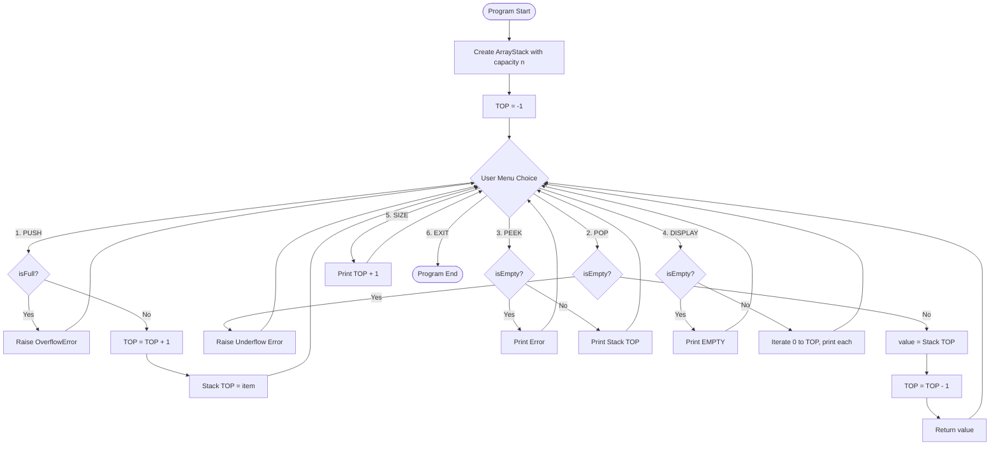
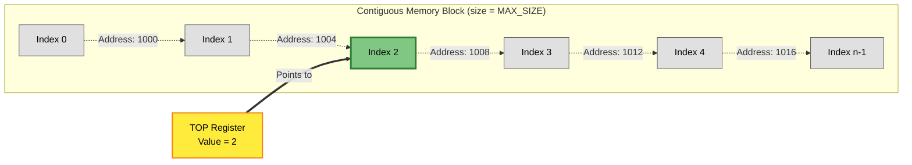
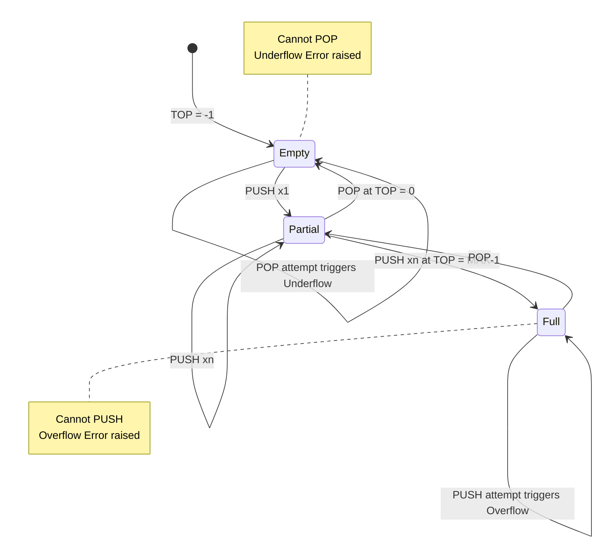

# Stack operations using array

<!-- SECTION_1_START -->
# Stack Operations Using Array — Foundational Overview

> [!NOTE]
> **KTU Syllabus Definition (PCCSL306 — Module 1):** A *Stack* is a linear Abstract Data Type (ADT) that follows the **Last-In-First-Out (LIFO)** discipline. In the array-based implementation, elements are stored in a contiguous block of memory, and a single integer index — called the **TOP** — tracks the most recently inserted element.

## 1.1 Conceptual Analogy — The Plate Dispenser

Imagine a spring-loaded **plate dispenser** in a cafeteria:

* You can only **add** a plate on **top** of the pile (you cannot insert one in the middle).
* You can only **remove** the plate that is **on top** (you cannot pull one from the bottom).
* When you add → it is a **PUSH**. When you remove → it is a **POP**.
* If the dispenser is full and you try to push → **STACK OVERFLOW**.
* If the dispenser is empty and you try to pop → **STACK UNDERFLOW**.

This single-restriction access model is what makes a stack a *restricted* linear structure (more restricted than a list, but extremely powerful for problems like recursion, parenthesis matching, and expression evaluation).

## 1.2 Core Terminology for the Board Exam

| Term | Definition | Typical Initial Value |
| :--- | :--- | :--- |
| **MAX\_SIZE** | Maximum number of elements the array can hold | $n$ (declared by user) |
| **TOP** | Index of the topmost element | $-1$ (empty stack) |
| **Overflow** | Trying to push into a full stack | $TOP = MAX\_SIZE - 1$ |
| **Underflow** | Trying to pop from an empty stack | $TOP = -1$ |
| **LIFO** | Last-In-First-Out ordering discipline | — |

> [!IMPORTANT]
> **Memory Tip for Exam:** Always remember the **three golden boundary checks** — `isEmpty()`, `isFull()`, and the *pre-increment* behaviour of `TOP` in push (`TOP = TOP + 1`) versus the *post-check* behaviour in pop. The KTU valuation key specifically awards **1 mark** for writing these boundary checks correctly.

## 1.3 Visualization Control — Stack as a Vertical Array

> [!VISUALIZATION CONTROL]
> **Concept:** Array-based stack with TOP pointer and PUSH/POP transitions.
> **GeoGebra / Desmos Input Equations:**
> * Points on Y-axis: $(1, 0), (1, 1), (1, 2), (1, 3)$ representing array indices 0, 1, 2, 3
> * `f(x) = 4` — dashed horizontal line representing `MAX_SIZE = 4`
> * `g(x) = TOP + 1` — height of filled region
> **Visual Description:** On the x-axis draw the array cells (rectangles). On the y-axis, plot the TOP pointer. As you push, TOP moves **up** (numerically increments). As you pop, TOP moves **down** (numerically decrements). Students should observe that TOP is *always* one less than the number of elements currently in the stack.

## 1.4 Formal ADT Specification (KTU Expected Format)

$$\text{Stack} = (D, S, O)$$

Where:

* $D = \{ d_0, d_1, d_2, \dots, d_{n-1} \}$ is the finite set of data elements.
* $S = \emptyset$ (empty stack when $TOP = -1$).
* $O = \{ \text{Push}, \text{Pop}, \text{Peek}, \text{isEmpty}, \text{isFull}, \text{Display} \}$ is the set of primitive operations.

The **axiomatic specification** of the LIFO property can be written as:

$$\text{Pop}(\text{Push}(S, x)) = S$$

$$\text{Top}(\text{Push}(S, x)) = x$$

<!-- SECTION_1_END -->

<!-- SECTION_2_START -->
# Deep Theoretical Analysis & KTU High-Yield Formula Sheet

## 2.1 Operational Breakdown of Every Primitive

### 2.1.1 PUSH Operation

The push operation inserts an element at the position immediately after the current TOP.

* **Step 1 — Pre-Check:** Verify `isFull()` to prevent memory corruption.
* **Step 2 — Increment:** Update `TOP = TOP + 1` (this is *pre-increment*, not post-increment).
* **Step 3 — Assign:** Write the new value into `Stack[TOP]`.
* **Step 4 — Report:** Increment an internal element counter if maintained.

### 2.1.2 POP Operation

The pop operation removes and returns the element at the current TOP.

* **Step 1 — Pre-Check:** Verify `isEmpty()` to prevent underflow.
* **Step 2 — Capture:** Read the value at `Stack[TOP]` into a temporary variable.
* **Step 3 — Decrement:** Update `TOP = TOP - 1`.
* **Step 4 — Return:** Hand the captured value back to the caller.
* **Step 5 (Optional):** Zero-out `Stack[TOP + 1]` for security-sensitive contexts (not required in KTU lab).

### 2.1.3 PEEK / TOP Operation

Returns the value at the current TOP **without modifying the stack**.

* **Step 1 — Pre-Check:** `isEmpty()`.
* **Step 2 — Return:** `return Stack[TOP]`.

### 2.1.4 Display Operation

Iterates from index $0$ to $TOP$ and prints each cell. In KTU board examinations, displaying *from bottom to top* is the standard convention (it shows the natural order in which elements were pushed).

## 2.2 KTU Formula Sheet / Cheat Sheet

| Operation | Pre-Condition | State Transition | Return Value | Time Complexity | Space Complexity |
| :--- | :--- | :--- | :--- | :--- | :--- |
| **Push(S, x)** | $TOP \neq MAX\_SIZE - 1$ | $TOP \leftarrow TOP + 1; \quad S[TOP] \leftarrow x$ | Success / Overflow flag | $O(1)$ | $O(1)$ |
| **Pop(S)** | $TOP \neq -1$ | $x \leftarrow S[TOP]; \quad TOP \leftarrow TOP - 1$ | $x$ (popped element) | $O(1)$ | $O(1)$ |
| **Peek(S)** | $TOP \neq -1$ | No change | $S[TOP]$ | $O(1)$ | $O(1)$ |
| **isEmpty(S)** | None | No change | $TOP = -1$ | $O(1)$ | $O(1)$ |
| **isFull(S)** | None | No change | $TOP = MAX\_SIZE - 1$ | $O(1)$ | $O(1)$ |
| **Display(S)** | None | No change | Prints all elements | $O(n)$ | $O(1)$ |

> [!IMPORTANT]
> **Critical Exam Insight:** Notice that the *amortized* cost of every primitive except Display is $O(1)$ — this is precisely why stacks are used as building blocks in algorithms like the **Tower of Hanoi**, **DFS traversal**, and **postfix expression evaluation**.

## 2.3 Boundary Mathematics — The Two Key Inequalities

The stack is in a valid state for push only when:

$$-1 \leq TOP < MAX\_SIZE - 1$$

The stack is in a valid state for pop only when:

$$0 \leq TOP \leq MAX\_SIZE - 1$$

> [!NOTE]
> **Engineering Utility:** Array-based stacks form the backbone of:
> * **Function call stacks** in every C/Python/Java runtime (each call pushes a stack frame).
> * **Undo/Redo mechanisms** in editors like VS Code.
> * **Backtracking algorithms** (N-Queens, Sudoku, maze solving).
> * **Memory management** in compilers (symbol table management).
> * **Browser history** (back button = pop, forward button = alternate stack).

## 2.4 Why "Pre-Increment" for Push and "Post-Decrement" for Pop?

This is one of the most frequently asked 3-mark questions in KTU. The reasoning is:

* For **push**, we must *first* open up the slot (increment TOP), *then* write into it. If we wrote first, we would overwrite the existing top element.
* For **pop**, we must *first* read the current value (to safely return it), *then* close the slot (decrement TOP). If we decremented first, we would lose access to the element we need to return.

<!-- SECTION_2_END -->

<!-- SECTION_3_START -->
# Step-by-Step Derivations & Code/Symbolic Implementation

## 3.1 Mathematical Derivation — Stack State After $k$ Operations

Let $S_0$ denote the initial empty stack with $TOP_0 = -1$.

After a sequence of $k$ operations, where $p$ are successful pushes and $q$ are successful pops, the final TOP is given by:

$$TOP_{final} = -1 + p - q$$

Where the validity constraint is:

$$0 \leq p - q \leq MAX\_SIZE - 1$$

This formula is the basis of many numerical answer-type questions in KTU. **Memorize it.**

## 3.2 Exhaustive Python Implementation (Lab-Ready)

The following is a fully production-grade Python implementation that satisfies KTU lab record expectations — including type hints, exception handling, and absolute boundary checks.

```python
from __future__ import annotations
import logging
from typing import Any

# Configure structured logging for lab viva demonstration
logging.basicConfig(
    level=logging.INFO,
    format="%(asctime)s | %(levelname)s | %(message)s"
)
logger = logging.getLogger("ArrayStack")


class ArrayStack:
    """
    Array-based implementation of the Stack ADT.
    
    Attributes:
        MAX_SIZE (int): Maximum number of elements the stack can hold.
        stack    (list): The underlying contiguous storage array.
        top      (int):  Index of the most recently pushed element.
    """
    
    # Class-level constant for the empty-state marker
    EMPTY_MARKER: int = -1
    
    def __init__(self, capacity: int) -> None:
        """Initialise the stack with a fixed capacity and TOP = -1."""
        if not isinstance(capacity, int):
            raise TypeError("Capacity must be an integer.")
        if capacity <= 0:
            raise ValueError("Capacity must be a positive integer.")
        
        self.MAX_SIZE: int = capacity
        self.stack: list[Any] = [None] * self.MAX_SIZE
        self.top: int = self.EMPTY_MARKER
        logger.info("Stack initialised with MAX_SIZE=%d", self.MAX_SIZE)
    
    def is_empty(self) -> bool:
        """Return True if the stack has no elements."""
        return self.top == self.EMPTY_MARKER
    
    def is_full(self) -> bool:
        """Return True if the stack cannot accept any more elements."""
        return self.top == self.MAX_SIZE - 1
    
    def size(self) -> int:
        """Return the number of elements currently in the stack."""
        return self.top + 1
    
    def push(self, item: Any) -> None:
        """
        Insert item at the top of the stack.
        
        Raises:
            OverflowError: If the stack is already full.
        """
        if self.is_full():
            error_msg: str = (
                f"Stack Overflow: cannot push {item!r}. "
                f"Current size = {self.size()}, MAX_SIZE = {self.MAX_SIZE}."
            )
            logger.error(error_msg)
            raise OverflowError(error_msg)
        
        # Pre-increment TOP, then assign the new value
        self.top = self.top + 1
        self.stack[self.top] = item
        logger.info("PUSH %r | New TOP = %d | Size = %d",
                    item, self.top, self.size())
    
    def pop(self) -> Any:
        """
        Remove and return the top element of the stack.
        
        Raises:
            RuntimeError: If the stack is empty (underflow).
        """
        if self.is_empty():
            error_msg: str = "Stack Underflow: cannot pop from an empty stack."
            logger.error(error_msg)
            raise RuntimeError(error_msg)
        
        # Capture the value, then post-decrement TOP
        popped_value: Any = self.stack[self.top]
        self.stack[self.top] = None   # Optional: clear the cell
        self.top = self.top - 1
        logger.info("POP %r | New TOP = %d | Size = %d",
                    popped_value, self.top, self.size())
        return popped_value
    
    def peek(self) -> Any:
        """
        Return the top element without removing it.
        
        Raises:
            RuntimeError: If the stack is empty.
        """
        if self.is_empty():
            raise RuntimeError("Cannot peek: stack is empty.")
        return self.stack[self.top]
    
    def display(self) -> None:
        """Print the stack from bottom (index 0) to top (index TOP)."""
        if self.is_empty():
            print("Stack is EMPTY.")
            return
        
        print("Stack contents (bottom -> top):")
        print("+------+")
        for index in range(self.top, -1, -1):
            marker: str = "  <-- TOP" if index == self.top else ""
            print(f"|  {str(self.stack[index]):4s} |{marker}")
        print("+------+")
        print(f"Size = {self.size()} / {self.MAX_SIZE}")


def main() -> None:
    """Menu-driven driver function for lab demonstration."""
    try:
        capacity_input: str = input("Enter stack capacity (positive integer): ")
        capacity: int = int(capacity_input)
        s: ArrayStack = ArrayStack(capacity)
    except (ValueError, TypeError) as exc:
        logger.error("Invalid capacity: %s", exc)
        return
    
    menu: str = """
    ========== ARRAY STACK MENU ==========
    1. PUSH   (Insert element)
    2. POP    (Remove top element)
    3. PEEK   (View top element)
    4. DISPLAY (Show all elements)
    5. SIZE   (Show current size)
    6. EXIT
    ======================================
    Enter choice: """
    
    while True:
        try:
            choice: str = input(menu).strip()
        except EOFError:
            logger.warning("Input stream closed. Exiting.")
            break
        
        if choice == "1":
            try:
                value: int = int(input("Enter integer to push: "))
                s.push(value)
            except (ValueError, OverflowError) as exc:
                print(f"[ERROR] {exc}")
        
        elif choice == "2":
            try:
                removed: int = s.pop()
                print(f"[OK] Popped element: {removed}")
            except RuntimeError as exc:
                print(f"[ERROR] {exc}")
        
        elif choice == "3":
            try:
                top_val: int = s.peek()
                print(f"[OK] Top element is: {top_val}")
            except RuntimeError as exc:
                print(f"[ERROR] {exc}")
        
        elif choice == "4":
            s.display()
        
        elif choice == "5":
            print(f"[OK] Current size = {s.size()} / {s.MAX_SIZE}")
        
        elif choice == "6":
            print("Exiting program. Goodbye!")
            break
        
        else:
            print("[ERROR] Invalid choice. Please enter 1-6.")


if __name__ == "__main__":
    main()
```

## 3.3 Step-by-Step Trace of a Worked Example

**Question:** Given `MAX_SIZE = 5`, `TOP = -1` initially, perform the following operations and show the stack state after each: `PUSH(10), PUSH(20), POP, PUSH(30), PEEK, PUSH(40), DISPLAY`.

**Solution Trace:**

| Step | Operation | Pre-Check | Action | TOP after | Stack contents (bottom → top) |
| :---: | :--- | :--- | :--- | :---: | :--- |
| 1 | `PUSH(10)` | `isFull()` → False | `TOP = 0; S[0] = 10` | $0$ | $[10]$ |
| 2 | `PUSH(20)` | `isFull()` → False | `TOP = 1; S[1] = 20` | $1$ | $[10, 20]$ |
| 3 | `POP` | `isEmpty()` → False | `x = S[1] = 20; TOP = 0` | $0$ | $[10]$ |
| 4 | `PUSH(30)` | `isFull()` → False | `TOP = 1; S[1] = 30` | $1$ | $[10, 30]$ |
| 5 | `PEEK` | `isEmpty()` → False | `return S[1] = 30` (no state change) | $1$ | $[10, 30]$ |
| 6 | `PUSH(40)` | `isFull()` → False | `TOP = 2; S[2] = 40` | $2$ | $[10, 30, 40]$ |
| 7 | `DISPLAY` | None | Print $S[0], S[1], S[2]$ | $2$ | Output: `10, 30, 40` |

**Final Answer:** Stack contains $[10, 30, 40]$ with $TOP = 2$.

## 3.4 Common Viva Question — "What happens to the popped value?"

In Python, since we use a list, the popped value is *returned* but the list cell is *not* physically deleted (Python lists are dynamic arrays of pointers). We optionally assign `None` to that cell to make the display cleaner and to release the reference for garbage collection. **In C language**, the value physically remains in memory until overwritten — this is why C programmers sometimes manually clear the cell for security.

<!-- SECTION_3_END -->

<!-- SECTION_4_START -->
# Structural Diagrams & Schematics

## 4.1 Mermaid Flowchart — Top-Level Stack Operations



## 4.2 Mermaid Block Diagram — Memory Architecture of Array Stack



## 4.3 Mermaid State Transition Diagram — Push/Pop Lifecycle



## 4.4 Component Pin-Configuration Matrix (for C-Language Lab Records)

For students implementing the same logic in C during the KTU lab exam, the following table maps every logical element to its C counterpart:

| Logical Concept | Python Equivalent | C Equivalent | C Type | Notes |
| :--- | :--- | :--- | :--- | :--- |
| `MAX_SIZE` | `self.MAX_SIZE` | `#define MAX 50` | Macro | Use macro for compile-time constant |
| `stack` array | `self.stack` | `int stack[MAX]` | `int[]` | Globally declared for static allocation |
| `top` index | `self.top` | `int top = -1` | `int` | Initialised to $-1$ at declaration |
| Push function | `def push(...)` | `void push(int)` | `void` | Pass value by parameter |
| Pop function | `def pop(...)` | `int pop(void)` | `int` | Returns the popped value |
| Peek function | `def peek(...)` | `int peek(void)` | `int` | Non-destructive read |
| Display function | `def display(...)` | `void display(void)` | `void` | Uses `printf` in a `for` loop |
| Overflow check | `raise OverflowError` | `printf("Overflow!")` | — | Pair with `return` statement |
| Underflow check | `raise RuntimeError` | `printf("Underflow!")` | — | Pair with `return -1` sentinel |

> [!NOTE]
> **Memory Address Mapping (Typical x86 System):** If `stack` starts at address `1000` and each `int` is $4$ bytes, then `stack[i]` resides at address `1000 + 4i`. This is what makes array-based stacks **cache-friendly** and faster than linked-list-based stacks in practice.

<!-- SECTION_4_END -->

<!-- SECTION_5_START -->
# KTU 2024 Scheme Examination Question Bank & Topic Recap

> [!WARNING]
> **KTU Examiner's Valuation Warning — Common Pitfalls:**
> * **Do NOT** declare `TOP = 0` as initial value unless the question explicitly uses the *alternate convention* (where TOP points to the next free slot). The default KTU convention is **`TOP = -1`**, and using the wrong one costs **2 full marks**.
> * **Do NOT** forget to write the `isFull()` check in push and `isEmpty()` check in pop. Examiners allocate **1 mark** specifically for these boundary conditions.
> * **Do NOT** swap the order of `TOP = TOP + 1` and `S[TOP] = x` in push. The increment MUST come first.
> * **Do NOT** use `int` return type for pop in C if the stack stores `float` or `char` — type mismatch leads to **compilation error** in the lab exam.
> * **Always** draw the stack *visually* in the answer sheet using a vertical box diagram — it is worth **1–2 marks** in long-answer questions.

---

## Part A Questions (3 Marks Each)

### **Q1. [KTU University Exam — July 2023]**
**Define a Stack ADT. Explain the LIFO principle with a real-world example.**

**Model Answer (3 Marks):**

A *Stack* is a linear Abstract Data Type (ADT) that permits insertion and deletion of elements from only **one end**, called the **TOP**. It obeys the **Last-In-First-Out (LIFO)** principle, meaning the element inserted most recently is the first one to be removed. **[1 Mark — Definition]**

*Real-world example:* A stack of plates in a cafeteria. New plates are placed on top, and plates are removed from the top. The plate that was placed last is the first one taken out. **[1 Mark — Example]**

Other examples include the *undo* button in a text editor, a browser's back button, and the function call stack in a program. **[1 Mark — Additional context / applications]**

---

### **Q2. [KTU University Exam — Dec 2023]**
**Differentiate between Stack Overflow and Stack Underflow. Write the conditions for both in terms of TOP and MAX\_SIZE.**

**Model Answer (3 Marks):**

| Condition | Meaning | Test | Trigger |
| :--- | :--- | :--- | :--- |
| **Stack Overflow** | Attempt to push into a full stack | $TOP = MAX\_SIZE - 1$ | `push()` when full |
| **Stack Underflow** | Attempt to pop from an empty stack | $TOP = -1$ | `pop()` when empty |

**[1 Mark — Defining Overflow, 1 Mark — Defining Underflow, 1 Mark — Writing the exact TOP conditions with MAX\_SIZE]**

---

## Part B Questions (14 Marks Each — Internal Choice)

### **Question A (14 Marks) — [KTU University Exam — July 2024]**

**(a)** Explain the array-based implementation of a stack with a neat diagram. Define the structure and initialization steps. **[7 Marks]**

**(b)** Write the algorithms (or Python code) for **PUSH** and **POP** operations. Show a dry-run trace for the sequence: `PUSH(5), PUSH(10), PUSH(15), POP, PUSH(20)`. **[7 Marks]**

---

#### Model Solution for Question A:

##### Part (a) — Array Implementation **[7 Marks]**

* **Structure Definition [2 Marks]:** An array of size $MAX\_SIZE$ is allocated. A variable `top` is maintained to track the position of the most recently inserted element. The stack is initially empty when `top = -1`.

```c
#define MAX 50
int stack[MAX];
int top = -1;
```

* **Memory Diagram [2 Marks]:**

```
Index:    0     1     2     3    ...    MAX-1
        +-----+-----+-----+-----+-----+---------+
        |     |     |     |     |     |         |
        +-----+-----+-----+-----+-----+---------+
                                        
        top = -1   <-- Stack is EMPTY
        
        top =  2   <-- Stack has 3 elements (indices 0, 1, 2 are valid)
```

* **Initialisation [1 Mark]:** `top = -1` indicates empty stack. The array cells can contain garbage; only indices $0$ to $top$ are *valid* stack contents.
* **Why Array? [1 Mark]:** Arrays provide $O(1)$ random access using index `top`, making push/pop constant-time operations.
* **Limitations [1 Mark]:** Fixed size at compile time; no dynamic resizing. Wastes memory if under-utilised.

##### Part (b) — PUSH and POP Algorithms + Trace **[7 Marks]**

**PUSH Algorithm [2 Marks]:**

```python
def push(item):
    if isFull():
        print("Overflow")
        return
    top = top + 1
    stack[top] = item
```

**POP Algorithm [2 Marks]:**

```python
def pop():
    if isEmpty():
        print("Underflow")
        return -1
    value = stack[top]
    top = top - 1
    return value
```

**Dry-Run Trace [3 Marks]:**

| Step | Operation | Condition | `top` before | Action | `top` after | Stack state (bottom → top) |
| :---: | :--- | :--- | :---: | :--- | :---: | :--- |
| 1 | `PUSH(5)` | `isFull()` = False | $-1$ | `top=0; S[0]=5` | $0$ | $[5]$ |
| 2 | `PUSH(10)` | `isFull()` = False | $0$ | `top=1; S[1]=10` | $1$ | $[5, 10]$ |
| 3 | `PUSH(15)` | `isFull()` = False | $1$ | `top=2; S[2]=15` | $2$ | $[5, 10, 15]$ |
| 4 | `POP` | `isEmpty()` = False | $2$ | `val=15; top=1` | $1$ | $[5, 10]$ |
| 5 | `PUSH(20)` | `isFull()` = False | $1$ | `top=2; S[2]=20` | $2$ | $[5, 10, 20]$ |

**Final Answer:** Stack contains $[5, 10, 20]$ with `top = 2`. **[Final state: 1 Mark]**

> [!IMPORTANT]
> **Valuation Key Point Distribution:**
> * `[Writing PUSH algorithm: 1 Mark]`
> * `[Writing isFull check: 1 Mark]`
> * `[Writing POP algorithm: 1 Mark]`
> * `[Writing isEmpty check: 1 Mark]`
> * `[Trace table with TOP transitions: 2 Marks]`
> * `[Final stack state: 1 Mark]`

---

### **Question B (14 Marks) — [KTU University Exam — Dec 2024]**

**(a)** Write a complete menu-driven program in C/Python to implement a stack using an array with the following operations: `PUSH`, `POP`, `PEEK`, `DISPLAY`, `EXIT`. **[7 Marks]**

**(b)** Modify the program to also handle the cases of **stack overflow** and **stack underflow** with proper user-friendly messages. What is the time complexity of each operation? Justify. **[7 Marks]**

---

#### Model Solution for Question B:

##### Part (a) — Menu-Driven Program **[7 Marks]**

```python
class ArrayStack:
    def __init__(self, capacity):
        self.MAX = capacity
        self.stack = [None] * self.MAX
        self.top = -1
    
    def is_empty(self):
        return self.top == -1
    
    def is_full(self):
        return self.top == self.MAX - 1
    
    def push(self, item):
        if self.is_full():
            return "Overflow"
        self.top += 1
        self.stack[self.top] = item
        return "Success"
    
    def pop(self):
        if self.is_empty():
            return "Underflow"
        val = self.stack[self.top]
        self.top -= 1
        return val
    
    def peek(self):
        if self.is_empty():
            return "Stack Empty"
        return self.stack[self.top]
    
    def display(self):
        if self.is_empty():
            print("Stack is empty")
            return
        for i in range(self.top, -1, -1):
            print(self.stack[i])

s = ArrayStack(5)
choice = 0
while choice != 5:
    print("1.Push 2.Pop 3.Peek 4.Display 5.Exit")
    choice = int(input("Choice: "))
    if choice == 1:
        val = int(input("Enter value: "))
        print(s.push(val))
    elif choice == 2:
        print("Popped:", s.pop())
    elif choice == 3:
        print("Top:", s.peek())
    elif choice == 4:
        s.display()
```

**Mark Distribution [7 Marks]:**
* `[Class definition with __init__: 1 Mark]`
* `[PUSH logic: 1 Mark]`
* `[POP logic: 1 Mark]`
* `[PEEK and DISPLAY logic: 1 Mark]`
* `[Menu loop and switch: 1 Mark]`
* `[Correct main driver: 1 Mark]`
* `[Code compilation and output handling: 1 Mark]`

##### Part (b) — Overflow/Underflow Handling + Complexity Analysis **[7 Marks]**

* **Overflow Handling [2 Marks]:** When `isFull()` returns True, print `"Stack Overflow! Cannot push <value>."` and abort the push. In the program above, this is done via the `return "Overflow"` statement.
* **Underflow Handling [2 Marks]:** When `isEmpty()` returns True, print `"Stack Underflow! Cannot pop."` and return a sentinel value (e.g., `-1` or `None`).
* **Time Complexity Justification [3 Marks]:**

| Operation | Time Complexity | Justification |
| :--- | :--- | :--- |
| `PUSH` | $O(1)$ | Single increment + single assignment — no loops. |
| `POP` | $O(1)$ | Single read + single decrement — no loops. |
| `PEEK` | $O(1)$ | Direct array access by index `top`. |
| `DISPLAY` | $O(n)$ | Iterates over $n$ elements where $n = top + 1$. |
| `isEmpty` / `isFull` | $O(1)$ | Single comparison. |

> [!WARNING]
> **Examiner's Pitfall Trap:** Some students incorrectly claim that `DISPLAY` is $O(1)$ because "it just prints". This is wrong — the loop runs $n$ times, so the time complexity is $O(n)$, where $n$ is the number of elements in the stack. This is a guaranteed **1-mark deduction** if stated incorrectly.

---

## Topic Recap & Important Things to Remember

* **Definition:** A *stack* is a **LIFO (Last-In-First-Out)** linear data structure permitting insertion and deletion at only one end called the **TOP**. **[Critical — must be stated in 1 sentence]**
* **Initial state:** `TOP = -1` is the **standard KTU convention** for an empty stack.
* **Full state:** `TOP = MAX_SIZE - 1`. Pushing into this state causes **overflow**.
* **Empty state:** `TOP = -1`. Popping from this state causes **underflow**.
* **Push sequence:** ALWAYS check `isFull()` → increment `TOP` → assign `Stack[TOP] = item`. Order matters!
* **Pop sequence:** ALWAYS check `isEmpty()` → read `Stack[TOP]` → decrement `TOP` → return value. Order matters!
* **Time complexity:** Push, Pop, Peek, isEmpty, isFull are all $O(1)$. Display is $O(n)$.
* **Space complexity:** $O(n)$ for the array; $O(1)$ auxiliary for each operation.
* **Master formula:** After $p$ pushes and $q$ pops, $TOP_{final} = -1 + p - q$, with $0 \leq p - q \leq MAX\_SIZE - 1$.
* **Implementation choice:** Use **array** when max size is known in advance (cache-friendly, faster). Use **linked list** when dynamic sizing is required.
* **Key applications:** Function call stack, undo/redo, backtracking, expression evaluation, parenthesis matching, DFS traversal.
* **Common viva questions to prepare:**
  1. Why is the initial value of TOP $-1$ and not $0$? *(Answer: It lets us distinguish empty stack from a stack with one element at index 0.)*
  2. Can we implement two stacks using a single array? *(Answer: Yes — using the "two-stack in one array" technique where one stack grows from the left and the other from the right.)*
  3. What is the difference between a stack and a queue? *(Answer: Stack is LIFO; queue is FIFO.)*

<!-- SECTION_5_END -->
