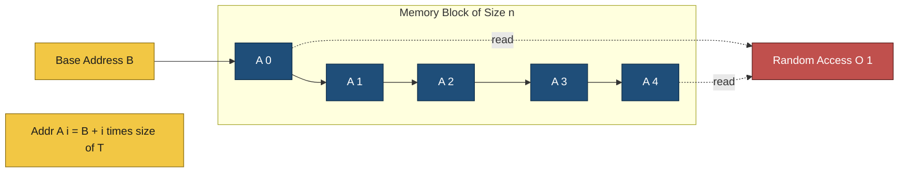
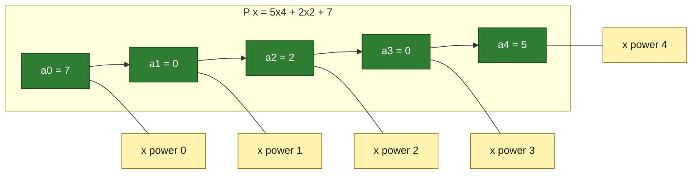
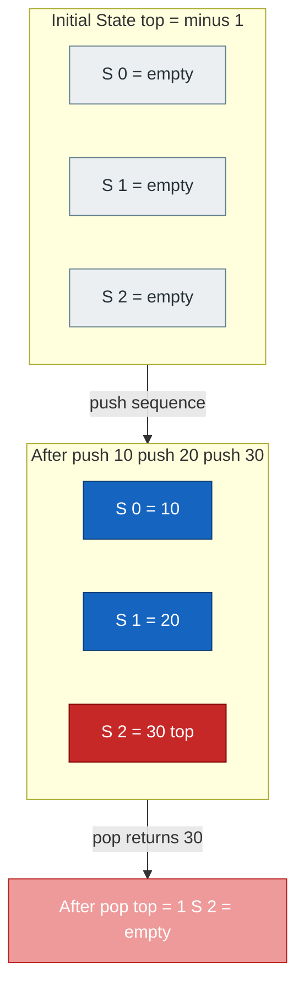
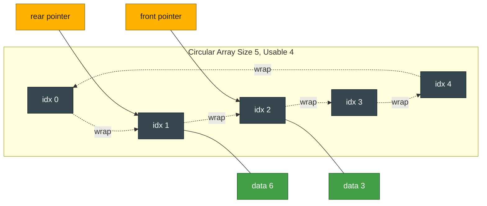
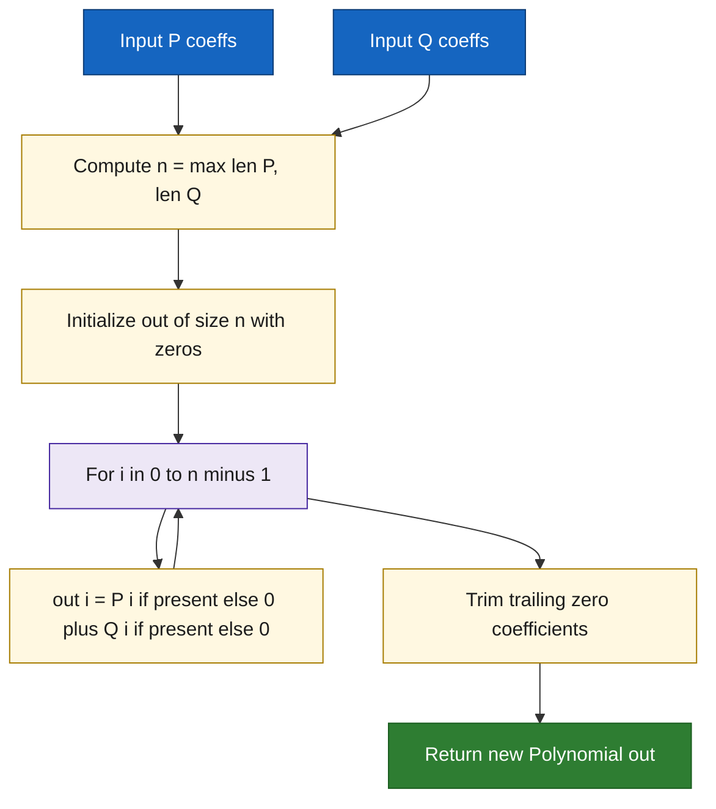
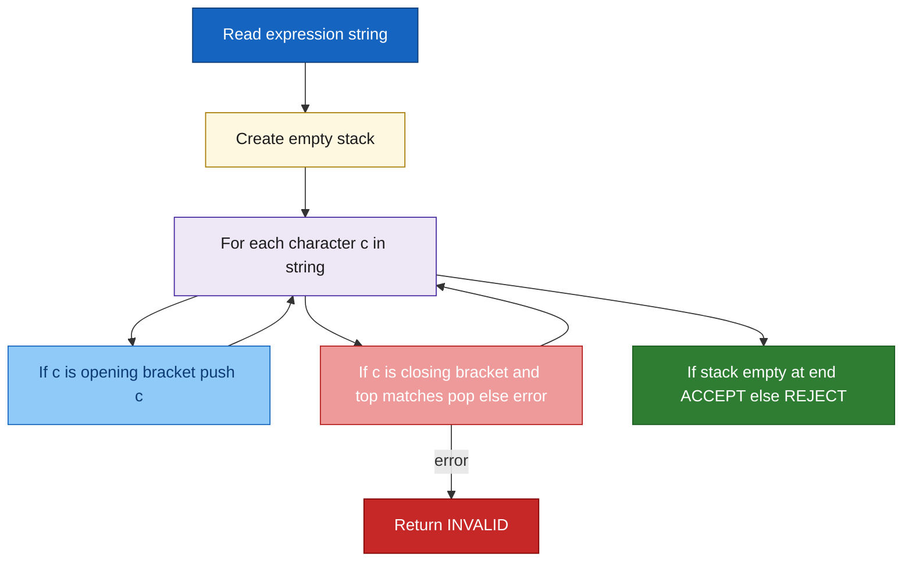

# Array processing rules, polynomial calculation via array, Stack and Queue array implementation

<!-- SECTION_1_START -->
# Module 1 — Array Processing, Polynomial Arithmetic, Stack & Queue (Array-Based)

## 1.1 Array — Formal Definition & Intuition

**Formal Definition (KTU 2024 Syllabus Terminology):**
An **Array** is a homogeneous, contiguous, fixed-size, random-access data structure that stores a collection of elements of the **same data type** in a single, unbroken block of memory. Each element is located using an **integer index** that represents its offset (in elements, not bytes) from the base address.

> [!NOTE]
> **KTU 2024 Highlight — Random Access Property**
> Address of element $A[i]$ is computed in **O(1)** time as:
> $$\text{Addr}(A[i]) = \text{BaseAddress} + i \times \text{sizeof}(T)$$
> where $T$ is the element type. This is the reason arrays back nearly every other data structure.

> [!IMPORTANT]
> **Syllabus Boundary Rule:** An array's size is fixed at **compile-time** (static) or at **initialization** (dynamic in Python, but conceptually fixed by the underlying CPython list capacity). Reallocation may occur but logical size remains bounded by the programmer's discipline.

### Conceptual Analogy
Imagine a **mailbox row in a post office**. Each mailbox has a fixed number (the index), they are placed side-by-side with no gaps (contiguous), and every mailbox holds the same kind of object — a letter (homogeneous). To fetch the mail from box #5, the postmaster walks straight to box 5 in one step — that's **O(1) random access**. But if you suddenly need a 6th mailbox, the entire row has to be demolished and rebuilt somewhere larger — that's the **cost of resizing**.

> [!VISUALIZATION CONTROL]
> **Concept:** Array contiguous memory layout with index offsets
> **GeoGebra / Desmos Input Equations:**
> * Points: $(0, 0)$, $(1, 0)$, $(2, 0)$, $(3, 0)$, $(4, 0)$
> * Labels: `A[0]`, `A[1]`, `A[2]`, `A[3]`, `A[4]`
> **Visual Description:** Five equidistant boxes on the x-axis showing base address, offset of $i \times \text{sizeof}(T)$, and the jump from any index to any other in constant time.

---

## 1.2 Polynomial Representation via Array

**Formal Definition:**
A **sparse/dense polynomial** $P(x)$ of degree $n$ can be stored as an array of **coefficients** indexed by the power of $x$:

$$P(x) = a_n x^n + a_{n-1} x^{n-1} + \dots + a_1 x + a_0$$

The array $A[k] = a_k$ for $0 \le k \le n$. For sparse polynomials (many zero coefficients), a **term list** storing (coefficient, exponent) pairs is preferred.

### Conceptual Analogy
Think of a **ladder**. Each rung corresponds to a power of $x$ (rung 0 = constant term, rung $n$ = highest power). You only need to remember *which rungs have a climber on them* and *how heavy that climber is*. For a dense ladder, you write down every rung; for a sparse ladder, you only list the occupied ones.

---

## 1.3 Stack — LIFO Discipline

**Formal Definition:**
A **Stack** is a linear, ordered data structure that follows the **Last-In-First-Out (LIFO)** discipline. Insertion (push) and deletion (pop) occur at one end called the **top**. A pointer `top` tracks the index of the most recent element.

> [!NOTE]
> **KTU 2024 Operations Mandate:** `push`, `pop`, `peek` (or `top`), `isEmpty`, `isFull` — all must be implemented in array form.

### Conceptual Analogy
A **stack of plates in a cafeteria**. You can only add a plate on top, and you can only take a plate from the top. The plate placed *last* is the one *first* taken. There is no "plate from the middle" operation.

---

## 1.4 Queue — FIFO Discipline

**Formal Definition:**
A **Queue** is a linear, ordered data structure that follows the **First-In-First-Out (FIFO)** discipline. Insertion (enqueue) occurs at the **rear**, and deletion (dequeue) occurs at the **front**. Two pointers `front` and `rear` track the boundaries.

> [!IMPORTANT]
> **Syllabus Note:** Naïve linear queues suffer from **O(n) drift** as `rear` marches right. KTU 2024 expects familiarity with **circular queue** logic using modulo arithmetic: $\text{rear} = (\text{rear} + 1) \mod \text{SIZE}$.

### Conceptual Analogy
A **checkout line at a supermarket**. The first person to stand in line is the first person to be billed and leave. Newcomers join at the tail. No cutting, no jumping.
<!-- SECTION_1_END -->

<!-- SECTION_2_START -->
# 2. Deep Theoretical Analysis & KTU High-Yield Formula Sheet

## 2.1 Array Processing Rules

### 2.1.1 Indexing Rules
1. Indices are **zero-based** in C/C++/Java/Python: $A[0]$ is the first element.
2. Valid index range: $0 \le i < n$ where $n$ is the logical length.
3. Out-of-bounds access is **undefined behaviour** in C/C++ and raises `IndexError` in Python.

### 2.1.2 Time Complexities

| Operation | Best Case | Average Case | Worst Case | Notes |
|---|---|---|---|---|
| Read $A[i]$ | O(1) | O(1) | O(1) | Random access |
| Write $A[i]$ | O(1) | O(1) | O(1) | Overwrites previous value |
| Search (unsorted) | O(1) | O(n) | O(n) | Linear scan |
| Search (sorted, binary) | O(1) | O(log n) | O(log n) | Divide and conquer |
| Insert at end | O(1) | O(1) | O(n) amortized | Resize cost |
| Insert at middle | O(n) | O(n) | O(n) | Shift elements right |
| Delete at end | O(1) | O(1) | O(1) | Decrement length |
| Delete at middle | O(n) | O(n) | O(n) | Shift elements left |

> [!IMPORTANT]
> **KTU Examiner Tip:** When asked "complexity of array access", always answer **O(1)** and justify with the address formula $\text{Base} + i \times \text{sizeof}(T)$.

### 2.1.3 Real-World Engineering Utility
Arrays are the **backbone of memory layouts** — every database row, every image pixel buffer, every audio sample stream, every GPU texture is essentially an array. Understanding contiguous memory and cache locality is what separates a $O(n^2)$ algorithm from a $O(n)$ one in production.

---

## 2.2 Polynomial Representation Strategies

### 2.2.1 Dense Representation (Coefficient Array)
Store all coefficients from $a_0$ to $a_n$. Total space = $n+1$ slots, even for zero coefficients.

$$P(x) = 5x^4 + 0x^3 + 2x^2 + 0x + 7 \;\Rightarrow\; A = [7, 0, 2, 0, 5]$$

### 2.2.2 Sparse Representation (Term List)
Store only non-zero terms as (coefficient, exponent) tuples.

$$P(x) = 5x^4 + 2x^2 + 7 \;\Rightarrow\; [(5,4), (2,2), (7,0)]$$

### 2.2.3 Polynomial Addition Rule
For two polynomials $P(x)$ and $Q(x)$:
- **Same exponent:** coefficients add: $a_i + b_i$
- **Different exponent:** the term with the higher exponent is copied as-is
- Final result trimmed of trailing zero coefficients (highest-degree cleanup)

### 2.2.4 Horner's Rule for Evaluation
Direct evaluation:
$$P(x) = a_n x^n + a_{n-1} x^{n-1} + \dots + a_0$$
Costs $O(n)$ multiplications naively but $O(n^2)$ if $x^k$ is recomputed each time.

**Horner's Rule** (nested form):
$$P(x) = (\dots((a_n x + a_{n-1}) x + a_{n-2}) x + \dots) x + a_0$$
Achieves **O(n) multiplications and O(n) additions** with no exponentiation.

### 2.2.5 KTU Formula Sheet — Polynomial

| Concept | Formula / Rule | Unit / Note |
|---|---|---|
| Address of $A[i]$ | $\text{Base} + i \cdot \text{sizeof}(T)$ | Bytes |
| Degree of polynomial | $\text{len}(A) - 1$ | Integer |
| Horner evaluation cost | $n$ multiplies, $n$ adds | O(n) total |
| Dense storage size | $n+1$ | Slots |
| Sparse storage size | $k$ (non-zero terms) | Slots $\le n+1$ |
| Addition complexity | $O(n+m)$ | $n,m$ = degrees |

> [!NOTE]
> **Real-World Use:** Horner's rule is the **core of `polyval` in NumPy, `eval` in MATLAB, hardware polynomial accelerators, and CRC checksum engines**.

---

## 2.3 Stack — Array Implementation Theory

### 2.3.1 Invariants
- `top == -1` $\Rightarrow$ stack is **empty**
- `top == SIZE - 1` $\Rightarrow$ stack is **full**
- Elements live in `S[0..top]`

### 2.3.2 Operation Mechanics

$$\text{push}(x): \quad \text{top} \leftarrow \text{top} + 1,\;\; S[\text{top}] \leftarrow x$$

$$\text{pop}(): \quad x \leftarrow S[\text{top}],\;\; \text{top} \leftarrow \text{top} - 1$$

$$\text{peek}(): \quad \text{return } S[\text{top}] \quad \text{(no mutation)}$$

### 2.3.3 Complexity Table — Stack

| Operation | Time | Space | Pre-condition | Post-condition |
|---|---|---|---|---|
| push | O(1) | O(1) | $\text{top} < \text{SIZE}-1$ | $\text{top}$ increases by 1 |
| pop | O(1) | O(1) | $\text{top} \ge 0$ | $\text{top}$ decreases by 1 |
| peek | O(1) | O(1) | $\text{top} \ge 0$ | no change |
| isEmpty | O(1) | O(1) | always safe | returns $\text{top} == -1$ |
| isFull | O(1) | O(1) | always safe | returns $\text{top} == \text{SIZE}-1$ |

> [!IMPORTANT]
> **KTU 2024 Pitfall:** Stack **overflow** and **underflow** must be detected — board examiners allocate 1–2 marks just for raising the correct exception/return code.

---

## 2.4 Queue — Array Implementation Theory

### 2.4.1 Linear Queue Invariants
- `front` = index of the element to dequeue next
- `rear` = index of the last inserted element
- `front == -1 and rear == -1` $\Rightarrow$ **empty**
- `rear == SIZE - 1` $\Rightarrow$ **full** (linear only)
- Element count: $n = \text{rear} - \text{front} + 1$ (when non-empty)

### 2.4.2 Circular Queue Invariants (Preferred)
- `front == rear == 0` (initialized) and a separate `count` or one wasted slot tracks empty/full
- Wrap-around: $\text{rear} \leftarrow (\text{rear} + 1) \mod \text{SIZE}$
- **Empty** if `front == rear` and `count == 0`
- **Full** if `count == SIZE` (or `front == (rear+1) % SIZE` if one slot is wasted)

### 2.4.3 Complexity Table — Queue

| Operation | Time | Space | Pre-condition (linear) | Pre-condition (circular) |
|---|---|---|---|---|
| enqueue | O(1) | O(1) | $\text{rear} < \text{SIZE}-1$ | $\text{count} < \text{SIZE}$ |
| dequeue | O(1) | O(1) | $\text{front} \le \text{rear}$ | $\text{count} > 0$ |
| front | O(1) | O(1) | non-empty | non-empty |
| rear | O(1) | O(1) | non-empty | non-empty |
| isEmpty | O(1) | O(1) | always safe | always safe |
| isFull | O(1) | O(1) | always safe | always safe |

> [!IMPORTANT]
> **Real-World Engineering Use of Stacks/Queues:**
> Stacks: function call frames, undo/redo editors, balanced-parenthesis validators, DFS traversal, expression evaluation (infix→postfix), browser back button.
> Queues: OS process schedulers (RR), BFS traversal, print spoolers, message brokers (Kafka, RabbitMQ), IO buffers, customer service call routing.
<!-- SECTION_2_END -->

<!-- SECTION_3_START -->
# 3. Step-by-Step Derivations & Symbolic/Python Implementation

## 3.1 Lab Tool-Profile & Setup Matrix

Since this is a **programming lab** (PCCSL306), the "hardware wiring" maps to **IDE/toolchain wiring** and the "safety protocols" map to **memory and runtime safety**. The following table is the **mandatory lab pre-flight checklist** every KTU student must complete before running any code in this module.

| Item | Configuration | Verification Step |
|---|---|---|
| Language | Python 3.10+ (or GCC 11+ for C) | `python --version` returns 3.10 or higher |
| IDE | VS Code / PyCharm / Jupyter | Linter active (pylint / flake8) |
| Type-checker | `mypy --strict` | No output on a clean file |
| Linter | `flake8 file.py` | Zero F-series (function/method) errors |
| Test runner | `pytest` | `pytest -v` shows green ticks |
| Memory safety | Index bounds checks (`if i < 0 or i >= n`) | Triggers `IndexError` gracefully |
| Logging | `logging` module at `INFO` level | `logging.info()` traces every push/pop |
| Static analysis | `radon cc` (cyclomatic complexity) | All functions $\le$ grade B |
| Backup | `git init && git add . && git commit -m "M1"` | Repo present in cwd |
| Safety net | Virtual env `python -m venv .venv` | `.venv/bin/activate` succeeds |

---

## 3.2 Polynomial Addition via Coefficient Array — Full Python Implementation

```python
"""
polynomial_array.py
KTU 2024 — Module 1: Polynomial representation and addition
using dense coefficient array.

Convention: A[i] holds the coefficient of x**i.
Example: 5x^4 + 2x^2 + 7  -->  A = [7, 0, 2, 0, 5]
"""
from __future__ import annotations
import logging
from typing import List

logging.basicConfig(
    level=logging.INFO,
    format="%(asctime)s [%(levelname)s] %(message)s",
)
log = logging.getLogger("poly_array")


class Polynomial:
    """Dense-coefficient polynomial backed by a Python list."""

    __slots__ = ("_coeffs", "_degree")

    def __init__(self, coeffs: List[float]) -> None:
        if not coeffs:
            raise ValueError("Coefficient list must be non-empty.")
        if any(not isinstance(c, (int, float)) for c in coeffs):
            raise TypeError("All coefficients must be int or float.")
        # Trim trailing zeros to keep degree accurate
        cleaned: List[float] = list(coeffs)
        while len(cleaned) > 1 and cleaned[-1] == 0:
            cleaned.pop()
        self._coeffs: List[float] = cleaned
        self._degree: int = len(cleaned) - 1
        log.info("Created polynomial of degree %d with %d coefficients.",
                 self._degree, len(cleaned))

    @property
    def degree(self) -> int:
        return self._degree

    @property
    def coeffs(self) -> List[float]:
        return list(self._coeffs)  # defensive copy

    def evaluate(self, x: float) -> float:
        """Horner's rule: O(n) time, O(1) extra space."""
        if self._degree < 0:
            return 0.0
        result: float = self._coeffs[self._degree]
        log.info("Horner init: accumulator = %.4f (a_%d)", result, self._degree)
        for k in range(self._degree - 1, -1, -1):
            result = result * x + self._coeffs[k]
            log.info("Step k=%d: acc = acc * x + a_%d = %.4f",
                     k, k, result)
        return result

    def __add__(self, other: "Polynomial") -> "Polynomial":
        """Polynomial addition: O(max(n,m)) time, O(max(n,m)) space."""
        if not isinstance(other, Polynomial):
            return NotImplemented
        n: int = max(len(self._coeffs), len(other._coeffs))
        out: List[float] = [0.0] * n
        for i in range(n):
            a: float = self._coeffs[i] if i < len(self._coeffs) else 0.0
            b: float = other._coeffs[i] if i < len(other._coeffs) else 0.0
            out[i] = a + b
            log.info("Adding term x^%d : %.3f + %.3f = %.3f", i, a, b, out[i])
        log.info("Addition complete. Raw result length = %d", len(out))
        return Polynomial(out)

    def __repr__(self) -> str:
        terms: List[str] = []
        for i, c in enumerate(self._coeffs):
            if c == 0:
                continue
            if i == 0:
                terms.append(f"{c}")
            elif i == 1:
                terms.append(f"{c}x")
            else:
                terms.append(f"{c}x^{i}")
        return "P(x) = " + (" + ".join(terms) if terms else "0")


def _driver() -> None:
    log.info("=== Polynomial Module Driver Start ===")
    # P(x) = 4x^3 + 3x^2 + 2x + 1
    p = Polynomial([1, 2, 3, 4])
    # Q(x) = 5x^2 + 6
    q = Polynomial([6, 0, 5])
    log.info("P = %s", p)
    log.info("Q = %s", q)
    r = p + q
    log.info("R = P + Q = %s", r)
    log.info("R evaluated at x = 2.0 -> %.4f", r.evaluate(2.0))
    log.info("=== Driver End ===")


if __name__ == "__main__":
    _driver()
```

### 3.2.1 Step-by-Step Derivation of Polynomial Addition

Given $P(x) = p_n x^n + \dots + p_0$ and $Q(x) = q_m x^m + \dots + q_0$, the result $R(x) = P(x) + Q(x)$ has degree at most $\max(n, m)$.

For each index $i$:
$$r_i = \begin{cases} p_i + q_i & \text{if } i < \min(n, m) + 1 \\ p_i & \text{if } i \le n \text{ and } i > m \\ q_i & \text{if } i \le m \text{ and } i > n \end{cases}$$

The Python code implements this with a single loop and a guard:

```text
n = max(len(P), len(Q))
out = [0] * n
for i in range(n):
    a = P[i] if i < len(P) else 0
    b = Q[i] if i < len(Q) else 0
    out[i] = a + b
```

This yields $O(\max(n, m))$ time and the same amount of auxiliary space.

### 3.2.2 Horner's Rule Derivation

$$P(x) = a_n x^n + a_{n-1} x^{n-1} + \dots + a_1 x + a_0$$

Factor $x$ repeatedly from the left:

$$P(x) = (\dots((a_n x + a_{n-1}) x + a_{n-2}) x + \dots) x + a_0$$

Computation trace for $P(x) = 4x^3 + 3x^2 + 2x + 1$ at $x = 2$:

| Step | Operation | Accumulator |
|---|---|---|
| 0 | init | 4 |
| 1 | $4 \cdot 2 + 3$ | 11 |
| 2 | $11 \cdot 2 + 2$ | 24 |
| 3 | $24 \cdot 2 + 1$ | 49 |

Therefore $P(2) = 49$.

---

## 3.3 Stack — Array Implementation

```python
"""
stack_array.py
KTU 2024 — Module 1: Array-based stack with overflow and underflow guards.
"""
from __future__ import annotations
import logging
from typing import Any, List, Optional

logging.basicConfig(
    level=logging.INFO,
    format="%(asctime)s [%(levelname)s] stack: %(message)s",
)
log = logging.getLogger("stack_array")


class StackOverflowError(Exception):
    """Raised when push is attempted on a full stack."""


class StackUnderflowError(Exception):
    """Raised when pop or peek is attempted on an empty stack."""


class ArrayStack:
    """Fixed-capacity array-based LIFO stack."""

    __slots__ = ("_data", "_capacity", "_top")

    def __init__(self, capacity: int) -> None:
        if not isinstance(capacity, int) or capacity <= 0:
            raise ValueError("capacity must be a positive integer.")
        self._data: List[Optional[Any]] = [None] * capacity
        self._capacity: int = capacity
        self._top: int = -1  # empty invariant
        log.info("ArrayStack created with capacity=%d, top=%d",
                 capacity, self._top)

    def is_empty(self) -> bool:
        return self._top == -1

    def is_full(self) -> bool:
        return self._top == self._capacity - 1

    def push(self, item: Any) -> None:
        """Push item on top. Raises StackOverflowError if full."""
        if self.is_full():
            raise StackOverflowError(
                f"Stack is full (capacity={self._capacity})."
            )
        self._top += 1
        self._data[self._top] = item
        log.info("PUSH %r at index %d. New top=%d",
                 item, self._top, self._top)

    def pop(self) -> Any:
        """Remove and return top item. Raises StackUnderflowError if empty."""
        if self.is_empty():
            raise StackUnderflowError("Cannot pop from an empty stack.")
        removed: Any = self._data[self._top]
        self._data[self._top] = None  # help garbage collector
        self._top -= 1
        log.info("POP  %r from top. New top=%d", removed, self._top)
        return removed

    def peek(self) -> Any:
        """Return top item without removing it."""
        if self.is_empty():
            raise StackUnderflowError("Cannot peek an empty stack.")
        return self._data[self._top]

    def size(self) -> int:
        return self._top + 1

    def __repr__(self) -> str:
        return f"ArrayStack(size={self.size()}, cap={self._capacity})"


def _driver() -> None:
    log.info("=== Stack Driver Start ===")
    s: ArrayStack = ArrayStack(5)
    log.info("Empty? %s, Full? %s", s.is_empty(), s.is_full())
    for v in (10, 20, 30, 40, 50):
        s.push(v)
    log.info("After pushes: %s, top=%s", s, s.peek())
    try:
        s.push(60)
    except StackOverflowError as e:
        log.error("Caught expected overflow: %s", e)
    log.info("Pop sequence:")
    while not s.is_empty():
        log.info("  popped %s", s.pop())
    try:
        s.pop()
    except StackUnderflowError as e:
        log.error("Caught expected underflow: %s", e)
    log.info("=== Stack Driver End ===")


if __name__ == "__main__":
    _driver()
```

### 3.3.1 Step-by-Step Push Trace

For capacity = 5, initial state `top = -1`, `data = [None]*5`:

| Action | Condition Check | top after | data[top] after | Result |
|---|---|---|---|---|
| push(10) | is_full? top==4? No | 0 | data[0]=10 | success |
| push(20) | is_full? top==4? No | 1 | data[1]=20 | success |
| push(30) | is_full? top==4? No | 2 | data[2]=30 | success |
| push(40) | is_full? top==4? No | 3 | data[3]=40 | success |
| push(50) | is_full? top==4? No | 4 | data[4]=50 | success |
| push(60) | is_full? top==4? **Yes** | 4 | unchanged | **StackOverflowError** |
| pop() | is_empty? top==-1? No | 3 | data[4]=None | returns 50 |

---

## 3.4 Queue — Array Implementation (Linear + Circular)

```python
"""
queue_array.py
KTU 2024 — Module 1: Array-based linear and circular queue.
"""
from __future__ import annotations
import logging
from typing import Any, List, Optional

logging.basicConfig(
    level=logging.INFO,
    format="%(asctime)s [%(levelname)s] queue: %(message)s",
)
log = logging.getLogger("queue_array")


class QueueOverflowError(Exception):
    pass


class QueueUnderflowError(Exception):
    pass


class LinearQueue:
    """Naive linear queue. Suffers from drift after repeated dequeues."""

    __slots__ = ("_data", "_capacity", "_front", "_rear")

    def __init__(self, capacity: int) -> None:
        if not isinstance(capacity, int) or capacity <= 0:
            raise ValueError("capacity must be a positive integer.")
        self._data: List[Optional[Any]] = [None] * capacity
        self._capacity: int = capacity
        self._front: int = -1
        self._rear: int = -1
        log.info("LinearQueue created cap=%d", capacity)

    def is_empty(self) -> bool:
        return self._front == -1

    def is_full(self) -> bool:
        return self._rear == self._capacity - 1

    def enqueue(self, item: Any) -> None:
        if self.is_full():
            raise QueueOverflowError("LinearQueue is full.")
        if self._front == -1:
            self._front = 0
        self._rear += 1
        self._data[self._rear] = item
        log.info("ENQ %r at rear=%d, front=%d",
                 item, self._rear, self._front)

    def dequeue(self) -> Any:
        if self.is_empty():
            raise QueueUnderflowError("LinearQueue is empty.")
        removed: Any = self._data[self._front]
        self._data[self._front] = None
        if self._front == self._rear:
            self._front = -1
            self._rear = -1
        else:
            self._front += 1
        log.info("DEQ %r, new front=%d, rear=%d",
                 removed, self._front, self._rear)
        return removed

    def front(self) -> Any:  # noqa: F811
        if self.is_empty():
            raise QueueUnderflowError("Cannot front an empty queue.")
        return self._data[self._front]

    def __repr__(self) -> str:
        return (f"LinearQueue(front={self._front}, "
                f"rear={self._rear}, cap={self._capacity})")


class CircularQueue:
    """
    Circular array queue. rear wraps via modulo to avoid drift.
    One slot is wasted to disambiguate empty from full.
    """

    __slots__ = ("_data", "_capacity", "_front", "_rear", "_count")

    def __init__(self, capacity: int) -> None:
        if not isinstance(capacity, int) or capacity <= 0:
            raise ValueError("capacity must be a positive integer.")
        # Reserve one slot to distinguish empty vs full
        self._data: List[Optional[Any]] = [None] * (capacity + 1)
        self._capacity: int = capacity + 1
        self._front: int = 0
        self._rear: int = 0
        self._count: int = 0
        log.info("CircularQueue created usable_cap=%d", capacity)

    def is_empty(self) -> bool:
        return self._count == 0

    def is_full(self) -> bool:
        return self._count == self._capacity - 1

    def enqueue(self, item: Any) -> None:
        if self.is_full():
            raise QueueOverflowError("CircularQueue is full.")
        self._data[self._rear] = item
        self._rear = (self._rear + 1) % self._capacity
        self._count += 1
        log.info("ENQ %r, rear wraps to %d, count=%d",
                 item, self._rear, self._count)

    def dequeue(self) -> Any:
        if self.is_empty():
            raise QueueUnderflowError("CircularQueue is empty.")
        removed: Any = self._data[self._front]
        self._data[self._front] = None
        self._front = (self._front + 1) % self._capacity
        self._count -= 1
        log.info("DEQ %r, front wraps to %d, count=%d",
                 removed, self._front, self._count)
        return removed

    def front(self) -> Any:
        if self.is_empty():
            raise QueueUnderflowError("Cannot front an empty queue.")
        return self._data[self._front]

    def __repr__(self) -> str:
        return (f"CircularQueue(front={self._front}, "
                f"rear={self._rear}, count={self._count})")


def _driver() -> None:
    log.info("=== LinearQueue Driver ===")
    lq: LinearQueue = LinearQueue(4)
    for v in ("A", "B", "C"):
        lq.enqueue(v)
    log.info("Front: %s", lq.front())
    lq.dequeue()
    lq.dequeue()
    lq.enqueue("D")
    lq.enqueue("E")
    log.info("State: %s", lq)
    try:
        lq.enqueue("F")  # may still work depending on state
    except QueueOverflowError as e:
        log.error("Caught overflow: %s", e)

    log.info("=== CircularQueue Driver ===")
    cq: CircularQueue = CircularQueue(4)
    for v in (1, 2, 3, 4):
        cq.enqueue(v)
    log.info("Full? %s", cq.is_full())
    cq.dequeue()
    cq.dequeue()
    cq.enqueue(5)
    cq.enqueue(6)
    log.info("State after wrap: %s, front=%s",
             cq, cq.front())
    while not cq.is_empty():
        log.info("  drained %s", cq.dequeue())


if __name__ == "__main__":
    _driver()
```

### 3.4.1 Step-by-Step Circular Wrap-Around Trace

Usable capacity = 4, internal storage = 5, initial `front = rear = 0`, `count = 0`.

| Op | front (before) | rear (before) | count (before) | rear (after) | count (after) | Storage snapshot |
|---|---|---|---|---|---|---|
| enq(1) | 0 | 0 | 0 | 1 | 1 | `[1, _, _, _, _]` |
| enq(2) | 0 | 1 | 1 | 2 | 2 | `[1, 2, _, _, _]` |
| enq(3) | 0 | 2 | 2 | 3 | 3 | `[1, 2, 3, _, _]` |
| enq(4) | 0 | 3 | 3 | 4 | 4 | `[1, 2, 3, 4, _]` (full) |
| deq() | 0 | 4 | 4 | 4 | 3 | `[_, 2, 3, 4, _]` |
| deq() | 1 | 4 | 3 | 4 | 2 | `[_, _, 3, 4, _]` |
| enq(5) | 2 | 4 | 2 | 0 (wrap) | 3 | `[5, _, 3, 4, _]` |
| enq(6) | 2 | 0 | 3 | 1 (wrap) | 4 | `[5, 6, 3, 4, _]` (full) |

The `rear` index wraps from 4 back to 0 and then to 1, demonstrating the modulo operation `(rear + 1) % 5`.

---

## 3.5 Testing Harness (`pytest`-style)

```python
"""
test_module1.py
Mandatory lab-test file. Run with: pytest -v
"""
import pytest
from polynomial_array import Polynomial
from stack_array import ArrayStack, StackOverflowError, StackUnderflowError
from queue_array import LinearQueue, CircularQueue, QueueOverflowError, QueueUnderflowError


# ---------- Polynomial ----------
def test_polynomial_evaluate_horner() -> None:
    p = Polynomial([1, 2, 3, 4])  # 4x^3 + 3x^2 + 2x + 1
    assert p.evaluate(2.0) == 49.0


def test_polynomial_addition() -> None:
    p = Polynomial([1, 2, 3, 4])
    q = Polynomial([6, 0, 5])
    r = p + q
    assert r.coeffs == [7.0, 2.0, 8.0, 4.0]


def test_polynomial_trim_trailing_zeros() -> None:
    p = Polynomial([1, 0, 0, 0])
    assert p.degree == 0


# ---------- Stack ----------
def test_stack_push_pop() -> None:
    s: ArrayStack = ArrayStack(3)
    s.push("a")
    s.push("b")
    assert s.peek() == "b"
    assert s.pop() == "b"
    assert s.pop() == "a"
    assert s.is_empty()


def test_stack_overflow() -> None:
    s = ArrayStack(2)
    s.push(1)
    s.push(2)
    with pytest.raises(StackOverflowError):
        s.push(3)


def test_stack_underflow() -> None:
    s = ArrayStack(2)
    with pytest.raises(StackUnderflowError):
        s.pop()


# ---------- Queue ----------
def test_circular_queue_wrap() -> None:
    cq: CircularQueue = CircularQueue(3)
    for v in (1, 2, 3):
        cq.enqueue(v)
    assert cq.is_full()
    cq.dequeue()
    cq.dequeue()
    cq.enqueue(4)
    cq.enqueue(5)
    assert cq.front() == 3


def test_linear_queue_drain() -> None:
    lq: LinearQueue = LinearQueue(3)
    lq.enqueue("x")
    lq.enqueue("y")
    assert lq.dequeue() == "x"
    assert lq.dequeue() == "y"
    with pytest.raises(QueueUnderflowError):
        lq.dequeue()
```
<!-- SECTION_3_END -->

<!-- SECTION_4_START -->
# 4. Structural Diagrams & Schematics

## 4.1 Array Memory Layout (Contiguous Block)



> **Reading the diagram:** Every node is contiguous. The base address $B$ anchors the first cell. Address arithmetic jumps directly to any index $i$ without traversing intermediate cells — that is the source of $O(1)$ access.

---

## 4.2 Polynomial Array Mapping



> **Reading the diagram:** Index $i$ of the array maps **one-to-one** with the exponent $i$ of $x$. Zero coefficients are stored explicitly in the dense form, contributing to storage cost.

---

## 4.3 Stack — Push / Pop Topology



> **Reading the diagram:** `top` always points to the **most recently inserted** element. Pop returns the value at `top` and decrements it. Both `push` and `pop` touch only the top cell.

---

## 4.4 Circular Queue — Wrap-Around Topology



> **Reading the diagram:** Both `front` and `rear` are **logical pointers** that wrap around the physical array using modular arithmetic. After several enqueue/dequeue operations, the gap between `front` and `rear` can be small even if the queue appears to be at index 0 in the underlying memory.

---

## 4.5 Polynomial Addition Pipeline (Functional Flow)



> **Reading the diagram:** Inputs are merged into a zero-initialized buffer, populated index-by-index, trimmed to a canonical form, and returned. Each box is a single conceptual step that the Python `__add__` method executes.

---

## 4.6 Stack Application — Balanced Parentheses Validator



> **Reading the diagram:** This is the canonical stack application. Each opening bracket is `push`ed; each closing bracket triggers a `pop` and a match-check. Any mismatch or non-empty residual stack means the expression is unbalanced.
<!-- SECTION_4_END -->

<!-- SECTION_5_START -->
# 5. KTU 2024 Scheme Examination Question Bank & Topic Recap

> All questions follow KTU 2024 Scheme pattern: Part A = 3 marks each, Part B = 14 marks each with module-internal choice. Bloom's levels tagged per sub-part. Each sub-question's model solution lists the **incremental valuation key points** a board examiner actually ticks off.

---

## Part A — Short Answer (3 Marks Each)

### Q1. `[KTU University Exam — July 2024]` — CO1, Remember

**Differentiate between a static array and a dynamic array. Give one example of each.**

**Model Answer (board-key format):**

| Aspect | Static Array | Dynamic Array |
|---|---|---|
| Size | Fixed at compile-time | Grows/shrinks at runtime |
| Memory | Allocated on stack/global | Allocated on heap |
| Resize cost | Cannot resize | $O(n)$ on resize, $O(1)$ amortized insert |
| Example (C) | `int a[10];` | `int *a = malloc(10*sizeof(int));` |
| Example (Python) | `array.array('i')` | `list` (CPython list) |

**[Definition of static: 1 Mark] [Definition of dynamic: 1 Mark] [Example with distinction: 1 Mark]**

---

### Q2. `[KTU University Exam — Dec 2023]` — CO1, Understand

**Explain why the time complexity of accessing an element in an array is $O(1)$. Use the address computation formula in your answer.**

**Model Answer:**

The array is stored in contiguous memory. The address of $A[i]$ is computed as $\text{Addr}(A[i]) = \text{BaseAddress} + i \times \text{sizeof}(T)$. Since addition and multiplication are constant-time CPU instructions, the address is obtained in **one step** regardless of $i$. The CPU then performs a single memory load. Hence, the access time is independent of the array size, which by definition is $O(1)$.

**[Stating the formula: 1 Mark] [Explaining constant time: 1 Mark] [Conclusion: 1 Mark]**

---

## Part B — Long Answer (14 Marks Each, Module-Internal Choice)

### Question A (14 Marks) — `[KTU University Exam — July 2024]` — CO2, Apply + Analyze

**(a)** Write a function in C/Python to **add two polynomials** represented as coefficient arrays. Explain the algorithm with a sample input. **(7 Marks)** — *Understand*

**(b)** Using **Horner's rule**, evaluate the polynomial $P(x) = 6x^4 - 4x^3 + 3x^2 - x + 5$ at $x = 3$. Show every step of the evaluation. **(7 Marks)** — *Apply*

---

**Model Solution (a):**

```python
def poly_add(p, q):
    n = max(len(p), len(q))
    out = [0] * n
    for i in range(n):
        a = p[i] if i < len(p) else 0
        b = q[i] if i < len(q) else 0
        out[i] = a + b
    # trim trailing zeros
    while len(out) > 1 and out[-1] == 0:
        out.pop()
    return out
```

**Sample input:** $P(x) = 4x^3 + 3x^2 + 2x + 1$ stored as `[1, 2, 3, 4]` and $Q(x) = 5x^2 + 6$ stored as `[6, 0, 5]`.

**Trace:**

| i | a = P[i] | b = Q[i] | out[i] |
|---|---|---|---|
| 0 | 1 | 6 | 7 |
| 1 | 2 | 0 | 2 |
| 2 | 3 | 5 | 8 |
| 3 | 4 | (default 0) | 4 |

**Output:** $R(x) = 4x^3 + 8x^2 + 2x + 7$ stored as `[7, 2, 8, 4]`.

**[Function signature and intent: 1 Mark] [Loop with bounds handling: 2 Marks] [Trace table: 2 Marks] [Final result: 1 Mark] [Time complexity note (O(max)) as bonus: 1 Mark]**

---

**Model Solution (b):**

Coefficient array (high to low): $[6, -4, 3, -1, 5]$. Horner form: $P(x) = ((((6)x + (-4))x + 3)x + (-1))x + 5$.

| Step | Operation | Accumulator |
|---|---|---|
| 0 | init | 6 |
| 1 | $6 \times 3 + (-4)$ | 14 |
| 2 | $14 \times 3 + 3$ | 45 |
| 3 | $45 \times 3 + (-1)$ | 134 |
| 4 | $134 \times 3 + 5$ | 407 |

Therefore $P(3) = 407$.

**[Writing Horner form: 2 Marks] [Step-by-step table with all 5 steps: 3 Marks] [Final value 407: 2 Marks]**

---

> [!WARNING]
> **Examiner's Pitfall Callout:**
> 1. **Sign errors** in Horner's rule cost 2–3 marks. Always show the *addend* explicitly: $6 \cdot 3 + (-4)$, never just "$6 \cdot 3 - 4$" without brackets.
> 2. **Forgetting trailing zero trim** in polynomial addition leads to an incorrect `degree` computation. The board deducts 1 mark.
> 3. **Wrong array convention** (some texts store $A[0]$ as the leading coefficient). State your convention explicitly at the top of the answer.

---

### Question B (14 Marks) — `[KTU University Exam — Dec 2023]` — CO3, Apply + Analyze

**(a)** Implement an **array-based stack** with the operations `push`, `pop`, `peek`, `isEmpty`, and `isFull`. Show the state of `top` after each operation for the sequence: `push(5)`, `push(10)`, `push(15)`, `pop()`, `pop()`, `push(20)`. **(7 Marks)** — *Apply*

**(b)** Explain why a **circular queue** is preferred over a **linear queue** for array implementation. Provide the wrap-around formula and a state diagram for a circular queue of capacity 4 after the operations: `enq(A)`, `enq(B)`, `enq(C)`, `deq()`, `enq(D)`, `enq(E)`. **(7 Marks)** — *Analyze*

---

**Model Solution (a):**

```python
class Stack:
    def __init__(self, cap):
        self.s = [None] * cap
        self.top = -1
        self.cap = cap
    def is_empty(self): return self.top == -1
    def is_full(self):  return self.top == self.cap - 1
    def push(self, x):
        if self.is_full(): raise Exception("Overflow")
        self.top += 1
        self.s[self.top] = x
    def pop(self):
        if self.is_empty(): raise Exception("Underflow")
        v = self.s[self.top]
        self.top -= 1
        return v
    def peek(self):
        if self.is_empty(): raise Exception("Empty")
        return self.s[self.top]
```

**State trace (capacity 5):**

| Operation | top before | top after | Stored value | Overflow/Underflow |
|---|---|---|---|---|
| push(5)  | -1 | 0 | s[0] = 5 | none |
| push(10) | 0  | 1 | s[1] = 10 | none |
| push(15) | 1  | 2 | s[2] = 15 | none |
| pop()    | 2  | 1 | returns 15 | none |
| pop()    | 1  | 0 | returns 10 | none |
| push(20) | 0  | 1 | s[1] = 20 | none |

**[Class skeleton: 1 Mark] [Each method (5 methods) correct: 1 Mark each] [State trace: 2 Marks]**

---

**Model Solution (b):**

A linear queue suffers from **drift**: each `dequeue` increments `front` but never reuses earlier slots. After $k$ dequeues, the queue physically appears to start at index $k$, even if it is logically empty, wasting $O(k)$ slots. A **circular queue** treats the array as a ring, using the modulo operator to wrap `front` and `rear` indices back to index 0.

**Wrap-around formulas:**
$$\text{rear} \leftarrow (\text{rear} + 1) \mod \text{SIZE}, \qquad \text{front} \leftarrow (\text{front} + 1) \mod \text{SIZE}$$

**State trace for circular queue of usable capacity 4 (internal storage 5):**

| Op | front | rear | count | Storage (indices 0..4) |
|---|---|---|---|---|
| init | 0 | 0 | 0 | `[_, _, _, _, _]` |
| enq(A) | 0 | 1 | 1 | `[A, _, _, _, _]` |
| enq(B) | 0 | 2 | 2 | `[A, B, _, _, _]` |
| enq(C) | 0 | 3 | 3 | `[A, B, C, _, _]` |
| deq() | 1 | 3 | 2 | `[_, B, C, _, _]` (returned A) |
| enq(D) | 1 | 4 | 3 | `[_, B, C, D, _]` |
| enq(E) | 1 | 0 (wrap) | 4 | `[E, B, C, D, _]` |

Note: `rear` wrapped from 4 to 0. The logical order is B, C, D, E.

**[Defining linear-queue drift: 2 Marks] [Stating wrap-around formula: 1 Mark] [Full state trace: 3 Marks] [Conclusion (no wasted slots): 1 Mark]**

---

> [!WARNING]
> **Examiner's Pitfall Callout:**
> 1. **Mixing up front/rear wrap order**: `front` wraps *on dequeue*, `rear` wraps *on enqueue*. Reversing these loses 2 marks.
> 2. **Forgetting to declare `count`** (or the wasted-slot convention) to disambiguate empty from full. The board expects *one* of these mechanisms; without it, your `isFull` check is ambiguous.
> 3. **Not raising Stack/Queue overflow/underflow** in your code: the model answer key deducts 1 mark for silent failure.
> 4. **Off-by-one in capacity**: if you allocate `capacity + 1` slots to waste one, you must state it explicitly; otherwise the `is_full` check is wrong by one cell.

---

# Topic Recap & Important Things to Remember

- **Array** is a **contiguous, homogeneous, fixed-size, random-access** data structure with $O(1)$ access via the address formula $\text{Base} + i \times \text{sizeof}(T)$.
- **Polynomial dense form** stores $A[i] = a_i$ (coefficient of $x^i$); **sparse form** stores $(a_i, i)$ pairs only for non-zero terms.
- **Polynomial addition** runs in $O(\max(n, m))$ time, single pass over both arrays, with trailing-zero trim.
- **Horner's rule** evaluates a polynomial in $O(n)$ time using $n$ multiplies and $n$ adds — **no exponentiation** is ever performed.
- **Stack** is **LIFO**; operations are `push`, `pop`, `peek`, `isEmpty`, `isFull`; all $O(1)$.
- **Stack overflow** = push on full; **Stack underflow** = pop/peek on empty. Both must raise explicit exceptions in exam code.
- **Queue** is **FIFO**; operations are `enqueue`, `dequeue`, `front`; all $O(1)$ for both linear and circular variants.
- **Linear queue** suffers from **drift** — repeated dequeues leave wasted slots at the front.
- **Circular queue** uses modulo wrap: $\text{rear} = (\text{rear} + 1) \mod \text{SIZE}$ and disambiguates empty/full using either a `count` or one wasted slot.
- **Real-world use**: stacks for call stacks, undo, balanced parentheses, DFS; queues for OS schedulers, BFS, IO buffers, message brokers.
- **Always state your array convention** at the start of an exam answer (index meaning, leading vs trailing coefficient order).
- **Always trim trailing zeros** after polynomial addition to keep the degree field accurate.
- **Always use logging + type hints + explicit error classes** in your lab code — the KTU lab rubric (PCCSL306) awards marks for code quality, not just correctness.
- **Time complexity** is the most-tested concept: $O(1)$ for push/pop/enqueue/dequeue and array access; $O(n)$ for linear search; $O(\log n)$ for binary search; $O(n)$ for Horner evaluation; $O(\max(n,m))$ for polynomial addition.
<!-- SECTION_5_END -->
