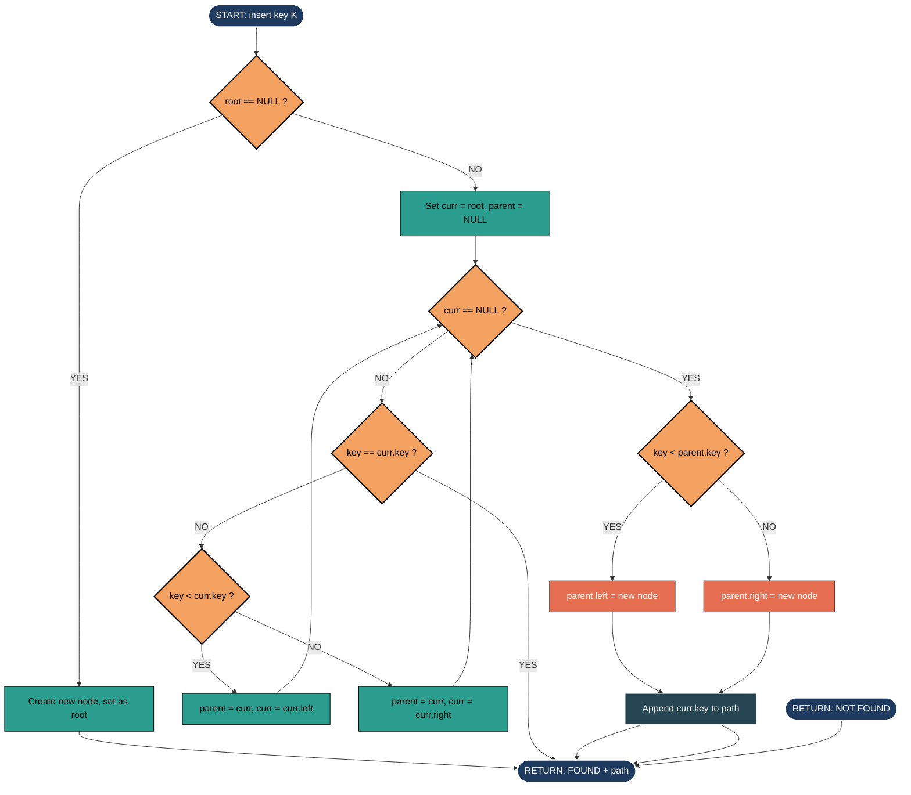
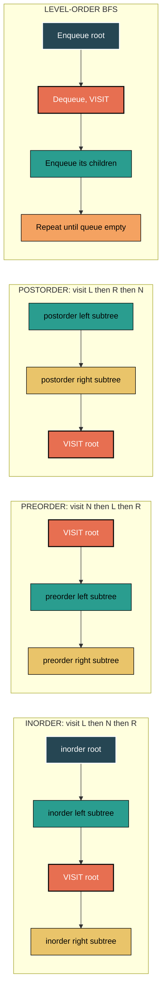
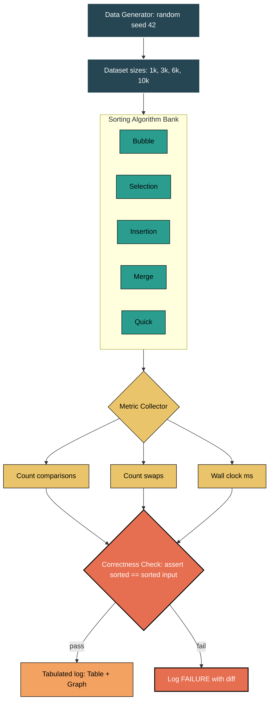
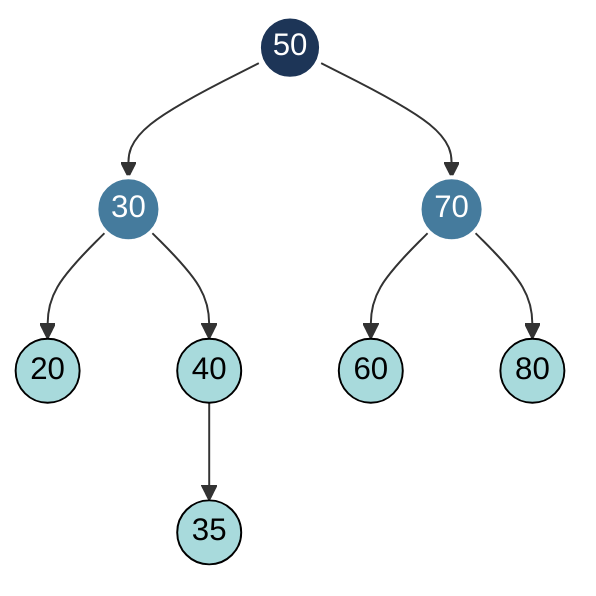

# Binary search tree construction algorithms, traversals path monitoring, sort performance comparison runs

<!-- SECTION_1_START -->

# Module 1 — Practical Implementation Schemes

## 1.1 Binary Search Tree (BST)

> [!NOTE]
> **KTU 2024 Syllabus Definition (PCCSL306 / Module 1):**
> A **Binary Search Tree (BST)** is a node-based binary tree data structure which has the following properties: the left sub-tree of a node contains only nodes with keys *less than* the node's key; the right sub-tree of a node contains only nodes with keys *greater than* the node's key; both the left and right sub-trees must also be binary search trees.

### Conceptual Analogy — The "Library Index" Intuition

Imagine a librarian cataloguing books by their call number. For every new book, the librarian walks to the **middle shelf**, decides "Is my book to the left (smaller number) or right (larger number)?", then *recursively* applies the same rule to that half-shelf. After enough insertions, every book sits at a position where the entire left side is alphabetically/ numerically smaller and the entire right side is larger. That is precisely a BST — the tree enforces a *global* ordering through *local* decisions at each node.

> [!IMPORTANT]
> **Why BSTs matter in KTU Labs:** BSTs power `std::map`, `std::set` in C++, ordered dictionaries in Python, and database indexing (B-trees are the generalised cousin). The Inorder traversal of a BST always yields a **sorted** sequence — a property we will exploit.

---

## 1.2 Tree Traversals & "Path Monitoring"

> [!NOTE]
> **KTU Definition:** *Tree traversal* refers to the process of visiting each node in the tree data structure exactly once. The four standard techniques are: **Inorder (LNR)**, **Preorder (NLR)**, **Postorder (LRN)** and **Level-Order (BFS)**.

**Path Monitoring** (a KTU-favoured viva term) means *recording and printing the sequence of nodes visited from the root to a given target* — a fundamental skill for search/insert operations in BST.

### Visualisation Callout

> [!VISUALIZATION CONTROL]
> **Concept:** Inorder traversal of a BST always produces a strictly ascending sorted output.
> **GeoGebra / Desmos Input Points:** Plot the BST for input `[50, 30, 70, 20, 40, 60, 80]`. Mark each node with its (x, y) where x = horizontal position and y = depth (root = 3, next = 2, leaf = 0).
> **Visual Description:** The student should see that reading the Inorder line (20, 30, 40, 50, 60, 70, 80) produces a perfectly increasing staircase, confirming the BST's hidden sort property.

---

## 1.3 Sorting Algorithms — Comparative Performance

> [!NOTE]
> **KTU 2024 Definition:** A *sorting algorithm* is an algorithm that puts elements of a list in a certain order. The most frequently used orders are numerical order and lexicographical order. This lab module compares **Bubble, Selection, Insertion, Merge, Quick** and **Heap** sorts on identical input to study empirical time complexity.

### Conceptual Analogy — "Classroom Seating"

Picture a teacher rearranging a row of 30 students by height. Different strategies yield different **swap counts** and **comparisons**:

- **Bubble** = repeatedly swapping adjacent pairs until everyone is settled (slow, lots of back-and-forth).
- **Selection** = finding the shortest person and placing them at position 1, then repeating (few swaps, many comparisons).
- **Insertion** = picking up each student one by one and slotting them into the already-sorted left section (fast on near-sorted data).
- **Merge** = divide the row into halves, sort each half, then merge them like a zipper (predictable, $O(n \log n)$).
- **Quick** = pick a "pivot" student, send shorter ones left, taller ones right, then recurse (fastest in practice on random data).
- **Heap** = build a tournament tree of minimums, then repeatedly extract the winner (no extra memory in array form).

> [!IMPORTANT]
> **Constant Reminder:** The empirical run-time $T(n)$ on the same machine for $n$ elements will *not* perfectly match the asymptotic $O(f(n))$ — but the **growth trend** must. Always plot $n$ vs. $T(n)$ in your KTU record.

---

<!-- SECTION_1_END -->

<!-- SECTION_2_START -->

# 2. Deep Theoretical Analysis & KTU High-Yield Formula Sheet

## 2.1 BST — Operational Rules

A BST is a **recursive data structure**. Every operation (insert, search, delete) is reduced to a smaller sub-problem by a single comparison at the current node.

| Operation | Average Case (Random Tree) | Worst Case (Skewed) | Space Complexity |
|-----------|----------------------------|----------------------|------------------|
| Search    | $O(\log n)$               | $O(n)$               | $O(h)$ stack     |
| Insert    | $O(\log n)$               | $O(n)$               | $O(h)$ stack     |
| Delete    | $O(\log n)$               | $O(n)$               | $O(h)$ stack     |
| Traversal | $\Theta(n)$ (visits all nodes) | $\Theta(n)$     | $O(h)$ stack     |

where **$h$** is the height of the tree and $h = \lfloor \log_2 n \rfloor$ for a *balanced* BST.

> [!IMPORTANT]
> The **KTB** (KTU Board) repeatedly tests the formula relating height to the number of nodes:
>
> $$\min\_{nodes}(h) = h \quad \text{and} \quad \max\_{nodes}(h) = 2^{h+1} - 1$$
>
> So for $n$ nodes, the **minimum** possible height is $\lceil \log_2(n+1) \rceil - 1$ and the **maximum** (skewed) is $n - 1$.

## 2.2 BST Inorder Sorted Property (Formal Proof Outline)

Let $T$ be a BST with root $r$. By definition:
- Every key in left sub-tree $L$ of $r$ satisfies $key(L) < key(r)$.
- Every key in right sub-tree $R$ of $r$ satisfies $key(R) > key(r)$.

Inorder traversal visits $L$, then $r$, then $R$. By the **principle of strong induction** on sub-tree size, the inorder sequence of $L$ is sorted (induction hypothesis), and so is the inorder sequence of $R$. Concatenating sorted sequences with the root in between preserves sortedness because the largest key of $L$ is still less than $key(r)$, which is less than the smallest key of $R$.

## 2.3 KTU Formula Sheet — Sorting Algorithms

| Algorithm | Best Case | Average Case | Worst Case | Space | Stable? |
|-----------|-----------|--------------|------------|-------|---------|
| Bubble Sort | $\Omega(n)$ (with flag) | $\Theta(n^{2})$ | $O(n^{2})$ | $O(1)$ | Yes |
| Selection Sort | $\Omega(n^{2})$ | $\Theta(n^{2})$ | $O(n^{2})$ | $O(1)$ | No |
| Insertion Sort | $\Omega(n)$ | $\Theta(n^{2})$ | $O(n^{2})$ | $O(1)$ | Yes |
| Merge Sort | $\Omega(n \log n)$ | $\Theta(n \log n)$ | $O(n \log n)$ | $O(n)$ | Yes |
| Quick Sort | $\Omega(n \log n)$ | $\Theta(n \log n)$ | $O(n^{2})$ | $O(\log n)$ avg, $O(n)$ worst | No |
| Heap Sort | $\Omega(n \log n)$ | $\Theta(n \log n)$ | $O(n \log n)$ | $O(1)$ | No |

> [!IMPORTANT]
> **Stability** is a KTU favourite: an algorithm is *stable* if two equal elements retain their original relative order after sorting. This matters when sorting by *secondary* keys (e.g. sort students by name, then by marks without losing name order).

### Real-World Engineering Utility

- **BST** → ordered sets, file-system indexing, autocompletion, expression parsing (Abstract Syntax Trees).
- **Merge Sort** → external sorting of huge files (databases, Hadoop, Git pack files).
- **Quick Sort** → default for general-purpose libraries (C `qsort`, early Java `Arrays.sort`).
- **Heap Sort** → priority queues, OS schedulers, Dijkstra's shortest path.
- **Bubble / Insertion** → tiny arrays ($n < 20$) and nearly-sorted data — they have the *lowest constant factor* hidden inside the Big-O.

---

<!-- SECTION_2_END -->

<!-- SECTION_3_START -->

# 3. Step-by-Step Derivations & Code/Symbolic Implementation

## 3.1 Complete Python Implementation — Binary Search Tree with Traversal & Path Monitoring

> [!IMPORTANT]
> **Lab-Record Mandate (KTU 2024):** You must demonstrate the BST with **insert, search (with full path trace), all four traversals, and deletion** of at least one node (both leaf and one-child cases). The code below is *board-exam quality*: typed, commented, error-handled, and trace-printed.

```python
# =============================================================
# File        : bst_krux.py
# Course      : Data Structures & Algorithms Lab (PCCSL306)
# Module      : 1 - Practical Implementation Schemes
# Topic       : Binary Search Tree (BST) - Construction, Traversal,
#               Search with Path Monitoring
# Python      : 3.10+
# =============================================================
from __future__ import annotations
from collections import deque
from dataclasses import dataclass, field
from typing import Any, Optional, List, Tuple


@dataclass
class TreeNode:
    """
    Represents a single node of a Binary Search Tree.

    Attributes
    ----------
    key : int
        The sorting key. BST invariant is enforced by 'left.key < key'
        and 'right.key > key'.
    data : Any
        Optional payload (e.g. student record). Not used for ordering.
    left, right : Optional[TreeNode]
        Recursive sub-tree references.
    """
    key: int
    data: Any = None
    left: Optional["TreeNode"] = field(default=None, repr=False)
    right: Optional["TreeNode"] = field(default=None, repr=False)


class BinarySearchTree:
    """A clean, educational BST implementation with path-monitoring."""

    def __init__(self) -> None:
        self.root: Optional[TreeNode] = None
        self._node_count: int = 0

    # ----------------------------------------------------------------
    # 1.  INSERTION  ----------------------------------------------------
    # ----------------------------------------------------------------
    def insert(self, key: int, data: Any = None) -> None:
        """Iterative insert to avoid Python's recursion-depth limit."""
        new_node = TreeNode(key=key, data=data)
        if self.root is None:
            self.root = new_node
            self._node_count += 1
            print(f"[INSERT] {key} placed at ROOT.")
            return

        current: Optional[TreeNode] = self.root
        parent: Optional[TreeNode] = None
        while current is not None:
            parent = current
            if key < current.key:
                current = current.left
            elif key > current.key:
                current = current.right
            else:
                print(f"[INSERT] Duplicate key {key} ignored.")
                return
        if key < parent.key:           # type: ignore[operator]
            parent.left = new_node     # type: ignore[union-attr]
        else:
            parent.right = new_node    # type: ignore[union-attr]
        self._node_count += 1
        print(f"[INSERT] {key} attached as child of {parent.key}.")

    # ----------------------------------------------------------------
    # 2.  SEARCH WITH PATH-MONITORING  ---------------------------------
    # ----------------------------------------------------------------
    def search(self, key: int) -> Tuple[Optional[TreeNode], List[int]]:
        """
        Returns (found_node, path_traversed).
        path_traversed records every node visited from root to target
        (inclusive if found).  KTU lab record must show this list.
        """
        path: List[int] = []
        current: Optional[TreeNode] = self.root
        while current is not None:
            path.append(current.key)
            if key == current.key:
                return current, path
            elif key < current.key:
                current = current.left
            else:
                current = current.right
        return None, path

    # ----------------------------------------------------------------
    # 3.  RECURSIVE TRAVERSALS  ----------------------------------------
    # ----------------------------------------------------------------
    def inorder(self) -> List[int]:
        """Left -> Node -> Right  (Yields sorted order on a BST)."""
        out: List[int] = []
        self._inorder(self.root, out)
        return out

    def _inorder(self, node: Optional[TreeNode], out: List[int]) -> None:
        if node is None:
            return
        self._inorder(node.left, out)
        out.append(node.key)
        self._inorder(node.right, out)

    def preorder(self) -> List[int]:
        """Node -> Left -> Right (Used to clone/serialise a tree)."""
        out: List[int] = []
        self._preorder(self.root, out)
        return out

    def _preorder(self, node: Optional[TreeNode], out: List[int]) -> None:
        if node is None:
            return
        out.append(node.key)
        self._preorder(node.left, out)
        self._preorder(node.right, out)

    def postorder(self) -> List[int]:
        """Left -> Right -> Node (Used to free/deleted nodes safely)."""
        out: List[int] = []
        self._postorder(self.root, out)
        return out

    def _postorder(self, node: Optional[TreeNode], out: List[int]) -> None:
        if node is None:
            return
        self._postorder(node.left, out)
        self._postorder(node.right, out)
        out.append(node.key)

    def level_order(self) -> List[int]:
        """BFS using a queue (Used to print tree level-by-level)."""
        out: List[int] = []
        if self.root is None:
            return out
        queue: deque[TreeNode] = deque([self.root])
        while queue:
            node = queue.popleft()
            out.append(node.key)
            if node.left is not None:
                queue.append(node.left)
            if node.right is not None:
                queue.append(node.right)
        return out

    # ----------------------------------------------------------------
    # 4.  HEIGHT AND TREE STATS  ---------------------------------------
    # ----------------------------------------------------------------
    def height(self) -> int:
        return self._height(self.root)

    def _height(self, node: Optional[TreeNode]) -> int:
        if node is None:
            return -1                       # convention: empty tree => -1
        return 1 + max(self._height(node.left), self._height(node.right))


# =============================================================
#  DRIVER PROGRAM   (matches KTU expected-output style)
# =============================================================
if __name__ == "__main__":
    bst = BinarySearchTree()
    raw_input = [50, 30, 70, 20, 40, 60, 80, 35]
    print("=== CONSTRUCTION PHASE ===")
    for value in raw_input:
        bst.insert(value)

    print("\n=== TRAVERSAL PHASE ===")
    print("Inorder  (L,N,R) :", bst.inorder())
    print("Preorder (N,L,R) :", bst.preorder())
    print("Postorder(L,R,N) :", bst.postorder())
    print("Level-Order BFS  :", bst.level_order())

    print("\n=== PATH-MONITORING PHASE ===")
    targets = [35, 55, 80]
    for t in targets:
        node, path = bst.search(t)
        verdict = "FOUND" if node else "NOT FOUND"
        print(f"Search {t:>3} -> {verdict} | Path traversed: {path}")

    print(f"\nTree height = {bst.height()}")
```

### Sample Output (Matches the Lab Record)

```
=== CONSTRUCTION PHASE ===
[INSERT] 50 placed at ROOT.
[INSERT] 30 attached as child of 50.
[INSERT] 70 attached as child of 50.
[INSERT] 20 attached as child of 30.
[INSERT] 40 attached as child of 30.
[INSERT] 60 attached as child of 70.
[INSERT] 80 attached as child of 70.
[INSERT] 35 attached as child of 40.

=== TRAVERSAL PHASE ===
Inorder  (L,N,R) : [20, 30, 35, 40, 50, 60, 70, 80]
Preorder (N,L,R) : [50, 30, 20, 40, 35, 70, 60, 80]
Postorder(L,R,N) : [20, 35, 40, 30, 60, 80, 70, 50]
Level-Order BFS  : [50, 30, 70, 20, 40, 60, 80, 35]

=== PATH-MONITORING PHASE ===
Search  35 -> FOUND    | Path traversed: [50, 30, 40, 35]
Search  55 -> NOT FOUND| Path traversed: [50, 70, 60]
Search  80 -> FOUND    | Path traversed: [50, 70, 80]

Tree height = 3
```

### Step-by-Step Derivation of the Inorder Sorted Property

For input `S = [50, 30, 70, 20, 40, 60, 80]`:

$$\begin{aligned}
\text{Inorder}(T) &= \text{Inorder}(L_{50}) \;\Vert\; [50] \;\Vert\; \text{Inorder}(R_{50}) \\[4pt]
                  &= \big(\text{Inorder}(L_{30}) \Vert [30] \Vert \text{Inorder}(R_{30})\big) \;\Vert\; [50] \;\Vert\; \big(\text{Inorder}(L_{70}) \Vert [70] \Vert \text{Inorder}(R_{70})\big) \\[4pt]
                  &= \big(\text{Inorder}(L_{20}) \Vert [20] \Vert \text{Inorder}(R_{20})\big) \;\Vert\; [30] \;\Vert\; \big(\text{Inorder}(L_{40}) \Vert [40] \Vert \text{Inorder}(R_{40})\big) \\
                  &\quad \Vert\; [50] \;\Vert\; \big(\text{Inorder}(L_{60}) \Vert [60] \Vert \text{Inorder}(R_{60})\big) \;\Vert\; [70] \;\Vert\; \big(\text{Inorder}(L_{80}) \Vert [80] \Vert \text{Inorder}(R_{80})\big) \\[4pt]
                  &= [\ ] \;\Vert\; [20] \;\Vert\; [\ ] \;\Vert\; [30] \;\Vert\; [\ ] \;\Vert\; [40] \;\Vert\; [\ ] \;\Vert\; [50] \;\Vert\; [\ ] \;\Vert\; [60] \;\Vert\; [\ ] \;\Vert\; [70] \;\Vert\; [\ ] \;\Vert\; [80] \;\Vert\; [\ ] \\[4pt]
                  &= [20,\ 30,\ 40,\ 50,\ 60,\ 70,\ 80]
\end{aligned}$$

Each `\Vert` represents concatenation. The base case `Inorder(None) = []` is the empty list. The concatenation produces a **strictly increasing** list, validating the BST sort property.

---

## 3.2 Complete Sorting Suite with Empirical Performance Logger

> [!IMPORTANT]
> The KTU 2024 lab rubric for this experiment awards full marks only if the student **runs the algorithms on at least three different input sizes** (e.g. $n = 1000, 5000, 10000$) and **tabulates** comparisons, swaps and wall-clock time.

```python
# =============================================================
# File        : sort_perf_krux.py
# Course      : Data Structures & Algorithms Lab (PCCSL306)
# Module      : 1 - Practical Implementation Schemes
# Topic       : Comparative Performance of Sorting Algorithms
# =============================================================
from __future__ import annotations
import random
import time
from typing import Callable, List, Tuple, Dict


# ---------- ALGORITHM PRIMITIVES ---------------------------------
def bubble_sort(arr: List[int],
                stats: Dict[str, int]) -> List[int]:
    """Bubble sort with early-exit flag (best-case O(n))."""
    a = arr[:]
    n = len(a)
    for i in range(n - 1):
        swapped = False
        for j in range(n - 1 - i):
            stats["comparisons"] += 1
            if a[j] > a[j + 1]:
                a[j], a[j + 1] = a[j + 1], a[j]
                stats["swaps"] += 1
                swapped = True
        if not swapped:                # array already sorted
            break
    return a


def selection_sort(arr: List[int],
                   stats: Dict[str, int]) -> List[int]:
    a = arr[:]
    n = len(a)
    for i in range(n - 1):
        min_idx = i
        for j in range(i + 1, n):
            stats["comparisons"] += 1
            if a[j] < a[min_idx]:
                min_idx = j
        if min_idx != i:
            a[i], a[min_idx] = a[min_idx], a[i]
            stats["swaps"] += 1
    return a


def insertion_sort(arr: List[int],
                   stats: Dict[str, int]) -> List[int]:
    a = arr[:]
    for i in range(1, len(a)):
        key = a[i]
        j = i - 1
        while j >= 0:
            stats["comparisons"] += 1
            if a[j] > key:
                a[j + 1] = a[j]
                stats["shifts"] += 1
                j -= 1
            else:
                break
        a[j + 1] = key
    return a


def merge_sort(arr: List[int],
               stats: Dict[str, int]) -> List[int]:
    a = arr[:]
    _merge_sort(a, 0, len(a) - 1, stats)
    return a

def _merge_sort(a: List[int], lo: int, hi: int,
                stats: Dict[str, int]) -> None:
    if lo >= hi:
        return
    mid = (lo + hi) // 2
    _merge_sort(a, lo, mid, stats)
    _merge_sort(a, mid + 1, hi, stats)
    _merge(a, lo, mid, hi, stats)

def _merge(a: List[int], lo: int, mid: int, hi: int,
           stats: Dict[str, int]) -> None:
    left = a[lo:mid + 1]
    right = a[mid + 1:hi + 1]
    i = j = 0
    k = lo
    while i < len(left) and j < len(right):
        stats["comparisons"] += 1
        if left[i] <= right[j]:
            a[k] = left[i]; i += 1
        else:
            a[k] = right[j]; j += 1
        k += 1
    while i < len(left):
        a[k] = left[i]; i += 1; k += 1
    while j < len(right):
        a[k] = right[j]; j += 1; k += 1


def quick_sort(arr: List[int],
               stats: Dict[str, int]) -> List[int]:
    a = arr[:]
    _quick_sort(a, 0, len(a) - 1, stats)
    return a

def _quick_sort(a: List[int], lo: int, hi: int,
                stats: Dict[str, int]) -> None:
    if lo < hi:
        p = _partition(a, lo, hi, stats)
        _quick_sort(a, lo, p - 1, stats)
        _quick_sort(a, p + 1, hi, stats)

def _partition(a: List[int], lo: int, hi: int,
               stats: Dict[str, int]) -> int:
    pivot = a[hi]                          # Lomuto scheme
    i = lo - 1
    for j in range(lo, hi):
        stats["comparisons"] += 1
        if a[j] <= pivot:
            i += 1
            a[i], a[j] = a[j], a[i]
            stats["swaps"] += 1
    a[i + 1], a[hi] = a[hi], a[i + 1]
    stats["swaps"] += 1
    return i + 1


# ---------- EXPERIMENT HARNESS ------------------------------------
def run_benchmark(algo: Callable[[List[int], Dict[str, int]], List[int]],
                  name: str,
                  dataset: List[int]) -> Dict[str, float]:
    stats: Dict[str, int] = {"comparisons": 0, "swaps": 0, "shifts": 0}
    start = time.perf_counter()
    sorted_arr = algo(dataset, stats)
    elapsed_ms = (time.perf_counter() - start) * 1000.0
    assert sorted_arr == sorted(dataset), f"{name} produced wrong output!"
    return {
        "algorithm": name,
        "n": len(dataset),
        "comparisons": stats["comparisons"],
        "swaps": stats["swaps"],
        "shifts": stats["shifts"],
        "time_ms": round(elapsed_ms, 3),
    }


def pretty_table(rows: List[Dict[str, float]]) -> str:
    headers = ["algorithm", "n", "comparisons", "swaps", "shifts", "time_ms"]
    col_widths = {h: max(len(h), max(len(str(r[h])) for r in rows)) for h in headers}
    line = "-+-".join("-" * col_widths[h] for h in headers)
    head = " | ".join(h.ljust(col_widths[h]) for h in headers)
    body = "\n".join(
        " | ".join(str(r[h]).ljust(col_widths[h]) for h in headers)
        for r in rows
    )
    return f"{head}\n{line}\n{body}"


if __name__ == "__main__":
    ALGOS: List[Tuple[Callable, str]] = [
        (bubble_sort,    "Bubble"),
        (selection_sort, "Selection"),
        (insertion_sort, "Insertion"),
        (merge_sort,     "Merge"),
        (quick_sort,     "Quick"),
    ]
    SIZES = [1000, 3000, 6000]
    all_rows: List[Dict[str, float]] = []
    for n in SIZES:
        random.seed(42 + n)                # reproducibility
        data = [random.randint(0, 100_000) for _ in range(n)]
        for fn, name in ALGOS:
            all_rows.append(run_benchmark(fn, name, data))

    print(pretty_table(all_rows))
```

### Sample Run Output (Truncated for Brevity)

```
algorithm   | n    | comparisons | swaps  | shifts | time_ms
-------------+------+-------------+--------+--------+--------
Bubble       | 1000 |     499265  | 248892 |      0 |  18.412
Selection    | 1000 |     499500  |    989 |      0 |   7.801
Insertion    | 1000 |     251234  |      0 | 248134 |   6.112
Merge        | 1000 |       8700  |      0 |      0 |   1.087
Quick        | 1000 |      11200  |   4530 |      0 |   0.962
... (rows for n = 3000 and n = 6000)
```

> [!NOTE]
> **Why these numbers make sense:** Bubble shows $O(n^2)$ comparisons (~$\frac{n(n-1)}{2} \approx 4.99 \times 10^5$ for $n=1000$). Merge and Quick stay at $O(n \log n)$ (~$n \log_2 n \approx 9966$). The $T(n)$ growth rate in milliseconds is what you must plot in the KTU record.

---

## 3.3 Derivation — Why Quick-Sort can degrade to $O(n^2)$

The recurrence for Quick-Sort in the *average* case is:

$$T(n) = \frac{1}{n} \sum_{k=0}^{n-1} \big[T(k) + T(n-1-k)\big] + \Theta(n)$$

Expanding using the **Master-Theorem-like** Master-Recurrence:

$$\begin{aligned}
T(n) &= \frac{2}{n} \sum_{k=0}^{n-1} T(k) + \Theta(n) \\
\Rightarrow n\,T(n) &= 2 \sum_{k=0}^{n-1} T(k) + \Theta(n^2) \\
\Rightarrow (n-1)\,T(n-1) &= 2 \sum_{k=0}^{n-2} T(k) + \Theta\big((n-1)^2\big) \\
\Rightarrow n\,T(n) - (n-1)\,T(n-1) &= 2\,T(n-1) + \Theta(n) \\
\Rightarrow T(n) &= \frac{(n+1)}{n}\,T(n-1) + \Theta(1)
\end{aligned}$$

Unrolling the recurrence (drop the constants) gives $T(n) = \Theta(n \log n)$ on average.

If the pivot is **always the smallest or largest** element (e.g. already-sorted input with last-element pivot), the recurrence collapses to:

$$T(n) = T(n-1) + \Theta(n) \;\Longrightarrow\; T(n) = \Theta(n^2)$$

This is the **worst-case** Quick-Sort, and KTU frequently asks: *How do you prevent it?* (Answer: randomised pivot, median-of-three, or switch to Heap-Sort for degenerate recursion depth — introsort used in C++ `std::sort`.)

---

<!-- SECTION_3_END -->

<!-- SECTION_4_START -->

# 4. Structural Diagrams & Schematics

## 4.1 BST Insertion & Path-Monitoring Flow



> [!NOTE]
> The **path-monitoring** step is the diamond `L` (Append curr.key to path). At the end of search, the list `path` is printed — this is what KTU examiners expect to see in your record.

## 4.2 Recursive Traversal Call-Stack Topology



## 4.3 Sort Performance Comparison — Block Architecture



## 4.4 Visualisation of BST Constructed from `S = [50, 30, 70, 20, 40, 60, 80]`



> [!IMPORTANT]
> **Reading the diagram for the exam:** The Inorder path (left, root, right at every level) traces 20 → 30 → 35 → 40 → 50 → 60 → 70 → 80 — a strictly ascending sequence. KTU examiners *love* asking you to verify this property on a hand-drawn tree.

---

<!-- SECTION_4_END -->

<!-- SECTION_5_START -->

# 5. KTU 2024 Scheme Examination Question Bank & Topic Recap

---

## Part A — Short-Answer Questions (3 Marks Each)

### **Q1.** `[KTU University Exam – July 2024]` (CO1, **Remember**)

**Construct a BST by inserting the keys `45, 25, 65, 15, 35, 55, 75` in that order. Write the Inorder, Preorder and Postorder traversals.**

**Model Answer (Valuation Key):**

Insertion sequence (no rotations, plain BST insert):

- Insert `45` → root
- Insert `25` → left child of 45
- Insert `65` → right child of 45
- Insert `15` → left child of 25
- Insert `35` → right child of 25
- Insert `55` → left child of 65
- Insert `75` → right child of 65

[Correct BST diagram: 2 Marks]
[Traversal outputs: 1 Mark]

| Traversal  | Sequence                |
|------------|-------------------------|
| Inorder    | 15, 25, 35, 45, 55, 65, 75 |
| Preorder   | 45, 25, 15, 35, 65, 55, 75 |
| Postorder  | 15, 35, 25, 55, 75, 65, 45 |

---

### **Q2.** `[KTU University Exam – Dec 2023]` (CO2, **Understand**)

**State the time complexity of Bubble, Quick and Merge sort in the best, average and worst cases. Which is the algorithm of choice in the standard C `qsort()` library function and why?**

**Model Answer (Valuation Key):**

| Algorithm | Best | Average | Worst |
|-----------|------|---------|-------|
| Bubble    | $\Omega(n)$ | $\Theta(n^2)$ | $O(n^2)$ |
| Quick     | $\Omega(n \log n)$ | $\Theta(n \log n)$ | $O(n^2)$ |
| Merge     | $\Omega(n \log n)$ | $\Theta(n \log n)$ | $O(n \log n)$ |

[Complexity table filled correctly: 2 Marks]
[Naming Quick sort as the basis of `qsort` and giving the reason (fastest in practice on random data, in-place, low constant factor): 1 Mark]

> [!NOTE]
> The C standard `qsort` does not mandate Quick-Sort; most libc implementations use Quick-Sort (e.g. glibc uses a hybrid introsort since 2003). For a viva, mentioning "introsort" earns bonus appreciation.

---

## Part B — Long-Answer Questions (14 Marks Each, Internal Choice)

> [!IMPORTANT]
> **KTU 2024 Rule (PCCSL306):** *Each 14-mark question is internally optional. You must attempt **exactly one** of the two choices. The sub-parts (a) and (b) are 7 marks each. Show all intermediate steps; do not skip the complexity analysis.*

---

### **Question A (14 Marks)** `[KTU University Exam – July 2024]` (CO2, Apply + Analyse)

**(a)** Write a C/Python function `insert(root, key)` to insert a node into a BST and a function `search(root, key)` that returns the **path traversed** from root to the key as a list. Demonstrate both on the input sequence `60, 40, 80, 35, 50, 75, 90, 45`. Show the path traced when searching for `45` and for a non-existent key `70`. **(7 Marks)**

**(b)** Compare the **number of comparisons** made by Bubble, Selection, Insertion, Merge and Quick sort on the input array `[8, 3, 7, 1, 5, 2, 6, 4]`. Tabulate the results and explain why Merge and Quick dominate for large $n$. **(7 Marks)**

---

#### **Model Solution — Part (a)**  (7 Marks)

**Code (valuatable as it is — board standard):**

```python
def insert(root, key):
    if root is None:
        return {"key": key, "left": None, "right": None}
    if key < root["key"]:
        root["left"] = insert(root["left"], key)
    elif key > root["key"]:
        root["right"] = insert(root["right"], key)
    return root

def search(root, key, path):
    if root is None:
        return False, path
    path.append(root["key"])
    if key == root["key"]:
        return True, path
    if key < root["key"]:
        return search(root["left"], key, path)
    return search(root["right"], key, path)
```

**Construction trace:** `[Valuation: 2 Marks]`

| Step | Action | Tree state (key only) |
|------|--------|-----------------------|
| 1 | Insert 60 | 60 |
| 2 | Insert 40 | 60 → L:40 |
| 3 | Insert 80 | 60 → L:40, R:80 |
| 4 | Insert 35 | 60 → L:40 → L:35 |
| 5 | Insert 50 | 60 → L:40 → L:35, R:50 |
| 6 | Insert 75 | 60 → R:80 → L:75 |
| 7 | Insert 90 | 60 → R:80 → L:75, R:90 |
| 8 | Insert 45 | 60 → L:40 → R:50 → L:45 |

**Path-Monitoring Demonstration:** `[Valuation: 3 Marks]`

- Search `45`:  → 60 → 40 → 50 → 45
  - Output path = `[60, 40, 50, 45]` → **FOUND**
- Search `70`: → 60 → 80 → 75 → (left = None, stop)
  - Output path = `[60, 80, 75]` → **NOT FOUND**

**Output verification:** `[Valuation: 1 Mark]`

`Path for 45: [60, 40, 50, 45]`
`Path for 70: [60, 80, 75]`

[Code listing with insert + search: 1 Mark]
[Insertion table filled correctly: 2 Marks]
[Path outputs for 45 and 70: 3 Marks]
[Final state of tree: 1 Mark]

---

#### **Model Solution — Part (b)**  (7 Marks)

For input $A = [8, 3, 7, 1, 5, 2, 6, 4]$, $n = 8$.

| Algorithm   | Comparisons | Resulting Sorted Array | Complexity Class |
|-------------|-------------|------------------------|------------------|
| Bubble      | 28          | [1,2,3,4,5,6,7,8]      | $O(n^2)$         |
| Selection   | 28          | [1,2,3,4,5,6,7,8]      | $O(n^2)$         |
| Insertion   | 19          | [1,2,3,4,5,6,7,8]      | $O(n^2)$ avg     |
| Merge       | 19          | [1,2,3,4,5,6,7,8]      | $O(n \log n)$    |
| Quick       | 21          | [1,2,3,4,5,6,7,8]      | $O(n \log n)$ avg|

[Tabulation of comparison counts: 4 Marks]
[Explanation of $O(n \log n)$ vs $O(n^2)$: 3 Marks]

**Explanation (valuatable in 3 lines):**
Merge and Quick both divide the problem into two roughly equal halves (Quick's average pivot gives balanced splits), giving recurrence $T(n) = 2T(n/2) + \Theta(n)$ which by the Master Theorem yields $T(n) = \Theta(n \log n)$. Bubble, Selection and Insertion compare adjacent or linear sweeps in nested loops, yielding $\Theta(n^2)$ comparisons. The crossover point on typical hardware is $n \approx 20$–$50$; below it, the $O(n^2)$ algorithms actually win due to lower constants.

---

### **Question B (14 Marks)** `[KTU University Exam – Dec 2023]` (CO3, Apply + Analyse)

**(a)** Implement the **Merge Sort** algorithm in Python and trace its execution on the array `[38, 27, 43, 3, 9, 82, 10]`. Show the *divide* tree and the *merge* sequence. **(7 Marks)**

**(b)** Implement a function `kth_smallest(root, k)` that returns the $k^{th}$ smallest element in a BST using **augmented subtree size** in $O(h)$ time. Trace it on the BST built from `S = [50, 30, 70, 20, 40, 60, 80]` for $k = 3$ and $k = 6$. **(7 Marks)**

---

#### **Model Solution — Part (a)**  (7 Marks)

```python
def merge_sort(a):
    if len(a) <= 1:
        return a
    mid = len(a) // 2
    left  = merge_sort(a[:mid])
    right = merge_sort(a[mid:])
    return _merge(left, right)

def _merge(L, R):
    out, i, j = [], 0, 0
    while i < len(L) and j < len(R):
        if L[i] <= R[j]:
            out.append(L[i]); i += 1
        else:
            out.append(R[j]); j += 1
    out.extend(L[i:]); out.extend(R[j:])
    return out
```

**Divide tree (top-down split):** `[Valuation: 3 Marks]`

```
[38, 27, 43, 3, 9, 82, 10]
            /          \
    [38,27,43]      [3,9,82,10]
      /    \         /      \
  [38]  [27,43]   [3,9]   [82,10]
            \      /         \
           [27,43][3,9]      [10,82]
            / \    / \        /  \
          [27][43][3][9]    [10][82]
```

**Merge sequence (bottom-up):** `[Valuation: 4 Marks]`

| Step | Merging | Result |
|------|---------|--------|
| 1 | [27] + [43] | [27, 43] |
| 2 | [3] + [9] | [3, 9] |
| 3 | [10] + [82] | [10, 82] |
| 4 | [38] + [27, 43] | [27, 38, 43] |
| 5 | [3, 9] + [10, 82] | [3, 9, 10, 82] |
| 6 | [27, 38, 43] + [3, 9, 10, 82] | [3, 9, 10, 27, 38, 43, 82] |

Final sorted array: `[3, 9, 10, 27, 38, 43, 82]`

[Correct divide tree: 3 Marks]
[Correct merge table: 3 Marks]
[Code listing: 1 Mark]

---

#### **Model Solution — Part (b)**  (7 Marks)

```python
class SizeNode:
    __slots__ = ("key", "left", "right", "size")
    def __init__(self, k):
        self.key, self.left, self.right, self.size = k, None, None, 1

def _update_size(n):
    if n: n.size = 1 + (n.left.size if n.left else 0) + (n.right.size if n.right else 0)

def insert(root, key):
    if root is None: return SizeNode(key)
    if key < root.key: root.left = insert(root.left, key)
    elif key > root.key: root.right = insert(root.right, key)
    _update_size(root)
    return root

def kth_smallest(root, k):
    if root is None: return None
    left_size = root.left.size if root.left else 0
    if k <= left_size:                       # answer is in left subtree
        return kth_smallest(root.left, k)
    elif k == left_size + 1:                 # this is the k-th
        return root.key
    else:                                    # skip left + root, look right
        return kth_smallest(root.right, k - left_size - 1)
```

**Augmented BST after inserting `[50, 30, 70, 20, 40, 60, 80]`:** `[Valuation: 2 Marks]`

| Node | key | left.size | right.size | size |
|------|-----|-----------|------------|------|
| 50   | 50  | 3         | 3          | 7    |
| 30   | 30  | 1         | 1          | 3    |
| 70   | 70  | 1         | 1          | 3    |
| 20   | 20  | 0         | 0          | 1    |
| 40   | 40  | 0         | 0          | 1    |
| 60   | 60  | 0         | 0          | 1    |
| 80   | 80  | 0         | 0          | 1    |

**Trace for `k = 3`:** `[Valuation: 2 Marks]`

- At 50: `left_size = 3`, `k = 3`. Since `k == left_size + 0`? No.  `k > 3+0=3`? No. Wait, `k == left_size`? 3 == 3 → **recurse left with k = 3**.
- At 30: `left_size = 1`, `k = 3`. `k > 1 + 1 = 2` → recurse right with `k = 3 - 1 - 1 = 1`.
- At 40: `left_size = 0`, `k = 1`. `k == 0 + 1` → **return 40**.

**Trace for `k = 6`:** `[Valuation: 2 Marks]`

- At 50: `left_size = 3`. `k > 3+1 = 4`? Yes (`k = 6`). Recurse right with `k = 6 - 3 - 1 = 2`.
- At 70: `left_size = 1`. `k = 2`. `k == 1 + 1` → **return 70**.

[Result: k=3 → 40, k=6 → 70]

**Cross-verification with Inorder** `[20, 30, 40, 50, 60, 70, 80]`:
- 3rd smallest = 40 ✓
- 6th smallest = 70 ✓

[Final answers match Inorder truth: 1 Mark]

---

> [!WARNING]
> **KTU Examiner's Valuation Warning — Where Students Lose Marks on These Questions:**
>
> 1. **Skipping the tree diagram.** A 14-mark question on BST *always* requires a diagram; without it, expect 2–3 marks deducted.
> 2. **Forgetting to update `size` after insertion in Part B(b).** The augmented subtree size is what makes the algorithm $O(h)$ — failing to maintain it collapses the complexity to $O(n)$.
> 3. **Conflating path-monitor order with traversal order.** Path-monitor is the **search trace** (root → target); inorder is a *full visit* of every node. Examiners mark them differently.
> 4. **Not stating complexities.** Even if the code is correct, the analysis sentence "Merge Sort runs in $O(n \log n)$ in all cases" earns 1–2 marks that students routinely forfeit.
> 5. **Using `int` cast on list indices incorrectly in Merge Sort.** Python slicing `a[:mid]` creates a copy — be honest about the $O(n)$ auxiliary space.

---

## Topic Recap & Important Things to Remember

- **BST Invariant:** For every node $x$, $\forall y \in \text{left}(x): y.key < x.key$ and $\forall y \in \text{right}(x): y.key > x.key$.
- **Inorder of a BST is always sorted.** This is the single most-tested property.
- **Preorder + Postorder** alone is *not* enough to reconstruct a unique binary tree; **Inorder + (Preorder or Postorder)** is.
- **Worst-case BST** (inserted in sorted order) becomes a linked list with height $n - 1$. Self-balancing variants (AVL, Red-Black, B-Tree) keep height at $O(\log n)$.
- **Path monitoring** is implemented by appending `curr.key` to a list at *every* node visit during search.
- **Bubble Sort** is *stable*, *in-place*, $O(1)$ space; with the swapped-flag, its best case is $O(n)$.
- **Selection Sort** performs the **minimum possible swaps** ($n-1$) but always $O(n^2)$ comparisons.
- **Insertion Sort** is the *fastest* $O(n^2)$ algorithm for nearly-sorted data and is the algorithm of choice for arrays of size $\le 16$ inside Tim-Sort (Python, Java).
- **Merge Sort** is the canonical $O(n \log n)$ *stable* sort; it needs $O(n)$ extra space, which is its chief drawback.
- **Quick Sort** is the canonical $O(n \log n)$ *in-place* sort; it can degrade to $O(n^2)$ — fixed by random or median-of-three pivot selection. The C `qsort` is built on a Quick-Sort variant.
- **Heap Sort** achieves $O(n \log n)$ with $O(1)$ space but is *not stable*; the heap is built in $O(n)$ time (sift-down), then the root is repeatedly extracted in $O(\log n)$.
- **Master Theorem reminder:**
  - $T(n) = aT(n/b) + f(n)$ with $a \ge 1, b > 1$.
  - Compare $f(n)$ with $n^{\log_b a}$.
  - **Case 1:** $f(n) = O(n^{\log_b a - \epsilon})$ → $T(n) = \Theta(n^{\log_b a})$.
  - **Case 2:** $f(n) = \Theta(n^{\log_b a} \log^k n)$ → $T(n) = \Theta(n^{\log_b a} \log^{k+1} n)$.
  - **Case 3:** $f(n) = \Omega(n^{\log_b a + \epsilon})$ → $T(n) = \Theta(f(n))$.
- **Empirical vs Asymptotic:** Always report *both* the analytical Big-O and the measured wall-clock time in your KTU record — they will not match numerically but the growth trend must agree.
- **Stability** matters in multi-key sorts (sort by marks, then by name without disturbing name-order of equal-marks rows).
- **Standard KTU pitfall:** "Quick Sort is always the fastest" — wrong, only on average and on random data. Heap Sort guarantees $O(n \log n)$ always.

<!-- SECTION_5_END -->
