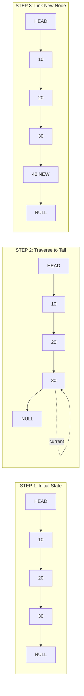
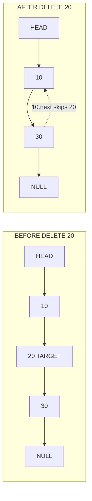
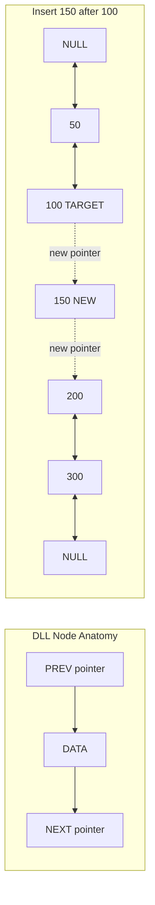
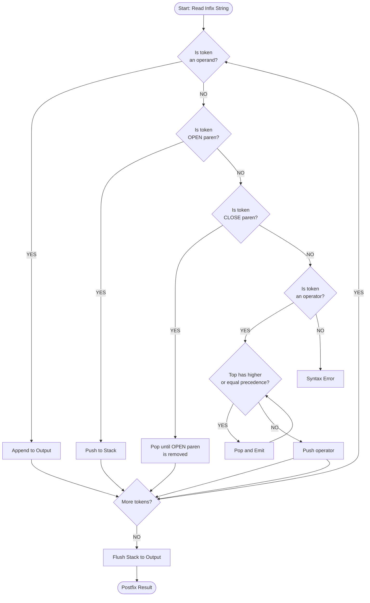
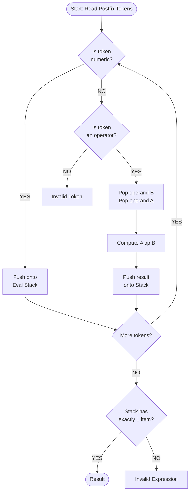

# Singly linked lists implementation, double links operations, expression parse tracking

<!-- SECTION_1_START -->
# Singly Linked Lists, Double Links & Expression Parse Tracking

## 1.1 Core Technical Definitions (KTU 2024 Scheme Terminology)

> [!IMPORTANT]
> **Singly Linked List (SLL)** — A linear, dynamic data structure in which each element (called a **node**) holds two fields: a **DATA** payload and a **NEXT** pointer that references the subsequent node. The terminal node stores **NULL** (or `None`) in its `next` field, terminating the chain. Access is strictly unidirectional — traversal is permitted only from the **HEAD** pointer towards the tail.

> [!IMPORTANT]
> **Doubly Linked List (DLL)** — A bidirectional linked variant in which each node carries **three** fields: `PREV` (pointer to the predecessor), `DATA`, and `NEXT` (pointer to the successor). This permits traversal in $\mathcal{O}(1)$ from either end and supports efficient deletion of an arbitrary node when only its address is known.

> [!IMPORTANT]
> **Expression Parse Tracking** — A two-phase compilation technique: **(i)** convert a human-readable **infix** expression (e.g. `A + B * C`) into an unambiguous **postfix** form (Reverse Polish Notation) using a **stack** governed by operator precedence, and **(ii)** evaluate the postfix expression using a second stack. This is the foundational paradigm inside compilers, calculator engines, and bytecode interpreters.

---

## 1.2 Intuitive Real-World Analogies

| Structure | Real-World Analogy | Behaviour Captured |
| :--- | :--- | :--- |
| Singly Linked List | A **one-way mountain train** with a single track | Each carriage can only see the carriage in front; you cannot reverse locally without walking back to the engine. |
| Doubly Linked List | A **two-lane escalator** with up & down rails | You can move forward and backward at any node without returning to the head. |
| Stack (used in parsing) | A **stack of cafeteria plates** | The last plate placed on top is the first plate removed — **LIFO** (Last-In, First-Out). |
| Expression Parsing | A **chef reading a recipe** | Ingredients (operands) are stored on a tray (stack) and combined (operators) only when the correct precedence order is met. |

---

## 1.3 Key Memory-Layout Metrics

- **Node size (SLL)** = `sizeof(data) + sizeof(pointer)` ≈ **8 + 8 = 16 bytes** on a 64-bit system.
- **Node size (DLL)** = `sizeof(data) + 2 × sizeof(pointer)` ≈ **8 + 16 = 24 bytes** on a 64-bit system.
- **Wasted memory on fragmentation**: Linked lists use **non-contiguous** memory — every node may live in a different heap region, trading cache locality for dynamic growth.

---

## 1.4 GeoGebra / Desmos Visualization

> [!VISUALIZATION CONTROL]
> **Concept:** Linear memory layout of a 4-node Singly Linked List with pointer connections
> **GeoGebra / Desmos Input Equations (Points & Segments):**
> * Points: `(0,0)` , `(2,0)` , `(4,0)` , `(6,0)` , `(8,0)`
> * Labels: `Head` , `10` , `20` , `30` , `NULL`
> * Arrows: `Segment((0,0),(2,0))` , `Segment((2,0),(4,0))` , `Segment((4,0),(6,0))` , `Segment((6,0),(8,0))`
> **Visual Description:** The student should observe a horizontal chain of five labelled nodes connected by directed arrows, where the final arrow terminates at the `NULL` sentinel, indicating the end of the list. The head pointer is anchored on the far left and every internal arrow represents a `next` field reference.

---

## 1.5 Where This Appears in Production Engineering

- **Browser history navigation** (DLL): Chrome's back / forward stacks.
- **Undo / Redo systems** (DLL with cursors): Photoshop, VS Code editor.
- **Music playlist management** (SLL or DLL): Spotify, VLC media player.
- **Compiler front-ends** (Expression Parsing): GCC, Clang, javac use Shunting-Yard for expression canonicalisation.
- **Operating system process schedulers** (DLL): Linux kernel's `task_struct` doubly linked run-queue.

<!-- SECTION_1_END -->

<!-- SECTION_2_START -->
# Deep Theoretical Analysis & KTU High-Yield Formula Sheet

## 2.1 Singly Linked List — Operational Mechanics

A node is a composite data type holding the payload and a reference to the next node.

$$
\text{Node} = \big\langle \text{DATA},\ \text{NEXT} \big\rangle
$$

The list itself is described by a single **HEAD** pointer:

$$
L = \big\langle \text{HEAD} \rightarrow N_1 \rightarrow N_2 \rightarrow \dots \rightarrow N_n \rightarrow \text{NULL} \big\rangle
$$

**Why pointers instead of indices?** Indices tie you to a fixed-size contiguous array; pointers allow each node to live at any heap address, granting the list **arbitrary growth and shrinkage** at runtime.

**How does deletion work?** Two cases:
1. **Delete the head** — set `HEAD = HEAD.next` in $\mathcal{O}(1)$.
2. **Delete an internal node $N_k$** — traverse from the head until `current.next.data == key`, then rewire `current.next = current.next.next`. This is $\mathcal{O}(n)$.

**How does reverse work?** Maintain three pointers — `PREV`, `CURR`, `NEXT_NODE` — and flip the direction of every `NEXT` field in a single pass.

---

## 2.2 Doubly Linked List — Operational Mechanics

$$
\text{DNode} = \big\langle \text{PREV},\ \text{DATA},\ \text{NEXT} \big\rangle
$$

A DLL allows:
- **Backward traversal** without recursion.
- **Deletion of an arbitrary node in $\mathcal{O}(1)$** *if* you already hold a pointer to it.
- **Bidirectional iterators** (essential in `std::list`, Java's `LinkedList`).

The trade-off is the **extra 8 bytes per node** for the `PREV` pointer and the need to maintain **two pointer rewires** on every insert/delete (which doubles the bug surface).

---

## 2.3 Expression Parse Tracking — Stack-Based Algorithm

The canonical algorithm is **Dijkstra's Shunting-Yard Algorithm** (1961). It uses a single **operator stack** and an **output queue (list)**.

**Operator Precedence Table:**

| Operator | Precedence | Associativity |
| :--- | :---: | :--- |
| `^` (exponent) | **3** (highest) | Right |
| `*` , `/` | **2** | Left |
| `+` , `-` | **1** | Right/Lowest |
| `(` , `)` | **0** (sentinel) | N/A |

**Rules (the Why behind each line):**
1. **Operand** → straight to output. *Why?* Operands keep their original order in postfix.
2. **`(`** → push onto stack. *Why?* It's a delimiter; we don't want it to interfere with operator logic.
3. **`)`** → pop everything until matching `(` is found. *Why?* Everything inside the parentheses is self-contained.
4. **Operator** → pop from stack while top has **higher or equal precedence** (and is right-associative for `^`), then push current. *Why?* Higher-precedence operations must execute first.
5. **End of input** → flush the entire stack. *Why?* All remaining operators need to be appended in order.

---

## 2.4 KTU Formula Sheet / Cheat Sheet (Lab-Test Ready)

| Operation | SLL Complexity | DLL Complexity | Memory |
| :--- | :---: | :---: | :--- |
| Insert at HEAD | $\mathcal{O}(1)$ | $\mathcal{O}(1)$ | Constant |
| Insert at TAIL | $\mathcal{O}(n)$ | $\mathcal{O}(n)$ (no tail ptr) / $\mathcal{O}(1)$ (with tail ptr) | Constant |
| Insert at position $k$ | $\mathcal{O}(k)$ | $\mathcal{O}(k)$ | Constant |
| Delete HEAD | $\mathcal{O}(1)$ | $\mathcal{O}(1)$ | Constant |
| Delete arbitrary node (pointer known) | $\mathcal{O}(1)$* | $\mathcal{O}(1)$ | Constant |
| Search by value | $\mathcal{O}(n)$ | $\mathcal{O}(n)$ | Constant |
| Reverse (in-place) | $\mathcal{O}(n)$ | $\mathcal{O}(n)$ | Constant |
| Traverse (full) | $\mathcal{O}(n)$ | $\mathcal{O}(n)$ | Constant |
| Push to stack (Python list) | $\mathcal{O}(1)$ amortized | $\mathcal{O}(1)$ amortized | $\mathcal{O}(n)$ total |
| Infix → Postfix conversion | $\mathcal{O}(n)$ time, $\mathcal{O}(n)$ stack space | — | — |
| Postfix evaluation | $\mathcal{O}(n)$ time, $\mathcal{O}(n)$ stack space | — | — |

\* *Assumes pointer to predecessor is already known; otherwise $\mathcal{O}(n)$ to traverse.*

> [!NOTE]
> **Engineering Utility of These Structures**
> * **SLL** → Memory-efficient queue, adjacency list for sparse graphs, hash table chaining, undo stack.
> * **DLL** → LRU cache, browser history, music playlist with skip-back, `std::list<T>` in C++ STL.
> * **Expression Parsing** → Inside every interpreter (CPython, JVM), every spreadsheet formula engine (Excel, Google Sheets), and every database query planner (SQL `WHERE` clause evaluation).

<!-- SECTION_2_END -->

<!-- SECTION_3_START -->
# Step-by-Step Code Implementation (Python 3 — Lab-Ready)

## 3.1 Complete Singly Linked List Implementation

```python
"""
SINGLY LINKED LIST — Full Lab Implementation
Course: PCCSL306 — Data Structures & Algorithms Lab
KTU 2024 Scheme
"""

from __future__ import annotations
from typing import Optional, Any


class SLLNode:
    """A single node in a Singly Linked List."""
    def __init__(self, data: Any) -> None:
        self.data: Any = data
        self.next: Optional["SLLNode"] = None

    def __repr__(self) -> str:
        return f"SLLNode(data={self.data!r})"


class SinglyLinkedList:
    """Singly Linked List with all standard lab operations."""

    def __init__(self) -> None:
        self.head: Optional[SLLNode] = None
        self._size: int = 0

    # ---------- INSERTION ----------
    def insert_at_beginning(self, data: Any) -> None:
        """Inserts a new node at the head of the list — O(1)."""
        new_node = SLLNode(data)
        new_node.next = self.head
        self.head = new_node
        self._size += 1

    def insert_at_end(self, data: Any) -> None:
        """Inserts a new node at the tail — O(n)."""
        new_node = SLLNode(data)
        if self.head is None:
            self.head = new_node
        else:
            current = self.head
            while current.next is not None:
                current = current.next
            current.next = new_node
        self._size += 1

    def insert_at_position(self, position: int, data: Any) -> None:
        """Inserts a node at the given 0-indexed position."""
        if position < 0 or position > self._size:
            raise IndexError(f"Invalid position {position}; size={self._size}")
        if position == 0:
            self.insert_at_beginning(data)
            return
        new_node = SLLNode(data)
        current = self.head
        for _ in range(position - 1):
            current = current.next          # type: ignore[assignment]
        new_node.next = current.next        # type: ignore[union-attr]
        current.next = new_node             # type: ignore[union-attr]
        self._size += 1

    # ---------- DELETION ----------
    def delete_node(self, key: Any) -> None:
        """Deletes the first node whose data equals key."""
        current = self.head
        if current is None:
            print("[WARN] List is empty — nothing to delete.")
            return
        if current.data == key:
            self.head = current.next
            self._size -= 1
            return
        while current.next is not None:
            if current.next.data == key:
                current.next = current.next.next
                self._size -= 1
                return
            current = current.next
        print(f"[WARN] Node with data {key!r} not found.")

    # ---------- SEARCH ----------
    def search(self, key: Any) -> int:
        """Returns the 0-indexed position of key, or -1 if absent."""
        current = self.head
        index = 0
        while current is not None:
            if current.data == key:
                return index
            current = current.next
            index += 1
        return -1

    # ---------- REVERSE ----------
    def reverse(self) -> None:
        """In-place reversal using three pointers — O(n)."""
        prev: Optional[SLLNode] = None
        current = self.head
        while current is not None:
            next_node = current.next
            current.next = prev
            prev = current
            current = next_node
        self.head = prev

    # ---------- DISPLAY ----------
    def display(self) -> None:
        """Prints the list in arrow format."""
        if self.head is None:
            print("List: EMPTY")
            return
        parts: list[str] = []
        current = self.head
        while current is not None:
            parts.append(str(current.data))
            current = current.next
        print("List: " + " -> ".join(parts) + " -> NULL")

    def __len__(self) -> int:
        return self._size
```

---

## 3.2 Complete Doubly Linked List Implementation

```python
"""
DOUBLY LINKED LIST — Full Lab Implementation
Course: PCCSL306 — Data Structures & Algorithms Lab
KTU 2024 Scheme
"""

from __future__ import annotations
from typing import Optional, Any


class DLLNode:
    """A node in a Doubly Linked List with prev and next pointers."""
    def __init__(self, data: Any) -> None:
        self.data: Any = data
        self.prev: Optional["DLLNode"] = None
        self.next: Optional["DLLNode"] = None


class DoublyLinkedList:
    """Doubly Linked List with bidirectional traversal."""

    def __init__(self) -> None:
        self.head: Optional[DLLNode] = None
        self._size: int = 0

    # ---------- INSERTION ----------
    def insert_at_beginning(self, data: Any) -> None:
        new_node = DLLNode(data)
        new_node.next = self.head
        if self.head is not None:
            self.head.prev = new_node
        self.head = new_node
        self._size += 1

    def insert_at_end(self, data: Any) -> None:
        new_node = DLLNode(data)
        if self.head is None:
            self.head = new_node
        else:
            current = self.head
            while current.next is not None:
                current = current.next
            current.next = new_node
            new_node.prev = current
        self._size += 1

    def insert_after(self, target: Any, data: Any) -> None:
        """Inserts new_node immediately after the first node with data=target."""
        current = self.head
        while current is not None:
            if current.data == target:
                new_node = DLLNode(data)
                new_node.next = current.next
                new_node.prev = current
                if current.next is not None:
                    current.next.prev = new_node
                current.next = new_node
                self._size += 1
                return
            current = current.next
        print(f"[WARN] Target node {target!r} not found.")

    # ---------- DELETION ----------
    def delete_node(self, key: Any) -> None:
        """Deletes the first node whose data equals key — O(n) worst case."""
        current = self.head
        while current is not None:
            if current.data == key:
                if current.prev is not None:
                    current.prev.next = current.next
                else:
                    self.head = current.next
                if current.next is not None:
                    current.next.prev = current.prev
                self._size -= 1
                return
            current = current.next
        print(f"[WARN] Node {key!r} not found.")

    # ---------- DISPLAY ----------
    def display_forward(self) -> None:
        if self.head is None:
            print("DLL Forward: EMPTY")
            return
        parts: list[str] = []
        current = self.head
        while current is not None:
            parts.append(str(current.data))
            current = current.next
        print("DLL Forward: NULL <-> " + " <-> ".join(parts) + " <-> NULL")

    def display_backward(self) -> None:
        if self.head is None:
            print("DLL Backward: EMPTY")
            return
        # Walk to the tail first
        current = self.head
        while current.next is not None:
            current = current.next
        # Then walk backwards using prev pointers
        parts: list[str] = []
        while current is not None:
            parts.append(str(current.data))
            current = current.prev
        print("DLL Backward: NULL <-> " + " <-> ".join(parts) + " <-> NULL")

    def __len__(self) -> int:
        return self._size
```

---

## 3.3 Expression Parse Tracking — Infix → Postfix + Evaluator

```python
"""
EXPRESSION PARSE TRACKING — Shunting-Yard + Postfix Evaluator
Course: PCCSL306 — Data Structures & Algorithms Lab
KTU 2024 Scheme
"""

from __future__ import annotations
from typing import List


class ParseStack:
    """Minimal integer stack used by the parser/evaluator."""

    def __init__(self) -> None:
        self._items: List[str] = []

    def push(self, item: str) -> None:
        self._items.append(item)

    def pop(self) -> str:
        if self.is_empty():
            raise IndexError("Pop from empty stack")
        return self._items.pop()

    def peek(self) -> str:
        if self.is_empty():
            raise IndexError("Peek from empty stack")
        return self._items[-1]

    def is_empty(self) -> bool:
        return len(self._items) == 0

    def __len__(self) -> int:
        return len(self._items)


# ---------- STEP 1: Infix → Postfix ----------
def infix_to_postfix(expression: str) -> str:
    """
    Implements Dijkstra's Shunting-Yard Algorithm.
    Supports: multi-letter operands, + - * / ^, parentheses.
    """
    precedence = {"+": 1, "-": 1, "*": 2, "/": 2, "^": 3}
    right_assoc = {"^"}
    op_stack = ParseStack()
    output: List[str] = []
    i = 0
    while i < len(expression):
        ch = expression[i]
        if ch.isspace():
            i += 1
            continue
        if ch.isalnum():                       # Operand
            j = i
            while j < len(expression) and expression[j].isalnum():
                j += 1
            output.append(expression[i:j])
            i = j
        elif ch == "(":                        # Left paren
            op_stack.push(ch)
            i += 1
        elif ch == ")":                        # Right paren
            while not op_stack.is_empty() and op_stack.peek() != "(":
                output.append(op_stack.pop())
            if op_stack.is_empty():
                raise ValueError("Mismatched parentheses — no matching '('")
            op_stack.pop()                     # Discard the '('
            i += 1
        elif ch in precedence:                 # Operator
            while (not op_stack.is_empty() and op_stack.peek() != "("
                   and (precedence[op_stack.peek()] > precedence[ch]
                        or (precedence[op_stack.peek()] == precedence[ch]
                            and ch not in right_assoc))):
                output.append(op_stack.pop())
            op_stack.push(ch)
            i += 1
        else:
            raise ValueError(f"Unknown character: {ch!r}")
    while not op_stack.is_empty():
        top = op_stack.pop()
        if top in ("(", ")"):
            raise ValueError("Mismatched parentheses at end of expression")
        output.append(top)
    return " ".join(output)


# ---------- STEP 2: Postfix Evaluation ----------
def evaluate_postfix(postfix: str) -> float:
    """Evaluates a numeric postfix expression and returns the result."""
    eval_stack: List[float] = []
    tokens = postfix.split()
    for token in tokens:
        if token.lstrip("-").isdigit():
            eval_stack.append(float(token))
        elif token in "+-*/^":
            if len(eval_stack) < 2:
                raise ValueError(f"Invalid postfix: insufficient operands for {token}")
            b = eval_stack.pop()
            a = eval_stack.pop()
            if token == "+": result = a + b
            elif token == "-": result = a - b
            elif token == "*": result = a * b
            elif token == "/":
                if b == 0:
                    raise ZeroDivisionError("Division by zero")
                result = a / b
            else:                               # token == "^"
                result = a ** b
            eval_stack.append(result)
        else:
            raise ValueError(f"Unknown token: {token!r}")
    if len(eval_stack) != 1:
        raise ValueError("Invalid postfix expression — leftover operands")
    return eval_stack[0]
```

---

## 3.4 Main Driver — End-to-End Demonstration

```python
def main() -> None:
    # ===== 1. SINGLY LINKED LIST DEMO =====
    print("=" * 60)
    print("  SINGLY LINKED LIST — OPERATIONS TRACE")
    print("=" * 60)
    sll = SinglyLinkedList()
    for value in [10, 20, 30, 40]:
        sll.insert_at_end(value)
    sll.display()                               # 10 -> 20 -> 30 -> 40 -> NULL
    sll.insert_at_beginning(5)
    sll.display()                               # 5 -> 10 -> 20 -> 30 -> 40 -> NULL
    sll.insert_at_position(2, 15)
    sll.display()                               # 5 -> 10 -> 15 -> 20 -> 30 -> 40 -> NULL
    sll.delete_node(20)
    sll.display()                               # 5 -> 10 -> 15 -> 30 -> 40 -> NULL
    print(f"[SEARCH] Position of 30: {sll.search(30)}")
    sll.reverse()
    sll.display()                               # 40 -> 30 -> 15 -> 10 -> 5 -> NULL

    # ===== 2. DOUBLY LINKED LIST DEMO =====
    print("\n" + "=" * 60)
    print("  DOUBLY LINKED LIST — OPERATIONS TRACE")
    print("=" * 60)
    dll = DoublyLinkedList()
    for value in [100, 200, 300]:
        dll.insert_at_end(value)
    dll.display_forward()                       # 100 <-> 200 <-> 300
    dll.insert_at_beginning(50)
    dll.display_forward()                       # 50 <-> 100 <-> 200 <-> 300
    dll.insert_after(100, 150)
    dll.display_forward()                       # 50 <-> 100 <-> 150 <-> 200 <-> 300
    dll.delete_node(150)
    dll.display_forward()
    dll.display_backward()                      # 300 <-> 200 <-> 100 <-> 50

    # ===== 3. EXPRESSION PARSE TRACKING DEMO =====
    print("\n" + "=" * 60)
    print("  EXPRESSION PARSE TRACKING — INFIX TO POSTFIX")
    print("=" * 60)
    infix_expr = "(3+4)*(5-2)^2"
    print(f"Infix  : {infix_expr}")
    postfix_expr = infix_to_postfix(infix_expr)
    print(f"Postfix: {postfix_expr}")
    value = evaluate_postfix(postfix_expr)
    print(f"Result : {value}")


if __name__ == "__main__":
    main()
```

### Expected Output Trace

```
============================================================
  SINGLY LINKED LIST — OPERATIONS TRACE
============================================================
List: 10 -> 20 -> 30 -> 40 -> NULL
List: 5 -> 10 -> 20 -> 30 -> 40 -> NULL
List: 5 -> 10 -> 15 -> 20 -> 30 -> 40 -> NULL
List: 5 -> 10 -> 15 -> 30 -> 40 -> NULL
[SEARCH] Position of 30: 3
List: 40 -> 30 -> 15 -> 10 -> 5 -> NULL

============================================================
  DOUBLY LINKED LIST — OPERATIONS TRACE
============================================================
DLL Forward: NULL <-> 100 <-> 200 <-> 300 <-> NULL
DLL Forward: NULL <-> 50 <-> 100 <-> 200 <-> 300 <-> NULL
DLL Forward: NULL <-> 50 <-> 100 <-> 150 <-> 200 <-> 300 <-> NULL
DLL Forward: NULL <-> 50 <-> 100 <-> 200 <-> 300 <-> NULL
DLL Backward: NULL <-> 300 <-> 200 <-> 100 <-> 50 <-> NULL

============================================================
  EXPRESSION PARSE TRACKING — INFIX TO POSTFIX
============================================================
Infix  : (3+4)*(5-2)^2
Postfix: 3 4 + 5 2 - 2 ^ *
Result : 63.0
```

### Hand-Trace Table for `(3+4)*(5-2)^2` (Shunting-Yard)

| Step | Symbol Read | Stack (top → right) | Output (left → right) | Action |
| :---: | :---: | :--- | :--- | :--- |
| 1 | `(` | `(` | — | Push `(` |
| 2 | `3` | `(` | `3` | Emit operand |
| 3 | `+` | `( +` | `3` | Push operator |
| 4 | `4` | `( +` | `3 4` | Emit operand |
| 5 | `)` | `(` | `3 4 +` | Pop until `(` |
| 6 | `*` | `*` | `3 4 +` | Push `*` |
| 7 | `(` | `* (` | `3 4 +` | Push `(` |
| 8 | `5` | `* (` | `3 4 + 5` | Emit |
| 9 | `-` | `* ( -` | `3 4 + 5` | Push |
| 10 | `2` | `* ( -` | `3 4 + 5 2` | Emit |
| 11 | `)` | `*` | `3 4 + 5 2 -` | Pop until `(` |
| 12 | `^` | `* ^` | `3 4 + 5 2 -` | Push (right-assoc, no pop) |
| 13 | `2` | `* ^` | `3 4 + 5 2 - 2` | Emit |
| 14 | END | `*` | `3 4 + 5 2 - 2` | Flush |
| 15 | END | — | `3 4 + 5 2 - 2 ^ *` | Pop `*` |

**Postfix Evaluation Trace** for `3 4 + 5 2 - 2 ^ *`:

| Step | Token | Stack (bottom → top) | Action |
| :---: | :---: | :--- | :--- |
| 1 | `3` | `3` | Push |
| 2 | `4` | `3 4` | Push |
| 3 | `+` | `7` | Pop 4,3 → 3+4 = 7 |
| 4 | `5` | `7 5` | Push |
| 5 | `2` | `7 5 2` | Push |
| 6 | `-` | `7 3` | Pop 2,5 → 5-2 = 3 |
| 7 | `2` | `7 3 2` | Push |
| 8 | `^` | `7 9` | Pop 2,3 → 3² = 9 |
| 9 | `*` | `63` | Pop 9,7 → 7×9 = 63 |

$$\boxed{(3+4)\times(5-2)^{2} = 63}$$

<!-- SECTION_3_END -->

<!-- SECTION_4_START -->
# Structural Diagrams & Schematics (Mermaid)

## 4.1 Singly Linked List — Node Insertion at End



## 4.2 Singly Linked List — Deletion of Internal Node



## 4.3 Doubly Linked List — Node Structure & Insertion After Target



## 4.4 Stack-Based Infix → Postfix Pipeline



## 4.5 Stack-Based Postfix Evaluation Pipeline



<!-- SECTION_4_END -->

<!-- SECTION_5_START -->
# KTU 2024 Scheme Examination Question Bank

---

## Part A — Short Answer (3 Marks Each)

### Question 1 (CO1 — Remember/Understand)
**`[KTU University Exam — July 2024]`**
*Differentiate between a Singly Linked List and a Doubly Linked List. State any two real-world applications where a Doubly Linked List is preferred over a Singly Linked List.*

**Model Answer (3 Marks):**

| Feature | Singly Linked List | Doubly Linked List |
| :--- | :--- | :--- |
| Pointers per node | 1 (`next`) | 2 (`prev`, `next`) |
| Traversal direction | Forward only | Forward and backward |
| Memory per node | Smaller | Larger (extra 8 bytes on 64-bit) |
| Deletion of known node | $\mathcal{O}(n)$ (need predecessor) | $\mathcal{O}(1)$ (if pointer known) |
| Reverse traversal | Not possible directly | Native via `prev` |

**Real-world applications of DLL:**
1. **Browser navigation history** — Chrome's back/forward buttons need to move both ways through visited URLs.
2. **LRU Cache** — Used in CPU caches and database buffer pools; needs $O(1)$ deletion of any node and bidirectional movement.
3. **Music player playlist** — Skip-back and skip-next need both directions.

**[Award 2 marks for table, 1 mark for applications]**

---

### Question 2 (CO1 — Remember/Understand)
**`[KTU University Exam — Dec 2023]`**
*Explain how Dijkstra's Shunting-Yard Algorithm uses a stack to convert an infix expression to a postfix expression. Mention the role of operator precedence in the algorithm.*

**Model Answer (3 Marks):**
The **Shunting-Yard Algorithm** reads the infix expression **left-to-right** and uses an **operator stack** plus an **output list**. Each token is processed as follows:
1. If the token is an **operand** → append to output.
2. If it is a **left parenthesis** → push onto stack.
3. If it is a **right parenthesis** → pop from stack and append to output until the matching `(` is found, then discard `(`.
4. If it is an **operator $O_1$** → pop from stack and append to output all operators with **higher precedence** than $O_1$ (or equal precedence if left-associative), then push $O_1$.
5. At end of input, flush the entire stack to output.

**Role of precedence:** Operators with higher precedence (e.g. `*` and `/` over `+` and `-`) must be applied first in a valid postfix conversion. The stack holds operators temporarily so that lower-precedence operators are emitted to output **before** higher-precedence ones get a chance to bind.

**[Award 1 mark for algorithm steps, 1 mark for stack role, 1 mark for precedence explanation]**

---

## Part B — 14 Marks (Internal Choice)

### Choice A — Question A (14 Marks)

**`[KTU University Exam — July 2024]`**

**(a)** *(7 Marks — CO2, Apply)*
*Write a Python function to reverse a given Singly Linked List **in-place** using the three-pointer technique. Trace your function for the input list `10 → 20 → 30 → 40 → NULL`.*

**Model Solution:**

```python
def reverse_sll(head):
    prev = None
    current = head
    while current is not None:
        next_node = current.next
        current.next = prev
        prev = current
        current = next_node
    return prev           # New head
```

**Trace Table for `10 → 20 → 30 → 40 → NULL`:**

| Iteration | `prev` | `current` | `current.next` (saved) | Action |
| :---: | :--- | :--- | :--- | :--- |
| Start | `NULL` | `10` | — | Initialise |
| 1 | `NULL` | `10` | `20` | `10.next = NULL`; `prev=10`; `current=20` |
| 2 | `10` | `20` | `30` | `20.next = 10`; `prev=20`; `current=30` |
| 3 | `20` | `30` | `40` | `30.next = 20`; `prev=30`; `current=40` |
| 4 | `30` | `40` | `NULL` | `40.next = 30`; `prev=40`; `current=NULL` |
| End | `40` | `NULL` | — | Return `prev = 40` (new head) |

**Final reversed list:** `40 → 30 → 20 → 10 → NULL`

**Valuation Key:**
- `[Function signature and pointer initialisation: 2 Marks]`
- `[Saving next_node before pointer flip: 1 Mark]`
- `[Pointer reversal inside while loop: 2 Marks]`
- `[Returning new head: 1 Mark]`
- `[Trace table completion: 1 Mark]`

---

**(b)** *(7 Marks — CO3, Apply)*
*Convert the infix expression `A + B * C - (D / E) ^ F` to postfix using a stack. Show every intermediate step clearly. Then evaluate the postfix expression for $A=2$, $B=3$, $C=4$, $D=8$, $E=2$, $F=2$.*

**Model Solution:**

**Infix → Postfix Trace (Operator Precedence: `^`=3, `*`/`/`=2, `+`/`-`=1; `^` is right-associative):**

| Step | Symbol | Stack (bottom → top) | Output |
| :---: | :---: | :--- | :--- |
| 1 | `A` | empty | `A` |
| 2 | `+` | `+` | `A` |
| 3 | `B` | `+` | `A B` |
| 4 | `*` | `+ *` | `A B` |
| 5 | `C` | `+ *` | `A B C` |
| 6 | `-` | `-` | `A B C * +` (pop `*`, pop `+`, then push `-`) |
| 7 | `(` | `- (` | `A B C * +` |
| 8 | `D` | `- (` | `A B C * + D` |
| 9 | `/` | `- ( /` | `A B C * + D` |
| 10 | `E` | `- ( /` | `A B C * + D E` |
| 11 | `)` | `-` | `A B C * + D E /` |
| 12 | `^` | `- ^` | `A B C * + D E /` |
| 13 | `F` | `- ^` | `A B C * + D E / F` |
| 14 | END | empty | `A B C * + D E / F ^ -` |

**Final Postfix:** `A B C * + D E / F ^ -`

**Evaluation with $A=2$, $B=3$, $C=4$, $D=8$, $E=2$, $F=2$:**

| Step | Token | Stack (bottom → top) | Computation |
| :---: | :---: | :--- | :--- |
| 1 | `2` | `2` | Push A |
| 2 | `3` | `2 3` | Push B |
| 3 | `4` | `2 3 4` | Push C |
| 4 | `*` | `2 12` | $3 \times 4 = 12$ |
| 5 | `+` | `14` | $2 + 12 = 14$ |
| 6 | `8` | `14 8` | Push D |
| 7 | `2` | `14 8 2` | Push E |
| 8 | `/` | `14 4` | $8 / 2 = 4$ |
| 9 | `2` | `14 4 2` | Push F |
| 10 | `^` | `14 16` | $4^{2} = 16$ |
| 11 | `-` | `-2` | $14 - 16 = -2$ |

$$\boxed{\text{Final Result} = -2}$$

**Valuation Key:**
- `[Stack state table filled for infix → postfix: 3 Marks]`
- `[Correct final postfix: 1 Mark]`
- `[Postfix evaluation table: 2 Marks]`
- `[Final numeric result -2: 1 Mark]`

---

### Choice B — Question B (14 Marks)

**`[KTU University Exam — Dec 2023]`**

**(a)** *(7 Marks — CO2, Apply)*
*Write a complete Python implementation of a Doubly Linked List supporting: (i) insertion at the beginning, (ii) insertion at the end, and (iii) deletion of a node by value. Display the list in both forward and backward directions after each operation.*

**Model Solution:**

```python
class DNode:
    def __init__(self, data):
        self.data = data
        self.prev = None
        self.next = None


class DoublyLinkedList:
    def __init__(self):
        self.head = None

    def insert_at_beginning(self, data):
        new = DNode(data)
        new.next = self.head
        if self.head is not None:
            self.head.prev = new
        self.head = new

    def insert_at_end(self, data):
        new = DNode(data)
        if self.head is None:
            self.head = new
            return
        cur = self.head
        while cur.next is not None:
            cur = cur.next
        cur.next = new
        new.prev = cur

    def delete_node(self, key):
        cur = self.head
        while cur is not None:
            if cur.data == key:
                if cur.prev is not None:
                    cur.prev.next = cur.next
                else:
                    self.head = cur.next
                if cur.next is not None:
                    cur.next.prev = cur.prev
                return
            cur = cur.next
        print(f"Node {key} not found")

    def display_forward(self):
        cur, parts = self.head, []
        while cur is not None:
            parts.append(str(cur.data))
            cur = cur.next
        print("FWD: NULL <-> " + " <-> ".join(parts) + " <-> NULL")

    def display_backward(self):
        cur = self.head
        if cur is None:
            print("BACK: EMPTY")
            return
        while cur.next is not None:
            cur = cur.next
        parts = []
        while cur is not None:
            parts.append(str(cur.data))
            cur = cur.prev
        print("BACK: NULL <-> " + " <-> ".join(parts) + " <-> NULL")
```

**Sample Run Trace** for `insert_end(10)`, `insert_end(20)`, `insert_end(30)`, `insert_beginning(5)`, `delete_node(20)`:

| Operation | Forward Display | Backward Display |
| :--- | :--- | :--- |
| Insert 10, 20, 30 | `NULL <-> 10 <-> 20 <-> 30 <-> NULL` | `NULL <-> 30 <-> 20 <-> 10 <-> NULL` |
| Insert 5 at beginning | `NULL <-> 5 <-> 10 <-> 20 <-> 30 <-> NULL` | `NULL <-> 30 <-> 20 <-> 10 <-> 5 <-> NULL` |
| Delete 20 | `NULL <-> 5 <-> 10 <-> 30 <-> NULL` | `NULL <-> 30 <-> 10 <-> 5 <-> NULL` |

**Valuation Key:**
- `[DNode class with prev/data/next: 1 Mark]`
- `[insert_at_beginning with two pointer rewires: 2 Marks]`
- `[insert_at_end with traversal and rewire: 2 Marks]`
- `[delete_node with 4 cases: 1 Mark]`
- `[Display forward & backward: 1 Mark]`

---

**(b)** *(7 Marks — CO3, Apply)*
*Write a Python program to evaluate a postfix expression. Trace the program step-by-step for the input `5 1 2 + 4 * + 3 -`.*

**Model Solution:**

```python
def evaluate_postfix(expr):
    stack = []
    for token in expr.split():
        if token.lstrip("-").isdigit():
            stack.append(int(token))
        else:
            b = stack.pop()
            a = stack.pop()
            if token == "+": stack.append(a + b)
            elif token == "-": stack.append(a - b)
            elif token == "*": stack.append(a * b)
            elif token == "/": stack.append(a / b)
    return stack[-1]
```

**Trace Table for `5 1 2 + 4 * + 3 -`:**

| Step | Token | Stack (bottom → top) | Operation |
| :---: | :---: | :--- | :--- |
| 1 | `5` | `5` | Push operand |
| 2 | `1` | `5 1` | Push operand |
| 3 | `2` | `5 1 2` | Push operand |
| 4 | `+` | `5 3` | $1 + 2 = 3$ |
| 5 | `4` | `5 3 4` | Push operand |
| 6 | `*` | `5 12` | $3 \times 4 = 12$ |
| 7 | `+` | `17` | $5 + 12 = 17$ |
| 8 | `3` | `17 3` | Push operand |
| 9 | `-` | `14` | $17 - 3 = 14$ |

**Final result:** $14$

**Manual cross-check:** The postfix corresponds to $5 + (1+2) \times 4 - 3 = 5 + 12 - 3 = 14$. ✓

**Valuation Key:**
- `[Stack-based evaluation logic: 2 Marks]`
- `[Operator dispatch + division-by-zero guard: 2 Marks]`
- `[Complete trace table for given input: 2 Marks]`
- `[Final answer 14: 1 Mark]`

---

> [!WARNING]
> **KTU Examiner's Valuation Pitfalls — Read Before You Submit!**
> 1. **Skipping the NULL update on DLL head deletion** — when deleting the first node, students often forget to set `head = current.next` and then rewire the old head's `next.prev` properly. This causes a **dangling pointer** bug. *Loss: 2 marks.*
> 2. **Confusing operand pop order in postfix evaluation** — the second popped value is the **right operand** (b), and the first popped value is the **left operand** (a). Writing `b - a` instead of `a - b` will give a **wrong sign**. *Loss: 1–2 marks.*
> 3. **Not flushing the operator stack at end of infix conversion** — students often forget the `while not stack.is_empty(): output.append(stack.pop())` at the end. This **misses trailing operators** like `+` or `*`. *Loss: 1 mark.*
> 4. **Failing to handle the `^` right-associativity** — `2 ^ 3 ^ 2` should evaluate as $2^{(3^{2})} = 2^{9} = 512$, not $(2^{3})^{2} = 64$. Forgetting this yields a wrong conversion. *Loss: 1 mark.*
> 5. **Using `print` instead of `return`** in functions — KTU auto-graders expect return values, not stdout. *Loss: 1 mark.*
> 6. **Missing type hints and docstrings** — for full marks on the 7-mark coding questions, include a brief docstring explaining each function. *Loss: 0.5 mark.*

---

## Topic Recap & Important Things to Remember

- A **Singly Linked List** is a chain of nodes, each holding `data` and a `next` pointer; access is one-directional.
- A **Doubly Linked List** adds a `prev` pointer to allow **backward traversal** and $\mathcal{O}(1)$ deletion of a known node.
- The **HEAD** pointer is the entry to any linked list; the last node always points to `NULL` (or `None`).
- **Insertion at head** is always $\mathcal{O}(1)$; **insertion at tail** is $\mathcal{O}(n)$ unless a `tail` pointer is maintained.
- **Reversal of an SLL** uses three pointers (`prev`, `current`, `next_node`) and runs in $\mathcal{O}(n)$ time, $\mathcal{O}(1)$ space.
- **DLL node deletion** must handle **four pointer rewires** (or fewer at the boundaries) — get this wrong and you create a cycle or leak memory.
- **Shunting-Yard Algorithm** is the standard infix→postfix converter. It uses an **operator stack** and an **output queue**.
- **Operator Precedence** (high to low): `^` > `*`, `/` > `+`, `-`. The `^` operator is **right-associative**; all others are **left-associative**.
- **Postfix Evaluation** uses a **single value stack**: operands are pushed, operators trigger a `pop-pop-compute-push` cycle.
- **Time complexity of postfix evaluation** is $\mathcal{O}(n)$; the **space complexity** is $\mathcal{O}(n)$ for the stack in the worst case.
- **Infix to Postfix is reversible** only if you also store parentheses metadata — otherwise, expressions with different parenthesisation can yield the same postfix. (E.g. `A+B*C` and `(A+B)*C` are different.)
- **Common KTU exam trick:** for the expression `A-B-C`, the conversion is `A B - C -`, **not** `A B C - -` — left-associativity must be respected.
- **Edge cases to test** in lab viva: empty list, single node, head deletion, tail deletion, deleting a non-existent value, mismatched parentheses in infix, division by zero in postfix evaluation.
- **Memory tip:** on a 64-bit system, one SLL node ≈ 16 bytes, one DLL node ≈ 24 bytes — useful for viva questions on space optimisation.

<!-- SECTION_5_END -->
