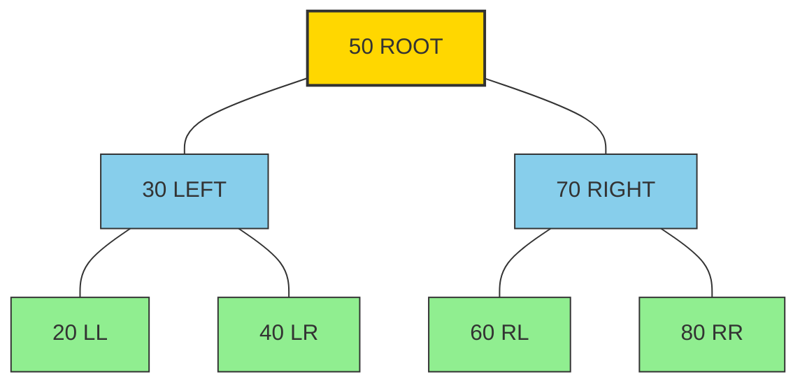
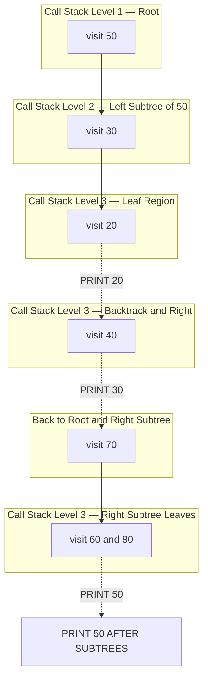

# Binary Search Tree traversals (Inorder, Preorder, Postorder)

<!-- SECTION_1_START -->
# Binary Search Tree Traversals — Inorder, Preorder, Postorder

## 1.1 Formal Academic Definition (KTU 2024 Syllabus Terminology)

A **Binary Search Tree (BST)** is a node-based, non-linear hierarchical data structure in which each node contains a key (and optionally associated satellite data) such that for every node $N$ in the tree, the following **BST Invariant** holds:

- All keys in the left subtree of $N$ are **strictly less than** the key of $N$.
- All keys in the right subtree of $N$ are **strictly greater than** the key of $N$.
- Both the left and right subtrees must themselves be valid Binary Search Trees.

> [!IMPORTANT]
> **Core Definition (Board Key Sentence):** A Binary Search Tree is a recursive data structure that maintains the ordering property — *Left subtree $<$ Node $<$ Right subtree* — at every node, enabling search, insertion, and deletion in $O(h)$ time, where $h$ is the height of the tree.

A **Tree Traversal** is the systematic process of visiting every node in a tree exactly once, in a specific order. The three classical depth-first traversals of a BST are:

| Traversal | Visit Order | Recursive Rule |
|---|---|---|
| Inorder   | $L \rightarrow N \rightarrow R$ | Left, Node, Right |
| Preorder  | $N \rightarrow L \rightarrow R$ | Node, Left, Right |
| Postorder | $L \rightarrow R \rightarrow N$ | Left, Right, Node |

> [!NOTE]
> The KTU 2024 Scheme PCCSL306 syllabus explicitly tests the construction of a BST from a given sequence of integers **and** the ability to display all three traversals as a lab output. You are expected to *write the code from scratch* during the lab examination, not use library functions.

## 1.2 Intuition: The Library Catalog Analogy

Imagine a **university library catalog** that organises books by their accession number. To find a specific book quickly:

- The librarian splits books into two stacks — those with **smaller** numbers (left) and those with **larger** numbers (right).
- At each stack, the same splitting rule is applied recursively until a stack has one book.
- Searching is like binary search: you cut your search space in half each time.

A BST works **exactly** the same way on data.

**Traversals as Library Tasks:**

| Real-world Task | BST Equivalent |
|---|---|
| Printing accession numbers in **sorted order** | **Inorder traversal** (yields ascending sequence) |
| Writing a **backup copy** of the catalog structure | **Preorder traversal** (preserves root-first hierarchy) |
| **Deleting** the catalog by removing leaf slips first | **Postorder traversal** (children freed before parent) |

## 1.3 Geometric Visualisation

> [!VISUALIZATION CONTROL]
> **Concept:** Structural layout of a sample BST with seven nodes.
> **Visual Description:** Observe that the smallest element ($20$) is the leftmost leaf, the largest ($80$) is the rightmost leaf, and the root ($50$) sits at the apex. Inorder traversal reads leaves from left to right; Preorder reads from root outward; Postorder reads from leaves inward.

```
                  ┌──── 50 ────┐
                 30            70
                /  \          /  \
              20    40      60    80
```

## 1.4 Standard Metrics and Constants

- **Null Pointer Convention** — Leaf nodes' left and right pointers are `None` / `null`.
- **Strict vs Non-Strict Ordering** — KTU papers always use **strict** inequality ($<$ on left, $>$ on right). Duplicate keys are conventionally inserted into the right subtree.
- **Time per Operation** — Search, Insert, Delete, Find-Min, Find-Max are all $\mathbf{O(h)}$, where $h$ is the height of the tree.
- **Balanced Height** — $h = \lfloor \log_2 n \rfloor$ (best case).
- **Skewed Height** — $h = n - 1$ (worst case, degenerate tree).

<!-- SECTION_1_END -->

<!-- SECTION_2_START -->
# Deep Theoretical Analysis & KTU High-Yield Formula Sheet

## 2.1 The Recursive "Why" Behind Each Traversal

All three traversals are **depth-first** and **recursive**. They differ only in *when the root node is processed* relative to its two subtrees.

### 2.1.1 Inorder Traversal ($L \rightarrow N \rightarrow R$)

**Why is it special for BSTs?**
Because of the BST ordering invariant, an inorder traversal visits the nodes in **non-decreasing (sorted) order of keys**. This property is a *theorem* that is tested repeatedly in KTU exams.

**Recursive Call Trace** (for node $N$):
1. Recurse into $N.left$.
2. Process (visit / print) $N.key$.
3. Recurse into $N.right$.

### 2.1.2 Preorder Traversal ($N \rightarrow L \rightarrow R$)

**Why is it used?**
- Used to **create a copy** of the tree (root is known first, so the structure can be reconstructed uniquely).
- Used to **serialise** a tree to disk or to **prefix-evaluate** expression trees.
- Visits the parent before its children.

**Recursive Call Trace** (for node $N$):
1. Process (visit / print) $N.key$.
2. Recurse into $N.left$.
3. Recurse into $N.right$.

### 2.1.3 Postorder Traversal ($L \rightarrow R \rightarrow N$)

**Why is it used?**
- Used to **delete / deallocate** the tree safely (children freed before the parent — prevents memory leaks).
- Used to **compute the size** of subtrees, the **sum of all keys**, or the **height** in a single pass.
- Visits the children before the parent.

**Recursive Call Trace** (for node $N$):
1. Recurse into $N.left$.
2. Recurse into $N.right$.
3. Process (visit / print) $N.key$.

## 2.2 KTU High-Yield Formula & Cheat Sheet

| # | Property | Formula / Value | Unit | Notes |
|---|---|---|---|---|
| 1 | Time complexity of each traversal | $T(n) = 2T(n/2) + O(1) = O(n)$ | operations | Visits every node exactly once |
| 2 | Auxiliary space (recursive) | $O(h)$ | call-stack frames | $h$ = tree height |
| 3 | Auxiliary space (iterative) | $O(h)$ | explicit stack | $h$ = tree height |
| 4 | Worst-case height (skewed) | $h = n - 1$ | nodes | Degenerate tree (sorted insertion) |
| 5 | Best-case height (balanced) | $h = \lfloor \log_2 n \rfloor$ | nodes | Perfect / complete BST |
| 6 | Number of edges in a tree of $n$ nodes | $E = n - 1$ | edges | Fundamental tree identity |
| 7 | Number of NULL pointers | $N_{null} = n + 1$ | pointers | For any binary tree |
| 8 | Inorder of BST result | Strictly increasing sequence | — | Sorted output is the *defining property* |
| 9 | Preorder of BST reconstruction | Unique if no duplicates | — | Root identified first |
| 10 | Postorder of BST | Last element is the root | — | Useful for root identification |

> [!IMPORTANT]
> **Critical Substitution Convention:** When writing traversal recurrences on the KTU answer sheet, explicitly show the substitution step. For example, for inorder on a perfectly balanced BST of $n$ nodes:
>
> $$T(n) \;=\; 2 \cdot T\!\left(\frac{n}{2}\right) + c$$
> $$\Rightarrow T(n) \;=\; O(n)$$
>
> Students frequently **lose 2 marks** here by writing the recurrence but skipping the substitution.

## 2.3 Real-World Engineering Utility

| Domain | Application | Why BST Traversal? |
|---|---|---|
| Database Indexing | B-tree / B+ tree variants | Sorted retrieval via inorder |
| Compilers | Abstract Syntax Tree (AST) evaluation | Postorder for expression evaluation |
| Operating Systems | File system directory tree | Preorder for directory listing |
| Network Routing | Trie / Radix trees | Preorder for prefix-based queries |
| Memory Management | Heap deallocation | Postorder ensures no dangling pointers |
| 3D Graphics | BSP trees for hidden-surface removal | Inorder for back-to-front rendering |

<!-- SECTION_2_END -->

<!-- SECTION_3_START -->
# Step-by-Step Derivations & Python Implementation

## 3.1 Exhaustive Hand-Trace: Building and Traversing a BST

### 3.1.1 Input Sequence

Insert the following integers **in this order** into an initially empty BST:

$$50,\; 30,\; 70,\; 20,\; 40,\; 60,\; 80$$

### 3.1.2 Insertion Trace (Step-by-Step)

| Step | Insert Key | Comparison Path | Final Position |
|---|---|---|---|
| 1 | $50$ | Tree empty | Becomes **root** |
| 2 | $30$ | $30 < 50 \Rightarrow$ go left of $50$ | Left child of $50$ |
| 3 | $70$ | $70 > 50 \Rightarrow$ go right of $50$ | Right child of $50$ |
| 4 | $20$ | $20<50 \Rightarrow L$, $20<30 \Rightarrow L$ | Left child of $30$ |
| 5 | $40$ | $40<50 \Rightarrow L$, $40>30 \Rightarrow R$ | Right child of $30$ |
| 6 | $60$ | $60>50 \Rightarrow R$, $60<70 \Rightarrow L$ | Left child of $70$ |
| 7 | $80$ | $80>50 \Rightarrow R$, $80>70 \Rightarrow R$ | Right child of $70$ |

### 3.1.3 Final Tree Structure

$$
\begin{aligned}
\text{root} &= 50 \\
50.\text{left} &= 30 \quad\quad 50.\text{right} = 70 \\
30.\text{left} &= 20 \quad\quad 30.\text{right} = 40 \\
70.\text{left} &= 60 \quad\quad 70.\text{right} = 80
\end{aligned}
$$

### 3.1.4 Traversal Outputs (Hand-Trace)

**Inorder** $(L \rightarrow N \rightarrow R)$:
$$
\begin{aligned}
&\text{Inorder}(20) = (20) \\
&\text{Inorder}(40) = (40) \\
&\text{Inorder}(30) = (\text{Inorder}(20),\, 30,\, \text{Inorder}(40)) = (20, 30, 40) \\
&\text{Inorder}(60) = (60) \\
&\text{Inorder}(80) = (80) \\
&\text{Inorder}(70) = (60, 70, 80) \\
&\text{Inorder}(50) = (20, 30, 40,\, 50,\, 60, 70, 80)
\end{aligned}
$$

**Preorder** $(N \rightarrow L \rightarrow R)$:
$$
\text{Preorder}(50) = (50,\; 30,\, 20,\, 40,\; 70,\, 60,\, 80)
$$

**Postorder** $(L \rightarrow R \rightarrow N)$:
$$
\text{Postorder}(50) = (20,\; 40,\; 30,\; 60,\; 80,\; 70,\; 50)
$$

## 3.2 Full Python Source Code (Lab-Ready)

```python
"""
PCCSL306 - Data Structures & Algorithms Lab
Module 2: Binary Search Tree Traversals (Inorder, Preorder, Postorder)
KTU 2024 Scheme Compliant Implementation
"""

from __future__ import annotations
from dataclasses import dataclass, field
from typing import Optional, List


@dataclass
class TreeNode:
    """A single node of the Binary Search Tree."""
    key: int
    left: Optional["TreeNode"] = None
    right: Optional["TreeNode"] = None


@dataclass
class BST:
    """Binary Search Tree with iterative + recursive traversal support."""
    root: Optional[TreeNode] = None
    _size: int = field(default=0, init=False)

    # ---------- Core Operations ----------
    def insert(self, key: int) -> None:
        """Insert a new key into the BST. Duplicates go to the right subtree."""
        new_node: TreeNode = TreeNode(key=key)

        if self.root is None:
            self.root = new_node
            self._size += 1
            return

        current: Optional[TreeNode] = self.root
        parent: Optional[TreeNode] = None

        while current is not None:
            parent = current
            if key < current.key:
                current = current.left
            else:  # duplicates also fall here (right subtree)
                current = current.right

        if parent is not None:
            if key < parent.key:
                parent.left = new_node
            else:
                parent.right = new_node
        self._size += 1

    def search(self, key: int) -> bool:
        """Return True if key is present in the BST, else False."""
        current: Optional[TreeNode] = self.root
        while current is not None:
            if key == current.key:
                return True
            elif key < current.key:
                current = current.left
            else:
                current = current.right
        return False

    # ---------- Recursive Traversals ----------
    def inorder_recursive(self) -> List[int]:
        """Return inorder traversal (L, N, R) — sorted for BSTs."""
        result: List[int] = []
        self._inorder(self.root, result)
        return result

    def _inorder(self, node: Optional[TreeNode], result: List[int]) -> None:
        if node is None:
            return
        self._inorder(node.left, result)
        result.append(node.key)
        self._inorder(node.right, result)

    def preorder_recursive(self) -> List[int]:
        """Return preorder traversal (N, L, R)."""
        result: List[int] = []
        self._preorder(self.root, result)
        return result

    def _preorder(self, node: Optional[TreeNode], result: List[int]) -> None:
        if node is None:
            return
        result.append(node.key)
        self._preorder(node.left, result)
        self._preorder(node.right, result)

    def postorder_recursive(self) -> List[int]:
        """Return postorder traversal (L, R, N)."""
        result: List[int] = []
        self._postorder(self.root, result)
        return result

    def _postorder(self, node: Optional[TreeNode], result: List[int]) -> None:
        if node is None:
            return
        self._postorder(node.left, result)
        self._postorder(node.right, result)
        result.append(node.key)

    # ---------- Iterative Traversals (Bonus) ----------
    def inorder_iterative(self) -> List[int]:
        result: List[int] = []
        stack: List[TreeNode] = []
        current: Optional[TreeNode] = self.root

        while current is not None or stack:
            while current is not None:
                stack.append(current)
                current = current.left
            current = stack.pop()
            result.append(current.key)
            current = current.right
        return result


# ---------- Lab Demonstration ----------
def main() -> None:
    try:
        # 1. Read input from user (lab-style)
        raw: str = input("Enter integers separated by spaces: ").strip()
        if not raw:
            raise ValueError("Input cannot be empty.")
        keys: List[int] = list(map(int, raw.split()))

        # 2. Build BST
        bst: BST = BST()
        for k in keys:
            bst.insert(k)

        # 3. Display traversals
        print("\n--- BST Traversal Outputs ---")
        print(f"Inorder   (L,N,R): {bst.inorder_recursive()}")
        print(f"Preorder  (N,L,R): {bst.preorder_recursive()}")
        print(f"Postorder (L,R,N): {bst.postorder_recursive()}")
        print(f"Iterative Inorder : {bst.inorder_iterative()}")

        # 4. Search demo
        target: int = int(input("Enter key to search: "))
        found: bool = bst.search(target)
        print(f"Key {target} {'FOUND' if found else 'NOT FOUND'} in BST.")

    except ValueError as ve:
        print(f"[Input Error] {ve}")
    except Exception as exc:
        print(f"[Unexpected Error] {type(exc).__name__}: {exc}")


if __name__ == "__main__":
    main()
```

### 3.2.1 Expected Output (Sample Run)

```
Enter integers separated by spaces: 50 30 70 20 40 60 80

--- BST Traversal Outputs ---
Inorder   (L,N,R): [20, 30, 40, 50, 60, 70, 80]
Preorder  (N,L,R): [50, 30, 20, 40, 70, 60, 80]
Postorder (L,R,N): [20, 40, 30, 60, 80, 70, 50]
Iterative Inorder : [20, 30, 40, 50, 60, 70, 80]
Enter key to search: 40
Key 40 FOUND in BST.
```

<!-- SECTION_3_END -->

<!-- SECTION_4_START -->
# Structural Diagrams & Schematics

## 4.1 BST Topological Map (Sample Tree)

> [!NOTE]
> The diagram below maps the recursive descent paths of the three traversals on the BST built from the sequence $\{50, 30, 70, 20, 40, 60, 80\}$.



## 4.2 Traversal Recursion Flow Matrix (Sequential Processing Topology)

The block below models the recursive *call-return* sequence for **inorder** traversal. Each level represents one stack-frame activation.



## 4.3 Traversal Order Visual Summary

| Traversal | Print Order in Above Tree | Resulting Sequence |
|---|---|---|
| **Inorder**   | Leftmost leaf $\rightarrow$ root $\rightarrow$ rightmost leaf | $20, 30, 40, 50, 60, 70, 80$ |
| **Preorder**  | Root $\rightarrow$ left subtree $\rightarrow$ right subtree     | $50, 30, 20, 40, 70, 60, 80$ |
| **Postorder** | Left subtree $\rightarrow$ right subtree $\rightarrow$ root     | $20, 40, 30, 60, 80, 70, 50$ |

<!-- SECTION_4_END -->

<!-- SECTION_5_START -->
# KTU 2024 Scheme Examination Question Bank & Topic Recap

---

## 📘 PART A — Short Answer Questions (3 Marks Each)

### Question 1: `[KTU University Exam - July 2024]` — **CO2, Remember**

**Define a Binary Search Tree (BST). State the BST ordering property and mention one real-world application.**

**Model Answer (3 Marks):**

A Binary Search Tree is a hierarchical non-linear data structure where each node has at most two children, namely the left child and the right child. It satisfies the **ordering invariant**: for every node $N$, all keys in the left subtree are strictly less than $N.key$ and all keys in the right subtree are strictly greater than $N.key$, and this property holds recursively for every subtree.

**Application:** BSTs are used in **database indexing** (e.g., B+ tree variants) and in implementing **search-heavy** applications like phone directories where inorder traversal yields a sorted list of entries.

> **Valuation Key:** [BST definition with ordering property: 2 Marks] [Application: 1 Mark]

---

### Question 2: `[KTU University Exam - Dec 2023]` — **CO2, Understand**

**List the three depth-first traversals of a binary tree. Which traversal produces a sorted sequence when applied to a BST, and why?**

**Model Answer (3 Marks):**

The three depth-first traversals of a binary tree are:

1. **Inorder** — Left, Node, Right
2. **Preorder** — Node, Left, Right
3. **Postorder** — Left, Right, Node

**Inorder traversal** produces a sorted (ascending) sequence when applied to a BST. This is because the BST invariant guarantees that all nodes in the left subtree of any node $N$ contain keys smaller than $N.key$, and all nodes in the right subtree contain keys larger than $N.key$. Recursively applying the Left-Node-Right order therefore enumerates the keys in strictly non-decreasing order.

> **Valuation Key:** [Listing the three traversals: 1 Mark] [Identifying inorder: 1 Mark] [Justification with BST invariant: 1 Mark]

---

## 📕 PART B — Long Answer Questions (14 Marks Each, Internal Choice)

### Question A: `[KTU University Exam - July 2024]` — **CO2, Apply**

**(a) Construct a Binary Search Tree by inserting the following keys in the given order: 45, 25, 65, 15, 35, 55, 75, 10, 20. Show the BST structure clearly. [7 Marks]**

**(b) Write a recursive C/Python function to perform inorder traversal of the BST and display the output for the constructed tree. State and justify the time and space complexity. [7 Marks]**

---

### ✅ Model Solution for Question A

#### Part (a) — BST Construction [7 Marks]

**Step-by-step insertions:**

| Step | Key | Comparison Path | Position Assigned |
|---|---|---|---|
| 1 | $45$ | Tree empty | **Root** |
| 2 | $25$ | $25 < 45$ | Left of $45$ |
| 3 | $65$ | $65 > 45$ | Right of $45$ |
| 4 | $15$ | $<45$, then $<25$ | Left of $25$ |
| 5 | $35$ | $<45$, then $>25$ | Right of $25$ |
| 6 | $55$ | $>45$, then $<65$ | Left of $65$ |
| 7 | $75$ | $>45$, then $>65$ | Right of $65$ |
| 8 | $10$ | $<45, <25, <15$ | Left of $15$ |
| 9 | $20$ | $<45, <25, >15$ | Right of $15$ |

**Final BST:**

$$
\begin{aligned}
\text{root} &= 45 \\
45.\text{left} &= 25 \quad\quad 45.\text{right} = 65 \\
25.\text{left} &= 15 \quad\quad 25.\text{right} = 35 \\
65.\text{left} &= 55 \quad\quad 65.\text{right} = 75 \\
15.\text{left} &= 10 \quad\quad 15.\text{right} = 20
\end{aligned}
$$

> **Valuation Key:** [Drawing the BST with 9 nodes: 5 Marks] [Insertion path tracing: 2 Marks]

#### Part (b) — Inorder Traversal Code & Complexity [7 Marks]

```python
def inorder(node):
    if node is None:
        return
    inorder(node.left)
    print(node.key, end=" ")
    inorder(node.right)
```

**Output for the constructed BST:**

$$10,\ 15,\ 20,\ 25,\ 35,\ 45,\ 55,\ 65,\ 75$$

**Complexity Analysis:**

- **Time Complexity:** $T(n) = 2T(n/2) + O(1)$ (for balanced tree) $\Rightarrow T(n) = O(n)$ because every node is visited exactly once.
- **Space Complexity (auxiliary):** $O(h)$ for the recursion call stack, where $h$ is the tree height. For the balanced tree shown, $h = \lfloor \log_2 9 \rfloor + 1 = 4$, so auxiliary space is $O(\log n)$.

> **Valuation Key:** [Correct recursive function: 3 Marks] [Correct output sequence: 2 Marks] [Time + space complexity with justification: 2 Marks]

---

### Question B: `[KTU University Exam - Dec 2023]` — **CO2, Apply**

**(a) Differentiate between preorder, inorder, and postorder traversals of a binary tree with a suitable example. State one application of each. [7 Marks]**

**(b) Write recursive functions for preorder and postorder traversals of a BST. Apply both to the BST built from keys \{50, 30, 70, 20, 40, 60, 80\} and list the outputs. [7 Marks]**

---

### ✅ Model Solution for Question B

#### Part (a) — Comparative Table [7 Marks]

| Aspect | Preorder $(N \rightarrow L \rightarrow R)$ | Inorder $(L \rightarrow N \rightarrow R)$ | Postorder $(L \rightarrow R \rightarrow N)$ |
|---|---|---|---|
| **Order** | Root first, then children | Left, root, right | Children first, then root |
| **Example on a small tree $\{1, 2, 3\}$ with root $2$** | $2, 1, 3$ | $1, 2, 3$ | $1, 3, 2$ |
| **Application 1** | Tree **serialisation** / copying | **Sorting** (sorted output on BST) | **Deallocation** / deletion |
| **Application 2** | Prefix notation in expression trees | Recovering keys in sorted order | Postfix notation in expression trees |
| **Suitability for BST** | Root identification | Sorting | Safe memory cleanup |

> **Valuation Key:** [Tabular comparison of 3 traversals: 4 Marks] [Application of each: 3 Marks]

#### Part (b) — Preorder and Postorder Implementation [7 Marks]

```python
def preorder(node):
    if node is None:
        return
    print(node.key, end=" ")
    preorder(node.left)
    preorder(node.right)

def postorder(node):
    if node is None:
        return
    postorder(node.left)
    postorder(node.right)
    print(node.key, end=" ")
```

**Applied to the BST built from $\{50, 30, 70, 20, 40, 60, 80\}$:**

- **Preorder Output:** $50,\ 30,\ 20,\ 40,\ 70,\ 60,\ 80$
- **Postorder Output:** $20,\ 40,\ 30,\ 60,\ 80,\ 70,\ 50$

> **Valuation Key:** [Preorder function: 1.5 Marks] [Postorder function: 1.5 Marks] [Preorder output: 2 Marks] [Postorder output: 2 Marks]

---

## ⚠️ KTU Examiner's Valuation Warning / Pitfall Callout

> [!WARNING]
> **Common Mistakes That Cost Marks:**
>
> 1. **Skipping the base case** `if node is None: return` — leads to infinite recursion on empty subtrees. **[-2 Marks]**
> 2. **Confusing traversal order** — Writing `Node, Left, Right` when the question demands `Left, Right, Node`. The mnemonic "**N**ame, **L**ine-up, **R**un" works for preorder. **[-3 Marks]**
> 3. **Omitting complexity analysis** — KTU lab exams require the *time* and *space* complexity to be stated explicitly. Just writing the code is **not sufficient** for full marks. **[-2 Marks]**
> 4. **Drawing the BST incorrectly after multiple insertions** — Always re-verify the BST invariant at every node before moving to the next insertion. A single wrong placement cascades. **[-1 to -3 Marks]**
> 5. **Failing to handle duplicate keys** — KTU expects the convention to be stated (typically duplicates go to the right subtree). **[-1 Mark]**
> 6. **Forgetting the `#include <stdio.h>` or proper indentation** in C — leads to compilation error in the lab. Always test the code before submission.

---

## 🔁 Topic Recap & Important Things to Remember

- ✅ A **Binary Search Tree (BST)** maintains the invariant: *Left subtree keys $<$ Node key $<$ Right subtree keys* for **every** node.
- ✅ The three depth-first traversals are **Inorder** ($L,N,R$), **Preorder** ($N,L,R$), and **Postorder** ($L,R,N$).
- ✅ **Inorder traversal of a BST yields a sorted (ascending) sequence** — this is the single most important property tested.
- ✅ **Preorder** is used for tree **copying / serialisation** (root first).
- ✅ **Postorder** is used for **safe deletion / deallocation** (children before parent).
- ✅ Time complexity for any traversal is $\mathbf{O(n)}$ — every node is visited exactly once.
- ✅ Auxiliary space (recursion stack) is $\mathbf{O(h)}$, where $h$ is the tree height.
- ✅ For a perfectly balanced BST, $h = \lfloor \log_2 n \rfloor$; for a degenerate (skewed) BST, $h = n - 1$.
- ✅ A binary tree with $n$ nodes has exactly $n - 1$ edges and $n + 1$ NULL pointers.
- ✅ Duplicates are conventionally inserted into the **right subtree** (state the convention explicitly in your answer).
- ✅ When constructing a BST from a sequence, **always re-trace the path from the root** for every new key using the BST ordering property.
- ✅ Recursive functions **must have a base case** (`if node is None: return`) — the most common source of runtime errors.
- ✅ KTU lab record should include: (i) **Aim**, (ii) **Algorithm**, (iii) **Code**, (iv) **Sample Input/Output**, (v) **Result / Complexity Analysis**.
- ✅ Bonus: Iterative inorder traversal uses an explicit stack and a `current` pointer — useful when stack depth limits are a concern.

<!-- SECTION_5_END -->
