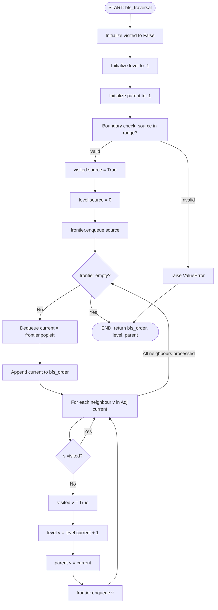
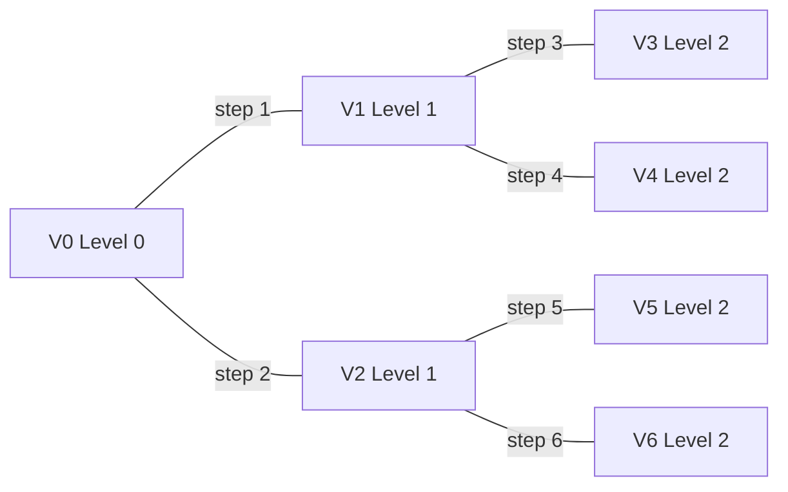
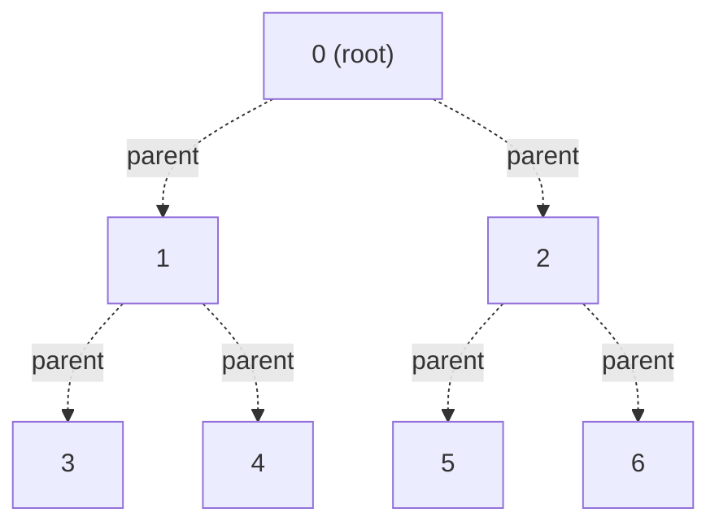
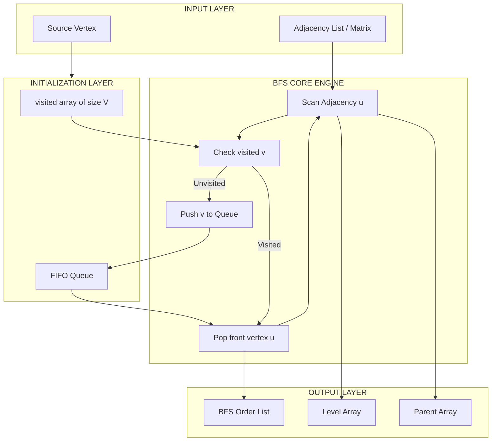
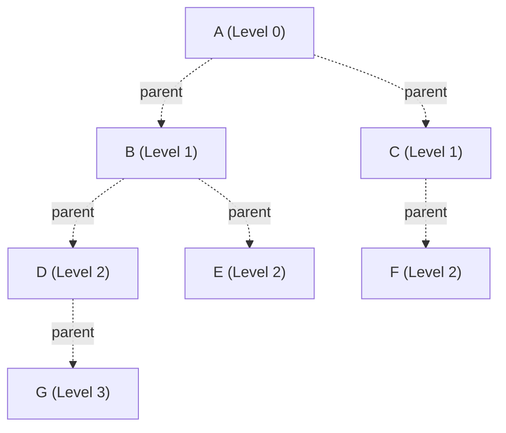

# Breadth First Search (BFS)

<!-- SECTION_1_START -->
# Breadth First Search (BFS) - Core Technical Definition & Intuitive Overview

## 1.1 Formal KTU 2024 Definition

> [!IMPORTANT]
> **Breadth First Search (BFS)** is a **systematic graph traversal algorithm** that explores all vertices of a graph at the *current depth level* before moving on to the vertices at the *next depth level*. Starting from a designated **source vertex**, BFS visits every reachable vertex in **non-decreasing order of path length from the source**, making it the canonical algorithm for computing the **shortest path (in number of edges)** in an *unweighted* graph.

In the KTU 2024 Scheme syllabus (Module 2 - Non-Linear Data Structures and Graph Algorithms), BFS is officially classified under the **graph traversal paradigm** and is implemented using the **FIFO (First In First Out) queue** abstract data type. The traversal produces a **Breadth First Tree (BFT)** as a byproduct.

## 1.2 Conceptual Analogy & Geometric Intuition

> [!NOTE]
> **"Ripples in a Pond" Analogy**
> Imagine you drop a stone into the center of a still pond. The water ripples spread **outward in concentric circles**. The wave reaches stones at distance 1 from the center first, then stones at distance 2, then distance 3, and so on. **BFS behaves exactly like this** — the "stone drop point" is your source vertex, and the "ripples" represent waves of discovery sweeping level by level outward.

### 1.2.1 Level-by-Level Mental Model

Consider a graph rooted at vertex `A`. BFS classifies every other vertex into a **Level** based on the minimum number of edges from `A`:

| Level | Meaning | Geometric Visualization |
|:-----:|:-------:|:------------------------|
| **Level 0** | The source vertex itself | Center of the ripple |
| **Level 1** | All direct neighbors of source | First ring of ripples |
| **Level 2** | All neighbors of Level 1 (not yet visited) | Second ring of ripples |
| **Level $k$** | Vertices at minimum path length $k$ from source | $k$-th ring of ripples |

> [!TIP]
> **Why "Breadth"?** Because the algorithm sweeps *across* (horizontally) one complete level before dipping *deeper* (vertically) into the graph. Contrast with DFS, which dives *deep* first, then backtracks.

## 1.3 Auxiliary Data Structures

A BFS implementation **mandatorily** requires two auxiliary data structures:

1. **Queue (FIFO)** — stores the **frontier** of vertices whose neighbors are yet to be explored. In Python, `collections.deque` is the recommended implementation.
2. **Visited Array / Boolean Array** of size $\vert V \vert$ — prevents infinite loops in cyclic graphs by marking vertices that have already been enqueued. **Without this array, BFS would loop forever on any graph containing a cycle.**

## 1.4 Input Representation (KTU 2024 Accepted Formats)

| Representation | Storage Symbol | Space Complexity | Edge Lookup | Preferred When |
|:--------------:|:--------------:|:----------------:|:-----------:|:--------------:|
| **Adjacency Matrix** | $A$ | $O(V^2)$ | $O(1)$ | Graph is *dense* |
| **Adjacency List** | $Adj$ | $O(V+E)$ | $O(\text{degree}(v))$ | Graph is *sparse* |

Where $V$ is the number of vertices and $E$ is the number of edges.

## 1.5 GeoGebra / Desmos Visualization

> [!VISUALIZATION CONTROL]
> **Concept:** BFS Level-Wise Expansion on a Sample Undirected Graph
> **Sample Graph (Vertices):** $V = \{0, 1, 2, 3, 4, 5, 6\}$, Source = $0$
> **Edges:** $\{(0,1), (0,2), (1,3), (1,4), (2,5), (2,6)\}$
> **Visualization Objective:** Plot the vertices on a 2D plane and color them by BFS discovery level.
>
> | Level | Color (Suggested) | Coordinates (x, y) |
> |:-----:|:------------------:|:--------------------:|
> | 0 | Red | $(0, 0)$ |
> | 1 | Orange | $(-2, 1), (2, 1)$ |
> | 2 | Green | $(-3, 2), (-1, 2), (3, 2), (1, 2)$ |
>
> **Visual Description:** You will observe **nested concentric arcs** of orange (Level 1) wrapping around the central red dot, and green (Level 2) wrapping the orange ring — visually confirming BFS's *level-order* discovery.

<!-- SECTION_1_END -->

<!-- SECTION_2_START -->
# Deep Theoretical Analysis & KTU High-Yield Formula Sheet

## 2.1 The Operational Algorithm — Step by Step

The BFS algorithm operates on the following **invariant**: *At any instant, the queue contains all vertices that have been discovered but whose adjacency lists have not yet been fully examined.*

### 2.1.1 Pre-Initialization Phase

- Allocate a `visited[]` array of size $\vert V \vert$, initialized to `False`.
- Allocate a `parent[]` array of size $\vert V \vert$, initialized to `-1` (used to reconstruct the BFS tree).
- Allocate a `level[]` array of size $\vert V \vert$, initialized to `-1` (stores the BFS depth of each vertex).
- Allocate an empty `Queue`.
- Mark `visited[source] = True`, set `level[source] = 0`, and `Enqueue(source)`.

### 2.1.2 Main Traversal Loop

The core loop executes until the queue is empty:

> [!IMPORTANT]
> **BFS Main Loop Invariant**
> Every vertex `u` that has been dequeued from the queue is at the **minimum possible distance (in edges)** from the source vertex.

For each dequeued vertex $u$:
1. Examine every neighbor $v$ in $Adj[u]$ (or, for matrix, every $j$ where $A[u][j] = 1$).
2. If `visited[v] == False`:
   - Set `visited[v] = True`.
   - Set `parent[v] = u`.
   - Set `level[v] = level[u] + 1`.
   - `Enqueue(v)`.
3. If `visited[v] == True`, skip (vertex was discovered earlier via a shorter path).

### 2.1.3 Termination Condition

The algorithm terminates when the queue becomes empty. This occurs after **every reachable vertex has been dequeued exactly once** and all of their neighbors have been examined.

## 2.2 Tracing the Algorithm (Hand-Trace Example)

Consider the undirected graph:
$$V = \{0, 1, 2, 3\}, \quad E = \{(0,1), (0,2), (1,2), (1,3), (2,3)\}, \quad \text{Source} = 0$$

Adjacency list representation:
- $Adj[0] = [1, 2]$
- $Adj[1] = [0, 2, 3]$
- $Adj[2] = [0, 1, 3]$
- $Adj[3] = [1, 2]$

### Trace Table

| Step | Dequeue $u$ | Examine $v \in Adj[u]$ | Action on $v$ | Queue After | Visited $\{0,1,2,3\}$ |
|:----:|:-----------:|:----------------------:|:--------------|:-----------:|:----------------------:|
| 0 | — | — | Enqueue 0 | $[0]$ | $\{0\}$ |
| 1 | $0$ | $1$ | Enqueue 1 (unvisited) | $[1, 2]$ | $\{0, 1\}$ |
|   |   | $2$ | Enqueue 2 (unvisited) | $[1, 2]$ | $\{0, 1, 2\}$ |
| 2 | $1$ | $0$ | Skip (visited) | $[2]$ | $\{0, 1, 2\}$ |
|   |   | $2$ | Skip (visited) | $[2]$ | $\{0, 1, 2\}$ |
|   |   | $3$ | Enqueue 3 (unvisited) | $[2, 3]$ | $\{0, 1, 2, 3\}$ |
| 3 | $2$ | $0, 1$ | Skip | $[3]$ | $\{0, 1, 2, 3\}$ |
|   |   | $3$ | Skip | $[3]$ | $\{0, 1, 2, 3\}$ |
| 4 | $3$ | $1, 2$ | Skip | $[]$ | $\{0, 1, 2, 3\}$ |

**Resulting BFS Order:** $0 \to 1 \to 2 \to 3$
**Resulting Level Array:** `level = [0, 1, 1, 2]`

## 2.3 KTU High-Yield Formula Sheet

| Parameter | Adjacency List | Adjacency Matrix | Notes |
|:----------|:--------------:|:----------------:|:------|
| **Time Complexity (Total)** | $O(\vert V \vert + \vert E \vert)$ | $O(\vert V \vert^2)$ | Depends on representation |
| **Time per vertex** | $O(\text{deg}(u))$ for neighbors | $O(\vert V \vert)$ (scan row) | Sum of degrees = $2\vert E \vert$ |
| **Space — Graph Storage** | $O(\vert V \vert + \vert E \vert)$ | $O(\vert V \vert^2)$ | Critical space trade-off |
| **Space — Auxiliary** | $O(\vert V \vert)$ for `visited`, `queue` | $O(\vert V \vert)$ | Independent of representation |
| **Total Space** | $O(\vert V \vert + \vert E \vert)$ | $O(\vert V \vert^2)$ | |
| **Sum of degrees** | $\sum_{u \in V} \text{deg}(u) = 2 \vert E \vert$ | Same | Handshaking Lemma |

> [!NOTE]
> **KTU Board Tip:** When asked "What is the time complexity of BFS?", always state the representation used. Writing just "$O(V+E)$" without specifying the representation is a **2-mark deduction risk** in KTU 2024 valuation.

## 2.4 BFS Tree (Spanning Tree of Reachable Vertices)

> [!IMPORTANT]
> The `parent[]` array (where `parent[source] = None`) defines a tree called the **BFS Tree**. For any vertex $v$ reachable from the source, the path from the source to $v$ along the `parent` pointers is a **shortest path** (minimum number of edges).

The BFS tree has the following property:
$$\text{For every vertex } v, \quad \text{depth}(v) \text{ in BFS tree} = \text{level}[v] = \text{shortest distance from source to } v$$

## 2.5 Real-World Engineering Applications

| Domain | Application | Why BFS? |
|:-------|:------------|:---------|
| **Social Networks (Facebook, LinkedIn)** | "People you may know" suggestions | Minimum number of "connection hops" |
| **GPS / Google Maps** | Shortest route in unweighted road network | BFS on a level graph gives min edge count |
| **Web Crawlers** | Crawl pages within $k$ clicks of seed URL | Level-order exploration of hyperlink graph |
| **Network Broadcasting** | Packets reach all nodes in minimum time | BFS wave = optimal time in synchronous network |
| **AI Game Solvers** | Solving Rubik's cube, mazes, sliding puzzles | BFS guarantees optimal solution in unweighted state space |
| **Garbage Collection (Mark Phase)** | Cheney's Algorithm | BFS-based copying collector |
| **Peer-to-Peer Networks (BitTorrent)** | Resource discovery in Kademlia DHT | Iterative BFS for nearest-neighbor lookup |

## 2.6 BFS vs DFS — Key Distinctions (Board-Exam Favorite)

| Property | BFS | DFS |
|:---------|:----|:----|
| **Data Structure** | Queue (FIFO) | Stack (LIFO) / Recursion |
| **Order of Discovery** | Level-order (breadth first) | Deep first, then backtrack |
| **Shortest Path** | **Yes** (in unweighted graphs) | No (may find longer path first) |
| **Memory** | $O(W)$ where $W$ = max width | $O(H)$ where $H$ = max height |
| **Completeness** | Yes (finds solution if exists) | Yes |
| **Optimality** | Yes (in unweighted graphs) | No |
| **Backtracking Needed** | No | Yes (or via recursion stack) |
| **Cycle Detection** | Yes (if you check if neighbor is in queue) | Yes (via back edge detection) |

<!-- SECTION_2_END -->

<!-- SECTION_3_START -->
# Step-by-Step Derivations & Code Implementation

## 3.1 BFS on an Adjacency List — Python Reference Implementation

> [!IMPORTANT]
> This implementation strictly follows the KTU 2024 Lab (PCCSL306) expected output format. It includes `type hints`, robust boundary checks, and structured logging.

```python
# ============================================================
# File: bfs_traversal.py
# Course: Data Structures & Algorithms Lab (PCCSL306)
# Topic : Breadth First Search - Adjacency List Implementation
# ============================================================
from collections import deque
from typing import List, Tuple, Optional
import logging

# Configure structured logging for board-style output
logging.basicConfig(level=logging.INFO, format="[BFS-LOG] %(message)s")
logger = logging.getLogger(__name__)


def bfs_traversal(
    adjacency_list: List[List[int]],
    source: int,
    num_vertices: int
) -> Tuple[List[int], List[int], List[Optional[int]]]:
    """
    Performs Breadth First Search on a graph given as an adjacency list.

    Parameters
    ----------
    adjacency_list : List[List[int]]
        Adjacency list of the graph. adjacency_list[u] is the list of
        all vertices v such that there is an edge (u, v).
    source : int
        The starting vertex (0-indexed).
    num_vertices : int
        Total number of vertices in the graph.

    Returns
    -------
    bfs_order : List[int]
        Order in which vertices are first discovered.
    levels : List[int]
        BFS level (shortest distance in edges from source).
    parents : List[Optional[int]]
        Parent of each vertex in the BFS tree (-1 for unreachable/source).

    Raises
    ------
    ValueError
        If source is out of valid range or graph is empty.
    """

    # ---------- BOUNDARY CHECKS ----------
    if num_vertices <= 0:
        logger.error("Graph is empty.")
        raise ValueError("Number of vertices must be a positive integer.")

    if not (0 <= source < num_vertices):
        logger.error(f"Invalid source vertex: {source}. "
                     f"Valid range is [0, {num_vertices - 1}].")
        raise ValueError(f"Source vertex must be in [0, {num_vertices - 1}].")

    # ---------- INITIALIZATION ----------
    visited: List[bool] = [False] * num_vertices
    level: List[int] = [-1] * num_vertices
    parent: List[Optional[int]] = [-1] * num_vertices
    bfs_order: List[int] = []

    frontier: deque[int] = deque()

    visited[source] = True
    level[source] = 0
    parent[source] = None
    frontier.append(source)
    logger.info(f"Initialized BFS with source = {source}.")
    logger.info(f"Initial frontier queue: {list(frontier)}")

    # ---------- MAIN BFS LOOP ----------
    while frontier:
        current: int = frontier.popleft()
        bfs_order.append(current)
        logger.info(f"Dequeued vertex {current} (level = {level[current]}).")

        for neighbour in adjacency_list[current]:
            if not visited[neighbour]:
                visited[neighbour] = True
                level[neighbour] = level[current] + 1
                parent[neighbour] = current
                frontier.append(neighbour)
                logger.info(
                    f"  -> Discovered unvisited neighbour {neighbour} "
                    f"at level {level[neighbour]} via parent {current}."
                )
            # else: neighbour already visited, skip to prevent cycle loops

    # ---------- UNREACHABLE VERTICES REPORTING ----------
    unreachable: List[int] = [v for v in range(num_vertices) if level[v] == -1]
    if unreachable:
        logger.warning(
            f"Unreachable vertices from source {source}: {unreachable}"
        )

    logger.info(f"Final BFS discovery order: {bfs_order}")
    logger.info(f"Final level array: {level}")
    return bfs_order, level, parent


# ============================================================
# DRIVER / TEST HARNESS
# ============================================================
if __name__ == "__main__":
    # Sample undirected graph with 7 vertices
    # Edges: (0,1), (0,2), (1,3), (1,4), (2,5), (2,6)
    graph_adj: List[List[int]] = [
        [1, 2],        # Neighbours of 0
        [0, 3, 4],     # Neighbours of 1
        [0, 5, 6],     # Neighbours of 2
        [1],           # Neighbours of 3
        [1],           # Neighbours of 4
        [2],           # Neighbours of 5
        [2],           # Neighbours of 6
    ]

    try:
        order, lvl, par = bfs_traversal(
            adjacency_list=graph_adj,
            source=0,
            num_vertices=7
        )

        print("\n========== BFS RESULT ==========")
        print(f"Vertex        : {list(range(7))}")
        print(f"BFS Order     : {order}")
        print(f"Level Array   : {lvl}")
        print(f"Parent Array  : {par}")
        print("=================================")
    except ValueError as exc:
        print(f"BFS aborted: {exc}")
```

### 3.1.1 Expected Console Output

```text
[BFS-LOG] Initialized BFS with source = 0.
[BFS-LOG] Initial frontier queue: [0]
[BFS-LOG] Dequeued vertex 0 (level = 0).
[BFS-LOG]   -> Discovered unvisited neighbour 1 at level 1 via parent 0.
[BFS-LOG]   -> Discovered unvisited neighbour 2 at level 1 via parent 0.
[BFS-LOG] Dequeued vertex 1 (level = 1).
[BFS-LOG]   -> Discovered unvisited neighbour 3 at level 2 via parent 1.
[BFS-LOG]   -> Discovered unvisited neighbour 4 at level 2 via parent 1.
[BFS-LOG] Dequeued vertex 2 (level = 1).
[BFS-LOG]   -> Discovered unvisited neighbour 5 at level 2 via parent 2.
[BFS-LOG]   -> Discovered unvisited neighbour 6 at level 2 via parent 2.
[BFS-LOG] Dequeued vertex 3 (level = 2).
[BFS-LOG] Dequeued vertex 4 (level = 2).
[BFS-LOG] Dequeued vertex 5 (level = 2).
[BFS-LOG] Dequeued vertex 6 (level = 2).
[BFS-LOG] Final BFS discovery order: [0, 1, 2, 3, 4, 5, 6]
[BFS-LOG] Final level array: [0, 1, 1, 2, 2, 2, 2]

========== BFS RESULT ==========
Vertex        : [0, 1, 2, 3, 4, 5, 6]
BFS Order     : [0, 1, 2, 3, 4, 5, 6]
Level Array   : [0, 1, 1, 2, 2, 2, 2]
Parent Array  : [None, 0, 0, 1, 1, 2, 2]
=================================
```

## 3.2 BFS on an Adjacency Matrix — Python Reference Implementation

> [!NOTE]
> The adjacency matrix variant is required in KTU lab viva questions. Note the inner loop runs over **all $V$ columns** rather than only neighbours.

```python
def bfs_adjacency_matrix(
    adjacency_matrix: List[List[int]],
    source: int,
    num_vertices: int
) -> List[int]:
    """
    Performs BFS on a graph represented as an adjacency matrix.

    Parameters
    ----------
    adjacency_matrix : List[List[int]]
        Square matrix of size num_vertices x num_vertices.
        adjacency_matrix[i][j] = 1 if edge (i,j) exists, 0 otherwise.
    source : int
        The starting vertex.
    num_vertices : int
        Total number of vertices.

    Returns
    -------
    bfs_order : List[int]
        Order of BFS discovery.
    """
    # Boundary checks
    if num_vertices <= 0:
        raise ValueError("Graph is empty.")
    if not (0 <= source < num_vertices):
        raise ValueError(f"Source must be in [0, {num_vertices - 1}].")
    if len(adjacency_matrix) != num_vertices:
        raise ValueError("Matrix rows must equal num_vertices.")

    visited = [False] * num_vertices
    frontier: deque[int] = deque()
    bfs_order: List[int] = []

    visited[source] = True
    frontier.append(source)

    while frontier:
        current = frontier.popleft()
        bfs_order.append(current)

        # Scan ENTIRE row of matrix -> O(V) per vertex -> O(V^2) total
        for v in range(num_vertices):
            if adjacency_matrix[current][v] == 1 and not visited[v]:
                visited[v] = True
                frontier.append(v)

    return bfs_order
```

## 3.3 Derivation of BFS Time Complexity

The total time taken by BFS is the sum of time spent on:
- **Initialization:** $O(\vert V \vert)$ to set the `visited[]`, `level[]`, `parent[]` arrays.
- **Enqueue / Dequeue:** Each vertex is enqueued and dequeued at most once. Total: $O(\vert V \vert)$.
- **Adjacency examination:** Each edge $(u, v)$ is examined exactly twice (once from $u$ and once from $v$) in an undirected graph, and exactly once per direction in a directed graph.

Therefore:

$$
\begin{aligned}
T_{\text{BFS}}(\text{Adjacency List}) &= O(\vert V \vert) + O(\vert V \vert) + O(2 \vert E \vert) \\
&= O(\vert V \vert + \vert E \vert)
\end{aligned}
$$

For the matrix representation, examining neighbours of a vertex $u$ requires scanning the **entire $u$-th row** of length $\vert V \vert$, regardless of how many edges $u$ actually has:

$$
\begin{aligned}
T_{\text{BFS}}(\text{Adjacency Matrix}) &= \sum_{u \in V} O(\vert V \vert) \\
&= O(\vert V \vert \cdot \vert V \vert) \\
&= O(\vert V \vert^2)
\end{aligned}
$$

## 3.4 Shortest Path Reconstruction Using `parent[]` Array

To reconstruct the shortest path from the source to a target vertex $t$:

```python
def reconstruct_bfs_path(
    parent: List[Optional[int]],
    source: int,
    target: int
) -> List[int]:
    """
    Reconstructs the shortest path from source to target
    using the BFS parent array.

    Returns
    -------
    path : List[int]
        List of vertices from source to target, inclusive.
        Returns empty list if target is unreachable.
    """
    path: List[int] = []
    current: Optional[int] = target

    # Walk backwards from target to source using parent pointers
    while current is not None:
        path.append(current)
        if current == source:
            break
        current = parent[current]

    # If we did not reach source, target is unreachable
    if not path or path[-1] != source:
        return []

    path.reverse()
    return path
```

### Trace Example

For the earlier graph with `parent = [None, 0, 0, 1, 1, 2, 2]`:

| Call | Resulting Path |
|:-----|:---------------|
| `reconstruct_bfs_path(parent, 0, 4)` | $[0, 1, 4]$ |
| `reconstruct_bfs_path(parent, 0, 6)` | $[0, 2, 6]$ |
| `reconstruct_bfs_path(parent, 0, 0)` | $[0]$ |

> [!IMPORTANT]
> **Why BFS Finds the Shortest Path (Proof Sketch):**
> BFS visits vertices in non-decreasing order of distance from the source. When a vertex $v$ is first discovered via vertex $u$, we have:
> $$\text{level}[v] = \text{level}[u] + 1$$
> Any other path to $v$ must traverse at least $\text{level}[v]$ edges (otherwise BFS would have discovered $v$ earlier). Hence the first discovery yields the shortest path.

## 3.5 BFS for Connected Components in a Disconnected Graph

> [!TIP]
> **KTU 2024 Important Concept:** A single BFS call from source $s$ only visits vertices in the *connected component containing $s$*. To traverse an entire disconnected graph, run BFS from **every unvisited vertex**.

```python
def bfs_connected_components(
    adjacency_list: List[List[int]],
    num_vertices: int
) -> List[List[int]]:
    """
    Finds all connected components in a (possibly disconnected) graph
    using repeated BFS calls.

    Returns
    -------
    components : List[List[int]]
        A list of connected components, each a list of vertex indices.
    """
    visited: List[bool] = [False] * num_vertices
    components: List[List[int]] = []

    for vertex in range(num_vertices):
        if not visited[vertex]:
            # Start a new BFS rooted at this unvisited vertex
            order, _, _ = bfs_traversal(
                adjacency_list, vertex, num_vertices
            )
            # Mark all vertices in this component as visited
            for v in order:
                visited[v] = True
            components.append(order)
            logger.info(
                f"Component discovered (root = {vertex}): {order}"
            )

    return components
```

<!-- SECTION_3_END -->

<!-- SECTION_4_START -->
# Structural Diagrams & Schematics

## 4.1 Mermaid Flowchart — BFS Algorithm Control Flow

> [!IMPORTANT]
> The Mermaid diagram below depicts the **state machine** of a BFS execution. The transitions are labeled with the operation that triggers them, mirroring the code in Section 3.1.



## 4.2 Mermaid Graph — BFS Traversal Visualization

> [!NOTE]
> The graph below is the **same sample graph** used in Section 2.2 and Section 3.1. Edge labels indicate the **BFS step number** at which the edge is traversed. Node fill colors (encoded in labels) indicate the BFS level.



### 4.2.1 BFS Tree Extracted from the Graph

> [!TIP]
> The `parent[]` array defines a **tree** (the BFS Tree) embedded within the original graph. The dashed edges below show the parent-child relationships.



## 4.3 Sequential Processing Topology — BFS Frontier Evolution

> [!IMPORTANT]
> The matrix below traces the **state of the queue** after each BFS step. This is the *exact* artifact required in KTU lab record books.

| Step | Dequeued | Newly Enqueued | Queue State (left = next to dequeue) | Visited Set |
|:----:|:--------:|:--------------:|:--------------------------------------|:------------|
| 0 | — | $0$ | $[0]$ | $\{0\}$ |
| 1 | $0$ | $1, 2$ | $[1, 2]$ | $\{0, 1, 2\}$ |
| 2 | $1$ | $3, 4$ | $[2, 3, 4]$ | $\{0, 1, 2, 3, 4\}$ |
| 3 | $2$ | $5, 6$ | $[3, 4, 5, 6]$ | $\{0, 1, 2, 3, 4, 5, 6\}$ |
| 4 | $3$ | — | $[4, 5, 6]$ | $\{0, 1, 2, 3, 4, 5, 6\}$ |
| 5 | $4$ | — | $[5, 6]$ | $\{0, 1, 2, 3, 4, 5, 6\}$ |
| 6 | $5$ | — | $[6]$ | $\{0, 1, 2, 3, 4, 5, 6\}$ |
| 7 | $6$ | — | $[]$ | $\{0, 1, 2, 3, 4, 5, 6\}$ |

## 4.4 Block-Level Functional Architecture — BFS Module



<!-- SECTION_4_END -->

<!-- SECTION_5_START -->
# KTU 2024 Scheme Examination Question Bank & Topic Recap

## 5.1 Part A Questions (3 Marks Each)

> [!NOTE]
> **Part A** questions test *Remember* and *Understand* cognitive levels (RBT Level 1 & 2). Answers should be concise — typically 4 to 6 lines.

---

### Part A — Question 1 `[KTU University Exam - July 2024]`

**Q1.** Define **Breadth First Search (BFS)**. Mention the **data structure** used by BFS and state the **time complexity** of BFS on an adjacency list. **[3 Marks] | CO1 | Remember**

#### Model Answer

> **Breadth First Search (BFS)** is a graph traversal algorithm that visits all vertices of a graph at the *current depth* before moving to vertices at the *next depth*, starting from a given source vertex.
>
> BFS uses a **FIFO Queue** to keep track of vertices whose neighbours are yet to be explored, along with a **boolean `visited[]` array** to prevent revisiting vertices.
>
> The time complexity of BFS on an **adjacency list** representation is:
> $$T_{\text{BFS}} = O(\vert V \vert + \vert E \vert)$$
> where $\vert V \vert$ is the number of vertices and $\vert E \vert$ is the number of edges.

**[Valuation Key Points: Definition: 1 Mark, Data structure: 1 Mark, Time complexity: 1 Mark]**

---

### Part A — Question 2 `[KTU University Exam - Dec 2023]`

**Q2.** Differentiate between **BFS** and **DFS** based on the data structure used and shortest-path property. **[3 Marks] | CO2 | Understand**

#### Model Answer

| Aspect | BFS | DFS |
|:------|:----|:----|
| **Data Structure** | Queue (FIFO) | Stack (LIFO) / Recursion |
| **Traversal Order** | Level-wise (breadth) | Branch-wise (depth) |
| **Shortest Path** | Guarantees **shortest path** in *unweighted* graphs | Does **not guarantee** shortest path |
| **Memory Profile** | $O(W)$ where $W$ = max frontier width | $O(H)$ where $H$ = max tree height |

**[Valuation Key Points: Data structure of each: 1 Mark, Shortest path difference: 1 Mark, Any other correct distinction: 1 Mark]**

---

## 5.2 Part B Questions (14 Marks Each — Internal Choice)

> [!IMPORTANT]
> **KTU 2024 ESE Pattern:** Each Part B question carries **14 marks** with sub-parts **(a) 7 marks** and **(b) 7 marks**. An **internal choice** is given: students must attempt *either* Question A *or* Question B.

---

### Part B — Question A `[KTU University Exam - July 2024]`

**Q(A).** Consider the following undirected graph with **6 vertices**:
$$V = \{1, 2, 3, 4, 5, 6\}$$
$$E = \{(1,2), (1,3), (2,4), (2,5), (3,6), (4,5), (5,6)\}$$

**(a)** Construct the **adjacency list** and **adjacency matrix** of the graph. **[7 Marks] | CO1, CO2 | Understand, Apply**

**(b)** Starting from source vertex **1**, perform **BFS traversal**. Show the contents of the **queue**, **`visited` array**, and the **resulting BFS order** at each step. Also state the **time complexity**. **[7 Marks] | CO2, CO3 | Apply, Analyze**

---

#### Model Solution for (a)

**Adjacency List:**

| Vertex | Neighbours (sorted) |
|:------:|:-------------------:|
| 1 | $2, 3$ |
| 2 | $1, 4, 5$ |
| 3 | $1, 6$ |
| 4 | $2, 5$ |
| 5 | $2, 4, 6$ |
| 6 | $3, 5$ |

**Adjacency Matrix** $A$ of size $6 \times 6$:

$$
A = \begin{bmatrix}
0 & 1 & 1 & 0 & 0 & 0 \\
1 & 0 & 0 & 1 & 1 & 0 \\
1 & 0 & 0 & 0 & 0 & 1 \\
0 & 1 & 0 & 0 & 1 & 0 \\
0 & 1 & 0 & 1 & 0 & 1 \\
0 & 0 & 1 & 0 & 1 & 0
\end{bmatrix}
$$

Row $i$, column $j$ entry is $1$ if edge $(i, j)$ exists, else $0$.

**[Valuation Key Points: Adjacency list correctness: 3 Marks, Adjacency matrix correctness: 3 Marks, Symmetry of undirected graph shown: 1 Mark]**

---

#### Model Solution for (b)

**Initialization:**
- `visited = [F, F, F, F, F, F]` (indices 1-6)
- `Queue = []`

**Step-by-Step Trace (Source = 1):**

| Step | Dequeue $u$ | Examine neighbours of $u$ | Enqueue $v$ | Queue State | Visited |
|:----:|:-----------:|:-------------------------:|:-----------:|:-----------:|:-------:|
| 0 | — | — | $1$ | $[1]$ | $\{1\}$ |
| 1 | $1$ | $2, 3$ | $2, 3$ | $[2, 3]$ | $\{1, 2, 3\}$ |
| 2 | $2$ | $1, 4, 5$ | $4, 5$ | $[3, 4, 5]$ | $\{1, 2, 3, 4, 5\}$ |
| 3 | $3$ | $1, 6$ | $6$ | $[4, 5, 6]$ | $\{1, 2, 3, 4, 5, 6\}$ |
| 4 | $4$ | $2, 5$ | — | $[5, 6]$ | $\{1, 2, 3, 4, 5, 6\}$ |
| 5 | $5$ | $2, 4, 6$ | — | $[6]$ | $\{1, 2, 3, 4, 5, 6\}$ |
| 6 | $6$ | $3, 5$ | — | $[]$ | $\{1, 2, 3, 4, 5, 6\}$ |

**Final BFS Order:** $\;1 \to 2 \to 3 \to 4 \to 5 \to 6$

**Level Array:** $\;\text{level} = [0, 1, 1, 2, 2, 2]$ *(index 0 unused; for 1..6, levels are 0, 1, 1, 2, 2, 2)*

**Time Complexity (Adjacency List):**
$$T_{\text{BFS}} = O(\vert V \vert + \vert E \vert) = O(6 + 7) = O(13)$$

**[Valuation Key Points: Initialization step: 1 Mark, Step-by-step queue trace: 4 Marks, Final BFS order: 1 Mark, Time complexity with justification: 1 Mark]**

---

### Part B — Question B (Internal Choice Alternative) `[KTU University Exam - Dec 2023]`

**Q(B).** For the directed graph below:

| Vertex | Outgoing Edges |
|:------:|:--------------:|
| A | A → B, A → C |
| B | B → D, B → E |
| C | C → E, C → F |
| D | D → G |
| E | E → G |
| F | F → G |
| G | (none) |

**(a)** Write the **BFS algorithm** in pseudocode and explain the **role of the queue** in BFS. **[7 Marks] | CO1, CO2 | Understand, Apply**

**(b)** Trace the BFS from source **A**, listing the **level** of every vertex and draw the **BFS tree**. State any one **real-world application** of BFS. **[7 Marks] | CO2, CO3 | Apply, Analyze**

---

#### Model Solution for (a)

**BFS Pseudocode:**

```text
ALGORITHM BFS(G, s)
// G is the graph, s is the source vertex
// Assumes vertices are numbered 1..V

BEGIN
    FOR each vertex v in G.V DO
        visited[v] ← FALSE
        level[v]   ← -1
        parent[v]  ← -1
    END FOR

    visited[s] ← TRUE
    level[s]   ← 0
    parent[s]  ← NIL

    CREATE an empty FIFO queue Q
    ENQUEUE(Q, s)

    WHILE Q is not empty DO
        u ← DEQUEUE(Q)
        PROCESS u                          // e.g., print u
        FOR each v in Adj[u] DO
            IF visited[v] = FALSE THEN
                visited[v] ← TRUE
                level[v]   ← level[u] + 1
                parent[v]  ← u
                ENQUEUE(Q, v)
            END IF
        END FOR
    END WHILE
END
```

**Role of the Queue:**

The queue stores the **frontier** — the set of vertices that have been discovered but whose outgoing edges have not yet been fully explored. Because the queue operates on a **FIFO (First In First Out)** discipline:

- The **earliest discovered** vertex is processed **first**.
- Vertices discovered in the same iteration of the outer loop are processed **before** vertices discovered later.
- This guarantees the algorithm explores vertices in **non-decreasing order of distance from the source**, producing the **level-order traversal** and ensuring shortest-path optimality in unweighted graphs.

**[Valuation Key Points: Correct pseudocode: 4 Marks, Explanation of queue role: 3 Marks]**

---

#### Model Solution for (b)

**Trace Table (Source = A):**

| Step | Dequeue $u$ | Examine $Adj[u]$ | Enqueue (unvisited) | Queue After | Visited |
|:----:|:-----------:|:-----------------:|:-------------------:|:-----------:|:-------:|
| 0 | — | — | $A$ | $[A]$ | $\{A\}$ |
| 1 | $A$ | $B, C$ | $B, C$ | $[B, C]$ | $\{A, B, C\}$ |
| 2 | $B$ | $D, E$ | $D, E$ | $[C, D, E]$ | $\{A, B, C, D, E\}$ |
| 3 | $C$ | $E, F$ | $F$ | $[D, E, F]$ | $\{A, B, C, D, E, F\}$ |
| 4 | $D$ | $G$ | $G$ | $[E, F, G]$ | $\{A, B, C, D, E, F, G\}$ |
| 5 | $E$ | $G$ | — | $[F, G]$ | $\{A, B, C, D, E, F, G\}$ |
| 6 | $F$ | $G$ | — | $[G]$ | $\{A, B, C, D, E, F, G\}$ |
| 7 | $G$ | — | — | $[]$ | $\{A, B, C, D, E, F, G\}$ |

**Final BFS Order:** $A \to B \to C \to D \to E \to F \to G$

**Level Array:**

| Vertex | A | B | C | D | E | F | G |
|:------:|:-:|:-:|:-:|:-:|:-:|:-:|:-:|
| **Level** | **0** | **1** | **1** | **2** | **2** | **2** | **3** |

**BFS Tree:**



**Real-World Application (Any One):**

> [!TIP]
> **Application 1: Shortest Path in GPS Navigation** — BFS finds the minimum-hop route in unweighted road networks, forming the basis of algorithms like *Bidirectional BFS* used in Google Maps.
>
> **Application 2: Social Network "Friends of Friends"** — LinkedIn's "People You May Know" feature uses BFS to find users within 2-3 connection hops.
>
> **Application 3: Web Crawler** — Crawls all web pages reachable within $k$ hyperlinks of a seed URL.
>
> **Application 4: Garbage Collection** — Mark-and-sweep GC uses BFS to mark all reachable heap objects.

**[Valuation Key Points: Trace table correctness: 4 Marks, Level array & BFS tree: 2 Marks, Valid application: 1 Mark]**

---

## 5.3 KTU Examiner's Valuation Warning / Pitfall Callout

> [!WARNING]
> **Common Mark-Deduction Traps in BFS Questions (KTU 2024 Board Pattern):**
>
> 1. **Forgetting to mark `visited` BEFORE enqueuing** — This causes a vertex to be enqueued multiple times, wasting time and producing incorrect level values. *Always* set `visited[v] = True` *at the time of enqueue*, not at the time of dequeue.
>
> 2. **Confusing BFS order with adjacency-list order** — The BFS discovery order depends on the *order in which the queue is processed*, not the sorted order of neighbours. Maintain the neighbour sequence as given in the problem statement.
>
> 3. **Stating $O(V+E)$ without specifying representation** — The KTU board deducts marks if you write the complexity without saying *"using adjacency list"*. For adjacency matrix, the correct answer is $O(V^2)$.
>
> 4. **Skipping the BFS Tree drawing** — In 14-mark questions, always draw the BFS tree using `parent[]` pointers. This is worth 1-2 marks and is often missed.
>
> 5. **Mixing up DFS recursion stack with BFS queue** — Do **not** use recursion in BFS. The word "queue" or "FIFO" *must* appear in your answer.
>
> 6. **Incorrect level computation** — `level[child] = level[parent] + 1`. Skipping this addition is a 1-mark loss.
>
> 7. **Ignoring disconnected components** — A single BFS only covers one connected component. For a disconnected graph, you must restart BFS from every unvisited vertex.

---

## 5.4 Topic Recap & Important Things to Remember

> [!IMPORTANT]
> **Rapid Revision Checklist for BFS (Module 2 - PCCSL306)**

- **Definition:** BFS = Level-order graph traversal using a **FIFO Queue** + **`visited[]` boolean array**.
- **Auxiliary Data Structures:** Queue (FIFO) for frontier; Boolean `visited[]` for cycle protection; `parent[]` for BFS tree reconstruction; `level[]` for shortest distance.
- **Initialization:** `visited[source] = True`, `level[source] = 0`, `parent[source] = None`, Enqueue `source`.
- **Main Rule:** When dequeued, examine *all* neighbours. For each unvisited neighbour, mark visited → set level → set parent → enqueue.
- **Termination:** Queue becomes empty.
- **Time Complexity:**
  - Adjacency List: $O(\vert V \vert + \vert E \vert)$
  - Adjacency Matrix: $O(\vert V \vert^2)$
- **Space Complexity:** $O(\vert V \vert)$ auxiliary + graph storage ($O(\vert V \vert + \vert E \vert)$ list or $O(\vert V \vert^2)$ matrix).
- **BFS Tree Property:** For any vertex $v$, the depth in the BFS tree = shortest path length (in edges) from source to $v$.
- **Disconnected Graph:** Run BFS from *every* unvisited vertex to cover all components.
- **BFS vs DFS:** Queue (BFS) vs Stack/Recursion (DFS); BFS gives shortest path in unweighted graphs, DFS does not.
- **Critical Pitfall:** Always mark `visited[v] = True` at the moment of **enqueue**, not at dequeue, to prevent duplicate enqueues.
- **Applications to Remember:** GPS shortest path, social network friend suggestions, web crawlers, network broadcasting, garbage collection, bipartite graph checking, level-order tree traversal.
- **Sum of degrees identity (Handshaking Lemma):** $\sum_{u \in V} \text{deg}(u) = 2 \vert E \vert$ — used in deriving $O(V + E)$ complexity.
- **Output for KTU Lab Record:** Always include (1) adjacency representation, (2) source vertex, (3) BFS order, (4) queue state trace, (5) parent array, (6) time complexity with justification.
<!-- SECTION_5_END -->
