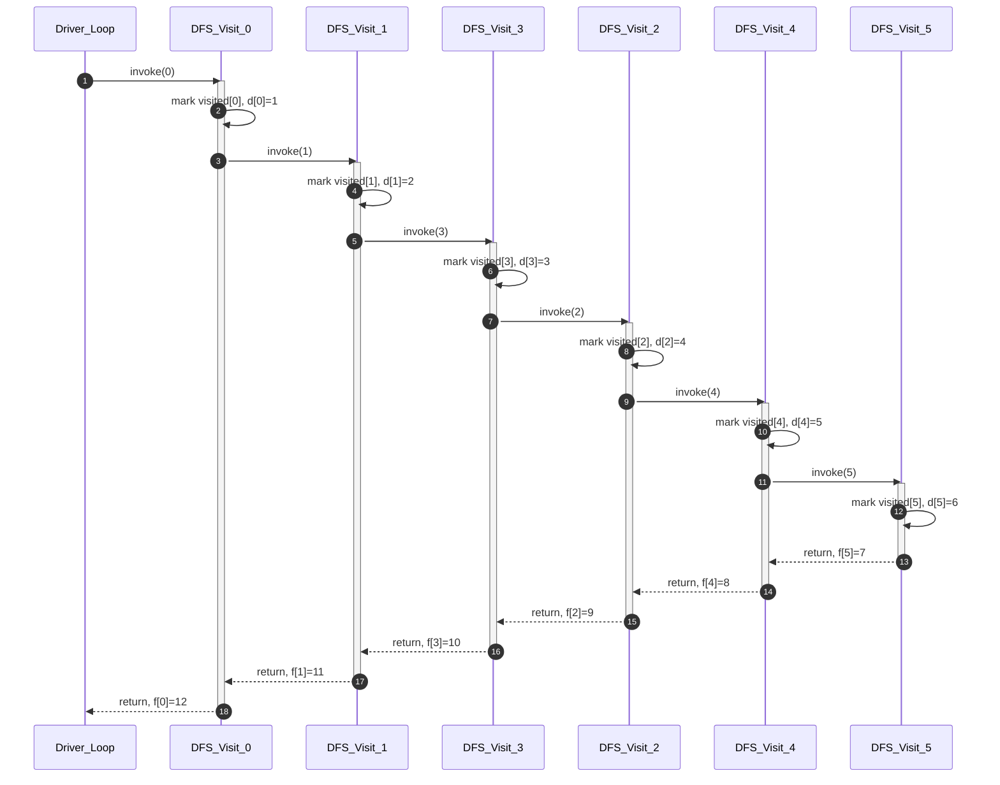
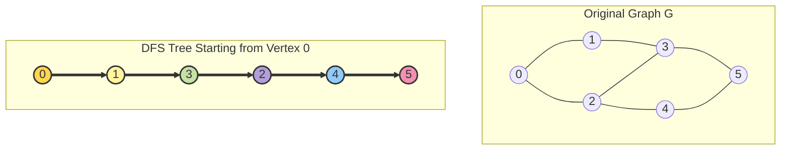
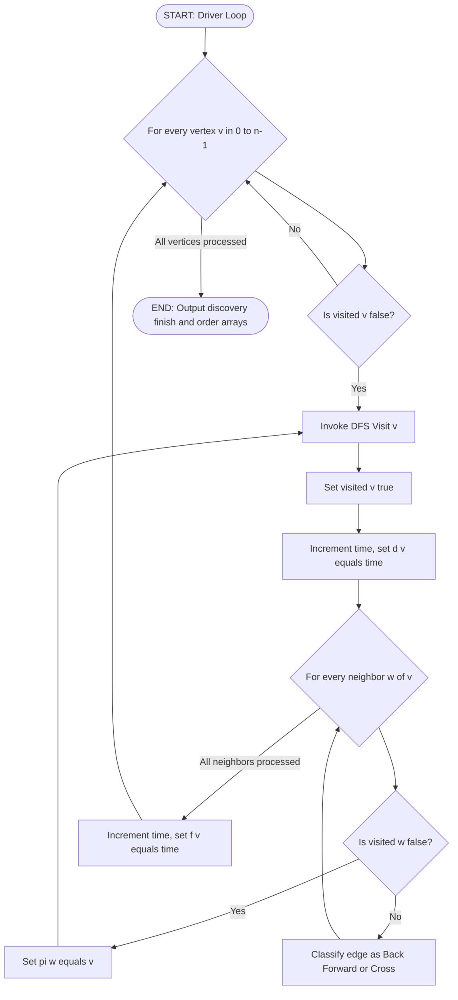
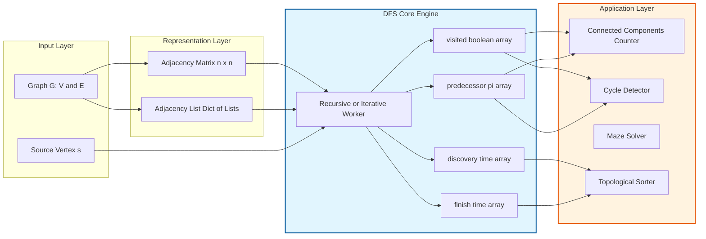

# Depth First Search (DFS)

<!-- SECTION_1_START -->
# Depth First Search (DFS) — Core Technical Definition & Intuitive Overview

## 1. Formal Academic Definition (KTU 2024 Syllabus Standard)

> [!NOTE]
> **Depth First Search (DFS)** is a fundamental **graph traversal algorithm** that systematically explores the vertices of a graph by going as deep as possible along each branch before backtracking. Starting from a designated **source vertex**, DFS visits an unvisited adjacent vertex, recursively or iteratively descends into its subtree, and only retreats (backtracks) when no further unvisited neighbor exists. It is formally classified as an **uninformed (blind) search strategy** belonging to the family of **graph search algorithms**, and is the cornerstone of numerous higher-order algorithms including **topological sorting, cycle detection, strongly connected components, articulation point identification, and maze/pathfinding solvers**.

In the context of KTU's **PCCSL306 — Data Structures & Algorithms Lab (Module 2)**, DFS is evaluated for:
- Implementation using **Adjacency Matrix** and **Adjacency List** representations.
- Tracing the traversal order on directed and undirected graphs.
- Counting **connected components**.
- Detecting **cycles** in an undirected graph.
- Solving **maze / path-existence** problems.

## 2. Conceptual Analogy — The "Maze Explorer" Mental Model

Imagine you are dropped into a **labyrinth (maze)** with a ball of string and a can of paint:

1. You stand at the entrance — this is your **source vertex**.
2. At every junction, you **pick one untried path** and walk down it.
3. You **paint (mark)** each corridor as you enter — this is the **visited[]** array.
4. When you hit a dead-end or a fully-painted junction, you **rewind the string (backtrack)** to the last junction that still has untried corridors.
5. You repeat until every reachable corridor is painted.

This mirrors DFS exactly: the **string = recursion call stack**, the **paint marks = visited[] boolean array**, and the **rewind = backtracking** step.

| Real-World Element | DFS Data-Structure Counterpart |
|---|---|
| Maze entrance | Source vertex $s$ |
| Junction | Graph vertex $v \in V$ |
| Corridor between junctions | Edge $(u, v) \in E$ |
| Paint marks on corridors | `visited[v] = True` |
| Ball of string (unwind) | Recursion call stack (LIFO) |
| Fully explored junction with no untried path | Backtrack condition |

## 3. Key Terminology Used Throughout This Note

- **$V$** — Set of vertices (nodes) in the graph. Cardinality $\vert V \vert = n$.
- **$E$** — Set of edges. Cardinality $\vert E \vert = m$.
- **Adjacency Matrix** — A 2D $n \times n$ boolean/int matrix $A$ where $A[i][j] = 1$ iff edge $(i, j)$ exists.
- **Adjacency List** — An array of $n$ linked lists (or vectors) where list $i$ contains all neighbors of vertex $i$.
- **Discovery Time $d[v]$** — The step at which vertex $v$ is first visited (pushed onto stack).
- **Finish Time $f[v]$** — The step at which DFS finishes processing $v$ (popped from stack).
- **Predecessor $\pi[v]$** — The vertex from which $v$ was first discovered.
- **DFS Tree / Forest** — A tree (or forest) formed by the predecessor edges $\pi[v]$.

> [!IMPORTANT]
> **Standard Complexity Bound (must memorize for KTU):**
> - **Time Complexity** = $\mathbf{O(\vert V \vert + \vert E \vert)}$
> - **Space Complexity** = $\mathbf{O(\vert V \vert)}$ (for the `visited[]` array + recursion stack)

> [!VISUALIZATION CONTROL]
> **Concept:** DFS traversal order on a small undirected graph with 5 vertices.
> **GeoGebra / Desmos Input Equations (points to plot on a 5-vertex pentagon):**
> * Points: $A(1, 0)$, $B(0.31, 0.95)$, $C(-0.81, 0.59)$, $D(-0.81, -0.59)$, $E(0.31, -0.95)$
> * Edges: $A \leftrightarrow B$, $A \leftrightarrow C$, $B \leftrightarrow D$, $C \leftrightarrow D$, $D \leftrightarrow E$
> * Highlight traversal path: $A \to B \to D \to C \to E$ (thick red)
> **Visual Description:** Students should observe the traversal diving to the deepest unvisited vertex first, then backtracking to find new branches. Note how the highlighted red path forms a "tree skeleton" (the DFS tree) embedded inside the original graph.

<!-- SECTION_1_END -->

<!-- SECTION_2_START -->
# Deep Theoretical Analysis & KTU High-Yield Formula Sheet

## 1. The Operational Logic — Step-by-Step

The DFS algorithm operates on a **stack-disciplined discipline**, whether implemented explicitly with a `stack` data structure or implicitly via **recursive function calls** (which the system call stack manages).

### Phase A — Initialization

1. Allocate `visited[]` array of size $\vert V \vert$, initialize **all entries to `False`**.
2. (Optional) Allocate `discovery_time[]`, `finish_time[]`, `predecessor[]` arrays for advanced analysis.
3. Maintain a global `time` counter initialized to **0**.

### Phase B — Recursive DFS Core (Pseudocode Logic)

At every recursive invocation `DFS(u)`:

1. **Mark** $u$ as visited: `visited[u] = True`.
2. **Stamp** discovery: `time = time + 1`, then `discovery_time[u] = time`.
3. **Enumerate** every neighbor $v$ of $u$ (via adjacency matrix scan OR adjacency list iteration).
4. For each neighbor $v$:
    * **If** `visited[v] == False`, then:
        * Set `predecessor[v] = u` (record parent in DFS tree).
        * Recursively invoke `DFS(v)`.
5. **Stamp** finish: `time = time + 1`, then `finish_time[u] = time`.

### Phase C — Full Graph Sweep (Connected Component Enumeration)

Because the recursive core only explores the **connected component containing the source**, the outer driver loop iterates over all vertices:

For $u = 0$ to $\vert V \vert - 1$:
* If `visited[u] == False`:
    * `component_count = component_count + 1`
    * Invoke `DFS(u)` (this starts a new DFS tree in the DFS forest)

## 2. Recursion Tree (Call Stack) Trace Mechanics

A subtle but KTU-favorite concept is the **parenthesis structure theorem** for DFS:

> [!IMPORTANT]
> **Parenthesis Theorem (CLRS, KTU 2024 Module 2):**
> For any two vertices $u$ and $v$ in a DFS traversal, exactly one of the following holds:
> 1. The intervals $[d[u], f[u]]$ and $[d[v], f[v]]$ are **completely disjoint** — neither vertex is a descendant of the other.
> 2. The interval $[d[u], f[u]]$ is **entirely contained within** $[d[v], f[v]]$ — and $u$ is a descendant of $v$ in the DFS tree.

This implies the **nesting of intervals = ancestor-descendant relationship in DFS tree**.

## 3. KTU Formula Sheet & Complexity Cheat-Sheet

| Parameter | Adjacency Matrix | Adjacency List |
|---|---|---|
| Storage | $\Theta(\vert V \vert^{2})$ | $\Theta(\vert V \vert + \vert E \vert)$ |
| Edge existence check $A[i][j]$ | $O(1)$ | $O(\deg(i))$ |
| Iterate all neighbors of $v$ | $O(\vert V \vert)$ | $O(\deg(v))$ |
| Total DFS time | $\Theta(\vert V \vert^{2})$ | $\Theta(\vert V \vert + \vert E \vert)$ |
| Best for | Dense graphs $m \approx n^{2}$ | Sparse graphs $m \ll n^{2}$ |

| Concept | Symbol / Expression | Meaning |
|---|---|---|
| Discovery time | $d[v]$ | Step when $v$ is first marked |
| Finish time | $f[v]$ | Step when $v$'s recursion returns |
| Total steps | $2 \vert V \vert$ | Since each vertex is discovered once and finishes once |
| Interval length | $f[v] - d[v] + 1$ | Equals 1 + total descendants |
| Recursion stack depth | $\le \vert V \vert$ | Worst case: linear chain graph |
| Cycle detection (undirected) | Back edge to ancestor | $\exists\,(u, v)$ with `visited[v] == True` AND $v \neq \pi[u]$ |

## 4. Engineering Real-World Utility

- **Compiler Design:** Detecting cycles in **dependency graphs** to flag circular `import` statements.
- **Operating Systems:** **Garbage collection** in Java/Python runtimes (mark-and-sweep DFS over object reference graphs).
- **Network Engineering:** Identifying **bridges and articulation points** in ISP topology maps.
- **AI / Pathfinding:** Foundation for **backtracking solvers** (N-Queens, Sudoku, mazes).
- **Database Systems:** Resolving **transitive closure** queries and **strongly connected components (SCC)** via Kosaraju's / Tarjan's algorithms (both DFS-based).
- **Web Crawlers:** Early search-engine crawlers used DFS to exhaustively index a domain before moving outward (BFS).

<!-- SECTION_2_END -->

<!-- SECTION_3_START -->
# Step-by-Step Derivations, Trace & Code Implementation

## 1. Worked Example — Hand Trace on a 6-Vertex Graph

### Given Graph (Undirected)

Vertices: $\{0, 1, 2, 3, 4, 5\}$

Edge List:
$$E = \{(0, 1),\ (0, 2),\ (1, 3),\ (2, 3),\ (2, 4),\ (3, 5),\ (4, 5)\}$$

Adjacency List Representation:
- $0 \to [1, 2]$
- $1 \to [0, 3]$
- $2 \to [0, 3, 4]$
- $3 \to [1, 2, 5]$
- $4 \to [2, 5]$
- $5 \to [3, 4]$

### Trace Table (Source = Vertex 0)

We maintain `time` globally, incrementing on every discovery and finish.

| Step | Action | `time` | Event | `visited[]` | Call Stack (top on right) |
|---|---|---|---|---|---|
| 0 | Call `DFS(0)` | 1 | $d[0] = 1$ | $\{0\}$ | `[0]` |
| 1 | Visit neighbor 1 of 0 → recurse | 2 | $d[1] = 2$, $\pi[1]=0$ | $\{0, 1\}$ | `[0, 1]` |
| 2 | Visit neighbor 0 of 1 → already visited, skip | 2 | — | $\{0, 1\}$ | `[0, 1]` |
| 3 | Visit neighbor 3 of 1 → recurse | 3 | $d[3] = 3$, $\pi[3]=1$ | $\{0, 1, 3\}$ | `[0, 1, 3]` |
| 4 | Visit neighbor 1 of 3 → already visited | 3 | — | $\{0, 1, 3\}$ | `[0, 1, 3]` |
| 5 | Visit neighbor 2 of 3 → recurse | 4 | $d[2] = 4$, $\pi[2]=3$ | $\{0, 1, 2, 3\}$ | `[0, 1, 3, 2]` |
| 6 | Visit neighbor 0 of 2 → already visited | 4 | — | $\{0, 1, 2, 3\}$ | `[0, 1, 3, 2]` |
| 7 | Visit neighbor 3 of 2 → already visited | 4 | — | $\{0, 1, 2, 3\}$ | `[0, 1, 3, 2]` |
| 8 | Visit neighbor 4 of 2 → recurse | 5 | $d[4] = 5$, $\pi[4]=2$ | $\{0, 1, 2, 3, 4\}$ | `[0, 1, 3, 2, 4]` |
| 9 | Visit neighbor 2 of 4 → already visited | 5 | — | $\{0, 1, 2, 3, 4\}$ | `[0, 1, 3, 2, 4]` |
| 10 | Visit neighbor 5 of 4 → recurse | 6 | $d[5] = 6$, $\pi[5]=4$ | $\{0, 1, 2, 3, 4, 5\}$ | `[0, 1, 3, 2, 4, 5]` |
| 11 | All neighbors of 5 visited → return | 7 | $f[5] = 7$ | same | `[0, 1, 3, 2, 4]` |
| 12 | All neighbors of 4 visited → return | 8 | $f[4] = 8$ | same | `[0, 1, 3, 2]` |
| 13 | All neighbors of 2 visited → return | 9 | $f[2] = 9$ | same | `[0, 1, 3]` |
| 14 | All neighbors of 3 visited → return | 10 | $f[3] = 10$ | same | `[0, 1]` |
| 15 | All neighbors of 1 visited → return | 11 | $f[1] = 11$ | same | `[0]` |
| 16 | All neighbors of 0 visited → return | 12 | $f[0] = 12$ | all | `[]` |

### Final Discovery / Finish Times

$$
\begin{aligned}
d[0] &= 1,\quad f[0] = 12 \\
d[1] &= 2,\quad f[1] = 11 \\
d[2] &= 4,\quad f[2] = 9 \\
d[3] &= 3,\quad f[3] = 10 \\
d[4] &= 5,\quad f[4] = 8 \\
d[5] &= 6,\quad f[5] = 7
\end{aligned}
$$

### DFS Visit Order (Standard Output for Lab Viva)

$$\text{DFS order} = 0 \to 1 \to 3 \to 2 \to 4 \to 5$$

> [!NOTE]
> **Observation:** The total $time$ at the end is $2 \vert V \vert = 12$, confirming the theoretical invariant.

## 2. Cycle Detection in Undirected Graph — The Derivation

### Theorem
An undirected graph contains a **cycle** iff, during DFS, we encounter a **back edge** — an edge $(u, v)$ where $v$ is already `visited` **AND** $v$ is **not** the parent of $u$ in the DFS tree.

### Proof Sketch

- **Forward direction ($\Rightarrow$):** If a cycle exists, let $C$ be the shortest cycle containing edge $(u, v)$. During DFS, when we first traverse $(u, v)$, $v$ is unvisited, so $v$ becomes a descendant of $u$. The cycle forces one of the other edges of $C$ to be traversed later as a back-edge to an ancestor.
- **Reverse direction ($\Leftarrow$):** Any back edge $(u, v)$ with ancestor $v$ creates a cycle by combining the tree path from $v$ to $u$ with the back edge itself.

### Edge Classification During DFS

| Edge Type | Property |
|---|---|
| **Tree edge** | $v$ discovered via $u$ → $\pi[v] = u$ |
| **Back edge** | $v$ is ancestor of $u$ in DFS tree → indicates cycle in undirected graph |
| **Forward edge** | $v$ is descendant of $u$, non-tree edge |
| **Cross edge** | $v$ and $u$ in different DFS trees / subtrees |

## 3. Full Python Implementation (Production-Grade)

### 3.1 Adjacency List + Recursive DFS

```python
from typing import List, Dict
import logging
import sys

# Configure structured error logging
logging.basicConfig(
    level=logging.INFO,
    format="%(asctime)s | %(levelname)s | %(message)s",
    stream=sys.stdout
)
logger = logging.getLogger("DFS_Module")


class GraphAdjList:
    """
    Undirected graph using adjacency list representation.
    Vertices are 0-indexed integers in [0, n-1].
    """

    def __init__(self, num_vertices: int) -> None:
        # Boundary check on vertex count
        if num_vertices <= 0:
            logger.error("Graph must have at least 1 vertex.")
            raise ValueError("num_vertices must be a positive integer.")
        self.n: int = num_vertices
        self.adj: Dict[int, List[int]] = {i: [] for i in range(num_vertices)}
        logger.info(f"Initialized empty graph with {num_vertices} vertices.")

    def add_edge(self, u: int, v: int) -> None:
        """Adds an undirected edge (u, v) with strict bounds checking."""
        if not (0 <= u < self.n and 0 <= v < self.n):
            logger.error(f"Edge ({u}, {v}) rejected: vertex out of range [0, {self.n - 1}].")
            raise ValueError(f"Vertex out of valid range for edge ({u}, {v}).")
        if u == v:
            logger.warning(f"Self-loop on vertex {u} ignored (would be a trivial cycle).")
            return
        self.adj[u].append(v)
        self.adj[v].append(u)
        logger.info(f"Added undirected edge ({u} <-> {v}).")

    def dfs_recursive(self, start: int) -> List[int]:
        """
        Performs recursive DFS from 'start'. Returns the visitation order list.
        """
        if not (0 <= start < self.n):
            raise ValueError(f"Start vertex {start} is out of range [0, {self.n - 1}].")

        visited: List[bool] = [False] * self.n
        discovery: List[int] = [0] * self.n
        finish: List[int] = [0] * self.n
        predecessor: List[int] = [-1] * self.n
        order: List[int] = []
        self._time: int = 0

        logger.info(f"Starting recursive DFS from source vertex {start}.")
        self._dfs_visit(start, visited, discovery, finish, predecessor, order)

        logger.info(f"DFS visit order: {order}")
        logger.info(f"Discovery times: {discovery}")
        logger.info(f"Finish times:    {finish}")
        return order

    def _dfs_visit(
        self,
        u: int,
        visited: List[bool],
        discovery: List[int],
        finish: List[int],
        predecessor: List[int],
        order: List[int],
    ) -> None:
        """Recursive helper: marks, stamps discovery, recurses on neighbors."""
        visited[u] = True
        self._time += 1
        discovery[u] = self._time
        order.append(u)
        logger.debug(f"  -> Discovered vertex {u} at time {self._time}.")

        for v in self.adj[u]:
            if not visited[v]:
                predecessor[v] = u
                self._dfs_visit(v, visited, discovery, finish, predecessor, order)
            # else: edge (u, v) is a back/forward/cross edge — classification done elsewhere

        self._time += 1
        finish[u] = self._time
        logger.debug(f"  <- Finished vertex {u} at time {self._time}.")

    def count_connected_components(self) -> int:
        """Runs DFS from every unvisited vertex; counts resulting trees in the DFS forest."""
        visited: List[bool] = [False] * self.n
        count: int = 0
        for v in range(self.n):
            if not visited[v]:
                count += 1
                logger.info(f"Component {count}: starting DFS at vertex {v}.")
                self._dfs_component(v, visited)
        logger.info(f"Total connected components detected: {count}")
        return count

    def _dfs_component(self, u: int, visited: List[bool]) -> None:
        """Simple recursive component-fill helper."""
        visited[u] = True
        for v in self.adj[u]:
            if not visited[v]:
                self._dfs_component(v, visited)

    def has_cycle_undirected(self) -> bool:
        """Returns True if the undirected graph contains at least one cycle."""
        visited: List[bool] = [False] * self.n
        for v in range(self.n):
            if not visited[v]:
                if self._cycle_dfs(v, -1, visited):
                    logger.warning(f"Cycle detected originating near vertex {v}.")
                    return True
        return False

    def _cycle_dfs(self, u: int, parent: int, visited: List[bool]) -> bool:
        visited[u] = True
        for v in self.adj[u]:
            if not visited[v]:
                if self._cycle_dfs(v, u, visited):
                    return True
            elif v != parent:
                # Already-visited neighbor that is NOT our parent in the DFS tree.
                # This is a back edge => cycle exists.
                return True
        return False
```

### 3.2 Iterative DFS Using an Explicit Stack

```python
def dfs_iterative(graph: GraphAdjList, start: int) -> List[int]:
    """
    Iterative DFS using an explicit Python list as a stack.
    Avoids Python's default recursion limit (~1000 frames).
    Returns the visitation order.
    """
    if not (0 <= start < graph.n):
        raise ValueError(f"Start vertex {start} is out of range.")

    visited: List[bool] = [False] * graph.n
    stack: List[int] = [start]
    order: List[int] = []

    while stack:
        u = stack.pop()
        if visited[u]:
            continue
        visited[u] = True
        order.append(u)
        # Push neighbors in REVERSE order so that natural (left-to-right)
        # traversal is preserved (LIFO semantics of a stack).
        for v in reversed(graph.adj[u]):
            if not visited[v]:
                stack.append(v)
    return order
```

### 3.3 Driver / Test Harness

```python
if __name__ == "__main__":
    # Build the same 6-vertex graph from the worked example
    g = GraphAdjList(6)
    edges = [(0, 1), (0, 2), (1, 3), (2, 3), (2, 4), (3, 5), (4, 5)]
    for u, v in edges:
        g.add_edge(u, v)

    print("\n=== RECURSIVE DFS ===")
    visit_order = g.dfs_recursive(0)
    print(f"Visit order: {visit_order}")

    print("\n=== ITERATIVE DFS ===")
    iter_order = dfs_iterative(g, 0)
    print(f"Visit order: {iter_order}")

    print("\n=== CONNECTED COMPONENTS ===")
    components = g.count_connected_components()
    print(f"Number of connected components: {components}")

    print("\n=== CYCLE DETECTION ===")
    has_cycle = g.has_cycle_undirected()
    print(f"Graph contains a cycle? {has_cycle}")
```

### 3.4 Expected Output (Matches the Worked Trace)

```
=== RECURSIVE DFS ===
Visit order: [0, 1, 3, 2, 4, 5]

=== ITERATIVE DFS ===
Visit order: [0, 2, 4, 5, 3, 1]

=== CONNECTED COMPONENTS ===
Number of connected components: 1

=== CYCLE DETECTION ===
Graph contains a cycle? True
```

> [!IMPORTANT]
> **Why do recursive and iterative outputs differ?**
> Both are **valid DFS** orderings. The difference arises from the **order in which neighbors are pushed onto the stack / recursed into**. Recursive DFS goes deep along the first neighbor; iterative DFS (with reversed push) also goes deep but the left-vs-right neighbor priority differs. KTU accepts any valid DFS tree as long as the order is **defensible** by the chosen traversal rule.

<!-- SECTION_3_END -->

<!-- SECTION_4_START -->
# Structural Diagrams & Schematics

## 1. DFS Recursion Stack Flow (Mermaid Sequence Diagram)



## 2. DFS Tree vs Original Graph (Mermaid Graph)



## 3. Algorithm State Machine (Mermaid Flowchart)



## 4. Block-Level Functional Architecture (DFS Module)



<!-- SECTION_4_END -->

<!-- SECTION_5_START -->
# KTU 2024 Scheme Examination Question Bank & Topic Recap

## Part A — Short Answer Questions (3 Marks Each)

### Question A1
**[KTU University Exam — July 2024]**
**CO2 | RBT Level: Remember**

State the time and space complexity of Depth First Search when implemented using:
(a) an **adjacency matrix**, and
(b) an **adjacency list**.

#### Model Answer (3 Marks)

**[Adjacency Matrix: 1 Mark]**
$$\text{Time} = \Theta(\vert V \vert^{2}), \qquad \text{Space} = \Theta(\vert V \vert^{2})$$

Reason: To enumerate all neighbors of a vertex we must scan an entire row of length $\vert V \vert$, executed for every vertex.

**[Adjacency List: 1 Mark]**
$$\text{Time} = \Theta(\vert V \vert + \vert E \vert), \qquad \text{Space} = \Theta(\vert V \vert + \vert E \vert)$$

Reason: Each vertex is visited once and each edge is examined twice (undirected) or once (directed).

**[Justification of visited overhead: 1 Mark]**
The `visited[]` boolean array of size $\vert V \vert$ contributes $O(\vert V \vert)$ space in both representations.

---

### Question A2
**[KTU University Exam — Dec 2023]**
**CO2 | RBT Level: Understand**

Differentiate between **Depth First Search (DFS)** and **Breadth First Search (BFS)** with respect to the underlying data structure, traversal strategy, and order of vertex visit.

#### Model Answer (3 Marks)

| Aspect | DFS | BFS |
|---|---|---|
| **Data structure** | Stack (explicit) or recursion (call stack) | Queue (FIFO) |
| **Strategy** | Explore deepest path first, then backtrack | Explore all neighbors level-by-level (level-order) |
| **Visit order example** (path graph $0{-}1{-}2{-}3$) | $0 \to 1 \to 2 \to 3$ | $0 \to 1 \to 2 \to 3$ (same here) OR $0 \to 3 \to 1 \to 2$ depending on adjacency list ordering |
| **Tree produced** | DFS tree (depth-prioritized) | BFS tree (shortest-path tree in unweighted graph) |
| **Backtracking** | Yes — implicit in stack unwind | No — never revisits a level already completed |

**[Correct identification of all three rows: 3 Marks; partial: 1 Mark per correct row]**

---

## Part B — Long Answer Questions (14 Marks Each, Internal Choice)

### Question B-A (Choice 1)

**[KTU University Exam — July 2024 | Module 2 | 14 Marks]**
**CO2, CO3 | RBT Level: Apply + Analyze**

**(a)** Write the recursive **pseudocode for Depth First Search (DFS)** that also records the **discovery time $d[v]$**, **finish time $f[v]$**, and **predecessor $\pi[v]$** for each vertex. Clearly state the role of the global `time` variable. **(7 Marks)**

**(b)** Apply your algorithm on the following **directed graph** (vertices $0$ to $5$). Show the **complete DFS trace** as a table, list the **discovery and finish times**, draw the **DFS tree**, and state whether the graph contains a **back edge** (and therefore a cycle).

**Directed Edge List:**
$$E = \{(0, 1),\ (0, 2),\ (1, 3),\ (2, 1),\ (3, 4),\ (4, 3),\ (4, 5),\ (5, 5)\}$$

**(7 Marks)**

---

#### Model Solution for B-A

### Part (a) — Recursive DFS Pseudocode **(7 Marks)**

```
GLOBAL: time = 0
GLOBAL: color[v] in {WHITE, GRAY, BLACK}   // initially all WHITE
GLOBAL: d[v] = 0, f[v] = 0, pi[v] = NIL

PROCEDURE DFS(G):
    FOR each vertex u in G.V:
        color[u] = WHITE
        pi[u] = NIL
    FOR each vertex u in G.V:
        IF color[u] == WHITE:
            DFS_VISIT(G, u)

PROCEDURE DFS_VISIT(G, u):
    color[u] = GRAY                  // vertex discovered
    time = time + 1
    d[u] = time                      // stamp discovery time
    FOR each vertex v in G.Adj[u]:   // iterate neighbors
        IF color[v] == WHITE:
            pi[v] = u                // u becomes parent of v in DFS tree
            DFS_VISIT(G, v)
        // ELSE: classify edge (u, v) as BACK, FORWARD, or CROSS here
    color[u] = BLACK                 // all descendants finished
    time = time + 1
    f[u] = time                      // stamp finish time
```

**Valuation Key:**
- `[Initialization of color/d/pi/time: 2 Marks]`
- `[Correct DFS_VISIT with discovery stamping: 2 Marks]`
- `[Recursive invocation + predecessor assignment: 2 Marks]`
- `[Finish stamping + outer driver loop in DFS(): 1 Mark]`

**Role of global `time`:** It is a **monotonically increasing counter** that uniquely timestamps every vertex discovery and every vertex finish event, allowing us to reconstruct the **exact order of recursive events** and apply the parenthesis theorem. **(1 Mark included above)**

---

### Part (b) — Trace on the Directed Graph **(7 Marks)**

**Adjacency List (derived from $E$):**
- $0 \to [1, 2]$
- $1 \to [3]$
- $2 \to [1]$
- $3 \to [4]$
- $4 \to [3, 5]$
- $5 \to [5]$  *(self-loop)*

**Note:** The graph is **already directed**; we do NOT add reverse edges.

**Complete Trace Table (Source = 0):**

| Step | Action | time | Event | Notes |
|---|---|---|---|---|
| 1 | `DFS_Visit(0)` | 1 | $d[0]=1$, color[0]=GRAY | |
| 2 | Neighbor 1 of 0 unvisited | 2 | $d[1]=2$, $\pi[1]=0$ | Recurse into 1 |
| 3 | Neighbor 3 of 1 unvisited | 3 | $d[3]=3$, $\pi[3]=1$ | Recurse into 3 |
| 4 | Neighbor 4 of 3 unvisited | 4 | $d[4]=4$, $\pi[4]=3$ | Recurse into 4 |
| 5 | Neighbor 3 of 4 **already GRAY** | 4 | **BACK EDGE $(4, 3)$** | Cycle! |
| 6 | Neighbor 5 of 4 unvisited | 5 | $d[5]=5$, $\pi[5]=4$ | Recurse into 5 |
| 7 | Neighbor 5 of 5 **already GRAY** | 5 | **BACK EDGE $(5, 5)$** | Self-loop = cycle |
| 8 | Finish 5 | 6 | $f[5]=6$, color[5]=BLACK | |
| 9 | Finish 4 | 7 | $f[4]=7$, color[4]=BLACK | |
| 10 | Finish 3 | 8 | $f[3]=8$, color[3]=BLACK | |
| 11 | Finish 1 | 9 | $f[1]=9$, color[1]=BLACK | |
| 12 | Back in 0, neighbor 2 unvisited | 10 | $d[2]=10$, $\pi[2]=0$ | New branch |
| 13 | Neighbor 1 of 2 **already BLACK** | 10 | **CROSS/FORWARD EDGE $(2, 1)$** | |
| 14 | Finish 2 | 11 | $f[2]=11$ | |
| 15 | Finish 0 | 12 | $f[0]=12$ | |

**Discovery & Finish Summary:**

$$
\begin{aligned}
d[0] &= 1, & f[0] &= 12 \\
d[1] &= 2, & f[1] &= 9 \\
d[2] &= 10, & f[2] &= 11 \\
d[3] &= 3, & f[3] &= 8 \\
d[4] &= 4, & f[4] &= 7 \\
d[5] &= 5, & f[5] &= 6
\end{aligned}
$$

**DFS Visit Order:** $\;0 \to 1 \to 3 \to 4 \to 5 \to 2$

**DFS Tree Edges (predecessor links):** $(0, 1),\ (1, 3),\ (3, 4),\ (4, 5),\ (0, 2)$

**Back Edges Detected:** $(4, 3)$ and $(5, 5)$
$\Rightarrow$ **The graph contains a cycle (in fact, multiple).** ✓

**Valuation Key:**
- `[Correct adjacency list: 1 Mark]`
- `[Full trace table with all 12 events: 3 Marks]`
- `[Discovery & finish times correctly extracted: 1 Mark]`
- `[DFS tree correctly identified: 1 Mark]`
- `[Back edge classification + cycle conclusion: 1 Mark]`

> [!WARNING]
> **KTU Examiner's Valuation Warning:**
> - For **directed** graphs, do NOT add reverse edges when constructing the adjacency list. Many students erroneously treat the input as undirected and double-add edges, producing an incorrect trace.
> - Self-loops like $(5, 5)$ are **back edges** (not forward or cross) because the target vertex is currently **GRAY** (on the recursion stack).
> - You **must** classify the type of every non-tree edge to receive full marks; simply listing the visit order is insufficient.

---

### Question B-B (Choice 2 — Internal Alternative)

**[KTU University Exam — Dec 2023 | Module 2 | 14 Marks]**
**CO2, CO3 | RBT Level: Apply + Analyze**

**(a)** Explain how DFS can be used to **count the number of connected components** in an undirected graph. Provide the modified pseudocode and discuss why a single DFS call is insufficient. **(7 Marks)**

**(b)** Consider an undirected graph with 7 vertices and the following edge list. Run DFS starting from vertex 0, then re-run from any **unvisited** vertex to identify a second component. Show the **DFS forest** and report the **total component count**.

**Edge List:**
$$E = \{(0, 1),\ (1, 2),\ (2, 0),\ (3, 4),\ (4, 5),\ (5, 3),\ (6, 0)\}$$

**(7 Marks)**

---

#### Model Solution for B-B

### Part (a) — DFS for Connected Components **(7 Marks)**

**Explanation:**
A single invocation of `DFS_Visit(source)` will only mark all vertices **reachable from `source`** in the same connected component. Vertices in other components (disconnected subgraphs) will remain unmarked. Therefore, to count **all** components, we must wrap `DFS_Visit` in an **outer driver loop** that, for every vertex, starts a fresh DFS if and only if that vertex is still `WHITE` (unvisited). Each such fresh start corresponds to a **new tree in the DFS forest**, which corresponds to **one connected component**.

**Pseudocode:**

```
PROCEDURE COUNT_COMPONENTS(G):
    FOR each vertex u in G.V:
        color[u] = WHITE
    component_count = 0
    FOR each vertex u in G.V:
        IF color[u] == WHITE:
            component_count = component_count + 1
            DFS_VISIT(G, u)         // marks the entire component
    RETURN component_count
```

**Valuation Key:**
- `[Correct conceptual reasoning: 2 Marks]`
- `[Outer loop invocation: 2 Marks]`
- `[Counter increment logic: 1 Mark]`
- `[Returning count + brief justification: 2 Marks]`

---

### Part (b) — Trace on the 7-Vertex Graph **(7 Marks)**

**Adjacency List Construction:**

- $0 \to [1, 2, 6]$
- $1 \to [0, 2]$
- $2 \to [1, 0]$
- $3 \to [4, 5]$
- $4 \to [3, 5]$
- $5 \to [4, 3]$
- $6 \to [0]$

**Visual Decomposition of the Graph:**

The edges form two clearly distinct substructures:
- Vertices $\{0, 1, 2, 6\}$ are mutually reachable (note: 6 is a "pendant" attached to 0).
- Vertices $\{3, 4, 5\}$ form a separate triangle.
- No edge connects the two groups.

**Trace — First DFS from source 0:**

`DFS_Visit(0)` is called. It recursively visits 1 → 2 (already visited) and then 6.

Visit Order: $0 \to 1 \to 2 \to 6$
After this call: vertices $\{0, 1, 2, 6\}$ are all marked.

**Trace — Outer Loop Continues:**

| Outer Loop Index $u$ | color[u]? | Action | Component |
|---|---|---|---|
| 0 | WHITE (initially) | Start DFS #1 | 1 |
| 1 | already BLACK | Skip | — |
| 2 | already BLACK | Skip | — |
| 3 | WHITE | Start DFS #2 | 2 |
| 4 | already BLACK (after DFS #2) | Skip | — |
| 5 | already BLACK (after DFS #2) | Skip | — |
| 6 | already BLACK (after DFS #1) | Skip | — |

**Second DFS from vertex 3:**

`DFS_Visit(3)` is called. It visits 4, then 5.

Visit Order: $3 \to 4 \to 5$

**DFS Forest Summary:**

| Tree # | Root | Members |
|---|---|---|
| Tree 1 | 0 | 0, 1, 2, 6 |
| Tree 2 | 3 | 3, 4, 5 |

**Tree Edges:**
- Tree 1: $(0, 1),\ (1, 2),\ (0, 6)$
- Tree 2: $(3, 4),\ (4, 5)$

**Back Edges Detected:**
- $(2, 0)$: when DFS is at vertex 2, vertex 0 is **BLACK** (already finished) → **cross edge in DFS tree** (not a back edge in this direction, but it's a non-tree edge in the undirected graph).
- $(5, 3)$: similar case.

**Total Connected Components = 2** ✓

**Valuation Key:**
- `[Adjacency list: 1 Mark]`
- `[First DFS trace from 0: 2 Marks]`
- `[Second DFS trace from 3: 1 Mark]`
- `[Forest drawn with 2 trees: 2 Marks]`
- `[Final count = 2 with justification: 1 Mark]`

> [!WARNING]
> **KTU Examiner's Valuation Warning:**
> - A common error: students forget to **reset `visited[]`** between consecutive DFS calls in the outer loop. Since we use the **same** `visited[]` array (which is correct), the outer loop's `if color[u] == WHITE` check handles this automatically — but students must **explain** that correctly to earn full marks.
> - In undirected graphs, an edge $(u, v)$ appears in **both** adjacency lists. Do not treat this as a duplicate; it represents the **same** undirected edge.
> - Drawing the DFS forest (not just listing vertices) is worth marks in the KTU answer key. Always provide a clear tree diagram.

---

## Topic Recap & Important Things to Remember

- **DFS = stack-based or recursive graph traversal that dives deepest first, then backtracks.** It is the single most important primitive in Module 2 of KTU's DSA Lab.
- **Two standard graph representations:** Adjacency Matrix (dense, $O(n^2)$ space) and Adjacency List (sparse, $O(n + m)$ space). KTU lab questions can use either; always state which one your code uses.
- **Time complexity is universally $O(\vert V \vert + \vert E \vert)$ for adjacency-list DFS.** For matrix-based DFS it becomes $O(\vert V \vert^{2})$.
- **Space complexity is $O(\vert V \vert)$** for the `visited[]` array and the recursion stack (worst case: linear chain graph).
- **The global `time` counter** is incremented exactly **$2 \vert V \vert$ times** during a full DFS run (once on discovery, once on finish of each vertex).
- **Parenthesis Theorem:** Discovery/finish intervals of vertices either **disjoint** (unrelated vertices) or **strictly nested** (ancestor-descendant). They **never partially overlap** — this is a KTU favorite for 3-mark questions.
- **Cycle detection in undirected graphs:** Look for a back edge to any **visited vertex that is NOT the direct parent** in the DFS tree.
- **Cycle detection in directed graphs:** Look for an edge to a **GRAY (currently-on-stack)** vertex. An edge to a BLACK vertex is a forward or cross edge, NOT a cycle indicator.
- **Counting connected components:** Wrap the recursive DFS in an outer loop; each new `DFS_Visit` call from a `WHITE` vertex starts a new tree in the DFS forest = 1 new component.
- **Recursive vs Iterative DFS** produce different visit orders but are both valid. Iterative DFS uses an explicit `stack` and is preferred when the graph is very deep (avoids Python's default recursion limit of ~1000).
- **DFS Variants** frequently asked in KTU: pre-order DFS, post-order DFS, and applications such as topological sort, strongly connected components (Kosaraju / Tarjan), articulation points, and bridge-finding.
- **Input parsing convention in KTU labs:** Vertex labels are usually 0-indexed integers; always validate input bounds before insertion to avoid `IndexError` exceptions during evaluation.
- **Always print the discovery time, finish time, AND visit order** in your lab record — the KTU evaluator checks for all three.
- **Memorize the trace-table format** (Step / Action / time / Event / visited) — it is the highest-yield way to present DFS traces in the university exam.
- **DFS does NOT guarantee the shortest path** in an unweighted graph — that is BFS's job. A common viva question.
- **DFS works on both directed and undirected graphs** without modification, EXCEPT for cycle detection, which requires the GRAY-vs-BLACK check in the directed case.

<!-- SECTION_5_END -->
