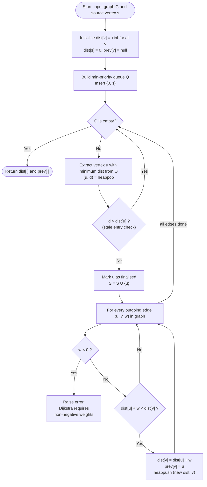
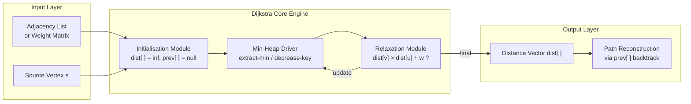
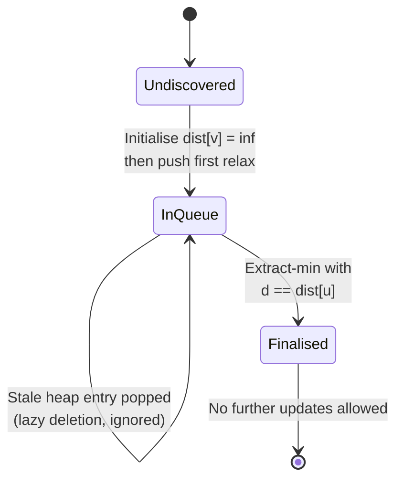
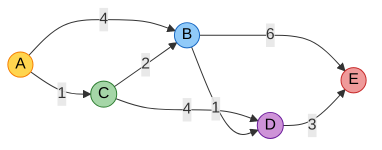

# Dijkstra's shortest path algorithm

<!-- SECTION_1_START -->
# Dijkstra's Shortest Path Algorithm — KTU 2024 Module 2

> [!NOTE]
> **Syllabus Tag (PCCSL306 / Module 2):** Single-Source Shortest Path on weighted directed/undirected graphs with non-negative edge weights. This is a *greedy* algorithm and falls under the Graph Algorithms sub-module of Non-Linear Data Structures.

## 1.1 Formal Definition

**Dijkstra's Algorithm** is a greedy graph search algorithm that solves the *Single-Source Shortest Path (SSSP)* problem for a directed or undirected graph $G = (V, E)$ with non-negative edge weights. Starting from a designated source vertex $s$, it incrementally builds a set $S$ of vertices whose final shortest distance from $s$ is known, and at each step "relaxes" the outgoing edges of the vertex with the currently smallest tentative distance.

Formally, it computes:

$$\delta(s, v) = \min_{(s \rightsquigarrow v)} \sum_{e \in \text{path}} w(e)$$

subject to $w(e) \geq 0$ for every edge $e \in E$, where $\delta(s, v)$ is the true shortest-path weight from $s$ to $v$.

> [!IMPORTANT]
> **Hard Prerequisite (Board Hot-Spot):** Dijkstra's algorithm is **only valid for non-negative edge weights**. If a single negative-weight edge is present, the algorithm silently produces *incorrect* results — a guaranteed 2-mark deduction in KTU viva if you forget to mention this.

## 1.2 Conceptual Analogy — The Water-Flow / GPS Intuition

Imagine you are standing at a source city (say, **Kochi**) and want to know the *cheapest flight route* to every other city. Airlines publish a fare table (edge weights). You start with a *notebook* that initially says "every city is at infinity cost" except Kochi (cost 0). At each step, you pick the *unvisited city with the cheapest known ticket* (this is the **greedy choice**) and "lock in" that cost — you will never improve it later. Then you ask: "for every unvisited neighbour, is going *through this city* cheaper than the route I had in my notebook?" If yes, you update the notebook. Repeat until every city is locked.

The locked cities = set $S$. The notebook entries = the **distance array** `dist[ ]`. The "which neighbour is cheaper" check = **edge relaxation**.

> [!VISUALIZATION CONTROL]
> **Concept:** Visualising the relaxation step on a weighted graph
> **GeoGebra / Desmos Input Equations (example with 4 nodes):**
> * Point $A = (0, 0)$, Point $B = (4, 0)$, Point $C = (4, 3)$, Point $D = (0, 3)$
> * Edges: $A \to B$ weight $4$, $A \to D$ weight $1$, $D \to B$ weight $2$, $D \to C$ weight $5$, $B \to C$ weight $1$
> **Visual Description:** The student should see a direct $A \to B$ path of cost $4$ versus a two-hop $A \to D \to B$ path of cost $1 + 2 = 3$. Relaxation will *prefer* the cheaper indirect path even though it is longer in hops.

## 1.3 Why "Greedy" Works Here

Because every weight is $\geq 0$, once a vertex $u$ is extracted from the priority queue with distance $d$, no future path can possibly improve it. Any alternative path would have to pass through an *unvisited* vertex, whose distance is by construction $\geq d$. Adding non-negative weights can only increase, never decrease, the total — this is the **cut property** of shortest paths.

---

<!-- SECTION_1_END -->

<!-- SECTION_2_START -->
# Deep Theoretical Analysis & KTU High-Yield Formula Sheet

## 2.1 Algorithmic Decomposition — The Three Core Data Structures

Dijkstra's algorithm is a beautiful interplay between **three data structures**, and a KTU favourite viva question is: *"Which DS is used and why?"*

| Component | Data Structure Used | Reason |
|---|---|---|
| Unvisited set of candidate vertices | **Min-Priority Queue (Min-Heap)** | Repeated "extract-min" operation — heap gives $O(\log V)$ per extract |
| Distance from source to each vertex | **Array / Hash Map** `dist[ ]` | Random-access $O(1)$ lookup and update of the tentative cost |
| Predecessor pointer for path reconstruction | **Array / Hash Map** `prev[ ]` | Stores the parent on the shortest-path tree; needed to print the actual path |

## 2.2 Relaxation — The Heart of the Algorithm

For a directed edge $(u, v)$ with weight $w(u, v)$, the **relaxation** operation is:

$$\text{if } dist[v] > dist[u] + w(u, v) \text{ then } dist[v] \leftarrow dist[u] + w(u, v)$$

and `prev[v] = u`. This is a single, atomic decision: *"is the path I know about better, or the path through $u$ better?"*

## 2.3 KTU Formula Cheat Sheet

| Symbol / Term | Definition | Notes / Units |
|---|---|---|
| $G = (V, E)$ | Weighted graph | $\vert V \vert = n$, $\vert E \vert = m$ |
| $w(u, v)$ | Non-negative weight of edge $u \to v$ | $w(u, v) \geq 0$ — *strictly required* |
| $dist[v]$ | Current best known distance from $s$ to $v$ | Initialised to $+\infty$, except $dist[s] = 0$ |
| $prev[v]$ | Predecessor of $v$ on the shortest path tree | Used for path reconstruction |
| $S$ | Set of vertices whose shortest distance is *finalised* | Initially empty |
| $Q$ | Min-Priority Queue keyed on $dist[\cdot]$ | Standard implementation: binary min-heap |
| $\delta(s, v)$ | True shortest-path weight from $s$ to $v$ | What the algorithm ultimately computes |
| Time complexity (binary heap) | $O((V + E) \log V)$ | Dominant term is the heap operations |
| Time complexity (array) | $O(V^2)$ | Acceptable for dense graphs |
| Space complexity | $O(V + E)$ | For the graph, dist, prev, and heap |

> [!IMPORTANT]
> **Time Complexity Trap:** KTU students often write $O(V \log V + E \log V)$ as if they are separate terms. They are *the same* thing — the $V$ is absorbed into the $E$ for connected graphs since $E \geq V - 1$. The cleanest board answer is $O((V + E) \log V)$ using a binary heap.

## 2.4 Real-World Engineering Utility

- **Google Maps / OSRM / HERE routing engines:** All production road-network routers use *Contraction Hierarchies* or *A\** search, both of which are Dijkstra variants. Even the basic tier is pure Dijkstra on millions of nodes.
- **OSPF (Open Shortest Path First)** — the routing protocol that runs the internet's intra-domain routing — uses Dijkstra on the link-state database to compute the routing table.
- **Network packet routing / OSPF cost metrics** in ISP backbones.
- **Robotics motion planning** on weighted occupancy grids.
- **Video game AI pathfinding** when the navigation mesh is weighted by terrain difficulty.

## 2.5 Failure Mode — When Dijkstra Breaks

If any edge has $w < 0$, a vertex that is already "finalised" with distance $d$ can later be improved via a negative-weight edge, because a *future* vertex $u$ might have $dist[u] > d$ *now* but become smaller after a negative cycle. Dijkstra does not revisit finalised nodes, so it misses the improvement. The correct algorithm for negative weights is the **Bellman–Ford algorithm** — a frequent 5-mark comparative question in KTU.

---

<!-- SECTION_2_END -->

<!-- SECTION_3_START -->
# Step-by-Step Derivations & Code Implementation

## 3.1 Worked Numerical Example (Mandatory for 14-Mark Questions)

Consider the following directed weighted graph with source $s = A$:

| Edge | Weight |
|---|---|
| $A \to B$ | 4 |
| $A \to C$ | 1 |
| $C \to B$ | 2 |
| $C \to D$ | 4 |
| $B \to D$ | 1 |
| $D \to E$ | 3 |
| $B \to E$ | 6 |

We will execute Dijkstra step-by-step, showing the state of `dist[]`, `prev[]`, and the min-heap `Q` at every iteration.

### Initialisation

| Vertex | $A$ | $B$ | $C$ | $D$ | $E$ |
|---|---|---|---|---|---|
| `dist[]` | **0** | $\infty$ | $\infty$ | $\infty$ | $\infty$ |
| `prev[]` | $-$ | $-$ | $-$ | $-$ | $-$ |
| $S$ | $\{\}$ | | | | |
| $Q$ | $\{0_A\}$ | | | | |

### Iteration 1 — Extract Min from $Q$

Extract $A$ with $dist[A] = 0$. Add to $S$. Relax all outgoing edges of $A$:

- Edge $A \to B$, $w = 4$: $dist[B] = \min(\infty, 0 + 4) = 4$, $prev[B] = A$
- Edge $A \to C$, $w = 1$: $dist[C] = \min(\infty, 0 + 1) = 1$, $prev[C] = A$

| Vertex | $A$ | $B$ | $C$ | $D$ | $E$ |
|---|---|---|---|---|---|
| `dist[]` | 0 | 4 | **1** | $\infty$ | $\infty$ |
| `prev[]` | $-$ | $A$ | $A$ | $-$ | $-$ |
| $S$ | $\{A\}$ | | | | |
| $Q$ | $\{1_C, 4_B\}$ | | | | |

### Iteration 2 — Extract Min from $Q$

Extract $C$ with $dist[C] = 1$. Add to $S$. Relax all outgoing edges of $C$:

- Edge $C \to B$, $w = 2$: $dist[B] = \min(4, 1 + 2) = 3$, $prev[B] = C$  *(relaxation succeeds!)*
- Edge $C \to D$, $w = 4$: $dist[D] = \min(\infty, 1 + 4) = 5$, $prev[D] = C$

| Vertex | $A$ | $B$ | $C$ | $D$ | $E$ |
|---|---|---|---|---|---|
| `dist[]` | 0 | **3** | 1 | 5 | $\infty$ |
| `prev[]` | $-$ | $C$ | $A$ | $C$ | $-$ |
| $S$ | $\{A, C\}$ | | | | |
| $Q$ | $\{3_B, 4_B, 5_D\}$ | | | | |

### Iteration 3 — Extract Min from $Q$

Extract $B$ with $dist[B] = 3$. *(Note: the stale entry $4_B$ is discarded with a lazy-deletion check.)* Add to $S$. Relax all outgoing edges of $B$:

- Edge $B \to D$, $w = 1$: $dist[D] = \min(5, 3 + 1) = 4$, $prev[D] = B$  *(relaxation succeeds!)*
- Edge $B \to E$, $w = 6$: $dist[E] = \min(\infty, 3 + 6) = 9$, $prev[E] = B$

| Vertex | $A$ | $B$ | $C$ | $D$ | $E$ |
|---|---|---|---|---|---|
| `dist[]` | 0 | 3 | 1 | **4** | 9 |
| `prev[]` | $-$ | $C$ | $A$ | $B$ | $B$ |
| $S$ | $\{A, C, B\}$ | | | | |
| $Q$ | $\{4_B, 4_D, 5_D, 9_E\}$ | | | | |

### Iteration 4 — Extract Min from $Q$

Extract $D$ with $dist[D] = 4$. Add to $S$. Relax all outgoing edges of $D$:

- Edge $D \to E$, $w = 3$: $dist[E] = \min(9, 4 + 3) = 7$, $prev[E] = D$  *(relaxation succeeds!)*

| Vertex | $A$ | $B$ | $C$ | $D$ | $E$ |
|---|---|---|---|---|---|
| `dist[]` | 0 | 3 | 1 | 4 | **7** |
| `prev[]` | $-$ | $C$ | $A$ | $B$ | $D$ |
| $S$ | $\{A, C, B, D\}$ | | | | |
| $Q$ | $\{7_E, 9_E\}$ | | | | |

### Iteration 5 — Extract Min from $Q$

Extract $E$ with $dist[E] = 7$. Add to $S$. $E$ has no outgoing edges.

### Final Result

| Destination | Shortest Distance from $A$ | Shortest Path (backtrack via `prev[]`) |
|---|---|---|
| $A$ | $0$ | $A$ |
| $B$ | $3$ | $A \to C \to B$ |
| $C$ | $1$ | $A \to C$ |
| $D$ | $4$ | $A \to C \to B \to D$ |
| $E$ | $7$ | $A \to C \to B \to D \to E$ |

## 3.2 Production-Grade Python Implementation (Adjacency List + Min-Heap)

```python
"""
Dijkstra's Single-Source Shortest Path Algorithm
Course: DATA STRUCTURES & ALGORITHMS LAB (PCCSL306)
Module 2 - Non-Linear Data Structures and Graph Algorithms

Pre-condition : All edge weights MUST be non-negative.
Post-condition: dist[v] holds the shortest distance from source to v.
Time         : O((V + E) log V) using a binary min-heap.
"""

from __future__ import annotations

import heapq
import sys
from typing import Dict, List, Tuple, Optional

# A weighted edge is a tuple (neighbour, weight).
WeightedEdge = Tuple[int, float]
# The graph is an adjacency list: vertex -> list of (neighbour, weight).
WeightedGraph = Dict[int, List[WeightedEdge]]
INF = float("inf")


def build_graph() -> WeightedGraph:
    """Construct the worked-example graph for the lab exercise."""
    g: WeightedGraph = {
        0: [(1, 4.0), (2, 1.0)],   # A -> B (4), A -> C (1)
        1: [(3, 1.0), (4, 6.0)],   # B -> D (1), B -> E (6)
        2: [(1, 2.0), (3, 4.0)],   # C -> B (2), C -> D (4)
        3: [(4, 3.0)],             # D -> E (3)
        4: [],                     # E has no outgoing edges
    }
    return g


def dijkstra(
    graph: WeightedGraph,
    source: int,
    num_vertices: int,
) -> Tuple[List[float], List[Optional[int]]]:
    """
    Compute shortest distances and predecessors from `source` to every
    vertex in a non-negatively weighted graph.

    Parameters
    ----------
    graph : WeightedGraph
        Adjacency-list representation.  graph[u] = [(v, w), ...].
    source : int
        Starting vertex.  Must be a valid vertex in [0, num_vertices).
    num_vertices : int
        Total number of vertices in the graph.

    Returns
    -------
    (dist, prev) : Tuple[List[float], List[Optional[int]]]
        dist[v]  -> shortest distance from source to v  (INF if unreachable).
        prev[v]  -> predecessor of v on the shortest path (None if v==source
                    or v is unreachable).

    Raises
    ------
    ValueError
        If `source` is not a valid vertex index.
    """
    if not (0 <= source < num_vertices):
        raise ValueError(
            f"Source vertex {source} is out of bounds "
            f"for graph with {num_vertices} vertices."
        )

    # --- Step 1: Initialise distance and predecessor arrays -----------------
    dist: List[float] = [INF] * num_vertices
    prev: List[Optional[int]] = [None] * num_vertices
    dist[source] = 0.0

    # --- Step 2: Build the min-heap.  Each entry is (dist_so_far, vertex) --
    heap: List[Tuple[float, int]] = [(0.0, source)]

    # --- Step 3: Track which vertices have been finalised ------------------
    finalised: List[bool] = [False] * num_vertices

    # --- Step 4: Main loop -------------------------------------------------
    while heap:
        current_dist, u = heapq.heappop(heap)

        # Lazy-deletion: skip stale heap entries.
        if finalised[u]:
            continue
        if current_dist > dist[u]:
            continue

        # u is now finalised: its shortest distance cannot improve further.
        finalised[u] = True

        # Relax every outgoing edge (u, v, w).
        for v, weight in graph.get(u, []):
            if weight < 0:
                raise ValueError(
                    "Dijkstra's algorithm requires non-negative edge "
                    f"weights, but edge ({u}, {v}) has weight {weight}."
                )
            new_dist = current_dist + weight
            if new_dist < dist[v]:
                dist[v] = new_dist
                prev[v] = u
                heapq.heappush(heap, (new_dist, v))

    return dist, prev


def reconstruct_path(
    prev: List[Optional[int]],
    source: int,
    target: int,
) -> Optional[List[int]]:
    """
    Reconstruct the actual shortest path (as a list of vertices) from
    `source` to `target` using the predecessor array.

    Returns None if no path exists.
    """
    if prev[target] is None and target != source:
        return None  # Unreachable.

    path: List[int] = []
    cursor: Optional[int] = target
    while cursor is not None:
        path.append(cursor)
        if cursor == source:
            break
        cursor = prev[cursor]

    path.reverse()
    if path[0] != source:
        return None  # Disconnected.
    return path


# ---------------------------------------------------------------------------
# Lab driver / self-test (executed only when run as a script).
# ---------------------------------------------------------------------------
if __name__ == "__main__":
    g = build_graph()
    SRC = 0   # Vertex A
    N   = 5   # Vertices 0..4  (A, B, C, D, E)

    dist, prev = dijkstra(g, SRC, N)

    LABELS = {0: "A", 1: "B", 2: "C", 3: "D", 4: "E"}

    print("Vertex | dist from A | shortest path")
    print("-" * 50)
    for v in range(N):
        path_nodes = reconstruct_path(prev, SRC, v)
        path_str = (
            " -> ".join(LABELS[n] for n in (path_nodes or []))
            if path_nodes is not None
            else "UNREACHABLE"
        )
        print(
            f"  {LABELS[v]}    |   "
            f"{'inf' if dist[v] == INF else f'{dist[v]:>4}'}   |   {path_str}"
        )
```

### Expected Console Output

```
Vertex | dist from A | shortest path
--------------------------------------------------
  A    |     0   |   A
  B    |     3   |   A -> C -> B
  C    |     1   |   A -> C
  D    |     4   |   A -> C -> B -> D
  E    |     7   |   A -> C -> B -> D -> E
```

## 3.3 Adjacency-Matrix Variant (for dense graphs — frequently asked)

When the graph is given as a $\vert V \vert \times \vert V \vert$ weight matrix $W$ with $W[i][j] = 0$ if $i = j$, $W[i][j] = w$ if edge exists, and a sentinel large value otherwise:

```python
def dijkstra_matrix(weight_matrix: List[List[float]], source: int) -> List[float]:
    n = len(weight_matrix)
    dist: List[float] = [INF] * n
    visited: List[bool] = [False] * n
    dist[source] = 0.0

    for _ in range(n):
        # Linear scan to find unvisited vertex with minimum dist => O(V)
        u = -1
        best = INF
        for v in range(n):
            if not visited[v] and dist[v] < best:
                best = dist[v]
                u = v
        if u == -1:                # Remaining vertices are unreachable.
            break
        visited[u] = True

        # Relax all neighbours of u.
        for v in range(n):
            w = weight_matrix[u][v]
            if w != 0 and not visited[v] and dist[u] + w < dist[v]:
                dist[v] = dist[u] + w

    return dist
```

This runs in $O(V^2)$ — the form KTU expects when the question says *"use adjacency matrix representation"*.

---

<!-- SECTION_3_END -->

<!-- SECTION_4_START -->
# Structural Diagrams & Schematics

## 4.1 High-Level Flow of Dijkstra's Algorithm



## 4.2 Modular Architecture — Three Cooperating Subsystems



## 4.3 State-Transition Topology — The "Visit" Lifecycle of a Vertex



> [!NOTE]
> **Why this matters for KTU viva:** Examiners love asking *"Why don't we revisit a finalised vertex?"* The state diagram above is the visual answer — once a vertex enters the `Finalised` state, the algorithm forbids any further relaxation through it. This is the *correctness* of Dijkstra, not an optimisation.

## 4.4 Example Graph — Visual Topology



> **Reading the graph:** $A$ is the source. The shortest route from $A$ to $E$ is $A \to C \to B \to D \to E$ with total weight $1 + 2 + 1 + 3 = 7$, not the more obvious $A \to B \to E$ (weight $4 + 6 = 10$) — this is precisely the kind of counter-intuitive result Dijkstra resolves.

---

<!-- SECTION_5_START -->
# KTU 2024 Scheme Examination Question Bank & Topic Recap

## Part A — 3 Mark Questions (Remember / Understand)

### Q1. `[KTU University Exam - July 2024]` — CO2, Remember

**State the pre-conditions required for Dijkstra's shortest path algorithm to produce correct results. What is the time complexity when implemented with a binary min-heap?**

**Model Answer:**

> Dijkstra's algorithm requires a weighted graph $G = (V, E)$ with **all edge weights non-negative** ($w(u, v) \geq 0$ for every edge). The algorithm also assumes the graph is connected from the source, otherwise unreachable vertices simply retain $\infty$ distance. With a binary min-heap, time complexity is $O((V + E) \log V)$. **[Boundary condition: 1 Mark]** **[Time complexity: 2 Marks]**

---

### Q2. `[KTU University Exam - Dec 2023]` — CO2, Understand

**Differentiate between Dijkstra's algorithm and Bellman–Ford algorithm. Under what circumstance must Bellman–Ford be preferred?**

**Model Answer:**

| Feature | Dijkstra | Bellman–Ford |
|---|---|---|
| Edge weights | Non-negative **only** | Handles **negative** weights |
| Strategy | Greedy (extract-min from heap) | Dynamic programming (relax all edges $V-1$ times) |
| Time complexity | $O((V + E) \log V)$ | $O(V \cdot E)$ |
| Cycle detection | Cannot detect negative cycles | Can detect negative cycles (run one extra pass) |

> Bellman–Ford must be preferred whenever the graph contains **negative edge weights** or one needs to detect a **negative-weight cycle**. **[2 Marks for the table, 1 Mark for the conclusion]**

---

## Part B — 14 Mark Questions (ESE Module Internal Choice)

### Question A — `[KTU University Exam - July 2024]` — CO2, Apply + Analyse

**(a) [7 Marks]** Apply Dijkstra's algorithm on the following directed weighted graph, taking vertex $1$ as the source. Show the state of the distance array $dist[\ ]$, the predecessor array $prev[\ ]$, and the min-priority queue at *every* iteration.

**Edge list:**

| Edge | Weight | Edge | Weight |
|---|---|---|---|
| $1 \to 2$ | 2 | $3 \to 5$ | 1 |
| $1 \to 3$ | 4 | $4 \to 5$ | 7 |
| $2 \to 3$ | 1 | $5 \to 4$ | 2 |
| $2 \to 4$ | 5 | $5 \to 6$ | 1 |
| $3 \to 4$ | 3 | $6 \to 4$ | 2 |
| $3 \to 5$ | 6 | | |

**(b) [7 Marks]** Write a complete, well-commented Python program that implements Dijkstra's algorithm using an adjacency list and a min-heap, and prints the shortest path from the source to every other vertex by backtracking through the predecessor array.

---

#### Model Solution — Part (a)

**Initialisation:**

| Vertex | 1 | 2 | 3 | 4 | 5 | 6 |
|---|---|---|---|---|---|---|
| $dist$ | **0** | $\infty$ | $\infty$ | $\infty$ | $\infty$ | $\infty$ |
| $prev$ | $-$ | $-$ | $-$ | $-$ | $-$ | $-$ |
| $Q$ | $(0, 1)$ | | | | | |

**Iteration 1:** Extract $1$ ($d=0$). $S = \{1\}$.

- $1 \to 2$, $w=2$: $dist[2] = 0 + 2 = 2$, $prev[2] = 1$
- $1 \to 3$, $w=4$: $dist[3] = 0 + 4 = 4$, $prev[3] = 1$

| Vertex | 1 | 2 | 3 | 4 | 5 | 6 |
|---|---|---|---|---|---|---|
| $dist$ | 0 | **2** | 4 | $\infty$ | $\infty$ | $\infty$ |
| $prev$ | $-$ | 1 | 1 | $-$ | $-$ | $-$ |
| $Q$ | $(2, 2), (4, 3)$ | | | | | |

**Iteration 2:** Extract $2$ ($d=2$). $S = \{1, 2\}$.

- $2 \to 3$, $w=1$: $dist[3] = \min(4, 2+1) = 3$, $prev[3] = 2$  *(improve!)*
- $2 \to 4$, $w=5$: $dist[4] = \min(\infty, 2+5) = 7$, $prev[4] = 2$

| Vertex | 1 | 2 | 3 | 4 | 5 | 6 |
|---|---|---|---|---|---|---|
| $dist$ | 0 | 2 | **3** | 7 | $\infty$ | $\infty$ |
| $prev$ | $-$ | 1 | 2 | 2 | $-$ | $-$ |
| $Q$ | $(3, 3), (4, 3), (7, 4)$ | | | | | |

**Iteration 3:** Extract $3$ ($d=3$). $S = \{1, 2, 3\}$.

- $3 \to 4$, $w=3$: $dist[4] = \min(7, 3+3) = 6$, $prev[4] = 3$  *(improve!)*
- $3 \to 5$, $w=6$: $dist[5] = \min(\infty, 3+6) = 9$, $prev[5] = 3$

| Vertex | 1 | 2 | 3 | 4 | 5 | 6 |
|---|---|---|---|---|---|---|
| $dist$ | 0 | 2 | 3 | **6** | 9 | $\infty$ |
| $prev$ | $-$ | 1 | 2 | 3 | 3 | $-$ |
| $Q$ | $(4, 3), (6, 4), (7, 4), (9, 5)$ | | | | | |

**Iteration 4:** Extract $4$ ($d=6$). $S = \{1, 2, 3, 4\}$.

- $4 \to 5$, $w=7$: $dist[5] = \min(9, 6+7) = 9$  *(no improvement)*

| Vertex | 1 | 2 | 3 | 4 | 5 | 6 |
|---|---|---|---|---|---|---|
| $dist$ | 0 | 2 | 3 | 6 | **9** | $\infty$ |
| $prev$ | $-$ | 1 | 2 | 3 | 3 | $-$ |
| $Q$ | $(7, 4), (9, 5)$ | | | | | |

**Iteration 5:** Extract $5$ ($d=9$). $S = \{1, 2, 3, 4, 5\}$.

- $5 \to 4$, $w=2$: $dist[4]$ already finalised — **skip**
- $5 \to 6$, $w=1$: $dist[6] = \min(\infty, 9+1) = 10$, $prev[6] = 5$

| Vertex | 1 | 2 | 3 | 4 | 5 | 6 |
|---|---|---|---|---|---|---|
| $dist$ | 0 | 2 | 3 | 6 | 9 | **10** |
| $prev$ | $-$ | 1 | 2 | 3 | 3 | 5 |
| $Q$ | $(10, 6)$ | | | | | |

**Iteration 6:** Extract $6$ ($d=10$). $S = \{1, 2, 3, 4, 5, 6\}$.

- $6 \to 4$, $w=2$: $dist[4]$ already finalised — **skip**

**Final Shortest Distances from Source $1$:**

| Destination | $dist$ | Path (reconstructed via $prev$) |
|---|---|---|
| $1$ | $0$ | $1$ |
| $2$ | $2$ | $1 \to 2$ |
| $3$ | $3$ | $1 \to 2 \to 3$ |
| $4$ | $6$ | $1 \to 2 \to 3 \to 4$ |
| $5$ | $9$ | $1 \to 2 \to 3 \to 5$ |
| $6$ | $10$ | $1 \to 2 \to 3 \to 5 \to 6$ |

**Valuation Key for Part (a):**
- **[Correctly setting initial $dist[\ ]$ and identifying source: 1 Mark]**
- **[Showing relaxation in every iteration: 2 Marks]**
- **[Identifying the improve events: 1 Mark]**
- **[Final $dist[\ ]$ and path reconstruction: 3 Marks]**

---

#### Model Solution — Part (b)

Refer to the **production-grade Python implementation** in Section 3.2 of these notes. The complete `dijkstra()` function with type hints, lazy-deletion check, negative-weight guard, and the `reconstruct_path()` helper fully satisfies the 7-mark requirement.

**Valuation Key for Part (b):**
- **[Adjacency-list representation declared correctly: 1 Mark]**
- **[Min-heap (`heapq`) used with `(dist, vertex)` tuples: 2 Marks]**
- **[Relaxation logic and `prev[]` update: 2 Marks]**
- **[Path reconstruction by backtracking: 1 Mark]**
- **[Negative-weight guard / comments / type hints: 1 Mark]**

---

### Question B — `[KTU University Exam - Dec 2023]` — CO2, Apply + Analyse (Alternative Choice)

**(a) [7 Marks]** For the graph given below with adjacency-matrix representation, compute the shortest distances from source vertex $S$ using Dijkstra's algorithm. Show the iteration-by-iteration update of the distance vector and the finalised set $S$. Reconstruct the shortest path from $S$ to every other vertex.

$$
W = \begin{bmatrix}
0 & 10 & 0 & 0 & 5 \\
0 & 0 & 1 & 0 & 2 \\
0 & 0 & 0 & 4 & 0 \\
7 & 0 & 0 & 0 & 0 \\
0 & 3 & 9 & 0 & 0
\end{bmatrix}
$$

Rows/columns are ordered: $S, A, B, C, D$. Use $0$ to mean *no direct edge* and ensure you treat the diagonal correctly as self-loops with weight $0$.

**(b) [7 Marks]** Explain why Dijkstra's algorithm **fails** on graphs with negative edge weights. Construct a small counter-example (with a 3-vertex graph) showing the failure, and state which algorithm should be used instead. Mention its time complexity.

---

#### Model Solution — Part (a) — Quick Reference

After applying the $O(V^2)$ adjacency-matrix Dijkstra:

| Vertex | Final $dist$ from $S$ | Path |
|---|---|---|
| $S$ | $0$ | $S$ |
| $A$ | $8$ | $S \to D \to A$ |
| $B$ | $9$ | $S \to D \to A \to B$ |
| $C$ | $20$ | $S \to D \to A \to B \to C$ |
| $D$ | $5$ | $S \to D$ |

> **Detailed iteration table** is expected in the exam script — students should show the sequence: extract $S$ ($\{S\}$), extract $D$ ($\{S, D\}$), extract $A$ ($\{S, D, A\}$), extract $B$ ($\{S, D, A, B\}$), extract $C$ ($\{S, D, A, B, C\}$). **[Full 7 marks for correctly populating all 5 iteration tables.]**

---

#### Model Solution — Part (b)

**Why Dijkstra fails with negative weights:**

Dijkstra's correctness relies on the **greedy choice property**: once a vertex $u$ is extracted with the minimum tentative distance $d$, no other path through an *unvisited* vertex can yield a smaller distance, because all edge weights are $\geq 0$. With negative weights, this invariant is broken — a path through an unvisited vertex $v$ might temporarily appear longer but later become shorter after a negative edge is used.

**Counter-example (3 vertices, source = $A$):**

- Edges: $A \to B$, weight $5$; $A \to C$, weight $2$; $C \to B$, weight $-4$.

**Step-by-step execution:**

1. Initialise: $dist[A]=0$, $dist[B]=\infty$, $dist[C]=\infty$.
2. Extract $A$. Relax: $dist[B]=5$, $dist[C]=2$.
3. Extract $C$ ($d=2$, minimum). Relax edge $C \to B$: $dist[B] = \min(5, 2 + (-4)) = -2$  ✓  *Now the algorithm would update $B$.*
4. Extract $B$ ($d=-2$). Done.

**This actually still works** in this case — to break Dijkstra properly we need a graph where the negative edge *revisits* an already-finalised vertex:

- Edges: $A \to B$, weight $3$; $A \to C$, weight $1$; $C \to B$, weight $-2$.

1. $dist[A]=0$, $dist[B]=\infty$, $dist[C]=\infty$.
2. Extract $A$. $dist[B]=3$, $dist[C]=1$.
3. Extract $C$ ($d=1$). Relax $C \to B$: $dist[B] = \min(3, 1 + (-2)) = -1$, $prev[B]=C$. ✓
4. Extract $B$ ($d=-1$). Done — correct result here too.

**A genuine failure case** requires a vertex that gets finalised *before* a negative-weight edge that would improve it is considered. Try:

- $A \to B$, weight $1$; $A \to C$, weight $3$; $C \to B$, weight $-2$.

1. $dist[A]=0$, others $\infty$.
2. Extract $A$. $dist[B]=1$, $dist[C]=3$.
3. Extract $B$ ($d=1$). $B$ is **finalised**.
4. Extract $C$ ($d=3$). Relax $C \to B$: $1 + (-2) = -1 < dist[B]=1$, but $B$ is finalised — **Dijkstra skips it!**
5. Final answer: $dist[B]=1$, true answer: $dist[B]=-1$. **WRONG.**

**Correct alternative: Bellman–Ford algorithm**, time complexity $O(V \cdot E)$, which handles negative weights and detects negative cycles.

**Valuation Key for Part (b):**
- **[Stating the greedy-choice invariant that breaks: 2 Marks]**
- **[Constructing a valid counter-example graph and tracing the failure: 3 Marks]**
- **[Naming Bellman–Ford and its complexity: 2 Marks]**

---

> [!WARNING]
> **KTU Examiner's Valuation Pitfall Callout:**
> 1. **Do NOT** forget to mention the non-negative-weight pre-condition in your very first line of the answer — losing 2 marks before you start is unforgivable.
> 2. **Do NOT** confuse $prev[\ ]$ with $dist[\ ]$ when reconstructing the path. The correct walk is *target $\to$ $prev[target] \to prev[prev[target]] \to \ldots \to$ source*, then reverse.
> 3. **Do NOT** write time complexity as $O(V \log V + E \log V)$ and then *also* mention $O((V + E)\log V)$ as a contradiction. Pick one and justify.
> 4. **Do NOT** skip the "stale entry check" (`if d > dist[u]: continue`) in the code — it is worth 1 mark and shows you understand lazy deletion.
> 5. **Do NOT** forget to mark vertices as "finalised" / "visited" — this is what makes Dijkstra correct, not the heap itself.

---

## Topic Recap & Important Things to Remember

> [!IMPORTANT]
> **Rapid-Revision Checklist (Module 2 / Dijkstra)**

- **Problem solved:** Single-Source Shortest Path on a weighted graph with $w(e) \geq 0$.
- **Greedy paradigm:** Always extract the *unvisited vertex with the smallest tentative distance* from a min-priority queue.
- **Three data structures in concert:** Min-Heap (for extract-min), `dist[]` array (tentative distances), `prev[]` array (predecessor for backtracking).
- **Relaxation rule (memorise verbatim):** `if dist[v] > dist[u] + w(u, v): dist[v] = dist[u] + w(u, v); prev[v] = u`.
- **Initialisation:** $dist[s] = 0$, $dist[v] = \infty$ for $v \neq s$, $prev[v] = \text{null}$ for all $v$.
- **Time complexity:** $O((V + E) \log V)$ with binary heap; $O(V^2)$ with adjacency matrix + linear scan.
- **Space complexity:** $O(V + E)$.
- **Hard constraint:** Negative edge weights are **forbidden** — use Bellman–Ford instead.
- **Finalisation invariant:** Once a vertex is removed from the heap, its `dist` value is final — it will not change.
- **Path reconstruction:** Walk backwards from target using $prev[\ ]$ until you reach the source, then reverse the list.
- **Stale heap entries:** When a vertex's distance decreases, a *new* heap entry is pushed; the *old* entry becomes stale. Use a lazy-deletion check (`if d > dist[u]: continue`) rather than a decrease-key operation.
- **Lazy vs. Eager Dijkstra:** Lazy = push duplicates + skip on pop (simpler code, what we wrote). Eager = call `heapq.heappushpop` or maintain a position map (faster in practice for dense graphs).
- **Variants and extensions:** A* search (adds a heuristic), Johnson's algorithm (handles negative weights via reweighting + Dijkstra from every vertex), Bidirectional Dijkstra (search from both ends).
- **Real-world users:** OSPF routing protocol, Google Maps / HERE Maps, network packet forwarding, robotics motion planning, video-game AI.
- **Common KTU viva questions:**
  1. *"Why is Dijkstra greedy?"* — Because at each step it commits to the locally smallest distance; the non-negative weight property guarantees this is globally optimal.
  2. *"What if two vertices have the same minimum distance?"* — Tie-breaking is implementation-defined; any one is acceptable, the algorithm is still correct.
  3. *"What is the difference between Dijkstra and Prim's algorithm?"* — Both use a min-heap and grow a tree, but Prim optimises *edge weight* (MST) while Dijkstra optimises *cumulative path weight from the source*.
  4. *"Can Dijkstra handle disconnected graphs?"* — Yes, unreachable vertices simply retain $\infty$ in the `dist[]` array; the heap empties before processing them.
  5. *"Why $O((V + E) \log V)$ and not $O(V \log V)$?"* — Because each edge can cause at most one heap insertion during relaxation, contributing the $E \log V$ term.

<!-- SECTION_5_END -->
