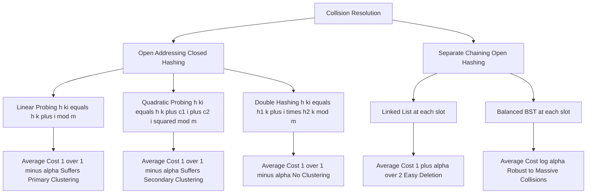
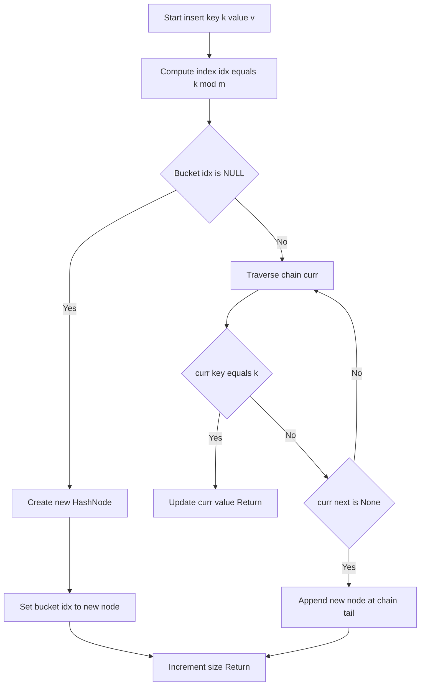
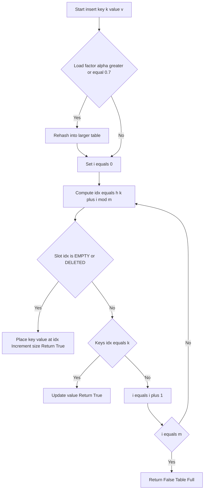
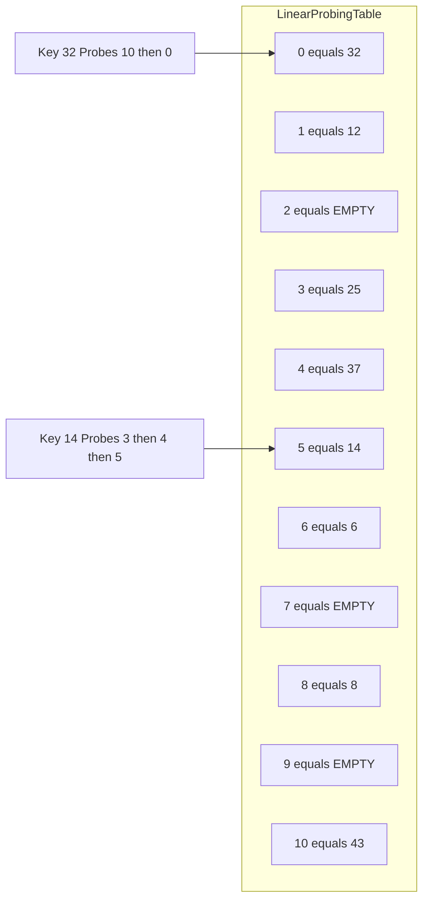

# Hash table collision resolution

<!-- SECTION_1_START -->
# 1. Core Technical Definition & Intuitive Overview

## 1.1 Formal Definition (KTU 2024 Syllabus Aligned)

A **hash table** is a randomized, addressable data structure that maps keys to values using a **hash function** $h(k)$ to compute an index into an array of $m$ slots (buckets), enabling **average-case $O(1)$** insertion, search, and deletion.

A **collision** is the event in which two distinct keys $k_1 \neq k_2$ produce the same hash index, i.e.

$$
h(k_1) = h(k_2) \quad \text{where} \quad k_1 \neq k_2
$$

**Collision resolution** refers to the deterministic algorithmic policy used to store and retrieve both keys when such index clashes occur, guaranteeing correct, complete data access.

> [!IMPORTANT]
> **KTU Board Definition (Verbatim expected in exams):**
> A *hash function* is a deterministic mathematical function $h: U \rightarrow \{0, 1, \dots, m-1\}$ that transforms a key into a slot index in constant time. *Collision resolution* is the set of rules used to handle the situation when $h(k_1) = h(k_2)$ for $k_1 \neq k_2$.

## 1.2 Conceptual Analogy: The Hotel Room Assignment System

Imagine a 11-room hotel (the hash table) that uses a strict formula to assign rooms: **Room = Guest ID $\boldsymbol{\mod}$ 11** (the hash function).

- Guest 25 gets room 3.
- Guest 37 gets room 4.
- Now Guest 14 arrives, and the formula says room 3 — but **Guest 25 is already there!**

This is a **collision**. How does the front-desk manager (the collision resolution algorithm) handle it?

- **Separate Chaining (Linked List):** Build a *second floor* above room 3. Guest 25 stays in the base room, and Guest 14 moves to the floor above.
- **Linear Probing:** Skip to room 4 (occupied), then room 5 (empty) — put Guest 14 there. Next time someone collides, just keep walking down the corridor.
- **Quadratic Probing:** Walk in *expanding steps* — 1 step, then 4 steps, then 9 steps — to scatter guests more evenly.
- **Double Hashing:** Use a *second formula* to determine the step size based on the guest's ID, avoiding long clusters.

## 1.3 GeoGebra / Desmos Visualization

> [!VISUALIZATION CONTROL]
> **Concept:** Index Mapping & Probe Sequence Visualizer
> **GeoGebra / Desmos Input Equations:**
> * $f(x) = \mathrm{mod}(x, 11)$ — Map any integer key to a slot
> * $p(k, i) = \mathrm{mod}(k + i, 11)$ — Linear probing sequence
> * $q(k, i) = \mathrm{mod}(k + 0 \cdot i + 1 \cdot i^{2}, 11)$ — Quadratic probing sequence
> * $d(k, i) = \mathrm{mod}(k + i \cdot (1 + \mathrm{mod}(k, 10)), 11)$ — Double hashing
> **Visual Description:** Each function produces a step-like saw-tooth plot. The $x$-axis is the key $k$, the $y$-axis is the destination slot. Multiple $i$-values stack vertically to visualize the *probe trail* of a colliding key.

## 1.4 Primary vs Secondary Clustering — The Critical Distinction

| Phenomenon | Definition | Caused By |
|---|---|---|
| **Primary Clustering** | Long contiguous runs of occupied slots | Linear probing |
| **Secondary Clustering** | Keys hashing to the same base slot follow identical probe sequences | Quadratic probing |
| **No Clustering** | Each key has a unique probe sequence | Double hashing (with good $h_2$) |

<!-- SECTION_1_END -->

<!-- SECTION_2_START -->
# 2. Deep Theoretical Analysis & KTU High-Yield Formula Sheet

## 2.1 Properties of a "Good" Hash Function (Board Favourite)

A production-grade hash function $h(k)$ must satisfy **four mandatory invariants**:

1. **Determinism:** $h(k)$ must return the *exact same index* for the *exact same key* every time.
2. **Uniform Distribution:** Keys must spread *uniformly* across all $m$ slots, minimizing collisions.
3. **Efficiency:** $h(k)$ must be computable in $O(1)$ time.
4. **Avalanche Effect:** A 1-bit change in $k$ should ideally change *at least half* the bits of $h(k)$ (a property of cryptographic hashes).

> [!NOTE]
> **KTU Common Trap:** Students often confuse *hash function quality* with *collision resolution strategy*. The hash function *minimizes* the probability of collision; the resolution technique *guarantees correctness* when one occurs.

## 2.2 The Two Master Strategies

### Strategy A — Separate Chaining (Open Hashing)
Each slot stores a pointer to a linked list (or balanced BST). All colliding keys are chained together.

### Strategy B — Open Addressing (Closed Hashing)
All keys live *inside the array itself*. On collision, the algorithm **probes** alternative empty slots according to a deterministic rule.

## 2.3 KTU Formula Sheet / Cheat Sheet

| Parameter / Formula | Symbol / Expression | Notes |
|---|---|---|
| Division Method | $h(k) = k \bmod m$ | Choose $m$ as a **prime** not close to a power of 2 |
| Multiplication Method | $h(k) = \lfloor m \cdot (k \cdot A \bmod 1) \rfloor$ | Knuth recommends $A = (\sqrt{5} - 1) / 2 \approx 0.618$ |
| Load Factor | $\alpha = n / m$ | $n$ = stored keys, $m$ = table size |
| Linear Probing | $h(k, i) = (h(k) + i) \bmod m$ | Suffers primary clustering |
| Quadratic Probing | $h(k, i) = (h(k) + c_1 i + c_2 i^{2}) \bmod m$ | $c_1, c_2$ are small constants; $c_1 = c_2 = 0.5$ is common |
| Double Hashing | $h(k, i) = (h_1(k) + i \cdot h_2(k)) \bmod m$ | $h_2(k) \neq 0$ guaranteed |
| Avg. Successful Search (Chaining) | $O(1 + \alpha / 2)$ | If $\alpha \approx 1$, cost $\approx 1.5$ probes |
| Avg. Unsuccessful Search (Chaining) | $O(1 + \alpha)$ | |
| Avg. Successful Search (Open Addr.) | $O(\tfrac{1}{2} \cdot \tfrac{1}{1 - \alpha})$ | |
| Avg. Unsuccessful Search (Open Addr.) | $O(\tfrac{1}{1 - \alpha})$ | $\alpha \to 1$ causes blowup |
| Worst-Case Search (All Methods) | $O(n)$ | When all keys collide at one slot |

> [!WARNING]
> The expressions $\frac{1}{1 - \alpha}$ and $\frac{1}{2} \cdot \frac{1}{1 - \alpha}$ are the **expected number of probes**, not the array index. Do *not* mark them as slot numbers in exam diagrams.

## 2.4 Real-World Engineering Utility

- **Database Indexing:** PostgreSQL and MySQL use hash indexes for equality lookups (`SELECT * FROM users WHERE id = 42`).
- **Compiler Symbol Tables:** Variable names are hashed for O(1) declaration lookup.
- **Caching Layers:** Memcached and Redis use chaining or open addressing to map cache keys to memory blocks.
- **Cryptographic Ledgers:** Blockchain uses *cryptographic* hash functions (SHA-256) for collision-resistant block identifiers.
- **Network Routers:** Longest-prefix matching uses hash tables on prefix lengths to accelerate packet forwarding.
- **Git Internals:** Object storage uses SHA-1 hashes of file content as keys.

<!-- SECTION_2_END -->

<!-- SECTION_3_START -->
# 3. Step-by-Step Derivations, Walkthroughs & Code Implementation

## 3.1 Complete Python Implementation — Separate Chaining

```python
"""
Separate Chaining Hash Table — KTU Lab Reference Implementation
Course: PCCSL306 — Data Structures & Algorithms Lab
Module: 2 (Hashing)
"""
from __future__ import annotations
from typing import Any, List, Optional


class HashNode:
    """One node of the chain at a single bucket."""

    def __init__(self, key: int, value: Any) -> None:
        self.key: int = key
        self.value: Any = value
        self.next: Optional["HashNode"] = None


class SeparateChainingHashTable:
    """Hash table that uses a linked list at every slot."""

    def __init__(self, capacity: int = 11) -> None:
        if capacity <= 1:
            raise ValueError("Capacity must be greater than 1.")
        self.capacity: int = capacity
        self.size: int = 0
        self.buckets: List[Optional[HashNode]] = [None] * capacity
        self.probe_counter: int = 0  # tracks probes for analysis

    # ---------- Core helpers ----------
    def _hash(self, key: int) -> int:
        """Primary hash function using the division method."""
        if not isinstance(key, int):
            raise TypeError("Only integer keys are supported by this lab build.")
        return key % self.capacity

    def load_factor(self) -> float:
        return self.size / self.capacity

    # ---------- Primitive operations ----------
    def insert(self, key: int, value: Any) -> None:
        """Insert (key, value) or update value if key already exists."""
        idx = self._hash(key)
        curr = self.buckets[idx]
        while curr is not None:
            if curr.key == key:                # update existing
                curr.value = value
                return
            curr = curr.next
        # Insert new node at head — O(1) prepend
        new_node = HashNode(key, value)
        new_node.next = self.buckets[idx]
        self.buckets[idx] = new_node
        self.size += 1

    def search(self, key: int) -> Optional[Any]:
        """Return value for key, or None if not present."""
        self.probe_counter = 0
        idx = self._hash(key)
        curr = self.buckets[idx]
        while curr is not None:
            self.probe_counter += 1
            if curr.key == key:
                return curr.value
            curr = curr.next
        return None

    def delete(self, key: int) -> bool:
        """Remove the node carrying key. Return True on success."""
        idx = self._hash(key)
        curr = self.buckets[idx]
        prev: Optional[HashNode] = None
        while curr is not None:
            if curr.key == key:
                if prev is None:                # head of chain
                    self.buckets[idx] = curr.next
                else:
                    prev.next = curr.next
                self.size -= 1
                return True
            prev = curr
            curr = curr.next
        return False

    def display(self) -> None:
        """Pretty-print the hash table for the lab record."""
        print(f"\n  --- Separate Chaining | n={self.size}, m={self.capacity}, "
              f"alpha={self.load_factor():.2f} ---")
        for i in range(self.capacity):
            chain: List[str] = []
            curr = self.buckets[i]
            while curr is not None:
                chain.append(f"{curr.key}:{curr.value}")
                curr = curr.next
            print(f"  [{i:2d}] " + (" -> ".join(chain) if chain else "NULL"))
```

## 3.2 Complete Python Implementation — Open Addressing (Linear / Quadratic / Double)

```python
"""
Open Addressing Hash Table — Supports Linear, Quadratic, and Double Hashing
Course: PCCSL306 — Data Structures & Algorithms Lab
"""
from __future__ import annotations
from typing import Any, List, Optional, Literal


class OpenAddressingHashTable:
    """
    Unified implementation of Open Addressing with three probing strategies.
    Uses two sentinels: EMPTY (never used) and DELETED (tombstone).
    """

    EMPTY: Any = "__EMPTY__"
    DELETED: Any = "__DELETED__"

    def __init__(
        self,
        capacity: int = 11,
        method: Literal["linear", "quadratic", "double"] = "linear",
        c1: float = 0.5,
        c2: float = 0.5,
    ) -> None:
        if method not in ("linear", "quadratic", "double"):
            raise ValueError("method must be linear | quadratic | double")
        if capacity <= 1:
            raise ValueError("capacity must be > 1")
        self.capacity: int = capacity
        self.size: int = 0
        self.method: str = method
        self.c1: float = c1
        self.c2: float = c2
        self.keys: List[Any] = [self.EMPTY] * capacity
        self.vals: List[Any] = [None] * capacity

    # ---------- Hash functions ----------
    def _h1(self, key: int) -> int:
        return key % self.capacity

    def _h2(self, key: int) -> int:
        """Secondary hash for double hashing — must NEVER return 0."""
        return 1 + (key % (self.capacity - 1))

    def _probe(self, key: int, i: int) -> int:
        """Return the slot index for the i-th probe of key."""
        if self.method == "linear":
            return (self._h1(key) + i) % self.capacity
        if self.method == "quadratic":
            return (self._h1(key) + int(self.c1 * i) + int(self.c2 * i * i)) % self.capacity
        # double hashing
        return (self._h1(key) + i * self._h2(key)) % self.capacity

    def load_factor(self) -> float:
        return self.size / self.capacity

    # ---------- Primitive operations ----------
    def insert(self, key: int, value: Any) -> bool:
        if self.load_factor() >= 0.7:                # auto-rehash to keep alpha small
            self._rehash()
        first_tombstone: int = -1
        for i in range(self.capacity):
            idx = self._probe(key, i)
            if self.keys[idx] is self.EMPTY:
                # Empty slot found
                if first_tombstone != -1:
                    idx = first_tombstone
                self.keys[idx] = key
                self.vals[idx] = value
                self.size += 1
                return True
            if self.keys[idx] is self.DELETED:
                if first_tombstone == -1:
                    first_tombstone = idx
            elif self.keys[idx] == key:              # update existing
                self.vals[idx] = value
                return True
        return False                                  # table genuinely full

    def search(self, key: int) -> Optional[Any]:
        for i in range(self.capacity):
            idx = self._probe(key, i)
            if self.keys[idx] is self.EMPTY:
                return None                            # key cannot exist beyond this
            if self.keys[idx] != self.DELETED and self.keys[idx] == key:
                return self.vals[idx]
        return None

    def delete(self, key: int) -> bool:
        for i in range(self.capacity):
            idx = self._probe(key, i)
            if self.keys[idx] is self.EMPTY:
                return False
            if self.keys[idx] != self.DELETED and self.keys[idx] == key:
                self.keys[idx] = self.DELETED          # lazy deletion / tombstone
                self.vals[idx] = None
                self.size -= 1
                return True
        return False

    def _rehash(self) -> None:
        old_keys = self.keys[:]
        old_vals = self.vals[:]
        self.capacity = self.capacity * 2 + 1
        self.keys = [self.EMPTY] * self.capacity
        self.vals = [None] * self.capacity
        self.size = 0
        for k, v in zip(old_keys, old_vals):
            if k is not self.EMPTY and k is not self.DELETED:
                self.insert(k, v)

    def display(self) -> None:
        print(f"\n  --- {self.method.title()} Probing | n={self.size}, "
              f"m={self.capacity}, alpha={self.load_factor():2f} ---")
        for i in range(self.capacity):
            k = self.keys[i]
            if k is self.EMPTY:
                state = "EMPTY"
            elif k is self.DELETED:
                state = "DELETED"
            else:
                state = f"{k}:{self.vals[i]}"
            print(f"  [{i:2d}] {state}")
```

## 3.3 Driver Program & Complete Worked Example

The following driver traces the insertion of the keys $\{25, 37, 43, 14, 6, 32, 12, 8\}$ into a table of size 11 using $h(k) = k \bmod 11$.

```python
def demo() -> None:
    keys = [25, 37, 43, 14, 6, 32, 12, 8]

    # --- (1) Separate Chaining ---
    sc = SeparateChainingHashTable(capacity=11)
    for k in keys:
        sc.insert(k, k * 10)            # value = key * 10 just for visualisation
    sc.display()

    # --- (2) Linear Probing ---
    lp = OpenAddressingHashTable(capacity=11, method="linear")
    for k in keys:
        lp.insert(k, k * 10)
    lp.display()

    # --- (3) Quadratic Probing (c1 = 0, c2 = 1) ---
    qp = OpenAddressingHashTable(capacity=11, method="quadratic", c1=0, c2=1)
    for k in keys:
        qp.insert(k, k * 10)
    qp.display()

    # --- (4) Double Hashing ---
    dh = OpenAddressingHashTable(capacity=11, method="double")
    for k in keys:
        dh.insert(k, k * 10)
    dh.display()


if __name__ == "__main__":
    demo()
```

### 3.4 Step-by-Step Trace (Linear Probing)

For each key $k$ we compute $h(k) = k \bmod 11$ and then probe $(h(k) + i) \bmod 11$ until an empty slot is found.

| Step | Key $k$ | $h(k) = k \bmod 11$ | Probe Sequence | Slot Occupied | Action |
|---|---|---|---|---|---|
| 1 | 25 | 3 | $\{3\}$ | 3 free | Place at **3** |
| 2 | 37 | 4 | $\{4\}$ | 4 free | Place at **4** |
| 3 | 43 | 10 | $\{10\}$ | 10 free | Place at **10** |
| 4 | 14 | 3 | $\{3, 4, 5\}$ | 3 taken, 4 taken, 5 free | Place at **5** (1st collision) |
| 5 | 6  | 6 | $\{6\}$ | 6 free | Place at **6** |
| 6 | 32 | 10 | $\{10, 0\}$ | 10 taken, 0 free | Place at **0** (2nd collision) |
| 7 | 12 | 1 | $\{1\}$ | 1 free | Place at **1** |
| 8 | 8  | 8 | $\{8\}$ | 8 free | Place at **8** |

**Final Linear Probing Table (m = 11):**

$$
\begin{aligned}
\text{Index:} \quad & 0 \to 32,\; 1 \to 12,\; 2 \to \text{EMPTY},\; 3 \to 25,\; 4 \to 37,\; 5 \to 14, \\
& 6 \to 6,\; 7 \to \text{EMPTY},\; 8 \to 8,\; 9 \to \text{EMPTY},\; 10 \to 43
\end{aligned}
$$

Total probes required: $1+1+1+3+1+2+1+1 = 11$. Load factor $\alpha = 8/11 \approx 0.73$.

### 3.5 Search Operation — Worked Example

Query: search(32) in the linear probing table built above.

- $i = 0$: probe index $(10 + 0) \bmod 11 = 10$. Slot 10 holds 43, not 32. Continue.
- $i = 1$: probe index $(10 + 1) \bmod 11 = 0$. Slot 0 holds **32** ✓. **Return 320** (value).

Number of probes = **2** (consistent with the "2 probes" required during insertion).

### 3.6 Delete Operation — Why Tombstones Are Mandatory

A naïve delete that *empties* the slot would break the probe sequence, causing subsequent searches to fail. For example, deleting 43 from the table above by setting slot 10 to EMPTY would make `search(32)` stop at slot 10 and incorrectly return "not found" because slot 0 is no longer reachable from the probe chain. The tombstone (`DELETED`) sentinel preserves the probe path while marking the slot reusable.

<!-- SECTION_3_END -->

<!-- SECTION_4_START -->
# 4. Structural Diagrams & Schematics

## 4.1 Diagram 1 — Master Taxonomy of Collision Resolution



## 4.2 Diagram 2 — Insertion Flow for Separate Chaining



## 4.3 Diagram 3 — Insertion Flow for Linear Probing (Open Addressing)



## 4.4 Diagram 4 — Sequential Processing Topology for the Worked Example



<!-- SECTION_5_START -->
# 5. KTU 2024 Scheme Examination Question Bank & Topic Recap

## 5.1 Part A — Short Answer Questions (3 Marks Each)

### Question 1 (3 Marks) `[KTU University Exam – July 2024]`
**Define a hash function. List any four properties of a good hash function.**

**Model Answer:**
A hash function $h(k)$ is a deterministic mathematical function that maps a key $k$ from the universe $U$ to an integer index in the range $[0, m - 1]$ of the hash table.

> [!IMPORTANT]
> Four mandatory properties of a good hash function:
> 1. **Deterministic:** The same key must always produce the same index.
> 2. **Uniform Distribution:** It must scatter keys uniformly across all $m$ slots.
> 3. **Efficient Computation:** It must be computable in $O(1)$ time.
> 4. **Minimization of Collisions:** It must minimise the probability that distinct keys map to the same index.

**Mark Allocation:** [Definition: 1 Mark] [Any 4 properties × ½ Mark = 2 Marks] = **3 Marks**

---

### Question 2 (3 Marks) `[KTU University Exam – Dec 2023]`
**What is a collision? Distinguish between primary and secondary clustering.**

**Model Answer:**
A **collision** occurs when two distinct keys $k_1 \neq k_2$ hash to the same index, i.e. $h(k_1) = h(k_2)$.

- **Primary clustering:** Long, contiguous runs of occupied slots caused by linear probing. Every key that lands *anywhere* inside a cluster must traverse the entire cluster, degrading performance.
- **Secondary clustering:** Keys that share the same *initial* hash index also share the *same probe sequence* under quadratic probing. It is less severe than primary clustering but still degrades performance for related keys.

**Mark Allocation:** [Collision definition: 1 Mark] [Primary clustering: 1 Mark] [Secondary clustering: 1 Mark] = **3 Marks**

---

## 5.2 Part B — 14-Mark Descriptive Questions (Internal Choice)

### Question A (14 Marks) `[KTU University Exam – July 2024]` — **Choice 1**

**(a)** Explain the **separate chaining** method of collision resolution. Discuss its advantages and disadvantages. **(7 Marks — Bloom: Understand)**

**Model Answer:**

Separate chaining maintains an array of $m$ buckets, where each bucket is the head pointer of a *linked list* (or any secondary container). When a new key $k$ hashes to index $i = h(k)$, the algorithm walks the chain at bucket $i$:

- If $k$ is found, the value is updated.
- If the chain ends without finding $k$, the new node is appended (or prepended) to the chain.

**Advantages:**
1. Deletion is trivial — unlink the node from the chain.
2. The load factor $\alpha$ can exceed 1; the table is never "genuinely full" as long as memory is available.
3. Performance is less sensitive to a poor hash function.

**Disadvantages:**
1. Wastes memory due to pointer overhead per node.
2. Cache performance is poor because the chain can be scattered across non-contiguous memory.
3. Worst-case search degrades to $O(n)$ if all keys hash to one bucket.

**Mark Allocation:** [Mechanism description: 3 Marks] [Advantages: 2 Marks] [Disadvantages: 2 Marks] = **7 Marks**

**(b)** Given keys $\{25, 37, 43, 14, 6, 32, 12, 8\}$ and hash function $h(k) = k \bmod 11$, construct the hash table using **separate chaining**. Compute the number of collisions and the final load factor. **(7 Marks — Bloom: Apply)**

**Model Answer:**

| Step | Key $k$ | $h(k) = k \bmod 11$ | Bucket State After Insertion | Collision? |
|---|---|---|---|---|
| 1 | 25 | 3 | `3: 25` | No |
| 2 | 37 | 4 | `4: 37` | No |
| 3 | 43 | 10 | `10: 43` | No |
| 4 | 14 | 3 | `3: 14 → 25` | **Yes** |
| 5 | 6  | 6 | `6: 6` | No |
| 6 | 32 | 10 | `10: 32 → 43` | **Yes** |
| 7 | 12 | 1 | `1: 12` | No |
| 8 | 8  | 8 | `8: 8` | No |

**Final Separate Chaining Table:**

$$
\begin{aligned}
&[0] \to \text{NULL} \quad [1] \to 12 \quad [2] \to \text{NULL} \quad [3] \to 14 \to 25 \\
&[4] \to 37 \quad [5] \to \text{NULL} \quad [6] \to 6 \quad [7] \to \text{NULL} \\
&[8] \to 8 \quad [9] \to \text{NULL} \quad [10] \to 32 \to 43
\end{aligned}
$$

**Collisions:** 2 (keys 14 and 32).
**Load Factor:** $\alpha = n / m = 8 / 11 \approx 0.727$.

**Mark Allocation:** [Step-by-step trace table: 4 Marks] [Final table: 2 Marks] [Collisions + load factor: 1 Mark] = **7 Marks**

---

### Question B (14 Marks) `[KTU University Exam – Dec 2024]` — **Choice 2**

**(a)** Compare **linear probing**, **quadratic probing**, and **double hashing** with respect to probe sequence formula, clustering behaviour, and average search cost. **(7 Marks — Bloom: Understand)**

**Model Answer:**

| Feature | Linear Probing | Quadratic Probing | Double Hashing |
|---|---|---|---|
| **Probe Formula** | $h(k, i) = (h(k) + i) \bmod m$ | $h(k, i) = (h(k) + c_1 i + c_2 i^{2}) \bmod m$ | $h(k, i) = (h_1(k) + i \cdot h_2(k)) \bmod m$ |
| **Clustering Type** | **Primary** clustering | **Secondary** clustering | No clustering (with good $h_2$) |
| **Avg. Successful Search** | $\frac{1}{2} \cdot \frac{1}{1 - \alpha}$ | $\frac{1}{2} \cdot \frac{1}{1 - \alpha}$ | $\frac{1}{2} \cdot \frac{1}{1 - \alpha}$ |
| **Avg. Unsuccessful Search** | $\frac{1}{1 - \alpha}$ | $\frac{1}{1 - \alpha}$ | $\frac{1}{1 - \alpha}$ |
| **Cache Friendliness** | Best (sequential access) | Medium | Worst (randomised jumps) |
| **Deletion Difficulty** | Hard (tombstones required) | Hard (tombstones required) | Hard (tombstones required) |
| **Implementation Complexity** | Trivial | Medium (tune $c_1, c_2$) | High (need two hash funcs) |

**Conclusion:** Double hashing provides the *best worst-case* behaviour, but linear probing is the *fastest in practice* on modern hardware due to cache locality.

**Mark Allocation:** [Table of comparison: 5 Marks] [Justified conclusion: 2 Marks] = **7 Marks**

**(b)** For the same key set $\{25, 37, 43, 14, 6, 32, 12, 8\}$ and $h(k) = k \bmod 11$, construct the hash table using **linear probing** and verify the result by performing `search(32)`. **(7 Marks — Bloom: Apply)**

**Model Answer:**

**Insertion Trace:**

| Step | Key | $h(k)$ | Probe Sequence | Final Slot |
|---|---|---|---|---|
| 1 | 25 | 3 | 3 | **3** |
| 2 | 37 | 4 | 4 | **4** |
| 3 | 43 | 10 | 10 | **10** |
| 4 | 14 | 3 | 3, 4, 5 | **5** (1st collision) |
| 5 | 6  | 6 | 6 | **6** |
| 6 | 32 | 10 | 10, 0 | **0** (2nd collision) |
| 7 | 12 | 1 | 1 | **1** |
| 8 | 8  | 8 | 8 | **8** |

**Final Linear Probing Table:**

$$
\begin{aligned}
&[0] \to 32 \quad [1] \to 12 \quad [2] \to \text{EMPTY} \quad [3] \to 25 \quad [4] \to 37 \quad [5] \to 14 \\
&[6] \to 6 \quad [7] \to \text{EMPTY} \quad [8] \to 8 \quad [9] \to \text{EMPTY} \quad [10] \to 43
\end{aligned}
$$

**Verification — `search(32)`:**
1. $i = 0$: probe index $(10 + 0) \bmod 11 = 10$. Contains 43 ≠ 32. Continue.
2. $i = 1$: probe index $(10 + 1) \bmod 11 = 0$. Contains **32** ✓. **Return 320.**

**Number of probes for search(32) = 2.**

**Mark Allocation:** [Insertion trace table: 4 Marks] [Final table: 2 Marks] [Search verification with probe count: 1 Mark] = **7 Marks**

---

## 5.3 KTU Examiner's Valuation Warning / Pitfall Callout

> [!WARNING]
> **Where students lose marks in Hash Table questions:**
> 1. **Forgetting to state the hash function explicitly** in the answer — always write $h(k) = k \bmod 11$ before the trace table.
> 2. **Confusing $h(k)$ with the probe index** — $h(k)$ is the *initial* index; the probe index adds $i$ for open addressing.
> 3. **Skipping the empty-slot check** — many students terminate the probe loop on the first match without checking for EMPTY (which signals "key not present").
> 4. **Naïve deletion in open addressing** — removing a key by setting the slot to EMPTY *breaks* subsequent searches. Always use a **tombstone / DELETED sentinel**.
> 5. **Not computing the load factor** — examiners often allocate a dedicated mark for $\alpha = n / m$.
> 6. **Mixing up primary and secondary clustering** — primary = contiguous runs (linear); secondary = same probe sequence (quadratic).

---

## 5.4 Topic Recap & Important Things to Remember

- **Hash Table:** Array of $m$ slots indexed by $h(k)$, providing average-case $O(1)$ access.
- **Collision:** $h(k_1) = h(k_2)$ for $k_1 \neq k_2$.
- **Load Factor:** $\alpha = n / m$; keep $\alpha < 0.7$ for open addressing to avoid performance blowup.
- **Separate Chaining:** Linked list at every slot; deletion is easy; $\alpha$ may exceed 1.
- **Open Addressing:** All keys live in the array; three variants — **Linear**, **Quadratic**, **Double**.
- **Linear Probing:** $h(k, i) = (h(k) + i) \bmod m$ — suffers **primary clustering**.
- **Quadratic Probing:** $h(k, i) = (h(k) + c_1 i + c_2 i^{2}) \bmod m$ — suffers **secondary clustering**.
- **Double Hashing:** $h(k, i) = (h_1(k) + i \cdot h_2(k)) \bmod m$ — $h_2(k)$ must never return 0; eliminates clustering.
- **Tombstone / DELETED Sentinel:** Mandatory for deletion in open addressing to preserve probe chains.
- **Average Successful Search Cost (Open Addr.):** $\frac{1}{2} \cdot \frac{1}{1 - \alpha}$.
- **Average Unsuccessful Search Cost (Open Addr.):** $\frac{1}{1 - \alpha}$.
- **Division Method:** $h(k) = k \bmod m$ — always prefer $m$ to be a prime number.
- **Multiplication Method:** $h(k) = \lfloor m \cdot (k \cdot A \bmod 1) \rfloor$ with Knuth's $A = (\sqrt{5} - 1)/2$.
- **Real-World Deployments:** PostgreSQL indexes, Memcached, Git object storage, compiler symbol tables.
- **Auto-Rehash Trigger:** When $\alpha \geq 0.7$ in open addressing, double the table capacity to maintain performance.
- **KTU Viva Favourite:** "Why is open addressing faster than chaining in practice?" — Answer: **Cache locality**; linear probing does sequential memory access, exploiting hardware prefetchers.

<!-- SECTION_5_END -->
