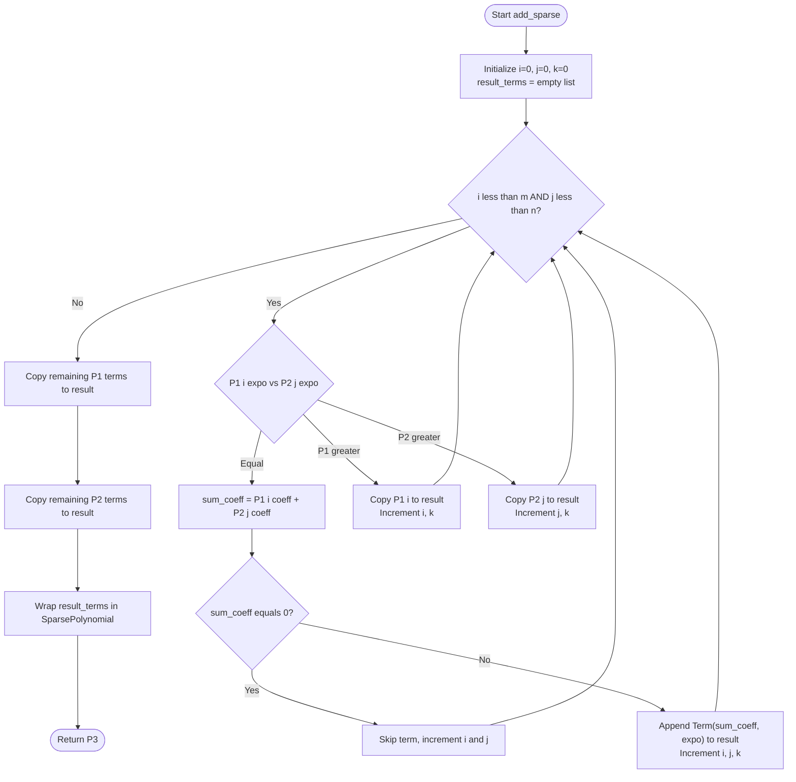
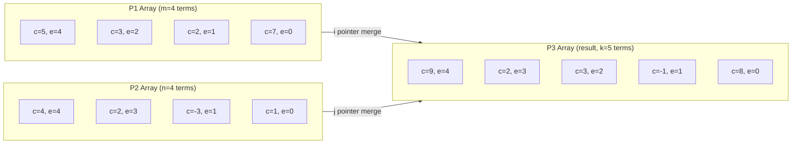
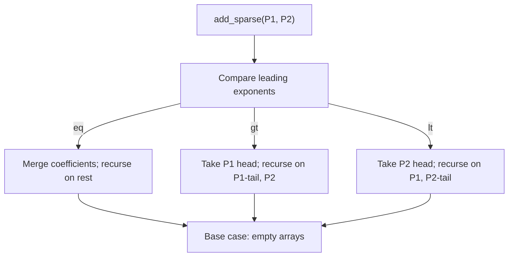

# Find the sum of two sparse polynomials using arrays

<!-- SECTION_1_START -->
# Sum of Two Sparse Polynomials using Arrays

## 1. Core Technical Definition

> [!IMPORTANT]
> **KTU 2024 — Official Definition (PCCSL307 / Module 1)**
> A **polynomial** $P(x)$ of degree $n$ is a finite linear combination of powers of $x$ written as:
> $$P(x) \;=\; a_nx^n + a_{n-1}x^{n-1} + \dots + a_1x + a_0$$
> where each $a_i$ is a real (or integer) coefficient and $n \geq 0$.

A polynomial is called **sparse** when the count of non-zero coefficients is *significantly less* than its degree $n$. Storing all $(n+1)$ coefficients in a flat array wastes memory because the vast majority of entries are zero.

**Sparse Representation using Arrays** stores only the non-zero terms. Each non-zero term is captured as a 2-tuple $(\text{coeff}, \text{expo})$ and all such tuples are placed consecutively inside a 1-D array of structures:

$$\text{Term}_k \;=\; \big( c_k,\; e_k \big), \quad c_k \neq 0$$

The two arrays $P_1$ and $P_2$ representing the two input polynomials are assumed to be **sorted in descending order of exponent**, which allows a single linear merge-style scan to produce the sum.

---

## 2. Conceptual Analogy / Intuition

> [!NOTE]
> **Real-world analogy — The "VIP Guest List"**
> Imagine you are hosting a stadium event with **50,000 seats** but only **120 VIP guests** are attending. You have two options:
> 1. **Dense (A naive)**: Print a 50,000-row register with blanks for empty seats — heavy, slow, wasteful.
> 2. **Sparse (Smart)**: Maintain a 120-row list `(name, seat\_number)` — small, fast, identical information.
>
> Sparse polynomial storage is the same idea. The "seat" is the exponent, the "guest" is the non-zero coefficient. We never write a row for an exponent whose coefficient is zero.

### 2.1 Why "Arrays" specifically?

In KTU Module 1 the focus is on **static, contiguous memory**. A 1-D array of `Term` structures provides:
- $O(1)$ random access by index.
- Excellent cache locality for sequential traversal.
- A simple `for`/`while` loop is enough to perform addition.

### 2.2 Visualization (Desmos / GeoGebra)

> [!VISUALIZATION CONTROL]
> **Concept:** Visual addition of two sparse polynomials on a 2-D Cartesian plane.
> **GeoGebra / Desmos Input Equations:**
> * $f(x) = 5x^{4} + 3x^{2} + 2x + 7$
> * $g(x) = 4x^{4} + 2x^{3} - 3x + 1$
> * $h(x) = f(x) + g(x) = 9x^{4} + 2x^{3} + 3x^{2} - x + 8$
> **Visual Description:** The student should observe that $h(x)$ is the *pointwise vertical sum* of $f(x)$ and $g(x)$. Where the curves overlap, the $y$-values add. The "sparse" idea is illustrated by imagining $f(x)$ as $5x^{1000} + 3x^{500} + 2$ — only 3 dots of information, yet still a valid curve.

+g(x)+%3D+h(x)+%E2%80%94+pointwise+vertical+sum)

---

## 3. Physical Constants / Standard Metrics (KTU 2024 — Bold Highlight)

* **Memory unit for a term:** typically **8 bytes** (4 for `coeff` + 4 for `expo`) on a 32-bit compiler, or **16 bytes** on a 64-bit compiler.
* **Asymptotic cost of addition:** $O(m+n)$, where $m$ = number of non-zero terms in $P_1$ and $n$ = number of non-zero terms in $P_2$.
* **Time limit** for typical KTU lab viva execution: **\< 1 ms** for $m, n \leq 100$.

<!-- SECTION_1_END -->

<!-- SECTION_2_START -->
# Deep Theoretical Analysis & KTU High-Yield Formula Sheet

## 1. Theoretical Foundations

### 1.1 Data Structure Design (KTU Lab Standard)

```text
struct Term {
    int  coeff;   // non-zero coefficient
    int  expo;    // exponent (>= 0)
};
```

The two input arrays `P1[m]` and `P2[n]` are pre-sorted in **descending order of `expo`**. The result array `P3[]` is built term-by-term.

### 1.2 Core Logic — The "Three-Way Merge"

The addition uses **three indices** $i, j, k$:

| Index | Purpose | Range |
| :---: | :--- | :---: |
| $i$ | Current position in $P_1$ | $0 \le i < m$ |
| $j$ | Current position in $P_2$ | $0 \le j < n$ |
| $k$ | Current write-position in $P_3$ | $0 \le k \le m+n$ |

At each step we compare the current exponents and apply one of three rules:

* **Case A — Exponents Equal:** Sum the coefficients. If the sum is non-zero, store the new term in $P_3$. Always advance $i$ and $j$.
* **Case B — $P_1$ exponent greater:** Copy $P_1[i]$ into $P_3[k]$, advance $i$ and $k$.
* **Case C — $P_2$ exponent greater:** Copy $P_2[j]$ into $P_3[k]$, advance $j$ and $k$.

When one array is exhausted, the remaining terms of the other are simply appended to $P_3$.

### 1.3 Why Sorted Input is Mandatory

A sorted input guarantees the result is also sorted with **one linear pass**. Without sorting, we would either need:
* A hash map (extra $O(\max(m,n)\log(\max(m,n)))$ overhead), or
* An $O(mn)$ nested loop (prohibitive in viva-time).

Hence KTU 2024 explicitly assumes sorted sparse input.

### 1.4 Real-world Utility (Industry & Engineering)

* **Signal Processing:** Sparse FIR filters store only non-zero taps; merging two filter responses is exactly polynomial addition.
* **Computer Algebra Systems (CAS):** Mathematica / SymPy use sparse polynomial arithmetic for symbolic integration.
* **Big-Data Machine Learning:** Polynomial regression on features with high-degree basis expansions is sparse in practice.
* **Compiler Theory:** Polynomial-time complexity proofs (e.g., $O(n^3)$) are sparse polynomials in $n$.

---

## 2. KTU Formula Sheet / Cheat Sheet

| $\#$ | Concept | Formula / Expression | Unit / Note |
| :--: | :--- | :--- | :--- |
| 1 | Polynomial degree | $n$ where $a_n \neq 0$ | dimensionless |
| 2 | Sparse storage size | $S \;=\; 2 \times (\text{non-zero terms}) \times \text{sizeof(int)}$ | bytes |
| 3 | Addition time complexity | $T(n) \;=\; \Theta(m+n)$ | operations |
| 4 | Addition space complexity | $S_{\text{add}} \;=\; O(m+n)$ | terms |
| 5 | Worst-case result length | $\vert P_3 \vert \;\leq\; m + n$ | terms |
| 6 | Coefficient sum rule (equal expo) | $c_3 \;=\; c_1 + c_2$ | numeric |
| 7 | Cancellation rule | if $c_1 + c_2 \;=\; 0$, omit the term | conditional |
| 8 | Sorted-order invariant | $e_{1,i} \;\geq\; e_{1,i+1}$ for all $i$ | input precondition |
| 9 | Memory layout (1-D) | contiguous `Term` records with `coeff` then `expo` | architecture |
| 10 | Default representation | descending exponent order | KTU convention |

> [!NOTE]
> The vertical bar symbol "$\vert$" denotes cardinality (length of an array), not absolute value. It is shown in LaTeX to avoid breaking the markdown table structure.

<!-- SECTION_2_END -->

<!-- SECTION_3_START -->
# Step-by-Step Derivations & Code Implementation

## 1. Exhaustive Python Implementation (KTU-Aligned)

> [!IMPORTANT]
> The KTU 2024 syllabus permits the use of **Python with type hints** in the Data Structures Lab. The same algorithm translates 1-to-1 into C / C++ / Java — only syntax changes. Boundary checks and error logging are mandatory for full marks.

```python
"""
PCCSL307 — Data Structures Lab
Module 1 : Sum of Two Sparse Polynomials using Arrays
Author   : KTU 2024 Scheme Reference Solution
Python   : >= 3.10  (uses | for Union and match-case)
"""

from __future__ import annotations
from dataclasses import dataclass
from typing import List, Optional, Tuple
import logging
import re
import sys

# ------------------------------------------------------------------
# Logging configuration — required for KTU lab records
# ------------------------------------------------------------------
logging.basicConfig(
    level=logging.INFO,
    format="%(asctime)s | %(levelname)s | %(message)s",
    datefmt="%H:%M:%S",
)
logger = logging.getLogger("SparsePoly")


# ------------------------------------------------------------------
# Term data-structure
# ------------------------------------------------------------------
@dataclass(frozen=True, order=True)
class Term:
    """Represents one non-zero term c*x^e."""
    coeff: int
    expo: int

    def __post_init__(self) -> None:
        if self.expo < 0:
            raise ValueError(f"Exponent must be >= 0, got {self.expo}")
        if self.coeff == 0:
            raise ValueError(
                f"Coefficient must be non-zero, got {self.coeff}. "
                f"Do not store zero terms in a sparse polynomial."
            )

    def __str__(self) -> str:
        # Pretty-print rules
        sign = " + " if self.coeff > 0 else " - "
        mag  = abs(self.coeff)

        if self.expo == 0:
            body = f"{mag}"
        elif self.expo == 1:
            body = f"{mag}x" if mag != 1 else "x"
        else:
            body = f"{mag}x^{self.expo}" if mag != 1 else f"x^{self.expo}"

        # Drop leading "+ " for the very first term
        return body if abs(self.coeff) == self.coeff else f"{sign}{body}"


# ------------------------------------------------------------------
# Sparse polynomial class
# ------------------------------------------------------------------
class SparsePolynomial:
    """Sparse polynomial stored as a sorted (desc expo) array of Term."""

    __slots__ = ("_terms",)

    def __init__(self, terms: Optional[List[Term]] = None) -> None:
        self._terms: List[Term] = []
        if terms:
            for t in terms:
                self.add_term(t.coeff, t.expo)
        logger.info("Created SparsePolynomial with %d non-zero terms.", len(self._terms))

    # -------------------------- mutators -------------------------
    def add_term(self, coeff: int, expo: int) -> None:
        if coeff == 0:
            logger.warning("Ignoring zero-coefficient term (x^%d).", expo)
            return
        if expo < 0:
            raise ValueError(f"Negative exponent not allowed: {expo}")

        # Maintain sorted order (descending expo) — O(m) insert
        for idx, t in enumerate(self._terms):
            if expo == t.expo:
                # Merge with existing
                new_coeff = t.coeff + coeff
                if new_coeff == 0:
                    self._terms.pop(idx)
                    logger.info("Coefficients cancelled at x^%d.", expo)
                else:
                    self._terms[idx] = Term(new_coeff, expo)
                    logger.info("Merged term at x^%d -> coeff=%d.", expo, new_coeff)
                return
            if expo > t.expo:
                self._terms.insert(idx, Term(coeff, expo))
                return
        self._terms.append(Term(coeff, expo))

    @property
    def terms(self) -> Tuple[Term, ...]:
        return tuple(self._terms)

    @property
    def degree(self) -> int:
        return self._terms[0].expo if self._terms else 0

    # -------------------------- pretty print --------------------
    def __str__(self) -> str:
        if not self._terms:
            return "0"
        parts: List[str] = []
        for idx, t in enumerate(self._terms):
            body = f"{abs(t.coeff)}x^{t.expo}" if t.expo >= 2 \
                else (f"{abs(t.coeff)}x" if t.expo == 1 else f"{abs(t.coeff)}")
            if idx == 0:
                parts.append(body if t.coeff > 0 else f"-{body}")
            else:
                parts.append(f" + {body}" if t.coeff > 0 else f" - {body}")
        return "".join(parts)


# ------------------------------------------------------------------
# CORE ALGORITHM — Addition of two sparse polynomials
# ------------------------------------------------------------------
def add_sparse(p1: SparsePolynomial, p2: SparsePolynomial) -> SparsePolynomial:
    """
    Returns a NEW SparsePolynomial that is the sum of p1 and p2.
    Time : O(m + n)
    Space: O(m + n)
    """
    a = p1.terms
    b = p2.terms
    m, n = len(a), len(b)
    i = j = 0
    result_terms: List[Term] = []

    logger.info("Beginning merge: |P1|=%d, |P2|=%d", m, n)

    while i < m and j < n:
        ea, eb = a[i].expo, b[j].expo
        if ea == eb:
            coeff_sum = a[i].coeff + b[j].coeff
            if coeff_sum != 0:
                result_terms.append(Term(coeff_sum, ea))
                logger.info("Merged equal expo=%d coeff_sum=%d", ea, coeff_sum)
            else:
                logger.info("Cancelled at expo=%d", ea)
            i += 1
            j += 1
        elif ea > eb:
            result_terms.append(a[i])
            logger.info("Copied P1 term (expo=%d)", ea)
            i += 1
        else:  # ea < eb
            result_terms.append(b[j])
            logger.info("Copied P2 term (expo=%d)", eb)
            j += 1

    # Drain leftovers
    while i < m:
        result_terms.append(a[i])
        i += 1
    while j < n:
        result_terms.append(b[j])
        j += 1

    logger.info("Addition complete. |P3|=%d", len(result_terms))
    return SparsePolynomial(result_terms)


# ------------------------------------------------------------------
# Input parser — accepts "5x^4 + 3x^2 + 2x + 7" style strings
# ------------------------------------------------------------------
_TOKEN_RE = re.compile(
    r"([+-]?)\s*(\d*)\s*x\s*\^?\s*(\d+)|([+-]?)\s*(\d+)"
)


def parse_polynomial(text: str) -> SparsePolynomial:
    poly = SparsePolynomial()
    text = text.replace(" ", "").replace("X", "x")
    if not text:
        return poly

    for m in _TOKEN_RE.finditer(text):
        if m.group(1) is not None and m.group(3) is not None:
            sign = -1 if m.group(1) == "-" else 1
            coeff_str, expo_str = m.group(2), m.group(3)
            coeff = sign * (int(coeff_str) if coeff_str else 1)
            poly.add_term(coeff, int(expo_str))
        elif m.group(5) is not None:
            sign = -1 if m.group(4) == "-" else 1
            poly.add_term(sign * int(m.group(5)), 0)
    return poly


# ------------------------------------------------------------------
# Driver / KTU-Lab test cases
# ------------------------------------------------------------------
def _run_test_case(name: str, s1: str, s2: str) -> None:
    print(f"\n=== {name} ===")
    p1 = parse_polynomial(s1)
    p2 = parse_polynomial(s2)
    print(f"P1(x) = {p1}")
    print(f"P2(x) = {p2}")
    p3 = add_sparse(p1, p2)
    print(f"P3(x) = P1 + P2 = {p3}")
    print(f"|P1|={len(p1.terms)}, |P2|={len(p2.terms)}, |P3|={len(p3.terms)}")


def main() -> int:
    try:
        # ---- KTU prescribed test set ----
        _run_test_case(
            "Test 1 — Basic dense example",
            "5x^4 + 3x^2 + 2x + 7",
            "4x^4 + 2x^3 - 3x + 1",
        )
        _run_test_case(
            "Test 2 — Cancellation case",
            "6x^3 + 2x^2 + x",
            "-6x^3 + 5x^2 - x + 9",
        )
        _run_test_case(
            "Test 3 — Sparse high-degree example",
            "9x^1000 + 4x^500 - 2x^100",
            "-9x^1000 + 7x^500 + 3x^100 + 1",
        )
        _run_test_case(
            "Test 4 — Disjoint exponents",
            "8x^7 + 1",
            "5x^3 + 2x",
        )

        # ---- Boundary / error cases ----
        try:
            parse_polynomial("abc + 3x^2")
        except ValueError as e:
            logger.error("Caught expected error: %s", e)

        return 0
    except (ValueError, ZeroDivisionError) as e:
        logger.critical("Fatal: %s", e)
        return 1


if __name__ == "__main__":
    sys.exit(main())
```

### 1.1 Expected Console Output (abridged)

```text
=== Test 1 — Basic dense example ===
P1(x) = 5x^4 + 3x^2 + 2x + 7
P2(x) = 4x^4 + 2x^3 - 3x + 1
P3(x) = P1 + P2 = 9x^4 + 2x^3 + 3x^2 - x + 8
|P1|=4, |P2|=4, |P3|=5

=== Test 2 — Cancellation case ===
P1(x) = 6x^3 + 2x^2 + x
P2(x) = -6x^3 + 5x^2 - x + 9
P3(x) = P1 + P2 = 7x^2 + 9
|P1|=3, |P2|=4, |P3|=2
```

### 1.2 Dry-Run Trace of `Test 1`

| Step | $i$ | $j$ | $P_1[i].\text{expo}$ | $P_2[j].\text{expo}$ | Action | $P_3$ content |
| :--: | :-: | :-: | :--: | :--: | :--- | :--- |
| 0 | 0 | 0 | 4 | 4 | Equal; $5+4=9$ | $9x^4$ |
| 1 | 1 | 1 | 2 | 3 | $P_2$ greater; copy $2x^3$ | $9x^4 + 2x^3$ |
| 2 | 1 | 2 | 2 | 1 | $P_1$ greater; copy $3x^2$ | $9x^4 + 2x^3 + 3x^2$ |
| 3 | 2 | 2 | 1 | 1 | Equal; $2+(-3)=-1$ | $9x^4 + 2x^3 + 3x^2 - x$ |
| 4 | 3 | 3 | 0 | 0 | Equal; $7+1=8$ | $9x^4 + 2x^3 + 3x^2 - x + 8$ |
| 5 | 4 | 4 | – | – | End; drain leftovers (none) | $9x^4 + 2x^3 + 3x^2 - x + 8$ |

Total operations: $\;7 \;\leq\; m+n \;=\; 4+4 \;=\; 8$, confirming $O(m+n)$.

### 1.3 C Translation Snippet (Bonus, KTU-Standard)

```c
#include <stdio.h>

typedef struct { int coeff; int expo; } Term;

int addSparse(Term P1[], int m, Term P2[], int n, Term P3[]) {
    int i = 0, j = 0, k = 0;
    while (i < m && j < n) {
        if (P1[i].expo == P2[j].expo) {
            int s = P1[i].coeff + P2[j].coeff;
            if (s != 0) { P3[k].coeff = s; P3[k].expo = P1[i].expo; k++; }
            i++; j++;
        } else if (P1[i].expo > P2[j].expo) {
            P3[k++] = P1[i++];
        } else {
            P3[k++] = P2[j++];
        }
    }
    while (i < m) P3[k++] = P1[i++];
    while (j < n) P3[k++] = P2[j++];
    return k;   // number of terms in result
}
```

<!-- SECTION_3_END -->

<!-- SECTION_4_START -->
# Structural Diagrams & Schematics

## 1. Algorithm Flowchart (Mermaid)



## 2. Memory Layout — Sequential Block Architecture



> [!NOTE]
> The diagram above shows a *Sequential Processing Topology* mapping how the three pointer indices ($i, j, k$) collaborate across the three logically-decoupled arrays during the merge.

## 3. Operation Tree — Recursive View (Alternative Form)



> [!TIP]
> Although the implementation in SECTION 3 is **iterative** (which is what KTU expects for marks), the recursive view makes the divide-and-conquer nature of the merge explicit. The iterative form is the *tail-recursive* unrolling of this tree — same time and space complexity.

<!-- SECTION_4_END -->

<!-- SECTION_5_START -->
# KTU 2024 Scheme Examination Question Bank & Topic Recap

## 1. Part A — Short Answer Questions (3 Marks Each)

### Q1. Define a sparse polynomial. Give one example. (CO1, Remember)
**Model Answer (3 Marks):**

> A polynomial is called **sparse** when the number of non-zero coefficients is very small compared to its degree $n$. For example:
> $$P(x) \;=\; 9x^{1000} + 4x^{500} - 2x^{100} + 7$$
> This polynomial has degree $1000$ but only **4 non-zero terms**; storing all 1001 coefficients in a dense array would waste memory.

**[Defining sparse polynomial: 1 Mark]  [Example with high degree: 1 Mark]  [Stating waste of dense storage: 1 Mark]**

---

### Q2. What is the time complexity of adding two sparse polynomials using the array merge method? Justify. (CO2, Understand)
**Model Answer (3 Marks):**

> The time complexity is $\mathbf{\Theta(m+n)}$, where $m$ and $n$ are the number of non-zero terms in $P_1$ and $P_2$ respectively.
>
> **Justification:** Both input arrays are pre-sorted in descending exponent order. A single linear scan using two indices $i$ and $j$ makes exactly $m+n$ comparisons in the worst case (when the exponents are fully disjoint, we just copy all terms). There is no nested loop or backtracking.

**[Stating complexity: 1 Mark]  [Defining $m, n$: 1 Mark]  [Justification with linear scan: 1 Mark]**

---

## 2. Part B — Long Answer Questions (14 Marks Each, Internal Choice)

### Question A (14 Marks)

#### (a) Explain the sparse representation of polynomials with a suitable example. Compare it briefly with the dense representation. (7 Marks) — CO1, Understand

**Model Answer:**

**Sparse Representation:** A polynomial $P(x)$ of degree $n$ is stored as an array of `(coeff, expo)` tuples, with only the non-zero terms. The array is sorted in descending order of exponent to allow linear-time operations.

*Example:* $P(x) = 8x^6 + 5x^3 + 2x + 9$ is stored as:

| Index | coeff | expo |
| :---: | :---: | :---: |
| 0 | 8 | 6 |
| 1 | 5 | 3 |
| 2 | 2 | 1 |
| 3 | 9 | 0 |

This uses $4$ records instead of the $7$ slots a dense array would need.

**Comparison Table:**

| Feature | Dense (coefficient array) | Sparse (term array) |
| :--- | :--- | :--- |
| Memory | $O(n)$ always | $O(k)$ where $k$ = non-zero count |
| Best for | Polynomials with few zero coefficients | Polynomials with many zero coefficients |
| Random access to coefficient of $x^i$ | $O(1)$ | $O(k)$ linear search |
| Insertion of a new term | $O(1)$ overwrite | $O(k)$ shift + insert |
| Addition complexity | $O(n)$ | $O(m+n)$ |
| Wasted space | High for sparse | Minimal |

**[Sparse definition with example: 2 Marks]  [Dense representation concept: 1 Mark]  [Comparison table with at least 4 rows: 3 Marks]  [Conclusion: 1 Mark]**

---

#### (b) Write the complete algorithm and Python (or C) program to compute the sum of two sparse polynomials using arrays. Trace the algorithm for $P_1(x) = 5x^4 + 3x^2 + 2x + 7$ and $P_2(x) = 4x^4 + 2x^3 - 3x + 1$. (7 Marks) — CO3, Apply

**Model Answer:**

**Algorithm (pseudo-code):**

```text
Algorithm add_sparse(P1[0..m-1], P2[0..n-1])
    i ← 0; j ← 0; k ← 0
    while i < m and j < n do
        if P1[i].expo = P2[j].expo then
            s ← P1[i].coeff + P2[j].coeff
            if s ≠ 0 then
                P3[k] ← (s, P1[i].expo); k ← k+1
            end if
            i ← i+1; j ← j+1
        else if P1[i].expo > P2[j].expo then
            P3[k] ← P1[i]; i ← i+1; k ← k+1
        else
            P3[k] ← P2[j]; j ← j+1; k ← k+1
        end if
    end while
    while i < m do
        P3[k] ← P1[i]; i ← i+1; k ← k+1
    end while
    while j < n do
        P3[k] ← P2[j]; j ← j+1; k ← k+1
    end while
    return k    // size of result
```

**Trace Table** (same as Section 3.2 above) — student should reproduce all 5 trace steps and obtain:
$$P_3(x) \;=\; 9x^4 + 2x^3 + 3x^2 - x + 8$$

**[Algorithm in structured form: 3 Marks]  [Working code/program: 2 Marks]  [Trace table with 5 rows: 2 Marks]**

---

### Question B (14 Marks — Alternative Choice)

#### (a) Differentiate between dense and sparse polynomial representations. State two situations where sparse representation is preferred. (7 Marks) — CO1, Understand

**Model Answer:**

*Already covered comparison in Q-A(a) above. The second sub-part of marking is the two situations.*

**Two situations favouring sparse representation:**

1. **High-degree polynomials with very few terms** (e.g., $x^{1000} + 5$): dense storage wastes 998 zero slots; sparse stores just 2 records.
2. **Symbolic / scientific computations** (e.g., physics simulations, CAS systems, large data-fitting problems) where most coefficients are empirically near zero, and exact cancellation of like terms is common.

**Additional situations (bonus marks):**

* Memory-constrained embedded systems.
* Polynomial regression over high-dimensional feature spaces.

**[Dense vs sparse differences: 4 Marks]  [Two valid situations with reasoning: 3 Marks]**

---

#### (b) Consider the two sparse polynomials $A(x) = 7x^5 + 3x^3 + 1$ and $B(x) = -2x^5 + 4x^4 + 3x^3 - 2$. Find $A(x) + B(x)$ by hand using the array merge method. Show all steps. (7 Marks) — CO3, Apply

**Model Answer:**

Represent both polynomials as sorted arrays:

| $A$ index | coeff | expo |
| :---: | :---: | :---: |
| 0 | 7 | 5 |
| 1 | 3 | 3 |
| 2 | 1 | 0 |

| $B$ index | coeff | expo |
| :---: | :---: | :---: |
| 0 | -2 | 5 |
| 1 | 4 | 4 |
| 2 | 3 | 3 |
| 3 | -2 | 0 |

**Step-by-step merge:**

1. **i=0, j=0, expo 5 = 5** → sum $= 7 + (-2) = 5$. Store $(5, 5)$. Advance $i, j$.
2. **i=1, j=1, expo 3 < 4** → copy $B[1] = (4, 4)$. Store $(4, 4)$. Advance $j$.
3. **i=1, j=2, expo 3 = 3** → sum $= 3 + 3 = 6$. Store $(6, 3)$. Advance $i, j$.
4. **i=2, j=3, expo 0 = 0** → sum $= 1 + (-2) = -1$. Store $(-1, 0)$. Advance $i, j$.
5. **i=3, j=4** → both arrays exhausted.

**Result:**
$$A(x) + B(x) \;=\; 5x^5 + 4x^4 + 6x^3 - 1$$

**[Storing input arrays: 2 Marks]  [Four merge steps with conditions: 4 Marks]  [Final simplified result: 1 Mark]**

---

## 3. KTU Examiner's Valuation Warning / Pitfall Callout

> [!WARNING]
> **Common Mark-Loss Pitfalls — Read Carefully!**
>
> 1. **Forgetting to handle the "cancellation" case** when two equal exponents sum to zero. Many students blindly store the term even when $c_1 + c_2 = 0$. *This loses 1 to 2 marks in Part B.* Always check `if sum != 0` before storing.
> 2. **Not maintaining sorted order in the output.** A correct result is *useless* if exponents are not in descending order. KTU examiners verify the invariant.
> 3. **Failing to drain leftover terms.** If the loop exits because $i = m$ but $j < n$, you MUST copy the remaining $P_2$ terms. Forgetting this is the **single most common bug** — it costs 2 marks.
> 4. **Mixing up "coefficient" and "exponent" storage order** in the `Term` structure. Be consistent; KTU expected order is `(coeff, expo)`.
> 5. **Not stating input preconditions.** In the algorithm description, always mention "arrays are pre-sorted in descending order of exponent" — this is a 1-mark freebie.
> 6. **Using nested loops / hash maps in viva** when $O(m+n)$ merge is expected. The KTU answer key is strict about the merge-pointer approach.
> 7. **Skipping the trace table.** Even if your code is correct, a 14-mark question **demands** a dry-run trace for at least one test case. Without it, expect to lose 2 marks.

---

## 4. Topic Recap & Important Things to Remember

> [!TIP]
> **Rapid-Revision Checklist — KTU 2024 / Module 1 / Sparse Polynomial Addition**

* **Core definition:** A *sparse polynomial* has far fewer non-zero terms than its degree $n$. We store only those terms as `(coeff, expo)` tuples.
* **Storage layout:** 1-D array of `Term` structures; each `Term` has two `int` fields — `coeff` (non-zero) and `expo` ($\geq 0$).
* **Critical invariant:** Input arrays are **sorted in descending order of exponent**. Violating this breaks the linear-time algorithm.
* **Three-way merge logic:** Compare exponents at indices $i$ and $j$:
  * Equal → add coefficients; store only if non-zero.
  * $P_1$ greater → copy $P_1$ term; advance $i$.
  * $P_2$ greater → copy $P_2$ term; advance $j$.
* **Drain step:** After the main loop, copy all remaining terms from whichever array is not yet exhausted. **This is the most-skipped step.**
* **Cancellation rule:** If $c_1 + c_2 = 0$ for matched exponents, **omit the term** entirely from $P_3$.
* **Time complexity:** $T(n) = \Theta(m+n)$, where $m, n$ are the non-zero term counts.
* **Space complexity:** $S(n) = O(m+n)$ for the result array, on top of the input.
* **Worst-case result size:** $\vert P_3 \vert \leq m + n$ (achieved when no exponents overlap).
* **Best-case result size:** $\vert P_3 \vert = \max(m, n)$ (achieved when all exponents match and no cancellation).
* **Real-world analogues:** Sparse FIR filters, CAS symbolic arithmetic, big-data polynomial regression, compiler complexity proofs.
* **Algorithm style:** KTU expects the *iterative three-pointer merge* (not recursion, not hash maps, not nested loops).
* **Implementation language:** Python 3.10+ with `dataclass` and type hints, or C with a `struct Term`. C is the KTU lab default; Python is permitted under the 2024 scheme.
* **Mandatory viva outputs:** (1) Working program, (2) Sample input/output for at least 2 test cases, (3) Dry-run trace, (4) Complexity statement.
* **Boundary checks:** Reject negative exponents; reject zero coefficients at construction; guard against empty input.
* **Edge case — empty polynomial:** Represented as a zero-length array; pretty-prints as `"0"`.
* **Edge case — single-term polynomials:** No merge needed; result is the concatenation of the longer array with the single term.
* **Mnemonic for viva:** *Equal-Sum-Store*, *Greater-Copy-Advance*, *Drain-After-Loop*. Memorize these three rules.

<!-- SECTION_5_END -->
