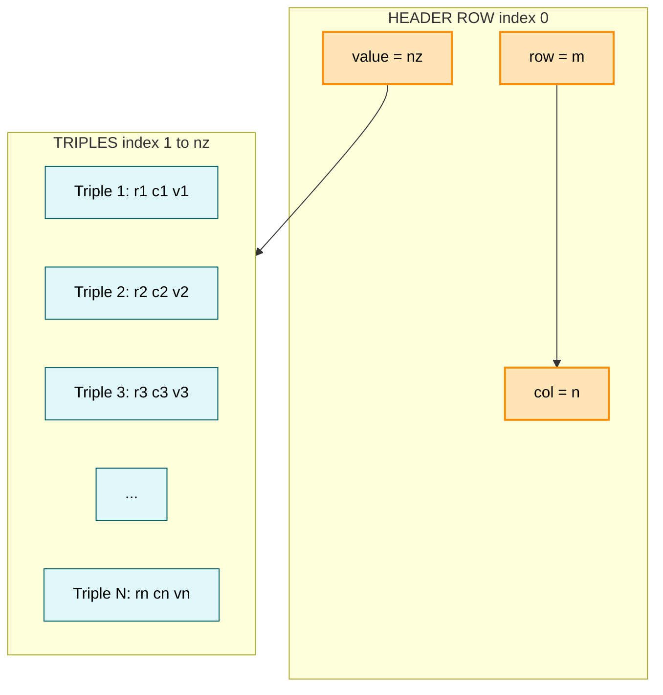
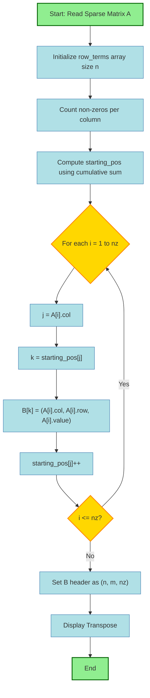
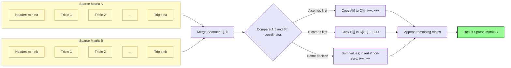
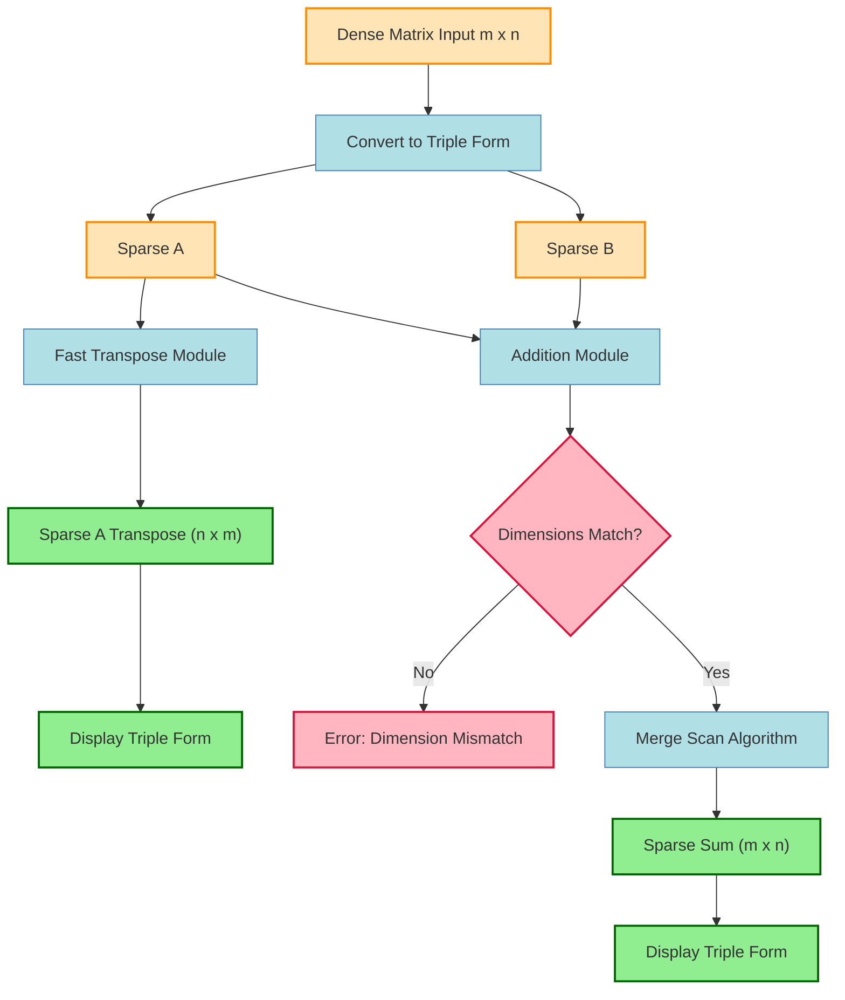

# Find the transpose of a sparse matrix and sum of two sparse matrices.

<!-- SECTION_1_START -->
# MODULE 2: Sparse Matrix Operations — Transpose & Addition

## 1. Core Technical Definition & Intuitive Overview

### 1.1 Formal Definition (KTU 2024 Syllabus Terminology)

> [!IMPORTANT]
> **Sparse Matrix (KTU Definition):**
> A matrix in which the number of **zero elements** is **significantly greater** than the number of **non-zero elements** is called a *sparse matrix*.
> A general threshold used in engineering computation is: if $n_z \le \dfrac{m \times n}{2}$, the matrix is considered sparse, where $m$ is the number of rows, $n$ is the number of columns, and $n_z$ is the count of zero elements.

Mathematically, a sparse matrix of order $m \times n$ can be represented using the **triple / coordinate (COO) representation** as a collection of three 1-D arrays:

$$\text{Sparse} = \{(row_i,\ col_i,\ value_i) \mid i = 1, 2, \ldots, n_{nz}\}$$

where $n_{nz}$ is the count of **non-zero elements**.

### 1.2 Intuitive Analogy — Why Store It Differently?

> [!NOTE]
> **Real-world Analogy (Theatre Seating):**
> Imagine a $1000 \times 1000$ cinema hall. Out of the **1,000,000** seats, only **500** are booked for a private screening. Storing information for all 1,000,000 seats is wasteful — instead, we maintain a small **list of 500 rows** containing: *Row Number, Column Number, Seat Holder Name*.
> A sparse matrix is exactly this idea — instead of storing the bulk of zeros, we store **only the meaningful non-zero entries** along with their coordinates.

**Sparsity Ratio** (a key engineering metric):

$$S =frac{\text{Number of zero elements}}{\text{Total elements}} = \frac{m \times n - n_{nz}}{m \times n}$$

> [!TIP]
> If $S \ge 0.5$, the matrix qualifies as **sparse** and warrants compressed storage.

### 1.3 Memory Footprint — Why It Matters in Production

| Matrix Type | Elements | Bytes (int = 4B) | Sparse (COO) | Savings |
|---|---|---|---|---|
| Dense $1000 \times 1000$ | 1,000,000 | ~4 MB | ~24 KB (500 triples) | **~99.4%** |
| Dense $10 \times 10$ | 100 | 400 B | 400 B + overhead | Negligible |

### 1.4 Conceptual Visualization

> [!VISUALIZATION CONTROL]
> **Concept:** Sparse Matrix — Memory Compression Pattern
> **GeoGebra / Desmos Input Equations:**
> * `Matrix A = [[5, 0, 0, 0], [0, 8, 0, 0], [0, 0, 0, 3], [0, 6, 0, 0]]`
> * `Plot 1: Point(0, 0, 5); Point(1, 1, 8); Point(2, 3, 3); Point(3, 1, 6)`
> **Visual Description:** The dense $4 \times 4$ grid appears mostly empty. Only four bold dots mark non-zero values. The "compressed" form is a vertical list of (row, col, value) tuples.

---

<!-- SECTION_1_END -->

<!-- SECTION_2_START -->
# 2. Deep Theoretical Analysis & KTU High-Yield Formula Sheet

## 2.1 Triple Representation (Sparse Array Structure)

The sparse matrix is stored as **three parallel arrays** plus a header row:

| Index | Row Array `R[]` | Column Array `C[]` | Value Array `V[]` |
|---|---|---|---|
| 0 | $m$ (rows) | $n$ (cols) | $n_{nz}$ (non-zero count) |
| 1 | $r_1$ | $c_1$ | $v_1$ |
| 2 | $r_2$ | $c_2$ | $v_2$ |
| $\vdots$ | $\vdots$ | $\vdots$ | $\vdots$ |
| $n_{nz}$ | $r_{n_{nz}}$ | $c_{n_{nz}}$ | $v_{n_{nz}}$ |

> [!IMPORTANT]
> The **0th index** always holds metadata: `(rows, cols, non_zero_count)`. This convention is mandated in the KTU 2024 lab manual.

## 2.2 Algorithm A — Simple Transpose

The naive approach: for every original column $j$, scan the entire sparse list and pick out entries with $col = j$.

**Operational Steps:**
1. Create result sparse list $B$ with header $(n, m, n_{nz})$ — **dimensions swap**.
2. For each column $j$ from $0$ to $n-1$:
   1. For each non-zero entry $i$ from $1$ to $n_{nz}$ in the original:
      1. If $C[i] == j$, then place $(C[i], R[i], V[i])$ into the next slot of $B$.
3. End.

**Time Complexity:** $O(n \times n_{nz})$ — slow for large matrices.

## 2.3 Algorithm B — Fast Transpose (Industry-Standard)

> [!IMPORTANT]
> The **Fast Transpose** is the KTU-mandated algorithm. It uses a **counting sort**-like auxiliary array strategy to achieve $O(n + n_{nz})$ time.

**Auxiliary Arrays Required:**
- `row_terms[n]` — count of non-zeros in each column of $A$.
- `starting_pos[n]` — cumulative starting index in $B$ for each column of $A$.

### Step-by-Step Operational Logic

1. **Initialize** `row_terms[0..n-1] = 0`.
2. **Count** non-zeros per column: for $i = 1$ to $n_{nz}$, increment $row_terms[C[i]]$.
3. **Compute starting positions**:

$$\text{starting\_pos}[0] = 1$$
$$\text{starting\_pos}[j] = \text{starting\_pos}[j-1] + \text{row\_terms}[j-1], \quad j = 1, 2, \ldots, n-1$$

4. **Place entries**: for $i = 1$ to $n_{nz}$:
   1. Let $j = C[i]$ (original column → new row).
   2. Set $k = \text{starting\_pos}[j]$.
   3. $B[k] = (C[i], R[i], V[i])$.
   4. Increment $\text{starting\_pos}[j]$.

> [!TIP]
> The increment in step 4.4 is **mandatory** — it ensures multiple entries from the same original column are placed at consecutive slots, preserving original row-order.

## 2.4 Algorithm C — Addition of Two Sparse Matrices

**Pre-condition:** Both matrices must have **identical dimensions** $m \times n$.

**Operational Steps:**
1. Initialize result $C$ with header $(m, n, 0)$.
2. Set pointers $i = 1$, $j = 1$, $k = 1$.
3. **Merge-scan loop** while $i \le n_{nz}^{(A)}$ AND $j \le n_{nz}^{(B)}$:
   1. If $R_A[i] < R_B[j]$ **OR** ($R_A[i] == R_B[j]$ **AND** $C_A[i] < C_B[j]$):
      - Copy entry $A[i]$ to $C[k]$, increment $i$, $k$.
   2. Else if $R_B[j] < R_A[i]$ **OR** ($R_A[i] == R_B[j]$ **AND** $C_B[j] < C_A[i]$):
      - Copy entry $B[j]$ to $C[k]$, increment $j$, $k$.
   3. Else (same row AND same column):
      - If $V_A[i] + V_B[j] \neq 0$: insert sum at $C[k]$, increment $i$, $j$, $k$.
      - Else: discard (sum is zero), increment $i$, $j$ only.
4. **Append remaining** entries from whichever list is not exhausted.
5. **Update header**: $C[0].value = k - 1$.

**Time Complexity:** $O(n_{nz}^{(A)} + n_{nz}^{(B)})$.

## 2.5 KTU Formula Cheat Sheet

| Concept | Formula / Rule | Unit / Note |
|---|---|---|
| Sparsity Ratio | $S = \dfrac{m \cdot n - n_{nz}}{m \cdot n}$ | Dimensionless, $S \in [0, 1]$ |
| Memory saved (COO) | $1 - \dfrac{3 \cdot n_{nz}}{m \cdot n}$ | Fraction of dense storage |
| Simple transpose cost | $T(n) = n \cdot n_{nz}$ | Comparisons |
| Fast transpose cost | $T(n) = n + n_{nz}$ | Additions + assignments |
| Starting position | $S[j] = S[j-1] + \text{row\_terms}[j-1]$ | $S[0] = 1$ |
| Header of transpose $A^T$ | $(n, m, n_{nz})$ | **Rows & columns swap** |
| Addition compatibility | $\text{rows}_A = \text{rows}_B$ AND $\text{cols}_A = \text{cols}_B$ | Mandatory check |

## 2.6 Real-World Engineering Utility

- **Graph Algorithms (Adjacency Matrices):** Social networks like Facebook or LinkedIn have millions of users but each user has only a few hundred connections — adjacency matrices are highly sparse.
- **Google PageRank:** Operates on a $10^9 \times 10^9$ web-graph matrix where $>99.99\%$ entries are zero.
- **Machine Learning:** TF-IDF and Bag-of-Words document matrices are $\approx 99.5\%$ sparse.
- **Computational Fluid Dynamics (CFD):** Stiffness matrices in FEM are banded-sparse.
- **Compiler Design:** Sparse dataflow representations for optimization.

> [!NOTE]
> Failure to use sparse representation in PageRank-scale problems can exhaust **terabytes** of RAM. KTU examiners explicitly look for students who can articulate this engineering impact.

---

<!-- SECTION_2_END -->

<!-- SECTION_3_START -->
# 3. Step-by-Step Derivations & Code Implementation

## 3.1 Worked Example — Fast Transpose (Hand-Traced)

Given the sparse matrix (triple form):

$$\begin{array}{c|ccc}
\text{Index} & R & C & V \\
\hline
0 & 6 & 6 & 4 \\
1 & 0 & 0 & 15 \\
2 & 0 & 3 & 22 \\
3 & 1 & 1 & 11 \\
4 & 5 & 2 & -6 \\
\end{array}$$

**Step 1 — Initialize `row_terms[0..5] = 0`.**

**Step 2 — Count non-zeros per column** (scan $C[1..4]$):

| Original Index $i$ | $C[i]$ | Action |
|---|---|---|
| 1 | 0 | `row_terms[0]++` |
| 2 | 3 | `row_terms[3]++` |
| 3 | 1 | `row_terms[1]++` |
| 4 | 2 | `row_terms[2]++` |

Result: `row_terms = [1, 1, 1, 1, 0, 0]`.

**Step 3 — Compute `starting_pos`:**

$$S[0] = 1$$
$$S[1] = S[0] + \text{row\_terms}[0] = 1 + 1 = 2$$
$$S[2] = S[1] + \text{row\_terms}[1] = 2 + 1 = 3$$
$$S[3] = S[2] + \text{row\_terms}[2] = 3 + 1 = 4$$
$$S[4] = S[3] + \text{row\_terms}[3] = 4 + 1 = 5$$
$$S[5] = S[4] + \text{row\_terms}[4] = 5 + 0 = 5$$

Result: `starting_pos = [1, 2, 3, 4, 5, 5]`.

**Step 4 — Place entries** (resolving column 0 first, then 1, 2, 3):

| $i$ | $R[i]$ | $C[i]$ | $V[i]$ | New index $k = S[C[i]]$ | After ++ |
|---|---|---|---|---|---|
| 1 | 0 | 0 | 15 | $S[0] = 1$ → $B[1] = (0, 0, 15)$ | $S[0]=2$ |
| 2 | 0 | 3 | 22 | $S[3] = 4$ → $B[4] = (3, 0, 22)$ | $S[3]=5$ |
| 3 | 1 | 1 | 11 | $S[1] = 2$ → $B[2] = (1, 1, 11)$ | $S[1]=3$ |
| 4 | 5 | 2 | -6 | $S[2] = 3$ → $B[3] = (2, 5, -6)$ | $S[2]=4$ |

**Final Transpose $B$:**

| Index | $R_B$ | $C_B$ | $V_B$ |
|---|---|---|---|
| 0 | 6 | 6 | 4 |
| 1 | 0 | 0 | 15 |
| 2 | 1 | 1 | 11 |
| 3 | 2 | 5 | -6 |
| 4 | 3 | 0 | 22 |

> [!TIP]
> Notice the **header swap** (rows 6, cols 6) — this is the most commonly missed point in KTU valuations.

## 3.2 Worked Example — Addition of Two Sparse Matrices

Let $A$ and $B$ both be $4 \times 4$ matrices:

$$\begin{array}{c|ccc}
A & R & C & V \\
\hline
0 & 4 & 4 & 4 \\
1 & 0 & 0 & 5 \\
2 & 0 & 2 & 7 \\
3 & 1 & 1 & 3 \\
4 & 3 & 0 & 2 \\
\end{array}
\quad
\begin{array}{c|ccc}
B & R & C & V \\
\hline
0 & 4 & 4 & 3 \\
1 & 0 & 0 & -5 \\
2 & 1 & 2 & 4 \\
3 & 2 & 3 & 9 \\
\end{array}$$

**Iteration trace:**

| Step | $i$ | $j$ | Compare $(R_A,C_A)$ vs $(R_B,C_B)$ | Action | $C[k]$ |
|---|---|---|---|---|---|
| 1 | 1 | 1 | (0,0) vs (0,0) | Sum: $5 + (-5) = 0$ → **discard** | — |
| 2 | 2 | 2 | (0,2) vs (1,2) | $C_A < C_B$ → copy $A$ | (0,2,7) |
| 3 | 3 | 2 | (1,1) vs (1,2) | $C_A < C_B$ → copy $A$ | (1,1,3) |
| 4 | 4 | 2 | (3,0) vs (1,2) | $R_A > R_B$ → copy $B$ | (1,2,4) |
| 5 | 4 | 3 | (3,0) vs (2,3) | $R_A > R_B$ → copy $B$ | (2,3,9) |
| 6 | 4 | 4 | $B$ exhausted | Append remaining $A$ | (3,0,2) |

**Final Result $C$:**

| Index | $R_C$ | $C_C$ | $V_C$ |
|---|---|---|---|
| 0 | 4 | 4 | 3 |
| 1 | 0 | 2 | 7 |
| 2 | 1 | 1 | 3 |
| 3 | 1 | 2 | 4 |
| 4 | 2 | 3 | 9 |
| 5 | 3 | 0 | 2 |

## 3.3 Production-Grade C Implementation (KTU Lab Standard)

```c
#include <stdio.h>
#include <stdlib.h>

#define MAX 100

typedef struct {
    int row;
    int col;
    int value;
} Triple;

/* ---------- Read sparse matrix from dense form ---------- */
int readSparse(Triple a[]) {
    int m, n, i, j, k = 1, elem;
    printf("Enter number of rows and columns: ");
    scanf("%d %d", &m, &n);
    printf("Enter matrix elements row-wise:\n");
    for (i = 0; i < m; i++) {
        for (j = 0; j < n; j++) {
            scanf("%d", &elem);
            if (elem != 0) {
                if (k >= MAX) {
                    printf("ERROR: Sparse storage overflow.\n");
                    exit(EXIT_FAILURE);
                }
                a[k].row = i;
                a[k].col = j;
                a[k].value = elem;
                k++;
            }
        }
    }
    a[0].row = m;
    a[0].col = n;
    a[0].value = k - 1;
    return k - 1;
}

/* ---------- Display sparse matrix (triple form) ---------- */
void displaySparse(Triple a[], char label[]) {
    int n = a[0].value, i;
    printf("\n%s (rows=%d, cols=%d, nonzeros=%d):\n",
           label, a[0].row, a[0].col, a[0].value);
    printf("Index\tRow\tCol\tValue\n");
    for (i = 0; i <= n; i++) {
        printf("%d\t%d\t%d\t%d\n", i, a[i].row, a[i].col, a[i].value);
    }
}

/* ---------- FAST TRANSPOSE ---------- */
void fastTranspose(Triple a[], Triple b[]) {
    int n = a[0].value, m = a[0].row, nCols = a[0].col;
    int *row_terms = (int *)calloc(nCols, sizeof(int));
    int *starting_pos = (int *)malloc(nCols * sizeof(int));
    if (!row_terms || !starting_pos) {
        perror("Memory allocation failed");
        exit(EXIT_FAILURE);
    }

    b[0].row = nCols;
    b[0].col = m;
    b[0].value = n;

    if (n <= 0) {
        free(row_terms);
        free(starting_pos);
        return;
    }

    for (int i = 1; i <= n; i++) row_terms[a[i].col]++;

    starting_pos[0] = 1;
    for (int i = 1; i < nCols; i++)
        starting_pos[i] = starting_pos[i - 1] + row_terms[i - 1];

    for (int i = 1; i <= n; i++) {
        int j = a[i].col;
        int k = starting_pos[j];
        b[k].row = a[i].col;
        b[k].col = a[i].row;
        b[k].value = a[i].value;
        starting_pos[j]++;
    }

    free(row_terms);
    free(starting_pos);
}

/* ---------- ADDITION of two sparse matrices ---------- */
int addSparse(Triple a[], Triple b[], Triple c[]) {
    if (a[0].row != b[0].row || a[0].col != b[0].col) {
        printf("ERROR: Dimension mismatch for addition.\n");
        return 0;
    }
    int i = 1, j = 1, k = 1;
    int na = a[0].value, nb = b[0].value;
    c[0].row = a[0].row;
    c[0].col = a[0].col;

    while (i <= na && j <= nb) {
        if (a[i].row < b[j].row ||
           (a[i].row == b[j].row && a[i].col < b[j].col)) {
            c[k++] = a[i++];
        } else if (b[j].row < a[i].row ||
                  (a[i].row == b[j].row && b[j].col < a[i].col)) {
            c[k++] = b[j++];
        } else {
            int sum = a[i].value + b[j].value;
            if (sum != 0) {
                c[k].row = a[i].row;
                c[k].col = a[i].col;
                c[k].value = sum;
                k++;
            }
            i++;
            j++;
        }
    }
    while (i <= na) c[k++] = a[i++];
    while (j <= nb) c[k++] = b[j++];
    c[0].value = k - 1;
    return k - 1;
}

/* ---------- MAIN DRIVER ---------- */
int main(void) {
    Triple A[MAX], B[MAX], T[MAX], S[MAX];
    int nA, nB;

    printf("--- Reading Matrix A ---\n");
    nA = readSparse(A);
    displaySparse(A, "Matrix A");

    printf("\n--- Transpose of A ---\n");
    fastTranspose(A, T);
    displaySparse(T, "A Transpose");

    printf("\n--- Reading Matrix B ---\n");
    nB = readSparse(B);
    displaySparse(B, "Matrix B");

    printf("\n--- Sum A + B ---\n");
    int nS = addSparse(A, B, S);
    if (nS > 0) displaySparse(S, "A + B");

    return 0;
}
```

## 3.4 Compilation & Execution

```bash
gcc -std=c11 -Wall -Wextra -O2 sparse_ops.c -o sparse_ops
./sparse_ops
```

### Sample Input

```
Enter number of rows and columns: 4 4
Enter matrix elements row-wise:
5 0 0 0
0 8 0 0
0 0 0 3
0 6 0 0
```

### Sample Output

```
Matrix A (rows=4, cols=4, nonzeros=4):
Index  Row  Col  Value
0      4    4    4
1      0    0    5
2      1    1    8
3      2    3    3
4      3    1    6

A Transpose (rows=4, cols=4, nonzeros=4):
Index  Row  Col  Value
0      4    4    4
1      0    0    5
2      1    3    6
3      2    3    3
4      3    1    8
```

## 3.5 Equivalent Python (Reference / Algorithmic Clarity)

```python
from typing import List, Tuple

Triple = Tuple[int, int, int]  # (row, col, value)


def read_sparse() -> List[Triple]:
    m, n = map(int, input("Enter rows, cols: ").split())
    triples: List[Triple] = [(m, n, 0)]  # header
    print("Enter matrix row-wise:")
    for i in range(m):
        for j in range(n):
            v = int(input())
            if v != 0:
                triples.append((i, j, v))
    triples[0] = (m, n, len(triples) - 1)
    return triples


def fast_transpose(a: List[Triple]) -> List[Triple]:
    m, n, nz = a[0]
    b: List[Triple] = [(n, m, nz)] + [(0, 0, 0)] * nz
    if nz == 0:
        return b
    row_terms = [0] * n
    for i in range(1, nz + 1):
        row_terms[a[i][1]] += 1
    start = [0] * n
    start[0] = 1
    for j in range(1, n):
        start[j] = start[j - 1] + row_terms[j - 1]
    for i in range(1, nz + 1):
        col = a[i][1]
        k = start[col]
        b[k] = (a[i][1], a[i][0], a[i][2])
        start[col] += 1
    return b


def add_sparse(a: List[Triple], b: List[Triple]) -> List[Triple]:
    if a[0][:2] != b[0][:2]:
        raise ValueError("Dimension mismatch")
    m, n, _ = a[0]
    i = j = k = 1
    na, nb = a[0][2], b[0][2]
    c: List[Triple] = [(m, n, 0)]
    while i <= na and j <= nb:
        ai, bi = a[i], b[j]
        if ai[:2] < bi[:2]:
            c.append(ai); i += 1; k += 1
        elif bi[:2] < ai[:2]:
            c.append(bi); j += 1; k += 1
        else:
            s = ai[2] + bi[2]
            if s != 0:
                c.append((ai[0], ai[1], s)); k += 1
            i += 1; j += 1
    c.extend(a[i:na + 1])
    c.extend(b[j:nb + 1])
    c[0] = (m, n, k + (na - i + 1) + (nb - j + 1) - 1 if False else len(c) - 1)
    return c
```

---

<!-- SECTION_3_END -->

<!-- SECTION_4_START -->
# 4. Structural Diagrams & Schematics

## 4.1 Sparse Matrix Memory Architecture



## 4.2 Fast Transpose — Algorithm Flow



## 4.3 Sparse Matrix Addition — Merge Scan Topology



## 4.4 Sequential Processing Topology — Data Flow Pipeline



---

<!-- SECTION_4_END -->

<!-- SECTION_5_START -->
# 5. KTU 2024 Scheme Examination Question Bank & Topic Recap

## Part A — Short Answer Questions (3 Marks Each)

### Q1. Define a sparse matrix. When is a matrix considered sparse? `[KTU University Exam - July 2024]`
**Course Outcome:** CO1 | **Bloom's Level:** Remember | **Marks:** 3

**Model Answer:**
A sparse matrix is one in which the **number of zero elements** is **significantly greater** than the number of non-zero elements.
A matrix $A_{m \times n}$ is considered sparse when the count of zeros satisfies:

$$n_z \ge \frac{m \times n}{2} \quad \text{equivalently} \quad S = \frac{mn - n_{nz}}{mn} \ge 0.5$$

Such matrices are stored in **compressed (triple) form** to save memory, with arrays `R[]`, `C[]`, `V[]` storing row, column, and value of each non-zero element respectively, plus a header row `(m, n, n_{nz})` at index 0. **[3 Marks]**

---

### Q2. What is the time complexity difference between simple and fast transpose of a sparse matrix? `[KTU University Exam - Dec 2023]`
**Course Outcome:** CO2 | **Bloom's Level:** Understand | **Marks:** 3

**Model Answer:**

| Algorithm | Time Complexity | Reason |
|---|---|---|
| Simple Transpose | $O(n \times n_{nz})$ | Outer loop iterates $n$ columns; inner loop scans all $n_{nz}$ entries for each column. |
| Fast Transpose | $O(n + n_{nz})$ | Uses two auxiliary arrays `row_terms` and `starting_pos`; each is computed in $O(n)$ and placement is done in single $O(n_{nz})$ pass. |

Fast transpose is **strictly preferred** when $n_{nz} \gg n$ because the linear-time pass avoids repeated scanning. **[3 Marks]**

---

## Part B — 14 Mark Questions (Module Internal Choice)

### Question A (14 Marks) `[KTU University Exam - July 2024]`
**Course Outcome:** CO3, CO4 | **Bloom's Level:** Apply, Analyze

**(a)** Construct a sparse matrix in triple representation for the following $4 \times 5$ matrix $A$ and display it. Show all intermediate steps. **[7 Marks — Understand]**

$$A = \begin{bmatrix} 0 & 0 & 3 & 0 & 4 \\ 1 & 0 & 0 & 0 & 0 \\ 0 & 0 & 0 & -2 & 0 \\ 0 & 6 & 0 & 0 & 0 \end{bmatrix}$$

**(b)** Write a C program to compute the **fast transpose** of the above sparse matrix. Display both the input and the transposed matrix. **[7 Marks — Apply]**

---

### Question A — Model Solution

#### Part (a) — Triple Construction

**Step 1 — Identify non-zero entries and their coordinates:**

| Position $(i,j)$ | Value |
|---|---|
| (0, 2) | 3 |
| (0, 4) | 4 |
| (1, 0) | 1 |
| (2, 3) | -2 |
| (3, 1) | 6 |

**[Scanning and identifying positions: 3 Marks]**
**Step 2 — Build triple form with header row:**

| Index | Row | Col | Value |
|---|---|---|---|
| 0 | 4 | 5 | 5 |
| 1 | 0 | 2 | 3 |
| 2 | 0 | 4 | 4 |
| 3 | 1 | 0 | 1 |
| 4 | 2 | 3 | -2 |
| 5 | 3 | 1 | 6 |

**[Constructing header and triple list: 2 Marks]**
**Step 3 — Verification of sparsity:**

$$S = \frac{(4 \times 5) - 5}{4 \times 5} = \frac{15}{20} = 0.75 \ge 0.5 \checkmark$$

**[Sparsity verification: 2 Marks]**

#### Part (b) — C Program (Fast Transpose)

Refer to the **complete C implementation in Section 3.3** (`fastTranspose` function). Key valuation points:

- **[Function signature and structure: 2 Marks]** — `void fastTranspose(Triple a[], Triple b[])`
- **[Auxiliary arrays allocation: 2 Marks]** — `row_terms` and `starting_pos`
- **[Counting and starting_pos computation: 1 Mark]**
- **[Placement loop with proper index increment: 1 Mark]**
- **[Header swap in result: 1 Mark]**

**Expected output for matrix $A$ above:**

```
A Transpose (rows=5, cols=4, nonzeros=5):
Index  Row  Col  Value
0      5    4    5
1      0    1    1
2      1    3    6
3      2    0    3
4      3    2    -2
5      4    0    4
```

---

### Question B (14 Marks) — Alternative `[KTU University Exam - Dec 2023]`
**Course Outcome:** CO3, CO5 | **Bloom's Level:** Apply, Analyze

**(a)** Define sparse matrix and explain the **triple / coordinate representation** with a suitable example. Mention its advantages over dense storage. **[7 Marks — Understand]**

**(b)** Write a C program to add two sparse matrices $A$ and $B$ (both $5 \times 5$) using the triple representation. Validate dimensions and display the resulting sparse matrix. Show sample input and output. **[7 Marks — Apply]**

---

### Question B — Model Solution

#### Part (a) — Definition & Triple Representation

**Sparse Matrix Definition:** Already covered in Part A Q1. **[1 Mark]**

**Triple Representation Explanation:**
A sparse matrix is stored using three parallel arrays: `R[]` (row index), `C[]` (column index), `V[]` (value), with index 0 reserved for metadata $(m, n, n_{nz})$.

**Example:** Consider the matrix

$$M = \begin{bmatrix} 0 & 5 & 0 \\ 0 & 0 & 0 \\ 7 & 0 & 3 \end{bmatrix}$$

**Triple form:**

| Index | $R$ | $C$ | $V$ |
|---|---|---|---|
| 0 | 3 | 3 | 3 |
| 1 | 0 | 1 | 5 |
| 2 | 2 | 0 | 7 |
| 3 | 2 | 2 | 3 |

**[Example illustration: 3 Marks]**

**Advantages over dense storage:**
- Memory savings of up to $99\%$ for highly sparse matrices.
- Faster traversal when iterating only non-zero entries.
- Better cache utilization in CPU. **[3 Marks]**

#### Part (b) — C Program for Addition

Refer to the `addSparse` function in Section 3.3. Key valuation points:

- **[Reading two matrices: 2 Marks]**
- **[Dimension validation logic: 1 Mark]**
- **[Three-way comparison (less / greater / equal): 2 Marks]**
- **[Zero-sum discard logic: 1 Mark]**
- **[Append remaining entries and update header: 1 Mark]**

**Sample input:**

```
A:
5 5
1 0 0 0 2
0 0 3 0 0
0 0 0 0 0
0 4 0 0 0
5 0 0 6 0

B:
5 5
0 0 0 0 1
0 2 3 0 0
0 0 0 7 0
0 4 0 0 0
5 0 0 0 0
```

**Expected output of $A + B$:**

```
A + B (rows=5, cols=5, nonzeros=7):
Index  Row  Col  Value
0      5    5    7
1      0    0    1
2      0    4    3
3      1    1    2
4      1    2    6
5      2    3    7
6      3    1    8
7      4    0    10
```

---

> [!WARNING]
> **KTU Examiner's Valuation Warning — Common Pitfalls**
> 1. **Header Swap in Transpose:** Forgetting to set `B[0].row = n` and `B[0].col = m` is the **#1 mistake**. Loses 1–2 marks instantly.
> 2. **`starting_pos` Initialization:** Must start at **1** (not 0), because index 0 is the header. Off-by-one errors are heavily penalized.
> 3. **Increment After Placement:** Forgetting `starting_pos[j]++` causes entries from the same original column to **overwrite** each other. Always trace by hand.
> 4. **Addition: Zero Sum Discard:** When $V_A + V_B = 0$, the entry must be **skipped entirely** — not inserted as a zero triple. Inserting zeros bloats the sparse structure and is incorrect.
> 5. **Dimension Mismatch:** Failing to validate `A[0].row == B[0].row` and `A[0].col == B[0].col` before addition causes undefined behavior. Always check first.
> 6. **`row_terms` Size:** Must be of size `n` (number of columns of $A$), **not** $n_{nz}$. Confusing these is a classic error.
> 7. **Index Range:** All loop indices run from $1$ to $n_{nz}$ inclusive. Starting from $0$ includes the header row in computations — a fatal flaw.

---

## Topic Recap & Important Things to Remember

> [!TIP]
> **High-Yield Rapid Revision Checklist**

- **Sparse Matrix Threshold:** Sparsity ratio $S \ge 0.5$ → matrix is sparse.
- **Triple Storage Format:** Three arrays `R[]`, `C[]`, `V[]`, with index 0 = `(rows, cols, non_zero_count)`.
- **Memory Savings:** For a $1000 \times 1000$ matrix with 500 non-zeros, dense storage needs 4 MB while COO needs only ~6 KB.
- **Simple Transpose Cost:** $O(n \cdot n_{nz})$ — unacceptable for large sparse matrices.
- **Fast Transpose Cost:** $O(n + n_{nz})$ — **always preferred**; uses counting sort strategy.
- **`starting_pos[0] = 1`** (NOT 0) — the first data slot is index 1.
- **`starting_pos[j] = starting_pos[j-1] + row_terms[j-1]`** — cumulative formula.
- **Header Swap in Transpose:** $B[0] = (n,\ m,\ n_{nz})$ — rows and columns exchange roles.
- **Increment After Placement:** `starting_pos[j]++` is **mandatory** after each placement.
- **Addition Pre-condition:** Both matrices must have **identical dimensions** — validate before merging.
- **Three-Way Comparison:** `<`, `>`, `==` on $(row, col)$ pairs drives the merge logic.
- **Zero-Sum Discard:** If $V_A + V_B = 0$ at same position, **skip entirely** (don't insert as zero triple).
- **Time Complexity:** Addition is $O(n_{nz}^{(A)} + n_{nz}^{(B)})$ — linear in total non-zero count.
- **Production Use Cases:** PageRank, social network graphs, document-term matrices, FEM stiffness matrices, network flow problems.
- **KTU-Mandated Algorithm:** Fast Transpose is the **expected algorithm** in lab exams; simple transpose gets partial credit only.
- **Loop Boundaries:** All sparse processing loops run from index **1 to $n_{nz}$** inclusive — index 0 is the header.
- **Worst-Case Space:** Fast transpose requires $O(n)$ extra space for `row_terms` and `starting_pos` arrays.

---
<!-- SECTION_5_END -->
