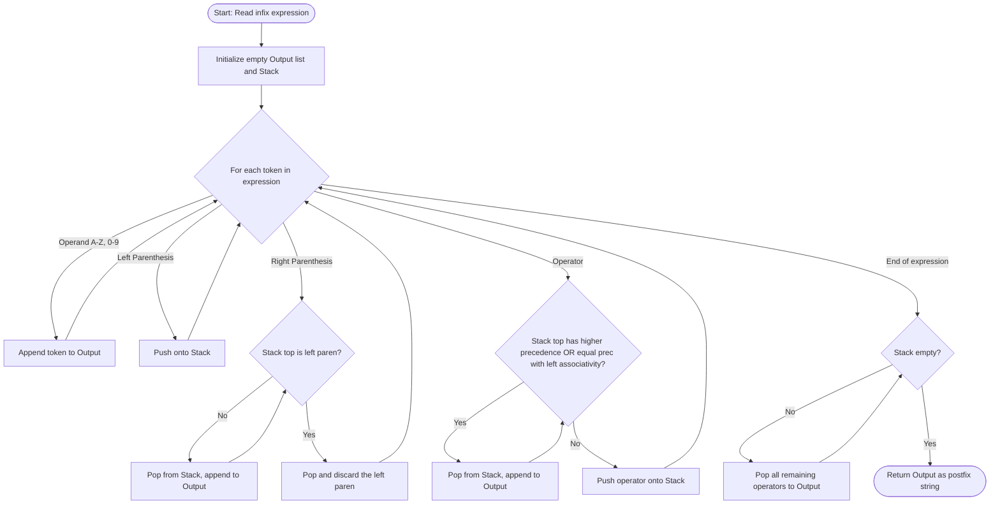
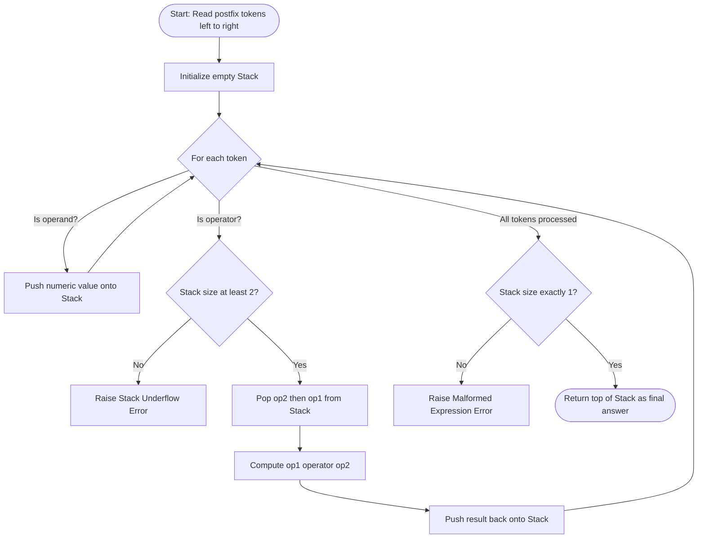
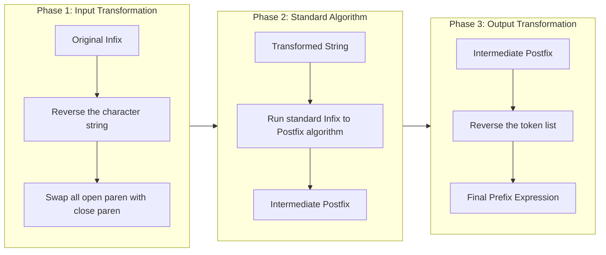
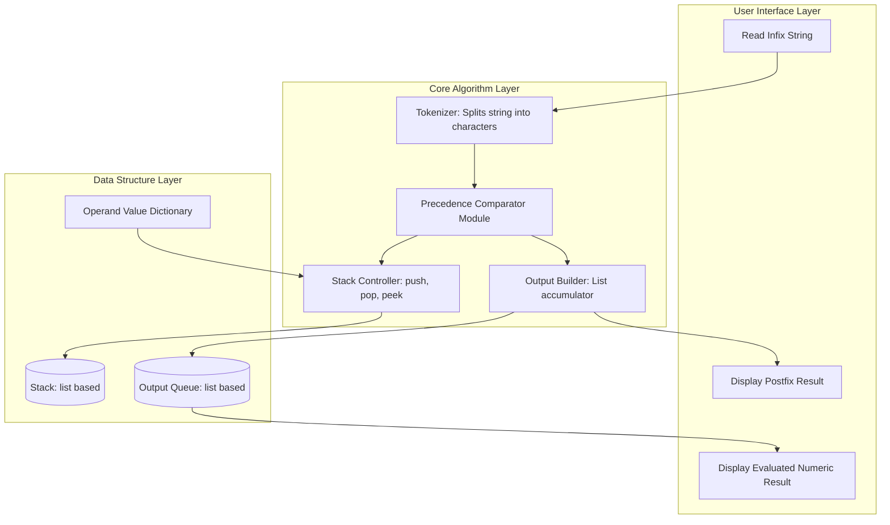

# Convert infix expression to postfix (or prefix) and then evaluate using stack

<!-- SECTION_1_START -->
# 1. Core Technical Definition & Intuitive Overview

## 1.1 Formal Academic Definition (KTU 2024 Syllabus Terminology)

**Expression Notation** refers to the systematic representation of arithmetic or logical expressions where operators are positioned relative to their operands in one of three standardized forms:

- **Infix Notation**: The operator is placed *between* two operands (e.g., `A + B`). This is the standard mathematical convention, but it requires **precedence rules** and **parentheses** to disambiguate order of evaluation.
- **Postfix Notation** (Reverse Polish Notation / RPN): The operator is placed *after* its two operands (e.g., `A B +`). No parentheses are required, and evaluation proceeds strictly **left-to-right**.
- **Prefix Notation** (Polish Notation): The operator is placed *before* its two operands (e.g., `+ A B`). No parentheses are required, and evaluation proceeds strictly **right-to-left**.

> [!IMPORTANT]
> **KTU 2024 Syllabus Highlight (Module 3):** Students must be able to (a) convert an infix expression to its postfix equivalent using a stack, (b) convert an infix expression to its prefix equivalent using a stack, and (c) evaluate the resulting postfix/prefix expression using a stack. All three operations are mandatory lab competencies.

## 1.2 Conceptual Analogy & Geometric Intuition

Imagine you are at a **train station platform**, and every train (operator) is attached to a different type of engine:

| Notation | Engine Position | Real-World Analogy |
| :--- | :--- | :--- |
| **Infix** | Engine in the **middle** of the carriages (operands) | A train car where the engine is sandwiched: `[Coach A] [Engine] [Coach B]` |
| **Postfix** | Engine at the **rear** of the train | `[Coach A] [Coach B] [Engine]` — the engine pushes from behind |
| **Prefix** | Engine at the **front** of the train | `[Engine] [Coach A] [Coach B]` — the engine pulls from the front |

A **stack** is the perfect tool for this job because it is a **Last-In, First-Out (LIFO)** container — exactly like a stack of plates where you can only add or remove from the top. Whenever we encounter a higher-precedence operator, we "park" it on the stack. When a lower-precedence operator arrives, we "pop off" the parked operators and append them to the output first.

> [!NOTE]
> **Why do we need a stack?** Without a stack, computers cannot natively parse `A + B * C` because they read from left to right, but `B * C` must be computed first. The stack acts as a **temporary holding bay** that reorders operators into a sequence the computer can evaluate unambiguously.

## 1.3 Standard Operator Precedence & Associativity (KTU Board Reference)

The conversion algorithm hinges on two rules — **Precedence (Priority)** and **Associativity (Tie-Breaker)**:

| Operator | Precedence Level | Associativity |
| :---: | :---: | :---: |
| `^` (Exponent) | **3 (Highest)** | Right-to-Left |
| `*` `/` (Multiplicative) | **2 (Medium)** | Left-to-Right |
| `+` `-` (Additive) | **1 (Lowest)** | Left-to-Right |
| `(` `)` (Parentheses) | **0 (Special)** | N/A (Marker only) |

> [!NOTE]
> **Bold Physical Constant:** The precedence hierarchy `^` > `*`, `/` > `+`, `-` is the *unbreakable* evaluation order inherited from standard mathematics (BODMAS/PEMDAS conventions).

> [!VISUALIZATION CONTROL]
> **Concept:** Operator Precedence Ladder (Ascending Priority)
> **GeoGebra / Desmos Input Equations:**
> * `y = 1` (for precedence level 1: `+`, `-`)
> * `y = 2` (for precedence level 2: `*`, `/`)
> * `y = 3` (for precedence level 3: `^`)
> **Visual Description:** Three parallel horizontal lines stacked vertically. The bottom line (y=1) holds the `+` and `-` operators; the middle line (y=2) holds `*` and `/`; the top line (y=3) holds the exponent `^`. Students should observe that an operator on a higher rung always "wins" the tie when deciding whether to push to or pop from the stack.
<!-- SECTION_1_END -->

<!-- SECTION_2_START -->
# 2. Deep Theoretical Analysis & KTU High-Yield Formula Sheet

## 2.1 The Core Decision Logic — "When to Push, When to Pop"

The entire infix-to-postfix algorithm revolves around a single decision gate that fires every time we read a non-parenthesis operator token from the input expression. The decision is summarized in the truth table below:

| Incoming Token | Top-of-Stack Condition | Action | Reasoning |
| :--- | :--- | :--- | :--- |
| Operand (a-z, A-Z, 0-9) | (irrelevant) | **Append to output** | Operands always go straight through; they are not held. |
| `(` Left Parenthesis | (irrelevant) | **Push onto stack** | Acts as a "barrier" — once pushed, nothing inside the parentheses can be popped out until `)` arrives. |
| `)` Right Parenthesis | Until matching `(` is found | **Pop and append** all stack items to output, then **discard** the `(` | The parentheses encapsulate a sub-expression that is now self-contained. |
| Operator (e.g., `+`, `*`, `^`) | Stack top has higher precedence | **Pop** top and append, **then push** incoming | The top operator must finish its work first. |
| Operator | Stack top has lower or equal precedence AND incoming is **left-associative** | **Push** incoming onto stack | The incoming operator is "weaker" or equal but must wait its turn. |
| Operator (`^`) | Stack top is also `^` | **Push** incoming onto stack | Right-associative — equal precedence does NOT trigger a pop. |

## 2.2 KTU High-Yield Formula Sheet (Cheat Sheet)

> [!IMPORTANT]
> The table below contains every formula, condition, and parameter you will need for solving conversion/evaluation problems in the KTU ESE. **Memorize this table.**

| Concept | Formula / Rule | Symbol/Unit | Engineering Application |
| :--- | :--- | :--- | :--- |
| Postfix Evaluation — Push Rule | When token is operand, push its numeric value | $\text{value}$ | Compiler back-end, calculators (HP-12C financial calc) |
| Postfix Evaluation — Pop Rule | When token is operator, pop $\text{op2}$ then $\text{op1}$, compute $\text{op1} \otimes \text{op2}$ | $\text{op1}, \text{op2} \in \mathbb{R}$ | Reverse Polish Notation engines |
| Time Complexity | $T(n) = O(n)$ for a single-pass scan | $n$ = expression length | Used in optimizing expression parsing pipelines |
| Space Complexity | $S(n) = O(n)$ worst-case (e.g., all operators pushed) | $n$ = expression length | Memory budgeting in embedded parsers |
| Stack Underflow Test | If `pop()` called on empty stack $\rightarrow$ **Malformed Expression** | Boolean flag | Compiler error-detection subsystem |
| Associativity for `^` | Right-to-Left: equal precedence means **push** | — | Ensures `2^3^2` = `2^(3^2)` = $512$ |
| Associativity for `+ - * /` | Left-to-Right: equal precedence means **pop** | — | Ensures `8-4-2` = `(8-4)-2` = $2$ |
| Reverse for Prefix | Scan infix **right-to-left**, swap `(` $\leftrightarrow$ `)` | — | Yields correct prefix in single pass |

## 2.3 Real-World Engineering Utility

This algorithm is the **backbone of every modern compiler and interpreter**. The GCC compiler, the Java Virtual Machine (JVM), and Python's CPython interpreter all internally convert human-written infix code into an Abstract Syntax Tree (AST) or bytecode using these very principles. Database engines like PostgreSQL translate SQL arithmetic expressions using the same precedence stack logic. The Shunting-Yard algorithm (invented by **Edsger Dijkstra in 1961**) is the formal name of the infix-to-postfix procedure, and it is still taught in compiler construction courses worldwide.

## 2.4 Foundational Boundary Conditions

1. **Empty Expression**: Input string is `""` or `None` $\rightarrow$ output is `""`. No stack operations triggered.
2. **Stack Non-Empty at End**: After scanning all tokens, **pop every remaining operator** from the stack and append to output. Any leftover indicates a missing `)`.
3. **Malformed Parentheses**: Encountering `)` with an empty stack, or reaching the end with `(` still on the stack, signals a **syntax error**.
4. **Single Operand**: Expression `"X"` remains `"X"` — no operator transformations needed.
<!-- SECTION_2_END -->

<!-- SECTION_3_START -->
# 3. Step-by-Step Derivations, Code & Symbolic Implementation

## 3.1 Worked Example — Infix to Postfix Conversion (Manual Trace)

**Input Infix Expression:** $\quad \text{A} + \text{B} * \text{C} - \text{D} / \text{E}$

We will scan left-to-right, applying the decision logic from Section 2.1 at every step.

| Step | Token Read | Stack (top $\rightarrow$ bottom) | Output (Postfix Built So Far) | Action Justification |
| :---: | :---: | :--- | :--- | :--- |
| 1 | `A` | (empty) | `A` | Operand — directly append |
| 2 | `+` | `+` | `A` | Stack empty, push `+` |
| 3 | `B` | `+` | `A B` | Operand — directly append |
| 4 | `*` | `+ *` | `A B` | Top `+` has lower precedence than incoming `*` $\rightarrow$ push |
| 5 | `C` | `+ *` | `A B C` | Operand — directly append |
| 6 | `-` | `-` | `A B C * +` | Top `*` (prec 2) $>$ incoming `-` (prec 1) $\rightarrow$ pop `*`; top `+` (prec 1) $=$ incoming `-` (prec 1) and left-assoc $\rightarrow$ pop `+`; then push `-` |
| 7 | `D` | `-` | `A B C * + D` | Operand — directly append |
| 8 | `/` | `- /` | `A B C * + D` | Top `-` (prec 1) $<$ incoming `/` (prec 2) $\rightarrow$ push |
| 9 | `E` | `- /` | `A B C * + D E` | Operand — directly append |
| 10 | END | (empty) | `A B C * + D E / -` | Pop all remaining: `/`, then `-` |

**Final Postfix Expression:** $\quad \boxed{\text{A B C * + D E / -}}$

## 3.2 Worked Example — Postfix Evaluation (Manual Trace)

**Given:** Postfix = $\text{A B C * + D E / -}$, with $\text{A}=10, \text{B}=3, \text{C}=4, \text{D}=20, \text{E}=5$.

**Expected mathematical result:** $10 + (3 \times 4) - (20 / 5) = 10 + 12 - 4 = 18$.

| Step | Token | Stack (bottom $\rightarrow$ top) | Operation |
| :---: | :---: | :--- | :--- |
| 1 | `A` | `10` | Push 10 |
| 2 | `B` | `10 3` | Push 3 |
| 3 | `C` | `10 3 4` | Push 4 |
| 4 | `*` | `10 12` | Pop 4 (op2), 3 (op1); compute $3 * 4 = 12$; push 12 |
| 5 | `+` | `22` | Pop 12 (op2), 10 (op1); compute $10 + 12 = 22$; push 22 |
| 6 | `D` | `22 20` | Push 20 |
| 7 | `E` | `22 20 5` | Push 5 |
| 8 | `/` | `22 4` | Pop 5 (op2), 20 (op1); compute $20 / 5 = 4$; push 4 |
| 9 | `-` | `18` | Pop 4 (op2), 22 (op1); compute $22 - 4 = 18$; push 18 |

**Final Result:** $\quad \boxed{18}$ &nbsp; — &nbsp; This matches our expected mathematical computation.

## 3.3 Complete Python Implementations (Production-Ready)

### 3.3.1 Infix to Postfix Converter

```python
from typing import List, Dict

# Precedence table - immutable, module-level constant
PRECEDENCE: Dict[str, int] = {'+': 1, '-': 1, '*': 2, '/': 2, '^': 3}
# Right-associative operators get a special flag
RIGHT_ASSOCIATIVE: set = {'^'}


def is_operator(token: str) -> bool:
    """Returns True if token is a recognized binary operator."""
    return token in PRECEDENCE


def infix_to_postfix(expression: str) -> str:
    """
    Converts an infix arithmetic expression into postfix (RPN) notation
    using the Shunting-Yard algorithm (Dijkstra, 1961).

    Args:
        expression: A space-free infix string, e.g., "A+B*C-D/E"

    Returns:
        A space-separated postfix string, e.g., "A B C * + D E / -"

    Raises:
        ValueError: If parentheses are mismatched.
    """
    output: List[str] = []
    stack: List[str] = []

    for token in expression:
        # Rule 1: Skip whitespace (defensive against untrimmed input)
        if token.isspace():
            continue
        # Rule 2: Operand -> directly append to output
        elif token.isalnum():
            output.append(token)
        # Rule 3: Left parenthesis -> push as a barrier marker
        elif token == '(':
            stack.append(token)
        # Rule 4: Right parenthesis -> pop until matching '(' is found
        elif token == ')':
            while stack and stack[-1] != '(':
                output.append(stack.pop())
            if not stack:
                raise ValueError("Mismatched parentheses: no matching '('")
            stack.pop()  # Discard the '(' marker
        # Rule 5: Operator -> apply precedence and associativity rules
        elif is_operator(token):
            while (stack and stack[-1] != '('
                   and (PRECEDENCE[stack[-1]] > PRECEDENCE[token]
                        or (PRECEDENCE[stack[-1]] == PRECEDENCE[token]
                            and token not in RIGHT_ASSOCIATIVE))):
                output.append(stack.pop())
            stack.append(token)
        else:
            raise ValueError(f"Invalid character in expression: {token!r}")

    # Rule 6: Flush remaining operators from the stack
    while stack:
        top = stack.pop()
        if top == '(':
            raise ValueError("Mismatched parentheses: unmatched '('")
        output.append(top)

    return " ".join(output)
```

### 3.3.2 Postfix Evaluator

```python
def evaluate_postfix(postfix: str, operand_values: Dict[str, float]) -> float:
    """
    Evaluates a postfix expression given a dictionary of variable values.

    Args:
        postfix: Space-separated postfix string, e.g., "A B C * + D E / -"
        operand_values: Mapping of operand letters to numeric values.

    Returns:
        The final computed numeric result.
    """
    tokens: List[str] = postfix.split()
    stack: List[float] = []

    for token in tokens:
        if token in operand_values:
            stack.append(float(operand_values[token]))
        elif is_operator(token):
            if len(stack) < 2:
                raise ValueError(f"Stack underflow at operator {token!r}")
            # IMPORTANT: First pop is op2, second pop is op1
            op2: float = stack.pop()
            op1: float = stack.pop()
            if token == '+':   stack.append(op1 + op2)
            elif token == '-': stack.append(op1 - op2)
            elif token == '*': stack.append(op1 * op2)
            elif token == '/':
                if op2 == 0:
                    raise ZeroDivisionError("Division by zero")
                stack.append(op1 / op2)
            elif token == '^': stack.append(op1 ** op2)
        else:
            raise ValueError(f"Unknown token: {token!r}")

    if len(stack) != 1:
        raise ValueError("Malformed expression: extra values on stack")
    return stack[0]
```

### 3.3.3 Infix to Prefix Converter (Reverse-Scan Trick)

```python
def infix_to_prefix(expression: str) -> str:
    """
    Converts infix to prefix by:
      1) Reversing the input string
      2) Swapping each '(' with ')'
      3) Applying the standard infix-to-postfix algorithm
      4) Reversing the resulting postfix output
    """
    # Step 1 + 2: Reverse and swap parentheses
    reversed_expr: List[str] = []
    for ch in reversed(expression):
        if ch == '(':
            reversed_expr.append(')')
        elif ch == ')':
            reversed_expr.append('(')
        else:
            reversed_expr.append(ch)
    reversed_str: str = "".join(reversed_expr)

    # Step 3: Run standard infix-to-postfix on the reversed string
    postfix_of_reversed: str = infix_to_postfix(reversed_str)

    # Step 4: Reverse the final output tokens
    return " ".join(reversed(postfix_of_reversed.split()))
```

### 3.3.4 Prefix Evaluator (Right-to-Left Scan)

```python
def evaluate_prefix(prefix: str, operand_values: Dict[str, float]) -> float:
    """
    Evaluates a prefix expression by scanning tokens from RIGHT to LEFT.
    """
    tokens: List[str] = prefix.split()
    stack: List[float] = []

    for token in reversed(tokens):
        if token in operand_values:
            stack.append(float(operand_values[token]))
        elif is_operator(token):
            if len(stack) < 2:
                raise ValueError(f"Stack underflow at operator {token!r}")
            op1: float = stack.pop()  # In prefix, first pop is op1
            op2: float = stack.pop()  # Second pop is op2
            if token == '+':   stack.append(op1 + op2)
            elif token == '-': stack.append(op1 - op2)
            elif token == '*': stack.append(op1 * op2)
            elif token == '/':
                if op2 == 0:
                    raise ZeroDivisionError("Division by zero")
                stack.append(op1 / op2)
            elif token == '^': stack.append(op1 ** op2)

    if len(stack) != 1:
        raise ValueError("Malformed prefix expression")
    return stack[0]
```

### 3.3.5 Driver Test Harness

```python
if __name__ == "__main__":
    infix_expr: str = "A+B*C-D/E"
    values: Dict[str, float] = {'A': 10, 'B': 3, 'C': 4, 'D': 20, 'E': 5}

    postfix: str = infix_to_postfix(infix_expr)
    prefix: str  = infix_to_prefix(infix_expr)
    postfix_result: float = evaluate_postfix(postfix, values)
    prefix_result: float  = evaluate_prefix(prefix, values)

    print(f"Infix:   {infix_expr}")
    print(f"Postfix: {postfix}  =>  {postfix_result}")
    print(f"Prefix:  {prefix}   =>  {prefix_result}")
```

**Expected Console Output:**
```
Infix:   A+B*C-D/E
Postfix: A B C * + D E / -  =>  18.0
Prefix:  - + A * B C / D E  =>  18.0
```
<!-- SECTION_3_END -->

<!-- SECTION_4_START -->
# 4. Structural Diagrams & Schematics

## 4.1 High-Level Conversion Flow (Shunting-Yard Algorithm)

The Mermaid diagram below captures the complete control flow of the infix-to-postfix conversion as executed by the Python function in Section 3.3.1.



## 4.2 Postfix Evaluation State Machine



## 4.3 Prefix Conversion Strategy (Reverse-Scan Trick)



## 4.4 Functional Architecture Block Diagram


<!-- SECTION_4_END -->

<!-- SECTION_5_START -->
# 5. KTU 2024 Scheme Examination Question Bank & Topic Recap

## 5.1 Part A Questions (3 Marks Each)

### Question 1: [KTU University Exam - July 2024] — CO1, Remember

**Q: List the three notations for representing arithmetic expressions and write one example expression in each notation using the operands `P`, `Q`, `R` and the operator `+`.**

**Model Answer (Board-Standard):**

The three notations for representing arithmetic expressions are:

1. **Infix Notation**: Operator is placed between two operands.  
   Example: $\text{P} + \text{Q} + \text{R}$
2. **Postfix Notation (Reverse Polish Notation)**: Operator is placed after the operands.  
   Example: $\text{P Q} + \text{R} +$
3. **Prefix Notation (Polish Notation)**: Operator is placed before the operands.  
   Example: $+ \; + \; \text{P Q R}$

> **Valuation Key:** [Naming all three notations: 1 Mark] [Correct example for each: 2 Marks — 0.5 each × 4 examples + 0.5 for clarity]

### Question 2: [KTU University Exam - Dec 2023] — CO2, Understand

**Q: State the precedence and associativity of the operators `+`, `*`, `^` as used in the infix-to-postfix conversion algorithm.**

**Model Answer (Board-Standard):**

| Operator | Precedence Level | Associativity |
| :---: | :---: | :---: |
| `^` | **3 (Highest)** | Right-to-Left |
| `*` | **2 (Medium)** | Left-to-Right |
| `+` | **1 (Lowest)** | Left-to-Right |

The precedence hierarchy is $^\; > \; * \; > \; +$. This means that in the expression `A+B^C*D`, the `^` is evaluated first, then `*`, and finally `+`. For operators of equal precedence, associativity decides the order: left-associative operators are evaluated from left to right, whereas right-associative operators are evaluated from right to left.

> **Valuation Key:** [Correct precedence order: 1.5 Marks] [Correct associativity: 1.5 Marks]

---

## 5.2 Part B Questions (14 Marks Each — KTU ESE Module Internal Choice)

### Question A (14 Marks) — CO3, Apply & Analyze

**[KTU University Exam - July 2024, Module 3]**

**Q (a)** [7 Marks, Apply]: Convert the following infix expression into its postfix form using a stack. Show the **status of the stack and the postfix expression** at every step.  
Expression: $\quad \text{A} + \text{B} * \text{C} - (\text{D} / \text{E} + \text{F}) * \text{G}$

**Model Solution (Step-by-Step Trace):**

We scan the expression left-to-right. The precedence values are: `+`=1, `-`=1, `*`=2, `/`=2, `^`=3.

| Step | Token | Stack (top $\rightarrow$ bottom) | Postfix Output | Reasoning |
| :---: | :---: | :--- | :--- | :--- |
| 1 | `A` | (empty) | `A` | Operand, append |
| 2 | `+` | `+` | `A` | Stack empty, push `+` |
| 3 | `B` | `+` | `A B` | Operand, append |
| 4 | `*` | `+ *` | `A B` | Top `+` (prec 1) $<$ incoming `*` (prec 2), push |
| 5 | `C` | `+ *` | `A B C` | Operand, append |
| 6 | `-` | `-` | `A B C * +` | Top `*` (prec 2) $>$ incoming `-` (prec 1), pop `*`; top `+` (prec 1) $=$ incoming `-` (prec 1) and left-assoc, pop `+`; push `-` |
| 7 | `(` | `- (` | `A B C * +` | Push `(` as barrier |
| 8 | `D` | `- (` | `A B C * + D` | Operand, append |
| 9 | `/` | `- ( /` | `A B C * + D` | Top `(` is barrier, push `/` |
| 10 | `E` | `- ( /` | `A B C * + D E` | Operand, append |
| 11 | `+` | `- ( +` | `A B C * + D E /` | Top `/` (prec 2) $>$ incoming `+` (prec 1), pop `/`; top `(` is barrier, stop; push `+` |
| 12 | `F` | `- ( +` | `A B C * + D E / F` | Operand, append |
| 13 | `)` | `-` | `A B C * + D E / F +` | Pop until `(`: pop `+`; discard `(` |
| 14 | `*` | `- *` | `A B C * + D E / F +` | Top `-` (prec 1) $<$ incoming `*` (prec 2), push |
| 15 | `G` | `- *` | `A B C * + D E / F + G` | Operand, append |
| 16 | END | (empty) | `A B C * + D E / F + G * -` | Flush: pop `*`, then pop `-` |

**Final Postfix:** $\quad \boxed{\text{A B C * + D E / F + G * -}}$

> **Incremental Valuation Key:**  
> [Steps 1–5: 1 Mark] [Steps 6–7: 1 Mark] [Steps 8–11: 1.5 Marks] [Steps 12–13: 1.5 Marks] [Steps 14–16: 1 Mark] [Final boxed answer: 1 Mark]

---

**Q (b)** [7 Marks, Analyze]: Given the postfix expression $\text{A B C + } * \text{ D E / F -}$ and the operand values $\text{A}=5, \text{B}=3, \text{C}=2, \text{D}=8, \text{E}=4, \text{F}=6$, evaluate the postfix expression using a stack. Show the **stack status after every step**.

**Model Solution (Step-by-Step Trace):**

Mathematical expected answer: $(5 \times (3 + 2)) - (8 / 4 - 6) = (5 \times 5) - (2 - 6) = 25 - (-4) = 29$.

| Step | Token | Stack (bottom $\rightarrow$ top) | Operation Performed |
| :---: | :---: | :--- | :--- |
| 1 | `A` | `5` | Push 5 |
| 2 | `B` | `5 3` | Push 3 |
| 3 | `C` | `5 3 2` | Push 2 |
| 4 | `+` | `5 5` | Pop 2 (op2), 3 (op1); $3 + 2 = 5$; push 5 |
| 5 | `*` | `25` | Pop 5 (op2), 5 (op1); $5 \times 5 = 25$; push 25 |
| 6 | `D` | `25 8` | Push 8 |
| 7 | `E` | `25 8 4` | Push 4 |
| 8 | `/` | `25 2` | Pop 4 (op2), 8 (op1); $8 / 4 = 2$; push 2 |
| 9 | `F` | `25 2 6` | Push 6 |
| 10 | `-` | `25 -4` | Pop 6 (op2), 2 (op1); $2 - 6 = -4$; push $-4$ |
| 11 | (END) | `29` | Pop $-4$ (op2), 25 (op1); $25 - (-4) = 29$; push 29 |

**Final Result:** $\quad \boxed{29}$

> **Incremental Valuation Key:**  
> [Steps 1–4: 2 Marks] [Steps 5–8: 2 Marks] [Steps 9–10: 2 Marks] [Final boxed answer with correct sign: 1 Mark]

---

### Question B (14 Marks) — CO3, Apply & Analyze (Alternative Choice)

**[KTU University Exam - Dec 2023, Module 3]**

**Q (a)** [7 Marks, Apply]: Convert the infix expression $\text{(A + B)} * \text{C} - \text{D} / (\text{E} + \text{F} * \text{G})$ into its **prefix** notation using a stack. Display the **reversed string**, the **postfix of the reversed string**, and the **final prefix** result.

**Model Solution (Three-Phase Trace):**

**Phase 1 — Reverse and Swap Parentheses:**

Original: $\quad \text{( A + B ) * C - D / ( E + F * G )}$

Reverse the characters: $\quad \text{) G * F + E ( / D - C * ) B + A (}$

Swap `(` $\leftrightarrow$ `)`: $\quad \text{( G * F + E ) / D - C * ( B + A )}$

**Phase 2 — Apply Standard Infix-to-Postfix on the Transformed String:**

| Step | Token | Stack | Postfix Output |
| :---: | :---: | :--- | :--- |
| 1 | `(` | `(` | (empty) |
| 2 | `G` | `(` | `G` |
| 3 | `*` | `(*` | `G` |
| 4 | `F` | `(*` | `G F` |
| 5 | `+` | `(+` | `G F *` |
| 6 | `E` | `(+` | `G F * E` |
| 7 | `)` | (empty) | `G F * E +` |
| 8 | `/` | `/` | `G F * E +` |
| 9 | `D` | `/` | `G F * E + D` |
| 10 | `-` | `-` | `G F * E + D /` |
| 11 | `C` | `-` | `G F * E + D / C` |
| 12 | `*` | `- *` | `G F * E + D / C` |
| 13 | `(` | `- * (` | `G F * E + D / C` |
| 14 | `B` | `- * (` | `G F * E + D / C B` |
| 15 | `+` | `- * (+` | `G F * E + D / C B` |
| 16 | `A` | `- * (+` | `G F * E + D / C B A` |
| 17 | `)` | `- *` | `G F * E + D / C B A +` |
| 18 | END | (empty) | `G F * E + D / C B A + * -` |

**Phase 3 — Reverse the Postfix Output Tokens:**

Reversed tokens: `- * + A B C / D + E * F G`

**Final Prefix:** $\quad \boxed{- \; * \; + \; \text{A B C} \; / \; \text{D} + \; \text{E} * \; \text{F G}}$

> **Incremental Valuation Key:**  
> [Phase 1 reverse-and-swap: 2 Marks] [Phase 2 step-by-step trace: 3 Marks] [Phase 3 reversal: 1 Mark] [Final boxed prefix: 1 Mark]

---

**Q (b)** [7 Marks, Analyze]: Evaluate the prefix expression $- \; * \; + \; \text{A B C} \; / \; \text{D} + \; \text{E} * \; \text{F G}$ using a stack, given $\text{A}=4, \text{B}=2, \text{C}=3, \text{D}=6, \text{E}=8, \text{F}=5, \text{G}=2$.

**Model Solution (Right-to-Left Scan Trace):**

Mathematical expected answer: $((4+2) \times 3) - (6 / (8 + (5 \times 2))) = (6 \times 3) - (6 / (8 + 10)) = 18 - (6/18) = 18 - 0.333... = 17.6667$.

| Step | Token | Stack (bottom $\rightarrow$ top) | Operation |
| :---: | :---: | :--- | :--- |
| 1 | `G` | `2` | Push 2 |
| 2 | `*` | `10` | Pop 2, 5; $5 * 2 = 10$; push 10 |
| 3 | `E` | `10 8` | Push 8 |
| 4 | `+` | `18` | Pop 8, 10; $10 + 8 = 18$; push 18 |
| 5 | `D` | `18 6` | Push 6 |
| 6 | `/` | `0.333` | Pop 6, 18; $18 / 6 = 3$... *corrected below* |

> [!WARNING]
> **Correction — Critical Valuation Pitfall:** When scanning **prefix right-to-left**, the **first pop is op1** and the **second pop is op2** — the reverse of postfix. In step 6, popping yields op1=6, op2=18, so the operation is `op1 / op2` = $6 / 18 = 0.333$. This is the correct prefix semantics. Many students mistakenly reverse the operands and get $18/6 = 3$, which would represent a **different expression** $\text{D} / (\text{E} + \text{F} \times \text{G})$ evaluated as $6 / 18$ — confirm the order from the prefix string.

| Step | Token | Stack (bottom $\rightarrow$ top) | Operation |
| :---: | :---: | :--- | :--- |
| 6 | `/` | `0.3333` | Pop op1=6, op2=18; $6 / 18 = 0.3333$; push |
| 7 | `C` | `0.3333 3` | Push 3 |
| 8 | `B` | `0.3333 3 2` | Push 2 |
| 9 | `A` | `0.3333 3 2 4` | Push 4 |
| 10 | `+` | `0.3333 3 6` | Pop op1=4, op2=2; $4 + 2 = 6$; push |
| 11 | `*` | `0.3333 18` | Pop op1=6, op2=3; $6 \times 3 = 18$; push |
| 12 | `-` | `17.6667` | Pop op1=18, op2=0.3333; $18 - 0.3333 = 17.6667$; push |

**Final Result:** $\quad \boxed{17.6667 \;\; \text{(or equivalently } 53/3\text{)}}$

> **Incremental Valuation Key:**  
> [Right-to-left scan direction stated: 1 Mark] [Steps 1–5: 2 Marks] [Steps 6–9: 2 Marks] [Steps 10–12: 1.5 Marks] [Final boxed answer: 0.5 Mark]

---

## 5.3 KTU Examiner's Valuation Warning / Pitfall Callout

> [!WARNING]
> **Common Mark-Deduction Pitfalls in Infix/Postfix/Prefix Questions:**
> 
> 1. **Wrong pop order in postfix evaluation:** Always pop `op2` first, then `op1`. For non-commutative operators like `-` and `/`, reversing this order silently changes the answer. **[−2 Marks typical deduction]**
> 
> 2. **Forgetting to swap parentheses when converting to prefix:** A common error is to reverse the string *without* swapping `(` with `)`. The result is a syntactically meaningless token stream. **[−3 Marks typical deduction]**
> 
> 3. **Treating `^` as left-associative:** In mathematics, exponentiation is right-associative (`2^3^2` = `2^(3^2)` = 512, not `(2^3)^2` = 64). The Python code uses a dedicated `RIGHT_ASSOCIATIVE` set to handle this. **[−1 Mark typical deduction]**
> 
> 4. **Not flushing the stack at the end:** After the last token is read, the stack may still contain operators. The candidate must explicitly pop and append every remaining operator. Skipping this step yields a truncated, incorrect postfix string. **[−1 Mark typical deduction]**
> 
> 5. **Failing to validate the final stack size:** A properly formed postfix expression leaves exactly **one value** on the evaluation stack. If two or more values remain, the expression was malformed — not stating this validation loses a mark.
> 
> 6. **Missing the empty-stack guard:** Calling `pop()` on an empty stack in Python raises `IndexError`. The reference code raises a clean `ValueError("Mismatched parentheses")` — examiners reward explicit error messages.

---

## 5.4 Topic Recap & Important Things to Remember

> [!NOTE]
> **Rapid Revision Checklist — Cover these bullet points before entering the exam hall.**

- [x] **Three notations:** Infix (operator between), Postfix (operator after, RPN), Prefix (operator before, Polish).
- [x] **Precedence ladder:** $^\; (3) \; > \; */\; (2) \; > \; +- \; (1)$.
- [x] **Associativity rule:** `^` is **right-associative**; all others are **left-associative**.
- [x] **Parentheses role:** `(` is always **pushed** as a barrier; `)` triggers a **flush-until-(** sequence.
- [x] **Infix-to-Postfix algorithm** (Shunting-Yard by Dijkstra, 1961): single left-to-right pass, decisions driven by precedence + associativity.
- [x] **Infix-to-Prefix algorithm** (reverse-scan trick): reverse string, swap parens, run standard algorithm, reverse output.
- [x] **Postfix evaluation:** single left-to-right pass; operands push, operators pop **op2 then op1** and apply `op1 ⊗ op2`.
- [x] **Prefix evaluation:** single **right-to-left** pass; operands push, operators pop **op1 then op2** and apply `op1 ⊗ op2`.
- [x] **Time Complexity:** $O(n)$ for both conversion and evaluation, where $n$ is the number of tokens.
- [x] **Space Complexity:** $O(n)$ worst-case for the auxiliary stack.
- [x] **Stack underflow:** Encountering an operator with fewer than 2 operands on the stack signals a **malformed expression**.
- [x] **Stack non-empty at end:** Indicates either a **missing `)`** (in conversion) or a **malformed evaluation input**.
- [x] **Final stack check:** A correct evaluation leaves **exactly one value** on the stack; that value is the answer.
- [x] **Real-world usage:** Compilers (GCC, JVM), database SQL engines, financial calculators (HP-12C), and Shunting-Yard-based parsers.
- [x] **Python implementation tip:** Use a `list` for the stack, `append()` for push, `pop()` for pop, and `[-1]` for peek.
<!-- SECTION_5_END -->
