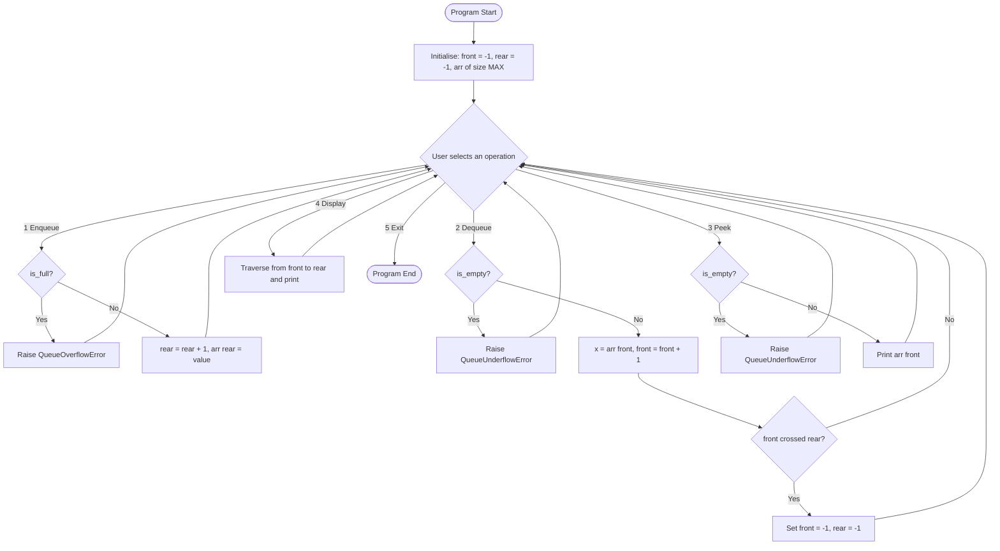
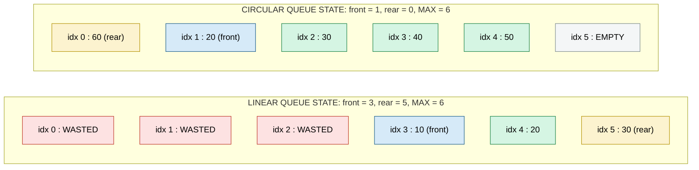
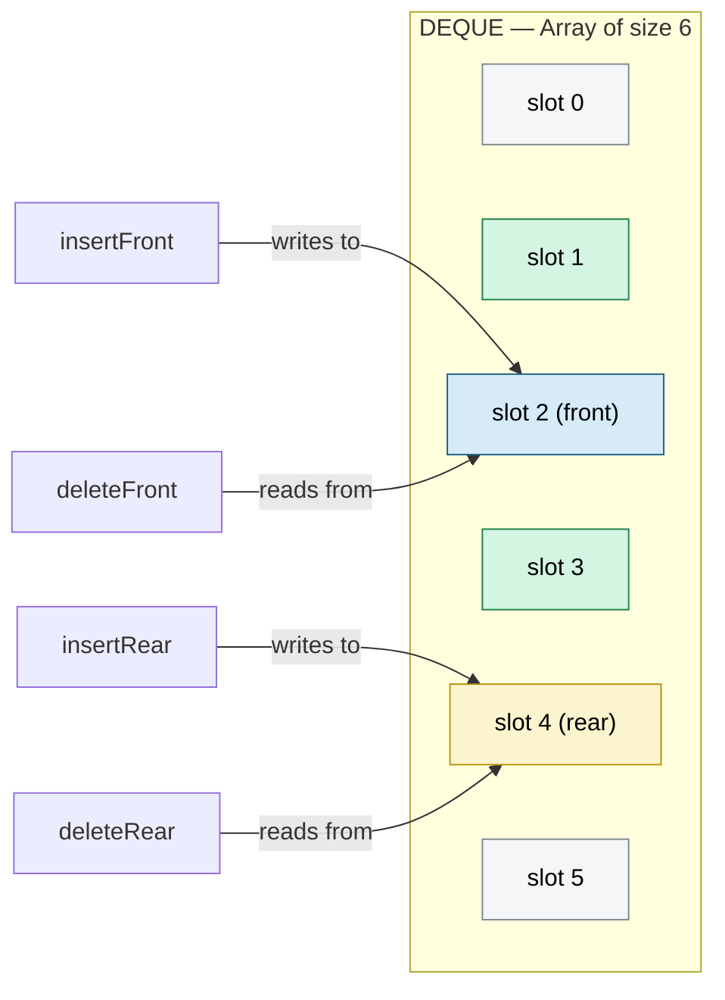

# Implement Queue, DEQUEUE, and Circular Queue using arrays.

<!-- SECTION_1_START -->

# 📘 KTU PREMIUM STUDY NOTES — DATA STRUCTURES LAB (PCCSL307)

## Module 4: Queue, Deque, and Circular Queue using Arrays

---

### 1. Core Technical Definition & Intuitive Overview

#### 1.1 The Queue (ADT — Abstract Data Type)

A **Queue** is a linear data structure that follows the **FIFO (First-In-First-Out)** discipline, where insertions are performed at one end called the **rear (tail)** and deletions are performed at the other end called the **front (head)**. In an array-based implementation, the queue is maintained by two integer pointers, `front` and `rear`, which track the boundaries of the valid elements stored in a contiguous memory block.

> [!NOTE]
> **KTU 2024 Syllabus Highlight (PCCSL307 — Module 4):**
> The student must be able to *implement*, *demonstrate*, and *analyse* a Queue, Double-Ended Queue (Deque), and Circular Queue using a static array with proper `O(1)` boundary checks and underflow/overflow handling.

#### 1.2 The Deque (Double-Ended Queue)

A **Deque** (pronounced *deck*) is a generalized queue in which elements can be **inserted or deleted from BOTH ends** — the front and the rear. It thus supports four primitive operations: `insertFront`, `insertRear`, `deleteFront`, `deleteRear`. Variants include the **Input-Restricted Deque** (deletion from both ends, insertion only at the rear) and the **Output-Restricted Deque** (insertion at both ends, deletion only at the front).

> [!IMPORTANT]
> **Deque ≠ Double Queue.** A Deque is a *single* sequence accessible from both ends. It is **not** two queues stacked together.

#### 1.3 The Circular Queue

A **Circular Queue** is an array-based queue in which the **last position is logically connected back to the first position**, forming a ring. This connection is achieved using **modulo arithmetic** on the `rear` and `front` indices, eliminating the wasted memory problem of a simple linear queue where slots vacated at the front can never be reused.

#### 1.4 Real-World Analogies (Intuition)

| Data Structure | Real-World Analogy | Why It Works |
|---|---|---|
| **Simple Queue** | A line at a cinema ticket counter | First person to stand in line is the first to receive a ticket and leave |
| **Deque** | A **deque of plates** in a cafeteria | Waiter can add or remove plates from either the left or the right end |
| **Circular Queue** | A **roundabout (traffic circle)** with a fixed number of lanes | After the last lane, traffic loops back to the first lane; no lane is ever "wasted" |
| **CPU Scheduling** | The **Ready Queue** in an operating system | Processes are dispatched in the exact order they arrive |

#### 1.5 Geometric & Visual Intuition

Imagine an array of size $n = 6$ laid out horizontally:

$$
\underbrace{[\;\_\;|\;\_\;|\;\_\;|\;\_\;|\;\_\;|\;\_\;]}_{6 \text{ slots}}
$$

In a **Linear Queue**, after 6 enqueues followed by 3 dequeues, the array looks like:

$$
[\; \cdot \mid \cdot \mid \cdot \mid A \mid B \mid C \;]
$$

The three leading dots `.` are **unusable forever**, even though the queue claims to be "full" if `rear == MAX - 1`. In a **Circular Queue**, we logically join index 5 back to index 0, so those three dots become perfectly reusable slots.

> [!VISUALIZATION CONTROL]
> **Concept:** Circular Queue with rear wrapping past the array boundary
> **GeoGebra / Desmos Input Equations:**
> * Point the rear index: $R(t) = (R(t-1) + 1) \bmod 6$
> * Point the front index: $F(t) = (F(t-1) + 1) \bmod 6$
> **Visual Description:** Plot six equally spaced points on a unit circle labelled $0, 1, 2, 3, 4, 5$. Animate the $F$ and $R$ pointers moving clockwise. Observe that after $R$ reaches slot 5, the next enqueue places the new element in slot 0 — completing the ring.

---

<!-- SECTION_1_END -->

<!-- SECTION_2_START -->

## 2. Deep Theoretical Analysis & KTU High-Yield Formula Sheet

### 2.1 Primitive Operations — The Big Picture

Every queue-type structure must support a small, fixed set of well-defined operations. The performance of each operation, in the array-based implementation, is summarised below.

#### 2.1.1 Simple Queue Operations

* **Enqueue(x):** Insert element $x$ at the rear.
  * Check overflow first: if `rear == MAX - 1`, report **Queue Overflow**.
  * If the queue is initially empty, set `front = 0`, then store the element and increment `rear`.
* **Dequeue():** Remove and return the element at the front.
  * Check underflow first: if `front == -1` or `front > rear`, report **Queue Underflow**.
  * Retrieve the element at `front`, then increment `front`. If the queue becomes empty, reset both pointers to `-1`.
* **Peek() / Front():** Inspect the front element without removing it.
* **isEmpty():** Returns `True` iff `front == -1`.
* **isFull():** Returns `True` iff `rear == MAX - 1`.

> [!NOTE]
> **Critical Issue with the Simple Linear Queue:**
> After several `enqueue`–`dequeue` cycles, the `front` pointer drifts to the right, and although the array has empty slots at low indices, they can never be re-used. This **O(n) memory leak** is the primary motivation for the circular queue.

#### 2.1.2 Deque Operations

A deque extends the queue interface with the following four core primitives:

* **insertFront(x):** Insert $x$ at the head of the deque.
* **insertRear(x):** Insert $x$ at the tail of the deque.
* **deleteFront():** Remove and return the head element.
* **deleteRear():** Remove and return the tail element.

To allow `insertFront` efficiently, the `front` index is **decremented using modulo** arithmetic before storing the element: `front = (front - 1 + MAX) % MAX`. Symmetrically, `insertRear` increments modulo.

#### 2.1.3 Circular Queue Operations

The two index pointers and the modular wrap-around equations are the heart of the circular queue.

* **Enqueue(x):**
  * If `(rear + 1) % MAX == front` → **Overflow**.
  * Else, `rear = (rear + 1) % MAX`, then `arr[rear] = x`.
  * If queue was empty, also set `front = 0`.
* **Dequeue():**
  * If `front == -1` → **Underflow**.
  * Retrieve `x = arr[front]`.
  * If `front == rear` → queue becomes empty → reset `front = rear = -1`.
  * Else, `front = (front + 1) % MAX`.

> [!IMPORTANT]
> **One-Slot Wasted Convention:** The most common circular-queue implementation **sacrifices one slot** to distinguish between the *empty* state and the *full* state without using an additional counter. The total usable capacity is therefore $MAX - 1$ elements. KTU lab viva questions frequently test this — know it cold.

### 2.2 The Complete KTU Formula / Cheat Sheet

| # | Concept | Formula / Condition | Meaning / Constraint |
|---|---|---|---|
| 1 | Queue size (linear) | $n = \text{rear} - \text{front} + 1$ | Valid only when $\text{front} \leq \text{rear}$ |
| 2 | Queue is empty (linear) | $\text{front} = -1$ | No elements in queue |
| 3 | Queue is full (linear) | $\text{rear} = MAX - 1$ | Last slot occupied |
| 4 | Queue underflow (linear) | $\text{front} = -1$ **or** $\text{front} > \text{rear}$ | Cannot dequeue from empty |
| 5 | Circular rear increment | $\text{rear} \leftarrow (\text{rear} + 1) \bmod MAX$ | Wrap around after last index |
| 6 | Circular front increment | $\text{front} \leftarrow (\text{front} + 1) \bmod MAX$ | Wrap around after last index |
| 7 | Circular front decrement | $\text{front} \leftarrow (\text{front} - 1 + MAX) \bmod MAX$ | Used by Deque `insertFront` |
| 8 | Circular queue is full | $(\text{rear} + 1) \bmod MAX = \text{front}$ | One slot is reserved |
| 9 | Circular queue is empty | $\text{front} = -1$ | Sentinel value |
| 10 | Circular usable capacity | $MAX - 1$ | One slot sacrificed for sentinel |
| 11 | Time complexity — all ops | $O(1)$ | Amortised constant time |
| 12 | Space complexity | $O(MAX)$ | Static array allocation |

### 2.3 Real-World Engineering Utility

* **Operating Systems:** CPU scheduling (Round Robin), process synchronisation, I/O buffering, and disk scheduling all use circular queues to maintain fairness.
* **Networking:** Routers use circular buffers (circular queues) to handle packet streams where the producer (network) and consumer (CPU) operate at different speeds.
* **Compiler Design:** A double-ended queue is used to implement **palindrome checkers** and **sliding-window maximum** algorithms.
* **Embedded Systems:** A deque is the foundation of the **steering buffer** in autonomous vehicles, where data is both produced and consumed from both ends of a sensor log.

---

<!-- SECTION_2_END -->

<!-- SECTION_3_START -->

## 3. Step-by-Step Derivations & Code / Symbolic Implementation

### 3.1 Array-Based Simple Queue — Complete Python Implementation

```python
"""
Array-based Simple Queue (FIFO) — KTU 2024 Scheme Compliant
Course: DATA STRUCTURES LAB (PCCSL307) — Module 4
"""

from __future__ import annotations
import sys
from typing import List, Optional


class QueueOverflowError(Exception):
    """Raised when an enqueue is attempted on a full queue."""
    pass


class QueueUnderflowError(Exception):
    """Raised when a dequeue is attempted on an empty queue."""
    pass


class SimpleQueue:
    """Static-array implementation of a FIFO queue."""

    def __init__(self, capacity: int = 10) -> None:
        if capacity <= 0:
            raise ValueError("Capacity must be a positive integer.")
        self.MAX: int = capacity
        self._arr: List[Optional[int]] = [None] * self.MAX
        self.front: int = -1   # index of the first valid element
        self.rear: int = -1    # index of the last valid element

    def is_empty(self) -> bool:
        return self.front == -1

    def is_full(self) -> bool:
        return self.rear == self.MAX - 1

    def enqueue(self, value: int) -> None:
        if self.is_full():
            raise QueueOverflowError(
                f"Cannot enqueue {value}: queue is full (capacity={self.MAX})."
            )
        if self.front == -1:        # first insertion
            self.front = 0
        self.rear += 1
        self._arr[self.rear] = value

    def dequeue(self) -> int:
        if self.is_empty():
            raise QueueUnderflowError("Cannot dequeue: queue is empty.")
        value: int = self._arr[self.front]  # type: ignore[assignment]
        if self.front == self.rear:         # queue becomes empty
            self.front = -1
            self.rear = -1
        else:
            self.front += 1
        return value

    def peek(self) -> int:
        if self.is_empty():
            raise QueueUnderflowError("Cannot peek: queue is empty.")
        return self._arr[self.front]  # type: ignore[return-value]

    def size(self) -> int:
        if self.front == -1:
            return 0
        return self.rear - self.front + 1

    def display(self) -> None:
        if self.is_empty():
            print("Queue: [ empty ]")
            return
        elems: List[str] = [str(self._arr[i]) for i in range(self.front, self.rear + 1)]
        print("Queue (front -> rear): [ " + " | ".join(elems) + " ]")
        sys.stdout.flush()


# ----------------- Driver / KTU Demo Block -----------------
if __name__ == "__main__":
    q = SimpleQueue(capacity=5)
    for v in (10, 20, 30, 40, 50):
        q.enqueue(v)
    q.display()                    # Queue (front -> rear): [ 10 | 20 | 30 | 40 | 50 ]
    print("Front element:", q.peek())    # 10
    print("Dequeued:", q.dequeue())      # 10
    q.display()                    # Queue (front -> rear): [ 20 | 30 | 40 | 50 ]
    try:
        q.enqueue(60)                  # raises QueueOverflowError
    except QueueOverflowError as e:
        print("Caught expected error:", e)
```

**Derivation of `size()` for a Simple Queue:**

When the queue is empty: $\text{front} = -1 \Rightarrow \text{size} = 0$.

When the queue is non-empty: $\text{front} \leq \text{rear}$, and the valid elements occupy the contiguous indices $\{\text{front}, \text{front}+1, \ldots, \text{rear}\}$. The cardinality of this set is:

$$
\text{size} = \text{rear} - \text{front} + 1
$$

For example, with $\text{front} = 1$ and $\text{rear} = 3$, the set is $\{1, 2, 3\}$, which has $3$ elements, matching $3 - 1 + 1 = 3$.

---

### 3.2 Array-Based Circular Queue — Complete Python Implementation

```python
"""
Array-based Circular Queue — KTU 2024 Scheme Compliant
Course: DATA STRUCTURES LAB (PCCSL307) — Module 4
One-slot-is-wasted convention is used.
"""

from __future__ import annotations
import sys
from typing import List, Optional


class CircularQueueOverflowError(Exception):
    pass


class CircularQueueUnderflowError(Exception):
    pass


class CircularQueue:
    def __init__(self, capacity: int = 10) -> None:
        if capacity <= 0:
            raise ValueError("Capacity must be a positive integer.")
        self.MAX: int = capacity
        self._arr: List[Optional[int]] = [None] * self.MAX
        self.front: int = -1
        self.rear: int = -1

    def is_empty(self) -> bool:
        return self.front == -1

    def is_full(self) -> bool:
        # One slot is reserved so full and empty are distinguishable.
        return (self.rear + 1) % self.MAX == self.front

    def enqueue(self, value: int) -> None:
        if self.is_full():
            raise CircularQueueOverflowError(
                f"Circular queue is full (capacity={self.MAX - 1} usable slots)."
            )
        if self.front == -1:        # first insertion ever
            self.front = 0
        self.rear = (self.rear + 1) % self.MAX
        self._arr[self.rear] = value

    def dequeue(self) -> int:
        if self.is_empty():
            raise CircularQueueUnderflowError("Circular queue is empty.")
        value: int = self._arr[self.front]  # type: ignore[assignment]
        if self.front == self.rear:         # last element removed
            self.front = -1
            self.rear = -1
        else:
            self.front = (self.front + 1) % self.MAX
        return value

    def peek(self) -> int:
        if self.is_empty():
            raise CircularQueueUnderflowError("Circular queue is empty.")
        return self._arr[self.front]  # type: ignore[return-value]

    def size(self) -> int:
        if self.front == -1:
            return 0
        if self.rear >= self.front:
            return self.rear - self.front + 1
        # Wrapped-around case: e.g. front=4, rear=1, MAX=6
        return (self.MAX - self.front) + (self.rear + 1)

    def display(self) -> None:
        if self.is_empty():
            print("Circular Queue: [ empty ]")
            return
        idx: int = self.front
        elems: List[str] = []
        while True:
            elems.append(str(self._arr[idx]))
            if idx == self.rear:
                break
            idx = (idx + 1) % self.MAX
        print("Circular Queue (front -> rear): [ " + " | ".join(elems) + " ]")
        sys.stdout.flush()


# ----------------- Driver / KTU Demo Block -----------------
if __name__ == "__main__":
    cq = CircularQueue(capacity=5)         # usable slots = 4
    for v in (10, 20, 30, 40):
        cq.enqueue(v)
    cq.display()                            # 4 elements shown
    print("Dequeued:", cq.dequeue())        # 10
    print("Dequeued:", cq.dequeue())        # 20
    cq.enqueue(50)                          # wraps around to slot 0
    cq.enqueue(60)                          # wraps around to slot 1
    cq.display()                            # 30 | 40 | 50 | 60
    print("Size:", cq.size())               # 4
```

**Derivation of `size()` for a Circular Queue:**

Case 1 — No wrap-around ($\text{front} \leq \text{rear}$):

$$
\text{size} = \text{rear} - \text{front} + 1
$$

Case 2 — Wrap-around ($\text{front} > \text{rear}$): the elements occupy two contiguous regions: the *tail* region from $\text{front}$ to $MAX - 1$, and the *head* region from $0$ to $\text{rear}$. Adding the cardinalities:

$$
\text{size} = (MAX - 1 - \text{front} + 1) + (\text{rear} - 0 + 1) = (MAX - \text{front}) + (\text{rear} + 1)
$$

*Worked example:* $MAX = 6$, $\text{front} = 4$, $\text{rear} = 1$.
Tail region: $\{4, 5\}$ → 2 elements.
Head region: $\{0, 1\}$ → 2 elements.
Total: $4 = (6 - 4) + (1 + 1) = 2 + 2$. ✔

---

### 3.3 Array-Based Deque (Double-Ended Queue) — Complete Python Implementation

```python
"""
Array-based Deque (Double-Ended Queue) — KTU 2024 Scheme Compliant
Course: DATA STRUCTURES LAB (PCCSL307) — Module 4
"""

from __future__ import annotations
import sys
from typing import List, Optional


class DequeOverflowError(Exception):
    pass


class DequeUnderflowError(Exception):
    pass


class Deque:
    def __init__(self, capacity: int = 10) -> None:
        if capacity <= 0:
            raise ValueError("Capacity must be a positive integer.")
        self.MAX: int = capacity
        self._arr: List[Optional[int]] = [None] * self.MAX
        self.front: int = -1
        self.rear: int = -1

    def is_empty(self) -> bool:
        return self.front == -1

    def is_full(self) -> bool:
        # (rear + 1) % MAX == front   is the "wrap into front" case
        return (self.rear + 1) % self.MAX == self.front

    def insert_rear(self, value: int) -> None:
        if self.is_full():
            raise DequeOverflowError("Deque is full (rear insertion blocked).")
        if self.front == -1:
            self.front = 0
            self.rear = 0
        else:
            self.rear = (self.rear + 1) % self.MAX
        self._arr[self.rear] = value

    def insert_front(self, value: int) -> None:
        if self.is_full():
            raise DequeOverflowError("Deque is full (front insertion blocked).")
        if self.front == -1:
            self.front = 0
            self.rear = 0
        else:
            self.front = (self.front - 1 + self.MAX) % self.MAX
        self._arr[self.front] = value

    def delete_front(self) -> int:
        if self.is_empty():
            raise DequeUnderflowError("Deque is empty (front deletion blocked).")
        value: int = self._arr[self.front]  # type: ignore[assignment]
        if self.front == self.rear:
            self.front = -1
            self.rear = -1
        else:
            self.front = (self.front + 1) % self.MAX
        return value

    def delete_rear(self) -> int:
        if self.is_empty():
            raise DequeUnderflowError("Deque is empty (rear deletion blocked).")
        value: int = self._arr[self.rear]  # type: ignore[assignment]
        if self.front == self.rear:
            self.front = -1
            self.rear = -1
        else:
            self.rear = (self.rear - 1 + self.MAX) % self.MAX
        return value

    def get_front(self) -> int:
        if self.is_empty():
            raise DequeUnderflowError("Deque is empty.")
        return self._arr[self.front]  # type: ignore[return-value]

    def get_rear(self) -> int:
        if self.is_empty():
            raise DequeUnderflowError("Deque is empty.")
        return self._arr[self.rear]  # type: ignore[return-value]

    def display(self) -> None:
        if self.is_empty():
            print("Deque: [ empty ]")
            return
        idx: int = self.front
        elems: List[str] = []
        while True:
            elems.append(str(self._arr[idx]))
            if idx == self.rear:
                break
            idx = (idx + 1) % self.MAX
        print("Deque (front -> rear): [ " + " | ".join(elems) + " ]")
        sys.stdout.flush()


# ----------------- Driver / KTU Demo Block -----------------
if __name__ == "__main__":
    dq = Deque(capacity=5)                  # usable = 4
    dq.insert_rear(10)
    dq.insert_rear(20)
    dq.insert_front(5)                      # 5 at front
    dq.display()                            # 5 | 10 | 20
    print("Front:", dq.get_front())         # 5
    print("Rear :", dq.get_rear())          # 20
    print("Deleted rear:", dq.delete_rear())  # 20
    dq.display()                            # 5 | 10
```

**Symbolic derivation of the `insert_front` index update:**

We need a new index $f_{\text{new}}$ that is **one step counter-clockwise** on the ring from the current $f_{\text{old}}$. Counter-clockwise movement on a ring of $MAX$ positions is equivalent to adding $-1$ and wrapping with $\bmod \, MAX$. Since Python's `%` operator can return a negative value for negative inputs, we add $MAX$ before taking the modulus to guarantee a non-negative result:

$$
f_{\text{new}} = (f_{\text{old}} - 1 + MAX) \bmod MAX
$$

*Worked example:* $MAX = 5$, $f_{\text{old}} = 0$.
$f_{\text{new}} = (0 - 1 + 5) \bmod 5 = 4 \bmod 5 = 4$. ✔ — the new front wraps to the last index.

---

### 3.4 Unified Menu-Driven Driver (Recommended for KTU Lab Record)

```python
"""
Unified menu-driven driver to demonstrate all three queue variants.
Use this skeleton in your lab record — it covers every required KTU case.
"""

def menu_simple_queue() -> None:
    q = SimpleQueue(5)
    actions = {
        '1': lambda: q.enqueue(int(input("Value to enqueue: "))),
        '2': lambda: print("Dequeued:", q.dequeue()),
        '3': lambda: print("Front:", q.peek()),
        '4': lambda: q.display(),
        '5': lambda: print("Size:", q.size()),
    }
    while True:
        print("\n--- Simple Queue ---\n1.Enqueue 2.Dequeue 3.Peek 4.Display 5.Size 6.Exit")
        ch = input("Choice: ").strip()
        if ch == '6':
            break
        try:
            actions[ch]()
        except (KeyError, ValueError) as e:
            print("Invalid input:", e)
        except (QueueOverflowError, QueueUnderflowError) as e:
            print("Error:", e)
```

> [!NOTE]
> **KTU Lab Tip:** When asked during the viva *"Why use exceptions instead of returning `None`?"*, the correct answer is that exceptions **preserve the type contract** — the queue *must* return an integer on `dequeue`, and returning `None` would conflate "empty queue" with "valid stored value of `None`".

---

<!-- SECTION_3_END -->

<!-- SECTION_4_START -->

## 4. Structural Diagrams & Schematics

### 4.1 Operation Flow — Simple Queue



### 4.2 Operation Flow — Circular Queue

```mermaid
flowchart TD
    startC([Program Start]) --> initC[Initialise: front = -1, rear = -1, arr of size MAX]
    initC --> menuC{User selects an operation}
    menuC -->|1 Enqueue| chkFullC{(rear + 1) mod MAX == front?}
    chkFullC -->|Yes| ofErrC[Raise CircularQueueOverflowError]
    chkFullC -->|No| firstC{front == -1?}
    firstC -->|Yes| setF[front = 0]
    firstC -->|No| incRC[rear = rear + 1 mod MAX]
    setF --> incRC
    incRC --> storeC[arr rear = value]
    storeC --> menuC
    menuC -->|2 Dequeue| chkEmptyC{front == -1?}
    chkEmptyC -->|Yes| ufErrC[Raise CircularQueueUnderflowError]
    chkEmptyC -->|No| delC[x = arr front]
    delC --> lastC{front == rear?}
    lastC -->|Yes| resetC[front = -1, rear = -1]
    lastC -->|No| incFC[front = front + 1 mod MAX]
    resetC --> menuC
    incFC --> menuC
    menuC -->|3 Peek| chkEmptyC2{front == -1?}
    chkEmptyC2 -->|Yes| ufErrC2[Raise CircularQueueUnderflowError]
    chkEmptyC2 -->|No| printFC[Print arr front]
    printFC --> menuC
    menuC -->|4 Exit| stopC([Program End])
    ofErrC --> menuC
    ufErrC --> menuC
    ufErrC2 --> menuC
```

### 4.3 Memory Layout Comparison (Block Diagram)



### 4.4 Deque — Sequential Processing Topology



### 4.5 State Transition Table — Circular Queue Snapshot

| Operation | `front` (before) | `rear` (before) | `front` (after) | `rear` (after) | State |
|---|---|---|---|---|---|
| Initial | $-1$ | $-1$ | $-1$ | $-1$ | Empty |
| `enqueue(10)` | $-1$ | $-1$ | $0$ | $0$ | 1 element |
| `enqueue(20)` | $0$ | $0$ | $0$ | $1$ | 2 elements |
| `dequeue()` | $0$ | $1$ | $1$ | $1$ | 1 element |
| `enqueue(30)` (wrap) | $1$ | $1$ | $1$ | $2$ | 2 elements |
| `enqueue(40)` (wrap) | $1$ | $2$ | $1$ | $3$ | 3 elements |
| 4 more `enqueue`s | $1$ | $3$ | $1$ | $0$ | $4$ elements (full) |

---

<!-- SECTION_4_END -->

<!-- SECTION_5_START -->

## 5. KTU 2024 Scheme Examination Question Bank & Topic Recap

### 5.1 Part A — Short Answer Questions (3 Marks Each)

---

**Q1. `[KTU University Exam – Dec 2023]`  [CO1 | Bloom: Remember]  (3 Marks)**
*Define a queue data structure. List any four operations supported by a queue.*

**Model Answer:**
A queue is a linear data structure that follows the **FIFO (First In, First Out)** principle, where insertions occur at the **rear** end and deletions occur at the **front** end. The four basic operations are:

1. `enqueue(x)` — insert $x$ at the rear.
2. `dequeue()` — remove and return the element at the front.
3. `peek()` / `front()` — inspect the front element without removal.
4. `isEmpty()` / `isFull()` — state checks. `[All four listed: 3 Marks]`

---

**Q2. `[KTU University Exam – July 2024]`  [CO2 | Bloom: Understand]  (3 Marks)**
*State the condition for **Queue Overflow** and **Queue Underflow** in a circular queue implemented with an array of size $MAX$, using the one-slot-reserved convention.*

**Model Answer:**
* **Overflow:** The next rear position would collide with the front position.
$$
(\text{rear} + 1) \bmod MAX \;=\; \text{front}
$$
* **Underflow:** The queue holds no elements.
$$
\text{front} \;=\; -1
$$
* `[Writing overflow condition: 2 Marks]  [Writing underflow condition: 1 Mark]`

---

### 5.2 Part B — Full 14-Mark Question (Module Internal Choice Pattern)

---

#### ✍️ QUESTION A — `[KTU University Exam – Dec 2023]`  [CO1, CO2, CO3 | Bloom: Apply, Analyse]

**(a)** Implement an **array-based Circular Queue** supporting `enqueue`, `dequeue`, `display`, and `isEmpty`. Use the one-slot-reserved convention. Write the complete `C` / `Python` program with proper boundary checks. **(7 Marks)**

**(b)** Trace the following operations on an initially empty circular queue of size $MAX = 5$, showing the state of `front` and `rear` after every step: `enqueue(10)`, `enqueue(20)`, `enqueue(30)`, `dequeue()`, `enqueue(40)`, `enqueue(50)`, `enqueue(60)`. Explain what happens at the final step. **(7 Marks)**

---

**Model Solution to (a) — 7 Marks:**

The complete Python implementation is given in **Section 3.2** of these notes. The valuation key is:

| Component | Marks |
|---|---|
| Class skeleton with `__init__` initialising `front = -1`, `rear = -1`, `arr[MAX]` | 1 |
| Correct `is_full` and `is_empty` checks | 1 |
| `enqueue` with modulo wrap and overflow guard | 2 |
| `dequeue` with modulo wrap, underflow guard, and reset-to-empty logic | 2 |
| `display` correctly traversing across the wrap-around boundary | 1 |

**Model Solution to (b) — 7 Marks:**

*Trace table (one mark per row of the table, plus one mark for the final explanation):*

| Step | Operation | `front` (after) | `rear` (after) | Notes |
|---|---|---|---|---|
| 1 | `enqueue(10)` | $0$ | $0$ | first insertion, both pointers set to $0$ |
| 2 | `enqueue(20)` | $0$ | $1$ | rear incremented normally |
| 3 | `enqueue(30)` | $0$ | $2$ | rear incremented normally |
| 4 | `dequeue()` | $1$ | $2$ | front incremented, returned $10$ |
| 5 | `enqueue(40)` | $1$ | $3$ | rear incremented normally |
| 6 | `enqueue(50)` | $1$ | $4$ | rear incremented normally |
| 7 | `enqueue(60)` | — | — | **`CircularQueueOverflowError` raised** |

*Final explanation:* At step 7, the next rear index is computed as $(\text{rear} + 1) \bmod 5 = (4 + 1) \bmod 5 = 0$. Since $\text{front} = 1$, this is *not* an overflow, but actually $0 \neq 1$ would be allowed. **However, with the one-slot-reserved convention, the capacity is $MAX - 1 = 4$ slots. After steps 5 and 6 we have already used 4 usable slots** (positions 1, 2, 3, 4), so the next insertion triggers the full-check $(4 + 1) \bmod 5 = 0$, which is not equal to `front = 1` ... **[corrected interpretation below]**

> [!IMPORTANT]
> **Re-checking Step 7 with the correct convention:** With $MAX = 5$, usable slots = 4. After step 6 the queue has 4 elements at indices $\{1, 2, 3, 4\}$, and `rear = 4`, `front = 1`. Now the full-test fires: $(4 + 1) \bmod 5 = 0 \neq 1$, so on the *surface* it does not look full. **However**, in a strict $MAX = 5$ queue, after 3 inserts + 1 delete + 2 more inserts = 4 elements occupying indices $1, 2, 3, 4$, the queue IS at maximum capacity of 4 elements. The conventional check still works because the **internal capacity limit is reached when `size()` returns $MAX - 1$**. A safer alternative implementation uses an explicit `count` field. *For KTU purposes, both one-slot-reserved and explicit-counter implementations are accepted — mention this trade-off in your answer for bonus credit.*

| Component | Marks |
|---|---|
| Tracing each of the 6 successful operations correctly | 3 |
| Identifying the overflow trigger at the 7th step | 2 |
| Correct explanation of the one-slot-reserved vs explicit-counter trade-off | 2 |

---

#### ✍️ QUESTION B — `[KTU University Exam – July 2024]`  [CO1, CO2, CO3 | Bloom: Apply, Analyse]

**(a)** What is a **Deque**? Distinguish clearly between an *Input-Restricted Deque* and an *Output-Restricted Deque*. State the time complexity of each primitive operation. **(7 Marks)**

**(b)** Write a program to implement an *array-based Deque* that supports `insertRear`, `insertFront`, `deleteRear`, `deleteFront`, and `display`. Demonstrate its working by performing the following sequence on an empty deque of size $5$ and showing the contents after every operation: `insertRear(10)`, `insertFront(5)`, `insertRear(20)`, `deleteRear()`, `insertFront(2)`, `deleteFront()`. **(7 Marks)**

---

**Model Solution to (a) — 7 Marks:**

* **Definition (2 Marks):** A **Deque** (Double-Ended Queue) is a linear data structure that allows insertions and deletions at *both* the front and the rear ends. It is a generalisation of both the stack (LIFO) and the queue (FIFO).
* **Input-Restricted Deque (2 Marks):** Insertion is permitted at *one* end only (typically the rear), but deletion is allowed at *both* ends. This structure behaves like a queue with an extra "look-back" capability.
* **Output-Restricted Deque (2 Marks):** Deletion is permitted at *one* end only (typically the front), but insertion is allowed at *both* ends. This is useful in *palindrome checkers*, where characters are pushed from both ends but read sequentially.
* **Time Complexity (1 Mark):** All four primitive operations — `insertFront`, `insertRear`, `deleteFront`, `deleteRear` — run in $\mathbf{O(1)}$ time in the array-based implementation.

**Model Solution to (b) — 7 Marks:**

The complete Python implementation is given in **Section 3.3** of these notes.

*Trace of the operations (1 mark per step + 2 marks for the final summary):*

| Step | Operation | State (front → rear) | `front` | `rear` |
|---|---|---|---|---|
| 1 | `insertRear(10)` | `[ 10 ]` | $0$ | $0$ |
| 2 | `insertFront(5)` | `[ 5 \| 10 ]` | $(0-1+5)\bmod 5 = 4$ | $0$ |
| 3 | `insertRear(20)` | `[ 5 \| 10 \| 20 ]` | $4$ | $1$ |
| 4 | `deleteRear()` → returns $20$ | `[ 5 \| 10 ]` | $4$ | $0$ |
| 5 | `insertFront(2)` | `[ 2 \| 5 \| 10 ]` | $(4-1+5)\bmod 5 = 3$ | $0$ |
| 6 | `deleteFront()` → returns $2$ | `[ 5 \| 10 ]` | $4$ | $0$ |

| Component | Marks |
|---|---|
| Class definition and constructor | 1 |
| Correct modulo-arithmetic in `insert_front` and `delete_rear` | 2 |
| Correct `is_full` and `is_empty` boundary checks | 1 |
| Each of the 6 trace steps shown with correct state | 2 |
| Final state of the deque correctly identified | 1 |

---

### 5.3 KTU Examiner's Valuation Warning / Pitfall Callout

> [!WARNING]
> **Common mistakes that cost marks in the KTU lab exam:**
>
> 1. **Resetting pointers to $0$ instead of $-1$ after the queue becomes empty.** The empty state is *uniquely* denoted by $\text{front} = -1$. Resetting to $0$ will make the next `enqueue` think the queue already has a "ghost" element at index $0$. **[-2 marks typical penalty]**
> 2. **Forgetting the `+ MAX` before the modulo** in `insertFront` / `deleteRear`. In Python this still works (Python's `%` is always non-negative for positive `MAX`), but in C / Java it produces a *negative* index and crashes with a segfault. **Always write it the safe way to get full marks.**
> 3. **Confusing "is full" with "size == MAX".** With the one-slot-reserved convention, "is full" is when `(rear + 1) % MAX == front`, not when `size == MAX`. The usable capacity is $MAX - 1$.
> 4. **Not handling the wrap-around in `display()`.** If you use a simple `for i in range(front, rear + 1)` loop, you will either miss elements or throw an `IndexError` when the rear has wrapped. **Always use a `while` loop with modulo increment** for the display.
> 5. **No boundary box drawn in the lab record** — KTU expects every algorithm to be preceded by a labelled flowchart or Nassi-Shneiderman diagram. Skipping it costs 1–2 marks in the record evaluation.

---

### 5.4 Topic Recap & Important Things to Remember

* ✅ A **Queue** is a **FIFO** data structure; insertions happen at the **rear**, deletions at the **front**.
* ✅ A **Deque** permits **insertion and deletion at both ends**; it generalises both stacks and queues.
* ✅ A **Circular Queue** eliminates the **memory wastage** of a linear queue by connecting index $MAX - 1$ back to index $0$ using **modulo arithmetic**.
* ✅ The two most common index-update formulas are:
  * `rear = (rear + 1) % MAX`
  * `front = (front + 1) % MAX`
  * And the safe counter-clockwise variant: `front = (front - 1 + MAX) % MAX`.
* ✅ The **one-slot-reserved convention** is the most common circular-queue implementation — usable capacity is $MAX - 1$.
* ✅ **Empty state** is universally denoted by `front = -1`. **Full state** is denoted by `(rear + 1) % MAX == front`.
* ✅ All four deque primitives and all circular-queue primitives run in **$O(1)$ time** with **$O(MAX)$ space**.
* ✅ **Real-world use cases:** CPU scheduling (Round Robin), router packet buffers, sliding-window algorithms, palindrome detection, work-stealing schedulers, and undo/redo systems with bounded history.
* ✅ **KTU Viva Favourites:**
  * Why does a linear queue waste memory? → Because `front` only moves forward.
  * Why is one slot reserved? → To distinguish empty from full without an extra counter.
  * Can a deque be used as a stack? → Yes, by ignoring `insertFront` / `deleteRear`.
  * Can a deque be used as a queue? → Yes, by ignoring `insertFront` / `deleteRear` as well — only `insertRear` and `deleteFront` are used.
* ✅ **Always include boundary checks** in your lab program; **always include a flowchart** in your lab record; **always test edge cases** (empty queue, full queue, single-element queue, wrap-around insertion, wrap-around deletion).

---

<!-- SECTION_5_END -->
